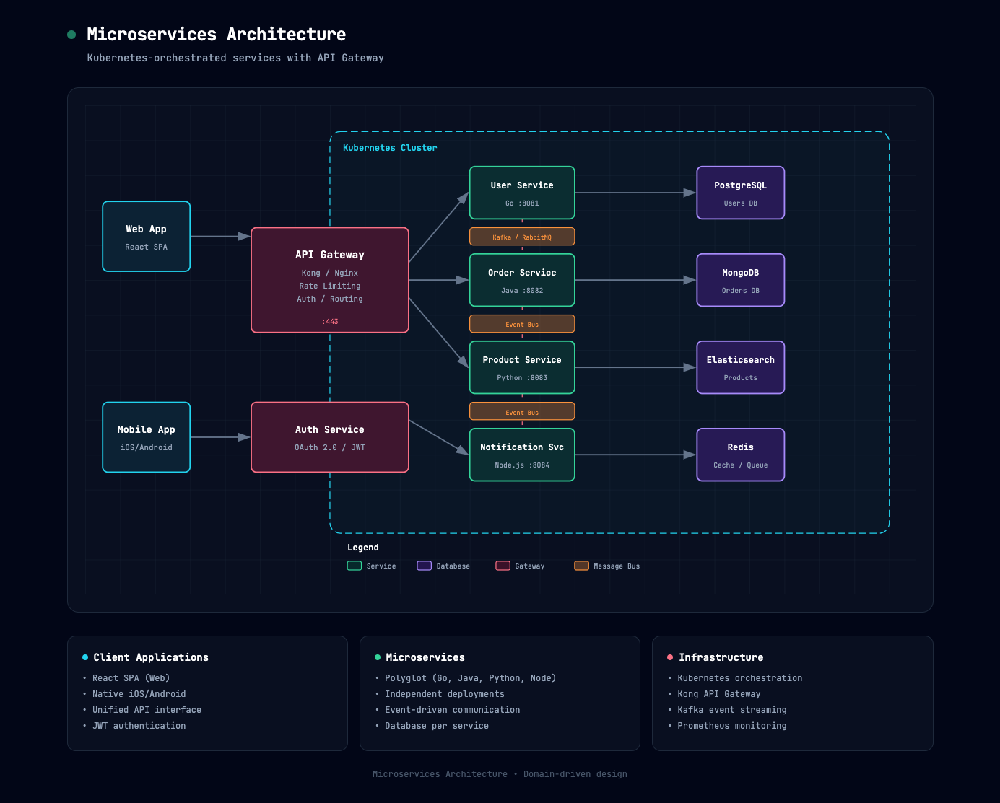
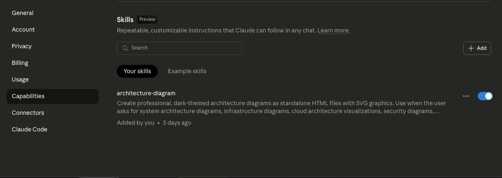

# Architecture Diagram Generator

**Need an architecture diagram? Get AI to build you one.**

Use [Claude.ai](https://claude.ai) with this special skill to generate professional architecture diagrams in seconds. Describe your system, and Claude creates a beautiful, dark-themed diagram as a standalone HTML file you can open in any browser.

- **No design skills needed** — just describe your architecture in plain English
- **Iterate quickly** — ask Claude to add components, change layouts, or update styles
- **Share easily** — output is a single HTML file, no special software required


## 🚀 Quick Start (3 Steps)

### Step 1: Install the Skill

> ⚠️ Requires Claude Pro, Max, Team, or Enterprise plan

1. Download [`architecture-diagram.zip`](architecture-diagram.zip)
2. Go to [claude.ai](https://claude.ai) → **Settings** → **Capabilities** → **Skills**
3. Click **+ Add** and upload the zip file
4. Toggle the skill on

📚 Need help? See the [full installation guide](#-installation) below.

### Step 2: Get Text that Describes Your Architecture

You just need a text description of your system. Pick whichever works for you:

**Option A: Have AI analyze your codebase**

Open your code in Cursor, Claude Code, Windsurf, or ChatGPT and ask:

```
Analyze this codebase and describe the architecture. Include all major
components, how they connect, what technologies they use, and any cloud
services or integrations. Format as a list for an architecture diagram.
```

**Option B: Write it yourself**

Just list your components and how they connect:

```
- React frontend talking to a Node.js API
- PostgreSQL database
- Redis for caching
- Hosted on AWS with CloudFront CDN
```

**Option C: Ask for a typical architecture**

Don't have a specific system? Ask Claude for a starting point:

```
What's a typical architecture for a SaaS application?
```

### Step 3: Generate Your Diagram by Asking Claude to Use the Skill 

Take the output from Step 2 and paste it into [Claude](https://claude.ai) (with the Architecture Diagram Generator skill installed):

```
Use your architecture diagram skill to create an architecture diagram from this description:

[PASTE YOUR ARCHITECTURE DESCRIPTION HERE]
```

That's it! Claude will generate a beautiful HTML file you can open in any browser.

Then!  You can iterate simply by using chat.   Ask Claude:  Please update XYZ to see your diagram update in real time.  You can ask Claude to fix any issues you have with the diagram as well.  

---

### Example Prompts for Common Scenarios

**For a web app:**

```
Create an architecture diagram for a web application with:
- React frontend
- Node.js/Express API
- PostgreSQL database
- Redis cache
- JWT authentication
```

**For AWS serverless:**

```
Create an architecture diagram showing:
- CloudFront CDN
- API Gateway
- Lambda functions (Node.js)
- DynamoDB
- S3 for static assets
- Cognito for auth
```

**For microservices:**

```
Create an architecture diagram for a microservices system with:
- React web app and mobile clients
- Kong API Gateway
- User Service (Go), Order Service (Java), Product Service (Python)
- PostgreSQL, MongoDB, and Elasticsearch databases
- Kafka for event streaming
- Kubernetes orchestration
```

---

## 📸 Examples

### Web Application (React + Node.js + PostgreSQL)


### AWS Serverless (Lambda + API Gateway + DynamoDB)


### Microservices (Kubernetes + API Gateway)



## ✨ Features

- **Beautiful dark theme** — Slate-950 background with subtle grid pattern
- **Semantic color coding** — Consistent colors for frontend, backend, database, cloud, and security components
- **Self-contained output** — Single HTML file with embedded CSS and inline SVG
- **No dependencies** — Opens in any modern browser, no JavaScript required
- **Professional typography** — JetBrains Mono for that technical aesthetic
- **Smart layering** — Arrows render cleanly behind component boxes

## 🎨 Color Palette

| Component Type | Color   | Use For                           |
| -------------- | ------- | --------------------------------- |
| Frontend       | Cyan    | Client apps, UI, edge devices     |
| Backend        | Emerald | Servers, APIs, services           |
| Database       | Violet  | Databases, storage, AI/ML         |
| Cloud/AWS      | Amber   | Cloud services, infrastructure    |
| Security       | Rose    | Auth, security groups, encryption |
| External       | Slate   | Generic, external systems         |

## 📦 Installation

> ⚠️ **Requires:** Claude Pro, Max, Team, or Enterprise plan

> 📚 **New to Claude Skills?** Check out the official guide: [Using Skills in Claude](https://support.claude.com/en/articles/12512180-using-skills-in-claude)

### Claude.ai (Recommended)

1. Download [`architecture-diagram.zip`](architecture-diagram.zip)
2. Go to **Settings** → **Capabilities** → scroll down to **Skills**
3. Click **+ Add** and upload the zip file
4. Toggle the skill on



### Claude.ai Projects (Alternative)

1. In your Claude.ai Project, upload the [`architecture-diagram.zip`](architecture-diagram.zip) to the Project Knowledge

### Claude Code CLI

Extract to your skills directory:

```bash
# Global skills
unzip architecture-diagram.zip -d ~/.claude/skills/

# Or project-local
unzip architecture-diagram.zip -d ./.claude/skills/
```

### Manual Setup

Simply ensure both files are accessible to Claude:

```
architecture-diagram/
├── SKILL.md              # Skill instructions
└── assets/
    └── template.html     # Base template
```

## 💾 Output

Claude generates a self-contained HTML file that you can:

- Open directly in any browser
- Share with teammates (just send the file!)
- Include in documentation
- Print or export to PDF
- Host on any static site

## 📐 What's Included in Output

Each generated diagram includes:

1. **Header** — Project title with animated status indicator
2. **Main diagram** — SVG with all components and connections
3. **Summary cards** — 3 info cards highlighting key details
4. **Footer** — Project metadata

## 🛠 Customization

The skill uses a consistent design system, but Claude will adapt:

- **Layout** — Components positioned based on your system's flow
- **Connections** — Arrows showing data flow and relationships
- **Labels** — Protocols, ports, and annotations
- **Groupings** — Security groups, cloud regions, bounded contexts

## 📄 Example Output

The generated HTML structure:

```html
<!DOCTYPE html>
<html>
  <head>
    <!-- Embedded styles, Google Fonts -->
  </head>
  <body>
    <div class="container">
      <div class="header"><!-- Title --></div>
      <div class="diagram-container">
        <svg><!-- Architecture diagram --></svg>
      </div>
      <div class="cards"><!-- Summary cards --></div>
      <p class="footer"><!-- Metadata --></p>
    </div>
  </body>
</html>
```

## 🔧 Technical Details

- **SVG viewBox:** Typically 1000-1100px wide, scales responsively
- **Font:** JetBrains Mono (loaded from Google Fonts)
- **Background:** `#020617` with 40px grid pattern
- **Z-ordering:** Arrows drawn first, masked by opaque backgrounds under transparent component fills

## 📝 License

MIT License — Free to use, modify, and distribute.

## 👥 Contributing

Suggestions and improvements welcome! Feel free to:

- Open an issue for bugs or feature requests
- Submit a PR with enhancements
- Share your generated diagrams

## 📬 Contact

**Cocoon AI**
📧 hello@cocoon-ai.com

---

Made with ❤️ by [Cocoon AI](mailto:hello@cocoon-ai.com)
