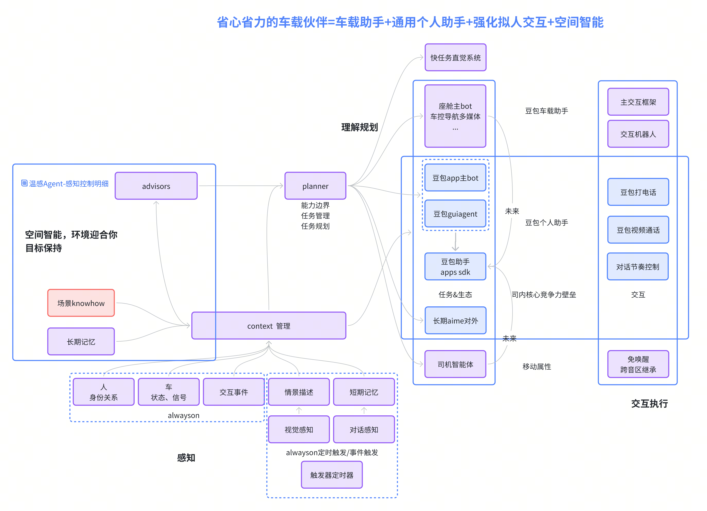

#  AI汽车核心产品功能概述

### 

### 
空间智能的衡量标准，这个空间对环境总的信息处理量，AI占比越高，大脑被释放越多，越智能；
空间智能的衡量标准，这个空间对环境总的信息处理量，AI占比越高，大脑被释放越多，越智能；
  a、单位时间处理信息量更多
  a、单位时间处理信息量更多
  b、处理单位信息量AI占比更高
  b、处理单位信息量AI占比更高
  c、可处理信息的边界更广
  c、可处理信息的边界更广

### 
AI汽车 → 汽车长了脑子 → 让汽车活了，帮你动脑子
AI汽车 → 汽车长了脑子 → 让汽车活了，帮你动脑子
松弛
松弛
-让乘客省心省力，做什么都被加持的移动空间智能体（豆包动脑子动手，乘客少动脑子少动手）
-让乘客省心省力，做什么都被加持的移动空间智能体（豆包动脑子动手，乘客少动脑子少动手）
相对于现在小鹏、理想、小米的助手，本质区别是机械智能无法恰当好处的融合到汽车空间的方方面面交互任务细节中去，通过Agent的推理思考，做到什么事情都帮你多想一步多做一步；
当前产品：无法提供更多的脑力体力帮助，只能局部的通过规则实现最优解

相对于现在小鹏、理想、小米的助手，本质区别是机械智能无法恰当好处的融合到汽车空间的方方面面交互任务细节中去，通过Agent的推理思考，做到什么事情都帮你多想一步多做一步；
当前产品：无法提供更多的脑力体力帮助，只能局部的通过规则实现最优解

自由
自由
-让乘客自由无束缚，在车里什么都能做的移动空间智能体（豆包连接生态，乘客更多需求都能被满足）
-让乘客自由无束缚，在车里什么都能做的移动空间智能体（豆包连接生态，乘客更多需求都能被满足）
现有智能汽车，在注意力有限释放的情况下，仍然能做的事情很有限，区别是突破自由的束缚，通过agent，能代理用户的信息连接、内容娱乐、生态服务需求，能变成个性的百变空间；
当前产品：无法代理需要高注意力的“手机”需求；无法变成用户在外的自由空间

探索
现有智能汽车，在注意力有限释放的情况下，仍然能做的事情很有限，区别是突破自由的束缚，通过agent，能代理用户的信息连接、内容娱乐、生态服务需求，能变成个性的百变空间；
当前产品：无法代理需要高注意力的“手机”需求；无法变成用户在外的自由空间

探索
-让乘客发现惊喜，帮你探索未知物理/虚拟世界的移动空间智能体（豆包连接生态，乘客更多需求都能被满足）
-让乘客发现惊喜，帮你探索未知物理/虚拟世界的移动空间智能体（豆包连接生态，乘客更多需求都能被满足）
当前产品只能被动响应需求，无法结合用户偏好与出行场景，通过Agent的主动思考和探索，可以主动挖掘物理场景的隐藏价值（如小众打卡点、特色服务）和虚拟世界的新鲜内容（如找到了用户关心的小说的一个解读）；
当前产品：无法主动带用户探索和发现惊喜，能体验的东西很有限

好玩
-让乘客感受陪伴和有趣，提供精神情绪价值的移动空间智能体（豆包情感陪伴，提供精神满足）
当前产品只能被动响应需求，无法结合用户偏好与出行场景，通过Agent的主动思考和探索，可以主动挖掘物理场景的隐藏价值（如小众打卡点、特色服务）和虚拟世界的新鲜内容（如找到了用户关心的小说的一个解读）；
当前产品：无法主动带用户探索和发现惊喜，能体验的东西很有限

好玩
-让乘客感受陪伴和有趣，提供精神情绪价值的移动空间智能体（豆包情感陪伴，提供精神满足）
现有的AI助手都仍然是语音遥控器加上大模型闲聊“兜底”，仍然是死板和沉闷，基于预定义的规则偶尔体现情趣，通过Agent对用户的熟悉，可以主动提供有趣的陪伴，让每个交互细节都有意思；
当前产品：交互的方式仍然很沉闷，不能提供持续有意思的情绪价值
现有的AI助手都仍然是语音遥控器加上大模型闲聊“兜底”，仍然是死板和沉闷，基于预定义的规则偶尔体现情趣，通过Agent对用户的熟悉，可以主动提供有趣的陪伴，让每个交互细节都有意思；
当前产品：交互的方式仍然很沉闷，不能提供持续有意思的情绪价值

### 

### 

### 

### 

### 
1、豆包和车的深度融合，豆包的聪明+生态给车赋能，让车场景怎么说都能听得懂，做得到；
1、豆包和车的深度融合，豆包的聪明+生态给车赋能，让车场景怎么说都能听得懂，做得到；
2、GUIagent-让用户不被空间束缚，手机能做的事车里都能做，业务能闭环；
2、GUIagent-让用户不被空间束缚，手机能做的事车里都能做，业务能闭环；
3、ai画布，能力去app化，原子化，生成式再组合，满足所有场景；
3、ai画布，能力去app化，原子化，生成式再组合，满足所有场景；
      生成式ui，生成式服务，生成式应用
      生成式ui，生成式服务，生成式应用
