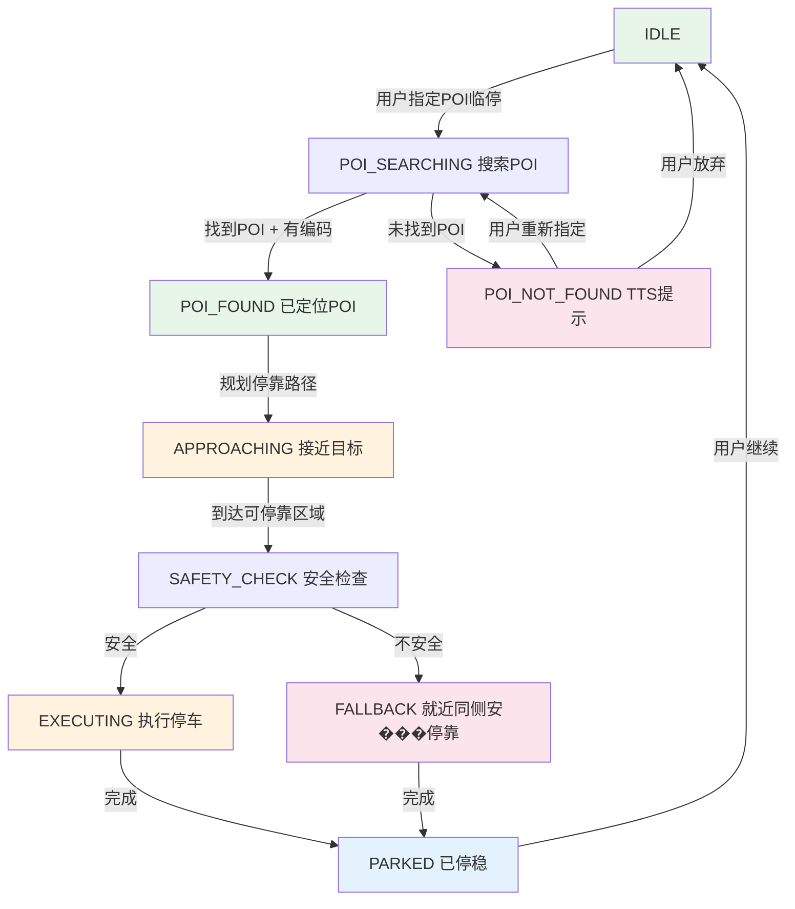
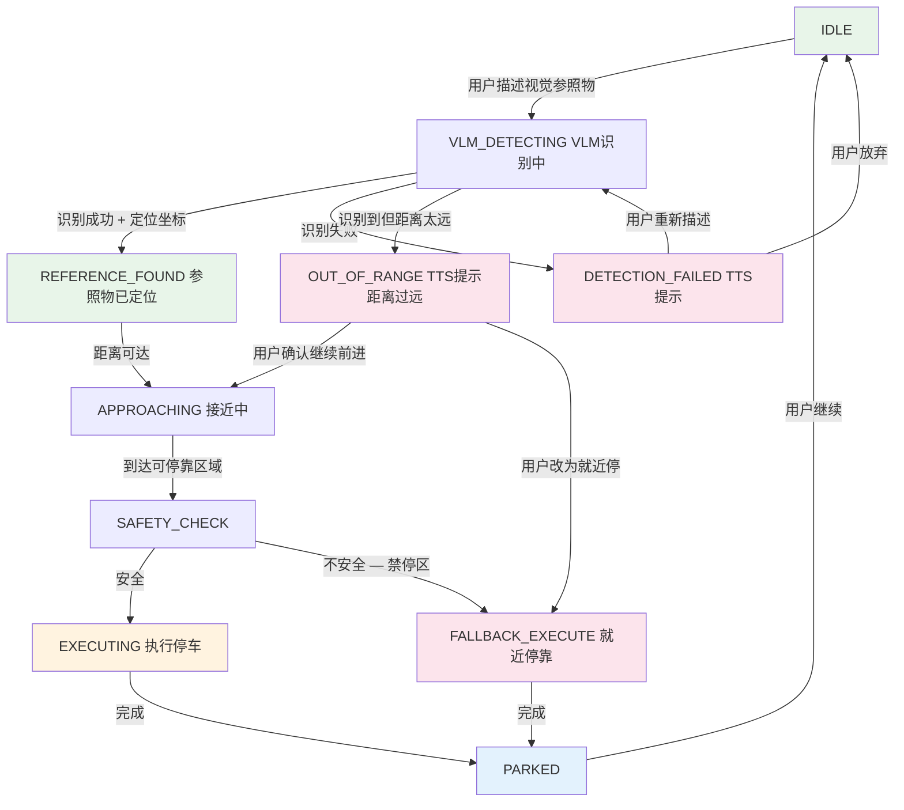
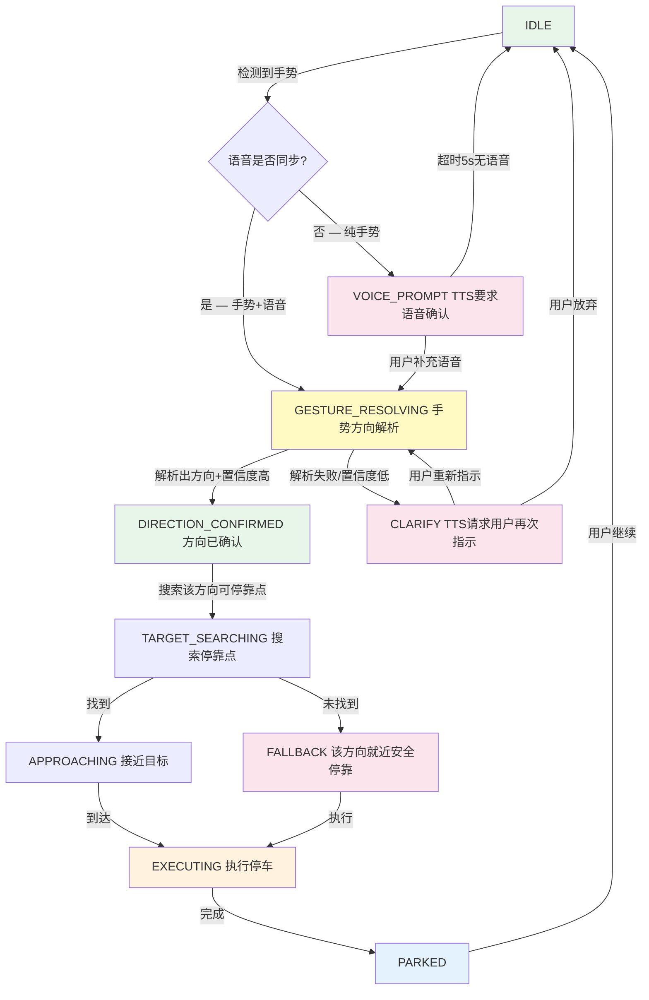
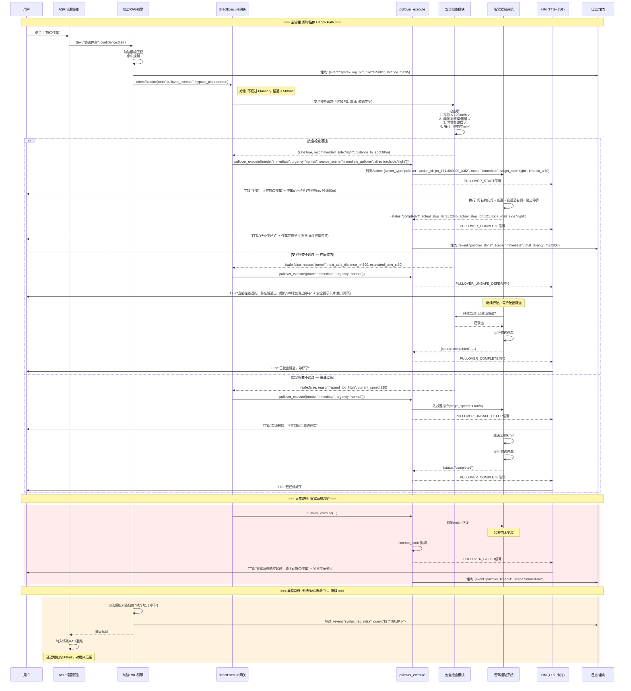
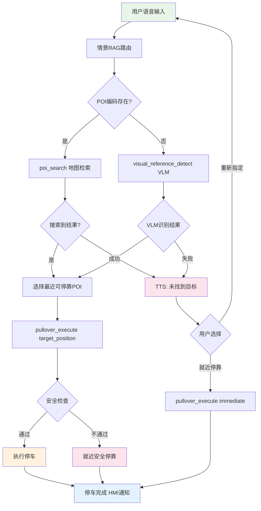
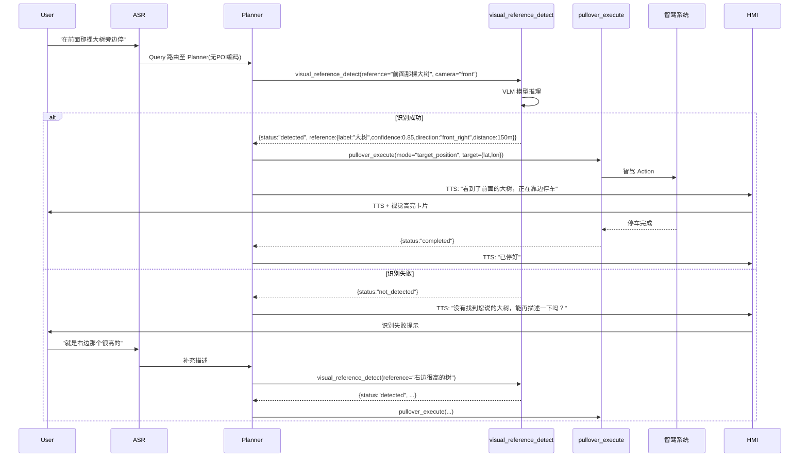
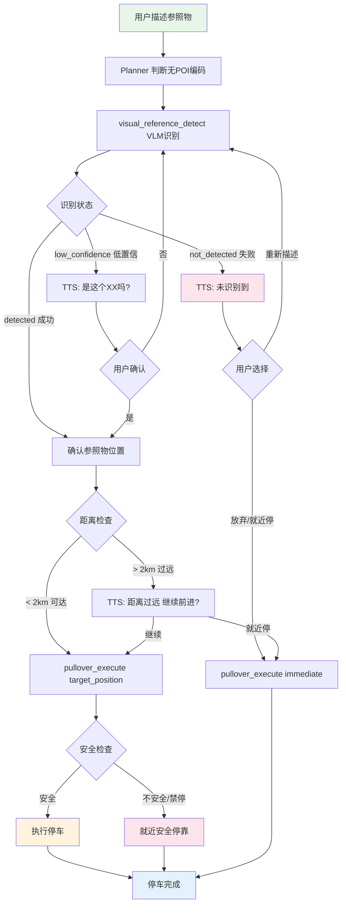
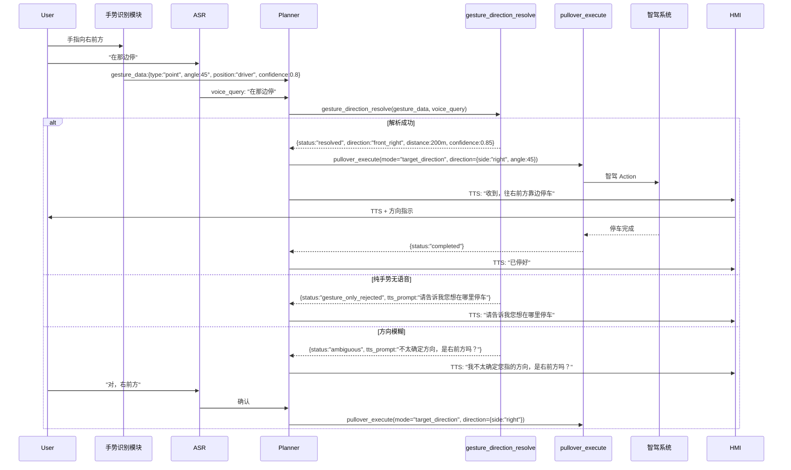
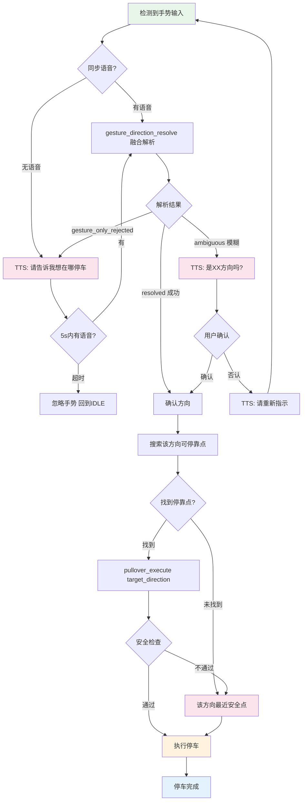
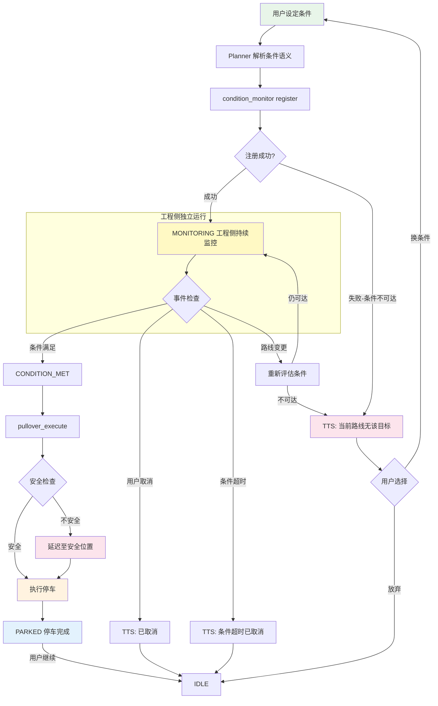

# 临停需求 PRD — 豆包车载 AI 智驾临停功能

> 版本：v1.0
> 日期：2026-03-31
> 状态：Draft

---

## 1. 产品背景与目标

### 1.1 背景

豆包车载 AI 助手当前已具备完整的导航、POI 搜索、车控、GUI 操作等能力，但在**智驾场景下的临时停车**方面尚未覆盖。用户在智驾行驶中经常需要临时靠边停车，场景包括：

- 突然想下车买杯咖啡（即时临停）
- "到了加油站就停一下"（条件临停）
- "在前面那个便利店门口停一下"（目标临停 — POI / 视觉参照物 / 手势指向）

当前系统缺乏从语音指令到智驾 Action 的完整通路，用户不得不手动接管车辆完成临停，体验断裂。

### 1.2 目标

| 目标 | 描述 |
|------|------|
| **G1 — 即时临停** | 用户说"靠边停车"类指令后，车辆在 3s 内开始执行就近安全靠边停车 |
| **G2 — 条件临停** | 用户设定条件（如"到了下个服务区停一下"），系统持续监控条件，满足时自动执行临停 |
| **G3 — 目标临停** | 用户指定 POI / 视觉参照物 / 手势方向作为停车目标，系统导引车辆至目标附近安全位置停车 |

### 1.3 MVP 范围

| 纳入 | 排除（后续迭代） |
|------|-------------------|
| 即时临停全流程 | 阴凉处 / 积水处等环境感知停车 |
| 条件临停（工程侧显式状态机） | 纯手势触发（需手势+语音双模态） |
| POI 目标临停（有 POI 编码） | "对面停"跨车道场景（就近同侧靠边） |
| 视觉参照物临停（VLM） | Planner LLM 多轮记忆维护状态 |
| 手势+语音双模态目标临停 | — |

### 1.4 成功指标

| 指标 | 目标值 |
|------|--------|
| 即时临停指令识别准确率 | ≥ 95% |
| 条件临停条件匹配准确率 | ≥ 90% |
| 目标临停端到端成功率 | ≥ 85% |
| 语音指令 → 智驾响应延迟 | ≤ 3s（即时）/ ≤ 5s（目标） |
| 异常降级 TTS 覆盖率 | 100% |

---

## 2. 系统架构上下文

### 2.1 业务流总览

临停功能横跨语音交互层、Planner 决策层、工具执行层和智驾控制层。核心流程为：

```
用户语音/手势 → ASR/手势识别 → Query 路由 → Tool 调用 → 智驾 Action → HMI 反馈
```

### 2.2 Query 路由分层策略

系统采用三层路由机制处理临停相关 Query：

| 路由层 | 适用场景 | 处理方式 | 延迟 |
|--------|----------|----------|------|
| **句法 RAG** | 即时临停（"靠边停车"等固定句式） | `directExecute` 直接调用 `pullover_execute`，不经过 Planner | < 500ms |
| **情景 RAG** | 条件临停、POI 目标临停（有 POI 编码的请求） | 语义匹配后进入 Planner pipeline | < 1s |
| **云侧 Planner** | 视觉参照物临停、手势多模态临停、复杂条件组合 | 完整 LLM 推理链 | 1-3s |

**关键决策：即时临���走句法 RAG �� directExecute，不过 Planner。** 这保证了紧急停车场景的最低延迟。

### 2.3 架构约束

| 约束项 | 约束内容 |
|--------|----------|
| **AC-1** | 新增 5 个 Tool 需与现有 AgentTool 体系兼容，遵循统一的 JSON Schema 规范 |
| **AC-2** | 条件临停状态由工程侧显式状态机维护，不依赖 Planner LLM 多轮记忆 |
| **AC-3** | POI 类目标临停有 POI 编码走地图检索，无编码走 VLM 视觉识别 |
| **AC-4** | 手势触发必须配合语音确认（双模态），MVP 不支持纯手势 |
| **AC-5** | "对面停"等跨车道指令，TTS 提示后就近同侧靠边停 |
| **AC-6** | 所有异常路径必须有 TTS 降级提示 |

---

## 3. 需求清单

### 3.1 功能描述与用户故事

#### 场景一：即时临停

**定义：** 用户发出立即停车的语音指令，车辆在当前位置就近安全靠边停车。

| 用户故事 | 验收条件 |
|----------|----------|
| 作为乘客，我说"靠边停车"，希望车辆立刻开始减速靠边 | 指令识别后 3s 内开始执行 pullover |
| 作为乘客，我说"停一下"，希望系统理解为临停而非永久停车 | 正确分类为临停，执行后进入等待状态 |
| 作为乘客，如果当前位置不安全（如隧道内），希望系统告诉我原因并在最近安全位置停车 | TTS 提示 + 延迟至安全位置执行 |

#### 场景二：条件临停

**定义：** 用户设定一个触发条件，系统持续监控，条件满足时自动执行临停。

| 用户故事 | 验收条件 |
|----------|----------|
| 作为乘客，我说"到了下个服务区停一下"，希望车到服务区时自动停 | condition_monitor 持续监控，匹配后触发 pullover_execute |
| 作为乘客，我说"再开5公里就停"，希望按里程条件触发 | 支持里程型条件 |
| 作为乘客，我想取消之前设的条件，说"不用停了" | 条件监控状态机重置为 idle |

#### 场景三：目标临停

**定义：** 用户指定一个具体目标（POI / 视觉参照物 / 手势方向），车辆导引至目标附近安全位置停车。

**3.3a — POI 目标临停（子场景 A：实时行驶中 POI 识别）**

> **范围说明**：子场景 A 为智驾行车中用户即时发起 POI 临停，系统在**视距内 250m、行驶方向同侧**筛选最近 POI 执行靠边临停，由豆包 Planner 全链路负责。
>
> 子场景 B（用户提前设置途经点/目的地 → 在途经点或目的地靠边临停）由**智驾 AD 侧 VLA 自主处理**，豆包 Planner 仅负责意图识别并向 AD 侧下发信号，执行链路由 VLA 接管，不在本 PRD 执行层设计范围内。子场景 B 的 Planner 接口定义见 §3.4.4。

| 用户故事 | 验收条件 |
|----------|----------|
| 作为乘客，我说"在前面那个星巴克停一下"，希望车在星巴克门口附近停 | poi_search 检索 → pullover_execute 在 POI 附近执行 |
| 作为乘客，我说"在最近的加油站停"，希望系统搜到最近加油站并停在附近 | POI 搜索按距离排序，选最近可停靠点 |

**3.3b — 视觉参照物目标临停**

| 用户故事 | 验收条件 |
|----------|----------|
| 作为乘客，我说"在前面那棵大树旁边停"，希望系统识别树并在附近停 | visual_reference_detect 识别参照物 → pullover_execute |
| 作为乘客，我说"那个路灯下面停一下"，系统找不到时要告诉我 | VLM 识别失败 → TTS 降级提示 |

**3.3c — 手势多模态目标临停**

| 用户故事 | 验收条件 |
|----------|----------|
| 作为乘客，我用手指向右前方并说"在那边停"，希望系统理解方向并停 | gesture_direction_resolve 解析方向 → pullover_execute |
| 作为乘客，我只做了手势没说话，系统应该提醒我需要语音确认 | TTS: "请告诉我您想在哪里停车" |

### 3.2 Query 语义分类与评测 Query 集

#### 3.2.1 即时临停 Query 集

| # | Query | 分类 | 路由 | 预期行为 |
|---|-------|------|------|----------|
| 1 | "靠边停车" | 正例 | 句法RAG→directExecute | 立即执行 pullover_execute |
| 2 | "停一下" | 正例 | 句法RAG→directExecute | 立即执行 pullover_execute |
| 3 | "在这儿停" | 正例 | 句法RAG→directExecute | 立即执行 pullover_execute |
| 4 | "让我下车" | 正例 | 句法RAG→directExecute | 立即执行 pullover_execute |
| 5 | "停车" | 正例 | 句法RAG→directExecute | 立即执行 pullover_execute |
| 6 | "赶紧停下来" | 正例 | 句法RAG→directExecute | 立即执行 pullover_execute |
| 7 | "我要在这里下" | 正例 | 句法RAG→directExecute | 立即执行 pullover_execute |
| 8 | "这里停一下吧" | 正例 | 句法RAG→directExecute | 立即执行 pullover_execute |
| 9 | "前面路口停" | 边界 | 情景RAG→Planner | 需判断是即时还是目标临停 |
| 10 | "找个地方停车" | 边界 | 情景RAG→Planner | 语义模糊，需 Planner 澄清 |
| 11 | "停到路边" | 正例 | 句法RAG→directExecute | 立即执行 pullover_execute |
| 12 | "帮我把车停了" | 边界 | 情景RAG→Planner | 可能指泊车而非临停，需澄清 |
| 13 | "慢点开" | 拒绝 | — | 非临停指令，不触发 |
| 14 | "停车场在哪" | 拒绝 | — | POI 搜索，非临停 |
| 15 | "我想休息一下" | 边界 | 情景RAG→Planner | 可能暗示停车，Planner 需澄清 |
| 16 | "别开了" | 正例 | 句法RAG→directExecute | 立即执行 pullover_execute |
| 17 | "可以停了" | 正例 | 句法RAG→directExecute | 立即执行 pullover_execute |

#### 3.2.2 条件临停 Query 集

| # | Query | 分类 | 路由 | 预期行为 |
|---|-------|------|------|----------|
| 1 | "到了下个服务区停一下" | 正例-POI条件 | 情景RAG→Planner | condition_monitor(type=poi, target=服务区) |
| 2 | "到加油站就停" | 正例-POI条件 | 情景RAG→Planner | condition_monitor(type=poi, target=加油站) |
| 3 | "再开5公里停一下" | 正例-里程条件 | 情景RAG→Planner | condition_monitor(type=distance, value=5km) |
| 4 | "10分钟后停一下" | 正例-时间条件 | 情景RAG→Planner | condition_monitor(type=time, value=10min) |
| 5 | "过了这个隧道就停" | 正例-地理条件 | 情景RAG→Planner | condition_monitor(type=geo_fence, target=隧道出口) |
| 6 | "等到了高速出口再停" | 正��-POI条件 | 情景RAG→Planner | condition_monitor(type=poi, target=高速出口) |
| 7 | "到了红绿灯就停" | 正例-地理条件 | 情景RAG→Planner | condition_monitor(type=geo_fence, target=下个信号灯) |
| 8 | "快到目的地的时候停一下" | 正例-里程条件 | 情景RAG→Planner | condition_monitor(type=destination_proximity) |
| 9 | "下了高速找个地方停" | 正例-组合条件 | 云侧Planner | 先等下高速，再搜索停车点 |
| 10 | "不用停了" | 正例-取消 | 情景RAG→Planner | 取消 condition_monitor，状态机 → idle |
| 11 | "还是别停了吧" | 正例-取消 | 情景RAG→Planner | 取消 condition_monitor |
| 12 | "到了阴凉的地方停" | 拒绝-MVP外 | — | TTS: "阴凉处识别功能暂不支持" |
| 13 | "看到积水就停下来" | 拒绝-MVP外 | — | TTS: "积水检测功能暂不支持" |
| 14 | "到了再说" | 拒绝 | — | 条件不明确，不触发 |
| 15 | "你觉得哪里适合停" | 边界 | 云侧Planner | Planner 推荐停车点 |
| 16 | "经过麦当劳就停下" | 正例-POI条件 | 情景RAG→Planner | condition_monitor(type=poi, target=麦当劳) |
| 17 | "离目的地还有1公里时停" | 正例-里程条件 | 情景RAG→Planner | condition_monitor(type=destination_proximity, value=1km) |

#### 3.2.3 目标临停 Query 集（POI / 视觉 / 手势）

| # | Query | 子类型 | 路由 | 预期行为 |
|---|-------|--------|------|----------|
| 1 | "在前面那个星巴克停一下" | POI | 情景RAG→Planner | poi_search → pullover_execute |
| 2 | "在最近的加油站停" | POI | 情景RAG→Planner | poi_search → pullover_execute |
| 3 | "去那个7-11门口停" | POI | 情景RAG→Planner | poi_search → pullover_execute |
| 4 | "在前面那棵大树旁边停" | 视觉 | 云侧Planner | visual_reference_detect → pullover_execute |
| 5 | "路灯下面停一下" | 视觉 | 云侧Planner | visual_reference_detect → pullover_execute |
| 6 | "那个公交站牌那里停" | 视觉+POI | 云侧Planner | 先尝试 POI，无编码则 VLM |
| 7 | "在那边停"（配合手势右指） | 手势 | 云侧Planner | gesture_direction_resolve → pullover_execute |
| 8 | "就那里"（配合手势前指） | 手势 | 云侧Planner | gesture_direction_resolve → pullover_execute |
| 9 | "停在右手边那个位置"（配合手势） | 手势 | 云侧Planner | gesture_direction_resolve → pullover_execute |
| 10 | "在对面那个店停一下" | 拒绝-跨车道 | — | TTS: "为安全考虑，就近同侧靠边停车" → pullover_execute(side=same) |
| 11 | "在马路对面停" | 拒绝-跨车道 | — | TTS: 同上 |
| 12 | "在前面那个白色建筑旁边停" | 视觉 | 云侧Planner | visual_reference_detect → pullover_execute |
| 13 | "停在有空位的地方" | 视觉 | 云侧Planner | visual_reference_detect(target=parking_space) |
| 14 | （纯手势指向，无语音） | 拒绝-MVP外 | — | TTS: "请告诉我您想在哪里停车" |
| 15 | "在前面那个写着'停车'的牌子那停" | 视觉 | 云侧Planner | visual_reference_detect → pullover_execute |
| 16 | "在那个红色招牌旁边停" | 视觉 | 云侧Planner | visual_reference_detect → pullover_execute |
| 17 | "你看到那个花坛了吗，在那停" | 视觉 | 云侧Planner | visual_reference_detect → pullover_execute |

### 3.3 状态机与触发条件

#### 3.3.1 即时临停状态机

```mermaid
flowchart TD
    A[IDLE 正常行驶] -->|用户发出即时停车指令| B[COMMAND_RECEIVED 指令已接收]
    B -->|句法RAG匹配成功| C[SAFETY_CHECK 安全检查]
    C -->|安全 — 可停车| D[EXECUTING 执行靠边停车]
    C -->|不安全 — 隧道/桥梁/匝道| E[DEFERRED 延迟至安全位置]
    E -->|到达安全位置| D
    D -->|停车完成| F[PARKED 已停稳]
    F -->|用户说"继续走"或"出发"| A
    F -->|超时15分钟未操作| G[TIMEOUT_ALERT TTS提醒]
    G -->|用户响应| F
    G -->|无响应| A

    style A fill:#e8f5e9
    style D fill:#fff3e0
    style F fill:#e3f2fd
    style E fill:#fce4ec
```

#### 3.3.2 条件临停状态机（工程侧显式状态机设计）

**设计原则：** 状态由工程侧代码维护，不依赖 Planner LLM 的多轮上下文记忆。Planner 仅在初始设定条件和取消条件时参与，中间的持续监控由 `condition_monitor` 工程模块独立完成。

```mermaid
flowchart TD
    A[IDLE 无条件监控] -->|Planner 调用 condition_monitor 设定条件| B[MONITORING 条件监控中]
    B -->|条件满足| C[CONDITION_MET 条件已触发]
    B -->|用户取消 "不用停了"| A
    B -->|条件超时/不可达| H[CONDITION_EXPIRED 条件过期]
    H -->|TTS提示条件已过期| A
    C -->|安全检查通过| D[EXECUTING 执行临停]
    C -->|安全检查不通过| E[DEFERRED 延迟执行]
    E -->|到达安全位置| D
    D -->|停车完成| F[PARKED 已停稳]
    F -->|用户说"继续"| A

    subgraph 工程侧持续运行
        B
    end

    style A fill:#e8f5e9
    style B fill:#fff9c4
    style C fill:#fff3e0
    style D fill:#fff3e0
    style F fill:#e3f2fd
    style H fill:#fce4ec
```

**状态转换表：**

| 当前状态 | 触发事件 | 目标状态 | 执行动作 |
|----------|----------|----------|----------|
| IDLE | Planner 调用 condition_monitor | MONITORING | 注册条件，启动监控循环 |
| MONITORING | 条件匹配成功 | CONDITION_MET | 发送条件满足信号 |
| MONITORING | 用户取消 | IDLE | 清除条件，停止监控 |
| MONITORING | 条件过期/不可达 | CONDITION_EXPIRED | TTS 通知 |
| CONDITION_MET | 安全检查通过 | EXECUTING | 调用 pullover_execute |
| CONDITION_MET | 安全检查不通过 | DEFERRED | TTS 提示，等待安全位置 |
| DEFERRED | 到达安全位置 | EXECUTING | 调用 pullover_execute |
| EXECUTING | 停车完成 | PARKED | TTS 通知已停好 |
| PARKED | 用户下达继续指令 | IDLE | 恢复行驶 |
| CONDITION_EXPIRED | TTS 完毕 | IDLE | 清除条件 |

#### 3.3.3 POI 临停状态机



#### 3.3.4 视觉参照物临停状态机



#### 3.3.5 手势多模态临停状态机



### 3.4 接口字段定义

#### 3.4.1 新增 5 个 Tool 的完整 JSON Schema

##### Tool 1: `poi_search`

**职责：** 根据用户描述搜索附近 POI，返回可用于临停的 POI 位置信息。当 POI 有编码时走地图检索通路。

```json
{
  "tool_name": "poi_search",
  "tool_describe": "临停场景专用 POI 搜索工具。根据用户语音描述搜索前方/附近的 POI，返回 POI 坐标、距离和可停靠区域信息，供 pullover_execute 使用。",
  "parameters": {
    "type": "object",
    "required": ["query"],
    "properties": {
      "query": {
        "type": "string",
        "description": "用户描述的 POI 目标，如 '前面的星巴克'、'最近的加油站'、'7-11便利店'"
      },
      "search_radius_m": {
        "type": "integer",
        "default": 250,
        "minimum": 100,
        "maximum": 10000,
        "description": "搜索半径（米）。子场景 A（实时行驶中即时 POI 临停）默认 250m（视距内约束）；导航途经点场景不走此参数，由 AD VLA 处理"
      },
      "search_direction": {
        "type": "string",
        "enum": ["forward", "both"],
        "default": "forward",
        "description": "搜索方向。forward=仅搜索前方；both=前后都搜"
      },
      "max_results": {
        "type": "integer",
        "default": 3,
        "minimum": 1,
        "maximum": 5,
        "description": "最多返回结果数"
      }
    }
  },
  "response": {
    "type": "object",
    "properties": {
      "status": {
        "type": "string",
        "enum": ["found", "not_found", "error"],
        "description": "搜索结果状态"
      },
      "pois": {
        "type": "array",
        "items": {
          "type": "object",
          "properties": {
            "poi_id": { "type": "string", "description": "POI 编码" },
            "name": { "type": "string", "description": "POI 名称" },
            "category": { "type": "string", "description": "POI 类别" },
            "distance_m": { "type": "number", "description": "距当前位置的距离（米）" },
            "lat": { "type": "number", "description": "纬度" },
            "lon": { "type": "number", "description": "经度" },
            "pullover_point": {
              "type": "object",
              "description": "建议停靠点坐标",
              "properties": {
                "lat": { "type": "number" },
                "lon": { "type": "number" },
                "road_side": { "type": "string", "enum": ["left", "right"] }
              }
            },
            "is_pullover_safe": { "type": "boolean", "description": "该位置是否可安全停靠" }
          }
        }
      },
      "error_msg": { "type": "string", "description": "错误信息（status=error时）" }
    }
  }
}
```

##### Tool 2: `visual_reference_detect`

**职责：** 调用 VLM（Vision Language Model）识别用户描述的视觉参照物，返回参照物的相对位置和距离估计。

```json
{
  "tool_name": "visual_reference_detect",
  "tool_describe": "视觉参照物检测工具。通过车载摄像头 + VLM 模型识别用户口述的视觉参照物（如大树、路灯、建筑物、招牌等），返回参照物的方位和距离估计。",
  "parameters": {
    "type": "object",
    "required": ["reference_description"],
    "properties": {
      "reference_description": {
        "type": "string",
        "description": "用户描述的视觉参照物，如 '前面那棵大树'、'那个红色招牌'、'路灯'"
      },
      "camera_source": {
        "type": "string",
        "enum": ["front", "front_left", "front_right", "all_external"],
        "default": "front",
        "description": "使用哪个摄像头进行识别"
      },
      "confidence_threshold": {
        "type": "number",
        "default": 0.7,
        "minimum": 0.0,
        "maximum": 1.0,
        "description": "识别置信度阈值"
      }
    }
  },
  "response": {
    "type": "object",
    "properties": {
      "status": {
        "type": "string",
        "enum": ["detected", "not_detected", "low_confidence", "error"],
        "description": "检测结果状态"
      },
      "reference": {
        "type": "object",
        "properties": {
          "label": { "type": "string", "description": "识别出的参照物标签" },
          "confidence": { "type": "number", "description": "识别置信度 0-1" },
          "relative_direction": {
            "type": "string",
            "enum": ["front", "front_left", "front_right", "left", "right"],
            "description": "参照物相对车辆的方位"
          },
          "estimated_distance_m": {
            "type": "number",
            "description": "估计距离（米）"
          },
          "bounding_box": {
            "type": "object",
            "description": "图像中的边界框",
            "properties": {
              "x": { "type": "number" },
              "y": { "type": "number" },
              "width": { "type": "number" },
              "height": { "type": "number" }
            }
          }
        }
      },
      "pullover_suggestion": {
        "type": "object",
        "description": "基于参照物位置的建议停靠点",
        "properties": {
          "lat": { "type": "number" },
          "lon": { "type": "number" },
          "road_side": { "type": "string", "enum": ["left", "right"] },
          "is_safe": { "type": "boolean" }
        }
      },
      "error_msg": { "type": "string" }
    }
  }
}
```

##### Tool 3: `gesture_direction_resolve`

**职责：** 解析乘客手势方向，结合语音语义，输出目标方位。MVP 强制手势+语音双模态。

> **接入点说明**：`gesture_data` 由**车内现有手势识别 API** 输出，该模块已具备硬件和感知能力，`gesture_direction_resolve` Tool 直接消费其 API 输出，无需新建感知模块。对接字段映射及 API 版本号需在 M2 开发前与手势识别团队确认。置信度阈值 `confidence_threshold=0.5` 为当前预设值，**待手势识别团队提供评测基线后校准**（见 §7.2 开放问题 #2）。

```json
{
  "tool_name": "gesture_direction_resolve",
  "tool_describe": "手势方向解析工具。结合车内摄像头捕获的乘客手势和同步的语音指令，解析出用户指向的目标方向。必须手势+语音双模态触发，纯手势不执行。",
  "parameters": {
    "type": "object",
    "required": ["gesture_data", "voice_query"],
    "properties": {
      "gesture_data": {
        "type": "object",
        "description": "手势识别原始数据",
        "properties": {
          "gesture_type": {
            "type": "string",
            "enum": ["point", "wave", "palm_open", "unknown"],
            "description": "手势类型"
          },
          "direction_angle_deg": {
            "type": "number",
            "minimum": 0,
            "maximum": 360,
            "description": "手势指向角度（以车头正前方为0°，顺时针）"
          },
          "speaker_position": {
            "type": "string",
            "enum": ["driver", "copilot", "rear_left", "rear_right"],
            "description": "手势发起者的座位位置"
          },
          "confidence": {
            "type": "number",
            "minimum": 0,
            "maximum": 1,
            "description": "手势识别置信度"
          }
        }
      },
      "voice_query": {
        "type": "string",
        "description": "同步的语音指令，如 '在那边停'、'就那里'"
      }
    }
  },
  "response": {
    "type": "object",
    "properties": {
      "status": {
        "type": "string",
        "enum": ["resolved", "ambiguous", "gesture_only_rejected", "error"],
        "description": "解析结果状态"
      },
      "resolved_direction": {
        "type": "object",
        "properties": {
          "direction": {
            "type": "string",
            "enum": ["front", "front_left", "front_right", "left", "right"],
            "description": "解析出的目标方向"
          },
          "estimated_distance_m": {
            "type": "number",
            "description": "估计的目标距离"
          },
          "confidence": {
            "type": "number",
            "description": "综合置信度"
          }
        }
      },
      "tts_prompt": {
        "type": "string",
        "description": "需要 TTS 播报的提示语（如需澄清或拒绝）"
      },
      "error_msg": { "type": "string" }
    }
  }
}
```

##### Tool 4: `condition_monitor`

**职责：** 注册/查询/取消条件临停的监控条件。工程侧持续运行，不依赖 Planner 多轮记忆。

```json
{
  "tool_name": "condition_monitor",
  "tool_describe": "条件临停监控工具。由 Planner 调用设定监控条件（如距离、时间、POI 接近），工程侧持续运行监控，条件满足时回调触发 pullover_execute。支持注册、查询和取消条件。",
  "parameters": {
    "type": "object",
    "required": ["action"],
    "properties": {
      "action": {
        "type": "string",
        "enum": ["register", "query", "cancel"],
        "description": "操作类型：register=注册新条件，query=查询当前监控状态，cancel=取消所有监控"
      },
      "condition": {
        "type": "object",
        "description": "监控条件定义（action=register时必填）",
        "properties": {
          "type": {
            "type": "string",
            "enum": ["poi", "distance", "time", "geo_fence", "destination_proximity"],
            "description": "条件类型"
          },
          "target": {
            "type": "string",
            "description": "条件目标描述，如 '服务区'、'加油站'、'隧道出口'"
          },
          "value": {
            "type": "number",
            "description": "条件阈值（distance时为米，time时为秒，destination_proximity时为米）"
          },
          "timeout_s": {
            "type": "integer",
            "default": 3600,
            "description": "条件超时时间（秒），超时后自动取消并通知"
          }
        }
      }
    }
  },
  "response": {
    "type": "object",
    "properties": {
      "status": {
        "type": "string",
        "enum": ["registered", "monitoring", "triggered", "cancelled", "expired", "error"],
        "description": "当前监控状态"
      },
      "condition_id": {
        "type": "string",
        "description": "条件唯一ID"
      },
      "condition_summary": {
        "type": "string",
        "description": "条件描述摘要，用于 TTS 播报"
      },
      "remaining_estimate": {
        "type": "string",
        "description": "预计条件满足的剩余描述，如 '约3公里后' '约5分钟后'"
      },
      "trigger_callback": {
        "type": "string",
        "description": "条件满足时的回调标识，固定为 'pullover_execute'"
      },
      "error_msg": { "type": "string" }
    }
  }
}
```

##### Tool 5: `pullover_execute`

**职责：** 向智驾系统下发靠边停车执行指令。这是所有临停场景的最终执行器。

```json
{
  "tool_name": "pullover_execute",
  "tool_describe": "靠边停车执行工具。向智驾系统下发临停指令，支持即时靠边停、指定位置停靠、指定方向停靠三种模式。所有临停场景最终均通过此工具触发执行。",
  "parameters": {
    "type": "object",
    "required": ["mode"],
    "properties": {
      "mode": {
        "type": "string",
        "enum": ["immediate", "target_position", "target_direction"],
        "description": "停车模式：immediate=就近立即靠边；target_position=指定坐标位置停靠；target_direction=指定方向最近可停靠点"
      },
      "target": {
        "type": "object",
        "description": "目标位置（mode=target_position时必填）",
        "properties": {
          "lat": { "type": "number", "description": "目标纬度" },
          "lon": { "type": "number", "description": "目标经度" },
          "poi_id": { "type": "string", "description": "关联的POI编码（可选）" },
          "tolerance_m": {
            "type": "number",
            "default": 50,
            "description": "停靠点容差范围（米）"
          }
        }
      },
      "direction": {
        "type": "object",
        "description": "目标方向（mode=target_direction时必填）",
        "properties": {
          "side": {
            "type": "string",
            "enum": ["left", "right", "same"],
            "description": "停靠侧。same=就近同侧（用于跨车道降级场景）"
          },
          "angle_deg": {
            "type": "number",
            "description": "精确方向角度（可选）"
          }
        }
      },
      "urgency": {
        "type": "string",
        "enum": ["normal", "urgent"],
        "default": "normal",
        "description": "紧急程度。urgent 时忽略舒适性优化，优先安全快速靠边"
      },
      "source_scene": {
        "type": "string",
        "enum": ["immediate_pullover", "condition_pullover", "poi_pullover", "visual_pullover", "gesture_pullover"],
        "description": "触发来源场景，用于日志和 HMI 展示"
      }
    }
  },
  "response": {
    "type": "object",
    "properties": {
      "status": {
        "type": "string",
        "enum": ["executing", "completed", "failed", "rejected"],
        "description": "执行状态"
      },
      "execution_detail": {
        "type": "object",
        "properties": {
          "actual_stop_lat": { "type": "number" },
          "actual_stop_lon": { "type": "number" },
          "road_side": { "type": "string", "enum": ["left", "right"] },
          "distance_to_target_m": { "type": "number", "description": "实际停靠点与目标的距离" }
        }
      },
      "reject_reason": {
        "type": "string",
        "description": "拒绝原因（status=rejected时）",
        "enum": ["highway_no_shoulder", "tunnel", "bridge", "intersection", "no_safe_spot", "speed_too_high"]
      },
      "fallback_action": {
        "type": "string",
        "description": "降级动作描述"
      },
      "hmi_signal": {
        "type": "object",
        "description": "需要下发的 HMI 信号",
        "properties": {
          "tts_text": { "type": "string", "description": "TTS 播报文本" },
          "hmi_card_type": { "type": "string", "description": "HMI 卡片类型" },
          "hmi_card_data": { "type": "object", "description": "HMI 卡片数据" }
        }
      },
      "error_msg": { "type": "string" }
    }
  }
}
```

#### 3.4.4 子场景 B — 途经点/目的地临停意图交界面

> **架构决策**：途经点/目的地临停的执行链路由 AD 侧 VLA 自主处理。豆包 Planner 的职责边界为：识别用户意图 → 下发 `waypoint_pullover_intent` 信号给 AD 侧 → 由 AD VLA 接管后续执行。Planner **不调用** `pullover_execute`，不维护该场景的状态机。

**Planner → AD 侧下发信号字段定义：**

| 字段 | 类型 | 说明 |
|------|------|------|
| `intent_type` | string | 固定为 `"waypoint_pullover"` |
| `intent_id` | string | 唯一标识，格式 `wp_po_{timestamp}` |
| `waypoint_ref` | string | 目标途经点描述，如 `"当前导航途经点1"` / `"导航目的地"` |
| `trigger_condition` | string | `"on_arrival"`（到达时停）/ `"before_arrival_Nm"`（提前 N 米停） |
| `user_query_raw` | string | 原始用户 Query，透传给 AD 侧用于 VLA 理解 |

**Planner 触发条件：**
- 用户 Query 含"途经点"/"目的地"/"导航到了就停"等语义，且当前有活跃导航任务
- 路由：情景 RAG → Planner → 下发 `waypoint_pullover_intent`，不调用任何 Tool

**HMI 信号（Planner 侧）：**
- 下发信号后立即 TTS："好的，到了{途经点/目的地}会靠边停车"，后续执行反馈由 AD HMI 负责


| 字段 | 类型 | 说明 |
|------|------|------|
| `action_type` | string | 固定为 `"pullover"` |
| `action_id` | string | 唯一标识，格式 `pullover_{timestamp}_{random}` |
| `mode` | string | `immediate` / `target_position` / `target_direction` |
| `target_lat` | number | 目标纬度（mode=target_position 时） |
| `target_lon` | number | 目标经度（mode=target_position 时） |
| `target_side` | string | `left` / `right` / `same` |
| `urgency` | string | `normal` / `urgent` |
| `source_scene` | string | 触发来源场景标识 |
| `timeout_s` | integer | 执行超时时间（默认60s） |
| `safety_override` | boolean | 是否允许在非理想位置停车（紧急场景） |

#### 3.4.3 调用方/响应时序

**即时临停调用时序：**

```
ASR → 句法RAG(match) → directExecute → pullover_execute(mode=immediate) → 智驾Action → HMI
                                              ↓
                                        response(status)
                                              ↓
                                        HMI(tts_text)
```

**条件临停调用时序：**

```
ASR → 情景RAG → Planner → condition_monitor(action=register) → 工程侧持续监控
                                                                      ↓ (条件满足)
                                                              pullover_execute → 智驾Action → HMI
```

**目标临停（POI）调用时序：**

```
ASR → 情景RAG/Planner → poi_search(query) → Planner(选择POI) → pullover_execute(mode=target_position) → 智驾Action → HMI
```

**目标临停（视觉）调用时序：**

```
ASR → Planner → visual_reference_detect(ref_desc) → Planner(判断结果) → pullover_execute(mode=target_position) → 智驾Action → HMI
```

**目标临停（手势）调用时序：**

```
手势+ASR → Planner → gesture_direction_resolve(gesture+voice) → Planner(确认方向) → pullover_execute(mode=target_direction) → 智驾Action → HMI
```

### 3.5 智驾 HMI 信号定义

| 信号名称 | 触发场景 | TTS 文本模板 | HMI 卡片 | 优先级 |
|----------|----------|-------------|----------|--------|
| `PULLOVER_START` | 开始执行靠边停车 | "好的，正在靠边停车" | 停车动画卡片（方向指示+预计距离） | P0 |
| `PULLOVER_COMPLETE` | 停车完成 | "已经停好了" | 停车完成卡片（位置信息） | P0 |
| `PULLOVER_UNSAFE_DEFER` | 当前位置不安全，延迟停车 | "当前位置不适合停车，将在前方安全位置停靠" | 安全提示卡片 | P0 |
| `PULLOVER_FAILED` | 停车执行失败 | "抱歉，无法在此处停车，{原因}" | 失败提示卡片 | P0 |
| `CONDITION_REGISTERED` | 条件临停已注册 | "好的，{条件描述}后会帮你停车" | 条件监控卡片（倒计时/进度） | P1 |
| `CONDITION_TRIGGERED` | 条件满足 | "{条件描述}已满足，开始靠边停车" | 条件触发 → 停车动画 | P0 |
| `CONDITION_CANCELLED` | 条件已取消 | "好的，取消停车" | 条件监控卡片消失 | P1 |
| `CONDITION_EXPIRED` | 条件超时 | "未能满足停车条件，已自动取消" | 条件过期提示 | P1 |
| `POI_FOUND` | POI 搜索到结果 | "找到了{POI名称}，距离{X}米，正在前往" | POI 卡片（名称+距离+地图标点） | P1 |
| `POI_NOT_FOUND` | POI 未搜索到 | "附近没有找到{目标}，要就近停靠吗？" | 搜索失败提示 | P1 |
| `VISUAL_REF_DETECTED` | 视觉参照物已识别 | "看到了{参照物}，正在前往" | 视觉识别高亮卡片 | P1 |
| `VISUAL_REF_NOT_FOUND` | 视觉识别失败 | "没有找到您说的{参照物}，请再描述一下？" | 识别失败提示 | P1 |
| `GESTURE_CONFIRMED` | 手势方向已确认 | "收到，往{方向}靠边停车" | 方向指示卡片 | P1 |
| `GESTURE_VOICE_REQUIRED` | 纯手势无语音 | "请告诉我您想在哪里停车" | 语音提示卡片 | P1 |
| `CROSSLANE_REJECTED` | 跨车道请求被拒绝 | "为安全考虑，将在同侧靠边停车" | 安全提示卡片 | P0 |
| `RESUME_DRIVING` | 恢复行驶 | "好的，继续出发" | 恢复行驶动画 | P1 |

### 3.6 异常与降级规则

#### 3.6.1 即时临停异常降级矩阵

| # | 异常场景 | 检测方式 | 降级策略 | TTS |
|---|----------|----------|----------|-----|
| 1 | 当前在隧道/桥梁/匝道内 | pullover_execute 返回 rejected(tunnel/bridge) | 延迟至隧道/桥梁出口后停靠 | "当前在{隧道/桥梁}内，将在出口后靠边停车" |
| 2 | 高速无应急车道 | pullover_execute 返回 rejected(highway_no_shoulder) | 延迟至最近有应急车道位置 | "当前路段没有应急车道，将在前方安全位置停车" |
| 3 | 车速过高（>120km/h） | pullover_execute 返回 rejected(speed_too_high) | 先减速至安全速度再执行 | "车速较快，正在减速后靠边停车" |
| 4 | 在交叉路口内 | pullover_execute 返回 rejected(intersection) | 通过路口后停靠 | "通过路口后帮你靠边停车" |
| 5 | 智驾系统无响应/通信超时 | 60s 未收到 response | TTS 提示 + 建议手动接管 | "智驾系统响应超时，请手动靠边停车" |
| 6 | 句法 RAG 匹配失败 | directExecute 未命中 | 降级至情景 RAG → Planner | 无感降级，延迟略增 |

#### 3.6.2 条件临停异常降级矩阵

| # | 异常场景 | 检测方式 | 降级策略 | TTS |
|---|----------|----------|----------|-----|
| 1 | 条件不可达（如"到服务区"但路线无服务区） | condition_monitor 路线分析无匹配 | 注册失败，TTS 告知 | "当前路线上没有{目标}，要换个条件吗？" |
| 2 | 条件超时（1小时未触发） | condition_monitor 超时 | 自动取消，TTS 通知 | "停车条件已超时自动取消" |
| 3 | 监控期间路线变更 | 导航重规划事件 | 重新评估条件可达性 | "路线变更，正在重新检查停车条件" |
| 4 | 条件触发时位置不安全 | pullover_execute rejected | 延迟至下一安全位置 | "条件已满足但当前不安全，前方安全处停靠" |
| 5 | 多条件冲突 | 同时注册多个条件 | 仅保留最新条件，取消旧条件 | "新的停车条件已设定，之前的条件已取消" |
| 6 | 导航结束但条件未触发 | 到达目的地事件 | 自动取消条件 | "已到达目的地，停车条件自动取消" |

#### 3.6.3 POI 目标临停异常降级矩阵

| # | 异常场景 | 检测方式 | 降级策略 | TTS |
|---|----------|----------|----------|-----|
| 1 | POI 搜索无结果 | poi_search 返回 not_found | TTS 告知，询问是否就近停靠 | "附近没有找到{POI}，要就近靠边停车吗？" |
| 2 | POI 已过（车已驶过目标） | poi_search 返回结果在车后方 | 提示已过，询问是否掉头或就近停 | "已经开过{POI}了，要就近停靠吗？" |
| 3 | POI 位于道路对面 | poi_search 返回 road_side 为对侧 | 就近同侧停靠（决策#5） | "为安全考虑，在同侧靠边停车" |
| 4 | POI 附近禁停 | pullover_execute rejected(no_safe_spot) | 在 POI 前后 200m 内寻找可停靠点 | "该位置禁止停车，已在附近找到安全位置" |
| 5 | POI 距离过远（>5km） | poi_search 返回 distance_m > 5000 | 询问用户确认 | "{POI}距离{X}公里，确定要前往吗？" |
| 6 | 搜索服务不可用 | poi_search 返回 error | 降级为即时临停 | "搜索服务异常，先就近靠边停车" |

#### 3.6.4 视觉参照物临停异常降级矩阵

| # | 异常场景 | 检测方式 | 降级策略 | TTS |
|---|----------|----------|----------|-----|
| 1 | VLM 识别失败 | visual_reference_detect 返回 not_detected | 询问重新描述 | "没有找到您说的{参照物}，能再描述一下吗？" |
| 2 | 置信度过低 | visual_reference_detect 返回 low_confidence | 询问确认 | "前面有个{疑似参照物}，是这个吗？" |
| 3 | 参照物距离过远 | estimated_distance_m > 2000 | 询问用户选择 | "{参照物}还比较远，继续前进还是就近停靠？" |
| 4 | 识别到但该位置禁停 | pullover_suggestion.is_safe = false | 就近安全位置停靠 | "那个位置不能停车，在附近安全位置停靠" |
| 5 | VLM 服务超时 | 5s 未返回结果 | 降级为即时临停 | "识别需要一点时间，先就近靠边停车" |
| 6 | 夜间/恶劣天气识别受限 | VLM 返回环境受限标记 | 建议用 POI 搜索代替 | "光线条件不佳，要改为搜索附近的{参照物类型}吗？" |

#### 3.6.5 手势多模态临停异常降级矩阵

| # | 异常场景 | 检测方式 | 降级策略 | TTS |
|---|----------|----------|----------|-----|
| 1 | 纯手势无语音 | gesture_direction_resolve 返回 gesture_only_rejected | TTS 要求语音确认 | "请告诉我您想在哪里停车" |
| 2 | 手势方向模糊 | gesture_direction_resolve 返回 ambiguous | 询问澄清 | "我不太确定您指的方向，是右前方吗？" |
| 3 | 手势识别失败 | gesture_data.confidence < 0.5 | 忽略手势，仅用语音 | 按语音内容走其他通路 |
| 4 | 指向方向无可停靠点 | pullover_execute 搜索失败 | 该方向最近安全点 | "那个方向暂时没有合适的停车位，在最近的安全位置停靠" |
| 5 | 后排乘客手势遮挡/角度不佳 | camera_source 识别受限 | TTS 提示调整姿势或改用语音 | "没有看清手势，能再指一下或直接告诉我方向吗？" |
| 6 | 手势+语音矛盾 | 方向解析与语音语义冲突 | 以语音为准 | "按您说的{语音方向}停靠" |

---

## 4. 产品路线图

### 4.1 MVP 范围（第一期）

| 功能模块 | 包含内容 | 优先级 |
|----------|----------|--------|
| **即时临停** | 句法 RAG → directExecute 全流程 | P0 |
| **pullover_execute Tool** | immediate 模式 + 安全检查 + HMI 信号 | P0 |
| **条件临停** | condition_monitor 工程侧状态机 + POI/距离/时间三种条件 | P0 |
| **POI 目标临停** | poi_search + pullover_execute(target_position) | P0 |
| **视觉参照物临停** | visual_reference_detect + VLM 识别 + 降级 | P1 |
| **手势多模态临停** | gesture_direction_resolve + 双模态强制 | P1 |
| **异常降级** | 所有场景的 TTS 降级路径 | P0 |
| **HMI 信号** | 基础 TTS + 停车动画卡片 | P0 |

### 4.2 排除项（后续迭代）

| 功能 | 排除原因 | 计划迭代 |
|------|----------|----------|
| 阴凉处/积水处停车 | 环境感知能力不足 | 第二期 |
| 纯手势触发 | 误触率高，安全风险 | 第二期（评估手势识别准确率后） |
| "对面停"跨车道 | 涉及跨车道变道，安全风险高 | 第三期（配合高精地图） |
| Planner LLM 多轮记忆维护条件状态 | 不稳定，工程侧状态机更可靠 | 不计划（架构决策） |
| 多条件并发监控 | 复杂度高，MVP 仅支持单条件 | 第二期 |
| 停车后自动泊入车位 | 需对接 APA（自动泊车辅助） | 第三期 |

### 4.3 里程碑

| 里程碑 | 交付内容 |
|--------|----------|
| **M1** | 即时临停全流程可用 + pullover_execute Tool 上线 |
| **M2** | 条件临停 + POI 目标临停可用 |
| **M3** | 视觉参照物 + 手势多模态临停可用 |
| **M4** | 全场景异常降级完善 + 评测覆盖率达标 |

---

## 6. 架构设计蓝图

### 5.1 核心流程图

> 以下所有流程图均覆盖主流程（Happy Path）、异常分支、降级路径、超时处理和 HMI 信号节点，满足需求评审粒度。

#### 5.1.0 即时临停时序图（句法 RAG → directExecute 全链路）



#### 5.1.2 POI 临停状态流转



#### 5.1.3 视觉参照物临停时序图



#### 5.1.4 视觉参照物临停状态流转（含降级分支）



#### 5.1.5 手势多模态临停时序图



#### 5.1.6 手势多模态临停状态流转（含双模态确认分支）



#### 5.1.7 条件临停状态机（工程侧全流程）



### 5.2 组件交互说明

| 组件 | 职责 | 交互对象 | 通信方式 |
|------|------|----------|----------|
| **ASR** | 语音识别，输出 Query 文本 | 句法RAG、情景RAG | 事件推送 |
| **手势识别模块（现有）** | 检测手势类型、方向、置信度；已有现成 API，非新建模块 | Planner | 现有 API 事件推送（与 ASR 结果同步到达 Planner）；接入点为 Planner 输入层，gesture_data 字段由现有 API 直接输出 |
| **句法 RAG** | 固定句式匹配（即时临停） | pullover_execute | directExecute 直调 |
| **情景 RAG** | 语义匹配（条件/POI临停） | Planner | Pipeline 调用 |
| **Planner** | 决策中枢，编排 Tool 调用链 | 5 个新增 Tool | JSON-RPC |
| **poi_search** | POI 检索 | 地图服务 | REST API |
| **visual_reference_detect** | VLM 视觉识别 | 车载摄像头 + VLM 模型 | gRPC |
| **gesture_direction_resolve** | 手势+语音融合解析 | 手势识别模块 + ASR | 内部调用 |
| **condition_monitor** | 条件注册/监控/触发 | GPS + 地图 + 定时器 | 事件订阅 |
| **pullover_execute** | 停车执行指令下发 | 智驾控制系统 | CAN 总线 / SOA |
| **智驾系统** | 实际车辆控制（变道、减速、停车） | 车辆底盘 | 底层控制 |
| **HMI** | 用户界面展示（TTS + 卡片） | 中控屏 + 音响 | 本地 IPC |

### 5.3 技术选型与风险

| 技术项 | 选型 | 风险 | 缓解措施 |
|--------|------|------|----------|
| **VLM 模型** | 车载端侧 VLM（推理延迟 < 2s） | 端侧算力不足导致延迟过高 | 备选：云端 VLM + 边缘缓存；场景降级为即时临停 |
| **手势识别** | 车内 IR 摄像头 + 手势分类模型 | 后排乘客手势遮挡/光照影响 | 降级为纯语音；TTS 提示调整姿势 |
| **句法 RAG** | 本地关键词匹配 + 正则模板 | 覆盖率不足导致漏匹配 | 持续扩充句法模板库；漏匹配自动降级到情景 RAG |
| **condition_monitor 持久化** | 工程侧内存状态机 + 本地持久化 | 系统重启后条件丢失 | 条件写入本地 KV 存储，启动时恢复 |
| **智驾通信** | SOA 服务接口 | 通信延迟 / 丢包 | 超时重试 + TTS 降级提示 |
| **POI 搜索** | 复用现有 search_poi_qa 地图服务 | 离线场景不可用 | 降级为 VLM 视觉识别或即时临停 |

---

## 7. Checklist 决策记录

### 7.1 已锁定决策（9项）

| # | 决策项 | 决策结论 | 决策理由 | 影响范围 |
|---|--------|----------|----------|----------|
| 1 | **POI 类 vs 视觉类边界** | 有 POI 编码走地图检索（poi_search），无编码走 VLM 视觉（visual_reference_detect） | POI 编码检索准确率高、延迟低；VLM 覆盖无编码的视觉参照物 | poi_search / visual_reference_detect 分流逻辑 |
| 2 | **阴凉处/积水处** | MVP 砍掉 | 环境感知能力不足，需依赖额外传感器数据（热力图/积水雷达），技术风险高 | 条件临停 condition_monitor 不支持 shade/water 类型 |
| 3 | **条件临停状态维护** | 工程侧显式状态机，不依赖 Planner LLM 多轮记忆 | LLM 多轮记忆不稳定（token 窗口限制、上下文丢失），工程侧状态机可靠且可测试 | condition_monitor 为独立工程模块 |
| 4 | **手势纯触发** | MVP 不做，强制手势+语音双模态 | 纯手势误触率高（日常动作易误识别），安全风险不可接受 | gesture_direction_resolve 必须同时接收 gesture_data 和 voice_query |
| 5 | **"对面停"跨车道** | TTS 提示后就近同侧靠边停 | 跨车道变道停车安全风险高，MVP 不引入复杂的跨车道规划 | pullover_execute 收到对侧请求时 direction.side="same" |
| 6 | **即时临停路由** | 句法 RAG → directExecute，不过 Planner | 即时临停是安全关键场景，需要最低延迟（< 500ms），Planner 推理增加 1-3s 不可接受 | 句法 RAG 模板库维护 + directExecute 直调 pullover_execute |
| 7 | **新增 5 个 Tool** | 与现有 AgentTool 体系不冲突，新增定义 | 现有 18 个 Tool 无临停语义，需专用 Tool 覆盖搜索/识别/监控/执行全链路 | 5 个 Tool 的 JSON Schema + Planner prompt 更新 |
| 8 | **途经点/目的地临停（子场景 B）执行归属** | AD 侧 VLA 自主处理，Planner 只负责意图识别和信号下发 | 途经点停靠逻辑依赖导航状态和 VLA 实时决策，Planner 介入会引入不必要的时序耦合；边界清晰后双侧可独立开发测试 | §3.4.4 `waypoint_pullover_intent` 接口；POI 类 `search_radius_m` 默认值改为 250m（仅约束子场景 A） |
| 9 | **手势识别模块** | 复用现有手势识别 API，不新建感知模块 | 现有 API 已具备硬件和基础感知能力，`gesture_direction_resolve` Tool 直接消费其输出；置信度阈值 0.5 待评测基线校准 | gesture_direction_resolve Tool 数据源定义；M2 开发前需与手势识别团队确认字段映射和 API 版本 |

### 7.2 开放问题（待后续决策）

| # | 问题 | 当前状态 | 待决策方 | 预计决策时间 |
|---|------|----------|----------|-------------|
| 1 | VLM 端侧部署方案：端侧推理 vs 云端 + 边缘缓存 | 待技术验证 | 算法团队 + 硬件团队 | M1 前 |
| 2 | 手势识别准确率在不同光照/座位条件下的评测基线 | 待评测 | 感知算法团队 | M2 前 |
| 3 | condition_monitor 是否支持多条件并发（MVP 仅单条件） | MVP 排除 | 产品 + 工程 | 第二期规划时 |
| 4 | pullover_execute 与现有 APA（自动泊车）的对接方案 | 待规划 | 智驾团队 | 第三期 |
| 5 | 即时临停 directExecute 的句法模板覆盖率评估（需 > 95%） | 待评测 | NLU 团队 | M1 前 |

### 7.3 与现有系统兼容性 Checklist

| 检查项 | 状态 | 说明 |
|--------|------|------|
| 5 个新 Tool 不与现有 18 个 Tool 名称冲突 | ✅ | 命名空间隔离，使用临停专用前缀语义 |
| pullover_execute 不干扰现有 vehicle_basic_control | ✅ | pullover_execute 走智驾 SOA 通道，vehicle_basic_control 走车控通道 |
| 句法 RAG directExecute 不影响现有句法 RAG 规则 | ✅ | 新增临停句法模板为独立规则集 |
| condition_monitor 不影响现有 goal_list_update | ✅ | condition_monitor 为工程侧独立模块，与 goal_list 无数据耦合 |
| Planner prompt 新增 Tool 描述不影响现有 Tool 调用 | ⚠️ 需验证 | 需在 Planner prompt 更新后做回归测试，确保现有 Tool 调用不受干扰 |
| HMI 新增信号不与现有导航/车控 HMI 冲突 | ⚠️ 需验证 | 需与 HMI 团队确认信号优先级和卡片布局兼容性 |

### 6.4 评测覆盖度 Checklist

| 评测维度 | 目标覆盖 | 当前状态 |
|----------|----------|----------|
| 即时临停 Query 集 | ≥ 17 条（正例+边界+拒绝） | ✅ 已定义 17 条 |
| 条件临停 Query 集 | ≥ 17 条 | ✅ 已定义 17 条 |
| 目标临停 Query 集 | ≥ 17 条（POI+视觉+手势） | ✅ 已定义 17 条 |
| 异常降级路径 | 每场景 ≥ 5 种 | ✅ 5 场景各 6 种 |
| Mermaid 流程图 | ≥ 6 张 | ✅ 已定义 7 张 |
| Tool JSON Schema | 5 个完整定义 | ✅ 已定义 |
| 状态机状态转换表 | 覆盖所有状态 | ✅ 条件临停已详细定义 |

---

> **文档结束** — 本 PRD 覆盖即时临停、条件临停、目标临停（POI/视觉/手势）三大场景，包含 7 张 Mermaid 图、5 个 Tool JSON Schema、51 条评测 Query、30 种异常降级路径。等待各方 Review 后进入开发阶段。
