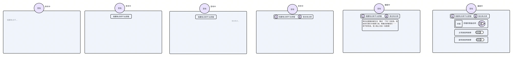
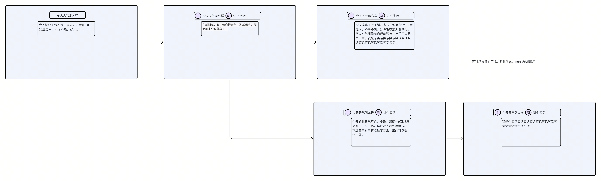

# 【AI汽车-PRD】多人同时语音交互体验

# 

# 

## 
为了确保沟通的精确性，我们首先对核心术语进行统一定义。
为了确保沟通的精确性，我们首先对核心术语进行统一定义。

## 
当多个用户几乎同时对系统说话时，为了避免指令丢失和混乱，我们采用合并处理的策略。
当多个用户几乎同时对系统说话时，为了避免指令丢失和混乱，我们采用合并处理的策略。

### 
> 
> 

### 

### 
显示策略：
显示策略：
识别结果：识别结果【同时】显示主驾驶和副驾驶的指令，主驾驶显示在前，副驾驶显示在后。
识别结果：识别结果【同时】显示主驾驶和副驾驶的指令，主驾驶显示在前，副驾驶显示在后。
卡片展示：
卡片展示：
执行结果中输出多个结果或多个结果替换显示（依赖Planner的输出顺序）
执行结果中输出多个结果或多个结果替换显示（依赖Planner的输出顺序）

「界面展示仅为示例，具体以交互同学为准」
「界面展示仅为示例，具体以交互同学为准」
特殊场景说明：
特殊场景说明：
单人 / 多人语音交互场景下，若用户已向系统发送有效指令，且系统处于处理中、尚未完成指令执行与反馈的阶段，此时若接收到拒识指令，不得打断当前正在处理的有效指令，需继续完成该有效指令的正常执行与结果下发。
单人 / 多人语音交互场景下，若用户已向系统发送有效指令，且系统处于处理中、尚未完成指令执行与反馈的阶段，此时若接收到拒识指令，不得打断当前正在处理的有效指令，需继续完成该有效指令的正常执行与结果下发。
示例：
示例：
单人场景：主驾驶下达指令 “给我讲个笑话吧”，系统未输出笑话内容前，主驾驶又说出无意义语音（拒识），系统仍需继续处理并输出笑话内容。
单人场景：主驾驶下达指令 “给我讲个笑话吧”，系统未输出笑话内容前，主驾驶又说出无意义语音（拒识），系统仍需继续处理并输出笑话内容。
多人合并场景：主驾驶：今天上海天气。 副驾驶：今天北京天气。左后：吧啦吧啦（拒识），系统应继续下发：今天上海和北京的天气
多人合并场景：主驾驶：今天上海天气。 副驾驶：今天北京天气。左后：吧啦吧啦（拒识），系统应继续下发：今天上海和北京的天气

## 
当系统正在执行一个任务时（未执行完/未播报完），另一个用户发起了新的请求并且有下发结果。此时，系统需要根据任务的类型组合，来决定是“打断”、“排队”还是“并行处理”。
当系统正在执行一个任务时（未执行完/未播报完），另一个用户发起了新的请求并且有下发结果。此时，系统需要根据任务的类型组合，来决定是“打断”、“排队”还是“并行处理”。

### 
> 
> 

### 
> 
> 

### 
> 
> 
