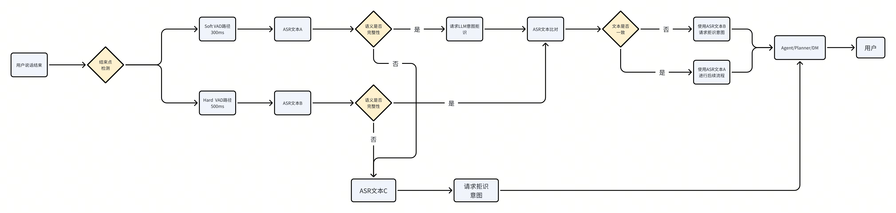

# 【AI汽车-PRD】多级VAD产品体验

# 

# 
在当前的端到端语音交互中，语音活动检测 (VAD) 是决定用户话语何时开始和结束的关键环节，直接影响系统的延迟与响应准确性。传统单次VAD判决的机制，难以在“快速响应”与“语义完整”之间取得理想平衡：过短的VAD窗口可能导致语义不完整，过长则增加用户等待时间。
在当前的端到端语音交互中，语音活动检测 (VAD) 是决定用户话语何时开始和结束的关键环节，直接影响系统的延迟与响应准确性。传统单次VAD判决的机制，难以在“快速响应”与“语义完整”之间取得理想平衡：过短的VAD窗口可能导致语义不完整，过长则增加用户等待时间。
本次需求的核心目标是引入一种时间窗驱动的阶段化处理策略，通过设置不同长度的VAD时间窗（soft/hard/语义），并结合启发式的语义完整性判断，实现对语音输入的渐进式处理。
本次需求的核心目标是引入一种时间窗驱动的阶段化处理策略，通过设置不同长度的VAD时间窗（soft/hard/语义），并结合启发式的语义完整性判断，实现对语音输入的渐进式处理。

# 
多级VAD一共分成三个：Soft VAD，Hard VAD，语义VAD
多级VAD一共分成三个：Soft VAD，Hard VAD，语义VAD
注：VAD的时间，暂定为以上信息，随实车体验后可变更。
注：VAD的时间，暂定为以上信息，随实车体验后可变更。

# 

## 

## 
- [ ] 
- [ ] 
- [ ] 

## 
当前语义完整性，暂不做定义，需测试思必驰输出的完整性结果评测后，再考虑是否「自研」
当前语义完整性，暂不做定义，需测试思必驰输出的完整性结果评测后，再考虑是否「自研」

# 
场景一：流畅成功（抢跑成功）
场景一：流畅成功（抢跑成功）
> 
> 
> 
场景二：抢跑失败
场景二：抢跑失败
> 
> 
> 
场景三：语义不完整处理
场景三：语义不完整处理
> 
> 
> 
2月底演示需求变更
2月底演示需求变更
- [ ] 
- [ ] 
