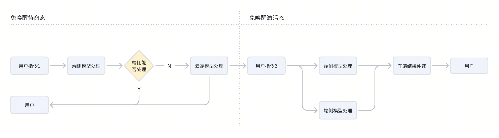
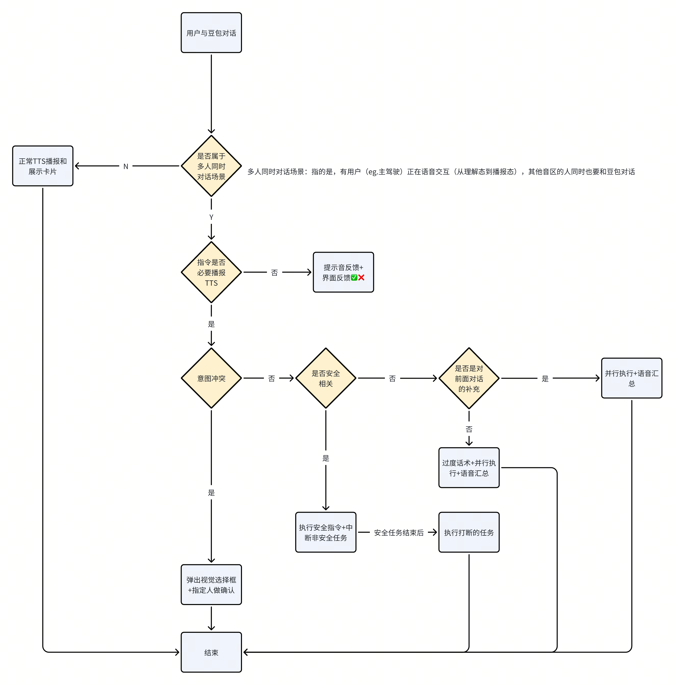

# 【AI汽车-PRD】多音区全时免唤醒交互

版本管理
版本管理

# 
随着智能座舱技术快速发展，用户对车载语音交互的自然性和便捷性要求日益提高。传统"唤醒词+指令"模式在驾驶场景中仍存在操作繁琐、响应延迟等问题。全时免唤醒功能通过允许用户在特定场景下直接下达指令，旨在打造更直观、高效、安全的车载语音交互体验。
随着智能座舱技术快速发展，用户对车载语音交互的自然性和便捷性要求日益提高。传统"唤醒词+指令"模式在驾驶场景中仍存在操作繁琐、响应延迟等问题。全时免唤醒功能通过允许用户在特定场景下直接下达指令，旨在打造更直观、高效、安全的车载语音交互体验。
车内语音交互已从单一用户场景向多用户并发交互演进。现代家庭用车中，平均每车搭载3-4名乘客的场景（特别是面向家庭的车辆），然而，当前主流车载语音产品仍以单个用户为中心设计，缺乏对多用户同时交互的有效支持，因此这类用户需求需要被满足。
车内语音交互已从单一用户场景向多用户并发交互演进。现代家庭用车中，平均每车搭载3-4名乘客的场景（特别是面向家庭的车辆），然而，当前主流车载语音产品仍以单个用户为中心设计，缺乏对多用户同时交互的有效支持，因此这类用户需求需要被满足。

# 

### 
部分车型支持主驾的全时免唤醒全场景指令交互（如：极越01）
部分车型支持主驾的全时免唤醒全场景指令交互（如：极越01）
部分车型支持所有乘客的全时免唤醒（高频）指令交互（如：理想L6，蔚来ES8）
部分车型支持所有乘客的全时免唤醒（高频）指令交互（如：理想L6，蔚来ES8）

### 
市面上基本新能源汽车的语音助手支持连续对话（唤醒后一段时间内可直接对话），并支持设置时间15秒，30秒，60秒
市面上基本新能源汽车的语音助手支持连续对话（唤醒后一段时间内可直接对话），并支持设置时间15秒，30秒，60秒

# 

### 
实现完全免唤醒交互，覆盖驾驶中控制、停车娱乐、多乘客对话等所有场景，打造 "像与朋友对话一样自然" 的语音交互体验。
实现完全免唤醒交互，覆盖驾驶中控制、停车娱乐、多乘客对话等所有场景，打造 "像与朋友对话一样自然" 的语音交互体验。

### 
豆包作为车上的一员，一直在观察（倾听）你们的交流，在需要时可立刻执行你的任务。
豆包作为车上的一员，一直在观察（倾听）你们的交流，在需要时可立刻执行你的任务。
车上所有成员，随时都可以与豆包对话，不冲突不抢占，豆包一直都在。
车上所有成员，随时都可以与豆包对话，不冲突不抢占，豆包一直都在。

### 
通过技术手段确保全时免唤醒过程中的用户隐私，本地语音处理高频问题。
通过技术手段确保全时免唤醒过程中的用户隐私，本地语音处理高频问题。

# 

### 
在系统设置中AI伙伴中「开启」全时免唤醒开关（暂定名称---》可尝试叫“陪伴模式”），该开关默认开启，
在系统设置中AI伙伴中「开启」全时免唤醒开关（暂定名称---》可尝试叫“陪伴模式”），该开关默认开启，
可通过语音指令开启和关闭此功能，指令如「打开全时免唤醒」「打开陪伴模式」
可通过语音指令开启和关闭此功能，指令如「打开全时免唤醒」「打开陪伴模式」

### 
支持车内所有音区（主驾驶，副驾驶，二排左，二排右）的都可以进行免唤醒交互
支持车内所有音区（主驾驶，副驾驶，二排左，二排右）的都可以进行免唤醒交互

### 
需根据车内“座椅传感器“和“Face id”信息，判断当前位置是否有人，如座椅位置无人时，不开启当前音区的交互。
需根据车内“座椅传感器“和“Face id”信息，判断当前位置是否有人，如座椅位置无人时，不开启当前音区的交互。

### 
支持所有场景的免唤醒交互，按使用频率与安全等级划分核心指令集，支持自然口语化表述：
支持所有场景的免唤醒交互，按使用频率与安全等级划分核心指令集，支持自然口语化表述：
> 
> 
> 
> 
> 
> 
> 

### 
> 
> 
> 
> 

### 
豆包持续监听用户在车内的对话，针对车内多个用户的拒识指令，进行话题分类和话题总结，话题可分类：生活日常，兴趣爱好，科技趋势，工作学习，社会时事，情感人际，健康养生，旅行见闻
豆包持续监听用户在车内的对话，针对车内多个用户的拒识指令，进行话题分类和话题总结，话题可分类：生活日常，兴趣爱好，科技趋势，工作学习，社会时事，情感人际，健康养生，旅行见闻
每5轮（暂定）拒识指令进行一次话题分类和总结，如用户指令为正例可召回时，需将前多个话题（暂定前5个）总结内容作为上文补充信息，来进行当前用户指令和意图的正确理解，并进行合理反馈。
每5轮（暂定）拒识指令进行一次话题分类和总结，如用户指令为正例可召回时，需将前多个话题（暂定前5个）总结内容作为上文补充信息，来进行当前用户指令和意图的正确理解，并进行合理反馈。

### 

#### 
场景示例1
场景示例1
用户：今天怎么这么堵，好无聊啊
用户：今天怎么这么堵，好无聊啊
（无需唤醒豆包）
（无需唤醒豆包）
豆包：你关注的博主阿拉比昨天更新了博客信息《xxxx》，我们还没看过，要看看吗？
豆包：你关注的博主阿拉比昨天更新了博客信息《xxxx》，我们还没看过，要看看吗？
用户：OK的，放吧。
用户：OK的，放吧。

#### 
场景示例2
场景示例2
用户：元旦咱们去哪里玩啊。（用户和妻子在交流）
用户：元旦咱们去哪里玩啊。（用户和妻子在交流）
用户妻子：大冬天的，要不咱们去巴厘岛度假吧。（用户和妻子在交流）
用户妻子：大冬天的，要不咱们去巴厘岛度假吧。（用户和妻子在交流）
（豆包保持沉默未打断）
（豆包保持沉默未打断）
用户：挺不错的，我们该怎么计划一下呢？要不让豆包帮忙看看？
用户：挺不错的，我们该怎么计划一下呢？要不让豆包帮忙看看？
（无需唤醒豆包）
（无需唤醒豆包）
豆包：真羡慕你们，想去巴厘岛度假的话，而且还是元旦，我比较推荐4天的行程，另外我查了下飞机票，现在定的话往返机票一个人在4200左右，xxxxxxx～
豆包：真羡慕你们，想去巴厘岛度假的话，而且还是元旦，我比较推荐4天的行程，另外我查了下飞机票，现在定的话往返机票一个人在4200左右，xxxxxxx～

### 

#### 
> 
> 
> 

#### 
> 

### 
语音always on时，考虑用户流量和云端请求流量消耗token较大，将在端侧进行提前预处理，处理完成后再进行后续的端云链路。
语音always on时，考虑用户流量和云端请求流量消耗token较大，将在端侧进行提前预处理，处理完成后再进行后续的端云链路。

备注：链路部分已在离在线仲裁需求中包含，此处有相关性因此展示。
备注：链路部分已在离在线仲裁需求中包含，此处有相关性因此展示。

#### 
用户可以不说唤醒词和豆包直接对话。在免唤醒场景下，为了避免大流量的用户信息上云，因此端侧模型会做预拦截，将能处理的信息召回（明确指令/明确拒识），不能处理的再由云端模型处理。免唤醒激活后，之后的用户指令通常为会继续和豆包对话，此时会进行端云并行同步处理，来保证速度和准确性。
用户可以不说唤醒词和豆包直接对话。在免唤醒场景下，为了避免大流量的用户信息上云，因此端侧模型会做预拦截，将能处理的信息召回（明确指令/明确拒识），不能处理的再由云端模型处理。免唤醒激活后，之后的用户指令通常为会继续和豆包对话，此时会进行端云并行同步处理，来保证速度和准确性。

免唤醒场景上云场景
免唤醒场景上云场景
免唤醒场景下，端侧无法支持的query，需要上云。上云有两种「端侧识别文本上云」和「用户语音音频流式上云」
免唤醒场景下，端侧无法支持的query，需要上云。上云有两种「端侧识别文本上云」和「用户语音音频流式上云」
> 
> 

# 
概览
概览
一台车只有一个豆包伙伴，豆包可以同时倾听多个人的表达，但豆包同时只能回答一个人的问题。
一台车只有一个豆包伙伴，豆包可以同时倾听多个人的表达，但豆包同时只能回答一个人的问题。

#### 
多音区交互：
多音区交互：
车内所有音区为4音区，分别主驾驶，副驾驶，二排左，二排右。（随AI汽车发展，可扩展为5音区，6音区，7音区可能）
车内所有音区为4音区，分别主驾驶，副驾驶，二排左，二排右。（随AI汽车发展，可扩展为5音区，6音区，7音区可能）
整体设计原则：
整体设计原则：
执行某个指令/任务时不播报也可以很好的反馈则不播报，一定要播报需要看指令/任务的紧急程度进行排队或者插队。排队的任务/指令要让其用户感受到豆包已收到的状态。
执行某个指令/任务时不播报也可以很好的反馈则不播报，一定要播报需要看指令/任务的紧急程度进行排队或者插队。排队的任务/指令要让其用户感受到豆包已收到的状态。
整体策略汇总更新【待定】
整体策略汇总更新【待定】

<!-- bitable block (skipped) -->

#### 
1、语音TTS播报
1、语音TTS播报
2、提示音
2、提示音
3、执行成功/失败图标「✅」「❌」
3、执行成功/失败图标「✅」「❌」
4、执行卡片展示
4、执行卡片展示

#### 
- [ ] 
- [ ] 
- [ ] 
- [ ] 
- [ ] 
【以上体验，期望是模型来做，当前只是规则聚合】
【以上体验，期望是模型来做，当前只是规则聚合】

#### 
> 
> 

# 

### 
- [ ] 
> 
> 
- [ ] 
> 
> 
> 
- [ ] 
> 
