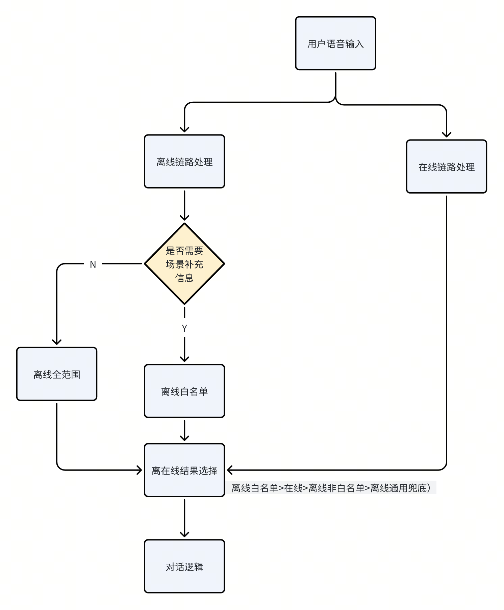
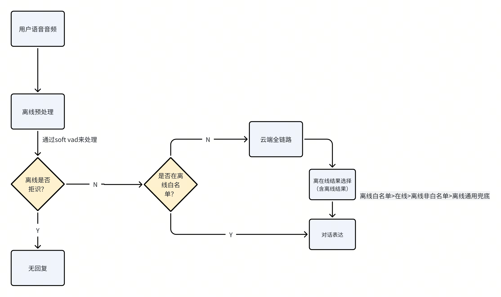
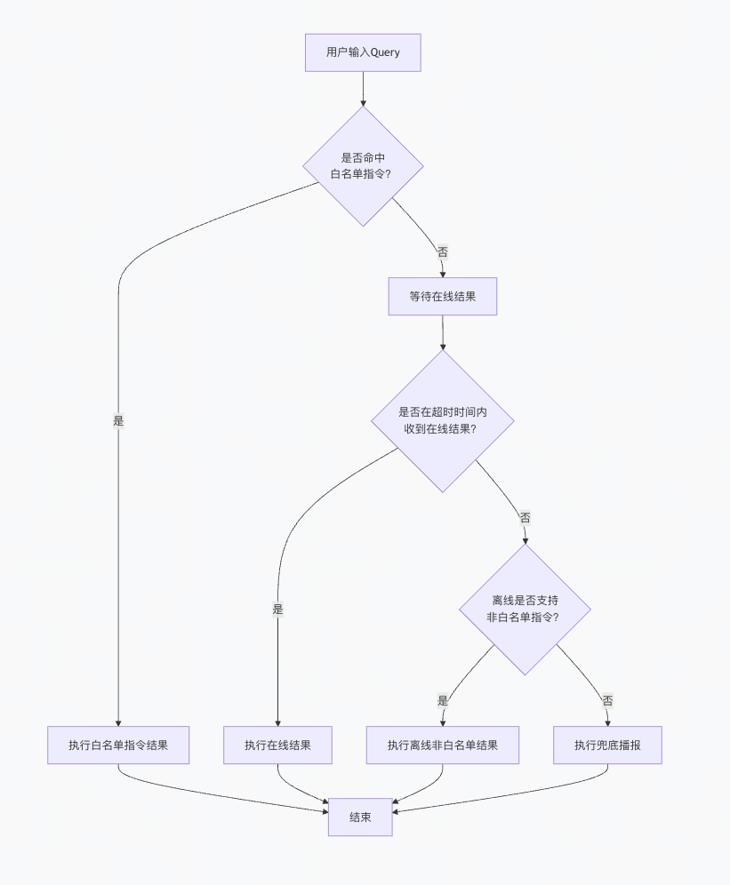

# 【AI汽车-PRD】离在线仲裁

# 

# 

## 
在各种复杂环境下决定用户的需求什么时候用本地（离线）处理，什么时候用云端（在线）。
在各种复杂环境下决定用户的需求什么时候用本地（离线）处理，什么时候用云端（在线）。
无网络时强离线模式，简单高频车控优先离线处理，复杂/内容检索类强在线处理，模糊类内容混合策略根据结果和时间进行仲裁。
无网络时强离线模式，简单高频车控优先离线处理，复杂/内容检索类强在线处理，模糊类内容混合策略根据结果和时间进行仲裁。

## 
离线仲裁的主要目标是提升性能，减少对响应速度、CPU 或资源的消耗，同时提高最终结果的准确率。
离线仲裁的主要目标是提升性能，减少对响应速度、CPU 或资源的消耗，同时提高最终结果的准确率。

## 

### 
车机无网络时，选择离线的结果，离线结果无法理解时，将提示兜底话术（如：没有网络时，我只能支持一些基础功能）
车机无网络时，选择离线的结果，离线结果无法理解时，将提示兜底话术（如：没有网络时，我只能支持一些基础功能）

### 

#### 
- [ ] 
- [ ] 
- [ ] 
补充策略：
补充策略：
 端侧输出的意图=feel的时候，需要等云端结果，不是直接用端上的结果。（feel的意图，一般表达是：我有点冷。  这种表达感受类的query，云端会走planner根据端状态结果来执行）。 
 端侧输出的意图=feel的时候，需要等云端结果，不是直接用端上的结果。（feel的意图，一般表达是：我有点冷。  这种表达感受类的query，云端会走planner根据端状态结果来执行）。 

离线白名单选择逻辑：
离线白名单选择逻辑：
1）用户的query无需结果“情景信息”即可判断出准确意图和执行的结果 2）在线的ASR识别效果会更好。
1）用户的query无需结果“情景信息”即可判断出准确意图和执行的结果 2）在线的ASR识别效果会更好。
白名单包括：
白名单包括：

#### 
语音always on时，考虑用户流量和云端请求流量消耗token较大，将在端侧进行提前预处理，处理完成后再进行后续的端云链路。
语音always on时，考虑用户流量和云端请求流量消耗token较大，将在端侧进行提前预处理，处理完成后再进行后续的端云链路。

