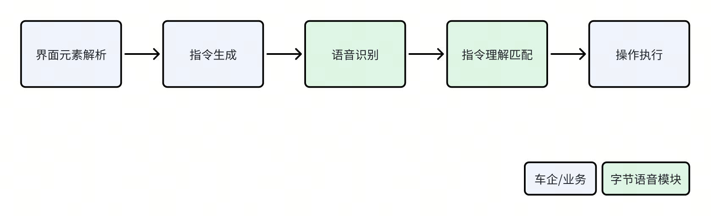

# 【AI汽车】可见即可说框架需求文档

## 
传统语音交互框架需用户记忆固定指令，且指令需提前配置，适配成本高；“可见即可说” 框架旨在解决该问题，通过自动解析界面元素、动态生成语音指令，实现 “屏幕显示什么，用户说什么就能操作”，降低用户使用门槛，同时为开发者提供轻量化、易集成的接入方案
传统语音交互框架需用户记忆固定指令，且指令需提前配置，适配成本高；“可见即可说” 框架旨在解决该问题，通过自动解析界面元素、动态生成语音指令，实现 “屏幕显示什么，用户说什么就能操作”，降低用户使用门槛，同时为开发者提供轻量化、易集成的接入方案

## 

## 

### 
> 
> 

### 
> 
> 
> 
> 

### 
> 
> 
> 

### 
将ASR识别出的文本与注册的“语音指令库”进行匹配，确定用户意图对应的界面元素和操作。
将ASR识别出的文本与注册的“语音指令库”进行匹配，确定用户意图对应的界面元素和操作。
> 
> 
> 

### 
> 
> 
> 
> 

## 

### 
可见即可说属于在语音系统面向 “视觉界面交互场景” 的定制化交互模式，为了让用户看到什么就能说什么，少推理快响应，因此它的优先级应该比较高。
可见即可说属于在语音系统面向 “视觉界面交互场景” 的定制化交互模式，为了让用户看到什么就能说什么，少推理快响应，因此它的优先级应该比较高。
下面列出语音系统各个模块的优先级
下面列出语音系统各个模块的优先级

### 
可见即可说的内容，需进行对话历史中。需在历史对话中标记出来自模拟点击事件，防止下一轮模型推理错误。
可见即可说的内容，需进行对话历史中。需在历史对话中标记出来自模拟点击事件，防止下一轮模型推理错误。
