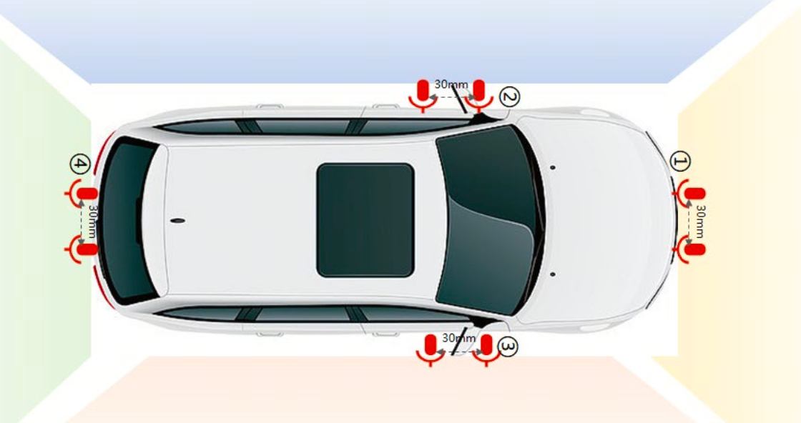
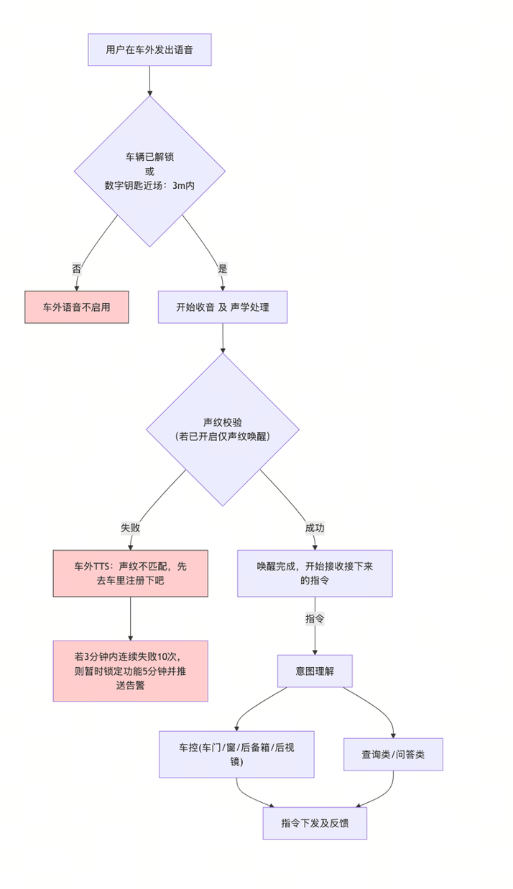
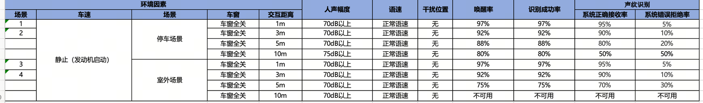

# 【施工中👷】【AI汽车-PRD】车外语音

# 
布置方案：
布置方案：
- [ ] 
②③④不同交互区域；如果需要满足对应的区域建议每个区域布置麦克
②③④不同交互区域；如果需要满足对应的区域建议每个区域布置麦克
风；
风；
- [ ] 
水建议放在底部（具体位置参考实体位置） ；麦克风位置保证不随着后
水建议放在底部（具体位置参考实体位置） ；麦克风位置保证不随着后
视镜折叠移动而移动
视镜折叠移动而移动
- [ ] 
- [ ] 
（具体位置参考实体位置）
（具体位置参考实体位置）
- [ ] 
位置参考实体位置）
位置参考实体位置）
- [ ] 
- [ ] 
布置注意事项：
布置注意事项：
- [ ] 
- [ ] 
- [ ] 
- [ ] 

# 
车外麦克风原始信号采集后，经降噪和回声消除等处理，系统需顺序完成多重条件校验，方可成功唤起车外语音。其中前 4 项为必要条件，第 5 项仅当 “开启声纹唤醒且存在至少一个已注册声纹” 时，才执行校验。
车外麦克风原始信号采集后，经降噪和回声消除等处理，系统需顺序完成多重条件校验，方可成功唤起车外语音。其中前 4 项为必要条件，第 5 项仅当 “开启声纹唤醒且存在至少一个已注册声纹” 时，才执行校验。

# 

# 
车窗、车门、后备箱，等。详细信息待补充
车窗、车门、后备箱，等。详细信息待补充

# 

车外测试场景要求
车外测试场景要求
（1）场景划分：
（1）场景划分：
> 
（2）测试要求：
（2）测试要求：
> 

## 
待补充：
待补充：
车外不支持免唤醒，不支持多音区同时，只有唤醒交互单音区， 可以设置个默认的连续对话时间。
车外不支持免唤醒，不支持多音区同时，只有唤醒交互单音区， 可以设置个默认的连续对话时间。
