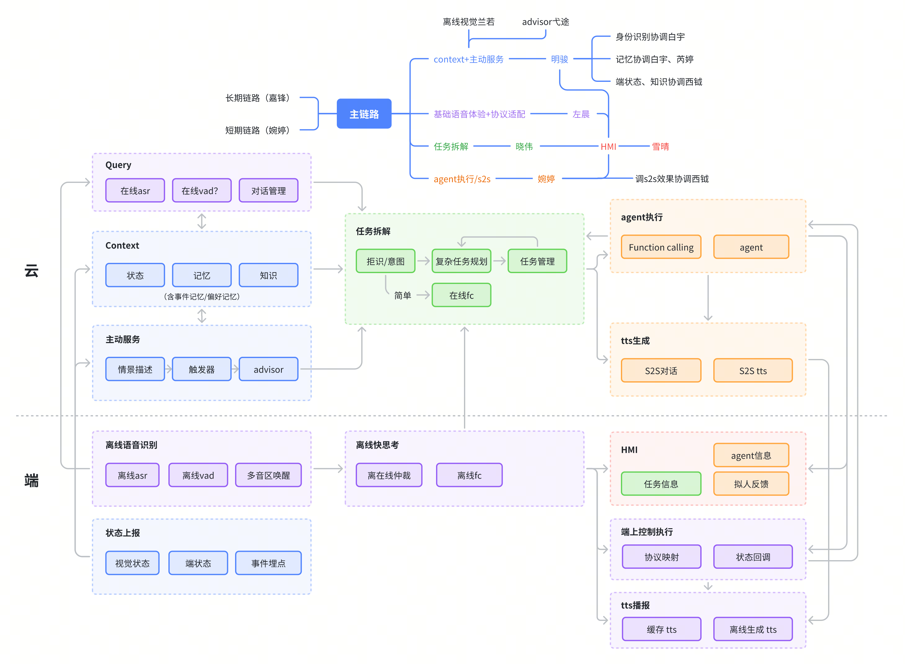
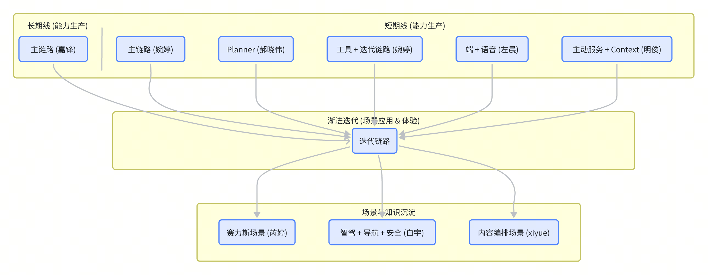

# 产品分工调整计划（25.1.2）

## 
当前全链路所涵盖的模块较多，且模块划分较为分散，导致主链路的整体融合效率偏低。各模块之间的沟通成本较高，难以实现小步快跑式的敏捷迭代，在项目前期容易产生错误落地风险。此外，由于对场景的细化与设计缺乏沉淀，导致评测体系的构建相对滞后，未能形成“链路搭建→评测反馈→快速优化”的良性闭环。
当前全链路所涵盖的模块较多，且模块划分较为分散，导致主链路的整体融合效率偏低。各模块之间的沟通成本较高，难以实现小步快跑式的敏捷迭代，在项目前期容易产生错误落地风险。此外，由于对场景的细化与设计缺乏沉淀，导致评测体系的构建相对滞后，未能形成“链路搭建→评测反馈→快速优化”的良性闭环。
基于上述问题，在当前阶段，对产品团队职责进行拆分调整，实现更聚焦的分工：
基于上述问题，在当前阶段，对产品团队职责进行拆分调整，实现更聚焦的分工：
> 
> 

## 

缩小沟通出口，
缩小沟通出口，
- [ ] 
- [ ] 
- [ ] 

## 
短期线负责从基础体验逐步扩展，长期线负责从最远能力建设逐步释放
短期线负责从基础体验逐步扩展，长期线负责从最远能力建设逐步释放

## 
为了降低跨组对齐成本，我们为每个核心场景设计了体验验收清单。请各场景负责人根据实际情况填充和完善。
为了降低跨组对齐成本，我们为每个核心场景设计了体验验收清单。请各场景负责人根据实际情况填充和完善。
待完善
待完善
- [ ] 
- [ ] 
- [ ] 

### 

### 

### 
