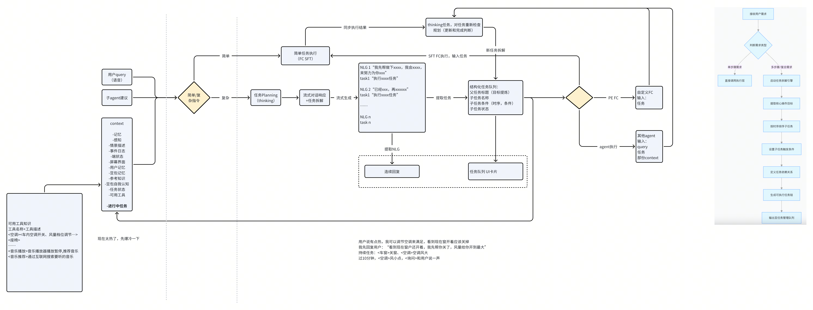

# 任务Planner - PRD 【豆包 in car1.0】

## 

### 

#### 
任务 Planner 模块是 AI 座舱系统的核心功能模块，基于 Thinking 模型构建任务规划引擎，通过时序任务拆解和条件任务链生成，将复杂用户需求转化为可执行的任务序列。系统通过任务状态机实现多任务并发管理，并与 Watcher 模块实时同步上下文，形成 “需求解析 - 任务规划 - 执行反馈 - 动态修正” 的闭环。
任务 Planner 模块是 AI 座舱系统的核心功能模块，基于 Thinking 模型构建任务规划引擎，通过时序任务拆解和条件任务链生成，将复杂用户需求转化为可执行的任务序列。系统通过任务状态机实现多任务并发管理，并与 Watcher 模块实时同步上下文，形成 “需求解析 - 任务规划 - 执行反馈 - 动态修正” 的闭环。

#### 
它像一位 “智能需求管家”，能拆解用户需求并主动规划：
它像一位 “智能需求管家”，能拆解用户需求并主动规划：
> 
> 
> 
> 
> 
> 
解决的车上痛点：
解决的车上痛点：
- [ ] 
- [ ] 
- [ ] 
- [ ] 
- [ ] 

### 
- [ ] 
接收 always on 模块的实时感知情境数据（如用户行为、环境参数）和用户意图（语音 / 触控输入），通过 NLP 语义理解和多模态融合分析，识别用户需求的复杂度等级（单步骤 / 多步骤 / 复合场景）。
接收 always on 模块的实时感知情境数据（如用户行为、环境参数）和用户意图（语音 / 触控输入），通过 NLP 语义理解和多模态融合分析，识别用户需求的复杂度等级（单步骤 / 多步骤 / 复合场景）。
与意图为互补关系：意图将可高速执行的简单指令分流，复杂指令交给 Planner 处理；链路走通后，持续根据实验效果动态调整意图和 Planner 的分工边界。
与意图为互补关系：意图将可高速执行的简单指令分流，复杂指令交给 Planner 处理；链路走通后，持续根据实验效果动态调整意图和 Planner 的分工边界。
- [ ] 
- [ ] 
- [ ] 
执行层返回调节结果后，结合 Watcher 的实时监测数据，动态调整任务参数（如 “风量从 5 档降至 2 档”）或触发子任务（如 “检测到用户入睡后暂停音乐”）。
执行层返回调节结果后，结合 Watcher 的实时监测数据，动态调整任务参数（如 “风量从 5 档降至 2 档”）或触发子任务（如 “检测到用户入睡后暂停音乐”）。

### 
- [ ] 
- [ ] 
- [ ] 
- [ ] 

### 
> 
> 
> 
> 

#### 
> 
> 
> 

## 

### 

- [ ] 
> 
> 
- [ ] 
和意图配合关系参考：
和意图配合关系参考：
优先搭建任务框架，复用现有简单复杂仲裁，待验证效果调整复杂度区分边界。提示词实验：
优先搭建任务框架，复用现有简单复杂仲裁，待验证效果调整复杂度区分边界。提示词实验：
验证种子数据：
验证种子数据：
> 
> 
> 
- [ ] 
> 
> 

### 
- [ ] 
> 
- [ ] 
任务类型与核心拆解原则
任务类型与核心拆解原则
任务拆解需基于用户需求的复杂度和执行关系，分为四大类：单步复杂任务（既包含单步单任务，也包含单步多任务）、条件任务（包含定时任务）、多步任务、持续任务。
任务拆解需基于用户需求的复杂度和执行关系，分为四大类：单步复杂任务（既包含单步单任务，也包含单步多任务）、条件任务（包含定时任务）、多步任务、持续任务。
典型query和场景预期：
典型query和场景预期：
核心原则：
核心原则：
- [ ] 
> 
> 
> 
> 
期望流式拆解，流式提取话术和执行检查变化，达到最快输出响应的效果，参考豆包边想边搜、复杂任务边想边执行的策略，
期望流式拆解，流式提取话术和执行检查变化，达到最快输出响应的效果，参考豆包边想边搜、复杂任务边想边执行的策略，

|  |
| --- |
二、分类型拆解逻辑与示例
二、分类型拆解逻辑与示例
（一）立即执行的单任务（无依赖，单一动作）
（一）立即执行的单任务（无依赖，单一动作）
定义：用户需求可通过单个设备操作完成，无需拆分，直接执行。
定义：用户需求可通过单个设备操作完成，无需拆分，直接执行。
拆解逻辑：
拆解逻辑：
- [ ] 
- [ ] 
- [ ] 
- [ ] 
示例：“外面有点吵”
示例：“外面有点吵”
（二）立即执行的并行多任务（无顺序依赖，同时执行）
（二）立即执行的并行多任务（无顺序依赖，同时执行）
定义：用户需求需多个设备协同操作，且动作无先后顺序，可同时触发。
定义：用户需求需多个设备协同操作，且动作无先后顺序，可同时触发。
拆解逻辑：
拆解逻辑：
- [ ] 
- [ ] 
- [ ] 
- [ ] 
示例：“来个冰爽的氛围”
示例：“来个冰爽的氛围”
（三）按顺序执行的复杂时序任务（有依赖，分步执行）
（三）按顺序执行的复杂时序任务（有依赖，分步执行）
定义：用户需求需多个动作按先后顺序执行（后一步依赖前一步完成），且可能包含用户交互节点。
定义：用户需求需多个动作按先后顺序执行（后一步依赖前一步完成），且可能包含用户交互节点。
拆解逻辑：
拆解逻辑：
- [ ] 
- [ ] 
- [ ] 
- [ ] 
示例：“带我去兜风”
示例：“带我去兜风”
（四）带条件触发的任务（依赖环境/状态，满足条件后执行）
（四）带条件触发的任务（依赖环境/状态，满足条件后执行）
定义：任务执行需满足预设条件（如环境参数、用户状态），条件达成后自动触发动作。
定义：任务执行需满足预设条件（如环境参数、用户状态），条件达成后自动触发动作。
拆解逻辑：
拆解逻辑：
- [ ] 
- [ ] 
- [ ] 
- [ ] 
示例：“温度降到24℃后调小风量”
示例：“温度降到24℃后调小风量”

#### 
> 

### 
- [ ] 
- [ ] 
- [ ] 

### 
待细化，目标是：
待细化，目标是：
- [ ] 
- [ ] 
- [ ] 
- [ ] 
- [ ] 
- [ ] 

### 
- [ ] 
- [ ] 
- [ ] 

<!-- bitable block (skipped) -->

### 
s6-s7开发demo界面，s8-s9对界面进行优化。
s6-s7开发demo界面，s8-s9对界面进行优化。
demo界面的需求详见：
demo界面的需求详见：
优化方案：待补充
优化方案：待补充
- [ ] 
- [ ] 

## 

## 
场景1：“播放2025《我是歌手》决赛第二名的作品”触发条件：用户语音指令包含节目名称、年份、名次，车辆通电且网络连接正常。任务链设计：
场景1：“播放2025《我是歌手》决赛第二名的作品”触发条件：用户语音指令包含节目名称、年份、名次，车辆通电且网络连接正常。任务链设计：
> 
> 
> 
> 
交互设计：
交互设计：
> 
> 
场景2：“导航到上海评分最高的烤鸭店”触发条件：用户语音指令包含城市、品类、排名关键词，导航功能已激活且定位正常。任务链设计：
场景2：“导航到上海评分最高的烤鸭店”触发条件：用户语音指令包含城市、品类、排名关键词，导航功能已激活且定位正常。任务链设计：
- [ ] 
- [ ] 
- [ ] 
- [ ] 
交互设计：
交互设计：
> 
> 

## 
场景1：“带我去兜风”触发条件：用户语音指令含“兜风”“逛逛”等模糊出行意图，车辆静止且导航未激活。任务链设计：
场景1：“带我去兜风”触发条件：用户语音指令含“兜风”“逛逛”等模糊出行意图，车辆静止且导航未激活。任务链设计：
> 
> 
> 
> 
交互设计：
交互设计：
> 
> 
场景2：“编排1小时车内节目”触发条件：用户语音指令含“娱乐节目”“编排”及时长，车辆处于行驶或静止状态。任务链设计：
场景2：“编排1小时车内节目”触发条件：用户语音指令含“娱乐节目”“编排”及时长，车辆处于行驶或静止状态。任务链设计：
> 
> 
> 
> 
交互设计：
交互设计：
> 
> 

## 
场景1：“先冷一会，再调回去”触发条件：用户语音指令含时序调节需求，空调系统已开启且传感器正常。任务链设计：
场景1：“先冷一会，再调回去”触发条件：用户语音指令含时序调节需求，空调系统已开启且传感器正常。任务链设计：
> 
> 
> 
> 
交互设计：
交互设计：
> 
> 
场景2：动态温湿度自适应调节触发条件：传感器持续监测到“用户体表温度＞36.5℃+车内温度＞25℃”≥5分钟，无用户手动干预。任务链设计：
场景2：动态温湿度自适应调节触发条件：传感器持续监测到“用户体表温度＞36.5℃+车内温度＞25℃”≥5分钟，无用户手动干预。任务链设计：
> 
> 
> 
> 
交互设计：
交互设计：
> 
> 

## 
场景1：新手功能引导（新用户首次用车）触发条件：检测到无历史操作记录的用户首次落座，车辆静止且未激活导航。任务链设计：
场景1：新手功能引导（新用户首次用车）触发条件：检测到无历史操作记录的用户首次落座，车辆静止且未激活导航。任务链设计：
> 
> 
> 
> 
交互设计：
交互设计：
> 
> 
场景2：展车功能介绍（潜在客户体验）触发条件：车辆处于“展车模式”（后台手动开启），检测到用户拉开车门。任务链设计：
场景2：展车功能介绍（潜在客户体验）触发条件：车辆处于“展车模式”（后台手动开启），检测到用户拉开车门。任务链设计：
> 
> 
> 
> 
交互设计：
交互设计：
> 
> 

## 
场景1：迎宾与认识任务（新用户首次互动）触发条件：检测到新用户（无历史记录）且首次触发语音交互（如“你好”）。任务链设计：
场景1：迎宾与认识任务（新用户首次互动）触发条件：检测到新用户（无历史记录）且首次触发语音交互（如“你好”）。任务链设计：
> 
> 
> 
> 
交互设计：
交互设计：
> 
> 
场景2：成语接龙（持续互动）触发条件：用户语音指令“玩成语接龙”，或检测到“车辆静止+用户无操作≥5分钟”（判定闲暇状态）。任务链设计：
场景2：成语接龙（持续互动）触发条件：用户语音指令“玩成语接龙”，或检测到“车辆静止+用户无操作≥5分钟”（判定闲暇状态）。任务链设计：
> 
> 
> 
> 
交互设计：
交互设计：
> 
> 

## 
触发条件：后排检测到儿童座椅（传感器）且车速＞30km/h。任务链设计：
触发条件：后排检测到儿童座椅（传感器）且车速＞30km/h。任务链设计：
> 
> 
> 
> 
交互设计：
交互设计：
> 
> 

## 
触发条件：用户语音指令“准备露营”且车辆静止（手刹拉起）。任务链设计：
触发条件：用户语音指令“准备露营”且车辆静止（手刹拉起）。任务链设计：
> 
> 
> 
> 
交互设计：
交互设计：
> 
> 

## 

### 
https://bytedance.larkoffice.com/sync/Tm3Cd5pnQsGhTEbFDCwcnA7MnQh
https://bytedance.larkoffice.com/sync/Tm3Cd5pnQsGhTEbFDCwcnA7MnQh

### 
planner首字响应P50 ≤ 500ms，planner首字响应P90 ≤ 800ms。
planner首字响应P50 ≤ 500ms，planner首字响应P90 ≤ 800ms。

### 
整体质量目标：planner推理ACC ≥ 90%，planner端状态回复ACC ≥ 93%。
整体质量目标：planner推理ACC ≥ 90%，planner端状态回复ACC ≥ 93%。
从任务拆解完整性角度：
从任务拆解完整性角度：
对于planner的任务拆解，当存在缺失操作、冗余操作或错误操作任一时，定义为fail。
对于planner的任务拆解，当存在缺失操作、冗余操作或错误操作任一时，定义为fail。
从融合意图分类准确率的角度：
从融合意图分类准确率的角度：
planner代替了原来的意图分类，需要准备不同意图的测试集，系统评估针对明确意图的case，planner的区分准确率。
planner代替了原来的意图分类，需要准备不同意图的测试集，系统评估针对明确意图的case，planner的区分准确率。
eg. 准备一批音乐搜推的case，评测planner的工具调用准确率。
eg. 准备一批音乐搜推的case，评测planner的工具调用准确率。
评测意图包括：1、POI（美食、景点、娱乐、住宿、场所）；2、短视频；3、音乐；4、状态查询；5、车书；6、联网；7、车控；8、演绎闲聊。
评测意图包括：1、POI（美食、景点、娱乐、住宿、场所）；2、短视频；3、音乐；4、状态查询；5、车书；6、联网；7、车控；8、演绎闲聊。
原始全量意图参考：
原始全量意图参考：
闲聊评测：
闲聊评测：
需要对planner处理闲聊的能力进行系统地评测，摸排planner相比s2s是否有差距以及哪块表现不好，用于指导下一步优化。
需要对planner处理闲聊的能力进行系统地评测，摸排planner相比s2s是否有差距以及哪块表现不好，用于指导下一步优化。
1205用s2s的测试集（）把planner的prompt跑一轮，1205出结果后进行人工标注。
1205用s2s的测试集（）把planner的prompt跑一轮，1205出结果后进行人工标注。

### 
> 
- [ ] 
- [ ] 
- [ ] 
> 

### 
> 
- [ ] 
- [ ] 
- [ ] 
> 

## 
