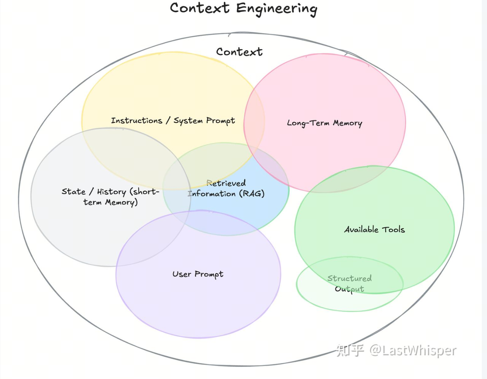
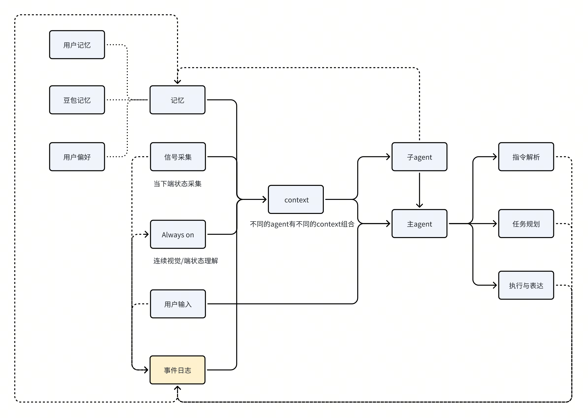
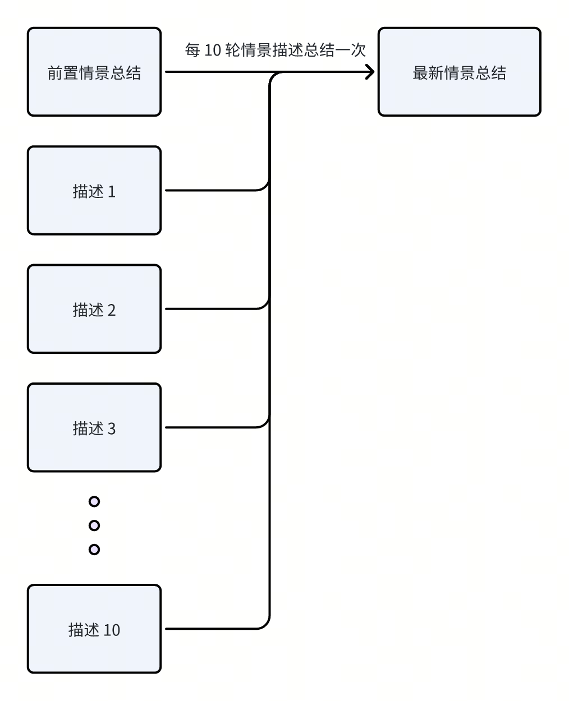

# 公共Context管理-豆包 【AI car 1.0】

#### 
Context = 传给模型那些上下文信息，每个 Agent 需要用到的 Context是不同的。
Context = 传给模型那些上下文信息，每个 Agent 需要用到的 Context是不同的。
但因为有很多公用的部分，所以可以统一做一套公共的 Context服务来管理维护公用的Context。核心功能有两个
但因为有很多公用的部分，所以可以统一做一套公共的 Context服务来管理维护公用的Context。核心功能有两个
> 
> 

#### 
概念澄清
概念澄清
- [ ] 

> 
> 

#### 
需要压缩总结的信息包含
需要压缩总结的信息包含
> 

#### 
> 
> 
> 
> 
端状态筛选：
端状态筛选：
记忆筛选：
记忆筛选：
