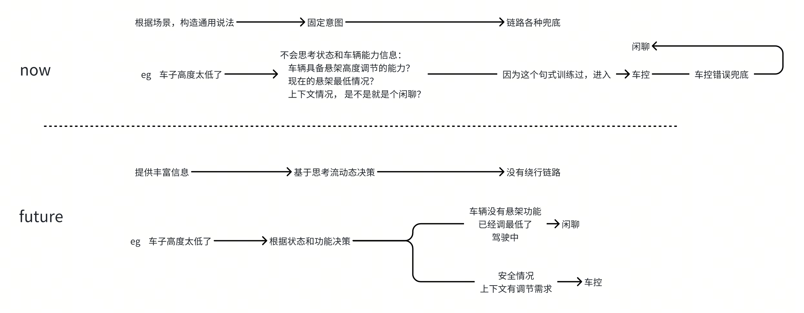
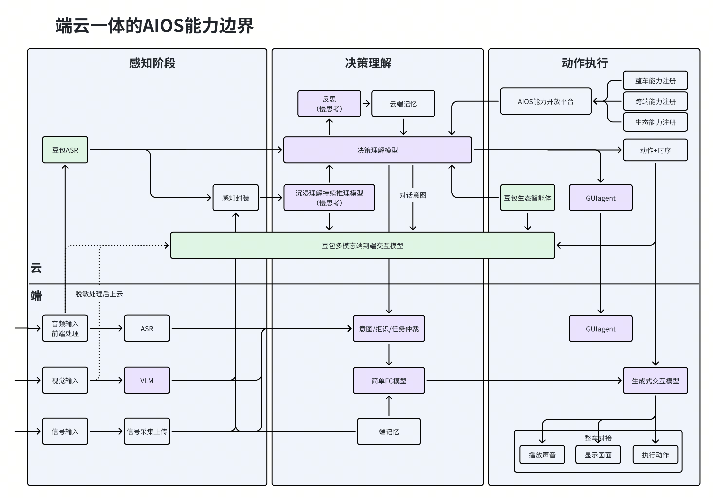
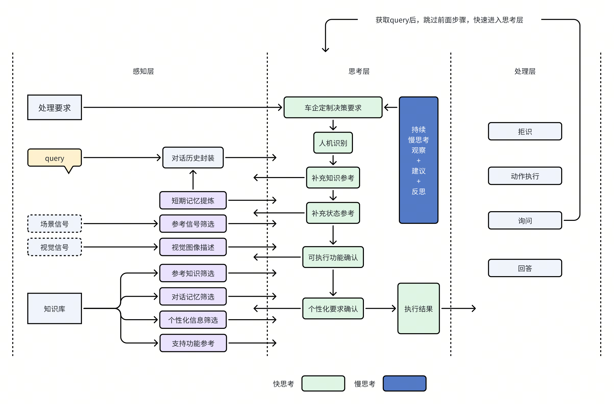
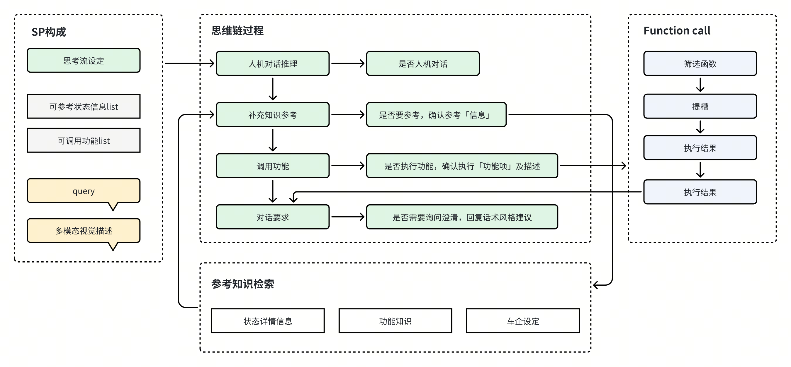

# 基于COT的新快慢思考架构实验

### 
本质上现在还是NLU的做法增强版，并不是真正充分应用大模型思考能力的架构。
本质上现在还是NLU的做法增强版，并不是真正充分应用大模型思考能力的架构。

- [ ] 
- [ ] 
- [ ] 

### 
基于以上问题，当前急需参考行业流行的mcp agent的方式，通过思维链推理，
基于以上问题，当前急需参考行业流行的mcp agent的方式，通过思维链推理，
> 
> 
> 
实现把将扁平的分类逻辑，通过COT升级成立体的思维链流程逻辑。
实现把将扁平的分类逻辑，通过COT升级成立体的思维链流程逻辑。
参考人类处理的逻辑，将思考架构分成三层
参考人类处理的逻辑，将思考架构分成三层

- [ ] 
- [ ] 
- [ ] 
预期效果
预期效果
- [ ] 
- [ ] 
- [ ] 
- [ ] 
- [ ] 
- [ ] 
- [ ] 
技术机会
技术机会
- [ ] 
- [ ] 
- [ ] 
- [ ] 
基于以上新技术效果，能够做到快速的又聪明的推理思考能力
基于以上新技术效果，能够做到快速的又聪明的推理思考能力
快慢思考设计预想
快慢思考设计预想

示例
示例
query：雨刮器怎么这么慢？
query：雨刮器怎么这么慢？
现状：意图进入车书，进入车控分不清楚
现状：意图进入车书，进入车控分不清楚
理想输出示例：
理想输出示例：
结合上下文，该query是【人机对话】
结合上下文，该query是【人机对话】
参考【雨刮器=自动模式】状态，视觉图像【驾驶员在手动拨雨刮器，表情焦虑】
参考【雨刮器=自动模式】状态，视觉图像【驾驶员在手动拨雨刮器，表情焦虑】
可以直接执行【雨刮器速度调节】【车控操作】
可以直接执行【雨刮器速度调节】【车控操作】
无可参考【个性记忆】
无可参考【个性记忆】
因为用户表达了疑问，需要【询问引导】在控制后向用户询问是否满足诉求
因为用户表达了疑问，需要【询问引导】在控制后向用户询问是否满足诉求
query：终点附近有什么好玩的地方？
query：终点附近有什么好玩的地方？
现状：无法利用状态和记忆
现状：无法利用状态和记忆
输出示例：
输出示例：
结合上下文，该query是【人机对话】
结合上下文，该query是【人机对话】
参考【导航目的地=人民广场】状态，视觉图像【副驾坐着儿童】
参考【导航目的地=人民广场】状态，视觉图像【副驾坐着儿童】
可以直接执行【POI推荐】【导航操作】
可以直接执行【POI推荐】【导航操作】
可参考【个性记忆】【曾去过儿童运动观】
可参考【个性记忆】【曾去过儿童运动观】
查到相关【POI要求】【减少推荐按摩洗浴类场所】
查到相关【POI要求】【减少推荐按摩洗浴类场所】
因为用户表达了疑问，需要【回复引导】提供推荐POI的理由
因为用户表达了疑问，需要【回复引导】提供推荐POI的理由

### 
方案
方案

A：推理重构拒识+意图
A：推理重构拒识+意图
> 
> 
> 
> 
B：意图中，增加FC执行动作的关键结论推理
B：意图中，增加FC执行动作的关键结论推理
> 
> 
> 
C：输入状态参考信息
C：输入状态参考信息
> 
> 
D：记忆提取和应用
D：记忆提取和应用
> 
> 
实验步骤
实验步骤
第一步：搭建初步框架
第一步：搭建初步框架
> 
→：判断是否人机对话（给一个人机对话标准参考）
→：判断是否人机对话（给一个人机对话标准参考）
→：判断是否需要参考某些知识或者车辆状态，若需，输出需要哪些状态（给一个状态参考表）（给一个是否要参考状态的标准）
→：判断是否需要参考某些知识或者车辆状态，若需，输出需要哪些状态（给一个状态参考表）（给一个是否要参考状态的标准）
→：判断是否要调用某些功能，来满足要求（可执行功能参考）（给一个执行功能的原则），若要执行，执行的结果项及调用要求描述。
→：判断是否要调用某些功能，来满足要求（可执行功能参考）（给一个执行功能的原则），若要执行，执行的结果项及调用要求描述。
→：最后话术要求，询问澄清，基于功能执行结果响应，纯聊天，信息回答
→：最后话术要求，询问澄清，基于功能执行结果响应，纯聊天，信息回答
> 
> 
> 
第二步：尝试优化FC
第二步：尝试优化FC
> 
> 
> 
第三步：尝试优化拒识、意图和推理效果
第三步：尝试优化拒识、意图和推理效果
> 
> 
基于以上实验，判定：
基于以上实验，判定：
> 
> 

### 
阶段一：FC优化（6月）
阶段一：FC优化（6月）
> 
> 
阶段二：拒识、意图优化（6月之后）
阶段二：拒识、意图优化（6月之后）
> 
> 
阶段三：个性记忆、场景推荐优化（7月之后）
阶段三：个性记忆、场景推荐优化（7月之后）
> 
> 
