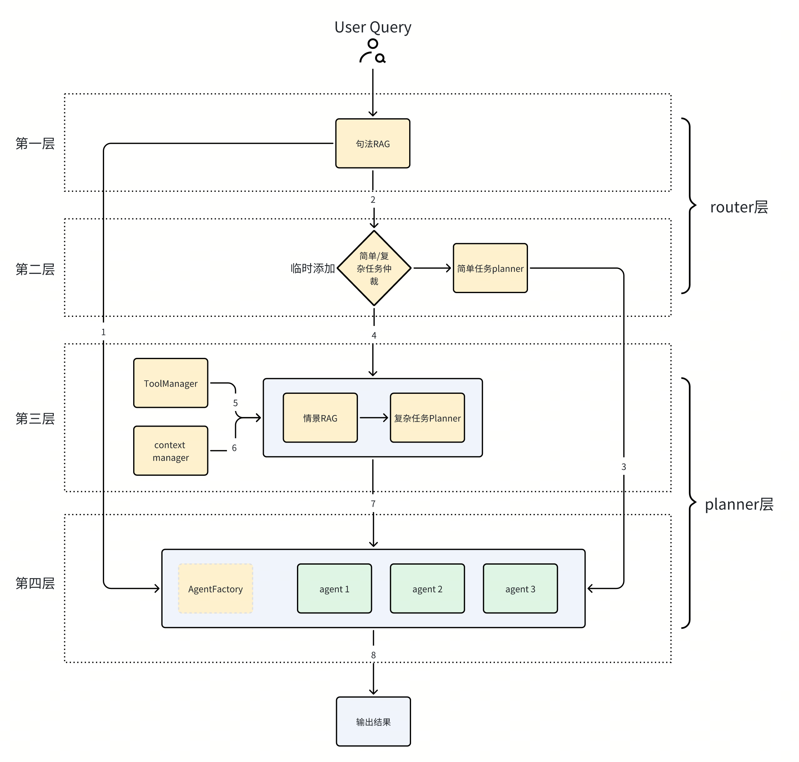
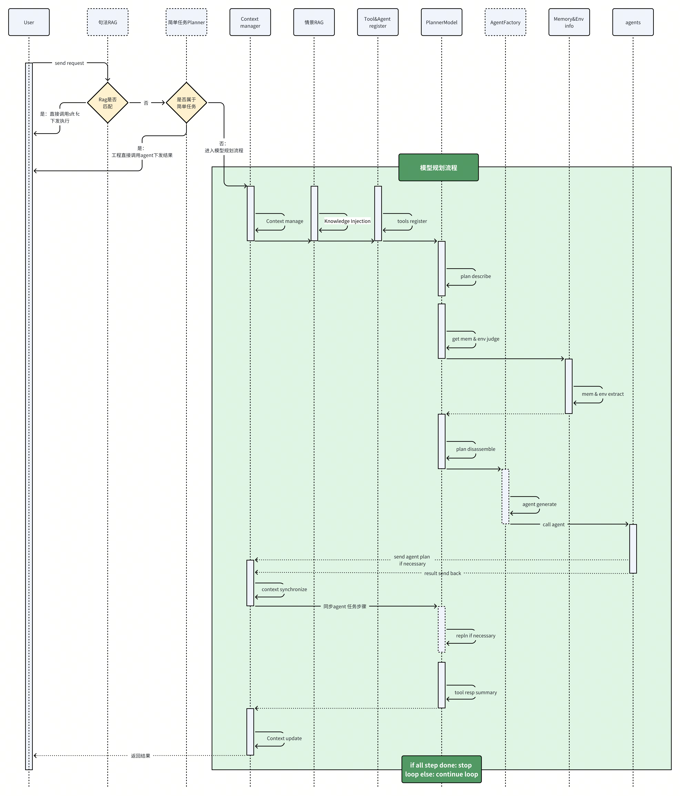
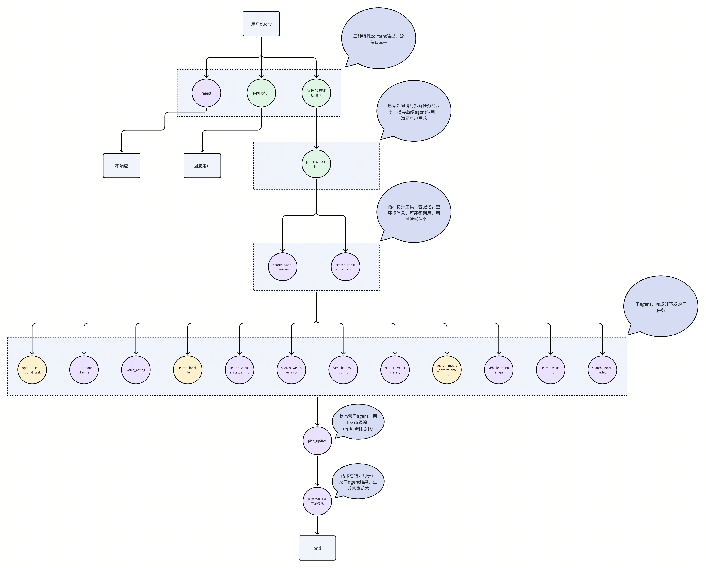
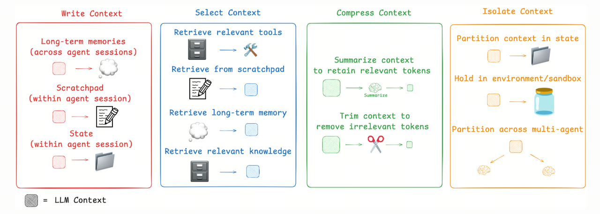
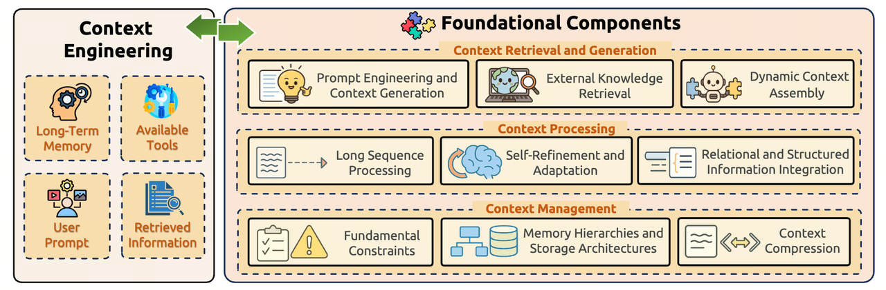
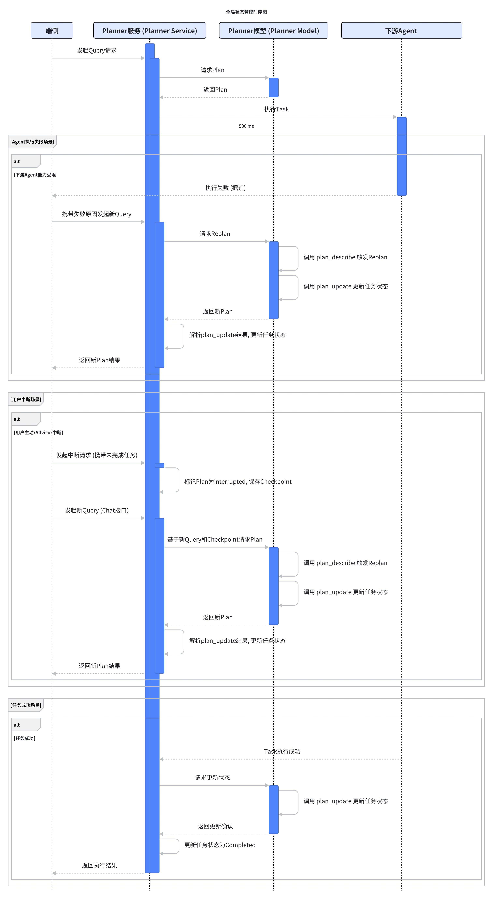
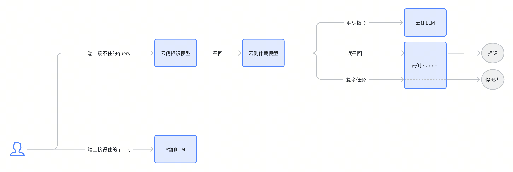

# 座舱Planner OnePage

# 
> 

# 
> 

# 
> 
> 
> 

# 

## 
主观评测下来，doubao-1.8效果明显好于kimi-k2；由于seed-1.8 force发布时间为12.18，因此s07暂时使用kimi，加入闲聊功能后，kimi会有一些稳定性问题；12.18 即 s08 第一周切换doubao-1.8模型。后续所有迭代训练任务均在doubao家族模型上进行。
主观评测下来，doubao-1.8效果明显好于kimi-k2；由于seed-1.8 force发布时间为12.18，因此s07暂时使用kimi，加入闲聊功能后，kimi会有一些稳定性问题；12.18 即 s08 第一周切换doubao-1.8模型。后续所有迭代训练任务均在doubao家族模型上进行。

## 
引用：planner架构思考
引用：planner架构思考
> 

## 

# 

## 

## 

# 

## 

### 
> 

<!-- bitable block (skipped) -->

### 
> 

<!-- bitable block (skipped) -->

### 
> 

<!-- bitable block (skipped) -->

### 
> 

<!-- bitable block (skipped) -->

## 

### 
> 

### 
> 

# 

# 

## 

### 
> 
> 

### 
> 
> 
> 
> 
> 
> 

### 
> 

引用：https://rlancemartin.github.io/2025/06/23/context_engineering/
引用：https://rlancemartin.github.io/2025/06/23/context_engineering/
> 

引用：《A Survey of Context Engineering for Large Language Models》
引用：《A Survey of Context Engineering for Large Language Models》

## 
> 

### 
> 

### 
> 

### 
> 

## 
> 

### 
> 

### 
> 

### 
> 

# 

## 
对用户复杂指令拆分到下游子Agent可执行的维度，满足：
对用户复杂指令拆分到下游子Agent可执行的维度，满足：
> 
> 
> 

<!-- bitable block (skipped) -->

## 
意义：
意义：
- [ ] 
- [ ] 
- [ ] 
- [ ] 
- [ ] 
方案：
方案：
前提：在query级别上进行处理，每一个query对应唯一plan_id。
前提：在query级别上进行处理，每一个query对应唯一plan_id。
思路：Planner模型+工程侧全局State配合。Planner将复杂任务拆解到agent list维度后，Planner model依靠plan_update function call输出失败 ， 已完成，待完成任务的结构化数据，工程端解析结果，将每个任务的状态存入全局State，同时放入messages，做到每个任务可被追踪。
思路：Planner模型+工程侧全局State配合。Planner将复杂任务拆解到agent list维度后，Planner model依靠plan_update function call输出失败 ， 已完成，待完成任务的结构化数据，工程端解析结果，将每个任务的状态存入全局State，同时放入messages，做到每个任务可被追踪。

### 
> 

### 
场景描述：用户主动/advisor中断：若前一个query对应的plan未全部执行完毕，被新的query打断
场景描述：用户主动/advisor中断：若前一个query对应的plan未全部执行完毕，被新的query打断
处理流程：
处理流程：

### 
场景描述：当用户下达的指令包含未来特定时间或条件触发的动作时，任务需要被“挂起”，直到满足预设条件后再继续执行。这类任务通常涉及持续性的状态监听和条件判断。
场景描述：当用户下达的指令包含未来特定时间或条件触发的动作时，任务需要被“挂起”，直到满足预设条件后再继续执行。这类任务通常涉及持续性的状态监听和条件判断。
处理流程：
处理流程：

### 
- [ ] 
- [ ] 

## 

# 

## 

## 

### 
> 
> 
模型选型：Seed 1.6 flash SFT实现
模型选型：Seed 1.6 flash SFT实现

### 
在Plan Describe阶段之前，引入拒识思考。content直接输出reject，不进行后续的拆解等其他逻辑，在当前语境下，判断是否为应当拒识的Query：若是，则直接输出reject，结束回复，不再进入后续plan流程。该方式存在一些缺点，包括格式输出不符合规定等，暂时没有想到好的解决办法
在Plan Describe阶段之前，引入拒识思考。content直接输出reject，不进行后续的拆解等其他逻辑，在当前语境下，判断是否为应当拒识的Query：若是，则直接输出reject，结束回复，不再进入后续plan流程。该方式存在一些缺点，包括格式输出不符合规定等，暂时没有想到好的解决办法

# 

## 
第一阶段：
第一阶段：
第二阶段：
第二阶段：

## 

# 

## 

### 
> 
> 

### 

#### 

<!-- bitable block (skipped) -->

#### 

<!-- bitable block (skipped) -->

# 
> 

# 
> 
> 

# 

# 

# 

# 

# 
[1] Embodied AI Agents Modeling the World.pdf[J].
[1] Embodied AI Agents Modeling the World.pdf[J].
[2] XING E, DENG M, HOU J, et al. Critiques of World Models[J].
[2] XING E, DENG M, HOU J, et al. Critiques of World Models[J].
[3] 
[3] 
[4] Manus 内部的 Context 工程经验 https://zhuanlan.zhihu.com/p/1929862808893383604
[4] Manus 内部的 Context 工程经验 https://zhuanlan.zhihu.com/p/1929862808893383604
[5] 
[5] 
[6] HUANG X, LIU W, CHEN X, et al. Understanding the planning of LLM agents: A survey[J].
[6] HUANG X, LIU W, CHEN X, et al. Understanding the planning of LLM agents: A survey[J].
[7] 
[7] 
[8] 
[8] 
[9] 
[9] 
[10] 
[10] 
[11] 
[11] 
[12] （0.5旧版本）
[12] （0.5旧版本）
[13] 
[13] 
[14] 
[14] 
[15] 
[15] 

# 
