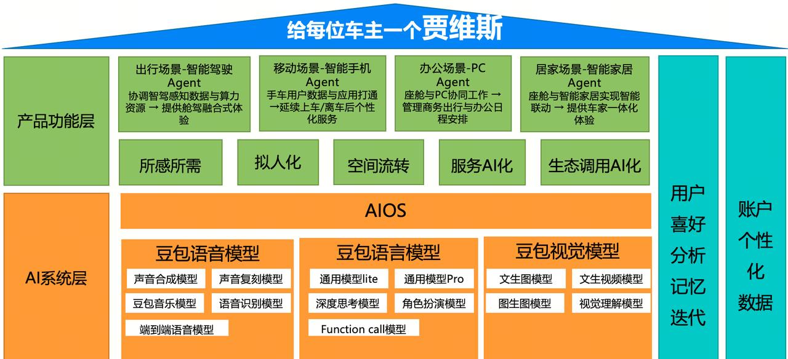
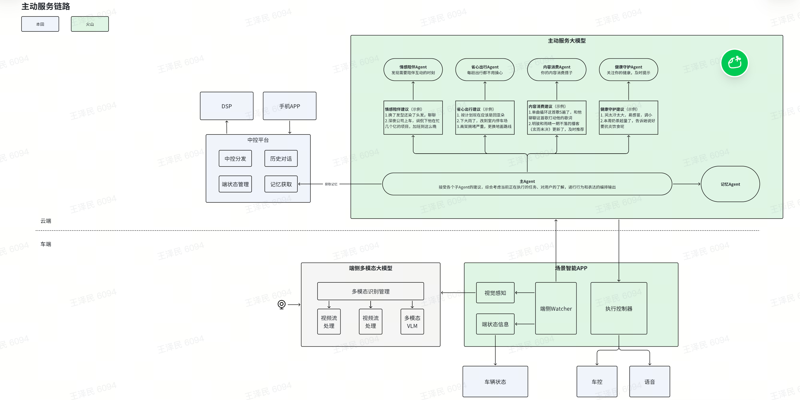

# 本田HC5.0平台提案

# 
豆包大模型是中国发展最快最好的大模型之一。
豆包大模型是中国发展最快最好的大模型之一。
丰富的模型家族：有数十款模型，覆盖LLM、VLM、AIGC模型，包含最新的Doubao-seed-1.6语言模型、Function call模型、角色扮演模型、Embedding模型、语音识别/合成/声音复刻模型、音乐生成模型、图片生成模型、视频生成模型等等。
丰富的模型家族：有数十款模型，覆盖LLM、VLM、AIGC模型，包含最新的Doubao-seed-1.6语言模型、Function call模型、角色扮演模型、Embedding模型、语音识别/合成/声音复刻模型、音乐生成模型、图片生成模型、视频生成模型等等。
强大的性能表现：纯文本理解能力（Doubao-seed-1.6）和视觉理解能力(Doubao-seed-1.5-vison)的模型能力在公开测试集评测中居于国内大模型的首位。
强大的性能表现：纯文本理解能力（Doubao-seed-1.6）和视觉理解能力(Doubao-seed-1.5-vison)的模型能力在公开测试集评测中居于国内大模型的首位。

|  |
| --- |
强大的成本优势：拥有最强的模型性价比，大幅降低企业使用大模型的成本。2024年5月的Doubao模型和价格的发布，拉动国内大模型的调用费用降低90%。
强大的成本优势：拥有最强的模型性价比，大幅降低企业使用大模型的成本。2024年5月的Doubao模型和价格的发布，拉动国内大模型的调用费用降低90%。

# 
本项目理念是为车企提供深度赋能，推动汽车从“智能汽车+AI功能”的传统模式，向完整智能属性的真正AI汽车方向靠拢，助力车企实现从“智能驾驶工具”到“智能移动空间”的战略转型。
本项目理念是为车企提供深度赋能，推动汽车从“智能汽车+AI功能”的传统模式，向完整智能属性的真正AI汽车方向靠拢，助力车企实现从“智能驾驶工具”到“智能移动空间”的战略转型。
- [ ] 
- [ ] 
- [ ] 
- [ ] 

# 

## 

## 

## 
云端新架构
云端新架构
> 
> 
识别大模型
识别大模型
> 
> 
> 
> 
识别专项优化
识别专项优化
> 
> 
> 

## 

## 

## 
应用豆包 S2S（Speech to Speech，语音到语音）模型核心能力，提供高拟人的角色闲聊。
应用豆包 S2S（Speech to Speech，语音到语音）模型核心能力，提供高拟人的角色闲聊。
- [ ] 
- [ ] 
- [ ] 
- [ ] 
- [ ] 

# 

## 
通过全模态的Watcher，持续地感知情景，发现情景中值得开启思考的事件后，由多种专业的子Agent，进行thinking思考，给出主动服务建议，各类建议会综合被主Agent接受，融合记忆等信息做出最终执行表达。
通过全模态的Watcher，持续地感知情景，发现情景中值得开启思考的事件后，由多种专业的子Agent，进行thinking思考，给出主动服务建议，各类建议会综合被主Agent接受，融合记忆等信息做出最终执行表达。
对比传统基于规则式的主动服务，有以下特点：
对比传统基于规则式的主动服务，有以下特点：

## 

## 

# 
本次依赖端侧大模型进行视觉信息的感知，其语义信息用于辅助作为大模型的输入信息之一。
本次依赖端侧大模型进行视觉信息的感知，其语义信息用于辅助作为大模型的输入信息之一。

## 

## 

# 

# 
