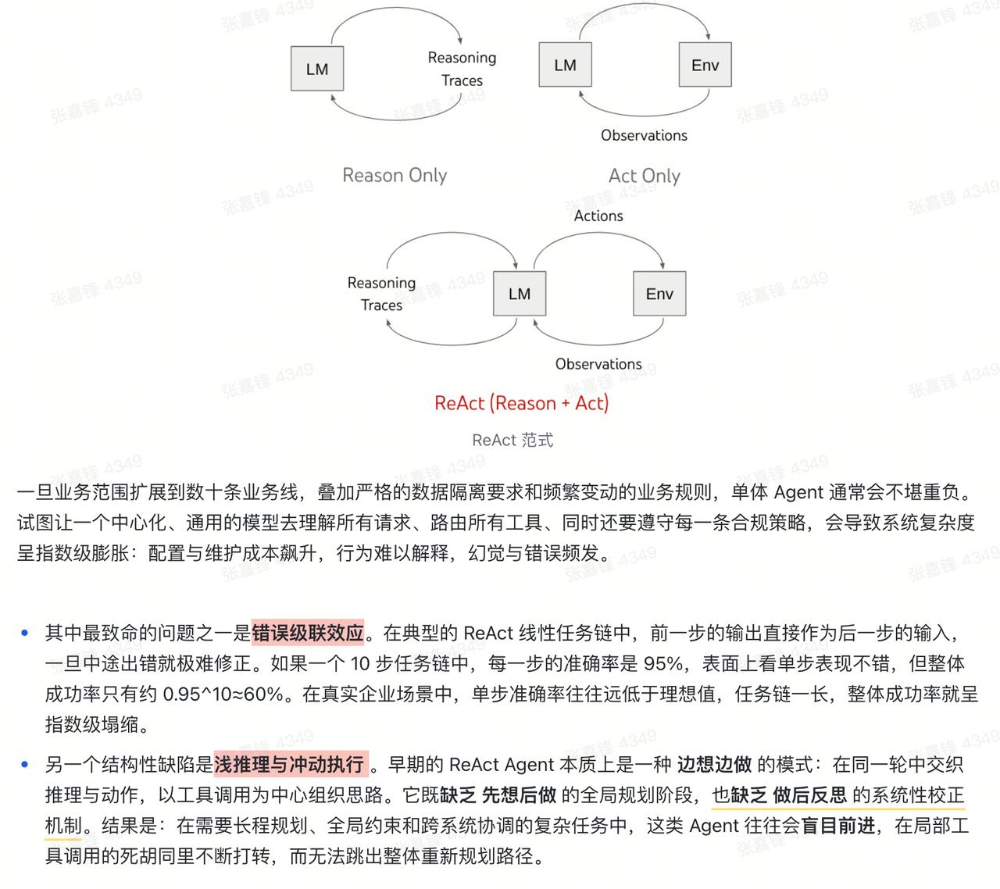
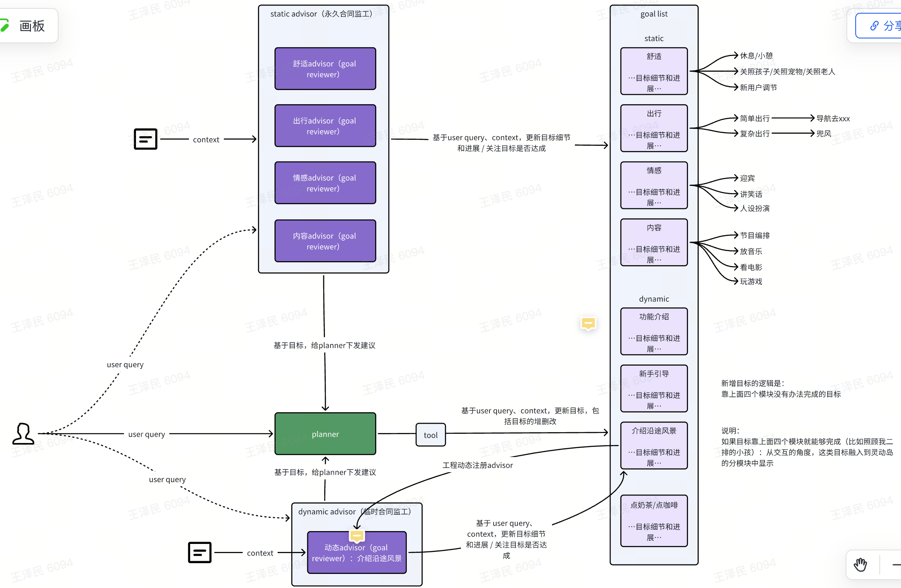
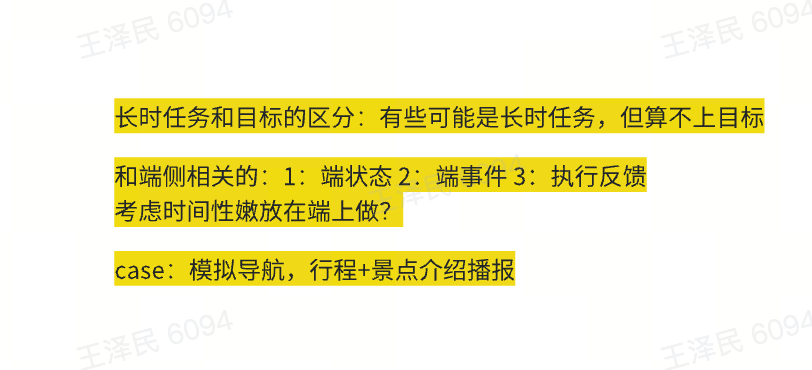

# 目标驱动的任务管理和对话管理体系

# 
我们还是先看当前planner存在的问题：
我们还是先看当前planner存在的问题：
- [ ] 

> [!note] 

> [!note] 

- [ ] 
- [ ] 
- [ ] 

# 
针对以上的问题，我们提出目标的驱动方式。
针对以上的问题，我们提出目标的驱动方式。
解决什么问题：
解决什么问题：
> 
> 
> 
做法是什么：
做法是什么：
> 
> 
> 
期望实现的体验描述：
期望实现的体验描述：
> 
> 
> 
大致链路：
大致链路：

澄清一下上面提到的几个名词：
澄清一下上面提到的几个名词：

# 

## 

### 
> 
> 
> 

### 

## 
在原先的框架里，我们已经定义了4个advisor，这4个advisor会基于当前情景，生成主动服务推荐。
在原先的框架里，我们已经定义了4个advisor，这4个advisor会基于当前情景，生成主动服务推荐。
在新的框架里，4个静态advisor的职责有所新增。除主动服务之外，还需要关注目标是否达成，以及是否需要更新目标目标的细节和进展。
在新的框架里，4个静态advisor的职责有所新增。除主动服务之外，还需要关注目标是否达成，以及是否需要更新目标目标的细节和进展。

## 
什么是动态advisor：
什么是动态advisor：
基于创建的新目标（比如功能介绍、新手引导、介绍沿途风景、点咖啡/奶茶等），工程动态注册的advisor（模板化prompt），目标达成/目标取消/目标变更后生命周期结束。
基于创建的新目标（比如功能介绍、新手引导、介绍沿途风景、点咖啡/奶茶等），工程动态注册的advisor（模板化prompt），目标达成/目标取消/目标变更后生命周期结束。
什么情况下会创建动态advisor：
什么情况下会创建动态advisor：
> 
动态advisor prompt模版：
动态advisor prompt模版：
xxx
xxx

## 
- [ ] 
- [ ] 
- [ ] 
- [ ] 
- [ ] 

# 

## 
case1（顺着豆包走完流程）:
case1（顺着豆包走完流程）:
Q=介绍一下这台车的功能
Q=介绍一下这台车的功能
A=这台车的亮点功能可多啦……
A=这台车的亮点功能可多啦……
case2（不顺着豆包的话中间自由穿插任务）：
case2（不顺着豆包的话中间自由穿插任务）：
Q=介绍一下这台车的功能
Q=介绍一下这台车的功能
A=这台车的亮点功能可多啦，首先是智能驾驶……；其次是智能座舱，你可以通过喊豆包豆包，来完成各种车控，包括多媒体、导航，此外，我还可以帮你做很多别的事情（被打断）
A=这台车的亮点功能可多啦，首先是智能驾驶……；其次是智能座舱，你可以通过喊豆包豆包，来完成各种车控，包括多媒体、导航，此外，我还可以帮你做很多别的事情（被打断）
Q=导航去赛力斯集团（龙兴基地），走最快的路线
Q=导航去赛力斯集团（龙兴基地），走最快的路线
A=好的，找到多个目的地，你选择一个吧
A=好的，找到多个目的地，你选择一个吧
Q=第一个
Q=第一个
A=好的，为你发起导航了，全程13公里，预计需要20分钟
A=好的，为你发起导航了，全程13公里，预计需要20分钟
A=A=刚刚被打断啦，我们接着来介绍吧～刚刚说到，我可以帮你做很多别的事情，包括……
A=A=刚刚被打断啦，我们接着来介绍吧～刚刚说到，我可以帮你做很多别的事情，包括……

## 

## 

## 

## 

# 

## 
如果一次vad判停后，上一次planner的思考还没有出话术： 则第一个进程被打断，工程把两次输入合并后重新请求planner；
如果一次vad判停后，上一次planner的思考还没有出话术： 则第一个进程被打断，工程把两次输入合并后重新请求planner；
eg.
eg.
user：给我讲讲今天的财经新闻
user：给我讲讲今天的财经新闻
doubao：（思考中，还没出话术）（打断）
doubao：（思考中，还没出话术）（打断）
user：先导航到海底捞
user：先导航到海底捞
doubao：好的，我来帮你导航去海底捞，顺便整理播报今天的财经新闻
doubao：好的，我来帮你导航去海底捞，顺便整理播报今天的财经新闻
（后续基于合并query完成响应）
（后续基于合并query完成响应）
如果一次vad判停后，上一次planner的结果正在和用户交互（正在播报）： 则第一个进程被打断，执行第二个query，第二个query结束后，由advisor（goal reviewer）决定是否恢复上个任务。恢复的动作是——带上下文（包括目标的细节和进展）重新触发任务：
如果一次vad判停后，上一次planner的结果正在和用户交互（正在播报）： 则第一个进程被打断，执行第二个query，第二个query结束后，由advisor（goal reviewer）决定是否恢复上个任务。恢复的动作是——带上下文（包括目标的细节和进展）重新触发任务：
> 
> 
eg.
eg.
user：给我讲讲今天的财经新闻
user：给我讲讲今天的财经新闻
doubao：好的，我来为你介绍今天的重点财经新闻：2025 年 12 月 16 日的财经新闻涵盖国内监管政策、市场数据、行业动态以及国际股市、大宗商品、政策分歧等多个领域，以下是详细内容：<国内>证监会部署多项资本市场发展举措：证监会召开党委（扩大）会议，提出要培育高质量上市公司群体（打断）
doubao：好的，我来为你介绍今天的重点财经新闻：2025 年 12 月 16 日的财经新闻涵盖国内监管政策、市场数据、行业动态以及国际股市、大宗商品、政策分歧等多个领域，以下是详细内容：<国内>证监会部署多项资本市场发展举措：证监会召开党委（扩大）会议，提出要培育高质量上市公司群体（打断）
user：先导航到海底捞
user：先导航到海底捞
（后续完成了导航的一系列交互）
（后续完成了导航的一系列交互）
doubao：刚刚被打断了，我接着为你讲今天的财经新闻吧，刚说到证监会部署多项资本市场发展举措：证监会召开党委（扩大）会议，提出要培育高质量上市公司群体，开展新一轮公司治理专项行动，同时全面推动中长期资金长周期考核机制落地……
doubao：刚刚被打断了，我接着为你讲今天的财经新闻吧，刚说到证监会部署多项资本市场发展举措：证监会召开党委（扩大）会议，提出要培育高质量上市公司群体，开展新一轮公司治理专项行动，同时全面推动中长期资金长周期考核机制落地……

## 
之前要求planner出响应话术，并且在响应话术里面把自己要做的内容细节讲清楚，目前有几个问题跟这个与之关联：
之前要求planner出响应话术，并且在响应话术里面把自己要做的内容细节讲清楚，目前有几个问题跟这个与之关联：
- [ ] 
- [ ] 
- [ ] 
所以强制出响应话术并且响应话术里让模型讲清楚要做什么可能不是合适的做法，下面重新定义对于响应话术的产品需求：
所以强制出响应话术并且响应话术里让模型讲清楚要做什么可能不是合适的做法，下面重新定义对于响应话术的产品需求：
响应话术的定义： 想跟用户说的话，想说说，不想说也行。
响应话术的定义： 想跟用户说的话，想说说，不想说也行。
响应话术策略细节：
响应话术策略细节：
> 
> 
> 

## 
【飞书文档】Agent对话能力梳理
【飞书文档】Agent对话能力梳理
planner调用单agent： 部分agent自己播报，其他的planner总结后回复
planner调用单agent： 部分agent自己播报，其他的planner总结后回复
planner调用多agent： 自己播报的agent都排在最后，其他agent，收到tool response后和用户交互
planner调用多agent： 自己播报的agent都排在最后，其他agent，收到tool response后和用户交互
eg：
eg：
> 
> 
> 

# 

## 

## 
【飞书文档】12月底planner冲刺 种子数据/knowhow
【飞书文档】12月底planner冲刺 种子数据/knowhow

# 
挂起
挂起
长时任务的交互（长时任务到底要看什么）
长时任务的交互（长时任务到底要看什么）
允许advisor/agent用一些查询类工具、非用户交互类工具
允许advisor/agent用一些查询类工具、非用户交互类工具
所有事情都有目标，只是有些planner闭环了（立刻可以做且能做完的，不需要持续观察的）
所有事情都有目标，只是有些planner闭环了（立刻可以做且能做完的，不需要持续观察的）
确定性、反思、触达等级（安全类。。）、影子模式（用户一直取消）
确定性、反思、触达等级（安全类。。）、影子模式（用户一直取消）
