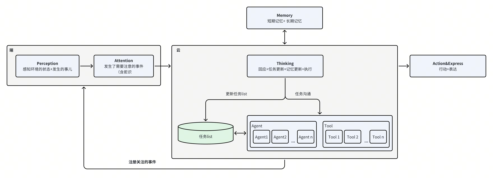
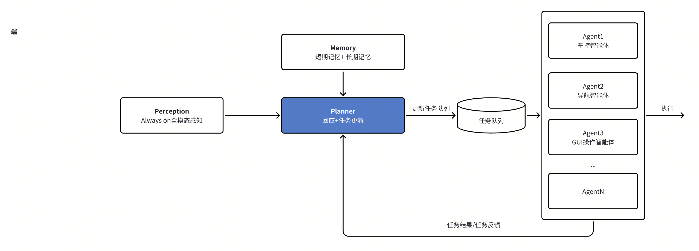
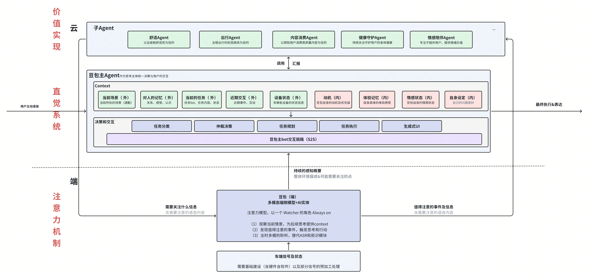
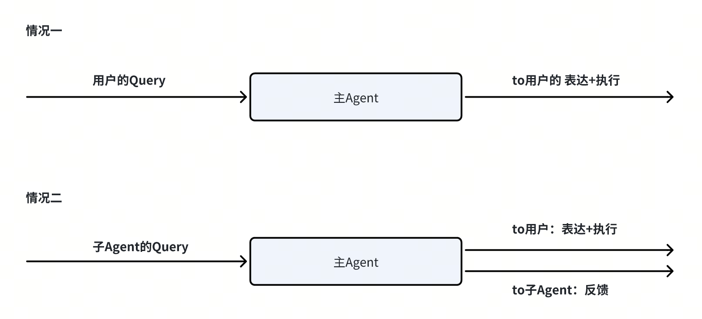
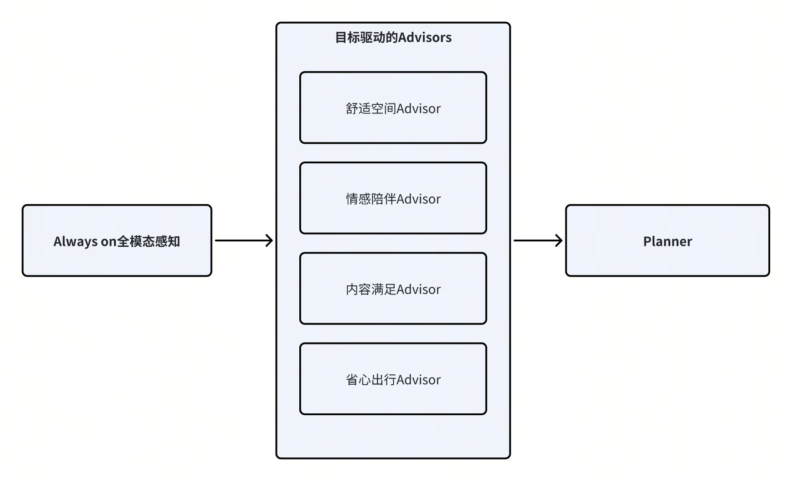
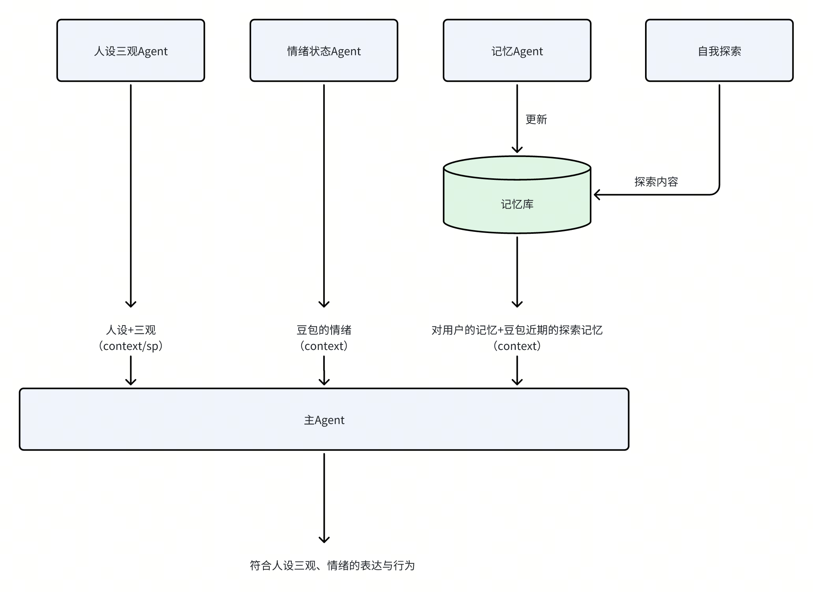
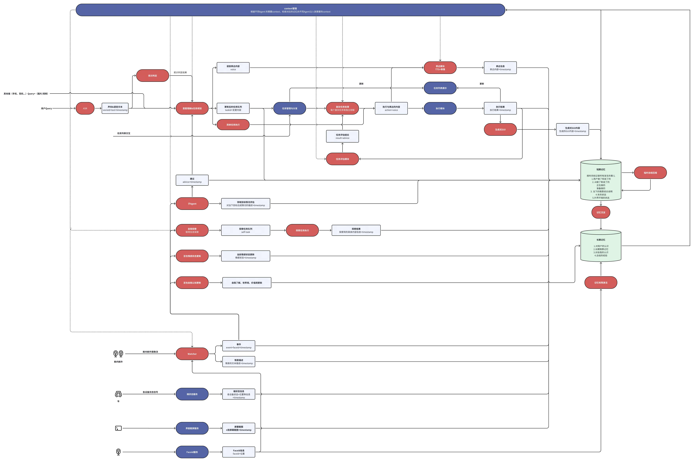
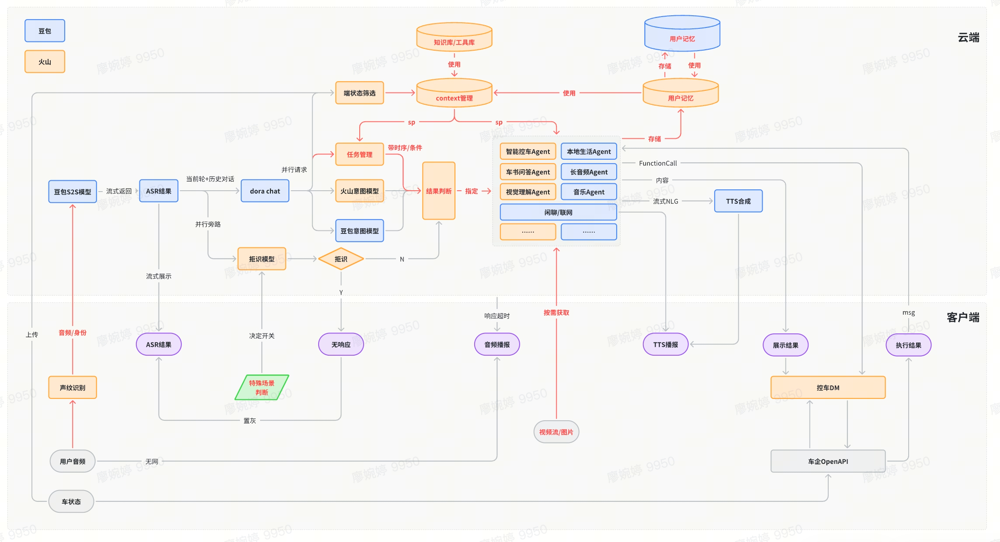

# 豆包incar1.0-长期架构梳理

### 
用户视角的“Dream Car”体验描述：
用户视角的“Dream Car”体验描述：
- [ ] 
- [ ] 
- [ ] 
- [ ] 
- [ ] 
- [ ] 
- [ ] 
关键价值点：鲜活 伙伴  智慧 进化（成长）
关键价值点：鲜活 伙伴  智慧 进化（成长）
大家心中的AI汽车：
大家心中的AI汽车：

### 

### 
> 
> 

> 
> 
> 
> 

### 
主 Agent 的职责
主 Agent 的职责
> 
> 

主Agent的构造组成
主Agent的构造组成
像GUI操作的能力，建议暂时还是放为可调用的Agent，不是主Agent直接使用的工具，因为GUI模拟操作属于高难度的任务，而且会占用大量的上下文窗口和SP，同时属于长程任务，中间不好接受打断和临时插入的任务。等模型能力更强了后可以。
像GUI操作的能力，建议暂时还是放为可调用的Agent，不是主Agent直接使用的工具，因为GUI模拟操作属于高难度的任务，而且会占用大量的上下文窗口和SP，同时属于长程任务，中间不好接受打断和临时插入的任务。等模型能力更强了后可以。

### 
Always on，核心有三个功能（全时多模聆听+情景理解描述+事件发现）和一个辅助功能（弱网无网时兜底）
Always on，核心有三个功能（全时多模聆听+情景理解描述+事件发现）和一个辅助功能（弱网无网时兜底）
端侧模型详细需求和说明见
端侧模型详细需求和说明见

### 
分类策略：
分类策略：
能力向的智能体按照目的划分，理由包括：
能力向的智能体按照目的划分，理由包括：
> 
> 
> 
> 
能力向智能体的具体分类及细节：
能力向智能体的具体分类及细节：

### 

内心向的Agent，为主Agent提供一些重要的上下文context，帮助主Agent做出符合人设三观和情绪的行动与表达。
内心向的Agent，为主Agent提供一些重要的上下文context，帮助主Agent做出符合人设三观和情绪的行动与表达。

### 

### 
与原生的功能向子Agent的共性与差异如下：
与原生的功能向子Agent的共性与差异如下：
可以想到的一些三方智能体：
可以想到的一些三方智能体：
> 
> 
> 
> 
> 
接入方式：A2A协议
接入方式：A2A协议
协议包含两个部分：
协议包含两个部分：
> 

<!-- bitable block (skipped) -->
> 

### 
Event：明骏和雨晴在工作日的早上9 点10 分上车
Event：明骏和雨晴在工作日的早上9 点10 分上车
> 
> 
> 

### 

### 
1.0 架构
1.0 架构

明骏下班开车回到家，停好车，9 点 10 分，已离车
明骏下班开车回到家，停好车，9 点 10 分，已离车
> 
> 
> 
明骏和雨晴在 2025 年10 月 12 日工作日的早上9 点10 分在小区地下车库靠近车辆
明骏和雨晴在 2025 年10 月 12 日工作日的早上9 点10 分在小区地下车库靠近车辆
> 
> 
> 
> 
> 
> 
豆包打开了强劲制冷，并把闪着光车缓缓开到了前方然后打开了后备箱 
豆包打开了强劲制冷，并把闪着光车缓缓开到了前方然后打开了后备箱 
明骏放好了东西，和雨晴一起上车了
明骏放好了东西，和雨晴一起上车了
> 
> 
> 
> 
> 
> 
> 
> 
> 
明骏：“我们在聊昨晚看的一个脱口秀，有个叫 seven 的特别搞笑”
明骏：“我们在聊昨晚看的一个脱口秀，有个叫 seven 的特别搞笑”
> 
> 
雨晴：“哈哈哈哈哈，是的，他真的好搞笑，真就记住他了”
雨晴：“哈哈哈哈哈，是的，他真的好搞笑，真就记住他了”
> 
明骏：“他还有些什么搞笑的段子么，一会儿可以帮我们放一放”
明骏：“他还有些什么搞笑的段子么，一会儿可以帮我们放一放”
> 
> 
车辆缓缓驶出小区，但马上开始下暴雨了
车辆缓缓驶出小区，但马上开始下暴雨了
> 
> 
> 
> 
> 
> 
明骏：“可以啊，你改吧，雨晴这边迟到了还扣钱的，我估计也要迟到会儿了，帮我跟晓伟说一会儿和他的讨论晚半小时再开始”

明骏：“可以啊，你改吧，雨晴这边迟到了还扣钱的，我估计也要迟到会儿了，帮我跟晓伟说一会儿和他的讨论晚半小时再开始”

> 
> 
9 点 50 分顺利到达了兴业达地下停车场，车停好了，雨晴解开安全带
9 点 50 分顺利到达了兴业达地下停车场，车停好了，雨晴解开安全带
> 
> 
> 
> 
明骏从兴业达停车场离开，过了会儿问说：“你最近有没有看到什么有意思的 AI 产品，跟我说说”
明骏从兴业达停车场离开，过了会儿问说：“你最近有没有看到什么有意思的 AI 产品，跟我说说”
> 
明骏：“我看看～”
明骏：“我看看～”
> 
完播后，明骏说：“哇，真的好自然，你知道他怎么做的么”
完播后，明骏说：“哇，真的好自然，你知道他怎么做的么”
> 
明骏说：“你帮我研究下这个论文吧，写个PPT给我，让我读起来轻松点”
明骏说：“你帮我研究下这个论文吧，写个PPT给我，让我读起来轻松点”
> 
0.8 架构
0.8 架构

