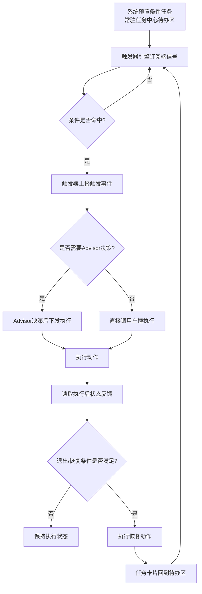
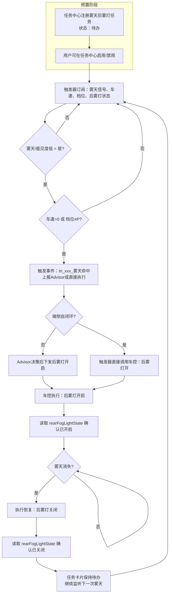
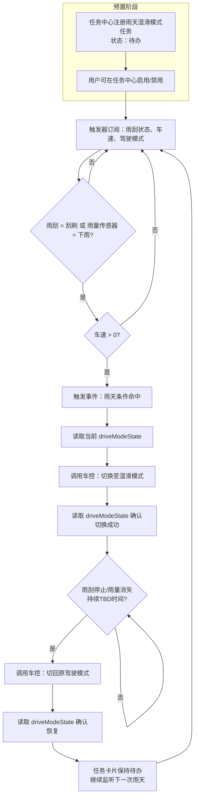
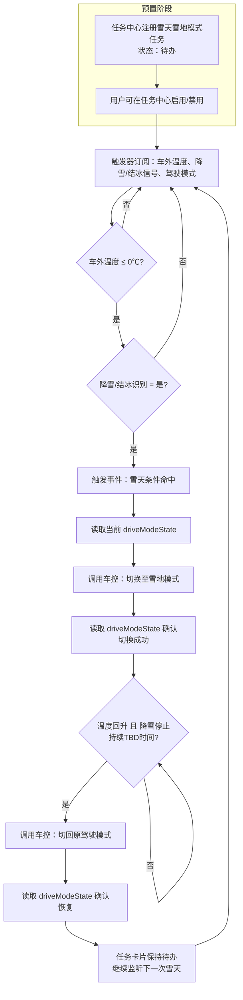
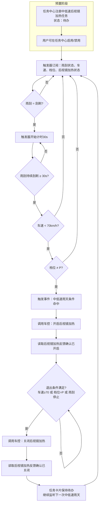
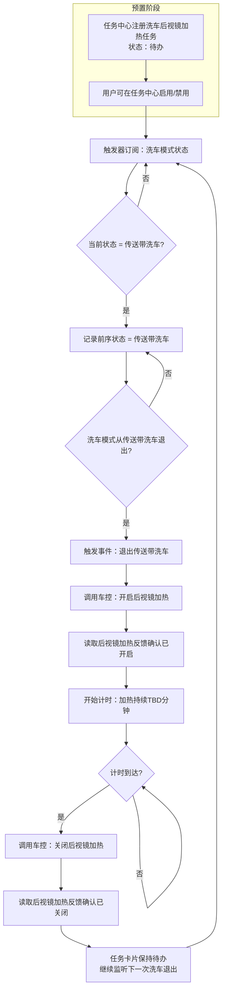
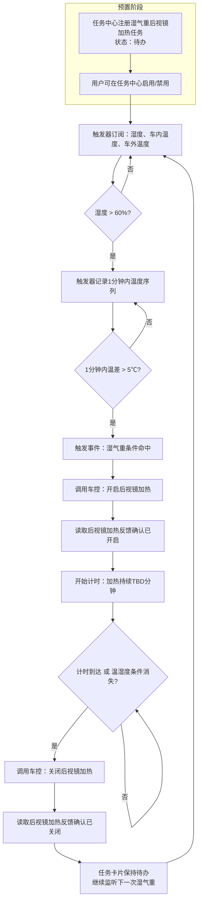

# 端侧自闭环任务 PRD 场景表

> 文档范围：天气路况保护 + 后视镜加热类端侧自闭环任务  
> 数据来源：`/Users/bytedance/Downloads/yx-files/预设条件表.xlsx`  
> 原则：原始表中未提供的字段不填写，不脑补默认值。

---

## 一、术语说明

| 术语 | 说明 |
|---|---|
| 端侧自闭环 | 触发条件识别、决策判断、执行动作、状态反馈全部在车端完成，不依赖云端/Advisor。 |
| 条件任务 | 任务中心中的循环任务，开关在"待办"区常驻，条件满足即触发，用户可启用/禁用。 |
| 触发器引擎 | 监听端信号变化，按配置规则判断条件是否命中，并触发下游执行。 |

---

## 二、通用运行流程

---

## 三、场景逐条 PRD

### 场景 1：天气路况保护-雾天后雾灯

| 字段 | 内容 |
|---|---|
| **场景名称** | 天气路况保护-雾天后雾灯 |
| **归属结论** | 条件任务 |
| **优先级** | P0 |
| **场景简介** | 识别到雾天，自动开启后雾灯保护行车安全；天气恢复后执行恢复策略（关闭后雾灯）。难点=避免重复提醒（持续条件）。 |
| **触发事件** | 雾天/能见度低信号（来源待产品确认） |
| **触发条件** | 1. 雾天/能见度低 = 是 2. 车辆处于行驶状态（车速>0 或 档位≠P） |
| **退出条件** | 雾天状态消失/能见度恢复 |
| **执行功能** | 功能执行条件：触发条件命中；执行功能：开启后雾灯 |
| **恢复动作** | 退出条件命中后，关闭后雾灯 |
| **信号依赖** | 雾天/能见度信号（待确认）、车速 vehicleSpeed、档位 gear/VehDriveState、后雾灯 rearFogLightState |
| **端侧自闭环判定** | 待确认（取决于雾天识别信号是否来自端上） |
| **待确认问题** | 雾天识别来源：端上传感器/云端天气/综合推断？ |
| **备注** | 原始表未提供人群圈选、推荐间隔、弹窗、失效时长、优先级等字段。 |

#### 详细流程

---

### 场景 2：天气路况保护-雨天湿滑模式

| 字段 | 内容 |
|---|---|
| **场景名称** | 天气路况保护-雨天湿滑模式 |
| **归属结论** | 条件任务 |
| **优先级** | P0 |
| **场景简介** | 识别到雨天，自动开启湿滑模式保护（转向/动力策略调整）；雨停后恢复。同18的重复提醒问题→频控解决。 |
| **触发事件** | 下雨识别：雨刮刮刷 或 雨量传感器触发 |
| **触发条件** | 1. 雨刮状态 = 刮刷 或 雨量传感器 = 下雨 2. 车辆处于行驶状态（车速>0） |
| **退出条件** | 雨刮停止/雨量消失持续一段时间 |
| **执行功能** | 功能执行条件：触发条件命中；执行功能：切换驾驶模式至湿滑模式 |
| **恢复动作** | 退出条件命中后，切回原驾驶模式 |
| **信号依赖** | 雨刮状态 wiperState、雨量传感器（待确认）、驾驶模式 driveModeState/VehDriveState、车速 vehicleSpeed |
| **端侧自闭环判定** | 部分可闭环 |
| **待确认问题** | 1. 是否有独立雨量传感器信号？ 2. D6X是否支持湿滑模式及自动切换？ |
| **备注** | 若仅有雨刮信号，喷水清洗、洗车等场景会误触发。 |

#### 详细流程

---

### 场景 3：天气路况保护-雪天雪地模式

| 字段 | 内容 |
|---|---|
| **场景名称** | 天气路况保护-雪天雪地模式 |
| **归属结论** | 条件任务 |
| **优先级** | P0 |
| **场景简介** | 识别到雪天，自动切换车辆行进状态为雪地模式；雪停/路面恢复后切回。动作用到车控既有"雪地"模式选项。 |
| **触发事件** | 车外低温 + 降雪/结冰识别（来源待确认） |
| **触发条件** | 1. 车外温度 ambientTemp ≤ 0℃（阈值TBD） 2. 降雪/结冰识别 = 是（来源TBD） |
| **退出条件** | 温度回升/降雪停止持续一段时间 |
| **执行功能** | 功能执行条件：触发条件命中；执行功能：切换驾驶模式至雪地模式 |
| **恢复动作** | 退出条件命中后，切回原驾驶模式 |
| **信号依赖** | 车外温度 ambientTemp、降雪/结冰识别信号（待确认）、驾驶模式 driveModeState/VehDriveState |
| **端侧自闭环判定** | 部分可闭环 |
| **待确认问题** | 1. 降雪/结冰识别信号来源？ 2. D6X雪地模式是否支持自动切换？ |
| **备注** | 若只用低温+雨刮推断雪天，冬季晴天低温会误触发。 |

#### 详细流程

---

### 场景 4：中低速场景-车速小于70km/h且非P档

| 字段 | 内容 |
|---|---|
| **场景名称** | 中低速场景-车速小于70km/h且非P档 |
| **归属结论** | 建议开启 |
| **优先级** | 新增-P0 |
| **场景简介** | 中低速行驶途中下雨时，镜面附着大量小雨滴。低速气流弱，风无法吹走水珠，后视镜加热蒸发水珠，改善观察视野。 |
| **触发事件** | 雨刮持续刮刷30秒 |
| **触发条件** | 1. 雨量传感器识别到下雨 或 雨刮在刮刷 2. 雨刮刮刷状态持续30s 3. 车速 vehicleSpeed < 70km/h 4. 档位 gear ≠ P |
| **退出条件** | 车速≥70 或 档位=P 或 雨刮停止 |
| **执行功能** | 功能执行条件：触发条件命中；执行功能：开启后视镜加热 |
| **恢复动作** | 退出条件命中后，关闭后视镜加热 |
| **信号依赖** | 雨刮状态 wiperState、车速 vehicleSpeed、档位 gear/VehDriveState、后视镜加热控制/反馈（待确认） |
| **端侧自闭环判定** | 可端侧闭环（待确认后视镜加热执行接口） |
| **待确认问题** | 1. 雨刮持续30s是端信号自带还是触发器引擎计时？ 2. 后视镜加热执行接口和反馈信号？ |
| **备注** | 原始表描述"满足条件后一直开启"。 |

#### 详细流程

---

### 场景 5：洗车模式-退出传送带洗车

| 字段 | 内容 |
|---|---|
| **场景名称** | 洗车模式-退出传送带洗车 |
| **归属结论** | 建议开启 |
| **优先级** | 新增-P0 |
| **场景简介** | 在使用自动洗车装置洗车结束后，后视镜上的水滴无法快速取出，有存留水滴。刚刚在自动洗车机完成洗车后，后视镜上存在水滴，可通过后视镜加热蒸发水滴。 |
| **触发事件** | 洗车模式从"传送带洗车"退出 |
| **触发条件** | 1. 前序状态 = 传送带洗车 2. 当前状态 ≠ 传送带洗车 |
| **退出条件** | 固定时长后关闭（如3分钟，具体TBD） |
| **执行功能** | 功能执行条件：触发条件命中；执行功能：开启一次后视镜加热 |
| **恢复动作** | 持续TBD时间后自动关闭后视镜加热 |
| **信号依赖** | 洗车模式/传送带洗车信号（待确认）、后视镜加热控制/反馈（待确认） |
| **端侧自闭环判定** | 可端侧闭环（若有洗车模式信号） |
| **待确认问题** | 1. 信号中枢是否有洗车模式/传送带洗车信号？ 2. 后视镜加热执行接口和反馈信号？ 3. 加热持续时长？ |
| **备注** | 原始表描述"满足条件后开启一次"。 |

#### 详细流程

---

### 场景 6：湿气重天气

| 字段 | 内容 |
|---|---|
| **场景名称** | 湿气重天气 |
| **归属结论** | 建议开启 |
| **优先级** | 新增-P0 |
| **场景简介** | 刚出地库：南方夏天雨后立刻出太阳，地库内部温度偏低，驶出车库后湿热空气让后视镜快速起雾。内外温差大产生凝雾，低速下气流微弱吹不掉雾气。 |
| **触发事件** | 湿度 > 60% 且 1分钟内温差 > 5℃ |
| **触发条件** | 1. 空气湿度 > 60% 2. 车辆行驶区域1分钟内温度差值 > 5℃ 3. 时间阈值TBD |
| **退出条件** | 固定时长或温湿度条件消失后关闭 |
| **执行功能** | 功能执行条件：触发条件命中；执行功能：开启一次后视镜加热 |
| **恢复动作** | 持续TBD时间后自动关闭后视镜加热 |
| **信号依赖** | 空气湿度（112条状态查询中未找到，待补）、车内温度 cabinTemp、车外温度 ambientTemp、后视镜加热控制/反馈（待确认） |
| **端侧自闭环判定** | 当前不可闭环 |
| **待确认问题** | 1. 是否有湿度信号？ 2. 若没有，端上能否补采？ 3. 温差计算口径：车内vs车外？当前位置vs1分钟前位置？ |
| **备注** | 原始表描述"满足条件后开启一次"。 |

#### 详细流程

---

## 四、信号能力总览

| 需求名称 | 所需信号 | 触发事件表 | 条件表 | 状态查询表 | 结论 |
|---|---|---|---|---|---|
| 雾天后雾灯 | 雾天/能见度 | 无 | 无 | 无 | 来源待产品确认 |
| 雾天后雾灯 | 车速 | tri_speed | 无 | vehicleSpeed | 可用 |
| 雾天后雾灯 | 档位 | tri_gear | con_gear | VehDriveState | 可用 |
| 雾天后雾灯 | 后雾灯 | tri_rearFog | 无 | rearFogLightState | 可用 |
| 雨天湿滑模式 | 雨刮 | 无 | 无 | wiperState | 只有状态，需引擎计时或补事件 |
| 雨天湿滑模式 | 雨量传感器 | 无 | 无 | 无 | 未找到 |
| 雨天湿滑模式 | 驾驶模式 | tri_vehDrive | con_vehDrive | driveModeState/VehDriveState | 可用，枚举待确认 |
| 雨天湿滑模式 | 车速 | tri_speed | 无 | vehicleSpeed | 可用 |
| 雪天雪地模式 | 车外温度 | tri_temp | con_temp | ambientTemp | 可用 |
| 雪天雪地模式 | 降雪/结冰 | 无 | 无 | 无 | 来源待确认 |
| 雪天雪地模式 | 驾驶模式 | tri_vehDrive | con_vehDrive | driveModeState/VehDriveState | 可用，枚举待确认 |
| 中低速后视镜加热 | 雨刮 | 无 | 无 | wiperState | 只有状态，30s计时待确认 |
| 中低速后视镜加热 | 车速 | tri_speed | 无 | vehicleSpeed | 可用 |
| 中低速后视镜加热 | 档位 | tri_gear | con_gear | VehDriveState | 可用 |
| 中低速后视镜加热 | 后视镜加热 | 无 | 无 | 无 | 执行接口待车控确认 |
| 洗车退出后视镜加热 | 洗车模式 | 无 | 无 | 无 | 信号待韩杰确认 |
| 洗车退出后视镜加热 | 后视镜加热 | 无 | 无 | 无 | 执行接口待车控确认 |
| 湿气重天气 | 湿度 | 无 | 无 | 无 | 112条中未找到 |
| 湿气重天气 | 车内温度 | tri_temp | con_temp | cabinTemp | 可用 |
| 湿气重天气 | 车外温度 | tri_temp | con_temp | ambientTemp | 可用 |
| 湿气重天气 | 后视镜加热 | 无 | 无 | 无 | 执行接口待车控确认 |

---

## 五、待确认问题清单

| 编号 | 问题 | 涉及需求 | 找谁 | 优先级 | 影响 |
|---|---|---|---|---|---|
| Q1 | 雾天识别信号来源是什么？ | 雾天后雾灯 | 产品 | P0 | 决定是否为端侧自闭环 |
| Q2 | 是否有独立雨量传感器信号？ | 雨天湿滑模式、中低速后视镜加热 | 韩杰 | P0 | 触发精度与误触发率 |
| Q3 | D6X是否支持湿滑/雪地模式自动切换？ | 雨天湿滑模式、雪天雪地模式 | 车控/上汽 | P0 | 动作能否执行 |
| Q4 | 是否有洗车模式/传送带洗车信号？ | 洗车退出后视镜加热 | 韩杰 | P0 | 无信号则场景无法落地 |
| Q5 | 是否有湿度信号？若无，端上能否补采？ | 湿气重天气 | 韩杰/端上 | P0 | 无湿度信号则无法端侧闭环 |
| Q6 | 后视镜加热执行接口和反馈信号是否具备？ | 中低速/洗车/湿气 | 车控 | P0 | 决定动作是否可端侧执行 |
| Q7 | 雨刮持续30s是端信号自带还是触发器引擎计时？ | 中低速后视镜加热 | 韩杰/研发 | P1 | 条件表达方式 |
| Q8 | 中低速/洗车/湿气场景的后视镜加热持续时长？ | 中低速/洗车/湿气 | 产品 | P1 | 产品体验 |

