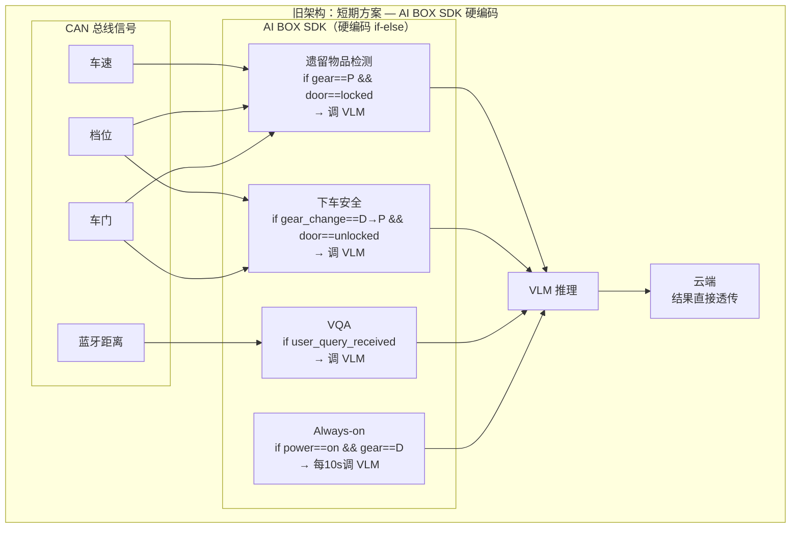
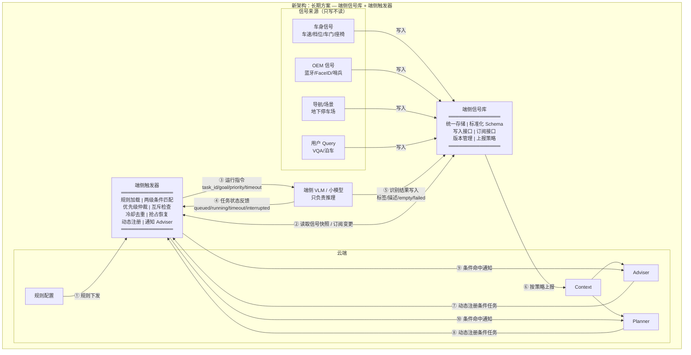
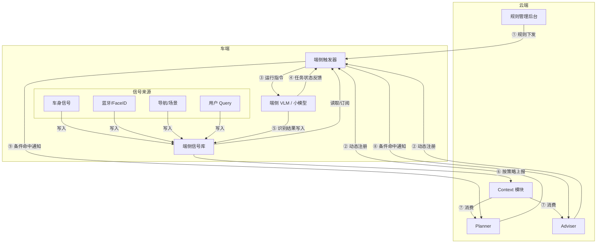
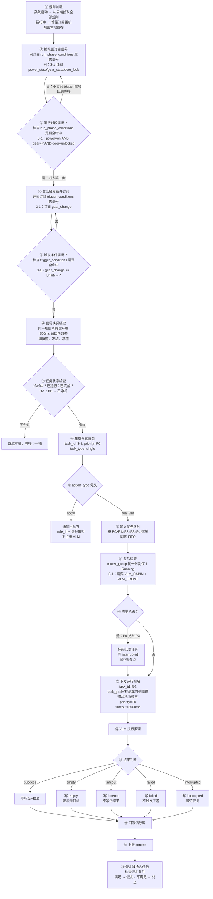
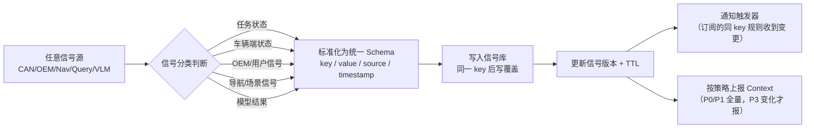
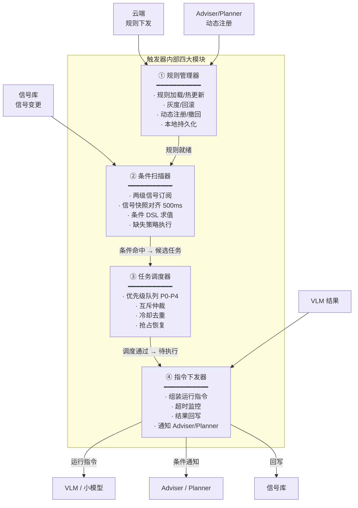
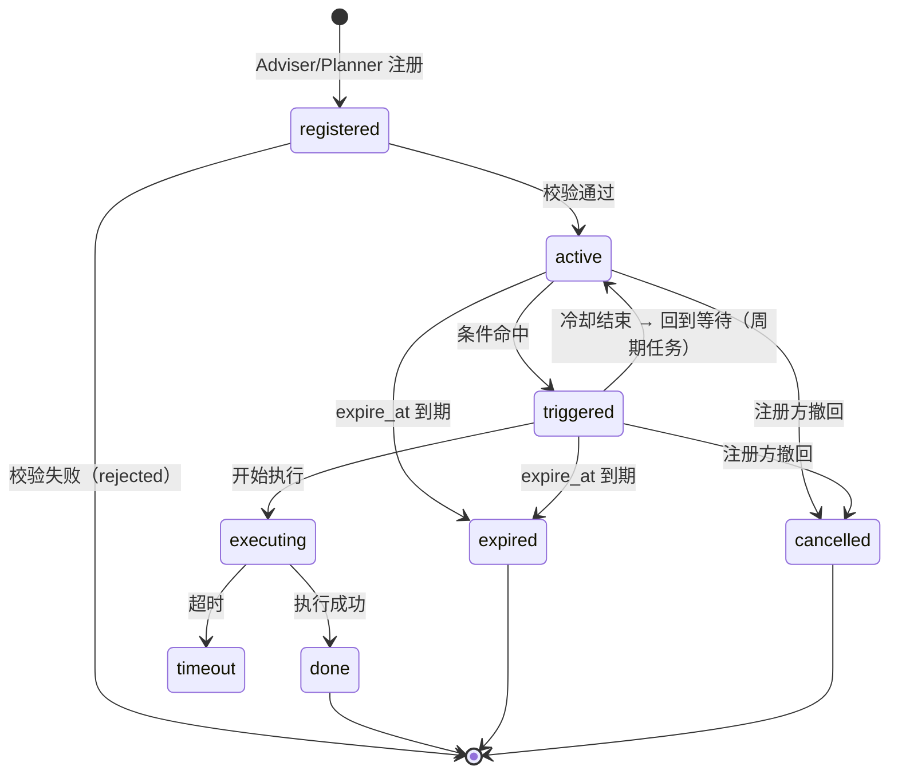
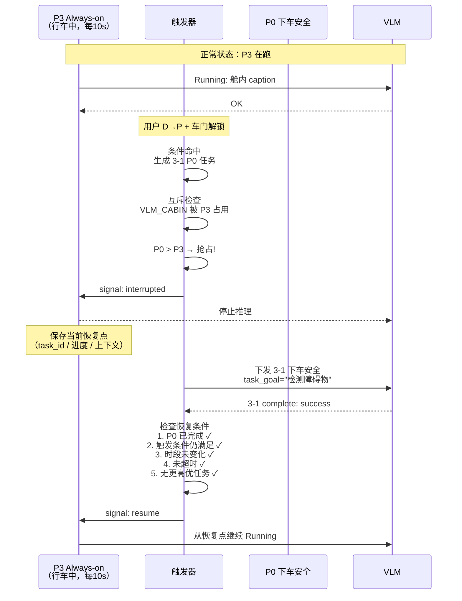

# 端侧触发器 — 架构演进与流程图详解（评审讲稿）

> 本讲稿聚焦**旧架构 vs 新架构的差异**、**每张流程图的数据流走读**、**每个设计决策的工程理由**。不展开 PRD 全文，只讲架构和流程。

---

## 第一部分：旧架构 → 新架构，为什么推倒重来

### 1.1 旧架构（短期方案）

评审会上第一件事：**把旧架构画出来，让所有人看到它长什么样**。



**旧架构的五个致命问题**：

| # | 问题 | 具体表现 | 后果 |
|---|------|---------|------|
| 1 | **信号入口分散** | 每个任务各自去读 CAN 信号，读的方式都不一样 | 同一信号被读了 4 次，消耗重复，且版本不一致 |
| 2 | **规则硬编码** | if-else 写死在 SDK 代码里 | 改规则 = 改代码 + 编译 + OTA，周期 ≥ 2 周 |
| 3 | **VLM 结果不可复用** | 下车安全跑完的"右前门积水"，停车位识别想用——拿不到 | 每个任务都是信息孤岛 |
| 4 | **无调度能力** | 15 个任务平权，谁先触发谁先跑 | P3 Always-on 挡住 P0 下车安全 |
| 5 | **云端无标准接口** | 结果直接透传，无 schema | 云端不知道拿到的数据是什么意思 |

**一句话总结旧架构**：**每个 VLM 任务是一个独立的烟囱**——自己读信号、自己调模型、自己扔结果。15 个烟囱，互不相通。

---

### 1.2 新架构（长期方案）



**新架构核心变化**：**打破烟囱，建立底座**。

信号库是数据底座——所有信号只写一次，所有人统一读。触发器是调度中枢——规则可配置、优先级可管理、状态可追踪。

---

### 1.3 旧 vs 新：逐层对比

评审时翻到这页，从左到右逐行指：

```
                    旧架构                        新架构
信号入口    ┌─ 每个任务各自读 CAN         ┌─ 统一写入信号库
            │  同一信号被读 N 次           │  每个信号只写一次
            │  无 schema 约束             │  标准化 key/value/source/timestamp

规则引擎    ┌─ SDK 硬编码 if-else         ┌─ JSON DSL，云端配置
            │  改规则 = 改代码 + OTA      │  改规则 = 更新配置 + 热更新 ≤ 5s
            │  无版本管理                │  双 buffer + dryrun + 灰度和回滚

任务调度    ┌─ 不存在                    ┌─ P0-P4 五级优先队列
            │  先到先得，碰运气           │  抢占、恢复、互斥、冷却
            │  无超时释放               │  超时 ≤ 1s 释放

VLM 结果    ┌─ 直接透传云端              ┌─ 写入信号库（可复用）
            │  用完即弃                  │  标准化状态：success/empty/failed/
            │  无复用、无追溯            │  timeout/interrupted

Adviser     ┌─ 不存在                    ┌─ 两条通路：
            │  不知道端侧发生了什么      │  动态注册 → 任务触发
            │                           │  条件命中 → 通知 Adviser

动态任务    ┌─ 不存在                    ┌─ Adviser/Planner 运行时注册
            │  用户说"10分钟后关加热"    │  注册 → 本地持久化 → 到时触发
            │  无法实现                  │  弱网可执行、重启不丢
```

**核心差异一句话**：旧架构是"调一个函数"，新架构是"操作一个系统"。旧架构每个任务自己决定什么时候跑、跑什么、跑完怎么办。新架构把这三个决策权从任务手里收走，交给触发器和信号库统一管理。

---

## 第二部分：新架构逐图走读

### 2.1 架构链路图——10 条数据流

评审时把这张图投屏，**从 ① 到 ⑩ 逐条走**：



**逐条走读**（评审时指着箭头念）：

| # | 数据流 | 方向 | 内容 | 为什么这么设计 |
|---|--------|------|------|---------------|
| ① | 规则下发 | 云端 → 触发器 | JSON 规则全量/增量 | 规则不写死在代码里，PM 可直接配 |
| ② | 动态注册 | Adviser/Planner → 触发器 | 条件任务（含 DSL/优先级/过期时间） | 支撑"十分钟后关加热"这类运行时任务 |
| ③ | 运行指令 | 触发器 → VLM | task_id/task_goal/priority/timeout | VLM 只管跑，不管"为什么跑" |
| ④ | 状态反馈 | VLM → 触发器 | queued/running/timeout/interrupted | 触发器靠这个做抢占和超时释放 |
| ⑤ | 结果写入 | VLM → 信号库 | 标签/描述/empty/failed | 标准化状态，下游可消费 |
| ⑥ | 上报 | 信号库 → Context | task_id + 结果 + 车辆状态快照 | 云端拿到标准化数据 |
| ⑦ | 消费 | Context → Adviser/Planner | 同上 | 异步消费，不阻塞端侧 |
| ⑧⑨ | 条件通知 | 触发器 → Adviser/Planner | rule_id + 信号快照 | 事件驱动，轻量通知 |

**两条容易搞混的链路，必须单独强调**：

> **链路 ⑥→⑦（结果上报）≠ 链路 ⑧⑨（条件通知）**
>
> - 上报：数据同步。VLM 跑完了，结果写信号库，信号库上报 context，Adviser 从 context 拿到。**走的是"存 → 上报 → 消费"**。
> - 通知：事件驱动。条件命中了，触发器直接推送给 Adviser："你注册的条件满足了"。**走的是"命中 → 推送"**。
>
> 两个通道，两个用途。通知不经过信号库中转，因为 Adviser 需要的是"条件命中了"这件事，不是 VLM 的识别结果。

---

### 2.2 主流程图——一个任务的完整生命周期（15 步走读）

这是评审会上最核心的一张图。**我会用"下车安全"这个具体例子，一步一步走**。



**走读节奏**：用下车安全（3-1）举例，在图中标注每一步走到哪了，15 步走完。

**停下来主动问研发的三个点**：

1. **第 ③ 步 → 第 ④ 步**："第一级不满足时不订阅 trigger 信号——这个能做到吗？如果不能，两个级别的信号必须同时订阅，我需要知道，因为会影响功耗评估。"

2. **第 ⑥ 步 500ms 快照窗口**："这个值你们觉得合理吗？有 CAN 总线实际延迟数据就给我，现在就改。"

3. **第 ⑨ 步 action_type 分叉**："notify_adviser 分支不经过调度队列——它不占用 VLM。研发需要确认：notify 的网络调用如果阻塞了触发器主循环怎么办？建议异步。"

---

### 2.3 信号库流程图



**这张图的关键设计点**：

- **"同一 key 后写覆盖"**：信号库存的是"当前状态"，不是"历史事件"。想知道车门锁的历史变化，去 context 查上报记录。
- **两个输出路径是并行的**：通知触发器（实时，用于调度决策）+ 上报 Context（异步，用于云端消费）。不串行，不阻塞。
- **信号分类在写入前**：不是为了分类存储，是为了保证写入的 source 字段准确。VLM 结果写 source=vlm_agent，CAN 信号写 source=car_service。下游按 source 过滤。

---

### 2.4 触发器内部流程——四大模块



**评审时的讲解顺序**：从左侧输入到右侧输出，按数据流方向走，每到一个模块停下来讲它的输入/处理/输出。

**这里要特别强调一个架构决策**：

> 四大模块是**逻辑分层**，不一定是四个进程/线程。部署形态研发定。但无论怎么部署，这四层之间的接口必须清晰——因为将来可能把条件扫描器和任务调度器拆到不同核上跑。今天评审我们只定逻辑分层。

---

### 2.5 动态任务状态机



**关键状态说明**：

- `registered → active`：注册时校验 DSL 格式 + 信号 key 是否存在。不通过直接 rejected。
- `active → triggered`：条件命中，但不是立刻执行——还要走冷却检查。
- `triggered → active`：周期任务，冷却结束回到 active，重新等待下次命中。这就是 `notify_adviser` 型"打哈欠 30s"任务的工作方式——触发一次 → 冷却 120s → 如果还在打哈欠，再触发。
- `active/triggered → expired`：任何时刻 expire_at 到期，直接终止。`current_trip_end` 就是下电时触发检查和清理。
- `active/triggered → cancelled`：注册方主动撤回。Planner 说"不用关加热了"，触发器删除这条规则。

---

### 2.6 抢占恢复——时序图



**这张图用来回答三个最容易被问的问题**：

Q："Always-on 被 P0 打断了，恢复时是从头跑还是接着跑？"
A：接着跑。Always-on 保存了恢复点（当前任务进度 + 上下文）。从头跑等于浪费一次推理。

Q："如果用户挂完 P 档后立刻又挂回 D 档，下车安全和 Always-on 会怎样？"
A：
1. 下车安全：运行时段从"停车时"切换到"行车中"，run_phase_conditions 失效 → 如果还在 Running，终止。
2. Always-on：如果被 interrupted 等待恢复，恢复时发现时段已切回"行车中"，触发条件又满足了 → 正常恢复。如果还在 interrupted 等待、时段切了但触发条件仍在 → 恢复。

Q："多个 P0 同时命中怎么办？"
A：同优 FIFO。先到的先跑。P0 之间不抢占——因为它们都是最高优，抢占没有意义。但互斥组规则仍然生效：同 mutex_group 一次只跑一个。

---

## 第三部分：关键架构决策的 why

评审时按以下逻辑链讲，不要拆开。

### 决策 1：为什么信号库和触发器要分开？

**旧方案的问题**：每个任务自己读信号 → 规则和信号耦合 → 换一个任务、换一个车型，信号读取逻辑全得改。

**新方案**：信号库负责存和发，触发器负责判断和调度。

```
旧：任务 A 读 CAN → 任务 A 判断 → 任务 A 执行
    任务 B 读 CAN → 任务 B 判断 → 任务 B 执行
    （信号、判断、执行全部耦合在任务里）

新：CAN → 信号库 ← 触发器 → VLM
    （信号统一存储，触发器统一调度，VLM 只执行）
```

**分开的好处**：
- 信号库可以独立升级（加新信号类型不影响触发器）
- 触发器可以独立升级（改调度策略不影响信号存储）
- 不同车型只需要改信号采集层，触发器和 VLM 不动

### 决策 2：为什么采用两级条件判断（run_phase_conditions + trigger_conditions）而不是一级？

**如果是一级**：每条规则订阅所有条件信号，18 条规则 × N 个信号，任何时候任何信号变了，18 条规则全部求值。

**两级**：第一级不满足 → 这条规则不订阅第二级信号。下车安全的规则在下电后不会去订阅 gear_change 信号——因为第一级 power=on 已经不满足了。

**算一笔账**：
- 离车后时段：5 条规则活跃（1-1 到 1-5），剩下 13 条的 trigger_conditions 全部休眠
- 上车前时段：3 条规则活跃（2-1 到 2-3）
- 行车中时段：8 条规则活跃（4-1 到 4-8）

平均每次信号变化，只有当前时段 1/3 的规则需要扫描。这是实实在在的省电。

### 决策 3：为什么 Adviser 走两条通路（注册 + 通知）而不是一条？

**如果只有注册**：Adviser 只能"预设任务"，不能"响应事件"。做不到"当 VLM 识别到副驾打哈欠时告诉我"。

**如果只有通知**：Adviser 只能"被动响应"，不能"主动发起"。做不到"帮我持续关注有没有特定人上车"。

**两条通路合在一起**，Adviser 的能力是完整的：
- 注册 run_vlm → 让 VLM 帮忙看
- 注册 notify_adviser → 条件到了告诉我
- 收到通知 → 决定下一步（发话术 / 注册新任务 / 什么都不做）

### 决策 4：为什么不把 notify_adviser 的通知做成可靠投递（ACK + 重试）？

**做可靠投递需要**：触发器端缓存未 ACK 消息 + 超时重试队列 + 重试退避策略 + 持久化。

**代价**：触发器复杂度翻倍。而 Adviser 本身有替代方案——用 run_vlm，结果写信号库，Adviser 通过 context 回查。这个是可靠的。

**结论**：通知通道是"尽力而为"的轻量通道。需要可靠性的场景，用 run_vlm + 信号库回查。不要用通知通道做可靠传输。

---

## 第四部分：阿基里斯之踵 —— 3 个最容易被攻击的点

评审会上如果有人揪着不放，大概率是这三个。提前准备好反击。

### 攻击点 1："你那个触发条件的 DSL 引擎，不就是规则引擎吗？跟 Drools / EasyRules 有什么区别？为什么要自研？"

**反击**：DSL 不是规则引擎，是条件表达式求值器。差异：

- 规则引擎：事实 → 规则匹配 → 执行动作（完整 Rete 网络）
- 我们的 DSL：信号快照 → 条件求值 → true/false

我们的 DSL 只做一件事：**给定一个信号快照，判断条件是否满足**。没有推理链、没有冲突消解、没有议程表。它的复杂度是规则引擎的 1/10。用 Drools 是杀鸡用牛刀。

另外：DSL 需要和信号库的 key 体系深度绑定——`gear_state`、`vlm_label` 这些 key 不是通用的。用通用规则引擎反而要做一层适配。

### 攻击点 2："500ms 快照窗口，不同车型 CAN 总线延迟不一样，你怎么保证不漏判？"

**反击**：我保证不了。500ms 是一个合理的默认值，不是真理。两个防线：

1. 这个值可配置——车型适配时根据实际延迟调整
2. 即使极端情况下漏掉了这一拍——下一拍（下一个 500ms 窗口）会重新求值。对于非 P0 任务，晚 500ms 不可接受吗？

**反问**：你有实际 CAN 总线数据吗？有就现在给我，我当场改。

### 攻击点 3："触发器是整个系统的单点——它挂了，所有 VLM 任务全停。你真的敢把 15 个任务全交给一个模块？"

**反击**：对，这是架构上的单点。但有两个缓解：

1. 触发器挂了，信号库不受影响——VLM 结果仍在写入，context 仍在同步。只是没有新任务被调度。
2. P0 任务（下车安全、遗留物品）可以设计降级路径——如果触发器超过 N 秒无心跳，VLM 侧启动一个最小安全模式，直接订阅关键 CAN 信号，跳过触发器。

**但是**：第二条（降级路径）不在本期范围。本期先保证触发器的可用性，降级方案作为后续增强。如果需要第一期就做，请告诉我，我加需求。

---

## 附：评审会时间分配建议

| 段落 | 内容 | 建议时长 |
|------|------|---------|
| 1.1-1.2 | 旧架构 vs 新架构 + 逐层对比 | 8 min |
| 2.1 | 架构链路图 10 条数据流走读 | 5 min |
| 2.2 | 主流程 15 步走读（用下车安全举例） | 12 min |
| 2.3-2.4 | 信号库流程 + 触发器四大模块 | 5 min |
| 2.5-2.6 | 状态机 + 抢占时序 | 5 min |
| 3 | 4 个架构决策 why | 5 min |
| Q&A | | 15 min |
| **合计** | | **55 min** |

> 还剩 5 分钟缓冲。如果超时，砍第三部分（架构决策 why）——那些在设计文档里都有，不需要在会上念。
