# 端云协同触发器评审架构图

## 1. 全链路总图

```mermaid
flowchart LR
  %% ===================== 输入与分流 =====================
  subgraph A["A. 用户入口与意图分流"]
    A1["1 用户语音/文本<br/>query + speaker + position"]
    A2["2 ASR/文本理解"]
    A3{"3 拒识/仲裁<br/>简单/复杂/条件/持续"}
    A4["4 简单车控快链路<br/>端侧白名单/高频车控"]
    A5["5 Director/Planner<br/>复杂对话与任务拆解"]
    A6["6 条件/定时/持续任务识别<br/>operate_conditional_task / goal_list_update"]
    A1 --> A2 --> A3
    A3 -- "简单明确车控" --> A4
    A3 -- "复杂/对话/多步" --> A5
    A3 -- "条件/定时/长时" --> A6
  end

  %% ===================== 云端注册编排 =====================
  subgraph B["B. 云端任务编排与注册"]
    B1["7 能力查询<br/>可用信号/事件/VLM/POI/操作符"]
    B2["8 条件解析与可行性校验<br/>条件是否可感知/动作是否可执行/是否冲突"]
    B3["9 DSL生成/事件库选择<br/>select existing event 或 create dynamic script"]
    B4["10 策略预生成<br/>触发后advice/执行策略/是否二次推理"]
    B5["11 任务/场景注册服务<br/>注册/更新/取消/查询"]
    B6["12 任务中心状态<br/>创建中/成功/失败/条件字段/执行字段"]
    A6 --> B1 --> B2 --> B3 --> B4 --> B5 --> B6
    B2 -- "不可感知/不可执行/超上限" --> B6
  end

  %% ===================== 信号与上下文 =====================
  subgraph C["C. 信号与上下文底座"]
    C1["13 OEM/CDC/AI Box<br/>原始车端信号/高阶事件/图片URL/车控能力"]
    C2["14 端侧信号库<br/>端状态快照 key-value-timestamp"]
    C3["15 云端信号库<br/>端云同步/云信号/导航/POI/任务状态"]
    C4["16 Context/Event Log<br/>情景/端状态/记忆/VLM结果/触发事件"]
    C1 --> C2 --> C3
    C3 --> C4
  end

  %% ===================== 云端触发器 =====================
  subgraph D["D. 云端触发器/规则执行引擎"]
    D1["17 场景库<br/>静态规则/动态任务/系统预设"]
    D2["18 规则扫描器<br/>信号更新/周期扫描"]
    D3["19 条件判定<br/>AND/OR/group/range/变更为/持续时长"]
    D4["20 去抖/冷却/执行次数<br/>debounce/cooldown/max_execution/expire"]
    D5["21 优先级与冲突仲裁<br/>P0-P4/任务互斥/重复抑制"]
    D6{"22 端云分类"}
    D7["23 标准触发事件<br/>task_id/original_query/snapshot/need_second_reasoning"]
    D8["24 Callback Router<br/>Director/动态Advisor/Context/任务中心/端侧"]
    B5 --> D1
    C3 --> D2
    D1 --> D2 --> D3 --> D4 --> D5 --> D6
    D6 -- "云端可处理" --> D7 --> D8
    D7 --> C4
  end

  %% ===================== 端侧触发器 =====================
  subgraph E["E. 端侧触发器 Core"]
    E1["25 端侧规则接收<br/>云端下发/本地生效/灰度/回滚"]
    E2["26 本地定时器<br/>一次性/循环/倒计时/分钟级合并"]
    E3["27 本地条件监听<br/>端状态组合/弱网可用事件"]
    E4["28 本地任务持久化<br/>重启恢复/上下电恢复"]
    E5["29 弱网/断网兜底<br/>AI PUSH/任务中心本地提醒"]
    E6["30 本地事件回传<br/>网络恢复后同步云端"]
    D6 -- "需端侧履约" --> E1
    E1 --> E2
    E1 --> E3
    E2 --> E4 --> E5 --> E6
    E3 --> E4
    C2 --> E3
    E6 --> C4
    E6 --> D7
  end

  %% ===================== VLM 调度 =====================
  subgraph F["F. VLM/Watcher 视觉触发链路"]
    F1["31 视觉订阅生成<br/>VLM query / event-state / SP-attention"]
    F2["32 VLM调度器<br/>P0-P4/互斥组 VLM_CABIN,VLM_FRONT"]
    F3["33 图片服务<br/>车内/车外/屏幕 image url"]
    F4["34 VQA/VLM识别<br/>result + description JSON"]
    F5["35 阈值穿越判断<br/>last=false & this=true 才触发"]
    F6["36 VLM终态回写<br/>success/empty/failed/timeout/interrupted"]
    B4 -- "需要视觉" --> F1
    E1 -- "端侧视觉任务" --> F2
    F1 --> F2 --> F3 --> F4 --> F5 --> F6
    F6 --> C2
    F6 --> C4
    F5 --> D7
  end

  %% ===================== Advisor/Director 执行 =====================
  subgraph G["G. Advisor/Director 决策与执行"]
    G1["37 静态Advisor<br/>舒适/出行/情感/内容<br/>消费Context事件"]
    G2["38 动态Advisor<br/>一目标一实例<br/>条件/定时/VLM/GUI闭环"]
    G3["39 Goal List<br/>Director建删目标/Advisor更新进展"]
    G4["40 Director汇入<br/>query/advice/tool_feedback/trigger_event/GoalList/Context"]
    G5["41 Director二次推理<br/>talk_or_not/talk_content/action_list"]
    G6["42 工具库<br/>车控/导航/搜索/音乐/记忆/车书"]
    G7["43 任务中心/HMI/TTS/AI PUSH"]
    G8["44 车控/车设/生态执行"]
    D8 -- "事件给静态Advisor消费" --> G1
    D8 -- "事件给动态Advisor消费" --> G2
    C4 --> G1
    C4 --> G2
    G2 --> G3
    G3 --> G4
    G1 -- "advice" --> G4
    G2 -- "advice" --> G4
    D8 -- "trigger_event" --> G4
    C4 --> G4
    A5 --> G4
    G4 --> G5
    G5 -- "action_list" --> G6 --> G4
    G5 --> G7
    G5 --> G8
    G6 -- "tool_feedback" --> G4
    G7 -- "状态/反馈" --> C4
    G8 -- "执行结果" --> C4
  end
```



## 2. 端云触发器职责边界

| 模块 | 主要职责 | 不负责什么 | 关键输出 |
|---|---|---|---|
| 云端触发器/规则执行引擎 | 承接规则注册；扫描云端信号库；执行条件判断；去抖冷却；优先级/冲突仲裁；生成标准事件；路由 callback | 不做开放式语义推理；不直接控车；不直接和某个 Advisor 强耦合 | `trigger_event`、`callback`、任务状态 |
| 端侧触发器 Core | 本地定时器；弱网/断网履约；端状态组合；本地任务持久化；端侧 AI PUSH；网络恢复后同步 | 不做复杂语义仲裁；不替代 Director；不绕过安全白名单直接控车 | 本地触发事件、AI PUSH、同步事件 |
| VLM/Watcher 调度器 | 视觉任务排队；SP/attention；图片获取；VQA 调用；阈值穿越；VLM终态回写；互斥调度 | 不承担用户意图理解；不把 timeout 当作无异常；不同时无限并发视觉任务 | VLM结果、视觉触发事件 |
| Callback Router | 根据任务归属把事件送到 Director、动态Advisor、Context、任务中心或端侧 | 不承载业务推理 | 标准化事件投递 |
| Director/Planner | 二次推理、动作合法性、用户交互、工具调用、执行仲裁 | 不长期轮询信号 | `talk_or_not`、`action_list`、工具调用 |
| Advisor | 基于目标和 Context 生成 advice，更新 goal 进展 | 不直接控车；不直接面向用户输出 | `advice`、goal progress |

## 3. 触发事件标准结构

```json
{
  "event_id": "evt_xxx",
  "task_id": "task_xxx",
  "scene_id": "scene_xxx",
  "event_type": "condition_triggered | timer_fired | vlm_event | local_push",
  "original_query": "副驾上车后给她唱小星星",
  "condition_display": "副驾上车",
  "action_display": "唱小星星",
  "trigger_snapshot": {
    "signal_key": "seat.passenger.occupied",
    "value": true,
    "timestamp": "2026-06-11T10:00:00+08:00"
  },
  "need_second_reasoning": true,
  "callback_type": "director | dynamic_advisor | context | task_center | local_push",
  "execution_policy": {
    "max_execution": 1,
    "cooldown_sec": 0,
    "expire_at": "2026-06-11T12:00:00+08:00"
  }
}
```

## 4. 评审时的主讲逻辑

### 老板视角

这套方案解决的是“豆包上车以后，非即时任务怎么可靠发生”的问题。短期方案靠硬编码和模拟事件，长期方案要变成端云协同触发底座，支持用户条件任务、定时任务、动态 Advisor、主动服务和 VLM 视觉订阅。

### 研发视角

触发器不是一个单点模块，而是三块能力：

1. 云端触发器：规则注册、条件判断、事件生成和回调路由。
2. 端侧触发器：本地定时、弱网履约、任务持久化和端状态组合。
3. VLM 调度器：视觉任务排队、互斥、VQA、阈值穿越和结果回写。

所有复杂动作默认回 Director 二次推理，触发器只负责“什么时候该唤醒系统”，不直接承担最终决策。

## 5. 还需要研发确认的问题

1. 云端触发器 DSL 实际支持哪些操作符：`=`、`>`、`<`、`range`、`变更为`、`持续时长`、`group logic`。
2. 端侧是否支持本地定时器持久化，重启/上下电后能否恢复。
3. VLM 视觉任务并发上限是否固定为 1，还是按 `VLM_CABIN / VLM_FRONT` 分组。
4. 图片服务是否能提供车内、车外、屏幕三类 image url。
5. callback 是否支持可靠投递和失败重试。
6. 哪些动作可以端侧弱网闭环，哪些必须回 Director。
7. 赛力斯 CDC 已经闭环的高阶事件有哪些，哪些还需要字节触发器承接。
