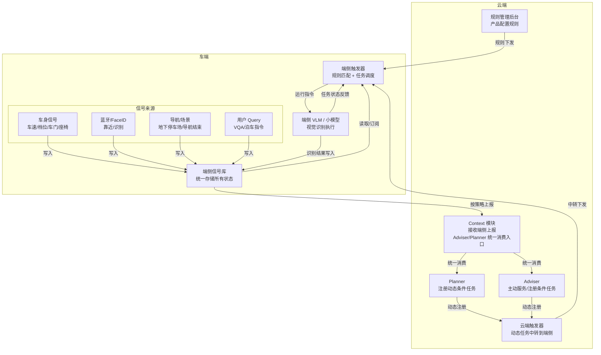
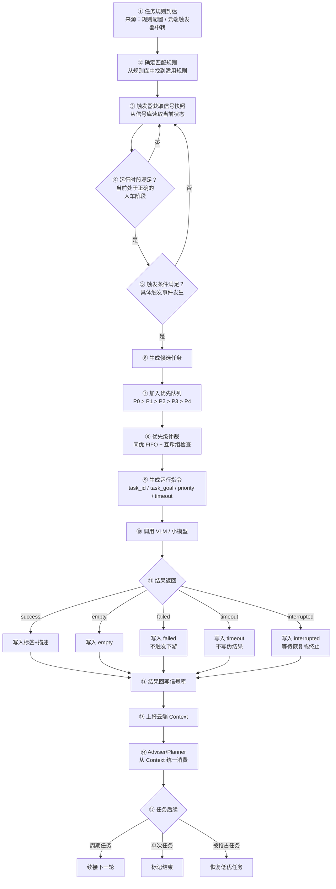
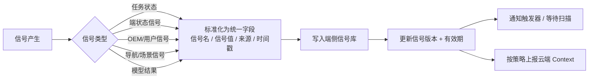
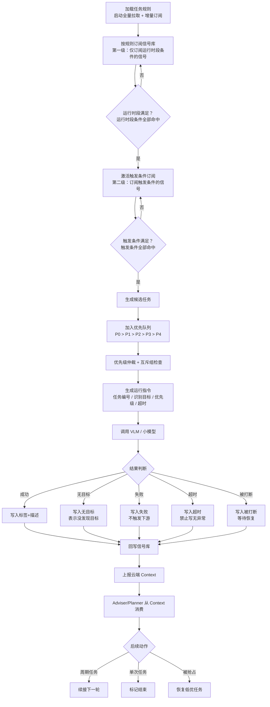
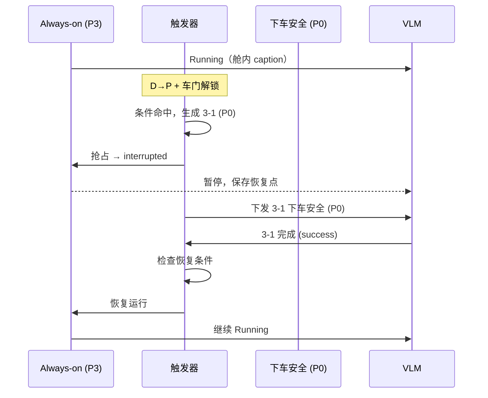
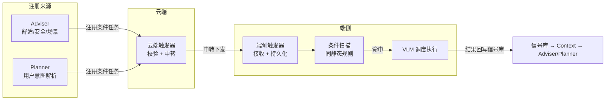

# 端侧触发器 — 产品需求文档

> 版本：v2.2 | 更新：2026-05-07
>
> **v2.2 变更**（产品/研发边界裁剪）：
> - 4.11 DSL：删除字段定义表和示例 2/3，仅保留下车安全示意，标注"精确 schema 由研发定义"
> - 5.2 注册接口：字段表替换为概念段落
> - 5.3 状态机：删除 mermaid 图，替换为文字生命周期描述
> - 6.2 性能指标：删除"崩溃重启恢复"和"动态任务注册响应"两个工程 KPI
>
> **v2.1 变更**（基于 5/7 陈西钺评审对齐）：
> - 删除触发器 → Adviser/Planner 直接通知链路（全部走 Context）
> - 新增云端触发器组件说明（2.2）
> - 修正 Always-on 执行频率和模型（高频 3s / 低频 5s，闲时持续执行）
> - 冷却/状态机/抢占恢复标注为"产品建议，最终技术方案由研发确定"
> - 动态任务 action_type 调整：notify_adviser 路径标记为待云端对齐

---

## 一、需求背景与目标

### 1.0 为什么现在要做？

当前端侧 VLM 任务触发采用短期方案：在 AI BOX SDK 中硬编码订阅状态，满足条件直接调用识别任务。存在三个瓶颈：

1. **不可扩展**：每增加任务或适配新车型，都需改代码发版；
2. **无统一信号源**：每个任务各自读 CAN 信号，VLM 结果不能复用，云端 Adviser 拿不到标准化端侧状态；
3. **无调度能力**：VLM 任务已增至 15+，缺乏优先级仲裁、打断恢复和超时释放。

现需升级至长期方案，建设端侧信号库 + 端侧触发器。

### 1.0.1 本期目标

- 已有 15 个 VLM 任务全部转为规则驱动（脱离硬编码）
- 支撑任务优先级仲裁、抢占恢复、超时降级
- 支持 Adviser/Planner 动态注册条件任务
- VLM 结果统一写入信号库，供云端 context 订阅

### 1.0.2 模块职责边界

| 模块 | 职责 | 不负责 |
|---|---|---|
| 端侧信号库 | 统一存储所有状态（端状态/OEM/场景/VLM结果/任务状态）；对外提供写入接口和订阅接口；按策略上报云端 context | 不负责信号的原始采集 |
| 端侧触发器 | 加载规则 → 读取信号 → 两级条件匹配 → 任务调度 → 下发运行指令；接收动态任务注册 | 不负责 VLM 内部推理；不负责 Adviser 思考逻辑 |

### 1.1 端侧触发器模块是什么？

端侧触发器是 AI 汽车端侧感知任务的调度中枢，负责把"端侧信号库里的实时状态"进行匹配，在条件满足时触发对应的 VLM 任务，并管理任务的优先级、执行状态、超时、打断与恢复。

是端侧任务执行前的"**规则判断 + 任务调度 + 生命周期管理**"模块。

> 信号库负责存"车知道了什么"，触发器负责判断"现在该跑哪个任务"，VLM/小模型负责执行"具体看什么"，结果再回到信号库并上报云端 context。

### 1.2 目前问题点

**端侧任务触发是写死逻辑，无法扩展**：当前 AI BOX SDK 中订阅几个状态，满足条件直接调识别任务。不同车型规则不一致时无法统一管理。

**端侧没有统一信号库，任务判断缺少稳定输入**：

- 触发器没有稳定输入：每个任务各自读 CAN 信号，方式不统一
- VLM 结果无法复用：下车安全跑完的结果，停车位识别任务想用，拿不到
- 云端 Adviser 订阅不到标准化端侧状态：Adviser 想知道"刚才 VLM 检测到什么"，没有统一接口
- 任务失败没有记录：VLM 超时、报错，无日志可排查

**VLM 任务数量已明显增加，需要统一调度**：

| 问题 | 场景 |
| --- | --- |
| Always-on 占用算力，用户 VQA 响应变慢 | P3 阻塞 P0 |
| 安全任务被低优任务挡住 | 下车安全 P0 被 Always-on P3 占位 |
| 低优任务覆盖高优任务结果 | Always-on 旧 caption 覆盖 VQA 结果 |
| 任务超时后队列不释放 | VLM 推理卡住，后续任务全部阻塞 |

---

## 二、整体架构

### 2.1 架构链路图

**端侧数据流说明**：

| 数据流 | 方向 | 内容 |
|---|---|---|
| 信号来源 → 信号库 | 各类原始信号写入 | 标准化信号（信号名 / 信号值 / 来源 / 时间戳） |
| 信号库 → 触发器 | 触发器读取/监听 | 信号快照 |
| 触发器 → 端侧 VLM | 运行指令 | 任务编号 / 识别目标 / 优先级 / 超时时间 |
| 端侧 VLM → 信号库 | 识别结果写入 | 标签 / 描述 / 无目标 / 失败 |
| 端侧 VLM → 触发器 | 任务状态反馈 | 排队中 / 运行中 / 超时 / 被打断 |
| 信号库 → 云端 Context | 按策略上报 | 端侧上报结果 → Context 模块 |

**云侧交互说明**：

| 交互 | 方向 | 说明 |
|---|---|---|
| 规则下发 | 云端规则配置 → 端侧触发器 | 静态规则全量/增量下发 |
| 动态任务注册 | Adviser/Planner → 云端触发器 → 端侧触发器 | 云端触发器中转下发到端侧 |
| 结果消费 | 端侧信号库 → Context → Adviser/Planner | Adviser/Planner 统一从 Context 获取端侧状态和 VLM 结果 |

### 2.2 云端触发器说明

陈西钺 5/7 评审会上指出：Adviser/Planner 的动态任务注册并非直连端侧触发器，而是经由**云端触发器**中转到端侧。

| 组件 | 位置 | 职责 |
|---|---|---|
| 云端触发器 | 云端 | 接收 Adviser/Planner 的动态任务注册请求 → 校验 → 下发到端侧触发器 |
| 端侧触发器 | 车端 | 接收云端触发器中转的动态任务 → 本地持久化 → 纳入调度 |

**端侧触发器与云端触发器的关系**：端侧触发器不直接接收 Adviser/Planner 的注册请求。动态任务链路为：Adviser/Planner → 云端触发器 → 端侧触发器。端侧触发器仅作为执行端，接收已校验通过的动态任务。

> **待确认**：云端触发器的具体职责边界、与端侧触发器的接口协议，需与云端团队（兰若）进一步对齐。

### 2.3 主流程

**流程说明**：

**①-② 规则到达与匹配**：触发器从两个来源接收规则——云端下发静态规则、云端触发器中转动态任务。每条规则对应一个 VLM 任务，定义了运行时段、触发条件、优先级等参数。

**③-⑤ 两级条件判断**：触发器从信号库读取当前信号快照，先判断运行时段（车在行车中 / 停车时 / 上车前 / 离车后），时段满足后才判断具体触发条件。为什么分两级？为了减少无效信号订阅和条件求值——离车后时段的 5 条规则，不需要在行车中每次信号变化时重新求值。

**⑥-⑧ 候选任务 → 调度仲裁**：条件命中后生成候选任务，进入优先级队列。同一时刻只能有一个任务在 VLM 上运行，所以需要仲裁——P0 优先于 P1-P4，同优先级先来先跑，同互斥组（共用同一摄像头的任务）互斥。

**⑨-⑩ 下发指令与执行**：仲裁通过后，触发器向 VLM 下发运行指令——执行哪个任务、看什么、优先级、超时时间。VLM 执行期间，触发器不参与推理，只管计时。

**⑪-⑫ 五种结果处理**：VLM 执行完毕可能返回五种结果，每种结果的处理方式不同：
- `success`：正常识别到目标，写标签和描述
- `empty`：正常执行但没发现目标，写 empty（这是有效信息，不是失败）
- `failed`：模型执行失败，写 failed，不触发下游主动服务
- `timeout`：超时未返回，写 timeout，**禁止写成"无异常"**——没结果不等于没有危险
- `interrupted`：被高优任务打断，写 interrupted，等待恢复或终止

全部结果写回信号库，供下游模块消费。

**⑬-⑭ 云端消费**：信号库按策略上报 Context，Adviser/Planner 从 Context 统一消费端侧状态和 VLM 结果。

**⑮ 任务后续**：三路径——周期任务续接下一轮、单次任务标记结束、被抢占的低优任务恢复。

> **注**：notify_adviser 路径待与云端触发器团队对齐后确认。本期主路径为 run_vlm → VLM 调度 → 结果回写信号库 → Context 上报。

---

## 三、端侧信号库

### 3.1 业务流程

### 3.2 信号写入规范

所有信号统一为以下 4 个标准化信息：

| 信息 | 说明 | 是否必填 |
|---|---|---|
| 信号名 | 信号唯一标识，如档位状态、VLM 结果-下车安全 | 是 |
| 信号值 | 信号值，支持字符串/数值/结构化 | 是 |
| 来源 | 写入方标识，如车机服务、VLM 感知模块 | 是 |
| 时间戳 | 写入时间 | 是 |

写入后信号库自动更新信号版本和有效期。同一信号名多来源写入时，以时间戳最新的为准（后写覆盖）。

### 3.3 功能列表

| 分类 | 信号 | 示例取值 | 来源 | 写入方 | 使用任务 |
| --- | --- | --- | --- | --- | --- |
| 车辆状态 | 电源状态 | 上电/下电 | 车辆端状态 | car_service | 全部任务 |
| 车辆状态 | 档位 | P/D/R/N | 车辆端状态 | car_service | 下车安全、行车任务 |
| 车辆状态 | 档位变化 | P→D、D/R/N→P | 车辆端状态 | car_service | 安全提醒、下车安全 |
| 车辆状态 | 车门锁状态 | 上锁/解锁 | 车辆端状态 | car_service | 迎宾、离车、下车安全 |
| 车辆状态 | 车速 | 0、<10km/h、<20km/h | 车辆端状态 | car_service | 停车寻车、行车任务 |
| 车辆状态 | 座椅占位 | 有人/无人（按座位） | 车辆端状态 | car_service | 迎宾、儿童照看 |
| 车辆状态 | 安全带状态 | 插入/未插入（按座位） | 车辆端状态 | car_service | 安全提醒 |
| 用户识别 | 舱外 FaceID | 注册车主/非注册用户 | FaceID | FaceID 模块 | 舱外迎宾 |
| OEM 信号 | 蓝牙钥匙距离 | 3m/10m | OEM | OEM 适配层 | 舱外迎宾、自动泊出 |
| OEM 信号 | 远程备车 | 发起/未发起 | 手机/OEM | OEM 适配层 | 起步安全 |
| OEM 信号 | 基础哨兵检测 | 目标物进入1.5m/无 | OEM 哨兵模块 | OEM 适配层 | 增强哨兵 |
| 用户输入 | 用户 Query | VQA/泊车 Query | 语音/云端 | 语音/云端下发 | VQA、参照物临停 |
| 场景信号 | 进入地下停车场 | 是/否 | 导航/定位 | 导航服务 | 停车寻车 |
| 场景信号 | 导航结束 | 是/否 | 导航 | 导航服务 | 停车寻车 |
| 模型结果 | VLM 标签 | 有障碍/有积水/有遗留物 | VLM/小模型 | 感知模块 | 下游消费/二次触发 |
| 模型结果 | VLM 描述 | "右前门外有积水" | VLM | 感知模块 | context/Adviser |
| 任务状态 | 任务生命周期 | pending/running/success/timeout | 触发器 | 触发器自身 | 队列管理 |

### 3.4 VLM 结果写入规范

VLM 执行完毕后，需将以下信息写入信号库：

| 信息 | 说明 | 是否必填 |
| --- | --- | --- |
| 任务编号 | 如 3-1 | 是 |
| 任务名称 | 如下车安全 | 是 |
| 任务类型 | 单次 / 周期 / 长时 / 始终在线 | 是 |
| 优先级 | P0 / P1 / P2 / P3 / P4 | 是 |
| 结果类型 | 标签 / 描述 / 混合 / 无目标 / 失败 | 是 |
| 标签结果 | 结构化标签 | 按任务 |
| 描述结果 | 自然语言描述 | 按任务 |
| 执行状态 | 成功 / 无目标 / 超时 / 失败 / 被打断 | 是 |
| 时间戳 | 结果时间 | 是 |
| 来源 | VLM / 小模型 | 是 |

### 3.5 VLM 两条回路说明

VLM 执行后有两条独立的数据回路：

| 回路 | 方向 | 内容 | 用途 |
|---|---|---|---|
| 任务状态反馈 | VLM → 触发器 | 排队中 / 运行中 / 超时 / 被打断 | 触发器据此做抢占、超时释放、恢复决策 |
| 识别结果写入 | VLM → 信号库 | 标签 / 描述 / 无目标 / 失败 | 信号库存储，供下游消费和云端上报 |

### 3.6 VLM 结果状态定义

| 状态 | 含义 | 能否当有效结果用 |
| --- | --- | --- |
| success | 识别成功，有效标签/描述 | 可以 |
| empty | 模型正常执行，但没有发现目标 | 可以，表示无目标 |
| failed | 模型执行失败 | 不可以 |
| timeout | 模型超时未返回 | 不可以 |
| interrupted | 被高优任务打断 | 不可以，等待恢复或终止 |

| 结果 | 写入 | 注意事项 |
| --- | --- | --- |
| 成功识别 | 写标签和/或描述 | |
| 未发现目标 | 写 empty | 表示模型正常执行但无目标 |
| 超时 | 写 timeout | **不允许写成"无异常"** |
| 失败 | 写 failed | 不触发下游主动服务 |
| 被打断 | 写 interrupted | 等待恢复或终止 |
| 低优覆盖限制 | — | P3/P4 不得覆盖 P0/P1 刚写入的关键结果 |

---

## 四、端侧触发器

端侧触发器是端侧任务的"调度员"。它做这几件事：

**看规则 → 看信号 → 判断任务是否命中 → 多个任务同时命中时排优先级 → 告诉 VLM/小模型去看什么 → 处理任务成功、失败、超时和打断**

### 4.1 业务流程

**流程说明**：

**规则加载**：系统启动全量拉取规则，运行中云端变更增量推送。端侧本地缓存，断网不影响规则执行。

**两级条件匹配**（核心设计）：第一级——只看运行时段条件。这三个条件不满足时，第二级触发条件的信号根本不订阅。以离车后为例：只有 5 条规则活跃，车速变化不关它们的事——它们在第一级就已经被排除。第一级满足后，才激活第二级订阅，开始监听具体触发事件。两级拆开的收益：平均每次信号变化，只有当前时段三分之一到二分之一的规则需要求值。

**触发条件判断与信号快照对齐**：触发条件中的多个信号到达信号库的时间可能差几十到几百毫秒（档位信号先到、车门解锁信号后到）。触发器中任一触发信号变化后，等待一个对齐窗口（默认 500ms，可配置），窗口内到达的信号合并求值。防止因信号到达时序差异导致的漏触发。

**候选任务 → 调度 → 执行**：条件命中后生成候选任务，经过优先级仲裁和互斥组检查，生成运行指令下发给 VLM。

**结果处理**：VLM 返回后按五态（成功/无目标/失败/超时/被打断）写入信号库。信号库上报 Context，Adviser/Planner 统一从 Context 消费。

> **通知链路**：本期不走端侧触发器直推。Adviser/Planner 统一从云端 Context 获取端侧状态和 VLM 结果。通知链路待与云端团队对齐。

### 4.2 功能列表

| 一级功能 | 二级功能 | 详细描述 |
| --- | --- | --- |
| 规则管理 | 规则加载 | 启动全量拉取 + 运行中增量订阅 + 本地缓存 |
| 规则管理 | 热更新 | 规则变更后端侧热更新生效，支持灰度和回滚 |
| 规则管理 | 动态注册 | 接收云端触发器中转的 Planner/Adviser 动态任务 |
| 条件扫描 | 两级判断 | 先判断运行时段，再判断触发条件；两级都满足才生成任务 |
| 条件扫描 | 条件表达式 | 支持比较（等于/包含/大于/小于）、与或非逻辑、持续时间判断 |
| 条件扫描 | 缺失策略 | 关键信号缺失时跳过本拍，不误触发 |
| 任务调度 | 优先级队列 | P0 > P1 > P2 > P3 > P4，同优 FIFO |
| 任务调度 | 互斥仲裁 | 同摄像头组同时只跑一个任务 |
| 任务调度 | 冷却去重 | 同一规则冷却期内不重复触发 |
| 任务调度 | 抢占恢复 | 高优到达可暂停低优，高优完成后低优恢复 |
| 指令下发 | 运行指令 | 向 VLM 下发：执行什么任务、优先级、超时时间 |
| 指令下发 | 超时处理 | 超时后释放队列，不阻塞后续任务 |
| 结果处理 | 结果回写 | 按五态（成功/无目标/失败/超时/被打断）写入信号库 |
| 结果处理 | 上报消费 | 信号库上报 Context，Adviser/Planner 从 Context 统一消费 |

### 4.3 优先级与打断恢复

| 优先级 | 任务类型 | 抢占规则 | 示例 |
| --- | --- | --- | --- |
| P0 | 用户即时/安全强相关/离车即时提醒 | 立即抢占任意低优 | 下车安全、遗留物品、VQA |
| P1 | 安全/场景增强类 | 抢占 P2-P4，不抢 P0 | 停车寻车、安全提醒 |
| P2 | 持续服务类 | 仅 FIFO + 排队 | 增强哨兵、舱外迎宾、儿童照看 |
| P3 | Always-on 描述类 | 仅 FIFO，可被抢占丢弃 | 舱内/舱外 Always-on（闲时持续执行，高频 3s / 低频 5s） |
| P4 | 动态 Adviser/Planner 任务 | 弱触发，可静默 | Adviser 条件任务、Planner 定时任务 |

**上图场景**：Always-on（P3）正在执行舱内 caption，用户 D→P + 车门解锁，下车安全（P0）条件命中。触发器向 Always-on 发送 interrupted，Always-on 暂停并保存恢复点，VLM 资源释放。下车安全执行完毕后，触发器检查恢复条件（触发条件仍满足？运行时段未变？任务未超时？）——条件满足则恢复 Always-on 继续跑。

核心原则：**P0 到达时无论当前谁在跑都得让路。P0 完成后，被挂起的任务不是被遗忘——能恢复就恢复，不能恢复就终止。**

| 运行时段 | 定义（运行时段条件典型值） | 说明 |
| --- | --- | --- |
| 离车后 | 电源=关, 档位=P, 车门=上锁 | 用户已离车锁车 |
| 上车前 | 电源=开, 档位=P, 车门=解锁 | 用户靠近/解锁但未行驶 |
| 停车时 | 电源=开, 档位=P, 车门=解锁 | 行驶后停车，用户可能还在车内 |
| 行车中 | 电源=开, 档位=D, 车门=上锁 | 正常行驶中 |

**时段切换协议**：时段变化由信号库中运行时段条件信号组合自然驱动。行车中→停车时的过渡态（D→P 瞬变→车门解锁）中，两个时段的规则共存：行车中任务的运行时段条件失效后自动终止，停车时任务的运行时段条件全部满足后开始扫描。

### 4.7 互斥组分配

同一时刻，共用同一摄像头的任务互斥（VLM 同组只能跑一个任务）。

| 任务编号 | 任务名称 | 摄像头组 | 说明 |
|---|---|---|---|
| 1-1 | 增强哨兵 | 车外 | 离车后，用车外摄像头 |
| 1-2 | 停车寻车-编号 | 车外 | 离车后，用车外摄像头 |
| 1-3 | 停车寻车-参照物 | 车外 | 离车后，用车外摄像头 |
| 1-4 | 豆包抢车位 | 车外 | 离车后，用车外摄像头 |
| 1-5 | 遗留物品 | 车内 | 离车后，用车内摄像头 |
| 2-1 | 舱外迎宾 | 车外 | 上车前，用车外摄像头 |
| 2-2 | 起步安全-远程备车 | 车外 | 上车前，用车外摄像头 |
| 2-3 | 起步安全-自动泊出 | 车外 | 上车前，用车外摄像头 |
| 3-1 | 下车安全 | 车内 + 车外 | 停车时，同时需要车内+车外 |
| 4-1 | 停车寻车-二维码 | 车外 | 行车中，用车外摄像头 |
| 4-2 | 停车寻车-楼层 | 车外 | 行车中，用车外摄像头 |
| 4-3 | 参照物临停 | 车外 | 行车中，用车外摄像头 |
| 4-4 | VQA | 车内 | 行车中，用户问舱内问题 |
| 4-5 | 安全提醒 | 车内 | 行车中，用车内摄像头 |
| 4-6 | 儿童照看 | 车内 | 行车中，用车内摄像头 |
| 4-7 | 舱内 Always-on | 车内 | 行车中，用车内摄像头，闲时持续执行 |
| 4-8 | 舱外 Always-on | 车外 | 行车中，用车外摄像头，闲时持续执行 |
| 4-N | 动态 Adviser/Planner 任务 | 动态分配 | 按任务注册时指定 |

### 4.8 抢占恢复规则

**产品诉求**：高优先级任务到达时，低优先级任务应被暂停；高优先级任务完成后，低优先级任务应在合理条件下自动恢复。

**产品期望行为**：
- 恢复时从保存的进度继续执行（非从头开始）
- 若被抢占期间触发条件不再满足或运行时段已切换，任务终止（非恢复）
- Always-on 任务在闲时持续执行，被抢占后确保恢复

> **注**：具体的恢复条件数量、恢复时机、恢复失败的处理策略，由研发根据硬件能力和 VLM 实际并发模型确定。本节仅表达产品对"抢占后应能恢复"的诉求。

### 4.9 冷却策略

**产品诉求**：同一事件不应在短时间内重复触发，防止对 VLM 资源的浪费和对用户的骚扰。

**产品期望**：
- 冷却粒度：**按规则**（同一任务的不同规则独立冷却）
- P0 安全任务默认**不冷却**（每次满足条件都必须触发）
- P1-P4 VLM 调用类任务建议冷却 ≥ 60s
- 通知类任务建议冷却 ≥ 120s（通知触达用户，频繁通知即骚扰）

> **注**：冷却的具体实现机制（时间窗口、计数器、令牌桶等）及精确数值由研发根据硬件资源和任务特性确定。本节仅表达产品对"防止重复触发"的诉求。

### 4.10 运行指令

触发器向 VLM 下发运行指令，指令需包含：执行哪个任务、识别目标是什么、优先级、超时时间。具体字段和协议由研发定义。

### 4.11 规则示意

每条规则需定义：运行时段条件、触发条件、任务参数（优先级/摄像头组/超时/冷却）。条件表达式需支持比较（等于/包含/大于/小于）、与或非逻辑组合、持续时间判断。

以下为下车安全（3-1）的规则示意，**仅用于说明产品需要什么信息，不代表最终实现格式**：

| 配置项 | 内容 |
|---|---|
| 规则编号 | 3-1 |
| 任务名称 | 下车安全 |
| 运行时段 | 停车时（电源=开 且 档位=P 且 车门=解锁） |
| 触发条件 | 档位变化 = D/R/N→P |
| 任务类型 | 单次 |
| 优先级 | P0 |
| 摄像头组 | 车内 + 车外 |
| 超时 | 5 秒 |
| 冷却 | 不冷却 |
| 识别目标 | 检测车辆四周开门障碍物及地面异常 |

> **执行方式说明**：VLM 调用类——触发器下发运行指令，结果写入信号库 → Context 上报 → Adviser 从 Context 消费结果。通知类路径待与云端团队对齐。
>
> **注**：规则的精确实现格式、条件表达式语法，由研发定义。产品侧定义的是每条规则需要包含什么信息（见 4.12 任务全景表）。

### 4.12 任务全景表

| 任务编号 | VLM 功能任务 | 用户时段 | 运行时段 | 任务内容 | 触发条件 | 优先级 |
| --- | --- | --- | --- | --- | --- | --- |
| 1-1 | 增强哨兵 | 离车后 | power=off, gear=P, door=locked | 危险场景识别&事件总结 | 基础哨兵识别 + 开关打开；周期运行 | P2 |
| 1-2 | 停车寻车-编号 | 离车后 | power=off, gear=P, door=locked | 透明底盘停车位编号识别 | 下电锁车；单次 | P1 |
| 1-3 | 停车寻车-参照物 | 离车后 | power=off, gear=P, door=locked | 前视停车参照物识别 | 下电锁车；单次 | P1 |
| 1-4 | 豆包抢车位 | 离车后 | power=off, gear=P, door=locked | 持续观测充电车位 | 下电锁车 + 用户发起；周期运行 | P2 |
| 1-5 | 遗留物品 | 离车后 | power=off, gear=P, door=locked | 车内遗留物品检测 | 下电锁车；单次 | P0 |
| 2-1 | 舱外迎宾 | 上车前 | power=on, gear=P, door=unlocked | 车主行动状态&手提物品识别 | FaceID 识别 3m 内注册车主；单次 | P2 |
| 2-2 | 起步安全（远程备车） | 上车前 | power=on, gear=P, door=locked | 停车位开门障碍物&地面异常 | 手机远程备车信号；单次 | P0 |
| 2-3 | 起步安全（自动泊出） | 上车前 | power=on, gear=P, door=locked | 停车位开门障碍物&地面异常 | 蓝牙钥匙靠近信号；单次 | P1 |
| 3-1 | 下车安全 | 停车时 | power=on, D/R/N→P, door=unlocked | 停车位开门障碍物&地面异常 | D/R/N→P + 车门解锁；单次 | P0 |
| 4-1 | 停车寻车-二维码 | 行车中 | power=on, gear=D, door=locked, speed<10 | 出入场沿途二维码识别 | 进入地下停车场/导航结束；周期运行 | P1 |
| 4-2 | 停车寻车-楼层 | 行车中 | power=on, gear=D, door=locked, speed<20 | 地下停车场楼层区域识别 | 同上；周期运行 | P1 |
| 4-3 | 参照物临停 | 行车中 | power=on, gear=D/N/P, door=locked | 根据用户指令进行参照目标物识别 | 用户泊车 Query；单次 | P0 |
| 4-4 | VQA | 行车中 | power=on, gear=D/N/P, door=locked | 根据用户问题回答舱内视觉问题 | 用户 Query；单次 | P0 |
| 4-5 | 安全提醒（长时） | 行车中 | power=on, gear=D, door=locked | 全舱不安全行为观察 | 首次 P→D；周期运行 | P1 |
| 4-6 | 儿童照看（长时） | 行车中 | power=on, gear=D, door=locked | 舱内儿童行为情绪观测 | 识别舱内有儿童；周期运行 | P2 |
| 4-7 | 舱内 Always-on | 行车中 | power=on, gear=D, door=locked | 全舱内 caption 描述 | 首次 P→D；闲时持续执行（高频 3s / 低频 5s），高优任务抢占后恢复 | P3 |
| 4-8 | 舱外 Always-on | 行车中 | power=on, gear=D, door=locked | 前视舱外 caption 描述 | 首次 P→D；闲时持续执行（高频 3s / 低频 5s），高优任务抢占后恢复 | P3 |
| 4-N | 动态 Adviser/Planner | 行车中 | power=on, gear=D, door=locked | 由注册方指定 | 按注册条件动态匹配 | P4 |

---

## 五、动态任务（Adviser/Planner 注册）

### 5.1 概述

Planner/Adviser 可在运行时通过**云端触发器**向端侧触发器注册条件任务。端侧触发器接收后将其作为普通规则纳入两级条件扫描，命中后执行对应动作。注册链路：Adviser/Planner → 云端触发器 → 端侧触发器。

### 5.2 注册要求

注册方需提供：任务名称、注册方标识、运行时段及条件、触发条件、执行方式（本期主路径为 VLM 调用）、VLM 识别目标、过期策略。

注册结果需反馈：成功（返回任务编号）或失败（注明原因：条件格式错误 / 信号名不存在 / 队列已满）。

> **注**：注册接口的精确字段定义和回调协议由研发定义。

### 5.3 动态任务生命周期

动态任务的生命周期如下：

1. **注册**：接收注册请求，校验条件格式、信号名是否存在、队列是否已满。校验通过进入激活。
2. **激活**：正式开始监听条件。条件命中 → 进入触发态。
3. **触发**：条件命中，过冷却检查。冷却期内阻塞执行，冷却结束后重新求值——条件仍满足则进入执行，不满足则回到激活。
4. **执行**：VLM 执行中或通知已发出。
5. **终态**：
   - **完成**：执行完成。周期任务冷却结束后回到激活，单次任务直接结束。
   - **过期**：有效期到期（行程结束 / 具体时间戳）自动清理。
   - **撤回**：注册方主动撤回（传入任务编号），从扫描列表移除。

> **注**：具体状态机实现和异常路径由研发定义。

### 5.4 核心规则

- 接收并保存动态任务（本地持久化，弱网可执行）
- 按注册条件纳入正常两级条件扫描
- 执行前检查上下文有效性（如用户是否仍在车内）
- 支持注册方主动撤回（传入任务编号）
- 车机重启后自动恢复未过期的动态任务
- 动态任务总数上限：建议 16 条

### 5.5 执行方式区分

| 执行方式 | 触发后行为 | 是否占用 VLM | 结果消费方式 |
|---|---|---|---|
| VLM 调用 | 触发器下发运行指令给感知模块，走正常优先级仲裁 | 是 | 结果写入信号库 → Context 上报 → Adviser/Planner 从 Context 消费 |
| 通知 Adviser | （待与云端团队对齐）Adviser 注册条件，命中后通知 Adviser | 否 | 待确认 |
| 通知 Planner | （待与云端团队对齐）Planner 注册条件，命中后通知 Planner | 否 | 待确认 |

> **5/7 评审对齐结论**：Adviser/Planner 不直接从端侧触发器接收通知。所有端侧结果统一上报 Context，Adviser/Planner 从 Context 消费。通知类型的具体实现方式，待与云端触发器团队进一步对齐。

### 5.6 示例场景

**Planner 条件任务（VLM 调用）**：用户说"十分钟后帮我关掉座椅加热"，Planner 解析后通过云端触发器注册条件任务（触发条件：自注册起满 10 分钟），10 分钟后触发器执行，结果写入信号库，Planner 从 Context 获取结果后执行关加热。

**Adviser 条件任务（VLM 调用）**：舒适 Adviser 通过云端触发器注册"副驾有人 + VLM 识别到连续打哈欠"，条件命中后触发器调度 VLM 执行，结果写入信号库 → Context 上报 → Adviser 从 Context 获取识别结果，自行决定是否推送关怀话术。

**Adviser 需要 VLM 调用**：Adviser 通过云端触发器注册"看到特定人上车就识别"（识别目标：持续关注是否有特定人上车，摄像头组：车外），触发器将其作为 P4 VLM 任务调度，结果回写信号库 → Context → Adviser 消费。

> **注**：通知类型的轻量路径，待与云端团队对齐后补充。

---

## 六、Fail 定义与验收标准

### 6.1 Fail 定义

| Fail 类型 | 定义 | 典型案例 | 严重程度 |
|---|---|---|---|
| 漏触发 | 条件满足但任务未触发 | D→P + 解锁了，下车安全没跑 | P0-致命 |
| 误触发 | 条件未满足但任务触发 | 还在 D 档开着车，下车安全触发了 | P0-致命 |
| 重复触发 | 同一事件触发多次 | 一次锁车，遗留物品检测跑了 3 次 | P1-严重 |
| 优先级错误 | 高优被低优挡住 | 用户问了 VQA，Always-on 没让路 | P0-致命 |
| 信号库污染 | 超时/失败写成伪结果 | 下车安全超时，信号库写了"无障碍" | P0-致命 |
| 抢占不恢复 | 高优完成低优不恢复 | VQA 跑完了，Always-on 没恢复 | P1-严重 |
| 队列阻塞 | 超时不释放 | VLM 卡住，后续全排队 | P0-致命 |
| 规则未生效 | 热更新后规则没起效 | PM 改规则 5 分钟后端侧还在跑旧规则 | P1-严重 |
| 动态任务丢失 | 重启后动态任务未恢复 | 注册"10分钟后关加热"，重启后丢了 | P1-严重 |
| 动态注册无反馈 | 注册失败但注册方不知道 | Adviser 注册条件任务，格式错误但没返回失败 | P1-严重 |
| 运行时段误判 | 时段判断错误导致触发/漏触发 | 行车中误判为停车时 | P0-致命 |

### 6.2 性能验收指标

| 指标 | 目标值 | 测量方式 |
|---|---|---|
| 条件命中 → 下发 VLM | ≤ 1s | 信号库满足条件 → 触发器下发指令 |
| P0 任务整体返回 | ≤ 5s | 触发条件满足 → 结果写入信号库 |
| P1 任务整体返回 | ≤ 8s | 同上 |
| P2 任务整体返回 | ≤ 10s | 同上 |
| Always-on 执行频率 | 高频 ≤ 3s / 低频 ≤ 5s（闲时持续执行） | 两次 Running 之间间隔 |
| 超时释放 | ≤ 1s | timeout 发生 → 队列释放 |
| 规则热更新生效 | ≤ 5s | 云端推送 → 端侧 dryrun 通过 → 切换 |

### 6.3 线上验收用例

| 用例 | 输入 | 预期 |
|---|---|---|
| 下车安全 + Always-on | D→P + 解锁 + Always-on 在跑 | Always-on 被打断，3-1 执行，完成后恢复 |
| VQA 抢占 | Always-on 在跑 + 用户 VQA | Always-on 被打断，VQA 执行，完成后恢复 |
| 超时 | 触发 1-5 + VLM 超时 | 写超时，不写伪结果，队列释放 |
| 风暴防护 | 信号 60s 内抖动 30 次 | 只触发 1 次（冷却期内去重） |
| 动态任务弱网 | 注册"10 分钟后关加热" + 断网 + 重启 | 10 分钟到点仍执行 |
| Adviser 注册 VLM 调用 | Adviser 通过云端触发器注册 VLM 调用任务 + 条件命中 | VLM 执行，结果写入信号库 → Context → Adviser 消费 |
| 动态任务 P0 抢占 | Planner 注册 VLM 调用 + P0 抢占 | 动态任务被挂起，P0 完成后恢复 |
| 动态任务过期 | 注册有效期=本次行程结束 + 行程结束 | 任务自动清理 |
| 动态任务撤回 | Planner 注册后主动撤回 | 状态变为已撤回，从扫描中移除 |
| 4-5+4-6 合并 | 安全提醒在跑 + 儿童照看触发 | 合并识别目标下发，两组结果分别写入 |
| 4-6 单独结束 | 合并运行中 + 用户关闭儿童照看 | 识别目标退回单任务模式 |
| 运行时段切换 | 行车中任务在跑 + 用户停车（D→P） | 行车中任务终止，停车时规则开始扫描 |

---

## 七、Context 上报策略

### 7.1 上报内容

| 信息 | 是否上报 | 说明 |
|---|---|---|
| 任务编号、名称、状态 | 是 | 基础信息 |
| 标签结果 / 描述结果 | 视任务 | P0/P1 全量上报；P3 Always-on 只上报变化 |
| 时间戳 | 是 | 端侧生成时间 |
| 车辆状态快照 | 是 | 上报时刻车速/档位/车门（用于云端追溯） |

### 7.2 上报时机

- 任务状态变为成功/无目标/失败/超时时立即上报
- Always-on 周期任务可合并上报（减少流量）
- 动态任务状态变更（触发/完成/过期/撤回）上报
- 支持网络恢复后批量补报
- Adviser/Planner 从 Context 统一消费端侧状态和 VLM 结果

### 7.3 脱敏规则

- 人脸/人体图像不上传原始图，只传标签和描述
- 车牌号不上传或脱敏处理
- VQA Query 文本可上报，关联语音不上传

---

## 八、下电后行为与离车后任务

### 8.1 下电后触发器与信号库状态

- 车辆下电后，触发器和信号库进入**低功耗模式**，仅保留离车后任务（1-1/1-2/1-3/1-4/1-5）的运行能力。
- 电源由车辆常电提供，需与整车厂确认功耗预算。
- 下电后信号库不再接收 CAN 信号（CAN 休眠），仅保留已缓存的信号和 VLM 结果。
- 下电后动态任务中有效期 = 本次行程结束的自动清理。

### 8.2 离车后任务最长运行时间

| 任务 | 建议最长运行时间 | 超时处理 |
|---|---|---|
| 1-1 增强哨兵 | 8h 或电量 < 20% 时停止 | 记录日志，通知用户 |
| 1-4 豆包抢车位 | 30min 或用户取消 | 标记已撤回 |
| 1-5 遗留物品 | 下电后 5min 内完成 | 超时标记超时 |
| 1-2 / 1-3 停车寻车 | 下电后 2min 内完成 | 超时标记超时 |

---

## 九、本期范围与长期方向

### 9.1 本期不做

1. 不建完整云端规则管理后台 → 用简单配置方式，后台后续补
2. 不定义 VLM 内部算法 → VLM 是黑盒，触发器只管调接口
3. 不做用户自定义场景 → 用户不能说"帮我盯一下这个"
4. 不做复杂自然语言规则解析 → 规则用结构化 JSON，Planner 侧负责解析后再注册
5. 不定义车控安全策略 → 触发器只管"触发感知任务"

### 9.2 长期方向

- 云端按 VIN/车型/版本灰度下发规则
- Adviser/Planner 大规模动态注册
- 端侧算力预算管理（多模型并发调度）
- 自学习触发阈值（按用户行为微调）
- 触发可解释 UI（向用户展示"为什么触发"）

---

## 十、待确认问题

> 标注：✅ 已确认 | 🔶 部分确认 | ❌ 待确认

| # | 问题 | Owner | 状态 | 备注 |
|---|---|---|---|---|
| 1 | 每个任务的 timeout 具体取值 | 研发 | ❌ | |
| 2 | 每个持续周期任务的执行周期（Always-on 已确认：高频 3s / 低频 5s，闲时持续执行。其他任务呢？） | 研发/PM | 🔶 | 5/7 西钺确认 Always-on |
| 3 | 每个长时任务的结束条件 | PM | ✅ | 5/7 西钺：云端管理，跟端侧触发器无关 |
| 4 | Always-on 被打断后恢复策略是否对所有 P0/P1/P2 都统一 | 研发/兰若 | ❌ | 西钺：找兰若对齐 |
| 5 | 单次任务被打断后是否重试 | 研发 | ✅ | 5/7 西钺：Always-on 闲时持续执行，VQA 跑完 Always-on 恢复继续跑。不存在"单次任务重试"问题 |
| 6 | P4 动态 Adviser 优先级是否合理 | PM | ❌ | |
| 7 | 4-2 停车寻车-楼层区域的任务编号和优先级 | PM/兰若 | ❌ | 西钺：找兰若对齐 |
| 8 | 端侧规则第一版交付方式：启动拉取 / 周期拉取 / 云端推送 | 研发 | ❌ | |
| 9 | 触发器崩溃恢复机制（持久化 + 重启） | 研发 | ❌ | |
| 10 | 弱网下条件任务的持久化方案 | 研发 | ❌ | |
| 11 | 用户多次关闭后自学习降权 | PM | ❌ | |
| 12 | 离车后任务最长运行时间（电池约束） | 整车厂电气 | ❌ | |
| 13 | 触发器与 Adviser 主动服务规则边界 | PM | ❌ | |
| 14 | 上报云端 context 脱敏粒度 | 安全 | ❌ | |
| 15 | 队列容量上限（建议 32） | 研发 | ❌ | |
| 16 | 触发器开发承接方 | PM/蓉姐 | ❌ | 西钺：找蓉姐聊排期 |
| 17 | 信号库开发承接方 | PM/蓉姐 | ❌ | |
| 18 | **【新增】云端触发器的职责边界和接口协议** | 兰若/云端团队 | ❌ | 5/7 西钺提到 Adviser/Planner 动态任务经由云端触发器中转到端侧 |
| 19 | **【新增】notify_adviser / notify_planner 的最终实现方式** | 兰若/云端团队 | ❌ | 5/7 确认不走端侧触发器直推，全部走 Context。但轻量通知路径是否保留待对齐 |
| 20 | **【新增】动态任务链路完整路径确认**：Adviser → 云端触发器 → 端侧触发器 → VLM → 信号库 → Context → Adviser | 兰若 | ❌ | 需端到端走通确认 |

---

## 十一、对齐记录

### 2026-05-07 陈西钺（端侧 VLM 技术负责人）

**确认项**：

| 议题 | 结论 |
|---|---|
| 触发器 → Adviser 直接通知链路 | **不存在。** Adviser/Planner 不直接从端侧触发器接收任何信息。全部走 Context。架构图已修正。 |
| 动态任务注册路径 | Adviser/Planner 通过**云端触发器**中转到端侧触发器，非直连。已补充云端触发器组件说明。 |
| Always-on 执行频率 | 高频 3s / 低频 5s，非之前写的 10s。已修正。 |
| Always-on 执行模型 | **闲时持续执行**，非定时触发。被抢占后恢复继续跑。已修正。 |
| 长时任务结束条件 | 云端管理，跟端侧触发器无关。不纳入触发器 PRD。 |
| 技术实现细节 | 冷却算法、状态机、抢占恢复的具体机制留给研发方案。PRD 只表达产品诉求。已调整。 |
| 恢复策略 | 找兰若对齐。待办。 |

**待跟进**：
- 找兰若对齐：优先级冲突策略、打断恢复策略、动态任务链路（#18-#20）
- 找蓉姐对齐：开发承接方、排期（#16-#17）
- 找仁杰：云端规则配置平台权限
