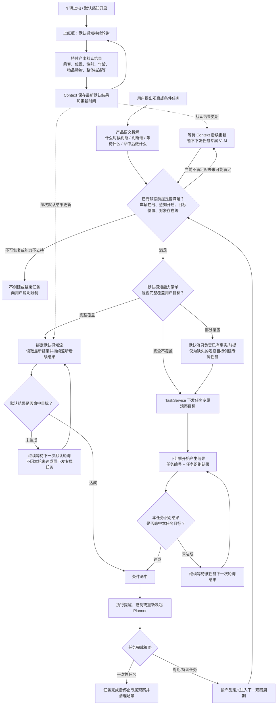

# 默认感知流与任务专属感知流：产品逻辑修订

## 一句话结论

上、下两个红框不是“同一个结果先判断一次、失败后再换一种技术实现”，而是两类独立的感知来源：

- 上红框是车辆已有的默认感知流。没有用户任务时也会持续轮询并上报，结果进入 Context。
- 下红框是任务专属感知流。只有 TaskService 为某个用户任务向 VLM 下发专属观察目标后，VLM 才开始返回“任务编号 + 任务识别结果”。

产品选择两条流的依据是“默认感知能力是否覆盖用户目标”，不是“默认结果这一轮是否达成”。

> “未达成”表示能力已经覆盖、只是当前状态没发生，应继续等默认流下一次上报；“未覆盖”表示默认流没有稳定提供完成该目标所需的信息，才需要创建任务专属观察。

## 会议原话对应的产品结论

来源：[2026 年 7 月 16 日会议文字记录](https://bytedance.larkoffice.com/docx/L1ZwdzcvZoigiXxdK8Rcx9GFn7e)

1. 00:03:32：默认 VLM 结果会以乘客列表、位置、动态等 JSON 形式上传到云端 Context。
2. 00:04:04—00:05:59：另一类是高频任务 UP 结果，带任务编号和专属识别描述，经 TaskService 转发给 Trigger。
3. 00:10:52：动态任务必须先由云端下发给 AI Box，才会与一直运行的默认周期任务一起持续输出。
4. 00:20:13—00:20:51：会议明确说这是“两类任务”。默认 AlwaysOn 结果走端状态进入 Context；云端下发的动态感知结果不进入 Context，走独立链路返回。
5. 00:25:13—00:27:34：会上讨论了默认 Context 结果也可以用于条件判断或交给模型判断，但没有形成“所有任务统一先默认、再专属”的完整产品规则。

因此，会议已确认的是“两条感知流的来源和回传方式”；下面的“默认优先、专属补充”属于需要补进 PRD 的产品选路规则。

## 产品完整流程

## 产品规则，研发方案必须服从这几条

### 1. 先判断静态前提，不等于先判断一次默认结果

“静态优先”指任务开始或每轮激活时，先确认车辆、感知开关、对象、位置等前提。前提当前不满足但可能恢复时，应等待 Context 更新；不应无意义地下发专属 VLM 任务。

### 2. 选默认流还是专属流，看能力覆盖，不看当前真假

必须维护一份“默认感知能力清单”，明确默认流稳定提供哪些对象、字段、场景和刷新时效。

- 能力覆盖且当前未达成：继续听默认流。
- 能力未覆盖：下发专属任务。
- 只覆盖一部分：默认流承担已覆盖的对象/位置/属性，专属任务只观察缺失事件。

不能因为样例 JSON 偶尔出现过某个描述，就认为默认流稳定支持该能力；是否覆盖应以产品能力清单和验收结果为准。

### 3. 下红框不是默认流的“下一步”，而是被创建出来的第二条流

下红框结果出现的前提是 TaskService 已经下发了任务。任务编号用于把观察结果与用户目标绑定。没有下发，就不应期待出现对应的任务识别结果。

### 4. 默认流缺数和默认流未达成必须区分

- 未达成：有有效结果，明确说明目标状态还没发生，继续等下一轮。
- 缺失：本轮没有相关对象或字段，不能直接当作未达成。
- 过期：结果超过产品定义的有效期，不能继续作为当前事实。
- 能力不覆盖：默认流本来就不保证提供该目标信息，才进入专属任务。

### 5. 时间窗口汇总是第三类需求

“每分钟总结宝宝状态”不是读取一次默认结果，也不是判断一次任务专属结果。它需要保存一分钟内多轮结果、处理缺轮并做聚合总结，应单独定义；当前单轮判断链路不能冒充支持。

## 典型场景

| 用户任务 | 产品判断 | 应走的流 |
|---|---|---|
| “有女性乘客上车就打招呼” | 若默认能力清单稳定提供座位、性别和乘客存在状态 | 只监听默认流；当前没有女性时继续等，不下发专属任务 |
| “副驾后方宝宝哭了告诉我” | 7 月会议把这类长尾行为作为任务专属观察案例 | 静态前提通过后，由 TaskService 下发专属任务，等待带任务编号的结果 |
| “宝宝身上的毯子滑落了告诉我” | 默认物品描述是否稳定覆盖“毯子与宝宝的关系”需要看能力清单 | 不覆盖则下发专属任务；不能仅凭样例中出现“毯子”认定已覆盖 |
| “每分钟总结宝宝状态” | 需要窗口内多轮聚合 | 当前两条单轮链路均不足，单独立项或明确不支持 |

## PRD 需要新增或改写的内容

1. 新增“感知来源选路”章节：默认流、专属流、部分覆盖三种分支。
2. 增加默认感知能力清单：字段、对象、场景、刷新周期、有效期、缺失含义和验收口径。
3. 明确“未达成不触发专属任务；未覆盖才触发专属任务”。
4. 明确部分覆盖时是否允许把 Context 的对象/位置/属性与专属结果组合判断；当前技术方案若不支持，需要列为缺口。
5. 明确默认结果缺失、过期、车辆离线、感知关闭时的等待、结束和用户提示策略。
6. 明确一次性任务命中、执行失败、用户取消后，何时停止专属轮询并清理场景。
7. 把时间窗口汇总明确列为本期不支持，或补充独立方案。

## 可以发给刘杨的确认话术

> 我把产品逻辑重新梳理了一下：VLM 有两条独立感知流。默认 AlwaysOn 结果会持续轮询并进入 Context；只有 TaskService 下发专属观察任务后，才会产生带 task_id 的任务识别结果。任务创建时应先检查静态前提，再按“默认能力是否覆盖目标”选路：覆盖就持续监听默认流，当前未达成只代表继续等下一轮，不能因此再下发专属任务；不覆盖或只覆盖部分时，才为缺失的观察目标下发专属任务。麻烦你帮忙确认当前方案是否能支持这套选路，尤其是默认 Context 的持续监听、部分覆盖时的组合判断，以及任务完成后的专属场景清理；如果当前只支持专属动态结果，我会把默认优先作为产品缺口补进 PRD，再单独评审。

