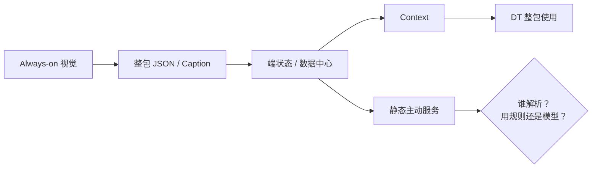
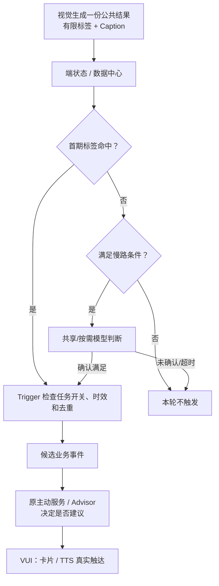

# 主动服务视觉相关问题｜会议总结与需求内审稿

> 版本：v02  
> 会议时间：2026 年 9 月 10 日 15:10–15:26  
> 使用方式：第一部分是对前置会议的客观总结；第二部分是需求内审材料；第三部分是可直接照着讲的会上话术。

---

# 第一部分｜9 月 10 日会议到底说了什么

## 1. 会议基本信息

| 项目 | 内容 |
|---|---|
| 会议主题 | 静态主动服务如何消费持续上传的视觉结果 |
| 明确发言人 | 王泽民、丁彬、赵益红 |
| 会中被提及 | 刘杨、李鑫、张航、嘉锋、陈杰团队 |
| 会议起因 | 王泽民和刘杨前置讨论后，认为静态任务不能直接照搬动态 Advisor 的模型判断方式 |
| 会议结果 | 两种处理思路在概念上都能走，但没有选定量产路线，决定提交内审 |

### 一句话总结

> 静态视觉主动服务需要长期、高频消费视觉结果；会议需要在“保留开放视觉能力”和“控制云端模型成本、并发与时延”之间做选择。

## 2. 会议按时间讨论了什么

| 时间 | 讨论内容 | 当时为什么要讨论 |
|---|---|---|
| 01:33–02:20 | 静态任务和动态 Advisor 不一样 | 动态 Advisor 由一次 Query 发起，处理后可结束；王泽民认为静态预置任务会持续轮询和推理，十几个视觉任务并行会消耗大量资源 |
| 02:52–03:46 | 视觉整包上来后由谁解析 | 会中先提到李鑫相关 AI Service “只透传、不解析”；如果上来的只是 Caption（画面描述文本），主动服务可能需要持续调模型理解 |
| 04:08–05:00 | 丁彬提出“有限集” | 为避免高频调模型，可以只输出约定好的内容，例如海、沙漠、森林；云端用规则读取，不用模型理解自由文本 |
| 05:12–06:32 | 天气/路况为什么能解析 | 王泽民希望复用天气、路况保护的处理方式；但会中对“李鑫侧只透传还是也做特定解析”的说法前后不一致 |
| 06:32–07:40 | DT 和 Context 如何使用整包数据 | 丁彬说明，DT 不先拆成标签，而是把整包放进 Context（上下文），再由模型直接使用 |
| 07:40–10:46 | 有限集、标签和整包 JSON 是什么关系 | 有限集不是另外上传一个孤立标签；丁彬投屏说明，Always-on 仍会上传一整包 JSON，可以把约定好的美景内容放在包内列表中，使用方再用代码/规则取出 |
| 08:00–08:56 | 有限标签到底有多少个 | 会中用日落、海、沙漠、森林举例；赵益红说自己只是按个人认知画了几个，没有形成正式标签表 |
| 10:46–11:35 | 云端是否已有类似天气/路况的解析能力 | 双方只在逻辑上认为“需要一个类似的规则解析能力”，但不知道现有实现，王泽民说会后询问李鑫 |
| 11:35–12:30 | 有限集会限制模型能力 | 丁彬认为，如果只允许预定义内容，可以降低云端模型消耗，但端侧模型对开放场景的描述能力会被限制 |
| 12:18–14:40 | 成本、体验和时延如何取舍 | 王泽民建议拉张航、嘉锋等人讨论成本与资源；同时担心美景经过数据中心、多段推理和 DT 后已经过时 |
| 14:20–15:22 | 两条思路如何决策 | 丁彬再次用“古典建筑”说明开放能力的价值；参会人同意把两条思路提交内审，请老板决策 |
| 15:30–16:03 | 视觉结果周期 | 丁彬口头说明：最快舱外约 3 秒一轮、舱内约 5 秒一轮；但没有说清这是采样、推理还是上报周期 |

## 3. 会议已经对齐的事

| 已对齐内容 | 准确含义 | 证据状态 |
|---|---|---|
| 静态任务与动态 Advisor 的资源模型不同，需要单独评估 | 静态任务可能长期运行并同时存在多个 | 会议对话共识 |
| Always-on 会上传整包结果 | 结果是一整包 JSON，不是每个标签各发一条信息 | 会议投屏+口头说明；真实样例未附件留存 |
| DT 可以整包使用 | 整包进入 Context，DT 作为模型直接理解 | 会议口头说明 |
| 存在两种处理思路 | 开放 Caption + 模型理解；有限集 + 规则解析 | 参会人认为概念上都能走 |
| 需要上内审 | 两条路的成本、资源、时延和能力损失无法由小会直接决定 | 王泽民、丁彬、赵益红同意提交内审 |
| 舱外/舱内最快周期分别约 3/5 秒 | 只是视觉侧口头周期，不等于用户 3/5 秒内收到提醒 | 会议口头说明，需书面和实测证据 |

## 4. 会议没有定下来的事

1. 没有决定量产走“开放 Caption + 模型”还是“有限集 + 规则”。
2. 没有确认 AI Service/端状态到底只透传，还是也做天气、路况或视觉内容解析。
3. 没有确认云端规则解析由哪个模块负责。
4. 会上投屏展示过舱外 JSON，但纪要未留存可核验的真实样例、字段名、字段类型和 Topic（数据通道）。
5. 没有确认“模型解析”是每个任务各调一次，还是整包只共享解析一次。
6. 没有形成首期美景标签、标签数量、正反例和业务文案。
7. 没有真实车辆数、任务数、模型调用量、并发和成本测算。
8. 没有端到端时延实测。会上出现的“一分多钟”、“最多 10 秒”和“纯语音 Query 约 5–6 秒”均是口头估计，不是正式指标。
9. 没有说清数据中心、王泽民侧、赵益红侧和 DT 多段推理各自的输入输出，以及是否存在重复判断。
10. 没有任何模块的正式 DRI（唯一负责人）和截止时间。

## 5. 会议中提出的两条思路

### 思路一：开放 Caption + 云端模型理解

```text
视觉输出开放 Caption
  → 上传云端
  → 云端模型判断当前是否满足某个静态任务
```

优点：可以保留“古典建筑”等未预先枚举的开放视觉能力。

会上提出的问题：

- 静态任务长期运行，需要持续理解 Caption。
- 多个任务同时存在时，可能重复调用模型。
- 全量车后的成本、并发和时延未评估。

### 思路二：有限集 + 云端规则解析

```text
视觉只输出双方约定好的内容
例如：海 / 沙漠 / 森林 / 日落
  → 这些内容仍放在整包 JSON 里上传
  → 云端用代码/规则取出，不调大模型
```

优点：可以降低云端模型消耗。产品上推断，规则处理的成本与时延也更容易约束，但这不是会议实测结论。

会上提出的问题：

- 必须事先约定标签数量和具体内容。
- 未预先枚举的古典建筑等长尾场景不能直接使用。
- 云端哪个模块负责从整包中取出标签，会议没有确认。

### 会议对两条思路的真正结论

> 两条思路在概念上都能走；需要由老板结合成本、资源、时延和体验决策走哪条。

“两条路能走”只代表讨论层面的思路可行，不代表接口已接通、能力已上线或量产已验证。

## 6. 会议中提出的会后动作

| 会中提到的动作 | 提及人 | 当前能确认的状态 |
|---|---|---|
| 询问李鑫，核实现有天气/路况解析方式和 AI Service 边界 | 王泽民 | 会中只说“后边问一下”，没有截止时间 |
| 拉张航、嘉锋等人讨论成本、资源和体验取舍 | 王泽民 | 仅为建议参会人，不是已确认决策人 |
| 陈杰团队提需求后，由赵益红再转交 | 赵益红 | 会议时陈杰团队尚未提需求 |
| 把两条路带上需求内审 | 王泽民、丁彬、赵益红 | 已在会中同意，但没有给出评审材料 owner 和时间 |

---

# 第二部分｜需求内审要评什么

## 7. 需求定义：这次内审的“需求”是什么

### 7.1 需求不是什么

本次不是评审“视觉模型能不能识别美景”，也不是评审整个主动服务平台。

### 7.2 本次需求是什么

> 为系统预置、长期运行的视觉主动服务，定义一套视觉结果消费方式：让多个静态任务能使用同一份 Always-on 视觉结果，并在成本、并发和时延可控的前提下，产生可交给下游业务的候选事件。

### 7.3 输入和输出

| 项目 | 内容 |
|---|---|
| 输入 | Always-on 整包视觉结果、任务开关、静态任务条件 |
| 中间要决定 | 从整包中如何取数据；什么时候用规则；什么时候用模型 |
| 输出 | 可交给原主动服务/Advisor 的候选业务事件 |
| 不等于 | Trigger 命中不等于用户已看到卡片或听到 TTS |

## 8. 为什么必须上需求内审

### 8.1 这不是单纯的技术接口问题

如果一台车同时有多个长期视觉任务，每个任务都持续调模型，调用量会随车辆数、任务数和视觉频率一起增加。这是量产资源决策，不是一个开发同学可以自行选择的实现细节。

### 8.2 这也是用户体验决策

如果只保留固定标签，可能无法支持古典建筑等开放场景；如果为保留开放能力而增加多段模型判断，用户又可能在已经驶离景物后才收到提醒。

### 8.3 本次内审的成功标准

老板不需要在现场评完整个技术设计，但必须留下：

1. 量产主路原则。
2. 可以接受的能力损失或资源代价。
3. 需要补齐的数据、责任人和回收时间。

## 9. 带上内审的三个选项

前两个选项来自 9 月 10 日会议思路；第三个是产品为平衡前两者提出的内审建议，**不是前置会议已定结论**。

| 选项 | 怎么做 | 优点 | 核心风险 | 内审建议 |
|---|---|---|---|---|
| 会议思路一：开放 Caption + 云端模型 | 视觉保留开放描述，云端模型理解是否满足任务 | 开放场景能力最强 | 多任务持续调模型，成本、并发和时延难控 | 不直接作为全量静态主路；如选模型路线，还需确认整包共享解析、不是每任务重复解析 |
| 会议思路二：有限集 + 云端规则 | 视觉只在约定范围内输出内容，云端用代码从整包中取值 | 处理稳定，不需要大模型持续理解 | 限制开放视觉能力，标签集需要长期维护 | 可作为首期稳定快路，但不建议删掉 Caption |
| 产品推荐：有限标签快路 + 受控 Caption 慢路 | 固定场景使用标签规则；原始 Caption 保留；只在新场景、灰区或长尾目标下调模型 | 在量产成本与开放能力之间取得平衡 | 需要新增快慢路路由、限频和故障降级；仍需测算慢路比例 | **建议内审选择这一项** |

如果首期来不及做慢路，可以先上“有限标签快路”，同时保留 Caption 字段和后续扩展位置，并明确首期暂不支持长尾场景。

## 10. 会议当时理解的链路

> 下图只还原 9 月 10 日会议中讲到的关系，问号就是没有聊清的地方。



这张图表明：DT 的使用方式在会中有口头说明，但静态主动服务侧的解析位置和解析方式未定。

## 11. 建议带上内审的产品流程图

> 下图是产品建议，不是 9 月 10 日会议已定方案。



### 这张图需要讲清的五件事

1. 视觉结果只生产一份，多个静态任务共享，不为每个任务重复生产和解析。
2. 首期稳定场景优先走有限标签和规则。
3. 标签没有命中时，不是每次都调模型；只有满足内审约定的慢路条件才调用。
4. Trigger 只检查任务开关、视觉结果、时效和去重，然后产生候选事件。
5. 原主动服务/Advisor 决定是否建议、说什么；VUI 对真实卡片/TTS 触达负责。

## 12. 需求内审必须讲清的风险

| 风险 | 会议中的根据 | 如果不处理 | 内审需要给的原则 |
|---|---|---|---|
| 成本与并发 | 多个静态任务需要长期消费视觉结果 | 全量车后模型调用随任务数放大 | 一份结果多任务复用；给出模型调用上限 |
| 开放能力损失 | 有限标签无法枚举古典建筑等所有内容 | 端侧视觉能力被固定标签封死 | 保留 Caption；明确慢路或长尾能力边界 |
| 提醒过时 | 会上提到数据中心、多段推理、DT 串联 | 用户驶离后才收到美景提醒 | 按场景定义有效期；埋点测真实端到端时延 |
| 重复解析 | 会中提到数据中心、王泽民侧、赵益红侧和 DT 多段处理 | 即使前面变成标签，后面仍可能重复调模型 | 每一层说清唯一输入、输出；无独立价值的层不重复判断 |
| 数据语义不清 | 会议只投屏解释整包，没有留存正式字段协议 | “没有识别到”、“没有数据”和“数据过期”可能被混同 | 开发前先确认真实 JSON、时间、状态和版本 |
| 解析责任悬空 | 会中对李鑫/AI Service 是否解析的说法不一致 | 视觉、端状态和业务都以为对方负责 | 指定公共解析/标准化模块和实名 DRI |
| 触发不等于用户闭环 | 会议没有说清解析后到用户触达的模块边界 | 大家只验证标签或 Trigger 命中，却没人对卡片/TTS 结果负责 | Trigger 只产生候选事件；业务/Advisor 和 VUI 分别认领后续闭环 |

## 13. 内审会必须确认的问题

下表的“对接入口”是根据原会议中的发言和点名整理，不等于已确认最终 owner。

| 编号 | 现场必须确认 | 为什么 | 建议对接入口 | 会议应留下的书面结果 |
|---|---|---|---|---|
| C1 | 量产选开放模型、有限标签，还是快慢分层 | 这是成本与体验的总决策 | 内审决策人；张航、嘉锋是会中建议邀请人 | 选定路线、选择理由、不选另两条的原因 |
| C2 | 真实视觉整包里到底有什么 | 必须先知道是 Caption、有限列表还是两者都有 | 丁彬/视觉侧 | 舱内外真实 JSON、字段、周期、车型、版本、开关、Topic |
| C3 | AI Service/端状态只透传还是也解析 | 会中说法前后不一致 | 李鑫相关方 | 现状图、已有接口、解析位置、可复用范围、最终 DRI |
| C4 | 有限标签包含哪些场景 | 不先定范围，视觉侧无法评估效果和代价 | 赵益红/场景侧，陈杰团队补充需求，视觉侧评估 | 首期场景、正例、反例、时效和暂不支持范围 |
| C5 | 一份视觉结果是否供多任务共享 | 不共享会出现重复解析 | 云端架构/Trigger 相关方 | 公共消费位置、输入输出、缓存/更新规则和 DRI |
| C6 | 模型调用在哪里、什么时候发生 | 需要区分每任务、整包共享和按需调用 | 云端架构/模型服务 | 调用位置、准入条件、峰值并发、费用上限、超限降级 |
| C7 | Trigger、原业务/Advisor、DT、VUI 各自做什么 | 会中多段“再推理”可能重复 | 各模块代表，会上实名认领 | 每段输入、输出、是否必经、失败行为和唯一 DRI |
| C8 | 真实端到端时延多少 | 3/5 秒只是视觉周期，不是用户时延 | 视觉、上传、云端、Advisor/DT、VUI 各段负责人 | 每段时间戳、P50/P95、场景有效期和超时行为 |
| C9 | 怎么验证和上线 | 当前只有口头方案，无效果和压测数据 | 产品、视觉、数据/测试、项目决策人 | 影子数据范围、效果/成本/时延门槛、灰度范围和 Go/No-Go 决策人 |

## 14. 建议的内审会议议程

| 时间 | 内容 | 你要展示什么 | 这一段要得到什么 |
|---:|---|---|---|
| 3 分钟 | 回顾前置会议 | “已对齐/未对齐”表 | 让所有人接受：两条路只是概念可行，尚未量产决策 |
| 3 分钟 | 说明为什么必须决策 | 静态/动态差异+成本/能力矛盾 | 让老板确认这是量产产品取舍，不是小接口问题 |
| 5 分钟 | 对比三个选项 | 第 9 节方案对比表 | 拍板主路原则 |
| 4 分钟 | 讲推荐流程 | 第 11 节一张流程图 | 确认一份结果复用、快慢路和 Trigger 边界 |
| 5 分钟 | 讲风险 | 第 12 节风险表 | 确认哪些风险必须作为详细设计/放量前置 |
| 8 分钟 | 逐项确认 | 第 13 节 C1—C9 | 每项留结论、实名人和回收时间 |
| 2 分钟 | 宣读结论 | 会议决议模板 | 确认通过/条件通过/补充后重审 |

---

# 第三部分｜会上怎么讲、讲什么

## 15. 7 分钟主讲话术

### 15.1 开场：先说前置会议得到了什么

> 各位，我先回顾一下 9 月 10 日前置会的真实结论。  
> 第一，静态视觉主动服务和动态 Advisor 不一样。动态 Advisor 是用户发起一次 Query，判断后可以结束；静态任务开启后，需要持续消费视觉结果。  
> 第二，当时讨论了两条思路：一条是保留开放 Caption，由云端模型理解；另一条是事先约定海、沙漠、森林、日落等有限内容，由云端用规则从整包 JSON 中取出。  
> 前置会只确认这两条思路在概念上都能走，没有选定量产方案，也没有确认解析 owner、成本、时延和标签范围。所以今天是请大家做量产决策，不是重复讨论“链路能不能通”。

### 15.2 为什么需要老板决策

> 这件事的矛盾很明确。  
> 如果每个静态任务每收到一份 Caption 都调一次模型，成本和并发会随车辆数、任务数和视觉频率一起增加。舱外会议口径是最快约 3 秒一轮，所以单车能跑通不代表全量车能承受。  
> 但如果为了省资源，只保留固定标签，又会丢失古典建筑等未预先定义的长尾能力。同时，美景是瞬时场景，如果经过数据中心、多段模型和 DT 后才触达，提醒可能已经过时。  
> 所以这不是一个字段怎么拆的小问题，而是能力、成本和体验的产品取舍。

### 15.3 说明产品推荐方案

> 基于前置会的两个极端，我这次带来一个组合建议：有限标签快路 + 受控 Caption 慢路。这是今天要评审的产品方案，不是前置会已定结论。  
> 具体是：视觉每轮只产生一份公共结果，里面保留有限标签和开放 Caption。首期定义清楚、强时效的场景优先用标签和规则。标签没命中时，不是默认调模型；只有新场景、低确定性灰区或用户明确长尾目标等条件成立时，才调一次共享/按需模型。模型没有确认或超时，本次不触发。  
> Trigger 只负责检查任务开关、视觉结果、时效和去重，产生候选业务事件。原主动服务/Advisor 决定是否建议和说什么，VUI 负责卡片/TTS 的真实触达。

### 15.4 说清风险

> 这个建议不代表风险已经解决。  
> 第一，视觉侧能否稳定同时提供有限标签和 Caption，需要真实 JSON 和效果数据。  
> 第二，端状态、AI Service 和云端业务之间，到底由谁从整包中取出字段，需要唯一模块和 DRI。  
> 第三，慢路不能变成另一种全量调模型，需要确认准入、限频、资源上限和超限降级。  
> 第四，3 秒和 5 秒只是视觉周期，不是用户时延。需要分段埋点，证明用户真正收到提醒时场景还有价值。

### 15.5 请各方确认

> 接下来请大家不要只回答“可以做”，而是回答以下问题。  
> 请视觉侧展示真实整包 JSON，说明有限集在包内的形式、舱内外周期、车型版本和效果代价。  
> 请李鑫相关方确认 AI Service/端状态是只透传还是也解析，天气/路况的已有做法能否复用。  
> 请业务侧确认首期场景、正反例、时效和提醒文案；如果赵益红草案和陈杰侧需求未到齐，今天只批入围原则。  
> 请云端和架构侧确认一份结果如何多任务复用，模型在哪里调，峰值并发和费用上限是什么。  
> 请 Trigger、Advisor/DT 和 VUI 各自确认输入、输出、是否必经、失败时怎么做，并留下实名 DRI。

### 15.6 最后收口

> 我的产品建议是：原则同意“有限标签快路 + 受控 Caption 慢路”。一份 Always-on 视觉结果由多个静态任务复用；首期场景使用标签规则；Caption 保留；模型只在受控条件下调用。  
> 如果今天不同意这个方案，请明确选择开放模型路线或纯有限集路线，并写清能够接受的成本、时延或能力损失。  
> 如果某个问题今天无法确认，请不要留“后续对齐”，而是留下实名认领人、精确回收时间和书面结论位置。

## 16. 会上不要这样说

| 不要说 | 正确说法 |
|---|---|
| “前置会已经定了快慢路方案” | “前置会确认两种思路概念可行；快慢路是本次的产品建议” |
| “AI Service 不做解析” | “会中关于透传/解析的说法不一致，请李鑫相关方书面确认” |
| “舱外 3 秒就能给用户提醒” | “3 秒只是视觉侧口头周期，完整用户时延待埋点” |
| “日落、海、森林就是 P0” | “这些只是会上举例，正式 P0 需要业务、视觉和测试会签” |
| “丁彬/李鑫/赵益红就是 owner” | “他们是当前信息/沟通入口，最终 DRI 需现场认领” |
| “两条路都能走，所以可以开工” | “两条路只在概念上可行，路线、接口、资源、时延和 owner 仍需拍板” |

## 17. 建议的会议决议模板

```text
评审结论：通过 / 条件通过 / 补充后重审

1. 量产主路：________________
   选择理由：________________

2. 首期场景范围/入围原则：________________

3. 视觉输出：Caption / 有限集 / 双输出

4. 公共解析/标准化位置：________________
   唯一 DRI：________________

5. 模型调用条件、资源上限和超限降级：________________

6. Trigger 候选事件承接方：________________
   Advisor/DT/VUI 各段 DRI：________________

7. 需要补齐的真实数据：________________
   认领人：________________
   回收时间：________________

8. 下一次检查时间：________________
```

---

## 18. 来源与信息边界

- 会议事实主来源：2026 年 9 月 10 日《聊主动服务视觉相关问题》原始逐字稿。
- 第 1–6 节是会议客观总结。
- 第 7–17 节是基于会议问题整理的需求内审材料和产品建议，不能冒充成前置会已决结论。
- 参会人的正式部门、职位和最终 DRI 以内审会的最新书面结论为准。
