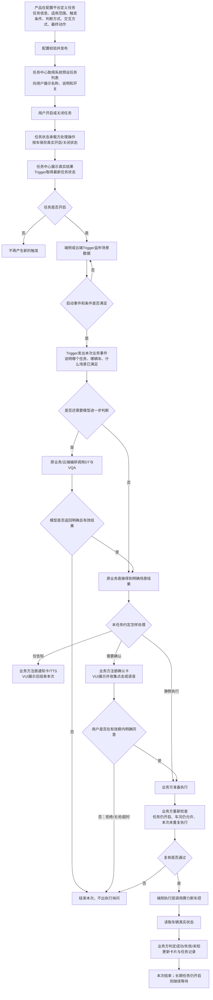

# SLS 系统预设任务需求外审：业务逻辑、评审问题与待补信息

> 更正：本版总图将部分产品目标和未确认方案画成了连续链路。模型结果承接、执行前复核、卡片有效期及静默分支应以[逐步关系图与纠错 v02](./Meeting-Summary-2026-09-14-sls系统预设任务需求外审-逐步关系图与纠错-v02.md)为准。会议没有确认由 Trigger 承接后续连续判断，也没有确认任务级卡片等待时间配置。

> 会议时间：2026 年 9 月 14 日 16:01—17:18  
> 会议主题：系统预设任务、任务中心、Trigger、即时交互卡及端云链路外审  
> 主要参会人：王泽民、刘杨、王梦尧、郝晓伟、姜涵、赵益红  
> 补充依据：会后与徐洋关于 VUI / 即时交互卡链路的确认截图，以及现有业务流程图  
> 文档目的：还原会上真正讨论的问题，给出一条不跳步的业务主链路，并列清下一版 PRD 还缺什么。

---

## 1. 先给结论

这次评审不是因为四个任务完全没有需求，而是因为**四个任务共用的系统框架尚未定清**。会上最集中追问的是以下四个交接点：

1. 用户在任务中心打开开关后，谁保存这辆车的真实任务状态，Trigger 怎样拿到；
2. Trigger 判断条件满足后，业务事件交给谁，谁负责创建并注册即时交互卡；
3. 需要 DT / VQA 的云端任务，谁等待模型结果，谁根据结果决定是否询问用户；
4. 用户确认后，谁重新检查车况、调用车控、读取真实状态并结束本次任务。

会后徐洋给出的信息修正了会上一个重要误区：

> **端侧自闭环任务不需要为了“出即时交互卡”先走主动推荐。即时交互卡已经支持外部业务直接接入；业务方负责注册、拉起和消费卡片，VUI 负责展示和交互能力。卡片可以采用特殊的“系统通知”样式。**

因此，最终框架不应写成“Trigger 直接出卡”，也不应写成“Planner 负责拉卡”。正确关系是：

> **Trigger 负责判断何时发生；系统预设任务业务负责收到事件后选择处理方式，并在需要时注册卡片；VUI 负责把卡展示给用户并返回交互结果；业务方拿到有效确认后再请求车辆执行。**

---

## 2. 系统预设任务究竟是什么

系统预设任务是产品预先定义好的长期服务。用户不需要每次说一句指令，只需要在任务中心打开一次。此后系统持续等待条件，在条件满足时提醒、询问或执行；本次结束后，如果任务仍然开启，就继续等待下一次机会。

这里有两个完全不同的“开关”，PRD 必须分开：

| 开关 | 用户在控制什么 | 作用时间 |
|---|---|---|
| 任务中心开关 | 是否允许这项长期服务继续工作 | 持续生效，直到用户关闭 |
| 即时交互卡上的确认按钮 | 是否同意执行本次具体动作 | 只对当前一次询问有效 |

例如，用户打开“天气路况保护”只是允许系统以后发现湿滑时提醒；并不等于用户提前同意每次都切换驾驶模式。

---

## 3. 六个模块分别做什么

### 3.1 配置平台

配置平台保存“这项任务怎样运行”的产品定义，例如适用车型、启动事件、判断条件、端侧或云端、是否调用模型、是否询问用户、卡片文案、最终动作、频控和退出条件。

配置平台不负责实时判断，也不直接展示车机卡片或控制车辆。

### 3.2 任务中心 / Task Service

任务中心给用户展示系统预设任务列表和开关，接收用户的开启或关闭操作，并显示真实处理结果。

会上王梦尧说明：Task Service 更像任务列表的统一出口，保证车机收到统一结构；具体任务怎样创建和运行，不属于 Task Service。当前仍未确认的是：**谁保存按车维度的系统预设任务开关，以及 Task Service 与这个状态承载方怎样交接。**

### 3.3 Trigger

Trigger 读取真实任务状态和场景数据，判断：

- 任务是否开启；
- 启动事件是否发生；
- 条件是否满足；
- 数据是否有效；
- 是否已经处理过；
- 是否达到频控或冷却限制。

判断通过后，Trigger 发出一条业务事件。Trigger 的职责到“这次场景发生了”结束。通用 Trigger 不应该承担每个具体任务的卡片页面、用户交互和车控闭环。

### 3.4 系统预设任务业务

这是会上缺失最严重的模块。每一项任务必须有一个业务责任方，负责：

- 接收 Trigger 的业务事件；
- 判断本次走静默、仅告知还是二次确认；
- 需要询问时，准备并注册卡片；
- 接收用户确认、拒绝、关闭或超时结果；
- 确认仍有效后请求车辆执行；
- 读取最终状态，更新或关闭卡片。

如果天气/路况保护由 Trigger 团队承接整条端侧自闭环，那么 Trigger 团队同时扮演“规则框架”和“天气业务”两个角色；PRD 中仍应把两个职责分开写，不能因为是同一研发团队就合并成一个方框。

### 3.5 即时交互卡 / VUI

即时交互卡是车机上的通用交互容器。它负责：

- 校验并展示业务方注册的标题、正文、图标、按钮和 TTS；
- 支持手动点击；
- 按已接入能力支持端侧“可见即可说”或云端泛化语音；
- 返回展示结果、用户选择和生命周期结果；
- 接收业务执行结果并更新卡片。

它不负责判断天气、识别儿童、决定是否开盖，也不直接持有业务车控逻辑。

### 3.6 端侧执行与赛力斯车控

业务方拿到执行资格后，请求端侧执行层调用赛力斯车控。调用返回成功只表示请求被接收，不代表车辆已经达到目标状态；业务仍需读取儿童锁、后视镜加热、驾驶模式或充电口盖的真实状态，才能判断最终成功。

---

## 4. 一条完整、不跳步的总业务链路

这张图的核心不是每个模块的技术接口，而是四次责任交接：

1. 任务中心把用户操作交给真实状态承载方；
2. Trigger 把“条件已满足”交给任务业务；
3. 任务业务把“需要询问什么”交给 VUI；
4. 任务业务把“已经获得执行资格”交给端侧执行和车控。

---

## 5. 端侧链路与云端链路应怎样区分

端云不应按“有没有卡片”区分，也不能按“有没有网络时临时切换”区分。应该按**完成本次判断需要的能力在哪里**区分。

| 判断标准 | 端侧任务 | 云端/端云协同任务 |
|---|---|---|
| 场景数据 | 本地车辆信号、端侧结构化识别结果足够 | 需要上云状态、DT、VQA或更多上下文 |
| 规则 | 条件明确，可用 AND/OR、阈值、状态变化表达 | 需要模型识别、语义理解或工具调用 |
| 时延和网络 | 要求快，或弱网下仍需工作 | 可以接受上行、推理和下行耗时 |
| 交互卡 | 原业务直接注册端侧卡 | 原业务在云端结果明确后注册卡；卡仍在车机展示 |
| 最终执行 | 端侧复核并调用车控 | 云端给出业务结论，端侧仍复核并调用车控 |

会后徐洋确认的是“卡片如何接入”，不是“所有任务都改为端侧”。即使云端任务最后也需要卡片，仍应由原业务注册卡片；Planner 不负责主动创建卡片。

---

## 6. 四个任务根据本次外审应怎样重新定性

### 6.1 天气/路况保护

**当前结论：端侧自闭环。**

端侧 Trigger 读取天气/路况识别、车速、驾驶模式、后雾灯等本地数据，判断雨、雪、雾或路面湿滑场景。命中后，天气业务直接接入即时交互卡，展示建议并收集确认。用户确认后重新读取车况，再执行切换驾驶模式或打开后雾灯，最后读取真实状态。

会后徐洋的回复意味着：天气任务无需为出卡走主动推荐；需要做的是让天气业务按 VUI 三方调用能力完成场景注册与适配。

仍缺：任务中心开关怎样到端侧 Trigger、卡片研发 Owner、确认/取消/TTS 文案、可见即可说支持范围、车控及状态回读接口。

### 6.2 后排儿童/宠物保护

**当前结论：场景逻辑明确，端云归属和感知能力未完全确认。**

正确逻辑是：档位从 P 切到 D → 后排检测到儿童或宠物 → 儿童锁当前关闭 → 询问用户是否开启儿童锁。儿童锁已经开启时不需要弹卡，也不需要正反馈。

本次会议发现的错误：原图把儿童锁开启后的正负分支画反了。

仍缺：现有 VLM 枚举只在会上明确提到儿童和老人，宠物是否已经支持、由 OMS 还是 VLM 提供、数据多久更新一次都需要确认；卡片确认后由哪个业务方接收并请求儿童锁车控也未明确。

### 6.3 识别充电设备后打开充电口盖

**当前结论：端云协同，是四个任务中链路最复杂的样例。**

建议链路：任务开启 → P 挡变化 → SOC 小于等于 20% → 充电口盖关闭 → Cloud Trigger 产生候选事件 → 原业务调用主动推荐/DT → DT 调端侧 VQA 判断是否发现充电设备 → 明确发现后原业务注册确认卡 → 用户确认 → 端侧再次确认仍为 P 挡、口盖仍关闭、结果未过期 → 打开充电口盖 → 回读真实状态。

本次会议暴露的断点：当前没有明确模块负责“等待 VQA 结果后决定是否拉卡”。会上在 Trigger、DT、静态 Advisor、主动推荐之间来回切换，但没有形成正式结论。

会后应按职责拆开：Trigger 只输出候选事件；云端业务编排等待并消费 DT/VQA 结果；结果明确后，仍由充电任务业务注册卡片。不能要求 Planner 自动拉卡，也不能让 VUI 自己判断有没有充电设备。

### 6.4 后视镜自动加热

**当前结论：归属待确认，不能继续笼统写成“云端任务”。**

会议讨论了三个子场景：

1. 雨量传感器识别下雨，车速低于 70 km/h，且车辆不在 P 挡；
2. 退出传送带洗车模式；
3. 湿度大于 60%、车内外温差大于 5℃，并可能要求识别“刚出地库”。

三个子场景最终动作相同，都是开启后视镜加热。会上提出场景一 > 场景二 > 场景三的优先级，但还没有解释为什么需要优先级，以及同时命中时是否只执行一次。

如果第三个场景不要求判断“刚出地库”，全部条件都能由端侧确定，可以走端侧自闭环；如果必须判断“刚出地库”，就需要 VLM 或云端能力，至少第三个子场景要走云端/端云协同。因此该任务应先确认业务条件，再定端云归属。

---

## 7. 徐洋给出的信息到底解决了什么

### 已经解决

1. 端侧自闭环任务存在直接调用即时交互卡的通用能力；
2. 不需要为了端侧拉卡先绕主动推荐；
3. 即时交互卡能够为外部业务提供展示和二次交互；
4. 赛力斯走消息盒子链路，内部预设任务可以直接接入并做场景化适配；
5. 系统预设任务可以使用特殊的系统通知样式。

### 还没有解决

1. 具体哪个客户端和服务端研发承接本次四个任务；
2. 业务注册卡片时必须传哪些字段；
3. 卡片是传模板 ID，还是传 title、icon、content、button 等字段；
4. 按钮点击、可见即可说和泛化语音分别怎样回到业务方；
5. 展示失败、排队、超时、关闭、被替换时返回什么；
6. 执行成功或失败后，业务怎样更新和关闭卡片；
7. 云端 DT/VQA 结果出来后，哪个模块触发业务注册卡片。

所以，“VUI 链路已经有”只代表底层框架可复用，不代表四个任务已经完成接入。

---

## 8. 这次评审为什么会显得乱

### 8.1 没先把三层问题分开

会上把“任务中心有没有预设任务”“Trigger 能不能判断”“卡片怎样下发”混在一起讨论。三个问题分别属于任务管理、场景判断和用户交互，任何一个方框都不能替代另一个。

### 8.2 把任务中心和任务系统当成同一个模块

会上先说不走任务系统，后面又说任务中心要提供列表。正确说法应该是：任务中心是用户入口；Task Service 可以统一输出列表；具体任务的配置、状态和运行仍需业务承接。是否由 Task Service 保存系统预设任务状态，会议没有定论。

### 8.3 没有“原业务”这个责任方

旧图从 Trigger 直接连到即时交互卡，再直接连到车控，导致大家连续追问“谁推卡”“谁接确认”“谁做车控”。补上系统预设任务业务后，这三件事才有统一责任人。

### 8.4 把主动推荐误当成卡片传输通道

主动推荐/Advisor/DT 是云端判断和建议链路；即时交互卡是展示与收集用户选择的能力。端侧任务可以直接接卡，不应为了拉卡调用主动推荐。云端任务可能需要主动推荐做判断，但判断完成后仍由业务注册卡片。

### 8.5 端云结论在会议中发生了变化

开场说“天气端侧，后面三个云端”；后面又发现后视镜大部分条件可在端侧完成。说明 PRD 应先定义端云划分标准，再逐项归类，不能先定三个都上云。

### 8.6 图中写了判断，但没有写判断依据和责任人

例如“属于本次停车”“未过期”“用户确认仍有效”都没有说明由谁记录本次停车、用什么标识关联、有效期是多少。研发自然无法接着评。

---

## 9. 下一版 PRD 仍缺少的完整信息

### P0：不补就无法确定架构与责任

| 缺口 | 必须写清的问题 | 建议确认方 |
|---|---|---|
| 任务状态承载 | 谁按车保存开启/关闭；Trigger 启动、变更、断线恢复时怎样拿到；状态未知怎么办 | 郝晓伟、王梦尧、任务中心/Task Service、Trigger 研发 |
| 任务列表来源 | 谁创建预设任务；任务中心从哪里取得名称、说明、图标、默认开关和适用范围 | 任务中心、配置平台 |
| 卡片业务 Owner | 四个任务分别由哪个业务研发注册、拉起、消费和更新卡片 | 徐洋协助确认 VUI 对接人；各任务业务负责人认领 |
| VUI 接入合同 | 拉卡字段、展示回执、点击/语音结果、超时、关闭、更新、撤卡 | 徐洋、VUI 客户端/服务端研发 |
| 云端编排 Owner | 谁接 Trigger 事件，谁调 DT/VQA，谁等结果，谁决定出卡 | 主动推荐/Advisor、DT/VQA、充电任务业务 |
| 执行闭环 | 谁复核、谁调用车控、谁读取真实状态、失败和未知怎样展示 | 端侧执行、赛力斯车控、端状态负责人 |

### P1：不补会出现误触发或无法验收

| 缺口 | 需要补充的产品规则 |
|---|---|
| 任务默认状态 | 默认开启还是关闭；新老车辆是否一致；是否需要用户授权 |
| 状态维度 | 按车、账号还是主驾用户；退出账号和换主驾后怎样处理 |
| 更新策略 | 新任务及配置变更何时进入车机；会议倾向下次上电懒加载，但需写成正式规则 |
| 数据有效性 | 每个 VLM/OMS/端状态的数据来源、格式、更新时间和不可用处理 |
| 去重与频控 | 同一事件多久只处理一次；每次上电最多提醒几次；冷却多久 |
| 二次确认有效期 | 卡片多久有效；用户确认前条件变化怎样失效 |
| 真实结果标准 | 哪个车辆状态达到什么值才算成功；超时后是失败还是未知 |

### P2：不补会导致后续每个任务都重复开发

1. 配置平台的原子能力清单：信号、事件、模型、卡片、TTS、按钮、车控、状态回读；
2. 任务配置页面：任务信息、适用范围、运行位置、触发规则、进一步判断、交互方式、动作、频控、灰度与回滚；
3. 统一业务事件结构：任务、车辆、本次触发、场景原因、时间、有效期和回调目标；
4. 统一日志链路：能从一次 Trigger 命中追到模型结果、卡片展示、用户选择、车控和真实回读；
5. 统一验收模板：正常、拒绝、超时、状态变化、模型未知、断网、车控失败、回读失败。

---

## 10. 你下一步应分别找谁、怎么聊

### 10.1 找徐洋：只确认 VUI / 即时交互卡

可以直接这样说：

> “我已经把链路改成原业务直接注册即时交互卡，不再让 Planner 或主动推荐负责拉卡。现在需要你帮我确认接入合同：业务需要传哪些字段，展示成功或失败怎么回，按钮和可见即可说怎么返回原业务，超时和撤卡怎么处理，执行结果怎样更新卡片。另外请帮我明确本次客户端和服务端研发 Owner。”

### 10.2 找郝晓伟、王梦尧：只确认任务中心与状态

> “任务中心负责展示和转发操作我理解了。现在还差真实状态链路：用户按车打开或关闭后，操作交给谁；谁持久化；Trigger 首次启动、变更和重连时怎么拿；处理失败时任务中心怎样回显。系统预设任务是否由 Task Service 统一输出列表，也请一起确认。”

### 10.3 找 Trigger 研发：确认平台和事件边界

> “Trigger 只负责读取有效任务状态、监听数据、判断规则并发业务事件。请确认平台需要新增哪些配置项；事件中至少要带任务、车辆、本次触发、命中原因、时间和有效期。卡片、用户选择和车控由任务业务承接，不塞进通用 Trigger。”

### 10.4 找主动推荐、DT/VQA：只确认充电任务的中段

> “Cloud Trigger 给出 P 挡、低电量、口盖关闭的候选事件后，谁调用 DT/VQA；结果以什么枚举返回；谁等待和消费；如何关联本次停车；FOUND、NOT_FOUND、UNKNOWN、ERROR 分别怎样处理；FOUND 后由哪个业务方注册卡片。”

### 10.5 找赛力斯端状态与车控

> “四个任务所需的档位、SOC、儿童锁、口盖、后视镜加热、驾驶模式等状态是否已有；车控请求前有哪些安全条件；请求返回与真实状态回读分别是什么；多长时间未达到目标算失败或未知。”

### 10.6 找 VLM / OMS 能力负责人

> “请分别确认儿童、宠物、充电设备、刚出地库是否已有结构化结果，结果多久刷新、置信或未知怎样表达。没有明确结构化能力的项不能先写成已支持。”

---

## 11. 下一次评审建议只确认六件事

1. 谁保存系统预设任务的真实开关状态；
2. Trigger 的输入、输出和职责终点；
3. 四个任务各自的业务 Owner；
4. 端侧卡和云端卡分别怎样由原业务注册；
5. 充电任务中谁承接 DT/VQA 结果并决定出卡；
6. 端侧复核、车控和真实状态回读由谁闭环。

不要在同一场会议里同时评所有卡片文案、所有信号 ID 和所有接口字段。先把以上六个框架问题拍板，再分专项补技术细节。

---

## 12. 本次会议已确认、暂定与未确认清单

| 内容 | 状态 | 说明 |
|---|---|---|
| 系统预设任务是用户可启停的长期服务 | 已确认 | 本次完成后继续等待下一次 |
| 天气/路况保护走端侧自闭环 | 已确认 | 具体开关和卡片接入仍缺 |
| 端侧任务可由原业务直接接即时交互卡 | 会后已确认 | 不需要仅为出卡走主动推荐 |
| Planner 不直接负责创建并拉起卡片 | 已确认的责任边界 | 原业务注册；Planner只在选定的云端语音路线理解用户表达 |
| 充电设备识别需要 DT/VQA | 方向明确 | 谁等待结果、谁决定出卡未确认 |
| 后视镜三个子场景最终都开加热 | 已确认 | 是否包含刚出地库、端云归属未确认 |
| 任务状态按车保存 | 会议倾向 | 状态承载方和接口未确认 |
| 默认全部开启 | 会上提出 | 尚未经过授权、体验和法规评审，不能直接写成已定 |
| 新任务下次上电懒加载 | 会议倾向 | 需任务中心/Task Service 正式确认 |
| Trigger 保存所有车辆开关 | 王泽民方案 | 研发架构尚未确认，仍是 P0 待定项 |
| 四个任务都已有完整执行闭环 | 未确认 | 当前至少卡片、DT回调、车控回读存在缺口 |
