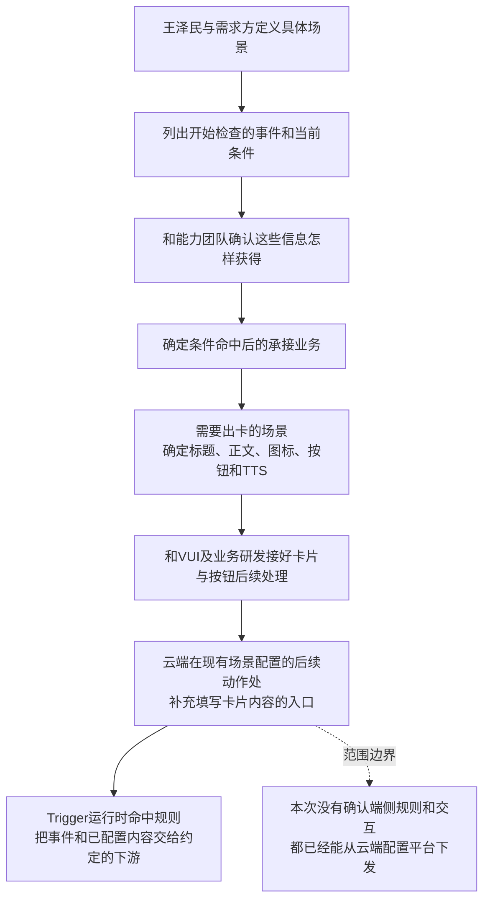
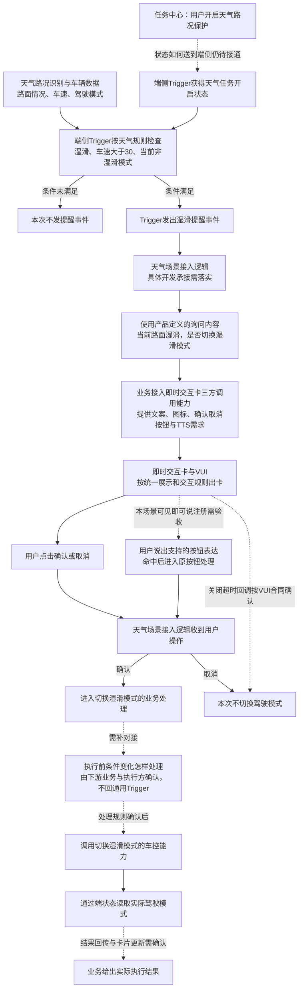
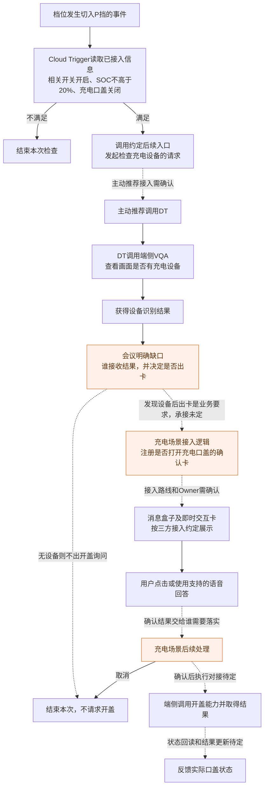

# 系统预设任务外审：逐步关系图与会议纠错

依据：9 月 14 日《sls系统预设任务-需求外审》逐字稿、徐洋会后回复、用户提供的关系图。本文按业务职责解释链路；图中的“待对接”“待确认”表示该环节没有在本次会议中落实，不代表已有可调用模块。文案、数值组合示例不是正式接口或新增产品结论。

## 1. 上一版需要先纠正的五件事

| 上一版表述 | 会议实际讨论 | 这版怎样改 |
|---|---|---|
| “启动事件和条件满足吗”只有一个抽象节点 | 09:23—09:46 具体说了儿童锁的档位变化与其他状态判断 | 分成“什么变化启动检查”和“读取哪些当前状态”；分别写清 |
| “是否还需要模型判断”像运行中再临时选择路线 | 22:11—32:00 讨论的是充电任务固定需要识别设备，以及识别结果怎样承接 | 天气图不加模型选择节点；充电图明确画 DT/VQA，并把结果到出卡之间的缺口标出 |
| Trigger 区分静默、仅告知、确认并负责后续 | 01:11:37—01:11:54 刘杨说仅告知和确认对 Trigger 的处理一样 | 产品提前约定业务行为，平台填写相应内容；Trigger 发事件/调用配置的后续动作 |
| 用户在自定义有效期内确认 | 01:15:34—01:15:49 卡片等待时间被说明为统一规则 | 写“按即时交互卡现有规则处理”，向 VUI 确认规则与回调；不新增任务级时间配置承诺 |
| 确认或模型返回后再次由 Trigger 校验 | 43:46—46:40 明确质疑让 Trigger 承担连续步骤，后续判断承接方没定 | 不画回通用 Trigger 的箭头；如有车况变化处理需求，交下游专项确认 |

会议并没有把“条件判断”“用户确认”全部取消。否定或质疑的是：把后续连续业务步骤塞进通用 Trigger，以及把没有承接方的判断画成已实现能力。

## 2. 先把“产品先定义”和“车辆运行时做”分开

产品先决定：什么场景值得提醒、用哪些条件、条件满足后给谁、问什么、确认后做什么。研发接好这些能力，运行时才按定义执行。

“需要模型吗”“是否先问用户”主要是产品定义时确定的业务安排。已有固定场景没有必要每次交给 Trigger 再猜一遍。



平台中“卡片内容”负责告诉下游显示什么；“业务接入”负责让下游知道用户点完以后做什么。仅增加标题和正文输入框，不能自动补齐按钮处理、车控和结果反馈。

### 配置平台本次有依据补的内容

| 页面位置 | 产品要补什么 | 会上依据与边界 |
|---|---|---|
| 场景的现有触发规则区 | 把事件与当前条件写明确 | 儿童锁要区分“切到D挡”和“当前是D挡” |
| 场景的后续动作区 | 为需要出卡的业务提供卡片内容填写入口 | 01:10:27、01:11:54 刘杨明确提出 |
| 卡片内容 | 标题、正文、图标、按钮；TTS按VUI要求补齐 | 01:13—01:15讨论 title/icon/content/button；TTS是否独立字段仍需确认 |
| 下游对接 | 选定/接好由谁接收场景事件与内容 | 具体入口与字段需VUI、Trigger、业务研发确认 |
| 等待时间 | 引用统一卡片规则 | 不把逐任务自定义超时列为本次已定能力 |
| 卡片模板管理页 | 暂不当成已定页面 | 会上讨论过独立tab、模板ID、直接填字段，尚未拍板 |

静默、仅告知和确认的产品行为可以在需求中说明；这不等于必须给 Trigger 增加三个不同的运行分支。

## 3. 启动事件和条件究竟是什么

事件是“刚刚发生了什么变化”，用于决定何时开始检查；条件是“开始检查时其他情况是什么”，用于判断这次要不要继续。

会议 09:23—09:46 的儿童锁案例可以直接说明：

```text
车辆档位从 P 切到 D
    │ 这是开始检查的事件：准备行车了
    ▼
Trigger 读取当前信息
    ├─ 儿童/宠物保护任务是否开启？
    ├─ 后排是否识别到儿童或宠物？
    └─ 儿童锁当前是否关闭？
    │
    ├─ 条件满足 → 发出“建议开启儿童锁”的业务事件
    └─ 没有儿童/宠物，或儿童锁已开启 → 本次不提醒
```

**为什么不只写“D挡”？** 车辆可能连续十分钟都在 D 挡。只写状态，研发不知道是切入 D 挡时检查一次，还是每次收到识别结果都检查。

例如切入 D 挡时还没有儿童识别结果，两秒后才识别到儿童：要不要补一次检查？本次会议没有定。产品需要把“识别结果晚到时是否补触发”交给需求方、感知和Trigger共同确认，不能擅自补成现有能力。

天气湿滑分支也一样：路面湿滑、车速大于30、当前不是湿滑模式是判断条件；到底由路况变成湿滑、车速跨过30，还是这些数据变化中的任一个启动检查，要与现有端侧脚本核对。本次外审没有展开确认天气的完整事件集合。

## 4. 天气湿滑分支：沿你给的关系图展开

“天气任务处理逻辑”指实现天气这个具体场景的程序，不代表公司已经有一个名叫天气任务服务的新系统。它可以和Trigger由同一团队开发，但仍需要有人实现接事件、注册卡、处理确认和调用动作。



实线表达业务顺序，不表示本次已联调；虚线突出当前缺少交接或规则的地方。

### 第一步：Trigger什么时候发事件

假设本次取得的信息是：任务开启、路面湿滑、车速46 km/h、驾驶模式普通。46只是讲解示例，30来自已有天气场景条件。规则通过后，Trigger向约定的场景处理入口通知“湿滑提醒条件满足”。

这里不需要再调DT询问“要不要进一步用模型判断”。天气/路况识别已经把数据提供给端侧。使用了识别结果，不等于一定要再走一次云端推理。

### 第二步：业务收到事件后怎样出卡

产品提前写好该分支的内容。例如：标题“天气路况保护”；正文“当前路面湿滑，是否切换湿滑模式？”；按钮“确认”“取消”；TTS说明需要播什么。这些是接入内容示例，需与最终UI字数和播报规范对齐。

场景研发把这些内容接到即时交互卡，并绑定按钮处理：确认进入切换湿滑模式的业务动作，取消结束本次。

注册不仅是填文字，还要把当前卡片和后续业务处理关联起来。准确注册接口、时机和字段由接入研发确认；不能把在配置平台填写内容等同于已经注册成功。

### 第三步：卡片显示后怎样得到用户选择

手动点击由当前按钮处理入口承接。端侧语音按可见即可说的方式对接，支持哪些表达、谁注册、何时注销，要随本场景接入确认。不能把用户说的任意“好的”都默认当成本卡确认。

“二次确认”在这个场景中是系统先询问、用户确认后再执行，不是点一次确认后再弹第二张确认卡。

### 第四步：确认后到底还要不要再检查

会上讨论的是充电链路是否回到Trigger做后续校验。44:12和45:23的结论是：Trigger完成前置判断后，后面由下游自己处理，不再回Trigger。46:13又提出可以向后续链路补场景判断需求，46:40强调路线还没明确。

因此不能把“回Trigger二次校验”画成既有能力，也不能由此推导“之后车况怎么变都可以直接执行”。天气的执行前限制、用户手动切模式后怎样处理，应确认现有车控/业务能力，再写到该责任方下面。本次会议未把这些限制逐项定下来。

### 第五步：车控和端状态为什么分开

车控负责“请求车辆切到湿滑模式”；端状态负责“告诉业务车辆现在是什么模式”。即使两种能力由同一团队或同一接口体系提供，业务用途也不同。

本次要补的是：谁发动作、谁接结果、哪个状态能证明完成，以及已有卡片怎样反馈。图里画了这几步，只代表产品希望完成的过程，接口和Owner仍需对齐。

## 5. 充电口盖：模型判断从哪里来，会上哪段没有成立

本任务需要识别设备，是产品根据“找到设备才询问开盖”的需求预先确定的。Trigger已经拿到P挡、电量、口盖状态，但这些信息证明不了车旁是否存在充电设备；所以还需要DT调用VQA观察画面。



图中相关开关包含哪些开关仍须核对：会上充电前置条件提到“主动服务开关”，总框架又讨论“本任务开关”。不能未经确认把两者当成同一个状态字段。

27:46—27:58先明确先检查、不先弹卡；31:44—32:00明确指出缺少“调完VQA再判断”的承接逻辑。这意味着有Trigger、主动推荐、模型、VUI四种能力，也不代表它们已经接成当前业务。

徐洋会后确认了可复用的出卡入口，但没有证明“VQA的结果已自动送到该入口”。这里还需要姜涵、主动推荐/DT相关研发与卡片接入研发共同确认：谁等结果，结果给谁，谁触发拉卡。

产品要交付的规则很具体：前置条件满足后先检查设备；明确发现设备才询问；本次定义为先确认的场景中，发现设备不能直接当成用户同意；用户确认后才进入开盖处理。对应实现位置由下游专项认领。

## 6. “用户在有效期内同意”应该改成什么

产品确实需要说明确认、取消、关闭后的动作，但本次没有确认一套由Trigger管理的卡片授权有效期。

应改写为：“卡片按即时交互卡的统一交互时长和关闭规则展示；业务接收当前卡片的有效操作结果。取消不执行。超时、关闭和旧卡片回调的处理，按VUI接入协议确认并补入场景验收。”

需要区分三件事：

| 时间问题 | 谁提供规则或负责实现 | 本次结论 |
|---|---|---|
| 卡片能停留多久、等待多久 | VUI统一规则 | 会上说统一；具体值与起算点未提供 |
| 设备识别结果能用多久 | 识别结果承接业务与模型/端侧协作 | 未确认；不能只看当前仍在P挡就认定是同次停车 |
| 同一场景隔多久再次提醒 | Trigger/场景规则的频控 | 和卡片停留时间不同；按场景补齐 |

例：车辆在A处P挡时检查设备，随后切D驶到B处又回P挡。当前仍在P挡，不能证明A处的观察属于B处停车。这个问题需要下游定义结果关联与失效方式，不能画一个“本次停车？”菱形就认为解决了。

## 7. 静默、仅告知和确认现在怎么写

“静默”只说明不询问或不展示某类交互，不说明动作由谁实现。是否无卡、无TTS、自动执行，必须针对具体任务写清，不能只写两个字。

本次01:11的明确结论是：仅告知卡和确认卡对Trigger都是把已配好的内容交出去，Trigger无需管理两套后续交互流程。对于业务方，按钮有没有确认、确认后是否执行仍然不同。

儿童锁在旧材料里曾写自动开启，本次09:23—11:06却明确讨论“锁关闭时提醒打开”。两版有冲突，须确认本期以哪一版为准。此前给任务中心写的“识别后自动开启儿童锁”也需跟着核对，不能继续当成最终文案。

后视镜加热讨论了动作和三种场景，但并未逐项确认本期全部交互策略；天气与充电在此处按询问案例讲解，不给它们附加可运行时任意选择的静默支路。

## 8. 你现在拿什么去和谁聊

| 对接人 | 带着哪一段问 | 可直接说的话 | 要拿回的结果 |
|---|---|---|---|
| 刘杨、端侧Trigger相关研发 | 事件和规则 | “儿童锁是切D挡时查一次；识别晚到要不要再查？天气目前由哪些数据变化启动检查？请按现有实现对一下。” | 事件、条件、触发时机与能力缺口 |
| 徐洋及其确认的卡片接入研发 | 业务事件到出卡 | “我提天气这个具体场景接入：这份文案、按钮和TTS分别怎么交？谁绑定确认后的业务处理？等待、关闭和超时沿用哪份规范？” | 对接人、入参、回调和统一交互规则 |
| 汪帅及场景开发承接方 | 天气端侧链路 | “Trigger发出湿滑事件后，卡片注册和按钮处理由谁实现？如果同一团队承接，请把这两部分都写进工作项。” | 场景注册、按钮处理和执行工作的研发认领 |
| 姜涵、主动推荐/DT相关研发 | VQA返回到出卡缺口 | “先查设备再决定出卡这一步会上说没接好，请确认结果回给哪个模块，谁在发现设备后调三方卡入口。” | 连续步骤的承接方案；不是再确认一遍能否调模型 |
| 郝晓伟、王梦尧、Trigger研发 | 开关状态 | “按车的任务操作由谁保存？Trigger从哪里读？任务中心显示哪个真实结果？” | 状态承载方和两侧交接 |
| 场景业务与车控/端状态研发 | 确认到实际完成 | “用户确认以后由谁请求动作，已有车控检查哪些限制，结果看哪个端状态？条件变化需要补哪里？” | 现有检查、新增需求、调用和结果回读Owner |

第一轮把这些交接落实，再用场景逐条验证。这里的“原业务”是责任描述，最终必须替换成具体承接模块和研发，不能把这个称呼当作已经完成分工。

## 9. 对上一版文档的更正说明

上一版《业务逻辑与缺口》中总图和职责段落曾把执行前复核、模型结果承接、卡片有效期、配置平台完整字段写成连贯的通用框架。它们含有产品目标和未确认设计，不应作为本次会议确认的架构。此次逐步关系图优先用于解释这几个争议点。

徐洋截图中明确的是出卡及二次交互接入方向；截图显示相关需求处于开发中。框架评审通过、具体场景接入完成和车上可验收是三件事。当前不能由这些截图得出四个任务都已经可运行。
