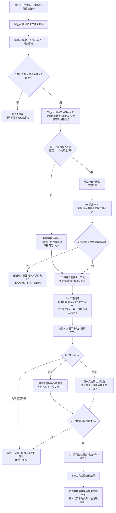
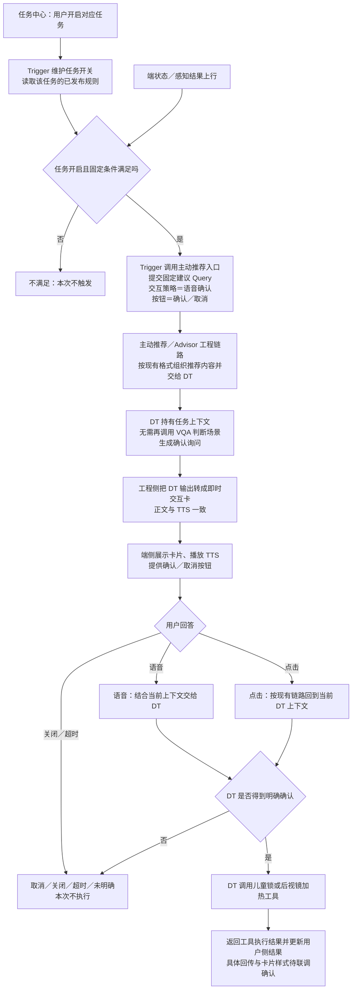
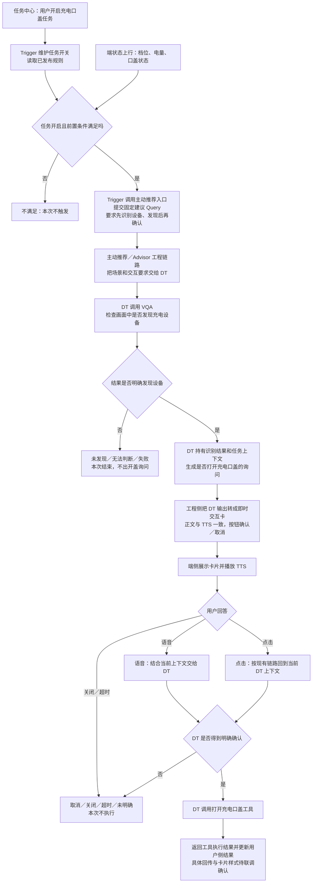

# 会议总结｜系统预设任务 Trigger 到即时交互卡链路对齐

> 会议时间：2026-09-15 17:01—17:39（38 分 08 秒）  
> 原始逐字稿：`/Users/bytedance/Desktop/3.23/产品/1-原始素材/会议纪要/系统预设任务触发器到即时交互卡链路对齐.md`  
> 本文用途：还原会议结论、对照旧 PRD、给出 PRD 修改内容和后续行动。讨论中的设想与正式结论分开标注。

## 0. 先记住这一个结论

三个云端系统预设任务统一复用同一条主链路：

> **Trigger 判断预设条件 → 调用主动推荐入口 → DT 承接当前场景 → 工程侧把 DT 的询问包装成即时交互卡 → 用户确认／取消 → DT 调用车辆工具。**

儿童锁、后视镜加热与充电口盖的差别，不是“后面走不走 DT”，而是：

- 儿童锁、后视镜加热：Trigger 已经用上行状态判断清楚场景，**DT 不需要再调用 VQA 补充场景判断**。
- 充电口盖：Trigger 只能判断 P 挡、电量、口盖等前置条件，**DT 还要调用 VQA 判断是否发现充电设备**，明确发现后才能询问用户。

两类任务从“向用户询问”开始走同一条 DT、即时交互卡和工具执行链路。

因此，旧 PRD 中“云端不走 DT 的任务”“三方系统通知卡＋动态插入选择工具”“用户选择回 Trigger”“Trigger 调车辆工具”等表达必须删除。

## 1. 会议为什么要开

会前没有对齐的核心不是儿童锁的三个条件，而是 **Trigger 命中以后，谁把建议送到车机、谁生成卡片、谁播 TTS、谁理解用户回答、谁调用车辆工具**。

最初讨论了两种路线：

1. Trigger 直接走“三方系统通知卡”，在端侧拉卡，再通过“可见即可说增强版／动态插入选择工具”处理语音。
2. Trigger 复用豆包现有主动推荐链路，由 DT 持有上下文，工程侧把 DT 输出转成即时交互卡，用户确认后由 DT 调工具。

会议最终选择第 2 条，原因是：

- 端侧不应该感知并对接另一套独立的 Trigger 服务；服务端应复用已有主链路（14:07—15:23）。
- 如果卡片和播报绕过 DT，用户继续追问时 DT 不知道刚才发生了什么，上下文会丢失（16:46—17:39）。
- 车辆动作需要由 DT 调用工具，用户确认也应留在同一上下文中闭环（17:31—17:55）。
- 现有主动推荐链路已经具备“DT 输出 → 工程侧转卡片 → 端侧二次确认”的方向，并在推进联调（20:32—20:46、26:08—26:26）。

## 2. 今天明确拍板的内容

| 编号 | 结论 | 状态 | 会议依据 |
|---|---|---|---|
| C01 | 三个云端场景统一走“Trigger → 主动推荐 → DT → 即时交互卡 → DT 调工具”的主链路 | 已确认 | 25:52—26:06、27:03—27:09 |
| C02 | Trigger 不直接给端侧下发卡片，优先复用当前 AIDV／主动推荐服务链路 | 已确认产品方向；内部服务路径待技术设计 | 14:07—15:23 |
| C03 | Trigger 不调用车辆工具，也不在卡片完成后重新接收用户选择；它完成条件判断并发起主动推荐 | 已确认 | 17:31—17:55、19:38—20:32 |
| C04 | 儿童锁和后视镜加热只是不需要 DT 做出卡前的额外识别；交互和执行阶段仍走 DT | 已确认 | 23:11—24:38、25:49—26:06 |
| C05 | 充电口盖由 DT 调视觉能力检查充电设备；发现设备后才进入确认卡 | 已确认主流程；结果字段和失败分支待补 | 18:32—20:32 |
| C06 | 本期不接“三方系统通知卡＋动态插入选择工具”的方案，PRD 标注走右侧主动推荐链路 | 已确认 | 26:17—27:09 |
| C07 | 不需要额外做“泛化可见即可说”；用户明确说“确认／取消”由持有上下文的 DT 理解 | 已确认本期范围 | 27:34—28:46 |
| C08 | 即时交互卡使用“语音确认”策略；“界面确认”属于 AI Bar，不是当前链路 | 已确认 | 33:57—34:20、34:56—35:22 |
| C09 | 卡片正文来自 DT 面向用户的输出；工程侧把它做成卡片；当前卡片正文与 TTS 一致 | 已确认当前方案 | 21:25—22:22 |
| C10 | 本期按钮只需要“确认／取消”，无额外按钮定制诉求 | 已确认 | 22:30—22:41 |
| C11 | 每个场景都要补一条给主动推荐的固定建议 Query | 已确认产品待办 | 28:55—29:21、35:45—35:53 |
| C12 | 配置平台改造另开专项会，由王泽民、刘杨、文涛、绿坡及前端在同一文档中对齐 | 已确认后续动作；具体页面和字段未拍板 | 36:20—36:41 |
| C13 | 排期不再承诺 9 月 15 日或 9 月底，暂定节后；以主链路联调包和 Trigger 接入评估为准 | 暂定 | 36:41—37:49 |

## 3. 最终业务链路怎么理解

### 3.1 一张总图

图里的“是否需要补充识别”不是运行时让 Trigger 临时选方案，而是产品在每个任务设计阶段已经确定：儿童锁、后视镜不需要 VQA；充电口盖需要 VQA。



### 3.2 “不需要 DT”为什么是错的

“儿童锁、后视镜不需要 DT”会让研发理解成：Trigger 命中后直接出卡、卡片自己处理确认、Trigger 或端侧业务直接车控。这正是本次会议否定的画法。

PRD 应统一改成：

> **儿童锁和后视镜加热属于“规则直接命中型”：Trigger 已经完成前置条件判断，不需要 DT 调 VQA 等工具再判断场景；但是任务仍通过主动推荐进入 DT，由 DT 承接询问上下文、理解确认／取消，并在确认后调用车辆工具。**

充电口盖应写成：

> **充电口盖属于“模型补充判断型”：Trigger 先判断 P 挡、电量和口盖等前置条件；命中后调用主动推荐，由 DT 调用 VQA 检查是否发现充电设备。只有明确发现设备，DT 才向用户发起开盖确认；用户确认后，DT 调用开盖工具。**

### 3.3 “DT 出卡”到底是什么意思

会议里经常简写成“DT 出卡”，但张弛在 21:25—21:35 解释得很清楚：

- DT 正常生成面向用户的询问文本，并持有当前任务上下文。
- DT 不负责设计卡片 UI。
- 工程链路把 DT 的文本转成即时交互卡，把按钮一起下发端侧。
- 当前方案中，卡片正文与 TTS 播报内容一致。

所以，PRD 图上应写“DT 生成用户询问 → 卡片工程链路转成即时交互卡”，不要只写一个含糊的“DT 拉卡”。

## 4. 每个模块到底负责什么

| 模块 | 本需求负责什么 | 明确不负责什么 | 交给下一方什么 |
|---|---|---|---|
| 任务中心 | 展示系统预设任务；接收用户开启／关闭 | 不判断场景、不出卡、不调用工具 | 用户对某项任务的开启／关闭操作 |
| Trigger | 维护任务开关；读取上行状态；按配置判断条件；命中后调用主动推荐 | 不直接下发端侧卡片；不理解用户回答；不调用车辆工具 | 本次场景、建议 Query、交互策略、按钮要求及调用所需上下文 |
| 主动推荐入口／静态 Advisor 工程链路 | 接收 Trigger 发起的推荐；按现有格式组织目标、建议和交互策略；把内容交给 DT | 不代替 Trigger 重新判断固定车辆条件 | 给 DT 的完整推荐内容和交互要求 |
| DT | 持有本次任务上下文；必要时调用 VQA；生成询问；理解用户语音或点击；确认后调车辆工具 | 不负责卡片 UI 样式；不替 Trigger 维护任务开关 | 面向用户的文本、工具调用和执行结果 |
| VQA | 在充电任务中检查画面是否发现充电设备 | 不拉卡、不理解用户授权、不执行开盖 | 发现／未发现／无法判断／调用失败等结果，正式枚举待确认 |
| 卡片工程链路 | 把 DT 的用户输出转为即时交互卡；携带确认／取消按钮；向端侧下发 | 不判断儿童、天气、充电设备；不决定是否车控 | 卡片正文、按钮、TTS 音频／播放信息及当前上下文关联 |
| 端侧 VUI | 展示卡片、播放 TTS、采集点击或语音 | 不判断任务条件、不直接决定执行 | 用户在当前卡片上的回答 |
| 车辆工具／车控 | 执行开启儿童锁、加热或打开口盖 | 不决定何时主动推荐，不生成卡片 | 工具受理、成功或失败结果；正式回传和展示方式待确认 |

## 5. 相比之前的 PRD，哪些内容必须改

对照当前文件 `PRD-系统预设任务配置平台与端云交互框架-评审完善-v02.md`，至少需要修改以下位置。

| 旧稿位置／旧表达 | 问题 | 正确改法 |
|---|---|---|
| 1.4“云端规则任务允许跳过 DT 和 Planner” | 会把交互和执行也绕过 DT | 改成“无需 DT 做出卡前补充识别；交互与执行仍走 DT” |
| 2.2“任务业务注册卡片、消费回答、请求执行” | 今天选定的主链路由主动推荐／DT 和卡片工程承接，不再另造一层通用业务注册方 | 删除云端主流程中的抽象“任务业务注册卡片”；改为具体模块接力 |
| 3.1“任务业务选择静默、仅告知或询问” | 本期三个云端场景已明确走二次确认，不能在运行时临时选 | 当前场景统一写“语音确认”；其他策略只放能力说明或未来范围 |
| 3.2 云端图“业务调用 DT/VQA → 业务注册卡 → 点击直回业务” | 整条 C 区域与今天结论不一致 | 替换为“Trigger 调主动推荐 → DT／VQA → DT 输出询问 → 工程转卡 → 用户选择回 DT → DT 调工具” |
| 3.2、3.3 的“可见即可说／动态选择工具” | 本期已明确不接该能力 | 从三个云端任务正式链路删除；可在方案取舍中说明未采用 |
| 4.7“独立配置标题、正文、TTS、点击回业务” | 当前链路只确认正文＋按钮，正文与 TTS 一致，点击回 DT 上下文 | 改成建议 Query、语音确认策略、即时卡标记、确认／取消按钮；技术字段待专项 |
| 5.1／5.2“业务注册并保持询问状态” | 把主链路责任放到了未确认的抽象业务模块 | 由主动推荐／DT 持有上下文，卡片工程负责转卡和下发 |
| 6.2 儿童锁仍写“静默或询问待选” | 25:52—26:06 已确认该场景走 DT 出卡、用户确认 | 改成 Trigger 硬条件命中后调用主动推荐，语音确认后由 DT 开锁 |
| 6.3 充电写“业务接 VQA 结果、业务注册卡、Planner 理解语音” | 当前会议确认 DT 调 VQA，并沿同一 DT 主链路完成确认和工具调用 | 改为 DT 内承接“识别 → 询问 → 用户回答 → 工具”；工程负责转卡 |
| 6.4 后视镜写“静默开启、不出卡” | 25:52—26:06 将 6.2、6.3、6.4 统一为出卡确认链路 | 改为规则命中后出确认卡；如果未来要静默执行，另做策略评审 |
| 8.1 仍把上述链路列为大量待拍板项 | 已经拍板的内容继续标待确认，会让评审重复争论 | 把已确认路线移入正式方案，只保留接口、字段、结果和场景参数缺口 |

还有一项来自上一轮评审的边界不能被新图改回去：**用户回答或 VQA 结果不返回 Trigger 再做第二轮业务判断。** Trigger 在前置条件判断并发起后续调用后完成职责。执行工具自身需要遵守的车辆限制，可以由工具／车辆能力定义，但不要再画成“回 Trigger 二次校验”。

## 6. PRD 应该新增或重写哪些章节

### 6.1 背景——可直接写进 PRD

> 系统预设任务是产品预先定义、用户可在任务中心长期开启或关闭的主动服务。任务开启后，Trigger 持续读取任务状态和车辆／感知状态；当预设条件满足时，系统主动向用户发起建议，并在用户明确确认后执行车辆动作。
>
> 本次需求聚焦三个云端系统预设任务：后排儿童或宠物场景开启儿童锁、后视镜自动加热、识别充电设备后打开充电口盖。三个任务统一复用主动推荐、DT 和即时交互卡主链路，避免 Trigger 单独建设卡片下发、语音上下文和工具执行链路。
>
> 本次 PRD 需要明确：Trigger 何时调用主动推荐、每个场景需要传入什么建议 Query、哪些场景需要 DT 进一步调用 VQA、即时交互卡如何展示和返回用户选择，以及 DT 在什么条件下调用车辆工具。

### 6.2 目标——可直接写进 PRD

1. 三个云端任务使用同一条主动推荐、DT、即时交互卡和工具执行链路。
2. 明确 Trigger、主动推荐、DT、VQA、卡片工程、端侧 VUI 和车辆工具的责任边界。
3. 每个场景具备可审核的触发条件、固定建议 Query、交互策略、按钮和执行目标。
4. 用户取消、关闭、超时，或充电设备未发现／无法判断时，不执行车辆动作。
5. 配置平台能够表达本次任务所需信息；具体页面和技术字段由平台专项评审确定。

### 6.3 本期不做——可直接写进 PRD

- 不为 Trigger 新建一条直达端侧的卡片下发链路。
- 不接入三方系统通知卡的动态插入选择工具。
- 不要求卡片正文与 TTS 使用不同内容。
- 不要求额外定制卡片按钮，当前仅使用“确认／取消”。
- 不把“界面确认”当成即时交互卡策略；当前采用“语音确认”。
- 配置平台专项未完成前，不把建议页面和字段写成已经实现。

### 6.4 两类云端任务——可直接写进 PRD

| 类型 | 代表任务 | Trigger 完成的判断 | DT 出卡前是否调 VQA | 后半段 |
|---|---|---|---|---|
| 规则直接命中型 | 儿童锁、后视镜加热 | 使用已上云状态判断全部固定条件 | 否 | 主动推荐 → DT 询问 → 即时卡／TTS → 确认 → DT 调工具 |
| 模型补充判断型 | 充电口盖 | 判断 P 挡、电量、口盖等前置条件 | 是；明确发现设备才继续 | DT 询问 → 即时卡／TTS → 确认 → DT 调开盖工具 |

### 6.5 每个任务必须有一张规格表

| 必填项 | 产品要写什么 |
|---|---|
| 任务名称 | 任务中心和配置平台中的统一名称 |
| 任务开关 | 任务关闭时不产生新主动推荐 |
| 启动事件 | 什么状态变化启动本轮检查，例如切入 D 或切入 P |
| Trigger 条件 | 当前必须满足的车辆和感知状态、条件关系 |
| 是否需要补充识别 | 儿童锁／后视镜为否；充电口盖为是 |
| 固定建议 Query | 告诉 DT 当前发生了什么、要问用户什么、确认后做什么 |
| 交互策略 | 本期需要出卡的三个场景均为“语音确认” |
| 即时交互卡 | 开启；正文来自 DT 输出，TTS 与正文一致 |
| 按钮 | 确认／取消 |
| 用户确认 | DT 调用对应车辆工具 |
| 用户未确认 | 取消、关闭、超时、无法判断均不执行 |
| 工具结果 | 成功、失败如何反馈；具体结果卡和回传字段待联调确认 |
| 防重复 | 同一场景是否会反复发起建议，规则需逐任务补齐 |

## 7. 两类云端场景的详细流程图

### 7.1 儿童锁、后视镜：Trigger 已完成场景判断



### 7.2 充电口盖：DT 需要先调 VQA



## 8. 三个场景的建议 Query 怎么写

下面是产品草案，不是假装已经确认的正式协议。王泽民先把业务意思写完整，再由赵益红／静态 Advisor 侧按现有拼接格式校验。

### 8.1 建议 Query 的共同结构

每条至少回答五个问题：

1. 哪个系统预设任务触发了。
2. Trigger 已经确认了什么事实。
3. DT 是否还要调用 VQA。
4. DT 应该向用户确认什么动作。
5. 用户未明确确认时不得做什么。

共同交互策略：`语音确认`。共同按钮：`确认`、`取消`。

### 8.2 儿童锁——产品草案

> 系统预设任务“后排儿童锁”已触发。Trigger 已确认车辆切入 D 挡，后排检测到儿童或宠物，且儿童锁当前未开启。请询问用户是否开启后排儿童锁。只有用户明确确认后，才调用开启儿童锁工具；用户取消、关闭、超时或未明确确认时不执行。交互策略：语音确认。

PRD 还必须补齐：儿童／宠物识别的正式范围、左／右／双侧锁目标、工具名称及参数。今天会议没有确认这些细节。

### 8.3 后视镜加热——产品草案

> 系统预设任务“后视镜自动加热”已触发。Trigger 已确认当前满足本任务约定的后视镜加热条件。请询问用户是否开启后视镜加热。只有用户明确确认后，才调用后视镜加热工具；用户取消、关闭、超时或未明确确认时不执行。交互策略：语音确认。

正式 PRD 不能只写“满足条件”，需要把雨天、洗车退出、高湿温差等子场景的启动事件、条件和去重分别写全。今天会议没有重新评审这些数值，沿用旧值前仍需场景负责人确认。

### 8.4 充电口盖——产品草案

> 系统预设任务“识别充电设备后打开充电口盖”已触发。Trigger 已确认车辆处于 P 挡、充电口盖关闭，并满足任务约定的电量条件。请先调用 VQA 判断画面中是否发现充电设备。只有明确发现设备时，才询问用户是否打开充电口盖；未发现、无法判断或调用失败时不询问也不执行。用户明确确认后调用打开充电口盖工具；用户取消、关闭、超时或未明确确认时不执行。交互策略：语音确认。

注意：18:32 的口述“电量不是小于 20%”与此前材料的低电量条件存在冲突。正式 PRD 必须确认到底是 `<20%`、`≤20%`、`≥20%` 还是其他阈值，不能按本次口误直接改配置。

## 9. 即时交互卡在 PRD 中怎么写

### 9.1 已确认的产品要求

| 项目 | 当前方案 |
|---|---|
| 产生方式 | DT 输出面向用户的询问，工程链路把输出转换成即时交互卡 |
| 卡片正文 | 使用 DT 输出给用户的询问文本 |
| TTS | 与卡片正文一致 |
| 按钮 | 确认、取消 |
| 交互策略 | 语音确认 |
| 语音 | DT 结合当前主动推荐上下文理解确认／取消 |
| 点击 | 按现有主动推荐卡片链路回到当前 DT 上下文 |
| 动态插入选择工具 | 本期不接入 |
| 独立标题／副标题 | 本次没有强诉求，不作为本期必需配置 |
| 独立 TTS 文案 | 本次没有强诉求；当前与正文一致 |

### 9.2 仍要补的异常和结果

今天只把主链路讲通，以下行为仍需写进 PRD，并让张弛、姜锋及工具研发确认实际支持方式：

- 主动推荐调用失败：不出卡、不执行，记录失败原因。
- 卡片下发失败：不能进入“等待用户确认”，更不能执行。
- 用户关闭或超时：本次不执行。
- 用户回答无法判断：不能默认确认；是继续问还是结束，需 DT 产品确认。
- 工具调用失败：不能展示成功，需给出失败或暂未完成的结果。
- 工具成功后的卡片更新：内容、时机和回传字段待联调确认。
- 同一场景重复触发：不应重复出多张卡或重复调用工具，具体去重规则按任务补齐。

## 10. 配置平台需要写什么，哪些还不能写死

### 10.1 PRD 先提出的产品信息

| 配置组 | 需要表达的产品信息 | 示例 |
|---|---|---|
| 任务关联 | 关联哪项系统预设任务、适用车型／版本 | 后排儿童锁 |
| Trigger 规则 | 启动事件、状态条件、条件关系、数据来源、防重复 | 切入 D；后排有儿童／宠物；儿童锁未开启 |
| 主动推荐 | 固定建议 Query、交互策略 | Query 草案；语音确认 |
| 补充判断 | 是否要求 DT 调 VQA、判断目标、允许继续的结果 | 充电任务需要；明确发现设备才继续 |
| 即时交互卡 | 是否启用、按钮 | 启用；确认／取消 |
| 执行动作 | 用户确认后由 DT 调用的工具 | 开启儿童锁／加热／开口盖 |
| 结束处理 | 取消、关闭、超时、识别失败、工具失败 | 本次不执行或展示失败结果 |

### 10.2 当前不能当成已定后台字段的内容

会议只明确了产品需要，没有完成字段协议和页面设计。因此以下内容应在 PRD 标注“平台专项确认”，不能写成已经实现：

- “是否展示即时交互卡”的正式字段名和位置。
- 建议 Query 是整段填写，还是由结构化字段拼接。
- “交互策略：语音确认”如何传给主动推荐／DT。
- 按钮文案、按钮含义和点击回传的正式协议。
- “是否需要 VQA”、检查目标和结果分支如何配置。
- 工具选择、参数及执行结果如何关联。
- 保存校验、预览、发布、回滚和历史版本范围。

平台专项参会人：王泽民、刘杨、文涛、绿坡、前端；张弛／主动推荐侧应提供下游真正需要的输入说明。

## 11. PRD 必须补的验收用例

| 编号 | 操作／条件 | 预期结果 |
|---|---|---|
| T01 | 任务关闭，车辆条件满足 | Trigger 不调用主动推荐 |
| T02 | 任务开启，但任一固定条件不满足 | 不触发、不出卡、不调工具 |
| T03 | 条件满足，Trigger 调主动推荐失败 | 不出卡、不执行，保留失败记录 |
| T04 | 儿童锁或后视镜条件满足 | 不调用 VQA；直接进入 DT 确认链路 |
| T05 | 充电前置条件满足，VQA 明确未发现设备 | 不出开盖询问，不调开盖工具 |
| T06 | VQA 无法判断、失败或超时 | 不出开盖询问，不默认当成发现 |
| T07 | VQA 明确发现设备 | DT 生成开盖询问，工程侧下发即时卡和同文 TTS |
| T08 | 卡片下发失败 | 不等待回答、不执行工具 |
| T09 | 用户语音明确说“确认” | DT 结合当前上下文，调用当前任务对应工具 |
| T10 | 用户点击“确认” | 点击回到当前 DT 上下文，调用一次对应工具 |
| T11 | 用户说／点击取消，或关闭、超时 | 本次不执行工具 |
| T12 | 用户说了不能明确判断的内容 | 不默认确认；按会签策略澄清或结束 |
| T13 | 工具调用失败 | 不展示成功；给出失败／暂未完成反馈 |
| T14 | 同一触发条件连续上报 | 不重复出卡、不重复调用工具；按各任务去重规则验收 |
| T15 | 用户回答后又收到同一卡片点击 | 只消费一次，不重复执行；实现方式待链路确认 |

## 12. 还有哪些问题没有解决

### 12.1 P0：不确认就不能把 PRD 定稿

| 问题 | 为什么影响需求 | 找谁确认 |
|---|---|---|
| 三个场景各自完整的建议 Query | Trigger 调主动推荐的核心输入；写不清会导致 DT 不确认或问错动作 | 王泽民起草，赵益红／静态 Advisor、张弛校验 |
| Trigger 调主动推荐需要传哪些产品信息 | 决定配置平台和接口能不能表达完整需求 | 刘杨、张弛 |
| 即时卡标记、按钮、交互策略如何透传 | 没有字段就无法保证正确出卡和确认 | 张弛、赵益红、刘杨 |
| 充电 SOC 条件 | 当前口述与旧材料冲突，会直接改变触发范围 | 原需求方／场景产品、刘杨 |
| VQA 结果枚举及未发现／未知／失败处理 | 决定充电任务是否出卡 | DT／VQA 负责人 |
| 三个车辆工具的正式名称、参数和成功／失败返回 | 决定 DT 怎么执行、用户看到什么 | 各工具／车控研发、张弛 |

### 12.2 P1：联调前必须确认

| 问题 | 找谁确认 |
|---|---|
| 卡片正文、按钮和 TTS 的下发协议 | 张弛、姜锋 |
| 点击确认如何回到当前 DT 上下文 | 张弛、姜锋 |
| 用户模糊回答是澄清还是结束 | DT 产品／张弛 |
| 卡片下发、展示、关闭、超时的结果怎样回传 | 张弛、姜锋 |
| 工具执行结果怎样更新即时交互卡 | 张弛、姜锋、工具研发 |
| 主动推荐卡片联调包的准确时间 | 张弛、姜锋 |

### 12.3 配置平台专项再确认

- 页面在哪一组增加主动推荐和即时卡配置。
- 原子能力到底开放哪些可选项。
- Query、交互策略和按钮采用结构化配置还是文本拼接。
- 配置缺字段、能力未接入时怎样阻止发布。
- Trigger 运行时如何消费新配置，版本如何生效和回退。

## 13. 王泽民接下来具体做什么

### 第一步：先修 PRD 主链路

1. 删除三个云端场景中的“三方系统通知卡”“动态插入选择工具”“Trigger 收到用户选择”“Trigger 调工具”。
2. 把“无需 DT 的云端任务”统一改名为“无需 DT 补充场景识别的规则直接命中型任务”。
3. 把儿童锁、后视镜、充电口盖的后半段统一为“主动推荐 → DT → 即时卡 → 用户确认 → DT 调工具”。
4. 把充电口盖单独增加“DT 调 VQA，明确发现设备才询问”的前半段。
5. 删除后视镜“本期静默执行”的正式口径，改为本次已确认的二次确认链路；如果需求方仍坚持静默，再作为独立策略变更评审。

### 第二步：补三条建议 Query

先使用第 8 章草案补进 PRD，再找赵益红确认：

> “我已经按‘当前事实—是否进一步识别—向用户确认的动作—未确认不执行—交互策略’补了三个场景的建议 Query。麻烦帮我确认现有 Advisor 是直接接这段文本，还是需要拆成目标、建议和交互策略字段；最终拼给 DT 的格式请以你们现有链路为准。”

### 第三步：找张弛、姜锋确认主链路输入输出

可以直接这样问：

> “按照今天结论，三个云端任务统一走主动推荐和 DT 卡片链路。请帮我确认 Trigger 调主动推荐时至少要传哪些内容；即时卡开关、确认／取消按钮和语音确认策略分别由谁接收；点击如何回到当前 DT 上下文；工具结果如何更新卡片。产品侧不要求独立标题和独立 TTS，正文与 TTS 一致即可。”

需要他们返回的不是一句“链路支持”，而是：

- Trigger 的必要输入清单。
- 卡片工程实际消费的字段。
- 语音与点击各自回到 DT 的方式。
- 下发失败、关闭、超时和工具失败的返回。
- 联调包时间与双方联调负责人。

### 第四步：找场景和工具负责人补业务规格

- 儿童锁：确认儿童／宠物范围、目标侧、工具及返回。
- 后视镜：确认三个子场景的启动事件、条件、去重及工具返回。
- 充电口盖：确认 SOC 条件、VQA 设备定义和结果枚举、开盖工具及返回。

### 第五步：组织配置平台专项

参会人至少包括王泽民、刘杨、文涛、绿坡、前端；邀请张弛提供下游输入要求。专项会只拍五件事：

1. 配置项放在哪里。
2. 每个配置项是谁填写、谁消费。
3. Query、交互策略、即时卡、按钮、VQA 和工具如何表达。
4. 哪些缺失必须阻止发布。
5. 本期做什么、后续做什么、如何联调验收。

### 第六步：按真实依赖排期

当前依赖顺序是：

```text
主动推荐／即时卡主链路联调包
→ 明确 Trigger 调用输入
→ Trigger 接入
→ 三场景联调
→ 工具与结果卡验收
```

会议口径为“暂定节后”，不是 9 月底承诺。PRD 的排期应写：

> 具体上线时间以主动推荐即时卡联调包完成、Trigger 接入评估、三场景 Query 及车辆工具规格确认后重新排期；当前暂按节后推进。

## 14. 会议行动项

| 事项 | Owner／参与人 | 交付物 | 截止口径 |
|---|---|---|---|
| 修改 PRD 云端总链路和三个场景图 | 王泽民 | 新版 PRD、两类云端流程图 | 下一次评审前 |
| 补三个场景建议 Query | 王泽民 | 三条 Query 草案 | 下一次评审前 |
| 校验建议 Query 与“语音确认”格式 | 王泽民、赵益红、张弛 | 可被主动推荐／DT 消费的内容格式 | 接口冻结前 |
| 确认卡片和 TTS 下发、点击回传、联调时间 | 张弛、姜锋 | 输入输出说明、联调计划 | 联调前 |
| 确认 Trigger 调主动推荐接口 | 刘杨、张弛 | 接口与失败处理 | Trigger 开发前 |
| 组织配置平台专项 | 王泽民、刘杨、文涛、绿坡、前端 | 页面和字段范围、开发拆分 | 平台开发前 |
| 明确三个执行工具和结果返回 | 场景／车控研发、张弛 | 工具清单、参数、结果口径 | 场景联调前 |
| 重新确认项目排期 | 王泽民、相关研发 | 可执行排期 | 联调依赖确认后；当前暂定节后 |

## 15. 评审时可以直接说的 90 秒版本

> “这次会后，三个云端系统预设任务的主链路已经统一了。Trigger 负责维护任务开关、读取上行状态并判断固定条件；条件满足后，Trigger 不直接拉卡，也不调用车辆工具，而是调用主动推荐入口，把当前场景的固定建议 Query、语音确认策略和确认／取消按钮要求传下去。
>
> 儿童锁和后视镜加热的固定条件已经由 Trigger 判断清楚，所以 DT 不需要再调 VQA 判断场景，但后面的用户确认和工具执行仍然走 DT。充电口盖多一步：Trigger 只判断 P 挡、电量和口盖，DT 还要调 VQA 看是否发现充电设备，明确发现后才询问用户。
>
> DT 持有当前任务上下文并生成询问文本，工程侧把文本包装成即时交互卡，卡片正文和 TTS 当前保持一致，按钮固定确认和取消。用户语音或点击都回到当前 DT 上下文，明确确认后由 DT 调车辆工具；取消、关闭、超时或识别失败都不执行。
>
> 本次不再走三方系统通知卡和动态插入选择工具。我接下来会补三个场景的建议 Query，并和 Advisor、主动推荐、卡片及 Trigger 研发确认输入输出；配置平台的具体页面、字段和发布校验再单独组织专项评审。”

