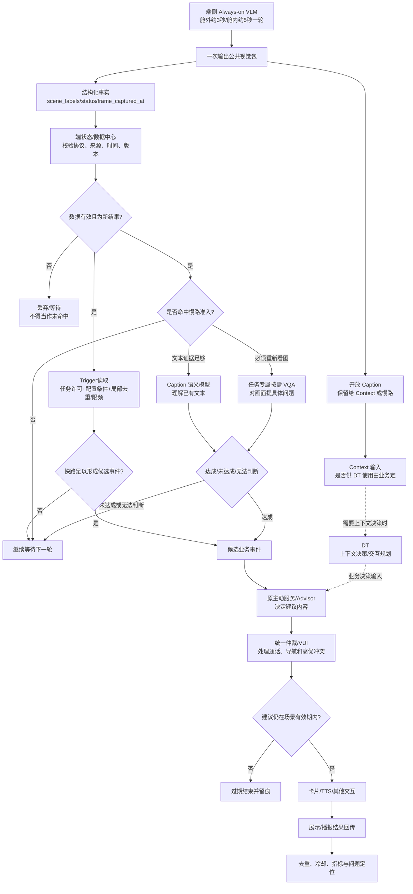

# PRD｜主动服务视觉结果消费与触发方案

> 版本：老板内审版 v02  
> 会议来源：2026 年 9 月 10 日《聊主动服务视觉相关问题》  
> 评审性质：方案决策评审，不是进度同步  
> 材料牵头：待内审确认（王泽民是会议问题提出方和现有材料联系人，不等同于已认领最终 DRI）  
> 当前状态：参会人认为两条技术思路概念上可行；接口、效果、压测和量产主方案均未验证/拍板

---

## 0. 老板先看这一页

### 0.1 本次评审到底要决定什么

本次不评“视觉模型能不能看见美景”，也不重复评整个系统预设任务平台。本次只解决一个阻塞项：

> 默认 Always-on 视觉结果持续上云后，系统预置、长期运行的主动服务应怎样消费这些结果，才能既保留有效的视觉能力，又满足量产成本、并发和时延要求。

会议参会人认为以下两条思路概念上都能走，但尚未经过接口、效果和压测验证：

1. 保留开放 Caption，云端持续调用模型理解。
2. 端云约定有限标签，云端按结构化字段或规则读取。

会议没有选路线，也没有确定云端解析 owner、首期标签范围、量产资源预算和端到端时延目标。因此本次内审必须留下书面决策，不能只得到“链路可以做”的结论。

### 0.2 建议本次直接拍板的六项结论

| 编号 | 建议拍板项 | 产品建议 | 不拍板的后果 |
|---|---|---|---|
| D1 | 首期主路线 | 采用方案 C：“P0 结构化标签规则触发 + 原始 Caption 保留 + 准入式语义慢路”；方案 A 只作风险基线，方案 B 只作对照/预研 | 研发继续按各自理解实现，可能一边做规则、一边做持续模型解析 |
| D2 | 任务执行方式 | 一次视觉感知形成一份公共状态，多任务订阅；禁止每个静态任务各自解析同一包数据 | 任务数增加时云端调用量和成本线性放大 |
| D3 | 数据协议 | P0 标签必须成为 JSON 独立字段，并带来源、时间、有效期、状态和协议版本 | “没识别到、没有数据、结果过期”会被混成同一状态，导致误触发 |
| D4 | 模型调用时机 | 静态 P0 主路径不持续调用云端大模型；只在 7.1.1 已会签的慢路准入成立时调用 | 无法形成可控的量产成本和时延 |
| D5 | 产品时效底线 | 每个场景单独定义端到端 P95 和 `expires_at`；高速路过的瞬时目标可用“P95 8 秒、10 秒作废”作为影子测试起始假设，不作为所有美景统一结论 | 只测 3 秒视觉周期，却无法保证用户收到的是仍有价值的提醒 |
| D6 | 上线方式 | 有限场景、影子运行、灰度放量；没有容量和误触数据不直接全量 | 错误提醒和资源问题会在全量阶段同时暴露 |

### 0.3 推荐方案一句话

视觉侧每轮只生产一次公共环境事实；端状态/数据中心保存最新有效结果；Trigger 按任务开关、数据时效、场景标签和局部频控产生候选事件；原业务/Advisor 或统一主动服务仲裁层决定是否打扰及如何交互；只有慢路准入条件成立时，才用 Caption 语义模型完成开放判断。VQA 重新观察画面、DT 做上下文决策，均不是 Caption 解析的同义词，必须按具体场景另行选路。

---

## 1. Summary

静态主动服务可能长期运行，并同时订阅十多个视觉场景。若每个任务每收到一轮 Caption 都调用云端模型解析，资源调用、并发和时延会随车辆数及任务数快速增加。另一方面，如果端侧只输出少量固定标签，又会损失开放视觉模型对“古典建筑”等长尾内容的识别能力。

本 PRD 建议采用分层方案：首期量产场景以结构化标签和确定性规则为主，保留原始 Caption 供 Context/DT 或后续长尾场景使用；昂贵模型只在已会签的准入条件成立时调用。评审需要同时拍板范围、协议、模块边界、性能目标、灰度方式和责任人。

---

## 2. Contacts 与责任状态

以下只描述现有材料能支持的关系，不把“被提到的人”直接写成正式开发 owner。

| 人员/角色 | 当前材料体现的职责 | 本次需要带来的输入 | 会上需要确认的责任 | 状态 |
|---|---|---|---|---|
| 王泽民 | 提出静态任务的云端成本、并发和时延问题；现有 PRD 标记为产品牵头 | 静态场景范围、量产估算、三方案对比、验收口径 | 是否负责形成最终产品方案并推进各段闭环 | 高可信；具体研发边界待确认 |
| 丁彬/视觉侧 | 解释 Always-on 输出、整包 JSON、开放视觉能力及舱外 3 秒/舱内 5 秒周期 | 当前真实 JSON、可提供字段、有限标签效果、端侧资源变化 | P0 标签如何输出；能否同时保留 Caption 和结构化标签 | 高可信；正式交付 owner 待确认 |
| 赵益红/场景侧 | 已基于个人认知整理一版美景场景；会议涉及其后续处理 | 业务场景、用户价值、首期标签、文案和时效要求 | 是否为场景口径 owner；陈杰侧需求如何并入 | 有材料支撑；正式边界待确认 |
| 李鑫/端状态或 AI Service 相关方 | 被提及与透传及天气/路况解析有关 | 现有端状态协议、天气/路况解析实现、数据保存与分发能力 | 到底只透传还是也做标准化；能否复用公共解析能力 | 会上说法不一致，P0 待确认 |
| 张航、嘉锋 | 王泽民建议拉入成本与资源讨论 | 资源预算、架构约束、量产承载目标 | 谁对成本/资源/体验取舍拥有最终决策权 | 会议点名，正式决策角色待确认 |
| 刘杨 | 会前参与静态/动态方案讨论；历史动态 Trigger 方案相关方 | 现有推理 Trigger 可复用范围、模型调用与场景接口 | 动态语义链路能否作为长尾兜底而不进入静态轮询主路径 | 参与关系明确；本次任务待确认 |
| 陈杰及其团队 | 可能提供后续视觉场景需求 | 尚未提交的场景、优先级和时效要求 | 是否影响首期范围及截止时间 | 明确待输入 |
| 原主动服务/Advisor 业务 | 会议中提到视觉结果后还会经过下游处理 | 事件输入、建议生成、卡片/TTS、结果回传接口 | 谁接住 Trigger 事件并完成用户闭环 | 模块和 owner 未正式确认 |

### 2.1 会前必须补齐的参会角色

即使具体姓名未定，也需要保证以下决策角色到场：

- 业务/体验决策人：决定首期做哪些场景、什么提醒才算有价值。
- 视觉算法/端侧资源决策人：决定结构化标签是否可交付，以及能力损失是否可接受。
- 云端架构/成本决策人：确认模型调用、并发和成本上限。
- Trigger/端状态负责人：确认公共状态、解析位置和事件接口。
- 主动服务/Advisor 承接方：确认 Trigger 命中之后谁完成建议、交互和结果。
- 测试/数据负责人：确认指标定义、埋点、影子测试和放量门槛。

其他最新评审材料给出的“问题确认入口”包括：刘杨/端 Trigger，徐洋/VUI，汪帅/天气场景，姜涵及主动推荐/DT，郝晓伟、王梦尧/任务状态。这里只能把他们当作对应问题的沟通入口，不能在本次内审前直接写成最终研发 DRI。

---

## 3. Background

### 3.1 用一个真实场景说明问题

用户已经打开“沿途美景提醒”。车辆行驶中，舱外摄像头看到落日和古典建筑。

视觉模型可以输出：

> “道路右前方出现落日，附近有一组古典建筑，光线较好。”

主动服务现在需要做的不是再“看一遍”，而是回答以下问题：

1. 这份结果是否属于当前车辆、当前时刻，是否仍然有效？
2. “落日”是否属于本任务支持的美景类型？
3. 用户是否开启了任务？本次旅程是否已经提醒过？
4. 当前是否正在导航播报、打电话或处理更高优先级建议？
5. 现在提醒是否还来得及？
6. 谁把命中结果变成用户真正看到或听到的建议？

如果每一项静态任务都把整段文字交给云端模型反复判断，量产资源难以控制；如果只允许“落日”几个标签，古典建筑等长尾内容又可能被丢掉。这就是本次内审的根本矛盾。

### 3.2 为什么现在必须决策

- 9 月 10 日会议口头说明视觉侧可周期性产生并上传整包结果；适用车型、版本、开关、Topic 和现网状态仍待视觉侧书面确认。
- 会议口径中已经出现十几个视觉场景，不能继续按单 Case 临时解析。
- 舱外最快 3 秒一轮、舱内约 5 秒一轮；错误的云端消费方式会直接形成高频模型调用。
- 当前链路还会经过数据中心、主动服务判断、可能的 Advisor/DT 和展示，时延争议没有实测结论。
- 若不先确定公共数据契约和消费规则，新增场景越多，后续迁移成本越高。

### 3.3 三个概念必须分开

| 对比项 | 动态 Advisor（本次会议口径） | 任务专属动态 VLM（7 月历史方案） | 本次：静态预置视觉主动服务 |
|---|---|---|---|
| 是什么 | 用户发起一次 Query，本次处理完成即可结束 | 用户创建持续观察目标，如“宝宝哭了告诉我” | 产品预先定义、可能长期打开的固定视觉场景 |
| 感知来源 | 结合当前 Query/Context，具体按业务链路 | TaskService 下发专属观察目标后才产生带 task_id 的结果 | 计划消费默认 Always-on 视觉结果 |
| 生命周期/数量 | 单次交互 | 历史材料称端侧同时最多约 3 个专属动态任务 | 会议提到十几个视觉场景可能长期并存 |
| 语义判断 | 由当前 Advisor/DT 链路处理 | `goal + data` 做单任务语义匹配 | 本次要决定标签规则、共享模型还是分层路径 |

三者不是同一种“动态”。尤其不能用“动态 VLM 已经有模型判断”直接推导“静态任务也应该每轮调用模型”；它们的来源、数量、生命周期和资源模型不同。

### 3.4 9 月 10 日会议口头说明的链路

以下表示参会人口头描述，不代表适用车型、Topic、接口和现网状态已经核验：

```text
端侧 Always-on VLM
  → 周期性生成舱内/舱外整包 JSON 与 Caption
  → 端状态/数据中心上云
  ├─→ Context → DT 整包使用，由模型直接理解
  └─→ 静态主动服务使用路径：解析方式和 owner 尚未正式确定
```

### 3.4.1 舱外能力存在一个必须现场澄清的版本/范围差异

7 月动态 VLM 会议材料写的是：当时的任务专属动态链路只覆盖舱内；舱外 VQA 属于 Planner/模型按需调用，不是持续上报，也不进入 Context。9 月 10 日会议又口头称“舱外 3 秒、舱内 5 秒”的周期，并展示舱外整包 JSON。

这不一定是直接冲突，可能有两种原因：

1. 7 月讲的是“任务专属舱外动态 VQA”，9 月讲的是“默认舱外 Always-on”，本来就是两种能力；
2. 7 月到 9 月之间能力或车型版本发生了变化。

内审不能靠推测选择其一。视觉侧需要明确展示：

- 9 月所说舱外 3 秒结果属于默认 Always-on 还是任务专属 VQA；
- 适用车型、版本和开关条件；
- 真实 Topic/接口、JSON 样例和上报频率；
- 是否所有车辆持续产生，还是只有满足某个前置条件时产生；
- 该结果当前是否已经进入端状态/Context，还是仍在方案阶段。

在这些证据补齐前，“舱外每 3 秒都有可供静态任务使用的结果”只能作为 9 月会议口径，不能直接写成全车型现网事实。

### 3.5 当前不是“技术不通”，而是四项产品定义缺失

1. 没有统一定义哪些视觉事实属于稳定量产能力。
2. 没有统一定义 P0 标签在 JSON 中的字段、状态和有效期。
3. 没有确定“解析一次共享”还是“每个任务各自解析”。
4. 没有量产成本、并发和端到端时延的共同口径。

### 3.6 必须先把会议里的三种“解析”拆开

会上把三件不同的事都叫作“解析”，这是讨论难以收口的重要原因。

| 动作 | 例子 | 是否需要模型 | 应由谁负责 |
|---|---|---|---|
| JSON 取字段 | 从 `scene_labels` 数组读取 `SCENIC_SUNSET` | 不需要 | 数据接入/消费服务 |
| 规则判断 | 标签为日落，并且任务开启，并且未重复提醒 | 不需要 | Trigger/规则侧 |
| Caption 语义理解 | 从“天空被橙红色余晖染亮”判断这是日落美景 | 需要规则库或模型，通常需要模型 | 公共语义层或按需模型链路 |

老板真正需要决定的是第三种能力是否进入静态全量主路径。第一种不是“模型解析”，第二种也不应被包装成大模型问题。

还要注意：“DT 整包用、不单独解析”不等于没有成本。只要整包进入模型 Context，就会占用输入 Token、上下文长度和推理时间。资源测算必须把这部分算进调用链，不能只计算新增的显式解析模型。

### 3.7 还要追问下游是否存在重复模型判断

王泽民在会中描述了“数据中心 → 我这里推理 → 益红侧处理/推理 → DT”的多段链路，但各段为什么都需要推理、输入输出分别是什么并未说清。

如果前面把 Caption 变成标签，后面仍依次经过业务模型和 DT，成本与时延未必显著下降。因此内审必须逐段回答：

1. 第一层模型是在把 Caption 变成视觉事实，还是在判断任务条件？
2. 益红侧是在做业务推荐决策、文案生成，还是又判断一次视觉事实？
3. DT 是必经节点，还是只有需要上下文/交互时才进入？
4. 固定 P0 建议能否使用模板和规则直接承接，跳过不必要的模型层？

任何一层说不清独有职责，都应合并、共享或按场景跳过。

---

## 4. Objective

### 4.1 产品目标

为系统预置、长期运行的视觉主动服务建立一条可量产、可扩展、可验收的结果消费链路：

- 同一份视觉结果只生产和标准化一次，多任务复用。
- P0 场景无需持续调用云端大模型也能稳定触发。
- 需要开放理解时仍保留 Caption 或按需视觉能力。
- 结果过期、缺失、未知时不误触发。
- 从视觉命中到用户真正收到建议的每一段都有 owner 和状态。

### 4.2 非目标

本次不直接解决：

- 用户任意创建的所有动态 VLM 任务；
- 时间窗口内多轮视觉结果总结；
- 所有主动服务卡片、TTS 和车控的统一平台建设；
- 用一次评审同时确定所有未来视觉标签；
- 证明本地 Demo 或配置保存等同于真实量产链路上线。

### 4.3 建议成功指标

目标值需要算法、云端、数据和业务共同会签。以下为产品建议起点，不是会议既有结论。

| 指标 | 建议口径 | 建议首期门槛/处理方式 |
|---|---|---|
| 视觉事实可用率 | 有效、未过期、协议可解析的包 / 应到达包 | 灰度前确定；低于门槛不放量 |
| P0 标签准确率/召回率 | 按场景标注集计算，不用模型自评 | 每个标签分别报告，不能只给总平均 |
| 误打扰率 | 错误或明显过时建议次数 / 活跃车辆小时 | 作为首要体验指标，目标由业务会签 |
| 重复建议率 | 同一视觉事件被重复提醒的比例 | 必须有单事件去重证据 |
| 在线链路处理时延 | `delivered_at - frame_captured_at` | 分场景设 P95；该指标不含“场景出现后等待下一帧采样”的时间 |
| 真实场景到用户时延 | `delivered_at - scene_visible_at` | 含等待采样，只能在有人工标注真实出现时刻的路测集上计算 |
| 云端规则处理时延 | 状态到达后至候选事件产生 | 由场景总时延预算扣除视觉、上行和展示后倒推，不先写统一 500ms |
| 模型兜底率 | 进入按需模型判断的事件 / 全部视觉包 | 必须远低于全量包比例；具体目标灰度确定 |
| 单千活跃车时成本 | 本链路云资源总成本 / 1000 活跃车小时 | 由资源方给出上限，灰度后回填 |
| 建议有效送达率 | 在有效期内真正展示/播报的建议 / 候选建议 | 排队过期与用户拒绝分开统计 |

---

## 5. Market Segment / 使用对象与场景分层

本能力不是面向某个年龄段，而是面向三类“用户任务”。

| 场景层 | 特征 | 例子 | 建议路径 |
|---|---|---|---|
| L1：高频、可枚举、强时效 | 业务价值明确；条件可以有限枚举；必须快速响应 | 会议明确举例的日落；海、沙漠、森林等有限类别 | 结构化标签 + 规则主路径 |
| L2：低频、可部分枚举、需要开放理解 | 标签只能覆盖一部分，长尾描述有价值 | 古典建筑、特殊地标、罕见自然景观 | 基础标签筛选 + 按需模型复核 |
| L3：用户个性化长尾目标 | 目标由用户自然语言临时提出 | “看到有红色屋顶的教堂告诉我” | 任务专属动态 VLM/VQA；不进入静态全量轮询主路径 |

### 5.1 首期范围选择原则

一个场景进入 P0 标签主路径，必须同时满足：

1. 用户价值明确，提醒晚了仍能定义清楚是否失败。
2. 算法能稳定定义正例和反例。
3. 标签能被有限枚举，不依赖整段自然语言推理。
4. 数据有效期、连续帧和误触处理可以写清。
5. 后续业务能在有效期内展示或执行。
6. 有明确 owner 和验收集。

仅仅“视觉模型偶尔能描述出来”不能算稳定产品能力。

### 5.2 首期场景的临时建议，不等于业务已批准

赵益红在会上只说已按个人认知画了几个场景，陈杰团队尚未提需求；当前材料没有正式 P0 标签表。因此老板不应在信息不全时盲选产品场景。本次可先批架构和入围标准，场景范围以业务、视觉和测试三方会签为准。

| 会议中的候选 | 临时定位 | 为什么 | 进入用户灰度前必须补齐 |
|---|---|---|---|
| 日落 | 可作第一个影子测试候选 | 会议明确举例，标签较易枚举，且能暴露时效问题 | 正反例、置信度校准、场景级 P95/`expires_at`、建议文案与下游 DRI |
| 海、沙漠、森林 | 第二批影子候选 | 会议用它们说明“有限标签集” | 业务是否真有提醒价值、相似场景反例、旅程去重策略 |
| 古典建筑等开放长尾 | 慢路/研究候选，不先进 P0 快路 | 会议正是用它说明有限标签会损失开放能力 | 慢路准入、用户价值、模型费用、时延和错误行为 |

如果内审前拿不到赵益红草案、陈杰侧输入和视觉测试集，D2 应留下“只批入围原则，不批最终 P0 列表”，并指定回收时间。

---

## 6. Value Proposition

### 6.1 对用户

- 在景色仍可见时收到相关提醒，而不是在驶离后收到过时建议。
- 减少重复、误判和不合时机的打扰。
- 对预设场景保持稳定，对长尾场景仍保留未来扩展空间。

### 6.2 对业务

- 新增一个静态视觉场景时，先复用公共标签和状态，不必重新接一套模型解析链路。
- 能按场景衡量“识别到了”到“用户真正收到”的完整转化。

### 6.3 对研发与资源

- 感知一次，多任务复用，避免任务数直接放大模型调用量。
- 规则路径容量可预测；模型调用集中在少量候选事件。
- 数据契约、版本和状态清晰后，问题可以定位到感知、上传、状态、Trigger、业务承接或展示中的具体一段。

---

## 7. Solution

### 7.1 三套方案

#### 方案 A：每个静态任务持续调用云端模型

```text
每轮视觉整包 → 每个任务各自组织 Prompt → 模型判断 → 命中/不命中
```

优点：

- 最能利用开放 Caption。
- 业务无需提前维护大量标签。

主要问题：

- 模型调用量随车辆数、任务数和刷新频率相乘。
- 同一视觉包被多个任务重复理解。
- 上一轮未完成、下一轮又上报时需要复杂并发策略。
- 端到端时延很难满足瞬时美景。

适用范围：低频实验或极少车辆验证，不建议作为静态量产主路径。

#### 方案 B：整包只在云端解析一次，再把公共事实给多任务复用

```text
每轮视觉整包 → 公共语义解析服务一次 → 标准事实 → 多任务规则判断
```

优点：

- 相比方案 A，调用量从“每车每任务一次”降为“每车每包一次”。
- 多任务消费同一份事实。
- 可以保留较强开放理解能力。

主要问题：

- 全量车辆每 3 秒一次，即使每车只解析一次，云端模型 QPS 仍可能很大。
- 公共模型输出如何稳定成产品字段仍需协议、测试和版本管理。
- 模型故障会同时影响所有静态视觉任务。

适用范围：中期公共语义层探索，或低频视觉包，不建议在没有容量数据前直接全量。

#### 方案 C：结构化标签主路径 + Caption 保留 + 按需模型兜底

```text
端侧一次感知
  ├─→ P0 结构化标签 → 端状态 → Trigger 规则判断 → 候选事件
  └─→ 原始 Caption → 只在慢路准入成立时做文本语义判断
```

优点：

- P0 静态任务没有持续云端模型成本。
- 同一标签状态可以被多个任务共享。
- 保留 Caption，未来仍可支持 Context/DT 和长尾场景；是否进 DT 由业务链路决定，不是每个慢路的必经步骤。
- 规则触发时延稳定，容易压测、观测和降级。

需要验证：

- 同一轮端侧推理能否同时稳定输出开放 Caption 和 P0 标签。
- 新增标签是否增加端侧 Token、算力或推理周期。
- 标签外场景进入文本语义慢路或按需 VQA 的门槛如何定义。

产品建议：选择方案 C 作为首期主方案；方案 B 作为中期探索；方案 A 只作为资源风险基线，不建议当作真实量产选项。如果首期尚不具备慢路能力，可以临时只启用 C 的结构化快路，但要明确宣告长尾不支持，而不是把“纯有限标签”再算成另一套 B 方案。

#### 7.1.1 慢路不能写成“按需”两个字，必须有可执行的准入条件

每次进入 Caption 语义模型或按需 VQA，必须命中下表至少一个已会签条件，并在日志中记录 `admission_reason`。

| 准入条件 | 例子 | 能调什么 | 不能怎样滥用 |
|---|---|---|---|
| 场景实例发生变化 `scene_changed` | 视觉侧判定从普通道路进入新场景，且该 `scene_instance_id` 未处理 | Caption 语义模型 | 不得对同一场景每 3 秒重复调用 |
| 非视觉候选条件先命中 | 路线/地理围栏/时间窗口先缩小到景区附近 | Caption 语义模型，必要时按需 VQA | 不得绕过任务开关和有效期 |
| 结构化标签处于已校准灰区 | 置信度位于该标签会签的上下阈值之间 | 文本语义复核；文本证据不足时才用 VQA | 不得把所有低置信度包都送模型 |
| 用户明确创建长尾视觉目标 | “看到红色屋顶教堂告诉我” | 任务专属动态 VLM/VQA | 不得并入默认静态轮询；仍受任务数、频率和生命周期限制 |
| 低频公共探索抽样 | 为扩充下一版标签集抽样长尾 Caption | Caption 语义模型，默认只留影子数据 | 不得直接触达用户，不得超过批准的抽样率 |

统一保护规则：

1. 每车、每任务和每场景实例都设最大慢路频率；同一 `scene_instance_id + task_semantic_version` 默认只判断一次。
2. 公共语义结果按车辆、场景实例、Caption 哈希和任务语义版本缓存，多任务能复用时不重复调用。
3. 设全局 QPS、并发、日成本和单车限频熔断线；超限时只关闭慢路，P0 标签快路仍可运行。
4. 不命中准入条件就不调模型；模型超时、失败或无法判断时默认不触发。
5. 上表只定义“允许调用”，不代表“允许打扰”；用户触达仍由原业务/Advisor 和统一仲裁链路决定。

### 7.2 方案取舍表

| 维度 | 方案 A：每任务模型 | 方案 B：公共模型一次 | 方案 C：标签主路径+按需模型 |
|---|---|---|---|
| 开放视觉能力 | 高 | 高 | 中高，取决于兜底范围 |
| 静态量产成本 | 很高 | 中高 | 低且可控 |
| 多任务复用 | 差 | 好 | 好 |
| 时延稳定性 | 差 | 中 | 好 |
| 协议确定性 | 低 | 中 | 高 |
| 长尾覆盖 | 高 | 高 | 通过按需链路覆盖 |
| 工程复杂度 | 单链路简单、全局复杂 | 需要公共语义层 | 需要标签协议和分层路由 |
| 推荐结论 | 不作为主路径 | 预研/小流量 | 首期推荐 |

### 7.3 推荐方案完整业务链路



### 7.4 每个模块到底做什么

| 模块 | 输入 | 只负责判断什么 | 输出 | 不负责什么 |
|---|---|---|---|---|
| 端侧 VLM | 摄像头画面、固定视觉任务 | 当前画面中有哪些可交付事实 | 结构化标签、状态、时间、Caption | 不判断用户是否开启任务；不决定是否提醒 |
| AI Service/端状态 | 视觉包 | 包是否可读、来自哪里、何时观察、是否过期 | 可订阅的当前视觉状态/更新事件 | 不替具体业务决定用户价值；解析边界待确认 |
| Trigger | 任务状态、配置条件、视觉状态、局部去重/限频 | 任务是否许可、数据是否有效、配置条件是否达成 | `VisualCandidateEvent` | 不做跨业务优先级仲裁；不直接展示卡片；不把命中当用户已收到 |
| Caption 语义模型 | 已有 Caption、任务语义和必要非视觉条件 | 已有文本是否满足开放语义目标 | 达成/未达成/无法判断、置信信息 | 不重新看图；不决定是否打扰用户 |
| 任务专属 VQA | 具体视觉问题、可用画面/帧 | Caption 不足时，重新观察画面回答指定问题 | 结构化回答及证据 | 不等于 Caption 文本解析；不进入默认静态高频轮询 |
| DT | Context、业务事件、用户/车辆状态 | 需要复杂上下文时如何决策和规划交互 | 决策/交互计划 | 不默认代替视觉事实标准化；不必然是每个 P0 事件的必经节点 |
| 原主动服务/Advisor | 候选事件、任务信息、当前上下文 | 本次具体建议什么、是否仍有价值 | 建议对象、文案、交互和有效期 | 不重复做底层持续视觉解析 |
| 统一仲裁/VUI/TTS | 建议、当前通话/导航/高优事件、文案、有效期 | 跨业务冲突、排队、是否真实展示/播报 | 展示、关闭、超时、失败等真实状态 | 排队不等于展示；不决定视觉是否命中 |
| 数据/监控 | 全链路日志 | 哪一段失败及是否达到指标 | 指标、告警、问题定位 | 不用单点成功代替用户闭环成功 |

### 7.4.1 现状复用与新建内容不能混在一起

| 环节 | 当前材料能证明什么 | 方案 C 期望能力 | 工程性质 | DRI 状态 |
|---|---|---|---|---|
| 视觉输出 | 9 月会议展示了整包 JSON，并口头说明可放有限标签 | 标签、Caption、帧时间、场景实例、置信度和版本稳定输出 | 可复用 Always-on 推理；协议和校准需新增/验证 | 丁彬为会议解释入口，最终 DRI 待认领 |
| 上传/公共状态 | 会议说整包会给端状态/数据中心 | 幂等、有效期、摄像头可用性、时钟质量和可订阅事件 | 传输可能复用；标准化边界需核验 | 李鑫相关说法冲突，最终 DRI 待确认 |
| Trigger | 历史动态方案消费任务专属结果 | 消费默认公共视觉状态，做任务许可、配置条件、局部去重/限频和事件交接 | 默认流多任务复用是新产品要求，不能写成已有 | 问题确认入口可找刘杨，最终 DRI 待认领 |
| Caption 慢路 | 会议说 DT 可将整包放入 Context，但未证明已有公共慢路路由 | 准入、共享缓存、限频、成本熔断、三态输出 | 新增/预研 | 模型服务与云架构 DRI 均待认领 |
| 业务与触达 | 会议说视觉结果后仍有益红侧、DT 等处理，独有价值未说清 | 业务决策、统一仲裁、过期撤销、真实展示回传 | 需结合现有 Advisor/VUI 确认复用和改造点 | 只有沟通入口，未有最终实名 DRI |

### 7.5 P0 数据协议建议

下面是产品数据契约示例，字段名最终由研发会签；内审应先拍板信息必须存在。

```json
{
  "source": "vlm_outside_alwayson",
  "camera_channel": "outside_front",
  "vehicle_scope_id": "masked_vehicle_scope",
  "sequence_id": "outside-20260910-000123",
  "scene_instance_id": "sunset-trip_xxx-01",
  "scene_changed": true,
  "schema_version": "1.0",
  "coverage_version": "scenic-v1",
  "model_version": "outside-vlm-x.y",
  "frame_captured_at": 1789024212000,
  "inference_finished_at": 1789024214300,
  "reported_at": 1789024214800,
  "valid_until": 1789024222000,
  "valid_until_calculated_by": "tbd_single_policy_owner",
  "clock_offset_ms": 12,
  "clock_quality": "synced",
  "camera_status": "available",
  "data_status": "valid",
  "scene_labels": [
    {
      "code": "SCENIC_SUNSET",
      "state": "detected",
      "confidence": 0.86,
      "confidence_calibration_version": "sunset-cal-v1"
    }
  ],
  "caption": "道路右前方出现落日和古典建筑"
}
```

#### 必须定义的字段语义

| 信息 | 必须回答的问题 | 错误定义的风险 |
|---|---|---|
| `source` | 舱内、舱外、默认还是任务专属结果 | 不同来源混用，任务读错数据 |
| `camera_channel`/`camera_status` | 哪个摄像头的结果；摄像头可用、遮挡、降级还是未知 | 把摄像头不可用误当作“场景不存在” |
| `sequence_id` | 当前是否为同一轮/重复包；只用于包幂等 | 重复上报造成重复建议 |
| `scene_instance_id`/`scene_changed` | 多帧是否属于同一次日落/海边场景，本包是否进入新场景 | 仅用 sequence 无法阻止不同帧对同一场景重复提醒或调模型 |
| `frame_captured_at` | 实际用于本次结果的画面是什么时候采集的 | 用推理或上传时间掩盖旧画面 |
| `inference_finished_at`/`reported_at` | 端侧推理和上报分别花了多久 | 无法把慢点定位到视觉还是上行 |
| `valid_until`/TTL | 多久后不得继续触发；由哪一层根据场景策略计算 | 车辆重连后弹出过时建议，或上下游重复扣减 TTL |
| `clock_offset_ms`/`clock_quality` | 端云时钟是否可比，偏差是多少 | 跨端时延变成负数或虚假超时 |
| `data_status` | 有效、缺失、不可用、未知、过期分别是什么 | 把“没数据”误判成“没有美景” |
| `scene_labels.code` | 标签使用稳定 code 还是中文文本 | 文案变更导致规则失效 |
| `state` | detected/not_detected/unknown/unsupported | 空数组语义不清，误判或漏判 |
| `confidence`/`confidence_calibration_version` | 数值是否已按该标签校准，灰区阈值对应哪个版本 | 不可比的“高/中/低”被误用成稳定规则 |
| `model_version` | 本包由哪个视觉模型生成 | 模型升级后效果漂移无法追溯 |
| `schema_version` | 上下游版本不一致怎么办 | 老包被新规则错误解析 |
| `coverage_version` | 当前模型稳定支持哪些标签 | 偶尔描述过不等于稳定支持 |

#### 需要老板拍板的数据原则

1. P0 标签必须是独立字段，不能要求云端再从整段 Caption 中用字符串包含关系硬拆。
2. `missing`、`unknown`、`unsupported` 和 `not_detected` 必须分开。
3. 在线触发时按 `frame_captured_at` 判断时效，不能只看云端收到时间；`valid_until` 的计算方必须唯一。
4. 新标签只能通过版本化能力清单发布，不能由单个业务临时约定文本。
5. Caption 是否上云、保存多久、日志是否留原文需要遵守舱内外数据和隐私要求；静态 P0 主路径只消费必要字段。

### 7.6 Trigger 产品规则

以“沿途美景提醒”为例，一次候选事件必须依次通过：

1. 任务许可：用户/系统任务真实状态为开启；状态未知按关闭处理。
2. 数据许可：来源正确、协议可读、时间未过期、当前车辆一致。
3. 场景判断：命中本期支持标签；未知、无数据、版本不支持不得命中。
4. 稳定性/慢路路由：按标签定义选择单帧高置信命中、连续帧确认，或在命中准入条件后交给慢路。
5. 局部去重/限频：同一 `sequence_id` 只处理一次；同一 `scene_instance_id` 及本场景任务在配置周期内只产生一次候选事件。
6. 事件交接：向原业务输出明确事件，不直接把视觉包扔给下游重新猜。

Trigger 到这里结束。之后的全局主动服务优先级、通话/导航/高优事件冲突、说什么、用什么卡片或 TTS，属于原业务/Advisor、统一仲裁及 VUI 的职责。下游在真实展示前必须再检查 `expires_at`，但不把这些责任回填给 Trigger。

建议事件结构：

```json
{
  "event_id": "visual-candidate-xxx",
  "task_code": "SCENIC_REMINDER",
  "scene_code": "SCENIC_SUNSET",
  "scene_instance_id": "sunset-trip_xxx-01",
  "frame_captured_at": 1789024212000,
  "expires_at": 1789024222000,
  "evidence_ref": "outside-20260910-000123",
  "decision_path": "structured_rule",
  "admission_reason": null,
  "dedupe_key": "trip_xxx:SCENIC_SUNSET:scene_xxx"
}
```

### 7.7 状态机

| 状态 | 含义 | 允许动作 | 禁止动作 |
|---|---|---|---|
| WAITING_TASK | 任务未开启或状态未知 | 等待任务状态更新 | 不触发、不调用模型 |
| WAITING_DATA | 任务开启但没有有效视觉数据 | 等待新包、记录可用性 | 不把缺数据当未命中 |
| EVALUATING | 收到有效新包，正在规则判断 | 检查场景、时效、频控 | 不重复处理同一 sequence |
| NEED_MODEL | 规则不足但允许按需复核 | 只对本次候选调用模型 | 不进入持续模型轮询 |
| CANDIDATE | 已形成候选事件 | 交给原业务/Advisor | 不等于已经展示给用户 |
| QUEUED | 下游已接收但尚未真实展示 | 等待、允许过期撤销 | 不开始计算用户回应超时 |
| DELIVERED | 已真实展示/播报 | 记录用户行为或展示结果 | 不再重复推送同一事件 |
| EXPIRED | 建议已过时 | 结束本次并留痕 | 不延迟展示 |
| SUPPRESSED | 局部限频或下游统一仲裁将事件抑制 | 分别留下 Trigger 或仲裁层的原因 | 不把它记作视觉失败；不把下游仲裁冒充成 Trigger 能力 |
| CLOSED | 本次事件完成 | 更新指标、进入冷却 | 不复用旧事件授权下一次建议 |

### 7.8 量产资源账

定义：

- `F`：具备该能力的车辆总量；
- `e`：任务/能力开启率；
- `Vpeak`：峰值同时处于活跃状态的车辆数；
- `T`：每车同时启用的静态视觉任务数；
- `Δ`：视觉包间隔，舱外会议口径为最快约 3 秒；
- `r`：进入候选事件/模型兜底的视觉包比例；
- `h`：每车每天实际活跃小时数；
- `k`：一次判断实际发起的模型调用数；
- `Lmodel`：单次模型平均服务时间；
- `Hcap`：容量预留比例；
- `Tin`/`Tout`：单次模型平均输入/输出 Token；
- `Pin`/`Pout`：每百万输入/输出 Token 价格；
- `Sjson`：单次视觉包大小。

三种调用量：

```text
方案 A 日模型调用量 = F × e × h × 3600 ÷ Δ × T × k
方案 A 峰值模型 QPS = Vpeak × T × k ÷ Δ

方案 B 日模型调用量 = F × e × h × 3600 ÷ Δ × k
方案 B 峰值模型 QPS = Vpeak × k ÷ Δ

方案 C 日模型调用量 = F × e × h × 3600 ÷ Δ × r × k
方案 C 峰值模型 QPS = Vpeak × r × k ÷ Δ

规划推理并发 ≈ 峰值 QPS × Lmodel × (1 + Hcap)
单次模型成本 = (Tin × Pin + Tout × Pout) ÷ 1,000,000
模型日成本 = 对应方案日模型调用量 × 单次模型成本
每日上传字节 = F × e × h × 3600 ÷ Δ × Sjson
```

如果 `r` 统计的是“每任务候选率”而非“每包共享候选率”，方案 C 仍需乘 `T`。该口径必须由数据和架构共同确认，否则成本估算可能相差一个任务倍数。

#### 仅用于说明量级的假设示例

以下不是业务预测，正式评审必须替换为真实在线车辆数和活跃时长。

假设同时在线活跃车辆 `Vpeak=10,000`、每车 `T=10` 个静态视觉任务、舱外 `Δ=3 秒`：

| 方式 | 理论模型调用 QPS | 相对量级 |
|---|---:|---:|
| 每任务每包都调模型 | 33,333 QPS | 10 倍基线 |
| 每车每包只公共解析一次 | 3,333 QPS | 1 倍基线，但仍为持续调用 |
| 只有 0.1% 的包进入模型慢路 | 约 3.3 QPS | 约为公共持续解析的 0.1% |
| 只有 1% 的包进入模型慢路 | 约 33.3 QPS | 约为公共持续解析的 1% |
| 只有 5% 的包进入模型慢路 | 约 166.7 QPS | 约为公共持续解析的 5% |

若每车每天实际行驶 `h=2 小时`，方案 A 单车每天会产生：

```text
10 × 2 × 3600 ÷ 3 = 24,000 次模型判断
```

这个例子只证明任务数和频率会如何放大，不证明真实业务一定达到该值。内审前需要资源方提供：实际并发活跃车辆、任务开通率、平均行驶时长、视觉包到达率、单次 Token 和当前模型单位成本。

还需区分存量成本与新增成本：若 Always-on 推理和整包上传本来就存在，本项目只计算新增标签字段、云端状态处理、Trigger 规则、按需模型和下游处理的边际成本，不能把全部存量感知成本重复计入本项目。

### 7.9 时延预算

内审不能只写一个模糊的“端到端时延”，必须同时看两种口径：

1. **在线链路处理时延** = `delivered_at - frame_captured_at`。它能通过端云时间戳持续监控，包含视觉推理、上行、规则/模型、业务处理和真实展示，但不含场景出现后等待下一次采样。
2. **真实场景到用户时延** = `delivered_at - scene_visible_at`。它才代表用户感知，包含等待采样；`scene_visible_at` 只能在有人工标注的路测/回放数据中获取，不应伪装成线上每包都有的字段。

```text
L在线 = L端侧视觉推理
    + L上行/端状态
    + L规则或模型判断
    + L主动服务/Advisor处理
    + L统一仲裁、卡片/TTS排队与真实展示

L真实场景 = L等待下一视觉采样 + L在线
```

会议事实：

- 舱外周期最快约 3 秒，舱内约 5 秒。
- 当前纯语音 Query 主链路被提到约 5～6 秒。
- “最多 10 秒”和“可能更久”都是口头估计，没有统一埋点。

建议评审使用以下预算模板：

| 阶段 | 当前数据 | 建议目标 | owner/补数方 |
|---|---|---|---|
| 等待采样 | 仅知舱外最快约 3 秒周期、舱内约 5 秒 | 在标注路测集报 P50/P95，不与视觉推理混在一起 | 视觉+测试 DRI 待认领 |
| 帧到视觉结果 | 未提供 | `inference_finished_at - frame_captured_at`，报 P50/P95/P99 | 丁彬为补数入口，正式 DRI 待认领 |
| 端侧到云端状态可读 | 未提供 | 报 P50/P95/P99 和丢包率 | 李鑫/数据链路方待确认 |
| 规则判断 | 未提供 | 从每个场景总预算扣除其他阶段后倒推 P95，本次不先造 500ms 统一值 | Trigger/云端 DRI 待认领 |
| Caption 语义慢路 | 未提供 | 单独报调用率、排队、P95/P99，不与规则平均 | 模型服务 DRI 待认领 |
| 任务专属 VQA | 7 月历史材料是按需链路，当前舱外能力待核验 | 单独报重新看图的 P95/P99 和资源 | VQA/视觉 DRI 待认领 |
| Advisor/DT/业务处理 | 未提供 | 分别报 P95，先证明每层的独有输入输出 | 下游承接方 |
| 排队到真实展示 | 未提供 | 必须小于剩余有效期 | VUI/主动服务 |
| 在线链路总时延 | 未实测 | 按场景报 `delivered_at - frame_captured_at` P50/P95/P99 | 产品+全链路 |
| 真实场景总时延 | 未实测 | 按场景报 `delivered_at - scene_visible_at` P50/P95，仅在标注数据上计算 | 产品+测试 |

每个场景单独定义 P95 和 `expires_at`。“P95 8 秒、10 秒作废”只能作为高速掠过的瞬时目标的影子测试起始假设，不是所有日落、海、森林、沙漠的统一结论。只有业务和路测数据确认场景的可见时长后，才能会签正式数字。

如果模型路径不能满足该场景的有效期，就限制其适用场景，而不用“最终能返回”判定成功。

若要求连续 `n` 帧稳定后才能触发，还需增加约 `(n-1) × 视觉周期` 的确认时间。例如舱外 3 秒一轮，连续两帧会额外增加约 3 秒；稳定策略必须与 TTL 一起评审，不能只讨论准确率、不讨论提醒是否已经过时。

### 7.10 异常和边界规则

| 异常 | 正确行为 | 不能做什么 |
|---|---|---|
| 视觉包缺失 | 等待新包，记录可用性 | 当作 `not_detected` |
| 视觉包过期 | 丢弃，不触发 | 用 `reported_at` 掩盖旧 `frame_captured_at` |
| 协议版本不兼容 | 阻断该包并告警 | 按旧字段猜测解析 |
| 同一包重复上报 | 幂等丢弃 | 重复形成候选建议 |
| 标签低确定性 | 等下一帧、按需模型复核或放弃 | 直接按高确定性触发 |
| 标签连续抖动 | 使用场景定义的稳定策略 | 每 3 秒反复提醒 |
| 网络恢复后补发旧包 | 按观察时间作废 | 用户驶离后再提醒 |
| 多个标签同时命中 | 按业务优先级合并或择一 | 同时弹出多条近似建议 |
| 多个主动服务同时命中 | 进入统一仲裁和排队 | 各自绕开防打扰直接出卡 |
| 模型超时/失败 | 本次不触发或走已定义降级 | 把超时当达成 |
| Trigger 命中后任务关闭 | 使候选建议失效 | 继续展示旧建议 |
| 下游排队超过 TTL | 撤销并记录“排队过期” | 很久以后继续展示 |
| 用户正在通话/高负荷驾驶 | 按业务策略抑制或延后但不得越过 TTL | 为了送达率强行打断 |
| Caption 或舱内数据涉及隐私 | 最小化上云和留存，控制日志访问 | 无期限保存原始内容 |

### 7.11 可观测与日志

一次候选事件至少能串起以下 ID 和时间：

- `vehicle_scope_id`：脱敏车辆范围标识；
- `sequence_id`：视觉包；
- `scene_instance_id`：跨多帧的同一场景实例；
- `task_code`：长期任务；
- `event_id`：本次候选事件；
- `dedupe_key`：同一场景去重；
- `decision_path`：结构化规则、Caption 语义、任务专属 VQA 还是 DT 业务决策；
- `admission_reason`：慢路的具体准入原因；
- `frame_captured_at / inference_finished_at / reported_at / state_received_at / trigger_at / delivered_at / closed_at`；
- `suppressed_reason / expired_reason / model_result / delivery_result`。

上线后要能回答：

1. 视觉没识别，还是识别后没有上云？
2. 数据上来了，但因为过期、任务关闭还是频控没有触发？
3. Trigger 已命中，但原业务没有接住，还是卡片一直排队？
4. 用户没有接受，是因为拒绝、关闭、超时，还是根本没看到？
5. 本次走了规则还是模型，模型花了多少时间和资源？

### 7.12 验收用例

| 编号 | 输入/状态 | 预期结果 | 必须留存的证据 |
|---|---|---|---|
| A01 | 任务开启，新鲜高质量“日落”标签 | 只产生一个候选事件，并在 TTL 内交下游 | 原始包、规则结果、事件、展示时间 |
| A02 | 任务关闭，但标签命中 | 不产生候选事件 | 任务状态和抑制原因 |
| A03 | JSON 无相关字段，`data_status=missing` | 等待，不判定未命中 | 缺失状态记录 |
| A04 | 标签 `unknown` | 不走规则达成；按策略等待或模型复核 | 决策路径 |
| A05 | 包到达时已超过 TTL | 丢弃，不提醒 | frame_captured_at 与丢弃原因 |
| A06 | 同一 sequence 重复三次 | 只处理一次 | 幂等记录 |
| A07 | 连续多帧同一日落 | 同一场景只提醒一次 | scene/dedupe key |
| A08 | 日落与古典建筑同时命中 | 按场景合并/优先级输出一条建议 | 合并策略和最终文案 |
| A09 | 标签外长尾 Caption，允许兜底 | 只对候选事件调用一次模型 | 模型调用次数和结果 |
| A10 | 模型超时 | 本次不误触发，按降级结束 | 超时和降级状态 |
| A11 | Trigger 命中后任务被关闭 | 候选事件作废，不展示 | 状态变更与撤销证据 |
| A12 | 下游排队超过建议有效期 | 不展示，记录排队过期 | 接收、排队、过期时间 |
| A13 | 多个静态任务订阅同一视觉包 | 公共包只标准化一次，各任务独立规则判断 | 调用链和资源记录 |
| A14 | 协议版本不兼容 | 阻断并告警，不误触发 | 版本和告警 |
| A15 | 弱网重连补发旧美景包 | 作废，不提醒 | 原观察时间和网络状态 |
| A16 | 同时出现更高优主动服务 | 美景建议被抑制或合并 | 仲裁原因 |
| A17 | 真实展示时已超过该场景 `expires_at` | 本次过期，不能计为有效送达 | 全链路时间戳与场景策略版本 |
| A18 | 影子模式命中 | 只记录、不展示给用户 | 影子标记和离线标注 |

---

## 8. Release

### 8.1 阶段 0：评审与数据补齐

退出条件：

- 拍板首期主路线和 P0 场景。
- 确认 JSON 示例、标签字段和状态语义。
- 量产资源方提供真实 `F/e/Vpeak/T/Δ/r/h/k/Token` 输入。
- 确认端状态、Trigger、原业务/Advisor 和展示链路的唯一 owner。

如果赵益红草案、陈杰侧需求或标注集尚未到齐，本阶段允许只拍板架构和场景入围原则；不允许把临时例子写成已批准 P0 范围，更不允许直接进入用户触达。

### 8.2 阶段 1：影子运行

只识别、上报和判断，不触达用户。

验证内容：

- 标签准确率和召回率；
- 包可用率、过期率、重复率；
- 规则命中和模型兜底比例；
- 理论提醒次数和潜在误打扰；
- 端到端模拟时延及资源消耗。

影子启动时就必须登记数据批次和决策时间；以下任一项为空，都不能把“跑过影子”写成“可进灰度”。

| 退出证据 | 会前/启动时填写 | 签字角色 |
|---|---|---|
| 影子批次 ID、车型/版本、时间窗口 | 待填 | 数据 DRI |
| 每个标签的正例、困难反例、无效/摄像头不可用样本量 | 待填；由视觉+测试在启动前给出最低样本门槛 | 视觉 DRI + 测试 DRI |
| 准确率/召回率、误打扰、重复、过期、慢路率、成本和时延报告 | 待填 | 数据 DRI + 业务 DRI |
| 报告冻结日期与 Go/No-Go 评审时间 | 待填 | 项目决策人 |
| 每个场景的上线/继续影子/退回结论 | 待填 | 业务、视觉、云端三方会签 |

退出条件：指定批次内的各标签达到会签门槛，资源和时延满足场景预算，并由 Go/No-Go 决策人在约定日期留下书面结论。

### 8.3 阶段 2：小流量用户灰度

- 只开放 1～3 个价值最高、定义最清晰的场景。
- 启用全局防打扰、TTL 和一键关闭。
- 每日复盘误提醒、过期提醒、重复提醒和用户负反馈。
- 任何一个发布阻塞项触发即暂停该场景，不必停止其他已闭环场景。

### 8.4 阶段 3：扩大标签和车辆范围

只有在以下条件成立后扩大：

- 单千活跃车时成本稳定；
- 端到端 P95 稳定达标；
- 误打扰和重复建议在门槛内；
- 新标签有独立测试集、版本和回滚方案；
- 下游卡片/播报不会因增加场景而形成新的排队问题。

---

## 9. 本次内审逐项拍板表

会议结束时建议现场填写，不接受只写“后续再对齐”。

| 决策项 | 选项 | 产品建议 | 最终结论 | 决策人 | owner | 截止/前置条件 |
|---|---|---|---|---|---|---|
| 静态量产主路线 | A 每任务模型 / B 公共模型 / C 分层 | C | 待评审 | 待确认 | 待确认 | — |
| P0 场景 | 架构入围原则 / 最终标签列表 | 本次先批入围原则；材料齐全时再从日落等候选中选 1～3 个 | 待评审 | 业务决策人 | 赵益红为材料输入入口，最终 DRI 现场认领 | 场景表、陈杰侧输入和测试集 |
| 输出协议 | Caption 文本 / JSON 独立字段 / 双输出 | JSON 字段 + Caption 保留 | 待评审 | 视觉/架构 | 丁彬侧是否认领待确认 | JSON 样例 |
| 公共状态归属 | AI Service / 端状态 / 新公共层 / 业务自建 | 优先复用公共状态层 | 待评审 | 架构决策人 | 李鑫侧边界待确认 | 现有实现说明 |
| Trigger 输入 | 原始 Caption / 标准视觉状态 | 标准视觉状态 | 待评审 | Trigger/产品 | 待确认 | 事件协议 |
| 模型慢路 | 不支持 / 全包调用 / 准入条件后调用 | 按 7.1.1 准入，并设缓存、限频和熔断 | 待评审 | 产品+资源 | 公共语义/模型服务 DRI 待现场确认 | 成本、QPS 与 SLA |
| 时延 | 统一目标 / 分场景 P95+`expires_at` | 分场景定义在线和真实场景两种时延；8/10 秒只作瞬时目标影子假设 | 待评审 | 业务+架构 | 各段 owner | 埋点和标注方案 |
| 频控 | 每标签 / 每场景 / 全局仲裁 | 同场景去重 + 全局仲裁 | 待评审 | 产品/Advisor | 待确认 | 策略表 |
| 上线 | 直接全量 / 影子+灰度 | 影子+灰度 | 待评审 | 项目决策人 | 数据/测试待确认 | 放量门槛 |

### 9.1 发布阻塞项

以下任一项未解决，不应把本能力写成“可量产”：

1. P0 标签仍藏在自由文本里，没有稳定协议。
2. 李鑫相关模块到底透传还是解析仍无书面结论。
3. 不知道每个静态任务是否会单独调用模型。
4. 没有真实并发车辆、开通率和模型成本估算。
5. 没有从 `frame_captured_at` 到真实展示的全链路埋点，也没有用于校验 `scene_visible_at` 的标注路测集。
6. Trigger 命中后的原业务/Advisor 承接方未认领。
7. 没有 TTL、去重、低确定性和过期排队处理。
8. 没有影子测试和误打扰门槛。

---

## 10. 老板可能追问的问题与建议回答

### Q1：为什么不能直接复用已有动态 VLM 模型判断？

答：动态任务是用户临时创建、最多少量并发、由专属结果上报驱动；本次是十几个预置场景长期订阅默认流。两者的数量和生命周期不同。动态方案可以作为长尾兜底，但不能未经容量评估直接成为所有静态任务每轮调用的主路径。

### Q2：既然 JSON 已经上来了，为什么还需要解析？

答：要先确认业务字段是否真的是独立结构化字段。如果“美景”只是 Caption 里的文字，就还需要语义解析；如果是稳定枚举字段，云端只需协议读取和状态标准化。本次内审必须让视觉侧展示一份真实 JSON，而不是继续口头讨论“标签”。

### Q3：方案 C 会不会限制视觉模型能力？

答：会限制 P0 主路径能直接触发的范围，所以不主张删除 Caption。结构化标签负责稳定量产场景；Caption 保留给 DT 和按需长尾判断。是否能在一轮推理中同时稳定输出两者，需要视觉侧通过 AB/影子测试证明，不能只靠设计假设。

### Q4：为什么不是云端统一用一个模型解析一次？

答：这比每任务调用好，但若每辆活跃车每 3 秒仍调一次模型，量产 QPS 仍然很高。可以作为 B 方案预研，但要先用真实在线车辆数、包到达率和 Token 成本计算后再决定。

### Q5：3 秒上报还不够快吗？

答：3 秒只是周期，不是完整链路时延。在线每包按 `delivered_at - frame_captured_at` 监控；用户真正体感还要加“场景出现到下一帧采样”，所以在标注路测集上另算 `delivered_at - scene_visible_at`。两个口径不能混。

### Q6：为什么要做 TTL？

答：视觉事件会过期。车辆弱网恢复、下游排队或模型变慢时，系统可能拿着十几秒前的落日继续提醒。没有 TTL，系统无法区分“识别正确但已经失效”和“仍值得打扰用户”。

### Q7：标签由谁维护？

答：业务定义场景价值和正反例，视觉侧确认可识别范围和质量，平台/端状态维护稳定 code 与版本，Trigger 只消费已发布能力。不能由单个业务临时写中文文本，也不能让算法单独决定用户场景。

### Q8：如果多个任务都需要同一个视觉标签呢？

答：视觉侧和公共状态层只生产一次结果，各任务在 Trigger 中分别判断任务许可和业务条件。不能为每个任务重复进行同一视觉解析。

### Q9：规则会不会越来越多？

答：规则只承接稳定 P0 场景。长尾不继续无限加标签，而是进入按需模型/动态 VLM 路径。评审需要同时定义标签准入和退出机制，避免有限标签演化成无限枚举。

### Q10：谁对最终用户体验负责？

答：视觉侧对事实质量负责，Trigger 对候选事件负责，原主动服务/Advisor 对“是否、何时、说什么”负责，VUI/TTS 对真实触达负责。项目产品对端到端指标和责任闭环负责。具体姓名必须在本次评审现场认领。

### Q11：如果模型或云端不可用怎么办？

答：P0 规则路径应能独立运行；模型兜底失败时本次不误触发。是否要求完全离线运行取决于场景运行位置，本次需要逐场景确认，不能默认所有静态视觉任务都能离线。

### Q12：首期应该做多少标签？

答：不按“模型能识别多少”决定，而按用户价值、时效、正反例可定义、质量可验证和下游能闭环决定。建议首期只选 1～3 个场景做影子测试，数据达标后再扩。

### Q13：怎么证明不是浪费资源的功能？

答：上线前报告单千活跃车时成本、模型兜底率和理论建议次数；上线后结合有效送达、误打扰、关闭/拒绝和留存看真实价值。不能只报视觉识别次数。

### Q14：这次评审结束后研发能不能直接开工？

答：只有在路线、P0 场景、数据契约、公共状态 owner、Trigger 事件接口和下游承接方六项明确后，相关段才能进入排期。其他未闭环场景应单独阻塞，不拖住已经闭环的 P0 场景。

### Q15：为什么不能给所有美景统一写 8 秒/10 秒？

答：日落、海、森林和高速掠过的瞬时目标，可见时长不同。8/10 秒只是瞬时目标影子测试的起始假设。正式值必须通过场景价值和标注路测数据逐场景会签；但每个场景都必须有 P95 和强制失效时间。

---

## 11. 会议事实、产品建议与待确认分层

### 11.1 2026 年 9 月 10 日会议口头对齐的内容

- 静态视觉任务会持续运行，多个任务并行时存在资源和并发问题。
- Always-on 结果以整包 JSON/Caption 形式上云。
- DT 可以把整包放入 Context 直接使用。
- 有限标签可以让云端使用规则而不是模型解析。
- 有限标签会限制开放视觉能力。
- 参会人认为云端模型解析和有限标签两条技术思路概念上都可走；尚未经过接口、效果或量产压测验证。
- 舱外最快约 3 秒一轮，舱内约 5 秒一轮。
- 需要提交内审，由更高层结合成本、资源和体验决策。

### 11.2 本 PRD 新增的产品建议

- 选择分层方案 C，而不是在两条极端路线中二选一。
- 一次感知/标准化，多任务订阅。
- P0 标签作为 JSON 独立字段，明确状态、时间、有效期和版本。
- 只在候选事件或长尾目标时按需调用模型。
- 每个场景分别定义在线 P95、真实场景 P95 和 `expires_at`；8/10 秒只作瞬时目标的影子起始假设。
- 先影子运行，再小流量灰度。

### 11.3 尚未确认

- 丁彬侧能否同时输出稳定标签和开放 Caption，以及端侧资源影响。
- 李鑫侧到底只透传还是承担部分结构化解析。
- 云端公共状态/解析能力放在哪个模块。
- 每个静态任务当前是否真的会独立调用模型。
- 真实量产车辆数、任务开通率、行驶时长、Token 和成本。
- P0 美景标签、质量门槛和业务文案。
- Trigger 命中后哪一个原业务/Advisor 负责完整承接。
- 最终时延、TTL、防打扰和灰度门槛。
- 9 月所说舱外 3 秒结果与 7 月“舱外 VQA 按需调用”的关系：默认流/专属流差异，还是版本能力演进。
- 当前动态 Trigger 方案仍只消费任务专属结果；默认 Context 多任务复用是否已有实现，还是本 PRD 的新增产品要求。

---

## 12. Action Items

| 优先级 | 会前/会后 | 建议认领入口（现场确认后生效） | 交付物 | 完成标准 | 当前状态 |
|---|---|---|---|---|---|
| P0 | 会前 | 丁彬/视觉侧 | 一份真实舱外与舱内 JSON；字段说明；有限标签与开放 Caption 对比 | 能回答字段、频率、质量、资源和版本 | 待提供 |
| P0 | 会前 | 丁彬/视觉侧+端状态方 | 舱外默认 Always-on 与按需 VQA 的能力边界 | 给出车型/版本、Topic、触发方式、是否进 Context | 待核验 |
| P0 | 会前 | 王泽民/云端产品 | 三方案量产测算表 | 使用真实 `F/e/Vpeak/T/Δ/r/h/k/Token`，不只写“成本高” | 待补数 |
| P0 | 会前 | 王泽民作为问题回收入口，李鑫侧提供证据 | 天气/路况现有解析链路说明 | 明确透传、解析位置、可复用接口和最终 DRI | 会议已提出，未完成 |
| P0 | 会前 | 赵益红/场景侧 | P0 场景与标签草案 | 每个标签有价值、正例、反例、时效和文案 | 个人草案存在，需会签 |
| P0 | 会上 | 架构/资源决策人 | 路线与资源结论 | 在第 9 章留下选择和理由 | 待评审 |
| P0 | 会上 | Trigger+端状态+原业务 | 一次视觉结果的唯一消费链路 | 每段有唯一 owner、输入输出和错误处理 | 待认领 |
| P1 | 会后 | 数据/测试 | 影子运行指标和用例 | 覆盖 A01～A18，能串全链路 ID | 待认领 |
| P1 | 会后 | 视觉+业务+测试 | P0 标签测试集 | 分标签报告准确率、召回率、未知和长尾 | 待认领 |
| P1 | 会后 | Advisor/VUI | 触达、排队、过期和撤销协议 | 能区分接收、排队、展示、关闭、超时和过期 | 待认领 |
| P2 | 后续 | 模型/架构 | 公共语义解析或长尾兜底预研 | 给出质量、QPS、时延和成本实测 | 不阻塞 P0 规则路径 |

---

## 13. 评审结束标准

本次会议只有同时满足以下条件才算“内审完成”：

1. 选择首期路线并记录为什么没有选择另外两条。
2. 圈定首期 P0 场景和明确不支持范围。
3. 确认视觉 JSON 中的业务字段、状态、时间和版本原则。
4. 确认公共状态/解析、Trigger、原业务/Advisor、展示四段的唯一 owner。
5. 确认量产测算需要的输入和资源上限。
6. 确认端到端时延、TTL、去重和模型失败的产品行为。
7. 确认影子运行、灰度和发布阻塞项。
8. 所有“待确认”都有具体认领人和回收时间。

“两条链路都能走”“后面再聊”“先做出来看看”都不等于评审通过。

---

## 14. 来源

- 2026 年 9 月 10 日《聊主动服务视觉相关问题》原始逐字稿：本次会议事实主来源。
- `Meeting-Summary-2026-07-16-云端触发器解析VLM描述链路对齐.md`：用于区分默认 Always-on 与任务专属动态 VLM 两条链路。
- `Meeting-Summary-2026-08-31-默认感知流与任务专属感知流产品逻辑修订.md`：用于说明按能力覆盖选路，而不是把“本轮未命中”误当作需要动态任务。
- `PRD-系统预设任务业务框架与端云交互-v13.md`：用于保持“任务许可→条件判断→事件交接→用户交互→真实结果”的总体产品边界。
- `赛力斯触发条件/韩杰评审sls事件日志&离线自闭环主动服务.md`：用于交叉验证“稳定枚举可走规则，自然语言 string 需要模型”的历史边界。
- `Meeting-Summary-2026-09-14-sls系统预设任务需求外审-逐步关系图与纠错-v02.md`：用于校准 Trigger 只完成前置判断，后续业务步骤必须由具体承接方认领。

旧材料只用于补充背景。人员职责、实现状态和性能数据必须以本次评审的最新书面结论为准。
