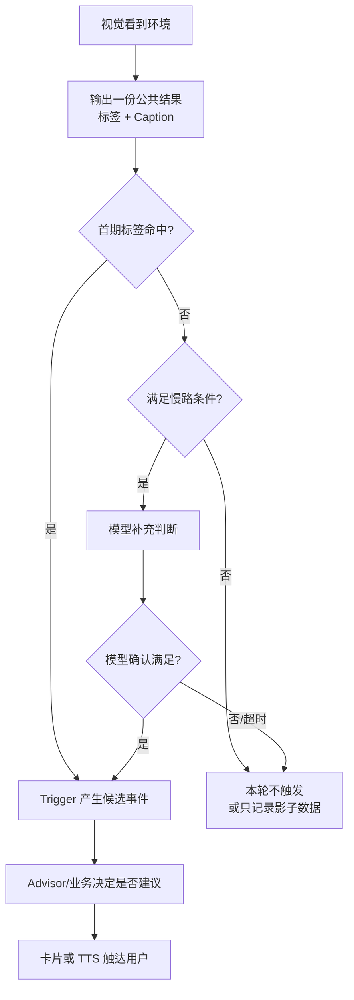

# PRD｜主动服务视觉结果消费方案

> 版本：老板内审精简版 v03  
> 会议来源：2026 年 9 月 10 日《聊主动服务视觉相关问题》  
> 本次目的：请老板选择静态视觉主动服务的量产方案，不评审完整技术实现。

---

## 1. 一句话说明｜这件事是什么

车端视觉会持续观察车内外环境，例如看到日落、海、森林或古典建筑。视觉结果上传后，主动服务需要根据标签或 Caption（画面文字描述）判断是否给用户提醒。

现在需要决定的不是“视觉能不能看见”，而是：

> **视觉结果上来后，是每个任务都调模型、每车每包共享一次模型，还是用“标签快路 + 受控语义慢路”？**

本质是在“开放视觉能力”和“成本、并发、时延可控”之间选择量产方式。

---

## 2. 参与方｜谁需要参与决策

| 角色 | 需要说清什么 | 当前状态 |
|---|---|---|
| 业务/产品 | 首期要做哪些场景，提醒多晚就失去价值 | 赵益红有个人草案，尚未正式会签 |
| 视觉侧 | 能否同时输出稳定标签和 Caption，效果及端侧代价 | 丁彬是当前会议解释入口，正式 DRI（唯一负责人）待确认 |
| 云端/架构 | 模型调用、并发和资源上限 | 需要架构和资源决策人参会 |
| Trigger/主动服务/VUI | 谁产生候选事件，谁决定是否打扰，谁完成展示 | 最终 DRI 待现场认领 |

会议中被点名的人只先作为沟通入口，不等于已经认领最终交付。

---

## 3. 背景｜为什么现在必须决策

9 月 10 日会议口头对齐了以下信息：

- Always-on（持续运行）视觉结果以整包 JSON 和 Caption 形式上传。
- DT 目前可以直接读取整包结果。
- 舱外最快约 3 秒一轮，舱内约 5 秒一轮。
- 静态主动服务可能有多个任务长期并行。

这些只是会议口径，真实 JSON、车型、版本、开关、Topic（数据通道标识）和现网状态仍需书面确认。

如果不先决定结果消费方式，各业务可能各自解析同一份视觉结果。任务越多，重复调用、成本、并发和延迟越高。

---

## 4. 目标｜本次要达到什么

本次内审只需要完成四件事：

1. 选定首期的主方案。
2. 明确视觉侧应输出什么结果。
3. 明确 Trigger、模型、Advisor 和 VUI 的责任边界。
4. 明确上线前必须补齐的数据和风险。

本次不需要定完所有视觉标签，也不需要在会上讨论完整字段、状态机和所有异常用例。

---

## 5. 首期场景范围｜首期做什么

首期只做“容易定义、提醒有价值、结果可验证”的场景。

- 日落可以作为第一个影子测试候选。
- 海、森林、沙漠可作为后续有限标签候选。
- 古典建筑等开放内容先作为慢路研究，不直接进入 P0 快路。

上述只是基于会议例子的产品建议，不是已批准范围。如果正反例、视觉效果和业务文案不齐，本次只批场景入围原则。

---

## 6. 价值｜为什么值得做

对用户，系统能在场景还有价值时提醒，减少过时、重复和不合时机的打扰。

对业务，一份视觉结果可以被多个静态任务复用，新增场景时不需重复建设一套解析链路。

对量产，固定场景使用规则快路，开放场景受控使用模型，成本、时延和故障影响都更可控。

---

## 7. 方案｜具体怎么做

### 7.1 三种选择

| 方案 | 怎么做 | 好处 | 主要问题 | 建议 |
|---|---|---|---|---|
| A：每个任务都调模型 | 每来一份 Caption，每个静态任务都各自调模型判断 | 最灵活，开放能力保留最多 | 任务越多，成本和并发越高；时延不稳定 | 只作风险对照，不做量产主路 |
| B：每车每包公共语义模型一次 | 每份视觉结果只调一次模型，再给多任务复用 | 比 A 少了重复调用 | 全量车辆持续调用，总资源仍可能很高 | 可小流量预研，不直接全量 |
| C：标签快路 + 语义慢路 | 固定场景用结构化标签和规则；保留 Caption，只在特定条件下调模型 | 成本、时延和开放能力相对平衡 | 需要视觉侧稳定输出标签，并定义什么时候允许走慢路（只在少量特殊情况调模型） | **首期推荐** |

### 7.2 推荐方案

推荐选择方案 C。

这张图只表达五个产品动作：

1. 视觉只生产一份公共结果，不为每个任务重复看一次。
2. 稳定、固定场景使用标签快路。
3. 只有新场景、低确定性灰区、地理/时间候选或用户明确的长尾目标，才允许走模型慢路。
4. Trigger 只产生候选事件，不决定最终怎么打扰用户。
5. Advisor/原业务和 VUI 完成建议、冲突处理和真实展示。

如果首期慢路来不及建设，可以先只上 C 的标签快路，同时明确长尾场景暂不支持。

### 7.3 输入和输出

| 环节 | 输入 | 输出 |
|---|---|---|
| 视觉 | 车内外画面 | 标签、Caption、观察时间、有效期、数据状态 |
| Trigger | 任务开关、有效视觉结果、场景规则、局部去重 | 候选业务事件 |
| Advisor/业务 | 候选事件和当前上下文 | 是否建议、说什么、有效到什么时候 |
| VUI | 可展示的建议 | 真实卡片/TTS 结果 |

### 7.4 主要风险

| 风险 | 为什么会发生 | 处理原则 |
|---|---|---|
| 模型成本和并发失控 | 多个任务高频重复理解同一 Caption | 一份结果多任务复用；慢路限频、缓存和熔断 |
| 固定标签限制视觉能力 | 标签只能覆盖预先定义的场景 | 保留 Caption；长尾场景按条件走慢路 |
| 提醒已经过时 | 3/5 秒只是视觉周期，后面还有上行、判断和展示 | 每个场景单独定义有效期，真实展示前再次检查 |
| 同一场景重复提醒 | 视觉每几秒都会上传新包 | 按同一场景实例去重，而不只按单包去重 |
| 职责继续混乱 | Trigger 命中容易被当成用户已收到服务 | Trigger、Advisor、VUI 分别对候选、建议、真实展示负责 |
| 把会议说法当成现网能力 | 真实接口、车型和版本尚未核验 | 开发前必须展示真实 JSON，并确认车型、版本、开关和 Topic |

---

## 8. 上线方式｜怎么验证

### 第一步：补证据

- 视觉侧展示真实 JSON，确认标签、Caption、时间和状态。
- 业务、视觉和测试共同确认首期场景。
- 架构侧用真实车辆数、刷新频率和模型成本评估 A/B/C。
- 认领视觉、状态、Trigger、模型、Advisor 和 VUI 的唯一 DRI。

### 第二步：影子运行

系统只识别和记录，不打扰用户。验证标签效果、理论提醒次数、重复、过期、模型调用比例、时延和成本。

### 第三步：小流量灰度

只开放 1～3 个已达标场景。过期、数据缺失或模型失败时默认不提醒；指标超限时可按场景关闭。

---

## 9. 本次内审请老板拍板

| 编号 | 需要拍板的问题 | 产品建议 |
|---|---|---|
| D1 | 量产主路选 A、B 还是 C | 选 C；A 仅作对照，B 小流量预研 |
| D2 | 视觉是否同时输出标签和 Caption | 双输出；P0 消费标签，Caption 用于受控慢路 |
| D3 | 本次是否直接定 P0 场景 | 材料不齐时只批入围原则，日落先做影子候选 |
| D4 | 什么时候允许走模型慢路 | 只允许新场景、置信度灰区、非视觉候选和用户长尾目标；必须限频、缓存和熔断 |
| D5 | 谁对每一段负责，什么时候完成 | 视觉、状态、Trigger、模型、Advisor、VUI 各有一个实名 DRI 和时间 |

### 评审结束标准

会后至少要留下：

- 选定的主方案及理由；
- 需要补齐的真实数据；
- 每个问题的实名认领人；
- 精确回收时间。

“两种思路都能走”、“后面再对齐”，不等于本次内审完成。
