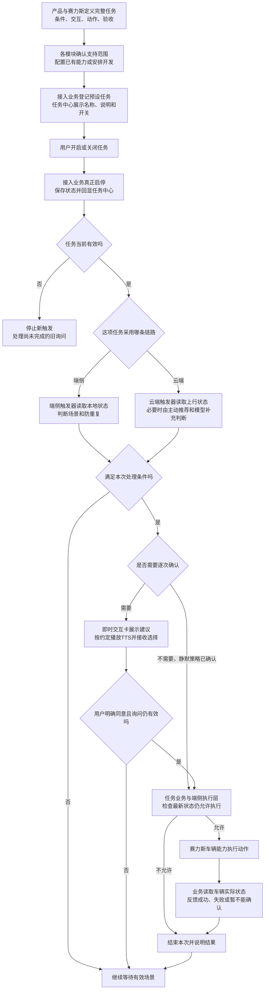
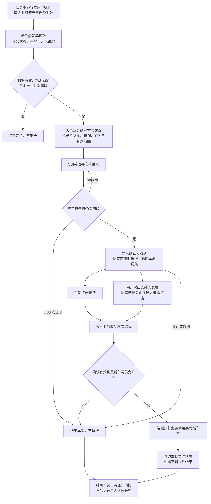
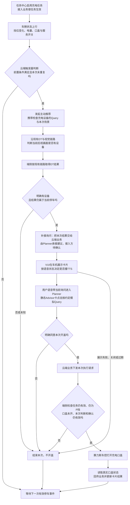

# 系统预设任务 PRD｜现稿补充评审版

> 版本：V1.0｜日期：2026-09-07｜产品：王泽民  
> 基于：[当前飞书《系统预设任务PRD》][S0]。保留“背景—业务框架—端云划分—四个 Case”的主线，补齐中间缺失的接入、运行、交互、执行和验收要求。  
> 文档状态：**需求评审稿，不代表全部能力已开发或已联调。**本稿不覆盖飞书现稿及旧版文档。

## 阅读与评审说明

本次要评清楚两件事：第一，系统预设任务需要哪些通用能力，各模块怎样接起来；第二，四项任务放进这套框架后，具体条件、动作和用户体验是否正确。框架完整与单项需求正确都要检查。

文中使用三种标记：

- **【来源明确】**：原始 PRD、任务表或会议明确写过；只证明需求或当时结论，不证明当前上线状态。
- **【本稿方案】**：为补齐完整业务提出的规则，本次评审需确认后实施。
- **【待确认】**：资料有冲突，或缺少能力、负责人、阈值等决定性信息；列明谁确认、确认什么。

**图怎么读：**全文保留三张业务图。总图看模块协作，端侧图用天气保护解释本地询问，云端图用充电开盖解释模型协作。图只放关键步骤，具体条件、异常与交接内容写在图下，避免把所有要求挤进方框。

## 1. 需求背景

系统预设任务，是产品提前定义好、用户不用每次重新创建的服务。用户在任务中心启用后，系统在条件满足时，按约定直接处理或先询问，再完成任务执行并反馈结果。本次要把“任务怎么配置和启停、何时触发、如何交互、谁执行、如何结束”接成完整链路。

### 1.1 先用一个场景理解整件事

用户在任务中心开启“天气/路况保护”。这时不切换驾驶模式，也不立刻弹出询问卡，只是允许这项服务开始等待场景。

行驶途中，系统识别到路面湿滑，且车速、当前驾驶模式等条件都符合要求，才在车机上问：“要切换到湿滑模式吗？”用户点击“确认”，或说出这张卡支持的确认表达后，天气业务检查当前条件仍合适，调用车辆功能切换模式。车辆实际切换成功后，卡片才显示成功；天气保护这项长期服务继续保留，等待下一次符合规则的场景。

这里有四个职责，不要求研发新建四个同名服务：

| 名称 | 在这个场景里做什么 | 不应混淆的地方 |
|---|---|---|
| 系统预设任务 | 定义并持续提供整项天气保护服务 | 不是每次下雨临时创建一项长期任务 |
| 触发器（Trigger） | 读取任务状态、天气与车况，判断本次是否满足规则 | 判断命中，不等于用户已经同意切换 |
| 任务业务 | 决定本次问什么、收到选择后做什么、如何结束 | 可以由现有业务或触发器相关研发承接，须认领，不能把后半段留空 |
| 即时交互卡 | 在车机显示建议、按钮及执行结果，承接用户交互 | 卡片不制定天气规则；按钮可调用原业务处理，不代表卡片团队负责天气车控策略 |

### 1.2 总体业务框架图

**【本稿方案】下图描述本次要接完整的业务。端侧统一后台发布、所有回调和所有记录能力尚未被验证为现成能力。**

### 1.3 总图各段要对齐什么

| 图中阶段 | 谁负责推进 | 上一步给什么 | 这一段必须作出的判断 | 交给下一步什么 |
|---|---|---|---|---|
| 定义、能力确认 | 王泽民统筹；赛力斯需求方和各模块确认 | 场景描述与用户目标 | 信号能否取得、动作能否执行、交互和验收是否一致 | 一份完整任务规格；已有能力与新增缺口 |
| 登记、用户启停 | 接入业务＋任务中心 | 名称、说明、初始状态、可用操作、操作接收方 | 是哪辆车/哪个用户的哪项任务，是否真正启停成功 | 真实任务状态及操作结果 |
| 条件判断 | 端侧或云端触发器 | 真实任务状态、车辆与感知数据 | 数据有效、规则满足、本次未重复、频控允许 | 本次命中场景、判断依据、处理目标 |
| 形成建议、询问 | 原任务业务；云端按需由主动推荐/Planner承接 | 命中信息或模型结果 | 是否需要确认，当前是否允许展示/播报 | 当前询问内容及用户选择 |
| 执行、结果 | 原业务＋端侧执行层＋赛力斯车控 | 本次有效确认或已确认的静默策略 | 任务和车况仍允许，动作没有执行过 | 实际执行结果、原因、必要的卡片更新和记录 |

**这张图最重要的业务约束：**开关控制长期服务是否有效；卡片确认只针对当前一次建议；一次成功或失败通常不删除长期服务。任务关闭后未执行的旧询问必须失效，已经发生的车辆动作按该功能的退出策略处理。

## 2. 协作分工与交付内容

### 2.1 谁负责什么

以下姓名是资料中的对齐联系人，不等于已认领本稿全部研发工作。个人研发负责人由专项补齐。[S1][S2][S3][S4]

| 对接方向 | 负责的产品/业务内容 | 王泽民提供什么 | 需要对方明确返回什么 |
|---|---|---|---|
| 王泽民：系统预设任务与触发器产品 | 任务范围、规则、链路、模块交接要求、异常和验收，汇总决策 | 本 PRD、四任务规格、待确认项 | 组织结论入文档，不代替全部模块设计或实车测试 |
| 任务中心/Task：晓伟相关团队 | 展示与操作转发；确认预设业务接入边界 | 名称说明、开关/删除诉求、真实状态回显与业务接收要求 | 谁接收操作；谁保存状态；触发器如何查询和接收变化；是否需要 Task 改动 |
| 触发器：韩杰、汪帅相关团队 | 状态消费、规则计算、去重频控、运行与后续业务衔接 | 条件来源、与/或关系、变化事件、后续动作及退出规则 | 支持矩阵、缺失信号/算子/后续动作、端云实现差异、业务承接人 |
| 即时交互卡/VUI：徐洋相关团队 | 卡片类型、通用模板、排队、TTS、展示生命周期和交互规范 | 场景、卡片文案、按钮意义、语音需求、有效范围、结果状态 | 选择哪类卡片链路；谁提供模板、注册入口和回调；异常如何通知业务 |
| 可见即可说：字节语音＋卡片注册方 | 语音转文字、匹配按钮；注册方维护词与按钮关系并模拟点击 | 可说的词、对应按钮、展示/退出时机、不支持的表达 | 业务注册责任、词表格式、支持范围、多匹配处理、注销和历史同步 |
| 主动推荐/Planner/DT相关团队 | 接收触发事件、模型工具判断、承接云端询问与回答 | 触发依据、查询目标、当前场景、有效范围和用户授权要求 | DT结果怎样续接卡片、点击/语音怎样返回、如何阻止未确认执行 |
| 赛力斯四任务需求方 | 天气：张景波；儿童锁：许圣义；后视镜：樊鹏宇；充电：刘多 | 完整案例与规则冲突清单 | 最终业务条件、安全限制、已有功能归属、动作和真实状态能力、验收口径 |
| 视觉/信号团队 | VLM、OMS及车辆状态的实际供给能力 | 要识别的对象、位置、时效和场景要求 | 是否支持、输出含义、更新周期、失败状态、实际准确率及适用车型 |
| 测试与项目 | 按链路验收、协调依赖和排期 | 本文验收矩阵及所有确定参数 | 联调用例、执行证据、未通过项、排期及阻塞负责人 |

### 2.2 两类分工必须分开确认

- **字节还是赛力斯负责**：看业务是否已有承接方、是否需要豆包交互和推理，避免同一个场景两边重复执行。后视镜已有温感联动策略，尤其要先盘点。
- **在车端还是云端运行**：看需要的数据和能力在哪、可接受的响应时间与网络依赖。字节也有端侧模块；放端侧不等于交给赛力斯。

【待确认】“预设任务接入业务”由现有哪个团队承接，不能只写成“任务中心通知触发器”。任务中心的展示能力与 Task 服务的执行范围是两件事；当前 Task 技术方案明确将静态 Advisor 预设建议排除在其本期范围外。不得仅因都叫“任务”就认为已自动接通。[S4][S10]

## 3. 本次解决的问题、价值与完成标准

### 3.1 上次评审暴露的问题

1. **只讲条件，没有讲后续交互接法。**天气规则已有推进，但业务文案、可见即可说注册、用户选择回传和结果展示仍需接清。[评审原文][S1]（01:36—01:47）
2. **把“部分条件可配”说成“整项任务都能配”。**会议明确：云端已有部分配置能力，端侧当时依赖开发，TTS和二次确认没有完整加入配置；统一端云配置是后续方向。[评审原文][S1]（01:57、02:08—02:11）
3. **任务表与详细需求没有完全一致。**后视镜条件有遗漏；天气防抖、充电退出交互等存在不同口径。需要形成一份共同验收的规格，不能让各模块分别选择不同版本。
4. **能力存在，不代表足以满足场景。**例如会议提及默认宠物识别为低频任务，约五分钟上报一次。即使“能识别猫狗”，也需确认能否及时支持行车儿童锁。[评审原文][S1]（01:56）

### 3.2 产品价值

- 对车主：一次设置后，在合适场景得到帮助；需要确认的动作保持可控；拒绝或关闭后不继续执行旧建议。
- 对需求接入方：新增任务沿用一套“条件—交互—动作—结果”规格，减少逐场景重复确认与遗漏。
- 对研发和测试：知道每一步由谁承接，缺的是数据、规则、交互还是执行能力，能够按相同标准联调。

不承诺未经验证的事故降低比例、模型准确率或实现时延。天气等服务作为辅助能力，不替代驾驶员判断与车辆原有安全机制。[S6]

### 3.3 本次评审完成标准

评审应输出：三条链路及分工是否接受；四项任务最终规则；已有/新增/未支持能力清单；待确认项负责人和完成时间。**“框架评审通过”不等于“四项功能可以全部发版”。**每项任务须单独完成数据、交互、动作和结果验收。

## 4. 本期范围与边界

本期覆盖：四项预设服务的任务中心接入、真实启停状态、端云触发、必要的模型协作、两类二次交互、静默执行、车辆结果与必要记录。

本期不新增：用户任意自然语言创建任务的完整 Task 产品、全部即时任务类型、独立离线大模型、任意卡片通用语义推理、与四任务无关的 AIbar/媒体/导航功能。系统通知的动态选择工具只用于说明可复用边界，不自动纳入天气或充电改造。

**即时任务、即时交互卡、可见即可说的区别：**“现在打开车窗”是立即处理的用户任务；“即时交互卡”是显示内容和操作的界面；“可见即可说”是把用户说的界面文字匹配到按钮的操作能力。系统预设服务可借用后两者，不需要因此改成“用户创建的即时任务”。[S3][S5][S10]

## 5. 任务定义、配置和用户管理

### 5.1 一项任务怎样从需求变成可运行服务

| 步骤 | 要完成的工作 | 产出与检查 |
|---|---|---|
| 需求输入 | 赛力斯说明什么场景、用户目标、动作边界；王泽民整理规则 | 每个子场景有明确条件和退出方式 |
| 能力确认 | 信号、视觉、触发器、卡片、车控逐项确认 | 每个依赖标记“可用/需新增/不支持”；不能只填“有VLM” |
| 形成任务规格 | 补齐启停、交互、结果、防打扰及验收 | 同一份规格用于配置、开发和测试 |
| 实现与接入 | 云端配置已接入能力；端侧按当前承接方式开发；接入任务中心 | 明确接入业务、适用车型和版本；不假定所有能力可在后台填写 |
| 联调与发布 | 完成开关到车辆实际结果的链路验收 | 缺条件、卡片回传、动作或回读任一环节，不标为“已完成” |

### 5.2 本批四项任务

来源为《系统预设任务全集》当前读取的修订版本206。默认开启属于任务表的需求，不代表当前所有车辆已启用。[S2]

| 任务 | 用户管理 | 本次交互 | 运行与责任口径 |
|---|---|---|---|
| 天气/路况保护 | 开关；默认开启，原文要求记忆 | 卡片＋TTS；二次确认；排队 | 端侧自闭环；本地可见即可说。任务表状态为开发中 |
| 后排儿童/猫狗识别后开启儿童锁 | 开关；默认开启；原始需求还提及删除 | 无卡、无TTS；静默执行；表中写排队 | 识别来源不同；部署和完整执行承接方需确认 |
| 后视镜自动加热 | 开关；默认开启 | 无卡、无TTS；静默执行；表中写排队 | 三个P0子场景；字节与赛力斯分工、运行位置需确认 |
| 识别充电设备后打开充电口盖 | 开关；默认开启 | 卡片＋TTS；二次确认；排队 | 云端触发与主动推荐/DT协作；端侧执行车辆动作 |

静默任务的“排队”不能直接理解成“等待语音卡片”。【待确认】要排的是哪种资源、允许等多久、是否会延误本次场景，由原业务和执行团队确认；不默认让儿童锁等待一段用户闲聊结束。

### 5.3 产品需要填写的完整任务规格

| 要填写的内容 | 具体写法示例 | 谁确认 |
|---|---|---|
| 任务名称、说明、适用对象 | 天气/路况保护；适用车型具备对应驾驶模式 | 赛力斯需求方、任务中心 |
| 默认与用户控制 | 默认开启；用户关闭后记忆；故障不能假装已开启 | 需求方、接入业务、任务中心 |
| 触发事件 | 天气/路况更新；充电为“挡位变更为P” | 触发器＋信号方 |
| 当前条件 | 车速大于30；充电电量小于等于20%；目标功能未开启 | 需求方＋触发器 |
| 条件之间关系 | 雨或湿滑满足一个即可；所有公共条件必须同时满足 | 王泽民＋需求方 |
| 数据有效范围 | 是本次停车的数据还是上次停车的数据；未知不能当否或真 | 信号/模型＋触发器 |
| 后续处理 | 本地询问、直接执行，或发起识别充电设备的推荐 | 原任务业务 |
| 交互内容 | 卡片/TTS文案、按钮意思、语音支持范围、结果展示 | 需求方＋VUI/语音 |
| 生效与结束范围 | 本次询问有效到何时；场景消失怎么办；长期任务是否保留 | 原任务业务＋各链路方 |
| 动作与成功条件 | 打开后雾灯；回读后雾灯为开启才确认完成 | 车控＋原业务 |
| 防重复、防打扰 | 同次停车不重复；用户拒绝后的抑制规则 | 需求方＋触发器/主动推荐 |
| 验收与责任 | 给定数据、预期路径、用户看到什么、谁提供证据 | 王泽民＋测试＋模块方 |

### 5.4 配置平台应具备什么能力

下表是**产品能力要求与补齐方向**，不是现有页面操作说明。会议只确认云端部分条件/频控可配置，不足以证明整表已经支持。[S1]

| 能力 | 端侧任务怎么落地 | 云端任务怎么落地 | 本次要确认的缺口 |
|---|---|---|---|
| 选择已接入数据 | 选择/声明本地可读信号与视觉结果，当前由端侧研发实现 | 引用已上行可用信号 | 同名信号是否端云都有；单位、更新方式、未知值是否明确 |
| 编辑规则 | 产品定义与/或、阈值、变化事件、持续时间 | 已支持部分通过平台配置 | “变化为P”与“当前为P”、30秒持续、1分钟温差是否均支持 |
| 选择后续处理 | 固定车控、调用本地卡片等由端侧任务业务承接 | 发起主动推荐/识别Query，或确定性动作链路 | 是否只有一个“动作”输入；能否表达确认后才执行 |
| 填写交互要求 | 需要文案、按钮、TTS、本地词条和返回业务；不要求现在平台均可填 | 需要推荐内容、交互等级、上下文、卡片后续行为 | 即时卡与TTS配置入口、版本同步与运行方消费方式 |
| 处理结果与退出 | 执行前复核、回读、取消、冷却均进入任务规格 | 补齐推理超时、过期结果、云端与端侧结果关联 | 已有回调是否足够，不足则明确新增 |
| 验证并发布任务 | 当前跟随端侧交付；统一下发作为后续能力 | 配置校验后按现有发布流程生效 | 配置与车型能力不符要拦截；发布失败不能显示可用 |

【本稿方案】统一配置的最小目标是“同一份业务规则能完整表达并被运行方执行”，不要求第一版重新建设可视化拖拽编排器。先补齐缺少的业务表达，再确认哪些进入平台、哪些由研发交付。

### 5.5 开关从任务中心到触发器：具体业务要求

**【来源明确】任务中心转发用户操作；接入业务真正处理启停并回传。**任务中心使用任务标识关联更新和操作，但资料没有证明“一个taskId就能自动通知所有端侧触发器”。[S4]

按以下顺序接通：

1. 接入业务登记“天气/路况保护”，同时告诉任务中心谁接收开关操作、当前真实状态是什么。
2. 用户点击开启。任务中心通知接入业务：“用户想开启这项任务”。此时是操作请求，不是成功结论。
3. 接入业务完成启用并保存状态，返回成功；失败则返回失败原因。任务中心根据结果回显，处理期间不能假装已经生效。
4. 任务运行方获得“这项任务现在有效”的状态，触发器才能参与判断。**产品要求同时覆盖启动时取得当前状态、运行中取得变化、异常后重新核对。**具体使用订阅、查询还是现有状态通道由研发确定。
5. 用户关闭后，运行业务停止新触发，撤销待展示/待确认内容。已发送到车辆的动作进入结果核对，不能直接宣称已经撤销。

【本稿方案】触发器没有拿到有效状态、状态尚未同步、或启用失败时，本轮不产生新的执行。此状态记为“暂不可运行”，不能当用户主动关闭，也不能把默认开启当作已完成能力检查。

### 5.6 启停与恢复的边界

| 场景 | 用户看到什么/业务怎样处理 |
|---|---|
| 首次进入 | 按适用车型、默认策略和真实状态展示；能力缺失不能挂一个实际无效的正常开关 |
| 再次上电 | 读取已保存的用户选择和当前能力状态；开启不等于恢复上一次未完成的车控 |
| 重新开启时场景已经存在 | 【本稿方案】天气等当前状态型规则重新检查；充电等变化事件型规则不凭一个静态P挡伪造新停车事件。是否支持补判需逐任务确认 |
| 用户关闭时卡片还在 | 旧询问失效，不再接受确认；关闭任务不等于自动关后雾灯或切回驾驶模式 |
| 用户删除 | 任务中心通用文档要求区分删除与取消；预设任务删除后是否找回、是否同时停止必须会签，不擅自删减此诉求，也不能只删展示留后台运行 |
| 账号切换 | 区分车辆级与账号级选择；作用范围未确认前不跨账号沿用待确认卡片 |
| 视觉故障/共享感知暂停 | 标识任务暂不可运行；天气原文要求摄像头故障时开关置灰并提示。保留用户选择与能力故障的区别 |

**感知启停不是任务启停。**VLM可能为多个业务提供识别结果；关闭天气任务不应直接停止其他业务共用的舱外识别。Awake Button、车辆电源与感知任务开关如何影响结果可用性，由端侧感知管理模块给出状态，本任务消费状态并决定是否继续。[S11]

## 6. 为什么区分端侧和云端，价值是什么

### 6.1 先看判断需要什么，再决定在哪里做

| 问题 | 适合端侧处理 | 需要云端参与 |
|---|---|---|
| 数据和能力在哪里 | 当前车况、本地可用的VLM识别结果就能判断 | 需要现有云端工具、模型协作、业务上下文 |
| 命中后要做什么 | 动作明确；可以固定询问、点击或有限词条确认 | 还需理解场景、形成建议、处理自然语言追问 |
| 网络要求 | 业务要求本地可持续完成，需逐环节验收离线能力 | 接受当前业务依赖联网，失去网络时应安全结束或等待新有效场景 |
| 价值 | 减少网络往返；固定规则容易解释与复现 | 扩展可理解场景；复用已有模型工具和连续对话能力 |
| 代价 | 受本地数据、识别周期、计算资源、可说词范围限制 | 需要处理上传延迟、模型不确定、超时与结果过期 |

**不能用“有模型/没模型”划分。**天气识别本身就是本地VLM产出；云端也可以只做确定性规则。要看这一步依赖哪个能力、该能力实际部署在哪。

### 6.2 端云协同怎样理解

充电案例：车辆把挡位、电量等必要状态传到云端；云端规则命中后沿主动推荐/DT链路判断是否存在充电设备；卡片在车机显示；用户确认后，执行请求回到端侧，检查最新车况，再调用车辆能力。

因此，“云端任务”不等于所有步骤在云上；“端侧任务”也不等于不能上传必要的脱敏记录。业务按会签链路运行，不因为网络刚恢复就让端侧与云端各自重复处理一次。

### 6.3 当前资料中的三个限制必须保留

1. VUI定义端侧服务可离线闭环，但任务中心原文存在“无网时即时交互卡无法推出”的通用描述。**需明确天气是否作为本地例外接通，做实车验收，不能宣称完整离线链路已具备。**[S3][S4]
2. 天气原文要求视频仅车端处理；充电视觉如涉及上传，须按其实际链路确认最小必要数据与授权，不能把天气视频顺手上云。[S6]
3. 端侧统一配置发布是目标能力；已有云端配置能力也只能配置已接入的信号和动作，不会因为写了一个名称就获得新能力。[S1]

## 7. 详细业务方案

### 7.1 触发器怎样判断一次场景

**输入三类信息：**任务是否有效；车辆当前状态；感知结果或变化事件。例如“挡位现在为P”是当前状态，“刚从非P变为P”是一次变化，二者不能替换。

【本稿方案】每次相关信息更新后，触发器按下列顺序判断：

1. **任务能运行吗？**用户未关闭、任务适用于当前车辆、所需能力可用。
2. **信息能用吗？**来源正确、时间仍有效、识别结果不是未知、所需字段完整。
3. **规则满足吗？**先计算每组条件，再计算组与组之间的“同时满足/满足任一组”。
4. **这次已经处理过吗？**同一停车、同一询问或同一连续天气场景，不因重复上报反复创建建议。
5. **现在允许再提醒吗？**检查本任务已确认的频次和拒绝后抑制策略；有卡片交互还需由VUI进行展示仲裁。
6. **命中后交给谁？**输出本次场景和处理目标，交原业务继续询问、静默执行或发起云端识别。

“数据不足”与“条件不满足”分别记录。比如没有儿童识别结果，不代表确认后排没有儿童；没有新图像，不代表没有充电设备。

**数据更新触发检查，不代表数据提供方已经做完业务判断。**VLM回答“有雾”，天气业务还要判断任务开关、速度、后雾灯状态和是否重复。感知任务的“完成回调”也不等于拿到了完整天气内容；端侧PRD区分状态回调与结果数据通道，接入时两者必须都能对应。[S11]

### 7.2 本批任务的交互方式与共同边界

| 模式 | 本批任务 | 命中后怎么做 | 什么情况下可以执行 |
|---|---|---|---|
| 本地询问 | 天气保护 | 本地业务填写卡片与TTS；按钮点击或本地可见即可说 | 当前询问获得有效确认，执行前复核通过 |
| 云端询问 | 充电口开盖 | 云端业务形成建议，Planner承接回答，VUI显示 | 当前场景判断成立、用户明确同意、端侧复核通过 |
| 静默执行 | 儿童锁、后视镜 | 按会签规则直接进入执行业务；本批要求无卡无TTS | 静默策略本身已确认，当前条件及车辆限制满足 |

“仅告知、不执行”与“告知后直接执行”是不同模式。通用VUI支持其他交互等级，但本期四项任务不因此自动增加模式。[S3]

【来源差异】通用VUI对“静默执行”还描述了成功后的结果展示；本批任务表与9月1日会议明确儿童锁、后视镜无卡无TTS。本稿按具体任务要求编写，需徐洋确认其作为“不新增即时结果卡”的接入方式，不能把结果卡偷偷补回来。[S1][S2][S3]

#### 7.2.1 语音禁用、展示与排队

- **语音禁用且允许展示卡片**：会议接受只出卡、不播TTS的方向；用户可手动选择，不能因不能语音就默认同意。[评审原文][S1]（02:05—02:06）
- **AI服务未获授权、任务关闭、车辆场景不允许展示**：不套用“语音禁用只出卡”的降级。需要分别使用对应的业务准入状态。
- **卡片排队**：VUI原文规定主动服务低于用户Query并排队。请求被接收不等于已经显示，询问不能在用户还没看到时按“无回应”计时。
- **排队期间任务关闭或场景失效**：【本稿方案】撤销这条旧建议，不能等很久后再问一个已不适用的问题。需要VUI确认支持撤销，不能把“排队无丢弃”理解成永远展示过期建议。
- **卡片折叠**：VUI原文规定折叠不等于结束，计时和TTS可继续；因此点击卡片外区域不能一律当作用户拒绝。充电原文对此存在另一口径，见7.7。[S3][S8]
- **多音区**：拾音与谁有权确认是两层要求。VUI可全车拾音；驾驶模式等动作允许哪个座位确认，需赛力斯和语音团队会签，不能默认任何乘员都能授权。

#### 7.2.2 卡片业务需要的三类反馈

下表是本次提出的业务对接要求，具体回调是否已具备由VUI研发核对。

| 反馈类别 | 要让原业务知道什么 | 原业务收到后怎么处理 |
|---|---|---|
| 展示情况 | 已接收、排队中、真正显示、显示失败 | 只有真正显示且仍有效才进入等待选择；失败不能执行 |
| 用户选择 | 点/说了哪个选项、属于哪次询问、发生时间和方式 | 确认后复核；拒绝结束本次；其他表达按对应业务处理 |
| 生命周期 | 关闭、超时、折叠、替换、恢复 | 根据本次是否仍有效继续或退出；注销无效的按钮词/云端卡片上下文 |

同一张卡可能经历多个状态，不能只返回“按钮被点击”。业务必须知道是哪一次天气/停车触发的哪一个按钮，避免旧卡的确认作用到新场景。

### 7.3 端侧链路：触发器和即时交互卡怎样对接

#### 7.3.1 端侧业务流程图

天气按VUI第④类“端侧自闭环服务通知”接入，本地语音通过可见即可说，不绕到Planner判断天气或确认。[S3]

#### 7.3.2 这张图的四次交接

| 交接 | 发送方要提供什么 | 接收方负责什么 | 返回什么 |
|---|---|---|---|
| 触发器→天气业务 | 命中的雨/雾/雪子场景，最新车况和识别依据，本次处理关联 | 选定这一条建议和目标动作，不把雨雾雪统一执行 | 是否接收、是否终止；具体实现可与触发器在同一模块 |
| 天气业务→即时交互卡 | 本地业务类型、这次建议、文案、确认/取消意义、TTS、本地词表、有效条件、结果控件 | 使用统一模板，排队展示，按约定接入语音，反馈展示与生命周期 | 是否真正显示；用户选择；关闭、超时等结果 |
| 语音/注册方→天气业务 | 匹配的当前按钮；通过原按钮处理链路携带本次关联 | 天气业务核对是否当前询问、是否明确同意、是否已经处理 | 接受、拒绝本次执行或结束；不是直接播“已切换” |
| 天气业务→车控及结果卡 | 最新复核通过后的明确动作；之后提供实车状态与结果说明 | 车控完成动作；卡片按业务提供的真实状态更新 | 实际模式/雾灯状态，失败或未知原因 |

### 7.4 本地可见即可说到底需要准备什么

可见即可说的含义是：业务或车企把当前界面可操作按钮及词语注册给语音模块；字节语音识别用户说的话并匹配到按钮；注册方模拟原按钮点击。它支持规定范围内的表达，不负责理解任意追问。[S5]

以“是否开启湿滑模式”这张卡为例，**【本稿方案，文案与词表需交互会签】**：

| 产品交付项 | 本次填写示例 | 实际负责方 |
|---|---|---|
| 卡片文本 | 检测到路面湿滑，要切换到湿滑模式吗？ | 天气业务产品定义，VUI按模板显示 |
| 按钮 | 确认；取消。确认只对应切换湿滑模式 | 天气业务定义意义，卡片承载点击 |
| TTS | 检测到路面湿滑，要切换到湿滑模式吗？ | 业务提供内容，VUI/语音负责播报时机 |
| 确认表达 | “确认”；是否增加“开启湿滑模式”等同义表达需验收 | 业务提供候选词，注册方接入，语音匹配 |
| 取消表达 | “取消”；其他表达是否覆盖逐条确认 | 同上 |
| 不支持的表达 | “为什么要开”“先别开，等雨大一点”不能直接当确认 | 保持不执行；如进入普通语音链路也不能沿用旧卡授权 |
| 词条有效期 | 当前询问可操作时启用；结束、替换或失效时撤销 | 注册方与卡片生命周期联动 |
| 历史同步 | 标记来自手动/模拟点击，附本次操作与结果 | 原业务、端侧与上下文接入方对齐 |

**“确认”→按钮处理成功→车辆切换成功，是三个不同结果。**只有最后一步实车状态达到目标，业务才可以给出“已切换”的结果。卡片控件支持后续手动调节时，仍调用原控件业务并显示实车变化，不能使用第一次成功值永久回显。[S3]

你给研发的核心需求可以直接这样说：

> 我这边给你本次天气建议、文案、按钮、TTS和可说词范围。你们需要告诉我卡什么时候真正显示，以及用户选的是这一次卡的哪个按钮。本地语音命中后走原按钮处理。天气业务收到确认以后再复核车况并执行，最后把实车结果给卡片更新。业务注册方、卡片接入方和执行承接方今天要各自明确。

### 7.5 云端链路：沿用充电现有链路，补齐询问后半段

#### 7.5.1 已有链路与本次补充的边界

用户提供的现有链路为：**触发器检测前置条件满足→主动推荐携带Query→主动推荐调用DT→端侧上行拉取DT推理结果→端侧执行。**本稿保留这条接法，不擅自改为DT直接操作车控。

充电原始需求和任务表明确要求用户接受后再开盖。[S2][S8] 因此必须补齐：**取得识别结果后，先形成当前询问；确认结果回到执行承接方；确认仍有效才执行。**

DT在这里指现有链路中的推理调用环节；VQA指基于图像回答“后视画面有没有充电设备”的能力。本稿不把DT、Planner、Director画成三个固定串行“大脑”：Planner/Director按同一决策职能表述；DT与Planner在当前实现中的调用关系由对应团队确认。

#### 7.5.2 云端业务流程图

下图“识别结果→形成询问”是本次需要补接、需明确承接方的步骤；其余也须按现状核验，不代表已端到端上线。

**图中的静态Advisor点击路由是按VUI第②类链路编写的评审方案。**如技术最终选择第③类系统通知卡，必须连同卡片产生方、按钮执行入口、动态选择工具及手动操作同步一起变更，不能只拿其中“点击直接执行”一条拼接。[S3][S12]

#### 7.5.3 云端各环节接收什么、要返回什么

| 发送→接收 | 交付的业务信息 | 接收方的处理 | 必须返回/留下的结果 |
|---|---|---|---|
| 端状态→云端触发器 | 挡位变化、电量、口盖、AI主动服务与任务有效状态，各自的更新时间 | 区分新停车与重复上报；判断硬条件 | 本次命中或不触发的原因 |
| 触发器→主动推荐 | 当前车辆/任务与这次停车关联、条件依据、识别目标、有效范围 | 发起一次推荐，沿约定调用DT及视觉能力 | 已受理或失败；不能无止境重复调用 |
| DT/视觉→结果接收业务 | 明确有设备、明确无设备、无法判断或错误；结果所属场景和时间 | 确认结果仍适用；不能把调用完成当作识别肯定 | 是否进入询问，或为什么结束 |
| 结果接收业务→Planner/VUI | 要询问的开盖建议、当前依据、确认/取消意义、不可自动执行限制 | 形成当前卡片与语音上下文 | 展示情况、当前卡片关联与有效范围 |
| VUI/用户→Planner | 用户说的话或当前按钮生成的Query；同时保留本次询问上下文 | 理解是在同意、拒绝、追问还是新需求 | 对本次询问的结果；手动操作已被消费的记录 |
| 云端业务→端侧执行 | 已明确的开盖动作、本次用户同意、当前停车/识别关联、有效范围 | 核对最新状态和是否已执行 | 执行拒绝原因，或车辆真实结果 |
| 端侧→云端业务/VUI | 实际口盖状态、执行结果和原因 | 更新卡片，保持云端知道本次已结束 | 成功、失败或暂不能确认；不再次消费旧确认 |

#### 7.5.4 对用户回答的处理

| 用户行为 | 云端业务怎样处理 |
|---|---|
| 说“好，打开吧” | 结合当前充电询问理解为同意，再执行前复核 |
| 说“先别开” | 结束本次，不开盖；保存拒绝事实，后续频次按会签策略 |
| 说“为什么要打开？” | 解释当前建议，不因提问就执行；后续是否保留询问按卡片有效期处理 |
| 说“导航去另一家充电站” | 按新诉求处理，不当作同意当前开盖；旧询问失效/保留规则需与Planner确认 |
| 点击确认 | 若选静态Advisor链路，按原文模拟Query到Planner，不同时在端侧直接执行一遍 |
| 点击取消、明确关闭或超时 | 不生成本次开盖动作；告知相关业务当前询问结束 |
| 卡片消失后说“好的” | 不允许命中已经失效的旧开盖建议；需要新的明确意图或新场景 |

### 7.6 Case一｜天气路况保护：完整走一遍端侧业务

#### 7.6.1 业务规则与输入

【来源明确】天气原文要求默认开启、记忆开关、用户确认后操作；目标功能已经开启则不重复提醒；天气恢复后再次询问是否关闭/切回常用模式。[S6] 字节旧规则PRD还给出车速大于30和以下子场景条件。[S9]

| 子场景 | 场景进入条件 | 同时检查 | 本次询问及确认后动作 | 恢复判断 |
|---|---|---|---|---|
| 雨/湿滑 | 天气为下雨，或路面为湿滑 | 任务有效、车速＞30、车型支持湿滑模式、当前不是湿滑模式 | 询问切换湿滑模式；确认后切换 | 不再下雨且路面不再湿滑；需有效的新识别，未知不算恢复 |
| 雾 | 天气为浓雾 | 任务有效、车速＞30、后雾灯当前关闭 | 询问打开后雾灯；确认后打开 | 不再有雾；原始需求用晴天，具体识别口径需与感知确认 |
| 雪/冰雪 | 天气为下雪，或路面为覆雪结冰 | 任务有效、车速＞30、车型支持雪地模式、当前不是雪地模式 | 询问切换雪地模式；确认后切换 | 不再下雪且路面无覆雪结冰；晴天不自动等于地面无冰雪 |

场景分支引用旧规则定义，正式信号枚举、车型能力与恢复判断须与当前感知和车控会签。**雨天不会顺带开启后雾灯，雾天不会顺带切雪地模式。**旧PRD汇总行写“切雪地模式＋开后雾灯”，不能作为所有子场景统一动作。[S9]

| 数据 | 来源与用途 | 还需确认什么 |
|---|---|---|
| 天气/路面 | 字节本地VLM给出结构化识别结果；用于雨、雾、雪分支 | 枚举、更新周期、数据有效期、未知和故障的表达 |
| 车速、驾驶模式、后雾灯 | 赛力斯端状态；用于前置判断和执行后核对 | 实际接入、单位、读取时点 |
| 车型/四驱配置 | 赛力斯能力信息；决定是否存在对应模式 | 不支持车型如何隐藏、禁用或裁剪子场景 |
| 雨量/雨刮 | 可作为规则补充信号，会议提出需确认接入 | 不把“天气传感器”泛指雾、雨、雪；具体融合规则未定不自动加条件 |
| 任务状态 | 接入业务保存并提供 | 不把任务管理状态冒充已有车辆物理信号 |

**防抖参数不能直接沿用旧数值。**旧PRD一处写“连续3次”，子场景表中进入3次/2次、退出8次又被划掉。本稿要求支持稳定性判断，但次数/时长列为待确认，不把3次或8次写成统一验收标准。[S9]

#### 7.6.2 主 Case：识别湿滑后，用户语音确认

以下数值只为解释业务，不新增阈值：假设车速46km/h，普通驾驶模式；本车支持湿滑模式；语音可用。

1. **用户启用服务。**任务中心显示天气保护开启；接入业务确认真实启用并通知运行方。结果是“开始等待场景”，不是切换模式。
2. **端侧收到数据。**VLM提供本轮“路面湿滑”；端状态提供46km/h和普通模式。数据未达到会签稳定性要求前继续等待，不立即弹卡。
3. **触发器解析条件。**天气任务有效；46＞30；“路面湿滑”满足雨/湿滑分支；当前不是湿滑模式；车型支持；这一轮没有重复处理且允许提醒。以上同时满足才命中。
4. **触发器交给天气业务。**说明“这一次湿滑场景满足，可以建议切换湿滑模式”，同时保留这次判断依据。此时不调用切换模式。
5. **天气业务准备询问。**给即时卡本次场景、提示文本、确认/取消、TTS、按钮意义和有效条件。确认只对应湿滑模式，不对应所有天气保护动作。
6. **VUI安排出卡。**如果用户正在进行优先级更高的交互，先按通用规则等待。业务不能把等待期间算作用户拒绝；轮到展示前检查场景仍有效。
7. **卡片真正显示。**显示“检测到路面湿滑，要切换到湿滑模式吗？”；语音允许时播报。注册方让当前确认/取消及约定表达可被本地匹配。
8. **用户说“确认”。**字节语音匹配到当前确认按钮，把匹配结果交注册方；注册方模拟原按钮点击。语音模块不另起一条“云端切模式”链路。
9. **天气业务核对选择。**确认来自这一张仍有效的卡，任务没有关闭，确认未被消费。重复点击或语音与点击同时到达，只接受一次。
10. **端侧执行前复核。**重新读取最新车况；如果车速或场景已不满足、任务已关闭，则不执行。若用户已经自己切到湿滑模式，不再下发相同动作，按“当前已处于该模式”反馈，不记为系统切换成功。
11. **车辆执行与核对。**调用赛力斯模式切换能力；等待车辆状态变为湿滑模式。只收到“请求成功”，但状态仍为普通模式时，不显示“已切换”。
12. **反馈并结束本次。**成功显示实际模式；明确失败显示原因；无法确认显示“暂无法确认切换结果”。清理本次确认及词条，保存结果，长期任务继续等待。

#### 7.6.3 同一流程下的其他 Case

| Case | 具体输入与判断 | 用户交互 | 最终业务结果 |
|---|---|---|---|
| 浓雾打开后雾灯 | 浓雾成立、46km/h、雾灯关闭，其他条件有效 | 询问“是否打开后雾灯”；点击确认 | 只开后雾灯，回读开启；不改驾驶模式 |
| 冰雪切雪地 | 覆雪结冰成立、车速＞30、非雪地且车型支持 | 询问切雪地模式 | 确认后复核并切换；车型不支持则不生成不可执行卡片 |
| 已在目标模式 | 路面湿滑，但模式已是湿滑 | 不再询问开启 | 记录已满足目标，继续等待；不能重复执行 |
| 语音被禁用 | 场景满足，允许卡片展示，但不可语音 | 只出卡；用户点击确认 | 按相同复核执行；不强行TTS，不默认为确认 |
| 排队时天气已恢复 | 卡片尚未显示，新的有效结果表明不适用 | 撤销旧询问 | 不显示过期建议，不计拒绝 |
| 用户拒绝 | 取消当前卡片 | 无车控 | 结束本次并记录明确拒绝；按最终防打扰规则处理后续，不擅自关闭长期任务 |

#### 7.6.4 天气恢复后，为什么还要走一次询问

【来源明确】天气原文不仅有“开启”，还有“恢复后询问关闭/切回”。[S6] **恢复是一条新的处理，不是沿用第一次开启的授权。**

按以下业务补齐：

1. 天气业务记录本次是否确实由该服务完成开启、当时目标是什么，以及模式恢复需要的信息。
2. 后续取得有效恢复结果。雨天需确认“不下雨且路面不湿滑”，雪天还要排除仍有覆雪结冰，不能只看到“晴天”就恢复。
3. 【本稿方案】只有本服务先前确实影响的功能仍处于对应状态时，才考虑恢复建议；用户后来手动调整过则不盲目恢复，策略需车企确认。
4. 新建恢复询问：“天气已恢复，是否关闭后雾灯/切回常用驾驶模式？”用户确认后重新检查再操作。
5. “常用驾驶模式”由哪个业务提供、没有该信息时恢复到什么模式，必须由赛力斯确认。本稿不假定为普通模式或上次模式。
6. 用户拒绝恢复、无回应、任务被关闭时，不执行恢复动作；保持车辆当前状态，后续由车辆原有机制与用户操作管理。

原文“一个上电周期内有效”和“重新启动退出之前触发的模式”需车控团队明确落地；这不等于“每次上电只能提醒一次”，也不意味着任务中心的长期开关每次重置。

#### 7.6.5 天气场景需要拍板的专项规则

- 雨、雪、雾同时存在时，原文要求复合场景因安全不合并处理。确定优先顺序、模式冲突和后续展示，不把一次确认扩展为多个动作。[S6]
- 明确一次持续天气场景何时结束，恢复抖动后何时算新场景；分别设置出卡频次、执行频次，不能混用。
- 原始恢复口径、旧PRD与/或条件及防抖数值需统一；专家任务集中的多次拒绝后不再推，需要需求方提供最终口径并同步研发，不把会上“拒绝三次关闭”当结论。
- 关闭任务只停止此服务，是否回退已执行动作需按每个功能定义。不得把关任务直接映射为关雾灯或切模式。

### 7.7 Case二｜识别充电设备后开盖：完整走一遍云端协作

#### 7.7.1 场景定义和条件

用户刚停好车，电量较低且充电口盖关闭。系统先判断是否值得检查充电设备，再识别当前后视画面；识别成立后询问用户，用户同意后才开盖。这里省的是用户寻找开盖入口，不是跳过确认。[S2][S8]

| 阶段 | 必须判断什么 | 数据从哪里来 |
|---|---|---|
| 允许检查 | 本任务有效；AI主动服务开启；挡位变更为P；电量≤20%；口盖关闭 | 接入业务真实任务状态＋赛力斯端状态上行 |
| 判断设备 | 当前后视画面明确有充电设备，并适用于本次停车 | 现有主动推荐、DT及视觉/VQA链路 |
| 允许询问 | 本次仍有效、未重复展示/处理，交互准入允许 | 原业务＋VUI状态 |
| 允许开盖 | 用户明确同意；端侧最新状态允许、仍是本次停车；口盖没有已经打开 | 云端确认结果＋端侧最新状态和车控限制 |

“变更为P”按当前任务表理解为从其他挡位进入P。旧端侧PRD写过R→P；补能概述也举倒挡切P，而详细Case/任务表写变更为P。**本稿按任务表展示，最终支持哪些前序挡位由刘多确认；不得把持续P状态反复当新触发。**

#### 7.7.2 主 Case：电量19%，后视识别到充电桩

1. **长期任务已启用。**接入业务确认本车充电服务有效；AI主动服务开关开启。两个状态来自各自承载方，不能省掉任务本身的有效性。
2. **收到本次停车变化。**车辆由非P进入P，电量19%，口盖关闭。云端收到的是这次变化及相关状态，不是上次停车的旧数据。
3. **云端Trigger计算硬条件。**任务有效、服务开、转P事件、19≤20、口盖关全部成立；本次停车未处理过。只有这一步成立才发起一次推荐。
4. **触发器输出建议。**按原始补能需求，用自然语言说明“看一下后视是否有充电桩，如果有，则提示开启充电口盖”，并关联本次停车。**这个Query由系统生成，不是用户已经下达开盖指令。**
5. **沿现有主动推荐链路调用DT。**DT与视觉/VQA协作取得当前后视画面判断。要求识别的是车外充电设备，不是后排座椅上的物体；“后排”和“后视”在旧材料中混写，应统一为实际摄像头能力。
6. **端侧上行取得DT结果。**保留现有链路。结果要区分有设备、无设备、未知、失败，且能关联本次停车；只返回“推理成功”不足以决定下一步。
7. **原业务判断结果是否还能用。**有设备但车已重新挂D离开，结束本次；当前还在这次停车且识别明确，进入询问。未知或失败不按“有桩”处理。
8. **补接云端询问。**由承接业务把有效结果和本次停车信息交给Planner形成询问。这个桥接的接口与责任方是本次专项事项，不能仅画一条箭头就算完成。
9. **Planner/VUI准备并显示卡片。**文案沿原文：“你可能在充电桩附近，要打开充电口吗？”按钮按统一卡规范表达确认/取消；TTS可用时播报。排队、展示失败和过期都反馈原业务。
10. **用户说“好，打开吧”。**语音带当前询问上下文进入Planner，Planner确认是在同意这次开盖。如用户点确认且使用静态Advisor卡，则按钮模拟的Query回到Planner。两种方式最后只形成一次本次同意。
11. **云端业务下发执行。**请求包含当前任务、停车、识别和同意的关联。不能只下发一个脱离当前场景的“打开充电口”。
12. **端侧重新检查。**任务和必要服务状态仍允许，车辆仍处于本次停车的P挡并满足车企确定的车控限制，口盖仍关闭，识别与同意没有过期。如果已换挡、离开、用户关任务，拒绝执行。其他安全限制由车控明确，不在本稿自行增加未定义的信号阈值。
13. **赛力斯车控开盖。**车控返回后读取实际口盖状态。实际开启才向云端和卡片反馈成功；开盖失败或状态未知，不播“已打开”。
14. **结束这次停车处理。**更新卡片、执行记录与云端上下文。长期服务继续有效；重复端状态、重复确认、晚到的DT结果不能再开一遍。下一次有效停车是否触发，重新按规则判断。

**原有Query含“如果有的话打开充电口”时怎么办？**保留现有接口形式也必须让下游知道该任务要求二次确认；建议将业务语义写成“有设备则先询问，用户同意后再开盖”，由主动推荐/DT团队确认其表达方式和实际执行约束。仅修改卡片文案，阻止不了DT结果被端侧直接执行。

#### 7.7.3 异常与分支 Case

| Case | 判断/交互过程 | 结果 |
|---|---|---|
| 电量21% | 21不满足≤20，不发起识别推荐 | 无卡、无开盖 |
| 车辆一直在P挡 | 没有新“变更为P”事件 | 不因周期状态刷新反复检查 |
| 识别无设备 | 硬条件成立，但视觉明确无设备 | 结束本次，不出开盖执行卡 |
| 图像太暗/结果未知 | 无法确认设备，不等于有设备 | 不开盖；是否允许同次有限重试需会签，不能无限调用 |
| 识别晚到 | 返回结果时车辆已离开本次停车 | 丢弃本次执行资格，不让旧结果影响下一停车 |
| 用户问“为什么” | Planner解释依据，不生成同意 | 继续交互或超时结束，不能直接开盖 |
| 用户点击后又说确认 | 当前选择已被消费 | 只执行一次，Planner知道该卡已经处理 |
| 云端同意后网络中断 | 不能确定执行请求与真实结果 | 不盲目重发车控；恢复后先核对状态及本次是否仍有效 |
| 用户手动先开盖 | 最新口盖已开 | 不再次调用开盖；反馈当前已开启，不冒认系统执行 |
| 车控已受理、口盖没有打开 | 无真实成功状态 | 显示执行中直到约定等待结束；之后失败或未知，不显示成功 |

#### 7.7.4 原文已有要求与冲突处理

- 原始充电PRD已有“10秒内无操作/点击卡片外区域，卡片消失”；VUI通用规则将点击外部定义为折叠并继续计时。**本稿方案优先统一VUI的折叠语义，明确取消和真正超时才结束；需刘多与徐洋共同确认，不能同时保留两种结果。**
- 10秒是充电原文已有要求，不自动扩展为所有任务的统一超时。计时起点、交互后是否刷新、最长业务有效期需对齐；排队等待不算用户无回应。
- 原文还要求拒绝后降低频率，但没有给出完整次数与恢复规则。与天气防打扰统一定义能力，逐任务填写参数，不把“已记录拒绝”当作“已实现降频”。
- 补能原文同时写了语音解说与“轻提示音、无强烈播报”等表述，本期任务表明确卡片＋TTS。播报文案及强度由需求方与VUI定稿。

### 7.8 Case三｜儿童锁：静默执行也必须有完整判断和结果

#### 7.8.1 规则与业务边界

【来源明确】任务默认开启；非P挡，后排识别到儿童、猫或狗任一对象，且儿童锁未开启时，自动开启儿童锁；不出卡、不播TTS。儿童来自赛力斯OMS识别（车内乘员监测），猫狗来自字节VLM。[S2]

完整条件是：**任务有效，并且非P，并且〔有儿童或有猫或有狗〕，并且儿童锁未开启。**不是要求儿童和宠物同时存在，也不是仅限D挡。

| 输入/能力 | 提供方 | 本次必须确认 |
|---|---|---|
| 儿童识别、座位范围 | 赛力斯OMS/端状态 | 能否区分左右后排、变化如何提供、未知/离座怎样表达 |
| 猫狗识别 | 字节VLM | 当前默认能力的上报频率、有效期、是否满足本任务响应需求；其他宠物不自动扩展 |
| 挡位、儿童锁状态和控制 | 赛力斯 | 左右锁还是总锁；锁状态未知时怎么办；何种车况允许控制 |
| 任务真实状态和静默执行承接 | 接入业务＋触发器/执行团队 | 端云位置与业务Owner；不得根据识别发生在端侧直接推断全任务部署 |

#### 7.8.2 主 Case：后排儿童出现，车辆进入非P

1. 接入业务确认儿童锁预设任务有效；运行方获得该状态。
2. OMS给出后排有儿童，端状态显示当前非P、对应儿童锁关闭。运行方检查三个结果当前有效且含义明确。
3. 触发器计算规则：儿童为真，已经满足“儿童/猫/狗任一对象”；不必等待再识别到猫或狗。
4. 规则命中后交原业务，说明本次需要开启儿童锁。由于任务规格选择静默执行，跳过卡片、TTS和用户确认。
5. 原业务与端侧执行层检查最新挡位、对应锁状态及车辆控制限制；目标已开则不重复；字段缺失或无法确定控制对象则不执行不确定动作。
6. 赛力斯车控开启会签范围内的儿童锁。范围未确认前不默认同时控制两侧，也不自行按儿童位置猜测。
7. 执行业务读取相应儿童锁真实状态，记录成功、失败或未知。不用新增即时卡来表示这项静默任务完成。
8. 后续重复的“有人”或同一识别结果不再次开启；任务继续等待。用户手动关闭儿童锁后是否应自动再开，属于冲突策略，必须单独确认。

#### 7.8.3 宠物 Case：能力有，但信息可能不够及时

假设车辆已有五分钟前“后排有狗”的结果，现在刚进入非P。触发器不能只看到“有狗”就认定当前仍有狗；先按会签数据有效期检查。若已过期或当前无法确认，不能按有效识别继续执行。

9月1日会上提及默认宠物识别为低频，约五分钟一次，并仅对猫狗有评测依据。[评审原文][S1]（01:56）这属于当时能力信息，需视觉团队提供当前结果。若频率无法满足任务，评审要在“调整识别供给、采用其他现成信号、调整交付范围”中作出决定，不能仅写“VLM已支持”就让用例通过。

#### 7.8.4 本任务不自动增加的行为

- 儿童/猫狗离开、切回P挡，不自动解锁；本期输入需求只写开启。
- 用户关闭这项预设服务，不直接关闭车辆已开启的儿童锁。
- 未定义的动物不扩大到“所有宠物”。
- 静默执行不意味着跳过车控限制；与用户手动操作争抢时的策略需需求方确认。

### 7.9 Case四｜后视镜自动加热：三个P0子场景分别执行

#### 7.9.1 先核对原始需求，不把三种场景写成一条大条件

【来源明确】后视镜原始分析文档将下列三项列为新增P0；任务表写实现原文P0需求。[S2][S7]

| 子场景 | 原始条件 | 开启方式 | 退出/结束要求 |
|---|---|---|---|
| 雨天中低速行驶 | 雨量传感器为下雨；雨刮持续刮刷30秒；车速＜70km/h；非P | 满足后开启并持续 | 原文写前提条件不满足时退出；任务表写恢复待确认，需统一执行口径 |
| 退出传送带洗车 | 收到传送带洗车模式退出事件 | 本次开启一次 | 加热持续时长及关闭由谁处理，原文未明确 |
| 湿气和温差 | 湿度＞60%；车辆行驶区域1分钟内温差＞5℃ | 本次开启一次 | 时间窗原文仍标TBD；温差算法和退出未完整定义 |

**此次必须补回“雨刮持续30秒”。**任务表的简写漏掉此条件，而它引用的原始P0需求明确包含。按原文补入本稿，需樊鹏宇确认是遗漏还是后续有意调整；如果有新结论，以会签后版本替换。

雨天分支用非P，与当前任务表一致；不能继续沿用会上口述的P挡。原文还存在大雾解锁等P1/其他场景，本期不因相关就一起纳入。

#### 7.9.2 主 Case：下雨、雨刮持续、低速行驶

示例：车辆D挡，50km/h，下雨，后视镜加热关闭，任务有效。

1. 接入业务让后视镜任务生效。业务部署在哪由专项确认，任务规格本身不因端云位置改变。
2. 触发器收到雨量为下雨、雨刮开始运行、当前D挡和50km/h。此时还未满持续30秒，不能直接命中。
3. 雨刮持续条件达到30秒后，再检查仍下雨、速度＜70、非P，且数据有效。若刮刷中断如何计时，需信号方说明是状态持续还是实际动作累计，本稿不擅自定义。
4. 雨天分支满足，且目标加热未开，任务业务发起一次开启。按照本任务要求，不弹确认卡、不播TTS。
5. 端侧执行层检查最新车况和车控限制，调用赛力斯后视镜加热能力；再读取加热实际状态。
6. 实际开启才记录本次成功；此时保持监测雨天分支的持续条件，不因周期状态刷新反复发送开启。
7. 后续速度达到70或转P等导致原前提不满足时，原文要求退出。**谁负责关闭、是否会影响用户手动开启或其他除雾联动，必须先确认。**本稿不把任意条件变化直接映射为全局关闭后视镜加热。

#### 7.9.3 Case：洗车结束

1. 任务有效；车辆提供一次“传送带洗车模式退出”事件。不能把“当前没有在洗车”当作退出事件。
2. 触发器确认本次退出尚未处理，交原业务请求开启后视镜加热。
3. 不出卡、不TTS；端侧复核并调用车辆能力，回读真实开启状态，结束这一次处理。
4. 本次事件重复送达不重复开启。是否开启固定时长、何时关闭、由车控自带定时还是任务业务处理，等待原需求补齐。

#### 7.9.4 Case：湿度与温差

示例仅用于演示：湿度65%，1分钟前温度22℃，当前28℃。如果最终会签定义为“当前值与1分钟前值的绝对差”，则温差6℃，满足＞5℃；但该算法目前尚未被原文明确。

1. 触发器先确认湿度与温度来自同一适用场景，时间窗口内数据足够；不能只取得当前温度就判断“1分钟温差”。
2. 按最终会签算法计算温差，检查湿度＞60%和温差＞5℃同时成立。温度变化方向、采样间隔、取最大最小还是首尾值都需写清。
3. 符合则静默开启一次，端侧复核、车控和真实状态核对与前述相同。
4. 一个窗口被重复计算或雨天分支同时满足时，不叠加重复开启；下一次何时允许重新触发需定义。

#### 7.9.5 为什么要先确认字节与赛力斯分工

原始文档列出已有温感策略：前风挡起雾、低温上车等会联动后视镜加热。[S7] 所以本次必须由樊鹏宇组织现有功能盘点，明确三项P0是由赛力斯现有系统扩展，还是需要字节触发器承接，或只接任务中心管理。

【本稿方案】同一子场景只确定一个主动执行承接方；其他模块提供信号或展示，不各自重复执行。若多个独立车身功能都能控制加热，关闭和保持策略交由车企统一协调。未定归属前，不承诺“云端配置一下就完成”，也不把已有加热联动全部迁到字节。

### 7.10 一次处理怎样结束，长期任务怎样继续

| 结束原因 | 本次动作 | 卡片与语音 | 长期服务 |
|---|---|---|---|
| 用户确认并执行成功 | 记录真实结果 | 有卡则更新实际状态，旧确认不可再用 | 保持原启停状态，按频控继续等待 |
| 用户拒绝 | 不执行 | 关闭当前询问；记录明确拒绝 | 不擅自关闭总任务；后续按会签抑制规则 |
| 无回应超时 | 不执行 | 询问失效，清理词条/上下文 | 记录无回应，与拒绝区分 |
| 场景变化、任务关闭 | 未执行部分停止 | 撤销待展示或待确认卡片 | 任务关闭则不再触发；场景变化但任务仍开则继续等待 |
| 已执行但回读失败 | 不凭未知盲目重试 | 如实反馈暂不能确认 | 原业务跟进结果，按约定防重复 |
| 用户已手动达成目标 | 不重复操作 | 按当前状态反馈 | 不冒认系统成功，继续观察 |
| 服务重启/网络恢复 | 核对当前状态，不重放旧授权 | 清理或恢复展示须再次确认有效性 | 恢复的是长期运行资格，不是上一轮执行许可 |

本次结束记录至少能关联：哪项任务、哪次场景、为什么命中、问了什么、用户怎样回应、有没有执行、真实结果是什么。用产品可理解的记录即可，正式字段和协议不在本稿强行规定。

## 8. 验收：怎样证明整项需求真正接通

以下是**本稿提出的验收要求**。有争议的业务条件、超时和频控参数须先完成第9节会签，再用于验收；不能一边标“待确认”，一边把该项判为通过。

验收分三层：先检查每项能力，再验证跨模块交接，最后从车主操作到真实车辆结果走完整场景。配置保存成功、模型调用成功、卡片展示成功，都不能单独代表任务成功。

### 8.1 通用框架验收

| 编号 | 给定场景与操作 | 应看到的结果 | 主要提供证据的模块 |
|---|---|---|---|
| G01 | 用户开启任务，但接入业务返回失败 | 任务中心反馈失败或保持原真实状态；触发器不得按启用成功运行 | 任务中心、接入业务、触发器 |
| G02 | 任务已关闭，车辆条件全部满足 | 不产生新建议和新车控；能查到未触发原因为任务关闭 | 接入业务、触发器 |
| G03 | 卡片正在排队或等待确认，用户关闭任务 | 当前询问失效；旧按钮或旧语音不能再发起执行 | 接入业务、VUI、原业务 |
| G04 | 关闭操作到达时，车辆动作已发出 | 核对实际结果，不虚报“已撤销”；是否恢复车辆状态按单项退出规则处理 | 原业务、车控 |
| G05 | 服务重启，任务之前开启，存在上次未消费的确认 | 恢复真实任务状态；不得重放旧授权或重复车控 | 接入业务、原业务、端侧执行 |
| G06 | 同一次状态变化重复上报，或用户点击与语音先后确认 | 同一次场景只消费一次；不会重复推荐或重复执行 | 触发器、卡片/Planner、原业务 |
| G07 | 关键状态缺失、未知或已过时 | 不按“全部满足”继续；记录具体缺失项，不冒充用户拒绝 | 信号/感知、触发器 |
| G08 | 车控请求返回成功，但目标状态未达到或无法读取 | 分别报告失败或暂不能确认，不直接显示成功，不盲目重试 | 车控、原业务、VUI |
| G09 | 车型没有所需驾驶模式、信号或执行能力 | 发布/接入时标出不支持；不能显示为完整可用的任务 | 配置/接入业务、车企、任务中心 |
| G10 | 用户仅折叠卡片，没有取消任务 | 按会签后的VUI规则继续或结束；不能把折叠事件擅自统计为明确拒绝 | VUI、原业务 |

### 8.2 天气与本地交互验收

| 编号 | 给定场景与操作 | 应看到的结果 |
|---|---|---|
| E01 | 有效天气任务，湿滑成立，车速46，当前非湿滑模式，稳定性及频控通过 | 显示湿滑模式询问；未确认前不切换，不顺带开雾灯 |
| E02 | 与E01相同，但车速恰好30；或目标模式已经开启 | 按“＞30”的规则不在30时触发；目标已开启不重复建议 |
| E03 | 浓雾成立、车速合规、后雾灯关闭 | 询问开启后雾灯；确认只授权此动作，不切换雪地模式 |
| E04 | 卡片真正展示后，说出已注册的确认词；另一次手动点击确认 | 两种方式到达同一个原按钮业务，均检查当前询问及最新车况，结果一致 |
| E05 | 卡片过期、被替换或任务关闭后，再说原确认词 | 不执行旧动作；旧词条/旧询问不再可用 |
| E06 | 用户取消、明确拒绝或无回应 | 本次不执行；分别记录拒绝与无回应，不自行关闭长期任务 |
| E07 | 用户确认前，场景已不适用；或用户已手动完成目标 | 不重复操作；反馈当前原因或当前真实状态 |
| E08 | 语音禁用，但任务和视觉仍有效且允许卡片服务 | 按本稿方向保留点击路径、不播TTS；不能把“禁语音”当作自动同意 |
| E09 | 网络断开，本地数据、规则、卡片和语音能力可用 | 完成本地询问和点击；本地语音确认也须实测。若链路不支持，则不能宣称离线闭环验收通过 |
| E10 | 系统曾开启保护，天气恢复 | 发起一条新的恢复询问；未获同意不自动恢复；用户手动改变过模式时按会签规则处理 |
| E11 | 同时出现雨、雾或雪等复合场景 | 按会签优先级和动作冲突规则处理，不一次确认执行所有分支 |
| E12 | 使用旧演示环境中的风扇/温度替代天气信号完成测试 | 只记录为模拟联调；正式验收必须恢复真实天气路况、车速及真实目标功能 |

E09是需要确认并验证的目标，不是本文证明已经具备的事实。可见即可说的验收须列出实际支持和不支持的表达，不能只测“确认”一次后宣称任意表达都能理解。

### 8.3 充电与云端交互验收

| 编号 | 给定场景与操作 | 应看到的结果 |
|---|---|---|
| C01 | 任务有效、AI主动服务开启、新停车变P、SOC为20%、口盖关闭 | 符合“≤20%”边界，允许进入检查设备的推荐；不是直接开盖 |
| C02 | SOC大于20%；或AI主动服务关闭；或口盖已开 | 不进入本次开盖推荐 |
| C03 | 车辆持续为P，周期上报相同状态；或重启后仅取得P挡快照 | 不凭静态状态制造新停车事件；补判若有特殊需求须另行会签 |
| C04 | DT返回无设备、不能判断、错误 | 不出“已找到设备”的执行询问，不开盖，不把调用完成当作肯定识别 |
| C05 | 识别期间车辆离开；随后收到上次停车的“有设备”结果 | 旧结果失效，不用于当前或下次停车开盖 |
| C06 | 当前识别为有设备，询问已展示，用户语音说“打开吧” | Planner结合本次询问理解；通过执行前复核后才调用开盖 |
| C07 | 同C06，用户点击确认，采用静态Advisor卡片链路 | 点击按约定生成Query进入Planner；端侧不能同时直接开一次；云端知道当前询问已处理 |
| C08 | 用户问原因、拒绝、关闭或超时 | 追问不等于确认；拒绝及无回应不执行；超时和折叠口径按会签版本验收 |
| C09 | 已确认，执行请求到达端侧时不再为P或任务已关闭 | 拒绝本次执行，回传原因并更新当前状态 |
| C10 | 断网、请求超时或确认过期后，旧执行请求再次到达 | 不使用过期结果或授权开盖；网络恢复不自动补执行旧请求 |
| C11 | 开盖调用成功，但真实口盖仍关闭 | 不播报“已打开”；反馈失败或暂不能确认；记录实际状态 |

### 8.4 静默任务验收

| 编号 | 给定场景与操作 | 应看到的结果 |
|---|---|---|
| S01 | 非P、当前后排儿童识别有效、目标儿童锁关闭、任务有效 | 静默请求开启对应儿童锁；无新增即时交互卡、无TTS；读取真实锁状态 |
| S02 | 后排只有猫或狗，满足其余条件；另一次车辆为P或锁已开 | 猫/狗与儿童是“或”；为P或目标锁已开时不重复执行 |
| S03 | 只有五分钟前的猫狗结果，无法证明当前仍有效 | 不将旧结果当作当前事实；记录时效不满足，并验证补充观察能力是否满足需求 |
| S04 | 儿童或宠物离开，或用户手动关闭儿童锁 | 不自动增加“无人就解锁”；手动关闭后的再触发规则按会签版本执行 |
| S05 | 下雨、50km/h、非P，雨刮持续29秒；随后达到30秒 | 29秒不满足雨天持续条件；30秒时复核其他条件后静默开启，不因每次刷新重复调用 |
| S06 | 与S05相同但车速70，或雨天持续条件退出 | 70不满足“＜70”；退出如何处理实际加热，按会签归属及策略验收，不能误关其他功能保持的加热 |
| S07 | 传送带洗车模式退出事件重复送达；或只有“当前未洗车”状态 | 同一退出只处理一次；未洗车快照不当作退出事件 |
| S08 | 湿度恰好60%，或温差恰好5℃；或缺少时间窗内历史数据 | 严格“＞”边界不满足；历史不足不能计算出有效温差 |
| S09 | 已有车身除雾联动正在加热，又命中本任务 | 按会签后的控制归属处理，不重复控制、不误关闭原有功能 |

### 8.5 记录、体验指标与性能目标

只收集解释本次服务必要的信息，按公司和车企现有数据要求处理；天气视频遵守原文仅在车端处理的要求。本稿不扩展原始视频上传范围。

| 要看什么 | 业务口径 | 为什么需要 |
|---|---|---|
| 条件命中后为什么没出卡 | 区分任务关闭、数据无效、频控、排队、过期、展示失败 | 不把所有未展示都归因于触发器失效 |
| 用户是否接受 | 在有效询问真正展示后，分别统计明确接受、明确拒绝、无回应；确定分母和观察窗口 | 无回应不能当拒绝，排队中的卡不能当已触达 |
| 是否执行成功 | 区分未授权、执行前终止、发出请求、实际达成、失败、未知 | 不用请求成功率代替用户目标达成率 |
| 是否过度打扰 | 同场景重复推荐、用户拒绝后再次提醒、旧场景卡片延迟出现 | 验证去重、频控、有效期是否真正起作用 |
| 是否发生错误执行 | 关闭任务后新执行、未确认执行、用旧结果执行、同一次重复执行 | 此类问题按发布阻断项处理，需定位并复验 |

时延至少分开测：**取得可用数据→判断命中→请求卡片→真正展示→用户确认→发出车控→真实状态达成**。用户思考时间、排队时间与模型处理时间分开记录，否则无法判断慢在何处。

原始天气和充电需求均有性能目标，其中部分仍标待定或采用不同起止口径。[S6][S8] 评审时由需求方、感知/模型、VUI和测试共同确认：采用哪一条目标、从何时开始计时、是否包含排队、在哪些车型和网络下验收。**本文不将原文期望值直接写成“已达到”，也不另造统一时延。**

## 9. 本次评审必须形成的结论

### 9.1 待确认项与交付物

以下“对齐方”是讨论方向，不代表已经接受排期。王泽民负责把结论补入对应章节；涉及多个团队时，会上指定一位牵头人和完成日期，不用“大家一起看”作为最终结果。

| 编号 | 需要拍板的问题 | 本稿方向 / 不能擅自认定的内容 | 对齐方与必须产出 |
|---|---|---|---|
| D01 | 谁承接预设任务登记、真正启停和状态提供 | 任务中心负责展示及转发，不默认Task已承担全部静态预设业务 | 晓伟相关团队＋端云任务业务：接收方、状态来源、查询/变化/恢复方式、研发负责人 |
| D02 | 每项任务由字节还是赛力斯承接，运行在端还是云 | 天气端侧、充电现有云端协作；儿童锁与后视镜不强行归类 | 四任务需求方＋触发器/项目：逐任务和逐子场景责任表，避免重复建设 |
| D03 | 哪些能力现在可配，哪些需要开发 | 云端部分可配；端侧当前开发；统一配置是目标 | 韩杰、汪帅相关团队＋平台：逐项支持矩阵，新增入口/动作和版本计划 |
| D04 | 本地卡由谁填、谁注册可说词、谁收原按钮结果 | 使用VUI第④类和本地可见即可说；不默认卡片或Trigger任一方包办全部注册 | 徐洋相关团队＋字节语音＋端侧业务：模板、注册方、反馈和注销责任 |
| D05 | 端侧天气是否完整离线；语音禁用时卡片怎样工作 | 本地闭环目标与任务中心通用离线描述存在差异；语音禁用不等于AI总服务关闭 | 任务中心＋VUI/语音＋端侧：适用范围、降级方式和实车验收结果 |
| D06 | DT结果由谁转入当前询问，确认由谁返回执行 | 保留现有DT结果取得链路，在开盖前补确认；桥接尚未明确 | 主动推荐/DT/Planner＋端侧＋VUI：完整调用顺序、接收业务、异常通知和关联方式 |
| D07 | 充电最终使用哪类卡片、点击怎样处理 | 本稿以静态Advisor第②类编写；如果更换类型，整条点击/语音链一起改 | 徐洋＋主动推荐/Planner：选定卡片类型，明确点击是否模拟Query，杜绝两路重复执行 |
| D08 | 充电等待多久、点击外部区域是折叠还是结束 | 原充电需求10秒/点外消失与VUI通用规则不一致；建议优先复用VUI但须业务接受 | 刘多＋徐洋：一套超时、折叠、恢复、词语/上下文失效规则 |
| D09 | 天气最终判定参数、复合优先级、恢复动作 | ＞30来自旧规则；防抖值有冲突；恢复须再询问，常用模式和手动修改处理未全定 | 张景波＋感知＋触发器＋车控：最终规则表、车型模式能力、稳定性参数和恢复策略 |
| D10 | 拒绝/无回应后如何降低打扰 | 不能把“三次拒绝自动关任务”或任意冷却时长当已定论 | 各需求方＋触发器/主动推荐：分别定义拒绝、无回应、成功后频控；关闭总任务需单独决策 |
| D11 | 儿童/宠物识别是否够及时，控制哪侧锁 | 不能用低频旧猫狗结果直接保证当前行车能力；不擅自规定双侧锁 | 许圣义＋OMS/VLM＋车控：对象/位置、更新与时效、目标锁、手动关闭后策略 |
| D12 | 后视镜三分支条件、执行和退出由谁负责 | 补回雨刮30秒；1分钟温差算法仍待定；退出不能误关其他联动 | 樊鹏宇＋信号/车控＋触发器：P0最终规格、已有功能盘点、退出/保持和运行归属 |
| D13 | 预设任务删除、账号范围、重启与重新开启的行为 | 删除不只删展示；恢复不重放旧执行；状态型与事件型任务分别定义 | 需求方＋任务中心/接入业务：用户操作矩阵、默认值和生效范围 |
| D14 | 静默任务的排队和结果反馈是什么 | 无卡无TTS不等于无需结果；不能让儿童锁无条件等待语音空闲 | 许圣义、樊鹏宇＋VUI/端侧执行：排队对象、等待上限、结果可见范围 |
| D15 | 成功状态从哪里读，失败/未知如何结束 | 不用车控请求成功替代目标达成；禁止未知时盲目重试 | 原业务＋赛力斯车控＋测试：目标状态、回读方式、等待边界和失败处理 |

### 9.2 怎样推进，不再只留下“再开个专项”

1. **本次框架评审**：确认三张图的业务边界、四任务范围、资料冲突；将D01—D15分配到明确牵头人，填写完成日期。
2. **按交接点做必要的技术对齐**：任务状态接入；本地卡/可见即可说；充电DT结果与云端确认；车辆动作与回读。产品带明确输入、预期输出、异常例子，研发确定具体接法，不重复讨论整个背景。
3. **把结论回填同一份规格**：每条标清“可用/需新增/暂不支持”，缺参数补参数，选定卡片类型后统一修改图、Case和测试，不让三份文档各写一条链路。
4. **按任务分别联调**：先走一条完整成功场景，再测关闭、拒绝、过期、数据变化、执行失败。天气前半段已有研发推进也要补测后半段，不要求为评审重做已验证能力。
5. **逐任务判定可发布范围**：未确认的依赖不能隐藏在统一“框架完成”状态下。儿童锁、后视镜如果本次尚未满足条件，明确其阻塞，不影响其他任务单独形成可验收范围。

### 9.3 发布前检查

- 每项任务的启停承接方、运行方、交互方、执行方和测试责任已明确。
- 所有影响是否执行的条件、信号含义、车型能力、时效和动作已确定。
- 需要确认的任务已打通有效确认、执行前复核、失败处理和真实结果；静默任务已确认无卡无TTS及执行策略。
- 卡片有效期、防重复、拒绝后的处理、网络与感知故障规则已会签并测试。
- 新旧车身功能不会重复控制或相互关闭；发布/回退时能停止后续新触发，不把回退等同于撤销已发生车控。
- 测试报告附真实输入、界面行为和车辆状态证据；模拟信号联调不能替代最终能力验收。

## 10. 王泽民在会上具体要完成什么

你负责把需求和交接讲清楚，并拿到模块承接结论；不需要现场设计底层协议，也不默认由你亲自开发平台、注册语音或执行实车测试。

### 10.1 开场可以这样说

> 这次我分两个部分讲。第一个是系统预设任务的整体框架，就是一项任务从用户在任务中心开启，到触发器判断，再到卡片询问和车辆执行，中间各模块怎么接。第二个是把这四个场景放进去，逐条确认条件和后续动作。
>
> 上次我主要把触发条件讲了，卡片和执行后半段没有完全对齐。这次会把端侧和云端分开讲。我的重点不是让大家现场定接口字段，而是确认每一步由谁接、我需要给什么、对方返回什么，以及不满足条件时怎么结束。
>
> 文档里面原始要求、我补的方案和还没确定的地方分开标了。今天希望先把业务方向和责任定下来，缺的能力再由对应模块给出支持范围和排期。

### 10.2 讲三张图时，需要大家重点看哪里

| 你指的位置 | 你要表达的重点 | 请谁回应 |
|---|---|---|
| 总图“真正启停→任务有效” | “用户点开之后，谁真正让任务生效？我的运行侧从哪里拿到这个真实状态？关闭的时候，谁一起停掉旧询问？” | 任务中心/接入业务＋触发器 |
| 总图“端侧/云端” | “这里按数据和能力选链路，不是有模型就一定上云。天气用本地识别结果；充电复用现在的主动推荐和DT链路。儿童锁和后视镜需要先定承接方。” | 触发器、主动推荐、赛力斯需求方 |
| 端侧图“形成建议→VUI→用户选择” | “我给本次文案、按钮、TTS和本地词范围。请确认谁注册、卡片什么时候算显示、用户点了或说了后怎样回到原业务。” | 徐洋相关团队、语音、端侧业务 |
| 端侧图“确认→最新车况→执行结果” | “确认不是车控成功。确认回来要看现在还合不合适，执行后还要看车辆是否真的变化。” | 原业务、车控、测试 |
| 云端图“取得DT结果→补接询问” | “原有链路到这里已经有识别结果，但不能直接开盖。现在要明确由谁接着问用户、谁等确认，以及确认怎么交给端侧执行。” | 主动推荐/DT/Planner、端侧、VUI |
| 云端图“用户点击/语音” | “我们这次采用哪类卡？如果用静态Advisor，点击也按这类卡的Query链路走，不再端侧直接执行一次。” | 徐洋相关团队、Planner、端侧 |
| 四个Case和第9节 | “请需求方核对条件和退出，能力方核对能不能给数据，执行方核对动作和回读。不能接的地方请具体指出哪一项缺什么。” | 对应模块产品与研发 |

### 10.3 会后你需要交付的四份内容

1. **更新后的本PRD**：把本次拍板结果写回原章节；仍未决的保留原因、牵头人、日期。
2. **四任务规格与能力清单**：沿用5.3和7.6—7.9，不另写一份只有条件和动作的缩水表。
3. **交接确认记录**：沿用7.3.2与7.5.3，填写实际接入方、支持情况、待新增内容；研发另行补正式接口。
4. **验收与阻塞清单**：沿用第8、9节，测试提供证据，你确认业务预期和发布范围。你不需要替所有模块承诺实现日期。

## 附录A. 来源与取舍记录

本稿以当前飞书PRD为结构基础，交叉读取任务总表、原始需求、评审逐字稿和相关模块文档。没有把旧版助手生成文档当作需求已确认的证据，也没有因为检索到一篇文档就宣称其所述能力已上线。

| 来源 | 本次用途与读取范围 |
|---|---|
| [S0 当前《系统预设任务PRD》][S0] | 浏览器查看正文及业务图，结合正文读取核对现稿结构；四个Case当时只有标题，本稿补入详细内容 |
| [S1 9月1日评审记录][S1] | 重点核对用户指定01:35:10—02:14:49及后续约02:17的相关责任讨论；整场长文读取返回部分内容，未宣称通读全部会议 |
| [S2《预设条件表V2》系统预设任务全集][S2] | 读取修订206中的前四项任务及其原始需求链接；其他工作表和后续第五项不扩入本次范围 |
| [S3《【AIVA-PRD】VUI主交互需求》][S3] | 卡片四类调用、静态Advisor点击、端侧自闭环、排队/折叠、TTS及真实状态回显 |
| [S4 任务中心相关PRD][S4] | 任务展示、操作转发、业务真实状态回传、删除及离线描述；不是静态预设业务已接通的证明 |
| [S5 可见即可说文档][S5] | 谁注册界面词、谁匹配、谁模拟原点击、反馈与生命周期边界 |
| [S6 赛力斯天气/路况保护原文][S6] | 开关、雨雾雪动作、确认、恢复、复合场景、故障和数据限制 |
| [S7 赛力斯后视镜加热原始分析][S7] | 三个P0、雨刮持续30秒、退出、温差待定及已有车身功能 |
| [S8 赛力斯充电相关原文][S8] | 重点读取第二节“准备充电”及相应条件、推荐、确认和退出；整体长文返回部分内容，未扩大声称全文核验 |
| [S9 王泽民旧版触发规则PRD][S9] | 天气车速及子场景条件、恢复规则、防抖冲突、模拟信号与正式信号区别 |
| [S10 Task技术方案][S10] | 核对静态Advisor在该方案本期范围外，不误画统一Task全包 |
| [S11 端侧触发器相关PRD][S11] | 感知启停、共享感知、完成回调与结果数据通道的区别 |
| [S12《动态加载型工具—技术方案》][S12] | 核对云端动态交互工具的范围，不与本地可见即可说混用 |
| [S13 徐洋交互卡评审逐字稿（本地）][S13] | 核对卡片泛化、端云路由、原按钮处理和真实控件状态；重点复核约00:52—01:03及相关上下文 |

### 原文不一致时，本稿怎样处理

- **天气旧规则与演示信号**：保留正式业务规则，旧模拟替代信号不能进入实车验收；防抖冲突不擅选数值。
- **后视镜总表与原文**：补回被简写遗漏的雨刮30秒，并要求需求方确认是否另有更新；不把P1全部加进P0。
- **充电退出与通用VUI**：保留10秒/点外消失和通用折叠规则的差异，集中决策后统一，不由开发各取一份。
- **静默任务与通用结果卡**：优先呈现具体任务“无卡无TTS”的要求，同时请VUI确认接入例外，不能用“静默”一词掩盖体验差异。
- **本地离线与任务中心通用描述**：明确目标和资料差异，必须实测，不能把设计方向当现状。

[S0]: https://bytedance.larkoffice.com/wiki/R1OLwyfpTijHw7kQtnbcoZB4nff
[S1]: https://bytedance.larkoffice.com/docx/Zp90dGMheow4XmxwVXAcu2KGnTb
[S2]: https://bytedance.larkoffice.com/wiki/SorvwQ413iamTRkzSxvcVPWtnYc?sheet=g4s4FB
[S3]: https://bytedance.larkoffice.com/wiki/FBsrwA734iaFzZkrZExcHHBtn3d
[S4]: https://pq3b44yw2t9.feishu.cn/wiki/XvfUwvUCiiOByIkE8eBcVWx3nke
[S5]: https://bytedance.larkoffice.com/wiki/AxYjwUI8wiFCXWkdNsDcRae0nCf
[S6]: https://sai-seres.feishu.cn/wiki/VXEdwlChniB4lMkqQT9cPxPqnFh
[S7]: https://sai-seres.feishu.cn/docx/YONCdzqKnoJkgxxyQOocAeb4nWg
[S8]: https://sai-seres.feishu.cn/wiki/CizBwOtzqil4R4kOcupcwjfLnkd
[S9]: https://bytedance.larkoffice.com/docx/Vm00dKhlYoSKNWxzJ51cH5WUniE
[S10]: https://bytedance.larkoffice.com/wiki/B2WYwXFOIigKzbk7aSYcJWmZn2E
[S11]: https://bytedance.larkoffice.com/wiki/Q1RBwsEuliWvk6kv8Jxc1JB7nEc
[S12]: https://bytedance.larkoffice.com/wiki/T8jDwzwO9iiNF0kbFEVc1uyrnIf
[S13]: /Users/bytedance/Desktop/3.23/产品/1-原始素材/会议纪要/AIVA交互卡静态advisor链路交互消息盒子评审.md
