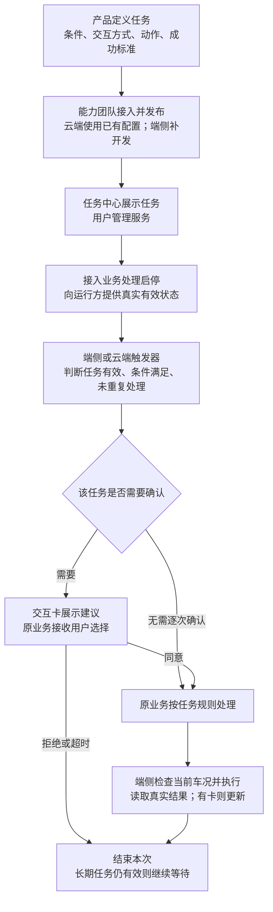
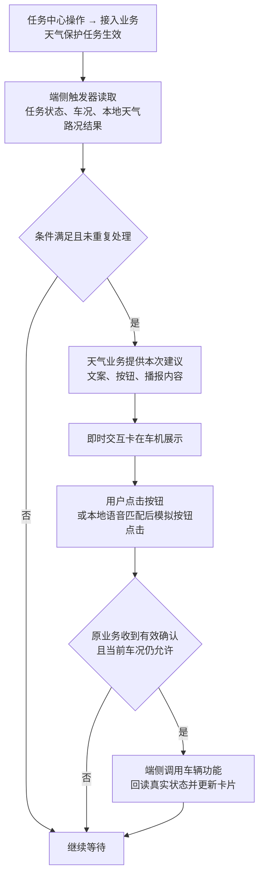
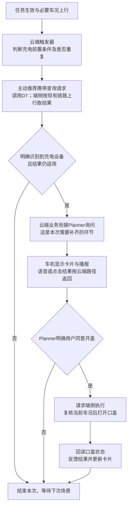

# 系统预设任务PRD

## 一、背景与价值

系统预设任务，是产品提前定义、用户不需要每次重新创建的主动服务。例如开启“天气路况保护”后，车辆在符合条件时主动询问是否调整驾驶模式。

目前四项任务已提出场景需求，但任务启停、触发后的交互和执行分工还没有完全接通。本次评审要统一一条业务链路：**任务怎么生效 → 什么时候触发 → 如何询问或直接处理 → 谁执行并反馈结果。**

- **对用户：**一次设置，持续获得场景服务；需要确认的车辆动作由用户决定。
- **对业务：**新增任务沿用同一套接入方式，减少每个场景重新讨论和遗漏。
- **对研发：**明确触发器、任务中心、交互卡和车辆能力的边界，知道各自需要补什么。

本稿评审产品逻辑和分工，不展开底层接口。下列流程是本次目标方案；尚未确定的接法集中列在第六节。

## 二、本期做哪些任务

- **天气/路况保护：**端侧判断；展示卡片并播报，用户确认后调整驾驶模式或后雾灯。
- **后排儿童/猫狗识别后开启儿童锁：**非P挡、识别条件满足且儿童锁未开时处理；按当前任务表不出卡、不播报。部署位置待确认。
- **后视镜自动加热：**覆盖原需求中的雨天、洗车结束、湿度温差三个场景；不出卡、不播报。先确认字节与赛力斯已有能力的分工，再确定运行位置。
- **识别充电设备后打开充电口盖：**云端触发后沿主动推荐与DT链路识别；补齐询问，用户确认后由端侧开盖。

具体条件沿用[系统预设任务全集](https://bytedance.larkoffice.com/wiki/SorvwQ413iamTRkzSxvcVPWtnYc?sheet=g4s4FB)及关联原始需求。本稿不扩展其他主动服务，也不新增“用户用自然语言创建任务”的完整任务系统。

## 三、整体业务框架

**这张图分三段看：**

1. **使用前接好任务。**产品给出场景条件、是否询问、确认后动作和成功标准；各模块确认能力并接入。云端已有部分配置，端侧当前仍需开发，统一端云配置不是已完成能力。
2. **用户决定服务是否运行。**任务中心负责展示和接收操作；接入业务真正启停，并把有效状态给触发器。开启服务不等于立即执行车辆动作。
3. **条件满足后完成一次处理。**触发器判断是否命中；原业务承接询问或静默执行；车辆实际完成动作后，业务记录结果。一次处理结束不等于关闭长期服务。

**配置需要表达什么：**任务名称与说明、触发条件、交互内容与方式、执行动作与结果标准。哪些可在平台配置、哪些需要开发，由能力评审确认；不要求本期重建一套通用编排平台。

## 四、端侧与云端怎么分别处理

### 4.1 为什么要分两条链路

- **端侧：**依靠车内已有状态和本地识别结果，就能决定如何处理。价值是响应及时、减少网络依赖。天气路况保护采用这条链路。
- **云端：**需要云端模型、工具或上下文进一步判断。价值是复用复杂判断和对话能力。充电设备识别沿现有主动推荐与DT链路处理。
- **共同点：**卡片都在车机显示，车辆动作都要由端侧执行。不能用“有模型就是云端”划分，本地视觉模型也能服务端侧；也不能按有网、没网随意切换两套业务。

### 4.2 端侧：天气路况保护

**用一次湿滑路况说明：**

1. 用户开启天气保护，接入业务使任务生效；此时不弹卡、不切换模式。
2. 本地识别到湿滑，触发器再检查车速大于30km/h、当前不是湿滑模式、任务仍有效，且本次场景未重复提醒。最终条件以天气需求会签为准。
3. 条件满足，天气业务请求展示：“当前路面湿滑，是否切换到湿滑模式？”并提供“确认/取消”按钮与播报内容。
4. 卡片真正展示后，用户点击确认；或说出支持的按钮表达，由**可见即可说**匹配到当前按钮，再由注册方模拟原按钮点击。它不是重新调用云端模型判断天气。
5. 天气业务收到本次确认，重新检查任务和车况，再调用赛力斯车辆能力；读取到模式已切换后，更新卡片结果。取消、超时或条件失效则不执行。

**触发器业务与卡片的交接：**业务提供“这次为什么问、问什么、有哪些按钮、播什么、回应交给谁”；卡片返回“是否展示、用户选了什么、是否关闭或超时”；业务决定动作并将实际结果返回卡片。卡片不承担天气条件判断和车辆控制策略。

### 4.3 云端：识别充电设备后开盖

**用一次低电量停车说明：**

1. 车辆停入P挡，电量19%，充电口盖关闭，任务和相关AI服务有效；云端触发器检查前置条件及本次是否已经处理。
2. 触发器向主动推荐提供当前场景和查询请求，例如：“帮我看一下有没有充电桩，如果有的话打开充电口。”沿现有主动推荐→DT→端侧上行取推理结果链路处理；**查询中的开盖意图不能替代本次用户确认。**
3. 明确有设备后，由云端业务衔接Planner，询问“是否打开充电口盖？”没有设备、无法判断或结果过期时，不继续开盖。
4. 按VUI静态Advisor接入方式，语音结合当前卡片进入Planner；点击按钮按约定模拟查询请求上云，由Planner承接。它与端侧“本地模拟按钮点击”不是同一条路。
5. 用户同意后下发执行请求；端侧再次确认仍在P挡、口盖未开、任务与本次判断仍有效，再执行。最后读取实际口盖状态，反馈结果。

**本次新增重点：**已有识别链路不能直接等同于“询问后执行”已接通。需要主动推荐、DT、Planner和VUI共同确认：识别结果如何转为询问、用户回应由谁接、确认后由谁下发开盖。图中采用“识别到设备后再问”的方案，待此次评审确认。

## 五、各模块需要做什么

- **产品与需求方：**王泽民汇总四项任务规则，需求方确认场景、条件、交互与动作；评审后统一一份结论。
- **任务中心与接入业务：**提供任务展示、操作入口、启停结果和真实有效状态。接入业务的研发承接方需要认领，不能默认任务中心包办执行。
- **触发器：**读取任务状态和场景数据，判断条件、避免重复触发，将本次处理交给对应业务。端侧和云端按各自已确定的任务范围实现。
- **即时交互卡与语音：**展示卡片、播报、接收回应；端侧接本地可见即可说，云端接约定的Planner路径。具体由谁注册按钮、谁接回调需确认。
- **主动推荐、DT与Planner：**承接云端场景判断、询问及用户回应，给端侧明确的处理请求。
- **赛力斯车辆能力与端侧执行：**提供车况和车控，执行前复核，返回真实结果。字节也有端侧模块，不能把“端侧”直接理解为“赛力斯负责”。

## 六、本次评审只确认这四件事

1. **任务怎么启停？**找晓伟和接入业务确认：当前《赛力斯任务中心 PRD》第一期仅明确支持删除，系统预设任务开关是否纳入本期、操作由谁接、真实状态怎样给触发器。
2. **两条交互怎么接？**找徐洋、触发器与云端业务确认：天气的卡片/播报/本地按钮注册，以及充电的“识别结果→询问→确认→执行”承接方。
3. **四项任务谁做、按什么规则做？**需求方和能力团队确认最终条件；重点解决儿童识别时效、后视镜已有能力与部署归属、天气重复提醒规则。未确认项不写成已支持。
4. **本期交付到哪里？**确认已具备与需新增能力、负责人、联调时间。先接通四项任务；统一端云配置作为后续能力，不混入本期完成承诺。

**共同验收底线：**任务关闭不再触发；拒绝或超时不执行；确认后车况不允许则终止；只有真实车辆状态达到目标才报成功。天气完整离线交互仍需联调验证，不提前承诺已可用。

## 参考资料

- [赛力斯任务中心 PRD｜本次搜索参考](https://bytedance.larkoffice.com/wiki/LUKKwMTNaiAd53kdmpkc5oILn5e)：采用其“背景目标→需求范围→交互策略”的表达方式；不将其任务中心范围照搬为本业务已具备能力。
- [9月1日需求评审记录](https://bytedance.larkoffice.com/docx/Zp90dGMheow4XmxwVXAcu2KGnTb)：系统预设任务讨论集中在01:35:10—02:14:49。
- [VUI主交互需求](https://bytedance.larkoffice.com/wiki/FBsrwA734iaFzZkrZExcHHBtn3d) / [可见即可说框架](https://bytedance.larkoffice.com/wiki/AxYjwUI8wiFCXWkdNsDcRae0nCf)：端云卡片及语音接入方式。
- [系统预设任务全集](https://bytedance.larkoffice.com/wiki/SorvwQ413iamTRkzSxvcVPWtnYc?sheet=g4s4FB) / [天气详细规则](https://bytedance.larkoffice.com/docx/Vm00dKhlYoSKNWxzJ51cH5WUniE)：逐项条件与原始需求入口。

精简前的完整内容已保存在本飞书文档的“精简前完整稿｜2026-09-07”版本中。
