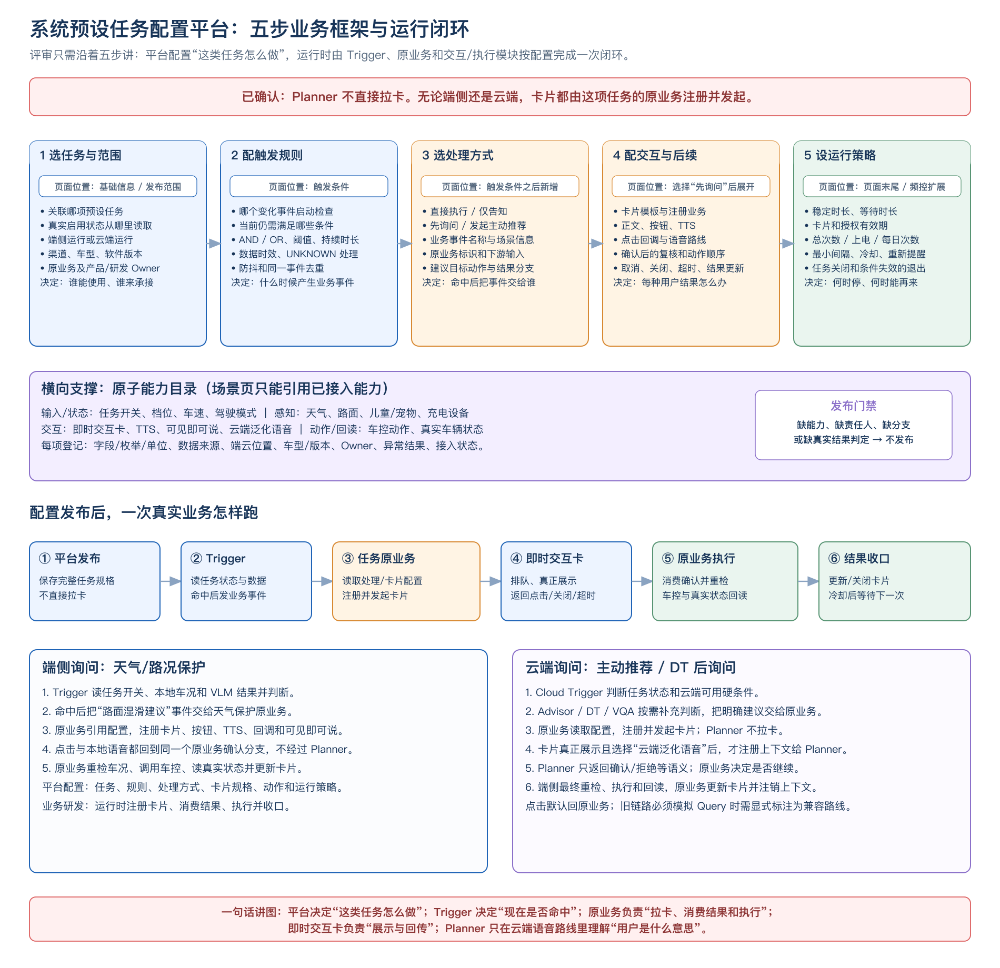
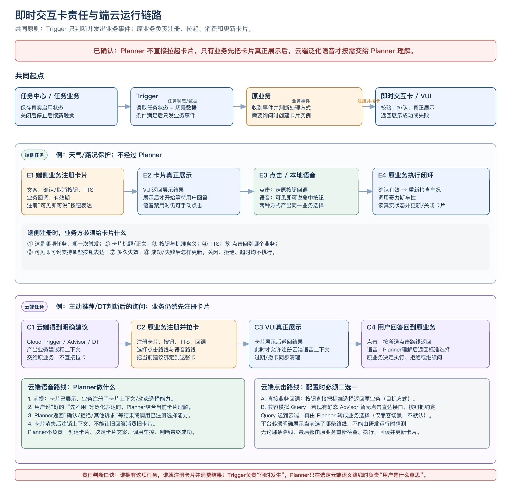
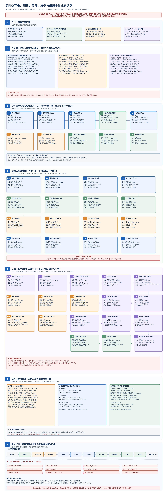

# PRD｜系统预设任务配置平台与即时交互卡对接

> 文档定位：《系统预设任务》第 3 章配置框架的评审补充。  
> 本文只定义产品配置、模块责任和业务分支；正式接口名、IDL 和错误码由技术专项确定。

## 1. 背景与要解决的问题

当前“触发器—场景管理—场景详情”页面已支持基础信息、发布范围、条件组、自定义回调以及次数/间隔。这些配置能表达“什么时候调一个下游”，但还不能完整表达一项系统预设任务：

- 这条规则属于哪项任务，任务当前是否真正生效；
- 条件命中后是直接执行、仅告知、先询问，还是发起主动推荐；
- 需要询问时，由谁注册卡片，卡片说什么，点击和语音结果回到哪个业务；
- 用户拒绝、关闭、超时，或执行失败时，本次处理如何结束；
- 什么时候允许再次提醒，什么情况下必须撤销旧询问。

因此，本期不是为四项任务各做一套专用链路，而是在现有场景详情页上补齐“任务关联与运行位置→命中后处理→卡片注册与交互→执行与结果→运行策略”五组通用能力。能力与组合方式已接入后，新任务通过更换条件、文案、业务承接方和动作复用。

## 2. 一句话讲清整体逻辑

> 配置平台把一项系统预设任务定义完整；Trigger 按配置判断“什么时候发生了什么事”；任务原业务收到事件后，负责注册卡片、消费用户选择、执行和收口。Planner 不直接拉起卡片，只在云端泛化语音路线被选中时，理解“用户这句话是确认还是拒绝”。

## 3. 配置平台要改哪里

### 3.1 保留并复用现有页面能力

| 现有页面区域 | 当前已有配置 | 在系统预设任务中的用途 |
| --- | --- | --- |
| 基础信息 | 场景名称、优先级 | 标识一条可运行的场景规则；场景优先级与卡片展示优先级分开管理。 |
| 发布范围 | 渠道、指定车辆、适用车型、软件版本 | 限制配置的生效范围，并筛选当前范围真正可用的原子能力。 |
| 触发条件 | 条件组、且/或、能力类型、信号、字段、运算符、值 | 表达“何种变化启动检查”和“当前还需满足什么条件”。 |
| 执行动作 | 自定义回调、回调地址、下游输入 | 作为 Trigger 把命中事件交给原业务的入口；不再默认等同于“直接执行车控”。 |
| 基础频控 | 总次数、上电周期次数、每日次数、最小间隔 | 控制重复命中频率；拒绝后冷却、卡片等待和结果过期由新增运行策略区管理。 |

### 3.2 在同一“场景详情页”新增五个配置区

| 新增配置区 | 谁填写 | 必须配置什么 | 配置保存后给谁 | 页面联动/发布门禁 |
| --- | --- | --- | --- | --- |
| 任务关联与运行位置 | 任务产品、触发器产品 | 关联系统预设任务；真实启用状态来源；端侧/云端；任务原业务/负责人 | 端侧 Trigger 或 Cloud Trigger | 未关联真实任务状态时禁止发布；任务关闭后停止新事件。 |
| 命中后的处理编排 | 触发器产品、原业务 | 直接执行/仅告知/先询问/主动推荐；业务事件、承接业务、目标动作、先后顺序 | 命中后要调用的原业务 | “先询问”自动展开卡片注册区；“仅告知”不得配车控分支。 |
| 卡片注册与交互 | 拥有该任务的原业务 | 卡片注册业务、业务场景标识、模板、文案、按钮含义、TTS、点击路线、语音路线、回调承接方、有效期 | 原业务、即时交互卡/VUI；选云端语音时才按需给 Planner 上下文 | 未选卡片注册业务、无回调、无取消/超时分支时禁止发布。 |
| 执行、结果与退出 | 原业务、车控/状态方 | 执行前复核条件；目标动作及顺序；真实成功状态；失败/未知分支；取消、关闭及任务关闭后的退出动作 | 原业务、端侧执行层、卡片结果更新 | 没有最终状态判定、没有失败分支或需确认却无复核时禁止发布。 |
| 运行策略 | 触发器产品、原业务 | 稳定时长、等待时长、失效条件、防抖、去重、最小间隔、次数上限、再次提醒条件、授权有效期 | Trigger 负责命中前策略；原业务负责出卡后的过期、执行和退出 | 同一事件只能处理一次；旧卡片、旧授权和过期识别结果不得继续执行。 |

平台与运行时必须分开理解：平台保存“这类任务应该怎样处理”的规格；发布后，Trigger 和原业务读取规格。卡片的实际注册、动态字段填充和展示调用发生在原业务运行时，不发生在 Planner，也不由配置平台直接执行。

### 3.3 单独新增“原子能力管理”，场景页只做引用

原子能力是可被多个任务重复选用的一项能力，例如“读取车速”“判断路面湿滑”“展示询问卡”“打开后雾灯”“读取真实后雾灯状态”。它不是一条完整任务，也不是一段随意填写的下游 JSON。

| 能力类型 | 例子 | 能力提供方要登记什么 | 场景配置时如何使用 |
| --- | --- | --- | --- |
| 输入/状态 | 任务开关、档位、车速、驾驶模式 | 字段、枚举/单位、数据来源、更新方式、适用车型/版本、端云位置 | 既可选作“变化事件”，也可选作“当前状态”；两者分开配置。 |
| 感知/识别 | 天气、路面、儿童/宠物、充电设备 | 可用枚举、无法判断/失败的返回、数据有效期、提供方 | 只有明确且未过期结果可进入后续；UNKNOWN/ERROR 不视为满足。 |
| 交互 | 即时卡、TTS、可见即可说、云端动态选择 | 调用方、输入、可用路线、结果类型、生命周期、提供方 | 选“先询问”后按端云位置筛选可用交互路线。 |
| 动作 | 切换模式、雾灯、儿童锁、加热、开口盖 | 允许状态、必填参数、目标状态、车型/版本、提供方 | 原业务在执行前复核，再调用已接入动作。 |
| 结果/回读 | 驾驶模式、灯、锁、加热、口盖真实状态 | 成功目标、等待时间、失败/未知表达、提供方 | 调用接口成功不等于车辆已完成；真实状态达到目标才判成功。 |

页面联动规则：先选渠道、车型、版本和端云位置，再展示可选原子能力。缺少选项时，页面应明确提示“缺少哪项能力、由谁接入”；下拉框未出现某个选项，不能直接得出“车辆或模型一定没有这项能力”的结论。

## 4. Trigger、原业务、即时交互卡和 Planner 的责任边界

### 4.1 即时交互卡全量责任与数据流（评审放大图）

上一张图用于先讲清模块边界；下图用于逐段评审完整实现范围。它依次展开：配置平台与运行时的分工、共同运行起点、端侧完整链路、云端完整链路、卡片输入/回传合同、状态与异常退出以及本次必须认领的责任。

| 模块 | 必须负责 | 不负责 |
| --- | --- | --- |
| Trigger | 读取任务有效状态和场景数据；判断规则、防抖、去重、频控；条件命中后把业务事件发给配置的原业务 | 不定义卡片文案；不拥有卡片生命周期；不直接将“命中”当作车控成功。 |
| 原业务 | 拥有当前任务；接收业务事件；注册并拉起卡片；消费用户选择；复核、执行、回读、更新/关闭卡片 | 不把用户确认权交给 Trigger 或卡片容器替业务决策。 |
| 即时交互卡/VUI | 校验请求、排队和真正展示；展示文案/按钮、播报 TTS；将点击、关闭、超时和生命周期结果返回配置的业务；接收最终结果更新 | 不判断天气、车速、档位；不决定是否执行车控；不以“按钮被点击”直接判定车控成功。 |
| 可见即可说 | 在端侧简单确认场景中，将当前可见按钮的语音表达匹配到按钮，模拟原按钮点击；关闭卡片后注销该能力 | 不做需要多轮语义推理的决策；不负责车控。 |
| Planner | 只在选中“云端泛化语音”路线时，结合已展示卡片的上下文理解用户回答，返回标准选择或调用原业务已注册的选择能力 | **不创建、不直接拉起、不持有卡片；不编写卡片文案；不直接车控；不判断最终执行成功。** |

## 5. 卡片注册配置的完整逻辑

### 5.1 原业务注册卡片时必须提供什么

1. **业务关联**：这是哪项预设任务、哪一次触发、由哪个原业务承接。目的是防止新旧询问串联。
2. **卡片内容**：模板、标题、正文、提示原因，以及需要展示的当前状态。
3. **按钮与标准含义**：例如“确认=CONFIRM”、“取消=REJECT”。按钮只表示用户选择，不把裸车控指令交给卡片执行。
4. **TTS**：是否播报、播什么、什么时机播报、卡片未真正展示时是否禁止播报。
5. **点击路线**：按钮结果直接回原业务，还是因当前旧链路限制使用“模拟 Query 回云端”的兼容路线。必须在配置中显式选择，不得运行时猜测。
6. **语音路线**：端侧简单按钮语义选“可见即可说”；需要云端泛化理解时，选“Planner + 当前卡片上下文”。
7. **回调与生命周期**：展示成功/失败、确认、拒绝、关闭、超时、撤销分别回到哪个业务；卡片和用户授权的有效期。
8. **结果更新**：执行中、成功、失败、暂无法确认时更新什么，是否自动关闭卡片。

### 5.2 端侧询问链路

1. 任务中心/任务业务保存真实启用状态，端侧 Trigger 能读到该状态。
2. Trigger 读取本地车况、感知结果和配置规则；任务有效、条件稳定、未重复处理时，发出业务事件。
3. 任务原业务收到事件，根据已配置内容注册并拉起即时交互卡；Trigger 不代替原业务持有卡片。
4. VUI 真正展示卡片后，开始等待用户选择。用户手动点击直接走原按钮回调；用户说“确认”等表达时，可见即可说将其匹配为同一按钮点击。
5. 原业务拿到标准选择后，确认结果必须再次检查任务未关闭、卡片未过期、当前车况仍允许，再调用车控。
6. 原业务读取真实车辆状态，更新卡片为成功、失败或暂无法确认，再结束本次。拒绝、关闭或超时时不执行。

### 5.3 云端询问链路

1. Cloud Trigger 判断硬条件；若需要 Advisor、DT 或端侧视觉，在当前业务事件中完成判断。
2. 云端得到明确且未过期的建议后，把建议和上下文交给任务原业务。Advisor/Planner 不因为产出了建议就直接拉卡。
3. 原业务根据平台配置注册卡片、按钮、TTS、回调、点击路线和语音路线，并将当前建议绑定到这张卡。
4. 卡片真正展示后，若配置了云端语音路线，原业务/交互链路才把当前卡片上下文和已注册选择能力交给 Planner。
5. 用户说“好的”“先不用”等泛化表达时，Planner 结合当前卡片理解并返回标准选择；用户点击时按配置的直接回调或兼容模拟 Query 路线返回。
6. 原业务收到结果后做最终决定。明确确认才下发端侧；端侧重新检查最新车况并执行；真实状态回读后，由原业务更新卡片。
7. 卡片关闭、过期或被替换后，同步注销云端卡片上下文/动态选择能力，避免后续语音误触发旧卡片。

## 6. 完整案例：天气/路况保护怎样在平台上配置并运行

### 6.1 平台配置

| 页面区域 | 本案例填写内容 | 为什么要填 |
| --- | --- | --- |
| 基础信息/范围 | 场景名称=天气路况保护-湿滑模式；选定渠道、车型和软件版本 | 决定规则的识别名称和生效范围。 |
| 任务关联 | 关联“天气/路况保护”；真实任务状态=已启用；运行位置=端侧；原业务=天气保护任务业务 | 任务关闭时 Trigger 必须停止新事件；同时确定谁收事件和谁注册卡片。 |
| 触发事件 | 天气变为下雨，或路面变为湿滑 | 变化事件用于启动一次检查，不代表所有条件已满足。 |
| 当前条件 | 任务有效 AND（当前下雨 OR 当前路面湿滑）AND 车速>30 km/h AND 当前不是湿滑模式 | 只有检查时所有当前条件仍成立，才产生候选事件。 |
| 命中处理 | 处理方式=先询问；业务事件=路面湿滑建议；承接方=天气保护原业务 | Trigger 只把命中结果交给原业务，不直接创建卡片或车控。 |
| 卡片注册 | 注册方=天气保护原业务；正文=“当前路面湿滑，是否切换湿滑模式？”；按钮=确认/取消；TTS=同询问文案；语音路线=可见即可说；点击路线=原业务回调 | 这是卡片业务的责任。Planner 不拉卡；端侧简单确认不需要 Planner。 |
| 确认后动作 | 复核任务有效、卡片未过期、车速>30、仍湿滑、尚未进入湿滑模式；通过后调用切换湿滑模式 | 用户回答和车控执行存在时间差，必须以最新车况作最后安全门禁。 |
| 结果/退出 | 读取真实驾驶模式；达到湿滑才显示成功；取消/关闭/超时不执行；卡片过期或任务关闭时撤卡；进入冷却后等待下次 | 确保“询问、授权、执行、真实结果”是同一次有效处理。 |

### 6.2 运行时逐步发生什么

1. 用户已在任务中心开启“天气/路况保护”，原业务保存真实启用状态，端侧 Trigger 读到它。
2. 路面识别从“非湿滑”变成“湿滑”，唤醒 Trigger 做一次当前状态检查。
3. Trigger 检查任务开启、车速 46 km/h、当前仍湿滑、驾驶模式不是湿滑，并检查本次路况变化还没有被处理。
4. 全部通过后，Trigger 发出“路面湿滑建议”业务事件给天气保护原业务。此时还没有卡片，也没有执行车控。
5. 原业务用已会签的文案、按钮、TTS、回调和有效期注册卡片，调用即时交互卡展示。
6. 卡片真正展示后播报 TTS，并注册当前“确认/取消”的可见即可说表达。
7. 用户点“确认”，或说“好的，切吧”，都转成这张卡的同一个确认选择，并回到天气保护原业务。
8. 原业务再次读取最新任务和车况。若任务已关闭、卡片已过期、道路已不湿滑或已切换模式，则不再执行。
9. 复核通过后，原业务调用车控切换湿滑模式，然后读取真实驾驶模式。
10. 真实状态已是湿滑模式才更新卡片为成功；否则显示失败或暂无法确认，结束本次并进入配置的冷却。

## 7. 发布校验与验收

### 7.1 发布前强制校验

- 任务没有关联真实启用状态，或未选原业务：不允许发布。
- 处理方式为“先询问”，但原业务未注册卡片、未绑定回调或无取消/超时分支：不允许发布。
- 选择“可见即可说”但没有按钮和按钮表达：不允许发布。
- 选择“Planner 泛化语音”但没有卡片上下文注册与销毁方案：不允许发布。
- 配置了车辆动作，但没有执行前复核或真实状态回读：不允许发布。
- 原子能力不支持当前渠道、车型、版本或端云位置：不允许发布，并定位到缺少的能力。

### 7.2 必验业务场景

1. 任务关闭时，即使天气和车况条件满足，Trigger 也不产生新事件。
2. Trigger 产生事件后，必须能找到配置的原业务；无承接方时不得“自己拉卡”。
3. 卡片还在排队、展示失败或已过期时，用户说“好的”不能执行旧任务。
4. 端侧点击确认和可见即可说确认进入同一原业务分支；可见即可说不经过 Planner。
5. 云端卡片不能由 Planner 直接拉起；先有业务注册与展示，再按需注册卡片上下文给 Planner。
6. 用户确认后车况发生变化时，原业务必须停止执行，并更新或关闭卡片。
7. 车控调用返回成功，但真实车辆状态未达到目标时，不得展示“执行成功”。
8. 卡片关闭或过期后，端侧按钮表达和云端卡片上下文都被注销。

## 8. 评审需要当场拍板的问题

| 问题 | 建议方案 | 需要回答的业务方 |
| --- | --- | --- |
| 四项任务分别由哪个原业务注册卡片并消费结果？ | 谁拥有任务和最终执行结果，谁承担卡片注册责任；Trigger 不作为默认卡片业务。 | 各任务业务产品/研发、触发器、即时卡 |
| 系统预设任务是否共建一个通用“卡片注册业务”？ | 优先共建注册/生命周期能力，但每项任务仍须有明确业务责任人，不得回到 Trigger 自行承接。 | 系统预设任务框架方、即时卡、各原业务 |
| 云端按钮点击的目标路线是直达原业务，还是兼容模拟 Query？ | 新链路以直接业务回调为目标；现有静态 Advisor 无直达能力时才显式选兼容路线。 | 即时卡、云端主动推荐/Advisor、Planner、原业务 |
| 卡片注册是全量在平台填写，还是平台选模板、业务运行时补动态内容？ | 平台管理模板、固定文案、按钮含义、路由和生命周期；运行时只补经会签允许的动态内容。 | 配置平台、即时卡、各原业务 |
| 端侧任务本期是否能直接通过云端平台发布？ | 本期文档先统一配置模型和验收；端侧当前仍按需求开发/随车发版。统一下发属于后续能力，不在本次冒充已支持。 | 触发器、端侧 Runtime/发版、配置平台 |

## 9. 评审结论标准

评审结束时，所有参与方应能一致回答：

1. 现有页面保留什么，本期新增哪四个配置区。
2. 一项能力为什么在原子能力页登记，在场景详情页引用。
3. Trigger 为什么只产生业务事件，原业务为什么必须负责卡片。
4. 端侧点击/可见即可说如何回原业务，为什么不需要 Planner。
5. 云端卡片是谁注册的，Planner 什么时候才介入，卡片消失后如何注销上下文。
6. 用户确认后为什么还要复核，为什么最终成功必须看真实车辆状态。
