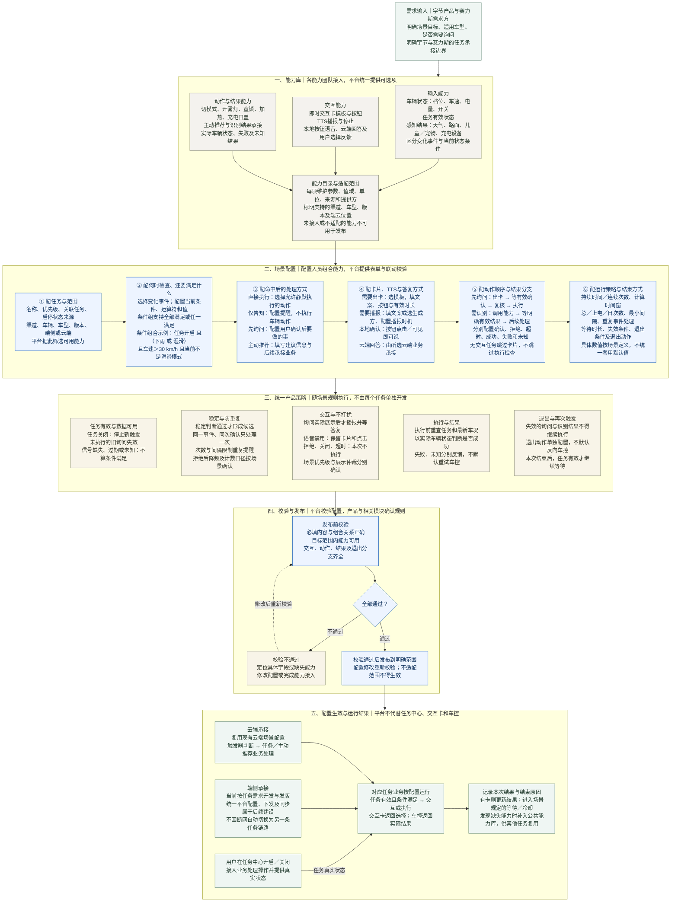

# 系统预设任务：配置平台业务框架

[飞书 PRD 第 3 章：配置平台业务框架](https://bytedance.larkoffice.com/wiki/R1OLwyfpTijHw7kQtnbcoZB4nff#YyoZdEVfDospsExhCL9c6wM7nxg)

配置人员在平台组合已接入能力，定义完整任务；平台负责配置校验与发布，端侧或云端业务按规则运行。卡片展示、语音交互及车控执行由对应能力模块承接。

下图表达本需求的建设方案，不代表所有配置能力均已上线。端云承接边界与待确认的策略口径在图中分别标明。

## 框架图

## 评审时沿着图讲

### 开场：先说明这张图解决什么

“这次我们要补的是完整的任务配置能力。原来能配置部分条件和动作，但像‘条件满足后先问用户，用户确认后再执行，拒绝或者超时就结束’，还需要把中间的交互和分支接起来。这张图从能力接入一直讲到运行结果，大家重点看自己的模块要提供什么，以及平台能不能把这些能力组合起来。”

### 指第一层：能力库——平台里为什么能选到这些内容

“配置页的选项要有真实能力支撑。比如配置车速大于 30，先要有车速信号、单位和值域；配置打开后雾灯，先要有动作能力和实际状态反馈。这一层请信号、感知、交互和车控团队分别确认能提供哪些能力、支持哪些车型和端云位置。没有接好的能力，不能只在页面放一个选项就算支持了。”

### 指第二层：场景配置——配置人员具体填写什么

“第一步，选任务和适用范围，平台据此展示可用能力。第二步，分开配置‘什么变化会让系统检查一次’和‘检查时还要满足什么条件’，并支持全部满足、任一满足的组合。第三步，确定命中后是直接做、只提醒、先询问，还是交给主动推荐进一步判断。”

“第四步，如果需要问用户，就补齐卡片、按钮、播报和回答方式；如果不需要交互，就不强制填写这些内容。第五步，把前后顺序和结果分支配完整。比如先询问的任务，必须等到有效确认才能进入执行，不能把出卡和车控配成同时发生。第六步，配置次数、间隔、等待和退出规则。这六步组合起来，才是一项完整任务。”

### 指第三层：产品策略——什么情况下不能继续

“这些策略需要公共框架统一支持，但各场景可以填写不同参数。任务关闭、数据失效就不能新触发；同一次事件不能反复提醒；询问排队不代表用户已经看见，不能提前计算用户回答超时；用户拒绝、关闭或者超时，本次都不执行。确认后也要重查车况，最后看真实车辆状态，而不是接口说收到了就报成功。”

“这里请触发器和交互产品重点确认次数怎么算、拒绝后是否降频、场景优先级怎样与展示优先级配合。没有定下来的数值不先写死。退出也不等于自动反向操作车辆，需要单独定义。”

### 指第四层：校验发布——配置完整不等于可以直接生效

“平台要检查必填内容、能力适配和前后分支。比如选择先询问，却没有确认后动作，或者配置了车型不支持的信号，都需要明确指出错误并阻止发布。修正后重新校验，通过后才发布到指定范围。这部分请平台研发确认校验和错误提示怎样落到配置页面。”

### 指第五层：运行承接——谁负责真正完成任务

“平台负责把任务定义清楚，不负责自己显示车机卡片或者直接控制车辆。任务中心接收用户操作，接入业务提供真实启停状态；触发器读取状态并判断条件；交互模块展示、播报和收集选择；执行业务调用车控并确认实际结果。”

“端云也要分开。云端复用当前场景配置承接已经支持的能力；端侧当前按需求开发与发版，统一配置和下发同步属于后续建设。这次不能把目标框架当作已经全部可用，请两侧研发分别认领缺口。”

### 收尾：请各方给出明确结论

“这次希望确认三项结果：第一，配置平台需要补哪些配置项和分支能力；第二，各能力团队提供哪些可复用能力以及适配范围；第三，次数、有效期、退出和结果处理采用什么规则。确认后用四项预设任务逐条验证，检查能否通过组合完成，不再为每个场景重新做一套流程。”
