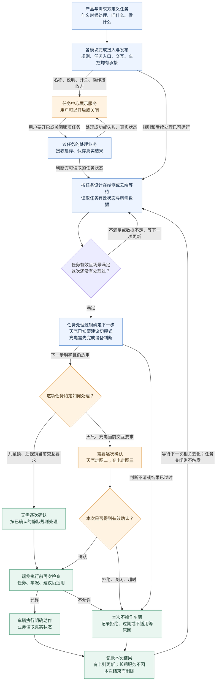
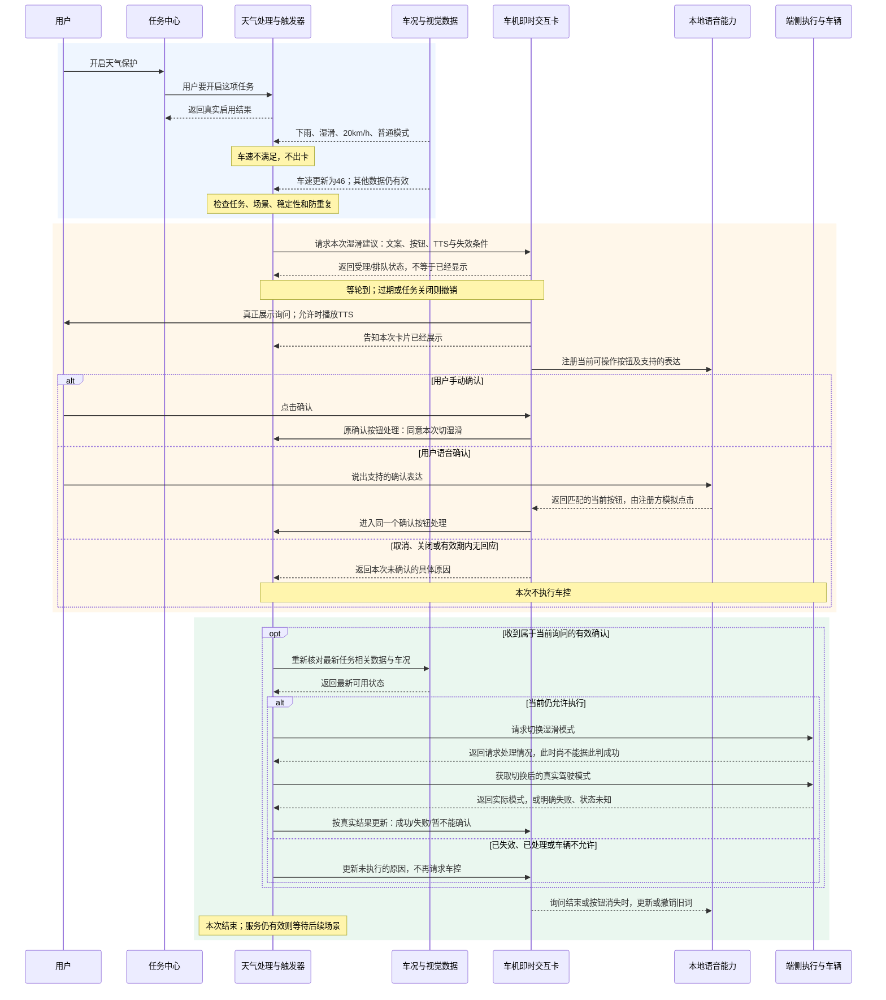
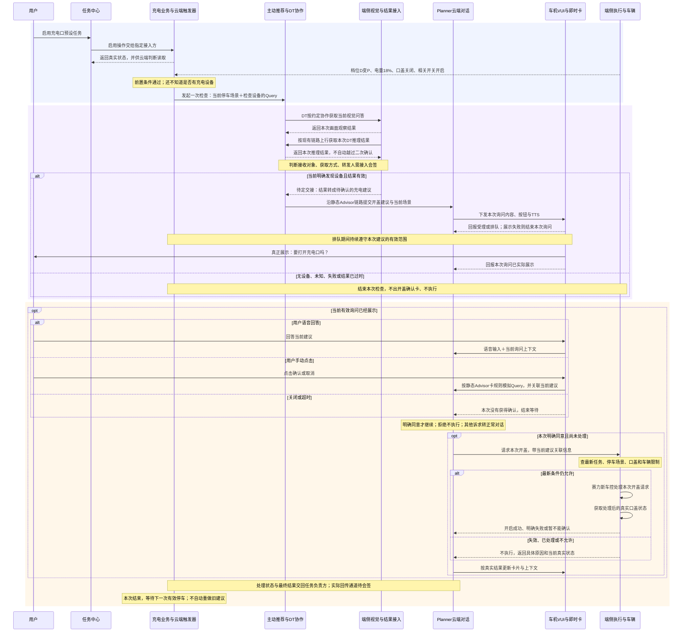

# PRD｜系统预设任务：三张业务图详解与逐步用例

> 版本：V11 · 业务流程专项评审稿｜日期：2026-09-07  
> 产品：王泽民｜本稿与 V10 配套，重新编写三张图的业务说明，不覆盖旧稿。  
> **本稿的详细，是把每一步的输入、判断、交接和用户结果展开，不是增加接口字段。**

## 1. 总览：这次到底要评什么

系统预设任务，是产品提前定义好的一项长期服务。用户不用每次说“如果下雨就提醒我”；启用服务后，系统自己等待合适场景，按这项任务约定，直接处理或先询问，再执行并反馈结果。

本稿回答三个问题：**任务如何从产品需求变成可运行的服务；天气任务在本地怎样问完再执行；充电任务怎样让云端参与判断和对话。** 三张图不是三套互不相关的系统：图一是共同框架，图二、图三是把具体任务放进去后的两种走法。

### 阅读顺序

1. [图一：先把一项任务从定义、启用到完成讲清楚](#framework)。先看场景和需求表，再看图，最后看启停用例。
2. [图二：天气路况保护怎样在端侧闭环](#edge)。重点看“下雨但车速不够→后来车速满足→出卡→确认→真实模式变化”。
3. [图三：充电口盖怎样走云端协作](#cloud)。重点看“值得检查→发现设备→用户同意→车辆允许→实际开盖”，五个结论不能互相代替。
4. [评审时各方要确认什么、你交付什么](#review)。带着用例要求各模块认领交接，不问一句“支持吗”就结束。

### 文中结论如何区分

| 标记 | 含义 | 评审时应该怎样说 |
|---|---|---|
| 来源要求 | 当前读到的任务表、正式文档或逐字稿写明了该要求 | “原需求要求这样做。”不说成“已经上线” |
| 本版方案 | 为了补齐链路，这次提出的产品行为 | “我建议按这个行为验收，请大家确认能否承接。” |
| 待确认 | 原文有冲突、缺少规则或缺少承接人 | “这一点今天需要明确；没明确前不能按已完成排期。” |
| 示例 | 用来走流程的时间、车况和文案 | “假设此时车速46、电量18%……”不是实际日志或新增指标 |

**统一约定：** 本稿中“等待超时后不执行、旧建议不能执行、执行前再检查、真实状态确认结果”等完整保护行为，是提交评审的产品要求；不能因为写进了图，就视为现有研发已经支持。参数、技术接法和实际交付情况仍需会签。

## 2. 协作对象：不把业务职责误写成已经指定的研发

| 对象 | 本次请他重点确认什么 |
|---|---|
| 王泽民：Trigger/系统预设任务产品 | 任务规则、模块交接、用户体验、异常与验收；记录各方确认结果 |
| 郝晓伟及任务中心团队 | 任务怎么接入；启停操作给谁；真实状态如何回来；本地任务是否可离线管理 |
| 韩杰、汪帅及触发器/端侧研发 | 哪些能力已有；谁承接天气命中后的卡片、回应与执行；云端配置和端侧开发的边界 |
| 徐洋及即时交互卡/VUI团队 | 天气采用哪类卡片；充电采用哪类卡片；显示、排队、点击、关闭、结果更新如何衔接 |
| 语音团队与卡片接入研发 | 本地按钮词由谁提供和注册；哪些表达可以匹配；词条何时失效；禁语音怎样降级 |
| 主动推荐、Planner、DT和视觉团队 | 充电判断结果怎么返回；由谁接着发起询问；点击和语音如何关联当前建议 |
| 赛力斯需求方与车控团队 | 车型适用性、真实信号、动作限制、车控结果、恢复策略和验收任务集 |

天气、儿童锁、后视镜、充电口盖在当前任务表中的需求联系人分别为张景波、许圣义、樊鹏宇、刘多。这是需求对齐联系人，不等于已经认领全部研发工作。[任务全集][S2]

## 3. 背景：为什么原来的图看着完整，却仍然讲不清

原图主要有四个问题：

1. **用“大区域”之间的箭头代替实际交接。**“运行→交互”没有说清是谁把什么交给谁。
2. **把不同时刻的判断写成同一句话。**“满足条件”可能指允许出建议、允许执行、或者已经成功，这三件事实际不同。
3. **用“原业务”代替具体责任。** 读者不知道这里指天气处理逻辑、充电推荐逻辑，还是卡片模块。
4. **没有把流程图落到用户可见结果。** 卡片申请成功、卡片真正出现、用户点了确认、车辆实际改变，被挤在一条箭头里。

9月1日评审中，01:57:26—01:57:41说明端侧当时仍由研发实现，统一平台端云同步是长期方向；02:08—02:11进一步追问TTS、二次确认等配置能力是否完整。02:11:29要求专项看“支持哪些链路、怎样运行、还差哪些”。所以本次不是再读四行触发条件，而是拿真实任务验证完整业务能力。[评审逐字稿][S1]

## 4. 目标与验收方法

### 4.1 用户目标

- 用户能理解：打开任务，是允许服务等待场景，不是立即执行车控。
- 需要确认的任务，用户知道系统在建议哪一个动作，拒绝或不回应不会执行该动作。
- 用户看到的结果与真实车况一致，不把“正在尝试”说成“已经完成”。

### 4.2 本次评审的可检查目标

本次评审结束前，为三条链路中的每个交接，记录 **提供方、接收方、交接内容、是否支持、缺口、负责人、下一次确认时间**。后两项由参会者现场认领，不在本稿中虚构排期。

进入联合验收前，必须把文中的关键正常、拒绝、过期、车况变化、状态未知用例转成可复现测试；每个用例同时检查业务记录、车机界面和真实车辆状态。只展示一张卡或返回一次调用成功，不算全链路通过。

## 5. 用户与本次范围

服务对象是使用这些预设服务的车主，解决“场景发生时还要自己发现、自己找功能”的问题。本稿的三个场景是：管理系统预设任务、本地天气询问、云端充电询问。

| 当前四项任务 | 图一中选择哪种交互 | 本稿如何处理 |
|---|---|---|
| 天气/路况保护 | 先询问，确认后执行；卡片+TTS | 图二完整展开本地链路 |
| 后排儿童/宠物识别后开儿童锁 | 无卡、无TTS、静默执行 | 图一用静默分支说明；不把部署位置和承接方擅自定死 |
| 后视镜自动加热 | 无卡、无TTS、静默执行 | 图一说明该分支；具体条件和退出仍需需求方会签 |
| 识别充电设备后打开充电口盖 | 先询问，确认后执行；卡片+TTS | 图三按本次云端协作方案展开 |

上表的交互方式来自修订号206的“系统预设任务全集”，也与会议02:04:21纠正后的口径一致。不能再把儿童锁、后视镜一律画成出卡，也不能把“静默”理解成“必定放端侧”。宠物模式不在本稿范围。[S1]、[S2]

## 6. 价值：为什么需要框架，为什么分端侧和云端

**统一的是业务要求，不是强迫所有任务走同一条技术路径。** 每项任务都要写清启停、条件、后续处理、反馈和验收；这样新增任务时，团队可以复用已有判断、卡片和执行能力，缺什么补什么，不用每次从头争论谁负责下一步。

**端侧的价值：** 所需信息在车上、规则明确、后续只需固定按钮确认时，可以在车上完成判断和交互。天气任务不必为了“确认切湿滑”绕到云端理解一次。是否完整离线可用还要把任务启停、识别、卡片、语音、车控逐段验通，不能只因规则放端侧就承诺全部离线可用。[S3]、[S4]、[S6]

**云端的价值：** 硬条件还不能决定最终动作、需要继续调用模型或工具、或者需要结合上下文理解回答时，让云端业务继续处理。充电任务中，低电量且停车只说明值得检查，不等于附近已经有可识别设备；后续观察和对话需要接起来。但车机界面仍在车上显示，车辆动作仍在车上执行。

**两个维度必须分开：**“端侧/云端”说的是处理在哪里；“字节/赛力斯”说的是谁交付这部分能力。不是端侧全归赛力斯，也不是带卡片就一定归云端。Planner与Director在这些资料中是同一决策职能的不同称呼，本稿只写Planner，不画成两级串行模块。

## 7. 产品方案：三张图分别说明一个完整问题

### 7.1 图一｜一项系统预设任务，如何从需求变成用户能使用的服务

#### 7.1.1 典型场景与需求说明

**典型场景：** 产品已经定义“天气/路况保护”。用户在任务中心看到它，打开后车辆没有任何动作；稍后驶入雨区，条件满足才出现询问。完成这次操作后，这项服务仍然保留，下一次不必重新创建。

| 说明项 | 具体业务要求 |
|---|---|
| 场景定义 | 产品事先定义、用户启用后持续等待条件的服务，不是由用户每次临时创建 |
| 前置条件 | 目标车型支持相关功能；数据、判断、交互和执行的接收方已接通；没有能力时不能仅展示一个可开启但无效的任务 |
| 用户输入 | 在任务中心开启/关闭某项任务；默认开启的任务应恢复其有效设置，而不是要求用户每次重开 |
| 产品输入 | 名称、说明、车型、默认状态、判断时机、条件、后续动作、交互方式、失败和退出行为 |
| 判断结果 | 运行方确认任务有效，再判断场景是否满足。开关有效只是其中一个前提 |
| 输出 | 不满足则继续等；满足后按任务约定静默处理或询问；最后区分未执行、执行成功、失败、暂不能确认 |
| 用户可见结果 | 任务中心体现整项服务状态；即时交互卡体现某一次建议及结果；车辆功能体现实际执行结果 |

这里有 **三个不同的状态**：

| 状态对象 | 天气例子 | 谁负责判断 |
|---|---|---|
| 整项任务是否启用 | “天气保护：开启” | 接收启停的天气业务维护；任务中心展示 |
| 这次建议处理到哪里 | “正等待用户确认是否切湿滑” | 天气任务处理逻辑维护；卡片反馈展示和选择 |
| 车辆当前是什么状态 | “驾驶模式：普通/湿滑” | 赛力斯提供真实状态，业务据此确认结果 |

因此，“取消这次湿滑建议”不等于“关闭天气保护”；“关闭天气保护”也不自动等于“把车辆切回普通模式”。若要恢复车辆功能，必须另写恢复规则。

#### 7.1.2 业务框架图

图一只表达五件事：**产品定义 → 用户启用 → 系统等条件 → 按约定处理 → 反馈本次结果。** 箭头连到实际承接节点，不再让整个大框充当接收人。

[单独放大图一](</Users/bytedance/Desktop/3.23/产品/1-原始素材/资料数据PRD原件/触发器包含条件/系统预设任务三图详解-v11-图/01-业务框架.svg>)

**读图注意：**“充电需先完成设备判断”在图一只是一个业务步骤，图三会展开其中的云端和端侧协作。“等待”是逻辑状态，不要求研发用不断轮询的方式实现。图中不把任务中心画成查询天气或调用模型的模块。

#### 7.1.3 按节点解释：为什么需要这一步，谁接着做

| 图中节点 | 谁、在哪里做 | 收到什么、怎样判断 | 输出给谁；天气具体例子 |
|---|---|---|---|
| 产品定义任务 | 王泽民与赛力斯需求方，需求文档中 | 确认场景是否需要、哪些车型允许、是否询问 | 各模块拿到完整任务规格；“湿滑时建议切模式，用户确认才切” |
| 完成接入与发布 | 平台、端侧、云端、卡片和车控研发各自实现 | 确认每项输入和后续能力实际可接；缺能力先补齐 | 任务中心有展示资料，运行方有规则和处理方式；不是把同一张表直接丢给所有模块 |
| 任务中心展示 | 任务中心客户端与接入能力 | 展示业务提交的名称、说明和支持的操作 | 用户看见“天气保护”；看到开关不代表天气判断已发生 |
| 任务业务接收启停 | 该任务指定承接方；具体研发需认领 | 这是谁的哪项任务、想开还是关；处理成功了吗 | 把真实状态给任务中心和判断方。不能只改变开关颜色 |
| 等待并读取数据 | 天气在本地；充电按云端设计 | 是否启用；需要的车况、识别等信息是否可用 | 交给对应Trigger检查；数据未知不能凭空补成“满足” |
| 判断场景 | Trigger负责规则计算 | 逐条看条件及防重复，不把更新消息本身当命中 | 输出“本次湿滑建议可以开始”，不是输出“用户同意了” |
| 确定下一步 | 该任务的后续处理逻辑 | 天气按规则选择目标；充电先补充设备判断 | 给交互方的是明确建议；识别不明就结束本次，不编一个建议 |
| 选择交互 | 依产品事先定义的任务策略 | 本任务是静默还是需要确认，不由运行时随意决定 | 儿童锁/后视镜按静默；天气/充电要询问 |
| 获得确认 | 本地卡片与语音，或云端对话 | 确认是否属于当前这次有效建议；拒绝不执行 | 把明确选择交给执行前的业务校验，不把任意一句“好的”用于旧卡 |
| 执行前检查 | 任务处理逻辑与端侧执行层 | 任务没关、车况仍允许、动作未重复、建议未失效 | 通过才请求车辆动作；不通过说明终止原因 |
| 车控与状态读取 | 赛力斯车控和状态提供方，车辆端 | 执行请求后是否真的到达目标 | 把“模式实际为湿滑”交给天气业务，不只交“请求收到” |
| 记录与继续等 | 任务业务；有卡时更新界面 | 本次未执行/成功/失败/暂不能确认 | 本次结束，整项任务仍有效就继续等待；重复提醒仍受防打扰规则约束 |

**“任务处理业务”不是要求新建一个叫这个名字的系统。** 天气的卡片和执行处理可由现有Trigger执行框架或接入模块承接；要由研发认领。充电后续则有主动推荐、模型和对话协作。产品要把职责补全，但不替研发决定代码放在哪个服务。

#### 7.1.4 配置平台到底要接住哪些产品定义

| 配置/开发输入 | 要写到可操作的程度 | 交给谁使用 |
|---|---|---|
| 任务展示 | 名称、说明、图标、开关、默认状态、不可用提示 | 任务中心及其接入方 |
| 条件定义 | 哪个变化开始检查；读哪些状态；并且/或者；阈值；不知道时怎样 | 对应端侧或云端Trigger |
| 命中后处理 | 本地发卡、静默执行，还是通知主动推荐；不能统称“执行动作” | 任务后续处理方 |
| 交互定义 | 固定文案或云端生成；按钮含义；TTS；允许哪种回应；有效范围 | 卡片/VUI、语音或Planner |
| 选择后的处理 | 确认再检查后做什么；拒绝、超时和任务关闭时停止什么 | 天气执行逻辑或云端编排 |
| 结果与重复策略 | 什么算成功；未知怎样表现；同次不重复；下次何时允许 | 任务业务、车控接入、测试 |

当时平台只能配置已有的一部分云端能力，端侧仍有研发开发。**本稿要求“产品定义完整”，不承诺“你现在打开后台就能填完全部”。** 哪些做成配置项、哪些先由代码承接，必须让研发逐项答复。[S1]

#### 7.1.5 Use Case：任务开启、关闭和恢复

以下表格采用截图的“场景/输入—各方处理—用户结果”结构。步骤数字表示同一个用例的先后，不是新模块编号。

| 用例与用户输入 | 任务业务与Trigger做什么 | 任务中心/HMI做什么 | 车辆结果与验收 |
|---|---|---|---|
| **管理用例1：开启成功，但此时晴天**。用户点击天气保护“开启”；当前车速0、晴天、普通模式 | ①接收天气任务的启用操作。②保存成功后，提供有效状态给本地判断。③读取车况，发现场景不满足。④继续等待，不请求出卡 | ①转发启用意图。②等业务结果后展示真实开启状态；等待过程的样式由HMI确认。③不显示“已切换湿滑” | 驾驶模式不变；没有询问卡、TTS、车控请求。任务开启不等于执行 |
| **管理用例2：开启操作失败**。例如业务暂时不可用 | ①未完成启用就不能向Trigger提供成功状态。②回传失败及原因。③恢复后再同步真实状态，不把丢失响应当成功 | 告知开启未成功或状态待确认；不能只把开关置为开就不再核对 | 不能因为这次失败操作产生新的任务执行。若此前状态不明，按未知处理，不能伪称已关闭或已开启 |
| **管理用例3：关闭成功，尚未出建议** | ①接收关闭。②停止新的触发。③向判断方提供关闭状态。④回传真实结果 | 显示关闭 | 即使随后下雨、车速46，也不出新天气建议；不能顺便把已有驾驶模式切回普通 |
| **管理用例4：卡片已在排队或展示，用户关闭任务** | ①关闭生效后停止该次未执行建议。②通知卡片接入方撤销/使其失效。③晚到的旧确认不再执行 | 任务中心显示关闭；卡片撤销或提示已失效；旧按钮词随之失效 | 不发出新的切换请求。若车控已经发出，则继续查真实结果，不承诺把已发生动作“撤回” |
| **管理用例5：车机重新启动**。上次用户已关闭天气保护 | ①恢复已保存的任务选择。②拿到关闭状态后保持不触发。③无法确认状态时先不发起动作 | 按真实恢复结果展示；异常时说明状态未确认 | 不因“这次没收到关闭事件”就恢复默认开启。首次默认与后续记忆不是一回事 |
| **管理用例6：删除任务** | 原任务中心文档区分删除展示和取消执行。**本版建议** 预设服务的删除应同时阻止后续执行；是否这样设计、能否找回需会签 | 不能在未说明后果时只移除卡片；需明确删除文案及找回入口 | 验证界面移除后后台行为符合已会签语义；此用例不能在会签前标记通过 |

来源与边界：任务中心负责转发操作，接入业务维护真实状态，是原文职责；具体天气/充电操作承接人、同步方式、等待UI和预设删除策略仍需本期明确。[任务中心PRD][S6]

#### 7.1.6 这张图在评审会上怎么讲

> “我先把整条链路分成两个时间段。第一个是用户使用之前，我们先把任务定义、任务中心入口、触发条件、卡片和执行接好。第二个才是用户使用时：用户打开任务，业务保存开启状态，Trigger开始等条件；不是用户一开就执行。
>
> 条件满足以后，还要看这个任务怎么约定。天气和充电需要问用户，儿童锁和后视镜当前是不出卡、不播TTS。需要问的任务只有拿到这一次的有效确认，才能继续。最后还要看车上是否真的执行成功。
>
> 这张图请大家重点看交接有没有人接，尤其是任务中心操作由谁接、状态由谁给Trigger、条件命中后谁继续处理。它不是要新增一堆系统，也不是今天把所有后台配置都承诺出来。”

### 7.2 图二｜天气路况保护：本地判断，本地询问，本地承接确认

#### 7.2.1 典型场景与需求说明

**典型场景：** 天气保护已开启。车开进雨区时速度只有20km/h，因此没有提醒；后来加速到46km/h，当前仍是普通模式，才出现“是否切换湿滑模式”的卡片。用户点击确认，或说出这张卡支持的确认表达，车辆才尝试切换。

| 说明项 | 本次天气例子的要求 |
|---|---|
| 用户价值 | 用户不必自己找驾驶模式入口；系统在合适场景提出明确建议，但不代替驾驶员判断 |
| 场景范围 | 本节主例是“雨天/湿滑建议”；雾天、雪天是不同子场景，不把三类动作打包成一个确认 |
| 起点 | 天气任务已成功接入；用户启用或恢复有效设置；本地可读所需数据 |
| 用户主动Query | **没有。** 系统观察到条件后发起建议。用户稍后说的“确认”才是本次交互输入 |
| 命中后的第一动作 | 请求一张本地确认卡，不直接切换驾驶模式 |
| 交互方式 | 本地即时交互卡；TTS是把文案播出来；可见即可说负责把支持的语音表达匹配到当前按钮 |
| 二次确认后的动作 | 检查仍适用，再请求车辆切换湿滑模式 |
| 成功标准 | 最新可确认的真实驾驶模式是湿滑；不能用点击成功或调用成功替代 |
| 长期服务是否结束 | 这次建议结束不删除天气任务；下一次触发、恢复和防打扰分别按规则处理 |

#### 7.2.2 触发条件：具体读什么、怎么判断

本节采用原PRD中的车速大于30要求，按雨/雪/雾拆开目标动作。**“下雨或路面湿滑”的雨天组合、哪些变化触发重算，是V10延续到本版的待会签业务方案**；赛力斯原文写雨天与湿滑模式、雪天或积雪与雪地模式，不能把我们的细化规则冒充所有原文已经一致。[S5]、[S7]

| 需要判断什么 | 数据谁提供 | 判断方式 | 例子；不满足时怎样 |
|---|---|---|---|
| 天气任务是否有效 | 接收任务启停的业务提供真实结果 | 开启且适用才继续；不能读取页面颜色 | 已开启：继续；已关闭/不能确认：不发起本次建议 |
| 车速 | 赛力斯端状态 | 最新有效车速大于30km/h | 20不满足；30也不满足；46满足 |
| 天气/路面 | 字节视觉识别能力输出的结构化结果，不是Trigger自己识别图片 | 主例采用“明确下雨，或者明确路面湿滑”；稳定性合格后采用 | “下雨+路面未知”可由下雨满足这一组；“非下雨+路面未知”不能判满足 |
| 当前驾驶模式 | 赛力斯端状态 | 当前不是湿滑；对应车型有该模式 | 普通模式：继续；已经湿滑：不再建议切湿滑 |
| 数据是否可用 | 各数据源提供状态和产生时间；业务采用约定标准 | 不拿旧帧、故障值作为最新车况；明确未知状态 | 无有效车速不能仅凭雨天出本例卡片；数据恢复后再检查 |
| 识别是否稳定 | 感知和Trigger团队会签 | 防止短暂误识别立即产生建议 | 旧PRD写连续3周期，但周期含义、变化检测与连续采样如何配合未核实，不能说成3秒 |
| 是否重复和打扰 | 任务业务维护本次处理记录和会签的频控规则 | 已在排队/等确认/执行中，不重复开同一建议；拒绝后的再提醒另定 | 相同46km/h反复更新，不应连续出现多张相同卡 |

**什么时候重新看这些条件？** 本版要求相关任务状态、天气/路面、车速、驾驶模式更新时，能重新评估所需条件。例：下雨那一刻车速20不满足，后来46时不能因为“没有再次从晴变雨”就永久漏掉。是否通过订阅变化、保留当前状态或其他机制实现由研发决定；产品验收的是这个场景不能漏。

**执行前检查不等于机械地重算所有触发条件。** 出建议的车速阈值和车辆允许切模式的安全限制是两类规则。本稿要求确认时重新检查任务、当前建议是否仍有意义和车控限制；车速从46降到28后还让不让这张卡执行，需要赛力斯会签。离开有效场景、任务关闭、已有相同处理等明确失效情况必须停止。

#### 7.2.3 业务协作图

这张图按列区分实际参与方，箭头上的话就是双方交接的业务内容。**“天气业务/Trigger”合在一列只为便于阅读：规则计算与命中后的处理职责仍分开，是否在同一模块实现由研发确定。**

**怎样读：** 先认顶部每一列是谁，再从上往下读每一根箭头。例如“天气处理→卡片”就是天气处理方交给卡片一份出卡请求。虚线主要表示结果返回，不代表不重要；框内的`alt`表示不同情况只走其中一条，`opt`表示满足框上写的条件才往下走。你不需要在评审中读这些英文，只读相应的中文分支标题。

[单独放大图二](</Users/bytedance/Desktop/3.23/产品/1-原始素材/资料数据PRD原件/触发器包含条件/系统预设任务三图详解-v11-图/02-天气本地协作.svg>)

**图的适用前提：** 主路径展示一次正常出卡。排队结束前的撤销、展示失败、执行中关闭等走后文用例。图中的卡片接入方可以承担按钮注册；正式责任必须与语音团队确认，不表示通用卡片模块已经包办注册、车控和结果回读。

#### 7.2.4 图中每个阶段到底在发生什么

| 阶段 | 输入→处理→输出 | 为什么必须有这一步 |
|---|---|---|
| 启用任务 | 任务中心把启用意图交给天气业务→业务处理→真实开启结果给页面和本地判断 | UI开关是入口，不能替业务宣称规则已生效 |
| 状态更新 | 视觉给天气/路面，赛力斯给车速/模式→Trigger计算→未满足继续等、满足才通知后续处理 | 识别到雨不等于所有条件都满足；更新数据不等于必须触发 |
| 请求出卡 | 天气处理逻辑把本次建议和按钮含义交给卡片→卡片受理/排队/失败→业务知道当前进度 | 不把“请求发出”误写成“用户已经看见” |
| 真正展示 | 卡片轮到且建议仍适用→显示文本按钮，按语音可用状态播报→回报展示事实 | 用户回应等待不能在卡片仍排队时就被算完；总有效期仍要约束队列中的旧建议 |
| 本地语音注册 | 卡片接入方提交当前按钮与支持表达→语音侧匹配→返回对应按钮，注册方模拟点击 | 可见即可说是操作屏幕按钮，不是让语音模块重判天气或替业务制定动作 |
| 接收选择 | 点击或语音进入同一按钮处理→业务确认属于当前有效询问→继续或结束 | 同一句“确认”不能用来执行已经消失的另一张卡；两种操作不能重复执行 |
| 执行前复核 | 天气业务与端侧执行层拿最新情况检查→允许才请求切模式 | 等用户时可能已经关任务、切过模式或场景变化 |
| 真实结果 | 车辆处理并提供真实模式→业务判断结果→卡片显示真实状态 | “按钮点击了”“请求收到了”都不能证明模式已经改变 |
| 本次结束 | 关闭/失效的卡片撤销旧词；业务记录结果→长期任务继续等 | 既防止旧回应串到新建议，也避免一次成功后整项服务消失 |

**为什么卡片需要排队？** VUI规定主动建议整体低于用户当前Query，也就是用户正在说的请求。正在处理其他交互时，VUI/Planner按自身的排队、合并与打断规则仲裁，不能由Trigger强行抢占屏幕。任务业务需要知道“还在等”还是“已经显示”，并能使过时建议失效。[S3]

**卡片没有关闭，也可能需要更新按钮词。** 例如用户确认后，询问卡变成驾驶模式结果控件，原来的“确认切湿滑”已经不再可操作，就要撤销原映射；结果控件后续的调节按其现有交互能力处理。不能等整张卡消失，才让原确认失效。[S3]、[S4]

#### 7.2.5 你给即时交互卡什么；卡片给回什么

这是业务对接单，不是接口定义。研发可以使用现有字段和组件，关键是信息含义完整。

| 你要定义并交给卡片接入研发的内容 | 本例具体填写 | 卡片/接入方为什么要知道 |
|---|---|---|
| 哪项业务、哪一次询问 | 天气保护；当前这一次“切湿滑模式”的建议 | 将显示、点击和执行结果对应到同一次处理 |
| 卡片文案 | “当前路面湿滑，是否切换到湿滑模式？”；仅雨天明确时不能断言路面已湿滑，可改为“前方有雨，是否切换到湿滑模式？” | 文案不能编造感知结果；显示内容决定用户同意的范围 |
| 两个按钮的含义 | 确认＝同意这次切湿滑；取消＝这次不切换 | 不是确认开启长期任务，也不是同意雪地模式或开雾灯 |
| TTS要求 | 正常语音可用时播相应询问；禁止播报时按会签策略仅显示卡 | TTS是输出声音，不能和是否允许显示/收音混成同一个开关 |
| 本地语音要求 | 核心词“确认/取消”；拟支持的同义表达单列测试，由语音及注册方确认 | 不默认任意“好的、就这么办”都已支持 |
| 有效范围 | 只适用于本次建议；任务关闭、场景失效或超过会签时限后停止接受旧确认 | 卡片留在屏上不代表建议永久有效 |
| 三类反馈 | ①受理/排队/失败；②真正展示/隐藏/失效；③用户确认/取消/关闭/超时 | 业务才能区分没展示、没回应、拒绝以及真实确认；不能统一叫负反馈 |
| 执行后的更新 | “正在切换”；随后给真实模式或失败/未知原因 | 卡片展示结果和现有控件，不自己推测成功 |

需要给徐洋确认的不只是“你们能弹卡吗”，还包括：这类本地业务采用VUI第④类路线时，受理、实际显示、按钮操作、超时和失效分别怎么交接；谁注册本地按钮词；原按钮的后续业务处理谁实现；真实状态控件是否已适配。[S3]、[S4]

#### 7.2.6 Use Case主例：天气从不满足到真正切换成功

**示例输入**

> 已启用天气保护；车型支持湿滑模式；这次尚未处理。  
> 10:03:00：视觉结果为下雨、湿滑，车速20km/h，普通模式。  
> 10:03:08：车速更新为46km/h，其他数据在会签标准下仍有效、稳定。  
> 用户之后手动点击“确认”；执行前任务和车况仍允许。

| 顺序/输入 | 字节Trigger与天气处理逻辑 | 车机卡片/HMI及语音接入 | 赛力斯状态与车辆执行 | 本步必须讲清楚 |
|---|---|---|---|---|
| 1．任务已开启 | 读到真实有效状态；准备判断 | 任务中心显示开启，无即时询问 | 不发车控 | 只是等待服务，不是已经同意切换 |
| 2．下雨，但车速20 | “天气/路面”这一组满足；20不大于30，整组不满足 | 不出卡、不播TTS | 继续提供状态，不切模式 | 某一条满足不等于整个场景命中 |
| 3．车速变为46 | 重新检查任务、雨/路面、车速、模式、数据质量及防重复；全部通过 | 尚未出现卡 | 模式仍是普通 | 当前得到的是“可以发起建议” |
| 4．形成本次建议 | 选中湿滑子场景；把对应文案、确认含义、TTS和有效范围交给卡片 | 接收这次请求，返回受理或排队结果 | 仍不切模式 | Trigger不负责画卡；业务必须知道问什么和问完做什么 |
| 5．轮到展示 | 确认建议未过期、任务未关闭；记录卡片实际展示 | 展示“是否切换湿滑”；语音可用时播报；注册方准备当前按钮词 | 仍不切模式 | 排队不算展示，展示不算授权 |
| 6．用户点击确认 | 收到属于这次湿滑建议的确认；不重复消费同一选择 | 原按钮处理将选择交给天气业务，退出等待选择 | 仍未宣称模式成功 | 点击只是授权这次动作 |
| 7．再检查 | 核对任务仍有效、建议仍适用、当前目标未完成、车辆允许切换 | 可显示处理状态，不提前显示湿滑已开 | 返回最新模式及所需限制状态 | 如果条件在等待期间改变，需要阻止旧动作 |
| 8．请求执行 | 发出“切换湿滑模式”这一明确目标 | 展示“正在切换”等会签过渡态 | 执行该车辆动作；返回处理情况 | 不再让卡片或语音模块决定切什么 |
| 9．确认结果 | 获得真实模式＝湿滑，判定本次成功 | 更新为实际湿滑状态；如采用控制组件，后续调节按其现有能力 | 真实驾驶模式为湿滑 | 这是本次成功依据，不是调用返回“成功”四个字 |
| 10．结束本次 | 保存选择、执行与结果；按规则继续观察 | 询问失效后撤销旧词；结果卡何时退出按VUI约定 | 保持真实车辆状态 | 任务中心仍开启，不能把一次成功当长期任务完成删除 |

#### 7.2.7 Use Case分支：不是只写“异常时退出”

| 用例与具体输入 | Trigger/天气业务怎么做 | 卡片、语音和用户可见结果 | 车辆结果/验收重点 |
|---|---|---|---|
| **天气用例2：改为语音确认**。当前卡已显示，用户说“确认” | ①不重新创建天气任务。②收到原确认按钮的业务处理。③核对本次询问仍有效。④复核后执行 | ①语音识别文本。②匹配注册的当前确认按钮。③把匹配结果给注册方。④注册方模拟点击并给点击反馈。⑤结果按主例更新 | 和手动点击执行同一个业务动作；点击与语音同时发生最多执行一次；语音模块不自行判断雨量 |
| **天气用例3：用户说复杂表达**。“先别切，我想知道湿滑模式有什么用” | 不把未匹配的表达当确认，不切模式；当前建议如何暂挂/结束按对话打断策略处理 | 本地可见即可说只覆盖注册的简单表达。新的解释问题交给正常对话能力，不保证由该本地模块回答；恢复旧卡需重新核验 | 不出现“听见一句话就当同意”；无网时解释能力按现有能力降级，不谎称必定支持 |
| **天气用例4：点取消、关卡、超时** | 分别记录明确拒绝、主动关闭、到期无回应；结束这次未执行建议；长期任务不因此自动关掉 | 不显示成功；取消本次可退出卡片；撤销本次旧按钮词。隐藏/收起是否等于关闭，按VUI生命周期判断 | 无车控请求。超时不是用户明确拒绝，不能把二者直接共用“连续拒绝3次”计数 |
| **天气用例5：排队期间已经不适用**。用户关任务或建议已过期 | 撤销该次出卡请求；不等待卡片显示后才校验 | 不在几分钟后把已经无效的湿滑建议弹出来；失败/撤销状态告知业务 | 不执行旧建议；队列管理规则需卡片方认领。VUI通用“排队不丢弃”不能解释成旧建议永久有效 |
| **天气用例6：已申请但展示失败** | 接受展示失败结果，记录未展示；是否重试依据会签策略，不能当拒绝 | 没显示就不能启动“用户已经看见后无回应”的记录；不能播出一个没有可用确认入口的完整询问体验而不处理降级 | 无用户授权，不切换。业务要能区分出卡失败和用户拒绝 |
| **天气用例7：TTS不能播，但仍允许显示卡** | 按天气会签降级方案发无TTS卡；必须继续等有效确认 | 卡片可手动操作；不播TTS。不推导为自动允许收音或免唤醒，语音输入能否用另查状态 | 无确认不执行。会议接受天气“只卡无TTS”方向；其他禁用状态不能一律套用 |
| **天气用例8：用户确认前已手动切湿滑** | 复核发现目标已达到，不再次发切换请求；本次记为无需执行，注明已是目标状态 | 展示实际已处于湿滑，可撤销过时询问；不宣称是本次自动切成功 | 验证没有重复车控；已有真实目标与本次执行成功分开记录 |
| **天气用例9：确认晚到**。原卡已过期，或任务已关闭 | 识别这是旧询问，不让晚到的确认重新激活任务；结束处理 | 旧卡不可继续点，旧词已注销；如需提示，说明当前建议已失效 | 不切模式；“确认”必须关联当前对象，不是全局授权 |
| **天气用例10：控制请求已受理，但模式未变化** | 继续获取实际状态至会签截止；明确失败则失败，无法确认则未知；不无条件重发 | 可显示处理中，随后显示未成功或暂不能确认。不得一直显示成功 | 真实模式仍普通时，不能判成功。最终截止、重试、迟到结果更新方式需认领 |
| **天气用例11：雨停后考虑恢复模式** | ①确认触发过本任务切换。②检查恢复条件，不把“雨停但仍湿滑/信息未知”直接当适合恢复。③按会签恢复规则发起新的恢复询问。④用户确认后再复核和恢复 | 单独问“是否切换回常用驾驶模式”；不是复用上次切湿滑的同意。用户拒绝则保留现状 | 恢复目标从哪里取、用户中途手调后是否还建议恢复、恢复判据需赛力斯确认；不得写成雨停自动切普通 |
| **天气用例12：用户连续不接受** | 同次去重与长期拒绝抑制分开。记录用户回应类型；按会签后的抑制策略决定下次何时提醒 | 不把系统未显示/未知反馈记为明确拒绝；不擅自替用户关闭任务 | 会议提出过静默期与累计拒绝关任务两种意见，并未统一；你需对齐赛力斯验收预期，不能宣称已支持 |

天气用例7与12依据会议02:03—02:06、01:58—02:01；失效、防重复、执行复核的细化是本版方案。雨停恢复来源于天气原PRD，但恢复条件与湿滑OR规则之间还需要一起会签。[S1]、[S5]

#### 7.2.8 你对研发和徐洋怎么说

> “这条本地链路，我这里先判断天气任务有效、车速和天气路面等条件。比如下雨时速度20，我不出卡；后来速度46，其他条件仍满足，这时才进入湿滑建议。
>
> 我交给卡片的是本次建议：问什么、两个按钮是什么意思、要不要播TTS、什么时候失效。卡片帮我展示，语音按当前按钮词匹配。无论手点还是说确认，都要进入同一个按钮后续处理，不再回云端做天气判断。
>
> 请Trigger和端侧研发确认，谁接住命中之后这段处理；请徐洋确认，实际展示、操作和卡片失效怎么通知这个接入方；请语音和接入方确认按钮词谁注册。用户确认后还要检查当前车况，再执行和读真实模式。这几个交接接全，才算天气链路完整。”

### 7.3 图三｜充电口盖：云端先判断、再询问，车辆端最终执行

#### 7.3.1 典型场景与需求说明

**典型场景：** 用户把车停下来，档位从D变为P，剩余电量18%，充电口盖关闭，充电任务和AI主动服务都开启。系统先检查当前车旁是否有充电设备；明确发现设备后，才问“要打开充电口吗？”用户同意且最新车况仍允许，车辆再打开口盖。

本稿“充电业务”指负责这次建议从启动到结束的处理职责，不是把Trigger、Advisor、DT和Planner合成一个已有服务。

| 说明项 | 具体业务要求 |
|---|---|
| 用户价值 | 在可能准备充电时减少主动找开盖入口的操作，又避免每次停车或低电量都直接开盖 |
| 起点 | 任务状态有效；相关端状态已被接入云端；发生本次档位变为P的事件 |
| 前置条件 | AI主动服务开启、档位变为P、电量≤20%、口盖关闭；这项预设任务本身也须有效 |
| Trigger此时知道什么 | 当前存在值得检查的停车场景，**还不知道旁边有没有设备** |
| Trigger此时给什么 | 一次主动推荐请求，包含当前场景、检查目标和自然语言Query，不是立即出卡或开盖指令 |
| 后续判断 | 按现有充电链路让主动推荐调用DT，协作获取端侧视觉问答结果；判断当前是否有充电设备 |
| 交互方案 | 按静态Advisor卡片链路：建议交给Planner，Planner承接询问；卡片在车机显示，TTS按交互策略播报 |
| 用户确认 | 语音结合当前卡片进入Planner；手点按该类卡片要求模拟Query到Planner，不能套用本地天气的按钮回路 |
| 执行结果 | 用户有效确认后，请求端侧检查并执行；真实口盖为开启才是目标达到 |

**三项能力在这里各做一件事：** 主动推荐（Advisor）承接系统发起的建议；DT在当前充电链路中接收场景Query并协作完成后续判断；VQA是针对当前画面的视觉问答，用来回答是否看到了充电设备。Planner承接云端建议与用户对话，决定后续调用。这里不推导成“所有云端任务都必须依次调用这些模块”。[S1]、[S3]

#### 7.3.2 哪些已明确，哪一段还需要实际接入方案

| 链路内容 | 依据和状态 | 本稿怎样写 |
|---|---|---|
| 变为P、低电量、口盖关闭、主动服务开启 | 当前任务表的来源要求 | 保留为前置规则，不能把“变为P”换成每次读到P都触发 |
| Trigger→主动推荐→DT→端侧获取推理结果→端侧执行 | 用户明确提供的现有链路描述；会议02:01:30也讲了静态Advisor、DT、VQA | 保留“端侧获取DT结果”环节，不悄悄省略 |
| 发现设备后还要二次确认 | 会议02:01:30与任务表均有此要求 | 不能因系统Query里带“打开充电口”就提前开盖 |
| 静态Advisor卡片：语音由Planner承接；手点模拟Query | VUI原文第②类链路 | 图三按这条既有规则说明，不写成所有云端卡都这样 |
| **端侧取得DT结果之后，由谁转成待确认建议，再送到Planner** | 缺少本任务已经接通的接口和责任证明 | **待接入会签。图三用明确标注的业务交接表示，不冒充已实现直连** |
| 结果时效、当前停车关联、点击建议关联、端侧复核 | 本版要求；实际承接与参数待确认 | 写成必须达到的业务结果，不自造正式接口和字段 |

这正是你该在会上指出的缺口：**前半段“取到DT结果”与后半段“询问再执行”，不能靠画一根箭头就假设接通。** 要共同决定哪个模块接结果、谁发出建议、谁保存当前停车与本次询问的对应关系，以及谁阻止确认前的执行。

#### 7.3.3 触发条件与五次判断

| 判断 | 谁判断、使用什么 | 判断通过只代表什么 | 不通过怎么处理 |
|---|---|---|---|
| **第一次：值得检查吗** | 云端Trigger：任务真实状态、AI主动服务状态、非P→P事件、最新电量与口盖状态、防重复记录 | 可以启动一次充电设备检查 | 不启动检查；仍有效的长期任务继续等下一次适用事件 |
| **第二次：当前确实发现设备吗** | DT与视觉协作：当前停车对应的有效观察结果 | 可以形成开盖建议；不等于用户愿意开盖，也不证明设备可用或一定能充电 | 无设备/不能判断/处理失败/结果已过时，不发开盖确认卡、不执行 |
| **第三次：用户同意这一次吗** | Planner：当前卡片内容、用户语音，或由当前按钮产生的Query | 得到对这次开盖的同意 | 拒绝/关闭/超时则不执行；新诉求转正常对话，不当成同意 |
| **第四次：现在还允许开吗** | 端侧执行层与任务业务：任务有效、仍属于这次停车、当前档位/口盖、结果与选择仍适用、车辆限制 | 可以发出这一次开盖请求 | 车况变化、失效或重复时不再执行；已有目标状态则说明无需再开 |
| **第五次：真的打开了吗** | 赛力斯真实口盖状态＋执行业务的结果判断 | 已达到目标，才能反馈开盖成功 | 明确失败则失败；没有可信最终状态则暂不能确认，不造成功结果 |

**档位变化与档位状态的区别：**“D变P”是一件新发生的事；“现在是P”是一个当前值。停车后状态连续上报十次P，也还是同一次停车。若任务开启时车辆已经在P挡，是否立即补查一次属于待确认策略；不能用“启用立即重读状态”偷偷制造一个新的停车事件。

低电量、AI主动服务等是前置启动条件；等待确认时哪些条件变化必须使建议失效，需要逐项列入执行适用范围。任务关闭、离开本次停车、结果或确认过期明确不能执行；电量在等待时从18%变到21%如何处理，也应会签，不能仅靠“重新检查”四个字掩盖规则缺口。

#### 7.3.4 业务协作图

图中“充电业务与云端Trigger”包含任务启停接入与条件计算两种职责；状态保存、同步的实际承接方需按图一认领。“端侧视觉与结果接入”只为合并展示同在车端的观察和结果接收，并不声称它们是一个现有模块。

[单独放大图三](</Users/bytedance/Desktop/3.23/产品/1-原始素材/资料数据PRD原件/触发器包含条件/系统预设任务三图详解-v11-图/03-充电云端协作.svg>)

**这是一张业务衔接要求图，不是已经联调通过的接口时序。** 主动推荐内部怎样调用DT、端侧怎样取得结果、结果如何进入静态Advisor建议，须由相关研发用实际链路替换“待定交接”。本稿要求的是：不要丢当前停车关联，不要把未知当有设备，不要越过二次确认，不要收到旧结果就开盖。

图中为了列清参与方，把“取状态并执行”合在最后一列；不是让赛力斯车控直接访问所有云端模块。相关任务与建议状态需要由接入业务提供，车辆限制与真实功能状态由车端提供。

#### 7.3.5 每个模块做什么，给下游什么

| 模块/阶段 | 本步输入与处理 | 交给下一方什么 | 不是它在做什么 |
|---|---|---|---|
| 任务中心与任务接入方 | 用户要开启充电服务；接入方处理真实启用并提供状态 | 页面得到真实结果；云端判断得到任务有效状态 | 不是任务中心自己看SOC或运行模型 |
| Cloud Trigger | 读取一次变P事件及所需状态；判断有效、低电、未开盖、未重复 | 当前停车的检查请求、触发原因、Query、有效范围 | 不因电量18%就宣布旁边有充电桩；不直接渲染卡片 |
| 主动推荐/DT协作 | 接住检查目标，按当前能力请求视觉问答并处理结果 | 当前观察的结果及可继续处理的建议 | 不把系统自动生成的“打开充电口”理解为用户授权 |
| 端侧视觉/VQA | 基于约定的当前画面回答设备观察问题 | 有设备、无设备、不能判断或调用失败，以及对应本次观察的信息 | 不决定用户是否希望开盖；不自动保证识别到的设备可充电 |
| 端侧DT结果接入 | 获取本次DT结果，核对是否当前停车相关 | 将有效结果交给确认流程的承接方；此交接人待认领 | 不能继续沿旧直执行路径绕过新增确认 |
| Planner | 接收当前建议；组织询问；理解本次用户回答 | 给VUI卡片内容，确认后给端侧明确执行请求；拒绝/新诉求分别处理 | 不把卡片点过一次当真实车控成功；不代替端侧掌握最新车况 |
| 卡片/VUI | 在车机受理、排队和显示；接收用户操作 | 当前卡片的展示/生命周期；用户语音和上下文，或手点模拟Query | 静态Advisor卡片不是直接套天气本地按钮执行；通用容器不判断是否有设备 |
| 端侧执行层与赛力斯车控 | 复核当前任务/场景/车况；执行明确开盖目标 | 本次处理结果和真实口盖状态 | 不能盲从过期云端结论；也不能把“发出请求”当执行完成 |
| 本次任务结果维护 | 汇总未推荐、待确认、用户拒绝、失败或真实成功 | 给任务负责方、上下文、有效卡片及约定的记录 | 一次处理结束不删除长期任务，不自动使用旧授权再次开盖 |

#### 7.3.6 你给主动推荐和Planner的业务输入怎么写

**第一份输入：Trigger给主动推荐/DT。**

> 任务：识别充电设备后打开充电口盖。  
> 当前场景：车辆刚从D变为P；电量18%；口盖关闭；任务和AI主动服务有效。  
> 要继续判断的问题：当前车辆周围是否有充电设备。观察范围和可识别设备类型按需求方会签，不把“后排、车外、摄像头方向”混写为同一概念。  
> 现有链路Query示例：“帮我看一下有没有充电桩，如果有的话打开充电口。”  
> **必须同时明确：这是系统检查请求，不是用户本次授权；发现设备后须发起二次确认，确认前不能打开。**  
> 有效范围：只用于这次停车；任务关闭、车辆离开、结果过时就停止继续处理。  
> 结果要求：区分无设备、无法判断、调用失败、可发起确认；告诉本次任务接收方处理到了哪里。

**本版建议的Query表达** 是：“检查当前车辆周围是否有充电设备；如有，请发起打开充电口盖的确认，确认前不要开盖。”正式采用哪句话由主动推荐/DT团队确认；二次确认必须由业务流程保证，不能只靠提示词最后加一句“先询问”。

**第二份输入：形成建议后给Planner/卡片。**

> 当前建议：本次停车观察到充电设备，可询问是否开盖。  
> 本次卡片：“你可能在充电桩附近，要打开充电口吗？”  
> 确认：只同意本次开盖；取消：这次不开盖。  
> 当前上下文：正在问这辆车、这次停车的充电口盖，不是另一张卡的动作。  
> 语音路线：结合当前卡片上下文交给Planner处理。  
> 手点路线：本稿选择静态Advisor卡片的模拟Query路线；必须保留它对应哪个建议。  
> 失效与输出：原建议失效不能继续；执行后按真实口盖状态更新，卡片已不存在时不为旧建议强行重新弹确认。

**你不必在Trigger配置里提前写出模型可能回答的每一句话。** 你必须给下游的是明确业务目标、必要上下文、确认边界、失效规则和结果要求；固定询问文案、展示规则以及点击后行为也要形成产品约定。实际文案由哪方生成、哪方下发，需要在这次卡片接入里确认。

#### 7.3.7 Use Case主例：低电量停车，识别到设备，用户确认开盖

**原始用户Query：无。** 用户只是停车。系统自动创建的是检查Query；用户稍后回答“确认”，才是本次允许开盖的输入。

**示例条件：** 14:20，档位D→P、电量18%、口盖关闭、两个相关任务/服务状态均有效；这次停车未处理。当前设备识别、云端交互与端侧执行均可用。

| 顺序/输入 | 字节云端Trigger、主动推荐和Planner | 车机/HMI及端侧接入 | 赛力斯车辆状态/执行 | 为什么这样做 |
|---|---|---|---|---|
| 1．用户启用任务 | 任务接入处理成功，云端判断能取得有效状态 | 任务中心显示真实开启 | 不开盖 | 长期允许服务不等于这次已经同意开盖 |
| 2．车辆D变P | Trigger获得新停车事件，读取主动服务、18%、口盖关闭等当前值 | 相关端状态按已有接入方式上行 | 提供档位变化与当前状态 | 这一步只判断“要不要检查周围设备” |
| 3．前置通过 | 记录本次停车正在处理，发出检查Query和上下文 | 暂不出开盖确认卡 | 不开盖 | 没检查设备前，不编造“在充电桩附近”的依据 |
| 4．主动推荐调用DT | DT按约定协作发起当前视觉问答 | 端侧视觉能力处理当前画面，返回本次观察结果 | 持续提供最新车况 | 视觉回答有无设备；模型不是在决定用户是否同意 |
| 5．端侧取得DT结果 | 产生本次推理结果；与端侧结果接入方交接 | 按现有描述上行获取DT结果，核对是否本次停车；交给后续确认承接方，不能自动开盖 | 口盖仍关闭 | **这一步正是需要与研发补齐的实际交接** |
| 6．明确有设备且有效 | 主动推荐/确认承接方组织建议，交Planner | 旧停车结果不得混入 | 不开盖 | 从“值得检查”变成“可以问用户”，还未到执行 |
| 7．发出询问 | Planner输出当前卡片内容和对话上下文 | VUI受理、排队、轮到时核验仍适用并实际显示；按策略播TTS | 不开盖 | 卡片在车端，询问业务来自云端；排队超时不能继续展示旧建议 |
| 8．用户点击确认 | 收到按静态Advisor规则模拟的Query，结合当前建议明确“同意本次开盖” | 当前按钮点击连同建议关联进入云端；不直接仿照天气走本地车控 | 尚未宣称已打开 | 该类卡片原文没有直接执行接口，需要Planner完成建议到工具的转换 |
| 9．提出执行请求 | Planner确认本次有效且未处理，发出明确开盖目标 | 端侧接入到达执行阶段，准备最新状态复核 | 提供当前仍P、口盖关闭等限制状态 | 从“同意”到“可以执行”，中间仍需最新车况保护 |
| 10．复核并执行 | 等待端侧结果，不先宣布成功 | 任务/建议已关闭或过期就拒绝；本例仍适用，交车控执行 | 请求打开口盖，车辆处理 | 云端取到的信息可能已经旧了，端侧不能盲执行 |
| 11．读取真实结果 | 按返回的真实开启状态判定目标达到，更新对话与本次任务结果 | 更新卡片及实际控件；当前卡已消失时遵守结果回传约定 | 口盖实际为开启 | “调用成功”不是第五次判断的替代品 |
| 12．结束本次 | 本次停车标记已处理，下一次新停车再按规则评估 | 旧询问不再接受确认；任务中心依然保持任务启用 | 保持实际口盖状态 | 不能因为继续上报P、低电量而反复开同一个口盖 |

#### 7.3.8 Use Case分支：按场景具体说明每一方怎么处理

| 用例与输入 | 云端业务与Planner | 车机卡片/端侧接入 | 车辆结果与验收 |
|---|---|---|---|
| **充电用例2：刚停车但电量35%** | Trigger在第一次判断停止；不创建本次设备检查、不调用后续模型 | 无开盖确认卡、无询问TTS | 不开盖；不能先调用完模型再忽略硬条件 |
| **充电用例3：一直在P，状态重复上报** | 不把多个P快照当多个停车事件；已经在检查/排队/等确认的同次场景不重复推荐 | 不连续出同样的开盖卡 | 最多按这次有效同意执行一次。如何确定同次由研发实现 |
| **充电用例4：开启任务时已经P挡** | “当前P”不等于“刚变P”。本稿保留原事件型主链；是否在开启时额外补查，单独会签，不能按普通P状态自动扩展 | 任务显示启用；没有会签的补查策略时，不因本次启用立即补开盖询问 | 不自动开盖；明确验收是等下一次停车还是允许补查 |
| **充电用例5：视觉明确没有设备** | 停止开盖建议，回传本次检查无设备，不走确认/车控 | 不显示“发现设备要开盖吗”；是否展示其他告知不在本任务默认范围 | 口盖不变；无设备不是调用失败，两者分别记录 |
| **充电用例6：画面遮挡、不能判断** | 记录无法判断，不当成“没有设备”也不当成“有”；允许重查与次数需会签 | 不出开盖执行确认卡，不冒充观察成功 | 口盖不变；不能为了把流程跑完硬猜一个结果 |
| **充电用例7：DT或视觉调用失败** | 记录调用失败和所处阶段；不能使用上一次成功结果补成当前成功 | 没有有效建议时不出开盖卡；结果接入方向任务负责方交代失败 | 口盖不变；超时/错误不等于无设备，排查责任不同 |
| **充电用例8：等待结果时又从P变D** | 原停车场景失效；后来返回“有设备”也不继续该次推荐 | 接入方不把旧DT结果转成新建议；已经排队的卡撤销 | 不开盖；晚到结果不能追着正在离开的车辆执行 |
| **充电用例9：有设备，用户说“确认”** | 收到语音和当前卡片上下文，识别为本次开盖同意；只针对本次请求执行 | 正常云端语音链路接收并上送，不注册成天气的本地确认执行 | 后续仍复核车况和真实开盖结果；不能因为是语音而跳过检查 |
| **充电用例10：用户点“确认”** | 按所选静态Advisor路线接收模拟Query，恢复当前建议并决策执行；重复点击不得重复执行 | 按钮来源、当前建议、点击含义必须一同可追溯，不只发一个脱离上下文的“确认” | 和语音同意同一个目标，但前面的路由不同；不能同时本地执行又上云再执行 |
| **充电用例11：用户说“不用了，帮我找个充电站”** | 当前开盖建议按拒绝结束；将找充电站作为新的正常用户请求继续处理，不把所有“非确认”一律丢弃 | 更新或退出原建议，按新请求的正常交互展示后续结果 | 原建议不开盖。新导航需求不是原开盖同意，也不直接复用旧设备结果 |
| **充电用例12：关卡或到期没有回答** | 本次未获得同意，不下发开盖；上下文知道建议已结束 | 回报关闭/超时，取消旧询问；不因后台仍有Query就重新弹同一张卡 | 不开盖；长期任务仍保留，后续防打扰另按会签规则 |
| **充电用例13：网络中断**。检查、等确认或执行下发阶段发生 | 无有效结果/同意/请求时不能推进；恢复后不要自动使用过期链路 | 如果断网发生在已下发执行之后，端侧继续核对真实结果，不能简单报告“肯定没开”；重连同步当前结果 | 不擅自切换成“本地天气式自动确认”；禁止旧结果恢复后补开盖 |
| **充电用例14：卡片排队期间任务关闭或建议过期** | 结束本次待确认建议；已准备的Planner上下文要失效 | 撤销排队/显示中的旧建议，并回报；若晚到确认仍需拒绝 | 不开盖。具体由哪方通知另一方必须在接入单确认 |
| **充电用例15：用户同意了，但执行前已不是P挡** | 接受端侧不执行结果，不反复重试同一个旧请求 | 说明当前条件不适用，不显示成功 | 不开盖，以端侧最新车况为准 |
| **充电用例16：用户已自己打开口盖** | 收到目标已达到但无需本次执行的结果；不再重复开盖 | 展示实际已开状态，不宣称本次系统刚打开 | 没有重复车控；真实目标已达到与本次执行成功分开 |
| **充电用例17：请求成功但回读不到最终状态** | 不宣布开盖成功；按会签截止区分失败/暂不能确认；是否查询与重试由策略约束 | 显示处理中或结果未确认；迟到的真实结果按当前有效界面与记录策略更新 | 无可信真实状态就不能作为成功用例通过 |

#### 7.3.9 为什么这里不照搬“云端系统通知卡片”

徐洋投屏的VUI文档并不是只写了一种云端链路。本次必须先选定卡片类别，再定义点击和语音怎么走。[S3]

| VUI原文类别 | 卡片由谁发起 | 语音怎样处理 | 手动点击怎样处理 | 对本稿的意义 |
|---|---|---|---|---|
| 端侧自闭环服务通知，第④类 | 本地业务直接触达端侧卡片，不经Planner | 本地可见即可说，命中按钮由注册方模拟点击 | 进入原按钮业务处理，后续记录进入上下文 | 图二天气的依据 |
| 静态Advisor主动服务，第②类 | Advisor建议交Planner，Planner继续下发卡片 | Planner结合建议处理回答并调用后续工具 | 因该类无直接执行接口，模拟Query到云端转换为工具执行 | 图三按这一方案展开；需确认充电实际接入 |
| 系统通知卡片，第③类 | 三方业务直接触达端侧卡片 | Planner动态加入与卡片绑定的选择工具，增强理解按钮表达 | 已有业务执行入口可直接操作，同时记录事件同步云端 | 是另一种可用路线，不等于图三已经选择它 |

所以，“都在车机上看到确认/取消”不等于“按钮后面的处理相同”。如果研发最终选择充电走第③类，就应同时改图三的发卡入口、点击处理、语音动态选择及上下文同步，不能只把标题改成系统通知，下面仍保留第②类的线路。

同样，“卡片不判断天气”不等于“卡片绝对不能调用业务执行入口”。卡片可以承接原按钮处理或显示车控组件；但 **何时触发、这次允许做什么、是否需要授权、结果算不算完成** 必须由该任务的业务规则约束。不能让通用UI容器替业务猜。

#### 7.3.10 你对主动推荐、Planner和DT团队怎么说

> “充电这条我先分前后两段。前面我的云端Trigger看开关、变P、电量和口盖，满足只能说明值得查一下设备，不是已经可以开盖。我会把这次停车场景和检查Query给主动推荐，再走我们之前说的DT和端侧取结果这段。
>
> 后面需要补的是：端侧拿到DT结果，谁来接着形成待确认建议，谁把它送到Planner出卡。请这几个模块一起确认实际接收方，不要让拿到结果之后继续沿原来的直接执行路径开盖。
>
> 卡片这里我先按静态Advisor那类讨论。语音进Planner；手点按文档模拟Query进Planner，要带得回当前建议。只有用户对这次开盖明确同意，才下发执行。端侧还要查当前车况，最后拿真实口盖状态回传。请你们重点看结果转建议、点击关联和最终结果回流，这三处有没有接全。”

### 7.4 对照三张图：你负责的Trigger需求应该写到哪里

| 你要写的业务要求 | 天气本地链路 | 充电云端链路 | 你不需要替别人设计什么 |
|---|---|---|---|
| 任务状态依赖 | 从任务接入方获得真实有效状态，关闭后不新触发 | 云端也必须有本任务有效状态；不拿主动服务总开关代替它 | 不替任务中心发明存储和同步接口 |
| 何时判断、读什么 | 天气/路面/车速/模式等相关更新，按组合规则检查 | 当前变P事件＋相关状态；防止P快照重复触发 | 不把“端状态已提供”当成刷新频率与有效性已确认 |
| 命中后交什么 | 本次命中原因与目标交天气后续处理；卡片接入拿到文案按钮等 | 场景、Query、有效范围交主动推荐/DT，不越级承诺最终卡片内容 | 不替模型业务实现推理，也不要求Trigger画UI |
| 下游需回什么 | 是否受理/显示，用户如何回应，卡片是否结束；执行真实结果 | 是否承接、观察结论、询问状态、是否执行与最终结果；实际返回给哪层待定 | 不强制所有云端用户选择都回Cloud Trigger后再走一遍 |
| 下游回不来怎样 | 不把无响应当确认；按有效范围结束或等待，行为明确 | 不用旧DT结果、旧授权、旧停车继续；下游未回报必须可定位 | 不自己编造真实车况或宣称执行成功 |
| 重复与恢复 | 同次去重、反馈后抑制、天气恢复询问分开定义 | 同一次停车的重复请求和下一次停车分开；网络恢复不补执行旧请求 | 不将冷却、重试、自动关闭用无来源常数写死 |

**你负责把“本次任务能走完的业务要求”写清楚并组织认领，不代表以上每一项代码都由Trigger团队开发。** PRD可以要求“天气确认后必须检查最新车况”，实现上由天气业务、端侧执行层或复用框架承接；评审要明确责任，不让需求停在“后面有人会做”。

### 7.5 评审重点：你分别问谁，问到什么答案才算说清楚

#### 7.5.1 逐方确认单

| 对齐对象 | 你可以直接说的话 | 对方应给出的具体结果 |
|---|---|---|
| 任务中心/晓伟 | “我这里是长期预设服务。请把开启/关闭交给这项任务的接入方，接入方返回真实状态后再展示。我想确认天气和充电各由谁接，这个状态又通过谁给到判断方？” | 两任务的接入人、操作和真实状态交接方案；失败/重启/离线行为；不能只答“支持taskId” |
| Trigger/端侧研发 | “天气下雨时速度20，后来46，这个场景能重新判断吗？命中后哪个模块接卡片、回来的确认和执行？请按主例走一次。” | 更新与判断行为、同次去重、后续处理承接人、现有/需新增能力 |
| 徐洋/卡片产品与研发 | “天气按本地第④类，充电暂按静态Advisor第②类。请分别确认受理、实际显示、回应、隐藏/关闭、结果更新怎么给业务；过期的排队卡怎么撤销？” | 两类路线各自的接入说明；实际显示反馈；队列和失效策略；控件适配与负责人 |
| 语音及注册方 | “天气卡上这两个按钮谁注册？确认和取消各支持哪些表达？旧卡消失后怎么撤销？TTS不播时，收音和手点各允许到哪里？” | 注册与模拟点击的归属、词表与样例、歧义/未匹配处理、语音可用条件与测试结果 |
| 主动推荐/DT/端侧结果接入 | “前半段按现有链路取DT结果。我需要在开盖前插入确认。请确认结果由谁转成建议、给谁发卡，哪里拦住未确认的执行？” | 从推理结果到建议的实际承接图与责任；二次确认约束；失败/过期处理 |
| Planner | “静态Advisor点击不是本地车控，请确认模拟Query怎样带回这次建议。用户说‘不用了，找个站’，原开盖怎么结束、新诉求怎么继续？” | 当前卡片上下文、按钮转换、拒绝/新诉求处理、重复与已消费状态、执行结果回流 |
| 赛力斯需求/车控 | “请分别确认进入场景和执行时的条件；用户等了一会儿车况变了哪些必须终止？成功怎么从真实模式/口盖看出来？天气恢复和后视镜退出由谁定？” | 车型与信号清单、动作限制、真实回读、恢复/退出行为、冲突策略；非仅一次RPC返回 |
| 测试/项目 | “请把本稿主例和异常例一起联调；同时看触发、界面和实车。不只看卡片弹出来。没有接入方或规则待定的项不要标记通过。” | 逐例证据、失败节点、责任人及验证计划；与实际排期分开维护 |

#### 7.5.2 本次必须保留的待确认项

| 问题 | 为什么不能省略 | 谁共同确认 | 未确认前本稿如何处理 |
|---|---|---|---|
| 天气/充电的启停承接与状态同步 | 任务中心显示开启，不证明运行方已收到 | 任务中心、两任务业务、端云研发 | 作为接入缺口，不伪造现有端状态字段 |
| 本地离线使用范围 | VUI写端侧离线链路；任务中心又有无网不出即时卡的通用描述 | 任务中心、VUI、端侧与语音 | 不承诺完整无网可用；要求联调明确本地例外 |
| 天气完整条件与数据质量 | 雨/湿滑组合、三周期稳定、更新触发、数据有效时间还需一致 | Trigger、视觉、张景波及相关研发 | 本版细化规则标方案；不把三周期写成三秒 |
| 提醒条件与执行条件 | 车速/电量阈值在等待期间改变是否仍可执行 | 任务需求方、端侧执行和云端业务 | 明确禁止旧场景/关闭任务执行；其余变化逐项会签 |
| 云端结果转询问 | 取到DT结果与Planner发卡之间缺承接证明 | 主动推荐、DT、端侧接入、Planner、VUI | 图三明确标待定交接，禁止当上线链路 |
| 充电卡片具体类别 | 第②类与第③类点击/语音处理不同 | 充电业务、Planner、VUI | 暂按静态Advisor方案；若改类别须连同后续箭头修改 |
| 队列、卡片有效期、反馈后抑制 | “排队不丢弃”不能导致过期建议仍能执行；拒绝抑制原会未定 | 任务业务、VUI、赛力斯、测试 | 写明失效与拒绝行为，参数及策略现场定；不能宣称已有 |
| TTS、语音输入、卡片显示的可用性 | 不播不等于不显示，也不等于可以自动收音 | VUI、语音、各任务业务 | 天气只卡无TTS按会议方向；其他情形逐项列规则 |
| 儿童锁与后视镜承接、静默排队对象 | 无卡任务表仍写排队；不能理解为等待不存在的确认卡 | 对应需求方、字节与赛力斯研发 | 不强行放入端或云；不新增卡片；明确到底是动作仲裁还是交互占用 |
| 真实回读与停止时序 | 已下发动作不能简单撤回；没有回读不能判成功 | 车控、任务业务、卡片、测试 | 区分未执行/已执行失败/结果未知；时限与迟到更新待会签 |

#### 7.5.3 容易在评审中被追问的五句话，应该怎样回答

**“怎么又多了一个任务业务？以前不是Trigger吗？”**

> “这里不是新建一个系统。我把‘算条件’和‘条件满足后处理卡片、选择、执行结果’两类职责分开说，是想让需求不漏。它们可以由已有框架一起承接，请研发确认具体放在哪里。”

**“为什么不能所有确认都回Trigger？”**

> “天气本地确认可以进入原业务处理，但充电按静态Advisor卡片路线，点击和语音由Planner继续。不同路线按现有职责接，Trigger需要能追踪这次有没有被处理，不需要为了形式统一把云端编排再绕回自己。”

**“图画得细，是否说明这些我们都已经支持？”**

> “不是。图把产品期望走通的过程画完整，已读原文的要求有来源；结果转建议、启停承接、有效期这些我单独列了待确认。今天就是要确认支持到哪一步、缺口谁接。”

**“为什么你不直接给我一个接口字段表？”**

> “我先明确业务含义：哪项任务、哪次建议、用户选什么、什么时候过期、真实结果是什么。正式字段尽量复用现有协议，研发确定。我会检查这些业务信息有没有在协议里丢掉，不先自造一套。”

**“不开卡、无TTS的任务是不是就不用这套框架？”**

> “仍要有任务启停、输入、条件、动作、结果和退出，只是跳过逐次询问。儿童锁和后视镜当前就是验证这条分支，不能为复用卡片而给它们增加确认。”

### 7.6 与你贴出的旧三图逐项对应：没有用重画掩盖缺口

| 旧图容易误读的节点或箭头 | 本版解释与处理 |
|---|---|
| 总图“准备→管理”“管理→运行” | 改成展示资料到任务中心、规则到运行方、真实任务状态到判断方；不同交接不再混用一根大框箭头 |
| 总图“原业务”“本次内容已明确” | 天气明确是选择湿滑/雾灯等子场景；充电先完成设备判断；分别说明后续责任，不发明独立服务 |
| 总图“静默/询问→允许执行” | 静默需要事先约定；询问必须有效同意；二者之后都要执行前检查，不能把交互区域整体当授权 |
| 端图“不触发→等待”没有后续 | 明确等待相关更新；用20→46的例子说明为什么必须重看条件 |
| 端图“是否展示”后才写“展示并注册” | 分清请求受理、排队、实际展示；按钮词在当前可操作界面的范围内注册，词条随界面更新 |
| 端图把播TTS和按钮语音绑一起 | 分开卡片显示、播报、语音输入三种能力，具体禁用策略需确认 |
| 端图“卡片返回给业务”过于笼统 | 分别写受理反馈、展示/失效事实、用户选择；不是所有点击都是确认，不是无反馈都是拒绝 |
| 云图省略“端侧取得DT结果” | 加回用户明确提供的环节，并标注结果转建议的交接未定，不能借省略绕过接口缺口 |
| 云图手点与语音简单合并为回答 | 写明静态Advisor模拟Query路线及当前建议上下文，不混用系统通知或天气本地路线 |
| 云图“其他诉求→不是同意→结束” | 只结束本次开盖；新诉求仍由正常对话处理，不能把用户的话丢掉 |
| 三图“执行完→结果”一句带过 | 加真实状态读取、执行失败、未知、已达目标无需重做、已下发后不能简单撤回 |
| 三图长期等待与本次结束混用 | 区分长期服务状态、单次建议处理状态、真实车辆状态；本次结束不删除整项服务 |

## 8. 交付与评审推进：你会后具体做什么

### 8.1 你需要整理的四份产品输入

1. **共同任务定义表。** 按7.1.4填写任务入口、状态、条件、后续处理、交互与结果。用于回答“框架到底支持什么”，不是仅交两列条件/动作。
2. **天气本地接入单。** 用7.2.5交代本次卡片文案、按钮、TTS、本地语音、有效范围和三类反馈；把7.2.6—7.2.7变成联合验收用例。
3. **充电云端接入单。** 用7.3.6交代检查请求、当前场景、二次确认、卡片类别和执行边界；让研发补齐DT结果转建议及结果回流的实际接收方。
4. **决策与能力缺口表。** 每个待确认问题记录结论、业务负责人、研发承接人和验证时间；未确认的不要换个名称写成已支持。

这些是你的产品交付，不要求你本人写接口、上线配置、开发卡片、跑所有实车测试。谁负责配置实施、谁做联调和实车验证，在会上明确。

### 8.2 建议的评审顺序与停止条件

| 评审阶段 | 你讲什么 | 讲完必须确认什么 |
|---|---|---|
| 先看图一 | 长期服务与本次建议的区别，任务启停、运行和结果 | 启停谁接、真实状态谁给、任务有哪些共同定义；不清楚就先认领，不能只跳去看天气卡 |
| 再走天气主例 | 20不出、46出；用户确认与真实模式变化 | 卡片接入、语音注册、原按钮处理、复核与回读分别由谁接 |
| 再走充电主例 | 前置检查、设备判断、出卡、云端回应、端侧开盖 | 结果转建议的实际链路、卡片类别、确认约束与回传人 |
| 再过分支 | 拒绝、过期、网络中断、车况变化和未知结果 | 各方对行为没有相反理解；关键参数和缺口不能漏记 |
| 最后看静默任务与排期 | 验证儿童锁、后视镜可跳过交互，但不跳过状态和执行结果 | 承接方、任务条件、退出、防重复；然后再由研发评估工作量 |

### 8.3 一期与后续建设

**一期建议先交付完整可验证的业务链路：** 复用已经具备的条件、卡片、语音、车控能力；补齐启停、后续处理和结果缺口。对安全和授权关键规则未明确的场景，不用“后续优化”掩盖，必须在上线前定清。

**后续再扩大统一配置能力：** 把已有高频规则与交互方式沉淀进平台，支持完整描述、检查、版本发布与端云同步。不是所有任务都改为云端，也不是先承诺平台能任意拼装所有原子能力。

研发排期、量化性能目标与上线时间由完成责任认领后的联合评估决定。本稿不把任务表里的“915要望”当成已经承诺或实测的交付日期。

### 8.4 最后一分钟收口话术

> “今天我主要想确认的不是四个场景能不能各做出来，而是它们放进同一套任务定义后，前后有没有断。任务中心管入口和操作，Trigger判断什么时候开始，卡片和语音承接这次交互，任务业务继续组织执行，车辆真实状态决定结果。
>
> 天气和充电我分别走了一个完整用例。请大家把自己接收什么、交给谁、失败怎么办确认下来。已经支持的复用；没有支持的记成缺口；文档有冲突的由产品会签。我会把本次结论补回PRD和用例，再与研发和测试确认联调计划。”

## 附录：本次核对了什么，哪些不是证据

### A. 正文来源与采用范围

本次先进行飞书搜索，再直接读取下列关键文档。搜索命中了现有《系统预设任务PRD》，其中有前轮整理内容，**它只作为待修订基线，不能拿来独立证明自己的旧结论正确**。本稿关键判断回到任务表、VUI、可见即可说和逐字稿。

| 编号 | 来源 | 本稿实际采用内容与读取限制 |
|---|---|---|
| S1 | [9月1日产品内审文字记录][S1] | 返回为长文节选，已核对本次所用01:57—02:11:29逐字发言；重点为平台能力、拒绝抑制、充电、语音禁用和框架评审。未声称完整读完整场会议 |
| S2 | [《预设条件表 副本》—系统预设任务全集][S2] | 本次直接读取修订号206的该工作表；四任务的开关、条件、交互、联系人。只处理相关四项，宠物模式不纳入 |
| S3 | [【AIVA-PRD】VUI主交互需求][S3] | 四种卡片链路、本地自闭环、静态Advisor手点模拟Query、系统通知增强选择、排队、控件与上下文 |
| S4 | [【AI汽车】可见即可说框架需求文档][S4] | 界面解析/注册方与字节语音的分工、识别匹配、模拟点击、动态更新、支持简单表达及历史记录 |
| S5 | [天气路况保护_PRD_V1.1][S5] | 默认开启与记忆、任务中心入口、雨/雾/雪分别询问、无反馈不执行、天气恢复询问、辅助驾驶员判断；性能目标不当成实测 |
| S6 | [【赛力斯】任务中心PRD][S6] | 任务中心转发操作、接入业务维护真实状态、删除与取消区别；存在通用无网限制，与本地路线需要对齐 |
| S7 | [当前sls主动服务规则PRD][S7] | 车速大于30、原子数据项、连续3周期写法和联调替代条件。旧文中的合并动作、儿童锁出卡等与更新来源冲突，不直接照搬 |
| 用户输入 | 本轮三张Mermaid、截图，以及明确的充电既有链路 | 三图是本次要解释和修订的对象；截图用于组织方式；充电既有链路保留端侧取DT结果，但不据此推断新增询问已接通 |

### B. 本次搜索命中清单

检索词为“系统预设任务 即时交互卡 可见即可说 任务中心 静态Advisor”，搜索返回3项。下面是本次返回清单，不表示飞书内相关资料只有这3份，也不声称展开内容等于每份全文。

| 搜索命中 | 如何使用 |
|---|---|
| [系统预设任务PRD](https://bytedance.larkoffice.com/wiki/R1OLwyfpTijHw7kQtnbcoZB4nff) | 现有整理基线，不用于独立证明旧稿中的推断 |
| [【赛力斯】任务中心PRD][S6] | 继续直接读取正文核对职责 |
| [AI Car需求清单](https://bytedance.larkoffice.com/sheets/GhPTs4NyYhYWb4tpFlxcQjqCnxe?sheet=e28ba5) | 返回展开节选；未据此扩展本期范围或承诺排期 |

本稿新图是根据上述业务资料重画，不是假称复制飞书内嵌原图；截图中POI临停的业务规则、参数和智驾职责均未移植到本需求。

[S1]: https://bytedance.larkoffice.com/docx/Zp90dGMheow4XmxwVXAcu2KGnTb
[S2]: https://bytedance.larkoffice.com/wiki/SorvwQ413iamTRkzSxvcVPWtnYc?sheet=g4s4FB
[S3]: https://bytedance.larkoffice.com/wiki/FBsrwA734iaFzZkrZExcHHBtn3d
[S4]: https://bytedance.larkoffice.com/wiki/AxYjwUI8wiFCXWkdNsDcRae0nCf
[S5]: https://sai-seres.feishu.cn/wiki/VXEdwlChniB4lMkqQT9cPxPqnFh
[S6]: https://pq3b44yw2t9.feishu.cn/wiki/XvfUwvUCiiOByIkE8eBcVWx3nke
[S7]: https://bytedance.larkoffice.com/docx/Vm00dKhlYoSKNWxzJ51cH5WUniE
