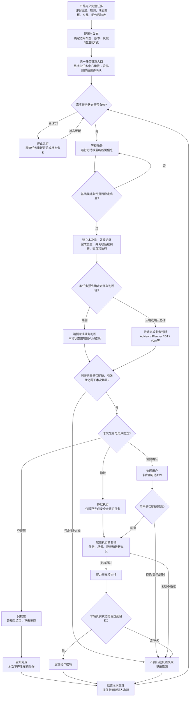
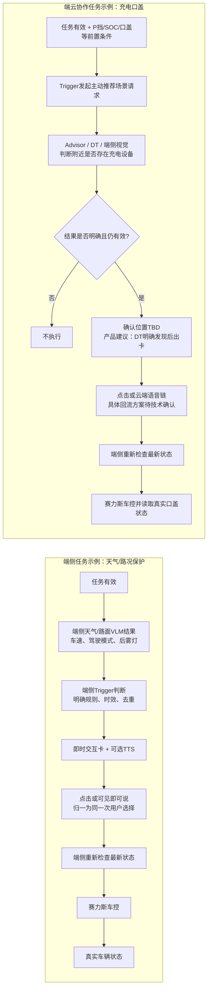
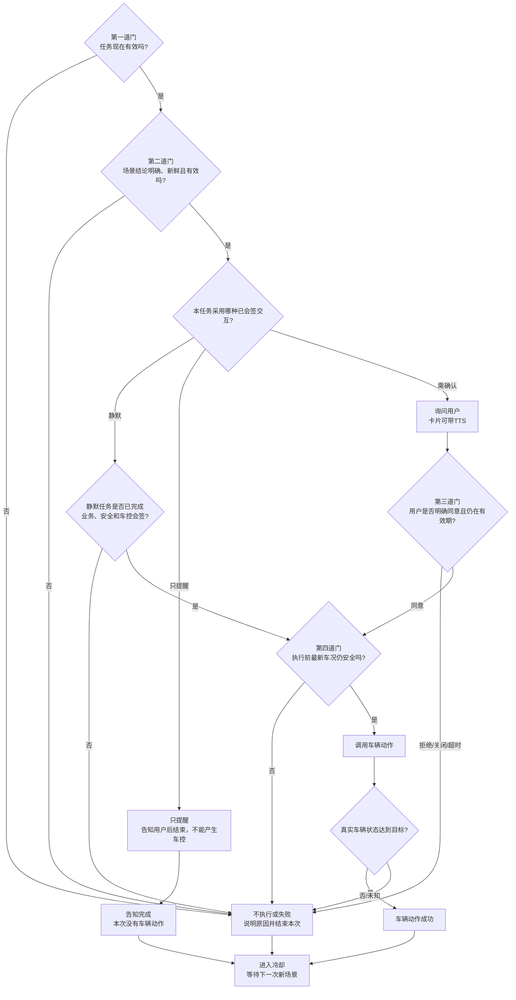

# PRD｜系统预设任务业务框架与四任务方案

> 版本：V0.8（产品评审重构版）  
> 日期：2026-09-04  
> 产品负责人：王泽民  
> 文档状态：待业务框架评审  
> 适用范围：赛力斯系统预设任务、Trigger、即时交互卡、端云主动服务协作  
> 本版说明：重新从业务需求出发编写。正文不定义正式接口、字段名或底层技术架构；技术协议由框架结论明确后另行评审。

## 阅读标记

- **【已确认】**：已有 PRD、任务表或会议原文明确支持。
- **【产品方案】**：为了补齐业务闭环提出，需本次评审确认。
- **【待确认】**：资料没有形成结论，不能直接排期开发。
- **【资料冲突】**：不同资料口径不一致，必须由业务 Owner 现场拍板。

---

# 1. Summary｜这次到底要解决什么

## 1.1 一句话定义

在本 PRD 的目标框架中，**系统预设任务**是系统提前定义好的一项长期服务：用户通过统一入口管理它；任务有效时，系统持续等待合适场景；场景出现后，由端侧或云端完成判断，再按预先约定的方式“直接执行、只提醒或询问用户”，最终由端侧执行车辆动作并读取真实车辆状态。当前是否由任务中心完整支持开启、关闭和删除，仍需本次评审确认。

它不是一张卡片，也不是一条 Trigger 规则，更不是执行一次就结束的普通待办。

## 1.2 当前为什么讲不清楚

现有资料分别写了任务表、Trigger 条件、VUI 卡片、可见即可说、主动推荐和 DT，但没有用一条业务主线把它们串起来，导致评审中反复出现以下问题：

1. 任务中心开关打开后，Trigger 怎样知道任务有效；
2. 哪些任务放端侧、哪些放云端，依据是什么；
3. Trigger 和即时交互卡分别负责什么；
4. 用户点击或说“好的”后，结果回给谁、谁执行；
5. 车控接口返回成功，是否就能算任务成功；
6. 四个任务的成熟度不同，却容易被理解成可以同时进入研发。

## 1.3 本 PRD 给出的统一答案

所有系统预设任务都使用同一条业务骨架：

> 定义并发布任务 → 用户通过统一入口管理 → 确认任务真实有效 → 等待并判断场景 → 选择已约定的端侧或云端链路 → 按策略交互 → 端侧执行前复核 → 调用车控 → 读取真实状态 → 结束本次处理并等待下一次场景。

端侧与云端最重要的区别是：

> **端云主要区分“在哪里完成场景判断和语义交互”；只要涉及真实车控，最终都必须回到端侧，用最新车况复核、执行并读取真实状态。**

即时交互卡与 Trigger 最重要的边界是：

> **Trigger 判断“现在要不要问”；即时交互卡负责“把问题展示给用户并收集选择”。卡片不判断天气、不识别充电桩，也不自行决定车控。**

## 1.4 本次评审必须得到的结论

先确认第 7.1 节的完整业务框架是否作为后续任务共同底座，再按下面五类问题逐项收口：

| 序号 | 必须拍板的结论 | 没有结论的后果 |
|---|---|---|
| 1. 任务状态 | 用户操作后谁保存并同步真实任务状态 | Trigger 可能在任务关闭后仍触发，或重启后丢状态 |
| 2. 端云归属 | 端侧、云端和端云协作的判断标准及四任务落位 | 端云重复判断、漏判断或职责互相推诿 |
| 3. 用户交互 | 端侧卡与云端卡各自的发起方、语音和点击回流 | 卡片能展示，但用户回应后无人承接 |
| 4. 执行安全 | 静默准入、用户授权、执行前复核和真实结果 | 使用过期结论或把请求成功误当成动作成功 |
| 5. 发布能力 | 四任务范围、配置平台缺口、Owner 和下一步 | 未决规则被误当成已确认需求进入研发 |

## 1.5 王泽民本次只需要交付四样东西

| 你的交付物 | 用来解决什么问题 | 本文对应位置 |
|---|---|---|
| 一张公共业务图 | 让所有团队认同任务从开启到车辆真实结果的完整链路 | 7.1 |
| 一张四任务决策表 | 让每条任务的条件、端云、交互、动作、成功标准和 TBD 一眼可见 | 7.7 |
| 一张专项认领表 | 让每个缺口有 Owner 和明确产物，不再用“后面再聊”收口 | 8.3 |
| 一份验收清单 | 把任务关闭、拒绝、过期、状态变化和“车控假成功”变成可测试口径 | 7.10、各任务验收项 |

> **你可以这样理解自己的工作：**我不替研发设计接口，也不实现任务中心、卡片或车控；我要把每条任务什么时候触发、走端还是云、是否询问、用户回应后交给谁、执行前检查什么、什么真实状态才算成功讲清楚，再让对应研发认领具体实现方案。

---

# 2. Contacts｜谁决策、谁实施

## 2.1 评审角色与需要回答的问题

| 角色/模块 | 当前联系人或建议参会方 | 本次需要回答 | 应输出的结果 |
|---|---|---|---|
| 系统预设任务 / Trigger 产品 | 王泽民 | 业务框架、四任务范围、端云归属、交互和验收是否完整 | 本 PRD、任务规格、评审结论、验收清单 |
| 任务中心 | 郝晓伟及任务中心研发 | 用户开关后谁保存真实状态；怎样同步给端侧/云端；重启怎样恢复 | 状态链路图、Owner、异常处理方案 |
| Trigger 研发 | 刘杨、尹振刚及对应研发 | 能读取哪些任务状态和信号；怎样去重、复核并发起后续动作 | 可实现性结论、依赖和技术专项输入 |
| VUI / 即时交互卡 | 徐洋及卡片研发 | 端侧、云端分别怎样拉卡；展示、点击、关闭、超时怎样回传 | 卡片调用边界、回调与生命周期方案 |
| 可见即可说 | 左晨及对应研发 POC | 本地卡片出现后怎样注册按钮语音、模拟点击并注销 | 端侧语音接入方案与责任边界 |
| 主动推荐 / Static Advisor | 对应产品和研发 | 如何接收 Trigger 发起的充电场景请求并调用 DT | 云端业务链路和输入输出说明 |
| Planner | 对应产品和研发 | 云端卡片的语音如何结合当前卡片上下文理解 | 云端语音回流方案；与点击结果怎样保持一致 |
| DT / VQA / VLM | 对应模型产品和研发 | 各任务提供什么结构化判断，无法判断怎样表达 | 结果口径、有效期、质量门槛 |
| 赛力斯端状态 / 车控 | 各任务赛力斯产品及研发 | 提供哪些真实信号和车控能力；怎样回读最终状态 | 信号字典、动作限制、失败原因、回读口径 |
| 测试 | 端云与实车测试 | 如何覆盖关闭、弱网、过期、状态变化和误触发 | 全链路验收用例与实车结果 |

> 人名来自现有会议材料；正式研发 DRI 仍以评审现场确认为准。

## 2.2 王泽民本人负责什么

你负责的不是把所有模块都实现，而是把业务合同讲清楚并推动各 Owner 收口：

1. 定义一项系统预设任务从开启到结果的完整业务过程；
2. 为每个任务定义触发条件、端云路径、交互方式、执行动作和成功标准；
3. 对端侧任务，说明 Trigger / 原业务在什么情况下需要出卡，以及出卡时要提供哪些业务信息；
4. 对云端任务，说明 Trigger 何时只发起主动推荐，云端判断后由哪个原业务节点出卡；
5. 说明卡片应返回哪些用户结果，原业务收到后怎样继续或终止；
6. 把资料冲突和未知项变成有 Owner、有产物的评审问题；
7. 组织联调和验收，确认最终用户行为符合 PRD。

## 2.3 你不负责什么

- 不替任务中心研发决定底层状态存储或同步协议；
- 不替卡片研发设计正式接口、字段名和错误码；
- 不负责把可见即可说词条直接写入代码或平台；
- 不替模型团队决定推理实现；
- 不替赛力斯开发车控接口；
- 不因为业务流程已画出，就承诺未确认任务可以直接排期量产。

---

# 3. Background｜为什么现在必须做

## 3.1 业务背景

赛力斯当前提出四项系统预设任务：

1. 天气/路况保护；
2. 后排儿童/宠物识别后开启儿童锁；
3. 后视镜自动加热；
4. 识别充电设备后打开充电口盖。

四项任务看起来都是“条件满足后做一件事”，但实际能力差异很大：

- 天气需要端侧实时判断，还要用卡片询问用户；
- 儿童锁涉及安全动作，当前交互资料存在冲突；
- 后视镜主要是确定性规则，但规则和双方责任尚未统一；
- 充电需要云端模型理解周围是否有充电设备，并且仍需明确用户授权位置。

如果只把四项任务写成一张“条件—动作”表，研发无法知道任务状态、交互、车控和异常如何连起来，也无法判断哪些能力可以复用。

## 3.2 会议已经明确的方向

- **【已确认】** 下一次需要评审的是“系统预设任务整体框架能力”，不是只评 Trigger 条件。
- **【已确认】** 天气/路况保护先走端侧自闭环；端侧卡片语音先使用可见即可说，不等待离线大模型。
- **【已确认】** 云端 AI 主动服务与离线端侧任务不是同一条语音链：前者可结合卡片上下文进入 Planner；完全端侧链路不依赖 Planner。
- **【已确认】** 即时交互卡是一套共享的展示和交互容器，不是业务判断模块。
- **【已确认】** 充电口盖按“Trigger 前置判断 → 主动推荐携带 Query → DT / 端侧视觉 → 端侧执行”的既有方向继续补齐。
- **【已确认】** 当前平台只覆盖部分云端条件和动作配置；端侧任务、端云同步、卡片、TTS、二次确认还没有形成一套完整的通用配置能力。

## 3.3 当前能力与目标能力不能混写

| 能力 | 当前资料反映的状态 | 本框架要求达到的目标 |
|---|---|---|
| 任务中心展示与管理 | 已有任务中心方向；各任务开关/删除口径不完全一致 | 用户能看到并管理任务，页面显示真实处理结果 |
| 真实任务状态 | 谁保存、谁同步、重启怎样恢复尚未定稿 | 端侧和云端 Trigger 都能可靠获知任务是否有效 |
| 规则判断 | 云端已有部分配置；端侧仍依赖开发实现 | 同一任务规则、信号来源和端云归属都有明确说明 |
| 即时交互卡 | 已有多类卡片调用链路 | 端侧和云端任务都能按各自路由完成展示和回传 |
| TTS / 语音确认 | 端侧可见即可说、云端 Planner 各有能力 | 每项任务明确是否播报、由谁理解、何时失效 |
| 车控与结果 | 有赛力斯原子能力方向 | 执行前复核，且以车辆真实状态而非请求成功作为最终结果 |
| 防打扰 | 讨论过基础频控和用户负反馈 | 每项任务明确去重、冷却、拒绝后何时可以再次提醒 |

## 3.4 依据资料

- [系统预设任务评审记录](https://bytedance.larkoffice.com/docx/Zp90dGMheow4XmxwVXAcu2KGnTb)
- [系统预设任务全集](https://bytedance.larkoffice.com/wiki/SorvwQ413iamTRkzSxvcVPWtnYc?sheet=g4s4FB)
- [天气/路况保护 PRD](https://sai-seres.feishu.cn/wiki/VXEdwlChniB4lMkqQT9cPxPqnFh)
- [VUI 主交互需求](https://bytedance.larkoffice.com/wiki/FBsrwA734iaFzZkrZExcHHBtn3d)
- [可见即可说框架需求](https://bytedance.larkoffice.com/wiki/AxYjwUI8wiFCXWkdNsDcRae0nCf)
- [动态加载型工具技术方案](https://bytedance.larkoffice.com/wiki/T8jDwzwO9iiNF0kbFEVc1uyrnIf)
- 本地原始会议稿《AIVA交互卡静态advisor链路交互消息盒子评审》

---

# 4. Objective｜目标、非目标与成功标准

## 4.1 本期目标

1. 建立所有系统预设任务共用的业务框架；
2. 明确端侧、云端和端云协作任务的区分方式；
3. 明确任务中心、Trigger、即时交互卡、语音链、模型和车控的边界；
4. 把四项任务放入框架，说明各自当前结论、缺口和成熟度；
5. 给研发一份可以继续做技术方案和接口评审的完整产品输入；
6. 给测试一份可以逐条验收的用户行为口径。

## 4.2 非目标

- 本文不定义正式接口名称、代码结构、数据表或通信协议；
- 本文不决定端侧与云端的底层部署细节；
- 本文不承诺四项任务同批上线；
- 本文不把模型“可能支持”写成已具备能力；
- 本文不把系统自动生成的一句 Query 当作用户授权；
- 本文不解决宠物模式等已经移出本批范围的需求。

## 4.3 评审通过标准

评审结束后，各参与方能够用同一套口径回答：

1. 一项系统预设任务从任务中心到真实车控结果，完整经过哪些步骤；
2. 端侧与云端是按什么原则区分的；
3. Trigger 与即时交互卡分别负责什么、不负责什么；
4. 端侧卡为什么走可见即可说，云端卡为什么需要云端语义上下文，以及是否最终由 Planner 承接；
5. 用户确认后为什么还要执行前复核；
6. 为什么最终成功必须以车辆真实状态为准；
7. 四项任务中，哪些可以继续开发，哪些必须先拍板；
8. 每个待确认项由谁在什么产物中给出结论。

除“大家能讲清楚”外，还必须满足以下可验收标准：

- 任务无效或状态未知时，P0 用例中不得出卡或车控；
- 需要确认的任务，没有有效确认时不得产生车控；
- 云端判断为未知、错误或过期时不得执行；
- 同一场景不得重复提醒或重复车控；
- 车控请求成功但真实状态未达到目标时不得向用户报成功；
- 四项任务均能看到端云归属、交互、动作、成功标准、Owner 和未决项；
- 所有 P0 异常用例通过后，任务才可进入灰度。

---

# 5. Segments｜任务类型、使用者与成熟度

## 5.1 谁会受到这套需求影响

| 使用者 | 需要从本文得到什么 |
|---|---|
| 车主 / 驾驶员 | 决定任务是否开启，接收提醒或确认，看到与车辆一致的结果 |
| 当前车辆乘员 | 可能受到儿童锁、驾驶模式、灯光或开盖动作影响，需要安全和可控 |
| 新任务接入产品 | 按同一框架定义条件、端云、交互、动作和验收 |
| 运行与交互团队 | 按产品边界实现状态、判断、卡片、语音和车控链路 |
| 测试与质量团队 | 按统一成功、失败和异常口径完成端云及实车验收 |

## 5.2 端侧、云端和端云协作怎样区分

| 判断问题 | 更适合端侧 | 更适合云端 |
|---|---|---|
| 无网或弱网时是否仍必须工作 | 是 | 否，断网不触发可以接受 |
| 响应是否要求很快 | 本地状态变化后立即判断 | 可以接受上行、排队和推理耗时 |
| 条件能否用明确规则表达 | 可以，用本地信号、阈值和简单组合判断 | 需要模型、工具、历史、复杂语义或更大上下文 |
| 用户语音是否只是操作当前按钮 | 是，可用可见即可说模拟点击 | 否，需要云端理解上下文和泛化表达；是否进入 Planner 由专项确认 |
| 是否直接涉及真实车控 | 在端侧复核和执行 | 云端只能给出判断或请求，不能跳过端侧安全复核 |
| 迭代频率 | 随车版本发布，周期更长 | 策略、模型和工具可更快迭代 |

**产品判断顺序：**

1. 先问“仅凭车上当前数据能否稳定判断”；
2. 再问“断网时是否仍必须工作”；
3. 再问“是否需要模型、工具或上下文”；
4. 最后确认“车控前由端侧复核哪些安全条件”。

不要按“有没有卡片”区分端云，也不要按“有没有 Trigger”区分端云。端侧和云端都可能有 Trigger，也都可能出同一种即时交互卡；真正不同的是判断和语音理解发生在哪里。

## 5.3 四项任务当前成熟度

| 任务 | 当前建议链路 | 交互 | 当前成熟度 | 本次最重要的缺口 |
|---|---|---|---|---|
| 天气/路况保护 | 端侧判断、端侧交互、端侧执行 | 卡片 + TTS + 二次确认 | **可继续补齐**：Trigger 前半段已在开发 | 任务状态、拉卡、可见即可说、回调、执行复核和结果反馈 |
| 儿童/宠物儿童锁 | 当前更适合端侧；最终方案待安全评审 | 会议口径无卡无 TTS；旧 SLS 稿有卡/TTS | **不可直接排期完整链路** | 交互口径冲突、识别范围、左右门、安全条件、人工关闭抑制 |
| 后视镜自动加热 | 当前资料倾向云端判断、端侧执行；字节/赛力斯归属待定 | 当前无卡无 TTS | **规则与归属未收口** | P/非 P 冲突、三个场景退出条件、弱网和双方边界 |
| 识别充电设备后开盖 | Trigger 硬条件筛选（物理部署待定）+ 云端 Advisor/DT + 端侧执行 | 需要二次确认 | **可做技术专项，暂不能直接联调** | Trigger 部署、卡片插入位置、语音/点击回流、DT 结果有效期、开关关系 |

---

# 6. Value Propositions｜为什么值得建立统一框架

## 6.1 用户价值

- 用户关闭的任务不会继续打扰或执行；
- 安全相关场景在需要时及时提醒，不因断网完全失效；
- 需要授权的动作必须得到明确同意，拒绝和超时不会误执行；
- 系统只在条件仍成立时执行，不使用过期识别结果；
- 用户看到的成功或失败与车辆真实状态一致。

## 6.2 产品与平台价值

- 新任务不再从头讨论“谁判断、谁出卡、谁执行”；
- 同一种即时交互卡可以服务端侧和云端，但按不同语音路由接入；
- 四项任务的成熟度和缺口透明，避免把建议或争议误当成承诺；
- 配置平台可以按统一模板逐步补能力，而不是不断增加单任务特殊逻辑。

## 6.3 安全和排障价值

- 任务有效、场景成立、用户授权和执行安全被拆成四道独立检查；
- 云端判断不能直接绕过端侧安全门；
- 请求成功与车辆真实状态分开，避免“接口成功但车辆没变化”被误报为成功；
- 每一步都能知道主责任模块，出现问题时能快速定位是状态、规则、模型、交互还是车控。

---

# 7. Solution｜统一业务方案

## 7.1【产品方案】系统预设任务目标业务框架图



### 7.1.1 这张图怎样理解

这不是研发部署图，而是一项任务必须回答的业务问题：

| 步骤 | 主责任方 | 需要判断什么 | 产出什么 | 失败时怎么办 |
|---|---|---|---|---|
| 1. 定义任务 | 业务产品 + 各模块 Owner | 场景是否值得做，端云路径和交互是否明确 | 一份完整任务规格 | 信息不全则不得发布 |
| 2. 配置与发布 | 配置平台 / 端侧发版方 | 车型、版本、能力依赖是否满足 | 可被任务中心展示、可被运行方识别的任务 | 阻止进入目标车型 |
| 3. 用户管理 | 目标由任务中心承接 | 用户最终可进行哪些管理操作 | 用户操作及页面真实反馈 | 支持范围未确认前不能按既有能力承诺；页面不得先假装成功 |
| 4. 确认真状态 | **Owner 待任务中心专项确认** | 任务当前究竟有效还是无效 | 端侧/云端能消费的真实状态 | 未知状态按无效处理，停止运行并等待恢复 |
| 5. 形成候选 | 端侧或云端运行方 | 基础数据是否到齐、新鲜并稳定 | 一个值得继续判断的候选场景 | 数据缺失、过期或不稳定则继续等待 |
| 6. 建立本次处理 | Trigger / 本次运行方 | 同一场景是否已经被处理 | 一条能关联后续判断、卡片和执行的本次记录 | 已处理则不重复发起；具体技术标识由研发定义 |
| 7. 完成业务判断 | Trigger / 模型能力 | 端侧规则或云端模型是否得到明确、有效结果 | 本次需要提醒或执行的业务结论 | 未知、错误或过期则结束本次并冷却 |
| 8. 用户交互 | 本次任务业务发起方 + 即时交互卡 + 对应语音链 | 本次是静默、只提醒还是必须确认 | 告知完成，或用户明确选择及生命周期结果 | 拒绝、关闭、超时均结束本次并冷却 |
| 9. 执行前复核 | 端侧业务 / Trigger | 最新任务、场景、授权和车况是否仍有效 | 可执行或终止结论 | 任一不满足则停止本次动作 |
| 10. 车辆执行 | 赛力斯车控 | 动作是否被车辆接受 | 请求结果 | 请求失败则按任务方案反馈 |
| 11. 真实回读 | 赛力斯端状态 + 业务方 | 车辆状态是否真的变化 | 最终动作成功、失败或未知 | 未达到目标不能报动作成功 |
| 12. 冷却与再等待 | Trigger / 任务策略 | 何时可以再次提醒 | 下一次允许触发的时机 | 避免同一场景立即反复打扰 |

## 7.2 任务中心与“任务是否有效”

### 7.2.1 任务中心是什么

**目标业务定位**是由任务中心承接用户查看和管理长期任务：展示任务，并承接评审最终确认的开启、关闭或删除操作；它不判断天气、不识别宠物、不调用车辆动作。

**【待确认】** 当前资料只确认系统预设任务被纳入任务中心范围，但本期具体支持“开启、关闭、删除”中的哪些操作尚未统一，不能把目标定位讲成现有完整能力。

### 7.2.2 Trigger 为什么必须知道任务是否有效

“天气是下雨”只说明场景出现，不说明用户仍允许系统提供天气保护服务。若本期确认任务中心提供天气任务的有效状态，Trigger 的第一道判断必须变成：

```text
任务有效
AND 业务场景条件满足
→ 才允许继续提醒或执行
```

因此，从目标业务逻辑看，“天气路况保护任务是否有效”确实是 Trigger 需要新增的一项业务前置条件。它不是天气信号，也不是车辆开关，而是用户是否允许整项任务运行；它具体从哪里读取，仍由任务中心专项确认。

### 7.2.3 期望的业务闭环

| 时机 | 任务中心侧动作 | 状态承载方动作 | Trigger 侧动作 |
|---|---|---|---|
| 用户开启 | 提交“开启任务”的操作并显示处理中 | 鉴权、保存真实结果 | 收到有效状态后才开始监听/允许触发 |
| 用户关闭 | 提交“关闭任务”的操作并显示处理中 | 保存关闭结果并同步 | 停止产生新提醒和新执行 |
| 车机或服务重启 | 展示真实状态 | 提供当前状态快照 | 重新获取状态，不能只等待下一次开关事件 |
| 状态同步失败 | 提示操作失败或状态待同步 | 保持可追溯的真实结果 | 状态未知时按无效处理 |
| 卡片排队时任务被关闭 | 页面显示已关闭 | 同步最新状态 | **【产品方案】** 撤销未展示卡；已展示卡失效，不能再执行 |

### 7.2.4 本次不能假装已有结论的地方

- **【待确认】** 谁是任务真实状态承载方；
- **【待确认】** 本期任务中心究竟支持开启、关闭、删除中的哪些操作；
- **【待确认】** 任务中心用什么方式把开启/关闭结果同步给端侧和云端；
- **【待确认】** 端侧重启后怎样主动获取当前状态；
- **【待确认】** 删除是否允许、删除后如何恢复；
- **【待确认】** 关闭任务后，正在排队、正在展示或正在推理的本次处理怎样终止。

这些问题需要郝晓伟和任务中心研发给方案。产品只定义上面的用户预期和失败边界，不替研发编造接口。

## 7.3 各模块的业务边界

| 模块 | 负责什么 | 输入 | 输出 | 明确不负责 |
|---|---|---|---|---|
| 配置平台 / 发版流程 | 保存产品定义，校验所需能力，控制车型、版本和灰度 | 完整任务规格 | 可发布的任务定义 | 不替运行时判断实时场景 |
| 任务中心 | **【产品方案】** 展示任务，承接最终确认的管理操作，并展示真实处理结果 | 展示信息、用户操作 | 操作请求、页面结果 | 不判断天气/充电设备，不直接车控；当前支持范围待确认 |
| 任务状态承载方 | 保存任务当前真实状态并同步给运行方 | 用户操作、鉴权结果 | 有效/无效/未知状态 | 不判断具体业务场景；Owner 待定 |
| Trigger | 读取任务状态和业务信号，判断条件，防止重复，决定是否发起交互或下一步判断 | 任务有效状态、端状态、结构化模型结果 | 本次业务候选、拉卡或执行请求 | 不负责卡片视觉，不理解复杂自然语言 |
| VLM / DT / VQA | 对图像或复杂场景给出结构化判断 | 场景请求、必要的图像/上下文 | 发现、未发现、无法判断等结果 | 不替 Trigger 判断任务开关和所有车辆前置条件 |
| 即时交互卡 / VUI | **【产品方案】** 准入和排队，展示内容，播报可选 TTS，收集点击/语音结果，管理关闭和超时 | 哪项任务、为什么出现、展示和交互方案 | 目标需返回展示结果、用户选择和生命周期结果 | 不判断场景，不把“出卡”当成用户授权，不直接车控；具体能力待卡片专项确认 |
| 可见即可说 | 在端侧把当前可见按钮与简单语音指令对应，并模拟用户点击 | 当前顶层页面的可操作元素和语音映射 | 一次按钮操作 | 不做复杂推理，不绕过按钮直接决定业务动作 |
| Planner | 理解云端卡片上下文中的用户语音 | 用户表达、当前卡片上下文 | 云端可识别的用户意图 | 不替端侧执行安全复核 |
| Advisor / 主动推荐 | 发起和编排云端主动服务，按需调用 DT 等能力 | Trigger 发起的场景请求、上下文 | 云端判断和交互请求 | 不直接操作车辆 |
| 赛力斯端状态 / 车控 | 提供真实车辆状态，执行原子动作，返回并可被回读 | 经复核的动作请求 | 请求结果和真实车辆状态 | 不替字节定义任务、卡片和 Trigger 规则 |

## 7.4 端侧链路与云端链路



### 7.4.1 两条链路共同点

1. 都必须先确认任务有效；
2. 都需要避免同一场景重复触发；
3. 需要确认的任务都必须等用户明确同意；
4. 用户同意后都要用最新状态再检查一次；
5. 都由端侧调用真实车控；
6. 都以车辆真实状态作为最终结果。

### 7.4.2 两条链路差异

| 环节 | 端侧任务 | 云端或端云协作任务 |
|---|---|---|
| 主要判断位置 | 车端本地 | 云端模型/工具，必要时结合端侧上行 |
| 适用场景 | 本地信息足够、规则明确、强实时、弱网仍需工作 | 需要模型、工具、语义、历史或更丰富上下文 |
| 网络影响 | 无网仍可判断和交互 | 网络不可用时不使用过期结果执行 |
| 语音确认 | 当前卡片按钮走可见即可说；本质是模拟按钮点击 | 需要云端语义链；若专项选择 Planner，则语音带当前卡片上下文进入 Planner；点击同步仍待确认 |
| 迭代方式 | 更多依赖车端版本 | 云端策略和模型可更快迭代 |
| 最终车控 | 端侧复核、执行、回读 | 仍然回端侧复核、执行、回读 |

### 7.4.3 为什么不能全部放端侧，也不能全部放云端

- 全放端侧：充电设备识别、复杂上下文和泛化语音可能能力不足，策略迭代还依赖车端发版；
- 全放云端：断网会漏触发，本地状态变化无法及时响应，云端过期判断直接车控存在风险；
- 因此采用“适合的判断放在适合的位置，最终安全执行统一回到端侧”的原则。

## 7.5 本次任务业务发起方与即时交互卡怎样对接

### 7.5.1 最简单的关系

```text
本次任务业务发起方：条件满足了，现在要不要问用户？
        ↓
即时交互卡：把问题展示出来，让用户点击或说出选择。
        ↓
Trigger / 云端编排：收到用户选择后，决定继续还是结束。
        ↓
端侧执行：重新检查车辆状态，再执行并回读。
```

端侧天气中，业务发起方是天气 Trigger / 天气业务；云端充电中，更可能由充电原业务或 Advisor 链在模型判断后发起卡片，最终 Owner 由专项确认。因此不能把所有卡片都写成由 Trigger 直接拉起。

### 7.5.2【产品方案】业务发起方拉卡时需要说明什么

下面是为了让业务闭环成立而定义的目标产品信息，不代表卡片目前已经具备对应接口；具体字段、回传方式和支持范围由卡片专项确认。

| 必须提供的信息 | 为什么需要 | 天气示例 |
|---|---|---|
| 哪项任务、哪个子场景 | 避免把不同任务的结果串错 | 天气保护—雨/湿滑 |
| 这是本次哪一次触发 | 用户晚回复时能判断是否仍对应当前场景 | 本次雨天候选，而不是上一次雾天候选 |
| 为什么要问 | 让用户理解系统依据 | 检测到下雨或路面湿滑 |
| 要展示和播报什么 | 卡片与 TTS 保持一致 | 是否切换湿滑模式 |
| 有哪些选择 | 只能返回业务认识的标准选择 | 确认、取消 |
| 语音走哪条路 | 端侧可见即可说或云端 Planner | 端侧可见即可说 |
| 结果回给谁 | 用户选择必须回到原业务继续处理 | 回天气 Trigger / 天气业务 |
| 多久有效 | 过期后“好的”不能执行旧动作 | 具体秒数待 VUI 与业务确认 |
| 优先级和排队要求 | 不打断更重要的用户 Query 或安全提醒 | 正常排队，场景失效应撤销 |

### 7.5.3【产品方案】即时交互卡需要返回什么

下面三类结果是本 PRD 提出的目标业务合同，当前是否都能返回、怎样返回，尚未完成技术确认。

| 返回类型 | 需要包含的业务事实 | 原业务发起方拿到后做什么 |
|---|---|---|
| 展示结果 | 已接收、正在排队、真正展示、展示失败 | 只有真正展示后才开始等待用户；失败不能假装用户已看到 |
| 用户结果 | 确认、拒绝、关闭、超时、被打断，并能对应原来的本次触发 | 只有有效确认才继续；其他结果结束本次处理 |
| 生命周期结果 | 卡片何时展示、隐藏、过期、被替换或恢复 | 卡片消失后注销语音，不接受旧确认 |

执行结束后，业务还需要把“执行中、成功、失败及真实车辆状态”告诉卡片或其他结果承载界面。卡片是否保留、是否播报结果，由每项任务单独定义。

### 7.5.4 端侧卡片的语音链

1. 天气 Trigger / 天气业务判断条件成立，向即时交互卡发起一次确认请求；
2. 卡片真正显示在最上层后，本次确认/拒绝按钮需要能够被可见即可说识别；
3. **【已确认】** 可见即可说处理当前顶层可见页面，将命中的简单语音表达模拟为当前按钮操作；
4. **【待确认】** 谁负责注册按钮、通过什么通道注册，以及模拟点击后怎样把结果返回原天气业务；
5. **【产品方案】** 卡片消失、超时或被替换后，当前按钮语音映射必须失效；
6. 天气 Trigger / 天气业务收到有效确认后再检查最新车况，不因为语音匹配成功就直接车控。

业务产品需要提供确认/拒绝按钮的业务语义和可接受的简单表达；实际注册和回传由 VUI、可见即可说和 Trigger 研发在专项中分工。

**边界：**可见即可说解决的是“用户怎样用语音操作当前可见控件”，不是模型推理，也不是车控业务。

### 7.5.5 云端卡片的语音和点击链

1. Advisor / DT 等云端能力得到明确、仍有效的业务结果；
2. 在最终拍板的确认节点，由充电原业务或 Advisor 链发起即时交互卡；**本稿产品建议**是在 DT 明确发现充电设备后再出卡；
3. **如果专项最终选择 Planner 语音路由**，用户语音需要连同当前卡片上下文进入 Planner，由 Planner 理解泛化表达；
4. 用户点击不需要模型理解，但云端仍需要知道本卡片已被确认、拒绝或消费；
5. 得到有效授权后，将执行请求下发端侧；
6. 端侧重新检查安全条件并车控，真实状态再回传更新卡片。

**【待确认】** 云端卡型和语音路由尚未确认；点击结果是模拟 Query、上报标准事件还是走其他机制也未定。动态选择工具在会议中只是候选方案，不能写成已经接通的通用能力。

## 7.6 三种交互方式与四道业务门



四道门分别解决：

1. **任务门**：用户是否还允许这项服务运行；
2. **场景门**：当前事实是否足以支持提醒或执行；
3. **授权门**：需要确认的动作，用户是否在有效期内明确同意；
4. **执行门**：从判断到执行之间车况是否变化。

## 7.7 四任务一页总览

评审时先讲这张表，让大家先知道“哪条能继续、哪条要先拍板”，再按需要进入单任务细节。

| 维度 | 天气/路况保护 | 儿童/宠物儿童锁 | 后视镜自动加热 | 充电设备开盖 |
|---|---|---|---|---|
| 主要价值 | 行车安全提醒 | 后排安全保护 | 改善后方视野 | 降低充电准备操作成本 |
| 判断位置 | 端侧 | 倾向端侧，待安全确认 | 云端规则候选与赛力斯自闭环待定 | Trigger 硬条件位置待定 + 云端模型判断 |
| 模型能力 | 端侧 VLM 给结构化天气/路面结果 | 儿童 OMS/SLS + 猫狗 VLM | 不需复杂模型 | Advisor + DT/VQA + 端侧视觉 |
| 当前交互 | 卡片 + TTS + 二次确认 | 最新会议无卡无 TTS，与旧 SLS 稿冲突 | 无卡无 TTS | 需要卡片和二次确认，位置待定 |
| 语音 | 本地可见即可说 | 若最终出卡则倾向本地 | 无 | 云端 Planner 路由待定 |
| 执行 | 端侧复核后车控 | 端侧复核后车控 | 端侧复核后车控 | 端侧复核后车控 |
| 成功标准 | 真实模式/灯状态 | 真实儿童锁状态 | 真实加热状态 | 真实口盖状态 |
| 当前成熟度 | 前半段可继续，后半段先专项收口 | 安全、交互、部署未定，不能直接排完整研发 | 规则与双方归属未定 | 先做云端、卡片和端侧执行技术专项 |
| 最重要的未决项 | 任务状态、拉卡、语音注销、复核、结果 | 静默还是确认、左右门、安全门槛 | P/非 P、退出、字节/赛力斯归属 | Trigger 位置、卡片位置、点击/语音回流、结果有效期 |

## 7.8 四项任务详细方案

### 7.8.1 任务一：天气/路况保护

#### A. 业务目标

车辆在雨、雪、浓雾或对应路面风险中行驶时，在相关驾驶模式或灯光尚未开启的情况下询问用户；用户确认后，开启湿滑模式、雪地模式或后雾灯。

#### B. 当前结论

| 项目 | 结论 |
|---|---|
| 端云路径 | **【已确认】端侧自闭环** |
| 任务中心 | **【已确认】** 天气 PRD V1.1 的需求口径是将任务开关放入任务中心、出厂默认开启，并要求支持开关状态记忆；量产默认值、任务中心本期能力、记忆实现和真实同步链路待确认 |
| 场景输入 | **【待确认】** 当前规则输入方向为端侧 VLM 天气/路面结果 + 车速 + 驾驶模式/后雾灯状态；正式字段、来源、时效和准确率尚未收口 |
| 行驶门槛 | **【已确认】** 当前 SLS 资料写车速大于 30 km/h；正式边界值和单位由信号专项再核对 |
| 用户交互 | **【已确认】** 即时交互卡 + TTS + 二次确认；本地语音走可见即可说 |
| 当前进度 | **【已确认】** Trigger 前半段研发在做；后续交互和结果闭环尚未收口 |
| 成功标准 | **【产品方案】** 真实湿滑/雪地模式或后雾灯状态达到目标 |

#### C.【产品方案】三个子场景的触发条件

下表按天气 PRD 的三个子场景表达当前产品方案。旧 SLS 原子能力总表对部分动作组合存在不同写法，因此“一个子场景只做表中单一动作，还是要组合执行多个动作”仍需天气业务和车控 Owner 拍板。

| 子场景 | 需要同时满足 | 询问 | 用户确认后的动作 |
|---|---|---|---|
| 雨 / 路面湿滑 | 任务有效；车速 > 30 km/h；天气=下雨或路面=湿滑；当前不是湿滑模式 | 是否切换到湿滑模式 | 切换湿滑模式 |
| 雪 / 路面覆雪结冰 | 任务有效；车速 > 30 km/h；天气=下雪或路面=覆雪/结冰；当前不是雪地模式 | 是否切换到雪地模式 | 切换雪地模式 |
| 浓雾 | 任务有效；车速 > 30 km/h；天气=浓雾；后雾灯关闭 | 是否打开后雾灯 | 打开后雾灯 |

任何必需输入为未知、过期或“无法判断”时，不出卡、不执行。

#### D.【产品方案】一次雨天任务的目标完整链路

> 以下数值用于讲解业务，不是正式接口样例。

1. 用户已在任务中心开启“天气/路况保护”；
2. 车辆正在行驶，车速为 46 km/h；
3. 端侧 VLM 给出“天气=下雨”或“路面=湿滑”的结构化结果；
4. 车辆当前处于普通驾驶模式，湿滑模式未开启；
5. Trigger 逐项判断“任务有效、车速满足、天气/路面成立、目标模式未开启”；
6. **【待确认】** VLM 结果需要连续多少周期稳定后才出卡；资料中出现过“三周期”，但后续又有删除痕迹，不能直接写死；
7. 条件稳定后，Trigger 请求即时交互卡展示“检测到下雨或路面湿滑，是否切换湿滑模式”，按钮为“确认/取消”，并携带本地可见即可说路由；
8. 卡片真正显示后才开放按钮语音。用户点击“确认”，或者说出能匹配当前确认按钮的简单表达；
9. 卡片把“本次雨天询问已确认”返回给天气 Trigger；
10. Trigger 重新读取任务状态、车速、天气/路面和驾驶模式；
11. 如果任何条件已变化，例如任务被关闭、路面恢复或用户已手动切换模式，本次不再执行；
12. 条件仍成立时调用赛力斯车控切换湿滑模式；
13. 请求返回后继续读取真实驾驶模式；只有真实状态变为湿滑模式，才向用户反馈成功；
14. 本次进入冷却并继续等待新的天气场景，不能立即重复出卡。

#### E. 各模块在天气任务中做什么

| 模块 | 本任务职责 |
|---|---|
| 任务中心/状态方 | 提供天气任务的真实有效状态 |
| 端侧 VLM | 输出天气和路面结构化结果，不输出车控决定 |
| 端侧 Trigger | 判断任务、车速、场景和目标状态；发起卡片；接收选择；复核并调用车控 |
| 即时交互卡 | 展示三个子场景对应文案和按钮，播报 TTS，返回展示/选择/生命周期结果 |
| 可见即可说 | 在卡片可见期间把简单语音映射为当前按钮操作 |
| 赛力斯车控/端状态 | 执行模式或灯光动作，并提供真实状态回读 |

#### F. 异常与验收

- 任务关闭：即使下雨也不出卡；
- 车速不满足、数据过期或目标能力已开启：不出卡；
- 拉卡排队期间天气恢复：撤销或展示前拦截，不再询问；
- 用户拒绝、关闭或超时：不执行；
- 卡片消失后再说“好的”：不能执行旧动作；
- 用户确认后车速或天气变化：执行前复核失败，不执行；
- 车控请求成功但真实模式未变化：最终显示失败或未知，不能显示成功；
- 语音被禁用：**【已确认】** 会议接受“保留卡片点击、不播 TTS”作为天气安全提醒的降级方向；是否适用于所有子场景需最终确认；
- 无网：目标是端侧判断、卡片和本地确认仍可工作；需由端侧卡片能力完成实车确认，当前不能写成已实现现状。

#### G. 天气任务待拍板

1. 任务状态怎样从任务中心同步到端侧 Trigger；
2. Trigger 调用哪项即时交互卡能力，展示失败怎样回传；
3. 按钮语音由卡片统一注册还是天气业务分别注册；
4. 卡片有效期、强聆听时长和注销时点；
5. VLM 结果防抖周期、过期标准和复合天气优先级；
6. 用户拒绝后多久可再次提醒；
7. 天气恢复后的“关闭雾灯/恢复常用模式”是否同样需要卡片确认；
8. 旧 SLS 原子能力总表与三个子场景动作存在组合冲突，最终每个子场景执行单一动作还是动作组合；
9. 成功、失败和条件变化时的卡片/TTS 文案。

### 7.8.2 任务二：后排儿童/宠物识别后开启儿童锁

#### A. 业务目标

车辆进入行驶状态、后排存在儿童或已支持的宠物，并且儿童锁尚未开启时，降低后排误开车门风险。

#### B. 当前能确认到什么程度

| 项目 | 结论 |
|---|---|
| 判断位置 | **【产品方案】** 本地信号足以完成主要规则，更适合端侧；正式部署仍需研发确认 |
| 儿童信号 | **【待确认】** 当前输入候选为赛力斯 OMS/SLS；正式来源、字段、枚举、时效和准确率需端状态 Owner 确认 |
| 宠物信号 | **【已确认】** 字节 VLM 当前仅明确评估猫/狗，约低频识别；具体上报方式待确认 |
| 触发时机 | **【资料冲突】** 较新任务表为“非 P 档持续判断”；旧 SLS 稿为“档位切入 D 时触发” |
| 识别对象 | **【资料冲突】** 较新任务表为“儿童或猫狗”；旧 SLS 稿只写“儿童/老人和儿童”人群，没有宠物条件 |
| 其他基础条件 | 任务有效；儿童锁未开启；安全条件通过 |
| 交互 | **【资料冲突】** 9 月 1 日会议口径为无卡、无固定 TTS；旧 SLS 文档存在卡片/TTS 描述 |
| 动作 | 开启约定范围的儿童锁 |
| 成熟度 | 安全和交互未收口，不能直接当作已确认静默车控任务上线 |

#### C. 产品规则草案

```text
任务有效
AND 车辆处于最终确认的行车状态
AND（儿童识别=有儿童 OR 宠物识别=猫/狗）
AND 识别结果新鲜且明确
AND 儿童锁未开启
AND 执行安全条件通过
→ 按最终会签的交互策略处理
```

这里不能先写死“非 P 档就执行”。还需要安全 Owner 明确车速、车门状态、左右座位/车门映射和人工操作优先级。

#### D. 两个必须二选一的产品方案

| 方案 | 业务流程 | 优点 | 风险 |
|---|---|---|---|
| A. 静默开启 | 条件成立 → 端侧复核 → 直接开启儿童锁 → 记录结果 | 保护及时、无打扰 | 误识别可能限制后排乘员；必须先完成安全会签 |
| B. 询问后开启 | 条件成立 → 本地卡片/TTS → 用户确认 → 端侧复核 → 开锁 | 用户可控 | 提醒过慢或用户未响应时无法立即保护 |

在产品、安全和赛力斯 Owner 拍板前，PRD 只能保留两个选项，不能把其中一个写成既定事实。

#### E. 必须补齐的问题

1. 儿童锁是左右门分别控制，还是一次控制两侧；
2. 触发时机采用“非 P 档持续判断”还是“切入 D 档的一次事件”；
3. 识别范围采用“儿童或猫狗”，还是旧稿的人群口径；老人和儿童组合怎样处理；
4. 儿童和猫/狗能否定位具体座位/车门；
5. 其他宠物和“无法判断”怎样处理；
6. 识别频率、连续稳定要求和结果有效期；
7. 执行前是否必须满足车门关闭、车速门槛等条件；
8. 用户手动关闭儿童锁后，系统多久内不得自动重新打开；
9. 最终选择静默还是询问；若静默，怎样让用户可追溯；
10. 车控失败是否重试、是否提示。

#### F. 最小验收口径

- 任务关闭、P 档/不在行车状态、无人、无法判断、锁已开：均不执行；
- 识别到不支持的宠物：不执行；
- 用户刚手动关闭：在抑制期内不得立刻反向开启；
- 执行前车门或车辆状态变化：终止；
- 动作请求返回后，以真实左右儿童锁状态判断成功。

### 7.8.3 任务三：后视镜自动加热

#### A. 业务目标

在雨天中低速、退出传送带洗车或高湿温差场景下，自动开启后视镜加热，改善后方视野。

#### B. 当前结论

| 项目 | 结论 |
|---|---|
| 当前路径 | **【待确认】** 8 月 27 日纪要倾向云端部署、端侧执行且无网不触发可接受；9 月 1 日会议重新提出赛力斯自闭环方案，最终归属未定 |
| 交互 | **【已确认】** 当前任务表为无卡、无固定 TTS；静默执行仍需安全会签 |
| 场景范围 | 第一阶段三个 P0 场景 |
| 模型依赖 | 不依赖复杂模型，主要是状态、阈值和时间窗口 |
| 责任边界 | **【待确认】** 这类传统车控规则最终应由字节还是赛力斯自闭环 |

#### C. 三个 P0 场景

| 场景 | 当前规则方向 | 动作 | 未确认点 |
|---|---|---|---|
| 雨天中低速 | 任务有效 + 下雨 + 车速 < 70 km/h + 约定行车状态 + 加热未开 | 开启后视镜加热 | 评审资料中 P/非 P 有冲突；退出时机待定 |
| 退出传送带洗车 | 任务有效 + 发生“退出洗车模式”事件 + 加热未开 | 开启后视镜加热；后续整理稿写端侧维持约 15 分钟 | 重复事件、重启恢复、15 分钟是否为正式需求 |
| 高湿温差 | 任务有效 + 湿度 > 60% + 行驶中约定窗口内温差 > 5℃ + 加热未开 | 开启后视镜加热 | 温度来源、窗口、采样和退出条件待定 |

#### D. 业务链路

1. 任务状态有效；
2. **若采用当前云端候选方案**，云端规则模块 / Trigger 监听三个 P0 场景所需的合规状态；若改由赛力斯自闭环，则由赛力斯侧承担同一业务判断；
3. 任一场景规则成立后，检查是否已在同一场景中执行过；
4. 因当前方案为静默执行，必须先有明确的安全会签；
5. 执行请求回到端侧；
6. 端侧重新检查任务、场景和加热状态；
7. 条件仍成立时调用后视镜加热；
8. 读取真实加热状态；
9. 按命中场景执行对应的持续和退出策略。

#### E. 资料冲突和待拍板

1. 雨天场景究竟要求 P 档还是非 P/行驶状态；二者不能同时成立；
2. 雨刮持续时间是否仍是条件；会议资料称因端状态不可用而移除；
3. 雨天场景条件退出后，是立即关闭还是完成一次固定加热周期；
4. 高湿温差场景的时间/里程窗口和最长加热时长；
5. 三个场景同时命中时怎样去重；
6. 用户手动关闭后多久不得再次开启；
7. 云端断网时仅不触发，还是需要任务中心解释；
8. 该任务由字节云端承接，还是由赛力斯车控侧自闭环。

#### F. 最小验收口径

- 三个场景各自正向命中并只执行一次；
- 任务关闭、加热已开、条件边界不满足时不执行；
- 70 km/h、60%、5℃边界按最终规则验证；
- 断网时不使用过期云结果；
- 用户手动关闭后不被立即反向开启；
- 请求成功但真实加热状态未开启时，结果不得记为成功。

### 7.8.4 任务四：识别充电设备后打开充电口盖

#### A. 业务目标

车辆低电量停车时，系统判断周围是否存在真实充电设备；确认存在且用户同意后，打开充电口盖，减少用户手动操作。

#### B. 为什么它不能只靠端侧规则

P 档、低电量和口盖关闭，只能说明“可能要充电”，不能证明附近真的有充电桩，也不能证明用户同意打开口盖。因此需要：

1. Trigger 用明确条件筛选值得启动的候选场景；
2. 云端主动推荐和 DT/VQA 结合端侧视觉判断是否存在充电设备；
3. 用户明确确认；
4. 端侧用最新状态复核并执行。

#### C. 当前资料共同确认的链路骨架

```text
Trigger 检测前置条件满足
→ 主动推荐携带业务 Query
→ 主动推荐调用 DT
→ 端侧按 DT 需要上行信息并获取推理结果
→ 在最终拍板的位置完成用户确认
→ 端侧复核并执行打开充电口盖
```

示例 Query 可以表达为：“帮我看一下附近有没有充电设备，如果有，询问我是否打开充电口盖。”

**关键边界：系统自动生成的 Query 只是启动云端判断，不等于用户已经授权开盖。**

**【待确认】** 当前资料对确认卡的准确位置尚未完全统一；本稿在后文提出“DT 明确发现充电设备后再询问”的产品方案，但需由充电业务、Advisor/DT 和 VUI 共同拍板。

#### D. 前置条件

| 条件 | 当前口径 | 作用 |
|---|---|---|
| 任务有效 | 统一管理入口的操作已被状态方确认为有效 | 用户允许该任务运行；具体是否由任务中心启停待确认 |
| AI 主动服务总开关 | **【待确认】** 是否必须同时开启 | 决定云端主动推荐能力是否可用 |
| 档位 | 当前资料写“变更为 P 档” | 只在停车候选场景启动 |
| SOC | 当前表格写 ≤20%；补能资料另有“用户习惯补电水平” | 筛选低电候选，口径冲突待定 |
| 充电口盖 | 关闭 | 避免重复开盖 |
| 网络与云端能力 | 可用 | 云端结果不可用时不得执行 |

#### E. 产品建议的完整步骤

1. 用户开启充电口盖预设任务；
2. 车辆切入最终确认的 P 档场景，SOC 满足阈值，口盖关闭；
3. Trigger 只做这些硬条件判断，不直接断言附近有充电设备；
4. Trigger 向主动推荐发起固定业务目标的 Query；
5. 主动推荐调用 DT，DT 根据需要请求端侧视觉/上下文；
6. 端侧完成合规数据上行或本地观察，并把结果交回本次判断；
7. DT 输出“发现、未发现、无法判断或错误”，并带结果时间；
8. 未发现、无法判断、错误或结果过期：结束本次，不出执行卡、不车控；
9. **【产品方案】** 仅在结果明确为“发现充电设备”后出卡询问：“检测到附近有充电设备，是否打开充电口盖？”；
10. 用户点击确认，或通过最终确认的云端语音链明确同意；
11. 端侧重新检查任务/总开关、P 档、车辆停稳、口盖仍关闭、判断结果和授权仍有效；
12. 条件通过后调用赛力斯车控打开口盖；
13. 读取真实口盖状态；真实状态为开启才反馈成功；
14. 同一次停车场景进入冷却，避免重复询问。

#### F. 各模块责任

| 模块 | 本任务负责内容 |
|---|---|
| 任务中心/状态方 | 提供任务真实有效状态 |
| Trigger | 判断开关、P 档、SOC、口盖等硬条件并发起主动推荐场景 |
| 主动推荐 / Advisor | 承接场景 Query，组织后续云端流程 |
| DT / VQA / 端侧视觉 | 判断是否存在充电设备，并给出明确且有时效的结果 |
| 即时交互卡 | 在最终拍板的确认节点展示问题，收集点击/语音确认，管理超时和关闭；本稿建议 DT 明确发现后出卡 |
| Planner | 如采用云端语音路由，结合当前卡片上下文理解用户表达 |
| 端侧业务 | 执行前复核并调用开盖能力 |
| 赛力斯车控/端状态 | 执行开盖并提供真实口盖状态 |

#### G. 待拍板问题

1. 任务开关和 AI 主动服务总开关是否必须同时开启；
2. “变更为 P 档”具体包含哪些档位变化；
3. SOC 使用固定 20% 还是用户习惯阈值；
4. 判断硬条件的 Trigger 物理部署在端侧还是云端；本次只能确认它必须是唯一发起方，不能端云重复触发；
5. DT 需要端侧上行什么、结果有哪些枚举、有效期多久；
6. 二次确认到底在 DT 前还是 DT 明确发现后；本稿建议放在 DT 后；
7. 云端卡的语音进入 Planner 后怎样把确认结果回到本次充电场景；
8. 点击结果怎样同步给云端，确保同一张卡不被重复消费；
9. 弱网、DT 超时、结果未知时是否重试及频控策略；
10. 执行失败、口盖卡滞或真实状态未知时如何提示；
11. 用户拒绝后，同一停车周期是否不再询问。

#### H. 最小验收口径

- 非 P、SOC 不满足、口盖已开或任务关闭时，不发起云端判断；若评审确认 AI 主动服务总开关也是必需门禁，则该总开关关闭时同样不发起判断；
- DT 未发现、无法判断、错误或结果过期时，不出执行卡、不车控；
- 用户拒绝、关闭或超时，不执行；
- 用户确认后车辆状态变化，不执行；
- 网络断开时不使用缓存的旧结果开盖；
- 真正开盖后才反馈成功；
- 同一停车场景不会反复询问。

## 7.9 配置平台需要具备什么业务能力

平台的目标不是让产品配置技术协议，而是确保每项任务发布前把业务定义补齐。

| 配置能力 | 产品要填写什么 | 平台发布前应检查什么 | 当前状态 |
|---|---|---|---|
| 任务基本信息 | 名称、描述、价值、默认状态、是否允许关闭/删除 | 信息是否完整 | 部分已有 |
| 适用范围 | 车型、版本、地区、灰度范围 | 目标车辆是否具备所有依赖 | 待统一 |
| 端云路径 | 端侧、云端或端云协作，以及选择原因 | 运行方和最终执行方是否明确 | 未形成统一配置能力 |
| 条件与来源 | 每个条件、来源、未知/过期处理 | 信号是否存在、值域是否确认、Owner 是否明确 | 云端部分支持；端侧依赖开发 |
| 交互策略 | 静默、只提醒或确认；卡片、TTS、语音路由、有效期 | 需要确认的动作是否有完整授权链 | 尚未完整平台化 |
| 动作和成功标准 | 做什么动作、执行前复核什么、读取哪个真实状态 | 是否有车控能力和回读能力 | 需逐任务确认 |
| 防打扰 | 去重、冷却、用户拒绝后的抑制 | 是否会在同一场景反复提醒 | 方案待补 |
| 发布与回退 | 灰度、停用、回滚条件 | 异常时能否快速停止任务 | 待平台确认 |

### 7.9.1 发布前完整性门槛

以下任一项缺失，平台应阻止任务进入量产范围：

- 没有明确端云路径或运行 Owner；
- 任务有效状态来源不清；
- 必要信号、枚举、时效或“无法判断”处理不清；
- 需要确认但没有明确卡片/语音回流；
- 涉及车控但没有执行前复核和真实状态回读；
- 静默车控没有业务与安全会签；
- 没有异常、去重、冷却或回滚方案。

## 7.10 通用异常和结果口径

| 异常 | 统一产品口径 |
|---|---|
| 任务状态未知 | 按无效处理，不提醒、不执行 |
| 必要信号缺失、过期或无法判断 | 不形成有效场景，不执行 |
| 端云两侧同时可能判断 | 发布前指定唯一主判断链，禁止重复提醒 |
| 卡片排队期间场景失效 | 展示前再次检查并撤销 |
| 卡片展示失败 | 需要确认的任务不得继续执行 |
| 用户拒绝、关闭或超时 | 结束本次，不产生车控 |
| 卡片消失后用户再确认 | 作为普通新输入处理，不能执行旧任务 |
| 用户确认后车况变化 | 执行前复核失败并终止 |
| 云端断网或结果过期 | 不使用旧结果执行；是否重试按任务策略 |
| 车控请求成功、真实状态未达到 | 最终结果为失败或未知，不能报成功 |
| 用户手动反向操作 | 尊重用户最新意图，并进入抑制期；具体时长逐任务确认 |
| 同一场景重复上报 | 只处理一次，进入冷却后才允许再次触发 |

---

# 8. Release｜怎样落地、评审和验收

## 8.1【产品方案】建议收口顺序，不代表研发排期

以下顺序用于降低当前依赖和安全风险，不代表各团队已经承诺资源或时间，最终优先级由本次评审确认。

### 第一阶段：先闭环天气

- 不推翻正在开发的天气 Trigger 前半段；
- 收口任务状态、拉卡、可见即可说、用户选择回传、执行前复核和真实结果；
- 覆盖雨/湿滑、雪/覆雪结冰、浓雾及天气恢复场景；
- 完成无网、卡片过期、条件变化和车控失败验收。

### 第二阶段：收口儿童锁和后视镜

- 儿童锁先完成安全与交互方案二选一，再做研发评审；
- 后视镜先统一规则、退出策略和字节/赛力斯责任；
- 若儿童锁或后视镜最终采用静默执行，均须先通过业务与安全会签。

### 第三阶段：补齐充电端云协作

- 保留当前“Trigger → 主动推荐 → DT/端侧视觉 → 端侧执行”方向；
- 先确定 DT 结果后是否出卡、云端语音和点击怎样回流；
- 再做端云接口专项、联调和实车误触发/弱网验收。

## 8.2 从框架评审到上线的四步

| 阶段 | 评什么 | 产物 | 通过条件 |
|---|---|---|---|
| 1. 产品框架评审 | 完整业务链、端云归属、交互和四任务边界 | 本 PRD + 决策表 | 所有 P0 问题有结论或明确 Owner |
| 2. 技术专项 | 任务状态、卡片回调、语音路由、DT、车控和回读 | 各模块技术方案/接口文档 | 每一跳输入、输出、失败和责任方明确 |
| 3. 联调 | 端侧、云端、卡片、状态和车控能否连通 | 联调记录、问题单 | 正向和 P0 异常链均跑通 |
| 4. 实车验收与灰度 | 用户行为、安全、误触发、弱网和回退 | 验收报告、灰度方案 | 真实状态闭环、无阻断问题、可回退 |

## 8.3 本次评审决策表

这张表与 1.4 的五类结论一一对应；五类结论下拆成具体专项，不是两套不同的待办。

| 对应框架结论 | 具体议题 | 本次需要得到的结论 | 建议 Owner | 会后产物 |
|---|---|---|---|---|
| 1. 任务状态 | 任务状态链路 | 状态由谁保存，怎样同步，重启怎样恢复 | 郝晓伟 + 任务中心研发 + Trigger 研发 | 一张状态业务/技术链路图 |
| 2. 端云归属 | 儿童锁部署 | 端侧候选是否成立，安全责任归谁 | 许圣义 + Trigger/端侧研发 | 部署与安全结论 |
| 2. 端云归属 | 后视镜归属 | 字节云端规则还是赛力斯自闭环 | 樊鹏宇 + 赛力斯/字节相关 Owner | 统一规则和责任结论 |
| 2. 端云归属 | 充电 Trigger | 硬条件判断部署在哪里、谁是唯一发起方 | 刘多 + Trigger + Advisor | 端云分工图 |
| 3. 用户交互 | 天气拉卡 | 天气业务怎样发起端侧即时卡，失败怎样处理 | 徐洋 + Trigger 研发 | 天气拉卡专项方案 |
| 3. 用户交互 | 可见即可说 | 谁提供映射、何时注册/注销、结果怎样回天气业务 | 左晨/对应研发 + VUI + Trigger | 端侧语音接入说明 |
| 3. 用户交互 | 充电卡片及云端回流 | DT 前还是明确发现后询问；语音和点击怎样回到同一次业务 | 刘多 + Advisor/DT + Planner + 徐洋 | 云端交互时序 |
| 4. 执行安全 | 天气执行闭环 | 确认后复核项、车控结果和真实回读 | Trigger + 赛力斯车控 | 时序与验收用例 |
| 4. 执行安全 | 儿童锁策略 | 静默还是确认；安全条件和控制范围 | 许圣义 + 安全/车控 + VLM | 统一后的任务规格 |
| 5. 发布能力 | 防打扰 | 拒绝、超时、重复场景的频控 | 四任务业务产品 + Trigger | 每任务频控规则 |
| 5. 发布能力 | 配置平台范围 | 哪些已支持、开发中、缺失 | 平台产品/研发 + 韩杰 | 能力矩阵与计划 |

## 8.4 王泽民下一步具体做什么

### 评审前

1. 用第 7.1 节先讲统一业务框架，不先讲字段或技术名词；
2. 用第 7.4 节讲端侧天气和云端充电两条链路，强调区别在判断与语音，车控都回端侧；
3. 用第 7.6 节讲四道业务门，确认“用户确认不等于可以立刻车控”；
4. 用第 7.7 节先讲四任务总览，再按需要进入第 7.8 节细节，只把已确认内容当结论；
5. 把第 8.3 节提前发给参会人，让每位 Owner 带答案参会。

### 评审中

1. 每个任务固定按“任务有效 → 输入 → 判断 → 交互 → 复核 → 执行 → 真实结果 → 冷却”讲；
2. 遇到争议时明确说是资料冲突，不替负责人现场猜答案；
3. 每拍板一项，记录结论、Owner 和会后文档；
4. 不在产品框架会上陷入字段名争论，统一进入后续技术专项。

### 评审后

1. 当天把会议结论写回本 PRD 和系统预设任务全集；
2. 天气拆出“端侧卡片与可见即可说对接”专项；
3. 充电拆出“Advisor/DT/卡片/Planner/端侧执行”专项；
4. 儿童锁和后视镜在业务/安全结论前不写成可开发完成态；
5. 联调前让测试按本 PRD 的异常和真实状态口径补全用例。

## 8.5 可直接照读的评审开场

> 今天评审的不是四条零散 Trigger 规则，而是一套系统预设任务的完整业务框架。在目标框架中，任务从统一管理入口开始，经过真实任务状态、场景判断、端侧或云端路径、用户交互、端侧执行前复核，最后以车辆真实状态收口；统一入口是否完全由任务中心承接，以及支持哪些操作，是今天要确认的第一件事。端侧和云端的主要区别是判断与语音理解在哪里发生，不是最终由谁车控；只要涉及真实车辆动作，最终都回端侧复核、执行和回读。接下来我会先用一张总图讲框架，再用天气和充电分别讲端侧、端云协作链路，最后逐项确认四个任务的缺口和 Owner。

## 8.6 可直接照读的评审收口

> 今天需要留下的不是“方案大体可行”，而是每个缺口由谁补、补成什么产物。天气可以继续做前半段，但后半段必须先收口任务状态、拉卡、可见即可说、复核和真实结果；儿童锁先解决安全及交互冲突；后视镜先统一规则和责任归属；充电先明确二次确认在 DT 前还是 DT 后，以及云端语音和点击怎样回流。以上结论写回任务全集后，研发再进入各自技术专项和排期。

## 8.7 发布准入与回退原则

- 未完成任务状态同步，不进入量产；
- 需要确认但卡片/语音回流不完整，不执行车控；
- 静默车控未完成安全会签，不发布；
- 必要信号或模型质量未达到验收线，不扩大灰度；
- 无真实状态回读，不对用户宣称成功；
- 线上误触发、重复提醒或状态不一致时，可按任务独立停用，不影响其他任务；
- 每次灰度和回退的责任人、范围、观察指标由发布专项补齐。

---

## 附：本版明确没有写入正文的内容

以下内容只有在产品框架评审通过后，才由对应研发专项定义：

- 正式接口名称、数据字段、枚举和错误码；
- 底层状态存储、消息协议和幂等实现；
- 端云部署拓扑、技术状态机和日志结构；
- Planner、动态选择工具和点击回流的最终技术方案；
- 具体研发排期。

这样做是为了保证本 PRD 先回答“用户会经历什么、业务为什么这样走、各模块谁负责、什么算成功”，再由技术方案回答“具体怎样实现”。
