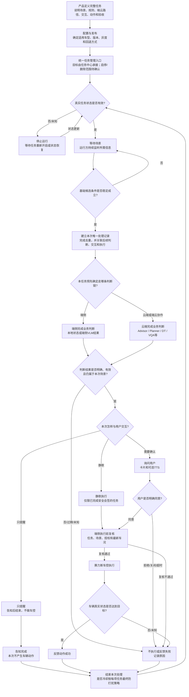
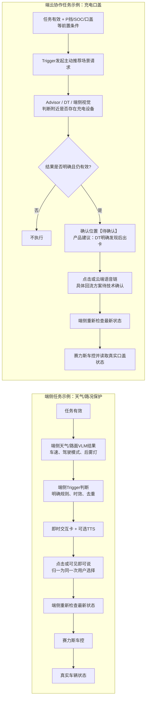
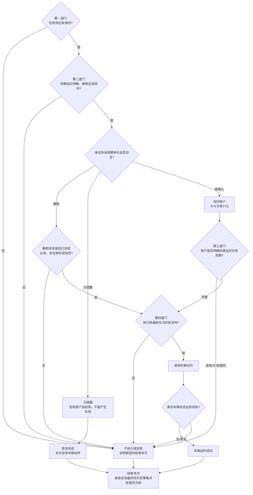
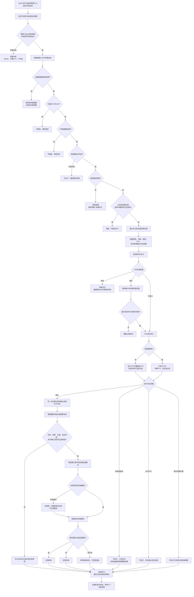
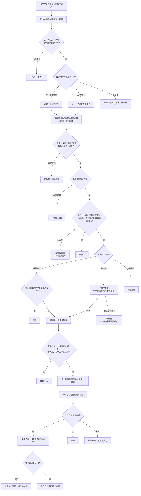
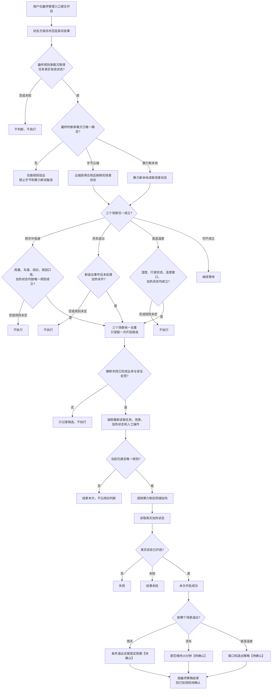
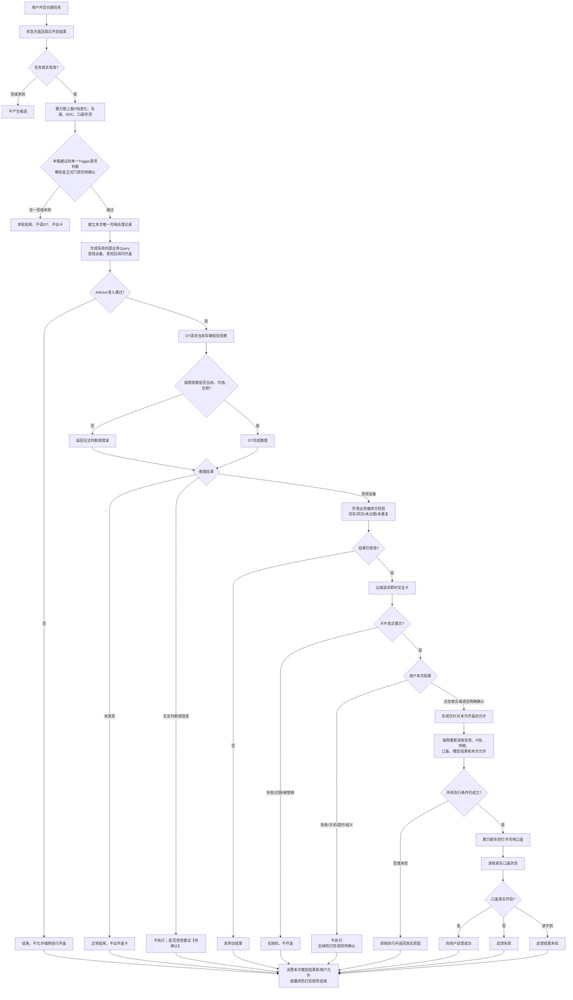

# PRD｜系统预设任务业务框架与四任务方案

> 版本：V0.9（四任务深度 Case 评审版）  
> 日期：2026-09-04  
> 产品负责人：王泽民  
> 文档状态：待业务框架评审  
> 适用范围：赛力斯系统预设任务、Trigger、即时交互卡、端云主动服务协作  
> 本版说明：在 V0.8 业务框架基础上，为天气、儿童锁、后视镜和充电口盖补充可逐步讲解的深度 Case。示例使用具体时间和值帮助理解，但不冒充真实日志、正式接口或量产参数；技术协议由框架结论明确后另行评审。

## 阅读标记

- **【已确认】**：已有 PRD、任务表或会议原文明确支持。
- **【产品方案】**：为了补齐业务闭环提出，需本次评审确认。
- **【待确认】**：资料没有形成结论，不能直接排期开发。
- **【资料冲突】**：不同资料口径不一致，必须由业务 Owner 现场拍板。

> 正文中为了行文简洁出现的“未定、待定、未拍板、尚未确认”均等同于【待确认】，不能被当作现状或已承诺能力。

---

# 1. Summary｜这次到底要解决什么

## 1.1 一句话定义

在本 PRD 的目标框架中，**系统预设任务**是系统提前定义好的一项长期服务：用户通过统一入口管理它；任务有效时，系统持续等待合适场景；场景出现后，由端侧或云端完成判断，再按预先约定的方式“直接执行、只提醒或询问用户”，最终由端侧执行车辆动作并读取真实车辆状态。当前是否由任务中心完整支持开启、关闭和删除，仍需本次评审确认。

它不是一张卡片，也不是一条 Trigger 规则，更不是执行一次就结束的普通待办。

## 1.2 当前为什么讲不清楚

现有资料分别写了任务表、Trigger 条件、VUI 卡片、可见即可说、主动推荐和 DT，但没有用一条业务主线把它们串起来，导致评审中反复出现以下问题：

1. 任务中心开关打开后，Trigger 怎样知道任务有效；
2. 哪些任务放端侧、哪些放云端，依据是什么；
3. Trigger 和即时交互卡分别负责什么；
4. 用户点击或说“好的”后，结果回给谁、谁执行；
5. 车控接口返回成功，是否就能算任务成功；
6. 四个任务的成熟度不同，却容易被理解成可以同时进入研发。

## 1.3 本 PRD 给出的统一答案

所有系统预设任务都使用同一条业务骨架：

> 定义并发布任务 → 用户通过统一入口管理 → 确认任务真实有效 → 等待并判断场景 → 选择已约定的端侧或云端链路 → 按策略交互 → 端侧执行前复核 → 调用车控 → 读取真实状态 → 结束本次处理并等待下一次场景。

端侧与云端最重要的区别是：

> **端云主要区分“在哪里完成场景判断和语义交互”；只要涉及真实车控，最终都必须回到端侧，用最新车况复核、执行并读取真实状态。**

即时交互卡与 Trigger 最重要的边界是：

> **Trigger 判断“现在要不要问”；即时交互卡负责“把问题展示给用户并收集选择”。卡片不判断天气、不识别充电桩，也不自行决定车控。**

## 1.4 本次评审必须得到的结论

先确认第 7.1 节的完整业务框架是否作为后续任务共同底座，再按下面五类问题逐项收口：

| 序号 | 必须拍板的结论 | 没有结论的后果 |
|---|---|---|
| 1. 任务状态 | 用户操作后谁保存并同步真实任务状态 | Trigger 可能在任务关闭后仍触发，或重启后丢状态 |
| 2. 端云归属 | 端侧、云端和端云协作的判断标准及四任务落位 | 端云重复判断、漏判断或职责互相推诿 |
| 3. 用户交互 | 端侧卡与云端卡各自的发起方、语音和点击回流 | 卡片能展示，但用户回应后无人承接 |
| 4. 执行安全 | 静默准入、用户授权、执行前复核和真实结果 | 使用过期结论或把请求成功误当成动作成功 |
| 5. 发布能力 | 四任务范围、配置平台缺口、Owner 和下一步 | 未决规则被误当成已确认需求进入研发 |

## 1.5 王泽民本次只需要交付四样东西

| 你的交付物 | 用来解决什么问题 | 本文对应位置 |
|---|---|---|
| 一张公共业务图 | 让所有团队认同任务从开启到车辆真实结果的完整链路 | 7.1 |
| 一张四任务决策表 | 让每条任务的条件、端云、交互、动作、成功标准和【待确认】 一眼可见 | 7.7 |
| 一张专项认领表 | 让每个缺口有 Owner 和明确产物，不再用“后面再聊”收口 | 8.3 |
| 一份验收清单 | 把任务关闭、拒绝、过期、状态变化和“车控假成功”变成可测试口径 | 7.10、各任务验收项 |

> **你可以这样理解自己的工作：**我不替研发设计接口，也不实现任务中心、卡片或车控；我要把每条任务什么时候触发、走端还是云、是否询问、用户回应后交给谁、执行前检查什么、什么真实状态才算成功讲清楚，再让对应研发认领具体实现方案。

---

# 2. Contacts｜谁决策、谁实施

## 2.1 评审角色与需要回答的问题

| 角色/模块 | 当前联系人或建议参会方 | 本次需要回答 | 应输出的结果 |
|---|---|---|---|
| 系统预设任务 / Trigger 产品 | 王泽民 | 业务框架、四任务范围、端云归属、交互和验收是否完整 | 本 PRD、任务规格、评审结论、验收清单 |
| 任务中心 | 郝晓伟及任务中心研发 | 用户开关后谁保存真实状态；怎样同步给端侧/云端；重启怎样恢复 | 状态链路图、Owner、异常处理方案 |
| Trigger 研发 | 刘杨、尹振刚及对应研发 | 能读取哪些任务状态和信号；怎样去重、复核并发起后续动作 | 可实现性结论、依赖和技术专项输入 |
| VUI / 即时交互卡 | 徐洋及卡片研发 | 端侧、云端分别怎样拉卡；展示、点击、关闭、超时怎样回传 | 卡片调用边界、回调与生命周期方案 |
| 可见即可说 | 左晨及对应研发 POC | 本地卡片出现后怎样注册按钮语音、模拟点击并注销 | 端侧语音接入方案与责任边界 |
| 主动推荐 / Static Advisor | 对应产品和研发 | 如何接收 Trigger 发起的充电场景请求并调用 DT | 云端业务链路和输入输出说明 |
| Planner | 对应产品和研发 | 云端卡片的语音如何结合当前卡片上下文理解 | 云端语音回流方案；与点击结果怎样保持一致 |
| DT / VQA / VLM | 对应模型产品和研发 | 各任务提供什么结构化判断，无法判断怎样表达 | 结果口径、有效期、质量门槛 |
| 赛力斯端状态 / 车控 | 各任务赛力斯产品及研发 | 提供哪些真实信号和车控能力；怎样回读最终状态 | 信号字典、动作限制、失败原因、回读口径 |
| 测试 | 端云与实车测试 | 如何覆盖关闭、弱网、过期、状态变化和误触发 | 全链路验收用例与实车结果 |

> 人名来自现有会议材料；正式研发 DRI 仍以评审现场确认为准。

## 2.2 王泽民本人负责什么

你负责的不是把所有模块都实现，而是把业务合同讲清楚并推动各 Owner 收口：

1. 定义一项系统预设任务从开启到结果的完整业务过程；
2. 为每个任务定义触发条件、端云路径、交互方式、执行动作和成功标准；
3. 对端侧任务，说明 Trigger / 原业务在什么情况下需要出卡，以及出卡时要提供哪些业务信息；
4. 对云端任务，说明 Trigger 何时只发起主动推荐，云端判断后由哪个原业务节点出卡；
5. 说明卡片应返回哪些用户结果，原业务收到后怎样继续或终止；
6. 把资料冲突和未知项变成有 Owner、有产物的评审问题；
7. 组织联调和验收，确认最终用户行为符合 PRD。

## 2.3 你不负责什么

- 不替任务中心研发决定底层状态存储或同步协议；
- 不替卡片研发设计正式接口、字段名和错误码；
- 不负责把可见即可说词条直接写入代码或平台；
- 不替模型团队决定推理实现；
- 不替赛力斯开发车控接口；
- 不因为业务流程已画出，就承诺未确认任务可以直接排期量产。

---

# 3. Background｜为什么现在必须做

## 3.1 业务背景

赛力斯当前提出四项系统预设任务：

1. 天气/路况保护；
2. 后排儿童/宠物识别后开启儿童锁；
3. 后视镜自动加热；
4. 识别充电设备后打开充电口盖。

四项任务看起来都是“条件满足后做一件事”，但实际能力差异很大：

- 天气需要端侧实时判断，还要用卡片询问用户；
- 儿童锁涉及安全动作，当前交互资料存在冲突；
- 后视镜主要是确定性规则，但规则和双方责任尚未统一；
- 充电需要云端模型理解周围是否有充电设备，并且仍需明确用户授权位置。

如果只把四项任务写成一张“条件—动作”表，研发无法知道任务状态、交互、车控和异常如何连起来，也无法判断哪些能力可以复用。

## 3.2 会议已经明确的方向

- **【已确认】** 下一次需要评审的是“系统预设任务整体框架能力”，不是只评 Trigger 条件。
- **【已确认】** 天气/路况保护先走端侧自闭环；端侧卡片语音先使用可见即可说，不等待离线大模型。
- **【已确认】** 云端 AI 主动服务与离线端侧任务不是同一条语音链：前者可结合卡片上下文进入 Planner；完全端侧链路不依赖 Planner。
- **【已确认】** 即时交互卡是一套共享的展示和交互容器，不是业务判断模块。
- **【已确认】** 充电口盖按“Trigger 前置判断 → 主动推荐携带 Query → DT / 端侧视觉 → 端侧执行”的既有方向继续补齐。
- **【已确认】** 当前平台只覆盖部分云端条件和动作配置；端侧任务、端云同步、卡片、TTS、二次确认还没有形成一套完整的通用配置能力。

## 3.3 当前能力与目标能力不能混写

| 能力 | 当前资料反映的状态 | 本框架要求达到的目标 |
|---|---|---|
| 任务中心展示与管理 | 已有任务中心方向；各任务开关/删除口径不完全一致 | 用户能看到并管理任务，页面显示真实处理结果 |
| 真实任务状态 | 谁保存、谁同步、重启怎样恢复尚未定稿 | 端侧和云端 Trigger 都能可靠获知任务是否有效 |
| 规则判断 | 云端已有部分配置；端侧仍依赖开发实现 | 同一任务规则、信号来源和端云归属都有明确说明 |
| 即时交互卡 | 已有多类卡片调用链路 | 端侧和云端任务都能按各自路由完成展示和回传 |
| TTS / 语音确认 | 端侧可见即可说、云端 Planner 各有能力 | 每项任务明确是否播报、由谁理解、何时失效 |
| 车控与结果 | 有赛力斯原子能力方向 | 执行前复核，且以车辆真实状态而非请求成功作为最终结果 |
| 防打扰 | 讨论过基础频控和用户负反馈 | 每项任务明确去重、冷却、拒绝后何时可以再次提醒 |

## 3.4 依据资料

- [系统预设任务评审记录](https://bytedance.larkoffice.com/docx/Zp90dGMheow4XmxwVXAcu2KGnTb)
- [系统预设任务全集](https://bytedance.larkoffice.com/wiki/SorvwQ413iamTRkzSxvcVPWtnYc?sheet=g4s4FB)
- [天气/路况保护 PRD](https://sai-seres.feishu.cn/wiki/VXEdwlChniB4lMkqQT9cPxPqnFh)
- [VUI 主交互需求](https://bytedance.larkoffice.com/wiki/FBsrwA734iaFzZkrZExcHHBtn3d)
- [可见即可说框架需求](https://bytedance.larkoffice.com/wiki/AxYjwUI8wiFCXWkdNsDcRae0nCf)
- [动态加载型工具技术方案](https://bytedance.larkoffice.com/wiki/T8jDwzwO9iiNF0kbFEVc1uyrnIf)
- 本地原始会议稿《AIVA交互卡静态advisor链路交互消息盒子评审》

---

# 4. Objective｜目标、非目标与成功标准

## 4.1 本期目标

1. 建立所有系统预设任务共用的业务框架；
2. 明确端侧、云端和端云协作任务的区分方式；
3. 明确任务中心、Trigger、即时交互卡、语音链、模型和车控的边界；
4. 把四项任务放入框架，说明各自当前结论、缺口和成熟度；
5. 给研发一份可以继续做技术方案和接口评审的完整产品输入；
6. 给测试一份可以逐条验收的用户行为口径。

## 4.2 非目标

- 本文不定义正式接口名称、代码结构、数据表或通信协议；
- 本文不决定端侧与云端的底层部署细节；
- 本文不承诺四项任务同批上线；
- 本文不把模型“可能支持”写成已具备能力；
- 本文不把系统自动生成的一句 Query 当作用户授权；
- 本文不解决宠物模式等已经移出本批范围的需求。

## 4.3 评审通过标准

评审结束后，各参与方能够用同一套口径回答：

1. 一项系统预设任务从任务中心到真实车控结果，完整经过哪些步骤；
2. 端侧与云端是按什么原则区分的；
3. Trigger 与即时交互卡分别负责什么、不负责什么；
4. 端侧卡为什么走可见即可说，云端卡为什么需要云端语义上下文，以及是否最终由 Planner 承接；
5. 用户确认后为什么还要执行前复核；
6. 为什么最终成功必须以车辆真实状态为准；
7. 四项任务中，哪些可以继续开发，哪些必须先拍板；
8. 每个待确认项由谁在什么产物中给出结论。

除“大家能讲清楚”外，还必须满足以下可验收标准：

- 任务无效或状态未知时，P0 用例中不得出卡或车控；
- 需要确认的任务，没有有效确认时不得产生车控；
- 云端判断为未知、错误或过期时不得执行；
- 同一场景不得重复提醒或重复车控；
- 车控请求成功但真实状态未达到目标时不得向用户报成功；
- 四项任务均能看到端云归属、交互、动作、成功标准、Owner 和未决项；
- 所有 P0 异常用例通过后，任务才可进入灰度。

---

# 5. Segments｜任务类型、使用者与成熟度

## 5.1 谁会受到这套需求影响

| 使用者 | 需要从本文得到什么 |
|---|---|
| 车主 / 驾驶员 | 决定任务是否开启，接收提醒或确认，看到与车辆一致的结果 |
| 当前车辆乘员 | 可能受到儿童锁、驾驶模式、灯光或开盖动作影响，需要安全和可控 |
| 新任务接入产品 | 按同一框架定义条件、端云、交互、动作和验收 |
| 运行与交互团队 | 按产品边界实现状态、判断、卡片、语音和车控链路 |
| 测试与质量团队 | 按统一成功、失败和异常口径完成端云及实车验收 |

## 5.2 端侧、云端和端云协作怎样区分

| 判断问题 | 更适合端侧 | 更适合云端 |
|---|---|---|
| 无网或弱网时是否仍必须工作 | 是 | 否，断网不触发可以接受 |
| 响应是否要求很快 | 本地状态变化后立即判断 | 可以接受上行、排队和推理耗时 |
| 条件能否用明确规则表达 | 可以，用本地信号、阈值和简单组合判断 | 需要模型、工具、历史、复杂语义或更大上下文 |
| 用户语音是否只是操作当前按钮 | 是，可用可见即可说模拟点击 | 否，需要云端理解上下文和泛化表达；是否进入 Planner 由专项确认 |
| 是否直接涉及真实车控 | 在端侧复核和执行 | 云端只能给出判断或请求，不能跳过端侧安全复核 |
| 迭代频率 | 随车版本发布，周期更长 | 策略、模型和工具可更快迭代 |

**产品判断顺序：**

1. 先问“仅凭车上当前数据能否稳定判断”；
2. 再问“断网时是否仍必须工作”；
3. 再问“是否需要模型、工具或上下文”；
4. 最后确认“车控前由端侧复核哪些安全条件”。

不要按“有没有卡片”区分端云，也不要按“有没有 Trigger”区分端云。端侧和云端都可能有 Trigger，也都可能出同一种即时交互卡；真正不同的是判断和语音理解发生在哪里。

## 5.3 四项任务当前成熟度

| 任务 | 当前建议链路 | 交互 | 当前成熟度 | 本次最重要的缺口 |
|---|---|---|---|---|
| 天气/路况保护 | 端侧判断、端侧交互、端侧执行 | 卡片 + TTS + 二次确认 | **可继续补齐**：Trigger 前半段已在开发 | 任务状态、拉卡、可见即可说、回调、执行复核和结果反馈 |
| 儿童/宠物儿童锁 | 当前更适合端侧；最终方案待安全评审 | 会议口径无卡无 TTS；旧 SLS 稿有卡/TTS | **不可直接排期完整链路** | 交互口径冲突、识别范围、左右门、安全条件、人工关闭抑制 |
| 后视镜自动加热 | 当前资料倾向云端判断、端侧执行；字节/赛力斯归属待定 | 当前无卡无 TTS | **规则与归属未收口** | P/非 P 冲突、三个场景退出条件、弱网和双方边界 |
| 识别充电设备后开盖 | Trigger 硬条件筛选（物理部署待定）+ 云端 Advisor/DT + 端侧执行 | 需要二次确认 | **可做技术专项，暂不能直接联调** | Trigger 部署、卡片插入位置、语音/点击回流、DT 结果有效期、开关关系 |

---

# 6. Value Propositions｜为什么值得建立统一框架

## 6.1 用户价值

- 用户关闭的任务不会继续打扰或执行；
- 安全相关场景在需要时及时提醒，不因断网完全失效；
- 需要授权的动作必须得到明确同意，拒绝和超时不会误执行；
- 系统只在条件仍成立时执行，不使用过期识别结果；
- 用户看到的成功或失败与车辆真实状态一致。

## 6.2 产品与平台价值

- 新任务不再从头讨论“谁判断、谁出卡、谁执行”；
- 同一种即时交互卡可以服务端侧和云端，但按不同语音路由接入；
- 四项任务的成熟度和缺口透明，避免把建议或争议误当成承诺；
- 配置平台可以按统一模板逐步补能力，而不是不断增加单任务特殊逻辑。

## 6.3 安全和排障价值

- 任务有效、场景成立、用户授权和执行安全被拆成四道独立检查；
- 云端判断不能直接绕过端侧安全门；
- 请求成功与车辆真实状态分开，避免“接口成功但车辆没变化”被误报为成功；
- 每一步都能知道主责任模块，出现问题时能快速定位是状态、规则、模型、交互还是车控。

---

# 7. Solution｜统一业务方案

## 7.1【产品方案】系统预设任务目标业务框架图



### 7.1.1 这张图怎样理解

这不是研发部署图，而是一项任务必须回答的业务问题：

| 步骤 | 主责任方 | 需要判断什么 | 产出什么 | 失败时怎么办 |
|---|---|---|---|---|
| 1. 定义任务 | 业务产品 + 各模块 Owner | 场景是否值得做，端云路径和交互是否明确 | 一份完整任务规格 | 信息不全则不得发布 |
| 2. 配置与发布 | 配置平台 / 端侧发版方 | 车型、版本、能力依赖是否满足 | 可被任务中心展示、可被运行方识别的任务 | 阻止进入目标车型 |
| 3. 用户管理 | 目标由任务中心承接 | 用户最终可进行哪些管理操作 | 用户操作及页面真实反馈 | 支持范围未确认前不能按既有能力承诺；页面不得先假装成功 |
| 4. 确认真状态 | **Owner 待任务中心专项确认** | 任务当前究竟有效还是无效 | 端侧/云端能消费的真实状态 | 未知状态按无效处理，停止运行并等待恢复 |
| 5. 形成候选 | 端侧或云端运行方 | 基础数据是否到齐、新鲜并稳定 | 一个值得继续判断的候选场景 | 数据缺失、过期或不稳定则继续等待 |
| 6. 建立本次处理 | Trigger / 本次运行方 | 同一场景是否已经被处理 | 一条能关联后续判断、卡片和执行的本次记录 | 已处理则不重复发起；具体技术标识由研发定义 |
| 7. 完成业务判断 | Trigger / 模型能力 | 端侧规则或云端模型是否得到明确、有效结果 | 本次需要提醒或执行的业务结论 | 未知、错误或过期则结束本次；是否冷却按该任务最终防打扰策略 |
| 8. 用户交互 | 本次任务业务发起方 + 即时交互卡 + 对应语音链 | 本次是静默、只提醒还是必须确认 | 告知完成，或用户明确选择及生命周期结果 | 拒绝、关闭、超时均结束本次；后续防打扰方式按该任务最终方案 |
| 9. 执行前复核 | 端侧业务 / Trigger | 最新任务、场景、授权和车况是否仍有效 | 可执行或终止结论 | 任一不满足则停止本次动作 |
| 10. 车辆执行 | 赛力斯车控 | 动作是否被车辆接受 | 请求结果 | 请求失败则按任务方案反馈 |
| 11. 真实回读 | 赛力斯端状态 + 业务方 | 车辆状态是否真的变化 | 最终动作成功、失败或未知 | 未达到目标不能报动作成功 |
| 12. 防打扰与再等待 | Trigger / 任务策略 | 是否需要冷却、哪些结果触发、何时可以再次提醒 | 下一次允许触发的时机 | 避免同一场景立即反复打扰；具体规则逐任务确认 |

## 7.2 任务中心与“任务是否有效”

### 7.2.1 任务中心是什么

**目标业务定位**是由任务中心承接用户查看和管理长期任务：展示任务，并承接评审最终确认的开启、关闭或删除操作；它不判断天气、不识别宠物、不调用车辆动作。

**【待确认】** 当前资料只确认系统预设任务被纳入任务中心范围，但本期具体支持“开启、关闭、删除”中的哪些操作尚未统一，不能把目标定位讲成现有完整能力。

### 7.2.2 Trigger 为什么必须知道任务是否有效

“天气是下雨”只说明场景出现，不说明用户仍允许系统提供天气保护服务。若本期确认任务中心提供天气任务的有效状态，Trigger 的第一道判断必须变成：

```text
任务有效
AND 业务场景条件满足
→ 才允许继续提醒或执行
```

因此，从目标业务逻辑看，“天气路况保护任务是否有效”确实是 Trigger 需要新增的一项业务前置条件。它不是天气信号，也不是车辆开关，而是用户是否允许整项任务运行；它具体从哪里读取，仍由任务中心专项确认。

### 7.2.3 期望的业务闭环

| 时机 | 任务中心侧动作 | 状态承载方动作 | Trigger 侧动作 |
|---|---|---|---|
| 用户开启 | 提交“开启任务”的操作并显示处理中 | 鉴权、保存真实结果 | 收到有效状态后才开始监听/允许触发 |
| 用户关闭 | 提交“关闭任务”的操作并显示处理中 | 保存关闭结果并同步 | 停止产生新提醒和新执行 |
| 车机或服务重启 | 展示真实状态 | 提供当前状态快照 | 重新获取状态，不能只等待下一次开关事件 |
| 状态同步失败 | 提示操作失败或状态待同步 | 保持可追溯的真实结果 | 状态未知时按无效处理 |
| 卡片排队时任务被关闭 | 页面显示已关闭 | 同步最新状态 | **【产品方案】** 撤销未展示卡；已展示卡失效，不能再执行 |

### 7.2.4 本次不能假装已有结论的地方

- **【待确认】** 谁是任务真实状态承载方；
- **【待确认】** 本期任务中心究竟支持开启、关闭、删除中的哪些操作；
- **【待确认】** 任务中心用什么方式把开启/关闭结果同步给端侧和云端；
- **【待确认】** 端侧重启后怎样主动获取当前状态；
- **【待确认】** 删除是否允许、删除后如何恢复；
- **【待确认】** 关闭任务后，正在排队、正在展示或正在推理的本次处理怎样终止。

这些问题需要郝晓伟和任务中心研发给方案。产品只定义上面的用户预期和失败边界，不替研发编造接口。

## 7.3 各模块的业务边界

| 模块 | 负责什么 | 输入 | 输出 | 明确不负责 |
|---|---|---|---|---|
| 配置平台 / 发版流程 | 保存产品定义，校验所需能力，控制车型、版本和灰度 | 完整任务规格 | 可发布的任务定义 | 不替运行时判断实时场景 |
| 任务中心 | **【产品方案】** 展示任务，承接最终确认的管理操作，并展示真实处理结果 | 展示信息、用户操作 | 操作请求、页面结果 | 不判断天气/充电设备，不直接车控；当前支持范围待确认 |
| 任务状态承载方 | 保存任务当前真实状态并同步给运行方 | 用户操作、鉴权结果 | 有效/无效/未知状态 | 不判断具体业务场景；Owner 待定 |
| Trigger | 读取任务状态和业务信号，判断条件，防止重复，决定是否发起交互或下一步判断 | 任务有效状态、端状态、结构化模型结果 | 本次业务候选、拉卡或执行请求 | 不负责卡片视觉，不理解复杂自然语言 |
| 任务业务编排方 | 把一轮 Trigger 候选、模型结果、卡片、用户选择、端侧执行和最终结果串成同一次业务；天气中可由 Trigger/天气业务承担，充电中本文简称“充电业务编排方” | 当前这一次任务处理的各阶段结果 | 下一步业务动作或终止原因 | 它是本 PRD 定义的逻辑责任，不是已确认的新系统；由 Trigger、Advisor 还是其他现有模块承载及其 Owner【待确认】 |
| VLM / DT / VQA | 对图像或复杂场景给出结构化判断 | 场景请求、必要的图像/上下文 | 发现、未发现、无法判断等结果 | 不替 Trigger 判断任务开关和所有车辆前置条件 |
| 即时交互卡 / VUI | **【产品方案】** 准入和排队，展示内容，播报可选 TTS，收集点击/语音结果，管理关闭和超时 | 哪项任务、为什么出现、展示和交互方案 | 目标需返回展示结果、用户选择和生命周期结果 | 不判断场景，不把“出卡”当成用户授权，不直接车控；具体能力待卡片专项确认 |
| 可见即可说 | 在端侧把当前可见按钮与简单语音指令对应，并模拟用户点击 | 当前顶层页面的可操作元素和语音映射 | 一次按钮操作 | 不做复杂推理，不绕过按钮直接决定业务动作 |
| Planner | 理解云端卡片上下文中的用户语音 | 用户表达、当前卡片上下文 | 云端可识别的用户意图 | 不替端侧执行安全复核 |
| Advisor / 主动推荐 | 发起和编排云端主动服务，按需调用 DT 等能力 | Trigger 发起的场景请求、上下文 | 云端判断和交互请求 | 不直接操作车辆 |
| 赛力斯端状态 / 车控 | 提供真实车辆状态，执行原子动作，返回并可被回读 | 经复核的动作请求 | 请求结果和真实车辆状态 | 不替字节定义任务、卡片和 Trigger 规则 |

## 7.4 端侧链路与云端链路



### 7.4.1 两条链路共同点

1. 都必须先确认任务有效；
2. 都需要避免同一场景重复触发；
3. 需要确认的任务都必须等用户明确同意；
4. 用户同意后都要用最新状态再检查一次；
5. 都由端侧调用真实车控；
6. 都以车辆真实状态作为最终结果。

### 7.4.2 两条链路差异

| 环节 | 端侧任务 | 云端或端云协作任务 |
|---|---|---|
| 主要判断位置 | 车端本地 | 云端模型/工具，必要时结合端侧上行 |
| 适用场景 | 本地信息足够、规则明确、强实时、弱网仍需工作 | 需要模型、工具、语义、历史或更丰富上下文 |
| 网络影响 | 无网仍可判断和交互 | 网络不可用时不使用过期结果执行 |
| 语音确认 | 当前卡片按钮走可见即可说；本质是模拟按钮点击 | 需要云端语义链；若专项选择 Planner，则语音带当前卡片上下文进入 Planner；点击同步仍待确认 |
| 迭代方式 | 更多依赖车端版本 | 云端策略和模型可更快迭代 |
| 最终车控 | 端侧复核、执行、回读 | 仍然回端侧复核、执行、回读 |

### 7.4.3 为什么不能全部放端侧，也不能全部放云端

- 全放端侧：充电设备识别、复杂上下文和泛化语音可能能力不足，策略迭代还依赖车端发版；
- 全放云端：断网会漏触发，本地状态变化无法及时响应，云端过期判断直接车控存在风险；
- 因此采用“适合的判断放在适合的位置，最终安全执行统一回到端侧”的原则。

## 7.5 本次任务业务发起方与即时交互卡怎样对接

### 7.5.1 最简单的关系

```text
本次任务业务发起方：条件满足了，现在要不要问用户？
        ↓
即时交互卡：把问题展示出来，让用户点击或说出选择。
        ↓
Trigger / 云端编排：收到用户选择后，决定继续还是结束。
        ↓
端侧执行：重新检查车辆状态，再执行并回读。
```

端侧天气中，业务发起方是天气 Trigger / 天气业务；云端充电中，更可能由充电业务编排方或 Advisor 链在模型判断后发起卡片，最终 Owner 由专项确认。因此不能把所有卡片都写成由 Trigger 直接拉起。

### 7.5.2【产品方案】业务发起方拉卡时需要说明什么

下面是为了让业务闭环成立而定义的目标产品信息，不代表卡片目前已经具备对应接口；具体字段、回传方式和支持范围由卡片专项确认。

| 必须提供的信息 | 为什么需要 | 天气示例 |
|---|---|---|
| 哪项任务、哪个子场景 | 避免把不同任务的结果串错 | 天气保护—雨/湿滑 |
| 这是本次哪一次触发 | 用户晚回复时能判断是否仍对应当前场景 | 本次雨天候选，而不是上一次雾天候选 |
| 为什么要问 | 让用户理解系统依据 | 检测到下雨或路面湿滑 |
| 要展示和播报什么 | 卡片与 TTS 保持一致 | 是否切换湿滑模式 |
| 有哪些选择 | 只能返回业务认识的标准选择 | 确认、取消 |
| 语音走哪条路 | 端侧可见即可说或云端 Planner | 端侧可见即可说 |
| 结果回给谁 | 用户选择必须回到原业务继续处理 | 回天气 Trigger / 天气业务 |
| 多久有效 | 过期后“好的”不能执行旧动作 | 具体秒数待 VUI 与业务确认 |
| 优先级和排队要求 | 不打断更重要的用户 Query 或安全提醒 | 正常排队，场景失效应撤销 |

### 7.5.3【产品方案】即时交互卡需要返回什么

下面三类结果是本 PRD 提出的目标业务合同，当前是否都能返回、怎样返回，尚未完成技术确认。

| 返回类型 | 需要包含的业务事实 | 原业务发起方拿到后做什么 |
|---|---|---|
| 展示结果 | 已接收、正在排队、真正展示、展示失败 | 只有真正展示后才开始等待用户；失败不能假装用户已看到 |
| 用户结果 | 确认、拒绝、关闭、超时、被打断，并能对应原来的本次触发 | 只有有效确认才继续；其他结果结束本次处理 |
| 生命周期结果 | 卡片何时展示、隐藏、过期、被替换或恢复 | 卡片消失后注销语音，不接受旧确认 |

执行结束后，业务还需要把“执行中、成功、失败及真实车辆状态”告诉卡片或其他结果承载界面。卡片是否保留、是否播报结果，由每项任务单独定义。

### 7.5.4 端侧卡片的语音链

1. 天气 Trigger / 天气业务判断条件成立，向即时交互卡发起一次确认请求；
2. 卡片真正显示在最上层后，本次确认/拒绝按钮需要能够被可见即可说识别；
3. **【已确认】** 可见即可说处理当前顶层可见页面，将命中的简单语音表达模拟为当前按钮操作；
4. **【待确认】** 谁负责注册按钮、通过什么通道注册，以及模拟点击后怎样把结果返回原天气业务；
5. **【产品方案】** 卡片消失、超时或被替换后，当前按钮语音映射必须失效；
6. 天气 Trigger / 天气业务收到有效确认后再检查最新车况，不因为语音匹配成功就直接车控。

业务产品需要提供确认/拒绝按钮的业务语义和可接受的简单表达；实际注册和回传由 VUI、可见即可说和 Trigger 研发在专项中分工。

**边界：**可见即可说解决的是“用户怎样用语音操作当前可见控件”，不是模型推理，也不是车控业务。

### 7.5.5 云端卡片的语音和点击链

1. Advisor / DT 等云端能力得到明确、仍有效的业务结果；
2. 在最终拍板的确认节点，由充电业务编排方或 Advisor 链发起即时交互卡；**本稿产品建议**是在 DT 明确发现充电设备后再出卡；
3. **如果专项最终选择 Planner 语音路由**，用户语音需要连同当前卡片上下文进入 Planner，由 Planner 理解泛化表达；
4. 用户点击不需要模型理解，但云端仍需要知道本卡片已被确认、拒绝或消费；
5. 得到有效授权后，将执行请求下发端侧；
6. 端侧重新检查安全条件并车控，真实状态再回传更新卡片。

**【待确认】** 云端卡型和语音路由尚未确认；点击结果是模拟 Query、上报标准事件还是走其他机制也未定。动态选择工具在会议中只是候选方案，不能写成已经接通的通用能力。

## 7.6 三种交互方式与四道业务门



四道门分别解决：

1. **任务门**：用户是否还允许这项服务运行；
2. **场景门**：当前事实是否足以支持提醒或执行；
3. **授权门**：需要确认的动作，用户是否在有效期内明确同意；
4. **执行门**：从判断到执行之间车况是否变化。

## 7.7 四任务一页总览

评审时先讲这张表，让大家先知道“哪条能继续、哪条要先拍板”，再按需要进入单任务细节。

| 维度 | 天气/路况保护 | 儿童/宠物儿童锁 | 后视镜自动加热 | 充电设备开盖 |
|---|---|---|---|---|
| 主要价值 | 行车安全提醒 | 后排安全保护 | 改善后方视野 | 降低充电准备操作成本 |
| 判断位置 | 端侧 | 倾向端侧，待安全确认 | 云端规则候选与赛力斯自闭环待定 | Trigger 硬条件位置待定 + 云端模型判断 |
| 模型能力 | 端侧 VLM 给结构化天气/路面结果 | 儿童乘员监测（OMS）结果 + 猫狗 VLM；旧 SLS 规则稿仅作口径对照 | 不需复杂模型 | Advisor + DT/VQA + 端侧视觉 |
| 当前交互 | 卡片 + TTS + 二次确认 | 最新会议无卡无 TTS，与旧 SLS 稿冲突 | 无卡无 TTS | 需要卡片和二次确认，位置待定 |
| 语音 | 本地可见即可说 | 若最终出卡则倾向本地 | 无 | 云端 Planner 路由待定 |
| 执行 | 端侧复核后车控 | 端侧复核后车控 | 端侧复核后车控 | 端侧复核后车控 |
| 成功标准 | 真实模式/灯状态 | 真实儿童锁状态 | 真实加热状态 | 真实口盖状态 |
| 当前成熟度 | 前半段可继续，后半段先专项收口 | 安全、交互、部署未定，不能直接排完整研发 | 规则与双方归属未定 | 先做云端、卡片和端侧执行技术专项 |
| 最重要的未决项 | 任务状态、拉卡、语音注销、复核、结果 | 静默还是确认、左右门、安全门槛 | P/非 P、退出、字节/赛力斯归属 | Trigger 位置、卡片位置、点击/语音回流、结果有效期 |

## 7.8 四项任务详细方案

### 7.8.0 本章怎么读：Case 不是“列条件”，而是完整演算一次业务

本章中的 Case 以用户提供的“条件任务注册”示例为最低讲解深度，但不会机械照搬 Planner 链路。两者的起点不同：

- 用户临时说“十分钟后关座椅加热”时，Planner 需要先理解并改写用户 Query，再把它注册为临时条件任务；
- 本 PRD 的四条任务由产品预先定义，用户无需每次重新说一句 Query；用户最终可以进行哪些管理操作、是否统一由任务中心承接，仍待本次评审确认；
- 因此端侧任务会明确写“本步不经过 Planner”；充电口盖这样的云端任务会展开系统生成 Query、Advisor 和 DT，只有最终选择云端开放语音路由时，用户语音才进一步由 Planner 结合卡片上下文理解。

为了避免再次只看到一个框架，每个深度 Case 都必须回答下面十个问题：

| 必须回答 | 本章具体写法 |
|---|---|
| 1. 用户做了什么 | 任务何时被开启、用户当前是否在交互 |
| 2. 系统一开始拿到什么 | 用具体时间、车速、挡位、模型结果和目标能力状态还原现场 |
| 3. 信息从哪里来 | 任务状态、端状态、VLM/OMS/DT 分别由谁提供 |
| 4. 谁逐项判断 | 每条 AND/OR、阈值、时效、去重由哪个业务模块处理 |
| 5. 中间结论代表什么 | 候选、模型正结果、用户确认和真实成功不得混为一谈 |
| 6. 下一步给谁什么 | 用产品语言写业务目标、原因、选项和结果归属，不伪造正式接口字段 |
| 7. 用户看到什么 | 何时出卡、是否播 TTS、点击和语音分别去哪 |
| 8. 状态变化怎么办 | 每一步都写否、未知、过期、排队、断网或冲突时停在哪里 |
| 9. 什么才算成功 | 车控被接收不算成功，必须读取真实车辆状态 |
| 10. 评审要拍板什么 | 将资料冲突和未知项明确列为问题、Owner 和产物 |

每个 Case 都先分清以下四个结果：

| 中间结果 | 只说明什么 | 不能说明什么 |
|---|---|---|
| 端侧确定性 Trigger 规则通过 | 按当前有效本地数据，场景规则已经成立 | 不代表经过交互等待后，执行时仍然成立 |
| 充电硬条件 Trigger 通过 | 值得启动一次云端设备判断 | 不代表附近已经发现充电设备 |
| 模型返回正结果（仅适用于模型任务） | 模型认为本次场景成立 | 不代表用户已授权，也不代表结果永不过期 |
| 用户确认（仅适用于需确认任务） | 用户同意本次动作 | 不代表此刻车况仍允许执行 |
| 车控请求被接收 | 请求已经交给车辆 | 不代表车辆真实达到目标状态 |

> 下文所有演示时间和演示值都只为了把一次业务讲清楚，不是正式日志、正式接口、正式信号名或新增量产阈值。正式值仍以每条任务标注的【已确认／产品方案／待确认／资料冲突】为准。

本章涉及的缩写先用人话说明：

- **OMS**：乘员监测能力，用来给出车内乘员相关结果；正式来源、结果口径和有效期仍需确认；
- **SLS 规则稿**：赛力斯此前的主动服务规则资料，不是另一个乘员传感器；
- **`con_occGroup`**：旧 SLS 规则稿中用于表达乘员组合的名称，本稿仅用于指出旧资料口径，不把它当作已确认正式字段；
- **VLM**：视觉理解能力，本框架只消费它给出的结构化结果，不要求 Trigger 直接读取原始图片；
- **DT/VQA**：云端按需调用的推理/视觉问答能力，用于回答规则信号本身无法回答的问题。

### 7.8.1 任务一：天气/路况保护

#### A. 业务目标

车辆在雨、雪、浓雾或对应路面风险中行驶时，在相关驾驶模式或灯光尚未开启的情况下询问用户；用户确认后，开启湿滑模式、雪地模式或后雾灯。

#### B. 当前结论

| 项目 | 结论 |
|---|---|
| 端云路径 | **【已确认】端侧自闭环** |
| 任务中心 | **【已确认】** 天气 PRD V1.1 的需求口径是将任务开关放入任务中心、出厂默认开启，并要求支持开关状态记忆；量产默认值、任务中心本期能力、记忆实现和真实同步链路待确认 |
| 场景输入 | **【待确认】** 当前规则输入方向为端侧 VLM 天气/路面结果 + 车速 + 驾驶模式/后雾灯状态；正式字段、来源、时效和准确率尚未收口 |
| 行驶门槛 | **【已确认】** 当前 SLS 资料写车速大于 30 km/h；正式边界值和单位由信号专项再核对 |
| 用户交互 | **【已确认】** 即时交互卡 + TTS + 二次确认；本地语音走可见即可说 |
| 当前进度 | **【已确认】** Trigger 前半段研发在做；后续交互和结果闭环尚未收口 |
| 成功标准 | **【产品方案】** 真实湿滑/雪地模式或后雾灯状态达到目标 |

#### C.【产品方案】三个子场景的触发条件

下表按天气 PRD 的三个子场景表达当前产品方案。旧 SLS 原子能力总表对部分动作组合存在不同写法，因此“一个子场景只做表中单一动作，还是要组合执行多个动作”仍需天气业务和车控 Owner 拍板。

| 子场景 | 需要同时满足 | 询问 | 用户确认后的动作 |
|---|---|---|---|
| 雨 / 路面湿滑 | 任务有效；车速 > 30 km/h；天气=下雨或路面=湿滑；当前不是湿滑模式 | 是否切换到湿滑模式 | 切换湿滑模式 |
| 雪 / 路面覆雪结冰 | 任务有效；车速 > 30 km/h；天气=下雪或路面=覆雪/结冰；当前不是雪地模式 | 是否切换到雪地模式 | 切换雪地模式 |
| 浓雾 | 任务有效；车速 > 30 km/h；天气=浓雾；后雾灯关闭 | 是否打开后雾灯 | 打开后雾灯 |

任何必需输入为未知、过期或“无法判断”时，不出卡、不执行。

#### D.【产品方案】一次雨天任务的目标完整链路

> 以下数值用于讲解业务，不是正式接口样例。

1. 用户已在任务中心开启“天气/路况保护”；
2. 车辆正在行驶，车速为 46 km/h；
3. 端侧 VLM 给出“天气=下雨”或“路面=湿滑”的结构化结果；
4. 车辆当前处于普通驾驶模式，湿滑模式未开启；
5. Trigger 逐项判断“任务有效、车速满足、天气/路面成立、目标模式未开启”；
6. **【待确认】** VLM 结果需要连续多少周期稳定后才出卡；资料中出现过“三周期”，但后续又有删除痕迹，不能直接写死；
7. 条件稳定后，Trigger 请求即时交互卡展示“检测到下雨或路面湿滑，是否切换湿滑模式”，按钮为“确认/取消”，并携带本地可见即可说路由；
8. 卡片真正显示后才开放按钮语音。用户点击“确认”，或者说出能匹配当前确认按钮的简单表达；
9. 卡片把“本次雨天询问已确认”返回给天气 Trigger；
10. Trigger 重新读取任务状态、车速、天气/路面和驾驶模式；
11. 如果任何条件已变化，例如任务被关闭、路面恢复或用户已手动切换模式，本次不再执行；
12. 条件仍成立时调用赛力斯车控切换湿滑模式；
13. 请求返回后继续读取真实驾驶模式；只有真实状态变为湿滑模式，才向用户反馈成功；
14. **【产品方案】** 本次结束后按最终确认的防打扰策略处理并等待新天气场景；是否设置冷却、触发冷却的结果类型和时长均【待确认】。

#### E. 各模块在天气任务中做什么

| 模块 | 本任务职责 |
|---|---|
| 任务中心/状态方 | 提供天气任务的真实有效状态 |
| 端侧 VLM | 输出天气和路面结构化结果，不输出车控决定 |
| 端侧 Trigger | 判断任务、车速、场景和目标状态；发起卡片；接收选择；复核并调用车控 |
| 即时交互卡 | 展示三个子场景对应文案和按钮，播报 TTS，返回展示/选择/生命周期结果 |
| 可见即可说 | 在卡片可见期间把简单语音映射为当前按钮操作 |
| 赛力斯车控/端状态 | 执行模式或灯光动作，并提供真实状态回读 |

#### F. 异常与验收

- 任务关闭：即使下雨也不出卡；
- 车速不满足、数据过期或目标能力已开启：不出卡；
- 拉卡排队期间天气恢复：撤销或展示前拦截，不再询问；
- 用户拒绝、关闭或超时：不执行；
- 卡片消失后再说“好的”：不能执行旧动作；
- 用户确认后车速或天气变化：执行前复核失败，不执行；
- 车控请求成功但真实模式未变化：最终显示失败或未知，不能显示成功；
- 语音被禁用：**【已确认】** 会议接受“保留卡片点击、不播 TTS”作为天气安全提醒的降级方向；是否适用于所有子场景需最终确认；
- 无网：目标是端侧判断、卡片和本地确认仍可工作；需由端侧卡片能力完成实车确认，当前不能写成已实现现状。

#### G. 天气任务待拍板

1. 任务状态怎样从任务中心同步到端侧 Trigger；
2. Trigger 调用哪项即时交互卡能力，展示失败怎样回传；
3. 按钮语音由卡片统一注册还是天气业务分别注册；
4. 卡片有效期、强聆听时长和注销时点；
5. VLM 结果防抖周期、过期标准和复合天气优先级；
6. 用户拒绝后多久可再次提醒；
7. 天气恢复后的“关闭雾灯/恢复常用模式”是否同样需要卡片确认；
8. 旧 SLS 原子能力总表与三个子场景动作存在组合冲突，最终每个子场景执行单一动作还是动作组合；
9. 成功、失败和条件变化时的卡片/TTS 文案。

#### H. 深度 Case｜08:16 的雨／湿滑场景，系统到底怎样一步步工作

##### H1. 这个 Case 先验证什么

本 Case 验证的不是“天气条件能不能写成一行规则”，而是：

> 用户开启长期任务后，端侧怎样获得任务状态和当前场景，怎样只形成一次有效询问，卡片怎样把用户选择交回天气业务，天气业务怎样重新检查并执行，最后怎样确认车辆真的进入湿滑模式。

本 Case 的证据边界如下：

- **【已确认】** 天气/路况保护走端侧自闭环；
- **【已确认】** 雨/湿滑方向的主要条件包括任务有效、车速大于 30 km/h、天气为下雨或路面为湿滑、当前未开启湿滑模式；
- **【已确认】** 条件命中后需要即时交互卡、固定 TTS 和用户二次确认；
- **【已确认】** 本地语音方向是“可见即可说”，不经过 Planner；
- **【产品方案】** 用户确认后重新读取最新状态，复核仍通过才车控，以真实驾驶模式回读作为成功标准；
- **【待确认】** 任务真实状态的承载和同步、VLM 稳定周期与有效期、卡片调用与回传、可见即可说注册、冷却、各类时限。

##### H2. 本次演示现场

假设本次演示发生在 **2026 年 9 月 4 日 08:16:20**，车辆正在道路上行驶。

在 08:00:00，用户已经通过最终确认的统一任务入口提交“开启天气/路况保护”。入口先显示处理中；任务状态承载方确认保存成功后，入口再显示开启，端侧 Trigger 获取到真实有效状态。若保存失败、状态仍未知或端侧没有同步到，本次 08:16 的雨天不能开始运行。这里描述的是【产品方案】目标闭环；入口是否完全由任务中心承接、状态由谁保存和怎样同步仍【待确认】。

| 业务输入 | 本次演示值 | 谁提供 | 本次用来判断什么 | 不明确时怎么办 |
|---|---:|---|---|---|
| 天气保护任务状态 | 有效 | 任务状态承载方，Owner【待确认】 | 用户是否允许这项长期服务运行 | 无效或未知均不继续 |
| VLM 天气结果 | 下雨；产生于 08:16:19.800 | 端侧 VLM | 是否形成雨天候选 | 过期、无法判断时不触发 |
| VLM 路面结果 | 湿滑；产生于 08:16:19.800 | 端侧 VLM | 是否形成湿滑候选 | 过期、无法判断时不触发 |
| 车速 | 46 km/h；读取于 08:16:20.000 | 赛力斯端状态 | 是否大于 30 km/h | 缺失或单位未确认时不触发 |
| 当前驾驶模式 | 普通模式 | 赛力斯端状态 | 是否仍需要推荐湿滑模式 | 已是湿滑模式则结束 |
| 语音禁用状态 | 未禁用 | 语音禁用模块 | 是否播放固定 TTS | 禁用时只保留卡片点击 |
| 当前交互 | 没有正在处理的用户 Query | VUI/交互系统 | 立即展示还是排队 | 有高优先级交互则排队或抑制 |
| 本任务运行情况 | 无同场景卡片；本次演示假设不受防打扰限制 | 天气 Trigger/业务 | 是否属于重复触发 | 去重及是否采用冷却、规则和时长均【待确认】 |

本次逐项求值为：

```text
任务有效 = 是
AND 车速 46 km/h > 30 km/h = 是
AND（天气=下雨 OR 路面=湿滑）= 是
AND 当前湿滑模式未开启 = 是
AND 必需数据明确且未过期 = 本次演示假定通过
AND 当前没有同场景处理中记录 = 是
→ 形成一次“雨／湿滑保护”候选
```

这里的“OR”是当前任务规则方向。天气/路面的正式枚举、时效、质量要求和多天气同时出现时的优先级仍需专项确认。

##### H3. 这一条没有 Planner Query 改写，为什么

| 对比项 | 临时条件任务示例 | 本次天气系统预设任务 |
|---|---|---|
| 任务从哪里来 | 用户临时说一句话 | 产品已预设，用户无需每次重说 Query；具体可管理操作及入口【待确认】 |
| 是否需要 Planner 理解 Query | 需要 | 不需要 |
| 条件如何形成 | Planner 解析用户表达 | 任务定义中已写明规则，Trigger 直接求值 |
| 触发后通知谁 | 通知 Planner 继续处理 | 天气业务直接请求即时交互卡 |
| 用户语音由谁理解 | Planner | 当前可见按钮由本地可见即可说处理 |

所以本 Case 的起点不是“用户说一句 Query”，而是“任务已经有效，端侧状态发生变化”。如果研发把它接回 Planner 才能出卡，就偏离了当前端侧自闭环结论。

##### H4. 完整业务流程图



##### H5. 逐步演算：每一步谁做、拿什么、判断什么、交给谁

| 步骤与演示时间 | 谁／在哪里做 | 收到什么 | 逐项判断或处理 | 输出给谁 | 失败或未知怎么办 |
|---|---|---|---|---|---|
| 0｜08:00:00 用户开启任务 | 最终管理入口+任务状态承载方 | 用户开启意图 | 用户/车辆是否有权限、任务是否适用、状态是否保存成功 | 真实有效状态同步给端侧 Trigger，并把真实结果回显给用户 | 保存失败不显示开启；端侧未取得有效状态时不运行；具体入口和状态 Owner【待确认】 |
| 1｜08:16:20.000 读取任务 | 任务状态方→端侧 Trigger | 天气任务当前状态 | 有效、无效还是未知 | 有效状态进入本轮场景判断 | 无效或未知：本轮结束 |
| 2｜08:16:20.010 收集现场 | 端侧 Trigger | VLM 天气/路面、车速、驾驶模式 | 必需输入是否齐全、属于当前车辆 | 形成当前场景快照 | 任一必需输入缺失：继续等待 |
| 3｜08:16:20.015 检查时效 | 端侧 Trigger | 各结果值和产生时间 | 是否仍能代表当前场景 | 有效输入集合 | 过期或无法判断：不形成候选；正式结果有效时长【待确认】 |
| 4｜08:16:20.020 判断场景 | 端侧 Trigger | 下雨、路面湿滑 | 是否命中“下雨 OR 湿滑” | 雨/湿滑候选 | 两项都不成立：继续监听 |
| 5｜08:16:20.025 判断车速 | 端侧 Trigger | 46 km/h | `46 > 30` 是否成立 | 车速门通过 | 小于等于 30 或未知：不触发 |
| 6｜08:16:20.030 判断目标状态 | 端侧 Trigger | 普通模式 | 湿滑模式是否已开启 | 仍需要询问用户 | 已开启或状态未知：不出卡 |
| 7｜随后若干周期做稳定判断 | 端侧 Trigger | 连续天气/路面结果 | 场景是否稳定到可询问 | 稳定候选 | 反复变化：继续观察；周期数【待确认】 |
| 8｜稳定后做去重 | Trigger/天气业务 | 当前候选、处理中记录、最终防打扰状态 | 同一雨天是否已有卡、正在执行或命中最终频控规则 | 仅保留一次候选 | 重复候选直接抑制；去重口径、是否采用冷却及规则【待确认】 |
| 9｜去重通过后建立本次记录 | 天气业务/Trigger | 本次稳定候选 | 后续卡片、用户回应和动作怎样只属于这次 | 一次可追踪的业务处理记录 | 记录创建失败：不出卡；正式技术标识【待确认】 |
| 10｜准备卡片内容 | 天气业务/Trigger | 场景原因和目标动作 | 为什么问、问什么、有哪些选择、语音去哪、多久有效 | 交给即时交互卡的完整业务内容 | 任一必要内容未定义：不能进入联调 |
| 11｜约 08:16:21 请求卡片 | Trigger→即时交互卡 | 本次业务内容 | 卡片是否受理、排队或失败 | 展示处理结果回天气业务 | 创建失败：不执行；正式调用能力【待确认】 |
| 12｜排队期间复核 | 天气业务/Trigger | 卡片仍排队、最新任务和场景 | 等到展示时是否仍值得问 | 继续等待或撤销 | 天气恢复、任务关闭、模式已开：撤销 |
| 13｜约 08:16:23 真正展示 | 即时交互卡/VUI | 正文、按钮和本次有效状态 | 卡片是否成为当前可见交互 | 用户看到确认卡 | 未真正显示不能算用户已看见 |
| 14｜展示时决定 TTS | 天气业务+语音模块+VUI | 语音禁用状态 | 是否允许播固定 TTS | 正常为卡片+TTS；禁用为仅卡片 | 正式状态获取方式【待确认】 |
| 15｜卡片可见期间注册语音 | VUI/可见即可说/天气业务 | 当前确认、取消按钮及简单表达 | 语音是否对应当前可见按钮 | 模拟一次当前按钮操作 | 谁注册、如何注册和回业务【待确认】；卡片消失即注销 |
| 16｜用户做选择 | 即时交互卡+本地语音链 | 点击或本地语音 | 确认、取消、关闭、超时还是打断 | 结果回到本次天气处理 | 除有效确认外一律不车控 |
| 17｜约 08:16:27 确认回业务 | 卡片/VUI→天气业务 | “本次雨天询问已确认” | 是否属于当前这次、卡片是否仍有效、是否已消费 | 允许进入执行前复核 | 串到旧卡、已过期或重复：拒绝 |
| 18｜08:16:27.050 执行前复核 | 天气业务/端侧 Trigger | 最新任务、天气、路面、车速、模式、本次确认 | 所有执行门是否仍同时成立 | 允许执行或具体终止原因 | 任一条件变化：不调用车控 |
| 19｜复核通过后车控 | 端侧天气业务→赛力斯车控 | 切换湿滑模式的业务动作 | 当前车型和当前状态是否允许 | 请求被接收、拒绝或超时 | 正式能力、限制和错误原因【待确认】 |
| 20｜请求后读取真实状态 | 赛力斯端状态→天气业务 | 最新驾驶模式 | 车辆是否真的进入湿滑模式 | 成功、失败或未知 | 请求成功但状态未变，不能报成功 |
| 21｜结果反馈 | 天气业务→VUI | 真实状态与失败原因 | 用户最后应看到什么 | 成功、失败或未知提示 | 卡片保留方式和结果 TTS【待确认】 |
| 22｜结束本次并处理防打扰 | Trigger/天气策略 | 用户结果和执行结果 | 是否需要冷却、哪些结果触发、多久不再询问 | 若方案确认则形成防打扰记录 | 是否采用、时长、是否按一次上电周期处理均【待确认】 |
| 23｜恢复等待 | 端侧 Trigger | 最新任务与新场景 | 是否出现真正的新天气风险 | 下一次候选 | 天气恢复后的反向动作属于独立场景，仍【待确认】 |

##### H6. 天气业务需要交给即时交互卡什么

下表是产品业务合同，不是正式接口字段。

| 信息 | 本次雨/湿滑示例 | 为什么必须给 | 当前状态 |
|---|---|---|---|
| 任务和子场景 | 天气保护；雨/湿滑 | 让卡片知道本次是谁发起 | 正式标识【待确认】 |
| 出卡原因 | 检测到下雨或路面湿滑 | 让用户理解为什么被打扰 | 最终文案【待确认】 |
| 询问 | 是否切换湿滑模式 | 明确用户授权对象 | 方向已确认 |
| 正向/负向选择 | 确认切换／取消 | 将用户行为变成明确结果 | 正式按钮文案【待确认】 |
| 固定 TTS | 与本次询问一致的播报 | 用户不看屏幕也能知道问题 | 文案、播报时机【待确认】 |
| 语音处理方式 | 本地可见即可说 | 避免误接入云端 Planner | 方向已确认，注册链路【待确认】 |
| 结果接收方 | 本次天气业务/Trigger | 避免点击无人承接或串到旧场景 | 回传方式【待确认】 |
| 有效期 | 必须有 | 卡片过期后旧“好的”不能车控 | 时长和注销点【待确认】 |
| 交互优先级 | 不抢占更高优先级用户 Query | 防止主动服务打断用户 | 仲裁规则【待确认】 |
| 过期行为 | 撤销卡片并注销按钮语音 | 防止使用旧场景和旧确认 | 撤销能力【待确认】 |

##### H7. 用户五种行为分别怎样收口

| 用户行为 | 天气业务收到的含义 | 是否允许车控 |
|---|---|---|
| 点击确认 | 用户同意当前这一次切换 | 仍需执行前复核，复核通过才允许 |
| 用可见即可说确认 | 等同当前卡片的确认按钮 | 仍需执行前复核 |
| 点击取消或明确拒绝 | 用户不同意本次动作 | 否，结束本次；后续是否冷却及规则【待确认】 |
| 直接关闭卡片 | 没有取得本次确认 | 否，同时注销语音映射 |
| 无操作超时或被打断 | 本次询问已失效 | 否，之后再说“好的”不能消费旧记录 |

##### H8. 用户确认后还必须重新检查什么

1. 天气任务仍有效；
2. 天气仍为下雨，或路面仍为湿滑；
3. VLM 结果仍新鲜、明确；
4. 车速仍满足最终门槛；
5. 湿滑模式仍未开启；
6. 本次确认确实属于当前卡片、当前处理且未过期；
7. 没有更高优先级安全状态阻止动作；
8. 当前车型具备本次车控能力。

第 7、8 项的正式安全条件、能力可用状态和信号仍需赛力斯车控专项确认。

##### H9. 什么才算成功

```text
用户确认 ≠ 湿滑模式已打开
车控请求被接收 ≠ 湿滑模式已真实打开

只有赛力斯端状态回读到：当前真实驾驶模式 = 湿滑模式
→ 才能告诉用户“已切换湿滑模式”
```

请求超时但真实回读已是湿滑模式，是否按已达到目标收口，应由结果专项确认；请求返回成功但真实状态仍是普通模式，只能判失败或未知。

##### H10. 评审时可直接照读

> 以 8 点 16 分这次雨天为例，Trigger 先拿到任务有效状态，再读取端侧 VLM 和车况。当前车速 46，天气下雨、路面湿滑，车辆还在普通模式，所以业务条件通过。接下来不能马上反复出卡，还要等结果满足最终稳定要求，并检查同一雨天有没有正在处理的卡片；是否再叠加冷却，要按本次评审最终的防打扰方案。去重后，天气业务把为什么问、问什么、确认和取消、固定 TTS、本地可见即可说方式以及本次多久有效交给即时交互卡。卡片真正显示后才能接收点击或本地语音；语音被禁用时只保留点击。用户取消、关闭、超时都不执行。用户确认也不直接车控，Trigger 还要重新检查任务、天气、车速、模式和本次确认是否仍有效。全部通过后才调用赛力斯切换湿滑模式。最后不是看请求有没有成功，而是看真实驾驶模式有没有变成湿滑模式。任务状态同步、卡片调用与回传、可见即可说注册、稳定周期、防打扰和状态回读方式，仍需要对应 Owner 在专项中确认。

### 7.8.2 任务二：后排儿童/宠物识别后开启儿童锁

#### A. 业务目标

车辆进入行驶状态、后排存在儿童或已支持的宠物，并且儿童锁尚未开启时，降低后排误开车门风险。

#### B. 当前能确认到什么程度

| 项目 | 结论 |
|---|---|
| 判断位置 | **【产品方案】** 本地信号足以完成主要规则，更适合端侧；正式部署仍需研发确认 |
| 儿童信号 | **【待确认】** 当前输入候选为赛力斯乘员监测（OMS）结果；旧 SLS 规则稿提供过人群口径参考，但不是信号来源。正式来源、字段、枚举、时效和准确率需端状态 Owner 确认 |
| 宠物信号 | **【已确认】** 字节 VLM 当前仅明确评估猫/狗，约低频识别；具体上报方式待确认 |
| 触发时机 | **【资料冲突】** 较新任务表为“非 P 档持续判断”；旧 SLS 稿为“档位切入 D 时触发” |
| 识别对象 | **【资料冲突】** 较新任务表为“儿童或猫狗”；旧 SLS 稿只写“儿童/老人和儿童”人群，没有宠物条件 |
| 其他基础条件 | 任务有效；儿童锁未开启；安全条件通过 |
| 交互 | **【资料冲突】** 9 月 1 日会议口径为无卡、无固定 TTS；旧 SLS 文档存在卡片/TTS 描述 |
| 动作 | 开启约定范围的儿童锁 |
| 成熟度 | 安全和交互未收口，不能直接当作已确认静默车控任务上线 |

#### C. 产品规则草案

```text
任务有效
AND 车辆处于最终确认的行车状态
AND（儿童识别=有儿童 OR 宠物识别=猫/狗）
AND 识别结果新鲜且明确
AND 儿童锁未开启
AND 执行安全条件通过
→ 按最终会签的交互策略处理
```

这里不能先写死“非 P 档就执行”。还需要安全 Owner 明确车速、车门状态、左右座位/车门映射和人工操作优先级。

#### D. 两个必须二选一的产品方案

| 方案 | 业务流程 | 优点 | 风险 |
|---|---|---|---|
| A. 静默开启 | 条件成立 → 端侧复核 → 直接开启儿童锁 → 记录结果 | 保护及时、无打扰 | 误识别可能限制后排乘员；必须先完成安全会签 |
| B. 询问后开启 | 条件成立 → 卡片/TTS（能力待专项确认）→ 用户确认 → 端侧复核 → 开启儿童锁 | 用户可控 | 提醒过慢或用户未响应时无法立即保护 |

在产品、安全和赛力斯 Owner 拍板前，PRD 只能保留两个选项，不能把其中一个写成既定事实。

#### E. 必须补齐的问题

1. 儿童锁是左右门分别控制，还是一次控制两侧；
2. 触发时机采用“非 P 档持续判断”还是“切入 D 档的一次事件”；
3. 识别范围采用“儿童或猫狗”，还是旧稿的人群口径；老人和儿童组合怎样处理；
4. 儿童和猫/狗能否定位具体座位/车门；
5. 其他宠物和“无法判断”怎样处理；
6. 识别频率、连续稳定要求和结果有效期；
7. 执行前是否必须满足车门关闭、车速门槛等条件；
8. 用户手动关闭儿童锁后，系统多久内不得自动重新打开；
9. 最终选择静默还是询问；若静默，怎样让用户可追溯；
10. 车控失败是否重试、是否提示。

#### F. 最小验收口径

- 任务关闭、P 档/不在行车状态、无人、无法判断、锁已开：均不执行；
- 识别到不支持的宠物：不执行；
- 用户刚手动关闭：在抑制期内不得立刻反向开启；
- 执行前车门或车辆状态变化：终止；
- 动作请求返回后，以真实左右儿童锁状态判断成功。

#### G. 深度 Case｜09:20 后排识别到儿童，系统能不能直接开儿童锁

##### G1. 这个 Case 先验证什么

本 Case 验证：

> 用户开启长期任务后，系统怎样取得乘员信息、判断候选场景、按最终交互策略处理、执行前再次确认安全状态，并以真实儿童锁状态结束本次执行。

它**不是**在证明儿童锁已经可以静默上线。当前存在三组资料冲突，未拍板前必须在流程中停住：

| 冲突维度 | 较新任务表／9 月 1 日口径 | 旧 SLS 规则稿 | 本稿处理 |
|---|---|---|---|
| 触发时机 | 车辆处于非 P 状态时持续判断 | 档位切入 D 的一次事件 | 保留决策门，不默认二选一 |
| 识别对象 | 后排儿童，或当前已评估的猫/狗 | `con_occGroup` 仅写儿童、老人和儿童，没有宠物 | 儿童主演算；宠物单独说明时效风险 |
| 用户交互 | 无卡片、无固定 TTS；是否静默执行仍需安全会签 | 卡片+TTS，用户正反馈后执行 | 并列两条支路，未会签不量产车控 |

##### G2. 本次演示现场

09:18:00 之前，用户已经通过最终确认的统一入口提交开启本任务。只有状态承载方保存成功、入口回显真实开启结果、运行 Trigger 取得同一真实有效状态后，下面的儿童识别才允许参与判断。入口是否完全由任务中心承接、状态怎样到端侧仍【待确认】；若状态未知，按任务无效处理。

| 时间 | 本次演示状态 | 谁提供 | 事实边界 |
|---|---|---|---|
| 09:18:00 | 用户此前已开启“后排儿童/宠物儿童锁”任务，运行侧获得“当前有效” | 任务状态承载方 | 状态 Owner、同步和恢复【待确认】 |
| 09:20:00 | 车辆由 P 挡切入 D 挡 | 赛力斯端状态 | D 事件还是非 P 持续判断存在冲突 |
| 09:20:01 | 后排存在儿童 | 赛力斯乘员监测（OMS）候选结果 | 主来源、字段、质量和有效期【待确认】 |
| 09:20:01 | 儿童锁未开启 | 赛力斯端状态 | 左右门能否分别读取和控制【待确认】 |
| 09:20:02 | 车门关闭，车速 12 km/h | 赛力斯端状态 | 是否属于正式安全门槛尚未拍板 |
| 09:20:02 | 用户近期没有手动关闭儿童锁 | 人工操作状态/策略 | 正式抑制时长【待确认】 |

当前只能先做如下候选判断：

```text
任务有效 = 是
AND 最终确认的行车触发条件 = 本次尚未拍板
AND 后排存在目标对象 = 本次儿童分支为是
AND 识别结果明确且新鲜 = 本次演示假定为是
AND 目标儿童锁未开启 = 是
AND 最终确认的安全条件通过 = 尚未拍板
AND 最终确认的交互/静默策略允许继续 = 尚未拍板
→ 当前只能形成“待安全与策略确认的候选”，不能直接写成量产车控
```

##### G3. 完整业务流程图



##### G4. 逐步演算

| 步骤与时间 | 谁／在哪里做 | 收到什么 | 逐项判断 | 输出给谁 | 失败或未知怎么办 |
|---|---|---|---|---|---|
| 0｜09:18:00 前用户开启任务 | 最终管理入口+任务状态承载方 | 用户开启意图 | 权限、车型适用、是否保存成功 | 真实状态回显给用户并同步运行 Trigger | 保存失败不显示开启；Trigger 未取得有效状态时不运行；具体入口与 Owner【待确认】 |
| 1｜09:18:00 读取任务 | 任务状态方→运行 Trigger | 用户开启结果 | 当前任务是否真实有效 | 有效状态进入监听 | 页面显示与运行状态不一致或未知：不执行 |
| 2｜09:20:00 判断触发时机 | 候选端侧 Trigger；部署【待确认】 | 当前挡位及变化 | 若采用新方案，看当前是否非 P；若采用旧方案，只看这次切入 D | 满足唯一正式方案才继续 | 两套规则不能同时运行，否则会重复触发 |
| 3｜09:20:01 获取乘员结果 | 赛力斯乘员监测（OMS）、字节端侧 VLM | 儿童或宠物结构化结果及产生时间 | 是否在支持范围内、是否明确 | 存在／不存在／无法判断 | 旧 SLS 稿只用于对照规则口径；Trigger 不读取原始舱内图片；未知和过期均不成立 |
| 4｜处理对象口径 | 儿童锁业务 | 本次为“后排有儿童” | 新旧口径是否都能映射；若换成狗则旧稿不成立 | 唯一支持范围 | Owner 未确认前不得把宠物并入量产规则 |
| 5｜09:20:01 检查目标状态 | 端侧 Trigger | 当前儿童锁状态 | 目标门锁是否已经开启 | “仍需开启”候选 | 已开启则结束；左右范围不清不能控制 |
| 6｜09:20:02 检查识别时效 | 端侧 Trigger | 识别值和产生时间 | 当前结果还能否代表现在的后排 | 新鲜的目标对象事实 | 过期或没有时间信息：不执行 |
| 7｜09:20:02 检查安全条件 | Trigger+赛力斯安全/车控 | 挡位、车速、车门、座位/门映射、人工操作 | 正式安全条件是否已会签且当前全部成立 | 允许进入交互或静默分支 | 条件未定义时停在候选态，不量产车控 |
| 8｜09:20:03 选择预先约定的策略 | 儿童锁业务 | 本次候选和已会签配置 | 是静默还是先询问 | 唯一支路 | Trigger 不能临时自行选择；策略未定则阻断 |
| 9A｜静默支路 | 端侧 Trigger | 安全会签后的候选 | 静默权限是否已批准 | 进入执行前复核 | 未批准只记录候选，不执行 |
| 9B｜确认支路 | 儿童锁业务+即时交互卡；是否接语音及其路由【待确认】 | 原因、问题、确认与取消 | 卡片是否真正展示；用户是否在有效期内明确确认 | 确认结果回本次儿童锁处理 | 拒绝、关闭、忽略、超时均不执行 |
| 10｜09:20:04 执行前复核 | 端侧 Trigger | 最新任务、行车状态、对象、识别时间、锁和安全状态 | 是否仍全部满足；若需确认，本次确认是否仍有效 | 允许执行或终止原因 | 任一变化立即终止，不能沿用 09:20:01 旧判断 |
| 11｜09:20:05 调用车控 | 赛力斯端侧车控 | 开启最终约定范围儿童锁 | 当前车型和当前状态是否支持 | 请求被接收、拒绝或超时 | 被接收不等于成功；失败进入回读与异常处理 |
| 12｜09:20:06 读取真实状态 | 赛力斯端状态→儿童锁业务 | 左右儿童锁最新状态 | 最终要求控制的门是否真实开启 | 成功、失败或未知 | 未变化不记成功；状态读不到不宣称成功 |
| 13｜09:20:07 结束本次 | Trigger/任务记录 | 本次真实结果 | 是否完成一次有效动作 | 结束本轮，长期任务仍有效 | 锁已开期间不重复执行 |
| 14｜后续人工操作 | Trigger+业务策略 | 用户主动关闭儿童锁 | 是否为明确的反向意图 | 进入人工操作抑制 | 不得立即重新开启；时长和恢复条件【待确认】 |

##### G5. 如果最终选择“先询问”，卡片支路必须补到什么深度

9 月 1 日会议只确认了较新方案“无卡、无固定 TTS”，旧 SLS 稿留下过卡片/TTS 方案；没有资料证明儿童锁已经接好了本地可见即可说。因此，如果评审最终放弃静默方向并重新选择“先询问”，不能只在图上加一个“出卡”方框，必须另开交互专项并补齐以下十步：

| 步骤 | 谁负责 | 需要给/拿到什么 | 判断与后续 | 当前结论 |
|---|---|---|---|---|
| 1. 发起询问 | 儿童锁 Trigger/业务方，物理模块【待确认】 | 本次儿童锁候选、识别原因、目标门锁范围 | 只有候选仍有效才可请求卡片 | 【产品方案】 |
| 2. 给卡片业务内容 | 儿童锁业务→即时交互卡 | 为什么问、是否开启哪一侧/双侧儿童锁、确认/取消、本次多久有效 | 控制范围未拍板时不得出执行卡 |【待确认】 |
| 3. 卡片受理与排队 | 即时交互卡/VUI | 本次卡片请求 | 返回受理、排队、真正展示或失败 | 目标能力【产品方案】，现状待卡片专项确认 |
| 4. 真正展示 | 即时交互卡/VUI | 仍有效的卡片 | 只有真正显示后才开始等待用户 | 【产品方案】 |
| 5. TTS | 儿童锁业务+VUI | 是否允许播报、播什么 | 较新会议为无固定 TTS；若改用询问方案需重新评审 | 【资料冲突】 |
| 6. 语音 | VUI/语音能力 | 当前卡片上下文和按钮 | 是否支持语音、走可见即可说还是其他路由没有结论，不能照抄天气 |【待确认】 |
| 7. 点击/语音回流 | 即时交互卡+最终语音链 | 确认、拒绝、关闭、超时或打断 | 必须回到当前这一次儿童锁处理，不能只返回“按钮被点了” | 【产品方案】 |
| 8. 非确认结果 | 儿童锁业务 | 拒绝、关闭、超时、歧义 | 结束本次，不执行；是否冷却和多久【待确认】 | 【产品方案】 |
| 9. 有效确认 | 儿童锁业务→端侧 Trigger | 只针对当前目标儿童锁的一次同意 | 不能直接车控，进入最新状态复核 | 【产品方案】 |
| 10. 卡片失效 | 即时交互卡/VUI+儿童锁业务 | 卡片关闭、过期、被替换 | 按钮和语音能力同步失效，旧“好的”不能执行 | 【产品方案】，实现方式【待确认】 |

因此，当前最准确的结论是：**较新会议方向不出卡、不播固定 TTS，但静默车控仍须安全会签；如果现场重新选择确认方案，必须先完成上述卡片专项，不能直接复用天气本地语音链作为既定能力。**

##### G6. 宠物分支为什么必须单独评审

假设 09:20 切入 D，但最近一次“后排有狗”的识别发生在 09:16：

1. 新任务表允许猫/狗，旧 SLS 稿没有宠物，先要确定唯一对象范围；
2. 即使结果为“有狗”，也必须知道它产生于何时，不能把枚举当成永久状态；
3. 当前资料提到宠物约为低频识别，09:16 的结果是否还能用于 09:20 的安全车控没有正式结论；
4. 在有效期未确认前，正确结果是“不执行”，不能把最近一次“有狗”持续当作当前事实；
5. 其他宠物、遮挡和无法判断都不能按猫/狗成功处理。

##### G7. P0 异常矩阵

| 异常 | 必须怎样处理 |
|---|---|
| 任务页面显示开启，但运行状态未知 | 不执行，先补状态同步 |
| 挡位规则尚未二选一 | 不上线两套规则 |
| OMS 与 VLM 结果冲突 | 不由 Trigger 猜优先级，等待识别专项明确主来源与冲突策略 |
| 识别结果过期或无法判断 | 不执行 |
| 只识别到未评估宠物 | 不执行 |
| 无法确定左门、右门还是双侧 | 不执行正式车控 |
| 后排车门打开或安全状态未知 | 安全规则未明确前不执行 |
| 用户确认前已经手动打开儿童锁 | 结束本次，不重复调用 |
| 用户刚手动关闭儿童锁 | 进入人工抑制，不立即反向开启 |
| 车控返回成功但锁状态未变化 | 不记成功 |
| 车控超时 | 先读真实状态，不能盲目重复调用 |
| 静默方案未完成安全会签 | 只能验证候选，不能量产执行 |

##### G8. 冷却和退出

- 儿童锁真实开启后，本次结束，长期任务仍保持有效；
- 当前资料没有要求系统自动解除儿童锁，不得自行增加“人员离开后自动关闭”；
- 锁已开启期间，即使识别结果继续上报，也不重复执行；
- 用户手动关闭后的抑制期和恢复条件为【待确认】；
- 若最终选择卡片方案，拒绝、关闭、忽略后的冷却时间也要单独确认。

##### G9. 评审必须拍板

1. 非 P 持续判断还是切入 D 触发；
2. 儿童+猫狗还是旧 SLS 人群口径；
3. 静默执行还是先询问；
4. 儿童识别唯一主来源、宠物结果有效期；
5. 左、右、双侧儿童锁控制范围；
6. 车速、车门等执行安全条件；
7. 用户手动关闭后的抑制策略；
8. 真实状态回读和失败口径；
9. 最终由哪个端侧模块承载判断与闭环。

##### G10. 评审时可直接照读

> 这条任务现在不能直接讲成“识别到儿童就静默开启儿童锁”。我先用 9 点 20 分的例子把它拆开：任务有效、车辆从 P 切到 D、OMS 识别到后排儿童、儿童锁没开，这些只能形成一个候选。接下来有三件事没有拍板：到底按非 P 持续判断还是只看切 D，儿童之外是否包含猫狗，以及静默执行还是先问用户。更重要的是，车速、车门和控制哪一侧儿童锁这些安全条件还没收口。所以正确的框架是把这些作为发布门；没会签时只记录候选，不能量产车控。规则和策略确定后，不管走静默还是询问，端侧执行前都要重新读取最新对象和车况，最后以目标儿童锁真实开启为成功。用户之后手动关闭，系统还必须尊重人工意图，不能马上反向打开。

### 7.8.3 任务三：后视镜自动加热

#### A. 业务目标

在雨天中低速、退出传送带洗车或高湿温差场景下，自动开启后视镜加热，改善后方视野。

#### B. 当前结论

| 项目 | 结论 |
|---|---|
| 当前路径 | **【待确认】** 8 月 27 日纪要倾向云端部署、端侧执行且无网不触发可接受；9 月 1 日会议重新提出赛力斯自闭环方案，最终归属未定 |
| 交互 | **【已确认】** 当前任务表为无卡、无固定 TTS；静默执行仍需安全会签 |
| 场景范围 | 第一阶段三个 P0 场景 |
| 模型依赖 | 不依赖复杂模型，主要是状态、阈值和时间窗口 |
| 责任边界 | **【待确认】** 这类传统车控规则最终应由字节还是赛力斯自闭环 |

#### C. 三个 P0 场景

| 场景 | 当前规则方向 | 动作 | 未确认点 |
|---|---|---|---|
| 雨天中低速 | 任务有效 + 下雨 + 车速 < 70 km/h + 约定行车状态 + 加热未开 | 开启后视镜加热 | 评审资料中 P/非 P 有冲突；退出时机待定 |
| 退出传送带洗车 | 任务有效 + 发生“退出洗车模式”事件 + 加热未开 | 开启后视镜加热；后续整理稿写端侧维持约 15 分钟 | 重复事件、重启恢复、15 分钟是否为正式需求 |
| 高湿温差 | 任务有效 + 湿度 > 60% + 行驶中约定窗口内温差 > 5℃ + 加热未开 | 开启后视镜加热 | 温度来源、窗口、采样和退出条件待定 |

#### D. 业务链路

1. 任务状态有效；
2. **若采用当前云端候选方案**，云端规则模块 / Trigger 监听三个 P0 场景所需的合规状态；若改由赛力斯自闭环，则由赛力斯侧承担同一业务判断；
3. 任一场景规则成立后，检查是否已在同一场景中执行过；
4. 因当前方案为静默执行，必须先有明确的安全会签；
5. 执行请求回到端侧；
6. 端侧重新检查任务、场景和加热状态；
7. 条件仍成立时调用后视镜加热；
8. 读取真实加热状态；
9. 按命中场景执行对应的持续和退出策略。

#### E. 资料冲突和待拍板

1. 雨天场景究竟要求 P 档还是非 P/行驶状态；二者不能同时成立；
2. 雨刮持续时间是否仍是条件；会议资料称因端状态不可用而移除；
3. 雨天场景条件退出后，是立即关闭还是完成一次固定加热周期；
4. 高湿温差场景的时间/里程窗口和最长加热时长；
5. 三个场景同时命中时怎样去重；
6. 用户手动关闭后多久不得再次开启；
7. 云端断网时仅不触发，还是需要任务中心解释；
8. 该任务由字节云端承接，还是由赛力斯车控侧自闭环。

#### F. 最小验收口径

- 三个场景各自正向命中并只执行一次；
- 任务关闭、加热已开、条件边界不满足时不执行；
- 70 km/h、60%、5℃边界按最终规则验证；
- 断网时不使用过期云结果；
- 用户手动关闭后不被立即反向开启；
- 请求成功但真实加热状态未开启时，结果不得记为成功。

#### G. 深度 Case｜17:42 雨天中低速，后视镜加热为什么仍不能直接上线

##### G1. 这个 Case 先验证什么

后视镜任务要验证：

> 一条无卡、无固定 TTS 的规则任务，怎样从三个场景中形成一次执行候选；在端云归属、规则和退出策略都确认后，怎样静默车控并以真实加热状态收口。

当前不能直接写成“已确定云端任务”：

- 8 月 27 日资料倾向云端判断、端侧执行，弱网本次不触发可接受；
- 9 月 1 日会议重新提出可能更适合赛力斯自闭环；
- 最终由字节云端还是赛力斯本地判断，尚未拍板。

三个 P0 场景之间是 **OR**：任一场景成立即可形成候选；但每个场景内部的条件必须全部成立。

**【产品方案】** 下文为了补齐安全闭环，建议多场景同时命中时只形成一次动作、端侧执行前使用最新状态复核、车控后读取真实状态，并为人工反向操作设计抑制规则。这些是本稿带入评审的方案，不是会议已经确认的现状。

##### G2. 主演示现场：雨天中低速

17:40:00 之前，用户已经在最终确认的统一入口提交开启本任务。状态承载方保存成功并把真实开启结果回显后，最终规则承载方才取得“任务有效”。若保存失败、状态未知或运行侧没有同步到，即使正在下雨也不得产生动作。入口和状态链路仍【待确认】。

| 时间 | 本次演示状态 | 谁提供 | 事实边界 |
|---|---|---|---|
| 17:40:00 | “后视镜自动加热”任务有效 | 任务状态方 | 状态承载与同步【待确认】 |
| 17:42:00 | 雨量状态为下雨 | 赛力斯端状态/约定数据源 | 正式来源、枚举和时效【待确认】 |
| 17:42:00 | 车速 54 km/h | 赛力斯端状态 | 当前规则方向为小于 70 km/h |
| 17:42:00 | 挡位 D，属于非 P 行驶状态 | 赛力斯端状态 | P/非 P 在资料中冲突 |
| 17:42:00 | 后视镜加热关闭 | 赛力斯端状态 | 用于避免重复开启 |
| 17:42:00 | 雨刮状态不可用 | 赛力斯端状态 | “持续刮刷 30 秒”是否删除仍需确认 |
| 17:42:00 | 没有洗车退出事件，高湿温差场景未同时成立 | 对应状态源 | 本次只演算雨天场景 |

先逐项求值，不能跳过冲突：

| 条件 | 本次值 | 原始后视镜分析 | 9 月 1 日会议表述 | 当前能否直接定 |
|---|---:|---|---|---|
| 下雨 | 是 | 要求下雨 | 要求下雨 | 可以 |
| 车速 < 70 | 54 km/h | 成立 | 成立 | 可以 |
| 挡位 | D/非 P | 原始分析要求非 P，因此成立 | 会议记录一度写 P，因此不成立 | 不可以，必须统一 |
| 雨刮持续 30 秒 | 读不到 | 原始分析包含 | 后续资料称因端状态不可用而移除 | 不可以，必须确认是否正式删除 |
| 加热未开启 | 是 | 包含 | 包含 | 可以 |

所以，在“P 还是非 P”和“雨刮是否保留”没有唯一结论前，本次只能说明**可能命中**，不能作为正式发布规则。为了演示后半段，以下暂按【产品方案】“非 P + 不再要求雨刮”继续，不代表已经拍板。

##### G3. 完整业务流程图



##### G4. 雨天场景逐步演算

| 步骤与时间 | 谁／在哪里做 | 收到什么 | 逐项判断 | 输出给谁 | 失败或未知怎么办 |
|---|---|---|---|---|---|
| 0｜17:40:00 前用户开启任务 | 最终管理入口+任务状态承载方 | 用户开启意图 | 权限、车型适用、保存是否成功 | 真实状态回显并同步唯一规则承载方 | 保存失败不显示开启；运行侧未取得有效状态时不运行；具体入口与 Owner【待确认】 |
| 1｜17:40:00 读取任务 | 任务状态方→最终规则承载方 | 后视镜任务状态 | 用户是否允许任务运行 | 有效状态进入场景监听 | 关闭或未知：不判断、不执行 |
| 2｜17:42:00 收集状态 | 赛力斯端状态→规则承载方 | 雨量、车速、挡位、雨刮、加热状态和时间 | 是否完整、新鲜、属于当前车 | 当前场景快照 | 任一关键输入未知或过期：不触发 |
| 3｜确定运行位置 | 本次框架评审 | 任务定义和部署能力 | 由字节云端还是赛力斯本地唯一判断 | 一条唯一运行链 | 归属未定时只做验证；不能两边都产生活动 |
| 4｜17:42:01 求值雨天规则 | 最终规则承载方 | 下雨、54 km/h、D、加热关闭、雨刮未知 | 按唯一会签规则逐项计算 | 雨天开启候选 | 本例只有采用“非 P+移除雨刮”才成立；否则不执行 |
| 5｜17:42:01 三场景去重 | 最终规则承载方 | 雨天、洗车、高湿温差三个结果 | 是否同时命中、是否已有动作在处理 | 一次开启动作候选 | 不能因命中两场景而执行两次；归因和冷却【待确认】 |
| 6｜17:42:01 校验静默策略 | 后视镜业务+安全 Owner | 当前候选 | 无卡无 TTS 的静默车控是否已会签 | 允许进入执行前复核 | 未会签只记录候选，不执行 |
| 7｜17:42:02 执行前复核 | 端侧执行方 | 最新任务、雨量、车速、挡位、加热和人工操作 | 是否仍满足唯一规则；用户是否刚手动关闭 | 允许执行或终止原因 | 状态变化即结束，不能沿用 17:42:01 旧结论 |
| 8｜17:42:03 调用车控 | 端侧执行方→赛力斯车控 | 开启后视镜加热动作 | 当前车型和状态是否支持 | 请求被接收、拒绝或超时 | 失败或超时仍进入真实状态读取 |
| 9｜17:42:04 真实回读 | 赛力斯端状态→后视镜业务 | 最新加热状态 | 是否真实变为开启 | 成功、失败或未知 | 只有真实开启才成功 |
| 10｜17:42:05 进入运行阶段 | 最终规则承载方+端侧 | 本次命中原因为雨天 | 后续采用哪种退出策略 | 记录本次运行场景 | 未拍板前不能擅自设定固定周期或立即关闭 |
| 11｜例如 18:03 条件变化 | 状态方→规则承载方 | 雨停、车速达到/超过 70 或挡位变化 | 是否触发正式退出 | 按最终退出方案处理 | 原始资料与后续方案不同，未拍板不得下发关闭动作 |

##### G5. 为什么端侧一定还要复核：一个状态变化例子

如果 17:42:01 云端判断成立，但请求到达端侧时车速已经升到 72 km/h：

1. 云端结果只能证明 17:42:01 曾经满足候选条件；
2. 端侧在 17:42:02 读取最新车速 72 km/h；
3. 最新状态不再满足“车速 < 70”；
4. 本次静默执行必须取消；
5. 不能因为云端已经给出建议就继续开启；
6. 长期任务仍有效，继续等待下一次符合条件的场景。

##### G6. 场景二演算：退出传送带洗车

假设 13:30:00 任务有效，收到一次新的“退出传送带洗车模式”事件，后视镜加热仍关闭：

1. 最终规则承载方先确认任务有效；
2. 确认这是一次新退出事件，不是重放或重复上报；
3. 检查加热尚未开启；
4. 当前方案为无卡、无 TTS，只有静默安全会签后才允许继续；
5. 端侧再次检查任务、退出事件有效性和加热状态；
6. 调用后视镜加热；
7. 读取真实状态，真实开启才成功；
8. 原始分析只写“满足条件后开启一次”；
9. 后续整理稿写“端侧维持约 15 分钟后关闭”；
10. 在 15 分钟是否正式、车机重启后是否恢复计时、用户手动关闭是否终止计时未确认前，不能把自动关闭写成已确认动作。

##### G7. 场景三演算：高湿度+温差

假设 07:45:00 任务有效、湿度 68%、车辆正在行驶、当前与某个历史温度相比相差 6.2℃、加热关闭：

1. 68% 表面上满足“湿度 > 60%”；
2. 车辆处于行驶状态；
3. 6.2℃ 表面上满足“温差 > 5℃”；
4. 但温差必须基于确定窗口，当前“历史温度取多久以前、哪个传感器”没有唯一结论；
5. 如果窗口没定义，就无法判断 6.2℃ 是 10 秒、1 分钟还是 10 分钟内的变化；
6. 因此本次只能记为“可能命中”，不能形成正式车控候选；
7. 必须先确认温度来源、采样频率、时间或里程窗口、最长运行和退出条件；
8. 规则确认后，仍必须走端侧复核、车控和真实回读。

##### G8. 多场景同时命中怎样处理

假设车辆刚退出洗车，同时下雨且湿度 68%：

1. 三场景是 OR，不需要执行三次；
2. 系统只能形成一次“开启后视镜加热”；
3. 需要记录主命中原因，或记录多个命中原因；
4. 重复收到同一洗车退出事件，不能重新开启或重置未确认计时；
5. 如果不同场景的退出策略不同，必须定义优先级，否则不知道何时关闭；
6. 去重方式、归因和退出优先级均为【待确认】。

##### G9. P0 异常矩阵

| 异常 | 必须怎样处理 |
|---|---|
| 任务关闭或状态未知 | 不判断、不执行 |
| P/非 P 规则未统一 | 不进入正式发布 |
| 雨刮是否删除未确认 | 不把任一版本写成唯一事实 |
| 雨量、车速、挡位或加热状态过期 | 不执行 |
| 云端候选方案下网络不可用 | 本次不触发，不使用旧云端结果 |
| 字节和赛力斯同时运行同一规则 | 发布前阻断，避免重复车控 |
| 加热已经开启 | 不重复调用 |
| 用户刚手动关闭 | 不立即反向开启；抑制策略【待确认】 |
| 洗车退出事件重复上报 | 不重复执行、不重复开始计时 |
| 高湿温差窗口未定义 | 无法形成确定规则，不执行 |
| 请求被接收但真实状态仍关闭 | 不记成功 |
| 车控超时 | 先读真实状态，不能盲目重试 |
| 条件退出 | 按最终退出方案处理；当前不得擅自关闭 |

##### G10. 冷却、退出和评审拍板

- 三场景同时或短时间连续命中，只执行一次；
- 雨天场景是条件退出还是固定周期，【待确认】；
- 洗车场景“开启一次”与“运行约 15 分钟”存在差异，【待确认】；
- 高湿温差没有正式最长运行和退出条件，【待确认】；
- 用户手动关闭后的抑制策略，【待确认】。

本条评审必须拍板：

1. 字节云端判断还是赛力斯本地自闭环；
2. 雨天要求 P 还是非 P；
3. 雨刮持续 30 秒是否正式移除；
4. 雨量是否区分等级；
5. 雨天退出后立即关闭还是固定周期；
6. 洗车场景是否正式采用 15 分钟及其重启/人工操作规则；
7. 高湿温差的数据来源、采样窗口和退出条件；
8. 多场景去重、归因和退出优先级；
9. 人工关闭后的抑制策略；
10. 真实状态和车控请求不一致时的结果口径。

##### G11. 评审时可直接照读

> 后视镜不是一个单条件任务，而是三个 OR 场景共用一次开启动作。本稿建议多场景同时命中时只执行一次。以 17 点 42 分雨天为例，下雨、车速 54、加热关闭都成立，但资料里 P 还是非 P、雨刮 30 秒是否保留还冲突，所以现在只能得到候选，不能把它写成正式量产规则。规则之外还有一个更大的决策：到底由字节云端判断还是赛力斯本地自闭环，两边不能同时跑。假设最终选云端，本稿建议端侧还要做最新状态复核；如果请求到端侧时车速已经 72，就取消本次动作。真正执行后，本稿建议以真实加热状态变成开启作为成功。洗车和高湿温差还各自缺少退出窗口，所以这次评审需要先把运行方、唯一规则、复核/回读和退出策略拍板，再谈排期。

### 7.8.4 任务四：识别充电设备后打开充电口盖

#### A. 业务目标

车辆低电量停车时，系统判断周围是否存在真实充电设备；确认存在且用户同意后，打开充电口盖，减少用户手动操作。

#### B. 为什么它不能只靠端侧规则

P 档、低电量和口盖关闭，只能说明“可能要充电”，不能证明附近真的有充电桩，也不能证明用户同意打开口盖。因此需要：

1. Trigger 用明确条件筛选值得启动的候选场景；
2. 云端主动推荐和 DT/VQA 结合端侧视觉判断是否存在充电设备；
3. 用户明确确认；
4. 端侧用最新状态复核并执行。

#### C. 当前资料共同确认的链路骨架

```text
Trigger 检测前置条件满足
→ 主动推荐携带业务 Query
→ 主动推荐调用 DT
→ 端侧按 DT 需要上行信息并获取推理结果
→ 在最终拍板的位置完成用户确认
→ 端侧复核并执行打开充电口盖
```

示例 Query 可以表达为：“帮我看一下附近有没有充电设备，如果有，询问我是否打开充电口盖。”

**关键边界：系统自动生成的 Query 只是启动云端判断，不等于用户已经授权开盖。**

**【待确认】** 当前资料对确认卡的准确位置尚未完全统一；本稿在后文提出“DT 明确发现充电设备后再询问”的产品方案，但需由充电业务、Advisor/DT 和 VUI 共同拍板。

#### D. 前置条件

| 条件 | 当前口径 | 作用 |
|---|---|---|
| 任务有效 | 统一管理入口的操作已被状态方确认为有效 | 用户允许该任务运行；具体是否由任务中心启停待确认 |
| AI 主动服务总开关 | **【待确认】** 是否必须同时开启 | 决定云端主动推荐能力是否可用 |
| 档位 | 当前资料写“变更为 P 档” | 只在停车候选场景启动 |
| SOC | 当前表格写 ≤20%；补能资料另有“用户习惯补电水平” | 筛选低电候选，口径冲突待定 |
| 充电口盖 | 关闭 | 避免重复开盖 |
| 网络与云端能力 | 可用 | 云端结果不可用时不得执行 |

#### E. 产品建议的完整步骤

1. 用户开启充电口盖预设任务；
2. 车辆切入最终确认的 P 档场景，SOC 满足阈值，口盖关闭；
3. Trigger 只做这些硬条件判断，不直接断言附近有充电设备；
4. Trigger 向主动推荐发起固定业务目标的 Query；
5. 主动推荐调用 DT，DT 根据需要请求端侧视觉/上下文；
6. 端侧完成合规数据上行或本地观察，并把结果交回本次判断；
7. DT 输出“发现、未发现、无法判断或错误”，并带结果时间；
8. 未发现、无法判断、错误或结果过期：结束本次，不出执行卡、不车控；
9. **【产品方案】** 仅在结果明确为“发现充电设备”后出卡询问：“检测到附近有充电设备，是否打开充电口盖？”；
10. 用户点击确认，或通过最终确认的云端语音链明确同意；
11. 端侧重新检查任务/总开关、P 档、车辆停稳、口盖仍关闭、判断结果和授权仍有效；
12. 条件通过后调用赛力斯车控打开口盖；
13. 读取真实口盖状态；真实状态为开启才反馈成功；
14. **【产品方案】** 同一次停车场景应避免重复询问；是否采用冷却、哪些结果触发和时长均【待确认】。

#### F. 各模块责任

| 模块 | 本任务负责内容 |
|---|---|
| 任务中心/状态方 | 提供任务真实有效状态 |
| Trigger | 判断开关、P 档、SOC、口盖等硬条件并发起主动推荐场景 |
| 主动推荐 / Advisor | 承接场景 Query，组织后续云端流程 |
| DT / VQA / 端侧视觉 | 判断是否存在充电设备，并给出明确且有时效的结果 |
| 即时交互卡 | 在最终拍板的确认节点展示问题，收集点击/语音确认，管理超时和关闭；本稿建议 DT 明确发现后出卡 |
| Planner | 如采用云端语音路由，结合当前卡片上下文理解用户表达 |
| 端侧业务 | 执行前复核并调用开盖能力 |
| 赛力斯车控/端状态 | 执行开盖并提供真实口盖状态 |

本任务后文所说的**“充电业务编排方”**，是一个产品层逻辑责任：它要接住本次 Trigger 候选、校验 DT 结果、发起卡片、接回用户选择、向端侧发执行请求并收最终结果。它不是本文臆造的现有系统；究竟由 Advisor、Trigger 后的既有业务服务还是其他模块承载，以及由谁负责，均【待确认】。

#### G. 待拍板问题

1. 任务开关和 AI 主动服务总开关是否必须同时开启；
2. “变更为 P 档”具体包含哪些档位变化；
3. SOC 使用固定 20% 还是用户习惯阈值；
4. 判断硬条件的 Trigger 物理部署在端侧还是云端；**【产品方案】** 本稿要求由单一发起方承接一次场景，避免端云重复触发，最终方案待评审；
5. DT 需要端侧上行什么、结果有哪些枚举、有效期多久；
6. 二次确认到底在 DT 前还是 DT 明确发现后；本稿建议放在 DT 后；
7. 如果最终采用 Planner 语音路由，云端卡语音怎样把确认结果回到本次充电场景；
8. 点击结果怎样同步给云端，确保同一张卡不被重复消费；
9. 弱网、DT 超时、结果未知时是否重试及频控策略；
10. 执行失败、口盖卡滞或真实状态未知时如何提示；
11. 用户拒绝后，同一停车周期是否不再询问。

#### H. 最小验收口径

- 非 P、SOC 不满足、口盖已开或任务关闭时，不发起云端判断；若评审确认 AI 主动服务总开关也是必需门禁，则该总开关关闭时同样不发起判断；
- DT 未发现、无法判断、错误或结果过期时，不出执行卡、不车控；
- 用户拒绝、关闭或超时，不执行；
- 用户确认后车辆状态变化，不执行；
- 网络断开时不使用缓存的旧结果开盖；
- 真正开盖后才反馈成功；
- 同一停车场景不会反复询问。

#### I. 深度 Case｜18:20 低电量停车后，怎样判断并询问是否开充电口盖

##### I1. 这个 Case 先验证什么

本 Case 验证：

> 车辆低电量停车后，Trigger 只筛选“值得检查”的候选；云端再判断附近是否真的存在充电设备；用户只对本次开盖明确同意；端侧用最新车况复核并执行；真实口盖状态才决定是否成功。

当前资料共同支持的骨架是：

```text
Trigger 检测前置条件
→ 主动推荐携带业务 Query
→ 主动推荐调用 DT
→ 端侧按 DT 需要提供当前观察
→ 得到推理结果
→ 在最终拍板的位置询问用户
→ 端侧复核并执行
```

**【待确认】** 硬条件 Trigger 位于端侧还是云端、确认卡准确位置、最终卡型、点击和语音回流方式尚未定稿。因此，本 Case 对“DT 明确发现后再询问”使用【产品方案】标记，不冒充既定结论。

##### I2. 先分清四个完全不同的结论

| 发生的事情 | 真正含义 | 绝对不能直接推导 |
|---|---|---|
| P 挡、低 SOC、口盖关闭 | 当前可能准备充电，值得继续检查 | 附近一定有充电设备 |
| DT 返回发现设备 | 当前有效观察中模型认为存在设备 | 用户已经同意开盖 |
| 用户确认 | 用户授权当前这一轮开盖 | 当前车况仍适合执行 |
| 真实口盖状态变为开启 | 车辆动作真正完成 | — |

尤其要强调：

> 系统生成的 Query 不是用户说的话，也不是用户授权；DT 发现设备也不能直接开盖。

##### I3. 本次演示现场

以下时间和数值只用于讲解。

| 时间 | 状态 | 本次演示值 | 谁提供 | 当前证据与未决项 |
|---|---|---:|---|---|
| 17:50:00 | 用户管理任务 | 用户提交开启本任务 | 统一任务入口 | 是否由任务中心提供完整启停控件【待确认】 |
| 17:50:01 | 任务真实状态 | 有效 | 任务状态承载方 | 谁保存、怎样同步给运行侧【待确认】 |
| 18:20:00 | 挡位 | D 切入 P | 赛力斯端状态 | 当前资料写“变更为 P”，具体变化集合【待确认】 |
| 18:20:00 | 车速 | 0 km/h | 赛力斯端状态 | 停稳标准和持续时间【待确认】 |
| 18:20:00 | SOC | 18% | 赛力斯端状态 | 任务表为不高于 20%，与习惯阈值口径冲突【待确认】 |
| 18:20:00 | 充电口盖 | 关闭 | 赛力斯端状态 | 当前规则方向明确 |
| 18:20:00 | AI 主动服务总开关 | 演示为开启 | 主动服务状态方 | 是否为独立必需门禁【待确认】 |
| 18:20:00 | 网络/云端能力 | 可用 | 端云链路 | 不可用时不得使用旧结果开盖 |
| 18:20:00 | 当前停车周期 | 尚未处理 | 充电业务/Trigger | 周期定义与冷却时间【待确认】 |

##### I4. 一句话完整数据流

```text
用户开启任务
→ 任务状态方确认真实有效
→ 赛力斯提供 P 挡、车速、SOC 和口盖状态
→ 【产品方案】由一个单一 Trigger 筛选候选；其端云位置【待确认】
→ 建立本次处理记录
→ 生成充电业务 Query
→ Advisor 准入并调用 DT
→ DT 向端侧获取当前、合规的视觉观察
→ DT 返回发现/未发现/无法判断/错误
→ 充电业务编排方校验结果
→ 即时交互卡真正展示
→ 点击或云端语音形成当前一次用户结果
→ 端侧重新检查最新状态
→ 赛力斯执行开盖
→ 读取真实口盖状态
→ 更新用户结果，并按最终防打扰策略结束本次
```

##### I5. 完整业务流程图



##### I6. 逐步业务演算

###### Step 0｜17:50:00｜用户开启长期任务

**谁负责：**统一任务管理入口、任务状态承载方。  
**在哪里做：**车机入口及对应状态服务。  
**收到什么：**用户希望开启“识别充电设备后打开充电口盖”。  
**逐项判断：**用户和车辆是否有权限、任务是否适配当前车型、保存是否成功。  
**通过后交给谁：**形成真实有效状态，让唯一运行侧能够获得。  
**用户看到什么：**先处理中，再看到真实开启结果。  
**失败或未知：**页面不得先显示开启成功，Trigger 不得按开启运行。  
**证据属性：**需要真实有效状态是【产品方案】底线；Owner 与同步方式【待确认】。

###### Step 1｜18:20:00｜车辆出现停车充电候选

**谁负责：**赛力斯端状态。  
**在哪里做：**车端。  
**收到什么：**挡位由 D 变成 P、车速 0、SOC 18%、口盖关闭。  
**逐项判断：**端状态只提供事实，不负责判断附近是否有设备。  
**通过后交给谁：**按【产品方案】交给本任务被指定的单一 Trigger，物理位置【待确认】。  
**用户看到什么：**无卡片、无 TTS。  
**失败或未知：**状态缺失、过期或单位不明时，不启动本轮。  
**证据属性：**P 挡、SOC、口盖为当前资料方向；正式信号和时效【待确认】。

###### Step 2｜18:20:00.100｜本稿建议由单一 Trigger 逐项判断候选条件

**谁负责：**【产品方案】由本任务被指定的单一 Trigger 承担，避免端云重复发起。  
**在哪里做：**端侧还是云端【待确认】。  
**收到什么：**任务状态、总开关、挡位、车速、SOC、口盖、网络和本周期处理情况。  

Trigger 依次判断：

1. 任务是否真实有效；
2. AI 主动服务总开关是否开启——仅在专项确认它是必需门禁后判断；
3. 是否发生约定的切入 P 挡事件；
4. 车辆是否达到正式停稳标准；
5. SOC 是否满足最终阈值；
6. 口盖是否仍关闭；
7. 所有状态是否属于当前车辆和当前时间；
8. 同一停车周期是否已经处理过；
9. 当前是否在拒绝、失败或防打扰冷却；
10. 网络和必要云端能力是否可用。

**通过后：**只形成“值得检查附近是否有充电设备”的候选。  
**用户看到什么：**仍然无感。  
**失败或未知：**任一必需条件不成立，本轮结束，不调用 DT、不出卡、不车控。  
**证据属性：**【已确认】当前资料明确了主动服务开关、P 挡、SOC 不高于 20%、口盖关闭等前置条件方向，以及后续进入主动推荐/DT 的链路方向，但不代表能力已实现；【产品方案】本稿补充任务真实状态、当前车辆/当前时间校验和单一场景去重；【待确认】Trigger 端云位置、主动服务总开关是否为独立门禁、停稳标准、SOC 最终口径、网络是否为前置门、停车周期和冷却规则。

###### Step 3｜18:20:00.150｜建立本次唯一处理记录

**谁负责：**最终指定的唯一运行方。  
**收到什么：**通过防抖、去重和频控的候选。  
**逐项判断：**同一车辆、同一任务、同一停车周期是否已有正在处理的一轮。  
**通过后：**建立“本次充电场景 A”；后续 Query、模型结果、卡片、用户选择、车控和回读都只能属于 A。  
**失败或未知：**已有 A 时不得再建 B，也不得重复调模型或出卡。  
**证据属性：**“整条链必须归属同一次处理”是【产品方案】；正式技术标识【待确认】。

###### Step 4｜18:20:00.200｜生成系统内部业务 Query

**谁负责：**充电业务编排方。  
**在哪里做：**进入云端主动推荐链。  
**收到什么：**本次处理 A 和已通过的硬条件。  

**【产品方案】演示 Query：**

> “帮我看一下附近有没有充电设备；如果识别到，再询问我是否打开充电口盖。”

这句话是系统交给云端的工作目标，不是用户原话。它需要同时表达“先识别”和“识别到后询问”，不能改写成“直接打开口盖”。

**通过后交给谁：**主动推荐/Advisor。  
**用户看到什么：**此时通常无感。  
**失败或未知：**Query 生成失败或本次 A 已失效，结束本轮。  
**证据属性：**【已确认】当前资料给出了主动推荐携带业务 Query 的链路方向，但不代表模板和接口已经定稿；精确模板【待确认】。

###### Step 5｜18:20:00.300｜Advisor 做云端准入

**谁负责：**主动推荐/Static Advisor。  
**在哪里做：**云端。  
**收到什么：**业务 Query、本次 A 和必要上下文。  
**逐项判断：**本次是否仍有效、是否与高优先级交互冲突、是否超过主动推荐频率、DT 是否可用、是否允许继续。  
**通过后交给谁：**调用 DT。  
**用户看到什么：**无感。  
**失败或未知：**被抑制、超时、能力不可用时结束，端侧不能自行开盖。  
**证据属性：**【已确认】当前资料给出了主动推荐/Advisor 协作调用 DT 的链路方向，但不代表能力已经完成；正式准入规则【待确认】。

###### Step 6｜18:20:00.450｜DT 请求当前车辆的视觉判断

**谁负责：**DT/VQA 编排能力。  
**在哪里做：**云端，观察来自车端。  
**收到什么：**判断当前车辆附近是否存在本任务约定范围内充电设备的目标。  
**逐项判断：**请求是否属于本车和本次 A、需要什么观察、能力是否可用、本轮是否仍在有效期。  
**通过后交给谁：**向端侧视觉能力请求当前观察。  
**失败或未知：**工具不可用或调用失败，形成“错误”，不能伪装成“未发现”。  
**证据属性：**【已确认】当前资料给出了 DT 结合端侧观察继续判断的链路方向，但不代表观察形式已经定稿；观察内容和形式【待确认】。

###### Step 7｜18:20:00.550｜端侧提供当前、可用、合规的观察

**谁负责：**端侧视觉/VQA 能力。  
**在哪里做：**车端采集或处理，并按最终方案上行。  
**收到什么：**本次视觉判断目标。  
**逐项判断：**画面或结构化观察是否可用、属于本车和本次停车场景、时间足够新鲜、质量足够、满足隐私合规。  
**通过后交给谁：**向 DT 返回当前观察依据。  
**失败或未知：**遮挡、低质量、旧数据或不允许上行时，返回“无法判断/错误”，不能猜。  
**证据属性：**观察链方向已出现于资料；上传图片、特征或本地结果及隐私策略【待确认】。

###### Step 8｜18:20:01.300｜DT 返回四类产品结果

下面四类是产品语义，不是正式枚举名：

| 结果 | 人话含义 | 后续 |
|---|---|---|
| 发现设备 | 当前有效观察中识别到约定范围的充电设备 | 校验通过后才可进入用户确认 |
| 未发现设备 | 观察有效，但没有识别到设备 | 正常结束，不出开盖卡、不车控 |
| 无法判断 | 角度、画质、遮挡或证据不足 | 不车控；是否在同一场景受控重试【待确认】 |
| 系统错误 | 网络、工具或内部处理失败 | 不车控；是否重试、是否提示【待确认】 |

每种结果还必须能被业务判断为：属于当前车辆、当前处理 A、使用当前观察、返回时仍未过期。串车、串场景或旧结果一律不得进入确认。

###### Step 9｜18:20:01.350｜充电业务编排方校验模型结果

**谁负责：**充电业务编排方。  
**在哪里做：**云端。  
**收到什么：**DT 结果和产生时间。  
**逐项判断：**是否明确为“发现”；是否属于 A；是否过期；任务和停车场景是否仍有效；本次是否已经出过卡；是否端云重复处理。  
**通过后交给谁：**最终用户确认节点。  
**失败或未知：**未发现正常结束；无法判断、错误、过期或关联错误均不出执行卡。  
**证据属性：**明确、有效、同一次处理后才能继续是【产品方案】安全边界。

##### I7. 卡片放在 DT 前还是后

**【待确认】** 当前资料没有完全拍死确认卡位置。

| 方案 | 流程 | 用户价值 | 风险 |
|---|---|---|---|
| A. DT 前先问 | 硬条件通过→先问用户→同意后调 DT→发现后执行 | 用户先知道系统准备判断 | 附近没有设备也会打扰；“同意”是同意识别还是同意开盖容易混淆 |
| B. DT 后再问 | 硬条件通过→DT 判断→明确发现→再问是否开盖 | 只在有场景依据时打扰；授权对象清晰；更接近执行时刻 | 确认前已经调用视觉能力，需先确认合规和成本 |

**【产品方案】建议采用 B：DT 明确发现且结果有效后，再询问是否打开口盖。** 最终需充电业务、Advisor/DT、VUI、Planner、隐私合规和端侧执行共同拍板。

##### I8. 按推荐方案 B 继续演算交互与执行

###### Step 10｜18:20:01.500｜发起即时交互卡

**谁负责：**充电业务编排方或 Advisor 链，最终发起方【待确认】。  
**在哪里做：**云端发起，车机 VUI 展示。  
**收到什么：**本次 A、有效“发现设备”结果、询问内容。  
**交给卡片的产品内容：**原因“检测到附近有充电设备”；问题“是否打开充电口盖”；确认/取消；有效期；是否播 TTS；语音是否进入 Planner；结果回给本次 A。  
**失败或未知：**请求失败不执行；排队期间场景失效则撤销；没有真正展示就不能形成授权。

###### Step 11｜18:20:01.700｜卡片真正展示

**谁负责：**即时交互卡/VUI。  
**在哪里做：**车机屏幕。  
**逐项判断：**卡片仍属于 A、未过期、场景未取消。  
**用户看到：**“检测到附近有充电设备，是否打开充电口盖？”  
**通过后：**才开始接受本次点击或语音。  
**失败或未知：**展示失败、关闭、被替换或超时都不能形成开盖授权。

###### Step 12A｜18:20:03.000｜用户点击

- 点击“确认”：向充电业务编排方返回“用户确认本次开盖”；
- 点击“取消”：结束本次，不开盖；
- 关闭卡片：按未同意处理；
- 重复点击：只消费第一次有效结果；
- 过期后点击：无效；
- **【待确认】** 点击最终通过标准事件、模拟 Query 还是其他方式回到云端。

###### Step 12B｜18:20:03.000｜用户语音

**【待确认】** 云端充电卡是否最终采用 Planner 语音路由。若采用，产品链路应为：

```text
用户语音 + 当前可见卡片上下文
→ Planner 理解
→ 明确确认 / 明确拒绝 / 追问 / 歧义
→ 标准结果回充电业务编排方
```

| 用户表达 | 应理解为 | 是否授权 |
|---|---|---|
| “好的，打开吧” | 明确确认当前卡片动作 | 是 |
| “不要开” | 明确拒绝 | 否 |
| “你看到什么了？” | 对模型结果的追问 | 否 |
| 只有“好的”，但有多张候选卡或上下文过期 | 无法可靠对应 | 否 |
| 卡片消失后再说“打开” | 不能消费旧卡片 | 否 |

语音识别成功不等于授权成功。点击和语音最终必须归一成同一组业务结果，而且只能消费一次。

###### Step 13｜18:20:03.100｜形成仅针对本次的用户允许

**谁负责：**充电业务编排方。  
**收到什么：**当前有效卡片的明确确认。  
**逐项判断：**是否对应 A、卡片是否真正展示且未过期、结果是否明确、是否未被消费、是否仅允许本车本动作本停车场景。  
**通过后交给谁：**把“仅允许本次开盖”的业务允许交给端侧。  
**失败或未知：**拒绝、关闭、超时、歧义、旧卡和重复结果均不下发。  
**证据属性：**一次确认只允许当前一次动作是【产品方案】；技术承载方式【待确认】。

###### Step 14｜18:20:03.200｜端侧执行前重新检查

端侧必须重新读取，不能复用 18:20:00 的旧值：

1. 充电预设任务仍有效；
2. AI 主动服务总开关仍满足——若专项确认它是门禁；
3. 挡位仍为 P；
4. 车辆仍达到停稳标准；
5. 口盖仍关闭；
6. DT 的“发现设备”仍属于本车、本次 A 且未过期；
7. 用户确认仍有效、未消费；
8. 用户没有手动做出相反操作；
9. 没有更高优先级安全状态禁止开盖；
10. 本次动作没有被重复执行。

任一项变化、未知或过期，端侧都必须拒绝，并把真实原因交回充电业务编排方。

###### Step 15｜18:20:03.300｜调用赛力斯开盖能力

**谁负责：**端侧执行层、赛力斯车控。  
**收到什么：**通过最新复核的单次开盖请求。  
**逐项判断：**当前车型和车辆状态是否接受动作、是否重复请求。  
**用户看到什么：** **【产品方案】** 若 VUI 支持并由交互专项确认过程态，可显示“正在打开”；在真实状态回读前绝不能显示“已打开”。  
**失败或未知：**拒绝、超时、接口错误都进入失败处理，不假定口盖已开。

###### Step 16｜18:20:03.800—18:20:05.000｜读取真实口盖状态

| 真实回读 | 最终业务结果 |
|---|---|
| 口盖变为开启 | 成功，可以告诉用户“充电口盖已打开” |
| 口盖仍关闭 | 失败，不能显示成功 |
| 状态缺失或观察超时 | 结果未知，不能显示成功 |

车控请求被接收只能说明调用发生过，不能替代真实状态。回读观察窗口、失败文案、结果放在卡片还是任务中心仍为【待确认】。

###### Step 17｜18:20:05.000｜结束、失效与防打扰

- 结束本次 A；
- 关闭或更新卡片；
- 让旧语音上下文失效；
- 消费本次用户允许，不能再次使用；
- 让本次 DT 结果失效；
- **【产品方案】** 同一停车周期不重复询问；是否通过冷却实现【待确认】；
- 长期任务仍保持有效，等待新的停车充电场景。

停车周期定义、拒绝/失败/成功各自冷却多久、新周期由什么事件开始，均为【待确认】。

##### I9. 全链路 P0 异常矩阵

| 异常发生点 | 异常 | 必须怎样处理 |
|---|---|---|
| 任务管理 | 任务关闭或状态未知 | 不产生新候选；在途模型、卡片和允许失效 |
| 总开关 | 主动服务总开关关闭 | 若确认它是门禁，则不调用云端、不车控 |
| 挡位/停稳 | 非 P、挡位不明、车辆未停稳 | 不继续 |
| SOC | 不满足阈值或阈值口径未定 | 不继续 |
| 口盖 | 已开启 | 不重复出卡、不开盖 |
| 数据 | 缺失、过期、来自其他车辆 | 不生成有效候选 |
| 去重 | 同一停车周期已处理 | 不再调 DT、不再出卡 |
| 端云冲突 | 端侧和云端同时发起 | 只允许预先指定的一方继续 |
| Advisor | 高优先级抑制、准入失败 | 结束本轮 |
| 网络 | 断网或上行失败 | 不使用缓存旧结果开盖 |
| 端侧视觉 | 遮挡、低质量、旧帧、不合规 | 返回无法判断或错误，不能猜 |
| DT | 未发现 | 正常结束，不出开盖卡 |
| DT | 无法判断或系统错误 | 不开盖；受控重试策略【待确认】 |
| 结果关联/时效 | 属于旧周期、其他车辆或已过期 | 丢弃，不出卡 |
| 卡片 | 创建/展示失败、排队中场景失效 | 不形成允许、不车控 |
| 用户 | 拒绝、关闭、超时、追问或歧义 | 不开盖；后续防打扰规则【待确认】 |
| 重复交互 | 点击和语音先后确认 | 只消费第一次有效确认 |
| 确认后变化 | 切出 P、车辆移动、任务关闭 | 端侧复核拒绝 |
| 人工操作 | 用户已经手动开盖 | 不再车控；结果表述【待确认】 |
| 车控 | 拒绝、失败或超时 | 失败或未知，不假定开盖 |
| 真实回读 | 口盖仍关闭或状态读不到 | 分别记失败或未知 |
| 防打扰 | 同一停车周期再次满足 | 【产品方案】不重复询问；具体去重/冷却方案【待确认】 |

##### I10. 最小验收用例

1. 任务关闭时，即使切 P 且 SOC 低，也不调用 DT；
2. 任务状态未知时不按默认开启处理；
3. 非 P、未停稳、SOC 不满足、口盖已开时不继续；
4. 同一停车周期只建立一次处理；
5. Advisor 准入失败时端侧不能自行开盖；
6. DT 未发现时不出开盖确认卡；
7. DT 无法判断或错误时不车控；
8. 旧观察、旧结果、其他车辆结果不能出卡；
9. 卡片未真正展示时不能消费用户确认；
10. 用户拒绝、关闭、超时或歧义时不执行；
11. 点击和语音重复确认时只执行一次；
12. 用户确认后切出 P、车辆移动或任务关闭时，端侧拒绝；
13. 车控请求被接收但口盖仍关闭时，不显示“已打开”；
14. 真实口盖开启后才显示成功；
15. **【产品方案】** 同一停车周期不反复询问；周期和防打扰实现按最终规则验收。

##### I11. 评审必须拍板的事项、Owner 与产物

| 待拍板 | 为什么必须确认 | 建议 Owner | 会后产物 |
|---|---|---|---|
| 任务入口、真状态与同步 | 决定 Trigger 第一项条件 | 任务中心+充电业务+Trigger | 状态链路图 |
| 主动服务总开关是否独立门禁 | 防止多套开关互相矛盾 | 主动服务产品+Trigger | 开关真值表 |
| 硬 Trigger 在端还是云 | 防止端云重复发起 | Trigger+Advisor+端云架构 | 唯一发起方结论 |
| P 挡和停稳标准 | 决定什么时候产生候选 | 赛力斯端状态/车控 | 正式条件 |
| SOC 固定 20% 还是习惯阈值 | 决定触发范围 | 充电产品+数据能力 | 唯一阈值规则 |
| 停车周期、防抖和冷却 | 防止重复模型调用与打扰 | Trigger+充电业务 | 时序规则 |
| Query 和 Advisor 准入 | 决定云端拿到什么目标 | 充电业务+Advisor | 业务输入输出说明 |
| 端侧视觉提供什么 | 决定 DT 能否落地 | DT/VQA+端侧视觉+隐私 | 视觉与合规方案 |
| 推理结果、质量和有效期 | 决定什么时候能出卡 | DT/VQA+充电业务 | 结果口径 |
| 卡片在 DT 前还是后 | 决定打扰和授权含义 | 充电业务+Advisor/DT+VUI | 云端交互时序 |
| 卡型、TTS、点击与语音路由 | 决定用户回应由谁承接 | VUI+Planner+充电业务 | 卡片与回流方案 |
| 端侧复核和开盖限制 | 决定最终安全门 | 端侧执行+赛力斯车控 | 执行时序与拒绝原因 |
| 真实回读和结果展示 | 决定什么算成功 | 赛力斯状态+VUI+任务中心 | 结果闭环方案 |

##### I12. 评审时可直接照读

> 这条充电任务要把四个结论拆开。P 挡、低电量和口盖关闭只说明值得查，不说明附近真有充电设备；DT 发现设备也不代表用户同意；用户同意也不代表此刻车况仍适合开盖；只有真实口盖状态变成开启，才算成功。以 18 点 20 分为例，本稿建议由一个单一 Trigger 检查任务、切 P、SOC、口盖等条件，并在停稳、网络、去重和冷却规则拍板后按最终规则执行，随后建立本次处理并生成一条系统内部 Query，交给 Advisor 和 DT。DT 用当前、合规的端侧观察返回发现、未发现、无法判断或错误。我建议只有明确发现且结果没过期时再出卡，避免没发现也打扰用户；但这个位置需要专项拍板。卡片真正展示后，点击，或者在最终采用 Planner 语音路由时由 Planner 结合当前卡片上下文理解出的明确同意，才形成仅针对本次的用户允许。到了端侧还要重新检查任务、P 挡、停稳、口盖、模型结果和用户允许，全部有效才开盖。最终看真实口盖状态，不看模型返回、不看点击，也不只看车控请求成功。

## 7.9 配置平台需要具备什么业务能力

平台的目标不是让产品配置技术协议，而是确保每项任务发布前把业务定义补齐。

| 配置能力 | 产品要填写什么 | 平台发布前应检查什么 | 当前状态 |
|---|---|---|---|
| 任务基本信息 | 名称、描述、价值、默认状态、是否允许关闭/删除 | 信息是否完整 | 部分已有 |
| 适用范围 | 车型、版本、地区、灰度范围 | 目标车辆是否具备所有依赖 | 待统一 |
| 端云路径 | 端侧、云端或端云协作，以及选择原因 | 运行方和最终执行方是否明确 | 未形成统一配置能力 |
| 条件与来源 | 每个条件、来源、未知/过期处理 | 信号是否存在、值域是否确认、Owner 是否明确 | 云端部分支持；端侧依赖开发 |
| 交互策略 | 静默、只提醒或确认；卡片、TTS、语音路由、有效期 | 需要确认的动作是否有完整授权链 | 尚未完整平台化 |
| 动作和成功标准 | 做什么动作、执行前复核什么、读取哪个真实状态 | 是否有车控能力和回读能力 | 需逐任务确认 |
| 防打扰 | 去重、冷却、用户拒绝后的抑制 | 是否会在同一场景反复提醒 | 方案待补 |
| 发布与回退 | 灰度、停用、回滚条件 | 异常时能否快速停止任务 | 待平台确认 |

### 7.9.1 发布前完整性门槛

以下任一项缺失，平台应阻止任务进入量产范围：

- 没有明确端云路径或运行 Owner；
- 任务有效状态来源不清；
- 必要信号、枚举、时效或“无法判断”处理不清；
- 需要确认但没有明确卡片/语音回流；
- 涉及车控但没有执行前复核和真实状态回读；
- 静默车控没有业务与安全会签；
- 没有异常、去重、冷却或回滚方案。

## 7.10 通用异常和结果口径

| 异常 | 统一产品口径 |
|---|---|
| 任务状态未知 | 按无效处理，不提醒、不执行 |
| 必要信号缺失、过期或无法判断 | 不形成有效场景，不执行 |
| 端云两侧同时可能判断 | 发布前指定唯一主判断链，禁止重复提醒 |
| 卡片排队期间场景失效 | 展示前再次检查并撤销 |
| 卡片展示失败 | 需要确认的任务不得继续执行 |
| 用户拒绝、关闭或超时 | 结束本次，不产生车控 |
| 卡片消失后用户再确认 | 作为普通新输入处理，不能执行旧任务 |
| 用户确认后车况变化 | 执行前复核失败并终止 |
| 云端断网或结果过期 | 不使用旧结果执行；是否重试按任务策略 |
| 车控请求成功、真实状态未达到 | 最终结果为失败或未知，不能报成功 |
| 用户手动反向操作 | 尊重用户最新意图，并进入抑制期；具体时长逐任务确认 |
| 同一场景重复上报 | 本次只处理一次；下一次何时允许触发，按该任务最终去重/冷却方案 |

---

# 8. Release｜怎样落地、评审和验收

## 8.1【产品方案】建议收口顺序，不代表研发排期

以下顺序用于降低当前依赖和安全风险，不代表各团队已经承诺资源或时间，最终优先级由本次评审确认。

### 第一阶段：先闭环天气

- 不推翻正在开发的天气 Trigger 前半段；
- 收口任务状态、拉卡、可见即可说、用户选择回传、执行前复核和真实结果；
- 覆盖雨/湿滑、雪/覆雪结冰、浓雾及天气恢复场景；
- 完成无网、卡片过期、条件变化和车控失败验收。

### 第二阶段：收口儿童锁和后视镜

- 儿童锁先完成安全与交互方案二选一，再做研发评审；
- 后视镜先统一规则、退出策略和字节/赛力斯责任；
- 若儿童锁或后视镜最终采用静默执行，均须先通过业务与安全会签。

### 第三阶段：补齐充电端云协作

- 保留当前“Trigger → 主动推荐 → DT/端侧视觉 → 端侧执行”方向；
- 先确定 DT 结果后是否出卡、云端语音和点击怎样回流；
- 再做端云接口专项、联调和实车误触发/弱网验收。

## 8.2 从框架评审到上线的四步

| 阶段 | 评什么 | 产物 | 通过条件 |
|---|---|---|---|
| 1. 产品框架评审 | 完整业务链、端云归属、交互和四任务边界 | 本 PRD + 决策表 | 所有 P0 问题有结论或明确 Owner |
| 2. 技术专项 | 任务状态、卡片回调、语音路由、DT、车控和回读 | 各模块技术方案/接口文档 | 每一跳输入、输出、失败和责任方明确 |
| 3. 联调 | 端侧、云端、卡片、状态和车控能否连通 | 联调记录、问题单 | 正向和 P0 异常链均跑通 |
| 4. 实车验收与灰度 | 用户行为、安全、误触发、弱网和回退 | 验收报告、灰度方案 | 真实状态闭环、无阻断问题、可回退 |

## 8.3 本次评审决策表

这张表与 1.4 的五类结论一一对应；五类结论下拆成具体专项，不是两套不同的待办。

| 对应框架结论 | 具体议题 | 本次需要得到的结论 | 建议 Owner | 会后产物 |
|---|---|---|---|---|
| 1. 任务状态 | 任务状态链路 | 状态由谁保存，怎样同步，重启怎样恢复 | 郝晓伟 + 任务中心研发 + Trigger 研发 | 一张状态业务/技术链路图 |
| 2. 端云归属 | 儿童锁部署 | 端侧候选是否成立，安全责任归谁 | 许圣义 + Trigger/端侧研发 | 部署与安全结论 |
| 2. 端云归属 | 后视镜归属 | 字节云端规则还是赛力斯自闭环 | 樊鹏宇 + 赛力斯/字节相关 Owner | 统一规则和责任结论 |
| 2. 端云归属 | 充电 Trigger | 硬条件判断部署在哪里、谁是唯一发起方 | 刘多 + Trigger + Advisor | 端云分工图 |
| 3. 用户交互 | 天气拉卡 | 天气业务怎样发起端侧即时卡，失败怎样处理 | 徐洋 + Trigger 研发 | 天气拉卡专项方案 |
| 3. 用户交互 | 可见即可说 | 谁提供映射、何时注册/注销、结果怎样回天气业务 | 左晨/对应研发 + VUI + Trigger | 端侧语音接入说明 |
| 3. 用户交互 | 充电卡片及云端回流 | DT 前还是明确发现后询问；语音和点击怎样回到同一次业务 | 刘多 + Advisor/DT + Planner + 徐洋 | 云端交互时序 |
| 4. 执行安全 | 天气执行闭环 | 确认后复核项、车控结果和真实回读 | Trigger + 赛力斯车控 | 时序与验收用例 |
| 4. 执行安全 | 儿童锁策略 | 静默还是确认；安全条件和控制范围 | 许圣义 + 安全/车控 + VLM | 统一后的任务规格 |
| 5. 发布能力 | 防打扰 | 拒绝、超时、重复场景的频控 | 四任务业务产品 + Trigger | 每任务频控规则 |
| 5. 发布能力 | 配置平台范围 | 哪些已支持、开发中、缺失 | 平台产品/研发 + 韩杰 | 能力矩阵与计划 |

## 8.4 王泽民下一步具体做什么

### 评审前

1. 用第 7.1 节先讲统一业务框架，不先讲字段或技术名词；
2. 用第 7.4 节讲端侧天气和云端充电两条链路，强调区别在判断与语音，车控都回端侧；
3. 用第 7.6 节讲四道业务门，确认“用户确认不等于可以立刻车控”；
4. 用第 7.7 节先讲四任务总览，再按第 7.8.0 节的统一方法演算四个深度 Case；天气用于讲清端侧完整链，充电用于讲清端云协作完整链，儿童锁和后视镜用于现场收口冲突；
5. 每个 Case 只把【已确认】当现状，把【产品方案】当待评审方案，把【待确认/资料冲突】现场记成结论、Owner 和产物；
6. 把第 8.3 节提前发给参会人，让每位 Owner 带答案参会。

### 评审中

1. 每个任务固定按“任务有效 → 输入 → 判断 → 交互 → 复核 → 执行 → 真实结果 → 防打扰/再等待”讲；
2. 遇到争议时明确说是资料冲突，不替负责人现场猜答案；
3. 每拍板一项，记录结论、Owner 和会后文档；
4. 不在产品框架会上陷入字段名争论，统一进入后续技术专项。

### 评审后

1. 当天把会议结论写回本 PRD 和系统预设任务全集；
2. 天气拆出“端侧卡片与可见即可说对接”专项；
3. 充电拆出“Advisor/DT/卡片/Planner/端侧执行”专项；
4. 儿童锁和后视镜在业务/安全结论前不写成可开发完成态；
5. 联调前让测试按本 PRD 的异常和真实状态口径补全用例。

## 8.5 可直接照读的评审开场

> 今天评审的不是四条零散 Trigger 规则，而是一套系统预设任务的完整业务框架。在目标框架中，任务从统一管理入口开始，经过真实任务状态、场景判断、端侧或云端路径、用户交互、端侧执行前复核，最后以车辆真实状态收口；统一入口是否完全由任务中心承接，以及支持哪些操作，是今天要确认的第一件事。端侧和云端的主要区别是判断与语音理解在哪里发生，不是最终由谁车控；只要涉及真实车辆动作，最终都回端侧复核、执行和回读。接下来我会先用一张总图讲框架，再用天气和充电分别讲端侧、端云协作链路，最后逐项确认四个任务的缺口和 Owner。

## 8.6 可直接照读的评审收口

> 今天需要留下的不是“方案大体可行”，而是每个缺口由谁补、补成什么产物。天气可以继续做前半段，但后半段必须先收口任务状态、拉卡、可见即可说、复核和真实结果；儿童锁先解决安全及交互冲突；后视镜先统一规则和责任归属；充电先明确二次确认在 DT 前还是 DT 后，以及云端语音和点击怎样回流。以上结论写回任务全集后，研发再进入各自技术专项和排期。

## 8.7 发布准入与回退原则

- 未完成任务状态同步，不进入量产；
- 需要确认但卡片/语音回流不完整，不执行车控；
- 静默车控未完成安全会签，不发布；
- 必要信号或模型质量未达到验收线，不扩大灰度；
- 无真实状态回读，不对用户宣称成功；
- 线上误触发、重复提醒或状态不一致时，可按任务独立停用，不影响其他任务；
- 每次灰度和回退的责任人、范围、观察指标由发布专项补齐。

---

## 附：本版明确没有写入正文的内容

以下内容只有在产品框架评审通过后，才由对应研发专项定义：

- 正式接口名称、数据字段、枚举和错误码；
- 底层状态存储、消息协议和幂等实现；
- 端云部署拓扑、技术状态机和日志结构；
- Planner、动态选择工具和点击回流的最终技术方案；
- 具体研发排期。

这样做是为了保证本 PRD 先回答“用户会经历什么、业务为什么这样走、各模块谁负责、什么算成功”，再由技术方案回答“具体怎样实现”。
