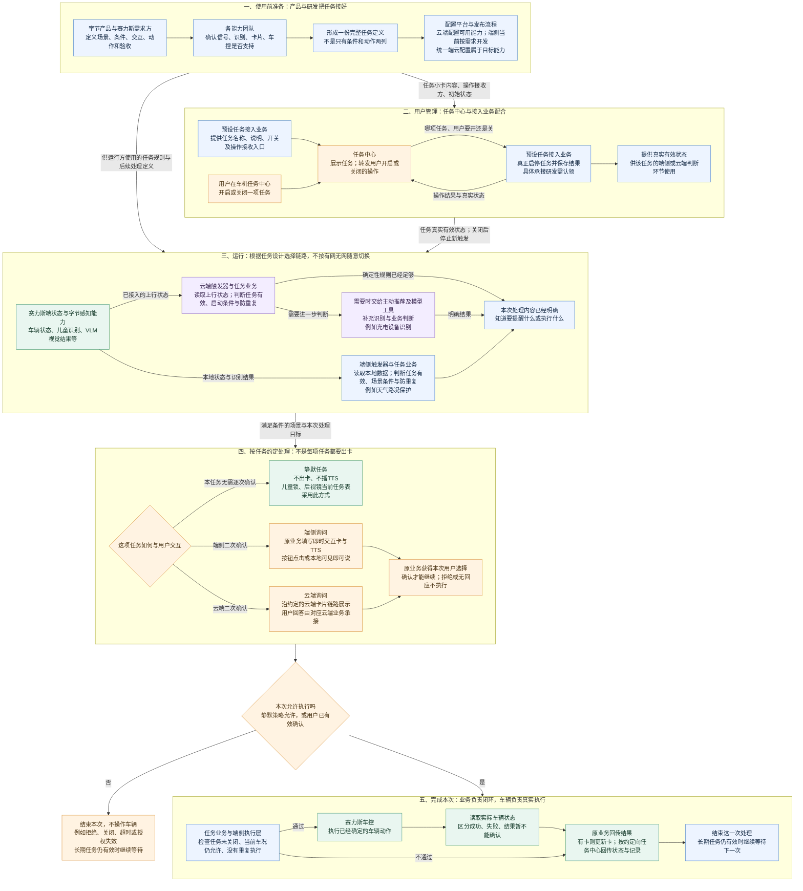
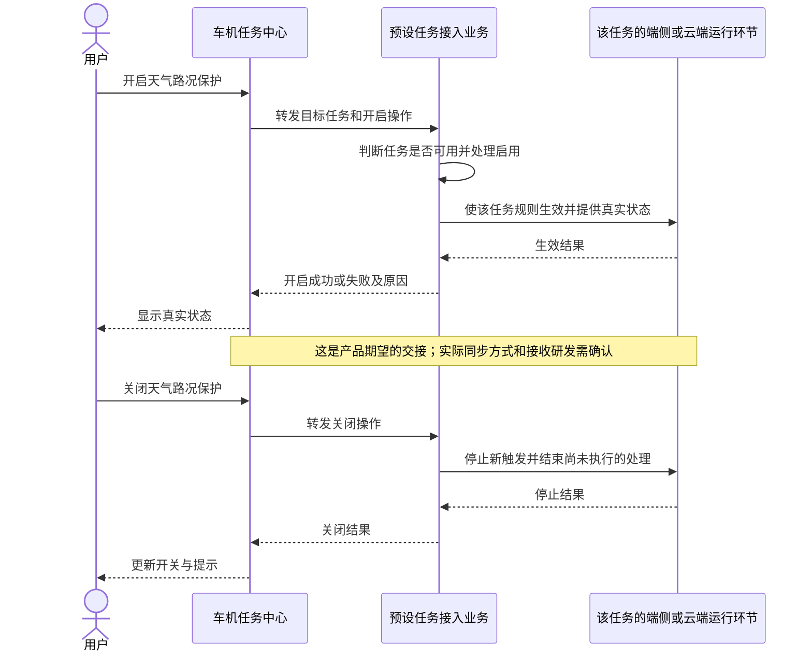
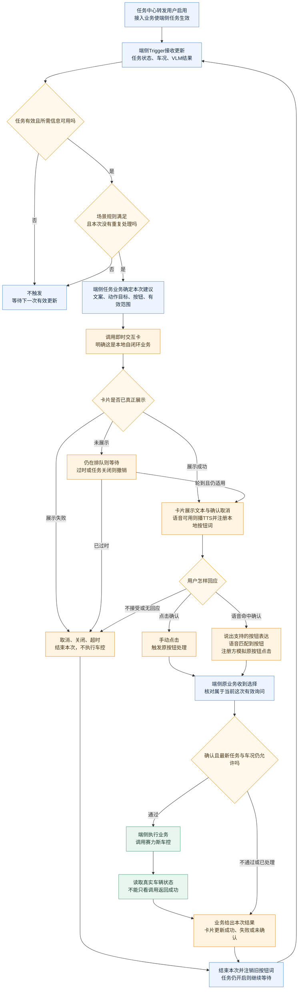
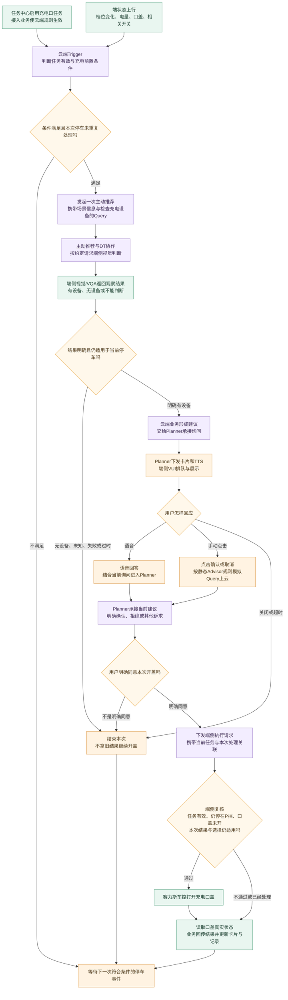

# PRD｜系统预设任务业务框架与端云交互

> 版本：V10.0｜业务框架评审稿  
> 日期：2026-09-06｜产品负责人：王泽民  
> 本次交付：完整业务框架、端侧与云端链路、模块交接要求、四项任务逐步案例、评审问题与验收。  
> 阅读约定：**来源结论**表示原文已有要求，不表示已开发上线；**本版方案**表示此次提交评审的产品设计；**待拍板**表示还不能当成研发已确认的实现。示例中的时间、车辆状态和用户回答是讲解数据，不是真实日志。  
> 旧版文件保留。本版不沿用旧稿中的示例接口、状态版本、运行代次等技术设计，正式协议由研发另行设计。

## 1. 需求总览：一套从预设、启用到执行结果的完整业务框架

系统预设任务，是产品提前定义好、用户不用每次重新创建的车辆服务。用户启用后，系统在条件满足时，按约定直接处理或先询问，再完成车辆操作并反馈结果。本次要把“任务怎么配置和启停、何时触发、如何交互、谁执行、如何结束”接成完整链路，而不是只定义触发条件。

### 1.1 先用一个场景理解整件事

用户在任务中心开启“天气/路况保护”。这时**不切换驾驶模式，也不立刻弹出询问卡**，只是允许这项服务开始等待场景。

行驶途中，系统识别到路面湿滑，且车速、当前驾驶模式等条件都符合要求，才在车机上问：“要切换到湿滑模式吗？”用户点击“确认”，或说出这张卡支持的确认表达后，天气业务检查当前条件仍合适，调用车辆功能切换模式。车辆实际切换成功后，卡片才显示成功；天气保护这项长期服务继续保留，等待下一次符合规则的场景。

这段过程涉及三个不同的东西：

- **系统预设任务**：整项“天气/路况保护”服务，从定义到持续运行。
- **触发器（Trigger）**：负责看状态、算条件，判断“这次该开始处理了没有”。
- **即时交互卡**：车机上的临时交互界面，负责显示这次建议、承接点击、展示结果；不是一套天气判断规则。

下文涉及的TTS，就是把文字播成语音；VLM/VQA提供视觉识别或针对画面的问答结果；Planner负责云端的对话理解与后续执行编排；VUI指车机的语音交互与卡片能力。它们分别在对应步骤参与，不需要你先记一套技术名词。

### 1.2 完整业务框架图

**这是一张目标业务协作图，不是已上线的系统部署图。**图中“预设任务接入业务”表示必须有人承接的业务职责，不要求研发新增一个同名服务。端侧当前仍有研发实现环节，不能把“后台统一配置并下发到车端”写成现状。

[单独打开放大：完整业务框架图](/Users/bytedance/Desktop/3.23/产品/1-原始素材/资料数据PRD原件/触发器包含条件/系统预设任务业务框架与端云交互-v10-图/01-完整业务框架.svg)。下方保留可编辑的Mermaid源图。



**讲图时按五句话走：**先定义完整任务；再让任务中心把用户操作交给业务；业务通过端侧或云端判断何时启动；需要询问的任务再借用卡片；最后由业务组织执行、确认车辆结果。**端侧和云端是运行位置，字节和赛力斯是责任归属，不能把这两个维度混为一谈。**

### 1.3 这次你要写、要评的内容

不是“我还要给所有卡片开发一套能力”，而是以下五份产品输入。本文已分别写入对应章节：

| 产品输入 | 你要讲清楚什么 | 对应章节 |
|---|---|---|
| 公共框架 | 一项任务经过哪些模块，谁接着往下做 | 本图、7.1—7.3 |
| 平台能力要求 | 除了条件，还要能定义哪种后续处理、交互和结果 | 7.1 |
| 端侧接入说明 | 我的业务什么时候出卡、给什么、点击和语音怎样回来 | 7.4 |
| 云端接入说明 | Trigger交给谁、什么时候出卡、点击与语音分别走哪里 | 7.5 |
| 任务规格与验收 | 四项任务放进框架后，每步实际发生什么 | 7.6—7.10 |

## 2. 协作人：找谁、让他回答什么

人员是资料中出现的对齐联系人，不替代本次研发责任认领。你负责产品方案和跨模块结论，不默认负责写代码、后台操作或实车测试。

| 对齐对象 | 你提供什么 | 对方需要给出什么 |
|---|---|---|
| 王泽民：系统预设任务/Trigger产品 | 场景、业务流程、输入输出要求、四任务规则、异常与验收 | 维护本PRD和评审决策；把未决问题交给对应负责人 |
| 郝晓伟及任务中心/Task团队 | 任务小卡内容、启停需求、状态返回要求 | 任务中心接入方式；谁接收启停操作；谁提供真实状态。不能默认Task服务已承接静态预设业务 |
| 韩杰、汪帅及Trigger/端侧研发 | 本地天气全链路、复用能力和缺口 | 条件执行、卡片调用、业务回调、端侧执行由谁承接；平台当前能配置哪些 |
| 徐洋及即时交互卡/VUI研发 | 任务卡片类型、文案、按钮、TTS、交互与结果要求 | 应采用VUI哪类链路；业务如何接入；展示、操作和关闭如何通知业务 |
| 左晨及语音团队，卡片接入研发共同参加 | 本地按钮词、允许的同义表达、语音不可用时体验 | 词条由谁注册；如何匹配、模拟点击、撤销；支持范围与测试用例 |
| 静态Advisor、Planner、DT/VQA团队 | 充电触发条件、Query、观察目标、二次确认要求 | 主动推荐至DT的实际调用关系、判断结果去向、卡片归属、点击/语音回流 |
| 赛力斯：张景波、许圣义、樊鹏宇、刘多等对应任务需求方 | 四任务业务规格与待拍板项 | 条件/车辆限制、信号和动作、自动执行边界、与赛力斯自有功能的分工 |
| 各模块研发与测试 | 全链路用例 | 联调结果、实车结果、未达标项及责任人 |

依据：[任务全集][S2]、[9月1日评审][S1]、[可见即可说职责][S4]。天气任务表当前联系人为张景波；许圣义出现在前期对齐中，不能用前期联系人替代当前任务表。

## 3. 背景：为什么评审从四个Case变成了框架问题

### 3.1 会上实际暴露了三处断点

1. **条件命中之后断了。**天气已经讲了识别和判断，但卡片怎么出、谁注册本地语音、用户答完谁执行，没有共同口径。01:37—01:47主要在解决这件事。
2. **“后台能配”说得过满。**01:57和02:08—02:10明确：云端只能配置已有的一部分能力，端侧当前仍由研发实现；TTS、二次确认、端云同步没有形成完整通用配置能力。
3. **没有分清“框架缺能力”和“业务条件写错”。**02:11:29徐洋要求专项评审整体支持哪些链路、怎样运行、还缺什么；同时后视镜P挡与车速的问题仍需带回赛力斯确认。[S1]

因此本次应先评“任务如何被完整描述和接起来”，再用四个案例验证。不是继续逐条读条件，也不是由产品写出完整技术架构。

### 3.2 本轮重新核对原文后，纠正旧稿的五点

- **不是所有云端点击都回Trigger。**静态Advisor卡片的手动点击，在VUI原文中是模拟Query到Planner；系统通知卡片才是另一类直接业务操作入口。[S3]
- **卡片并非完全不碰执行入口。**卡片可以包含可操作控件，按钮可以绑定原业务执行；它不负责自行识别天气或决定业务规则。应区分“界面发起调用”和“业务判断、车辆执行”。[S3]
- **儿童锁、后视镜的交互已经有明确任务表口径。**当前表写明静默执行、不出卡、不播TTS；不能继续当作全部未定。部署位置和具体车辆策略仍需分别确认。[S2]
- **天气恢复后的处理不能漏。**赛力斯原始PRD写了天气恢复后再次询问是否关闭后雾灯或恢复驾驶模式，不是“开启成功就结束所有逻辑”。[S5]
- **Task服务与任务中心不是同一个概念。**任务中心是用户管理入口；Task技术方案主要管理用户发起、需要等待或持续运行的任务，并明确静态Advisor预设建议不在其本期范围。不能因为都叫“任务”，就画成所有系统预设任务必经Task服务。[S6][S8]

## 4. 目标与验收方向

本期目标是交付一套能指导研发接入的产品方案，使新增任务有统一写法，模块交接不缺人，用户操作后有完整结果。

框架评审完成时，应达到：

- 四项任务都能说明：入口、有效状态、触发条件、执行位置、交互路径、执行动作、退出与验收。
- 每个模块交接都有发送方、接收方、业务内容和返回要求；研发能据此设计接口。
- 已有能力、此次新增和后续平台化分开记录；不把图上画到的能力当作已经完成。
- 每个待拍板项有对齐对象与具体产物；不以“后面再聊”作为结论。

上线前由研发与测试验证：任务关闭不再触发；未确认不执行确认类动作；同一次用户选择不重复执行；车辆结果不明不报成功；无网时端侧链路与云端链路表现符合各自约定。性能目标在已有基线和车型条件下会签，不虚构统一毫秒数。

## 5. 服务对象与范围

### 5.1 用户和使用场景

- 驾驶员：需要在合适的时机获得服务，不想反复设置，也不想被无效提醒打断。
- 产品与运营：需要用一致的任务规格定义场景，知道改规则与新增能力的区别。
- 字节、赛力斯研发和测试：需要能按模块分工实现、联调和验收的完整链路。

### 5.2 本批四项任务

| 任务 | 当前任务表的交互要求 | 运行安排 |
|---|---|---|
| 天气/路况保护 | 卡片＋TTS；需要二次确认；排队等待 | 端侧自闭环；本地语音采用可见即可说 |
| 后排儿童/宠物识别后开启儿童锁 | 不出卡、不播TTS；静默执行；排队等待 | 表内未给出最终部署位置，不能强行写成云端或端侧已定 |
| 后视镜自动加热 | 不出卡、不播TTS；静默执行；排队等待 | 字节与赛力斯业务归属、运行位置需专项确认 |
| 识别充电设备后打开充电口盖 | 卡片＋TTS；需要二次确认；排队等待 | 云端触发与主动推荐/DT配合，车辆操作在端侧完成 |

四项任务表均写“支持开关、默认开启”。这表示任务有效状态的初始要求，**不表示天气和充电可以跳过每次用户确认**。[S2]

宠物模式在当前表中标为转Skill实现，不扩入本批。本文也不重做所有主动服务、所有Task任务、整个语音仲裁或所有卡片样式。

## 6. 为什么区分端侧和云端，业务价值是什么

### 6.1 先看判断需要什么，再决定放在哪里

| 要回答的问题 | 倾向端侧处理 | 倾向云端参与 |
|---|---|---|
| 判断依据在哪里？ | 车辆当前状态、本地已经产出的视觉标签即可判断 | 还需云端工具、模型理解、上下文或其他信息 |
| 是否必须不依赖网络？ | 弱网也必须保持这条业务链路 | 可接受联网才能完成相应智能判断 |
| 命中后下一步是否明确？ | 条件和动作已明确；本地执行或固定询问即可 | 还要判断是否值得推荐、调用什么工具、怎样理解回应 |
| 二次回答是什么？ | 点击按钮，或把有限表达匹配到当前按钮 | 需要结合上下文理解不同表达、追问和业务变化 |
| 主要价值 | 本地响应、弱网可用、固定规则可解释 | 扩大可判断的场景、复用模型工具、支持更自然的连续交互 |

**云端不等于“所有步骤都由大模型做”，端侧也不等于“完全没有模型”。**天气可以使用车端VLM产生的视觉结果；云端Trigger也能做普通阈值判断。关键是这一任务依赖什么能力、能否在本地完成。[S1][S3]

### 6.2 分开运行，复用公共能力

共用的是任务定义方式、任务中心入口、即时交互卡容器、已有车控能力和验收方法。不同的是条件在哪里判断、谁发起后续业务、谁解释用户回答。

不应把一项任务设计成“有网就全部改走云端、无网就全部改走端侧”，更不能两边同时重复出卡。若需要离在线切换，必须另行写清当前处理如何衔接；此次天气采用固定端侧闭环，充电采用联网协作，不因信号强弱临时换一套业务。

也不应因为任务放端侧就归赛力斯、放云端就归字节。后视镜是否由车企独立做，首先是业务责任问题；它不是只靠部署位置就能决定的。[S1]（02:14:19—02:17:24）

## 7. 详细产品方案

### 7.1 一项完整任务，产品到底要定义哪些内容

以下是配置平台需要承载的**业务规格**。没有平台能力时，仍应把这些内容写在PRD里交给研发实现；不是让产品假装能在后台把所有内容直接配出来。

| 需要定义的内容 | 产品必须回答的问题 | 天气湿滑场景的具体填写示例 |
|---|---|---|
| 任务基本信息 | 用户看到什么？在哪里管理？ | 天气/路况保护；说明恶劣天气下提供驾驶模式和雾灯建议；任务中心可启停 |
| 使用范围 | 哪些车型、哪些功能可用？ | 只有支持对应驾驶模式/雾灯能力的车型显示相关子场景；核对四驱配置等限制 |
| 任务有效状态 | 默认开还是关？用户关闭后怎样？ | 默认开启、记忆选择；关闭后不再发起新建议；不是立刻把车辆模式恢复 |
| 开始判断的时机 | 哪个变化让系统重新检查？ | 天气、路面、车速、模式或任务状态更新；不能只等天气第一次变化 |
| 条件组合 | 必须全部满足哪些条件？哪些任一满足？ | 任务有效，车速大于30，雨天或路面湿滑，当前不是湿滑模式 |
| 数据与质量 | 每个值谁提供？拿不到怎样？ | VLM提供天气/路面，赛力斯提供车速/模式；未知不当作条件满足 |
| 运行位置 | 端侧自己完成还是要云端协作？ | 本地Trigger判断，不依赖Planner完成二次确认 |
| 命中后的第一件事 | 直接执行、出卡，还是交给模型？ | 发起“是否切换湿滑模式”的本地询问，不直接切模式 |
| 交互内容 | 问什么、说什么、按钮表示什么？ | 卡片正文、TTS、确认/取消；确认对应切换湿滑模式 |
| 回应处理 | 点击、语音、拒绝、关闭分别怎样？ | 点击和本地语音命中同一按钮处理；拒绝、超时不执行 |
| 执行和退出 | 执行前看什么？什么才算成功？何时恢复？ | 再看任务/车况；读取模式已变为湿滑；天气恢复后再询问恢复 |
| 防打扰与观测 | 怎么防重复？拒绝之后怎样？怎么验收？ | 同次提醒不重复；负反馈抑制规则需要定值；记录判断、选择和真实结果 |

这里“开始判断的时机”和“必须满足的条件”必须分开写。例如充电的**档位变为P**是一次发生的事情；**电量≤20%**是在那一刻读取的状态，不能每收到一次低电量就再推荐一次。

#### 7.1.1 配置平台本次需要具备的能力

**本版方案：**平台应能让配置人员完整选择“条件命中后接哪条业务链”，而不是把所有动作都当成普通车控。

1. 配任务：名称、说明、适用车型、默认状态、允许的管理操作。
2. 配判断：选择已有信号/事件，设置“并且/或者”、阈值、持续条件，以及不满足的行为。
3. 配后续处理：本地业务执行、本地询问、云端主动推荐三类入口；云端需要时再调用模型工具。
4. 配交互：选择现成卡片能力；固定文案或云端生成方式；TTS；确认、取消；本地按钮词或云端处理链路。
5. 配结果分支：确认执行什么，拒绝/无回应怎样结束，成功/失败怎样展示。
6. 配有效范围：这次建议何时不再适用、何时停止等待，防止使用陈旧提醒。
7. 配重复策略：同一场景不重复、排队等待、冷却，以及负反馈后的抑制方式。
8. 做发布前检查：该车型有没有信号、动作和卡片控件；接收方是否接好；缺少什么就指出什么。
9. 保留版本和验证结果：修改前后差别可查看；问题版本可停止使用；具体发布、回退方式由研发设计。

**不是每项能力都要在本期做成完整可视化编辑器。**产品先把规则和目标写清；已有部分复用，缺失部分认领开发，统一端云发布分阶段建设。这里是要评的能力范围，不是声称现有平台已经有九项能力。

#### 7.1.2 用后台“填写结果”举例，不写技术JSON

> 任务：天气/路况保护—湿滑模式建议  
> 执行位置：端侧  
> 开始检查：任务启用，或相关车况/识别结果发生更新  
> 条件：任务有效，并且车速大于30，并且“下雨或路面湿滑”，并且当前不是湿滑模式  
> 命中后：出本地即时交互卡；有语音能力时播TTS  
> 问用户：当前路面湿滑，是否切换到湿滑模式？  
> 确认：再次检查当前状态，通过后切换湿滑模式  
> 取消、关闭、超时：不切换；记录本次没有执行  
> 成功：车辆模式实际变为湿滑，更新结果控件  
> 后续：继续关注天气恢复；需要恢复时再发起一次询问

这就是你给研发的产品输入。研发再把它转换成代码或正式配置。**后台里的“确认后切换湿滑模式”是产品定义的行为，不是你在PRD里设计一个车控接口。**

### 7.2 任务发布后，怎么进入任务中心

**来源结论：**任务中心接受业务接入，展示任务信息和组件，向已注册的业务方转发操作；具体任务逻辑由业务闭环。[S6]

**本版接入要求：**

1. 预设任务接入业务提供名称、图标、描述、来源、支持的开关/删除操作，以及接收用户操作的入口。
2. 任务中心按自己的准入和展示规则接入；接入成功后建立这项任务与原业务的对应关系。
3. 任务规则交给端侧或云端运行环节，**不让任务中心页面自己读VLM、算车速或调用DT**。
4. 默认启用、启停记忆、适用车型、异常不可用的展示随任务定义交付。任务中心显示“开启”，不代表这一次询问已经获得用户同意。
5. 如果同一任务的展示信息和运行规则不匹配，业务需停止错误发布并反馈原因。正式同步机制由研发设计。

**你对晓伟可以这样说：**

> “这次我要接入的是长期存在的系统预设服务，不是用户临时说一句话创建的任务。我给任务中心提供任务名称、说明、开关和接收操作的业务。用户开关后，请把‘哪项任务、希望开启还是关闭’交给接入业务；业务真正处理后再回传状态。请一起确认，天气端侧业务由谁接这个操作，充电云端业务又由谁接，不能只完成页面开关。”

### 7.3 用户点开关后，触发器到底怎么知道

[单独打开放大：任务启停交接图](/Users/bytedance/Desktop/3.23/产品/1-原始素材/资料数据PRD原件/触发器包含条件/系统预设任务业务框架与端云交互-v10-图/02-任务启停交接.svg)



**不是看图上的按钮颜色，也不是默认新增一个车辆传感器信号。**任务中心给的是用户操作，业务处理后形成任务真实状态；Trigger必须通过业务约定的方式拿到它。研发可选择直接更新本地任务、通知规则引擎或提供状态读取能力，产品不在这里指定传输协议。[S6]

需要补齐的产品规则：

- 开启成功：开始等待条件，不立即执行动作。进入运行时读取当前状态，避免只有下一次变化才起效。此项为本版方案。
- 关闭成功：不再产生新处理；仍在排队或等待用户回答的本次处理失效。
- 已经发出的车控：不能承诺撤回已执行动作。继续确认结果；不因为关闭任务就反向切模式、解锁或关口盖。
- 启停失败：页面反馈失败，不能假装已生效；等待执行的动作应受最新可确认状态约束。
- 重启或恢复：运行环节读取用户最后有效选择，不能把“没收到开关事件”当作默认开启。
- 删除：任务中心原文区分“删除展示”和“取消执行”。本版建议系统预设任务删除前一并停止后续触发，并允许按产品策略找回；具体恢复入口与默认状态由任务中心和业务方会签，不能只隐藏页面而后台继续执行。
- 无网：任务中心文档存在“无网无法推出即时卡”的通用描述，与VUI第④类离线自闭环目标不一致；需明确本地预设任务的例外与启停可用性，不能无条件把在线任务限制套到天气任务。[S3][S6]

**Task服务是否要改？**如果选用Task服务承接这些操作，就需要Task团队确认本期是否包含系统预设接入；若由原业务自行闭环，则不必硬加到用户动态Task链路。技术方案已有Task到Trigger注册/取消的机制，并不能证明这四项系统任务已经接上。[S8]

### 7.4 端侧：触发器业务怎样与即时交互卡对接

#### 7.4.1 先把三个职责拆开

1. **Trigger判断**：读到任务有效、天气和车况，算出这次满足规则。
2. **天气任务业务**：知道命中后应问什么、确认后做什么、这次是否已结束。该职责可由端侧触发器现有执行框架承接，也可由接入业务承接，研发需明确；不是产品预设必须新增一个模块。
3. **即时交互卡与可见即可说**：卡片显示按钮；语音模块把用户表达匹配到已注册的按钮；原业务按该按钮本来定义的处理继续执行。

因此，你负责的Trigger需求不能只写“条件命中→弹卡”就结束，但也不能写成“Trigger负责所有UI渲染和语音识别”。**你要定义的是前后两端的业务行为，把UI、语音、执行的接口需求交给各模块。**

#### 7.4.2 端侧详细流程图

图中“本次已结束”“不再适用”“复核”等为本版补齐的业务要求；本地卡片和可见即可说路线来自VUI第④类与9月1日会议。[S1][S3]

[单独打开放大：端侧卡片完整流程](/Users/bytedance/Desktop/3.23/产品/1-原始素材/资料数据PRD原件/触发器包含条件/系统预设任务业务框架与端云交互-v10-图/03-端侧卡片闭环.svg)



#### 7.4.3 我给卡片什么：以一次湿滑模式询问为例

以下是交给卡片团队的**业务信息**，不是要求这些中文名成为正式字段。

| 交接内容 | 这次具体给什么 | 卡片拿到后做什么 |
|---|---|---|
| 属于哪项任务、哪次询问 | 天气/路况保护；本次雨天湿滑建议 | 后续点击、关闭、结果都对应这次，不串到另一张卡 |
| 使用哪条交互链 | 端侧自闭环；不依赖Planner确认 | 采用本地接入，不把回答绕回云端 |
| 卡片内容 | “当前路面湿滑，是否切换到湿滑模式？” | 使用已有容器与相应样式展示 |
| TTS内容与是否播 | 播相同问题；语音禁用时不播 | 由VUI/语音执行播报及状态流转，Trigger不合成语音 |
| 按钮及业务含义 | 确认＝同意这次切湿滑；取消＝本次不切 | 按钮绑定到原业务提供的处理入口 |
| 本地语音支持 | “确认”“取消”；“好的”“不用了”等须作为业务词评估注册 | 注册方提供按钮和词的对应关系，语音团队匹配；不假定无限语义泛化 |
| 结果接收与有效范围 | 操作返回本次天气业务；任务关闭或询问失效不能再执行 | 回传操作；结束后撤掉旧卡/词条 |
| 执行结果展示 | 切换成功后显示实际驾驶模式；失败显示原因 | 使用已适配控件更新，不自行猜车况 |
| 排队要求 | 等待当前交互，不能重复出现相同提醒 | 按VUI接入策略排队；是否已显示需可确认 |

**必须由研发补的连接点：**业务侧接收卡片操作的入口、卡片生命周期通知、业务结果更新入口。目前原文没有给出这三者完整的统一正式协议，本版要求对接时逐项确认。

#### 7.4.4 卡片、语音和原业务分别返回什么

- 卡片侧返回“请求已接收/正在等待/已经展示/无法展示”。**接收了不代表用户已经看到**，不能在等待期间错误消耗用户确认时间。
- 操作链返回“确认、取消、关闭、超时”等这次交互事实。语音模块在可见即可说链路返回的是匹配的指令及对应按钮信息，由注册业务模拟点击；不是语音模块独立判断天气动作。[S4]
- 卡片侧通知已消失或被其他内容替换，业务停止等待旧回应。折叠、隐藏、关闭不是一个含义：现有VUI的折叠可保持卡片和TTS，不应一律算拒绝；具体本地注册何时暂停/恢复由卡片和语音团队确认。[S3]
- 执行业务返回“正在执行、成功、失败、结果未确认”及实际状态。卡片负责呈现，不把点击成功当成模式切换成功。

以上是本版验收所需业务事实；是否由一个回调或多个接口提供，由研发设计。

#### 7.4.5 “可见即可说”到底帮了什么

例如卡片上有“确认”，业务把这个按钮及允许表达登记给语音能力。用户说“确认”，语音识别成文本，匹配到按钮；注册方模拟点击，于是进入**与手点确认相同的天气业务处理**。

这条链不是“用户说一句话→大模型重新想该开哪个功能”。它依赖当下页面上可操作的元素，只支持已注册的简单表达；页面变化必须更新词条，旧卡消失后不能继续命中。[S4]

9月1日会议也明确：不是所有即时交互卡已经自动注册可见即可说。天气需要按端侧自闭环类型接入、补业务词条；通用注册方式由研发对齐，不以新做离线小模型为本期前置。[S1]（01:37:30—01:47:18）

#### 7.4.6 对端侧研发和徐洋，可以直接这样提需求

> “天气Trigger已经负责判断条件。现在要补命中后的本地交互闭环：天气业务把本次建议、TTS、确认取消、按钮词和操作接收入口给即时交互卡。请按端侧自闭环卡片接入，业务注册可见即可说；语音命中后模拟原按钮点击，和手动点击走同一个业务处理。原业务拿到有效确认，再检查当前车况并调用车控，实际状态回来了才更新卡片。请端侧业务、卡片和语音三方明确这几个接收点各是谁做。”

### 7.5 云端：不能照搬“确认返回Trigger”的端侧写法

#### 7.5.1 云端先分清两种业务

- **云端规则任务**：条件已经能直接决定下一步，不一定调用模型。它需要的状态在云端可用，命中后交给执行业务。
- **云端智能协作任务**：硬条件只说明“值得再看看”，还不知道最终是否该处理。Trigger把场景交给主动推荐及模型工具，完成进一步判断，之后才交互和执行。充电设备识别属于这一类。

无论哪种，车机上的卡片仍由端侧显示，车辆动作仍由端侧执行。所谓“云端卡片”，说的是其业务和对话来自云端，不是卡片画在云端服务器上。

#### 7.5.2 云端详细流程图：以充电采用静态Advisor卡片链路为评审方案

**来源方向：**Trigger前置判断→主动推荐携带Query→DT与端侧视觉配合→端侧获得结果并执行，是此前约定；会议还描述了识别到后出卡确认。[S1][S7]

**本版方案：**确认交互按VUI第②类静态Advisor链路承接；图中补齐“识别结果交给谁出卡、手点确认怎样回Planner”。DT由哪一服务调用、结果由谁转换为建议、端侧上行拉取的具体承接方，仍需专项确认，不能把本图冒充已经连通。

[单独打开放大：云端充电完整流程](/Users/bytedance/Desktop/3.23/产品/1-原始素材/资料数据PRD原件/触发器包含条件/系统预设任务业务框架与端云交互-v10-图/04-云端充电协作.svg)



#### 7.5.3 Cloud Trigger交给下游什么

不是“给卡片一组确认按钮”这么早。它首先给主动推荐/后续业务：

> 哪项任务：识别充电设备后打开充电口盖。  
> 为什么现在启动：车辆刚从非P变为P；电量18%；口盖关闭；任务与主动服务有效。  
> 请继续处理什么：检查当前车辆周围是否有充电设备。  
> Query：沿现有链路可使用“帮我看一下有没有充电桩，如果有的话打开充电口”。  
> 必须遵守的业务约定：识别到设备后仍需用户二次确认，自动生成的这句话本身不是用户授权。  
> 这次的范围：只处理当前停车场景；离开P挡、任务关闭或判断过期后不能继续使用。  
> 返回要求：告诉任务业务这次已承接、无法判断、不推荐、等待确认，或执行结束；不要只返回“请求发送成功”。

Query中的措辞与二次确认存在误执行风险。**本版建议**联调时改成“检查当前车辆周围是否有充电设备；有则发起开盖确认，确认前不要开盖”，并由云端业务保证二次确认规则，不只依赖一句提示词。正式文案与协议由主动推荐/DT团队确认。

#### 7.5.4 云端判断后，谁给卡片什么

选择静态Advisor路线时，由Advisor业务形成建议，Planner承接并下发界面所需内容。[S3]

> 当前建议：已识别到可供确认的充电设备场景。  
> 卡片/TTS：“你可能在充电桩附近，要打开充电口吗？”  
> 按钮：确认、取消。  
> 确认的业务含义：只同意当前这次打开充电口盖，不授权以后自动开盖。  
> 对话上下文：当前卡片问的是这辆车这次停车的开盖建议，不是其他提醒。  
> 点击链路：该类型点击要模拟Query送至Planner，需能恢复原建议。  
> 后续结果：明确确认后才调用执行能力；执行结果返回后更新界面。

Trigger不必在前置条件命中时就知道模型最后会生成的全部卡片内容。**它要保证业务目标和场景信息交得完整；云端接收方负责后续判断、对话和执行编排，并回传这次处理的结果。**

#### 7.5.5 为什么云端不能只画一条点击路线

下面是VUI原文已有的四类；本框架按业务选定其中一类，不混用。[S3]（卡片链路0818）

| VUI类型 | 谁发起卡片 | 用户说话之后 | 用户手点之后 |
|---|---|---|---|
| ① Planner结果卡 | 用户Query进入Planner，工具结果汇总出卡 | Planner按当前上下文继续 | 有执行入口可直接操作，并通过事件日志同步云端 |
| ② 静态Advisor建议卡 | Advisor建议交给Planner后出卡 | Planner理解当前建议与用户回答 | **模拟Query送Planner**，把建议转换成执行工具调用 |
| ③ 系统通知卡 | 外部业务直接触达端侧 | 卡片内容与按钮上云，动态选择工具匹配用户表达 | 有原业务执行入口，可直接操作；同步Planner上下文 |
| ④ 端侧自闭环卡 | 本地规则业务直接出卡 | 本地可见即可说匹配并模拟按钮点击 | 进入本地原业务处理，不等Planner |

你之前听到“可以复用系统通知链路”，指的是第③类：**业务已经知道要执行什么，只需要云端帮它理解用户选了哪一个按钮。**它不是“所有通过云端的卡片都用第③类”。

如果充电最终由DT/原业务直接组织出卡，并且存在开盖执行入口，可另评第③类方案；这时需要把卡片内容、按钮含义和当前业务一同注册到云端，用户回答经动态选择工具返回原业务，卡片消失后删除工具。**不能一边画第②类，另一边又承诺点击直接开盖。**

第③类“增强版可见即可说”的泛化，是让Planner理解“那就帮我开一下”等表达对应哪个现有按钮，不是让卡片识别充电桩、决定车辆能否开盖或凭空增加动作。[S3]

#### 7.5.6 云端要返回给谁、返回哪些结果

- **给任务业务/Trigger侧状态维护**：这次有没有被接收、是否重复、为什么不继续、是否进入等待确认、最终结果。通常不需要Trigger再理解一遍用户语音。
- **给Planner上下文**：本次展示了什么，用户选择了什么、是否已经消费、执行得怎样，避免重复询问或重复执行。
- **给端侧执行层**：执行什么、本次确认针对什么、相关状态和判断是否还有效。具体字段不在产品稿中编造。
- **给卡片**：当前等待、执行和结果信息，以及实际车辆状态。
- **给任务中心**：按该长期任务的展示规范更新状态与记录；一次开盖成功，不等于删除整项长期服务。

本地界面点了确认，但网络已经断了，不能悄悄从第②类改成本地直接开盖；它没有完成原来约定的云端处理。应结束或明确反馈本次未完成，重试策略另行定义。

#### 7.5.7 对云端研发，可以直接这样提需求

> “我的云端Trigger只负责判断这次停车是否值得发起检查，不负责认充电桩，也不直接生成车控。命中后，我给主动推荐当前任务、停车信息、Query和本次有效范围。请主动推荐、DT和端侧确认结果怎么回来，再明确由谁把建议交给Planner出卡。如果选静态Advisor卡，语音和手点模拟Query都要能接续这次建议；用户确认后下发端侧，端侧再检查最新车况。还需要给任务业务一个最终结果，不能停在‘推荐发出去了’。”

### 7.6 Case一｜天气路况保护：完整走一遍本地询问和执行

**本例目的：**看懂为什么“条件已经满足”之后还没有执行，Trigger业务怎样借用卡片，用户确认之后怎样收口，以及天气恢复时如何继续。

**来源与写法：**任务表要求二次确认；VUI明确端侧自闭环；赛力斯天气PRD按雨、雪、雾分别处理。本例结合原规则文档的车速大于30和雨/湿滑条件展开。原规则文档中防抖次数有保留与删除并存，不能把截图中的“3次”直接当成最终会签值。[S2][S3][S5][S7]

#### 第一步：把原始需求翻译成产品可验收的任务

> 原始业务诉求：行驶遇到恶劣天气或路况时，主动建议合适的驾驶模式或雾灯操作。  
> 本次选取子场景：雨天/路面湿滑，建议切换湿滑模式。  
> 本任务不是用户刚说了一句Query才创建，而是产品预先定义，用户可管理的长期服务。

产品规则写成：

```text
任务名称：天气/路况保护
子场景：雨天湿滑模式建议

什么时候重新检查：任务状态、天气、路面、车速、驾驶模式等相关信息更新时

进入条件：
  任务有效
  并且 车速 > 30 km/h
  并且（天气为下雨 或者 路面为湿滑）
  并且 当前驾驶模式不是湿滑模式
  并且 信息可用、满足已约定的稳定性和防重复要求

命中后的动作：发起本地卡片询问，不直接切驾驶模式
确认后的动作：重新检查后，切换湿滑模式
取消、关闭、超时后的动作：本次不执行
成功标准：车辆实际驾驶模式变为湿滑
后续：天气恢复时按恢复规则再次询问
```

为什么不写“天气不好→切雪地＋开雾灯”：雨、雪、雾的目标不同。旧文档总表有合并写法，但赛力斯原PRD明确复合场景不合并处理。本版按子场景独立建议；并发顺序和驾驶模式冲突需会签，不能借一次“确认”执行未展示的其他动作。

#### 第二步：使用前先把这项任务接好

→ 产品把上述规则、卡片文案、TTS、按钮含义和结果要求交给端侧研发。  
→ 端侧研发实现或复用规则和业务处理。任务中心接入业务登记“天气/路况保护”的展示信息与操作接收入口。  
→ 卡片接入研发绑定本地业务按钮处理，并按语音团队要求登记本地词条。  
→ 赛力斯提供当前驾驶模式及切换能力；VLM团队提供可读取的天气、路面识别结果。

**这一步完成的含义是各模块已经能接收对方的数据，不是车辆马上执行。**词条未接、模式控件未适配等属于能力缺口，不能靠产品多填一行条件解决。

#### 第三步：用户开启，任务开始等待

假设10:00，用户在任务中心把天气保护从关闭改为开启。

→ 任务中心发送“开启天气保护”给该任务接入业务。  
→ 业务真正启用，并使端侧判断环节可以读取“有效”。  
→ 业务回传开启结果，任务中心更新。  
→ 系统读取当前状态：晴天、干燥、车速0、普通模式。条件不满足，**没有卡片、没有TTS、没有车控**。

用户只是打开长期服务，不是同意立刻修改驾驶模式。若默认已开启，这一步表现为启动恢复最后有效状态，不要求每次上车重新打开。

#### 第四步：数据变化了，先逐项判断，不急着出卡

假设10:03车辆驶入雨区，随后加速。下面的数据只演示处理顺序，不承诺实际上报周期。

| 时刻 | 提供方与具体输入 | Trigger怎样判断 | 本步输出 |
|---|---|---|---|
| 10:03:00 | 端侧VLM：下雨、路面湿滑；车速20；普通模式 | 雨/湿滑满足，但20不大于30 | 不出卡，继续等待 |
| 10:03:08 | 赛力斯车速更新为46；当前模式普通；天气/路面数据仍新鲜有效 | 46大于30；下雨或湿滑满足；当前不是湿滑；任务仍有效 | 可以形成这次建议 |
| 随后继续收到相同有效状态 | 雨、湿滑、46、普通模式 | 这次询问已在处理中 | 不再次出同样的卡 |

关键点：**不是只有天气标签变化才检查。**否则首次遇雨时车速20没触发，后来加到46却可能一直不提醒。本版要求在相关条件更新时重新检查组合规则；端侧当前支持范围由研发确认。

未知数据也要按逻辑处理：下雨明确成立时，“下雨或者湿滑”可由下雨这一项满足；但若下雨不成立且路面未知，不能把未知当成“不湿滑”，更不能据此判断天气已经恢复。

#### 第五步：Trigger命中，把“要问什么”交给天气业务

→ Trigger输出：“天气保护当前有效；本次雨天湿滑场景满足；可以发起湿滑模式建议。”  
→ 天气业务记录这次正在处理的建议，选择对应动作和交互内容。  
→ 这时只准备询问，**还没有调用切换驾驶模式**。

这就是Trigger判断的产物：不是生成一大段对话，也不是得到了用户同意，而是告诉下游“该处理这项明确场景了”。

#### 第六步：天气业务向即时交互卡发出具体请求

> 业务：天气/路况保护—本次湿滑模式建议。  
> 交互类型：本地自闭环询问。  
> 卡片正文：当前路面湿滑，是否切换到湿滑模式？  
> TTS：当前路面湿滑，是否切换到湿滑模式？  
> 按钮一：确认；业务含义为“同意本次切换湿滑模式”。  
> 按钮二：取消；业务含义为“本次不切换”。  
> 语音要求：支持确认、取消；“好的”“不用了”等作为待验证的业务同义词，不直接宣称全部可用。  
> 回应交给：本次天气业务的按钮处理。  
> 失效条件：任务关闭、本次建议不再适用、卡片生命周期结束，或已经处理完。  
> 结果展示：切换后显示实际驾驶模式及结果。

→ 卡片团队拿这份信息使用现成容器渲染。  
→ 语音/TTS由相关模块处理。天气Trigger不自己绘制卡片、不自己合成语音。  
→ 需要车控结果控件时，确认该控件已经适配湿滑模式，不假定任意文案都能自动生成可操作控件。

#### 第七步：先确认卡片真的出现，再等用户选择

假设车机正在回答用户的导航问题。

→ 天气卡进入排队，原业务收到或能查询“等待展示”。  
→ 如果等到显示前天气保护被关闭，本次撤销，不等排到后再提示。  
→ 如果排到时仍适用，VUI显示卡片；语音可用时播TTS，按既有VUI规则接续聆听。  
→ 业务进入等待这次用户选择的阶段。

**语音禁用不是任务开关关闭。**9月1日02:05—02:06最终讨论接受针对相关提醒保留卡片、不播TTS的方向。本例天气采用“仅显示卡片、用户手点”的降级要求；具体禁用场景是否也禁止界面，应由VUI/语音确认。不能把所有禁用场景一律理解为语音仍可回答。

#### 第八步：两种确认方式，进入同一个业务处理

**方式A：用户点击“确认”。**

→ 卡片按钮回到本次天气业务。  
→ 业务收到：“用户确认了当前这次湿滑模式建议”。

**方式B：用户说“确认”。**

→ 字节语音识别为“确认”。  
→ 可见即可说匹配到当前卡片已注册的确认按钮。  
→ 注册业务模拟原按钮点击。  
→ 进入与方式A相同的业务处理。[S4]

如果用户说“按你说的那个来吧”，不能默认本地一定理解。只有这类表达已经按能力要求支持并验证，才可以命中；否则本次不执行，用户仍可手点或使用支持的明确说法。

#### 第九步：用户确认，不等于立刻无条件执行

假设此时新的有效状态为：任务开启，车速44，仍下雨/湿滑，驾驶模式仍普通。

→ 原业务确认这次询问没有失效、没有处理过。  
→ 端侧执行前读取最新状态。  
→ 条件仍允许，才调用赛力斯切换湿滑模式。

对照两种变化：

- 如果用户已经手动切为湿滑：不重复调用，展示“当前已是湿滑模式”，并区分不是本次请求造成的状态变化。
- 如果任务已关闭、关键状态失效或车辆不允许切换：本次终止，不继续使用几秒前的判断；向用户说明本次未执行，而不是报成功。

#### 第十步：执行请求返回了，还要看实际结果

→ 赛力斯车控接收切换请求。  
→ 假设返回请求已接收，但车辆状态暂时仍为普通：此时最多是“执行中”，不能显示已切换。  
→ 后续读到实际模式为湿滑，业务才记录切换成功，卡片显示实际控件状态。  
→ 若车控明确拒绝，显示未成功及可理解原因；若等不到有效状态，记录结果未确认，不能写成已经成功，也不要擅自盲目重试。

最后一句TTS是否播、成功卡保持多久，沿VUI能力与本任务约定实现，避免车控和卡片各播一次“已完成”。这是对接时需要一起验收的体验。

#### 第十一步：结束的是这次建议，不是删除长期任务

→ 撤掉已结束询问的按钮词，防止后来一句“确认”再次执行。  
→ 记录这次出现、确认和执行结果。  
→ 任务中心仍保留天气保护的启用状态；是否在任务记录中展开每次执行，按任务中心接入方案确定。  
→ 相同雨区持续存在时，不因每次收到相同状态就再问同一个动作；当前已是湿滑模式也会挡住重复建议。

#### 第十二步：雨停了，恢复处理也要走完整链路

假设10:20，天气已不是下雨，路面也不再湿滑，信息有效。

```text
恢复候选：
  天气不是下雨 并且 路面不是湿滑
  并且 当前仍处于本任务前面开启的湿滑模式
  并且 用户没有在中途手动改变目标模式

动作：询问是否恢复到约定的常用驾驶模式
确认：复核后恢复，并读取实际模式
取消或无回应：保持当前模式，不擅自恢复
```

→ 天气业务发起一张**新的恢复询问**，不能复用之前“开启湿滑”的确认。  
→ 卡片展示“当前雨势和路况已恢复，是否切回常用驾驶模式？”；具体文案会签。  
→ 用户确认后，按照此前约定的恢复目标执行并回读。

恢复询问来自赛力斯原PRD；“只恢复本任务改变的状态、用户手动改变后不再代改”为本版保护用户选择的方案。**常用模式取哪个、重启恢复由谁负责、关闭任务后如何退出后续恢复监测**，要与赛力斯明确，不能让产品凭空指定“恢复普通”。[S5]

#### 同一框架中的雪、雾，不再合成一个模糊场景

| 子场景 | 应检查什么 | 展示什么问题 | 确认后的动作 | 不应做什么 |
|---|---|---|---|---|
| 雪天/覆冰 | 任务有效、相关车速条件、下雪或对应积雪结冰标签、当前不是雪地模式、车型支持 | 是否开启雪地模式 | 切换雪地并读取模式 | 不顺带开启未告知的雾灯 |
| 浓雾 | 任务有效、相关车速条件、浓雾、后雾灯未开、车型支持 | 是否打开后雾灯 | 开后雾灯并读取灯状态 | 不拿浓雾直接推导应该切雪地模式 |
| 天气恢复 | 对应子场景退出，信息有效，符合已会签恢复规则 | 是否关闭本任务开启的后雾灯或恢复模式 | 用户确认后处理 | 不把识别未知当成晴天，不替用户撤销手动选择 |

当前资料的覆冰/覆雪结冰标签写法不完全一致，模型团队需给可用枚举；触发器按正式结果接入。性能与准确率以会签的模型指标验收，不将原PRD标为TBD的目标当成已达到能力。

#### 这个Case你要交给研发的新增内容

> “除已有天气条件外，请补任务有效状态的接入、一次询问的管理、卡片/TTS请求、本地按钮词注册、用户选择回流、执行前检查、结果更新和恢复询问。请分别认领，不要把‘能弹卡’当作‘已经支持语音确认与执行’。”

### 7.7 Case二｜识别充电设备后开盖：完整走一遍云端协作

**本例目的：**把四个不同结论拆开：前置条件满足，只能开始检查；识别到设备，才能形成建议；用户确认，才允许本次开盖；车辆真实打开，才算成功。

**本例范围：**当前任务表的条件是AI主动服务开启、档位变为P、电量≤20%、口盖关闭，并要求二次确认。当前PRD有DT/端侧上行取得结果的链路。本例在此基础上按7.5的静态Advisor交互方案补齐；云端执行衔接由专项确认。[S1][S2][S7]

#### 第一步：原始需求与任务定义

> 原始业务诉求：用户准备充电时，帮助识别附近充电设备，减少寻找和手动打开口盖的步骤。  
> 系统还不知道的事情：附近是否真的有合适的充电设备，以及用户是否希望现在开盖。  
> 因此，低电量＋P挡不能直接得出“应该开盖”。

```text
任务：识别充电设备后打开充电口盖
开始事件：档位从非P变为P
先检查：任务有效、AI主动服务开启、电量≤20%、口盖关闭
第一步动作：通知主动推荐，继续检查当前是否存在充电设备
检查结果：
  明确有设备 → 发起本次开盖询问
  没有设备 / 看不清 / 判断失败 → 不执行开盖
用户确认：端侧再检查当前停车与车况，通过后打开口盖
成功标准：实际口盖状态已打开
```

#### 第二步：用户启用后，云端开始等停车事件

假设14:00，任务中心中该任务已开启，相关AI主动服务开关也开启。

→ 接入业务使云端规则有效，车机按已接入链路上报必要端状态。  
→ 云端此时只等待，不每隔一段时间询问用户是否要充电。  
→ 若任务开着而AI主动服务关闭，当前任务表要求的条件仍不满足，不发起这条主动推荐。

这里是两个条件，不是两个按钮强制显示同一个状态。任务中心管理这项服务；AI主动服务开关约束相应主动推荐能力。

#### 第三步：一次真实状态变化触发检查

假设车辆到达停车位：

| 时刻 | 收到的信息 | 具体判断 | 下一步 |
|---|---|---|---|
| 14:10:00 | D挡、电量18%、口盖关闭 | 还没有变为P | 不启动检查 |
| 14:10:05 | 档位由D变为P；电量18%；任务/主动服务均开启；口盖关闭 | 事件和硬条件全部满足 | 发起这一次主动推荐 |
| 14:10:06 | 重复上报P、18%、关闭 | 仍属于同一次停车，没有新的切入P事件 | 不重复启动 |

如果收到的第一条档位数据就是P，却没有可靠的前态，不能默认当作刚切入P。启动时是否按当前停车状态补检查，是独立产品选项；本例按“可靠的切入P事件”演示，不补造事件。

#### 第四步：Trigger把已知与未知交给主动推荐

本次交接可以用人话完整表达：

> “充电口任务已启用。车辆14:10:05刚停入P挡，电量18%，口盖关闭，AI主动服务开着。这次请检查当前车辆周围有没有充电设备。有设备后再问用户是否开盖，没有或无法判断就结束。后面的判断、卡片与结果都属于这次停车。”

→ Trigger发起当前链路要求的Query/主动推荐请求。  
→ 下游确认这次被承接，Trigger侧不持续重复创建相同请求。  
→ 这时**还不能告诉用户“已找到充电桩”，也不能执行开盖**。

#### 第五步：主动推荐调用DT，与端侧视觉能力配合

DT在本链路承担按目标组织工具判断的工作；VQA承担针对当前画面的问题判断。用户给出的既有链路包含“端侧上行获取DT推理结果”，因此不能省略端侧与云端的结果衔接，只画一个“DT自动开盖”。

→ 主动推荐把当前检查目标交给DT。  
→ DT按约定调用视觉能力，询问当前画面是否有充电设备。  
→ 端侧提供该场景所需、授权范围内的视觉输入/结果；不因为做云端任务就默认上传全部视频。  
→ 按当前链路由端侧上行获得对应推理结果。  
→ 必须约定哪个接收方把这个结果交回主动推荐/询问业务，继续推进。

**这里具体缺的不是一个“条件”，而是一段承接关系：DT结果由谁接，谁把“识别到设备”变成卡片建议。**本版要求主动推荐、DT与端侧研发给出同一条联调链路，不能各自只验证自己的请求成功。

#### 第六步：拿到结果，分别处理

| 视觉/业务判断 | 系统实际知道什么 | 本版后续要求 |
|---|---|---|
| 当前明确识别到符合约定的充电设备 | 可以提出开盖建议，但用户还没有同意 | 进入确认交互 |
| 当前未发现设备 | 没有满足本次推荐依据 | 结束，不出开盖确认卡 |
| 看不清、摄像头不可用或信息不足 | 不能确定是否存在 | 结束或按明确重试策略处理；不能当作“有” |
| 返回失败或已不属于当前停车 | 无可用判断 | 不执行，记录原因 |

这些是业务结果分类，不声称DT已经使用某几个固定英文枚举。需要DT团队给出实际可用返回，再做对应关系。

#### 第七步：识别到设备后，云端生成本次建议

假设14:10:07返回：当前有充电设备，仍是这次停车的信息。

→ 云端业务继续确认任务仍有效，形成“询问打开充电口”的建议。  
→ 按本版第②类方案交给Planner，Planner下发卡片和TTS。  
→ 车机显示：“你可能在充电桩附近，要打开充电口吗？”按钮为“确认”“取消”。[S2]

**现在是第二个门槛：可以问，不是可以开。**“本次识别到设备”的判断不能代替用户选择。

若此时不允许静态Advisor运行，例如语音禁用策略限制该链路，应按当前主动服务准入停止；9月1日保留无TTS卡片的讨论不能自动证明静态Advisor已支持绕过禁用。充电要不要采用纯GUI降级，需与VUI、Advisor明确后另写分支。

#### 第八步：用户语音与手动点击，分别发生什么

**语音：用户说“那就打开吧”。**

→ 语音文本与当前开盖建议的上下文交给Planner。  
→ Planner判断这句话是否明确同意本次打开口盖，而不是脱离上下文猜“打开什么”。  
→ 明确同意后组织执行；如果用户说“先别开，帮我找更便宜的充电站”，本次开盖不执行，新诉求按正常Query处理。

**手动：用户点击“确认”。**

→ 按静态Advisor第②类规则，点击被转换为带当前业务含义的模拟Query。  
→ Planner接续当前建议，转换成后续执行工具调用。  
→ 不是卡片直接裸调车控，也不是Trigger重新跑视觉判断来猜按钮含义。[S3]

这里模拟Query的实际文本和关联方式由研发定，但不能只传脱离卡片的“确认”两个字。业务必须知道确认的是哪次开盖建议。

#### 第九步：取消、关闭、超时不能进入执行

→ 用户点击取消，或明确说“不开了”：终止这次开盖建议。  
→ 卡片关闭或超时：终止这次等待，不能等几分钟后再把“好”当成旧卡确认。  
→ 点击与语音几乎同时到达：只处理一次；Planner应知道该建议已被消费，不能再开一次。

这是框架需要承接的结果分支。当前资料没有统一正式回调协议，不影响产品先把这些行为写清楚。

#### 第十步：收到明确确认，端侧仍要检查当前车辆

假设14:10:12，用户确认。端侧收到本次开盖请求时：

> 任务仍有效；相关业务开关未关闭；车辆仍在P挡且满足车辆开盖限制；口盖仍关闭；本次设备判断与用户确认未失效；该操作尚未执行。

→ 检查通过后，才调用赛力斯口盖控制。  
→ 如果14:10:11已经切回D挡，云端后来到达的“确认开盖”也不能继续执行。  
→ 如果口盖已被用户手动打开，则不重复控制，回传“当前已打开”的实际状态。  
→ 如果网络重连带回旧判断，不把它当作新一次停车的结果。

#### 第十一步：结果回到卡片，也回到云端业务

→ 赛力斯执行后，端侧读取口盖状态。  
→ 实际打开：回传成功与实际状态，卡片显示结果。  
→ 明确失败：向原业务返回原因，卡片显示未打开。  
→ 请求已接收但状态未确认：不向用户报“已打开”。  
→ 云端同步本次已完成，防止用户下一句话又触发旧建议。

#### 第十二步：等待下一次，不持续重试当前停车

→ 本次建议结束，任务仍保留。  
→ 一直停在P挡不等于不断产生新事件。  
→ 后续真正离开又停入P挡，才按条件与频控判断是否可再启动。  
→ 本任务的目标是打开口盖，不顺带新增自动关盖、启动充电、锁车等动作。

**评审时用一句话收束：**

> “Trigger只能判断现在值得检查；DT/视觉告诉我们有没有设备；卡片和Planner取得用户选择；端侧检查当前车辆能不能开；真实口盖状态告诉我们到底有没有开成功。这五件事不能合并成一个‘云端执行’节点。”

### 7.8 Case三｜儿童锁：静默任务为什么不需要即时交互卡

**来源结论：**当前任务表写“任务开启后，非P挡检测后排儿童/猫/狗，且儿童锁未开启，自动开启”；不出卡、不播TTS、静默执行。旧PRD仍有D挡和卡片询问表述，需据当前任务表校正。部署位置没有在该表明确。[S2][S7]

#### 第一步：原始需求与规则

> 原始业务诉求：行车时后排有儿童或宠物，降低误开车门的风险。  
> 这次不是询问用户是否打开，而是按当前任务表约定自动处理。  
> 任务开启是允许该自动服务工作；对应车型的自动执行适用范围和车辆限制仍需赛力斯签认。

```text
任务：后排儿童/宠物识别后开启儿童锁
进入条件：
  任务有效
  并且 档位不是P
  并且（OMS识别到后排儿童 或 VLM识别到后排猫/狗）
  并且 目标儿童锁未开启
命中动作：检查车辆允许后开启儿童锁
交互：无卡片，无TTS，不等待确认按钮
成功标准：目标儿童锁真实状态已开启
```

#### 第二步：数据分别由谁提供

→ 赛力斯OMS儿童识别结果通过端状态提供；OMS是乘员监测能力，不是卡片。  
→ 字节VLM提供后排猫/狗识别；并非所有宠物类别都已覆盖。  
→ 赛力斯提供档位、儿童锁状态、可调用的儿童锁控制及车辆限制。  
→ 接入业务提供任务是否有效。[S2]

9月1日会议提到默认宠物识别在低频任务中，约五分钟一次。因此“有宠物识别”不等于“刚上车立即发现”。本例先用OMS儿童分支演示；宠物分支需要另核当前频率、结果时效与需求时效是否匹配。[S1]（01:55:52—01:56:35）

#### 第三步：任务可以先开启，但车辆仍在P挡时不执行

假设08:00任务有效，车辆P挡，OMS已识别到后排儿童，儿童锁关闭。

→ 任务判断读取这些值。  
→ 有儿童为真，但非P为假。  
→ 不执行；不出卡；保持等待。

#### 第四步：驶离时逐项算清楚

假设08:01车辆由P变为D，OMS儿童识别仍有效，儿童锁仍关闭。

> 任务有效：是。  
> 档位非P：是，当前D。  
> 后排有儿童或猫狗：是，OMS儿童分支已满足。  
> 儿童锁未开：是。  
> 所需信息新鲜且车辆允许：检查通过后才能继续。

→ 规则满足，形成一次开启请求。即便VLM尚未给猫狗结果，明确的儿童分支也已满足“或者”条件，不必强行等待宠物识别。

本例选D只是为了展示非P条件成立，不能反过来把规则改成“只有D才执行”。N/R等是否应保留在非P范围，是需要赛力斯明确的车辆业务边界。

#### 第五步：接给执行业务，不接给卡片

→ Trigger通知本任务业务：“后排儿童保护条件成立，需要开启目标儿童锁”。  
→ 任务业务按静默处理要求继续，不准备TTS，不请求即时交互卡，不注册可见即可说。  
→ 执行前检查任务未关闭、相关人员/档位与锁状态仍适用、车辆允许控制。

**这是框架必须支持的第二种后续处理：条件命中后直接进入已约定的执行链。**不能强迫所有任务先发一张卡，才能把它们接进同一框架。

#### 第六步：执行和结果

→ 赛力斯车控开启约定的儿童锁目标。  
→ 读到目标锁状态已开启，才结束本次执行。  
→ 用户没有收到确认卡或TTS；车辆原有儿童锁状态显示按既有界面规则更新。  
→ 任务业务保留执行结果；任务中心是否展示一次执行记录按接入规范确定。

“儿童锁”是总控还是左右分别控制，原表未给完整参数。需要赛力斯提供目标范围和回读方式；不能在PRD里擅自把“开启儿童锁”扩成所有车门或只锁某一侧。

#### 第七步：持续有儿童时，不重复下发开启儿童锁

→ 下一条OMS仍报有儿童，但锁已开启，未开启条件不满足，不重复调用。  
→ 车辆回P挡，不再满足进入条件；本需求没有因此自动关闭儿童锁的授权。  
→ 用户中途手动关闭锁时，是否立即再次自动开启、是否尊重本次人工操作，需要赛力斯明确。**本版建议不要未经确认无限对抗用户操作**，这是专项问题，不自行写成已经定好的安全规则。

#### 第八步：宠物分支单独验收

假设后排没有儿童，只出现猫，档位D，锁关闭。

→ 若新鲜有效的VLM结果明确为猫，按同一静默链执行。  
→ 若只有五分钟前的历史结果，不能宣称实时识别到当前猫；须按已会签时效判断。  
→ 若识别到其他动物或无法判断，不把它归为已支持猫狗。

**你向研发提的需求：**

> “这一条不接即时交互卡。请支持非P、儿童或猫狗、锁未开这些组合条件；OMS和VLM分别接，不要让儿童分支必须等待宠物结果。命中后走静默车控并回读。运行放在哪里请结合信号可用性确认，另外要核宠物低频结果是否满足需求，以及手动关锁后怎样处理。”

### 7.9 Case四｜后视镜加热：用三个子场景验证框架能力

**来源结论：**当前任务表无卡、无TTS、静默执行；要求三项P0场景。原始分析文档明确雨天中低速为非P，不是会上读到的P。原分析要求雨刮持续30秒，当前任务表和字节PRD省略了这一项，仍要会签；温差窗口也未定稿。[S2][S7][S9]

**责任边界：**本节定义业务行为，不把后视镜直接定为“字节云端任务已确认”。9月1日02:14之后，大家正是在讨论是否应由赛力斯自闭环。若赛力斯承接，字节不应再并行维护一套相同触发执行；若字节承接，再决定所需数据在哪侧可用。[S1]

#### 第一步：把一条任务拆成三个可独立判断的入口

```text
任务：后视镜自动加热
公共前提：任务有效，所需信息可用，车辆允许该操作
任一入口满足时，按对应策略处理：
  A. 雨天中低速：下雨，并且车速<70，并且非P；雨刮持续条件待会签
  B. 洗车结束：传送带洗车模式由开启变为退出
  C. 高湿温差：湿度>60%，并且约定观察窗口内温差>5℃
交互：无即时交互卡，无TTS，不逐次询问
动作：开启后视镜加热；停止加热规则按子场景定义
成功标准：实际后视镜加热状态为开启
```

这三个入口不应简单都写成“下雨触发”。A是多条件状态，B是一次退出事件，C需要一段时间里的比较；它们验证的是框架三种不同能力。

#### 第二步：准备具体输入，不让Trigger“猜镜面起雾”

→ 赛力斯提供雨量状态、车速、档位、洗车模式退出信息、湿度、温度以及加热状态/控制。  
→ 任务业务读取已确认的状态判断。  
→ 除非额外接入了可靠镜面识别，这个任务不能声称Trigger直接看见“镜面有雾”；它是在使用业务约定的代理条件。

#### 第三步：A场景，一次雨天中低速的完整判断

假设09:00读取到：任务有效，雨量状态为下雨，车速42，D挡，加热关闭；并假设雨刮已持续运行32秒。该例同时满足包含雨刮条件的较完整原需求，**不代表正式拍板了雨刮30秒**。

→ 任务有效：通过。  
→ 下雨：通过。  
→ 42小于70：通过。  
→ D不等于P：通过。  
→ 如采用雨刮持续30秒：32秒通过。  
→ 加热未开且车辆允许：通过后进入执行。

如果是P挡，则按原分析与当前任务表不进入该雨天行驶场景。这里已经能依据现有原文修正会上P挡的误读，不必再把P/非P永远并列成两套方案。[S9]

#### 第四步：A场景，执行与持续期间

→ 任务业务发起开启加热；赛力斯车控执行。  
→ 回读加热实际开启，结束本次开启动作，不弹确认卡。  
→ 雨天、42、D持续上报，只维持该场景需要，不反复发开启命令。  
→ 若多个入口同时满足，应由同一业务统一处理加热目标，不让三个规则各自对同一功能重复控制。

#### 第五步：A场景退出，不能只写“关闭加热”就结束

原始分析写“前提条件不满足”退出；例如车速变为72、雨停或切P。[S9]

→ 接入业务识别雨天中低速入口已经不再成立。  
→ 检查是否还有洗车/高湿等其他开启原因，以及是否是用户或车辆其他功能主动开启。  
→ 按会签的总控制策略退出，不让某一条规则结束就关掉其他原因仍需要的加热。

**本版要求先明确哪个业务统一管理开闭。**自动关闭、车辆自带定时、用户手动操作、其他除雾联动如何配合，由赛力斯确认；旧稿写死“15分钟后关闭”没有足够原文依据，本版不沿用。

#### 第六步：B场景，洗车退出是一次事件

假设11:00车辆仍在传送带洗车模式内，加热关闭。

→ 没有退出事件，不因“洗车模式存在”就执行。  
→ 11:06模式从开启变为退出，收到本次退出信息。  
→ 任务有效、事件是新发生且未处理、车辆允许时，开启加热一次。  
→ 回读开启后记录这次已处理。

如果之后又收到相同退出消息，不重复开启；重启后仅看到“洗车模式关闭”的当前值，也不能直接当作“刚洗完车”。如何区分新事件由研发实现，但业务结果必须符合这一要求。

这个入口没有确认卡，因此不需要给徐洋一套洗车TTS；需要给Trigger/业务研发的是退出事件的可靠识别、一次执行和后续停止要求。

#### 第七步：C场景，高湿温差不是一个瞬时值

假设车辆驶出较凉的地库，当前湿度68%；先后两次温度为26℃和32℃。

→ 68大于60：湿度通过。  
→ 温差为6℃，大于5℃。  
→ 但还必须知道两次测量是否在约定观察窗口内、使用同一来源/单位，以及采用上升幅度还是绝对差。  
→ 所以**只知道当前32℃，不能得出“温差大于5℃”**。

若正式会签窗口为一分钟，且这组测量落在该窗口、方向符合约定，可继续执行；原资料目前保留窗口待定，因此此处是一项明确的条件能力需求，不把一分钟写死为上线参数。信息缺失时不发出本次自动开启请求。

#### 第八步：如果这一条最后交给赛力斯做

→ 赛力斯承接相同任务规格、信号判断与执行闭环。  
→ 若仍需任务中心入口，按任务中心接入要求提供任务信息、接收启停并回传结果。  
→ 字节Trigger不再重复判断同一功能；没有即时卡需求也不为它强建卡片链路。

**你向双方提的需求：**

> “后视镜先确定唯一的业务承接方，再谈放端还是云。无论哪方做，都要覆盖多条件判断、洗车退出事件、时间窗口温差三种入口；当前任务表是不出卡、无TTS。请赛力斯确认雨刮持续条件、温差窗口和加热退出/手动操作策略。平台能配条件不代表这些输入和退出能力已经具备。”

### 7.10 四个Case验证出了哪些公共能力，哪些是这次要补的

这里“已有”只指原文已定义或会上说明可复用，**本轮未检查研发代码和实车，因此不写“已经上线”**。

| 公共能力 | 哪个Case证明需要 | 当前证据 | 本次产品要求 |
|---|---|---|---|
| 任务中心接入和操作转发 | 四项任务 | 任务中心PRD有定义 | 每项任务明确接入业务、操作接收方和状态回传；补本地启停适用性 |
| 读取任务有效状态 | 四项任务 | 任务有开关；原业务维护状态 | 明确Trigger从哪里获得真实状态，重启后怎样恢复用户选择 |
| 普通条件、并且/或者 | 天气、儿童锁、充电 | Trigger已有部分能力 | 每个信号和动作逐项核可用性，不把“支持逻辑”当成“支持信号” |
| 状态变化触发与防重复 | 充电停车、洗车退出 | 当前PRD有相应场景 | 区分状态与事件；同一次消息重复送达不重复执行 |
| 稳定性与时间窗口 | 天气识别、后视镜温差 | 需求中存在，部分参数未定 | 明确更新来源、窗口计算、失效处理；补缺少的公共能力 |
| 云端主动推荐与视觉判断 | 充电 | 已有路线方向 | 明确Trigger到主动推荐、DT到端侧、判断到出卡之间的接收者 |
| 本地即时卡＋TTS | 天气 | VUI第④类与评审有定义 | 接好本地业务输入、排队/展示结果、操作和结果更新 |
| 本地可见即可说 | 天气 | 语音框架已有能力，业务需注册 | 卡片接入研发登记按钮词；语音返回匹配，注册方模拟点击 |
| 云端卡片与对话接续 | 充电 | VUI第②、③类分别有定义 | 本次选定一种，不混写点击路由；同次建议与用户回答能关联 |
| 静默执行 | 儿童锁、后视镜 | 当前任务表明确要求 | 不强加卡片；仍要任务有效判断、执行条件与结果回读 |
| 恢复/退出 | 天气、后视镜 | 原业务PRD要求 | 不只写进入，补条件恢复、手动操作、多个开启原因之间的处理 |
| 防打扰、反馈与验收 | 天气尤其需要 | 会议提出，策略未完整 | 分清同次去重、周期频控和连续拒绝后的抑制；分别定义 |
| 统一端云配置与发布 | 全框架复用 | 9月1日为长期方向 | 本次先定业务能力规格，再拆可视化配置与端云发布增量 |

**两个研发问题要分开问：**

> “平台有没有能力表达‘湿度大于60并且一分钟内温差大于5’？”——问框架能力。  
> “这个车型有没有湿度和连续温度数据，一分钟是不是正确窗口？”——问信号与业务规格。  
> 两个都回答清楚，才是这条任务可落地；不能只说“平台支持AND/OR，所以都能配”。

### 7.11 公共异常、结果和防打扰要求

以下为本版补齐闭环的产品规则；具体时长、次数应按场景确认，不使用未经依据的统一数值。

#### 7.11.1 判断阶段

- 状态有效、条件不满足、状态未知必须区分。状态未知时，不擅自执行依赖该状态的动作；保留未继续的原因。
- 收到数据就能重新检查，不代表每条数据都产生一次新提醒；已有询问、执行或已完成结果必须防重复。
- 任务关闭后不再创建新处理；感知是共享能力时，停止消费本任务数据不等于关闭全车摄像头或停掉其他任务的VLM。
- 车型缺少动作能力时，不向用户询问一个确认后无法完成的功能。

#### 7.11.2 交互阶段

- 发送出卡请求、排队、真正显示分别记录。等待时过期的建议不再展示；等待时间不是用户不回应。
- 本地与云端不能同时处理同一句确认；每次交互使用约定的一条路线。
- 用户确认只允许当前展示的动作；不顺带执行其他子场景或未来请求。
- 用户拒绝、卡片关闭、超时、被替换要分别记录；都不能当作确认，但**不能全部合并为用户明确拒绝**。
- 卡片折叠不是取消。现有VUI折叠可不打断TTS、不改变生命周期；本地词条在隐藏状态的有效范围由注册方和VUI确认，不能继续命中无关页面。
- 卡片生命周期、聆听时间和业务建议有效期不是同一个计时。VUI有其默认退出规则，业务还要在车辆状态变化时及时让旧建议失效。[S3]

#### 7.11.3 执行阶段

- 用户确认或模型结果到达后，使用最新任务状态和执行所需车况，不直接沿用触发时的全部旧值。
- 同一次点击和语音确认并发、重复消息重送，不得产生重复车控。
- “已达到目标但不是本次调用造成”与“本次执行成功”区分记录；用户界面可展示当前真实状态。
- 收到请求成功不代表车辆动作成功。明确失败、成功、结果无法确认分别处理。
- 动作已经发出后用户关闭任务，停止后续新动作，但不能保证撤销硬件已经执行的动作；继续确认结果。
- 恢复动作要有单独规则；关闭任务不是反向车控命令。

#### 7.11.4 防打扰：你需要补的不是只有“每次上电一次”

1. **同次去重**：同一场景的数据重复上报，不反复弹相同卡。
2. **基本频控**：一个行程或一定时间内允许提醒几次，数值由业务会签。
3. **回应后的抑制**：用户明确拒绝后多久不再推荐；连续拒绝与一直未看卡区别处理。
4. **重新进入**：新行程、不同子场景、天气真实恢复再出现，是否解除抑制。

9月1日会上“拒绝三次就关任务”和“设置静默期”是不同建议，没有统一最终规则。本版建议先按明确拒绝进入可配置的暂停提醒期，不自动改变用户的长期任务开关；时长、跨行程行为和安全相关例外由你与赛力斯确认。[S1]（01:58:04—02:01:30）

### 7.12 验收：每条都能让测试实际操作

表内来源冲突和待拍板项先形成结论，再填写最终预期；本表不代表已经测试通过。

| 范围 | 测试输入或用户动作 | 应观察到的结果 |
|---|---|---|
| 任务启停 | 关闭天气任务，再给湿滑、车速46、普通模式 | 不出天气询问卡，不切模式 |
| 任务启停 | 在规则已满足时开启任务 | 按本版初始检查方案读取当前状态；不依赖重新制造天气变化 |
| 任务启停 | 操作失败，页面曾显示点击动效 | 显示失败或真实状态，不宣称已生效 |
| 任务启停 | 卡片排队中关闭任务 | 撤销本次；之后不能重新冒出旧卡 |
| 任务启停 | 等待确认时关闭任务，再点击原卡 | 不执行旧询问 |
| 本地链路 | 无网但本地任务/卡片/语音可用，天气条件满足 | 依约出卡、本地确认、执行；不得等待Planner。需验证任务中心无网边界已对齐 |
| 本地链路 | 下雨时车速20，随后车速46，天气标签不变 | 随相关状态更新重新检查，不能漏触发 |
| 本地链路 | 手点确认与说“确认”分别测试 | 进入同一业务处理；动作和结果一致 |
| 本地链路 | 说未注册、未支持的泛化表达 | 不误执行；仍可使用明确按钮 |
| 本地链路 | 只折叠卡片，再按VUI规则展开 | 不把折叠记录成取消；词条有效范围按会签方案恢复 |
| 天气 | 用户取消、超时、关闭三种情况 | 都不切模式；原因分别记录 |
| 天气 | 用户确认前已手动切湿滑 | 不重复切换；显示实际已是湿滑 |
| 天气 | 雨停但路面仍湿滑 | 不进入“天气和路面均恢复”的雨天退出分支 |
| 天气 | 天气未知或路面未知 | 按逻辑判断；不能把未知当晴天或干燥 |
| 天气 | 恢复询问被拒绝 | 不擅自恢复模式 |
| 儿童锁 | 任务有效、D挡、OMS儿童、锁关闭 | 按车辆限制静默开启；没有卡片和TTS |
| 儿童锁 | 相同儿童数据重复上报，锁已开 | 不反复调用开锁 |
| 儿童锁 | 无儿童，仅过时宠物结果 | 不按过时识别直接执行；验证正式时效要求 |
| 后视镜 | 下雨、42、D、加热关闭；符合最终雨刮策略 | 静默开启并回读；不接确认卡 |
| 后视镜 | 当前P挡，其他雨天条件满足 | 不进入雨天中低速入口 |
| 后视镜 | 洗车退出事件重复到达 | 只处理一次，不把常态关闭当新退出 |
| 后视镜 | 湿度68%、只有当前温度32℃ | 不能凭一个温度算出温差；需完整窗口数据 |
| 云端链路 | D变P、18%、口盖关闭、开关均有效 | 仅启动检查；尚未出车控 |
| 云端链路 | 设备未发现、无法判断、失败分别返回 | 不直接开盖，不把它们都描述为“没桩” |
| 云端链路 | 用户语音“那就打开吧” | 关联当前卡片建议，由Planner处理；不脱离上下文解释 |
| 云端链路 | 静态Advisor卡片手点确认 | 按第②类模拟Query进入Planner，验证不是另一条直接车控链 |
| 云端链路 | 云端结果到达前已切回D | 端侧拒绝使用旧停车场景开盖 |
| 云端链路 | 确认时断网或旧结果重送 | 不自动换成本地执行，不重复控制 |
| 执行结果 | 车控请求成功，实际状态仍未达到 | 不显示已完成；按最终结果策略处理 |
| 执行结果 | 同次语音和点击确认几乎同时到达 | 只执行一次，界面和上下文状态一致 |

### 7.13 需要留下哪些业务记录，才能判断问题在哪

每次处理至少能够按任务串起：用户有效状态、收到的数据、判断是否成立及原因、交给哪个业务、卡片是否展示、用户实际选择、发起什么执行、车辆实际结果。

这不是要求产品设计日志协议，而是保证出了问题能回答：

- 没触发：任务被关了，信号没来，还是规则不满足？
- 没出卡：业务没调用，卡片排队，还是被禁止/已过时？
- 说了没反应：本地词没注册，匹配未命中，还是云端上下文没接上？
- 点了没执行：本次已失效、车况变化、没有执行入口，还是车控失败？
- 显示成功但车辆没变：是否把调用成功当成真实状态成功？

建议衡量：有效候选到实际展示的比例和耗时、确认后达到目标状态的比例、本地语音命中情况、重复触达次数、拒绝后再次触达情况、任务中心与业务状态不一致次数。指标按任务和端云链路拆分，目标值结合测试基线确认；不在本文虚构完成率。

### 7.14 这次需要拍板什么，而不是让所有人重讲自己的模块

| 要拍板的问题 | 现有依据与本版建议 | 谁来一起定 | 会后要留下什么 |
|---|---|---|---|
| 谁承接系统预设任务启停和真实状态 | 任务中心转发、原业务处理已明确；具体端云接收者未定 | 王泽民、郝晓伟、任务中心及Trigger研发 | 开启/关闭两条实际交接路径、状态来源与责任人 |
| 天气本地卡怎么接语音 | VUI第④类；业务注册本地词，不新增离线模型 | 徐洋、左晨、汪帅及业务/卡片研发 | 请求、按钮词、匹配、模拟点击、业务结果的对接说明 |
| 充电选择哪种卡片链路 | 本版建议静态Advisor第②类；不能混用系统通知第③类点击逻辑 | Advisor、Planner、DT、VUI及端侧研发 | DT结果到出卡的接收方；语音与手点两条确认路径 |
| 语音禁用后如何处理 | 天气可纯卡方向已有讨论；静态Advisor本身有禁用限制 | 徐洋、语音/Advisor、赛力斯产品 | 按业务及禁用场景列允许卡片、TTS、确认的范围 |
| 天气最终规则与恢复 | 雨雪雾分场景；原文有防抖次数冲突和恢复要求 | 王泽民、张景波、VLM/车控团队 | 稳定性参数、标签、车型限制、恢复目标、并发与手动操作规则 |
| 儿童锁部署与宠物时效 | 当前表已定静默；低频宠物数据可能不满足实时诉求 | 王泽民、许圣义、OMS/VLM/车控团队 | 信号可用性、部署结论、锁控对象、手动关锁后的行为 |
| 后视镜由谁做 | 不能字节、赛力斯重复实现；当前非P口径明确 | 王泽民、樊鹏宇、韩杰、赛力斯研发 | 唯一业务承接方；雨刮条件、温差窗口、退出和车辆联动规则 |
| 防打扰如何与验收一致 | 拒绝三次关任务与静默期是讨论方案，不是共同结论 | 王泽民、赛力斯需求方、VUI/Trigger | 明确拒绝与超时分别处理；次数、时长、恢复范围 |
| 平台本期补哪些 | 先完整表达任务；云端已有部分，端侧现为研发实现 | 王泽民、韩杰、平台及各运行方研发 | 已有/需开发/后续三栏清单；实现与联调安排 |

## 8. 评审安排、交付和分期

### 8.1 你现在具体做哪几件事

**第一件：拿本稿第1张图，先确认公共框架。**你不需要先讲字段；请大家确认“任务准备、用户管理、条件判断、交互、执行结果”五段是否完整，每段的接收业务是否存在。

**第二件：分别走一遍天气和充电。**天气重点停在“卡片给谁、语音模拟哪个按钮、业务怎样继续”；充电重点停在“DT结果交给谁、按哪类卡片出、手点和语音分别去哪里”。每讲完一次交接，请接收方复述他收到什么、返回什么。

**第三件：用儿童锁和后视镜检查框架不是为出卡硬拼的。**验证静默执行、不同数据来源、一次事件、温差窗口和退出能力；确认哪些由赛力斯承接。

**第四件：收口能力清单和决策表。**你负责把会签规则写回PRD；研发负责技术实现与接口设计，测试负责验证。你组织结论与验收口径，不默认由你手动配置全部任务或注册词条。

### 8.2 可以直接照读的开场与转场

#### 开场：先讲为什么开这次会

> “上次我们评了四项系统预设任务，但讨论发现，只讲条件和动作还不足以让研发接起来。天气命中后怎么出卡、谁处理用户确认、云端识别结果怎么接回执行，以及后台到底能配哪些，还没有一个完整口径。今天先评这套公共业务框架，再用四个任务验证，不先展开底层接口。”

#### 讲总图：明确框架包含什么

> “系统预设任务不是一张卡，也不是一条Trigger规则。它包含使用前的任务定义和发布、任务中心的用户管理、端侧或云端的条件判断、必要的交互、实际车辆执行和结果。任务中心不替我们判断天气，卡片也不替我们决定条件。需要原业务接住这些交接，负责把这一次处理做完。”

#### 转到端侧：先讲自己的责任

> “端侧天气这条，Trigger负责什么时候进入场景；天气业务负责这次问什么、确认后做什么。我们把具体卡片内容、TTS、按钮含义和接收入口给VUI。用户手点或者可见即可说模拟按钮，最后都回到同一个本地业务处理。通过最新车况检查才执行，真实状态回来再显示结果。”

#### 转到云端：主动指出点击路径不同

> “云端充电不是把天气搬到服务器。Trigger先筛选一次停车，主动推荐和DT再确认是否有设备，然后才询问用户。本次建议按静态Advisor卡片链路接，语音由Planner理解，手点也按该类规则模拟Query去接续。请大家今天确认DT结果的接收方和出卡方，不能把这段留成一句‘云端闭环’。”

#### 转到配置平台：讲要补的能力

> “我需要平台描述的不只是条件，还包括条件满足后选择哪条业务、是否询问、问什么、用户不回应怎么办、执行后怎样判成功。现在已有部分云端配置，端侧还靠研发；本次先明确缺哪些公共能力，再拆本期和后续平台化，不承诺所有东西已经能在后台配。”

#### 遇到技术追问时

> “这一步产品必须保证的是：本次卡片的回应回到本次业务，不能串到另一张卡，也不能重复执行。具体用哪个接口、字段和消息通道，请接收双方在技术方案里确认。我先把输入、输出、失败行为和验收写清楚，我们不要因为产品没有定义IDL就略过这段责任。”

#### 结束：要求具体产物

> “今天希望带走三类结论：公共链路和各段责任；现有能力及需要补的能力；四任务尚未定的业务规则。每个问题请给接收人和明确产物，之后我更新PRD，再进入接口与排期评审。”

### 8.3 分期，不把完整框架等同于一次做完所有后台

| 阶段 | 本阶段交付 | 不混入的承诺 |
|---|---|---|
| 框架会签 | 本稿业务图、端云交接、卡片路线、四任务规格、未决项认领 | 不因画了节点就当成研发已实现 |
| 能力补齐与联调 | 复用已有Trigger/VUI；补具体信号、状态接入、回调、语音注册及结果处理 | 不承诺四任务同一日期上线；按各自依赖放行 |
| 单任务灰度验收 | 验证本地、联网、拒绝、过时、重复及真实车辆结果 | 不以接口成功代替用户体验验收 |
| 通用平台化 | 将已经稳定的任务规格、交互分支与发布能力沉淀到平台 | 不把长期端云统一下发画成当前已具备 |

### 8.4 评审稿的交付边界

本文可以用于**业务框架与需求评审**，不表示四项任务的所有未决规则已经会签，也不代表研发评审已经通过。优先把7.14的责任和路径确定；具体任务的阈值、安全限制、时效与车辆能力确认后，再形成该任务可排期的冻结规格。

---

## 附录A：沿用截图的逐步讲解方式，区分两类任务的起点

你给的示例“十分钟后帮我关掉座椅加热”，展示的是一种很好的**逐步说明方式**，但它是用户临时创建的任务：

> 用户先说需求 → Planner理解并交给任务能力 → 解析等待条件 → 注册成功 → 条件到达再继续执行。

系统预设任务则是：

> 产品先定义任务 → 发布并接入任务中心 → 用户启停 → 条件满足时按已定义业务继续处理。

所以本文四个Case从“原始业务诉求”开始，不虚构一条用户Query作为创建入口。充电出现Query，是**系统触发后给下游的处理目标**，不是用户新建任务的指令，也不是一次用户确认。

## 附录B：本轮实际核对的依据与使用范围

本轮通过飞书只读搜索检索相关资料，再读取下列正文。9月1日会议整篇过长，接口返回前部节选；已读取并核对其中本次相关的**01:35:10—02:17:24**，以及语音禁用前置讨论，不声称整场三个多小时均已读完。文字接口未返回部分内嵌流程图，本文图是根据已读正文重绘的业务协作图，不是假称复制原图。

| 编号 | 资料 | 本文采用的依据 |
|---|---|---|
| S1 | [9月1日产品内审文字记录][S1] | 端侧天气、本地注册、平台能力缺口、框架专项、语音禁用降级、四任务讨论与分工问题 |
| S2 | [《预设条件表 副本》—系统预设任务全集][S2] | 本轮读取修订号206；只使用该工作表。四任务默认开关、条件、交互、联系人；宠物模式不纳入 |
| S3 | [【AIVA-PRD】VUI主交互需求][S3] | 四种卡片链路、静态Advisor点击模拟Query、系统通知动态选择、本地自闭环、控件与生命周期 |
| S4 | [【AI汽车】可见即可说框架需求文档][S4] | 页面/业务注册、语音识别与匹配、返回指令及ID、注册方模拟操作、动态更新和历史记录 |
| S5 | [天气路况保护_PRD_V1.1][S5] | 任务中心开关、默认开启与记忆、雨雪雾分场景、二次确认、天气恢复后再询问 |
| S6 | [【赛力斯】任务中心PRD][S6] | 任务展示与管理、操作转发、接入业务维护真实状态、取消与删除区别；本地无网边界存在口径冲突 |
| S7 | [用户当前的sls主动服务规则PRD][S7] | 车速、天气/路面OR条件、原子能力、四任务输入；识别其中合并动作、旧儿童卡片、防抖和加热时长等需修订项 |
| S8 | [Task任务管理技术方案][S8] | 读取范围为背景、Task定义、核心模块与现有链路边界；用于区分Task服务和系统预设业务，不拿内部技术设计替代产品稿 |
| S9 | [后视镜加热自动开启功能分析][S9] | P0范围、非P、雨刮持续条件、洗车退出、高湿温差及条件退出 |
| S10 | [7月28日AIVA交互卡原始会议稿][S10] | 端云卡片的由来、通用组件边界、按钮泛化和上下文同步；用作解释，不能覆盖更新的VUI定义 |

补充搜索还命中[静态Advisor PRD][S11]，检索正文支持其主动推荐与开关边界；未把该文档未完整展开的所有能力纳入本期范围。这里只列本轮相关资料，不声称搜索或阅读了飞书全部同主题文档。

[S1]: https://bytedance.larkoffice.com/docx/Zp90dGMheow4XmxwVXAcu2KGnTb
[S2]: https://bytedance.larkoffice.com/wiki/SorvwQ413iamTRkzSxvcVPWtnYc?sheet=g4s4FB
[S3]: https://bytedance.larkoffice.com/wiki/FBsrwA734iaFzZkrZExcHHBtn3d
[S4]: https://bytedance.larkoffice.com/wiki/AxYjwUI8wiFCXWkdNsDcRae0nCf
[S5]: https://sai-seres.feishu.cn/wiki/VXEdwlChniB4lMkqQT9cPxPqnFh
[S6]: https://pq3b44yw2t9.feishu.cn/wiki/XvfUwvUCiiOByIkE8eBcVWx3nke
[S7]: https://bytedance.larkoffice.com/docx/Vm00dKhlYoSKNWxzJ51cH5WUniE
[S8]: https://bytedance.larkoffice.com/wiki/B2WYwXFOIigKzbk7aSYcJWmZn2E
[S9]: https://sai-seres.feishu.cn/docx/YONCdzqKnoJkgxxyQOocAeb4nWg
[S10]: /Users/bytedance/Desktop/3.23/产品/1-原始素材/会议纪要/AIVA交互卡静态advisor链路交互消息盒子评审.md
[S11]: https://pq3b44yw2t9.feishu.cn/wiki/QU0PwxnaQiT9ZhkH2bwcwiuBnQg
