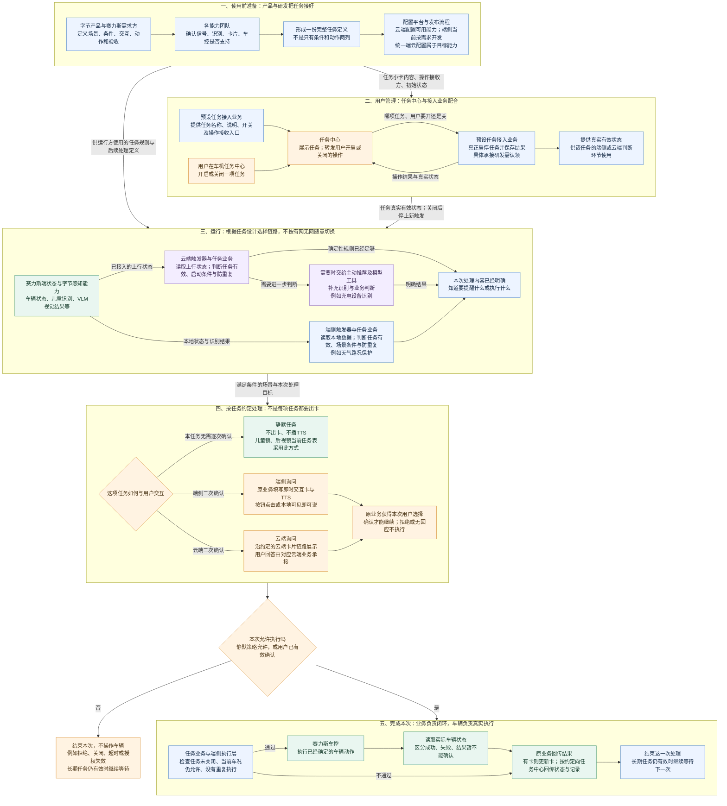
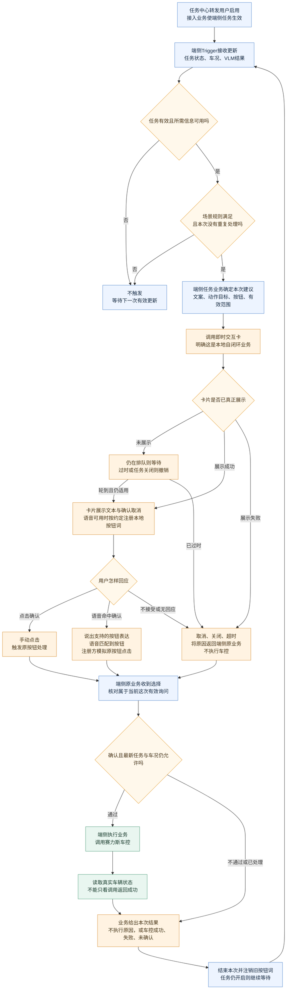
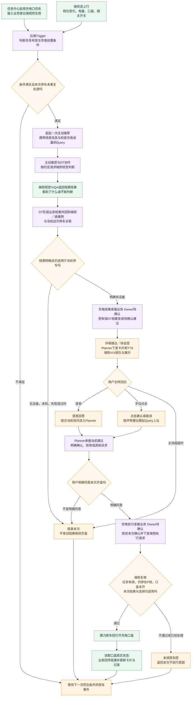

# PRD｜系统预设任务业务框架与端云交互

> 文档版本：V12（基于飞书“系统预设任务PRD 第 1 版”修订）  
> 文档状态：评审稿  
> 产品负责人：王泽民  
> 本次评审目标：确认公共业务框架、端侧与云端两条链路、四项任务规则、模块边界和待补能力；不在本次会议中设计底层接口。

## 0. 阅读说明

本文用三类标记区分结论：

- **【来源明确】**：任务表、原始需求或会议已经明确的内容。
- **【本版产品要求】**：为了让链路完整，本 PRD 提出的业务要求，需要研发确认接法和排期。
- **【待确认】**：责任方、规则或现有能力还没有拍板，不能写成已经支持。

文中的三张流程图是本次评审的主线，保持原有业务结构。图中“端侧”“云端”表示能力运行的位置；“字节”“赛力斯”表示责任归属，两者不能混为一谈。图里的示例数值用于解释规则，不代表实车数据或已经通过测试。

---

## 1. 需求摘要

### 1.1 什么是系统预设任务

系统预设任务，是产品提前定义好、用户不需要每次重新创建的长期主动服务。用户在任务中心开启后，系统持续等待条件；条件满足时，按任务约定静默处理或先询问用户，再执行车辆动作并反馈真实结果。

以“天气／路况保护”为例：用户打开开关，只代表允许这项服务开始工作，不代表立即切换驾驶模式。车辆行驶中识别到湿滑路面，且车速、当前模式等条件都满足时，系统才询问用户；用户确认后还要重新检查最新车况，车辆真实切换成功才算本次完成。长期任务仍保持开启，继续等待下一次新场景。

### 1.2 为什么现在需要做一套框架

现有材料已经分别描述了任务中心、触发条件、即时交互卡、可见即可说、主动推荐、DT 和车控，但缺少一条大家共同认可的完整主线。上次评审主要暴露了四个问题：

1. 只写了“满足什么条件、执行什么动作”，没有写任务怎样启停、命中后交给谁、怎样询问、怎样收口。
2. “页面开关打开”“单次用户确认”“车辆已经改变”是三个不同状态，过去容易被合并成一个“成功”。
3. 端侧和云端交互被混在一起。端侧有限表达走可见即可说；云端自然语言回答需要 Planner 结合当前询问理解。
4. 保存配置、触发器命中、卡片展示、模型返回和车控请求成功，都只能证明某一步完成，不能单独证明整项任务闭环。

### 1.3 本次目标

本次建立一套可复用的产品框架，使研发和测试能够回答：

- 一项任务从产品定义到用户开启，再到真实车辆结果，中间有哪些步骤；
- 每一步由哪个模块负责，输入是什么，输出是什么；
- 什么时候放端侧，什么时候需要云端参与；
- 触发器和即时交互卡各自负责什么；
- 用户确认后为什么仍要复核；
- 哪个真实车辆状态才算成功；
- 四项任务还缺哪些能力、规则和责任人。

### 1.4 产品价值

- **对用户**：一次开启后持续得到服务；需要授权的动作不会因为旧卡、旧结果或误识别直接执行。
- **对需求接入方**：新增任务复用“定义—启用—判断—交互—执行—结果”框架，不再逐条重新拼链路。
- **对研发与测试**：出现问题时能定位是任务状态、数据、规则、卡片、用户选择、车控还是状态回读出了问题。

### 1.5 本期范围

本期覆盖四项系统预设任务：

| 任务 | 本期交互方式 | 当前运行方向 | 关键说明 |
|---|---|---|---|
| 天气／路况保护 | 卡片＋TTS；逐次确认 | 端侧自闭环 | 本地语音采用可见即可说；天气前半段已在研发，需补齐卡片以后链路 |
| 识别充电设备后打开充电口盖 | 卡片＋TTS；逐次确认 | 云端判断＋端侧执行 | Trigger 发起主动推荐，DT／VQA识别，用户确认后才能开盖 |
| 后排儿童／宠物识别后开启儿童锁 | 无卡、无TTS；静默执行 | 运行位置待确认 | 儿童与猫狗是“任一满足”；静默不等于跳过复核和回读 |
| 后视镜自动加热 | 无卡、无TTS；静默执行 | 责任归属和位置待确认 | 先盘点赛力斯已有温感联动，避免字节与赛力斯重复执行 |

本期不包含：用户用自然语言任意创建任务、所有即时任务类型改造、统一端云配置平台一次性建设完成、任意卡片的自然语言理解、未在四项任务中定义的自动关闭或恢复动作。任务表中的“宠物模式”为独立能力，不等同于本期“识别到儿童／宠物后开启儿童锁”，不纳入这四项任务的闭环验收。

### 1.6 当前对齐联系人

| 事项 | 当前资料中出现的对齐人／团队 | 本次需要给出什么结论 |
|---|---|---|
| 总体方案与Trigger产品 | 王泽民 | 四项任务规格、端云边界、交接和验收口径 |
| 任务中心／Task任务体系 | 郝晓伟及任务中心团队 | 操作由谁接收、真实任务状态由谁保存和提供、启动与异常恢复 |
| Trigger研发 | 韩杰、王帅及Trigger团队 | 状态／信号入口、条件计算、时效、防重复和运行位置 |
| VUI／即时交互卡 | 徐洋及VUI团队 | 端侧卡与云端卡的接入方式、展示回执、用户结果和结果更新 |
| 可见即可说／语音 | 语音、VUI相关团队 | 谁注册／注销按钮词、语音不可用与歧义时怎样处理 |
| 充电主动推荐链路 | 刘铎及主动推荐、DT、Planner相关团队 | DT结果由谁承接，卡片走哪条路线，确认后怎样进入端侧执行 |
| 后视镜任务 | 范鹏宇及需求、状态、车控团队 | 三个入口的正式规则、现有温感联动与字节方案边界 |
| 赛力斯状态与车控 | 对应信号、车控团队 | 输入含义、使用限制、真实成功状态和失败原因 |

以上是资料中用于对齐的角色，不等同于所有研发Owner已经确定；未认领项仍在第10章拍板。

---

## 2. 核心概念与模块边界

### 2.1 先分清三种状态

| 状态 | 例子 | 谁使用 | 不能混淆成什么 |
|---|---|---|---|
| 长期任务状态 | 天气保护当前是否开启 | 任务中心、任务承接业务、Trigger | 不等于用户已经同意某次切换 |
| 单次处理状态 | 本次湿滑建议正在排队、展示、已确认或已结束 | Trigger后续业务、即时交互卡、Planner | 不等于长期任务被关闭 |
| 车辆真实状态 | 驾驶模式是否真的变为湿滑、口盖是否真的打开 | 端侧执行层、赛力斯车控、结果展示 | 不等于车控请求已被受理 |

还要分清三个名字相近、作用不同的“开关／确认”：

| 名称 | 控制什么 | 什么时候判断 | 不等于什么 |
|---|---|---|---|
| 任务中心单项开关 | 用户是否允许某一项长期任务运行，例如“天气／路况保护” | 每次准备产生新建议或执行前 | 不等于用户同意本次车控 |
| SLS／AI主动服务总开关 | 是否允许主动服务整体工作；是否适用于四项任务需分别会签 | 若该任务方案明确依赖主动服务时 | 不等于某项任务已经开启 |
| 当前卡片确认 | 用户是否同意这一次建议，例如本次打开充电口盖 | 卡片真正展示后，且只在本次有效范围内 | 不会长期打开或关闭任务 |

天气任务至少必须判断任务中心单项开关；充电方案的现有资料还要求AI主动服务可用。儿童锁、后视镜是否受总开关约束尚未会签，不能一概加上或一概删掉。

### 2.2 各模块负责什么

| 模块 | 负责 | 不负责 | 本次需确认 |
|---|---|---|---|
| 产品与场景需求方 | 定义用户价值、条件、交互、动作、异常和验收 | 不替研发设计底层协议 | 四项任务最终规格和冲突口径 |
| 配置平台／端侧发版流程 | 承载已经接入的任务定义并发布到对应运行侧 | 不会因为写了名称就自动获得新信号、模型、卡片或车控能力 | 哪些内容当前可配，哪些仍需开发交付 |
| 任务中心 | 展示长期任务，接收并转发用户开启／关闭操作，展示处理结果 | 不直接判断天气，不直接触发车控 | 操作接收方、真实状态回显、失败和重试体验 |
| 任务承接业务 | 真正处理启停，保存或提供真实任务状态；承接单次业务结果 | 不等同于任务中心页面，也不能只用页面状态代替真实状态 | 四项任务分别由哪个现有业务承接 |
| Trigger | 读取任务状态、车况和感知结果，判断本次是否到了处理时机；处理数据有效性与重复场景 | 不展示卡片，不把条件命中当用户授权 | 端／云状态入口、规则、数据时效和防重复 |
| 天气／充电等后续业务 | 把“命中”变成一次明确建议；校验用户选择；决定是否请求执行 | 不把卡片按钮直接映射成裸车控 | 现有模块由谁承接单次建议状态 |
| 即时交互卡／VUI | 卡片准入、排队、真实展示、TTS、按钮、关闭、超时、结果更新 | 不判断天气、SOC或P挡；不决定是否允许车控 | 端侧卡入口、云端卡类型、展示和生命周期反馈 |
| 可见即可说 | 在端侧把有限的语音表达匹配到当前可见按钮，并复用原按钮处理 | 不理解任意追问，不直接车控 | 谁注册／注销按钮词，歧义与重复输入怎样处理 |
| 主动推荐、Advisor、Planner | 承接云端建议；Planner结合当前询问理解自然语言回答 | 不负责车机上的真实卡片展示，不代替端侧安全复核 | 充电采用哪类卡片链路，点击如何回到Planner |
| DT／VQA | 按当前场景完成视觉观察和业务判断 | 识别到设备不等于获得开盖授权 | 谁接住DT结果并转成待确认建议 |
| 端侧执行层／赛力斯车控 | 执行前读取最新状态，检查车辆限制，调用车控并提供真实状态 | 请求受理不等于动作成功 | 动作限制、成功状态、失败原因与结果未知处理 |

表中的“任务承接业务”“天气后续业务”“结果承接业务”是产品职责名称，用来说明这段工作必须有人承接，不代表要新建三个系统。研发可以由现有Trigger动作框架、主动推荐业务或其他已有模块承担，但评审必须明确唯一承接方。

### 2.3 三个容易混淆的产品名词

- **即时任务**：用户现在提出、希望立即处理的一次任务，例如“现在打开车窗”。
- **即时交互卡**：车机临时显示业务结果和按钮的界面容器。系统预设任务可以使用它，但不会因此变成用户创建的即时任务。
- **可见即可说**：把当前界面的可操作文字注册给语音能力，用户说出支持表达后，模拟原按钮点击。它是操作方式，不是任务判断模块。

### 2.4 本文术语翻译

| 术语 | 在本文中的人话解释 |
|---|---|
| Trigger | 持续看任务状态和场景条件，判断“现在是不是到了处理时机”的模块 |
| VUI／即时交互卡 | 把一次建议展示给用户、收集按钮或语音选择、更新本次结果的车机交互容器 |
| TTS | 车机把卡片里的提示语读出来 |
| Planner | 云端结合当前询问上下文理解用户自然语言回答的决策能力 |
| Advisor／主动推荐 | 云端承接一次主动建议、组织后续判断或交互的业务链路 |
| DT／VQA | DT组织一次判断；VQA根据车端画面回答“看到了什么”。二者的成功都不等于用户已授权车控 |
| 真实状态回读 | 车控请求发出后，再读取车辆当前状态，确认动作到底有没有真的完成 |

---

## 3. 总体业务框架

### 3.1 一项任务从定义到真实完成

### 3.2 图中五段业务分别解决什么

| 阶段 | 谁负责 | 收到什么 | 做什么判断／动作 | 输出给下一段 | 失败或不满足时 |
|---|---|---|---|---|---|
| 使用前准备 | 产品、需求方、各能力团队、配置／发版方 | 场景需求和已有能力 | 条件、交互、动作、结果是否完整，依赖是否真实可用 | 一份可运行、可验收的任务定义 | 缺信号、卡片、车控或责任人时不得假装可发布 |
| 用户管理 | 任务中心、任务承接业务 | 用户开启／关闭意图 | 操作是否成功，当前真实任务状态是什么 | 真实有效状态给端侧或云端运行方 | 启用失败或状态未知时不开始新触发 |
| 运行判断 | 端侧或云端Trigger、必要的模型能力 | 任务状态、车辆状态、感知结果 | 数据能否使用、条件是否满足、本次是否重复、是否允许提醒 | 一次明确的处理目标 | 未满足、未知、过时或重复时继续等待或结束本次 |
| 用户交互 | 后续业务、即时交互卡、可见即可说或Planner | 本次建议和交互要求 | 本任务是静默还是询问；用户是否明确确认 | 当前这次尚未过期的有效确认，或“不执行”的结果 | 拒绝、关闭、超时、卡片失效均不执行 |
| 执行与结果 | 端侧执行层、赛力斯车控、原业务 | 静默策略允许或有效确认 | 最新任务和车况是否仍允许；车辆是否真实达到目标 | 成功、失败或暂不能确认；长期任务继续等待 | 复核失败不车控；真实状态未达到不能报成功 |

### 3.3 任务中心开关怎样到Trigger

【来源明确】任务中心负责转发操作，不等于它已经完成任务启停。资料目前能确认到：

1. 任务承接业务向任务中心登记任务名称、说明、默认状态和操作接收入口。
2. 用户点击开启。任务中心把“用户想开启哪项任务”交给任务承接业务，此时仍是操作请求。
3. 承接业务处理并保存成功后，把真实结果返回任务中心；失败时返回失败，页面不能先显示为已生效。

为了让端侧和云端运行方在重启、断连和关闭后不会误触发，本版提出以下产品要求，研发需确认实现方式：

4. 端侧或云端运行方必须能在启动时读取当前任务状态，在运行中取得启停变化，在异常恢复后重新核对。
5. Trigger只有在真实状态为有效时才进行场景判断。状态未知、同步中断或启用失败时，不按开启处理。
6. 用户关闭任务后，停止创建新的建议，并使仍在排队或等待确认的旧建议失效。已经发出的车控请求不能仅通过关闭开关宣称已撤销，要继续核对真实结果。

【待确认】四项任务分别由哪个现有业务接收任务中心操作、保存状态并提供给Trigger；资料不能证明一个“任务标识”已经能够自动通知全部端侧Trigger。状态由事件推送、启动快照还是其他现有链路提供，由任务中心／Task和Trigger研发共同确认，本PRD只要求Trigger最终能拿到可信的当前状态。

### 3.4 一项长期任务的生命周期

| 时机 | 用户看到什么 | 任务承接业务做什么 | Trigger／运行方做什么 |
|---|---|---|---|
| 首次出现 | 任务中心展示名称、说明和默认状态 | 提供任务登记信息和可处理的启停入口 | 尚未启用时不产生建议 |
| 用户开启 | 页面等待并展示真实操作结果 | 处理开启并保存真实状态 | 取得“已生效”后才开始等待场景 |
| 任务运行 | 长期开关保持开启；单次卡片按场景出现 | 保持状态可查询，承接单次结果 | 每次只处理新的、仍适用的场景 |
| 用户关闭 | 页面展示真实关闭结果 | 保存关闭；使排队／待确认建议失效 | 停止新触发；已经发出的动作继续核对真实结果 |
| 用户删除任务 | 若任务中心支持删除，则任务不再展示 | 【待确认】删除与关闭、恢复默认的关系 | 不得继续产生新建议 |
| 车机启动、升级或异常恢复 | 不先假设任务是开或关 | 提供可信当前状态 | 重新读取状态和当前场景，不补执行旧卡、旧识别或旧确认 |

---

## 4. 端侧和云端怎样区分

### 4.1 不是按任务名称，也不是简单按“有模型／没模型”区分

天气使用端侧VLM结果，仍然可以是端侧任务；云端也可能只做确定性规则。真正要看的是：完成当前这一步所需的数据和能力在哪里、对实时性和网络的要求是什么、用户回答是否需要上下文理解。

| 判断问题 | 优先端侧 | 需要云端参与 |
|---|---|---|
| 完成判断所需数据 | 本地车辆状态和本地已产出的结构化感知结果已经足够 | 需要云端工具、DT／VQA、多来源信息或历史上下文 |
| 网络要求 | 弱网或无网仍必须工作 | 允许依赖联网完成智能判断；断网时本次可结束 |
| 响应窗口 | 场景变化快，需要立即判断 | 可以接受上行、排队和推理时间 |
| 规则复杂度 | 条件、阈值和下一步动作明确 | 还要理解语义、判断是否值得推荐或动态选择工具 |
| 用户回答 | 点击按钮或有限表达匹配当前按钮 | 需要理解“好”“先别开”“附近还有别的吗”等上下文表达 |

### 4.2 两类链路的共同底线

- 端侧或云端只能产生本次建议，不能用旧建议或旧授权执行新场景。
- 云端给出业务结果后，涉及真实车辆动作仍回到端侧读取最新状态并复核。
- 端侧与云端的运行位置是任务设计结果，不因网络一会儿断、一会儿恢复就临时让两边各执行一次。
- 端侧优先的价值是低延迟、弱网可用和规则可解释；云端参与的价值是复用模型与工具、覆盖复杂判断和自然交互；端云协同的价值是把智能判断与车辆安全闭环同时保住。

### 4.3 当前不能写成已有能力的三件事

1. 云端已有部分条件和频控配置，不代表端侧规则、TTS、二次确认和完整结果已经能够统一配置。
2. VUI定义了端侧自闭环卡片方向，但“任务中心—本地卡—可见即可说”的完整离线能力仍需联合实车验证。
3. 配置平台只能引用已经接入的能力；保存了一项任务配置，不代表信号、模型、卡片和车控自动打通。

---

## 5. 端侧链路：天气／路况保护

### 5.1 这张图解决什么问题

端侧链路要讲清：Trigger什么时候可以提出一次建议；即时交互卡怎样让用户看见并选择；可见即可说怎样复用当前按钮；用户确认后由谁复核、车控和读取真实状态。

端侧主线是：**本地判断，本地询问，本地承接用户选择，端侧执行并回读。**它不需要Planner判断用户是否点击了“确认”，也不能让卡片自己判断天气和车况。

【来源明确】VUI评审材料把强实时、本地闭环业务定义为“外部业务直接拉端侧卡，有限表达走可见即可说，复用原按钮处理”；天气／路况保护被作为该方向的例子。【当前缺口】现有资料没有证明任务状态同步、卡片排队撤销、按钮词注册、执行结果更新已经完整联调，因此本章将这些写成需要各方确认的产品闭环，而不是上线事实。

### 5.2 端侧业务流程图

### 5.3 图中的四次业务交接

#### 交接一：任务状态、车况和感知结果 → Trigger

- **谁给**：任务承接业务提供真实任务状态；赛力斯状态方提供车速、驾驶模式、后雾灯等；天气／路面感知方提供结构化结果。
- **Trigger判断**：任务是否有效、数据是否来自正确场景且没有过时、条件是否同时满足、本次连续天气场景是否已经处理。
- **Trigger输出**：任务是否有效、命中了哪个天气子场景、命中的条件依据，以及本次是否允许进入后续处理。Trigger只回答“现在是否到了处理时机”。
- **天气后续业务输出**：把命中的子场景变成具体建议，例如“询问是否切换湿滑模式”，并确定卡片文案、按钮、TTS和确认后的单一动作。它回答“这次具体问什么、确认后做什么”。
- **不能继续的情况**：任务关闭、数据未知或过时、条件不满足、相同建议仍在排队／展示／执行。

#### 交接二：天气后续业务 → 即时交互卡

Trigger命中后，天气后续业务决定“具体问什么、用户确认后做什么”，再把下列产品信息交给卡片。这里的“天气后续业务”是必须有人承担的产品职责，不一定是新模块；可以由现有Trigger动作框架或天气业务承接，但评审必须指定唯一承接方。

- 本次发生了什么，例如“识别到路面湿滑”；
- 本次建议是什么，例如“建议切换湿滑模式”；
- 卡片标题、正文、确认和取消按钮文案；
- 是否播TTS以及播报文案；
- 采用端侧本地按钮语音路线；
- 这次建议什么时候失效；
- 卡片结果需要返回给哪一次天气建议，避免旧卡选择串到新场景。

即时交互卡负责准入、排队、真正展示、TTS、按钮和生命周期。**请求被接收不等于用户已经看到卡片。**【本版产品要求】排队期间任务关闭或天气条件失效时，旧建议应撤销，不应很久以后再问；具体由拉卡方主动撤销还是卡片按有效期淘汰，需VUI和天气业务确认。

#### 交接三：即时交互卡／可见即可说 → 天气后续业务

- 手动点击直接进入原按钮处理。
- 可见即可说把支持表达匹配到当前按钮，由注册方模拟同一个原按钮点击。
- 两种输入最后都由天气业务获得本次选择：确认、取消、关闭或超时。
- 卡片消失后，本次按钮词应失效；语音和点击同时返回时，本次选择只能消费一次。

可见即可说只匹配有限表达，不负责理解任意追问。词表、注册方、歧义处理和生命周期需要语音、VUI和天气业务共同确认。尤其要拍板是VUI随着卡片显示自动注册，还是天气业务显式注册；未确认前不能把任一方式写成现状。

天气业务收到卡片结果后，先按原因分流：确认进入执行前复核；取消／拒绝结束本次；关闭只表示用户关掉当前卡片；超时表示本次没有取得授权；卡片展示失败或排队过期表示用户根本没有看到问题。后五类都不能车控，但埋点、用户体验和是否允许后续新场景再次提醒不能混成同一个“拒绝”。

#### 交接四：天气后续业务 → 端侧执行／赛力斯车控 → 卡片

天气业务收到确认后重新读取：任务是否仍开启、天气和车况是否仍适用、目标状态是否已达到、本次是否已执行。通过后才调用赛力斯车控。未执行必须能区分原因：任务已关闭、场景已失效、车况不允许、目标已达到、本次已处理、确认已过期。

车控请求受理后继续读取驾驶模式或灯的真实状态：达到目标才成功；明确未达到为失败；规定时间内拿不到可信状态为“暂不能确认”。【本版产品要求】三类结果均需返回给天气业务；有仍有效的卡片时更新卡片，没有有效卡片时至少留下可查询的业务结果。正式等待时长、失败文案和重试策略待车控、VUI和测试会签。

### 5.4 天气／路况保护规则

【来源明确】任务为长期服务，需要二次确认；当前设计包含三个独立建议，不能用一次确认顺带执行多个动作。【本版产品要求】每次建议使用独立的有效范围和处理状态，防止多次天气变化共用一次确认。

| 子场景 | Trigger读取 | 满足条件后形成的建议 | 真实成功状态 |
|---|---|---|---|
| 雨／湿滑 | 任务有效；天气为雨或路面湿滑；车速满足提醒阈值；当前非湿滑模式；数据有效且未重复 | 询问是否切换湿滑模式 | 车辆真实驾驶模式为湿滑 |
| 浓雾 | 任务有效；识别为浓雾；车速满足提醒阈值；后雾灯关闭；数据有效且未重复 | 询问是否开启后雾灯 | 后雾灯真实状态为开启 |
| 冰雪 | 任务有效；识别为下雪或路面覆雪／结冰；车速满足提醒阈值；当前非雪地模式；数据有效且未重复 | 询问是否切换雪地模式 | 车辆真实驾驶模式为雪地 |

【待确认】正式天气／路面来源、车速阈值、稳定周期、防打扰、同时命中优先级、确认后需要重新检查的具体条件、允许哪个音区确认，均以业务和车控会签结论为准。原文已有的“车速＞30km/h”等值可作为当前评审输入，不在本文把未会签值写成平台通用规则。

### 5.5 完整主Case：湿滑建议从出现到成功

假设车辆正在行驶，任务已开启，当前车速46km/h，驾驶模式为标准，天气为下雨，路面结果从“普通”变化为“湿滑”。

1. **任务先有效。**任务承接业务已经成功保存用户开启状态；Trigger能够读取到该状态。若仍是未知或同步中，不开始判断。
2. **数据变化唤醒检查。**Trigger收到新的路面结果，同时读取当前车速、驾驶模式和天气结果。数据提供方只提供事实，不替Trigger决定是否出卡。
3. **Trigger逐项判断。**任务有效；路面湿滑；46km/h满足当前提醒条件；当前不是湿滑模式；相关结果没有过时；同一湿滑场景没有正在处理的相同建议。全部成立才产生一次候选建议。
4. **天气业务形成询问。**本次只建议切换湿滑模式，不同时开启其他灯或模式。示例卡片：“当前路面湿滑，是否切换到湿滑模式？”按钮为“切换”“暂不”。
5. **卡片进入VUI。**若用户Query正在展示，卡片可能进入排队。【本版产品要求】排队阶段任务关闭、车辆已经切换模式、路面恢复或建议过期时，旧建议不得再展示；撤销责任和排队回执由VUI、天气业务确认。
6. **卡片真正展示。**VUI展示卡片并按约定播TTS，随后允许用户手点或使用已注册的本地按钮表达。【本版产品要求】本次等待用户回应的计时应以真实展示为基准；具体起算点、卡片停留时长和TTS被打断时的处理由VUI会签。
7. **用户说“切换”。**可见即可说匹配到当前“切换”按钮并模拟原按钮点击。天气业务收到的是本次卡片的确认，不是一个可以长期复用的车控授权。
8. **执行前重新检查。**此时车速可能变化、路面可能恢复、用户可能手动切换模式。天气业务重新读取任务和最新车况；不再适用或已经达到目标时，不重复车控。
9. **请求赛力斯车控。**复核通过后，只请求切换湿滑模式。车控返回“已受理”时仍不能显示成功。
10. **读取真实状态。**驾驶模式真实变为湿滑，才更新卡片为成功；明确未改变显示失败；暂时无法确认则使用“暂不能确认”的结果，不播报“已经切换”。
11. **结束本次。**卡片和按钮词失效，本次确认不能再次使用。天气保护长期任务仍开启，继续等待下一次新的天气场景。

天气恢复后若需要建议恢复原模式，应创建一次新判断、新卡片和新确认，不能复用“开启湿滑模式”的旧确认。是否提供恢复建议、何时提醒和恢复到哪个模式需要单独会签。

### 5.6 必测异常

| 场景 | 预期 |
|---|---|
| 路面先湿滑，但车速暂未满足；随后车速满足 | 后续更新重新计算完整条件；只出一次仍适用的建议 |
| 卡片排队时路面恢复或任务被关闭 | 旧卡撤销，不展示过期问题 |
| 用户取消、关闭或超时 | 本次结束，不车控；长期任务是否继续由任务状态决定 |
| 用户确认前已经手动切换湿滑模式 | 复核发现目标已达到，不重复执行；不得冒充本次车控成功 |
| 车控返回受理，但驾驶模式未改变 | 结果为失败或暂不能确认，不显示成功 |
| 卡片消失后用户再说“切换” | 旧词条和旧确认无效，不执行 |
| 用户关闭了语音能力，但卡片可以展示 | 正常展示按钮；不注册本地语音词、不因无语音而阻塞手点 |
| 可见即可说没有注册成功或语音表达有歧义 | 不模拟点击、不车控；用户仍可手点，失败原因可定位 |
| 浓雾场景用户确认后后雾灯已手动打开 | 复核发现目标已达到，不重复调用，按目标已达到收口 |
| 冰雪与湿滑同时命中 | 按会签优先级只形成允许的建议；未会签前不得同时弹两张或顺带执行两个动作 |

---

## 6. 云端链路：识别充电设备后打开充电口盖

### 6.1 先分清四个不同结论

1. **停车前置条件满足**：只代表值得开始检查充电设备。
2. **当前停车下的DT／VQA链路给出有效结果**：只代表可以向用户提出建议。
3. **用户明确确认**：才代表允许申请本次开盖。
4. **口盖真实打开**：才代表本次任务成功。

任何一环都不能跳过，也不能把系统生成的Query当成用户已经授权。这四层门槛是当前充电口方案的拆解，不是要求所有云端任务都必须调用DT或都必须出卡。

### 6.2 云端业务流程图

图中四个容易误解的跨模块箭头，需要按下面口径评审：

1. **G→H不只是“VQA回一句话”。**它包含端侧视觉给出观察、DT形成业务结果、端侧或结果承接方拿到该结果，并确认结果仍属于当前这次停车。谁负责最后这次关联校验，待主动推荐／DT和充电业务认领。
2. **I→J是本版建议路线。**本稿建议复用静态Advisor／Planner卡片链路承接云端询问，但资料没有证明充电任务已经接通，不能作为已有能力验收。
3. **L→N之间需要充电业务桥接。**Planner只产出用户对当前建议的意图，必须由充电业务确认是同一次、未过期且未消费的“明确同意”，再生成端侧执行请求；Planner不直接开盖。
4. **O不通过与P执行失败是两回事。**O不通过表示端侧没有调用车控，应返回“不执行原因”；只有真正调用P后，才能根据Q的口盖真实状态判断成功、失败或暂不能确认。

### 6.3 每个模块接收什么、输出什么

| 模块 | 收到 | 判断／处理 | 输出 | 不能做 |
|---|---|---|---|---|
| 云端Trigger | 真实任务状态；主动服务状态；档位变化；SOC；口盖状态 | 任务是否有效、是否刚进入P挡、SOC是否满足、口盖是否关闭、本次停车是否重复 | 一次“值得检查充电设备”的主动推荐事件和业务Query | 不识别设备、不出卡、不直接开盖 |
| 主动推荐／Advisor | Trigger给出的停车场景、已知车况和检查目标 | 是否需要调用DT、怎样组织后续检查 | 与当前停车关联的DT调用 | 不把系统Query当用户授权 |
| DT／VQA | 当前检查目标和所需端侧视觉 | VQA提供观察；DT形成有设备、无设备、未知或失败等业务结果 | 可供后续业务判断、且仍属于当前停车的结果 | 不在识别到设备后直接执行开盖 |
| 结果承接业务 | DT结果和当前停车状态 | 结果是否明确、是否过时、车辆是否仍处于同一次停车 | 一次“是否打开充电口盖”的待确认建议 | 【待确认】具体承接方尚需认领 |
| Planner | 当前建议、卡片上下文、用户语音或模拟Query | 用户是否明确确认、拒绝，还是提出其他诉求 | 当前建议的用户意图结果 | 不负责车机真实展示，不替端侧做车控复核 |
| VUI／即时交互卡 | Planner／业务给出的文案、按钮、TTS和当前建议 | 卡片准入、排队、展示、关闭、超时和结果更新 | 展示事实、按钮操作和生命周期结果 | 不判断P挡、SOC和口盖状态 |
| 端侧执行层／赛力斯车控 | 有效确认和当前建议关联；最新车辆状态 | 任务、P挡、口盖、确认和识别是否仍有效；车控限制是否满足 | 真实开盖结果 | 不使用过期DT或过期确认 |

### 6.4 云端卡片路线必须选定，不能混写

VUI原文存在两类相关路线：

- **静态Advisor／Planner路线**：语音回答由Planner结合当前询问理解；用户手点按钮时，按约定模拟Query回到Planner，使云端上下文知道用户已经选择。
- **外部业务直接拉端侧卡路线**：适合强实时、本地闭环业务，有限表达可走可见即可说，原业务直接得到按钮结果。

充电需要云端识别与自然语言承接，本版以**静态Advisor／Planner路线作为评审方案**。这是交互选路方案，不代表接口已经接通。若最终改用系统通知卡的原业务回调路线，流程图、点击回传和责任人必须统一改写，不能一边画Planner、一边让按钮直接调用开盖。

【待确认】端侧取得DT结果后，由谁校验仍属于当前停车、谁将结果转成询问、点击到底怎样同步Planner，是本次云端专项必须落下的三个责任点。

语音能力不可用时，云端卡片仍可保留手动按钮；不得把“没有语音输入”当成用户拒绝。若产品要求自然语言回答是必要能力，则应在任务准入时明确阻塞条件，而不是卡片展示后悄悄失败。

### 6.5 完整主Case：低电量停车后识别到充电设备

假设充电任务已开启，AI主动服务允许，车辆从D挡进入P挡，SOC为19%，充电口盖关闭。

1. **真实任务状态已生效。**本版要求云端Trigger在任务发布前能取得可信当前状态；具体状态链路和Owner尚待任务中心／Task、充电业务和Cloud Trigger确认。页面显示开启但真实状态未知时，不开始新推荐。
2. **收到一次停车事件。**Trigger使用“从非P变为P”的变化启动检查，同时读取19%的SOC和当前口盖关闭状态。持续处于P挡不能反复当成新停车。
3. **Trigger计算硬条件。**任务有效、主动服务可用、进入P挡、19%≤当前阈值、口盖关闭、本次停车未处理，全部满足才发起一次主动推荐。
4. **Trigger给主动推荐业务目标。**Query表达“检查当前后视是否存在充电设备；明确存在时，先询问用户是否打开充电口盖”。原链路中“如果有的话打开充电口”必须被约束为先询问，不是自动开盖授权。
5. **主动推荐调用DT。**DT按约定请求端侧视觉／VQA观察当前画面。视觉观察和DT业务结果分开：VQA说看到了什么，DT给出后续是否可以继续判断的结果。
6. **端侧取得DT结果。**结果至少区分有设备、无设备、未知和失败，并能确认属于这一次停车。仅有“推理调用成功”不足以出卡。
7. **后续业务再校验。**明确有设备、结果没有过时、车辆仍属于当前停车时，形成“发现附近可能有充电设备，是否打开充电口盖”的建议。无设备、未知、失败或旧结果直接结束本次。
8. **Planner／VUI展示询问。**本版建议走静态Advisor／Planner路线：VUI先返回是否接收，再区分排队和真实展示；只有真实展示后才等待用户回答。排队期间车辆离开P挡、任务关闭、结果过期时，旧建议失效。该路线和回执能力需要专项确认，不写成现状。
9. **用户作答。**说“好，打开吧”时，Planner结合当前卡片理解为同意本次开盖；手点确认时，按静态Advisor路线把选择同步给Planner。两条路只形成一次确认。
10. **云端请求端侧执行。**只有明确确认才下发。拒绝、关闭、超时、表达不清或提出其他诉求，都不能进入开盖。
11. **端侧重新检查。**任务仍有效、仍处于当前停车的P挡、口盖仍关闭、识别和确认没有过期、没有重复执行，并满足赛力斯车控限制，才能请求开盖。
12. **真实结果收口。**赛力斯车控执行后读取口盖真实状态。真实打开才显示成功；未打开显示失败；状态无法确认时不播“已打开”。结果同步给当前有效卡片和云端业务。
13. **结束本次停车。**重复状态、重复确认和晚到结果不能再次开盖。长期任务继续有效，下一次新的停车事件重新判断。

### 6.6 必测异常

| 场景 | 预期 |
|---|---|
| DT返回无设备、未知、失败 | 不出执行确认卡，不开盖，结束本次 |
| DT结果回来时车辆已离开P挡或已是下一次停车 | 结果作废，不沿用旧结果询问或执行 |
| 用户拒绝、关闭、超时或回答其他诉求 | 不下发开盖；由Planner按当前交互策略处理其他诉求 |
| 用户确认后车辆离开P挡 | 端侧复核失败，不车控，并返回当前结果 |
| 用户已手动打开口盖 | 不重复调用；返回“目标已达到”而非冒充本次执行成功 |
| 网络中断后旧DT结果或旧授权恢复 | 旧结果和旧授权失效，不能补执行 |
| 车控返回受理但口盖状态未知 | 不显示成功，按“暂不能确认”收口 |
| 任务状态未知，或排队期间任务被关闭 | 不开始推荐／使旧建议失效，不开盖 |
| AI主动服务总开关关闭 | 按充电当前方案不进入主动推荐；是否仍保留任务开启状态由任务中心产品确认 |
| SOC正好处于阈值边界或随后升高 | 按正式会签的包含关系判断；执行前重新检查，旧条件不再适用时不执行 |
| 车辆启动时已经处于P挡 | 是否补做一次检查待业务拍板；不能把持续P挡当成无限次新停车 |
| 同一次停车重复收到P挡／状态上报 | 只创建一次检查，不重复调用DT、不重复出卡 |
| Query创建、DT调用或结果回传失败 | 结束本次或按会签策略有限重试；没有明确有效结果不出确认卡 |
| 卡片准入失败、长时间排队或展示后过期 | 区分三种原因；用户未看到或授权已过期时不执行 |
| 语音和点击几乎同时确认 | 当前建议只消费一次，只下发一次端侧执行请求 |
| 卡片已消失后才收到执行结果 | 不复活旧确认；结果仍回到原业务并按约定留痕 |

---

## 7. 两项静默任务怎样进入同一框架

静默任务跳过“卡片和逐次确认”，但不能跳过任务启停、数据有效性、条件判断、执行前复核、防重复和真实状态回读。

### 7.1 后排儿童／宠物识别后开启儿童锁

【来源明确】当前规则为：任务有效，并且车辆处于非P挡，并且后排识别到儿童、猫或狗任一对象，并且目标儿童锁未开启时，静默开启儿童锁；无卡、无TTS。

| 步骤 | 产品逻辑 |
|---|---|
| 数据来源 | 儿童由赛力斯OMS提供；猫／狗由字节VLM提供；挡位和锁状态由赛力斯车辆状态提供 |
| 条件关系 | `儿童 或 猫 或 狗`，不是三者同时；儿童明确成立时不需要等待宠物结果 |
| 任务运行／判断侧输出 | 一次“开启会签范围内儿童锁”的静默处理目标；具体是否由端侧Trigger承接仍待确认 |
| 执行前复核 | 任务仍有效、当前仍非P、识别结果没有过时、目标锁仍关闭、符合车企限制 |
| 真实成功 | 会签范围内的儿童锁真实状态为开启 |
| 防重复 | 持续识别到同一对象或重复状态更新，不重复下发已经达到的目标 |

主Case：任务已开启，车辆从P进入D，OMS当前识别后排有儿童，目标儿童锁关闭。任务运行／判断侧确认数据有效并命中后，跳过卡片和TTS，交端侧执行层复核；赛力斯车控开启锁，读取真实锁状态为开启，本次结束，长期任务继续等待。运行位置和具体承接模块拍板前，不把它直接写成现有端侧Trigger能力。

宠物Case：若“后排有狗”是五分钟前的旧结果，当前刚进入非P，不能直接按“有狗”执行；先按会签有效期判断。会议曾提到默认宠物识别低频，这说明“有能力”不等于能满足当前安全窗口，需要视觉团队确认当前频率和有效性。

【待确认】目标锁是一侧还是两侧；用户手动关闭后是否再次自动开启；运行位置和承接业务；猫狗结果有效期；车辆限制。未定义儿童／宠物离开后的自动解锁，本期不得自行增加。

### 7.2 后视镜自动加热

【来源明确】当前任务表要求无卡、无TTS、静默执行；原始需求包含三个P0入口。三个入口独立判断，不能合成一个大条件。

| 子场景 | 开始检查的变化／事件 | 条件 | 处理目标 | 关键缺口 |
|---|---|---|---|---|
| 雨天中低速 | 下雨、雨刮状态、车速或挡位变化 | 当前任务表：任务有效、下雨、车速＜70km/h、非P、加热未开启；原始材料另有“雨刮连续30秒”口径 | 静默开启后视镜加热 | 是否把30秒写入正式条件、雨刮持续算法、退出和关闭策略 |
| 洗车结束 | 一次“传送带洗车模式退出”事件 | 任务有效；本次退出未处理；加热未开启 | 静默开启后视镜加热 | 开启时长、何时关闭、谁负责定时 |
| 高湿温差 | 湿度／温度窗口更新 | 当前输入为任务有效、湿度＞60%、温差＞5℃、加热未开启；“一分钟”是否为正式窗口待确认 | 静默开启后视镜加热 | 温差方向、时间窗口、采样和重触发规则 |

雨天主Case：车辆D挡、50km/h、下雨、加热关闭。按当前任务表，任务有效、下雨、50＜70、非P且目标未开启即可进入处理；原始材料还要求雨刮连续30秒。评审必须先选择正式口径：若保留30秒，雨刮刚开始不能命中，满30秒后重新检查全部条件；若不保留，则不能在验收中临时加这条门槛。执行后都要读取真实加热状态，后续重复更新不得重复开启。

洗车Case：当前“没有在洗车”不是事件；只有从洗车模式退出这一次变化才开始处理。重复送达同一次退出不重复开启。

高湿温差Case：若最终会签为“一分钟窗口”，可用湿度65%、一分钟前22℃、当前28℃说明计算过程；这只是方案演示，不代表算法已会签。最终必须写清是否有时间窗口、用绝对差还是方向差、首尾值还是窗口最大最小、缺采样时怎样处理。

【待确认】赛力斯已有温感联动可能也会控制后视镜加热。必须先确认三项P0由赛力斯现有系统扩展、字节Trigger承接，还是只接任务中心管理。同一子场景只能有一个主动执行承接方，避免两边重复开启或相互关闭。

---

## 8. 配置平台与任务定义要求

### 8.1 产品必须交付一份完整任务定义

一项任务不能只有“条件”和“动作”两列。每项任务至少需要写清：

| 定义内容 | 产品需要回答的问题 |
|---|---|
| 基本信息 | 用户看到的名称、说明、默认状态、适用车型和版本是什么 |
| 启停承接 | 谁接收任务中心操作、谁保存真实状态、失败怎样回显 |
| 运行位置 | 本次由端侧、云端还是端云协同运行，为什么 |
| 数据输入 | 每项状态／感知结果由谁提供；是当前状态还是一次变化；多久仍可使用 |
| 条件规则 | 哪些条件必须同时满足，哪些满足任一即可；未知、过时、不满足怎样处理 |
| 单次边界 | 什么算同一次天气、停车或洗车事件；什么时候允许重新处理 |
| 交互方式 | 静默、端侧确认还是云端确认；卡片、按钮、TTS和语音路线是什么 |
| 执行动作 | 用户或静默策略最终允许哪个动作；执行前还要复核什么 |
| 结果标准 | 读取哪个真实车辆状态；成功、失败和暂不能确认怎样表现 |
| 防打扰与退出 | 排队、拒绝、关闭、超时、任务关闭、场景失效和人工操作怎样处理 |
| 责任和验收 | 每段业务由谁承接；正向与异常用例怎样通过 |

### 8.2 配置平台本次与目标能力分开

- **当前**：只配置已经接入的能力；云端已有部分规则和频控配置，端侧仍有按需求开发和随版本发布的部分。
- **本期产品要求**：四项任务的完整业务规格必须形成同一份会签结果，不要求所有内容立刻做成可视化配置。
- **目标能力**：同一任务定义能表达端／云运行位置、任务状态、规则、交互、动作、结果和版本范围，再由对应运行侧消费。

评审需要各能力方明确“当前可用／需要新增／本期不支持”，不能把目标平台能力写成当前已经上线。

---

## 9. 公共规则与验收

### 9.1 公共业务规则

1. **任务状态优先**：任务无效或状态未知时，不产生新建议和新执行。
2. **未知不等于不满足**：没有当前感知结果不能当成“确认没有儿童／没有充电设备”。
3. **变化只是唤醒判断**：档位变化、天气变化或洗车退出只负责让Trigger重新检查；仍需读取并计算全部条件。
4. **单次去重**：同一次天气、停车、卡片和确认不能重复产生建议或动作。
5. **卡片展示才进入等待用户阶段**：排队不等于展示；过期建议不得延迟弹出。
6. **明确确认才授权**：需要确认的任务中，拒绝、关闭、超时、表达不清和旧卡回应均不执行。
7. **执行前重新检查**：用户确认到车控之间，任务和车况可能变化；以端侧最新状态为准。
8. **真实状态才是结果**：车控请求成功、模型成功、卡片成功都不能代替车辆真实状态。
9. **本次结束不等于长期任务关闭**：是否继续等待由长期任务状态决定。
10. **不擅自重试或扩展动作**：没有会签规则时，不无限重试、不自动反向车控、不增加关盖、解锁或恢复模式等动作。
11. **用户拒绝与根本没看到要分开**：明确拒绝、主动关闭、自然超时、卡片展示失败、排队过期是不同事实；是否抑制后续新场景提醒需要按任务会签。
12. **多项主动服务要有统一仲裁**：同一时刻多个任务命中时，Trigger业务提供任务优先级和建议有效期，VUI／主动推荐负责其范围内的排队；跨任务优先级、抢占和恢复策略本期需专项确认。

### 9.2 验收方法

每条用例都必须同时记录四项证据：输入／状态、Trigger或云端判断、用户界面／选择、车辆真实状态。测试按照“能力可用→模块交接→完整用户场景”三层进行，任何单点成功都不能替代完整场景验收。

| 验收组 | 至少覆盖 |
|---|---|
| 公共框架 | 开启成功、开启失败、启动恢复、关闭后停止新触发、状态未知、重复上报、场景失效、真实结果未知 |
| 端侧天气 | 无网／弱网目标场景、卡片排队与撤销、点击、可见即可说、拒绝／关闭／超时、确认后车况变化、真实模式／灯状态 |
| 云端充电 | 硬条件不满足、DT四类结果、旧结果、两类用户输入、离开P挡、手动开盖、断网、真实口盖结果 |
| 儿童锁 | 儿童分支、宠物分支、过时结果、非P限制、目标已开、静默无卡无TTS、锁真实状态 |
| 后视镜 | 三个入口分别命中、多入口同时满足、重复事件、用户手动操作、真实加热状态；雨刮30秒和温差窗口拍板后再形成正式边界用例 |

### 9.3 产品需要能回答的问题

必要的业务记录应让产品和测试回答：

- 为什么这次没有触发；
- 为什么Trigger命中了但没有出卡；
- 卡片是在排队、展示、关闭还是过期；
- 用户返回了什么，是否属于当前这次建议；
- 为什么没有执行；
- 车辆是否真实达到目标；
- 长期任务是否仍然有效。

正式日志字段、存储和协议由技术方案确定，PRD不预先设计。

### 9.4 上线后关注的产品指标

本期先定义指标方向，不在PRD臆造目标数值：任务开启成功率、条件命中后有效建议率、卡片真实展示率、用户确认／拒绝／关闭／超时分布、确认后因车况变化未执行比例、车控真实成功率、重复建议与重复执行拦截量。正式目标值和统计口径由产品、数据和测试在灰度前会签。

---

## 10. 本次评审需要拍板的结论

| 决策项 | 当前结论 | 本次需要回答 | 需要共同确认的业务方 |
|---|---|---|---|
| 四项任务的启停 | 任务中心转发，接入业务真正处理 | 每项任务谁接收、保存、提供真实状态；启动和异常怎样恢复 | 任务中心、四项任务承接方、端／云Trigger |
| 天气后半段 | 端侧自闭环卡＋本地可见即可说 | 卡片入口、业务承接、按钮词注册、展示与撤销、结果更新 | Trigger／天气业务、VUI、可见即可说、赛力斯车控 |
| 充电DT结果以后 | 前半段沿主动推荐＋DT；后半段未完全接清 | 谁承接DT结果、采用哪类卡、点击与语音回到谁、怎样下发端侧 | Cloud Trigger、主动推荐／DT、Planner、VUI、端侧执行 |
| 静默任务 | 儿童锁和后视镜当前无卡无TTS | 是否完全不展示即时结果；异常怎样记录；运行方是谁 | 任务需求方、Trigger／承接业务、VUI、赛力斯 |
| 真实结果 | 必须以车辆状态收口 | 每个动作的成功状态、失败／未知处理、卡片如何更新 | 赛力斯信号／车控、原业务、VUI、测试 |
| 端云配置 | 云端部分能力可配，端侧统一配置是目标 | 当前可用、需新增、不支持分别是什么；本期交付边界 | 配置平台、端／云Trigger、各能力团队 |
| 规则冲突 | 多份材料存在不同口径 | 天气阈值与防抖、充电退出、儿童锁范围、后视镜窗口和关闭策略 | 各任务需求方、对应能力团队、测试 |

其中“充电DT结果由谁接住并转成建议”“Planner确认后由谁转成端侧执行请求”是充电任务发布阻塞项：没有唯一承接方和可验收交接，就不能以“前半段已经通了”为由发布自动开盖任务。

会议结束时，每个未决项都要有一位牵头人、需要交付的结论和完成日期。只写“相关同学再对齐”不算形成结论。

---

## 11. 发布与分期

### 11.1 评审通过不等于四项任务同时可发布

公共框架用于统一产品规则和模块边界；每项任务仍需分别完成数据、交互、动作和真实结果验收。某项任务存在未解决依赖时，可以明确阻塞该任务，不应隐藏在“框架已经完成”之下，也不应阻塞其他已闭环任务单独推进。

### 11.2 建议分期

1. **第一阶段：框架和责任拍板。**确认三张图、四项任务规格、端云选路、业务Owner和资料冲突。
2. **第二阶段：补齐四个关键交接。**任务状态入口；天气本地卡／可见即可说；充电DT结果／云端确认；车辆动作／真实回读。
3. **第三阶段：按任务联调。**先走一条完整正向Case，再测关闭、拒绝、过期、数据变化、重复、执行失败和结果未知。
4. **第四阶段：逐项判定发布。**按车型、版本、能力支持和测试证据确定灰度范围；失败时能停止新触发并回退任务定义。

### 11.3 发布前检查

- 每项任务的启停承接方、运行方、交互方、执行方和测试责任已明确；
- 所有影响是否执行的条件、数据含义、时效、动作和真实成功状态已会签；
- 需要确认的任务已打通展示、有效确认、执行前复核和结果更新；
- 静默任务已确认无卡无TTS及异常处理；
- 防重复、过期、关闭、拒绝、网络和感知故障均有验收证据；
- 字节与赛力斯不存在同一场景重复控制或相互关闭；
- 测试报告包含真实输入、界面行为和车辆状态，模拟信号不能替代最终能力验收。

---

## 12. 来源与取舍

本稿以用户指定的第1版为结构底稿，并交叉核对下列原始资料：

| 来源 | 本稿使用范围 |
|---|---|
| [系统预设任务PRD 第1版](https://bytedance.larkoffice.com/wiki/R1OLwyfpTijHw7kQtnbcoZB4nff?edition_id=rZZZO6) | 原始背景、三张业务图、四项任务和端云方向 |
| [预设条件表V2｜系统预设任务全集](https://bytedance.larkoffice.com/wiki/SorvwQ413iamTRkzSxvcVPWtnYc?psg_id=6448603523554308546&refer_index=1&refer_type=citation&sheet=g4s4FB) | 四项任务当前条件、交互方式和动作输入 |
| [9月1日产品内审记录](https://bytedance.larkoffice.com/docx/Zp90dGMheow4XmxwVXAcu2KGnTb) | 01:35:10—02:14:49系统预设任务、端云选路和即时交互卡争议 |
| [VUI主交互需求](https://bytedance.larkoffice.com/wiki/FBsrwA734iaFzZkrZExcHHBtn3d) | 模块3.2卡片三方调用、端侧自闭环、静态Advisor／Planner卡片方向和卡片生命周期 |
| [可见即可说框架需求](https://bytedance.larkoffice.com/wiki/AxYjwUI8wiFCXWkdNsDcRae0nCf) | 当前可见按钮与本地语音表达的映射边界 |
| [端侧触发器PRD](https://bytedance.larkoffice.com/wiki/Q1RBwsEuliWvk6kv8Jxc1JB7nEc) | 端侧条件判断、数据状态与Trigger职责 |
| [Task任务管理设计](https://bytedance.larkoffice.com/wiki/B2WYwXFOIigKzbk7aSYcJWmZn2E) | Task管理的技术背景；不直接推定任务状态通知已经打通 |
| [天气／路况保护需求](https://sai-seres.feishu.cn/wiki/VXEdwlChniB4lMkqQT9cPxPqnFh) | 天气三个子场景、二次确认和车控目标 |
| [充电设备识别相关动态任务方案](https://bytedance.larkoffice.com/wiki/T8jDwzwO9iiNF0kbFEVc1uyrnIf) | 主动推荐、DT／VQA与端侧取得结果的前半段链路 |
| [补能管家充电PRD](https://sai-seres.feishu.cn/wiki/CizBwOtzqil4R4kOcupcwjfLnkd) | 充电场景与车辆侧能力参考，不直接替代本任务专项会签 |

取舍原则：

- 任务表和详细需求不一致时，保留差异并在评审中拍板，不替业务方选择；
- 天气采用端侧自闭环方向，但完整离线链路写成待联合验证；
- 充电保留“Trigger→主动推荐→DT→端侧取得结果”的现有前半段，新增二次确认门槛；
- 充电暂按静态Advisor／Planner卡片路线评审，不把它写成已完成接入；
- 儿童锁和后视镜按当前任务表保持无卡无TTS，不因为VUI通用能力存在就擅自增加结果卡；
- 后视镜保留“任务表未写30秒、原始材料写雨刮持续30秒”的冲突，由需求方在评审中拍板，不替业务方选择；
- 所有车控成功均以真实车辆状态为准，不使用请求受理或按钮点击代替。
