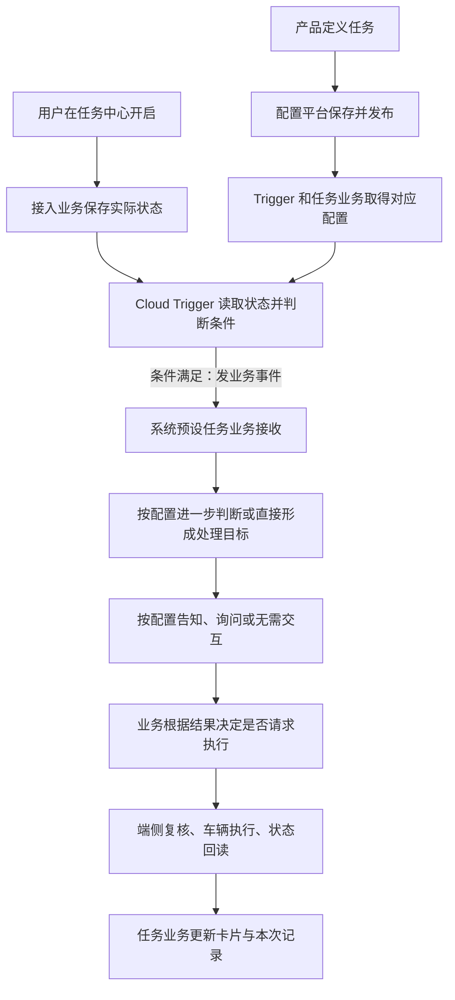
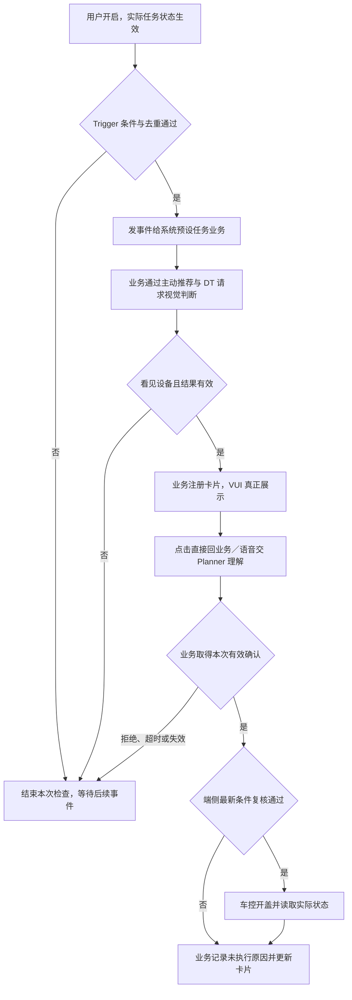

# PRD｜系统预设任务云端配置与执行框架

> 版本：V2.0 · 2026-09-13 · 产品方案评审稿  
> 产品负责人：王泽民；适用范围：云端配置与运行，以充电设备识别后开盖验证完整流程。  
> 本文“应、需”表示本次产品要求，不表示已经上线。数值、接口及人员未确认部分见第 8 章。

## 1. 需求背景与目标

### 1.1 需求摘要

在现有触发器场景管理平台上，补齐云端系统预设任务的配置与运行能力。产品配置一项任务后，用户在任务中心开启，系统在合适条件下发起业务处理；需要识别时调用相应能力，需要用户确认时展示即时交互卡，取得有效确认后请求端侧执行，并记录车辆真实结果。

本期用“识别充电设备后打开充电口盖”验证配置、识别、询问和执行可以串联。充电任务由王泽民负责整体产品定义；后续所称“任务业务”均指系统预设任务的业务实现，不代表另有一名充电业务产品。

### 1.2 当前基础与缺口

依据本地保存的平台核验材料，现有页面包含基础信息、发布范围、动态和静态条件、条件组、执行动作及次数和间隔策略；主动推荐动作已有“建议信息／下游输入”入口。这些是此前观察记录，具体字段是否仍可用，需在开发前复核。

目前尚未由这些材料证明的能力包括：任务实际开关接入、识别结果后的分支、卡片与 TTS 配置、等待用户确认、确认后的动作与真实结果回传。现有“新增动作”入口不能证明这些动作可以按结果顺序执行。

| 问题 | 用户或研发会遇到什么 | 本次要求 |
|---|---|---|
| 只配条件与下游动作 | 条件命中后，后续识别、出卡和执行需要各场景另接 | 定义可复用的任务处理步骤及交接 |
| 卡片与车辆动作缺少前后关系 | 不能保证用户同意之后才执行 | 配置交互方式、回答分支和执行条件 |
| 能力名称与实际接入混淆 | 页面能选择，但目标车型或运行模块不能处理 | 能力目录声明用途、适用范围和接入状态 |
| 触发成功与业务成功混淆 | 已发事件被误认为口盖已打开 | 分别记录触发、识别、交互、执行和真实结果 |

### 1.3 目标与价值

对车主：一次开启长期服务，满足场景时得到建议；本次拒绝不等于关闭长期任务，需要确认的动作由用户决定是否执行。

对产品：在已接入能力范围内，配置条件、判断步骤、文案和动作即可复用相同处理链路。遇到新能力时，能够明确列出研发接入工作，而不是误以为增加表单即可完成。

对研发和测试：每个步骤都有输入、承接模块和结束结果，可以定位停在条件判断、模型结果、卡片展示还是车辆执行。

本期成功标准：充电案例可以在平台中完整表达；业务能按配置完成一次正向流程；拒绝、过期和车况变化等场景不会错误开盖；记录能区分各环节结果。暂不承诺节省比例、成功率或响应时长数值。

## 2. 本期范围与责任

### 2.1 本期建设范围

本期扩展云端场景管理、场景编辑、能力选择、配置校验和触发详情，接通任务状态、Trigger 事件、任务业务后续处理与结果记录。先提供固定的处理阶段和分支，不建设任意拖拽的通用流程编排器。

云端已有状态即可判断的任务可以跳过模型步骤；需要视觉或其他工具判断的任务增加进一步判断。是否询问独立选择，不能由“调用了模型”或“未配置卡片”自动推定。

端侧天气、儿童锁、后视镜既有方案保留在原文档；本稿不重新确定它们的部署和交互策略。网络不可用时，不自动把云端任务切换为端侧任务。

### 2.2 模块职责与对接人

以下姓名沿用现稿对接线索，表示沟通入口；个人最终开发责任须在认领后回填。未认领不代表产品负责人不明确。

| 模块 | 本次需要交付什么 | 产品／对接人 | 开发责任状态 |
|---|---|---|---|
| 系统预设任务产品 | 场景、规则、平台配置、交互策略、异常及验收 | 王泽民 | 整体产品已明确 |
| 任务中心及状态接入 | 展示任务、转发操作、回显结果；接入业务保存并提供实际状态 | 郝晓伟 | 状态承载与研发待认领 |
| 配置平台 | 五组配置、能力选择、校验、保存发布、版本关联 | 韩杰 | 平台研发待确认 |
| Cloud Trigger（云端触发器） | 读取状态、判断条件、防重复、发业务事件、记录原因 | 刘杨、尹振刚 | 最终研发负责人待确认 |
| 系统预设任务业务 | 接事件、发起进一步判断、注册卡片、收回答、请求执行、更新结果 | 王泽民负责需求；汪帅／项目侧协调研发 | 云端与车端业务接入研发待认领 |
| 主动推荐／DT | 接收检查目标、组织判断、返回关联本次请求的结果 | 张弛 | 具体调用和返回承接待确认 |
| VQA（视觉问答） | 根据约定输入返回是否看见设备及观察信息 | 丁彬 | 视觉来源与研发待确认 |
| 即时交互卡／VUI（车机语音交互） | 卡片准入、展示、TTS、按钮、生命周期与结果更新能力 | 徐洋；赵衍、姜锋协助确认接入 | 云端场景卡片研发待确认，不能套用端侧认领结论 |
| Planner（语音意图理解） | 结合已展示卡片理解用户回答，把结果交回业务 | 产品姓名待王泽民补充 | 产品、研发及接入方式待确认 |
| 端侧执行与车辆能力 | 接收业务执行请求、复核当前条件、开盖并回读状态 | 王培鹤；刘多确认赛力斯需求 | 执行接入、开盖和回读研发分别认领 |

### 2.3 三个容易混淆的边界

任务规则与任务状态不同。平台保存的是“这项任务在什么情况下做什么”，可供多辆车使用；实际开关属于某辆车或账号的任务实例，必须结合适用范围读取。车辆／账号归属由任务中心专项确认。

配置与执行不同。平台存储已支持的参数，Trigger 和任务业务读取对应配置。业务研发仍需实现能力接入、结果处理及卡片注册；平台不会因为填写了文案就自动具备这些能力。

车控与端状态不同。开盖属于车辆控制动作；“口盖已打开”属于车辆实际状态。可以由相关车辆能力链路提供，但 PRD 必须分别定义请求和回读。

## 3. 整体业务框架

### 3.1 从配置准备到车辆结果

图中 A—C 属于上线前准备，U—R 属于每辆车的实际使用。任务开启后持续等待条件，不立即产生开盖动作。图中是阶段总览，条件失败及不执行分支见第 5、7 章。

| 阶段 | 前一步提供什么 | 本阶段完成什么 | 输出 |
|---|---|---|---|
| 定义与发布 | 任务需求、已接入能力 | 填写配置、检查能力及适用范围、发布版本 | 可追溯的任务规则 |
| 用户管理 | 用户开启／关闭操作 | 接入业务保存实际结果，任务中心如实回显 | 指定车辆／账号的任务实际状态 |
| 条件判断 | 任务实际状态、云端可读车辆数据 | 判断启动事件、当前条件与防重复策略 | 一次业务事件或未触发原因 |
| 业务处理 | 业务事件、处理配置 | 按需获取识别结果，决定下一步 | 可继续处理的目标或结束原因 |
| 用户交互 | 卡片和回答处理配置 | 业务注册卡片，卡片展示；需要时接 Planner | 本次明确选择或未取得确认 |
| 执行与结束 | 有效选择或已批准的无需确认策略 | 端侧复核并执行；业务依据真实状态收口 | 成功、失败、暂不能确认或未执行 |

### 3.2 配置如何交给运行模块

平台发布版本应包含任务关联、规则、处理步骤和策略。Trigger 消费许可、触发和事件发送相关配置；任务业务消费识别、卡片、动作及结束策略。两者通过同一场景和配置版本关联，避免新条件搭配旧动作。

运行方接收并确认配置后，该版本才标记为生效；发布请求已提交不能显示为全部车辆已生效。推送、拉取及确认机制由技术方案确定。已经开始的处理保留其版本关联；任务关闭和场景失效仍按最新状态处理。

## 4. 平台页面改造

### 4.1 五组配置与联动

```mermaid
flowchart TB
 A[① 关联任务与适用范围] --> B[② 设置触发事件和条件]
 B --> C[③ 指定业务及是否进一步判断]
 C -->|需要| D[选择识别能力及结果分支]
 C -->|不需要| E[④ 设置交互与后续动作]
 D -->|允许继续的结果| E
 E --> F{交互方式}
 F -->|询问| G[卡片、TTS、回答分支与确认后动作]
 F -->|仅告知| H[告知内容，展示后结束]
 F -->|无需交互| I[选择已批准的直接处理策略]
 G --> J[⑤ 设置失效、频控与结束规则]
 H --> J
 I --> J
 J --> K[检查配置并发布]
```

“进一步判断”和“交互方式”分别配置。因此充电任务能够选择“先识别 → 看见设备 → 询问 → 确认后开盖”。未看见、无法判断或调用失败进入结束分支，不因配置了卡片而自动展示。

### 4.2 页面一：场景管理列表

保留场景名称、状态、渠道、优先级、编辑及记录入口；新增场景用途、关联任务、配置版本、校验状态与生效状态。筛选新增“普通场景／系统预设任务”和关联任务。

列表显示任务名称及状态能力是否接入，不显示一个覆盖全部车辆的“任务已开启”。进入“实例状态查看”后，指定车辆和适用账号才能查询该实例实际开关、更新时间、状态来源及查询失败原因。此入口用于诊断，不允许在配置页代用户修改开关。

“新建”进入空白表单，“编辑”读取已保存配置，“查看记录”按场景定位第 4.9 节。普通 Trigger 场景保留原入口与行为，不强制填写系统预设任务新增项。

### 4.3 页面二第一组：任务关联与适用范围

| 位置／字段 | 填什么、何时显示 | 谁使用 | 规则与缺失处理 |
|---|---|---|---|
| 基础信息：名称、优先级 | 保留原字段，所有场景显示 | 平台、Trigger | 优先级沿用现有含义，不等同卡片展示优先级 |
| 发布范围：渠道、车辆、车型、版本 | 保留原字段和范围表达 | 发布、Trigger、业务 | 检查所选范围的能力支持；不把空值擅自解释成特定车型 |
| 场景用途 | 普通 Trigger／系统预设任务 | 平台 | 选择系统预设任务后展开新增五组内容 |
| 关联任务 | 选择一项已接入任务定义 | Trigger、任务业务 | 必填；名称相同不能替代稳定的任务关联 |
| 状态接入情况 | 只读显示状态能力来源和接入结果 | 配置校验、Trigger | 不填写“开启”；运行时读取对应实例实际状态 |
| 承接业务与负责人 | 选择系统预设任务业务及认领信息 | 事件发送、业务接入 | 缺承接业务可存草稿，不能发布 |
| 运行位置 | 本期固定云端 | 发布、能力筛选 | 不提供按网络自动切端侧选项 |

选择任务后自动附加“实例实际状态开启”的运行条件，不要求产品在每个条件组重复配置。查询失败或状态未知时，Trigger 不按开启处理。

### 4.4 第二组：触发规则

沿用动态条件、静态条件和条件组。动态条件用于描述什么变化启动检查；静态条件用于描述检查时还必须满足什么。

| 位置／字段 | 填什么 | 谁使用 | 页面联动与校验 |
|---|---|---|---|
| 条件行 | 类型、信号、字段、运算符、值 | Trigger | 运算符和值域随能力限制；枚举使用选项，数值显示单位 |
| 条件组合 | 全部满足／任一满足，显示括号范围 | Trigger | 生成自然语言摘要；不得隐藏组内与组间关系 |
| 能力说明 | 只读业务含义、来源、单位、云端可用性、车型版本 | 配置者、校验 | 能力提供方维护；未接入或范围不匹配时不可发布 |
| 数据有效性 | 选择能力支持的有效性策略 | Trigger | 缺失、未知、过期不视为满足；阈值须有确认值 |
| 稳定条件 | 需要时填写连续时间或次数 | Trigger | 仅已支持的计算方式可选；不把执行间隔当防抖 |
| 单次场景边界 | 本次停车／上电或已接入业务事件 | Trigger、任务业务 | 明确开始及重置依据；不是填写“停车”两个字就完成接入 |

充电规则演示：任务有效，车辆进入 P 挡，SOC 为 19% 且满足会签阈值，口盖关闭，本次停车尚未处理。阈值暂用不高于 20% 验证表达能力，不作为正式发布参数。总开关是否参与、启动时已在 P 挡及停车后 SOC 才达标是否补判，须分别确认。

### 4.5 第三组：命中后业务处理

| 字段 | 填写与显示条件 | 消费方 | 规则 |
|---|---|---|---|
| 业务事件目标 | 选择承接业务支持的处理目标 | Trigger、任务业务 | 例如“检查充电设备”；不直接选择裸车控请求 |
| 是否进一步判断 | 是／否，必选 | 任务业务 | 选“是”展开下面字段，仍可继续配置询问 |
| 判断能力 | 选择已接入主动推荐／DT 等能力组合 | 任务业务、能力适配层 | 适配层负责实际调用，平台不直接请求模型 |
| 检查目标与场景信息 | 结构化填写判断问题及所需上下文 | 主动推荐／DT | 由已接入映射生成下游输入；高级预览只读展示生成结果 |
| 判断结果分支 | 每类结果选择继续或结束 | 任务业务 | 充电示例只有“看见设备”继续；不能把调用完成当肯定结果 |
| 结果有效性 | 采用已确认时长及当前停车关联规则 | 任务业务、端侧复核 | 未确认可存草稿；正式启用前须具备明确失效规则 |

原业务从 Trigger 接住事件，再按接入方案调用主动推荐／DT；相关模块返回结果给业务。选择哪项能力、传什么内容与返回什么结果，都须完成研发接入后才能成为可发布配置。

### 4.6 第四组：用户交互与后续动作

| 字段 | 填写与显示条件 | 消费方 | 规则 |
|---|---|---|---|
| 交互方式 | 无需交互／仅告知／询问 | 任务业务 | 与是否进一步判断独立；空白不能等同无需确认 |
| 卡片模板和内容 | 告知或询问时显示；标题、正文、内容来源 | 任务业务注册，VUI 展示 | 选择已接入模板；固定文案或业务生成选一种来源 |
| TTS | 是否播报、文案来源与内容 | 任务业务、VUI | 播报是动作能力；“TTS 播报状态”信号不能替代播报能力 |
| 按钮 | 询问时显示；文字及业务含义 | 卡片、任务业务 | 确认授权本次动作，取消结束本次；不是关闭长期任务 |
| 点击承接 | 选择已接入的业务回答处理 | 卡片接入、任务业务 | 本期要求直接回业务；能力未支持时列缺口，不默认改为模拟 Query |
| 语音承接 | 禁用／使用 Planner 理解，按支持能力选择 | VUI、Planner、任务业务 | 展示后关联当前询问；消费或失效后清理；不由 Planner 创建卡片 |
| 回答分支 | 确认、拒绝、关闭、超时、无法理解 | 任务业务 | 只有当前明确确认进入后续动作；其他诉求不默认算同意 |
| 后续动作 | 询问确认后选择目标动作及参数 | 任务业务、端侧执行 | 开盖需复核后请求；仅告知分支展示后结束 |
| 无需交互策略 | 仅无需交互时显示批准的处理策略 | 任务业务 | 没有已批准策略不得发布为自动车控 |
| 结果表达 | 目标真实状态、成功／失败／暂不能确认的更新文案 | 任务业务、卡片 | 动作返回与状态回读分别处理 |

卡片生命周期属于接入能力，产品引用其标准行为并配置业务策略，不要求产品逐条填写所有底层回调。受理、排队、展示、关闭、超时、替换和更新结果须能被业务识别。排队未展示不能被视为用户已经看见。

### 4.7 第五组：运行与结束策略

| 配置 | 使用方 | 本次要求 |
|---|---|---|
| 原有次数与最小间隔 | Trigger | 保留原计数语义并在页面说明；不擅自改为车辆成功次数 |
| 本次停车去重 | Trigger、业务 | 同一事件重复送达只处理一次；下一次允许触发须有重置条件 |
| 识别结果、询问及授权有效性 | 任务业务、VUI、执行层 | 分开说明起算点；回答等待从真正展示起算，其他有效期不因此重置 |
| 关闭或场景失效 | Trigger、业务、VUI | 停止新事件；撤销未展示及待确认卡；清理旧回答关联 |
| 执行前复核 | 端侧执行层 | 车辆动作必须复核任务、当前车况、有效选择及是否重复 |
| 失败重试 | 对应失败模块 | 未配置已确认策略时不自动重试车辆动作；网络重送不能重复执行 |
| 本次结束 | 任务业务 | 记录原因、清理本次交互；长期任务仍有效时按策略继续等待 |

### 4.8 保存、校验与发布

保存草稿允许缺项，缺项必须可定位。校验区区分“必填未填写”“依赖能力未接入”“组合不成立”“业务参数待确认”；这些属于配置问题。原稿里的“现有能力／本次新增”属于需求对照标注，不作为上线平台的永久校验标签。

点击检查后，错误条目可返回对应字段。发布要求：任务与业务已接入，能力匹配范围，所选分支完整，执行与回读明确，必要数值已确认，运行方能消费该配置。发布失败保留原生效版本和失败原因。

新版本按既有发布流程限定验证车辆或范围，确认结果后扩大。回退使用上一有效配置并记录操作；回退不会撤销已经发生的车辆动作。旧版本在途询问按第 8 章确认的版本策略处理。

### 4.9 页面三、四：触发记录与单次详情

触发记录保留原输入输出，新增关联任务、配置版本、承接业务、本次场景标识、后续业务状态与最终结果。列表中“事件发送成功”与“业务成功”分列。查询某辆车实际状态时显示该车范围，不回写到规则定义。

单次详情按事件关联展示：条件检查、事件交接、进一步判断、卡片注册、实际展示、用户选择、执行前复核、动作请求、真实回读、本次结束。每段显示时间、承接模块、结果及未继续原因；尚未接入下游回传时明确显示“未取得业务结果”，不能显示成功或猜测失败。

只有任务业务和相关模块把结果回传，平台才能显示完整时间线。本期联调须交付这些回传，不能只增加列表列名。

### 4.10 原子能力范围与研发接入

原子能力指能够被不同任务引用的一项输入、处理或结果能力。能力目录本期作为编辑页选择抽屉，统一维护，不另建复杂管理后台。

| 能力类 | 充电所需范围 | 平台提供什么 | 研发先交付什么 |
|---|---|---|---|
| 任务许可 | 当前实例是否有效 | 任务关联与只读接入信息 | 状态查询／变化接入及失败语义 |
| 事件与状态 | 档位、SOC、口盖；总开关按会签 | 受限制的信号、运算符和值域 | 云端可读数据、时间、范围、未知状态 |
| 判断 | 主动推荐／DT／视觉设备判断 | 能力引用、问题与结果分支 | 请求承接、四类结果、观察关联 |
| 交互 | 卡片、TTS、点击、语音理解 | 模板、文案、回答与结束策略 | 业务注册、生命周期、选择返回与上下文清理 |
| 执行与回读 | 开盖、口盖实际状态 | 目标动作、复核与成功标准 | 端侧接收、车型限制、执行结果和可信回读 |
| 记录 | 以上步骤结果 | 查询与时间线 | 各模块关联同一次处理并返回事实 |

每项能力维护名称、用途、输入输出含义、单位／枚举、适用范围、提供模块与接入状态。状态分已验证可用、待接入、暂不支持。未接入能力可见但不可用于正式发布；普通条件里有“VLM 类型”不代表充电设备识别已经接通。

## 5. 云端运行流程与交接

### 5.1 充电任务运行图

卡片未展示、识别请求失败等异常不等待用户确认，按第 7 章结束。R 之后本次处理结束，长期任务是否继续由实际开关及频控决定。

### 5.2 每次交接需要提供什么

下表定义业务含义，不代替正式接口字段。

| 交接 | 提供方 → 接收方 | 必需信息 | 接收方处理及缺失时行为 |
|---|---|---|---|
| 用户操作 | 任务中心 → 接入业务 | 哪项任务、车辆／账号范围、开启或关闭 | 真正保存并返回实际结果；失败时界面不得假成功 |
| 任务状态 | 接入业务 → Trigger | 任务实例、实际状态、更新时间与可用性 | 启动时恢复状态，变化时更新；方式待技术确认，未知时不触发 |
| 触发事件 | Trigger → 任务业务 | 任务、车辆、配置版本、本次停车、触发事实、时间及有效范围 | 核对关联与去重后处理；缺少归属不继续 |
| 判断请求 | 任务业务 → 主动推荐／DT | 当前场景、检查目标、本次请求关联 | 按已接入路径获取视觉判断；不能自行扩展为设备可用性判断 |
| 判断结果 | DT／视觉链路 → 任务业务 | 看见、未看见、无法判断、失败；观察时间、场景关联 | 只让明确有效的看见结果进入询问；其余记录并结束 |
| 卡片注册 | 任务业务 → 卡片接入 | 文案、按钮含义、TTS、回业务入口、询问关联、有效策略 | 返回受理与实际展示结果；关联缺失不创建有效询问 |
| 用户回答 | 卡片／Planner → 任务业务 | 本次询问、明确选择、回答时间及输入方式 | 核对当前有效且未消费；确认只使用一次 |
| 执行请求 | 任务业务 → 端侧执行 | 目标动作、任务与停车关联、确认及有效范围 | 重新复核最新条件，拒绝旧请求或重复执行 |
| 结果回传 | 端侧执行／状态 → 任务业务 | 请求结果、实际口盖状态、观察时间及失败原因 | 实际打开才成功；未知不伪装失败或成功，更新卡片与记录 |

### 5.3 卡片和 Planner 的关系

系统预设任务业务负责准备并注册当前卡片。VUI 返回实际展示后，该询问才具备可供用户回答的有效上下文。点击使用已注册业务处理入口；泛化语音带当前询问进入 Planner，由已接入的语义处理路径返回业务结果。

Planner 不创建或拉起本任务卡片。自然语言里出现“好的”不直接等于授权，必须能关联仍有效的当前询问。卡片过期、关闭或已处理后清理上下文，后来的同意表达不能继续消费旧卡。

语音禁用时，建议保留卡片和点击、不播报 TTS；是否作为本期降级方案须与 VUI 会签。未会签前不承诺云端语音路线已支持。

## 6. 充电口盖连续案例

### 6.1 产品在平台如何填写

以下均为评审演示，不是已经生效的车辆配置。使用 SOC 19% 和阈值 20% 展示判断关系；阈值、总开关、时长、设备定义与画面来源仍按第 8 章确认。

| 配置组 | 本例填写 | 运行时对应步骤 |
|---|---|---|
| 任务与范围 | 关联充电口盖任务，选择已支持的测试车辆范围；承接系统预设任务业务 | 恢复该车任务状态，匹配配置 |
| 触发规则 | 进入 P 挡，SOC 不高于演示阈值，口盖关闭，本次停车未处理 | Trigger 判断并发事件 |
| 进一步判断 | 需要；选择设备识别链路；仅看见设备继续 | 业务请求并校验识别结果 |
| 交互与动作 | 询问；确认打开／暂不打开；确认后申请开盖 | 业务注册卡片、消费选择、请求执行 |
| 结束策略 | 过期／拒绝／关闭不执行；复核后执行；读口盖实际状态 | 端侧复核，业务记录并结束 |

### 6.2 从用户开启到本次完成

以下时间只表达先后关系，不规定各模块必须在相应秒数完成；有效性均按会签策略判断，不使用演示时间隐含有效期。

**步骤 1｜18:30，用户开启任务。** 用户在任务中心打开“识别充电设备后打开充电口盖”。任务中心将本车、本任务及开启意图交给接入业务。业务保存成功后返回“已开启”，界面才回显成功。保存失败则如实提示，Trigger 不能开始按开启状态运行。

**步骤 2｜18:32，车辆进入 P 挡。** 本例前一档位为 D，当前为 P；云端可读 SOC 为 19%，口盖为关闭。Trigger 先读取本车对应的真实任务状态，再检查本次停车事件与状态有效性。是否需要总开关同时开启，按已会签方案执行，本例不据此新增正式条件。

**步骤 3｜Trigger 检查条件。** 演示判断为：任务开启＝是；进入 P＝是；19% ≤ 20%＝是；口盖关闭＝是；本次停车未处理＝是。所有所需数据有效，频控允许，才产生事件。任何一项不满足，记录未触发原因，不请求设备判断。

**步骤 4｜Trigger 交给任务业务。** 交付“本车、本任务、本次停车、配置版本、P 挡／SOC 19%／口盖关闭、启动原因和时间”。启动原因应写“进入 P 挡且满足电量与口盖条件”，不能在识别前写“已停进充电车位”。业务接收后检查重复事件，重复送达不能再开一轮询问。

**步骤 5｜业务请求设备判断。** 业务通过已接入主动推荐／DT 链路发送检查目标。示例 Query：“请判断本次约定观察范围内是否看见充电设备，并返回判断结果。”视觉输入按双方约定提供，不指定未经确认的前摄、后摄或车外视角。本步骤不携带用户已同意开盖的结论。

**步骤 6｜返回识别结果。** 本例返回“看见充电设备”，并带观察时间及本次请求关联。业务检查结果仍属于本次停车、仍在有效范围内、任务未关闭。通过后形成询问；未看见、无法判断或调用失败则结束。本例只证明看见，不能声称设备可用、空闲或兼容。

**步骤 7｜业务注册卡片。** 标题示例“充电提醒”；正文和 TTS 示例“检测到附近有充电设备，是否打开充电口盖？”；按钮“确认打开”和“暂不打开”。业务同时注册本次询问关联、回答承接与失效策略。卡片受理或排队后仍需等待实际展示结果；不能此时就把用户记为未回应。

**步骤 8｜卡片实际展示。** VUI 告知业务已经展示，业务开始按策略等待回答；语音路线需要时关联当前询问。本例用户点击“确认打开”，点击结果直接回任务业务。若用户说“打开吧”，则按已接入 Planner 路线理解并返回当前选择；两种输入都需要业务核对有效性。

**步骤 9｜业务取得确认。** 业务确认这次选择属于当前卡片、仍有效且未处理过，再申请开盖。取消只结束本次，不改变长期任务开关。没有回答、关闭卡片或回答不明确均不能进入开盖步骤。

**步骤 10｜端侧复核。** 端侧重新读取最新任务状态与车况。本例任务仍有效、仍在 P 挡、口盖关闭，当前请求与授权有效、未重复，且车辆能力允许执行，因此调用开盖。若已经离开 P 挡，返回未执行原因，不再使用云端此前的 P 挡快照。

**步骤 11｜读取车辆结果。** 车控返回请求已受理后，等待可信的口盖状态。本例实际状态变为打开，业务才记录成功。明确执行失败记失败；缺乏可信状态时记暂不能确认，不因请求成功就显示开盖成功。

**步骤 12｜结束本次。** 业务更新仍有效的卡片，清理询问上下文，向记录页回传结果。本次停车按约定去重；长期任务仍开启时继续等待后续符合条件的事件。卡片更新失败单独记交互更新失败，不把已真实打开的结果改为开盖失败，也不再次开盖。

### 6.3 同一案例的停止位置

| 变化 | 停在哪里 | 用户及业务结果 |
|---|---|---|
| 开启操作保存失败 | 步骤 1 | 显示未启用，不发事件 |
| SOC 不满足或状态未知 | 步骤 3 | 记录未触发，不请求识别 |
| 识别未看见或结果过期 | 步骤 6 | 不出开盖确认卡 |
| 卡片排队时用户关闭长期任务 | 步骤 7 | 撤销待展示卡，不继续 |
| 用户拒绝、关闭、超时 | 步骤 9 | 结束本次，不开盖 |
| 确认后挂入 D 挡 | 步骤 10 | 复核拦截，告知未执行 |
| 口盖状态无法确认 | 步骤 11 | 暂不能确认，不盲目重试 |

## 7. 异常与验收

### 7.1 异常处理要求

| 异常 | 负责处理 | 预期行为 |
|---|---|---|
| 状态读取失败、过期 | Trigger | 不视为条件满足，记录原因 |
| 同一停车重复事件 | Trigger、任务业务 | 去重，不重复识别或询问 |
| 识别未返回或晚到 | 任务业务 | 按确认的等待策略结束；失效结果到达不恢复旧处理 |
| 网络断开 | 所处步骤承接模块 | 未取得有效结果或确认不执行；已发出的动作查真实结果，不重复发 |
| 卡片受理后未展示 | VUI、任务业务 | 不开始用户回答倒计时；等待有上限，失效后撤销 |
| 任务关闭时有待确认卡 | 状态接入、业务、VUI | 撤卡、清上下文；新确认不能执行旧任务 |
| 关闭时车控已经发出 | 任务业务、执行层 | 按真实执行结果收口，不承诺回撤机械动作 |
| 点击和语音同时确认 | 任务业务 | 同一次授权只消费一次 |
| 卡片消失后说“好的” | VUI、Planner、任务业务 | 不关联旧卡执行 |
| 车况变化、授权过期 | 端侧执行 | 拦截执行并返回原因 |
| 请求受理但状态未达成 | 任务业务、状态链路 | 有明确失败证据记失败，否则等待结束后记暂不能确认 |
| 更新卡片失败 | 任务业务、卡片 | 保留车辆真实结果，单独记录展示更新问题 |

### 7.2 五层结果口径

| 层级 | 怎样算该环节成功 | 不等于什么 |
|---|---|---|
| Trigger | 业务事件发送取得约定成功结果 | 不等于后续业务处理完成 |
| 识别 | 返回明确、有效且关联当前场景的结果 | 不等于用户同意；明确未看见也是有效识别结果 |
| 交互 | 卡片实际展示并取得有效选择 | 拒绝也是有效选择，不代表开盖成功 |
| 动作调用 | 请求按约定被接收／受理 | 不等于口盖达到目标 |
| 业务 | 可信实际状态确认口盖打开 | 不以任何前置成功替代 |

### 7.3 验收用例

| 编号 | 前置与操作 | 中间结果 | 最终结果／证据 |
|---|---|---|---|
| C01 | 新建系统预设任务，漏承接业务 | 保存草稿成功，检查定位缺项 | 禁止发布；校验记录 |
| C02 | 选择进一步识别，再选择询问 | 卡片配置正常展开，保留识别设置 | 能完整保存串联配置；配置快照 |
| C03 | 选择仅告知 | 不生成确认后车控分支 | 告知结束，无执行请求 |
| C04 | 选择未接入或不支持车型的能力 | 显示原因 | 不可发布；能力及范围校验 |
| C05 | 两辆车使用同一定义，仅一辆开启 | 分别读取实例状态 | 关闭车辆不触发；实例状态与事件记录 |
| C06 | 新版本发布失败 | 记录失败，原版本继续有效 | 不显示新版本已生效 |
| R01 | 本例条件全部满足，重复上报同次停车 | 产生一次处理 | 无重复识别／卡片；事件关联记录 |
| R02 | 条件数据未知或过期 | 未发业务事件 | 原因可解释；Trigger 记录 |
| R03 | 返回未看见／无法判断／调用失败 | 对应分支结束 | 无确认卡和开盖请求 |
| R04 | 返回其他停车或过期识别结果 | 业务拒绝继续 | 无旧结果执行；结果关联记录 |
| I01 | 卡片仍排队 | 无有效回答等待开始时间 | 不错误计用户超时 |
| I02 | 点击确认；另一次测试语音确认 | 选择关联各自当前询问 | 各完成一次授权；选择与消费记录 |
| I03 | 拒绝／关闭／超时 | 未取得执行授权 | 不开盖，长期任务不被误关闭 |
| I04 | 卡片失效后说“好的” | 不消费旧询问 | 无执行请求 |
| E01 | 用户确认后车辆离开 P 挡 | 端侧复核失败 | 未调用开盖；复核证据 |
| E02 | 本例确认且复核通过 | 车控受理，实际口盖打开 | 业务成功；可信状态回读 |
| E03 | 车控受理但回读不可用 | 不宣告成功 | 暂不能确认；请求与回读分列 |
| E04 | 实际打开但卡片更新失败 | 保留开盖结果 | 业务成功及卡片更新失败分别记录 |

验收证据由对应运行模块提供，记录页聚合展示。平台尚未聚合的阶段可使用关联一致的模块记录联调，但不能将空白时间线当作该步骤成功。

观测按同一批有效业务事件统计：重复事件率、识别明确结果率、卡片实际展示率、有效回答分布、端侧拦截原因、可信开盖成功率及各阶段耗时。分母与排除条件由数据对接人在埋点评审确认；目标值依据基线另定。

## 8. 待确认事项与实施边界

### 8.1 需要确认的产品与接入决定

| 决定 | 确认人／对接入口 | 影响 | 何时必须确认 |
|---|---|---|---|
| 任务状态车辆／账号范围及保存、恢复方式 | 王泽民、郝晓伟、Trigger 对接 | 实例许可与关闭生效 | 状态接口评审前 |
| 云端任务业务及端侧接入研发 | 王泽民、汪帅／项目侧 | 后续业务有人承接 | 开发任务拆分前 |
| SOC 阈值、总开关关系、P 挡事件、补判规则 | 王泽民、刘多、Trigger | 何时发事件 | 规则会签及正式配置前 |
| 设备定义、画面、DT／VQA 调用顺序和结果语义 | 王泽民、张弛、丁彬 | 判断能否支持目标 | 能力接口评审前 |
| 点击直回、卡片注册及生命周期接入 | 王泽民、徐洋、卡片研发对接 | 出卡与选择是否接通 | 卡片开发评审前 |
| Planner 姓名、回答承接、上下文清理、点击后同步 | 王泽民补充 POC，联同 VUI | 云端语音有效范围 | 语音接入评审前 |
| 识别、排队、回答和授权时效；拒绝频控 | 王泽民、业务及 VUI 对接 | 失效与防打扰 | 用例及正式参数确认前 |
| 语音禁用降级 | 王泽民、徐洋、Planner | 是否保留点击方案 | 本期交互范围会签前 |
| 开盖限制与真实状态、等待窗口 | 王培鹤、刘多、执行研发 | 能否执行和判断成功 | 车控联调前 |
| 配置生效确认、在途版本与回退 | 韩杰、Trigger、任务业务 | 配置是否一致 | 发布方案评审前 |

联系人待确认、数值待确认和能力缺失不是同一种问题。允许带明确决策项评审产品方案；正式开启该分支前，相关能力及参数必须确认。若要缩减语音或其他范围，需产品会签，不能由实现人员临时绕过。

### 8.2 实施顺序

先确定任务状态、能力范围与业务研发承接；再实现五组配置和固定阶段的处理能力，完成单车正反向联调；最后通过受控车辆范围验证配置版本、结果记录和回退，再扩大范围。

同一套配置框架应支持“跳过模型”和“识别后询问”两种组合。充电是本期完整验证案例，不据此虚构其他云端任务。能力反向引用分析、复杂自由编排和高级统计面板放到后续；本期仍保留必要版本与失败记录。

### 8.3 资料与原型

本稿按本地材料与用户最新确认边界整理，未重新访问或修改飞书。旧会议中的 Planner 拉卡口径，以用户后续确认的“业务注册和拉起卡片”修正；其余未确认项保留为方案。

- [平台配置项与原子能力范围核验稿](PRD-系统预设任务-平台配置项与原子能力范围-v02.md)：此前页面观察与平台专项范围。
- [9 月 1 日评审完整复盘](Meeting-Summary-2026-09-01-系统预设任务评审-完整时间轴-v02.md)：本地复盘材料，非本轮重新核对原始逐字稿。
- [此前云端 PRD](PRD-系统预设任务云端配置与执行框架-v01.md)：历史对接与需求线索。
- [平台交互 Demo](/Users/bytedance/Desktop/3.23/产品/codex/HTML/01-进行中/系统预设任务云端配置平台改造Demo-v01.html)：用于参考页面布局；旧 Demo 的互斥处理选项和全局开关展示不作为本版验收依据。

本期页面原型结构：场景列表进入编辑页，页面依次展开五组配置；底部提供保存草稿、检查配置、发布；右侧或页底显示当前步骤摘要及缺项入口。能力选择使用抽屉。详情页显示本次处理时间线。具体视觉布局可沿用原平台，不影响本文规定的字段联动与运行逻辑。
