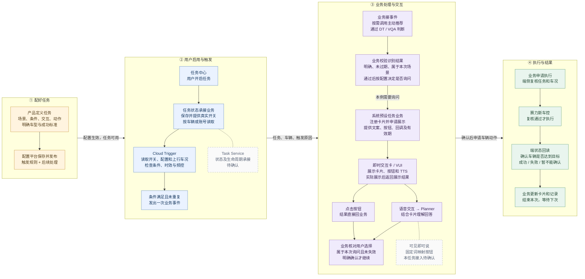
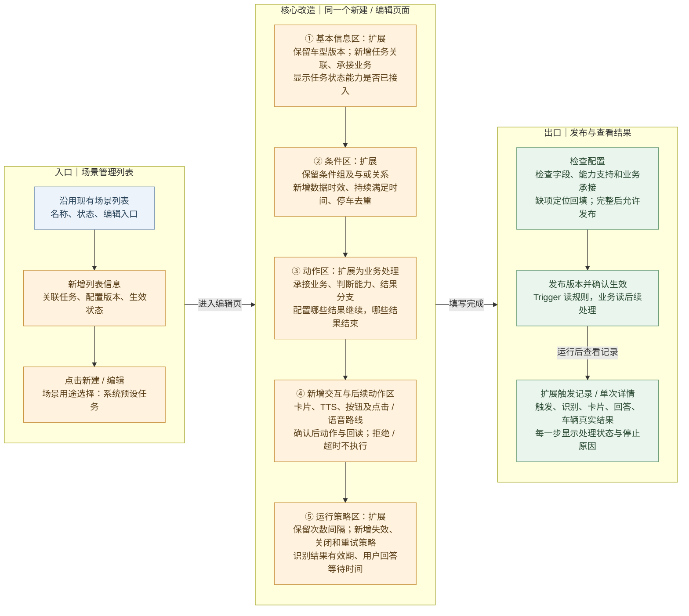
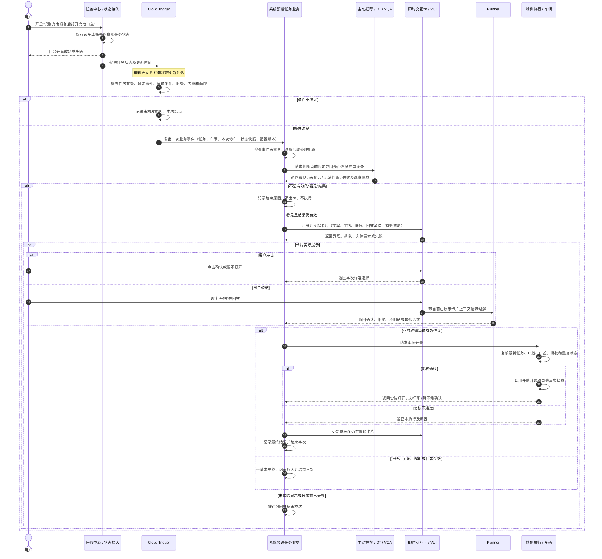

# PRD｜系统预设任务云端配置与执行框架

> 版本：V7.0 · 2026-09-13 · 产品方案评审稿  
> 产品负责人：王泽民；适用范围：云端配置与运行，以充电设备识别后开盖验证完整流程。  
> 本文“应、需”表示本次产品要求，不表示已经上线。数值、接口及人员未确认部分见第 8 章。

## 1. 需求背景与目标

### 1.1 需求摘要

在现有触发器场景管理平台上，补齐云端系统预设任务的配置与运行能力。产品配置一项任务后，用户在任务中心开启，系统在合适条件下发起业务处理；需要识别时调用相应能力，需要用户确认时展示即时交互卡，取得有效确认后请求端侧执行，并记录车辆真实结果。

本期用“识别充电设备后打开充电口盖”验证配置、识别、询问和执行可以串联。充电任务由王泽民负责整体产品定义；后续所称“任务业务”均指系统预设任务的业务实现，不代表另有一名充电业务产品。

### 1.2 当前基础与缺口

依据本地保存的平台核验材料，现有页面包含基础信息、发布范围、动态和静态条件、条件组、执行动作及次数和间隔策略；主动推荐动作已有“建议信息／下游输入”入口。这些是此前观察记录，具体字段是否仍可用，需在开发前复核。

目前尚未由这些材料证明的能力包括：任务实际开关接入、识别结果后的分支、卡片与 TTS 配置、等待用户确认、确认后的动作与真实结果回传。现有“新增动作”入口不能证明这些动作可以按结果顺序执行。

| 问题 | 用户或研发会遇到什么 | 本次要求 |
|---|---|---|
| 只配条件与下游动作 | 条件命中后，后续识别、出卡和执行需要各场景另接 | 定义可复用的任务处理步骤及交接 |
| 卡片与车辆动作缺少前后关系 | 不能保证用户同意之后才执行 | 配置交互方式、回答分支和执行条件 |
| 能力名称与实际接入混淆 | 页面能选择，但目标车型或运行模块不能处理 | 能力目录声明用途、适用范围和接入状态 |
| 触发成功与业务成功混淆 | 已发事件被误认为口盖已打开 | 分别记录触发、识别、交互、执行和真实结果 |

### 1.3 目标与价值

对车主：一次开启长期服务，满足场景时得到建议；本次拒绝不等于关闭长期任务，需要确认的动作由用户决定是否执行。

对产品：在已接入能力范围内，配置条件、判断步骤、文案和动作即可复用相同处理链路。遇到新能力时，能够明确列出研发接入工作，而不是误以为增加表单即可完成。

对研发和测试：每个步骤都有输入、承接模块和结束结果，可以定位停在条件判断、模型结果、卡片展示还是车辆执行。

本期成功标准：充电案例可以在平台中完整表达；业务能按配置完成一次正向流程；拒绝、过期和车况变化等场景不会错误开盖；记录能区分各环节结果。暂不承诺节省比例、成功率或响应时长数值。

### 1.4 本次评审要形成的四项结论

1. 确认配置平台按五组内容表达一项完整任务，以及现有页面分别增加什么。
2. 确认本期可以选择的原子能力范围，并区分已接入、待接入和暂不支持。
3. 确认 Trigger、任务业务、DT／VQA、即时交互卡、Planner 和端侧执行之间的责任与交接。
4. 确认充电案例的触发条件、识别口径、用户交互、执行限制和待确认参数。

## 2. 本期范围与责任

### 2.1 本期建设范围

本期扩展云端场景管理、场景编辑、能力选择、配置校验和触发详情，接通任务状态、Trigger 事件、任务业务后续处理与结果记录。先提供固定的处理阶段和分支，不建设任意拖拽的通用流程编排器。

云端已有状态即可判断的任务可以跳过模型步骤；需要视觉或其他工具判断的任务增加进一步判断。是否询问独立选择，不能由“调用了模型”或“未配置卡片”自动推定。

端侧天气、儿童锁、后视镜既有方案保留在原文档；本稿不重新确定它们的部署和交互策略。网络不可用时，不自动把云端任务切换为端侧任务。

### 2.2 模块职责与对接人

以下姓名沿用现稿对接线索，表示沟通入口；个人最终开发责任须在认领后回填。未认领不代表产品负责人不明确。

| 模块 | 本次需要交付什么 | 产品／对接人 | 开发责任状态 |
|---|---|---|---|
| 系统预设任务产品 | 场景、规则、平台配置、交互策略、异常及验收 | 王泽民 | 整体产品已明确 |
| 任务中心及状态接入 | 展示任务、转发操作、回显结果；接入业务保存并提供实际状态 | 郝晓伟 | 状态承载与研发待认领 |
| 配置平台 | 五组配置、能力选择、校验、保存发布、版本关联 | 韩杰 | 平台研发待确认 |
| Cloud Trigger（云端触发器） | 读取状态、判断条件、防重复、发业务事件、记录原因 | 刘杨、尹振刚 | 最终研发负责人待确认 |
| 系统预设任务业务 | 接事件、发起进一步判断、注册卡片、收回答、请求执行、更新结果 | 王泽民负责需求；汪帅／项目侧协调研发 | 云端与车端业务接入研发待认领 |
| 主动推荐／DT | 接收检查目标、组织判断、返回关联本次请求的结果 | 张弛 | 具体调用和返回承接待确认 |
| VQA（视觉问答） | 根据约定输入返回是否看见设备及观察信息 | 丁彬 | 视觉来源与研发待确认 |
| 即时交互卡／VUI（车机语音交互） | 卡片准入、展示、TTS、按钮、生命周期与结果更新能力 | 徐洋；赵衍、姜锋协助确认接入 | 云端场景卡片研发待确认，不能套用端侧认领结论 |
| Planner（语音意图理解） | 结合已展示卡片理解用户回答，把结果交回业务 | 产品姓名待王泽民补充 | 产品、研发及接入方式待确认 |
| 端侧执行与车辆能力 | 接收业务执行请求、复核当前条件、开盖并回读状态 | 王培鹤；刘多确认赛力斯需求 | 执行接入、开盖和回读研发分别认领 |

### 2.3 三个容易混淆的边界

任务规则与任务状态不同。平台保存的是“这项任务在什么情况下做什么”，可供多辆车使用；实际开关属于某辆车或账号的任务实例，必须结合适用范围读取。车辆／账号归属由任务中心专项确认。

配置与执行不同。平台存储已支持的参数，Trigger 和任务业务读取对应配置。业务研发仍需实现能力接入、结果处理及卡片注册；平台不会因为填写了文案就自动具备这些能力。

车控与端状态不同。开盖属于车辆控制动作；“口盖已打开”属于车辆实际状态。可以由相关车辆能力链路提供，但 PRD 必须分别定义请求和回读。

## 3. 整体业务框架

### 3.1 图一：云端任务由哪些模块接力完成

**从左向右读四列，每列从上向下读。** 本图以“需要识别、需要用户确认”的充电任务串起主线：配置任务 → 用户开启与 Trigger 判断 → 业务识别并询问 → 端侧执行与结果。

**图中的“系统预设任务业务”由王泽民负责整体产品。** 它是一项业务实现职责，研发需要认领接事件、组织识别、注册卡片、接收回答和更新结果。图上重复出现“业务”，表示同一业务在不同阶段做事。

| 读到哪里 | 这里完成什么 | 交给下一步什么 |
|---|---|---|
| ① 配好任务 | 产品配齐任务规则和后续处理；平台校验并发布 | Cloud Trigger 使用触发规则；任务业务使用识别、交互和动作规则 |
| ② 等待触发 | 任务中心转发用户启用；状态承接业务保存真实状态；Trigger 读取状态与上行车况 | 满足条件时发出本次任务、车辆、场景和触发原因；不满足时继续等待 |
| ③ 处理建议 | 业务按需调用主动推荐、DT 与 VQA；收到有效结果后自己注册即时卡，VUI 展示并播报 | 点击直接回业务；语音通过语音交互和 Planner 理解后回业务；本例只有有效确认才进入执行 |
| ④ 完成本次 | 端侧复核当前状态，调用车控并读取车辆真实结果 | 业务按真实结果更新卡片和记录；单次处理结束，长期任务仍开启则继续等待 |

**两个容易混淆的模块，放在主线旁边说明：**

| 模块 | 接在主线的哪里 | 本次口径 |
|---|---|---|
| Task Service（任务服务） | 第 ② 列“任务状态承接业务”的实现候选；是否兼管单次运行生命周期也需确认 | 需要保存真实开关并供 Trigger 读取是产品要求；是否复用现有 Task Service、具体接口与研发负责人尚待确认 |
| 可见即可说 | 第 ③ 列的语音入口；把已注册表达映射到当前按钮，再回原业务 | 属于单独接入的语音能力。云端主线当前按 Planner 理解回答；本地固定词或弱网降级是否启用、由谁注册，另行确认，不能默认两条路线同时消费一次回答 |

图中“语音交互”包含语音识别（ASR，把声音变为文字）；“TTS”指把卡片文案播报出来。Planner 接收已展示卡片的上下文来理解用户回答，卡片仍由业务注册和拉起。

本图只展示询问型任务的主要交接。其他配置的处理方式为：不需要进一步判断时跳过 DT / VQA；仅告知时展示并记录后结束；无需交互时按已会签的执行策略进入端侧复核。充电案例的确认要求不能因为模型识别到设备而跳过。

**结束规则：** 识别结果无效、卡片展示失败、用户拒绝或超时，都结束本次并记录原因；排队期间仍可等待，直到过期或被撤销。端侧复核不通过时不发起车控；真实状态读不到时记录“结果暂不能确认”，不能写成功。详细分支见第 5、7 章。

### 3.2 配置发布后，谁读取哪一部分

同一任务配置版本拆成两个运行视角，但仍属于同一份产品定义：

| 配置内容 | 运行时主要读取方 | 读取后做什么 |
|---|---|---|
| 关联任务、适用范围、触发事件、当前条件、数据有效性、去重和频控 | Cloud Trigger | 判断当前是否应产生一次业务事件 |
| 承接业务、进一步判断、结果分支、交互、动作、结束策略 | 系统预设任务业务 | 接住事件并把本次流程走到结束 |
| 任务实际状态 | Cloud Trigger、任务业务、端侧执行层 | 分别作为触发门禁、处理门禁和执行前复核条件 |
| 动作及真实结果定义 | 任务业务、端侧执行与状态能力 | 确定申请什么动作以及怎样判断完成 |

平台保存配置不等于配置已经运行。发布后需要运行方取得并确认相同版本，平台才显示该版本生效。具体采用推送还是拉取由技术方案决定；产品要求是版本可追溯，不能出现 Trigger 使用新条件、业务仍使用旧动作。

### 3.3 按图一说明完整业务过程

#### 3.3.1 配好任务：产品提交定义，平台让配置生效

配置者先明确“哪项任务、给哪些车辆使用、什么情况下启动、启动后由谁处理”。然后在平台依次填写五组内容。充电任务需要表达三个连续步骤：判断是否看见设备 → 询问是否开盖 → 确认后申请开盖。产品须同时定义哪些结果终止流程，不能只填写正向动作。

平台保存的是供多辆车复用的任务规则。发布范围决定哪些车辆适用，用户在任务中心的开关决定其中哪辆车允许运行，两者同时成立才允许触发。发布一条配置不会替用户开启任务。

配置检查通过后，平台形成发布版本。Cloud Trigger 取得事件、条件、频控等规则；系统预设任务业务取得识别、卡片、回答分支和执行规则。双方能够使用同一已生效版本后，配置才进入可运行状态；具体确认方式由研发设计。运行中每次事件需能追溯到该版本，避免新条件配上旧文案或旧动作。

**本阶段完成标准：** 任务可被关联，所选能力支持目标车辆，Trigger 和业务均可使用已生效配置。任务中心展示信息由任务接入链路提供，是否由配置平台同步生成、具体哪些字段复用，需与任务中心确认。

#### 3.3.2 用户启用与触发：开关许可和场景条件分别检查

用户在任务中心点“开启”，任务中心把任务和车辆／账号范围交给状态承接业务。状态承接业务保存成功后返回真实结果，任务中心回显“已开启”；保存失败时保留实际状态并提示失败。任务中心的按钮点击本身不能作为任务已生效的依据。

Cloud Trigger 需要在启动恢复时取得当前任务状态，并在后续开关变化时更新。任务状态接入不可用时，停止产生该任务的新事件并记录原因。任务中心负责展示和转发，是否复用 Task Service 保存状态和管理运行生命周期，仍按第 8 章确认。

收到上行车辆数据后，Trigger 先判断是否出现配置的启动事件，再检查当前状态条件。充电示例中，“进入 P 挡”负责启动检查，“SOC 满足阈值、口盖关闭”负责判断此刻是否适合启动。仅仅保持 P 挡，不自动代表每次数据上报都要再检查或再触发；启动时已在 P 挡、之后电量才达标等补判范围须明确配置或会签。

数据有效、条件满足且频控允许时，Trigger 发出一次业务事件。事件包含任务、车辆、当前场景、触发原因、必要状态快照和配置版本。重复上报同一次停车不能重复建立业务处理。Trigger 发出事件后，后续识别和询问由系统预设任务业务继续承接。

**本阶段完成标准：** 业务事件被约定的承接方接收；条件不满足时，能查到没有继续的具体原因。Trigger 的持续监听仍然存在，一次事件发送结束不代表停止长期任务。

#### 3.3.3 业务处理与交互：先取得有效判断，再取得本次用户选择

业务收到事件后先检查归属、重复和有效性，再读取本次对应的后续配置。若无需进一步判断，直接进入配置的交互阶段；充电示例需要判断设备，业务通过主动推荐／DT／VQA 已接入链路提交检查目标及场景信息，等待同一次请求的结果。

识别返回后，业务分别处理“看见、未看见、无法判断、失败”。本例只有“看见且仍适用于当前停车”的结果进入询问，其余结果记录原因并结束。看见设备不代表设备可用，也不代表用户同意开盖。

业务准备正文、TTS、按钮、结果回到哪个业务、当前询问关联和有效期，注册卡片并申请展示。VUI 负责准入、排队、展示与反馈。排队时继续检查场景有效性；只有实际展示后才开始用户回答等待。识别结果的有效期不会因为卡片排队或展示而重新起算。

用户点击按钮时，卡片按已注册的业务含义返回选择。使用云端语音时，语音交互把用户话语和当前已展示卡片上下文交给 Planner 理解，再由业务处理结果。业务必须检查这次选择对应当前询问、未失效、未使用过。点击和语音同时确认只能形成一次执行申请；拒绝、关闭、超时不能默认为同意。

**本阶段完成标准：** 业务取得本次有效确认，或明确记录未执行的结束原因。仅告知型任务展示并记录后结束；无需交互型任务依据已批准策略继续，不套用充电任务的确认结论。

#### 3.3.4 执行与结果：端侧复核，业务按真实状态结束本次

业务取得有效确认后，将目标动作及当前任务、场景和确认关联交给端侧执行层。端侧再次读取最新任务状态与车况，检查场景仍成立、选择仍有效、动作未重复且车辆能力允许。充电例中，确认后离开 P 挡时应拦截执行，不能使用几秒前的云端快照继续开盖。

复核通过后才调用车控。车控返回的受理或调用结果与实际车辆状态分开记录；口盖真实变为打开，业务才报告开盖成功。明确执行失败记失败；回读暂不可用或缺少可信结论时记“结果暂不能确认”，由约定的查询与等待策略继续处理，不能盲目重复发动作。

业务收到结果后更新仍有效的卡片并回传记录。卡片更新失败时，保留真实车辆结果，单独记录交互更新失败。结束本次询问、清理语音上下文并按频控等待下一次，不因本次结束自动关闭长期任务。

**本阶段完成标准：** 动作是否执行、车辆真实结果和本次结束原因分别可查。用户中途关闭长期任务应阻止新的处理；已经发出的车控请求需继续核实结果，不能承诺机械动作能够撤回。

## 4. 平台页面改造

### 4.1 图二：现有平台改哪些页面、增加哪些内容

**从左向右读：从哪里进入 → 在哪里填写 → 怎样发布和查看结果。** 中间五个框都放在同一个“新建 / 编辑场景”页面，从上往下排列；不是新增五套平台。

图中蓝灰色表示沿用入口，橙色表示本次页面改造，绿色表示发布和结果查看。平台当前基础来自此前本地核验材料；橙色内容是本次产品要求，不能据此认定已上线。

| 页面内位置 | 产品实际需要改什么 | 充电任务在这里填什么 | 运行时由谁使用 |
|---|---|---|---|
| ① 基本信息下方 | 新增“系统预设任务”用途、任务关联、承接业务；状态能力显示接入情况 | 关联“识别充电设备后打开充电口盖”；承接方为系统预设任务业务 | Trigger 和任务业务 |
| ② 原动态／静态条件区 | 沿用条件组；补充数据来源与时效、是否已上云、持续满足和场景去重 | 进入 P 挡、SOC 阈值、口盖关闭、本次停车未处理；实际阈值待确认 | Cloud Trigger |
| ③ 原执行动作区 | 先选择承接业务，再配置是否进一步判断、调用能力与结果分支 | 发起设备识别；看见且结果有效才继续；未看见、未知或失败则结束 | 系统预设任务业务及主动推荐／DT／VQA |
| ④ 动作区之后新增区块 | 独立配置交互方式；询问时展示卡片、TTS、按钮、回答处理；有车辆动作时补充复核与回读 | “是否打开充电口盖”；确认后申请开盖；取消／超时不执行；真实打开才成功 | 业务读取并注册即时卡；VUI、Planner、端侧执行分别承接 |
| ⑤ 原次数／间隔策略区 | 保留频控；补充结果及回答有效期、任务关闭处理、失败重试和结束规则 | 本次停车防重复、过期结果作废、任务关闭时撤销待处理询问 | Trigger 使用频控；业务使用等待与退出规则；端侧检查执行有效性 |

**编辑页需要的三个联动：** 选择“不进一步判断”就隐藏模型配置；选择“询问用户”才要求卡片与回答分支；选择车辆动作就要求执行前复核与真实状态标准。进一步判断、用户交互、车辆动作可以连续配置，不能被做成互斥选项。

**能力选择放在哪里：** 在条件、判断、交互和动作字段旁提供能力选择入口，打开同一套“能力抽屉”。抽屉展示用途、输入输出、车型版本和接入状态。未接入能力可以记录为接入需求，但不能作为已可执行能力发布；研发需要完成能力接入，产品才能在表单中组合使用。

**页面底部放什么：** 保存草稿、检查配置、发布三个按钮。检查失败时定位到具体字段；发布后分别等待 Trigger 与任务业务取得对应版本。新版本生效不等于某辆车已经开启任务。

**记录页增加什么：** 列表展示关联任务与最后处理阶段，进入单次详情查看“Trigger 发事件 → 识别结果 → 卡片展示 → 用户回答 → 执行与真实回读”。每一步展示结果和停止原因。发布动作本身不会产生车辆运行记录，只有实际发生业务处理后才有记录。

### 4.2 产品在编辑页的操作顺序

从“场景管理”点击新建，或打开现有场景的编辑页。页面仍使用一张表单，依次展示图二中的五组配置；本期新增内容均为下述产品要求。

1. **先确定配置对象。** 选择“系统预设任务”，关联任务定义，填写适用范围和承接业务。任务定义是“识别充电设备后打开充电口盖”这条规则；某辆车的用户是否开启它，是另一份实际状态。
2. **定义什么时候开始。** 在条件区分别填写启动检查的变化事件和检查时的当前条件，再设置组合关系、数据时效与去重依据。
3. **定义命中后如何处理。** 指定接收事件的业务；需要识别时，选择能力并填写每类结果的去向。
4. **定义如何交互及执行。** 选择无需交互、仅告知或询问；询问后配置确认与退出分支；涉及车控时补齐复核条件和真实状态标准。
5. **定义何时结束，再检查发布。** 填写等待、失效、频控和重试策略，检查缺项，发布后查看运行方是否取得新版本。

充电任务依次选择“进一步识别设备 → 看见设备才继续 → 询问用户 → 确认后申请开盖”。这三个处理阶段可以串联。页面底部随填写更新业务摘要，描述条件、判断、交互、动作及退出规则，供产品核对是否符合预期。

改变处理方式后，不再适用的字段收起并退出本次校验与运行。例如从询问改为仅告知，旧的确认按钮和开盖动作不能继续生效；关闭进一步判断后，原识别请求与结果分支也不进入当前运行定义。已填内容保留在草稿并标注未启用，切回时提示重新确认；发布摘要仅包含当前生效路径。

### 4.3 页面一：场景管理列表

保留现有列表及新建、编辑、记录入口。在原列表扩展“场景用途、关联任务、配置版本、校验状态、生效状态”，新增用途与任务筛选。用途为普通 Trigger 的场景，继续使用原配置逻辑。

| 用户操作 | 页面响应与规则 |
|---|---|
| 点击新建 | 打开空白表单；选择系统预设任务后展开任务关联和后续处理配置 |
| 点击编辑 | 载入已保存内容，同时展示正在生效的版本；修改不会立即影响运行任务 |
| 查看生效状态 | 区分草稿、检查未通过、发布处理中、已生效及发布失败；发布状态不能写成用户“已开启” |
| 查看关联任务实际状态 | 新增只读查看入口；先指定车辆及任务要求的账号范围，再查询真实开关、更新时间和来源。查不到时显示原因，不显示为关闭或开启 |
| 点击记录 | 带入当前场景，查看第 4.10 节的触发及后续业务记录 |

配置页不提供代用户开启任务的操作。同一项任务在不同车辆上可以有不同实际状态，列表不能显示一个覆盖全部车辆的“任务已开启”。

### 4.4 页面二第一组：任务关联与适用范围

改造位置为现有基本信息和发布范围区域，在名称、优先级、渠道、指定车辆、车型、软件版本等字段基础上补充以下内容。

| 配置项 | 产品怎样填写 | 页面联动与运行用途 |
|---|---|---|
| 场景用途、关联任务 | 选系统预设任务，再从已接入任务中选一项 | 必填；关联任务定义，不填写某辆车的开启状态。Trigger 用它查询对应任务实例 |
| 状态能力接入情况 | 只读查看提供模块、支持的车辆／账号范围、接入状态 | 运行时由状态承载方提供实际状态；未知、读取失败或失效时不允许 Trigger 按开启处理 |
| 适用范围 | 沿用渠道、指定车辆、车型和软件版本 | 选定后过滤可用能力；调整范围时重新检查已选信号、卡片和动作是否兼容 |
| 承接业务 | 选择系统预设任务业务及其已接入事件处理入口 | Trigger 把命中事件交给它；无可用入口可存草稿，不能发布 |
| 对接与认领信息 | 展示产品对接人和研发认领状态 | 王泽民是整体产品 Owner；业务研发未认领时明确展示待认领，不能用产品姓名代替研发负责人 |
| 运行位置 | 本期显示云端 | 用于过滤云端可读状态及可调用能力，不提供网络变化时自动切换端侧的选项 |

选定任务后，平台自动增加“当前车辆／账号的任务实际状态为开启”这一运行前提。它在规则摘要中可见，但不由产品重复加入每个条件组。切换关联任务后，需要重新确认业务承接及后续配置；仍兼容的填写内容保留，不兼容项定位提示。

### 4.5 第二组：触发规则

继续使用原动态条件、静态条件和新增条件组。产品先配置“哪次变化启动检查”，再配置“检查时还要满足什么”；两者在页面分区并列出完整规则。

| 填写位置 | 操作与示例 | 校验及运行要求 |
|---|---|---|
| 动态条件 | 选择条件类型 → 信号 → 字段 → 运算符 → 值。例如档位“变更为 P” | 表示从其他档位进入 P 的事件；不等于一直处于 P。启动时已在 P 是否补判另行确认 |
| 静态条件 | 逐行添加 SOC 与阈值比较、口盖为关闭等当前条件 | 枚举用选项，数值显示单位；上下限和比较符由能力限制。SOC 的演示阈值 20% 待业务会签 |
| 条件组 | 选择组内、组间“全部满足／任一满足”，增加或删除条件 | 摘要用括号显示作用范围，例如“进入 P 挡，并且（SOC 达标且口盖关闭）”；空组不能发布 |
| 信号说明 | 点击能力查看来源、上云情况、车型版本、数据时间及未知状态 | 未上云或超出范围不能用于正式运行；缺失、过期、未知均不计作满足 |
| 数据有效期 | 信号行展开有效性设置；若能力提供已确认默认值则引用，允许覆盖时填写已会签阈值 | 展示数值、单位、起算依据和阈值来源；未知、未确认或留空不代表永久有效。超出能力允许范围不能发布 |
| 稳定判断 | 按能力支持填写连续满足时长或次数 | 中断后如何重新累计由能力说明明确；未支持的计算方式不可凭空配置 |
| 本次场景去重 | 选择已接入的停车／上电等场景边界 | 显示开始、结束和重置依据，供 Trigger 识别是否为同一次处理；不能仅填写“每次停车一次”而没有停车关联能力 |

修改某个静态条件，不会自动使它成为启动事件。例如停车后 SOC 才达到阈值，是否再次唤起检查，需要明确列入启动范围；原稿未确认的补判规则继续列为待确认。当前任务开关作为所有条件组共同的前提，不能被“任一满足”绕过。

### 4.6 第三组：命中后业务处理

在原执行动作区域增加业务层配置，保留原动作能力及必要的高级预览。产品填写的是“把哪件事交给业务、还需判断什么”，由业务读取配置并调用已接入能力。

| 操作顺序 | 填写内容与页面响应 |
|---|---|
| 1. 选择处理目标 | 承接业务沿用第一组，选择它支持的目标，如“检查附近充电设备”。Trigger 输出本次任务、车辆、停车关联、触发原因、当时状态及有效时间 |
| 2. 选择是否进一步判断 | 选否时直接进入第四组；选是时展开能力、问题、上下文和结果分支。后续是否询问仍独立选择 |
| 3. 选择判断能力 | 引用已接入的主动推荐／DT／VQA 组合，填写检查目标和需要的场景信息。页面显示输入来源及返回给系统预设任务业务的结果 |
| 4. 配置结果去向 | 逐项指定看见、未看见、无法判断、调用失败。充电示例仅看见设备且仍有效时进入下一阶段，其余结束本次；超时按失败策略结束 |
| 5. 配置结果有效性 | 设置已会签的有效期，绑定本次停车；离开当前场景或结果过期时作废。具体时长未确认时可保存草稿 |

场景问题、推荐原因和建议内容由结构化表单形成下游输入，高级预览展示转换结果。映射关系须由接入研发实现。把字段填完不会自动生成 DT 或 VQA 能力；选择“调用成功”也不能替代“看见设备”的业务判断。

### 4.7 第四组：用户交互与后续动作

在现有动作区之后增加独立区域，先选交互方式，再展开对应字段。系统预设任务业务读取本组配置，负责注册、拉起、接收选择和更新卡片；VUI 负责车机展示及交互能力。

| 交互方式 | 展开什么 | 后续规则 |
|---|---|---|
| 无需交互 | 已会签的自动处理策略、目标动作与执行条件 | 必须明确允许无需逐次确认；空白交互配置不能被解释成自动车控 |
| 仅告知 | 卡片模板、正文和 TTS 策略 | 告知处理完成后结束本次；没有确认授权，不进入车辆动作 |
| 询问用户 | 卡片、TTS、按钮、回答路线、等待时间和回答分支 | 当前有效确认才能进入后续动作；拒绝、关闭、超时结束本次 |

选择询问后，按以下顺序填写：

1. **卡片和播报。** 选已接入模板，填标题、正文及内容来源；固定内容与业务生成内容分别选择。开启 TTS 后要求播报文案或来源。TTS 配合卡片真正展示开始，语音禁用时的处理按已会签方案执行。
2. **按钮和语义。** 填“确认打开／暂不打开”等文字，分别绑定“同意本次开盖／放弃本次”。取消本次询问不会关闭长期任务。点击结果返回第一组的系统预设任务业务。
3. **语音路线。** 选择不使用语音或按已接入能力由 Planner 理解。卡片真正展示后才启用当前询问上下文；结束、替换或失效后清理。可见即可说为另行注册的本地按钮能力，云端降级未确认时不作为默认路线。
4. **回答分支。** 逐项展示确认、拒绝、关闭、超时、无法理解。无法理解时不授权执行；是否允许再次询问及次数须有已确认策略。
5. **确认后的动作。** 选开盖能力、必要参数及执行前复核项，再选口盖状态回读能力，将目标值设为打开。分别填写成功、失败、暂不能确认时的卡片处理。

询问与车控按顺序执行，不能同时发起。展示受理、排队、实际展示和结束等生命周期由卡片接入能力提供；产品引用标准行为，无需填写底层回调。只有取到当前卡片的有效确认，业务才能发起执行前复核。

**切换选项后的处理：** 将“需要识别”切换为“不需要”时，识别请求和结果分支退出当前运行定义；将“询问”切换为“仅告知”时，确认按钮、回答授权和确认后的车控动作退出当前运行定义。原填写内容可保留在草稿中供切回时恢复，但应标记为未启用；切回后需重新确认能力、参数和适用范围。发布前只校验并输出当前启用的分支，不能把隐藏字段继续下发执行。

### 4.8 第五组：运行与结束策略

扩展原次数、间隔区域，由产品明确何时等待、放弃和再次处理。

| 配置 | 填写与执行规则 |
|---|---|
| 总次数、上电周期次数、自然日次数、最小间隔 | 沿用现有字段；旁边标明计数对象与重置口径，由 Trigger 使用，不能默认改成真实车控成功次数 |
| 同次场景去重 | 引用第二组场景边界；重复事件和重复确认不重复执行。拒绝后是否允许本次停车再次提醒另行会签 |
| 识别、卡片等待、授权有效期 | 分别设置并显示起算点。等待回答从真正展示开始；排队不会刷新识别结果有效期；确认后也不能无限等待执行 |
| 任务关闭／场景失效 | Trigger 停止新事件；业务撤销待展示或待回答的卡片并清理旧关联。已发出的车控不能假定可撤销，仍需查询真实结果 |
| 失败重试 | 选择已支持、已会签的重试策略及适用阶段；未配置时不自动重试车控。传输重送仍需避免重复执行 |
| 本次结束 | 保存结束原因、清理卡片及语音关联；任务仍开启时按频控等待下一次。结束本次不自动修改长期任务开关 |

等待和结束策略由任务业务消费，频控由 Trigger 消费；端侧在实际执行前再次核对任务、车况和授权是否有效。平台需展示策略的承接模块，缺少实现方不能作为已支持配置发布。

### 4.9 保存、校验与发布

页面底部提供保存草稿、检查配置和发布。保存草稿保留不完整内容；检查配置逐条列出问题，点击后滚动到对应字段。

| 检查类型 | 典型问题 | 处理方式 |
|---|---|---|
| 填写不完整 | 没关联任务、漏填回答分支 | 定位补填；保留其他内容 |
| 能力不可用 | 信号未上云、卡片未接入、车型不支持 | 展示依赖及接入状态；调整范围、换能力或等待接入 |
| 组合不成立 | 仅告知后配置开盖、询问缺少确认承接 | 提示冲突位置及原因，修正后重新检查 |
| 必要业务参数待定 | 采用演示阈值、缺少有效期或真实成功标准 | 明确待确认项；完成会签后再发布该场景 |

发布提交完整配置版本，运行侧分别取得 Trigger 规则和业务后续处理定义。只有相关运行方都确认可用，才显示对应范围已生效；未完成时显示处理中或失败，保留原有效版本。保存成功、发布成功和用户开启任务是三件不同的事。

沿用既有发布流程控制验证范围与逐步放量。回退恢复上一有效配置并留操作记录，不撤销已经发生的车辆动作；在途处理如何使用旧版本按第 8 章版本策略确认，不能由页面临时混用新旧字段。

### 4.10 页面三、四：触发记录与单次详情

扩展现有触发记录，增加关联任务、配置版本、承接业务、本次停车关联、最后处理阶段及最终结果。“Trigger 事件发送成功”和“车辆真实成功”分开显示；可按关联任务和车辆定位。

点击记录后，按顺序展开条件检查、事件交接、设备判断、业务注册卡片、真正展示、用户回答、端侧复核、车控请求、真实回读、本次结束。每一步显示收到什么、处理模块、开始／结果时间、结果和停止原因；未发生的步骤标记未进入。

例如 VQA 返回无法判断，详情停在设备判断，后续显示未进入；卡片排队时任务关闭，显示关闭原因及撤销结果；车控请求成功但未取到口盖状态，显示结果暂不能确认。尚未接通下游回传时显示“未取得业务结果”。本次研发交付必须包含关联与结果回传，增加列名本身不能形成完整记录。

### 4.11 原子能力范围与研发接入

能力选择入口放在信号、进一步判断、卡片、TTS、动作和回读字段旁，打开同一套能力抽屉。产品按当前用途选择能力，再填写它允许开放的参数；无需新增一套复杂后台。

| 能力范围 | 产品在页面选什么 | 研发接入最低要求 |
|---|---|---|
| 任务状态 | 关联任务的状态能力 | 按车辆／账号提供真实状态、变化和失败原因 |
| 事件与当前状态 | 档位变化、当前 SOC、口盖状态等 | 区分事件和状态用途；提供单位、值域、时间及云端范围 |
| 进一步判断 | 主动推荐／DT／VQA 能力组合 | 接收问题与场景，返回四类结果及本次观察关联 |
| 用户交互 | 卡型、TTS、按钮结果、语音路线 | 业务可注册；返回展示与选择事实；支持结束后清理 |
| 车辆动作与回读 | 打开口盖及读取真实口盖状态 | 提供车型限制、端侧复核、执行反馈和可信状态 |
| 过程记录 | 本次运行结果回传能力 | 各阶段关联同一次业务处理并返回结果及停止原因 |

抽屉展示名称、用途、提供模块、可填写参数、输入输出、适用范围与接入状态。选择前按云端及车型版本过滤；不支持的能力说明原因。待接入项可被记录为缺口，不能被当作可执行能力发布。原子能力接通、页面能表达组合、运行模块会执行三项同时满足，配置才具备业务意义。

## 5. 云端运行流程与交接

### 5.1 图三：运行时谁先找谁、每一步返回什么

这张图只讲一辆车的一次运行。虚线返回代表结果交接，实线代表发起动作。评审时从左到右看责任，从上到下看先后：

1. 任务中心和状态接入先让长期任务真实生效；这里尚未检查充电设备。
2. Cloud Trigger 只在条件通过时把一次事件交给系统预设任务业务；它的工作到这里结束。
3. 任务业务决定是否调用识别，接收判断结果，并负责注册卡片。DT、VQA 和 Planner 都不会替业务拉卡。
4. 卡片实际展示后才允许形成当前询问；点击直接回业务，泛化语音才使用 Planner 理解。
5. 业务取得有效确认后申请执行；端侧用最新状态复核。车辆实际状态达到目标后，业务才记录成功。

### 5.2 各模块在运行时负责到哪里

| 模块 | 收到什么 | 本模块判断／处理 | 交给谁 | 本模块的结束点 |
|---|---|---|---|---|
| 任务中心／状态接入 | 用户开启或关闭意图 | 保存真实结果并恢复状态 | 状态给 Trigger，结果给任务中心 | 某车／账号的实际状态可读 |
| Cloud Trigger | 配置、任务状态、车辆状态 | 判断事件、硬条件、时效、防抖、去重和频控 | 一次业务事件给任务业务 | 事件发送成功或记录未触发原因 |
| 系统预设任务业务 | 业务事件及后续处理配置 | 串联识别、卡片、回答、执行和最终记录 | 分别调用能力模块 | 本次状态被明确收口 |
| 主动推荐／DT／VQA | 检查目标、本次请求和可用输入 | 返回观察与业务判断 | 结果回任务业务 | 返回四类结果及关联信息 |
| 即时交互卡／VUI | 业务注册的卡片内容与策略 | 准入、排队、展示、TTS、按钮和生命周期 | 展示／点击结果回业务；语音给 Planner | 卡片关闭、过期或被业务更新 |
| Planner | 已展示卡片上下文与用户语音 | 理解当前回答 | 标准语义结果给任务业务 | 给出结果，不负责车辆是否执行 |
| 端侧执行／车辆 | 业务的执行请求 | 复核最新条件、调用车控、读取真实状态 | 结果和原因给任务业务 | 真实结果明确或等待结束后暂不能确认 |

### 5.3 每次交接需要提供什么

下表定义业务含义，不代替正式接口字段。

| 交接 | 提供方 → 接收方 | 必需信息 | 接收方处理及缺失时行为 |
|---|---|---|---|
| 用户操作 | 任务中心 → 接入业务 | 哪项任务、车辆／账号范围、开启或关闭 | 真正保存并返回实际结果；失败时界面不得假成功 |
| 任务状态 | 接入业务 → Trigger | 任务实例、实际状态、更新时间与可用性 | 启动时恢复状态，变化时更新；方式待技术确认，未知时不触发 |
| 触发事件 | Trigger → 任务业务 | 任务、车辆、配置版本、本次停车、触发事实、时间及有效范围 | 核对关联与去重后处理；缺少归属不继续 |
| 判断请求 | 任务业务 → 主动推荐／DT | 当前场景、检查目标、本次请求关联 | 按已接入路径获取视觉判断；不能自行扩展为设备可用性判断 |
| 判断结果 | DT／视觉链路 → 任务业务 | 看见、未看见、无法判断、失败；观察时间、场景关联 | 只让明确有效的看见结果进入询问；其余记录并结束 |
| 卡片注册 | 任务业务 → 卡片接入 | 文案、按钮含义、TTS、回业务入口、询问关联、有效策略 | 返回受理与实际展示结果；关联缺失不创建有效询问 |
| 用户回答 | 卡片／Planner → 任务业务 | 本次询问、明确选择、回答时间及输入方式 | 核对当前有效且未消费；确认只使用一次 |
| 执行请求 | 任务业务 → 端侧执行 | 目标动作、任务与停车关联、确认及有效范围 | 重新复核最新条件，拒绝旧请求或重复执行 |
| 结果回传 | 端侧执行／状态 → 任务业务 | 请求结果、实际口盖状态、观察时间及失败原因 | 实际打开才成功；未知不伪装失败或成功，更新卡片与记录 |

### 5.4 卡片和 Planner 的关系

系统预设任务业务负责准备并注册当前卡片。VUI 返回实际展示后，该询问才具备可供用户回答的有效上下文。点击使用已注册业务处理入口；泛化语音带当前询问进入 Planner，由已接入的语义处理路径返回业务结果。

Planner 不创建或拉起本任务卡片。自然语言里出现“好的”不直接等于授权，必须能关联仍有效的当前询问。卡片过期、关闭或已处理后清理上下文，后来的同意表达不能继续消费旧卡。

TTS 播报、语音输入和 Planner 理解是三项不同的能力。仅关闭语音输入时，不能据此推断 TTS 必须停止；仅配置“不播报”也不代表已经关闭语音回答。页面分别表达播报与回答路线；整车语音禁用时怎样降级，由 VUI 会签。建议保留卡片与点击，具体播报策略待确认，不能把未接入的语音路线写成已支持。

### 5.5 一次运行中的等待、失效和结束如何衔接

业务需要区分“等识别”“卡片排队”“等回答”“等车辆结果”。每个等待步骤都必须有结束条件；超时数值由能力和场景共同确认，产品不能使用一个总时长替代所有步骤。

| 当前步骤 | 等什么、从哪里开始等 | 收到结果后检查什么 | 到期或场景失效后怎么办 |
|---|---|---|---|
| 进一步判断 | 业务发出识别请求后等待对应结果 | 请求关联、观察时间、当前停车是否相同 | 结束本次；晚到结果只记录，不重新出卡 |
| 卡片排队 | VUI 受理后等待实际展示 | 任务是否开启、识别结果是否有效、场景是否仍成立 | 撤销待展示卡；不记录为用户拒绝或用户回答超时 |
| 用户回答 | 卡片实际展示后开始等待 | 当前卡片、选择含义、回答时间、是否已消费 | 关闭当前询问并清理上下文；不申请车辆动作 |
| 端侧复核 | 端侧收到执行申请后核验 | 最新任务与车况、确认有效性、是否重复 | 返回未执行及原因；不重新弹卡擅自再次征求同意 |
| 车辆结果 | 车控申请发出后等可信状态 | 目标是否达到、是否有明确失败证据 | 无可信结论则记暂不能确认；不因等待结束再次发开盖 |

任务关闭、车辆离开适用场景、版本变化等通知到达时，业务按当前阶段处理。待识别和待询问阶段失效后不恢复旧处理；执行已发出阶段继续核实真实结果。版本切换中的旧事件与旧卡片如何结束，使用会签后的在途版本策略，不能由某个模块单方面套用新配置。

### 5.6 任务业务与各模块分别需要交付什么

| 开发交付 | 最小可用行为 | 对接入口与验收重点 |
|---|---|---|
| 状态接入 | 用户启停保存、真实结果回显、Trigger 可读、启动恢复、关闭通知 | 郝晓伟及状态承接研发；核对同一车辆／账号范围，保存失败不能假开启 |
| Trigger 事件交接 | 条件检查、同场景去重、事件送达与版本关联 | 刘杨、尹振刚对接，最终负责人待认领；发出事件和接收成功分别可查 |
| 业务后续处理 | 接事件、读配置、调用识别、注册卡片、消费回答、申请动作、记录结束 | 王泽民负责产品；汪帅／项目侧协调业务研发；不能仅实现事件接收而无人承接后半程 |
| 识别接入 | 接收业务检查目标，返回四类结果及当前场景关联 | 张弛、丁彬对接；画面来源、设备定义和返回方式先会签 |
| 卡片与语音接入 | 注册和展示反馈、点击回业务、Planner 回答关联、失效清理 | 徐洋及卡片研发、Planner 对接人；确认哪项是通用能力、哪项需本业务注册 |
| 端侧执行与回读 | 接动作申请、复核、车控、可信状态与错误返回 | 王培鹤及执行／回读研发；车控受理和真实打开分别验收 |
| 平台记录汇总 | 把各阶段结果聚合到同一次处理详情 | 平台与业务研发共同认领；没有回传的步骤显示缺失，不能推测完成 |

表中的姓名为第 2.2 节已有对接入口，不追加个人开发承诺。每项由谁实现、谁提供联调结果，在开发拆分时回填。

## 6. 充电口盖连续案例

### 6.1 产品在平台如何填写

以下为演示草稿。SOC 当前值为 19%，阈值暂用 20% 说明比较关系；阈值、总开关关系、设备定义及各项时长以会签为准。下列按钮和字段是本期改造后的操作要求。

| 操作顺序 | 在哪里操作、填写什么 | 页面应呈现什么 |
|---|---|---|
| 1. 新建 | 场景列表点击“新建”，用途选“系统预设任务” | 展开五组配置；普通 Trigger 原有字段继续保留 |
| 2. 关联任务 | 选择“识别充电设备后打开充电口盖”；选择测试车辆、车型和版本；承接业务选系统预设任务业务 | 显示任务状态能力是否接入；不出现由配置者代填的“本车已开启” |
| 3. 填触发规则 | 动态事件选“档位变更为 P”；静态条件填“SOC ≤ 20%”“口盖关闭”，条件关系为全部满足 | 摘要显示“进入 P 时检查电量和口盖”；任务实际开启作为自动附加的运行条件 |
| 4. 填数据与去重 | 引用已支持的数据时效要求；场景去重选本次停车，确认停车开始与重置依据 | 数据未接入或时效、停车边界待确认时提示缺项，不假定信号默认可靠 |
| 5. 配识别 | 进一步判断选“需要”，选择已接入主动推荐／DT／VQA 路径；填写检查目标 | 展开结果分支；看见设备且有效→下一阶段，未看见／无法判断／失败→结束 |
| 6. 配卡片与语音 | 交互选“询问”；标题“充电提醒”；正文及 TTS 见下方；按钮“确认打开／暂不打开” | 显示点击回业务入口；按接入能力选择 Planner 语音；固定文案预览与按钮含义对应 |
| 7. 配动作与结果 | 确认后动作选申请开盖；绑定任务与车况复核；目标真实状态选口盖打开 | 拒绝、关闭、超时均结束；显示成功、失败、暂不能确认三个结果处理 |
| 8. 配等待与结束 | 填已会签的识别、排队、回答和授权有效策略，以及频控、关闭和失败处理 | 参数未确认可保存草稿；未填或未确认不能被自动解释为无限等待 |
| 9. 检查并发布 | 先保存草稿，点击“检查配置”，按提示回填；在测试范围发布 | 完整性通过后才允许发布；运行方确认版本后显示生效；发布失败保留原有效版本 |

本例的检查目标：“请判断本次约定观察范围内是否看见充电设备，并返回判断结果。”平台将检查目标与本次场景信息按已接入规则交给主动推荐／DT。不得在检查目标中提前写入“用户已经同意”。

卡片正文与 TTS 示例：“检测到附近有充电设备，是否打开充电口盖？”确认按钮代表同意本次开盖，取消按钮代表结束本次询问。用户仍可在后续停车场景再次获得服务，具体间隔按频控策略执行。

配置完成后的业务摘要应完整显示：

> 该车任务开启后，在车辆进入 P 挡时，检查电量、口盖、数据有效性与本次停车去重。通过后发出事件，由系统预设任务业务组织设备判断。只有看见设备且结果有效时询问用户；取得本次有效确认并通过端侧复核后申请开盖，最终按口盖真实状态更新卡片和记录。

摘要用于检查配置是否符合意图，不证明实际信号、识别、语音或车控已经接通。具体接入结果须以第 4.11 节能力状态和联调结果为准。

### 6.2 从用户开启到本次完成

以下时间只表达先后关系，不规定各模块必须在相应秒数完成；有效性均按会签策略判断，不使用演示时间隐含有效期。

**步骤 1｜18:30，用户开启任务。** 用户在任务中心打开“识别充电设备后打开充电口盖”。任务中心将本车、本任务及开启意图交给接入业务。业务保存成功后返回“已开启”，界面才回显成功。保存失败则如实提示，Trigger 不能开始按开启状态运行。

**步骤 2｜18:32，车辆进入 P 挡。** 本例前一档位为 D，当前为 P；云端可读 SOC 为 19%，口盖为关闭。Trigger 先读取本车对应的真实任务状态，再检查本次停车事件与状态有效性。是否需要总开关同时开启，按已会签方案执行，本例不据此新增正式条件。

**步骤 3｜Trigger 检查条件。** 演示判断为：任务开启＝是；进入 P＝是；19% ≤ 20%＝是；口盖关闭＝是；本次停车未处理＝是。所有所需数据有效，频控允许，才产生事件。任何一项不满足，记录未触发原因，不请求设备判断。

**步骤 4｜Trigger 交给任务业务。** 交付“本车、本任务、本次停车、配置版本、P 挡／SOC 19%／口盖关闭、启动原因和时间”。启动原因应写“进入 P 挡且满足电量与口盖条件”，不能在识别前写“已停进充电车位”。业务接收后检查重复事件，重复送达不能再开一轮询问。

**步骤 5｜业务请求设备判断。** 业务通过已接入主动推荐／DT 链路发送检查目标。示例 Query：“请判断本次约定观察范围内是否看见充电设备，并返回判断结果。”视觉输入按双方约定提供，不指定未经确认的前摄、后摄或车外视角。本步骤不携带用户已同意开盖的结论。

**步骤 6｜返回识别结果。** 本例返回“看见充电设备”，并带观察时间及本次请求关联。业务检查结果仍属于本次停车、仍在有效范围内、任务未关闭。通过后形成询问；未看见、无法判断或调用失败则结束。本例只证明看见，不能声称设备可用、空闲或兼容。

**步骤 7｜业务注册卡片。** 标题示例“充电提醒”；正文和 TTS 示例“检测到附近有充电设备，是否打开充电口盖？”；按钮“确认打开”和“暂不打开”。业务同时注册本次询问关联、回答承接与失效策略。卡片受理或排队后仍需等待实际展示结果；不能此时就把用户记为未回应。

**步骤 8｜卡片实际展示。** VUI 告知业务已经展示，业务开始按策略等待回答；语音路线需要时关联当前询问。本例用户点击“确认打开”，点击结果直接回任务业务。若用户说“打开吧”，则按已接入 Planner 路线理解并返回当前选择；两种输入都需要业务核对有效性。

**步骤 9｜业务取得确认。** 业务确认这次选择属于当前卡片、仍有效且未处理过，再申请开盖。取消只结束本次，不改变长期任务开关。没有回答、关闭卡片或回答不明确均不能进入开盖步骤。

**步骤 10｜端侧复核。** 端侧重新读取最新任务状态与车况。本例任务仍有效、仍在 P 挡、口盖关闭，当前请求与授权有效、未重复，且车辆能力允许执行，因此调用开盖。若已经离开 P 挡，返回未执行原因，不再使用云端此前的 P 挡快照。

**步骤 11｜读取车辆结果。** 车控返回请求已受理后，等待可信的口盖状态。本例实际状态变为打开，业务才记录成功。明确执行失败记失败；缺乏可信状态时记暂不能确认，不因请求成功就显示开盖成功。

**步骤 12｜结束本次。** 业务更新仍有效的卡片，清理询问上下文，向记录页回传结果。本次停车按约定去重；长期任务仍开启时继续等待后续符合条件的事件。卡片更新失败单独记交互更新失败，不把已真实打开的结果改为开盖失败，也不再次开盖。

### 6.3 同一案例的停止位置

| 变化 | 停在哪里 | 用户及业务结果 |
|---|---|---|
| 开启操作保存失败 | 步骤 1 | 显示未启用，不发事件 |
| SOC 不满足或状态未知 | 步骤 3 | 记录未触发，不请求识别 |
| 识别未看见或结果过期 | 步骤 6 | 不出开盖确认卡 |
| 卡片排队时用户关闭长期任务 | 步骤 7 | 撤销待展示卡，不继续 |
| 用户拒绝、关闭、超时 | 步骤 9 | 结束本次，不开盖 |
| 确认后挂入 D 挡 | 步骤 10 | 复核拦截，告知未执行 |
| 口盖状态无法确认 | 步骤 11 | 暂不能确认，不盲目重试 |

## 7. 异常与验收

### 7.1 异常处理要求

| 异常 | 负责处理 | 预期行为 |
|---|---|---|
| 状态读取失败、过期 | Trigger | 不视为条件满足，记录原因 |
| 同一停车重复事件 | Trigger、任务业务 | 去重，不重复识别或询问 |
| 识别未返回或晚到 | 任务业务 | 按确认的等待策略结束；失效结果到达不恢复旧处理 |
| 网络断开 | 所处步骤承接模块 | 未取得有效结果或确认不执行；已发出的动作查真实结果，不重复发 |
| 卡片受理后未展示 | VUI、任务业务 | 不开始用户回答倒计时；等待有上限，失效后撤销 |
| 任务关闭时有待确认卡 | 状态接入、业务、VUI | 撤卡、清上下文；新确认不能执行旧任务 |
| 关闭时车控已经发出 | 任务业务、执行层 | 按真实执行结果收口，不承诺回撤机械动作 |
| 点击和语音同时确认 | 任务业务 | 同一次授权只消费一次 |
| 卡片消失后说“好的” | VUI、Planner、任务业务 | 不关联旧卡执行 |
| 车况变化、授权过期 | 端侧执行 | 拦截执行并返回原因 |
| 请求受理但状态未达成 | 任务业务、状态链路 | 有明确失败证据记失败，否则等待结束后记暂不能确认 |
| 更新卡片失败 | 任务业务、卡片 | 保留车辆真实结果，单独记录展示更新问题 |

### 7.2 五层结果口径

| 层级 | 怎样算该环节成功 | 不等于什么 |
|---|---|---|
| Trigger | 业务事件发送取得约定成功结果 | 不等于后续业务处理完成 |
| 识别 | 返回明确、有效且关联当前场景的结果 | 不等于用户同意；明确未看见也是有效识别结果 |
| 交互 | 卡片实际展示并取得有效选择 | 拒绝也是有效选择，不代表开盖成功 |
| 动作调用 | 请求按约定被接收／受理 | 不等于口盖达到目标 |
| 业务 | 可信实际状态确认口盖打开 | 不以任何前置成功替代 |

### 7.3 验收用例

| 编号 | 前置与操作 | 中间结果 | 最终结果／证据 |
|---|---|---|---|
| C01 | 新建系统预设任务，漏承接业务 | 保存草稿成功，检查定位缺项 | 禁止发布；校验记录 |
| C02 | 选择进一步识别，再选择询问 | 卡片配置正常展开，保留识别设置 | 能完整保存串联配置；配置快照 |
| C03 | 选择仅告知 | 不生成确认后车控分支 | 告知结束，无执行请求 |
| C04 | 选择未接入或不支持车型的能力 | 显示原因 | 不可发布；能力及范围校验 |
| C05 | 两辆车使用同一定义，仅一辆开启 | 分别读取实例状态 | 关闭车辆不触发；实例状态与事件记录 |
| C06 | 新版本发布失败 | 记录失败，原版本继续有效 | 不显示新版本已生效 |
| R01 | 本例条件全部满足，重复上报同次停车 | 产生一次处理 | 无重复识别／卡片；事件关联记录 |
| R02 | 条件数据未知或过期 | 未发业务事件 | 原因可解释；Trigger 记录 |
| R03 | 返回未看见／无法判断／调用失败 | 对应分支结束 | 无确认卡和开盖请求 |
| R04 | 返回其他停车或过期识别结果 | 业务拒绝继续 | 无旧结果执行；结果关联记录 |
| I01 | 卡片仍排队 | 无有效回答等待开始时间 | 不错误计用户超时 |
| I02 | 点击确认；另一次测试语音确认 | 选择关联各自当前询问 | 各完成一次授权；选择与消费记录 |
| I03 | 拒绝／关闭／超时 | 未取得执行授权 | 不开盖，长期任务不被误关闭 |
| I04 | 卡片失效后说“好的” | 不消费旧询问 | 无执行请求 |
| E01 | 用户确认后车辆离开 P 挡 | 端侧复核失败 | 未调用开盖；复核证据 |
| E02 | 本例确认且复核通过 | 车控受理，实际口盖打开 | 业务成功；可信状态回读 |
| E03 | 车控受理但回读不可用 | 不宣告成功 | 暂不能确认；请求与回读分列 |
| E04 | 实际打开但卡片更新失败 | 保留开盖结果 | 业务成功及卡片更新失败分别记录 |

验收证据由对应运行模块提供，记录页聚合展示。平台尚未聚合的阶段可使用关联一致的模块记录联调，但不能将空白时间线当作该步骤成功。

观测按同一批有效业务事件统计：重复事件率、识别明确结果率、卡片实际展示率、有效回答分布、端侧拦截原因、可信开盖成功率及各阶段耗时。分母与排除条件由数据对接人在埋点评审确认；目标值依据基线另定。

### 7.4 平台操作与配置联动验收

| 编号 | 配置者操作 | 页面与保存预期 | 运行预期 |
|---|---|---|---|
| P01 | 新建并选择系统预设任务用途 | 显示五组配置和任务状态接入情况；未指定车辆时不显示一个全局“已开启” | 每辆车按各自实际许可运行 |
| P02 | 填完规则后改变车型或版本 | 重新检查所选信号、卡片、语音和车控支持范围，明确标记失配项 | 不发布到能力不支持的车辆范围 |
| P03 | 条件组从全部满足改为任一满足 | 摘要和实际保存关系同步变化，能识别组内与组间关系 | Trigger 按保存的完整关系判断，不丢失括号范围 |
| P04 | 先配置识别，再选择询问 | 同时保留识别与卡片设置，明确识别结果继续后才出卡 | 不并行开盖，不把模型返回当用户确认 |
| P05 | 将“询问”改为“仅告知” | 隐藏并停用确认后车辆动作；再次保存须重新校验 | 不生成授权和车控请求，旧隐藏字段不参与运行 |
| P06 | 开启 TTS、选择 Planner 语音 | 要求对应文案来源和已支持的回答承接；未接入则定位缺口 | 播报、识别、理解各按所选能力执行，不因有按钮而默认语音可用 |
| P07 | 修改已生效任务的卡片文案后仅保存草稿 | 生效版本内容保持原值；新草稿显示尚未发布 | 车辆继续使用原生效配置，不读取未发布文案 |
| P08 | 卡片排队超过限制，或识别结果先过期 | 详情显示排队结束原因；不记为用户拒绝 | 撤销本次询问，晚到的显示或确认不能重新启动执行 |
| P09 | 发布后只收到 Trigger 的版本确认 | 页面不能显示整条任务配置已全部生效，指出未完成的承接方 | 不把 Trigger 新规则与业务旧处理组合执行 |
| P10 | 下游未返回记录，或车辆成功但卡片更新失败 | 分别显示“未取得该阶段结果”或独立的卡片更新失败 | 不推测车辆失败，不重复下发已经成功的动作 |

## 8. 待确认事项与实施边界

### 8.1 需要确认的产品与接入决定

| 决定 | 确认人／对接入口 | 影响 | 何时必须确认 |
|---|---|---|---|
| 任务状态车辆／账号范围、保存恢复，以及是否复用 Task Service | 王泽民、郝晓伟、Trigger 对接 | 实例许可与关闭生效 | 状态接口评审前 |
| 任务中心展示信息与配置平台的字段衔接 | 王泽民、郝晓伟、韩杰 | 任务名称、说明及关联来源；不默认平台直接发布到任务中心 | 任务关联开发前 |
| 云端任务业务及端侧接入研发 | 王泽民、汪帅／项目侧 | 后续业务有人承接 | 开发任务拆分前 |
| SOC 阈值、总开关关系、P 挡事件、补判规则 | 王泽民、刘多、Trigger | 何时发事件 | 规则会签及正式配置前 |
| 设备定义、画面、DT／VQA 调用顺序和结果语义 | 王泽民、张弛、丁彬 | 判断能否支持目标 | 能力接口评审前 |
| 点击直回、卡片注册及生命周期接入 | 王泽民、徐洋、卡片研发对接 | 出卡与选择是否接通 | 卡片开发评审前 |
| Planner 姓名、回答承接、上下文清理、点击后同步 | 王泽民补充 POC，联同 VUI | 云端语音有效范围 | 语音接入评审前 |
| 识别、排队、回答和授权时效；拒绝频控 | 王泽民、业务及 VUI 对接 | 失效与防打扰 | 用例及正式参数确认前 |
| 语音禁用降级 | 王泽民、徐洋、Planner | 是否保留点击方案 | 本期交互范围会签前 |
| 开盖限制与真实状态、等待窗口 | 王培鹤、刘多、执行研发 | 能否执行和判断成功 | 车控联调前 |
| 配置生效确认、在途版本与回退 | 韩杰、Trigger、任务业务 | 配置是否一致 | 发布方案评审前 |

联系人待确认、数值待确认和能力缺失不是同一种问题。允许带明确决策项评审产品方案；正式开启该分支前，相关能力及参数必须确认。若要缩减语音或其他范围，需产品会签，不能由实现人员临时绕过。

### 8.2 实施顺序

先确定任务状态、能力范围与业务研发承接；再实现五组配置和固定阶段的处理能力，完成单车正反向联调；最后通过受控车辆范围验证配置版本、结果记录和回退，再扩大范围。

同一套配置框架应支持“跳过模型”和“识别后询问”两种组合。充电是本期完整验证案例，不据此虚构其他云端任务。能力反向引用分析、复杂自由编排和高级统计面板放到后续；本期仍保留必要版本与失败记录。

### 8.3 资料与原型

本稿按本地材料与用户最新确认边界整理，未重新访问或修改飞书。旧会议中的 Planner 拉卡口径，以用户后续确认的“业务注册和拉起卡片”修正；其余未确认项保留为方案。

- [平台配置项与原子能力范围核验稿](PRD-系统预设任务-平台配置项与原子能力范围-v02.md)：此前页面观察与平台专项范围。
- [9 月 1 日评审完整复盘](Meeting-Summary-2026-09-01-系统预设任务评审-完整时间轴-v02.md)：本地复盘材料，非本轮重新核对原始逐字稿。
- [此前云端 PRD](PRD-系统预设任务云端配置与执行框架-v01.md)：历史对接与需求线索。
- [平台交互 Demo](/Users/bytedance/Desktop/3.23/产品/codex/HTML/01-进行中/系统预设任务云端配置平台改造Demo-v01.html)：用于参考页面布局；旧 Demo 的互斥处理选项和全局开关展示不作为本版验收依据。

本期页面原型结构：场景列表进入编辑页，页面依次展开五组配置；底部提供保存草稿、检查配置、发布；右侧或页底显示当前步骤摘要及缺项入口。能力选择使用抽屉。详情页显示本次处理时间线。具体视觉布局可沿用原平台，不影响本文规定的字段联动与运行逻辑。
