# PRD｜系统预设任务全集（四任务详细版）

> 文档版本：V1.5  
> 文档状态：需求评审中  
> 日期：2026-09-01  
> 产品负责人：王泽民  
> 适用范围：赛力斯 × 字节豆包汽车系统预设任务  
> 覆盖任务：天气/路况保护、后排儿童/宠物识别后开启儿童锁、后视镜自动加热、识别充电设备后打开充电口盖  

## 文档标记规则

- **【已确认】**：当前《系统预设任务全集》、正式需求或会议纪要已有明确口径。
- **【建议】**：为保证产品闭环提出的方案，需在评审中确认。
- **【P0待决策】**：不确认就不能进入完整研发或验收。
- **【P1待完善】**：不阻塞主链路开发，但必须在联调前补齐。

## 版本记录

| 版本 | 说明 | 修改人 |
|---|---|---|
| V1.5 | 将端云通用理论改为四任务逐项对比；新增任务类型、触发时机、所需信息、误触/漏触后果和选择结论，明确四条任务为何不能使用同一套链路 | 王泽民 |
| V1.4 | 基于8月27日预设任务评审、群内“走云端/走本地”讨论及VUI主交互卡片链路，重写“系统预设任务—Trigger—端云分工”；将规则判断、二次交互、车控执行拆成三个独立维度，并补充四任务落位、端云价值和接口边界 | 王泽民 |
| V1.3 | 对齐飞书《sls主动服务（规则部分）需求文档》的流程图样式；补充端侧、云端与混合链路的选择背景、差异、四任务部署结论及产品价值 | 王泽民 |
| V1.2 | 按SLS规则PRD模板为四条任务补齐链路图、原子能力/触发条件表、数据来源、事件清单、信号清单和进入/退出逻辑 | 王泽民 |
| V1.1 | 补充《sls主动服务（规则部分）需求文档》和《主动服务定义的讨论》：新增天气原子能力、信号ID、事件和联调模拟数据；新增儿童锁方案冲突；补充规则/模型分工及反馈边界 | 王泽民 |
| V1.0 | 将四任务评审材料整理为正式PRD；充电口盖按“Trigger → 主动推荐Query → DT → 端侧上行/获取推理结果 → 端侧执行”既有链路编写 | 王泽民 |

---

# 1. Summary｜需求摘要

本需求要把四条安全和便利类主动服务预置到车辆中。用户可在任务中心查看并开启或关闭任务。任务有效时，Trigger持续监听车辆状态、天气/路况结果和视觉识别结果；命中规则后，根据任务类型直接执行车控，或先询问用户再执行。

四条任务不是“执行一次就完成”的普通任务，而是长期存在的规则。一次动作结束后，任务回到等待状态，继续监听下一次符合条件的场景。

## 1.1 四条任务概览

| 任务 | 任务类型 | 核心价值 | 判断方式 | 用户交互 | 当前链路 |
|---|---|---|---|---|---|
| 天气/路况保护 | **连续安全提醒任务** | 雾、雨、雪场景主动保护驾驶安全 | VLM天气/路面字段 + 车速>30 + 当前模式/灯状态 | 固定TTS + 卡片 + 二次确认 | **端侧**：端侧Trigger判断 + 本地“可见即可说” + 端侧车控 |
| 后排儿童/宠物识别后开启儿童锁 | **本地安全防护任务** | 降低行车中儿童或宠物误开车门风险 | 赛力斯儿童信号或字节VLM结果 + 车辆状态 | 当前表格为静默；SLS文档为卡片/TTS，待统一 | **建议端侧**：成员/档位/锁状态本地判断；交互口径待D-12收口 |
| 后视镜自动加热 | **后台便利自动化任务** | 雨水、洗车、高湿温差场景改善后视野 | 三个P0规则任一命中 | 当前为静默直接执行 | **云端判断 + 端侧执行**：弱网本次不触发可接受；洗车退出后15分钟计时在端侧 |
| 识别充电设备后打开充电口盖 | **多步骤智能任务** | 低电量到达充电场景时减少手动开盖操作 | Trigger前置判断 + 主动推荐 + DT推理 | 当前资料要求二次确认，位置待定 | **混合链路**：端侧前置筛选 → 云端主动推荐/DT → 端侧复核与车控 |

## 1.2 核心产品原则

1. **任务关闭就不触发**：任务中心的任务有效状态是所有规则的第一道判断。
2. **车辆功能已开启就不重复执行**：任务开关和车辆功能状态是两个不同概念。
3. **执行前必须复核**：条件命中到真正车控之间可能发生状态变化，执行前要重新读取关键状态。
4. **无法判断就不执行**：视觉结果未知、信号失效、结果过期或状态冲突时，默认不执行。
5. **用户拒绝优先**：需要二次确认的任务，拒绝、超时或卡片消失后不能执行。
6. **同一场景只执行一次**：必须有去重、冷却和用户手动操作保护。
7. **全链路可追踪**：任务状态、规则命中、交互和车控结果都要能通过同一个事件ID串联。

---

# 2. Contacts｜参与人与职责

以下为当前材料中的参与人与建议职责，最终Owner需在评审纪要中确认。

| 角色 | 建议参与人 | 主要职责 | 本次交付物 |
|---|---|---|---|
| 系统预设任务/Trigger产品 | 王泽民 | 总体方案、规则、责任边界、验收 | 本PRD、决策记录、验收用例 |
| Trigger研发 | 刘杨、尹振刚 | 规则、信号接入、状态机、去重、回调 | 技术方案、接口和日志 |
| 任务中心 | 郝晓伟 | 开关、展示、事件转发、状态同步 | 任务事件协议、启动快照、删除口径 |
| VUI/即时交互卡 | 徐洋 | 卡片、TTS、队列、超时、点击/语音回流 | 卡片接口、生命周期和反馈协议 |
| 可见即可说 | 左晨及研发POC | 本地按钮注册、语音匹配、注销和模拟点击 | 天气本地交互接入方案 |
| VLM | 丁彬 | 宠物识别结果、值域、频率和异常态 | 结构化结果协议 |
| 主动推荐/DT | 张弛及对应研发POC | 接收Query、调用DT、端侧上行和推理结果 | Query、DT输入输出和回调协议 |
| 天气业务 | 张景波 | 雾雨雪业务规则、文案、恢复逻辑 | 业务规则和文案确认 |
| 儿童锁业务 | 许圣义 | 安全边界、左右门策略、执行体验 | 规则和安全验收 |
| 后视镜业务 | 樊鹏宇 | 三个P0场景、阈值和退出逻辑 | 阈值、窗口和退出条件 |
| 充电业务 | 刘多 | 充电场景、既有链路、交互位置 | 链路和体验结论 |
| 赛力斯端状态/车控 | 对应研发POC | 车辆信号、车控原子能力、错误码 | 信号字典、接口、状态回读 |

---

# 3. Background｜需求背景

## 3.1 当前问题

四条任务已进入《系统预设任务全集》，但现有材料主要描述“什么条件下做什么”，尚未完全覆盖一条可研发、可联调、可验收的完整链路：

> 任务是否有效 → 信号来源 → Trigger判断 → 用户交互 → 执行前复核 → 车控 → 结果反馈 → 冷却/恢复。

天气/路况保护的Trigger前半段已经开发，但卡片、可见即可说、用户确认回流、车控结果和恢复链路还没有完成评审。其他三条任务仍有信号、退出条件、交互位置或Owner未收口。

## 3.2 为什么现在需要统一PRD

1. 任务中心新增了系统预设任务的用户管理入口，Trigger需要新增“任务是否有效”的统一判断。
2. 四条任务同时涉及字节Trigger、VUI、VLM/DT和赛力斯端状态/车控，单独看某一模块容易漏掉上下游。
3. 天气已经进入开发，如果不及时补齐后半段，可能出现“条件命中但无法正确询问或执行”的半成品。
4. 充电口盖必须复用当前主动推荐和DT链路，不能另起一套重复方案。

## 3.3 需求范围

本期包含：

- 四条任务在任务中心中的展示和有效状态；
- Trigger规则和任务状态判断；
- 天气本地二次确认链路；
- 后视镜静默执行链路，以及儿童锁“静默/卡片确认”冲突收口；
- 充电口盖当前“主动推荐 + DT + 端侧”链路；
- 车控结果、异常、去重、冷却和日志；
- 字节与赛力斯责任边界；
- 联调和实车验收用例。

## 3.4 不在本期范围

- “宠物模式”已转Skill实现，不属于本批四条系统预设任务；
- 不重新设计任务中心全部信息架构；
- 不在本PRD中规定Trigger、DT或VLM内部算法实现；
- 不由产品经理完成真实平台配置或实车导入；
- 不承诺资料中仍标为TBD的300米识别距离、温差窗口或冷却时间。

## 3.5 资料基线

| 资料 | 本PRD用途 |
|---|---|
| [《预设条件表 副本》—系统预设任务全集](https://bytedance.larkoffice.com/wiki/SorvwQ413iamTRkzSxvcVPWtnYc?sheet=g4s4FB) | 四条任务清单、条件、交互和初步分工 |
| [预设任务需求评审智能纪要](https://sai-seres.feishu.cn/docx/NwRkdAlqko9BpSxg7NOcxJWzn3c) | 2026-08-27准入和边界结论 |
| [天气路况保护PRD](https://sai-seres.feishu.cn/wiki/VXEdwlChniB4lMkqQT9cPxPqnFh) | 天气子场景和恢复需求 |
| [后视镜加热自动开启分析](https://sai-seres.feishu.cn/docx/YONCdzqKnoJkgxxyQOocAeb4nWg) | 后视镜三个P0场景 |
| [补能管家PRD](https://sai-seres.feishu.cn/wiki/CizBwOtzqil4R4kOcupcwjfLnkd) | 充电场景、交互和车控需求 |
| [VUI主交互需求](https://bytedance.larkoffice.com/wiki/FBsrwA734iaFzZkrZExcHHBtn3d) | TTS、卡片、队列和聆听生命周期 |
| [动态加载型工具技术方案](https://bytedance.larkoffice.com/wiki/T8jDwzwO9iiNF0kbFEVc1uyrnIf) | 主动推荐调用DT、端侧上行和结果承接 |
| [可见即可说框架需求](https://bytedance.larkoffice.com/wiki/AxYjwUI8wiFCXWkdNsDcRae0nCf) | 天气本地语音点击链路 |
| [sls主动服务（规则部分）需求文档](https://bytedance.larkoffice.com/docx/Vm00dKhlYoSKNWxzJ51cH5WUniE) | 天气原子能力、信号ID、事件、联调模拟数据；儿童锁规则草案 |
| [主动服务定义的讨论](https://bytedance.larkoffice.com/docx/BArqdkWBeoPNZjxuPpLcDNIAn9d) | 多源感知→规则匹配→决策→反馈的主动服务框架，以及规则/模型分工 |

说明：8月27日后半段逐字记录当前无访问权限，因此相关内容只按智能纪要引用，不写成逐字稿确认事实。

## 3.6 新增SLS文档的证据边界

本次补充的SLS规则文档提供了更细的天气信号和原子能力，但它与当前资料存在两类差异：

1. **天气字段和防抖在同一文档中存在冲突**：前部表格和事件清单写“连续3周期一致确认”，后部事件变更表又将进入/退出防抖数字删除线标记；雪天路面枚举同时出现“覆雪结冰”和“覆冰”两种写法。V1.1采用信号清单中的“路面覆雪结冰”作为暂定值，但不替研发决定最终枚举和次数。
2. **儿童锁链路存在版本冲突**：SLS文档写“切入D档 + 仅儿童/老人和儿童 + 卡片/TTS + 用户反馈后执行”；当前《系统预设任务全集》和8月27日纪要写“非P档 + 儿童或猫狗 + 静默直接执行”。在Owner确认前，不能把任一方案描述为统一结论。
3. **VLM儿童信息不满足强实时条件**：当前飞书PRD评论写明，VLM儿童信息约5分钟上报一次，且准确率尚未批量验证。该信息不能作为行车中开启儿童锁的唯一强实时触发源；V1儿童判断优先使用赛力斯`con_occGroup`等端状态，并在联调前确认更新周期、准确率和失效时间。

因此，V1.1采用以下规则：

- 天气中没有冲突的信号ID、值域和联调数据直接补入；
- 有冲突的防抖、动作组合和儿童锁链路进入P0决策表；
- 后视镜和充电口盖未在本次SLS规则文档中出现，本次不改动其既有需求；
- “主动服务定义的讨论”属于框架定义，不自动覆盖四条任务的当前评审结论。

## 3.7 系统预设任务、Trigger与端云分工

### 3.7.1 先把“系统预设任务”和“Trigger”讲清楚

**系统预设任务**是一条由系统预先提供、长期存在的服务规则。用户不用自己创建，只在任务中心决定是否启用。每条任务至少包含：

- `task_id`：唯一标识是哪条任务；
- 展示信息：名称、说明、默认状态；
- 任务有效状态：当前允许还是不允许运行；
- 触发规则：什么状态组合算命中；
- 交互策略：静默执行、卡片确认或其他询问；
- 动作与恢复：命中后做什么、何时关闭或恢复；
- 去重、冷却、优先级和版本。

**任务中心**负责让用户看见任务、开启或关闭任务，并把`task_id + enabled + version`同步给Trigger。它不持续监听天气、车速、档位，也不直接控制车辆。

**Trigger（触发器）**才是运行中的“值班员”：它持续接收车辆状态、VLM结果或云端事件，先判断任务是否有效，再判断业务条件是否满足。命中后，它只发起本次服务流程；需要交互时先询问用户，需要车控时还要在执行前读取最新状态复核。

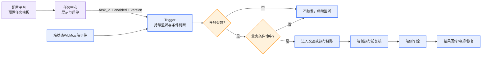

> 例：新增“天气/路况保护任务有效状态”后，Trigger新增的不是一条天气传感器，而是所有天气规则最前面的总门禁。任务关闭时，即使天气、路面、车速全部满足，也不得弹卡或车控；任务重新开启时，Trigger读取当前状态并重新判断一次。

### 3.7.2 一个任务必须拆开回答三个问题

评审时不要只问“这个任务走端还是走云”。一个任务至少有三段，每段可以落在不同位置：

| 层次 | 要回答的问题 | 端侧方案 | 云端方案 |
|---|---|---|---|
| ① 条件判断 | 谁判断规则命中？ | 端侧Trigger直接监听端状态/本地VLM | 状态上行后由云端Trigger、模型或DT判断 |
| ② 二次交互 | 命中后谁负责弹卡、播TTS、理解“确认/取消”？ | 端侧VUI + 可见即可说，不经过Planner | 复用主交互系统通知链路，Planner参与语音选择和全局交互状态 |
| ③ 车辆执行 | 最后谁真正开灯、上锁、加热或开口盖？ | 端侧读取最新状态、复核并调用车控 | 云端只能给出建议、推理结果或用户选择，不得绕过端侧直接执行 |

因此：

- **端侧判断 + 云端交互 + 端侧执行**是可能成立的；
- **端侧前置筛选 + 云端DT推理 + 端侧执行**也是可能成立的；
- 卡片最终显示在车机屏幕上，不代表它一定是“本地交互”；关键看语音选择、会话状态和回调由谁管理；
- 信号来自端侧，也不代表规则一定在端侧判断；端状态可以上行给云端使用。

### 3.7.3 四条任务的具体区别是什么

四条任务虽然都放在“系统预设任务全集”里，但它们不是同一种任务。最核心的区别是：**有的任务是在行车中持续守护安全，有的是本地直接防护，有的是后台便利自动化，还有的是需要模型先理解场景的多步骤智能任务。**

| 任务 | 人话分类 | 什么时候开始判断 | 需要看什么 | 是否需要复杂模型 | 是否需要询问用户 | 漏触发/误触发的后果 | 因此采用什么链路 |
|---|---|---|---|---|---|---|---|
| 天气/路况保护 | **连续安全提醒任务** | 行车中持续监听；天气或路面从正常变成雨、雪、雾、湿滑/覆冰时判断 | 本地VLM天气/路面、车速、驾驶模式、后雾灯、任务有效状态 | 不需要云端复杂推理；VLM已经给出结构化结果，Trigger只需做确定性组合 | **需要**。因为可能切换驾驶模式或开灯，应由用户确认 | 漏触发可能错过安全提醒；误触发会打扰驾驶或改变不合适的车辆设置 | **端侧Trigger判断 → 本地卡片/可见即可说 → 端侧复核执行** |
| 儿童/宠物儿童锁 | **本地安全防护任务** | 车辆进入行驶状态，且后排检测到儿童或猫狗、儿童锁未开时判断 | 儿童端状态、宠物VLM结果、档位/车速、儿童锁状态、任务有效状态 | 识别宠物需要VLM，但Trigger规则本身只是明确的AND/OR | **待确认**。8月27日方案是静默开启，SLS文档是卡片确认，必须由D-12统一 | 漏触发可能留下误开车门风险；误触发可能错误限制后排乘员开门 | **建议端侧Trigger + 端侧车控**；如需要卡片，优先本地交互 |
| 后视镜自动加热 | **后台便利自动化任务** | 雨水、洗车退出或高湿温差等三个规则任一命中时判断 | 天气/湿度/温差、洗车状态、后视镜加热状态、规则时间窗口 | 当前不依赖大模型，但可能需要较长时间窗和策略计算 | **不需要**。当前定义为静默自动开启 | 漏触发时用户仍可手动开启，主要损失是便利；误触发主要是无效加热和能耗 | **云端Trigger判断 → 端侧复核执行**；洗车退出后的15分钟计时在端侧 |
| 识别充电设备后打开充电口盖 | **多步骤智能任务** | 切入P档、低电量、充电口盖关闭时，先判断是否值得启动一次充电场景识别 | 端侧P档/SOC/口盖状态 + 周围是否存在充电设备的视觉/语义结果 | **需要**。仅靠P档和低电量不能证明用户正在充电，需要主动推荐、DT/VQA理解场景 | **需要**，但在调DT前还是DT返回FOUND后询问仍由D-09确认 | 漏触发只是用户手动开盖；误触发可能在非充电场景意外开盖 | **端侧前置筛选 → 云端主动推荐/DT → 用户确认 → 端侧复核开盖** |

#### 3.7.3.1 四条任务最本质的差异

1. **天气和儿童锁属于安全任务**：不能把是否触发完全交给网络，所以核心判断优先留在端侧。
2. **后视镜属于便利任务**：本次因断网没自动开启，用户仍可手动处理，因此可以接受云端判断。
3. **充电口盖不是一个简单条件任务**：`P档 + 低电量`只能说明“可能要充电”，不能说明“附近真的有充电设备且用户想开盖”，所以还需要云端DT/VQA继续理解场景。
4. **四条任务虽然最终都会调用车辆能力，但动作风险不同**：天气可能改变驾驶设置，儿童锁限制车门，充电口盖打开外部部件，均需更严格授权或安全复核；后视镜加热则属于可逆、低风险的便利动作，所以允许静默执行。
5. **任务运行方式不同**：天气是持续状态监听；儿童锁是在行车/乘员条件变化时触发；后视镜是后台规则自动化；充电口盖是一次P档场景内的多步骤工作流。

#### 3.7.3.2 为什么不能用同一种端云方案

- 如果四条任务全部放云端：天气和儿童锁会因弱网漏掉安全窗口。
- 如果四条任务全部放端侧：充电口盖无法充分利用DT/VQA判断真实充电场景，复杂策略也难快速更新。
- 如果四条任务都要求用户确认：后视镜这种低风险便利任务会造成不必要打扰。
- 如果四条任务都静默执行：天气模式、儿童锁和充电口盖可能在用户不知情时被改变。

所以端云拆分不是按任务名称决定，而是按五个问题决定：**是否安全强实时、是否必须离线、规则是否明确、是否需要复杂模型、动作是否需要用户授权。**

### 3.7.4 条件判断：端侧Trigger与云端Trigger的区别

| 对比项 | 端侧Trigger | 云端Trigger | 产品结论 |
|---|---|---|---|
| 输入 | 当前车辆状态、本地VLM结构化结果、本地事件 | 允许上行的车辆状态、历史窗口、云服务、模型/DT结果 | 数据来源不等于判断位置 |
| 延迟 | 低，可直接响应状态变化 | 有网络、上行、排队和计算延迟 | 强实时任务优先端侧 |
| 无网能力 | 可继续运行 | 本次通常无法新触发 | 必须明确无网降级结果 |
| 规则类型 | 阈值、枚举、AND/OR、防抖、小状态机 | 多源组合、长时间窗、语义理解、复杂策略 | 简单规则不用大模型，复杂语义不硬塞端侧 |
| 更新方式 | 受端版本、整车测试和资源约束 | 策略迭代较快 | 变化频繁且可容忍弱网漏触发的规则更适合云端 |
| 主要故障 | 信号失效、资源紧张、版本不一致 | 断网、超时、结果过期、上下文不完整 | 验收要分别覆盖 |

无论规则在哪里判断，Trigger都必须执行相同的产品门禁：

1. 先判断任务是否有效；
2. 再判断本次事件是否重复、是否处于冷却；
3. 再判断业务条件；
4. 需要交互就等待用户结果；
5. 车控前由端侧用最新状态再次复核。

### 3.7.5 二次交互：“走本地”和“走云端”到底指什么

8月27日群内原话“走云端复用主交互系统通知链路；走本地直接用可见即可说”，讨论的是**规则命中以后如何向用户询问**，不是整个任务的Trigger必须部署在哪里。对照[VUI主交互需求的卡片链路](https://bytedance.larkoffice.com/wiki/FBsrwA734iaFzZkrZExcHHBtn3d)，两条链路应这样理解：

| 对比项 | 本地二次交互：端侧自闭环通知 | 云端二次交互：主交互系统通知 |
|---|---|---|
| 发起方式 | Trigger/端侧服务直接请求端侧VUI | 业务方通过系统通知链路到达端侧，同时接入主交互状态 |
| Planner是否参与 | 不参与 | 参与语音选择和全局交互状态 |
| 屏幕显示 | 端侧VUI显示卡片 | 同样由端侧显示即时交互卡片；“显示在端侧”不等于“本地链路” |
| 语音“确认/取消” | VUI在卡片有效期内注册可见即可说，把语音映射为当前按钮 | Planner动态插入与卡片生命周期绑定的选择工具，把语音选择回传 |
| 手动点击 | 端侧直接形成点击结果 | 文档中的系统通知卡片支持直接执行接口，点击结果同步给业务/云端 |
| 网络 | 可离线完成询问与反馈 | 依赖主交互和云端链路可用 |
| 生命周期 | 本地必须明确卡片消失、超时、打断时同步注销可见即可说 | 可复用主交互的卡片、TTS、会话、抢占与超时管理 |
| 适用任务 | 强实时、固定文案、固定按钮、离线也要工作的任务 | 已在云端处理、需要Planner/工具、要统一全局交互的任务 |

本地二次交互的人话流程：

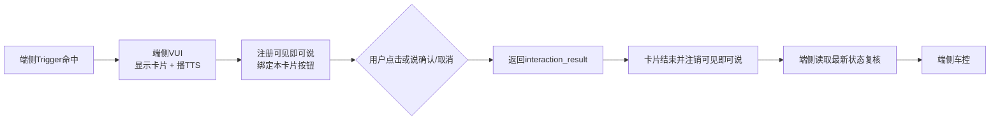

云端二次交互的人话流程：

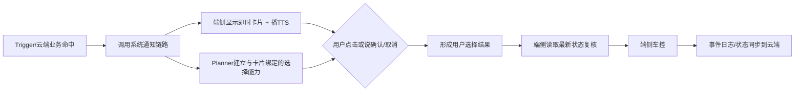

> 当前证据边界：上面是8月27日讨论和VUI主交互文档定义的链路。它说明“可以怎么复用”，不自动证明四条任务的接口已经全部实现；接口名、按钮映射、回调方和超时值仍需各Owner联调确认。

### 3.7.6 四条任务分别如何落位

| 任务 | ① 条件判断 | ② 二次交互 | ③ 车辆执行 | 为什么这样分 | 口径状态 |
|---|---|---|---|---|---|
| 天气/路况保护 | 端侧Trigger：任务有效 + 本地VLM天气/路面 + 车速/模式/灯状态 | 本地VUI + 可见即可说 | 端侧复核后切模式/开灯 | 驾驶安全窗口短，规则固定，弱网也应可用；无需为了“确认/取消”绕云 | 【已确认端侧自闭环】 |
| 儿童/宠物儿童锁 | 建议端侧Trigger：任务有效 + 儿童端状态/宠物VLM + 档位 + 儿童锁状态 | 当前资料冲突：8月27日为静默执行，SLS文档为卡片/TTS；若采用卡片，建议本地交互 | 端侧复核后开启儿童锁 | 本地安全信号、隐私敏感、行车中不能依赖网络；先收口D-12交互方案 | 【判断位置为建议，交互待D-12】 |
| 后视镜自动加热 | 云端Trigger判断三个P0规则；洗车退出后的15分钟计时留端侧 | 当前为静默，不需要二次交互 | 云端命中后由端侧复核并加热；端侧计时后关闭 | 便利型任务，弱网本次不触发可接受；规则可能需要时间窗口，云端迭代更灵活 | 【已确认云端判断+端侧执行】 |
| 充电口盖 | 端侧Trigger先判断任务、P档、SOC、口盖；云端主动推荐/DT再做充电设备语义判断 | 若保留二次确认，建议复用云端主交互系统通知链路；确认在调DT前还是后仍由D-09收口 | DT结果为FOUND且用户授权后，端侧重新复核并开盖 | 简单前置条件不浪费云端调用；充电设备识别需要DT/VQA；真实车控必须防止结果过期 | 【混合链路已确认；确认位置待D-09】 |

### 3.7.7 评审时不能混淆的五个概念

| 概念 | 它决定什么 | 不等于什么 |
|---|---|---|
| 系统预设任务 | 系统提供哪条长期服务规则，用户能否启停 | 不等于任务中心实时跑规则 |
| Trigger部署位置 | 谁持续监听并判断条件命中 | 不等于卡片交互一定走同一侧 |
| 二次交互链路 | 谁管理卡片、TTS、语音选择和超时 | 不等于谁最终执行车控 |
| 责任归属 | 字节/赛力斯哪个团队交付信号、Trigger、交互或车控 | 不等于代码运行在车里还是服务器 |
| 车辆执行权 | 谁根据最新状态调用真实车辆原子能力 | 不等于云端给出FOUND/建议后必须执行 |

评审时可以用一句话收口：

> 我们不是给每条任务贴一个简单的“端”或“云”标签，而是分别确定规则判断、用户交互和车辆执行放在哪里。安全和确定性留端侧，复杂推理和主交互复用放云端，所有真实车控最终回到端侧复核执行。

---

# 4. Objective｜目标与成功标准

## 4.1 产品目标

在不增加用户操作负担的前提下，让车辆在明确、安全、可解释的场景中主动提供保护或便利服务；同时保证用户可关闭、系统不误执行、全链路可追踪。

## 4.2 本期关键结果

| KR | 成功标准 |
|---|---|
| KR1：规则完整 | 四条任务100%补齐任务状态、输入信号、触发规则、执行前复核、动作、异常、冷却/恢复和Owner |
| KR2：链路闭环 | 四条任务正向路径均可从任务中心状态追踪到最终车控结果 |
| KR3：安全可控 | 任务关闭、用户拒绝、结果未知、状态过期、执行前条件变化等反例100%不得误执行 |
| KR4：交互一致 | 卡片消失后不再接受对应语音确认；同一事件不得重复出卡或重复车控 |
| KR5：可观测 | 每次命中、未执行和执行失败均可通过event_id查询原因和链路节点 |
| KR6：验收完成 | PRD中的P0正向、反向和异常用例全部通过后才允许发布 |

## 4.3 非目标

- 不追求“尽可能多提醒”，优先降低误触发和不安全执行；
- 不用系统生成的自然语言Query代替用户授权；
- 不让任务中心承担天气判断、视觉识别或车控执行；
- 不为四条任务分别发明四套状态机和日志规范。

---

# 5. Market Segments｜使用人群与场景约束

本功能不是按人口属性划分，而是按用户当时要完成的任务划分。

| 用户任务 | 典型场景 | 用户需要 | 产品约束 |
|---|---|---|---|
| 安全驾驶 | 雾、雨、雪影响视野和路面 | 及时获得合适车辆保护 | 不能因误识别直接改变驾驶模式 |
| 后排安全 | 行车时后排有儿童或宠物 | 降低误开车门风险 | 儿童/宠物识别未知时不得执行 |
| 保持后视野 | 雨天、洗车后或高湿温差 | 自动改善后视镜可见性 | 加热退出和时长必须可控 |
| 准备充电 | 低电量停车且附近存在充电设备 | 减少手动寻找开盖入口 | 必须识别真实充电场景并明确用户授权位置 |

通用环境约束：

- 云端链路可能受弱网影响；
- 车辆状态可能延迟、失效或乱序；
- VLM/DT可能返回“无法判断”；
- 用户可能在提示过程中改变档位、车速或手动操作车辆功能；
- 多条任务可能同时命中，必须经过统一队列和优先级管理。

---

# 6. Value Propositions｜用户价值

## 6.1 用户收益

- 在用户尚未想到操作时，系统主动发现安全或便利需求；
- 需要改变驾驶模式或开启充电口盖时，保留用户确认权；
- 对适合静默执行的明确、低打扰动作减少不必要的对话；儿童锁是否满足该分类需D-12确认；
- 用户可在任务中心随时关闭不需要的主动服务。

## 6.2 用户避免的风险

- 雾、雨、雪场景下没有及时开启对应保护能力；
- 后排儿童或宠物误开车门；
- 后视镜受雨水或水汽影响视野；
- 到达充电设备附近仍需多层菜单寻找充电口盖；
- 系统重复提醒、重复执行或无视用户拒绝。

## 6.3 产品差异

四条任务共享同一套“任务有效状态 + Trigger规则 + 执行前复核 + 结果回传”底座，但根据风险和实时性选择不同交互方式：

- 天气：本地强实时、用户确认；
- 儿童锁：多源识别；静默执行还是卡片确认待D-12收口；
- 后视镜：规则明确、静默便利执行；
- 充电：复用主动推荐和DT现有能力，避免重复建设。

## 6.4 端云分工的产品价值

端侧和云端不是两个互相替代的完整方案。它们解决的问题不同，组合后的价值也不同。

| 放置方式 | 用户价值 | 产品/研发价值 | 代价与边界 | 四任务例子 |
|---|---|---|---|---|
| 把确定性安全规则放端侧 | 响应快；弱网也能工作；不会因云端排队错过场景 | 规则结果稳定，容易做实车验收 | 随车版本更新慢；不适合塞入复杂模型和大量动态策略 | 天气、儿童/宠物判断 |
| 把复杂判断放云端 | 能利用更多上下文、模型、VQA和工具，提高复杂场景判断能力 | DT、Planner、日志和策略可复用，迭代更快 | 依赖网络；必须处理超时、结果过期和无网降级 | 充电设备识别、后视镜云端规则 |
| 端侧先筛、云端再推理 | 用户只在真正可能需要时收到提醒，减少误打扰 | 少发无效请求，降低模型调用、带宽和服务成本 | 端云必须用同一event_id，防止结果串单 | 充电口盖先判断P档/SOC/口盖，再调DT |
| 云端给结果、端侧最后复核 | 状态已经变化时不会执行过期建议 | 统一车控安全门禁，不让各云模块直接控制车辆 | 端侧必须能区分未知、过期、失败，不可把它们当成功 | 四条任务的真实车控 |
| 本地交互与主交互按需选择 | 安全任务离线能问；复杂任务又能获得统一对话体验 | 固定按钮走可见即可说，复杂链路复用Planner和系统通知 | 两条链路都要定义卡片、语音、超时和回调，不能只写“弹卡” | 天气走本地；充电二次确认建议走主交互 |
| 统一任务与事件标识 | 减少重复弹卡、“说了没做”和重复车控 | 可以定位失败发生在状态、Trigger、云端推理、交互还是车控 | 各模块必须透传`task_id/event_id/rule_version` | 四条任务统一埋点和回放 |

最简单的价值总结是：

- **端侧守住“及时、离线、安全执行”**；
- **云端负责“复杂、可扩展、可快速迭代”**；
- **混合链路用端侧过滤无效场景，用云端提升复杂判断，再回端侧防止误执行**。

本需求追求的不是“端侧更多”或“云端更多”，而是**每一段都放在最合适的位置，并且任何一侧失败时都有明确、保守的降级结果**。

---

# 7. Solution｜详细方案

## 7.1 术语说明

| 术语 | 人话解释 |
|---|---|
| 系统预设任务 | 出厂就存在的一条长期规则，用户无需创建，只需决定是否开启 |
| 任务中心 | 用户查看、开启或关闭任务的页面；不负责判断和车控 |
| Trigger | 持续监听状态并判断条件是否满足的模块 |
| 任务有效状态 | 任务中心告诉Trigger：这条任务当前允许不允许运行 |
| 车辆功能状态 | 雾灯、儿童锁、后视镜加热、充电口盖当前是否已经开启 |
| VLM | 端侧视觉模型，本需求中用于猫狗等客观识别结果 |
| 主动推荐 | Trigger命中后承接Query并组织后续能力调用的现有链路 |
| DT | 动态工具；充电口盖链路中承接Query、端侧上行和推理结果 |
| 可见即可说 | 用户说出当前卡片按钮含义，系统把语音转换成一次按钮点击 |
| 执行前复核 | 真正调用车控前，再检查一次任务、档位和目标状态是否仍满足 |

## 7.2 总体架构

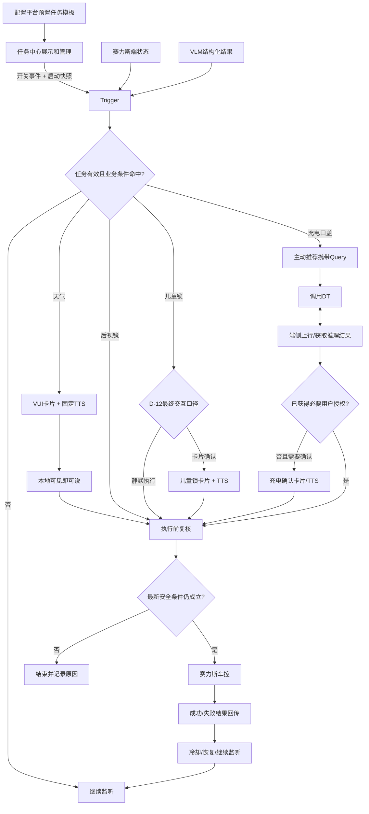

### 7.2.1 端云部署与数据流

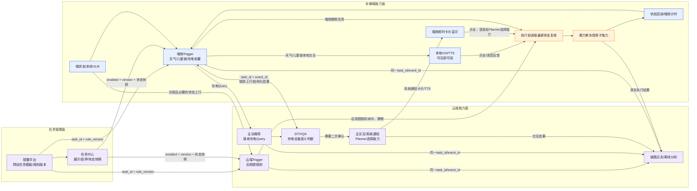

图中需要抓住五点：

1. 配置平台和任务中心是“管理面”，只负责模板、版本和任务有效状态，不替Trigger做实时判断。
2. 端侧Trigger和云端Trigger都可以做“规则判断”，选择取决于实时性、网络容忍度和是否需要复杂推理。
3. 本地VUI与云端主交互是两种“二次交互”路径；它们都可能最终在车机上显示卡片，但语音理解和生命周期Owner不同。
4. 云端可以返回规则命中、DT推理结果或用户选择，但不能跳过端侧复核直接操作车辆。
5. `task_id + event_id + rule_version`必须贯穿判断、交互、复核、车控和日志，避免旧结果控制当前车辆。

### 7.2.2 端云选择流程

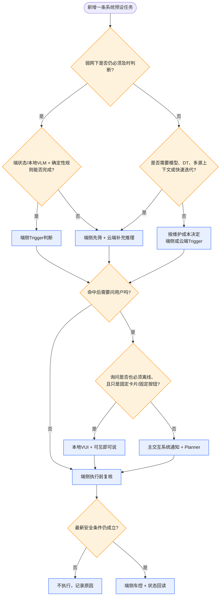

## 7.3 模块边界

| 模块 | 必须负责 | 明确不负责 |
|---|---|---|
| 配置平台 | 预置任务模板、展示信息、规则配置版本 | 不承担运行时状态判断 |
| 任务中心 | 展示、开关、用户操作事件和当前状态快照 | 不识别场景、不执行车控 |
| Trigger | 任务有效判断、信号匹配、去重、触发、执行前复核和日志 | 不绘制卡片、不负责DT内部推理 |
| VLM | 输出猫、狗、无人、无法判断等客观结果 | 不决定是否开启儿童锁 |
| 端侧VUI | 显示本地或系统通知卡片、播放TTS、维护端侧卡片状态 | 不替代Trigger判断任务和业务条件 |
| 可见即可说 | 注册当前按钮、语音匹配、模拟点击、注销 | 不判断天气和车控条件 |
| 主交互/Planner | 云端交互时维护会话状态、动态选择能力、语音选择和抢占 | 不重复判断Trigger安全规则，不直接车控 |
| 主动推荐 | 接收充电Query、调用DT、维持本次链路上下文 | 不替代Trigger前置条件 |
| DT | 处理充电场景推理及端侧能力交互，返回结构化结果 | 不把未知结果当作成功 |
| 端侧/车控 | 提供状态、上行数据、执行原子能力和返回真实结果 | 不自行改变字节任务准入规则 |

### 7.3.1 SLS主动服务四段链路映射

《主动服务定义的讨论》将主动服务拆成四段，本PRD对应关系如下：

| SLS定义 | 本PRD对应模块 | 四任务中的例子 |
|---|---|---|
| 多源感知输入 | 端状态、VLM、DT结果、用户交互事件 | 天气/路面描述、儿童状态、车速、SOC |
| 场景规则匹配 | Trigger | 判断任务有效、AND/OR条件、去重和防抖 |
| 决策与动作 | 预设动作、VUI、主动推荐/DT、车控 | 出卡询问、开启儿童锁、开启加热、打开充电口盖 |
| 反馈与优化 | 点击/关闭/忽略、反向手动操作、车控结果、埋点分析 | `tri_popup`正负反馈、用户手动关闭能力 |

### 7.3.2 规则与模型的组合方式

SLS定义允许规则链路和模型链路独立运行或组合运行。本期四任务对应如下：

| 任务 | 模型部分 | 规则部分 | 动作部分 |
|---|---|---|---|
| 天气路况保护 | VLM输出天气/路面客观描述 | Trigger判断任务开关、车速、当前模式和灯状态 | 卡片确认后车控 |
| 儿童/宠物儿童锁 | VLM识别猫狗；赛力斯提供儿童结构化状态 | Trigger判断档位、成员类型和儿童锁状态 | 静默或卡片确认，待冲突收口 |
| 后视镜加热 | 无模型依赖 | Trigger判断三个P0规则 | 静默车控 |
| 充电口盖 | DT完成充电设备场景推理 | Trigger先判断任务、P档、SOC和口盖状态 | 授权后由端侧执行 |

【产品约束】V1只采集用户正负反馈和反向操作用于离线分析，不允许系统在线自动修改触发阈值、任务开关或安全规则。任何规则调整都必须生成新版本并重新评审、灰度。

## 7.4 通用需求

### 7.4.1 任务模板字段

每条任务在配置平台至少需要以下字段：

| 字段 | 说明 | 必填 |
|---|---|---|
| task_template_id | 系统预设任务模板唯一标识 | 是 |
| task_name | 用户可见名称 | 是 |
| task_description | 用户可见的一句话价值 | 是 |
| default_enabled | 出厂默认状态；当前四条均为默认开启 | 是 |
| deletable | 是否允许永久删除 | 【P0待决策】 |
| trigger_deployment | 条件判断位置：端侧、云端或端云混合 | 是 |
| interaction_route | 交互位置：无交互、本地可见即可说、云端主交互系统通知 | 是 |
| execution_location | 真实动作执行位置；本期涉及车控的任务固定为端侧 | 是 |
| trigger_rule_version | Trigger规则版本 | 是 |
| interaction_type | 静默、卡片确认、主动推荐+DT | 是 |
| owner_byte | 字节Owner | 是 |
| owner_seres | 赛力斯Owner | 是 |
| effective_vehicle_scope | 适用车型/配置 | 是 |
| release_version | 随车版本 | 是 |

### 7.4.2 任务状态同步

需求编号：`COM-STATE-001`，优先级P0。

1. 用户在任务中心开启或关闭任务时，任务中心发送状态变更事件。
2. 事件至少包含任务标识、event_id、目标状态、版本和发生时间。
3. Trigger按event_id幂等处理，重复事件不得造成重复状态变化。
4. Trigger启动、重连或发现版本不一致时，主动读取当前任务状态快照。
5. 每次规则运行前必须先判断最新任务有效状态。
6. 任务关闭时：
   - 未命中：停止继续判断该任务；
   - 已出卡但未确认：关闭卡片并注销语音词条；
   - 已进入车控：不强行中断已发出的原子动作，但完成后不再触发下一次；
   - 已处于冷却：保留日志，状态转为Disabled。

【P0待决策】系统预设任务是否允许删除。建议V1只允许开关、不允许永久删除，避免用户无法恢复出厂任务；如任务中心必须支持删除，应提供“恢复系统任务”入口。

### 7.4.3 通用状态机

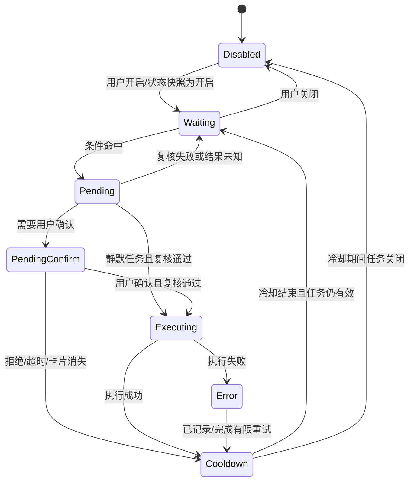

### 7.4.4 执行前复核

需求编号：`COM-SAFE-001`，优先级P0。

所有车控动作发出前，必须重新检查：

- 任务仍然有效；
- 本次event_id没有执行过；
- 车辆当前档位和车速仍满足任务要求；
- 目标功能仍未开启；
- 用户没有在等待期间手动做出相反操作；
- 用户确认仍在有效时间内；
- VLM/DT结果没有过期且不是“无法判断”；
- 赛力斯车控没有返回能力不可用或车辆配置不支持。

任何一项不满足，本次不执行，并记录具体原因码。

### 7.4.5 去重、冷却和用户意图

需求编号：`COM-DEDUPE-001`，优先级P0。

- 同一event_id只能执行一次；
- 同一任务在`PendingConfirm`或`Executing`时不得再次出卡或再次车控；
- 任务需要定义业务去重键，例如“任务ID + 上电周期 + 子场景”；
- 用户拒绝、关闭卡片或手动撤销系统动作后，应进入冷却；
- 冷却时长按任务分别配置，不能写死在公共代码；
- 冷却时间未确认前，不得用“每次信号上报都触发”进入实车验收。

### 7.4.6 交互通用规则

需求编号：`COM-UI-001`，优先级P0。

1. 需要二次确认时，必须同时定义TTS、卡片、按钮、语音表达、超时和执行反馈。
2. 点击和语音应汇聚成相同业务事件，例如`CONFIRM`或`REJECT`。
3. 卡片消失即代表本次确认窗口结束。
4. 卡片消失时必须同步注销可见即可说或对应云端交互能力。
5. 用户在卡片消失后说“好的”，不得继续执行已结束事件。
6. 当前VUI资料中卡片默认10秒退出、强聆听可能持续30秒；本需求统一以卡片存活时间作为本次业务确认有效期。
7. 同一时刻出现多个主动服务时，进入VUI正常队列；安全优先级和最大延迟【P0待决策】。

### 7.4.7 失败处理

| 失败类型 | 默认处理 |
|---|---|
| 任务状态未知 | 不执行，重新拉取状态快照 |
| 输入信号未知/过期 | 不执行，等待新信号 |
| VLM/DT无法判断 | 不执行，不向用户宣称已识别 |
| 用户拒绝/超时 | 不执行，进入冷却 |
| 执行前状态变化 | 不执行，记录`PRECHECK_FAILED` |
| 车控能力不支持 | 不执行，记录车型/配置不支持 |
| 车控超时 | 不盲目重复执行；先读取目标状态，再决定是否有限重试 |
| 云端断网 | 云端任务本次不触发；任务中心开关状态保持不变 |
| 日志上报失败 | 不影响安全判断；本地缓存后补报，具体能力待研发确认 |

### 7.4.8 通用结果码建议

| 结果码 | 含义 |
|---|---|
| TRIGGERED | 条件命中 |
| TASK_DISABLED | 任务已关闭 |
| CONDITION_NOT_MET | 条件不满足 |
| SENSOR_UNKNOWN | 信号未知或失效 |
| DUPLICATED | 重复事件 |
| PENDING_CONFIRM | 等待用户确认 |
| USER_REJECTED | 用户拒绝 |
| CONFIRM_TIMEOUT | 确认超时 |
| PRECHECK_FAILED | 执行前复核失败 |
| CONTROL_SUCCESS | 车控成功 |
| CONTROL_FAILED | 车控失败 |
| COOLDOWN | 处于冷却 |

### 7.4.9 用户反馈与规则优化边界

需求编号：`COM-FEEDBACK-001`，优先级P0。

依据SLS主动服务定义，本期采集以下反馈：

- 卡片点击确认；
- 卡片点击拒绝；
- 卡片关闭或忽略；
- TTS后用户明确的正/负反馈；
- 用户在系统执行后立即进行反向手动操作；
- 车控成功、失败、超时和目标状态回读。

反馈用途：分析误触发、打扰率、用户接受率和规则阈值是否需要调整。

本期明确不做：

- 不根据单个用户反馈实时修改安全条件；
- 不允许模型在线自动关闭任务或改变车控动作；
- 不允许绕过规则版本、评审和灰度直接调整阈值；
- 不把关闭卡片简单等同于“永远不需要此功能”。

后续如需个性化，应另建需求定义样本量、隐私、策略边界、恢复默认和灰度方案。

## 7.5 任务一：天气/路况保护

### 7.5.1 用户故事

作为驾驶员，当车辆识别到雾、雨或雪影响驾驶安全时，我希望系统主动告诉我可以开启对应保护能力，并在我确认后执行。

### 7.5.1.1 天气任务链路图

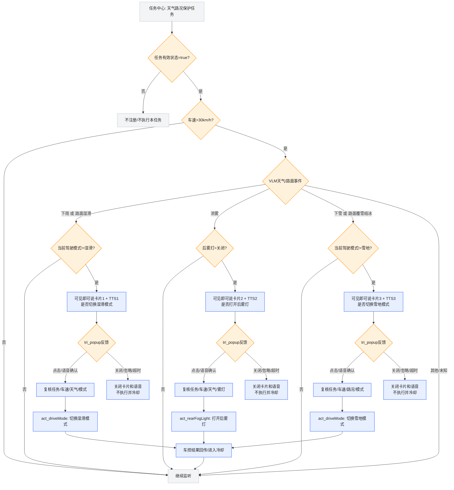

这张图对应用户提供的天气链路图：三个子场景分别判断、分别出卡、分别执行，不能把“切雪地模式”和“开后雾灯”合并成同一次动作。

### 7.5.2 当前状态

- 【已确认】任务中心独立开关，默认开启；
- 【已确认】强实时、端侧自闭环；
- 【已确认】需要固定TTS、即时卡片和二次确认；
- 【已确认】本地语音走可见即可说，不经过Planner；
- 【已确认】目标能力已开启时不重复触发；
- 【已确认】当前Trigger前半段已开发；
- 【新增SLS资料】天气/路面输入来自`vision.outside.scene`结构中的“天气情况描述”和“路面情况描述”；
- 【新增SLS资料】正式场景增加车速`>30km/h`条件；
- 【新增SLS资料】卡片反馈事件为`tri_popup`，点击为正反馈，关闭/忽略为负反馈；
- 【P0待决策】拉卡接口、按钮注册、交互回调、车控结果和恢复链路。

### 7.5.3 输入信号

| 信号 | 建议值域 | 来源 | 异常处理 |
|---|---|---|---|
| task_enabled | true/false/unknown | 任务中心 | unknown不触发 |
| weather_description | 下雨/下雪/浓雾/其他/UNKNOWN | `vision.outside.scene` → “天气情况描述”，SourceID=`vlm_outside` | UNKNOWN不触发 |
| road_description | 路面湿滑/路面覆雪结冰/其他/UNKNOWN | `vision.outside.scene` → “路面情况描述”，SourceID=`vlm_outside` | UNKNOWN不触发 |
| fog_lamp_state | ON/OFF/UNKNOWN | `con_rearFogLight` / `signal_light_0004` | UNKNOWN不执行 |
| road_mode | NORMAL/WET/SNOW/UNKNOWN | `con_vehDrive` / `vehicle_control_0003` | UNKNOWN不执行 |
| vehicle_speed | 数值 + 时间戳 | `tri_speed` / `vehicle_control_0004` | 过期或≤30不触发正式场景 |
| gear | P/R/N/D等 | 赛力斯端状态 | 具体限制待业务确认 |
| power_cycle_id | 当前上电周期 | 端侧 | 用于去重和恢复 |
| popup_feedback | CLICK/CLOSE/IGNORE/UNKNOWN | `tri_popup`，端状态·交互 | 与event_id关联；未知不执行 |

### 7.5.3.1 场景与原子能力表

| 类型 | 原子能力/字段 | 本需求用途 |
|---|---|---|
| 触发器 | `vision.outside.scene` → “天气情况描述” | 监听变更为下雨、下雪、浓雾 |
| 触发器 | `vision.outside.scene` → “路面情况描述” | 监听变更为路面湿滑、路面覆雪结冰 |
| 条件 | `tri_speed` / `vehicle_control_0004` | 正式场景车速必须大于30km/h |
| 条件 | `con_vehDrive` / `vehicle_control_0003` | 判断当前驾驶模式，避免重复切换 |
| 条件 | `con_rearFogLight` / `signal_light_0004` | 判断后雾灯是否关闭 |
| 动作 | `act_popup` / `act_TTS` | 展示主动服务卡片并播报固定TTS |
| 动作 | `act_driveMode` / `act_rearFogLight` | 用户确认后切换模式或开启后雾灯 |
| 反馈 | `tri_popup` | 点击=正反馈；关闭/忽略=负反馈 |

SLS事件清单前部写天气/路面枚举需“连续3周期一致确认”；后部事件变更表又将进入/退出防抖数字使用删除线。最终防抖次数标记为【P0待决策】，不得直接按3次或8次上线。

### 7.5.3.2 数据来源

| 数据项 | ID/字段 | 来源类别 | 当前状态 |
|---|---|---|---|
| 天气：下雨/下雪/浓雾 | `vision.outside.scene` → “天气情况描述” | VLM | 已提供 |
| 路面：湿滑/覆雪结冰 | `vision.outside.scene` → “路面情况描述” | VLM | 已提供，覆冰/覆雪结冰枚举待统一 |
| 车速 | `tri_speed` / `vehicle_control_0004` | 端状态 | 已提供 |
| 驾驶模式 | `con_vehDrive` / `vehicle_control_0003` | 端状态 | 已提供 |
| 后雾灯 | `con_rearFogLight` / `signal_light_0004` | 端状态 | 已提供 |
| 卡片反馈 | `tri_popup` | 端状态·交互 | 已提供，需与VUI回调协议对齐 |
| 任务有效状态 | `task_enabled`，正式ID待任务中心提供 | 任务中心 | ID待确认 |

### 7.5.3.3 事件清单

| 事件 | 原子能力表ID | 来源 | 变更/穿越条件 | 命中后的下一步 |
|---|---|---|---|---|
| VLM天气变更 | `vision.outside.scene/天气情况描述` | VLM | 变更为下雨/下雪/浓雾；防抖次数D-11待定 | 读取车速和目标功能状态 |
| VLM路面变更 | `vision.outside.scene/路面情况描述` | VLM | 变更为湿滑/覆雪结冰；防抖次数D-11待定 | 读取车速和当前驾驶模式 |
| 卡片正反馈 | `tri_popup` | 端状态·交互 | 无→点击/语音确认 | 执行前复核后车控 |
| 卡片负反馈 | `tri_popup` | 端状态·交互 | 无→关闭/忽略/拒绝 | 关闭卡片和语音并进入冷却 |
| 卡片超时 | VUI事件ID待确认 | VUI | 10秒未交互 | 注销可见即可说，不执行 |
| 天气/路面退出 | 同上VLM字段 | VLM | 满足各子场景退出AND条件；退出防抖D-11待定 | 询问是否恢复原模式/关闭雾灯 |

### 7.5.3.4 信号清单

| 信号 | SourceID | 类型 | 值域/说明 |
|---|---|---|---|
| `vision.outside.scene` | `vlm_outside` | struct | “天气情况描述”“路面情况描述”两个key |
| 车速 | `vehicle_control_0004` | number | km/h；正式触发条件`>30` |
| 驾驶模式 | `vehicle_control_0003` | enum | NORMAL/WET/SNOW，正式枚举待车控表确认 |
| 后雾灯 | `signal_light_0004` | enum/bool | ON/OFF/UNKNOWN |
| 卡片反馈 | `tri_popup` | event | CLICK/CLOSE/IGNORE/REJECT；语音与点击需统一 |
| 任务有效状态 | 任务中心ID待确认 | bool | true/false/unknown |

### 7.5.3.5 进入与退出逻辑

| 子场景 | 进入条件 | 用户确认后动作 | 退出条件 | 退出动作 |
|---|---|---|---|---|
| 雨天/湿滑 | 任务有效 AND 车速>30 AND（下雨 OR 路面湿滑）AND 当前非湿滑模式 | 切换湿滑模式 | 非下雨 AND 路面非湿滑，且达到D-11退出防抖 | 询问是否恢复原模式；未确认不自动切换 |
| 浓雾 | 任务有效 AND 车速>30 AND 浓雾 AND 后雾灯关闭 | 打开后雾灯 | 浓雾退出，且达到D-11退出防抖 | 询问是否关闭后雾灯；未确认不自动关闭 |
| 下雪/覆雪结冰 | 任务有效 AND 车速>30 AND（下雪 OR 覆雪结冰）AND 当前非雪地模式 | 切换雪地模式 | 非下雪 AND 路面非覆雪结冰，且达到D-11退出防抖 | 询问是否恢复原模式；未确认不自动切换 |
| 通用复核退出 | 执行前任务关闭、车速不内容许或关键信号变为UNKNOWN | 不执行 | — | 记录具体原因并进入冷却 |

### 7.5.4 触发规则

需求编号：`WTH-RULE-001`，优先级P0。

雾：

```text
task_enabled = true
AND vehicle_speed > 30km/h
AND weather_description = 浓雾
AND fog_lamp_state = OFF
→ 询问是否开启后雾灯
```

雨：

```text
task_enabled = true
AND vehicle_speed > 30km/h
AND (weather_description = 下雨 OR road_description = 路面湿滑)
AND road_mode != WET
→ 询问是否切换湿滑模式
```

雪：

```text
task_enabled = true
AND vehicle_speed > 30km/h
AND (weather_description = 下雪 OR road_description = 路面覆雪结冰)
AND road_mode != SNOW
→ 询问是否切换雪地模式
```

原需求中的“前方300米”仍是TBD，不作为V1验收条件。

【P0待决策】SLS原子能力总表把确认后的动作写成“切雪地模式 + 开后雾灯”，但同文档子场景表分别写雨天开湿滑模式、雪天开雪地模式、雾天开后雾灯。V1.1建议采用子场景分别执行，禁止一次确认同时切模式并开灯；需天气业务和车控Owner最终确认。

### 7.5.5 完整交互与执行流程

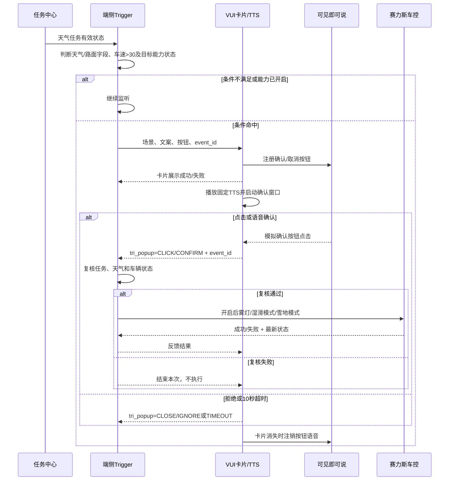

### 7.5.6 卡片与文案建议

最终文案由天气业务和VUI确认。

| 场景 | TTS建议 | 按钮 |
|---|---|---|
| 雾 | 检测到前方可能有雾，是否为你打开后雾灯？ | 打开 / 暂不开 |
| 雨 | 检测到雨天路况，是否切换到湿滑模式？ | 切换 / 暂不切换 |
| 雪 | 检测到雪天路况，是否切换到雪地模式？ | 切换 / 暂不切换 |
| 天气恢复 | 当前天气已经恢复，是否关闭后雾灯或恢复常用模式？ | 恢复 / 保持当前 |

### 7.5.7 恢复规则

- 【已确认】天气恢复后需要反向询问用户；
- 恢复动作仍需二次确认，不能静默关闭用户当前模式；
- 恢复前重新读取当前天气、模式和用户手动操作；
- 一个上电周期内记录本次开启来源，避免关闭用户原本手动开启的能力；
- 雨天退出候选：`天气情况描述 != 下雨 AND 路面情况描述 != 路面湿滑`，询问是否关闭湿滑模式；
- 雪天退出候选：`天气情况描述 != 下雪 AND 路面情况描述 != 路面覆雪结冰`，询问是否关闭雪地模式；
- 雾天退出候选：`天气情况描述 != 浓雾`，询问是否关闭后雾灯；
- SLS文档曾写退出连续8次，但在后部表格中被删除线标记，因此最终退出防抖次数【P0待决策】；
- 【P0待决策】雾雨雪同时命中或互相切换时的优先级和合并卡片方案。

### 7.5.8 异常与冷却

- 用户拒绝后不得马上再次出同一张卡；冷却时长TBD；
- 卡片排队期间天气恢复，不再展示过期卡片；
- 用户确认后天气已恢复，不执行；
- 车控失败是否二次提示、是否允许重试，需与车控Owner确认；
- 卡片接口失败时，本次不执行，不允许退化为静默车控；
- 熄火重启后重新读取任务状态并重新判断，不沿用上个上电周期的待确认事件。

### 7.5.8.1 联调模拟数据

SLS规则文档提供了联调替代信号。以下配置仅用于天气/VLM正式信号未就绪时验证Trigger、卡片和回调链路，不能混入量产规则。

| 正式场景 | 联调替代 | 原子能力ID |
|---|---|---|
| “天气情况描述”变更为下雨/下雪/浓雾 | 空调风量变更为≥3档 | `tri_cabinAC_fan` / `vehicle_control_0013` |
| “路面情况描述”变更为湿滑/覆雪结冰 | 空调设定温度变更为>26℃ | `tri_cabinAC_temp` / `vehicle_control_0013` |
| 正式条件车速>30km/h | 联调阶段临时摘除 | 正式配置必须恢复 |
| 正式动作卡片+TTS | 联调仍使用卡片+TTS | `act_popup` / `act_TTS` |

联调要求：

1. 模拟规则和正式规则使用不同`rule_version`或环境标识；
2. 量产构建必须拒绝包含`tri_cabinAC_fan`、`tri_cabinAC_temp`的天气模拟规则；
3. 联调报告同时记录“模拟输入”和“对应正式输入”，避免把模拟通过写成VLM正式链路通过；
4. 正式VLM信号接入后，重新完成天气触发、防抖、退出和实车验收。

### 7.5.9 天气验收用例

| 编号 | 前置 | 操作/事件 | 预期 |
|---|---|---|---|
| WTH-01 | 任务开、雾、雾灯关 | 用户确认 | 雾灯开启，仅执行一次 |
| WTH-02 | 任务开、雨、非湿滑模式 | 用户确认 | 切换湿滑模式 |
| WTH-03 | 任务开、雪、非雪地模式 | 用户确认 | 切换雪地模式 |
| WTH-04 | 任务关 | 雾雨雪命中 | 不出卡、不车控 |
| WTH-05 | 目标能力已开启 | 场景命中 | 不出卡 |
| WTH-06 | 已出卡 | 用户拒绝 | 不执行并进入冷却 |
| WTH-07 | 已出卡 | 10秒无响应 | 卡片和语音同时注销，不执行 |
| WTH-08 | 已出卡 | 第20秒说“好的” | 不执行 |
| WTH-09 | 排队等待 | 天气恢复 | 取消过期卡片 |
| WTH-10 | 用户确认后 | 执行前状态变化 | 复核失败，不执行 |
| WTH-11 | 车控返回失败 | 用户已确认 | 记录失败，不重复盲调 |
| WTH-12 | 雾雨雪同时命中 | 同一周期 | 按评审后的优先级只出一次有效交互 |
| WTH-13 | 任务开、车速30km/h | 雾雨雪命中 | 按“>30”不触发 |
| WTH-14 | 任务开、车速31km/h | 其他条件满足 | 正常进入推荐链路 |
| WTH-15 | 天气不再下雨但路面仍湿滑 | 已开启湿滑模式 | 不触发关闭询问 |
| WTH-16 | 天气非下雨且路面非湿滑 | 已由本任务开启湿滑模式 | 达到防抖后询问是否关闭 |
| WTH-17 | 联调环境使用空调模拟信号 | 触发模拟规则 | 可验证卡片链路，但报告不得标记VLM正式链路通过 |

## 7.6 任务二：后排儿童/宠物识别后开启儿童锁

### 7.6.1 用户故事

作为驾驶员，当车辆行驶且后排存在儿童或宠物时，我希望系统自动开启儿童锁，降低误开车门风险。

### 7.6.2 当前状态

- 【已确认】任务中心独立开关，默认开启；
- 【已确认】儿童使用赛力斯OMS/SLS等端状态；
- 【已确认】猫狗使用字节VLM结构化结果；
- 【飞书当前评论】VLM儿童信息约5分钟上报一次，准确率尚未批量验证；不能作为本安全任务的唯一触发源；
- 【已确认】非P档、后排存在儿童/猫/狗、儿童锁未开启时触发；
- 【已确认】当前无卡片、无固定TTS，静默执行；
- 【新增SLS资料但存在冲突】SLS规则文档写“切入D档 + 仅儿童/老人和儿童 + 主动服务卡片/TTS + 用户反馈后执行”；
- 【P0待决策】左右门策略、安全附加条件、用户手动关闭保护和失败反馈。

### 7.6.2.1 儿童锁版本冲突

| 维度 | 当前《系统预设任务全集》/8月27日口径 | 新增SLS规则文档 | 必须确认 |
|---|---|---|---|
| 触发时机 | 持续判断档位非P | `tri_gear`切换类型=切入、档位=D | 只在切D瞬间触发，还是行车中持续补判 |
| 识别对象 | 儿童或猫/狗 | `con_occGroup`=仅儿童/老人和儿童 | 宠物是否仍属于本任务；老人单独是否触发 |
| 用户交互 | 无卡片、无固定TTS，静默执行 | 主动服务卡片 + TTS + 关闭语音 | 是否必须询问用户 |
| 执行动作 | 条件满足后直接开启儿童锁 | 用户正反馈后再执行儿童锁 | 执行前是否必须有正反馈 |
| 负反馈 | 当前未定义 | 关闭/忽略或用户负反馈 | 负反馈后的冷却和学习方式 |

【产品处理】在D-12关闭前，本PRD保留当前系统预设任务口径作为既有基线，但儿童锁不得按两套链路同时实现。评审必须产出唯一方案并同步修改表格、SLS规则和验收用例。

### 7.6.2.2 场景与原子能力表

| 原子能力类型 | 原子能力名称/ID | 状态或参数 | 资料状态 |
|---|---|---|---|
| 任务门禁 | 任务有效状态ID待任务中心提供 | `task_enabled=true` | ID待确认 |
| 触发器方案A | 档位端状态ID待确认 | `gear != P`，持续判断 | 当前表格/8月27日口径 |
| 触发器方案B | `tri_gear` | 切换类型=切入，档位=D | SLS规则文档 |
| 条件① | `con_occGroup` | 成员类型=仅儿童/老人和儿童 | SLS已给字段，枚举待端状态表确认 |
| 条件② | 后排宠物VLM字段ID待提供 | 猫/狗 | 当前表格有需求，无正式ID |
| 条件③ | 儿童锁状态ID待提供 | 儿童锁=未开启 | 业务条件明确，ID未补 |
| 动作① | `act_popup` / `act_TTS`（若复用） | 主动服务卡片 + TTS询问 | 仅卡片方案需要，ID需VUI确认 |
| 反馈 | `tri_popup`或儿童锁专用反馈ID待确认 | 点击/语音确认=正反馈；关闭/忽略=负反馈 | SLS只写正负反馈，未给ID |
| 动作② | 开启儿童锁原子能力ID待提供 | 左/右/双侧范围D-05待定 | 车控ID和参数未补 |
| 结束动作 | 关闭语音/注销卡片ID待提供 | 拒绝、忽略、超时后执行 | 仅卡片方案需要 |

SLS表中儿童锁状态、卡片、TTS、反馈和车控动作均未给出完整ID或参数，不能直接进入配置平台，需由SLS/车控/VUI Owner补齐。

### 7.6.2.3 儿童锁任务链路图

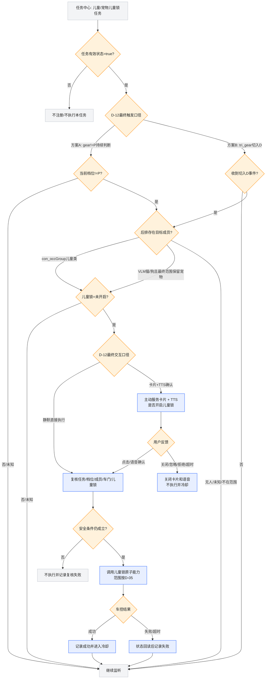

### 7.6.2.4 数据来源

| 数据项 | ID/字段 | 来源类别 | 当前状态 |
|---|---|---|---|
| 任务有效状态 | 正式ID待任务中心提供 | 任务中心 | ID待确认 |
| 档位/切入D事件 | `tri_gear`或档位端状态正式ID | 端状态 | SLS提供`tri_gear`；持续状态ID待确认 |
| 特殊成员类型 | `con_occGroup` | 赛力斯OMS/SLS端状态 | 字段已给，值域、更新频率和失效时间待确认；V1儿童主触发源 |
| VLM儿童信息 | 正式ID待提供 | 字节端侧VLM | 当前约5分钟频率且未批量验证；不作为唯一主触发源 |
| 猫/狗识别 | 后排宠物VLM字段ID待提供 | 字节端侧VLM | 需求已确认，ID待提供 |
| 儿童锁状态 | 正式ID待提供 | 赛力斯端状态 | 缺ID/左右门参数 |
| 后排车门状态 | 正式ID待提供 | 赛力斯端状态 | 是否作为安全条件D-05待定 |
| 卡片正负反馈 | `tri_popup`是否复用待确认 | VUI/端状态·交互 | 仅卡片方案需要 |
| 儿童锁车控结果 | 原子能力ID和错误码待提供 | 赛力斯车控 | 待补齐 |

### 7.6.2.5 事件清单

| 事件 | 原子能力表ID | 来源 | 变更/穿越条件 | 命中后的下一步 |
|---|---|---|---|---|
| 档位切入D | `tri_gear` | 端状态 | 非D→D；仅方案B使用 | 读取成员类型和儿童锁状态 |
| 非P状态成立 | 档位状态ID待提供 | 端状态 | `gear != P`；仅方案A使用 | 持续判断成员类型 |
| 儿童成员出现 | `con_occGroup` | OMS/SLS | 无目标成员→儿童类枚举 | 判断儿童锁状态 |
| 宠物出现 | VLM字段ID待提供 | VLM | NONE/UNKNOWN→CAT/DOG | 判断儿童锁状态 |
| 儿童锁状态变化 | ID待提供 | 端状态 | OFF→ON或ON→OFF | 去重或判断用户反向操作 |
| 用户正反馈 | 反馈ID待确认 | VUI/语音 | 无→确认 | 执行前复核 |
| 用户负反馈 | 反馈ID待确认 | VUI/语音 | 无→拒绝/关闭/忽略/超时 | 不执行并进入冷却 |

### 7.6.2.6 信号清单

| 信号 | SourceID | 类型 | 值域/说明 |
|---|---|---|---|
| 档位 | `tri_gear`/正式状态SourceID待确认 | event+enum | P/R/N/D；是否只用切入D由D-12决定 |
| 特殊成员类型 | `con_occGroup` | enum | 仅儿童、老人和儿童、其他；完整枚举待确认 |
| 宠物识别 | VLM SourceID待提供 | enum | CAT/DOG/NONE/OTHER/UNKNOWN |
| 左/右儿童锁 | SourceID待提供 | enum/bool | ON/OFF/UNKNOWN，需支持左右门 |
| 后排车门 | SourceID待提供 | enum | OPEN/CLOSED/UNKNOWN |
| 卡片反馈 | `tri_popup`是否复用待确认 | event | CONFIRM/REJECT/CLOSE/IGNORE/TIMEOUT |
| 任务有效状态 | 任务中心ID待提供 | bool | true/false/unknown |

### 7.6.2.7 进入与退出逻辑

| 阶段 | 条件 | 系统动作 |
|---|---|---|
| 进入候选 | 任务有效 AND（`gear!=P`或切入D，按D-12）AND 儿童/宠物目标成立 AND 儿童锁关闭 | 进入静默执行或卡片确认分支 |
| 用户正反馈 | 仅卡片方案；确认事件仍在有效期 | 执行前复核后开启儿童锁 |
| 用户负反馈 | 仅卡片方案；拒绝/关闭/忽略/超时 | 关闭交互，不执行并冷却 |
| 复核退出 | 档位变P、成员不再存在、车门/锁状态不安全、任务关闭 | 终止本次，不执行 |
| 动作完成 | 车控成功 | 本次事件结束，任务回到Waiting |
| 功能退出 | 本任务不自动关闭儿童锁 | 儿童锁后续关闭由用户或车辆既有策略负责 |

### 7.6.3 输入信号

| 信号 | 建议值域 | 来源 | 异常处理 |
|---|---|---|---|
| task_enabled | true/false/unknown | 任务中心 | unknown不触发 |
| gear | P/R/N/D等 | 赛力斯端状态 | P不触发，unknown不触发 |
| child_presence | PRESENT/ABSENT/UNKNOWN | 赛力斯OMS/SLS | UNKNOWN不触发 |
| pet_type | CAT/DOG/NONE/OTHER/UNKNOWN | 字节端侧VLM | OTHER/UNKNOWN不触发 |
| child_lock_left/right | ON/OFF/UNKNOWN | 赛力斯端状态 | UNKNOWN不执行对应车门 |
| rear_door_state | OPEN/CLOSED/UNKNOWN | 赛力斯端状态 | 是否作为前置条件待确认 |
| vehicle_speed | 数值 + 时间戳 | 赛力斯端状态 | 安全阈值待确认 |

### 7.6.4 触发规则

需求编号：`LOCK-RULE-001`，优先级P0。

```text
task_enabled = true
AND gear != P
AND (child_presence = PRESENT OR pet_type IN [CAT, DOG])
AND child_lock_state = OFF
→ 执行前复核
→ 开启儿童锁
```

VLM返回`UNKNOWN`、`OTHER`或结果过期时不得触发。

### 7.6.5 流程

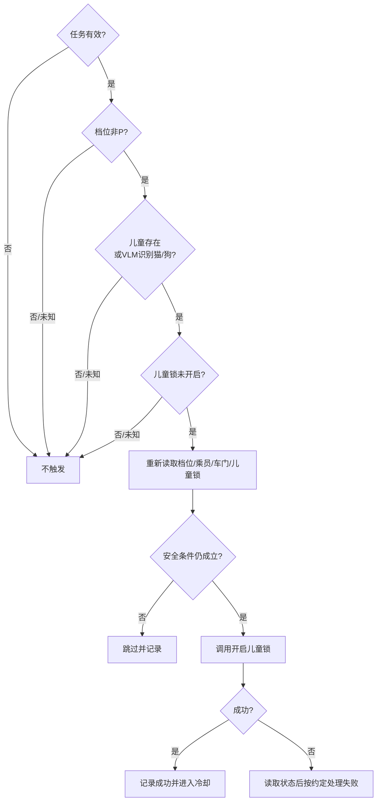

### 7.6.6 安全和隐私要求

- 舱内图像按端侧处理原则执行，Trigger只消费结构化结果，不要求上传原始舱内图像；
- 不能因为一次模糊画面或无法判断就开启儿童锁；
- 开启儿童锁的左右门范围必须与识别位置能力对齐；无法定位时是否两侧开启需业务确认；
- 如果用户刚刚手动关闭儿童锁，系统不得立即重新打开；
- 如果车门处于打开状态，是否允许执行儿童锁需赛力斯车控确认；
- 车控接口名称、锁状态语义和“开启儿童锁”必须避免写成含义相反的“开锁”。

### 7.6.7 待决策

1. 开启左侧、右侧还是两侧儿童锁；
2. 是否增加后排车门关闭、车辆已起步或最低车速条件；
3. 儿童端状态和宠物VLM结果的有效期；
4. VLM是否要求连续多帧命中；
5. 用户手动关闭后的抑制时长；
6. 静默成功是否提供轻提示、Toast或任务记录；
7. 车控失败是否重试，重试前是否先读锁状态；
8. 当前表格的“排队等待”是车控队列还是误填。
9. 最终规则采用`gear != P`持续判断，还是只监听`tri_gear`切入D事件；
10. 最终对象采用儿童+猫狗，还是仅`con_occGroup`中的儿童相关枚举；
11. 最终交互采用静默执行，还是主动服务卡片/TTS确认；
12. 如果采用卡片，关闭/忽略的负反馈如何进入冷却，是否写入用户偏好。

### 7.6.8 验收用例

| 编号 | 前置/事件 | 预期 |
|---|---|---|
| LOCK-01 | 任务开、非P、检测儿童、锁关 | 开启规定范围儿童锁一次 |
| LOCK-02 | 任务开、非P、VLM猫/狗、锁关 | 开启规定范围儿童锁一次 |
| LOCK-03 | 任务关 | 不判断、不执行 |
| LOCK-04 | P档 | 不执行 |
| LOCK-05 | 无人/VLM未知 | 不执行 |
| LOCK-06 | 儿童锁已开 | 不重复执行 |
| LOCK-07 | 用户刚手动关闭 | 冷却期内不重新开启 |
| LOCK-08 | 识别后切入P档 | 执行前复核失败，不执行 |
| LOCK-09 | 左右门状态不一致 | 按评审后的车门策略执行，不误操作 |
| LOCK-10 | 车控超时 | 先读状态，不盲目重复执行 |
| LOCK-11 | 最终采用卡片方案 | 用户拒绝/关闭/忽略 | 不开启儿童锁并进入约定冷却 |
| LOCK-12 | 最终采用静默方案 | 条件满足 | 全链路不得额外出现卡片或TTS |
| LOCK-13 | 切入D时成员信号尚未就绪，稍后识别到儿童 | 行车中 | 按最终“事件触发/持续补判”结论执行 |

## 7.7 任务三：后视镜自动加热

### 7.7.1 用户故事

作为驾驶员，当雨水、洗车残留或高湿温差影响后视镜时，我希望系统自动开启加热，改善后视野。

### 7.7.2 当前状态

- 【已确认】一条任务总开关，默认开启；
- 【已确认】V1只做三个P0场景；
- 【已确认】云端部署，弱网时不触发可接受；
- 【已确认】无VLM、无卡片、无固定TTS，静默执行；
- 【已确认】传送带洗车退出场景端侧运行15分钟；
- 【P0待决策】高湿温差窗口、场景一和场景三退出条件、删除口径。

### 7.7.2.1 后视镜加热任务链路图

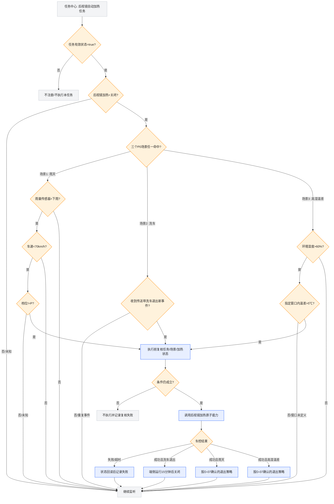

### 7.7.2.2 场景与原子能力表

| 原子能力类型 | 原子能力名称/ID | 状态或参数 | 资料状态 |
|---|---|---|---|
| 任务门禁 | 任务有效状态ID待提供 | `task_enabled=true` | 任务中心ID待确认 |
| 触发器① | 雨量传感器字段ID待提供 | 雨量状态=下雨 | 业务条件明确，正式ID待赛力斯提供 |
| 条件① | `tri_speed` / `vehicle_control_0004` | 车速<70km/h | 车速ID可复用，需确认云端可用性 |
| 条件② | 档位状态ID待提供 | 档位!=P | 正式ID待提供 |
| 触发器② | 传送带洗车退出事件ID待提供 | 洗车模式从开启→退出，新event_id | 业务事件明确，正式ID待提供 |
| 触发器③ | 环境湿度字段ID待提供 | 湿度>60% | 正式ID待提供 |
| 条件③ | 温度序列/温差字段ID待提供 | 指定窗口内温差>5℃ | 窗口与字段均D-07待定 |
| 条件④ | 后视镜加热状态ID待提供 | 加热=关闭 | 正式ID待提供 |
| 动作 | 后视镜加热车控ID待提供 | 开启；洗车场景运行15分钟 | 原子能力和参数待提供 |
| 反馈 | 后视镜加热状态回读/车控结果ID待提供 | 成功/失败/超时+最新状态 | 待赛力斯提供 |

### 7.7.2.3 数据来源

| 数据项 | ID/字段 | 来源类别 | 当前状态 |
|---|---|---|---|
| 任务有效状态 | 任务中心正式ID待提供 | 任务中心 | ID待确认 |
| 雨量状态 | 正式ID待提供 | 赛力斯端状态/传感器 | ID和枚举待确认 |
| 车速 | `tri_speed` / `vehicle_control_0004` | 赛力斯端状态 | 已有可参考ID |
| 档位 | 正式ID待提供 | 赛力斯端状态 | ID待确认 |
| 传送带洗车退出 | 正式事件ID待提供 | 赛力斯端状态·事件 | ID、event_id、重放规则待确认 |
| 环境湿度 | 正式ID待提供 | 赛力斯端状态/传感器 | ID待确认 |
| 温度序列/温差 | 正式ID待提供 | 赛力斯端状态/传感器 | 字段、采样频率和窗口待确认 |
| 后视镜加热状态 | 正式ID待提供 | 赛力斯端状态 | ID待确认 |
| 后视镜加热车控 | 正式ID待提供 | 赛力斯车控 | 动作参数和错误码待确认 |

### 7.7.2.4 事件清单

| 事件 | 原子能力表ID | 来源 | 变更/穿越条件 | 命中后的下一步 |
|---|---|---|---|---|
| 雨天候选 | 雨量字段ID待提供 | 端状态 | 非下雨→下雨，或下雨状态满足 | 判断车速、档位、加热状态 |
| 车速穿越70 | `tri_speed` / `vehicle_control_0004` | 端状态 | `<70`或`>=70`边界变化 | 进入或退出场景一候选 |
| 洗车退出 | 事件ID待提供 | 端状态·事件 | 洗车模式开启→退出，event_id未消费 | 开启加热并启动15分钟计时 |
| 高湿候选 | 湿度字段ID待提供 | 端状态 | 湿度穿越`>60%` | 计算温差窗口 |
| 温差候选 | 温度字段ID待提供 | 端状态 | 指定窗口内温差穿越`>5℃` | 复核后执行加热 |
| 加热状态变化 | 状态ID待提供 | 端状态 | OFF→ON或ON→OFF | 去重、完成或退出 |
| 车控结果 | 结果ID待提供 | 赛力斯车控 | SUCCESS/FAILED/TIMEOUT | 记录并状态回读 |

### 7.7.2.5 信号清单

| 信号 | SourceID | 类型 | 值域/说明 |
|---|---|---|---|
| 雨量状态 | SourceID待提供 | enum | RAIN/NO_RAIN/UNKNOWN |
| 车速 | `vehicle_control_0004` | number | km/h；场景一`<70` |
| 档位 | SourceID待提供 | enum | P/R/N/D/UNKNOWN |
| 洗车模式/退出事件 | SourceID待提供 | enum+event | ON/OFF/EXIT；必须带event_id |
| 环境湿度 | SourceID待提供 | number | 百分比；场景三`>60` |
| 温度序列 | SourceID待提供 | number+timestamp | 温差`>5℃`；计算窗口D-07待定 |
| 后视镜加热状态 | SourceID待提供 | enum/bool | ON/OFF/UNKNOWN |
| 任务有效状态 | 任务中心ID待提供 | bool | true/false/unknown |

### 7.7.2.6 进入与退出逻辑

| 子场景 | 进入条件 | 进入动作 | 退出条件 | 退出动作 |
|---|---|---|---|---|
| 雨天中低速 | 任务有效 AND 下雨 AND 车速<70 AND 非P AND 加热关闭 | 静默开启加热 | 雨停、车速≥70或切P后的处理D-07待定 | 立即关闭或完成固定周期，待确认 |
| 传送带洗车退出 | 任务有效 AND 收到未消费的洗车退出事件 AND 加热关闭 | 静默开启加热 | 端侧计时15分钟完成 | 关闭加热 |
| 高湿温差 | 任务有效 AND 湿度>60% AND 窗口内温差>5℃ AND 加热关闭 | 静默开启加热 | 湿度/温差恢复或最长运行时间D-07待定 | 待确认 |
| 通用复核退出 | 执行前任务关闭、加热已开、信号未知或关键条件变化 | 不执行 | — | 记录具体原因 |

### 7.7.3 输入信号

| 信号 | 说明 | 来源 |
|---|---|---|
| task_enabled | 任务有效状态 | 任务中心 |
| rain_sensor | 是否下雨 | 赛力斯 |
| vehicle_speed | 车速 | 赛力斯 |
| gear | 当前档位 | 赛力斯 |
| conveyor_wash_exit_event | 传送带洗车退出事件及event_id | 赛力斯 |
| ambient_humidity | 环境湿度 | 赛力斯 |
| temperature_series | 行驶过程温度序列 | 赛力斯 |
| mirror_heating_state | 后视镜加热状态 | 赛力斯 |

### 7.7.4 三个P0规则

场景一：雨天中低速。

```text
task_enabled = true
AND rain_sensor = RAIN
AND vehicle_speed < 70km/h
AND gear != P
AND mirror_heating_state = OFF
→ 开启后视镜加热
```

原“雨刮持续30秒”因缺少可用信号，当前口径已移除。

场景二：退出传送带洗车。

```text
task_enabled = true
AND conveyor_wash_exit_event = NEW
AND mirror_heating_state = OFF
→ 开启后视镜加热
→ 端侧运行15分钟后关闭
```

场景三：高湿度与温差。

```text
task_enabled = true
AND ambient_humidity > 60%
AND temperature_delta > 5℃ within TBD window
AND mirror_heating_state = OFF
→ 开启后视镜加热
```

### 7.7.5 规则关系

三个场景是OR关系。任意一个场景命中即可开启，但同一时间只允许发出一次车控请求。

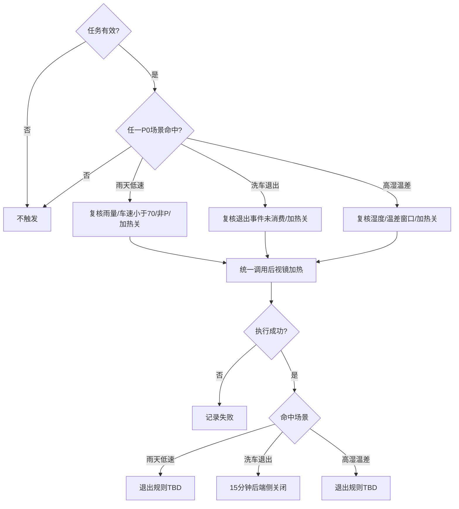

### 7.7.6 待决策

1. 场景三采用时间窗口还是里程窗口；
2. 温度差使用哪两个时间点/传感器；
3. 场景一是条件失效立即关闭，还是完成固定加热周期；
4. 场景三最长运行时间和退出条件；
5. 三场景同时命中的去重键和归因；
6. 任务中心是否允许删除。当前Task Center通用PRD与8月27日纪要存在冲突；
7. 失败是否静默，还是写入用户可见任务记录。

### 7.7.7 验收用例

| 编号 | 前置/事件 | 预期 |
|---|---|---|
| MIR-01 | 下雨、69km/h、非P、加热关 | 开启一次 |
| MIR-02 | 下雨、70km/h | 按“小于70”不触发 |
| MIR-03 | 下雨、P档 | 不触发 |
| MIR-04 | 洗车退出新事件 | 开启并运行15分钟 |
| MIR-05 | 重复上报同一洗车事件 | 不重复开启或重置计时 |
| MIR-06 | 湿度61%、温差大于5℃且窗口满足 | 开启一次 |
| MIR-07 | 湿度60%或温差等于5℃ | 按“大于”不触发 |
| MIR-08 | 任务关闭 | 三场景均不触发 |
| MIR-09 | 加热已开启 | 不重复调用 |
| MIR-10 | 云端断网 | 本次不触发，任务开关保持原状态 |

## 7.8 任务四：识别充电设备后打开充电口盖

### 7.8.1 用户故事

作为低电量并准备充电的驾驶员，当车辆停下且附近存在充电设备时，我希望系统主动识别场景，并在满足授权要求后为我打开充电口盖。

### 7.8.2 当前唯一链路基线

```text
Trigger检测前置条件满足
→ 主动推荐携带Query，例如“帮我看一下有没有充电桩，如果有的话打开充电口”
→ 主动推荐调用DT
→ 端侧上行，请求/拉取DT推理结果
→ 端侧执行
```

本PRD不再把“是否另走Planner/Director或Trigger直接拉卡”作为候选架构。评审只补齐现有链路的输入、输出、交互位置、异常和Owner。

### 7.8.3 当前状态

- 【已确认】任务中心独立开关，默认开启；
- 【已确认】Trigger先判断AI主动服务开关、P档变化、SOC和充电口盖状态；
- 【已确认】Trigger向主动推荐发送带业务目标的Query；
- 【已确认】主动推荐调用DT；
- 【已确认】端侧上行并请求/拉取DT推理结果；
- 【已确认】最终由端侧执行打开充电口盖；
- 【已确认】云端链路，弱网无法提醒可接受；
- 【当前资料】固定TTS + 弱提醒卡 + 二次确认，10秒无操作消失；
- 【P0待决策】二次确认在主动推荐调用DT之前，还是DT结果成功之后。

### 7.8.3.1 充电口盖任务链路图

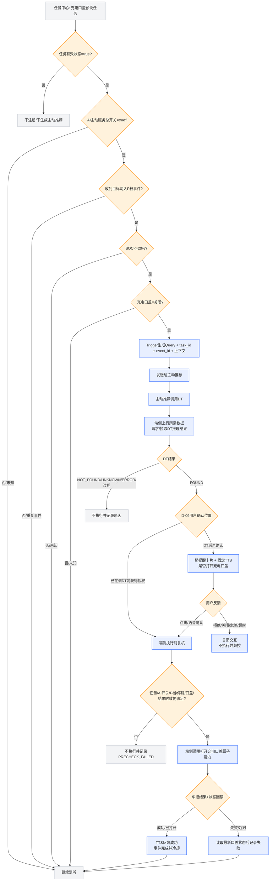

### 7.8.3.2 场景与原子能力表

| 原子能力类型 | 原子能力名称/ID | 状态或参数 | 资料状态 |
|---|---|---|---|
| 任务门禁 | 任务有效状态ID待提供 | `task_enabled=true` | 任务中心ID待确认 |
| 条件① | AI主动服务总开关ID待提供 | 开关=true | 业务条件明确，正式ID待提供 |
| 触发器 | `tri_gear`是否复用待确认 | 目标切入P档事件 | 触发语义明确，正式ID/来源待确认 |
| 条件② | SOC字段ID待提供 | `SOC<=20%` | 阈值已写入当前方案，字段ID待提供 |
| 条件③ | 充电口盖状态ID待提供 | 口盖=关闭 | 正式ID待提供 |
| 动作① | Trigger→主动推荐接口ID待提供 | 发送Query、task_id、event_id、上下文 | 当前链路已确认，接口待补 |
| 动作② | 主动推荐→DT工具ID待提供 | 调用DT | 当前链路已确认，工具注册ID待补 |
| 触发/反馈 | DT推理结果事件ID待提供 | FOUND/NOT_FOUND/UNKNOWN/ERROR+有效期 | 结果协议待技术评审 |
| 动作③ | `act_popup` / `act_TTS`是否复用待确认 | 弱提醒卡片+固定TTS | 仅需二次确认时使用 |
| 反馈 | `tri_popup`或云端交互结果ID待确认 | 确认/拒绝/关闭/忽略/超时 | D-09待确认 |
| 动作④ | 打开充电口盖原子能力ID待提供 | OPEN | 端侧车控ID和参数待提供 |
| 结果反馈 | 充电口盖状态/车控结果ID待提供 | SUCCESS/FAILED/TIMEOUT+最新状态 | 待赛力斯提供 |

### 7.8.3.3 数据来源

| 数据项 | ID/字段 | 来源类别 | 当前状态 |
|---|---|---|---|
| 任务有效状态 | 正式ID待任务中心提供 | 任务中心 | ID待确认 |
| AI主动服务总开关 | 正式ID待提供 | 端状态/主动服务系统 | ID待确认 |
| 档位切入P | `tri_gear`是否复用待确认 | 赛力斯端状态·事件 | 转换来源和event_id待确认 |
| SOC | 正式ID待提供 | 赛力斯端状态 | ID、精度和更新时间待确认 |
| 充电口盖状态 | 正式ID待提供 | 赛力斯端状态 | ID待确认 |
| 主动推荐Query | Trigger→主动推荐接口 | 字节Trigger | 字段建议已给，正式接口待确认 |
| DT推理结果 | DT结果事件/接口ID待提供 | 字节DT + 端侧上行 | 结果协议和有效期待确认 |
| 用户确认 | 卡片/语音结果ID待确认 | VUI/主动推荐 | D-09待确认 |
| 车控结果 | 打开充电口盖结果ID待提供 | 赛力斯车控 | 错误码和状态回读待确认 |

### 7.8.3.4 事件清单

| 事件 | 原子能力表ID | 来源 | 变更/穿越条件 | 命中后的下一步 |
|---|---|---|---|---|
| 档位切入P | `tri_gear`是否复用待确认 | 端状态·事件 | 目标档位变为P；来源档位D-08待定 | 判断任务、AI开关、SOC和口盖 |
| SOC阈值满足 | SOC字段ID待提供 | 端状态 | `SOC<=20%` | 作为P档事件的条件，不单独重复推荐 |
| 主动推荐创建 | 接口ID待提供 | Trigger | 前置条件全部满足且event_id未消费 | 发送Query并调用DT |
| DT结果返回 | 结果ID待提供 | DT/端侧 | FOUND/NOT_FOUND/UNKNOWN/ERROR | FOUND进入授权/执行，其余结束 |
| 用户正反馈 | 交互ID待确认 | VUI/语音 | 无→确认 | 执行前复核 |
| 用户负反馈 | 交互ID待确认 | VUI/语音 | 无→拒绝/关闭/忽略/超时 | 不执行并频控 |
| 口盖状态变化 | 状态ID待提供 | 端状态 | CLOSED→OPEN | 去重或确认车控成功 |
| 车控结果 | 结果ID待提供 | 赛力斯车控 | SUCCESS/FAILED/TIMEOUT | 状态回读并收口事件 |

### 7.8.3.5 信号清单

| 信号 | SourceID | 类型 | 值域/说明 |
|---|---|---|---|
| AI主动服务总开关 | SourceID待提供 | bool | true/false/unknown |
| 档位 | `tri_gear`/正式SourceID待确认 | event+enum | P/R/N/D；触发来源档位待确认 |
| SOC | SourceID待提供 | number | 0–100%；本期条件`<=20` |
| 充电口盖状态 | SourceID待提供 | enum | OPEN/CLOSED/OPENING/UNKNOWN |
| DT推理结果 | DT结果SourceID待提供 | struct/event | result、confidence、valid_until、suggested_action、event_id |
| 用户交互结果 | SourceID待确认 | event | CONFIRM/REJECT/CLOSE/IGNORE/TIMEOUT |
| 车控结果 | SourceID待提供 | struct/event | SUCCESS/FAILED/TIMEOUT/UNSUPPORTED+error_code |
| 任务有效状态 | 任务中心ID待提供 | bool | true/false/unknown |

### 7.8.3.6 进入与退出逻辑

| 阶段 | 条件 | 系统动作 |
|---|---|---|
| 进入候选 | 任务有效 AND AI总开关开启 AND 目标切入P AND SOC<=20 AND 口盖关闭 | 生成一次带event_id的主动推荐Query |
| 模型判断 | 主动推荐调用DT，端侧上行并获得当前event_id结果 | FOUND继续；其他结果结束 |
| 用户授权 | 按D-09在DT前或DT后获得确认 | 未授权、拒绝或超时均不执行 |
| 执行复核退出 | 任务/AI开关关闭、切出P、车辆未停稳、口盖已开、DT结果过期 | 终止本次，不执行 |
| 动作完成 | 口盖打开成功或状态回读已开 | 结束事件并进入频控 |
| 功能退出 | 本任务不自动关闭充电口盖 | 后续关闭由用户或既有车辆策略负责 |

### 7.8.4 Trigger前置条件

需求编号：`CHG-RULE-001`，优先级P0。

```text
task_enabled = true
AND ai_proactive_service_enabled = true
AND gear发生目标P档变化
AND SOC <= 20%
AND charge_port_state = CLOSED
→ 生成一次主动推荐Query
```

【P0待决策】“变更为P档”是否要求R→P，还是D/R/N任意切入P都满足。

【P0待决策】固定`SOC <= 20%`与“低于用户习惯补电水平”口径不一致。V1建议先使用固定阈值，个性化阈值进入后续版本。

### 7.8.5 Query产品契约

自然语言Query用于告诉主动推荐“用户目标是什么”，但不能只传一句自然语言。为保证结果可追踪，建议同时传结构化上下文。

```json
{
  "task_id": "preset_charge_port_open",
  "event_id": "唯一事件ID",
  "query": "帮我看一下有没有充电桩，如果有的话打开充电口",
  "trigger_time": "时间戳",
  "context": {
    "task_enabled": true,
    "ai_proactive_service_enabled": true,
    "gear": "P",
    "soc": 19,
    "charge_port_state": "CLOSED"
  }
}
```

以上为产品字段建议，最终字段名由主动推荐/DT技术评审确认。

### 7.8.6 DT结果契约

DT结果至少应让端侧区分：发现充电设备、未发现、无法判断、结果过期和系统失败。

```json
{
  "task_id": "preset_charge_port_open",
  "event_id": "与Trigger事件一致",
  "result": "FOUND | NOT_FOUND | UNKNOWN | ERROR",
  "confidence": 0.0,
  "result_time": "时间戳",
  "valid_until": "结果有效期",
  "suggested_action": "OPEN_CHARGE_PORT | NONE",
  "reason_code": "可选原因码"
}
```

要求：

- `NOT_FOUND`、`UNKNOWN`、`ERROR`、结果过期均不得打开充电口盖；
- event_id必须与本次Trigger事件一致，避免旧结果误执行；
- 端侧执行后将车控结果回传到统一日志链路；
- DT结果有效期【P0待决策】；
- 是否需要置信度阈值及阈值归属【P0待决策】。

### 7.8.7 二次确认位置

系统生成的Query不等于用户已经同意开盖。必须选择以下一种产品路径：

**方案A：用户先授权，再调用DT。**

```text
Trigger命中
→ 主动推荐询问用户是否帮忙识别并开盖
→ 用户同意
→ 主动推荐携Query调用DT
→ DT结果满足
→ 端侧复核并执行
```

优点：DT调用前已有用户授权。缺点：尚未识别到充电设备就先打扰用户。

**方案B：DT识别成功后，再询问用户。【产品建议】**

```text
Trigger命中
→ 主动推荐携Query调用DT
→ DT识别到充电设备
→ 固定TTS + 弱提醒卡询问用户
→ 用户确认
→ 端侧复核并执行
```

优点：只有确认附近存在充电设备才打扰用户。缺点：需要明确DT结果如何触发VUI卡片。

没有评审结论前，不允许默认“Query中写了打开充电口”就直接视为用户授权。

### 7.8.8 完整时序

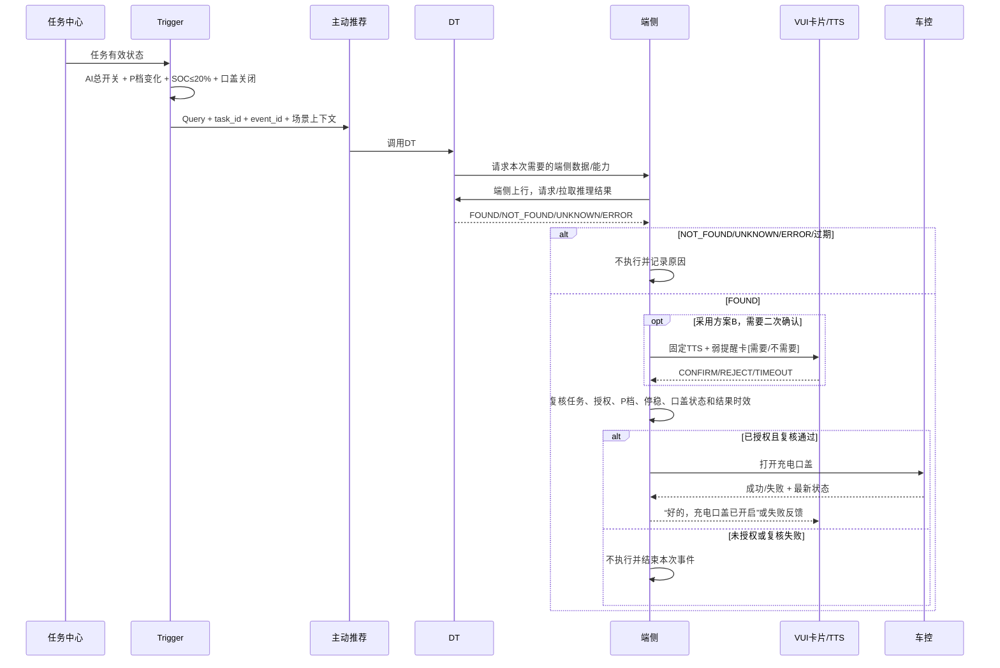

### 7.8.9 卡片建议

- TTS：你可能在充电桩附近，要打开充电口吗？
- 按钮：需要 / 不需要；
- 10秒无操作或点击卡片外区域：卡片消失，本次不执行；
- 成功TTS：好的，充电口盖已开启；
- 失败文案【P1待完善】；
- 点击和语音如何回到端侧执行节点【P0待决策】。

### 7.8.10 执行前复核

端侧执行前至少检查：

- task_enabled仍为true；
- AI主动服务总开关仍为true；
- 当前仍为P档且车辆停稳；
- 充电口盖仍为关闭；
- DT结果属于当前event_id且未过期；
- 已获得评审要求的用户授权；
- 车辆配置支持充电口盖原子能力。

### 7.8.11 异常处理

- DT未识别、无法判断或结果过期：不出车控；
- 端侧上行失败：本次结束或有限重试，策略TBD；
- 用户拒绝或超时：不执行，进入频控；
- 用户确认后切出P档：不执行；
- 充电口盖已被用户手动打开：不重复执行，按成功状态结束；
- 车控超时：先读取口盖最新状态，再决定是否标记成功或失败；
- 弱网：本次不提醒、不执行，不改变任务中心开关；
- 同一P档事件只生成一个主动推荐Query。

### 7.8.12 验收用例

| 编号 | 前置/事件 | 预期 |
|---|---|---|
| CHG-01 | 任务开、AI开、切P、SOC19、口盖关、DT FOUND、已授权 | 端侧打开口盖一次 |
| CHG-02 | 任务关 | 不生成Query |
| CHG-03 | AI主动服务关 | 不生成Query |
| CHG-04 | SOC20 | 按`<=20`生成Query |
| CHG-05 | SOC21 | 不生成Query |
| CHG-06 | 口盖已开 | 不生成Query/不执行 |
| CHG-07 | DT NOT_FOUND | 不出卡或不执行，取决于确认方案 |
| CHG-08 | DT UNKNOWN/ERROR | 不执行 |
| CHG-09 | DT结果过期 | 不执行 |
| CHG-10 | 用户拒绝/10秒超时 | 不执行并频控 |
| CHG-11 | 用户确认后切出P档 | 执行前复核失败 |
| CHG-12 | 重复P档/重复event_id | 只生成一个Query、只执行一次 |
| CHG-13 | 端侧上行失败 | 不误执行并记录失败节点 |
| CHG-14 | 车控返回超时但口盖已开 | 状态回读后按成功收口，不再次开盖 |

## 7.9 接口产品契约

以下只定义影响产品行为的字段，不限制研发内部实现。

### 7.9.1 任务中心 → Trigger状态事件

```json
{
  "task_template_id": "preset_weather_protection",
  "event_id": "唯一事件ID",
  "action": "ENABLE | DISABLE | DELETE | RESTORE",
  "target_state": "ENABLED | DISABLED",
  "version": 1,
  "event_time": "时间戳"
}
```

要求：重复event_id幂等；旧version不能覆盖新version；DELETE/RESTORE是否开放取决于P0结论。

### 7.9.2 本地二次交互：Trigger → 端侧VUI【产品字段建议】

```json
{
  "task_id": "任务ID",
  "event_id": "触发事件ID",
  "rule_version": "规则版本",
  "interaction_route": "LOCAL_EDGE",
  "scene": "FOG | RAIN | SNOW | WEATHER_CLEAR | CHARGE_PORT",
  "tts": "固定播报文本",
  "card_title": "卡片标题",
  "buttons": [
    {"button_id": "CONFIRM", "text": "确认", "action_key": "业务确认动作"},
    {"button_id": "REJECT", "text": "取消", "action_key": "结束本次事件"}
  ],
  "expire_at": "确认窗口截止时间",
  "priority": "交互优先级"
}
```

本地链路要求：

1. VUI显示卡片和TTS后，按`button_id/text`注册本卡片的可见即可说；
2. 语音与点击必须汇聚成相同的`interaction_result`；
3. 卡片超时、消失或被抢占时，必须同步注销本次语音映射；
4. VUI只返回用户选择，不替Trigger做天气、档位或安全判断。

### 7.9.3 云端二次交互：业务方 → 主交互系统通知【产品字段建议】

```json
{
  "source": "SYSTEM_PRESET_TASK",
  "task_id": "任务ID",
  "event_id": "触发事件ID",
  "rule_version": "规则版本",
  "interaction_route": "CLOUD_MAIN_INTERACTION",
  "notification": {
    "tts": "播报文本",
    "card_title": "卡片标题",
    "buttons": [
      {"button_id": "CONFIRM", "text": "确认", "action_key": "业务确认动作"},
      {"button_id": "REJECT", "text": "取消", "action_key": "结束本次事件"}
    ]
  },
  "expire_at": "确认窗口截止时间",
  "callback_target": "交互结果回调方"
}
```

云端链路要求：

1. 端侧仍负责显示即时卡片和播放TTS；
2. 主交互/Planner为卡片动态建立选择能力，生命周期与本卡片绑定；
3. 用户语音确认、手动点击、拒绝、超时都要带原`task_id/event_id`回到业务方；
4. 主交互返回的是“用户选择”，不是车控成功；业务方仍须进入端侧执行前复核。

### 7.9.4 交互层 → Trigger/业务结果事件

```json
{
  "task_id": "任务ID",
  "event_id": "与触发一致",
  "rule_version": "与发起一致",
  "interaction_route": "LOCAL_EDGE | CLOUD_MAIN_INTERACTION",
  "interaction_result": "CONFIRM | REJECT | TIMEOUT | CARD_ERROR",
  "input_method": "TOUCH | VOICE | SYSTEM",
  "event_time": "时间戳"
}
```

### 7.9.5 端侧车控结果

```json
{
  "task_id": "任务ID",
  "event_id": "与触发一致",
  "action": "车控动作",
  "result": "SUCCESS | FAILED | TIMEOUT | UNSUPPORTED",
  "error_code": "赛力斯错误码",
  "latest_state": "动作后状态",
  "result_time": "时间戳"
}
```

## 7.10 可观测与埋点

每次事件至少记录以下节点：

1. 任务状态读取结果；
2. 输入信号及时间戳；
3. 规则命中或未命中的原因；
4. 去重/冷却结果；
5. 卡片请求、展示、点击、语音、拒绝和超时；
6. 主动推荐Query和DT调用结果；
7. 执行前复核结果；
8. 车控请求和真实状态回读；
9. 最终结果码和耗时。

建议核心指标：

| 指标 | 定义 |
|---|---|
| 条件命中次数 | Trigger规则命中的event数量 |
| 有效提醒率 | 实际展示卡片 / 准备提醒事件 |
| 用户接受率 | CONFIRM / 已展示卡片 |
| 执行成功率 | CONTROL_SUCCESS / 已发车控请求 |
| 复核拦截率 | PRECHECK_FAILED / 已确认或准备执行事件 |
| 重复拦截率 | DUPLICATED / 原始候选事件 |
| 误触发率 | 实车标注为不应触发的事件 / 全部触发事件 |
| 链路时延 | 条件命中到用户可见提示或车控完成的耗时 |

## 7.11 安全、隐私与降级

- 舱内儿童/宠物只上报完成业务所需的结构化结果，不在本需求中上传原始图像；
- 任何模型结果都必须支持`UNKNOWN`，不能强制二选一；
- 需要用户确认的车控不得因VUI失败降级为静默执行；
- 云端断网时不伪装成任务已执行；
- 车控结果以车辆真实状态回读为准，不能只看接口请求成功；
- 用户手动操作优先于系统任务；
- 所有任务必须支持按task_id关闭和停止下一次触发。

## 7.12 字节与赛力斯责任边界

| 工作项 | 字节 | 赛力斯 |
|---|---|---|
| 任务准入 | 判断是否属于系统预设任务，确定字节实现路径 | 提供业务需求、优先级和安全边界 |
| 任务中心接入 | 定义任务状态契约并联调 | 确认用户入口、车型和展示要求 |
| Trigger | 规则表达、部署、状态机、去重、日志 | 提供准确端状态、枚举、时间戳和Owner |
| VLM/DT | VLM、主动推荐、DT接入和结果协议 | 提供端侧数据上行和车辆能力 |
| VUI | TTS、卡片、队列、可见即可说/交互回流 | 确认业务文案和体验要求 |
| 车控 | 调用编排、结果处理和全链路观测 | 提供原子能力、错误码、状态回读和安全限制 |
| 验收 | 设计全链路测试并检查日志 | 提供实车、信号和车控环境共同验收 |

若同一任务由字节Trigger链路拉卡，赛力斯消息盒子不得重复拉同一张卡。

## 7.13 P0决策清单

| 编号 | 决策 | 建议Owner | 不确认的影响 |
|---|---|---|---|
| D-01 | 系统预设任务是否允许删除、如何恢复 | 郝晓伟 + 王泽民 | 任务中心与Trigger状态无法定稿 |
| D-02 | 任务状态事件和启动快照协议 | 任务中心 + Trigger | 重启或漏事件后可能错误触发 |
| D-03 | 天气卡片入口、按钮回调和可见即可说注销 | 徐洋 + 左晨 + Trigger | 天气只能开发前半段 |
| D-04 | 天气组合场景优先级和冷却 | 天气业务 + Trigger | 可能重复出卡 |
| D-05 | 儿童锁左右门、安全条件和手动关闭抑制 | 儿童锁业务 + 车控 | 存在安全与用户意图风险 |
| D-06 | VLM结果值域、有效期和多帧策略 | 丁彬 + Trigger | 宠物识别无法验收 |
| D-07 | 后视镜高湿温差窗口和退出条件 | 后视镜业务 + Trigger | 场景三无法实现 |
| D-08 | 充电Trigger Query、DT输入输出和event_id | 主动推荐/DT + Trigger | 链路无法联调 |
| D-09 | 充电二次确认位于DT前还是DT后 | 充电业务 + VUI + DT | 可能无授权执行或重复交互 |
| D-10 | 充电AI总开关与任务开关关系 | 充电业务 + 任务中心 | 开关行为不一致 |
| D-11 | 天气路面枚举、进入/退出防抖次数，以及动作总表与子场景动作冲突 | 天气业务 + Trigger + 车控 | 可能匹配不到信号、误触发或一次执行错误组合动作 |
| D-12 | 儿童锁采用“非P+静默”还是“切D+卡片/TTS”唯一口径 | 儿童锁业务 + SLS + Trigger + VUI | 上下游会实现两条互相冲突的链路 |
| D-13 | “静默直接执行的系统预设任务”是否属于主动服务分类 | 任务中心 + 主动服务架构Owner + 王泽民 | 儿童锁、后视镜在产品分类和交互规则上不一致 |

---

# 8. Release｜发布计划

## 8.1 阶段划分

### 阶段0：评审收口

- 完成D-01至D-13的P0决策；
- 为每个接口确认Owner、输入、输出和错误码；
- 将决策回填《系统预设任务全集》；
- 产出技术方案和联调排期。

### 阶段1：天气完整闭环

- 保留已开发的Trigger前半段；
- 按SLS字段对齐`vision.outside.scene`、车速、驾驶模式、后雾灯和`tri_popup`；
- 将空调风量/温度模拟规则与量产规则分环境隔离；
- 补齐VUI拉卡、固定TTS、可见即可说、按钮回调；
- 补齐执行前复核、车控结果和卡片注销；
- 完成雾、雨、雪、恢复和卡片10秒/聆听生命周期验收。

### 阶段2：儿童锁与后视镜

- 儿童锁先关闭“非P静默”与“切D卡片/TTS”的版本冲突，再完成端状态、VLM协议和安全边界；
- 后视镜先确认第三场景窗口和退出条件；
- 根据D-12最终交互结论补齐儿童锁链路；儿童锁和后视镜统一日志、失败处理和用户手动操作保护；
- 完成断网、重复信号和车控超时验收。

### 阶段3：充电口盖

- 沿用Trigger → 主动推荐 → DT → 端侧上行/结果 → 端侧执行；
- 确认二次交互位置和任务开关关系；
- 联调Query、DT结果、端侧执行和结果回传；
- 完成弱网、误识别、过期结果和未授权执行拦截验收。

## 8.2 发布准入条件

只有同时满足以下条件才可发布：

1. P0决策全部关闭；
2. 四条任务信号Owner和车控Owner明确；
3. 正向、反向和异常P0用例全部通过；
4. 任务关闭、用户拒绝、结果未知和复核失败场景均无误执行；
5. event_id可串联任务状态、Trigger、交互、DT和车控日志；
6. 车控结果完成真实状态回读；
7. 车型/配置不支持时有明确降级；
8. 产品、Trigger、VUI/DT、赛力斯车控共同签字确认。

## 8.3 灰度与回滚

- 支持按车型、版本和任务ID灰度；
- 任一任务出现安全问题时，可单独关闭该任务，不影响另外三条；
- 配置规则必须有版本号和回滚能力；
- 回滚后Trigger重新读取任务状态和规则快照；
- 灰度期间重点监控误触发率、重复执行、车控失败和用户拒绝率。

## 8.4 会后产物

- 更新后的《系统预设任务全集》；
- 评审决策记录和Owner表；
- Trigger、任务中心、VUI/可见即可说、VLM、主动推荐/DT、车控接口文档；
- 联调环境和实车验收计划；
- 四任务发布检查表。

---

# 附录A｜评审时的讲解顺序

1. 先讲四条任务共用链路和任务中心边界；
2. 重点讲天气已经开发到哪里、还缺哪些后半段；
3. 儿童锁讲多源识别和安全边界；
4. 后视镜讲三个OR场景、窗口和退出；
5. 充电口盖只讲既有链路，不再讨论另起架构；
6. 最后逐项关闭D-01至D-13，记录结论、Owner和完成标准。

# 附录B｜一句话评审开场

> 今天要评审的不是四个场景名字，而是四条完整闭环：任务中心是否允许执行、Trigger如何判断、用户是否需要确认、谁执行车控，以及成功、失败、超时和恢复怎么处理。天气前半段已经开发，所以优先补齐后半段；充电口盖直接沿用主动推荐和DT现有链路。
