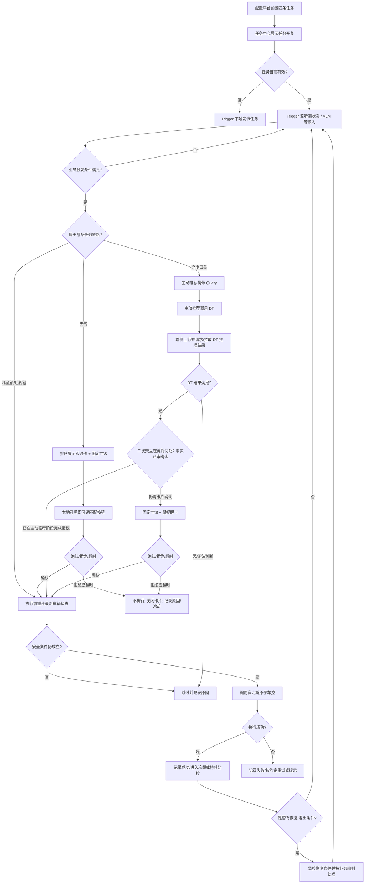
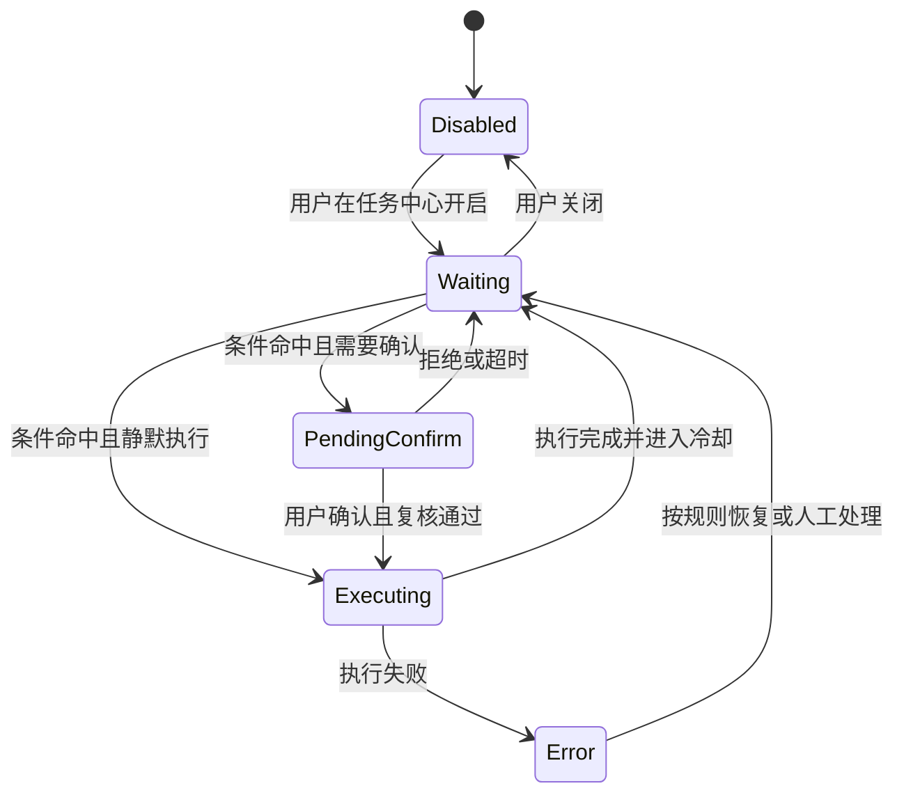
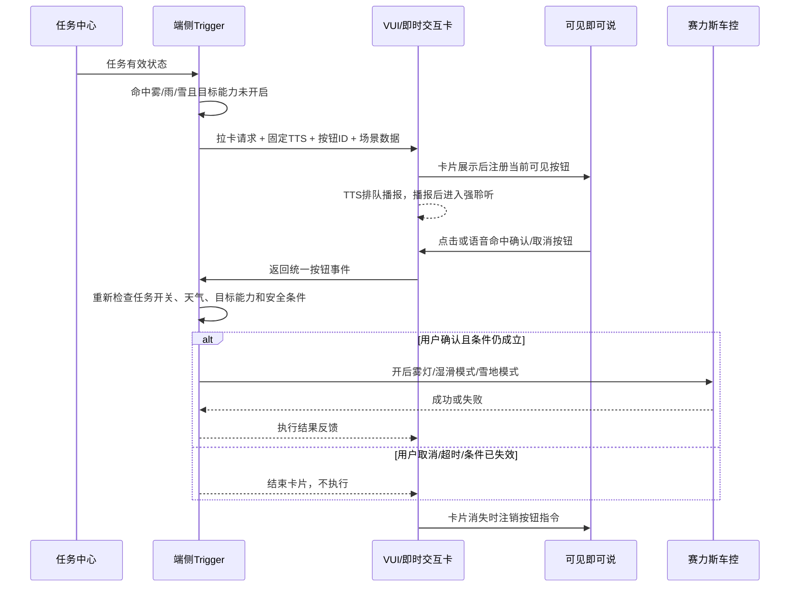
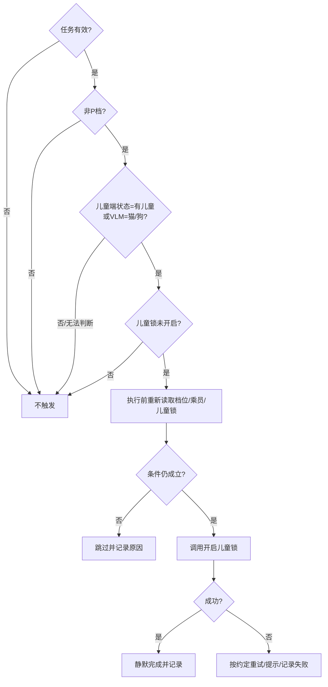
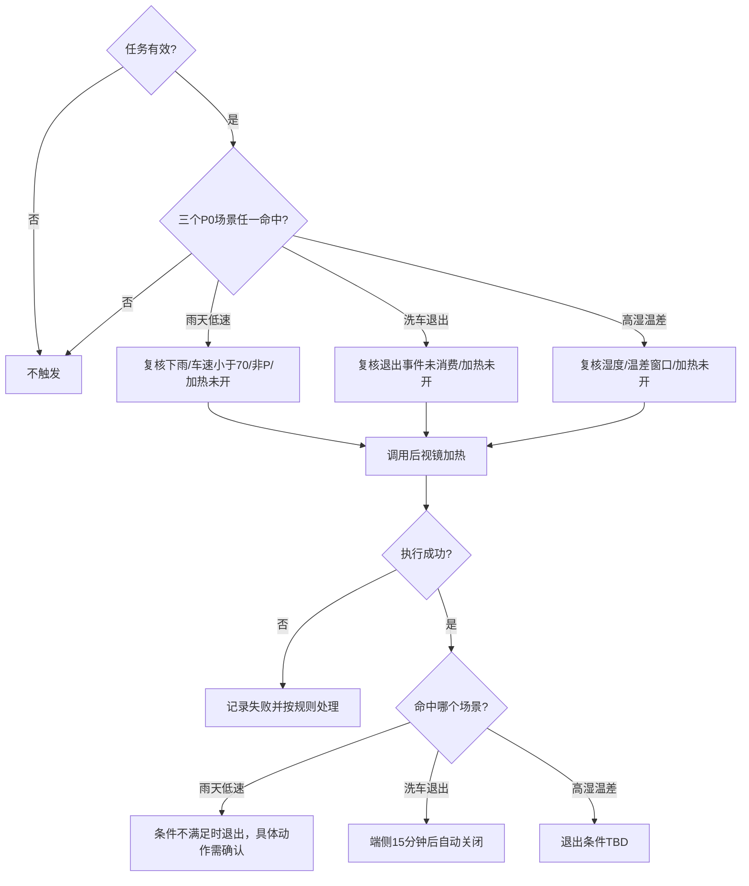
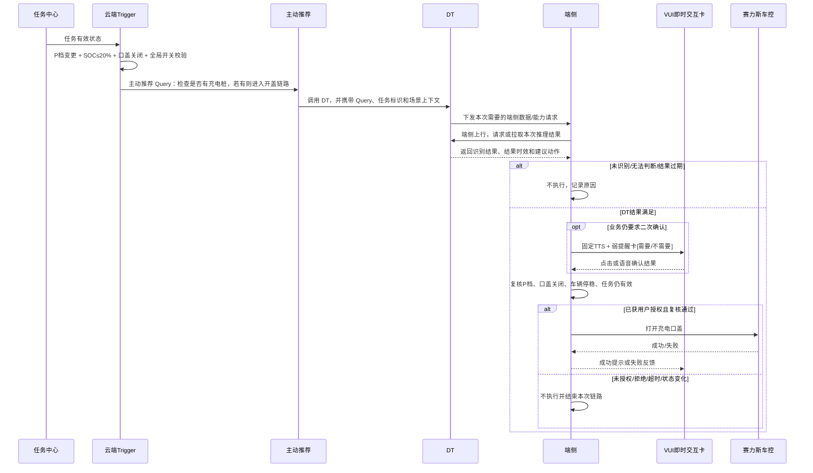

# 《系统预设任务全集》四条任务需求评审稿

> 版本：V0.2（充电口盖链路对齐版）  
> 日期：2026-09-01  
> 负责人：王泽民  
> 使用方式：先讲总链路，再逐条任务收口，最后逐项确认待决策和 Owner。  
> V0.2 变更：充电口盖按当前既有链路对齐为“Trigger → 主动推荐 Query → DT → 端侧上行/获取推理结果 → 端侧执行”，不再把“是否经过 Planner/Director”作为架构选项。

## 0. 结论先行

这次评审不能只讲“触发条件是什么”。四条任务要评审的是一条完整闭环：

> 任务中心是否允许执行 → 信号从哪里来 → 触发器如何判断 → 是否需要用户确认 → 谁拉卡和播报 → 用户点击/说话后谁解析 → 谁调用车控 → 成功、失败、超时和恢复如何处理。

四条任务当前分为两类：

| 类型 | 任务 | 用户交互 | 当前部署/链路判断 |
|---|---|---|---|
| 需要二次确认 | 天气/路况保护 | TTS + 即时交互卡 + 确认/取消 | 端侧自闭环；VUI 文档明确以天气为“本地可见即可说”示例 |
| 当前链路需补齐交互位置 | 识别充电设备后打开充电口盖 | 当前资料写有固定 TTS + 弱提醒卡；它位于 DT 前还是 DT 后需评审确认 | Trigger 前置条件 → 主动推荐携带 Query → 主动推荐调用 DT → 端侧上行并获取 DT 推理结果 → 端侧执行 |
| 静默直接执行 | 后排儿童/宠物识别后开启儿童锁 | 当前表格为无卡片、无固定 TTS | 混合信号输入；触发器规则判断后直接车控 |
| 静默直接执行 | 后视镜自动加热 | 当前表格为无卡片、无固定 TTS | 8 月 27 日评审纪要确认云端部署，三个 P0 场景 |

天气路况保护虽然触发器已经研发，但需求还不完整。当前缺的是：

1. 触发器命中后调用哪个“拉卡 + TTS”接口；
2. 卡片按钮由谁注册给可见即可说；
3. 点击与语音是否汇聚成同一个按钮事件；
4. 用户确认时是否重新检查任务开关、天气与车控状态；
5. 执行成功、失败、取消、超时如何反馈；
6. 卡片消失后如何注销语音指令；
7. 天气恢复后“关闭雾灯/恢复常用模式”的反向确认链路。

---

## 1. 资料与证据状态

| 资料 | 用途 | 本稿采用方式 |
|---|---|---|
| [《预设条件表 副本》—系统预设任务全集](https://bytedance.larkoffice.com/wiki/SorvwQ413iamTRkzSxvcVPWtnYc?sheet=g4s4FB) | 四条任务当前字段和分工 | 作为当前任务清单基线 |
| [预设任务需求评审智能纪要（2026-08-27）](https://sai-seres.feishu.cn/docx/NwRkdAlqko9BpSxg7NOcxJWzn3c) | 四条任务最新准入结论 | 后半段逐字记录无访问权限，因此标为“会议纪要确认”，不是逐字稿证据 |
| [天气路况保护 PRD V1.1](https://sai-seres.feishu.cn/wiki/VXEdwlChniB4lMkqQT9cPxPqnFh) | 雾、雨、雪触发、二次确认、恢复逻辑 | 作为天气业务原始需求 |
| [后视镜加热自动开启功能分析](https://sai-seres.feishu.cn/docx/YONCdzqKnoJkgxxyQOocAeb4nWg) | 后视镜各场景的开启/退出逻辑 | 与 8 月 27 日纪要交叉使用 |
| [补能管家 PRD V1.3](https://sai-seres.feishu.cn/wiki/CizBwOtzqil4R4kOcupcwjfLnkd) | 充电口盖的 Trigger、主动推荐、DT、端侧执行和交互需求 | 作为充电业务原始需求；本稿按当前确认链路修正，原文档内容较大，当前读取结果为截断正文 |
| [VUI 主交互需求](https://bytedance.larkoffice.com/wiki/FBsrwA734iaFzZkrZExcHHBtn3d) | 卡片、TTS、排队、强聆听、可见即可说、动态工具 | 作为交互链路当前定义 |
| [动态加载型工具技术方案](https://bytedance.larkoffice.com/wiki/T8jDwzwO9iiNF0kbFEVc1uyrnIf) | 充电口盖当前链路中的 DT 调用、端侧上行和推理结果承接 | DT 不替代 Trigger 的前置条件判断；两者是前后串联关系 |
| [可见即可说框架需求](https://bytedance.larkoffice.com/wiki/AxYjwUI8wiFCXWkdNsDcRae0nCf) | 本地按钮语音控制与责任边界 | 用于天气等强实时、本地闭环场景 |

标记规则：

- **已确认**：当前表格、正式 PRD 或会议纪要明确写出；
- **建议方案**：为补齐闭环提出，需评审确认；
- **TBD**：当前资料存在冲突、缺字段或未明确 Owner。

---

## 2. 评审目标

本次评审结束时，必须形成以下九个结论：

1. 四条任务是否正式准入，当前迭代做哪些子场景；
2. 每条任务在任务中心是否默认开启，是否允许关闭、删除、恢复；
3. 任务中心状态如何传给触发器，启动/重启时如何获得当前有效状态；
4. 每个触发信号的来源、枚举、更新时机、无效值和 Owner；
5. 触发规则、去重、冷却、退出和再次触发规则；
6. 执行动作、调用方、返回结果、失败处理和执行前复核；
7. 天气二次确认走本地链路；充电口盖沿用现有主动推荐 + DT 链路，并确认二次交互具体插入位置；
8. 卡片、TTS、排队/打断、超时和用户反馈规则；
9. 字节、赛力斯、任务中心、VUI、VLM、主动推荐/DT、端侧执行各自的 Owner 和交付物。

### 2.1 本次不需要评审的内容

- 不重新讨论“宠物模式”；8 月 27 日会议已决定转 Skill，不在本批四条任务内；
- 不让产品经理负责实际平台配置或实车导入；产品负责方案、字段完整性、Owner 协调和验收结论；
- 不深入讨论模型或 Trigger 内部代码，只讨论会影响产品行为、责任边界和验收的接口与状态。

---

## 3. 关键参与人

| 角色 | 建议参会人 | 本次要回答的问题 |
|---|---|---|
| 系统预设任务/触发器产品 | 王泽民 | 总链路、规则、准入、边界、验收 |
| 触发器研发 | 刘杨、尹振刚 | 规则、信号、部署、去重、执行回调是否可实现 |
| 任务中心 | 郝晓伟 | 预设任务开关/删除、事件回传、启动快照、task_id/模板 ID |
| VUI/卡片 | 徐洋 | 卡片入口、TTS、排队、卡片生命周期、点击/语音回流 |
| 可见即可说 | 左晨（并请其拉研发 POC） | 按钮注册、匹配、注销、模拟点击、执行反馈 |
| 主动推荐/DT | 张弛/对应研发 | 接收 Trigger 生成的 Query、调用 DT、明确端侧上行协议、推理结果结构和执行指令 |
| VLM | 丁彬 | 后排猫狗结果的上报方式、值域、频率、无法判断 |
| 天气需求 | 张景波 | 雾雨雪条件、文案、恢复规则、组合场景优先级 |
| 儿童锁需求 | 许圣义 | 左右门/整车锁策略、安全边界、失败反馈 |
| 后视镜需求 | 樊鹏宇 | 第三个场景阈值、三个场景退出条件 |
| 充电需求 | 刘多 | 主动推荐 + DT 既有链路、全局开关、二次确认位置和端侧执行边界 |
| 赛力斯端状态/车控研发 | 由四位业务产品拉齐 | 信号与原子能力、错误码、状态回读、执行安全条件 |

---

## 4. 统一模块边界

| 模块 | 在四条任务中的职责 | 不负责 |
|---|---|---|
| 配置平台 | 预置任务模板、规则和任务中心展示信息 | 不替代运行时判断 |
| 任务中心 | 展示任务、让用户开关/管理、把用户操作转给业务方 | 不判断天气、不识别宠物、不执行车控 |
| 触发器 | 消费任务有效状态和端/模型信号，判断规则是否命中，去重并发起动作 | 不负责卡片视觉、不负责云端自然语言泛化 |
| VLM/视觉推理 | 输出结构化识别结果或完成场景判断；充电口盖由 DT 链路承接推理结果 | 不替代 Trigger 的前置条件判断 |
| VUI/即时交互卡 | TTS、卡片展示、排队、强聆听、卡片生命周期 | 不替代业务触发规则 |
| 可见即可说 | 把“确认/取消”等语音匹配到当前页面按钮并模拟点击 | 不判断天气、不直接决定车控业务 |
| 主动推荐 + DT | 主动推荐接收 Trigger 生成的 Query 并调用 DT；DT 承接端侧上行、视觉/推理结果及后续执行信息 | 不替代 Trigger 对 P 档、SOC、口盖状态和任务开关的前置判断 |
| 赛力斯端状态/车控 | 提供车辆真实状态与原子能力，返回执行结果 | 不承担字节侧任务准入和 Trigger 配置 |

### 4.1 必须区分的两个“开关”

1. **任务中心中的任务开关**：决定这条预设任务是否有效；关闭后 Trigger 不应再触发该任务。
2. **车辆功能状态**：例如儿童锁是否已经开启、雾灯是否已经开启；用于避免重复执行。

它们不能混为一个字段。

### 4.2 任务状态同步建议

不能只依赖一次“开/关事件”，否则端重启或漏事件后可能状态错误。建议产品契约为：

- 用户开关时：任务中心发送带 `event_id`、任务标识、目标状态、版本/时间戳的事件；
- Trigger 收到后：幂等保存任务有效状态并返回处理结果；
- Trigger 启动/重连时：主动读取一次当前预设任务状态快照；
- 每次规则执行前：读取或使用已同步的最新任务有效状态；
- 删除是否允许、删除后如何恢复，是本次评审的 P0 决策。

任务中心 PRD 强调任务中心只是事件转发和展示，真实执行状态由业务方维护。因此四条任务的“已开/已关/执行失败”不能只靠任务中心页面自己猜。

---

## 5. 四条任务共用总流程图



### 5.1 预设任务运行状态图



注意：系统预设任务通常是长期存在的规则，不是执行一次就“完成并删除”。一次动作完成后，应回到等待下一次触发；是否支持永久删除仍需任务中心评审决定。

---

## 6. 任务一：天气/路况保护

### 6.1 一句话场景

系统识别前方雾、雨或雪，在对应车辆能力尚未开启时，用卡片和 TTS 询问用户；用户确认后开启后雾灯、湿滑模式或雪地模式。

### 6.2 当前已确认

| 项目 | 当前结论 |
|---|---|
| 任务中心 | 独立任务开关，出厂默认开启 |
| 部署 | 端侧自闭环，强实时 |
| 信号 | 天气/VLM标签、车辆状态、目标能力状态 |
| 子场景 | 雾 → 后雾灯；雨 → 湿滑模式；雪 → 雪地模式 |
| 交互 | TTS + 即时交互卡 + 用户二次确认；正常排队 |
| 二次语音 | VUI 当前文档明确将天气列为本地可见即可说示例，不经过 Planner |
| 已开启判断 | 后雾灯/湿滑模式/雪地模式已开启时，不再重复触发 |
| 生命周期 | 原 PRD 写“一个上电周期内有效”；熄火后再次启动重新判断 |
| 恢复 | 识别恢复晴天后，再次询问用户是否关闭雾灯/恢复常用模式 |

### 6.3 触发逻辑

雾天：

```text
天气路况保护任务有效
AND 识别结果 = 雾天
AND 后雾灯 = 未开启
→ 询问是否打开后雾灯
```

雨天：

```text
天气路况保护任务有效
AND 识别结果 = 雨天
AND 湿滑模式 = 未开启
→ 询问是否切换湿滑模式
```

雪天：

```text
天气路况保护任务有效
AND 识别结果 = 雪天/路面有雪
AND 雪地模式 = 未开启
→ 询问是否切换雪地模式
```

原 PRD 中“前方 300m”仍标为 TBD，不能在评审时讲成已确定能力。

### 6.4 研发正在做的前半段

```text
读取任务有效状态
→ 接收天气/车辆状态
→ 判断雾、雨、雪子场景
→ 判断目标能力是否已经开启
→ 输出“需要拉起哪一个子场景卡片”的动作
```

### 6.5 本次必须补齐的后半段



### 6.6 建议卡片数据

| 字段 | 雾天示例 | 作用 |
|---|---|---|
| `task_template_id` | weather_protection | 关联任务中心预设任务 |
| `scene_id` | fog / rain / snow / restore | 区分子场景和恢复场景 |
| 标题/正文 | 检测到前方有雾 | 用户理解为什么询问 |
| TTS | 前方行驶有雾，是否打开后雾灯？ | 固定播报 |
| 确认按钮 | `confirm_open_fog_lamp` | 映射明确动作 |
| 取消按钮 | `cancel` | 不执行 |
| 失效时间 | 当前 VUI 默认卡片 TTS 后 10 秒退出 | 到期后不得再把普通话语解释成确认 |
| 业务快照 | 识别类型、目标状态、时间戳 | 执行前复核、日志定位 |

### 6.7 天气任务 P0 待决策

1. Trigger 调用的是哪一个字节侧直接拉卡接口？谁提供协议？
2. 卡片按钮是 VUI 自动扫描还是调用方显式注册给可见即可说？
3. VUI 卡片 TTS 结束 10 秒后消失，但强聆听持续 30 秒：第 11～30 秒的“好的”应视为普通 Query，还是仍可确认？建议卡片消失即注销，不再确认。
4. 用户确认后、车控前需要复核哪些状态？建议至少复核任务有效、天气仍成立、目标能力仍未开启。
5. 用户取消/超时后多久允许再次提醒？“一个上电周期内有效”是否代表本上电周期不再重复？
6. 雾、雨、雪同时识别时如何排序？原 PRD 说复合场景因安全不合并，但没有给出优先级。
7. 车控成功、失败是否需要 TTS/Toast？由谁生成文案？
8. 恢复晴天后的关闭/恢复操作是否也走完全相同的卡片确认链路？
9. 拉卡排队期间天气已恢复或用户已手动开启目标能力，卡片是否撤销？建议出队展示前再校验一次。

---

## 7. 任务二：后排儿童/宠物识别后开启儿童锁

### 7.1 一句话场景

车辆已经离开 P 档，后排存在儿童或猫狗，且儿童锁尚未开启时，系统直接开启儿童锁，减少后排误开车门风险。

### 7.2 当前已确认

| 项目 | 当前结论 |
|---|---|
| 任务中心 | 独立开关，默认开启 |
| 儿童信号 | 赛力斯 OMS/SLS 自研识别，通过端状态上报 |
| 宠物信号 | 字节 VLM 提供后排猫/狗结果，具体上报方式待与丁彬确认 |
| 条件 | 非 P 档 AND 后排儿童/猫/狗 AND 儿童锁未开启 |
| 动作 | 直接开启儿童锁 |
| 交互 | 当前表格：无固定 TTS、无交互卡、静默执行 |

### 7.3 规则表达

```text
任务有效
AND 档位 != P
AND（儿童端状态 = 有儿童 OR 宠物VLM结果 = 猫/狗）
AND 儿童锁 = 未开启
→ 开启儿童锁
```

触发器只消费结构化结果，不处理原始舱内图片，也不负责判断“图里像不像宠物”。

### 7.4 流程图



### 7.5 P0 待决策

1. 后排儿童锁是左右门分别控制，还是一次开启两侧？信号能否定位座位/车门？
2. 开锁动作前是否必须增加后排车门关闭、车辆已起步/车速阈值等安全条件？当前表格未写。
3. VLM 输出需要明确值域：猫、狗、无人、其他、无法判断；“无法判断”必须不触发。
4. VLM 结果需要连续多少帧/多久才认为有效？如何避免宠物短暂遮挡造成反复触发？
5. 车控失败是否重试，重试次数和间隔是多少？
6. 当前写“排队等待”，但任务没有 TTS/卡片：这里的“排队”到底指车控执行队列还是误填，需要删清楚。
7. 静默执行是否需要一个轻提示音、状态 Toast 或任务记录？8 月 27 日会议把直接执行后的提示方式列为待讨论事项。
8. 用户手动关闭儿童锁后，如果条件仍成立，是否立即再次打开？需要定义抑制时间和用户意图优先规则。

---

## 8. 任务三：后视镜自动加热

### 8.1 一句话场景

在下雨低速行驶、退出传送带洗车或高湿度温差变化时，系统静默开启后视镜加热，改善视野。

### 8.2 当前已确认

| 项目 | 当前结论 |
|---|---|
| 范围 | 第一阶段只做三个 P0 场景 |
| 任务中心 | 一条总开关，默认开启 |
| 部署 | 8 月 27 日会议纪要确认云端部署；无网部分场景不触发可接受 |
| 交互 | 无固定 TTS、无卡片、静默执行 |
| VLM | 不依赖 |

### 8.3 三个 P0 场景

场景一：雨天中低速

```text
任务有效
AND 雨量传感器 = 下雨
AND 车速 < 70km/h
AND 档位 != P
AND 后视镜加热未开启
→ 开启后视镜加热
```

8 月 27 日会议纪要明确：原“雨刮持续刮刷 30 秒”因没有可用端状态而移除。

场景二：退出传送带洗车

```text
任务有效
AND 传送带洗车模式发生“退出”事件
AND 后视镜加热未开启
→ 开启一次后视镜加热
→ 由端侧运行 15 分钟后关闭
```

场景三：高湿度 + 温差

```text
任务有效
AND 环境湿度 > 60%
AND 行驶过程中温度差值 > 5℃
AND 后视镜加热未开启
→ 开启一次后视镜加热
```

“行驶过程中”的时间/里程窗口仍未确定，不能写死为 1 分钟。

### 8.4 流程图



### 8.5 P0 待决策

1. 第三个场景用“时间窗口”还是“行驶距离窗口”计算温差？字段和阈值是什么？
2. 场景一前提不满足时，是立即关闭加热，还是让端侧完成固定加热周期？原分析文档和表格仍需统一。
3. 场景三的退出条件/最长运行时间没有定义。
4. 三个场景同时命中时只执行一次，去重键和冷却时间是什么？
5. 云端部署下，断网时任务中心仍显示开启，但实际不会触发；是否需要向用户解释？会议纪要认为可接受，但验收仍要覆盖。
6. 当前 Task Center PRD 说所有任务都有删除能力，但 8 月 27 日纪要说本任务仅开关、不支持删除，必须由郝晓伟给出最终产品口径。
7. 车控失败是否静默，还是需要 Toast/任务记录？

---

## 9. 任务四：识别充电设备后打开充电口盖

### 9.1 一句话场景

车辆满足低电量、P 档、充电口盖关闭等前置条件时，Trigger 不直接识别充电桩，也不直接打开充电口盖，而是向“主动推荐”发送一个带业务目标的 Query；主动推荐调用 DT，端侧上行并获取 DT 推理结果，满足执行条件后由端侧打开充电口盖。

### 9.2 当前已确认

| 项目 | 当前结论 |
|---|---|
| 任务中心 | 当前表格为独立开关、默认开启 |
| 第一阶段规则 | AI 主动服务开启、变更为 P 档、SOC ≤ 20%、充电口盖关闭 |
| Trigger 输出 | 向主动推荐发送 Query，例如“帮我看一下有没有充电桩，如果有的话打开充电口” |
| DT 调用 | 由主动推荐调用 DT；不是 Trigger 自己直接调车控，也不是另起一条 Planner/Director 方案 |
| 视觉/推理 | 端侧上行并请求或拉取 DT 推理结果；具体请求字段和结果协议待技术评审补齐 |
| 交互 | 当前业务资料写有固定 TTS + 弱提醒卡和二次确认，但其在既有链路中的准确位置仍需确认 |
| 超时 | 补能 PRD 写明 10 秒无操作或点击卡片外区域后卡片消失 |
| 动作 | 到达执行节点且执行前复核通过后，由端侧打开充电口盖；成功后提示“充电口盖已开启” |
| 部署 | 8 月 27 日纪要初步确认云端；弱网无法提醒可接受 |

### 9.3 当前链路基线

当前应当按下面这条链路评审，不再讨论“是否改成 Trigger 直接拉卡/直接执行”：

```text
Trigger 检测前置条件满足
→ 主动推荐（携带 Query，例如“帮我看一下有没有充电桩，如果有的话打开充电口”）
→ 主动推荐调用 DT
→ 端侧上行，请求/拉取 DT 推理结果
→ 端侧执行
```

各模块的产品职责是：

1. **Trigger**：只负责判断任务是否有效以及 P 档、SOC、口盖关闭等前置条件；
2. **主动推荐**：接收 Trigger 生成的 Query，发起后续 DT 调用；
3. **DT**：根据 Query 组织需要的端侧能力和推理过程，产出本次结果；
4. **端侧**：完成数据上行/结果拉取，并在最终满足条件时执行打开充电口盖；
5. **VUI 交互**：如果仍要求用户确认，必须明确插在“DT 得出可执行结果”和“端侧执行”之间，或者证明用户授权已经在主动推荐阶段完成。

这里最关键的产品边界是：**系统自动生成的 Query 不等于用户已经同意开盖。** 如果业务仍要求二次确认，就不能因为 Query 中写了“如果有的话打开充电口”而直接视为用户授权。

### 9.4 完整时序图

实线部分是当前确认链路；“二次确认”是本次要补齐的位置：



这张图评审时不要再问“是否走 Director/VQA”。只问当前链路里每一段的输入、输出、负责人，以及二次确认准确放在哪里。

### 9.5 P0 待决策

1. 任务有效状态与“AI 主动服务总开关”是否都需要满足？若两者都需要，关闭任一开关均不提醒。
2. 触发条件中的“变更为 P 档”是否必须来自 R→P？普通 D→P 是否也可？
3. Trigger 发给主动推荐的 Query 是否使用固定模板？除自然语言外，是否必须带任务 ID、事件 ID、SOC、P 档、口盖状态和结果回调地址？
4. `SOC ≤ 20%` 与补能 PRD 中“低于用户习惯补电水平”不一致，本期到底采用固定阈值还是用户习惯？
5. 端侧具体上行什么数据、通过什么事件请求/拉取 DT 结果？DT 结果至少要不要包含“发现/未发现/无法判断、置信度、结果时间、建议动作、任务关联 ID”？
6. 二次确认到底发生在哪里：主动推荐先问用户再调 DT，还是 DT 识别成功后再出卡询问？必须二选一，不能靠系统生成 Query 代替用户授权。
7. 用户确认或端侧执行前必须复核 P 档、口盖仍关闭、车辆停稳、任务仍有效；DT 识别结果的有效期是多少？
8. DT 超时、端侧上行失败、结果无法判断、弱网时，一律不执行还是允许重试？谁维护重试和频控？
9. 用户拒绝后“降低推荐频次”如何定义，属于本期吗？谁维护频控？
10. 当前表格“字节负责内容”为空，必须补齐 Trigger、主动推荐、DT、VUI、端侧执行和结果回传的具体 Owner。

---

## 10. 四条任务交互对照表

| 任务 | 出卡 | TTS | 语音承接 | 点击承接 | 用户不回应 | 执行结果 |
|---|---|---|---|---|---|---|
| 天气路况保护 | 是 | 固定 TTS | 本地可见即可说；卡片消失即注销 | 直接按钮事件 | 不执行；超时/冷却待确认 | 成功/失败反馈方式 TBD |
| 儿童锁 | 否 | 否 | 不适用 | 不适用 | 不适用 | 当前静默；提示音/Toast 待确认 |
| 后视镜加热 | 否 | 否 | 不适用 | 不适用 | 不适用 | 当前静默；失败反馈待确认 |
| 充电口盖 | 当前资料写“是”，但插入位置待确认 | 固定 TTS + 弱提醒 | 随主动推荐 + DT 既有链路确定 | 确认/拒绝按钮 | 若保留卡片，10 秒关闭且不执行 | 成功 TTS 已有文案，失败文案待确认 |

### 10.1 VUI 生命周期冲突必须单独问

VUI 当前规则：

- TTS 播报结束后，卡片默认 10 秒无交互退出；
- 延时/强聆听默认持续 30 秒；
- 如果充电二次确认仍由 VUI 卡片承接，卡片确认窗口和 DT 推理结果有效期必须分别定义，不能默认两者天然一致。

所以评审必须明确：卡片消失后的 20 秒内，用户再说“好的”，不能继续执行已经消失的卡片动作。建议统一规则为：

> 卡片消失 = 二次确认窗口结束 = 可见即可说词条或云端动态工具立即注销。

---

## 11. 字节与赛力斯责任边界

| 内容 | 字节负责 | 赛力斯负责 |
|---|---|---|
| 需求准入 | 评估是否属于系统预设任务、确认实现路径和排期 | 提供完整业务 PRD、优先级和安全边界 |
| 任务中心 | 接入和展示方案、开关事件/状态契约 | 确认车辆侧任务入口/文案体验需求 |
| Trigger | 规则表达、部署、去重、执行前复核、触发日志 | 提供准确端状态、枚举、更新时机和 Owner |
| 感知 | 字节 VLM、主动推荐/DT 接入与结果协议 | OMS/SLS 自研儿童信号、车辆传感器信号及端侧上行能力 |
| 交互 | VUI、卡片接口、TTS、可见即可说/动态工具 | 业务文案、按钮语义、UI/UX评审输入 |
| 执行 | 调用链路、结果处理、可观测 | 提供车控原子能力、错误码、状态回读、安全限制 |
| 验收 | 全链路用例、日志、状态一致性 | 实车环境、信号与车控能力验证 |

原则：四条任务若由字节规则/Trigger 链路承接，就应由字节拉卡；赛力斯不要再通过消息盒子重复拉同一张卡，避免用户看到两次提醒。

---

## 12. 评审时要画的五张图

### 图 1：责任边界图

横向画两类链路：任务中心 → Trigger → VLM/VUI/车控；以及充电专用的 Trigger → 主动推荐 → DT ↔ 端侧 → 车控。纵向标字节/赛力斯 Owner。目的不是展示技术，而是确定每一箭头由谁交付。

### 图 2：四任务共用总流程

使用第 5 章流程图，重点展示“静默执行”和“二次确认”分支。

### 图 3：天气完整时序图

使用第 6.5 节时序图。这是本次最重要的一张图，因为研发已在做前半段，后半段没有讨论。

### 图 4：四条任务各自规则图

每条只画一张小图：输入信号 → AND/OR 判断 → 执行动作 → 退出/冷却。后视镜要把三个 OR 场景拆开；充电要把 Trigger 前置条件与“主动推荐 → DT → 端侧结果”拆成前后两段。

### 图 5：验收矩阵

每条任务至少覆盖：正常命中、任务关闭、条件不满足、目标状态已开启、执行前状态变化、车控失败、重复上报、断网/重启。

---

## 13. 最小验收矩阵

| 任务 | 正向用例 | 必测反例/异常 |
|---|---|---|
| 天气 | 任务开 + 雾/雨/雪 + 目标未开 + 用户确认 → 正确车控 | 任务关；目标已开；用户拒绝；10 秒超时；卡片排队时天气恢复；车控失败；雾雨雪同时命中 |
| 儿童锁 | 非 P + 儿童/猫狗 + 锁未开 → 开锁 | P 档；无人；VLM 无法判断；锁已开；用户刚手动关闭；左右门不一致；车控失败 |
| 后视镜 | 三个 P0 场景分别命中 → 开启 | 70km/h 边界；P 档；湿度 60%/温差 5℃边界；洗车退出重复事件；断网；加热已开；退出条件 |
| 充电口盖 | 任务开 + P + 低电 + 口盖关 → 主动推荐携 Query → 调 DT → 端侧拿到有效结果 → 已获授权且复核通过 → 开盖 | DT 未发现/无法判断/超时；SOC 20/21 边界；非 P；口盖已开；任务关/全局开关关；未获授权；执行前状态变化；结果过期或误识别 |

所有用例都要检查：触发日志、用户交互事件、车控请求、车控结果、任务状态和是否重复触发。

---

## 14. 评审讲解顺序与话术

### 14.1 开场（1 分钟）

> 今天不是重新讨论这四个业务值不值得做，而是要把它们从任务中心开关、信号、Trigger 判断、二次交互到车控结果的完整闭环定下来。天气前半段已经开发，所以今天优先补齐后半段；另外把儿童锁、后视镜和充电口盖的准入、部署及依赖一次收口。

### 14.2 先讲总图（2 分钟）

> 四条任务共同的第一道门都是任务中心的任务有效状态。之后 Trigger 判断业务条件。儿童锁和后视镜当前按静默执行设计；天气走本地卡片确认；充电口盖则沿用“主动推荐 Query → DT → 端侧结果 → 端侧执行”的当前链路，今天只收口二次确认放在哪里以及各段接口。任务中心只管理和转发，不判断业务，也不执行车控。

### 14.3 重点讲天气（5 分钟）

> 天气 Trigger 当前做到的是识别雾雨雪、判断目标能力未开启并发起动作。还缺的链路是：Trigger 怎么拉卡、按钮怎么注册给可见即可说、确认事件怎么回到 Trigger、执行前怎么复核、车控失败怎么反馈、卡片消失怎么注销。本次希望徐洋、左晨和 Trigger 研发把这个协议和 Owner 定下来。

### 14.4 快速讲另外三条（每条 2～3 分钟）

- 儿童锁：重点问信号协议、安全边界、静默执行反馈和用户手动关闭后的抑制；
- 后视镜：重点问第三场景窗口、三个场景退出条件和删除口径；
- 充电口盖：不再讨论是否改走其他架构；重点确认 Trigger Query、主动推荐调 DT、端侧上行/结果协议、二次确认位置，以及任务开关和 AI 总开关的关系。

### 14.5 收口（3 分钟）

按下表逐项复述，不说“后面再聊”，必须留下 Owner：

| 决策 | 结论 | Owner | 完成条件 |
|---|---|---|---|
| 任务中心开关/删除契约 | 评审填写 | 郝晓伟 + 王泽民 | 状态事件、启动快照、删除恢复明确 |
| 天气卡片入口 | 评审填写 | 徐洋 + Trigger研发 | 接口和请求字段明确 |
| 天气可见即可说接入 | 评审填写 | 左晨/研发 POC | 注册、匹配、注销、回调明确 |
| 天气执行与反馈 | 评审填写 | Trigger + 赛力斯车控 | 复核、错误码、用户反馈明确 |
| 儿童 VLM 上报 | 评审填写 | 丁彬 | 值域、频率、无法判断明确 |
| 后视镜第三场景 | 评审填写 | 樊鹏宇 + Trigger | 窗口、阈值、退出明确 |
| 充电既有链路补齐 | 评审填写 | 刘多 + 主动推荐/DT POC + 端侧 POC + 徐洋 | Query、DT 输入输出、端侧上行、二次确认位置、开关和结果回传明确 |

---

## 15. 王泽民会前、会中、会后具体做什么

### 会前

1. 把《系统预设任务全集》补充以下列：任务模板 ID、任务默认状态、是否可删除、部署位置、信号来源/Owner、触发规则、执行前复核、交互链路、超时/冷却、退出条件、车控返回、埋点、TBD/Owner。
2. 把第 5、6、7、8、9 章流程图贴入评审文档。
3. 对天气研发明确：当前只算“前半段开发中”，后续卡片和执行闭环尚未评审，暂不擅自假设接口。
4. 邀齐郝晓伟、徐洋、左晨/可见即可说研发、Trigger研发、丁彬、四位赛力斯需求产品和车控/端状态研发。

### 会中

1. 每条任务按“任务开关 → 信号 → 规则 → 交互 → 执行 → 结果 → 冷却/恢复”固定顺序讲；
2. 遇到争议先写两个选项和影响，再让 Owner 拍板；
3. 明确说“这条是当前文档事实”“这条是我的建议”“这条还没有结论”；
4. 每讲完一条，用一句话复述最终链路并记录 Owner。

### 会后

1. 当天更新《系统预设任务全集》的评审结论和待办；
2. 把天气后半段拆成独立需求：拉卡、可见即可说、按钮回调、车控复核、结果反馈、卡片注销；
3. 由研发/平台完成真实配置与接口实现，产品负责字段验收和全链路用例；
4. 在联调前组织一次“接口 + 状态机 + 异常用例”技术评审，不再重复业务背景。

---

## 16. 发布建议

### 第一阶段：先闭环天气

- 不改变已开发的 Trigger 前半段；
- 补齐本地拉卡、可见即可说、确认回调、执行复核和反馈；
- 覆盖雾、雨、雪和天气恢复四类场景；
- 完成卡片 10 秒与聆听 30 秒的边界验收。

### 第二阶段：儿童锁与后视镜

- 儿童锁先完成 VLM 上报协议和安全边界；
- 后视镜先定第三场景窗口和退出条件；
- 两条静默执行任务统一确定是否需要轻提示/任务记录。

### 第三阶段：充电口盖

- 沿用 Trigger → 主动推荐 → DT → 端侧上行/推理结果 → 端侧执行的既有架构，并对齐任务开关关系；
- 再补齐 Query、DT、端侧、VUI 与车控接口；
- 最后进入实车误触发和弱网验收。
