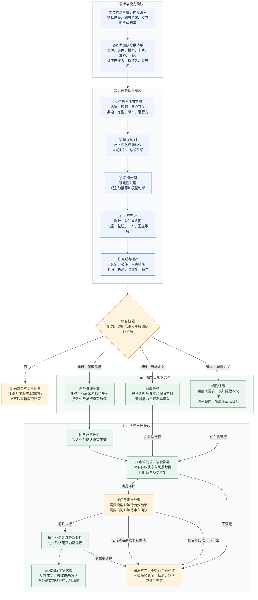

# 3. 系统预设任务整体配置框架

本章评审的是“如何用一套公共能力定义和交付系统预设任务”，不是分别为四个场景堆四套代码。产品统一写清任务的条件、交互、动作和完成标准；各模块确认哪些能配置、哪些需要补能力，再决定本期交付范围。

价值：已有能力可以组合复用；新增需求先查能力缺口，减少逐场景重复开发；任务启停、询问、执行和结果采用一致规则，避免只配好触发条件却接不通后半段。

## 3.1 现有基础与端云落地方式

现有入口为“AI汽车管理平台 → 触发器 → 场景管理”。目前已具备场景适用范围、动态/静态条件、后续动作、频控和触发记录，适合作为触发规则的配置基础。下表区分任务必须定义的内容和当前交付方式，不代表全部已经平台化。

云端：对已接入的状态和动作，可复用当前平台配置。端侧：目前仍由产品定义需求、端侧研发实现并随版本交付。统一在平台编辑并下发端云执行，属于后续目标，不能作为本期已具备能力。

<table><tbody>
<tr>
<td>

**能力**

</td>
<td>

**端侧任务**

</td>
<td>

**云端任务怎么落地**

</td>
</tr>
<tr>
<td>

选择已接入数据

</td>
<td>

选择可读信号与视觉结果，当前由端侧研发实现

</td>
<td>

引用可用端状态

</td>
</tr>
<tr>
<td>

编辑规则

</td>
<td>

产品定义与/或、阈值、变化事件、持续时间

</td>
<td>

已支持部分通过平台配置

</td>
</tr>
<tr>
<td>

选择后续处理

</td>
<td>

固定车控、调用本地卡片等由端侧任务业务承接

</td>
<td>

发起主动推荐/识别Query，或确定性动作链路

</td>
</tr>
<tr>
<td>

填写交互要求

</td>
<td>

需要文案、按钮、TTS、本地词条和返回业务；

</td>
<td>

需要推荐内容、交互等级、上下文、卡片后续行为

</td>
</tr>
<tr>
<td>

处理结果与退出

</td>
<td>

执行前复核、回读、取消、冷却均进入任务规格

</td>
<td>

补齐推理超时、过期结果、云端与端侧结果关联

</td>
</tr>
<tr>
<td>

验证并发布任务

</td>
<td>

当前跟随端侧交付；统一下发作为后续能力

</td>
<td>

配置校验后按现有发布流程生效

</td>
</tr>
</tbody></table>

## 3.2 整体配置框架

下面是本次专项评审的业务方案。配置平台保存“这项任务应如何工作”；任务中心让用户管理任务；运行模块按已确认的规则判断和处理。它们不是同一个模块。

读图重点：先确认可用能力，再填写完整任务定义，最后分别交给任务中心和端云运行团队。图中的“完整任务定义”是统一的产品交付要求，不等于现有平台已经拥有全部配置项或自动下发能力。

任务中心启停必须有真实结果：接入业务接收用户操作、保存启停结果，并让对应触发器获取真实状态；具体状态接入方式由任务业务与任务中心研发确认。后台场景启用、用户任务开启、语音播报开启是不同控制项，不能互相代替。

## 3.3 一项任务需要配置哪些内容

以下为完整配置模板的需求范围；“需补齐”表示应进入本次能力评审，具体页面和研发拆分在专项中确定。

| 配置模块 | 产品需要填写什么 | 配置后交给谁使用 | 当前基础与本次补齐点 |
|---|---|---|---|
| 任务信息与用户管理 | 名称、说明、默认状态、允许的用户操作、启停承接业务；明确一项任务包含哪些子场景 | 任务中心展示；接入业务真正启停任务 | 当前场景名称和后台启停不能替代用户任务管理；需补齐任务与场景的关联、真实状态来源 |
| 适用范围与运行位置 | 渠道、车型、软件版本、指定车辆；明确端侧还是云端负责触发，字节还是赛力斯承接 | 平台筛选范围；指定运行团队交付 | 范围筛选已有；端云归属和业务承接需确认。不能把“渠道”当成端云选择 |
| 触发事件与判断条件 | 哪个变化启动检查；检查哪些当前状态；比较值、单位及“同时满足/任一满足”关系 | 端侧或云端触发器判断 | 动态/静态条件、组内AND、组间OR、“等于/变更为”等可复用；具体信号及持续判断能力逐项确认 |
| 条件命中后的处理 | 选择已接入的确定性处理，或发起主动推荐并填写Query（交给下游处理的自然语言请求）；写清结果回来后如何继续 | 已选任务业务、主动推荐及模型工具 | Advisor、主动推荐、延时执行、自定义回调已有入口；不能据此认定任意车控和模型结果分支都已接入 |
| 卡片、TTS与二次确认 | 静默、仅告知或先询问；卡片内容、按钮含义、TTS播报内容、语音承接方式、等待期限与回答后的下一步 | 即时交互卡/VUI展示与播报；原任务业务或云端Planner处理用户回应 | 会议明确TTS、二次确认等配置能力尚需补齐；端侧本地确认和云端承接分别定义 |
| 执行、结果与退出 | 目标动作；执行前重查条件；怎样算实际成功；失败、超时、任务关闭、条件消失时如何结束 | 任务业务与端侧执行层复核；车控执行；业务读取状态并反馈 | 需补齐完整后续处理定义；回调成功、出卡成功都不能作为车辆执行成功 |
| 防重复与打扰控制 | 总次数、单次上电次数、自然日次数、最小间隔；按业务定义同一次停车/同一次场景如何避免重复 | 触发器和任务业务 | 通用次数与间隔已有；业务级去重、拒绝后的静默策略需确认，不能擅自写成“拒绝几次自动关闭” |
| 校验与交付记录 | 所需能力是否接入、适用范围、每一段承接团队、验收结果、交付版本、停止任务的方法 | 配置平台、端云研发、测试及接入业务 | 现有触发记录可复用；完整配置校验、端云共同发布和结果记录范围需专项确认 |

卡片对接要写清三个环节：业务提供问什么、按钮意味着什么、是否播报；卡片返回是否真正展示、用户选择以及关闭/超时等状态；业务决定是否执行，并把实际结果交回卡片。卡片不能替触发器判断天气，也不能把用户点击直接当成车辆已完成动作。

## 3.4 可配置的原子能力范围

原子能力，是可以被不同任务重复使用的一项判断或处理，例如“档位变更为P”“读取车速”“展示询问卡”“打开充电口盖”。配置是在组合已具备的能力，不是填写一个名称就能产生新能力。

| 能力类别 | 本次应确认的范围与例子 | 能力团队需要明确什么 |
|---|---|---|
| 事件：何时启动检查 | 档位变化、天气/路况识别变化、洗车模式退出等 | 支持哪些变化、在哪一侧可获得；重复上报如何处理 |
| 条件：当前是否满足 | 任务有效、服务开关、车速、SOC、模式、口盖/锁/加热状态、识别结果 | 来源、单位、枚举、更新方式、有效时间；读不到或过时时不能当作满足 |
| 规则组合 | 同时满足、任一满足、阈值、变化判断；连续满足或时间窗口按场景需要确认 | 哪些当前可配置，哪些需要新开发；不能把频率间隔当作连续满足判断 |
| 后续处理与模型工具 | 已有Advisor/主动推荐、延时、自定义回调；充电场景所需DT与视觉能力 | 接收什么任务信息，返回哪些明确结果，异常和过期结果由谁处理 |
| 用户交互 | 卡片、TTS、按钮点击、本地可见即可说、云端用户回答 | 支持的卡片模板、文案参数、语音路径、显示/关闭反馈及结果接收业务 |
| 车辆动作与结果 | 切换指定模式、开后雾灯、开儿童锁、开充电口盖、后视镜加热及状态回读 | 车型支持、执行前限制、真实结果来源；尚未接入的动作不能作为可配置能力承诺 |

能力清单统一标记三种状态：①已具备且已接入，可直接选用；②能力已具备但未接入配置，明确接入工作；③能力本身未具备，先开发能力。每项记录端侧/云端支持范围、负责团队和验证方式；不支持的组合应提示缺口，不能让配置保存成功造成“已经可交付”的误解。

赛力斯VLM可选范围需单独确认：平台实查时对应信号下拉框出现“暂无数据”，应核对能力注册、渠道和权限等原因，不能据此断言VLM整体不可用，也不能承诺所有视觉条件已能配置。

## 3.5 从配置到交付，具体怎么做

1. 产品确认完整任务：与赛力斯需求方确定场景、条件、交互、动作、退出和成功标准；确认字节/赛力斯边界及端云归属。产出一份任务定义，避免双方重复触发同一任务。
2. 能力团队核对清单：逐项检查信号、规则、模型、卡片和车控是否支持。已有能力直接复用，缺失项分别确认接入或开发，不把未完成能力算入可发布范围。
3. 配置人员完成配置：在既有平台填写适用范围、条件、后续动作与频控；本次尚无配置入口的任务管理、交互和结果规则，先作为完整需求交给对应研发承接，不宣称已能后台配置。
4. 各模块确认交接：任务中心确认展示与操作入口；接入业务确认真实启停状态；触发器确认条件及后续处理；卡片/语音确认展示与回应；车控和执行业务确认执行与结果回读。
5. 端云分别交付：云端已支持部分按现有配置流程生效；端侧按已确认需求开发并随版本交付。发布前明确车型、软件版本、验证车辆和停止方式。
6. 联合验收完整链路：用户开启任务 → 业务确认生效 → 条件满足 → 静默处理或用户交互 → 执行前复核 → 车辆实际执行 → 结果反馈。触发记录用于定位问题，验收不能停留在“配置保存成功”。

## 3.6 配置实例：识别充电设备后打开充电口盖

以下沿用当前PRD的充电场景，说明配置内容如何串起来；卡片询问在DT前还是DT后仍需专项确认。示例不是上线配置记录。

① 定义任务：用户在任务中心开启“识别充电设备后打开充电口盖”。接入业务确认生效后，云端触发器才能把该任务视为可触发。若状态未知，不能按默认开启处理。

② 配置启动事件与当前条件：启动事件为“档位切入P”；同时检查任务有效、AI主动服务总开关开启、SOC≤20%、口盖关闭。前置来源档位沿用当前PRD待确认项。SOC是本次停车事件的判断条件，不是每次上报都重新推荐的理由。

③ 配置命中后的动作：选择主动推荐，携带当前停车场景和Query：“帮我看一下有没有充电桩，如果有的话打开充电口”。这段Query是触发器交给下游的处理目标，不代表已经识别到设备，也不代表已经获得用户确认。

④ 接入既有识别链路：触发器前置条件满足 → 主动推荐（带Query）→ 主动推荐调用DT → 端侧上行拉取DT推理结果 → 端侧执行。完整任务定义还需写明：无设备、无法判断、失败或结果已过期时结束本次；不能使用上一次停车的结果开盖。

⑤ 补齐交互承接：若采用“先得到明确识别结果、再询问”的方案，需配置询问内容、按钮、TTS、等待时间及云端回应承接方；该时点是待确认方案。用户拒绝、关闭、超时均不开盖。采用静态Advisor卡片链路时，点击后的处理沿既有云端链路对齐，不能又在端侧直接执行一遍。

⑥ 定义执行与完成：得到本次有效确认后，端侧重查任务状态、当前档位、口盖和识别结果是否仍适用；允许执行才调用车控。读取到口盖实际打开后，才反馈完成。本次结束后按约定防重复，长期任务仍开启则等待后续场景。

端侧对照：天气路况保护同样要填写以上完整任务定义，但规则读取本地天气/路况和车况，确认卡走约定的本地交互。当前交付仍需端侧研发实现；不是把云端场景复制一份就能在车机离线运行。雨、雾、雪分别对应各自建议和动作，不能合并成一次确认后全部执行。

## 3.7 专项评审结论与验收要求

| 需要拍板的事项 | 参与确认的业务方 | 评审应形成的结论 |
|---|---|---|
| 本期可配置能力清单 | 触发器产品、平台研发、端云触发器研发、各能力团队 | 逐项标明可复用、待接入、待开发；明确本期支持组合 |
| 任务管理与启停 | 任务中心产品/研发、预设任务接入业务、端云运行团队 | 谁保存真实状态、如何让运行方获取、操作失败如何回显；具体研发负责人认领 |
| 卡片、TTS和二次确认 | 场景产品、即时交互卡/VUI、语音、主动推荐/Planner | 本地/云端分别怎样提供内容、承接选择与返回结果；充电询问时点确定 |
| 字节与赛力斯边界 | 双方需求方、触发器和端侧执行/车控团队 | 四项任务逐一明确运行与执行归属，避免重复开发、重复触发 |
| 交付与后续演进 | 平台、端云研发及测试 | 本期补哪些能力；端侧当前交付方式；统一配置下发另列后续范围，不与本期承诺混用 |

验收重点：
- 能力已接入时，两个不同任务能复用同一事件、条件或动作；缺失能力能明确定位到待接入或待开发项。
- 任务关闭或真实状态未知时不触发；需要确认的任务，卡片未展示、用户拒绝或询问过期时不按确认执行。
- 业务能串起条件命中、交互结果、执行结果；动作调用成功但实际车况未达到目标时，不反馈任务成功。
- 修改阈值、频次等已支持配置，与新增信号、交互或动作能力分开评估，避免再次按单场景零散开发。

依据：[评审记录](https://bytedance.larkoffice.com/docx/Zp90dGMheow4XmxwVXAcu2KGnTb) 01:57:11–01:57:41（频控与端云现状）、02:07:37–02:11:29（整体框架及原子能力）、02:14:19–02:14:49（双方边界）；[当前触发器平台](https://console.volcengine.com/aidv-admin/trigger/scene?channel=master&status=1&scene_tag=all&page_number=1&page_size=10)。本章“需补齐/待确认”均为评审事项，不表示能力已上线。
