# PRD｜系统预设任务端云一体配置与执行框架（专项评审版）

> 文档版本：V1.0（专项评审预读版）  
> 文档日期：2026-09-02  
> 产品负责人：王泽民  
> 文档目标：用于“系统预设任务整体框架 + 配置平台原子能力 + 即时交互卡闭环”专项评审  
> 覆盖任务：天气/路况保护、后排儿童/宠物识别后开启儿童锁、后视镜自动加热、识别充电设备后打开充电口盖  
> 关联范围：配置平台、任务中心、端侧/云端Trigger、VUI即时交互卡、TTS、Planner/Director、可见即可说、DT/VQA、端侧车控、事件日志

---

## 文档口径说明

本文将证据分为四类，评审时不得混用：

- **【已确认】**：9月1日会议逐字稿或正式VUI PRD中已形成明确结论。
- **【当前现状】**：会上说明的当前实现状态，不代表长期目标。
- **【长期方向】**：已明确的建设方向，但当前尚未全部实现。
- **【待决策】**：会上仍有分歧，或需要研发/业务Owner补充结论。

本文中的字段名和JSON为**产品契约建议**，用于帮助研发评审输入、输出和边界；在研发确认前，不视作正式接口名。

---

# 1. Summary｜需求摘要

系统预设任务不是四个互不相关的场景开发，而是一套可复用的任务框架。框架需要让产品通过配置平台组合“任务元数据、触发、条件、交互、动作、生命周期和反馈”等原子能力，并根据实时性、网络依赖和推理复杂度，把任务发布到端侧、云端或端云混合链路运行。

当前818范围已推进端侧Trigger前半段；会议提出后续语音和卡片按915推进，但四任务、结果回读和全部平台原子能力是否都纳入915，仍需在专项中由Owner确认排期。本PRD建议915优先闭合即时交互卡、TTS、在线/本地二次确认、执行结果、卡片状态和事件日志。专项评审的目标不是逐条复述天气、儿童锁、后视镜和充电口盖，而是确认：**通用框架能否承载四条任务、平台还缺哪些原子能力、915实际做哪些、每个缺口由谁交付。**

## 1.1 结论先行

1. **专项评审对象是“系统预设任务完整框架”，不是单独的任务中心专项，也不是只评Trigger。**Trigger是框架的运行核心，即时交互卡/TTS/二次确认是尚未闭合的后半段。
2. **配置平台不直接渲染卡片、不合成TTS、不理解语音、不执行车控。**它负责把下游能力沉淀为可选、可传参、可组合、可发布的原子能力。
3. **当前云端可配置一部分；端侧任务仍依赖端侧研发代码实现。**长期方向是平台统一配置并向端侧同步任务脚本/规则。
4. **在线语音交互优先走Planner；只有需要本地/离线闭环的特殊任务才注册可见即可说。**天气/路况保护属于本地特殊任务。
5. **语音禁用时，安全提醒不能完全消失。**需要交互的系统预设任务降级为“只出卡、不播TTS”；静默任务继续按自身规则执行。
6. **儿童锁和后视镜加热不出卡、不播TTS。**天气和充电口盖需要即时交互卡；其二次确认分别走本地与云端链路。
7. **VUI即时交互卡已有通用容器和可见即可说基础能力，但具体业务卡片尚未实际注册可见即可说；TTS、二次确认、卡片反馈是否已成为配置平台原子能力，会上判断“应该都没有加”。**这些是建议纳入915专项确认的能力缺口。
8. **不需要等研发完成才能预评审。**当前材料可用于框架预评审，确认模型、能力分类和端云原则；待能力现状由Owner预填、四任务P0规则和正式参评人齐备后，再进入正式专项需求评审。评审通过后拆Meego和技术方案。

## 1.2 9月1日会议证据索引

| 时间 | 发言结论 | 本PRD采用方式 |
|---|---|---|
| 01:37:30—01:40:13 | 天气本地二次确认可复用即时交互卡；具体业务需提出可见即可说词条，研发分工需确认 | 本地交互能力列为P0；词条由业务定义、研发注册 |
| 01:40:51 | 如果只出卡、只允许点击，可直接复用现有逻辑 | “只出卡”列为现成基础档位 |
| 01:41:01—01:42:39 | 在线可进入Director上下文；天气是离线/本地任务，当前结论优先可见即可说 | 明确在线Planner、本地可见即可说两条链路 |
| 01:44:22—01:45:03 | 即时交互卡应形成通用调用规范和不同交互档位；不能只处理单一业务 | 配置平台新增统一交互策略，而不是四条任务各写代码 |
| 01:46:34—01:47:18 | 可见即可说基础能力现成；业务注册词条；在线优先Planner；弱网/断网是否统一走本地仍待讨论 | 天气可落地；“所有卡片离线通解”不纳入本期承诺 |
| 01:57:26—01:57:41 | 在线可配置；离线当前由产品定义、研发写代码；长期配置平台同步到端侧 | 区分当前实现与长期端云一体方向 |
| 02:04:21—02:04:29 | 儿童锁和后视镜加热不需要TTS，也不需要出卡；需要TTS/二次确认的任务要判断语音状态 | 四任务交互矩阵按此收口 |
| 02:05:36—02:06:26 | 语音禁用时仍出卡，但没有TTS | 新增统一降级策略 `CARD_ONLY` |
| 02:07:37—02:08:03 | 应做通用框架，场景通过配置条件和事件得到，不应逐个额外开发 | 框架以原子能力编排为目标 |
| 02:08:51—02:10:22 | 当前只可配置部分能力；端侧仍需研发；TTS、二次确认等能力应尚未加入 | 形成915原子能力建设清单 |
| 03:02:13—03:02:44 | 卡片手动操作需按业务补充到事件/Planner上下文 | 增加卡片操作事件和上下文同步 |
| 03:20:54—03:21:05 | 818做触发；915补语音交互和卡片；王泽民补任务闭环描述、节点并追Meego | 明确版本范围和产品待办 |

来源：[9月1日会议逐字稿](https://bytedance.larkoffice.com/docx/Zp90dGMheow4XmxwVXAcu2KGnTb)、[VUI主交互需求](https://bytedance.larkoffice.com/wiki/FBsrwA734iaFzZkrZExcHHBtn3d)、[当前SLS规则PRD](https://bytedance.larkoffice.com/docx/Vm00dKhlYoSKNWxzJ51cH5WUniE)。

---

# 2. Contacts｜参与人和评审职责

以下为会议中体现的**建议参评人/关注角色**，不是对交付Owner的单方面指定。正式决策人、研发Owner和截止节点必须在专项评审中由各团队确认。

| 人员/团队 | 本次关注点 | 评审需要给出的结论 |
|---|---|---|
| 王泽民｜系统预设任务产品 | 整体框架、四任务实例、能力缺口、任务闭环、Meego | PRD、框架图、能力矩阵、任务映射、验收和会后跟踪 |
| 徐洋｜VUI主交互 | 即时交互卡规范、在线Planner优先、本地可见即可说、语音禁用降级 | 卡片调用档位、卡片/TTS生命周期、交互Owner和注册方式 |
| 张嘉锋｜架构/Planner关键评审人 | 是否真正做到通用框架；在线/离线通解；是否每个场景仍需开发 | 端云选择准则、通用能力是否足够、长期演进边界 |
| 韩杰｜Trigger/配置平台关键评审人 | 当前能配什么、端侧依赖什么、还需补哪些原子能力 | 能力现状、建议915能力、平台同步端侧方案、正式研发Owner |
| 郝晓伟｜任务中心/任务系统 | 系统预设任务展示、启停、状态同步、taskId | 任务有效状态协议、启动快照、任务中心与Trigger边界 |
| 陈敏｜安全和交互降级关注人 | 语音禁用时安全提醒不能消失 | `只出卡、不播TTS`统一降级规则 |
| VUI卡片研发｜待确认 | 通用卡片容器、按钮、回调、TTS接入、注册通道 | 正式接口、参数、错误码、生命周期 |
| 可见即可说研发｜待确认 | 本地词条注册、命中、注销、模拟点击 | 业务如何提交词条；卡片消失如何解绑 |
| Planner/Director研发｜待确认 | 在线泛化理解、动态选择能力、上下文同步 | 在线卡片选择工具、点击/语音事件回流 |
| 端侧Trigger研发｜当前开发中 | 端状态订阅、规则判断、状态机、端侧任务脚本 | 818现状、915接口、端云同步可行性 |
| 赛力斯车控/状态Owner｜待确认 | 信号、枚举、车控、结果回读和安全门禁 | 能力ID、状态有效期、真实执行结果和错误码 |

---

# 3. Background｜背景与问题

## 3.1 为什么要做系统预设任务框架

四条任务已经存在明确业务需求，但现有实现和资料存在三种断裂：

1. **前半段与后半段断裂**：天气Trigger条件已经推进，触发以后如何出卡、播TTS、接收确认、执行和反馈尚未完整闭环。
2. **场景开发与平台能力断裂**：当前能够根据少量场景写规则，但TTS、二次确认、卡片回调等还没有统一沉淀为平台原子能力。
3. **端侧与云端断裂**：云端已有部分配置能力，端侧仍主要靠研发代码；同一任务的配置、版本、任务状态和运行结果缺少端云统一管理。

如果继续按场景单独开发，会出现：

- 新增一个系统预设任务就重新接一次Trigger、卡片和车控；
- 相同的“确认/取消”在不同业务里重复实现；
- 语音禁用、断网、超时、卡片消失等规则不一致；
- 任务中心显示开启，但Trigger未收到最新状态；
- 卡片被点击后Planner、Trigger或事件日志不知道用户做了什么；
- 端侧旧规则和云端新规则版本不一致。

## 3.2 产品要解决的问题

本需求要把一条系统预设任务抽象为统一对象：

```text
Task = 元数据 + 运行位置 + 触发 + 条件 + 交互 + 动作 + 生命周期 + 反馈 + 发布版本
```

四条任务只是这个对象的四组配置。框架必须同时支持：

- 端侧确定性安全任务；
- 云端可快速配置的规则任务；
- 端侧筛选、云端推理、端侧执行的混合任务；
- 静默执行和需要二次确认的任务；
- 在线Planner交互和本地可见即可说交互。

## 3.3 本期范围

本期包含：

- 系统预设任务统一数据模型；
- 配置平台原子能力目录和编排方式；
- 任务中心有效状态接入；
- 端侧/云端/混合运行位置配置；
- 触发、条件、频控和状态机；
- 即时交互卡、TTS、二次确认和语音禁用降级；
- 在线Planner与本地可见即可说分流；
- 动作映射、执行前复核、车控结果和事件日志；
- 四条任务的框架映射；
- 评审准入、版本范围、验收和发布门槛。

## 3.4 非目标

- 不在配置平台内重新实现VUI卡片渲染、TTS合成、Planner推理或车控底层能力；
- 不在本需求中承诺“所有离线卡片都支持复杂语义泛化”；
- 不要求915完成长期端云一体的全部能力；
- 不让产品经理承担真实生产配置导入、端侧代码实现或实车车控开发；
- 不把会上的讨论建议写成已经上线的事实；
- 不在本专项中重做任务中心全部信息架构。

---

# 4. Objective｜目标与成功标准

## 4.1 产品目标

建立一套可复用、可配置、可发布、可回溯的系统预设任务框架，使产品新增类似任务时，优先通过组合原子能力完成，而不是重新开发整条链路。

## 4.2 本期关键结果

| KR | 成功标准 |
|---|---|
| KR1 框架统一 | 四条任务均能映射到统一Task模型，没有只能通过私有字段描述的关键步骤 |
| KR2 闭环完整 | 每条任务从任务有效、触发、交互、执行到反馈均有明确节点和Owner |
| KR3 能力清晰 | 能力矩阵能区分“已支持、建议915且待排期、长期建设、待确认” |
| KR4 安全可靠 | 任务关闭、用户拒绝、语音禁用、结果过期、执行前状态变化均不会误执行 |
| KR5 可观测 | `task_id + event_id + rule_version`可串联全链路日志 |
| KR6 可评审 | P0决策、接口边界、验收用例和Meego拆分齐备，参会人可以当场给出结论 |

## 4.3 用户与业务价值

- 用户获得稳定、低打扰且可关闭的主动保护和便利服务；
- 安全任务在弱网下仍可运行；
- 复杂任务可以利用Planner、DT/VQA和云端上下文；
- 新增任务不再重复开发相同链路；
- 产品、研发和赛力斯可以用统一日志定位误触发、漏触发和执行失败。

---

# 5. 用户、参与方与运行约束

## 5.1 直接用户

- 希望车辆在危险或不便场景主动帮助，但仍保留最终控制权的驾驶员；
- 有儿童、宠物或充电需求的家庭用户；
- 经常遇到雨雪雾、高湿、洗车等场景的用户。

## 5.2 内部使用者

- 通过平台配置系统预设任务的产品/运营；
- 维护Trigger、VUI、Planner、DT/VQA和车控能力的研发；
- 负责联调、实车测试、灰度和问题追踪的测试与项目团队。

## 5.3 场景约束

- 车辆可能断网、弱网、重启或处于语音禁用状态；
- 端状态、VLM和DT结果可能未知、延迟或过期；
- 用户可能在等待卡片期间手动改变车辆状态；
- 车控必须以执行前最新状态和真实状态回读为准；
- 安全相关动作不能仅依赖云端过期结果。

---

# 6. Value Proposition｜价值主张

## 6.1 对用户

- **安全不丢失**：安全提醒不因语音禁用而完全消失；弱网场景保留必要的本地能力。
- **控制权明确**：需要授权的动作必须经过有效确认，拒绝、超时和卡片消失均不执行。
- **体验一致**：不同业务共用统一即时交互卡、TTS、按钮和反馈规则。
- **低打扰**：低风险、无需确认的任务静默执行；需要确认的任务有冷却和防重复。

## 6.2 对业务与研发

- 从“一条任务一套代码”升级为“原子能力编排”；
- 端云职责、接口和版本可追踪；
- 统一处理语音禁用、卡片超时、点击/语音回流和失败降级；
- 能以任务ID单独灰度、关闭和回滚，不影响其他任务。

---

# 7. Solution｜整体方案

## 7.1 术语与边界

| 术语 | 人话解释 |
|---|---|
| 系统预设任务 | 系统提前提供的一条长期规则，用户不用创建，只决定是否启用 |
| 配置平台 | 产品/运营定义任务和发布规则的后台，不负责实时判断和执行 |
| 任务中心 | 用户查看、启用、停用系统任务的前台，不负责监听条件和弹卡 |
| Trigger | 运行时值班员，监听状态并判断是否命中 |
| 原子能力 | 可被配置平台选择和传参的一块能力，例如车速条件、出卡、TTS、切换驾驶模式 |
| 即时交互卡 | VUI通用交互容器，展示文本、按钮和执行状态 |
| Planner/Director | 在线时理解用户自然表达、维护上下文并选择工具的云端决策模块 |
| 可见即可说 | 本地把用户说法映射成当前卡片按钮的一次点击 |
| 执行前复核 | 真正车控前重新读取最新状态，防止等待期间状态发生变化 |

### 7.1.1 三类对象不能混用

| 对象 | 由谁管理 | 典型ID | 状态示例 |
|---|---|---|---|
| 任务定义 | 配置平台 | `task_definition_id + task_version` | 草稿、已发布、已下线 |
| 用户/车辆任务实例 | 任务中心/任务状态逻辑角色 | `task_instance_id + state_version` | 用户开启、关闭、依赖失效 |
| 一次运行事件 | Trigger/业务编排方 | `event_id + card_instance_id + action_request_id` | Candidate、待确认、执行中、成功/失败、冷却 |

任务定义默认开启不等于某辆车上的用户实例当前有效；用户实例有效也不等于某次运行事件仍可执行。三套ID、版本和Owner必须分开，避免平台发布、用户开关和一次卡片确认互相覆盖。

### 7.1.2 四类门禁不是同一个开关

| 门禁 | 控制什么 | 适用范围 |
|---|---|---|
| 系统预设任务有效状态 | 该用户/车辆是否启用这一条具体任务 | 四任务都判断 |
| SLS/AI主动服务总开关 | 是否允许主动服务总链路工作 | 充电口资料明确需要；其他任务是否适用待业务确认 |
| 当前车辆功能状态 | 目标能力是否已经开启，避免重复动作 | 天气模式/雾灯、儿童锁、后视镜加热、充电口盖分别判断 |
| 语音禁用状态 | 是否允许TTS和语音确认 | 只影响交互通道；不等于任务失效，天气降级为只出卡 |

配置平台、任务中心和Trigger不得把这四类状态合并成一个`enabled`字段。

## 7.2 “框架、能力、任务实例”三层模型

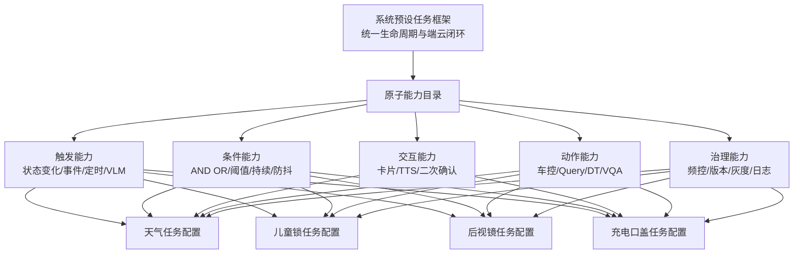

**评审重点**：不是判断“四条任务能不能做”，而是判断“框架是否有足够的积木让四条任务都能被表达并闭环”。

## 7.3 全局逻辑架构

### 7.3.1 当前链路 As-Is｜只画已能从原文确认的事实

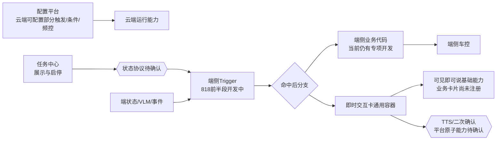

As-Is结论：当前不是“一套配置下发后端云都能自动运行”。云端可配一部分；端侧前半段在开发，后半段交互和反馈仍需补；具体业务卡片尚未实际注册可见即可说；端侧部分任务仍靠研发代码。

### 7.3.2 目标框架 To-Be｜产品方案，需专项确认

图例：**实线**表示目标框架内部的必需数据流；**虚线**表示当前接口或Owner待确认；节点中的“长期”表示不承诺915完成。

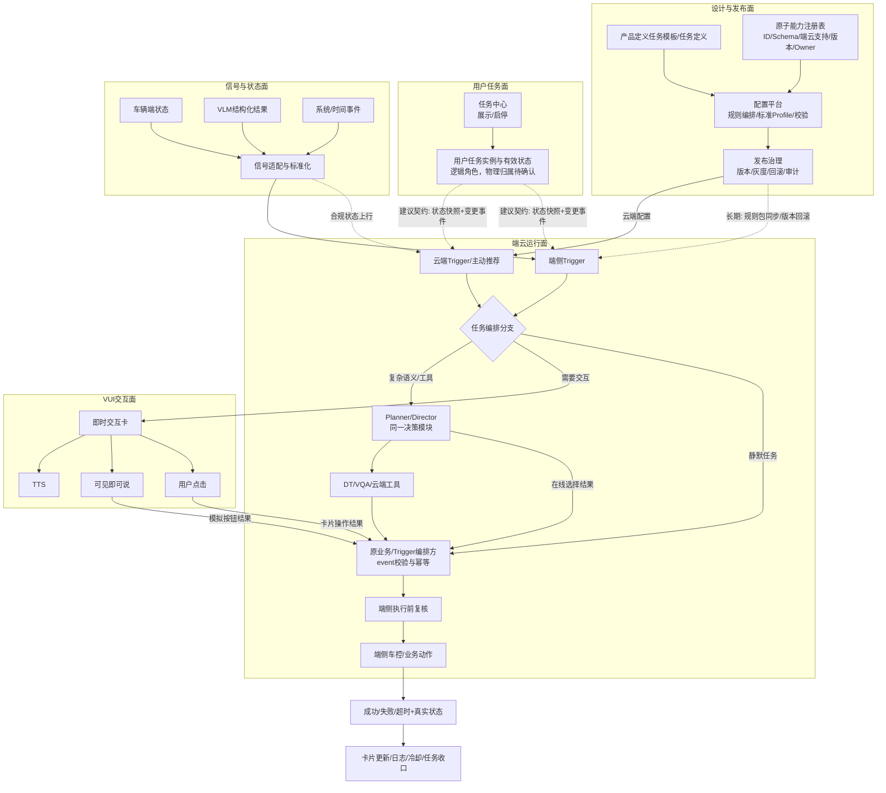

### 7.3.3 模块边界

| 模块 | 必须负责 | 不负责 |
|---|---|---|
| 配置平台 | 任务模型、能力选择、字段校验、版本、发布 | 不实时监听车辆、不渲染卡片、不执行车控 |
| 任务中心 | 展示、启停、用户操作、当前有效状态 | 不判断天气/车速，不直接拉卡或车控 |
| 任务状态服务（逻辑角色） | 保存用户任务实例、提供启动快照和状态变更 | 当前物理模块、推/拉接口和恢复机制仍待任务中心与Trigger确认 |
| Trigger | 读取任务有效状态、监听输入、条件判断、去重、发起交互/动作 | 不负责VUI表现和Planner内部推理 |
| 即时交互卡 | 展示、按钮、状态更新、生命周期 | 不决定任务是否应触发 |
| TTS | 按请求播报文案 | 不理解用户回答 |
| Planner | 在线泛化理解、上下文和选择工具 | 不作为离线安全任务的唯一依赖 |
| 可见即可说 | 本地词条匹配、模拟按钮点击、注销 | 不判断业务条件、不做车控安全复核 |
| DT/VQA | 充电等复杂场景推理 | 不把未知/过期结果直接变成车控 |
| 端侧车控 | 执行动作、返回错误码、真实状态回读 | 不改变产品任务规则 |

## 7.4 配置平台能力架构

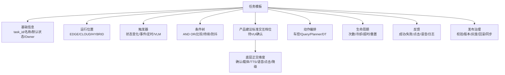

### 7.4.1 P0能力清单

| 能力域 | 平台需要提供的配置项 | 915优先级 | 当前状态 |
|---|---|---:|---|
| 任务元数据 | `task_id`、名称、说明、Owner、默认状态、适用车型 | P0 | 部分已有，需统一模型 |
| 任务有效状态 | 任务中心开关、状态版本、启动快照、重连恢复 | P0 | 需任务中心与Trigger对齐 |
| 运行位置 | `EDGE/CLOUD/HYBRID`及降级策略 | P0 | 当前端云实现分裂 |
| 输入源 | 端状态、VLM结果、事件、定时、云服务结果 | P0 | 按原子能力逐批接入 |
| 条件树 | AND/OR、比较符、枚举、阈值、UNKNOWN处理 | P0 | 云端可配部分；端侧依赖开发 |
| 稳定与时序 | 连续周期、防抖、持续时长、时间窗、状态穿越 | P0 | 需按Trigger现状确认 |
| 标准交互档位 | `silent_no_ui/inform_card/confirm_local/confirm_cloud`等产品建议Profile | P0 | 待徐洋/VUI确认；业务不能任意拼接违规组合 |
| 交互底层维度 | 是否先确认、展示载体、是否TTS、语音入口、点击路由、禁用/弱网降级 | P0 | 需独立建模；不能只用一个枚举代替 |
| TTS | 是否播、文案、优先级、打断、禁用降级 | P0 | 会上判断尚未加入 |
| 二次确认 | Planner/可见即可说/只点击/无确认 | P0 | 会上判断尚未加入 |
| 卡片配置 | 模板、标题、正文、按钮、action_id、超时 | P0 | 容器已有；配置能力待确认 |
| 动作映射 | action_id到车控/Query/DT能力和参数 | P0 | 原子能力需逐批补齐 |
| 执行前复核 | 最新任务、档位、速度、目标状态、结果有效期 | P0 | 必须形成公共门禁 |
| 结果处理 | 成功、失败、超时、拒绝、卡片错误、状态回读 | P0 | 需补统一契约 |
| 频控去重 | 上电周期次数、冷却、event幂等、处理中锁 | P0 | 云端已有部分配置 |
| 日志 | task_id/event_id/rule_version贯穿链路 | P0 | 需补卡片和手动操作事件 |
| 发布 | 校验、版本、灰度、回滚、端侧同步状态 | P0/P1 | 端侧同步为长期方向 |

#### 7.4.1.1 能力现状对账表｜预评审时由Owner补证据

`基础能力存在`、`平台已注册`、`云端可配置运行`、`端侧能运行`、`端侧可由平台下发`是五种不同状态，不得合并写成“已支持”。下表中的“待证实”就是专项的正式输入；研发若回答“已有”，需补接口/平台截图/能力ID或联调用例作为证据。

| 原子能力 | 下游基础能力存在 | 已注册到配置平台 | 云端可配置运行 | 端侧能运行 | 端侧可由平台下发 | 当前实现方式/证据 | 本PRD建议 | 正式Owner |
|---|---|---|---|---|---|---|---|---|
| 任务定义/版本 | 部分 | 待证实 | 部分 | 端侧按任务代码 | 否/待证实 | 会上只确认云端可配一部分 | 统一定义、实例和事件三层模型 | 待会上确认 |
| 任务状态 | 任务中心有启停产品能力 | 待证实 | 待证实 | Trigger消费方式待确认 | 待证实 | 正式taskId协议、快照和恢复未找到 | 915前关闭接口方案 | 待会上确认 |
| Trigger事件/条件 | 是 | 部分 | 部分 | 818前半段开发中 | 否/待证实 | 会上确认端侧仍依赖开发 | 四任务规则可运行并显式标配置/代码 | 待会上确认 |
| 防抖/持续/频控 | 是/部分 | 部分 | 云端可配部分 | 端侧代码部分支持 | 待证实 | 会上提到云端可配周期/次数，端侧当前写代码 | 补公共时序和幂等 | 待会上确认 |
| 即时交互卡 | VUI通用容器存在 | 待证实 | 可被业务调用，平台化待证实 | 是 | 否/待证实 | 会议与VUI文档确认容器存在 | 形成标准Profile和统一回调 | 待会上确认 |
| TTS | 基础播报存在 | 待证实 | 业务可调用，平台配置待证实 | 是 | 否/待证实 | 韩杰判断TTS原子能力“应该都没有加” | 建议纳入915交互闭环 | 待会上确认 |
| 二次确认 | VUI交互链路存在 | 待证实 | Planner链路存在 | 本地按钮/基础能力存在 | 否/待证实 | 韩杰判断二次确认原子能力尚未加入 | 天气/充电按正式路由接入 | 待会上确认 |
| 可见即可说 | 基础能力存在 | 待证实 | 不适用 | 能力存在，具体业务未注册 | 否/待证实 | 徐洋说明当前所有卡片尚未注册具体业务词条 | 天气先接注册/注销通道 | 待会上确认 |
| Planner动态选择 | Planner能力存在 | 待证实 | VUI规范存在 | 不适用 | 不适用 | 适用于泛化业务，非天气主链路 | 充电口是否采用待徐洋确认 | 待会上确认 |
| DT/VQA | 充电链路基础能力存在 | 待证实 | 能运行 | 端侧需上行/取结果 | 不适用 | 用户和会议已给出既有链路 | 补结果协议、有效期和event关联 | 待会上确认 |
| 车控/状态回读 | 各业务基础能力待车控表核 | 待证实 | 不直接车控 | 端侧执行 | 不适用 | 正式能力ID/错误码未齐 | 所有任务必须复核和回读 | 待会上确认 |
| 日志/链路追踪 | 部分 | 待证实 | 部分 | 本地日志/补报待证实 | 待证实 | 卡片手动操作与Planner上下文存在缺口 | 用统一关联ID串联全链路 | 待会上确认 |
| 灰度/回滚/审计 | 云端部分能力可能存在 | 待证实 | 部分/待证实 | 随车版本 | 否/待证实 | 未找到端侧统一配置回滚证据 | 云端本期明确；端侧长期平台化 | 待会上确认 |

### 7.4.2 原子能力注册机制

平台化不是“表里写一个能力名”，而是能力提供方把可调用契约注册进目录。每个能力至少登记：

- `ability_id`、名称、类型和Owner；
- 参数Schema、返回Schema、错误码和幂等语义；
- 支持云端、端侧或两者；支持车型和最低版本；
- 权限/风险等级、是否需要用户确认、执行前门禁；
- 生命周期、超时、是否支持撤销/补偿；
- 版本兼容、废弃日期和替代能力；
- 联调环境、模拟数据和验收用例。

未注册、Schema不完整、车型不支持或版本不兼容的能力，配置平台必须禁止发布。新增任务若只使用已注册能力，应只新增任务实例配置；只有缺少新的原子能力时，才允许新增公共框架接入代码。这是“通用框架成立”的可验收定义。

### 7.4.3 建议的任务配置结构

```yaml
task:
  task_id: preset_weather_protection
  name: 天气路况保护
  owner: 王泽民
  default_enabled: true
  runtime: EDGE

trigger:
  source: vision.outside.scene
  event: WEATHER_OR_ROAD_CHANGED

condition:
  expression: TASK_ENABLED AND SPEED_GT_30 AND WEATHER_RISK AND CURRENT_MODE_NOT_TARGET
  unknown_policy: SKIP
  debounce_cycles: TBD

interaction:
  profile_id: confirm_local
  execute_policy: AFTER_CONFIRM
  presentation: INSTANT_CARD
  tts_policy: ASK
  voice_route: VISIBLE_SAY
  click_route: DIRECT_ACTION
  voice_disabled_policy: CARD_ONLY
  card_template_id: safety_confirm
  tts_text: 当前天气路况不佳，是否为你调整到合适的驾驶模式？
  buttons:
    - label: 确认调整
      action_id: CONFIRM
      synonyms: [确认, 可以, 调整吧]
    - label: 暂不处理
      action_id: REJECT
      synonyms: [不用, 取消, 暂不处理]
  timeout_ms: TBD

action:
  type: VEHICLE_CONTROL
  ability_id: TBD
  parameters: TBD
  precheck: REQUIRED

lifecycle:
  dedupe_key: task_id + power_cycle + sub_scene
  cooldown: TBD
  max_per_power_cycle: TBD

feedback:
  callback_events: [CONFIRM, REJECT, TIMEOUT, CONTROL_SUCCESS, CONTROL_FAILED]
  event_log: REQUIRED
```

该结构只表达产品需要的平台能力，不约束研发必须采用YAML。`profile_id`是产品建议，用于让业务选择经VUI确认的标准档位；正式名称和组合尚未审核。其余字段是平台底层正交能力，避免把“是否确认、是否出卡、是否播TTS、语音走哪里、点击走哪里”错误地捆成一个枚举。

### 7.4.4 安全配置权限与审核

系统预设任务可能改变驾驶模式、儿童锁或车辆外部部件，不能让普通运营账号自由上线。平台至少需要：

- 角色权限：产品可编辑需求，能力Owner维护Schema，授权发布人才能上线；
- 双人审核：涉及安全/车控的规则必须由业务Owner和车控/安全Owner共同签字；
- 车型能力校验：不支持该动作或最低版本不足时禁止发布；
- 规则差异审查：发布前显示条件、动作、阈值和端云位置的版本Diff；
- 紧急停用：可按任务、车型和规则版本关闭新触发；
- 完整审计：记录谁在何时修改、审核、发布和回滚；
- 仿真与灰度：至少用正常、边界、UNKNOWN、状态变化和重复事件跑完，再小流量灰度。

## 7.5 配置、发布与运行全流程

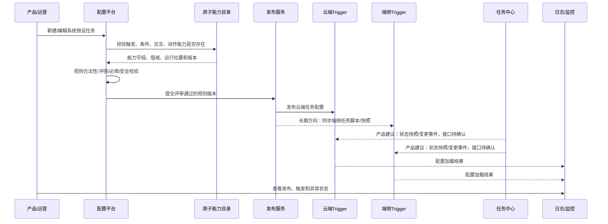

### 7.5.1 配置校验要求

发布前平台必须拦截：

- 任务没有唯一`task_id`；
- 引用了不存在或不支持当前运行位置的原子能力；
- 需要二次确认但未配置按钮、回调或超时；
- 需要TTS但没有语音禁用降级策略；
- 车控动作没有执行前复核；
- 条件中UNKNOWN状态被当作满足；
- 没有去重键或冷却策略；
- 端侧任务没有规则版本、适用车型或回滚版本；
- 同一任务由字节与赛力斯重复拉卡或重复执行。

## 7.6 运行时完整闭环

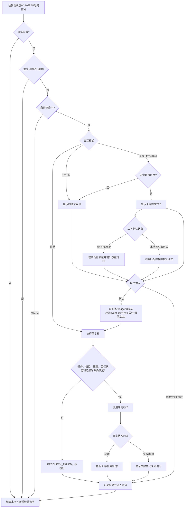

### 7.6.1 通用状态机

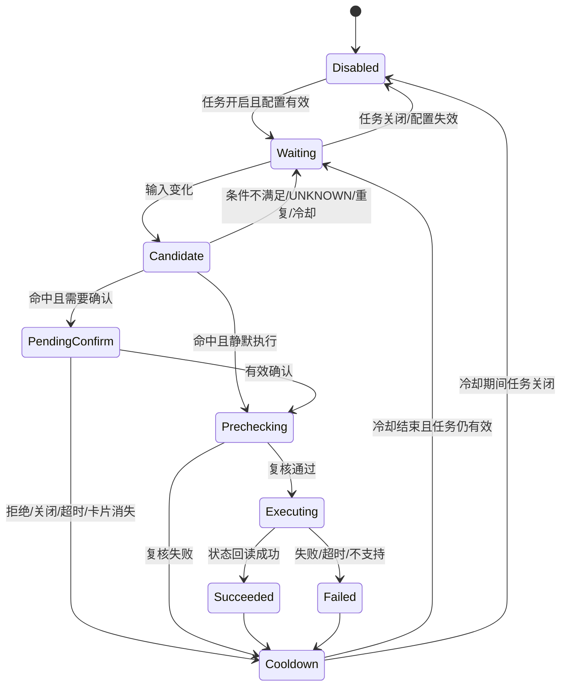

## 7.7 即时交互卡完整链路

### 7.7.1 VUI文档中的四类卡片

| 类型 | 发起方 | 语音闭环 | 与本需求关系 |
|---|---|---|---|
| Planner推出卡片 | 用户Query→Planner→工具 | Planner自闭环 | 不是天气主链路 |
| 静态Advisor | Advisor→Planner→卡片 | Planner自闭环 | 可用于云端主动推荐类任务 |
| 系统通知拉卡 | 三方直接触达端侧卡片 | 在线增强选择工具或直接点击 | 充电/云端交互可复用 |
| 端侧自闭环通知 | 端侧直接出卡，不经Planner | 本地可见即可说/点击 | 天气路况保护采用 |

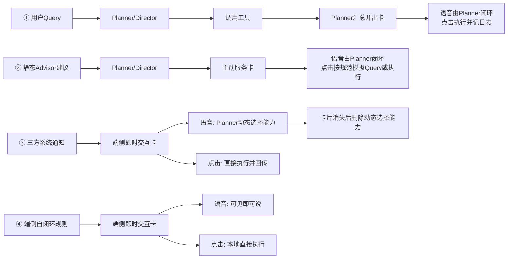

**使用约束**：四类链路不能因为都“长得像一张卡”就混用。天气明确属于④；充电口盖的卡片来源、点击是否模拟Query以及语音是否走Planner，必须由徐洋在专项中按②/③的正式规范收口。

**当前能力边界**：即时交互卡容器和可见即可说基础能力存在，不代表天气已经接通。徐洋在会上明确，当时所有卡片都尚未注册具体可见即可说业务；该方案的泛化能力弱于Planner，会损失NLG和上下文能力。因此本期只建议给天气等少数强本地业务注册，不扩成所有离线卡片通解。

### 7.7.2 在线与本地二次确认时序

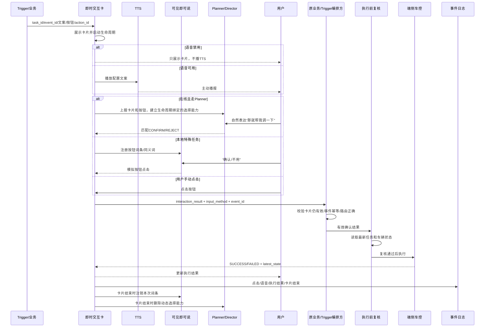

### 7.7.3 配置平台需要暴露的交互字段

| 字段 | 说明 | 示例 |
|---|---|---|
| `interaction_profile_id` | 产品建议的标准交互档位，待VUI确认 | `confirm_local` |
| `execute_policy` | 直接执行或确认后执行 | `AFTER_CONFIRM` |
| `presentation` | 无展示、AIbar、即时卡、消息盒子等 | `INSTANT_CARD` |
| `card_template_id` | 通用卡片模板 | `safety_confirm` |
| `card_title/body` | 卡片业务内容 | 当前路面湿滑/是否切换模式 |
| `buttons[]` | 文案、action_id、同义词 | 确认/取消 |
| `tts_enabled/text` | 是否播报和文案 | true/当前天气路况不佳… |
| `voice_route` | Planner、可见即可说、仅点击、无 | `VISIBLE_SAY` |
| `click_route` | 直接动作、模拟Query、仅反馈 | `DIRECT_ACTION` |
| `voice_disabled_policy` | 语音禁用时的降级 | `CARD_ONLY` |
| `timeout` | 卡片确认有效期 | 待VUI确认 |
| `callback_target` | 用户选择回调方 | Trigger/业务服务 |
| `success/failure_copy` | 执行结果展示 | 已切换/切换失败 |
| `priority` | 卡片和TTS排队优先级 | 待VUI规范确认 |

平台底层必须把这些维度分开建模，但产品侧优先选择标准Profile，避免自由组合出“无需确认却播询问TTS”“卡片走本地但点击又回云端”等不合法方案。

| 标准Profile建议名 | 执行策略 | 展示 | TTS | 语音入口 | 点击路由 | 适用示例 |
|---|---|---|---|---|---|---|
| `silent_no_ui` | 直接执行 | 无 | 无 | 无 | 无 | 儿童锁、后视镜 |
| `inform_card` | 直接执行 | 即时卡 | 无 | 无 | 仅反馈/控件 | 仅告知型任务 |
| `confirm_local` | 确认后执行 | 即时卡 | 询问 | 可见即可说 | 本地直接动作 | 天气路况保护 |
| `confirm_cloud` | 确认后执行 | 即时卡 | 询问或按规范 | Planner | 按卡片来源定义 | 充电口盖候选 |

### 7.7.4 卡片生命周期规则

1. 卡片出现时，注册对应的本地词条或云端动态选择能力；
2. 点击、语音、关闭、超时必须带回原`task_id/event_id`；
3. 卡片消失即代表本次确认失效；
4. 卡片消失后必须注销词条/删除动态工具；
5. 卡片消失后用户再说“好的”，不得执行旧任务；
6. 用户手动点击结果需同步到业务事件；在线场景按需要同步Planner上下文；
7. 语音禁用只影响TTS和语音输入，不应默认阻断安全卡片展示；
8. 需要确认的任务不能在卡片失败时降级为静默车控。

## 7.8 端云分流规则

端云不是简单按“有网=云端、没网=端侧”切换。下面的决策图用于**设计期确定任务主运行位置**；运行时真正的离在线切换需要复用既有端云仲裁能力，并同时考虑网络质量、任务类型、上下文归属、结果时效和重复执行保护。本PRD不自创一条只看网络状态的运行时仲裁规则。

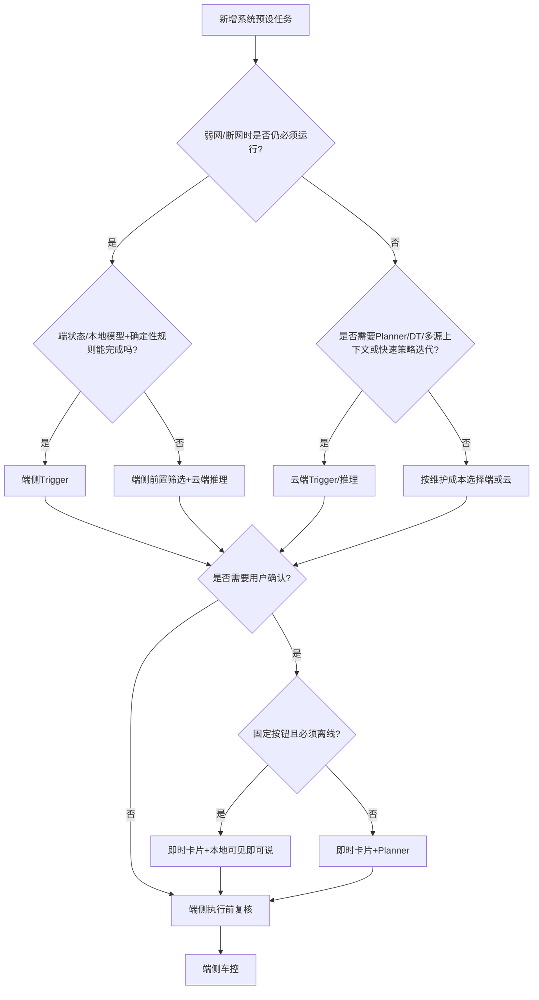

### 7.8.1 端云价值

| 维度 | 端侧 | 云端 |
|---|---|---|
| 价值 | 低时延、弱网可用、接近真实车辆状态 | 复杂推理、上下文丰富、策略迭代快 |
| 适合 | 安全强实时、明确规则、固定交互 | 多源语义、Planner/DT、可容忍网络依赖 |
| 风险 | 随车发布慢、能力和资源受限 | 断网漏触发、延迟、结果过期 |
| 产品门禁 | 规则必须稳定、资源可承载、端版本一致 | 明确断网结果、时效和端侧最终复核 |

## 7.9 四任务框架映射

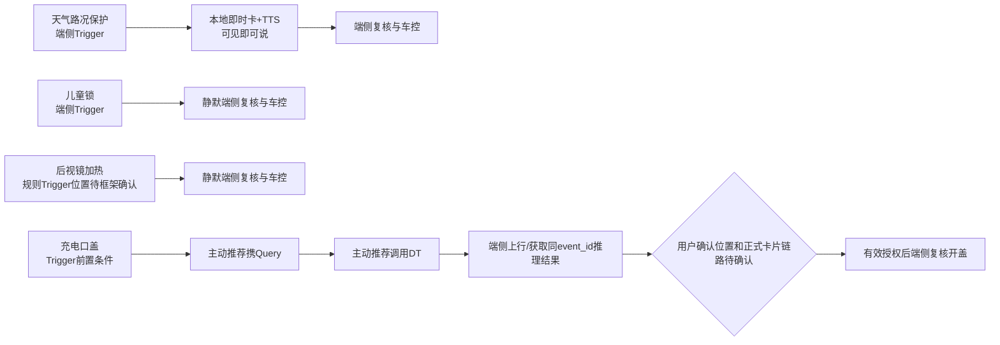

| 任务 | 触发/条件 | 交互 | 执行 | 关键理由 | 状态 |
|---|---|---|---|---|---|
| 天气路况保护 | 端侧任务有效+天气/路面+车速+当前模式/灯 | 卡片+TTS；本地可见即可说；语音禁用时只出卡 | 端侧复核后切模式/开灯 | 安全、低延迟、需离线 | 【已确认主方向】 |
| 儿童/宠物儿童锁 | 后排成员/宠物+行驶状态+锁状态 | 无卡、无TTS | 端侧静默执行 | 会议最终明确不需要交互 | 【已确认交互口径】 |
| 后视镜自动加热 | 雨水/洗车退出/高湿温差等规则 | 无卡、无TTS | 端侧复核后静默加热 | 低风险便利动作 | 【已确认交互口径；Trigger位置需框架确认】 |
| 充电口盖 | 单任务状态+AI总开关+切入P档+SOC+口盖状态前置；主动推荐Query→DT→端侧上行/取结果 | 卡片和二次确认确定；确认在DT前/后、卡片来源、Planner/点击路由及TTS待确认 | 同event_id结果有效且用户授权后，端侧复核开盖 | 需要视觉/语义判断，不宜仅靠固定条件 | 【既有主链路已确认；交互位置/接口待专项确认】 |

## 7.10 通用接口产品契约

### 7.10.1 任务中心→Trigger任务状态

以下是**产品建议契约，不是已实现接口**。专项需由郝晓伟与Trigger研发确认：状态由谁保存、是推送还是拉取、端侧是否缓存，以及重启/漏事件后的恢复方式。

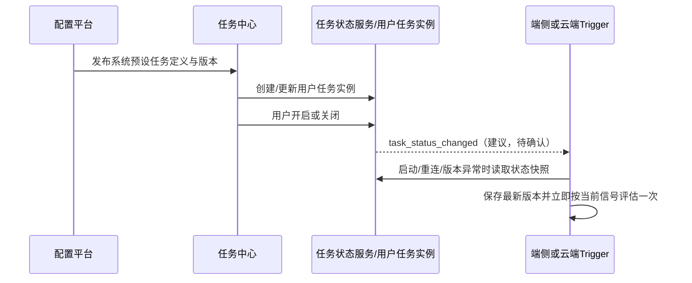

```json
{
  "task_definition_id": "preset_weather_protection",
  "task_instance_id": "user_vehicle_task_instance",
  "event_id": "task_state_event_id",
  "task_version": "v1",
  "user_enabled": true,
  "effective": true,
  "state_version": 3,
  "changed_at": 0,
  "reason": "USER_ENABLED"
}
```

要求：

- 重复`event_id`幂等；
- 旧`state_version`不能覆盖新状态；
- Trigger启动、重连或发现版本不一致时读取全量状态快照；
- 每次准备触发和执行前均判断最新任务有效状态。

### 7.10.2 Trigger/业务→即时交互卡

```json
{
  "task_id": "preset_weather_protection",
  "event_id": "trigger_event_id",
  "rule_version": "v1",
  "interaction_profile_id": "confirm_local",
  "execute_policy": "AFTER_CONFIRM",
  "presentation": "INSTANT_CARD",
  "voice_route": "VISIBLE_SAY",
  "click_route": "DIRECT_ACTION",
  "voice_disabled_policy": "CARD_ONLY",
  "card": {
    "template_id": "safety_confirm",
    "title": "当前路面湿滑",
    "body": "是否切换为湿滑驾驶模式？",
    "buttons": [
      {"label": "确认调整", "action_id": "CONFIRM"},
      {"label": "暂不处理", "action_id": "REJECT"}
    ]
  },
  "tts_text": "当前路面湿滑，是否为你切换到湿滑驾驶模式？",
  "expire_at": 0,
  "callback_target": "trigger"
}
```

### 7.10.3 交互结果

```json
{
  "task_id": "preset_weather_protection",
  "event_id": "trigger_event_id",
  "interaction_result": "CONFIRM",
  "input_method": "VOICE_VISIBLE_SAY",
  "card_state": "ACTIVE",
  "event_time": 0
}
```

### 7.10.4 车控结果

```json
{
  "task_id": "preset_weather_protection",
  "event_id": "trigger_event_id",
  "action_id": "SET_WET_DRIVE_MODE",
  "result": "SUCCESS",
  "error_code": null,
  "latest_state": "WET_MODE",
  "result_time": 0
}
```

## 7.11 安全门禁、异常和降级

### 7.11.1 执行前复核

所有真实车控前必须重新检查：

- 任务仍然有效；
- 当前事件未被执行；
- 档位、速度和车辆模式仍满足；
- 目标功能当前仍未达到；
- 用户确认仍处于卡片有效期；
- VLM/DT结果未过期且不是UNKNOWN；
- 用户没有在等待期间做出相反手动操作；
- 车型和车辆配置支持该动作。

### 7.11.2 异常处理

| 异常 | 默认处理 |
|---|---|
| 任务状态未知 | 不触发，重新拉取快照 |
| 输入未知/过期 | 不触发，不猜测 |
| 语音禁用 | 需要交互的任务只出卡、不播TTS |
| 卡片失败 | 需要确认的任务不得静默执行 |
| 用户拒绝/关闭/超时 | 不执行，进入冷却 |
| 网络断开 | 本地任务继续；云端任务按定义不触发或降级，不伪装成功 |
| 执行前状态变化 | `PRECHECK_FAILED`，不执行 |
| 车控超时 | 先读取真实状态，不能盲目重复 |
| 日志上报失败 | 本地缓存补报，不阻断安全判断 |
| 任务关闭 | 取消未完成确认；已发出的不可中断原子动作按车控约束处理，后续不再触发 |

## 7.12 去重、频控和防打扰

P0需要：

- 同一`event_id`只能处理一次；
- 同一任务处于等待确认或执行中时不能重复出卡；
- 冷却时间和每上电周期次数可配置；
- 用户拒绝、关闭、手动撤销后进入冷却；
- 规则从不满足变为满足时触发，避免持续状态每次上报都重复触发。

【待决策】赛力斯提出“连续拒绝若干次后不再推荐”的能力。会议要求王泽民向赛力斯说明当前暂无该能力并澄清是否为验收硬要求。本期不擅自承诺实现。

## 7.13 可观测性

每次任务运行至少记录：

1. 任务有效状态与版本；
2. 输入信号、时间戳、质量和有效期；
3. 条件树每个节点的结果；
4. 去重和冷却结果；
5. 卡片请求、展示、TTS、点击、语音、关闭、超时；
6. Planner/DT/VQA输入输出（合规范围内）；
7. 执行前复核结果；
8. 车控请求、错误码和真实状态回读；
9. 最终结果和全链路耗时。

核心串联键：`task_id + event_id + rule_version + state_version`。

---

# 8. Release｜范围、评审和发布计划

## 8.1 818、915与长期范围

| 阶段 | 做到什么程度 | 不要求什么 |
|---|---|---|
| 818当前 | 端侧Trigger前半段：输入、条件判断、任务触发基础链路 | 不代表卡片、TTS、二次确认和反馈已闭环 |
| 915建议范围（待Owner和排期确认） | 优先补齐天气/充电的卡片、TTS或确认、语音禁用降级、执行结果和日志；纠正儿童锁/后视镜静默链路；确认平台能力与Meego | 会议只确认后续语音和卡片按915推进，未证明四任务与全部平台能力均已排期 |
| 长期端云一体 | 配置平台统一编排，规则/脚本同步端侧，版本、灰度、回滚和能力目录统一 | 不按单一场景反复写死代码 |

### 8.1.1 当前、915和长期的能力差距

| 能力 | 当前可确认状态 | 本PRD建议915达到（待排期） | 长期目标 |
|---|---|---|---|
| Trigger条件 | 818已推进部分端侧触发前半段；云端可配部分条件 | 四任务所需规则可运行，仍由代码实现的地方显式标注 | 同一规则模型生成云端规则和端侧规则包 |
| 任务状态 | 已被需求当作条件输入，但正式状态协议未确认 | 支持启停变更和启动快照，至少不会因漏事件误执行 | 用户任务实例、版本与端云状态统一管理 |
| 卡片容器 | VUI即时交互卡通用容器存在 | 天气、充电口完成标准接入和结果回调 | 平台选择标准Profile并自动校验 |
| TTS | 基础播报能力存在；是否已成为平台原子能力未确认 | 天气TTS、语音禁用降级闭环；充电口TTS结论关闭 | 文案、队列、打断和降级统一配置 |
| 二次确认 | 基础交互链路存在；平台原子能力会上判断尚未补齐 | 天气本地确认、充电云端确认闭环 | 统一Profile、事件协议和跨业务复用 |
| 可见即可说 | 基础能力存在，具体卡片业务词条尚需注册 | 天气完成词条、同义词、注册/注销和验收 | 特殊端侧任务按标准通道接入 |
| Planner卡片交互 | 在线链路存在 | 充电口语音/点击真实路由确认并接入 | 卡片动态工具、上下文和事件通用化 |
| 车控结果 | 各能力分散提供 | 四任务全部支持执行前复核、结果码和真实状态回读 | 动作Schema、错误码和幂等统一注册 |
| 发布治理 | 云端已有部分；端侧当前多依赖研发随车代码 | 能说明每项是配置还是代码，并可按任务紧急关闭 | 统一校验、仿真、灰度、版本、回滚和观测 |

## 8.2 什么时候可以进行需求评审

不需要等研发完成，但要区分两种会议：

1. **框架预评审/对齐会：现在可以开。**目标是确认三层模型、能力分类、端云原则和需要哪些Owner补证据；不宣布已达到研发排期状态。
2. **正式专项需求评审：完成下列准入项后召开。**目标是关闭范围、能力缺口、Owner和Meego，并作为技术方案/排期输入。

正式专项需求评审准入：

- [ ] 一张整体逻辑架构图，明确配置平台、任务中心、端云Trigger、交互和车控边界；
- [ ] 能力现状对账表已由平台/VUI/Trigger Owner预填证据，标注已支持、建议915、长期、待确认；
- [ ] 四条任务全部映射到统一Task模型；
- [ ] 天气与充电的即时交互卡全链路画清；
- [ ] 儿童锁与后视镜明确无卡、无TTS；
- [ ] 语音禁用降级、拒绝、超时和卡片消失规则写清；
- [ ] P0问题有建议方案、决策人和不决策的影响；
- [ ] 接口只需达到产品字段级，不要求研发实现细节完成；
- [ ] 每个模块至少有一名已确认的参评人，正式研发Owner可在会上收口；
- [ ] 会后Meego拆分方式已准备。

**评审时点建议**：当前稿先发框架预评审；能力对账表和参评人补齐后，立即预约正式专项。正式专项应发生在915交互能力正式开发前，用来确定能力范围和研发拆分，而不是开发完成后的验收会。

## 8.3 评审必须当场关闭的P0问题

| 编号 | 问题 | 建议参评人（非正式Owner指定） | 产出 |
|---|---|---|---|
| P0-01 | 统一Task模型和运行位置字段是否可承载端/云/混合 | 韩杰、张嘉锋 | 数据模型结论 |
| P0-02 | 当前平台已有和缺失的触发、条件、交互、动作原子能力 | 韩杰 | 能力状态表+Meego |
| P0-03 | 端侧规则长期如何从平台同步、解析、版本和回滚 | 韩杰+端侧研发 | 长期方案边界，不阻塞915最小闭环 |
| P0-04 | 即时交互卡开放几种调用档位、正式接口和Owner | 徐洋+卡片研发 | 卡片产品契约 |
| P0-05 | 可见即可说词条由谁提交、注册、注销和验收 | 徐洋+相关研发 | 天气本地交互方案 |
| P0-06 | TTS、二次确认和手动点击事件是否作为平台原子能力新增 | 韩杰+徐洋 | 915能力拆分 |
| P0-07 | 在线Planner和本地可见即可说的路由字段与优先级 | 徐洋+张嘉锋 | 在线/本地边界 |
| P0-08 | 语音禁用统一降级是否为`CARD_ONLY` | 徐洋+陈敏 | 交互降级结论 |
| P0-09 | 任务中心如何向端/云Trigger同步任务有效状态和启动快照 | 郝晓伟+Trigger | taskId状态协议 |
| P0-10 | 四任务的动作、复核、反馈和验收Owner | 各业务+赛力斯 | Owner表和联调计划 |
| P0-11 | 卡片手动点击/语音选择如何进入业务事件和Planner上下文 | 徐洋+Planner/事件研发 | 反馈事件协议 |
| P0-12 | 连续负反馈防打扰是否为赛力斯验收硬要求 | 王泽民+赛力斯产品 | 本期范围结论 |

## 8.4 会后Meego拆分建议

1. 配置平台统一Task模型；
2. 任务中心状态事件和启动快照；
3. Trigger公共门禁、状态机、去重和执行前复核；
4. 即时交互卡通用调用接口；
5. TTS配置原子能力；
6. 二次确认路由原子能力；
7. 本地可见即可说业务注册通道；
8. 在线Planner动态选择能力；
9. 卡片手动操作和语音选择事件上报；
10. 端侧动作结果和真实状态回读；
11. 端侧规则同步、版本和回滚长期方案；
12. 四任务实例配置与联调；
13. 全链路日志和指标看板。

## 8.5 发布准入

- P0决策全部有结论和Owner；
- 四任务正向、拒绝、超时、断网、语音禁用、状态变化和失败用例通过；
- 任务关闭时不存在新触发和误执行；
- 车控前复核和真实状态回读生效；
- 卡片结束后词条/动态工具被正确注销；
- event_id能串联Trigger、卡片、Planner/DT和车控；
- 支持按任务ID灰度关闭和规则版本回滚；
- 产品、Trigger、VUI/Planner/DT、任务中心和赛力斯共同签字。

---

# 9. 验收用例

## 9.1 框架级P0用例

| 场景 | 预期结果 |
|---|---|
| 任务关闭但所有业务条件满足 | 不出卡、不播TTS、不车控 |
| 重复收到同一event_id | 只处理一次 |
| 条件结果UNKNOWN | 不触发 |
| 语音可用的天气任务 | 出卡+TTS；点击和本地语音均可确认 |
| 语音禁用的天气任务 | 只出卡，不播TTS；点击可完成确认 |
| 卡片关闭后说“确认” | 不执行旧任务 |
| 用户确认后档位/车速变化 | 执行前复核失败，不车控 |
| 儿童锁/后视镜命中 | 无卡、无TTS，按规则静默执行并记录结果 |
| 在线充电任务 | DT/VQA结果有效后出卡；Planner或点击确认后端侧复核开盖 |
| 充电DT结果未知/过期 | 不出错误结论，不开盖 |
| 车控接口超时但目标状态已达成 | 状态回读为准，不重复执行 |
| 云端任务断网 | 按任务降级定义处理，不伪装成功 |
| 端侧配置版本落后 | 不加载不兼容配置；保留上一有效版本并上报 |

## 9.2 能力平台验收

- 能力选择器只展示当前运行位置可用能力；
- AND/OR树能够表达四任务规则；
- 需要确认时，缺卡片/按钮/回调/超时任一项无法发布；
- 交互配置能选择Planner、可见即可说、仅点击和无确认；
- TTS配置必须同时设置语音禁用降级；
- 动作配置必须绑定执行前复核；
- 规则可保存版本、查看差异、灰度和回滚；
- 发布后能够看到端侧/云端加载状态；
- 日志可按task_id和event_id检索完整链路。

## 9.3 质量指标｜阈值需在专项评审确认

| 指标 | 计算口径 | 产品目标方向 |
|---|---|---|
| 重复提醒率 | 同一去重键产生多张有效卡或同一事件多次执行 ÷ 有效触发 | 接近0，具体阈值待定 |
| 误执行率 | 不满足门禁却发生车控的事件 ÷ 全部车控事件 | 必须为0 |
| Trigger到卡片时延 | Trigger命中到卡片展示完成 | 天气需满足端侧体验目标，阈值待VUI/Trigger确认 |
| 确认到车控时延 | 有效确认到动作请求及真实状态成功 | 按动作安全和体验目标分能力定义 |
| 端云规则加载成功率 | 成功加载目标版本的车辆/实例 ÷ 应加载总数 | 阈值待平台确认；失败必须可见且可回滚 |
| 端侧断网可用性 | 断网下天气完整确认并执行的成功率 | 满足天气离线验收目标 |
| 车控状态回读成功率 | 获得明确真实状态的动作事件 ÷ 动作事件 | 必须可监控，阈值待车控确认 |
| 日志链路完整率 | 能用关联ID还原Trigger→交互→执行的事件 ÷ 抽检事件 | 正式发布前达到评审阈值 |

---

# 10. 王泽民具体要做什么

## 10.1 会前

1. 用本PRD作为唯一框架评审稿，不再分别用聊天记录解释；
2. 将四任务条件表作为“任务实例附件”，不要让条件细节抢走框架评审重点；
3. 把7.4.1能力矩阵发给韩杰，请其会前预填“已支持/建议915/长期/待确认/证据/Owner”；
4. 把7.7卡片链路发给徐洋，请其确认卡片档位、TTS、Planner/可见即可说和生命周期；
5. 把7.8端云分流图发给张嘉锋，请其确认在线/离线边界和长期通解是否需要本期展开；
6. 找郝晓伟确认任务中心状态事件、启动快照和系统任务可关闭/删除口径；
7. 给每个P0问题预填建议方案，不在会上只问开放问题；
8. 建好Meego空壳，评审后只需填Owner和排期。

## 10.2 会中

1. 先讲背景和一张总图，不从天气条件开始；
2. 明确本次要评“框架+能力+闭环”，不是验收已开发Trigger；
3. 让韩杰逐项确认平台能力现状；
4. 让徐洋确认卡片/TTS/二次确认规范；
5. 让张嘉锋确认端云边界和通用性；
6. 再用四任务证明框架能覆盖不同类型；
7. 每个争议记录“结论、Owner、完成时间、Meego”，不只记“后续对齐”；
8. 最后复述已确认的818边界、本PRD建议915范围、待排期项和长期不承诺范围。

## 10.3 会后

1. 30分钟内更新P0决策表；
2. 将能力缺口拆成Meego并@对应Owner确认；
3. 更新四任务配置和接口依赖；
4. 分别组织Trigger、卡片、Planner/可见即可说、任务中心、车控技术评审；
5. 联调前补全错误码、状态有效期、超时、冷却和车型范围；
6. 建立验收矩阵和实车数据记录；
7. 评审未关闭的P0问题不得被写成已实现。

## 10.4 你的责任边界

| 你负责 | 你不默认负责 |
|---|---|
| 把会议结论、冲突和待决策写成唯一PRD | 代替平台研发注册能力或实现配置页面 |
| 定义任务实例、端云原则、产品字段和验收标准 | 代替端侧研发写规则代码、注册可见即可说词条 |
| 组织韩杰、徐洋、张嘉锋、任务中心及相关研发完成评审 | 单方面指定其他团队交付Owner和排期 |
| 维护P0问题、Owner、Meego和结论状态 | 代替赛力斯做实车配置和安全签字 |
| 组织联调、验证材料和产品验收 | 把接口待定或占位ID包装成已实现 |

你的完成标准不是“亲自把所有平台配置好”，而是：方案无冲突、边界可执行、每个缺口有人承接、验收可判断、结论可追踪。

---

# 11. 评审讲稿｜采用9月1日下午会议的对话风格

## 11.1 开场

**王泽民：**

> 我今天不先逐条讲天气、儿童锁这些条件。我先讲一个共同问题：现在我们已经能做一部分Trigger，但系统预设任务从配置、触发到卡片、二次确认和车控结果，还没有形成一套完整框架。今天希望先确认整体框架，再逐项确认配置平台还缺哪些原子能力，最后用四条任务验证这套框架能不能覆盖。

## 11.2 讲整体框架

**王泽民：**

> 我把一条系统预设任务拆成九块：任务信息、运行位置、触发、条件、交互、动作、生命周期、反馈和发布。任务中心只负责用户能不能开关，Trigger负责什么时候命中，即时交互卡负责怎么问，Planner或可见即可说负责用户怎么回答，端侧车控负责最后执行。配置平台的职责是把这些能力组合起来，不是自己实现所有模块。

**现场可能追问（张嘉锋上次关注）：**

> 这些场景是不是配置完条件和事件就应该能出来？为什么还需要每条额外开发？

**王泽民回答：**

> 对，长期目标就是配置完成后能运行。但当前只具备部分触发、条件和动作能力，端侧仍依赖研发代码；TTS、二次确认、卡片回调这些能力会上也确认应该还没有加入。所以本次不是继续按场景堆代码，而是先明确统一能力模型，提出915最小闭环建议并让Owner确认排期，长期再完成端云一体同步。

## 11.3 讲配置平台能力

**王泽民：**

> 韩杰，我这里把平台能力拆成任务元数据、运行位置、触发、条件、交互、动作、生命周期、反馈和发布九类。我希望今天你能帮我逐项标清：哪些已经能配，哪些建议纳入915并能排期，哪些只作为长期方向。尤其是TTS、二次确认、卡片按钮回调和端侧规则同步。

**现场可能追问（韩杰上次关注）：**

> 原子能力需要一批一批加，不可能一次把所有场景全覆盖。

**王泽民收口：**

> 同意，所以我不要求一次覆盖所有任务。我希望先以四条任务作为能力准入集，确保它们用到的P0能力都能表达；以后新增能力继续注册到目录，而不是修改框架本身。

## 11.4 讲即时交互卡

**王泽民：**

> 徐洋，我理解即时交互卡是通用容器，不是天气专属卡。在线场景优先Planner理解用户泛化表达，本地天气场景走可见即可说。这里我需要确认的是，平台最终要传哪些卡片字段，谁负责注册词条，卡片消失后谁注销，以及点击和语音结果怎么回到业务方。

**现场可能追问（徐洋上次口径）：**

> 在线优先Planner，特殊本地业务自己注册可见即可说，具体注册逻辑研发决定。

**王泽民收口：**

> 好，那本期不扩成所有离线卡片通解。天气作为明确的本地特殊业务先注册；平台需要能配置卡片、TTS、按钮、词条和回调，但具体代码注册由研发实现。

## 11.5 讲语音禁用

**王泽民：**

> 语音禁用时，天气等安全任务不能完全不提醒。我沿用会上结论：语音可用时是卡片+TTS+确认；语音禁用时只出卡、不播TTS。儿童锁和后视镜本来就是静默任务，不受这条交互降级影响。

## 11.6 用四任务验证框架

**王泽民：**

> 四条任务刚好覆盖四种情况：天气是端侧Trigger加本地卡片；儿童锁是端侧静默安全任务；后视镜是静默便利规则；充电口盖是Trigger前置、云端DT/VQA理解、即时卡二次确认、端侧执行的混合链路。如果这四条都能用同一Task模型表达，说明框架基本成立。

## 11.7 收口

**王泽民：**

> 今天希望留下的不是“后续再聊”，而是三张表：第一张能力现状表，第二张P0决策和Owner表，第三张建议915的Meego拆分表。818已经做的是触发前半段；卡片、TTS、确认、执行结果和日志建议纳入915，实际范围和排期由Owner在会上确认。长期端云一体同步另立方案，不与短期范围混写。

---

# 12. 评审现场记录模板

| 议题 | 结论 | Owner | 截止节点 | Meego | 状态 |
|---|---|---|---|---|---|
| Task统一模型 |  |  |  |  | 待评审 |
| 平台能力现状 |  |  |  |  | 待评审 |
| 卡片调用档位 |  |  |  |  | 待评审 |
| TTS配置 |  |  |  |  | 待评审 |
| 二次确认路由 |  |  |  |  | 待评审 |
| 可见即可说注册 |  |  |  |  | 待评审 |
| 任务中心状态同步 |  |  |  |  | 待评审 |
| 卡片/Planner事件回流 |  |  |  |  | 待评审 |
| 端侧规则同步长期方案 |  |  |  |  | 待评审 |
| 四任务Owner与联调 |  |  |  |  | 待评审 |

---

# 13. 资料来源

1. [文字记录：AI汽车-产品内审日程预留 2026年9月1日](https://bytedance.larkoffice.com/docx/Zp90dGMheow4XmxwVXAcu2KGnTb)
2. [【AIVA-PRD】VUI主交互需求](https://bytedance.larkoffice.com/wiki/FBsrwA734iaFzZkrZExcHHBtn3d)
3. [sls主动服务（规则部分）需求文档](https://bytedance.larkoffice.com/docx/Vm00dKhlYoSKNWxzJ51cH5WUniE)
4. [《预设条件表 副本》—系统预设任务全集](https://bytedance.larkoffice.com/wiki/SorvwQ413iamTRkzSxvcVPWtnYc?sheet=g4s4FB)
5. [预设任务需求讨论](https://sai-seres.feishu.cn/minutes/obcnobear6683vc9ph55kvtp)
6. [天气路况保护PRD](https://sai-seres.feishu.cn/wiki/VXEdwlChniB4lMkqQT9cPxPqnFh)
7. 工作区现有《PRD｜系统预设任务全集（四任务详细版）》和《四任务需求评审稿》。

---

# 14. 四任务实例详细规格｜用于验证框架，不替代框架

本章把四个任务放回统一框架中逐条验算。字段和能力ID只有在资料中明确出现时才引用；未由研发确认的ID统一标记为“产品占位/待确认”。四条任务共同遵循：任务有效门禁、关键信号UNKNOWN不执行、事件幂等、执行前复核、真实状态回读和统一日志。

## 14.1 任务一：天气/路况保护

### 14.1.1 产品目标与运行方式

- 目标：在雨、雪、雾或危险路面出现时，先询问用户，再开启对应保护能力。
- 主运行位置：端侧Trigger；需要弱网/断网和低时延保障。
- 交互Profile：`confirm_local`，即时交互卡＋TTS＋本地可见即可说/点击。
- 语音禁用降级：保留卡片和点击，不播TTS、不启用语音确认。
- 关键原则：雨、雪、雾必须分支执行，不能一次确认同时切模式和开雾灯。

### 14.1.2 三个子场景触发条件

| 子场景 | 进入条件 | 询问与确认后动作 | 当前结论状态 |
|---|---|---|---|
| 雨天/湿滑 | 任务有效 AND 车速`>30km/h` AND（天气=下雨 OR 路面=湿滑）AND 当前模式≠湿滑 | 询问是否切换湿滑模式；确认后复核并切换 | 条件和动作主口径已明确；防抖待定 |
| 下雪/覆雪结冰 | 任务有效 AND 车速`>30km/h` AND（天气=下雪 OR 路面=覆雪结冰）AND 当前模式≠雪地 | 询问是否切换雪地模式；确认后复核并切换 | 条件和动作主口径已明确；枚举待统一 |
| 浓雾 | 任务有效 AND 车速`>30km/h` AND 天气=浓雾 AND 后雾灯=关闭 | 询问是否开启后雾灯；确认后复核并开启 | 条件和动作主口径已明确；灯状态ID待核 |

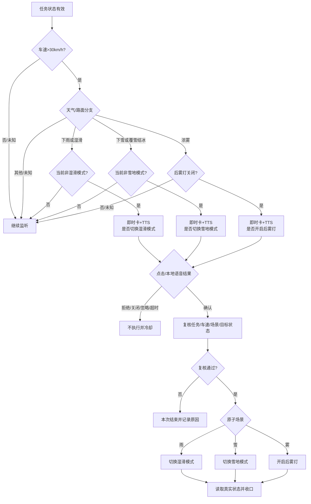

### 14.1.3 输入、事件与待补能力

| 项目 | 当前资料字段/来源 | 要求 |
|---|---|---|
| 天气/路面 | `vision.outside.scene`中的天气、路面描述 | UNKNOWN不触发；事件进入防抖次数待确认 |
| 车速 | `tri_speed / vehicle_control_0004` | 以带时间戳的最新值判断`>30` |
| 驾驶模式 | `con_vehDrive / vehicle_control_0003` | 避免重复切换，正式枚举待车控确认 |
| 后雾灯 | `con_rearFogLight / signal_light_0004` | UNKNOWN不执行 |
| 卡片反馈 | 旧PRD写`tri_popup` | 不能只分正负；需拆确认、拒绝、关闭、忽略、超时和输入方式 |
| 任务有效状态 | 正式ID待任务中心提供 | Trigger启动读取快照，变更后更新本地状态 |
| 卡片/TTS | 旧PRD写`act_popup / act_TTS` | 仅为产品占位；需确认平台正式原子能力与接口 |

P0未决：连续周期/防抖值、退出天气后的恢复策略、连续拒绝后的防打扰、卡片和TTS超时、词条注册入口、正式action ID。

| 天气验收场景 | 预期 |
|---|---|
| 任务关，其他条件全满足 | 不出卡、不播TTS、不车控 |
| 雨/湿滑且非湿滑模式 | 只询问切湿滑模式，不出现雪地/雾灯动作 |
| 雪/覆雪结冰且非雪地模式 | 只询问切雪地模式 |
| 浓雾且后雾灯关闭 | 只询问开启后雾灯 |
| 目标能力已经开启 | 不重复提醒或执行 |
| 语音禁用 | 只出卡，点击有效；无TTS和语音确认 |
| 确认后车速/天气/任务失效 | 执行前复核失败，不车控 |
| 卡片超时后再说“确认” | 旧event失效，不执行 |

## 14.2 任务二：后排儿童/宠物识别后开启儿童锁

### 14.2.1 最终交互结论

- 9月1日会议最终结论：**不出卡、不播TTS**。
- 运行链路：端侧规则命中→执行前复核→静默开启儿童锁→状态回读。
- 当前旧SLS文档中“卡片＋TTS＋正负反馈”的内容必须删除，不能保留为二选一。

### 14.2.2 触发条件与尚未收口的规则

```text
task_effective = true
AND 行驶门禁成立（gear != P持续判断，或仅切入D事件，专项待定）
AND（赛力斯儿童状态=PRESENT OR 端侧VLM宠物类型 IN [CAT, DOG]）
AND 对应儿童锁状态 = OFF
→ 执行前复核
→ 静默开启约定范围儿童锁
```

| 输入/事件 | 当前资料字段/来源 | 状态 |
|---|---|---|
| 档位/切入D | `tri_gear`或持续档位状态ID | 只用事件还是持续状态待定 |
| 儿童成员 | `con_occGroup`，赛力斯OMS/SLS | 枚举、频率和有效期待确认；优先作为儿童主触发源 |
| 猫/狗 | 端侧VLM结构化字段，正式ID待提供 | 需求范围待最终确认 |
| 儿童VLM | 正式ID待提供 | 当前约5分钟频率，不能作唯一安全触发源 |
| 左右儿童锁 | 正式SourceID待赛力斯提供 | ON/OFF/UNKNOWN和左右参数待定 |
| 后排车门/车速 | 正式SourceID待提供 | 是否纳入安全门禁待定 |
| 车控结果 | 正式能力ID/错误码待提供 | 必须回读左右真实状态 |

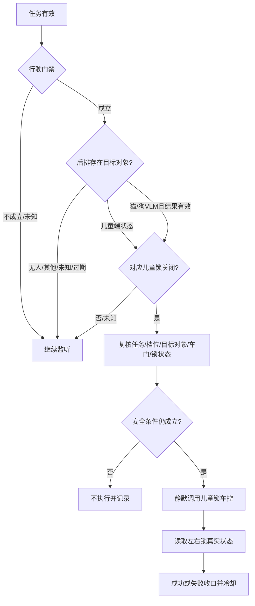

| P0问题 | 为什么必须确认 |
|---|---|
| `gear!=P`持续判断还是只在切入D时判断 | 决定晚到信号能否补触发，不能两套逻辑并存 |
| 儿童、老人+儿童、猫/狗的最终对象范围 | 当前两份资料枚举不一致 |
| 开左、右还是双侧儿童锁 | 车控动作参数和安全影响不同 |
| 车门打开时能否执行、最低车速是否需要 | 属于真实车控安全门禁 |
| 用户刚手动关闭后的抑制时长 | 防止系统与用户反复争抢控制权 |
| VLM结果有效期和连续帧要求 | 当前儿童VLM上报约5分钟，不能作为强实时唯一来源 |

验收底线：任何分支不得出现卡片或TTS；UNKNOWN/过期识别不得执行；执行前切回P档或任务关闭不得执行；车控超时先读真实锁状态，不能盲目重试。

| 儿童锁验收场景 | 预期 |
|---|---|
| 任务开、行驶门禁成立、儿童存在、锁关闭 | 按最终左右门策略静默执行一次 |
| VLM识别猫/狗且结果有效 | 若最终范围保留宠物，按规则静默执行 |
| P档/门禁不成立 | 不执行 |
| 识别UNKNOWN/过期/OTHER | 不执行 |
| 儿童锁已开 | 不重复执行 |
| 用户刚手动关闭 | 抑制期内不重新开启 |
| 执行前成员消失或车门状态不安全 | 复核失败，不执行 |
| 任意正常链路 | 不出现卡片或TTS |

## 14.3 任务三：后视镜自动加热

### 14.3.1 产品目标与端云口径

- 目标：雨水、洗车残留或高湿温差影响后视野时，静默开启加热。
- 最终交互结论：不出卡、不播TTS。
- 既有方案写“云端规则判断＋端侧执行，洗车退出后15分钟端侧计时”；专项需要韩杰/Trigger研发确认是否沿用该部署，还是将确定性规则一起下沉端侧。未确认前不能把部署位置写成已实现。

### 14.3.2 三个P0规则

| 场景 | 进入条件 | 动作/退出 | 未决项 |
|---|---|---|---|
| 雨天中低速 | 任务有效 AND 下雨 AND 车速`<70km/h` AND 档位≠P AND 加热关闭 | 静默开启 | 条件失效立即关闭还是固定周期 |
| 退出传送带洗车 | 任务有效 AND 新的洗车退出`event_id` AND 加热关闭 | 静默开启，端侧运行15分钟后关闭 | 正式事件ID、重放与计时恢复 |
| 高湿温差 | 任务有效 AND 湿度`>60%` AND 指定窗口内温差`>5℃` AND 加热关闭 | 静默开启 | 温差窗口、传感器、最长运行时间 |

| 输入/事件 | 当前资料字段/来源 | 状态 |
|---|---|---|
| 雨量 | 赛力斯雨量传感器，正式ID待提供 | 枚举待确认 |
| 车速 | `tri_speed / vehicle_control_0004` | 云端是否可直接消费待确认 |
| 档位 | 赛力斯端状态，正式ID待提供 | P/R/N/D/UNKNOWN |
| 洗车退出 | 赛力斯事件，正式ID待提供 | 必须有event_id和重放规则 |
| 湿度/温度序列 | 赛力斯传感器，正式ID待提供 | 采样频率、窗口和数据质量待确认 |
| 加热状态/车控 | 正式ID与错误码待提供 | 执行前和超时后均回读 |

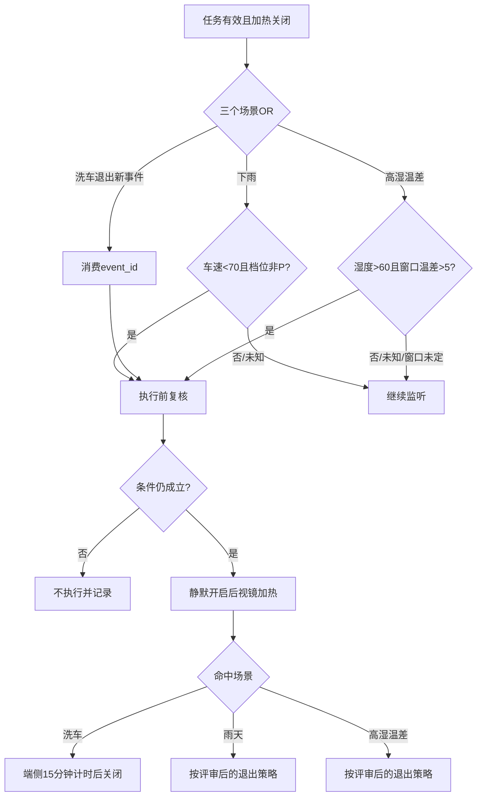

进入研发排期前必须关闭：温差窗口、雨天/高湿退出策略、三个场景最终是否都进915、正式传感器ID、加热动作与结果码、云端断网时的明确表现。

| 后视镜验收场景 | 预期 |
|---|---|
| 下雨、69km/h、非P、加热关 | 静默开启一次 |
| 下雨、70km/h | 按`<70`不触发 |
| 下雨但P档 | 不触发 |
| 新洗车退出事件 | 开启并端侧计时15分钟后关闭 |
| 重放同一洗车event_id | 不重复开启，不重置计时 |
| 湿度61%、温差大于5℃且窗口成立 | 静默开启一次 |
| 湿度60%或温差等于5℃ | 按严格大于规则不触发 |
| 任务关或加热已开 | 不触发、不重复调用 |

## 14.4 任务四：识别充电设备后打开充电口盖

### 14.4.1 已确认的主链路

这条任务不是“固定条件满足就直接开盖”，而是端侧先筛掉明显不需要的场景，再用云端DT/VQA判断附近是否真的存在充电设备，最后获得用户授权并由端侧执行。

```text
Trigger检测前置条件满足
→ 主动推荐携带Query“帮我看一下有没有充电桩，如果有的话打开充电口”
→ 主动推荐调用DT
→ DT调用VQA/获取端侧视觉数据并返回推理结果
→ 按专项结论获得用户授权：可以在DT前确认，也可以在FOUND后出卡确认
→ 端侧重新复核
→ 端侧打开充电口盖并回读状态
```

### 14.4.2 Trigger前置条件

```text
task_effective = true
AND ai_proactive_service_enabled = true
AND 收到目标切入P档事件
AND SOC <= 20%
AND charge_port_state = CLOSED
→ 只生成一次带task_id/event_id的主动推荐Query
```

| 输入/事件 | 当前资料字段/来源 | 状态 |
|---|---|---|
| AI主动服务总开关 | 正式SourceID待提供 | 与单任务状态独立 |
| 档位切入P | `tri_gear`是否复用待确认 | D/R/N任意到P还是指定来源档位待定 |
| SOC | 赛力斯端状态，正式ID待提供 | 当前方案阈值`<=20%` |
| 充电口盖 | 赛力斯端状态，正式ID待提供 | CLOSED/OPEN/OPENING/UNKNOWN |
| 主动推荐Query | Trigger→主动推荐正式接口待提供 | 必须带结构化上下文和event_id |
| DT/VQA结果 | 云端DT与端侧上行 | 正式协议、有效期和置信度待定 |
| 用户交互结果 | VUI/Planner，正式事件ID待确认 | 确认/拒绝/关闭/忽略/超时 |
| 开盖结果 | 赛力斯车控，正式能力ID待提供 | SUCCESS/FAILED/TIMEOUT和真实状态 |

`AI主动服务总开关`与`单个充电口任务有效状态`是两个不同闸门，平台和Trigger不能把它们合并成同一个字段。

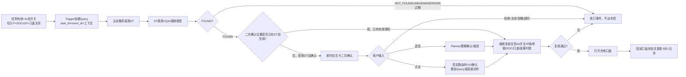

### 14.4.3 必须由专项关闭的交互问题

| 问题 | 当前可确认结论 | 为什么不能自行假设 |
|---|---|---|
| 二次确认发生在DT前还是FOUND后 | 待专项收口；产品建议可作为讨论输入但不是既定链路 | 影响调用成本、打扰率和授权语义 |
| 卡片属于静态Advisor还是三方系统通知链路 | 待徐洋按VUI规范确认 | 两类卡片的点击路由不同 |
| 点击“需要”直接执行还是模拟Query回Planner | 待确认 | VUI不同来源卡片规则不同 |
| TTS是否必需 | 卡片和二次确认已明确；TTS仍需最终确认 | 会议最终只明确儿童锁/后视镜不需要TTS |
| DT结果协议和有效期 | 至少区分FOUND/NOT_FOUND/UNKNOWN/ERROR/过期 | 过期或串单结果可能误开口盖 |

产品建议的DT结果最小字段：`task_id、event_id、result、confidence、result_time、valid_until、suggested_action、reason_code`。任何非FOUND、过期或event_id不一致结果均不得执行。

| 充电口验收场景 | 预期 |
|---|---|
| 任务开、AI总开关开、切P、SOC19、口盖关、DT FOUND、已授权 | 复核后打开一次并回读状态 |
| 单任务关闭或AI总开关关闭 | 不生成Query |
| SOC20/21 | 20按`<=20`进入候选；21不进入 |
| 口盖已开 | 不生成Query/不执行 |
| DT NOT_FOUND/UNKNOWN/ERROR | 不执行 |
| DT结果过期或event_id不一致 | 不执行并记录原因 |
| 用户拒绝/关闭/忽略/超时 | 不执行并频控 |
| 用户确认后切出P档 | 执行前复核失败 |
| 同一P档event_id重复 | 只生成一次Query、最多执行一次 |
| 车控超时但真实口盖已开 | 按状态回读成功收口，不重复开盖 |

## 14.5 四任务对框架能力的覆盖验证

| 框架能力 | 天气 | 儿童锁 | 后视镜 | 充电口盖 |
|---|:---:|:---:|:---:|:---:|
| 任务有效状态 | ✓ | ✓ | ✓ | ✓ |
| 端侧Trigger | ✓ | ✓ | 待部署确认 | 前置筛选 |
| 云端Trigger/推理 | — | — | 候选 | DT/VQA |
| 条件分支 | 雨/雪/雾 | 儿童/宠物 | 三场景OR | FOUND分支 |
| 时序/事件幂等 | 防抖 | 晚到信号 | 洗车事件/15分钟 | P档事件/DT有效期 |
| 无卡静默动作 | — | ✓ | ✓ | — |
| 即时交互卡 | ✓ | — | — | ✓ |
| TTS | ✓ | — | — | 待确认 |
| 本地可见即可说 | ✓ | — | — | — |
| Planner二次确认 | — | — | — | 候选/待确认 |
| 执行前复核 | ✓ | ✓ | ✓ | ✓ |
| 车控结果回读 | ✓ | ✓ | ✓ | ✓ |

如果某一行无法被平台能力、运行时接口或明确的研发代码承载，就说明框架仍有缺口；不能用“该case单独开发”掩盖缺口。
