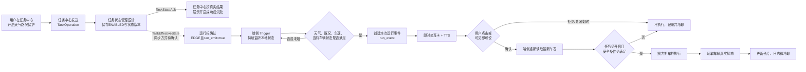
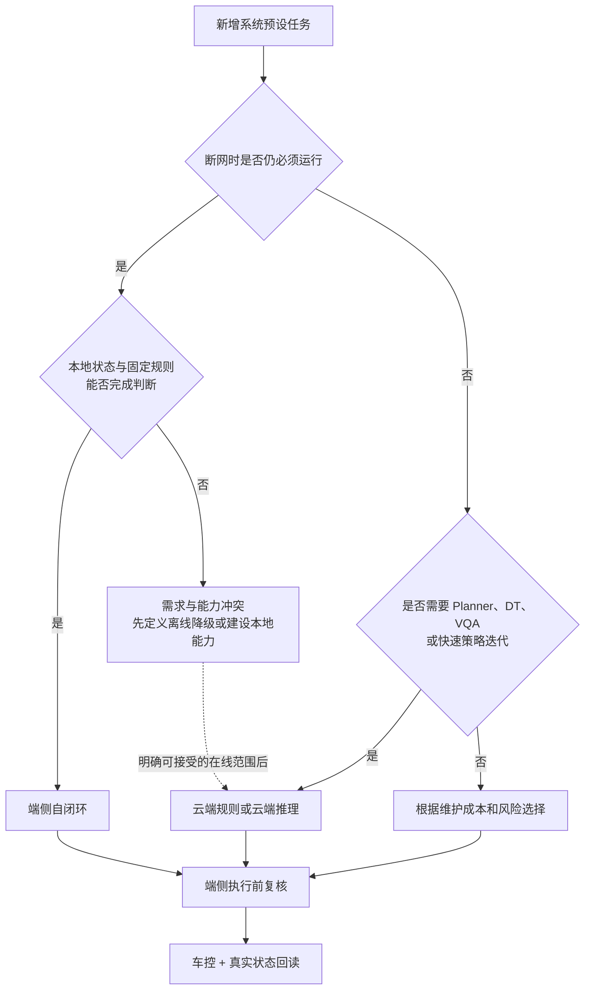
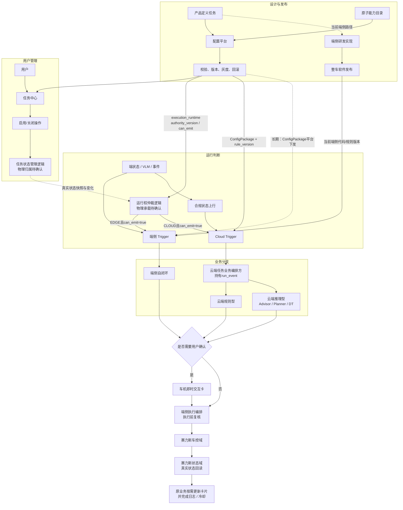
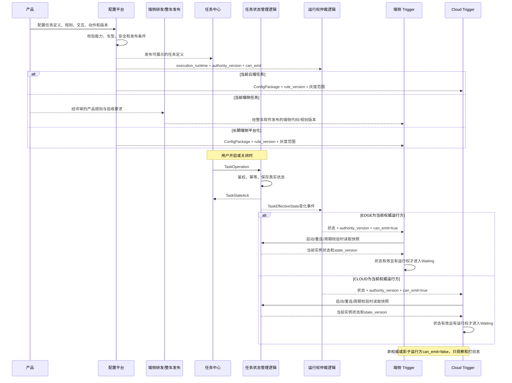
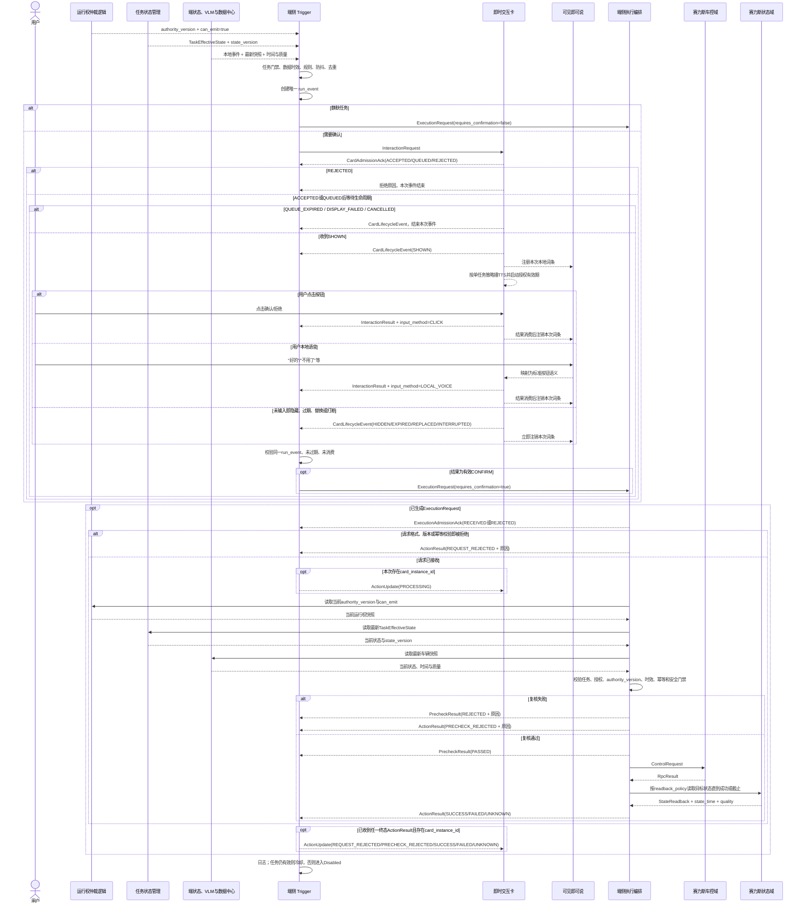
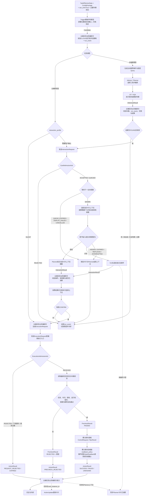
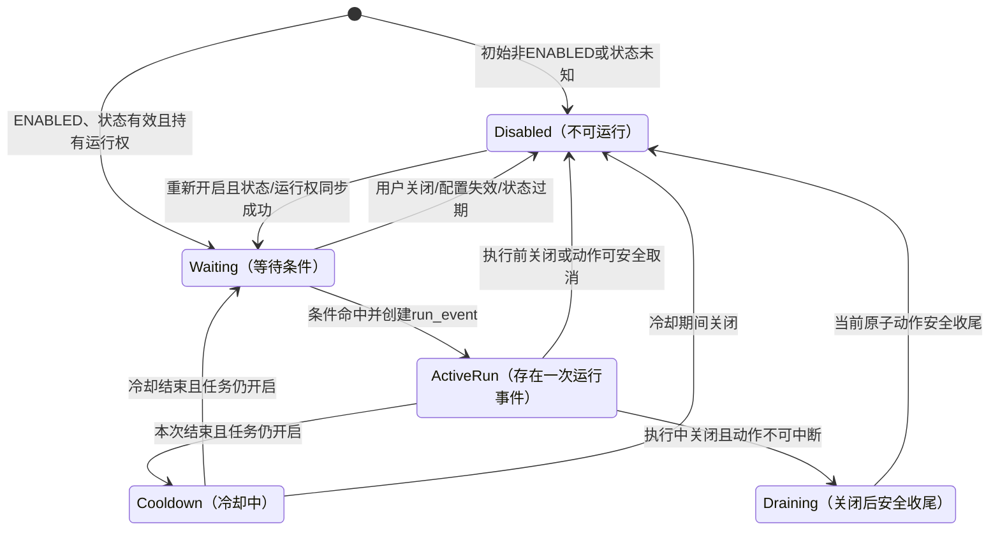
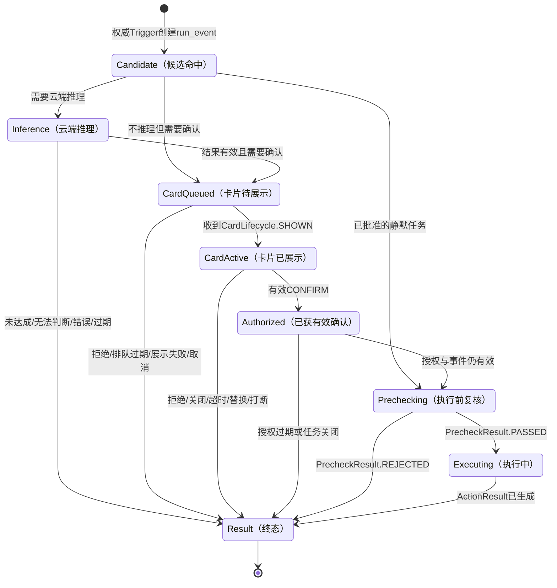

# PRD｜系统预设任务端云一体配置与执行框架

> 文档版本：V2.0（结构化重写版）  
> 文档日期：2026-09-03  
> 产品负责人：王泽民  
> 文档状态：框架专项评审稿，不代表研发排期承诺  
> 本次范围：系统预设任务公共框架、端侧链路、云端链路、即时交互卡对接、四任务映射、异常与验收  
> 字段说明：本文中的字段名是产品语义建议，不是已经发布的正式 IDL（研发正式接口定义）

## 文档标记

- **【会议已确认】**：可以作为本次需求基线。
- **【会上介绍方案】**：会议中讲过，但信号、接口或验收还没有全部确认。
- **【当前现状】**：当前真实能力，不等于长期目标。
- **【产品建议】**：为了补齐链路提出的产品方案，需要研发评审。
- **【待确认】**：会议没有结论，不能写成已经实现。
- **【资料冲突】**：不同资料口径不一致，必须选出唯一结论。

---

# 1. Summary｜需求摘要

## 1.1 一句话说明这份需求

【产品建议】本 PRD 将四个系统预设任务抽象为一套目标通用框架，用于框架专项评审。当前仍是“云端可配置一部分、端侧按任务开发、交互后半段未完全打通”，不能把下面的目标链路理解为已经实现。

```text
配置平台定义任务
→ 用户在任务中心开启或关闭任务
→ 任务中心发送操作，任务状态管理逻辑保存真实状态
→ 真实状态同步端侧或云端 Trigger
→ 端侧或云端 Trigger 判断当前是否应该触发
→ 需要确认时由即时交互卡询问用户
→ 端侧在车控前重新检查
→ 赛力斯车控执行
→ 读取车辆真实状态
→ 更新卡片、日志和冷却状态
```

【会议已确认】会上先把任务分为“端侧自闭环”和“云端配合”两大方向。为把云端内部差异讲清楚，本 PRD 再用【产品建议】把“云端配合”拆成规则型和推理型：

1. **端侧自闭环**：本地规则、本地交互、本地执行。天气/路况保护是当前明确样例。
2. **云端规则型**：云端判断固定规则，端侧复核并执行。后视镜加热可用于验证这类能力，但最终归属仍待确认。
3. **云端推理型**：先判断硬条件，再调用 Planner、DT/VQA 等云端能力，用户确认后回端侧执行。充电口盖是当前明确样例。

## 1.2 先用天气任务讲明白

【会议已确认】天气/路况保护当前按 VUI 第④类“端侧自闭环服务通知”落地，不经过 Planner；用户的本地语音确认先使用“可见即可说”。除这三个节点外，下图中的运行事件、状态 ACK（接收或保存结果）、执行前复核、真实状态回读和冷却都是【产品建议】的目标闭环，承载模块与正式接口待研发确认。



这张图中各模块的关系是：

- 在本系统预设任务链路中，任务中心展示任务、承接用户启停操作并展示业务回传结果；它不判断天气、SOC 等条件，也不负责真实任务执行。真实状态由哪个接入业务维护仍待确认。
- 运行权确保同一任务不会被端侧和云端同时触发。
- Trigger 判断“现在该不该发生”。
- 即时交互卡负责“怎么问、用户怎么选”。
- 端侧执行层判断“现在还能不能做”。
- 车控与状态服务回答“到底有没有做成”。

## 1.3 本次评审要得到什么

本次不是只评天气条件，也不是只评 Trigger。会议结束时需要拍板五类总问题：

1. 任务状态由谁保存，如何可靠进入端侧和云端 Trigger；
2. 端侧卡与云端卡怎样调用，语音、点击和生命周期分别回给谁；
3. ExecutionRequest（执行请求）、端侧复核、车控和真实状态回读怎样闭环；
4. 四条任务分别走哪条链路，业务规则、安全门槛和双方归属是什么；
5. 天气离线卡能力、充电视觉数据来源和推理结果合同如何消除冲突。

## 1.4 你本人、研发和下游分别要交付什么

| 你最关心的问题 | 直接答案 |
|---|---|
| 我负责什么 | 定义四任务的业务场景、触发规则、端云选择、交互策略、异常和验收；把未决项组织成会议结论 |
| 我给研发什么 | 端侧与云端流程图、四任务规则表、产品合同语义、状态机、异常规则、验收用例和 P0 决策清单 |
| Trigger 研发要补什么 | 当前支持证据、规则输入/输出、任务状态获取方式、去重频控、run_event 管理、正式接口和日志 |
| 即时交互卡团队要补什么 | 卡片准入与生命周期接口、端侧/云端语音路由、点击回调、TTS 策略、离线能力和展示失败原因 |
| 云端 Advisor / Planner / DT 要补什么 | 编排边界、视觉数据来源、推理枚举和有效期、卡片上下文及用户结果回流方式 |
| 端侧执行与赛力斯要补什么 | ExecutionRequest 正式 IDL、复核项、车控能力/错误码、状态回读、幂等和安全取消能力 |
| 测试要补什么 | 弱网、过期、重复、关闭、复核失败、RPC 成功但状态未达到等联调与实车证据 |
| 我不负责什么 | 不写端侧代码、不开发卡片或 Planner、不替研发设计正式 IDL、不默认亲自做生产配置和实车执行 |

---

# 2. Contacts｜参与人与评审职责

下表中的姓名是当前会议联系人，不等于已经确认的最终研发 DRI。正式 Owner 需要在专项评审中落表。

| 人员或团队 | 当前角色 | 本次需要回答的问题 | 本次产出 |
|---|---|---|---|
| 王泽民 | 系统预设任务产品 | 框架、四任务、端云归属、交互与验收是否完整 | 主 PRD、决策表、会后跟进 |
| 徐洋 / VUI | 即时交互卡产品接口人 | 端侧第④类卡、在线卡、TTS、语音和点击分别怎么接 | 卡片能力边界、调用方式、回调方式 |
| 郝晓伟 / 任务中心 | 任务中心对接人 | 用户启停后，真实任务状态由谁保存，现有接口如何给 Trigger | 协助确认真实状态 Owner、现有接口与缺口 |
| 韩杰 / Trigger 与配置平台相关团队 | 当前能力与框架评审 | 平台现在能配什么，端侧还要开发什么 | 能力现状矩阵、缺口与技术专项 |
| 汪帅等端侧研发 | 天气端侧链路 | Trigger、卡片、可见即可说、车控回读当前做到哪里 | 端侧实现边界、接口和联调计划 |
| Planner / Director 团队 | 在线语义与上下文 | 云端卡片语音和点击怎样进入同一次上下文 | 在线交互路由与消费协议 |
| DT / VQA 团队 | 云端视觉推理 | 充电设备识别输入、结果枚举、时效和错误怎么定义 | 推理请求与结果协议 |
| VLM / OMS / 端状态团队 | 信号提供方 | 天气、路况、儿童、宠物、车况信号是否存在且够准 | 正式信号 ID、枚举、周期、有效期 |
| 赛力斯产品 | 业务规则与双方边界 | 后视镜条件、防打扰验收、赛力斯自闭环清单 | 任务规则定稿、双方职责清单 |
| 赛力斯车控与状态团队 | 真实动作与真实结果 | 能力 ID、安全门禁、错误码、状态回读 | 车控和回读合同 |
| 测试团队 | 联调与实车验收 | 如何证明不误触发、不重复执行、不假成功 | 仿真、弱网和实车用例 |

---

# 3. Background｜背景与问题

## 3.1 为什么现在要做统一框架

【当前现状】9 月 1 日评审暴露的不是某一个任务写得不完整，而是整个系统预设任务存在四类断层：

### 断层一：任务中心和 Trigger 之间没有正式状态合同

任务中心有开启、关闭入口，但现有材料没有证明以下问题已经解决：

- 用户点击后，谁保存真实状态；
- 任务中心什么时候显示“开启成功”；
- Trigger 通过 Push、Pull 还是快照拿到状态；
- 车机重启、断连重连或漏事件后怎样恢复；
- 用户关闭任务时，已经弹出的卡片和正在执行的动作怎么办。

因此不能直接画成“任务中心按钮 → Trigger”。【产品建议】本 PRD 暂引入“任务状态管理”逻辑角色，用来表达“谁保存真实状态、谁向运行时提供状态”的责任；这不代表已经存在独立物理服务，最终可能由任务中心、任务系统或其他服务承载。

### 断层二：Trigger 命中以后没有统一后半段

天气前半段 Trigger 已推进，但命中以后还要回答：

- 出不出卡；
- 是否播 TTS；
- 语音由 Planner 还是可见即可说理解；
- 点击和语音结果回给谁；
- 用户确认以后谁重新检查；
- 车控失败或状态没有变化时怎样反馈。

即时交互卡是这段链路中的交互容器，不是业务判断者。

### 断层三：当前平台不是完整的端云一体任务平台

【会议已确认】当前 Trigger 平台只能配置部分能力：

- 云端可以配置一部分触发条件和频控；
- 端侧任务仍需要产品定义和端侧研发编码；
- 端云同步链路尚未完整建立；
- 即时交互卡、TTS、二次确认尚未完整沉淀成配置能力；
- 长期希望从平台统一配置并同步到端侧，但这不是当前事实。

### 断层四：天气“断网仍闭环”与卡片离线能力存在资料冲突

【资料冲突】7 月 28 日即时交互卡评审要求端侧规则链在无网时也能出卡和执行；另一份《赛力斯任务中心 PRD》却写到无网时即时交互卡无法推出。当前不能直接宣布“离线卡已经支持”，也不能因此放弃天气任务的弱网目标。

本次必须确认：任务中心 PRD 描述的是“云端下发卡无法推出”，还是当前即时卡容器本身没有离线展示能力。结论前，本文把“天气无网出卡 + 本地确认”定义为产品必须满足的目标，不标记为当前已实现。

## 3.2 这套系统解决什么问题

一条系统预设任务需要被统一描述为：

```text
任务 = 基础信息
     + 用户是否启用
     + 在哪里判断
     + 监听什么数据
     + 条件如何组合
     + 是否需要询问用户
     + 要执行什么动作
     + 异常和生命周期
     + 最终结果与日志
```

如果缺少其中任何一段，就会出现“能触发，但不能完整交付”的情况。

## 3.3 不要把三类业务和两个容器混在一起

| 名称 | 它是什么 | 王泽民在其中的责任 |
|---|---|---|
| 系统预设任务 | 系统预先提供、用户在任务中心决定是否启用的长期任务 | 负责从任务定义、Trigger、交互到执行结果的端到端产品闭环 |
| 模型主动服务 | 由专家任务集、Advisor 或 Planner 组织的主动推荐 | Trigger 提供条件判断能力；业务策略和对话闭环由对应主动服务负责 |
| 赛力斯自闭环服务 | 赛力斯内部判断并闭环的主动逻辑 | 需要和字节任务清单去重，避免双方重复拉卡或重复执行 |
| 即时交互卡 | 车机上的统一交互容器 | 不是业务类型，不决定任务归属，也不判断业务条件 |
| 消息盒子 | 一种消息或服务承载容器 | 不是主动服务的定义；不能用“是否进消息盒子”判断任务归属 |

范围说明：结合 8 月 18 日会议中的当前工作分工，王泽民涉及 Trigger 能力与系统预设任务方案；本 PRD 只处理系统预设任务的端到端框架。正式职责仍以项目分工表为准。

## 3.4 本次范围

本次包含：

- 系统预设任务的统一对象和模块边界；
- 配置平台与任务中心的职责；
- 端侧、云端规则型、云端推理型三类运行链路；
- 即时交互卡、TTS、点击、语音及生命周期；
- 执行前复核、车控、真实状态回读；
- 四条系统预设任务的框架映射；
- 状态机、异常、埋点、验收与发布门槛。

本次不包含：

- 不在配置平台重新开发 Planner、TTS、卡片渲染或底层车控；
- 不承诺所有能力已经平台化；
- 不在 PRD 中替研发确定正式类名、IDL 和物理服务；
- 不把所有弱网卡片自动降级为可见即可说；
- 不把儿童锁的“无卡、无 TTS”推导成“已批准自动车控”；
- 不替赛力斯决定双方最终业务边界。

---

# 4. Objective｜目标与成功标准

## 4.1 产品目标

建立一套可复用的系统预设任务框架，让新增任务时优先组合已有能力，而不是重新开发一条私有链路。

## 4.2 关键结果

| 目标 | 可验收结果 |
|---|---|
| KR1：公共模型成立 | 四条任务都能用同一组对象和状态表达，没有私有断点 |
| KR2：端云边界明确 | 每条任务能说明为什么放端侧、云端或端云混合 |
| KR3：业务链路闭合 | 从用户启停、Trigger 判断、交互、复核、执行到回读都有责任方 |
| KR4：接口可对接 | 研发能说清五次关键握手分别给什么、返回什么 |
| KR5：不会误执行 | 任务关闭、状态未知、结果过期、用户拒绝、复核失败都不会车控 |
| KR6：不会假成功 | 用户确认和 RPC 成功均不作为最终成功，必须看真实车辆状态 |
| KR7：能力现状透明 | 每项能力都标明已支持、开发中、缺失或待确认 |
| KR8：会议可收口 | 每个 P0 开口项都有决策人、结论和下一份交付物 |

## 4.3 非目标

- 本次评审不直接承诺开发时间；
- 不要求第一阶段就完成所有端侧规则平台化；
- 不为可见即可说新建离线大模型；
- 不让产品经理承担端侧编码、生产配置、实车执行或正式接口设计；
- 不把一个任务的特殊规则塞进公共框架。

---

# 5. Market Segments｜用户与使用场景

这里的“用户”不是按年龄区分，而是按使用问题区分。

| 用户问题 | 用户希望系统怎么做 | 产品约束 |
|---|---|---|
| 雨雪雾影响驾驶安全 | 及时提醒，并在我同意后提供保护 | 弱网仍要工作；不能误切模式或误开灯 |
| 后排有儿童或宠物 | 在合适时机降低误开车门风险 | 识别结果可能低频；安全授权必须单独确认 |
| 后视镜受雨水或水汽影响 | 在视野受影响前自动加热 | 不能用矛盾条件；需明确何时关闭 |
| 低电量且到达充电区域 | 识别附近充电设备并在我确认后开盖 | 需要视觉推理；云端结果会延迟或过期 |
| 用户不想被反复提醒 | 系统记住拒绝并降低打扰 | 基础频控与连续拒绝防打扰是两个能力 |
| 用户关闭某条任务 | 立即停止新触发，不再悄悄执行 | 关闭在途卡片或动作的规则必须明确 |

共同运行约束：

- 车辆可能弱网、断网、重启；
- 端状态、VLM、DT 结果可能未知、乱序或过期；
- 用户等待卡片时可能手动改变车况；
- 同一事件可能重复上报；
- 云端建议与车端最新状态可能不一致；
- 任何真实车控都必须以车端最新状态为准。

---

# 6. Value Propositions｜价值主张

## 6.1 对用户的价值

- **安全**：强实时场景不把云端作为唯一安全入口。
- **可控**：用户可以按任务开启或关闭；需要授权的动作不会偷偷执行。
- **少打扰**：相同事件不会反复弹卡，拒绝、关闭和超时会进入冷却。
- **真实**：只有车辆状态真的改变，才告诉用户“已完成”。
- **一致**：卡片、按钮、TTS 和失败提示使用统一规则。

## 6.2 对业务和研发的价值

- 新任务复用公共链，不再重复接任务状态、卡片和车控；
- 端云边界清楚，问题能快速定位到 Trigger、VUI、Planner、DT 或车控；
- 配置、版本、事件和执行结果可以追踪；
- 能按单个任务、车型或版本灰度、关闭和回滚；
- 能避免字节与赛力斯重复判断、重复弹卡和重复执行。

## 6.3 为什么要分端侧和云端

端侧和云端不是“谁更高级”，而是解决不同问题。

| 判断维度 | 适合端侧 | 适合云端 |
|---|---|---|
| 断网时是否必须工作 | 必须工作 | 可以接受本次不触发 |
| 响应速度 | 需要立即判断 | 可以接受上行、排队和推理时间 |
| 数据 | 本地车辆实时状态就足够 | 需要多源信息、历史或云工具 |
| 规则 | 明确的 AND、OR、阈值、状态变化 | 需要 Planner、DT、VQA 或复杂上下文 |
| 迭代 | 随车版本发布，周期较长 | 策略和工具可更快更新 |
| 风险 | 能做最后一道本地安全门禁 | 结果可能延迟、断网或过期 |

无论主要判断在哪里，真实车控都要回到端侧复核并读取真实状态。



---

# 7. Solution｜详细方案

## 7.1 系统预设任务的统一对象

### 7.1.1 三类对象必须分开

| 对象 | 人话解释 | 示例状态 | 建议标识 |
|---|---|---|---|
| 任务定义 | 系统里“天气路况保护”这类任务是什么 | 草稿、已发布、已下线 | `task_definition_id` |
| 任务实例 | 某辆车、某个账号是否开启这条任务 | ENABLED、DISABLED、UNKNOWN | `task_instance_id` |
| 运行事件 | 这一次天气条件命中、弹卡和执行 | Waiting、CardActive、Executing、Result | `run_event_id` |

卡片和动作还应分别有 `card_instance_id`、`action_request_id`。这些名称是【产品建议】，正式名称由研发确定。

任务定义还必须指定唯一运行权：`execution_runtime`（端侧或云端的 run_event 权威方）、`authority_version`（单调递增的运行权版本，也叫 fencing token）和 `can_emit`（是否允许产生有效事件）。同一车辆、同一任务、同一版本只能有一个运行方 `can_emit=true`；迁移、灰度或影子运行方可以观察和打日志，但不能创建有效 run_event、拉卡或车控。`pre_filter_location`（硬条件预筛位置）可以单独配置：即使端侧替云端任务预筛，端侧也只发送 Candidate，仍由云端权威方创建正式 run_event。run_event、交互和执行请求都要携带创建时的 `authority_version`，端侧车控前再与当前版本比较，旧版本必须拒绝。

为什么要分开：

- 修改任务定义，不等于替所有用户开启任务；
- 用户开启任务，不等于当前条件已经满足；
- 同一任务可以一天命中多次，每次都必须有独立运行事件；
- 旧卡片的“确认”不能执行新的事件。

### 7.1.2 九个核心逻辑模块

【产品建议】下表定义的是目标逻辑责任，不表示当前已经存在九个独立的物理服务。一个现有系统可以承载多个逻辑责任，但接口、Owner 和成功口径不能因此混在一起。

| 模块 | 负责什么 | 不负责什么 |
|---|---|---|
| 配置平台 | 定义任务、选择能力、校验、版本、发布、灰度和回滚 | 不实时监听车辆，不渲染卡片，不车控 |
| 任务中心 | 展示任务，让用户开启或关闭，展示真实处理结果 | 不判断天气、SOC 或是否有充电桩 |
| 任务状态管理 | 保存某辆车的真实任务状态，向运行时提供快照和变化 | 这是逻辑角色；物理承载方和 Owner 当前待确认 |
| 运行权仲裁 | 确保本车本任务同一版本只有一个端侧或云端权威运行方 | 不做业务条件判断；不能让影子链路出卡或车控 |
| 端侧 / Cloud Trigger | 监听状态、判断规则、防抖、去重；只有持有有效运行权的一方可创建 run_event | 不负责卡片界面，不把确认直接当成功，不与另一运行方重复触发 |
| 云端任务业务编排方 | 持有云端 run_event，串联 Advisor、Planner、DT、卡片和端侧执行 | 不替端侧做最后安全判断，不直接车控 |
| 即时交互卡 | 展示、TTS、按钮、语音入口、生命周期、返回用户选择 | 不判断业务条件，不直接持有裸车控指令 |
| 端侧执行编排 | 校验执行请求、重读最新状态、做执行前复核、保证幂等、汇总最终结果 | 不渲染卡片，不把 RPC 成功直接当业务成功 |
| 赛力斯车控与状态域 | 进行整车安全门禁和物理动作，并输出车辆真实状态 | 不决定何时触发、是否拉卡以及云端推理逻辑 |

还要特别区分两个名字：

- **任务中心**是用户看见并操作任务的车机入口；
- **TaskService**如果出现在云端推理技术方案中，是管理运行任务或观察生命周期的服务，不等于任务中心。它是否参与某一条系统预设任务，需要在技术方案中明确。

## 7.2 总体框架

下面是【产品建议】的目标框架，用来补齐会议暴露的断点；它不表示这些模块和接口已经全部实现。



这张图只表达业务数据流。虚线处的正式协议、物理服务和 Owner 仍需要技术专项确认。

## 7.3 配置平台需要具备什么能力

配置平台负责“定义和发布”，不参与实时判断。当前与目标必须分开。

| 能力域 | 当前可确认 | 第一阶段最低要求 | 长期目标 |
|---|---|---|---|
| 任务定义 | 有零散任务和部分字段 | 统一 ID、版本、车型、Owner、execution_runtime、pre_filter_location 和唯一运行权 | 完整模板和版本治理 |
| 任务状态 | 任务中心有启停入口 | ACK、真实状态、启动快照、关闭处理 | 端云统一实例状态 |
| 条件和事件 | 云端可配部分；端侧依赖研发 | 四任务所需规则可表达，代码实现处明确标注 | 同一规则模型生成云端或端侧规则包 |
| 时序治理 | 云端可配部分频控 | 防抖、去重、冷却、事件幂等 | 统一生命周期策略 |
| 即时交互卡 | 资料显示存在通用容器和多种调用方案；系统预设任务稳定接口与离线能力待 Owner 举证 | 天气和充电完成标准接入、回调和失败处理 | 标准交互 Profile 可配置 |
| TTS | 存在基础播报能力；系统预设任务的策略接口和量产状态待举证 | 是否播、文案、禁用降级可明确传递 | 队列、打断、优先级统一配置 |
| 二次确认 | 资料分别描述在线和本地方案；是否已形成通用量产接口待举证 | 本地确认与云端确认各跑通一条 | 标准结果和生命周期统一 |
| 可见即可说 | 存在相关能力说明；任务词条、生命周期接入和量产状态待举证 | 天气完成词条、同义词、注册和注销 | 少量本地任务通过标准通道接入 |
| Planner / DT | 资料中已有 Planner、DT/VQA 相关方案与单点能力；系统预设任务的正式调用方式、量产状态和结果合同待举证 | 充电链路的上下文、结果、时效和错误明确 | 工具与任务编排标准化 |
| 执行与回读 | 资料显示车控和状态存在单点能力；统一入口与闭环接口未确认 | 统一 ExecutionRequest、复核、ActionResult | 统一动作目录和安全门禁 |
| 发布治理 | 云端部分支持，端侧随车发布 | 能按任务关闭，配置与代码版本可追踪 | 灰度、回滚、审计和端侧规则同步 |
| 日志 | 各链路分散 | 三类 ID 串联全链 | 统一可观测平台 |

发布前至少要拦截：没有唯一任务 ID、能力或车型不支持、没有唯一运行权、确认任务缺按钮/回调/超时、TTS 缺禁用策略、车控缺复核、UNKNOWN 被当满足、缺少去重/冷却/版本回滚，或字节与赛力斯对同一场景重复拉卡和执行。

## 7.4 公共任务管理链目标方案：从配置平台到 Trigger

这段四条任务共用，只定义一次。会议只确认任务中心存在独立开关，没有确认状态保存方、Push/Pull 和快照接口；下图是本次需要评审的【产品建议】完整链。



这条链同时给 Trigger 三类完全不同的数据：

1. **任务定义与规则版本**：告诉 Trigger“用什么规则判断”；
2. **某辆车的真实任务状态**：告诉 Trigger“这位用户是否允许该规则运行”；
3. **唯一运行权**：告诉系统“这次只能由端侧还是云端产生有效 run_event”。

三者缺一不可。只有开关、没有规则，Trigger 不知道判断什么；只有规则、没有真实开关，Trigger 可能在用户关闭后继续运行；没有唯一运行权，端云可能重复出卡和重复执行。

### 7.4.1 每一步谁负责

| 步骤 | 谁负责、在哪里 | 输入 | 判断 | 输出 | 失败处理 |
|---|---|---|---|---|---|
| 定义任务 | 产品 + 配置平台，云端后台 | 任务、规则、交互、动作、版本 | 字段完整、能力存在、车型支持 | 已发布任务定义 | 校验失败禁止发布 |
| 端侧实现与发布 | 产品、端侧研发、整车软件发布 | 已评审规则和验收要求 | 车型、版本、能力依赖是否匹配 | 当前端侧代码/规则版本 | 当前不能伪装成配置平台已直接下发 |
| 展示任务 | 任务中心，车机 | 任务定义、适用范围 | 当前车是否可见、可操作 | 任务卡和当前状态 | 不支持时展示原因 |
| 发送操作 | 任务中心 | 用户启用或关闭 | 标识合法、操作允许 | `TaskOperation` | 超时不能直接显示成功 |
| 保存状态 | 任务状态管理逻辑，物理位置待定 | 操作、车辆、账号、版本 | 鉴权、幂等、是否为新版本 | ENABLED / DISABLED / UNKNOWN + ACK | 保存失败保留旧值，任务中心回滚 |
| 同步 Trigger | 状态业务 + Trigger | 真实状态、版本、更新时间 | 是否同车、同账号、最新版本 | Waiting 或 Disabled | UNKNOWN 或同步失败禁止新触发 |
| 分配运行权 | 运行权仲裁逻辑，物理承载待定 | execution_runtime、authority_version、can_emit | 本车本任务是否只有一个权威运行方 | 仅权威 Trigger 可创建 run_event | 冲突时双方均不得触发并告警 |
| 重启恢复 | Trigger + 状态业务 | 全量快照 | 是否漏事件、版本是否一致 | 恢复正确状态并重新评估 | 快照失败保持不可运行 |
| 关闭在途事件 | Trigger、卡片、执行层 | DISABLE + 当前运行阶段 | 等待、出卡、已确认还是执行中 | 撤卡、停止或安全收尾 | 【待确认】按状态逐项定义 |

### 7.4.2 Trigger 最少需要拿到的任务状态

| 产品语义 | 用途 |
|---|---|
| 任务定义 ID | 知道是哪一类任务 |
| 任务实例 ID | 知道是哪辆车、哪个账号的状态 |
| ENABLED / DISABLED / UNKNOWN | 决定是否允许新触发 |
| 状态版本 | 防止旧事件覆盖新状态 |
| 更新时间 | 判断状态是否过期 |
| 变化原因 | 区分用户关闭、系统失效、车型不支持等 |

`TaskStateAck` 至少要带：操作成功或失败、`task_instance_id`、保存后的最终有效状态、`state_version`、更新时间和失败原因。任务中心只能在收到这个“保存后的真实结果”后显示开启成功，不能用按钮自己的视觉状态代替。

【待确认】系统预设任务是否允许“删除”、删除后能否恢复，当前资料存在口径差异。本版只把 `ENABLE` 和 `DISABLE` 作为公共必需操作；`DELETE` 不能和“关闭”混成同一个状态。

### 7.4.3 如何避免运行中漏掉关闭事件

只在启动时拉一次快照不够；如果运行中漏掉 DISABLE，Trigger 仍可能继续触发。正式方案至少要具备以下一种可靠组合，并由研发拍板：

1. 变化事件带 `state_version`，Trigger 返回消费 ACK，未确认时状态业务重试；
2. 可靠订阅之外，Trigger 周期性拉取全量或增量快照进行对账；
3. 为任务状态定义有效期，超过有效期且无法刷新时进入 UNKNOWN 并禁止新触发；
4. 收到更小版本、重复版本或乱序事件时不回滚真实状态，并记录告警。

运行权迁移还必须采用“先撤后开”：先把旧运行方设为 `can_emit=false`，确认旧方已停止或排空；再提升 `authority_version` 并让新运行方 `can_emit=true`。迁移状态不确定时，端云双方都必须为 `can_emit=false`。旧事件即使已经拿到用户确认，也会因携带旧 `authority_version` 在端侧复核时被拒绝。

### 7.4.4 需要和郝晓伟确认的话

【会上介绍方案】7 月 3 日会议中，晓伟将任务中心描述为 HMI 展示端，并说明预置条件任务不是由 Director 创建，而是通过其他路径创建。该表述不能证明任务中心是否承担状态持久化，也没有确认 `taskId + enabled` 通过哪个正式接口到达 Trigger；正式状态 Owner、Push/Pull、ACK 和启动快照仍待确认。

你可以直接这样问：

> “我先确认物理承载：如果现有任务中心同时承担状态持久化，那么它就是本文‘任务状态管理’的承载方；如果不是，请明确是哪一个服务。用户点击开启后，请返回保存成功后的 TaskStateAck，至少包含 task_instance_id、最终有效状态、state_version、更新时间和失败原因，任务中心收到后才更新展示。端侧和 Cloud Trigger 还需要 TaskEffectiveState 的变化通知，以及重启或重连时的全量快照。请晓伟帮忙确认现有哪一段已经具备、哪一段需要 Task 新增逻辑。”

## 7.5 端侧任务链路

### 7.5.1 什么任务放端侧

同时满足以下特点时优先放端侧：

- 弱网或断网仍必须工作；
- 依赖本地最新车辆状态；
- 规则可以用 AND、OR、阈值和状态变化明确描述；
- 对响应时间敏感；
- 涉及真实车控，需要最接近车辆的安全门禁。

端侧不等于永远不上云。配置、版本、日志和结果仍可以在网络恢复后同步云端。

### 7.5.2 端侧目标闭环（产品方案，接口和实现状态待评审）

本图承接 7.4：此时 Trigger 已经取得真实任务状态、适用规则和唯一运行权。天气的端侧直接拉卡、不经过 Planner、语音先用可见即可说，是【会议已确认】的方向；图中的统一 run_event、卡片准入与生命周期、执行前复核和结果回读合同属于【产品建议】。



需要特别看懂三个点：

1. `QUEUED` 只表示卡片在排队，用户还没有看见；只有收到 `SHOWN` 后，才能注册可见即可说、播 TTS 并启动授权有效期。
2. 用户点击和本地语音走不同入口，但最后都回到 Trigger，变成同一种标准 `InteractionResult`，并保留输入方式。
3. 执行层不直接更新 UI。它把 `ActionResult` 回给原业务；原业务只在本次确实有卡片时，再发 `ActionUpdate`。

### 7.5.3 端侧每个模块负责什么

| 环节 | 谁负责、在哪里 | 收到什么 | 判断什么 | 输出什么 | 失败怎么办 |
|---|---|---|---|---|---|
| 数据生产 | VLM、OMS、赛力斯信号方，车端 | 摄像头或车辆状态 | 数据质量，不做完整业务规则 | 带时间戳、来源、质量的结构化值 | 不确定输出 UNKNOWN |
| 数据快照 | 端侧数据中心 | 状态变化和最新值 | 来源、时间、新旧值 | 事件通知和完整快照 | 不能用默认值冒充缺失值 |
| 条件判断 | 端侧 Trigger | 任务状态、规则、完整快照 | 时效、AND/OR、阈值、触发沿、防抖 | 候选场景 | 任一关键值 UNKNOWN/过期则停止 |
| 仲裁去重 | 端侧 Trigger | 一个或多个候选 | 重复、冷却、执行中、优先级 | 唯一 run_event | 丢弃并记录原因 |
| 拉起卡片 | Trigger 提供业务数据；VUI 渲染 | 文案、按钮、TTS、路由、有效期 | 请求能否接收、何时真正可见 | CardAdmissionAck、CardLifecycleEvent | 需要授权时不得降级为静默执行 |
| 收集确认 | 卡片 + 可见即可说 | 点击或本地语音 | 卡片是否存活、表达是否能明确映射 | 标准 InteractionResult | 歧义、关闭、超时均不执行 |
| 复核 | 端侧执行编排，承载模块待定 | ExecutionRequest、最新任务、运行权和车况 | 任务仍开、authority_version仍有效、授权有效、条件仍成立、目标未达到 | ExecutionAdmissionAck、PrecheckResult | 旧运行权返回 STALE_AUTHORITY；其他变化也立即终止 |
| 车控 | 赛力斯车控域 | ControlRequest、参数、幂等键 | 整车安全门禁、能力支持 | RpcResult 和错误码 | 明确拒绝、失败或超时 |
| 状态回读 | 赛力斯状态域 | 目标状态和车辆标识 | 当前真实状态及时间是否可信 | StateReadback | 回读超时返回 UNKNOWN |
| 业务收口 | 原端侧业务 / Trigger | RpcResult、StateReadback | 目标状态是否真的达到 | ActionResult、按需 ActionUpdate、冷却 | 未达到目标就不能记成功 |

### 7.5.4 端侧 Trigger 与即时交互卡的边界

一句话：**Trigger 判断什么时候问；卡片负责怎么问和用户怎么选；Trigger 或端侧业务拿到选择后决定能不能继续。**

双方的具体输入输出统一见 7.7“端到端产品合同”，这里不再重复字段。

卡片不能：

- 判断天气、车速或当前模式；
- 决定是否执行车控；
- 把按钮点击直接显示为“车辆已完成”。

## 7.6 云端任务链路

### 7.6.1 先分清两类云端任务

| 类型 | 谁判断 | 是否需要 Planner / DT | 是否出卡 | 示例 |
|---|---|---|---|---|
| 云端规则型 | Cloud Trigger 用确定性规则判断 | 业务判断不需要；开放语音确认可能使用 Planner | 由 interaction_profile 决定静默或确认 | 后视镜加热能力验证样例，最终归属待确认 |
| 云端推理型 | Trigger 硬条件判断层先过门禁，云端编排继续判断 | 需要 Planner、DT/VQA 或上下文 | 通常需要确认 | 识别充电设备后打开充电口盖；硬 Trigger 物理位置待确认 |

“云端任务”不是说卡片画在云端，也不是云端直接控制车辆。卡片仍显示在车机，真实动作仍由端侧复核和执行。

### 7.6.2 完整云端流程

先用三句话分工：

- Trigger 硬条件判断层先过任务状态、SOC、挡位等确定性门禁；充电场景的物理部署位置待技术专项确认；
- 云端任务业务编排方持有本次 run_event，并串起 Advisor / Planner、DT、卡片和端侧执行；
- DT / VQA 只负责模型或视觉推理，不直接出卡，也不直接开车控。

【会上介绍方案】充电口基线是“硬条件 → Query → DT/VQA → 确认发现充电设备 → 卡片和 TTS 询问 → 用户确认 → 端侧执行”。若要把用户确认提前到 DT 前，属于方案变更，必须重新评审。图中的正式卡型、点击路由、执行接口和结果同步仍待专项确认。



图中的“点击形成标准事件并按卡型同步 Planner 已消费”是【产品建议】。VUI 文档中的不同卡型存在不同点击路径，充电口最终采用哪一类卡、点击是否模拟 Query，需要徐洋和研发确认。云端规则型没有卡片、也没有 Planner 时，只回传 `ActionResult` 给原业务并完成日志和冷却，不能调用不存在的卡片或上下文。

### 7.6.3 云端公共入口

| 环节 | 谁负责、在哪里 | 输入 | 判断 | 输出 | 失败怎么办 |
|---|---|---|---|---|---|
| 加载任务 | Cloud Trigger，云端 | 任务定义、真实状态、规则版本 | 任务和依赖是否有效 | Waiting | 非 ENABLED 不运行 |
| 状态上行 | 车端信号方和上行链路 | 必要车辆状态、时间、质量 | 只上传任务需要的数据 | 云端状态或事件 | 断网不生成新的云端候选 |
| 数据门禁 | Cloud Trigger | 多源状态 | 同车、同事件、新鲜、非 UNKNOWN | 合法快照 | 旧值、乱序和过期全部丢弃 |
| 硬条件判断 | Trigger 硬条件判断层，充电场景物理位置待定 | 任务状态和硬条件 | 规则、防抖、去重、冷却 | Candidate；若只是端侧预筛，不创建正式 run_event | 网络恢复不补发已经过期动作 |
| 接管运行事件 | 云端任务业务编排方，物理承载待定 | Candidate、CLOUD运行权和上下文引用 | 是否有 `can_emit=true`，并创建唯一 run_event | 后续调用或结束原因 | 无运行权、过期或重复均拒绝 |

### 7.6.4 云端规则型

云端规则型的业务判断不需要把 Planner 强行放进链路，但是否询问用户仍由该任务的 `interaction_profile` 决定：

```text
Cloud Trigger 规则命中
→ 读取interaction_profile
  ├─ SILENT：直接进入执行请求
  └─ CONFIRM：先出卡，取得有效确认后再进入执行请求
→ 云端原业务生成带有效期与幂等键的 ExecutionRequest
→ 端侧执行入口返回 ExecutionAdmissionAck
→ 端侧读取最新状态并复核；失败返回 PrecheckRejected
→ 赛力斯车控
→ 真实状态回读
→ ActionResult 回到云端原业务
→ 无卡时只做日志和冷却；有卡时由原业务更新卡片
```

如果确认卡支持开放语音，Planner 只参与理解这次用户表达，不参与前面的确定性规则判断。

它适合可用明确规则表达、但希望云端快速修改策略且能接受断网漏掉一次便利动作的任务。

### 7.6.5 云端推理型

| 环节 | 谁负责、在哪里 | 收到什么 | 判断什么 | 输出什么 | 失败怎么办 |
|---|---|---|---|---|---|
| 接管事件 | 云端任务业务编排方，云端 | Trigger Candidate、硬条件快照、运行权 | 是否同车、同任务、同版本且 `can_emit=true` | 创建唯一 run_event，进入 Advisor/Planner/DT 编排 | 无运行权、重复或过期则丢弃 |
| 生成建议 | 云端任务业务编排方调用 Advisor，云端 | run_event、硬条件快照、固定 Query | 本次应调用什么能力 | Advice / Query | 无合法路径则结束本次事件 |
| 在线编排 | Planner / Director，云端 | Query、结构化上下文、工具列表 | 是否需要 DT/VQA、如何继续 | 工具调用或交互请求 | 工具不可用不能直接生成车控 |
| 视觉推理 | DT / VQA，云端和车端取数链 | 观察目标、车辆、相机、run_event | 图像是否属于当前事件、是否识别到目标 | InferenceResult 回给云端任务业务 | 非 FOUND、过期或取数失败均停止 |
| 拉起卡片 | 云端任务业务提供内容，车机 VUI 展示 | 有效推理结果、run_event、卡片内容、路由 | 请求能否接收、何时真正展示 | CardAdmissionAck + 生命周期 | 未收到 SHOWN 不得开始确认 |
| 用户语音 | Planner / Director → 云端任务业务 | 语音 + 当前卡片上下文 | 确认、拒绝、歧义 | 标准 InteractionResult | 歧义或超时停止 |
| 用户点击 | VUI → 云端任务业务 | 按钮、卡片和 run_event | 是否仍有效、是否已经消费 | 标准 InteractionResult | 是否同步 Planner 按卡型确认 |
| 下发执行 | 云端任务业务 | 授权、推理依据、动作、有效期 | 所有信息是否属于同一事件 | ExecutionRequest | 缺字段或过期不下发 |
| 端侧复核 | 端侧执行编排 | 执行请求、最新本地状态 | 任务、车况、授权、推理是否仍有效 | ExecutionAdmissionAck、PrecheckResult | 以端侧最新状态为准 |
| 车控回读 | 赛力斯车控域 + 状态域 | ControlRequest 与目标状态 | 目标状态是否达到 | RpcResult、StateReadback、ActionResult | RPC 超时先回读，不盲重试 |

### 7.6.6 Planner 与 Director 的关系

Planner 是业务名称，Director 是内部名称，本文把它们视为同一决策职能。流程图中不能画成两个必须前后串行的模块。

## 7.7 端到端产品合同

【产品建议】下面是产品层需要对齐的业务对象，不冒充正式 IDL（研发正式接口定义）。三个首次出现的术语先翻译：

- **ACK**：接收方明确告诉发送方“收到、保存成功、排队或拒绝”的结果；
- **IDL**：研发最终约定的字段名、类型和接口定义；
- **RPC**：一个模块调用另一个模块后返回的调用结果，它不等于车辆已经达到目标状态。

| 阶段 | 产品合同 | 提供方 → 接收方 | 它回答什么 | 失败原则 |
|---|---|---|---|---|
| 用户启停 | `TaskOperation` | 任务中心 → 任务状态管理 | 用户想开启还是关闭哪条任务 | 超时不能把界面当真实状态 |
| 保存结果 | `TaskStateAck` | 任务状态管理 → 任务中心 | 是否保存成功、最终有效状态和状态版本 | 失败时任务中心展示旧真实状态和原因 |
| 运行状态 | `TaskEffectiveState` | 任务状态管理 → Trigger | 当前这辆车是否允许该任务运行 | UNKNOWN、过期或旧版本禁止新触发 |
| 规则发布 | `ConfigPackage` | 配置平台 / 发布服务 → Trigger | 应使用哪一版条件、交互、动作、灰度和唯一运行权 | 校验失败、版本不匹配或 `can_emit=false` 不得触发 |
| 一次命中 | `RunEvent` | 权威 Trigger / 云端原业务创建并持有 | 这一次条件命中是谁、何时创建、当前阶段及创建时的 authority_version | 无运行权或同一幂等键已有事件时拒绝 |
| 请求推理 | `InferenceRequest` | 云端任务业务 → Planner / DT / VQA | 对哪辆车、哪次事件、什么目标、哪段时间的数据做判断 | 缺车辆、run_event、观察目标或截止时间则拒绝 |
| 推理结果 | `InferenceResult` | Planner / DT / VQA → 云端任务业务 | 目标是否发现、用的哪帧、结果何时过期 | 非 FOUND、串事件、过期或低质量不得继续 |
| 请求出卡 | `InteractionRequest` | 原业务 → 即时交互卡 | 展示什么、怎么说、怎样回调、多久失效 | 需要确认时出卡失败不得静默执行 |
| 卡片准入 | `CardAdmissionAck` | 即时交互卡 → 原业务 | 请求被 ACCEPTED、QUEUED 还是 REJECTED | QUEUED 不等于用户已经看见 |
| 卡片生命周期 | `CardLifecycleEvent` | 即时交互卡 → 原业务 / 语音路由 | 何时 SHOWN、HIDDEN、EXPIRED、REPLACED 或 INTERRUPTED | 不是 SHOWN 就不能开始授权窗口；消失立即注销上下文 |
| 用户选择 | `InteractionResult` | 卡片 / Planner / 可见即可说 → 原业务 | 用户确认、拒绝、关闭、超时或表达歧义 | 过期、重复、串事件全部拒绝 |
| 请求执行 | `ExecutionRequest` | 原业务 → 端侧执行编排 | 要执行什么、凭什么执行、何时过期、复核什么 | 任一必填依据缺失不进入车控 |
| 执行准入 | `ExecutionAdmissionAck / PrecheckResult` | 端侧执行编排 → 原业务 | 请求是否接收、最新状态复核是否通过 | 明确返回拒绝原因，不能无响应地结束 |
| 物理调用 | `ControlRequest / RpcResult` | 端侧执行编排 ↔ 赛力斯车控域 | 车控是否接收并处理调用 | RPC 成功不等于业务成功 |
| 状态回读 | `StateReadback` | 赛力斯状态域 → 端侧执行编排 | 车辆真实状态是否达到目标 | 超时或不可信返回 UNKNOWN |
| 最终结果 | `ActionResult` | 端侧执行编排 → 原业务 | 本次动作最终 SUCCESS、FAILED、UNKNOWN 或被复核拒绝 | 必须带原因和真实状态证据 |
| 更新交互 | `ActionUpdate` | 原业务 → 即时交互卡 | 正在执行、成功或失败如何刷新 | 仅本次存在 card_instance_id 时调用 |

### 7.7.1 云端推理请求与结果要表达什么

| 对象 | 最少信息 | 用途 |
|---|---|---|
| InferenceRequest | 车辆、任务、run_event、固定 Query、观察目标、取数来源、帧时间范围、截止时间、回调目标 | 明确“判断谁、判断什么、用哪段数据、结果回给谁” |
| InferenceResult | FOUND / NOT_FOUND / UNKNOWN / ERROR、车辆、run_event、帧时间、结果时间、有效期、置信度/原因、证据引用 | 防止旧帧、错车、错事件或不可判断结果继续拉卡和执行 |

【产品建议】如果结果进入现有 Trigger → TaskService 链路，需要再映射成当前“达成 / 未达成 / 无法判断”口径；原始推理枚举与业务结果枚举不能混成一个接口。

### 7.7.2 InteractionRequest 最少要表达什么

| 信息 | 为什么需要 |
|---|---|
| 任务定义、任务实例和本次 run_event | 防止串任务、串车辆和旧卡误执行 |
| authority_version | 卡片返回结果时让原业务识别它是否属于旧运行权 |
| source_type | 区分端侧 Trigger 或云端业务发起 |
| interaction_mode | 区分静默、只告知、本地确认、云端确认 |
| 标题、正文、按钮和标准选项 | 让卡片知道展示什么、返回什么 |
| TTS 策略与文案 | 说明是否播报，以及语音禁用时如何降级 |
| voice_route | 端侧可见即可说、云端 Planner 或无语音 |
| click_route | 点击结果回给哪个业务 |
| created_at / expires_at | 防止过期卡片和过期授权 |
| priority | 解决多张卡和用户主动 Query 的仲裁 |
| callback | 结果返回给哪一个运行事件 |

### 7.7.3 卡片必须返回三类结果

1. **准入结果**：请求被接受、排队或拒绝；
2. **用户结果**：确认、拒绝、关闭、超时、打断、歧义；
3. **生命周期结果**：真正展示、隐藏、过期、被替换、打断或恢复。

卡片不能只返回“按钮被点击”。业务必须知道点击属于哪一张卡、哪一次触发、是否仍有效。尤其要区分：`CardAdmissionAck=QUEUED` 只代表进入队列，`CardLifecycleEvent=SHOWN` 才代表用户已经看见。

### 7.7.4 业务执行后还要更新卡片

端侧执行编排先把 `ActionResult` 返回原业务，再由原业务把以下结果更新给卡片；这样无卡的静默任务不会和 UI 耦合：

- 正在执行；
- 执行成功；
- 执行失败；
- 车辆真实状态；
- 用户可理解的失败原因；
- 卡片继续保留还是关闭。

### 7.7.5 ExecutionRequest 最少要表达什么

| 信息 | 为什么需要 |
|---|---|
| 任务定义、任务实例和 run_event | 确保请求属于正确车辆、任务和本次命中 |
| `action_request_id` | 用于幂等执行和结果回传 |
| `source_type` | 区分端侧、云端规则或云端推理来源 |
| `authority_version` | 端侧执行前与当前运行权比较；旧版本返回 STALE_AUTHORITY |
| `action_id + parameters` | 明确执行哪个能力以及参数 |
| `expected_target_state` | 定义读取到什么真实状态才算成功 |
| `requires_confirmation` | 区分静默任务与必须确认的任务 |
| 授权证据和过期时间 | 仅 `requires_confirmation=true` 时必填 |
| 推理结果引用和有效期 | 仅云端推理任务必填 |
| `request_expires_at` | 禁止端侧执行过期请求 |
| `idempotency_key` | 防止重试造成重复车控 |
| `precheck_requirements` | 明确端侧必须重读哪些状态和门禁 |
| `callback_target` | ACK、复核拒绝和最终结果回给哪个原业务 |

当 `requires_confirmation=true` 时，缺少有效授权必须拒绝；静默任务不要求伪造授权，但必须是已经批准的任务策略，并通过端侧最新安全复核。

### 7.7.6 端侧与云端卡片的区别

| 项目 | 端侧确认卡 | 云端确认卡 |
|---|---|---|
| 卡片显示位置 | 车机 | 车机 |
| 谁决定拉卡 | 端侧 Trigger / 端侧业务 | 云端业务 / Advisor 链路 |
| 谁理解语音 | 本地可见即可说 | Planner / Director |
| 点击回流 | 回原端侧业务 | 回云端业务，并按正式方案同步 Planner 已消费 |
| 断网 | 目标是天气链仍可完成本地确认 | 无云端上下文时不能伪造在线结果 |
| 卡片消失 | 注销本次本地词条 | 注销当前云端选择上下文 |

## 7.8 任务实例与 run_event 两层状态机

【产品建议】长期“任务实例”和一次“run_event”不是同一个对象，因此分两张图表达。任务实例回答“这条任务能不能继续运行”；run_event 回答“这次条件命中走到哪一步”。

### 7.8.1 任务实例状态



### 7.8.2 单次 run_event 状态



任务关闭规则：进入车控前一律取消本次事件并使授权失效；执行中可安全取消则取消，不可取消的原子动作允许安全收尾，但不得执行任何后续动作，也不得创建新事件。run_event 结束后，根据最新任务状态进入 `Cooldown` 或 `Disabled`。具体可取消动作清单由赛力斯车控专项确认。

### 7.8.3 最终成功的唯一口径

```text
业务成功 = 授权仍有效（需要授权的任务）
         AND authority_version仍为当前运行权版本
         AND 执行前复核通过
         AND 动作请求被正确处理
         AND 车辆真实状态达到目标
```

- 用户点“确认”只代表授权；
- Planner 识别为“是”只代表授权；
- DT 返回 FOUND 只代表推理条件成立；
- RPC 返回成功只代表请求被接受；
- 只有车辆真实状态达到目标，才能显示 SUCCESS。

### 7.8.4 状态回读策略

每个动作必须配置 `readback_policy`，不能只读一次就立即判定：

| 信息 | 产品含义 |
|---|---|
| `expected_target_state` | 目标车辆状态，例如充电口盖为 OPEN |
| 回读截止时间 | 最晚等待到什么时候，超过后不再宣称成功 |
| 轮询间隔 | 多久读取一次，避免过密调用或只读到动作过渡态 |
| 连续稳定次数 | 目标状态连续满足几次才视为稳定成功 |
| 数据质量要求 | 来源、时间、有效性必须达到什么标准 |
| 截止后的终态 | 明确失败则 FAILED；仍无法确认则 UNKNOWN，不能显示 SUCCESS |

RPC 超时但真实状态已经达到目标时，可按业务策略判为成功；RPC 成功但真实状态未达到目标时，必须判为 FAILED 或 UNKNOWN。正式时间值由各车控能力专项确认。

### 7.8.5 频控与防打扰

| 能力 | 解决什么问题 | 当前结论 |
|---|---|---|
| 事件幂等 | 同一事件只执行一次 | 必须具备 |
| 处理中锁 | 卡片或执行中不重复触发 | 必须具备 |
| 冷却时间 | 短时间内不重复提醒 | 必须具备，具体值待任务确认 |
| 每上电周期次数 | 控制系统调用频率 | 云端已有部分配置；端侧现状待核 |
| 连续拒绝策略 | 根据用户负反馈降低打扰 | 【待确认】赛力斯尚未给出正式方案 |

基础频控不能代替连续拒绝后的用户防打扰。

## 7.9 四条任务如何落入框架

### 7.9.1 总表

| 任务 | 当前框架位置 | 为什么 | 交互 | 执行 | 当前确定程度 |
|---|---|---|---|---|---|
| 天气/路况保护 | 端侧自闭环 | 弱网、实时本地状态、固定规则、安全窗口 | 卡片 + TTS；可见即可说/点击 | 端侧复核后切模式或开雾灯 | 主方向已确认；信号和接口待补 |
| 后排儿童/宠物儿童锁 | 端云归属待确认 | 静默规则任务，但识别低频且动作安全敏感 | 已确认无卡、无 TTS | 是否允许静默车控待安全评审 | 【产品建议/发布门槛】安全签字前不可进入自动车控发布验收 |
| 后视镜自动加热 | 归属待确认；如字节承接可验证云端规则型 | 固定规则、无需对话，但可能更适合赛力斯自闭环 | 已确认无卡、无 TTS | 端侧复核和加热 | 规则与双方归属未定 |
| 识别充电设备后打开充电口盖 | 云端推理型；硬 Trigger 位置待确认 | 需要 Query、DT/VQA 和在线语义 | 卡片 + TTS + 二次确认；点击路由待定 | 端侧复核后开盖 | 主链明确；接口与交互待补 |

### 7.9.2 天气/路况保护

**用户场景**  
车辆行驶中遇到雨雪雾或危险路面，系统在适当时机询问用户是否开启对应保护能力。

**当前链路**  
【会议已确认】端侧自闭环；端侧直接拉卡；不经过 Planner；本地语音先走可见即可说。

**候选触发规则**  

| 子场景 | 候选条件 | 用户确认后的动作 | 待确认 |
|---|---|---|---|
| 雨天/湿滑 | 任务有效 AND 车速 > 30 km/h AND（天气=下雨 OR 路面=湿滑）AND 当前非湿滑模式 | 切换湿滑驾驶模式 | 正式枚举、防抖次数、退出策略 |
| 下雪/结冰 | 任务有效 AND 车速 > 30 km/h AND（天气=下雪 OR 路面=覆雪/结冰）AND 当前非雪地模式 | 切换雪地模式 | 是否还要开雾灯存在资料冲突 |
| 浓雾 | 任务有效 AND 车速 > 30 km/h AND 天气=浓雾 AND 后雾灯关闭 | 开启后雾灯 | 信号 ID 和准确率 |

这些是【会上介绍方案】，不是已经完成准确率和实车验收的能力。

**数据来源**

- 天气、路况主要来自端侧 VLM；
- 车速、驾驶模式和后雾灯来自端状态；
- “天气传感器”表述不准确，雨量或雨刮信号是否接入仍待确认；
- 任一关键值 UNKNOWN 或过期时不触发。

**交互**

除“端侧直接拉卡、不经过 Planner、语音先用可见即可说”的会议结论外，以下拒绝后冷却、旧卡失效、执行前复核和真实状态成功口径均为【产品建议】，需按 7.5 与 7.7 的合同评审。

- 正常：即时交互卡 + 固定 TTS + 点击/可见即可说；
- 语音禁用：【会上介绍方案】天气任务只出卡、不播 TTS、只允许点击；其他端侧任务必须逐项确认；
- 用户拒绝、关闭、超时：不执行并进入冷却；
- 卡片失效后再说“好的”：不能执行旧事件。

**执行前复核**

- 任务仍开启；
- 车速和对应天气场景仍成立；
- 目标模式或灯仍未开启；
- 同一 run_event 尚未执行；
- 授权仍在有效期内。

**成功标准**  
读取到湿滑模式、雪地模式或后雾灯真实状态达到目标。

### 7.9.3 后排儿童/宠物识别后开启儿童锁

**用户场景**  
车辆行驶时发现后排有儿童或指定宠物，希望降低误开车门风险。

**当前结论**

- 【会议已确认】不出卡、不播 TTS；
- 【会上介绍方案】儿童识别可能来自 OMS，宠物判断拟依赖 VLM；正式信号及接入链路待确认；
- 【会议已确认】宠物识别能力约 5 分钟一次，当前只有猫、狗有评测数据。

**不能直接写成正式方案的部分**

- 端侧还是云端；
- 非 P 挡持续判断还是切入 D 挡事件；
- 是否批准完全静默自动车控；
- 开左侧、右侧还是双侧儿童锁；
- 车门、车速和用户手动关闭后的抑制规则；
- 五分钟前的宠物结果是否还能用于安全动作。

**产品发布门槛**  
【产品建议】在以上问题获得安全、车控和业务共同签字前，本任务只进入专项评审，不进入自动车控发布验收。无卡、无 TTS 不等于已经获得用户授权。

### 7.9.4 后视镜自动加热

**用户场景**  
雨水、洗车残留或高湿温差影响后视野时，系统自动开启加热。

**当前结论**

- 【会议已确认】不出卡、不播 TTS；
- 会议介绍了三个候选场景，但没有完成体验审核；
- 是否应由字节承接，还是赛力斯自闭环，仍待双方清单评审。

**候选规则，不是最终规则**

| 场景 | 资料中的候选条件 | 当前问题 |
|---|---|---|
| 雨天 | 【资料冲突】9 月 1 日会议稿为“P 挡 + 车速 < 70”；《后视镜加热自动开启功能分析》为“非 P 挡 + 车速 < 70” | 会议已指出 P 挡与车速组合缺少业务意义；不得任选一版，需赛力斯给唯一条件 |
| 洗车 | 洗车模式退出事件 | 是否开启 15 分钟、重启如何恢复、重复事件如何处理待确认 |
| 高湿温差 | 湿度 > 60 + 车辆行驶 + 温差 > 5℃ | 温差窗口、采样方式和退出策略待确认 |

**如果由字节框架承接**  
它可以使用“云端规则型 → 端侧复核 → 加热 → 状态回读”的链路验证框架，但该归类不能替代双方业务归属结论。

### 7.9.5 识别充电设备后打开充电口盖

**用户场景**  
车辆低电量进入停车状态时，系统识别附近是否有充电设备，确认后帮助打开充电口盖。

**会上主链与产品闭环补全**

```text
Trigger 判断前置条件
→ 生成主动推荐事件和固定 Query
→ 主动推荐调用 DT
→ DT 调用 VQA / 获取车辆视觉数据
→ 识别结果为 FOUND 且仍有效
→ 车机即时交互卡询问用户
→ 用户确认
→ 【以下为产品建议】生成ExecutionRequest并下发端侧
→ 端侧重新检查
→ 开盖并读取真实口盖状态
```

会议材料明确到“用户确认后打开充电口盖”；上面从 ExecutionRequest、执行前复核、幂等到真实状态回读的部分，是本 PRD 为补齐安全闭环提出的【产品建议】，正式承载方和接口待研发确认。

**候选前置条件**

```text
单任务有效
AND AI / SLS 主动服务总开关开启
AND 切入 P 挡
AND SOC <= 20%
AND 充电口盖为 CLOSED
```

【产品建议】暂将单任务有效状态与 AI / SLS 总开关建模为两个独立门禁；两者是否都由该任务强制校验、状态从哪里取得，待专项确认。

**云端推理结果门禁**

- 【产品建议】DT/VQA 原始结果至少区分 FOUND、NOT_FOUND、UNKNOWN、ERROR；若复用当前 Trigger → TaskService 链路，需要映射为“达成 / 未达成 / 无法判断”，正式枚举和映射由技术专项确认；
- 必须带本次 run_event 和结果时间；
- 非 FOUND、过期、串车辆或串事件都不能出执行请求；
- 系统生成的 Query 只是任务请求，不是用户已经授权开盖。

**视觉数据来源待确认**

- 是直接复用默认 AlwaysOn 感知进入 Context 的最新结果，还是由本任务发起专属 VQA 观察；
- 当前资料显示动态任务主要消费本任务专属结果，默认 Context 能否复用尚未确认；
- 无论选择哪条路，结果都必须绑定车辆、任务和本次 run_event，并定义取帧时间、结果时间与有效期。

**交互结论与待确认**

- 【会上介绍方案】当前基线为 DT/VQA 判断 FOUND 后再出卡询问；如改成 DT 前询问，按方案变更重新评审；
- 【会议已确认】该任务需要卡片、TTS 和二次确认；
- 使用静态 Advisor 卡还是三方系统通知卡；
- 用户点击直接回业务，还是模拟 Query 回 Planner；
- TTS 的具体文案、播放时机、排队、打断和语音禁用降级仍待确认；
- 用户语音原则上由 Planner 理解，当前卡片上下文如何注册和销毁仍待确认。

**端侧复核**

- 单任务和 AI 总开关仍开启；
- 车辆仍在 P 挡并已停稳；
- 口盖仍关闭；
- DT 结果和用户授权仍有效；
- 同一 run_event 没有执行过。

**成功标准**  
读取到充电口盖真实状态为 OPEN。RPC 超时后先读状态，不能盲目重复开盖。

## 7.10 异常和验收规则

| 异常 | 端侧任务处理 | 云端任务处理 | 验收结果 |
|---|---|---|---|
| 任务为 DISABLED | 不订阅或不创建新事件 | 不创建新候选 | 不出卡、不 TTS、不车控 |
| 任务状态 UNKNOWN | 请求快照，禁止新触发 | 请求状态，禁止新触发 | 不猜测为开启 |
| 关键数据 UNKNOWN / 过期 | 本轮结束 | 本轮结束 | 不触发 |
| 重复事件或仍在冷却 | 丢弃并记录 | 丢弃并记录 | 最多处理一次 |
| 卡片展示失败 | 需要确认的任务停止 | 需要确认的任务停止 | 不能静默执行 |
| 用户拒绝、关闭或超时 | 不执行并冷却 | 不执行并同步消费状态 | 无车控 |
| 卡片过期后用户说“好的” | 本地词条已注销 | 云端上下文已注销 | 旧事件不能执行 |
| 用户确认后车况变化 | 执行前复核失败 | 端侧拒绝云端请求 | 无车控，并记录原因 |
| 语音禁用 | 天气只出卡、不播 TTS | 各任务按已确认策略处理 | 点击仍可用的任务可继续 |
| 无网 | 天气目标为本地闭环 | 不使用旧云结果补执行 | 不伪装云端成功 |
| DT 非 FOUND 或过期 | 不适用 | 结束事件 | 不出执行请求 |
| RPC 成功但状态未达到 | 记失败或未知 | 同步端侧真实结果 | 不能显示成功 |
| 端云同时产生同一建议 | 用任务、事件和去重键仲裁 | 用任务、事件和去重键仲裁 | 最多执行一次 |
| 日志上报失败 | 本地缓存补报 | 失败重试 | 不改变真实执行结论 |

### 7.10.1 最小验收用例

| 编号 | 前提与操作 | 预期结果 | 主要验收方 |
|---|---|---|---|
| AT-01 | 天气任务关闭，其余天气条件全部满足 | 不创建 run_event，不出卡、不播 TTS、不车控 | 任务中心 + Trigger |
| AT-02 | 天气任务开启，雨天/湿滑条件满足，用户确认 | 复核通过后只切湿滑模式；真实模式达到后才显示成功 | Trigger + VUI + 车控 |
| AT-03 | 天气条件满足，但语音处于禁用状态 | 只出卡、不播 TTS；点击确认仍可进入复核 | VUI + 语音模块 |
| AT-04 | 天气卡已经关闭或超时，用户随后说“好的” | 本地词条已经注销，旧 run_event 不执行 | 可见即可说 + Trigger |
| AT-05 | 用户确认天气调整后，车速或场景发生变化 | 执行前复核失败，不调用车控 | 端侧执行层 |
| AT-06 | 儿童锁任务满足候选条件，但安全方案尚未签字 | 不进入量产自动车控；全过程无卡、无 TTS | 产品 + 安全 + 车控 |
| AT-07 | 后视镜候选规则中的 P 挡与车速条件仍未修正 | 配置平台禁止发布该规则 | 配置平台 + 赛力斯产品 |
| AT-08 | 充电任务开启，AI总开关开启，P挡、SOC=20%、口盖关闭，DT=FOUND，用户确认 | 端侧复核后开盖一次；真实状态 OPEN 后才成功 | Trigger硬条件层 + 云端任务业务 + DT + VUI + 车控 |
| AT-09 | 充电任务 SOC=21%，或 DT 返回 NOT_FOUND / UNKNOWN / ERROR | 不产生可执行授权，不开盖 | Trigger + DT |
| AT-10 | 充电用户确认后车辆切出 P 挡 | 端侧拒绝执行并回传复核失败 | 端侧执行层 |
| AT-11 | 同一 run_event 被重复投递，或云端和端侧同时生成相同候选 | 最多展示一次、最多执行一次 | 端云 Trigger + VUI + 执行层 |
| AT-12 | 车控 RPC 返回成功，但真实车辆状态未达到目标 | 最终结果为 FAILED 或 UNKNOWN，不能展示 SUCCESS | 赛力斯状态 + 原业务 |
| AT-13 | 云端结果已过期后网络恢复 | 不补执行旧动作；根据新事件重新判断 | Cloud Trigger + 端侧执行层 |
| AT-14 | 任务中心启停保存失败 | 任务中心回滚到真实旧状态，Trigger不按视觉开关运行 | 任务中心 + 状态业务 |
| AT-15 | 天气条件满足但车辆断网 | 若离线卡能力通过专项验收，则本地出卡、点击/可见即可说和端侧执行仍可闭环；若能力不支持，必须在发布前阻断天气方案而不是伪装成功 | VUI + 端侧 Trigger + 任务中心 |
| AT-16 | 卡片请求返回 QUEUED，但尚未收到 SHOWN | 不注册本地词条、不播本次 TTS、不启动用户授权有效期 | VUI + 可见即可说 |
| AT-17 | 卡片收到 HIDDEN、EXPIRED、REPLACED 或 INTERRUPTED | 立即注销本次交互上下文；之后的点击或“好的”不能消费旧 run_event | VUI + 原业务 |
| AT-18 | 产品框架中的某个云端规则型静默任务执行 | ActionResult 只回云端原业务并完成日志、冷却；不调用卡片或 Planner；本用例不代表后视镜归属已确定 | Cloud Trigger + 原业务 |
| AT-19 | 充电推理结果来自错误车辆、错误 run_event、过期帧或未确认的数据源 | 云端任务业务拒绝出卡或执行；能够从日志看到明确拒绝原因 | DT/VQA + 云端任务业务 |
| AT-20 | 同一车辆、任务和规则版本在端云均部署，端侧为权威、云端为影子 | 仅端侧 `can_emit=true` 并创建有效 run_event；云端只记录观察结果，不出卡、不执行 | 配置平台 + 端云 Trigger |
| AT-21 | 运行期间漏掉一次 DISABLE 变化事件 | 通过版本 ACK 重试或周期快照发现新状态；状态过期未刷新时禁止新触发 | 状态管理 + Trigger |
| AT-22 | 旧运行方已创建 run_event 并获得确认，此时任务运行权切换到新方 | 端侧复核发现请求的 authority_version 已过期，返回 PrecheckResult(REJECTED, STALE_AUTHORITY)，不得进入车控 | 运行权仲裁 + 端云 Trigger + 端侧执行 |

## 7.11 日志和可观测性

每次运行至少记录：

1. 任务定义、任务实例、状态版本和规则版本；
2. 输入值、来源、时间、质量和有效期；
3. 每个条件节点的结果；
4. 防抖、去重、频控和冷却结果；
5. run_event 创建和结束原因；
6. 卡片请求、展示 ACK、TTS、点击、语音、关闭和超时；
7. Planner / DT / VQA 输入输出的合规摘要；
8. 执行前复核的每个门禁；
9. 车控请求、错误码和真实状态回读；
10. 最终结果和全链耗时。

推荐使用同一 trace 关联：

```text
task_definition_id
+ task_instance_id
+ run_event_id
+ card_instance_id（如有）
+ action_request_id
```

---

# 8. Release｜评审、实施与发布

## 8.1 建议实施顺序

【产品建议】下表是为了降低联调风险提出的顺序，不代表已经批准的排期、版本承诺或资源投入。

| 阶段 | 目标 | 不代表什么 |
|---|---|---|
| 当前 | 端侧天气前半段在推进；云端可配置部分条件；卡片和模型有各自基础能力 | 不代表端云一体平台已经完成 |
| 第一阶段 | 闭合天气端侧链：任务状态、卡片、TTS、可见即可说、复核、车控和回读 | 不要求所有端侧任务已可平台下发 |
| 第二阶段 | 闭合充电云端链；补齐端到端产品合同、卡片生命周期、日志和统一状态机 | 不默认儿童锁和后视镜已经可发布 |
| 第三阶段 | 儿童锁完成安全专项；后视镜完成规则和双方归属评审 | 不在未签字时自动车控 |
| 长期 | 原子能力目录、统一配置、端侧规则下发、版本灰度和回滚 | 需要另行技术方案与排期 |

## 8.2 框架评审必须关闭的 P0 问题

### 8.2.1 会上先按五类总决策收口

| 顺序 | 总决策 | 本轮必须得到的结果 | 对应细项 |
|---|---|---|---|
| 1 | 任务状态与运行权合同 | 谁保存真实状态；任务中心何时显示成功；Trigger 如何拿变化和快照；端云谁能创建有效事件 | P0-01～03、16 |
| 2 | 端侧卡与云端卡合同 | 谁拉卡；卡片何时算展示；语音、点击、关闭和超时回给谁 | P0-04～07、13 |
| 3 | 执行与真实结果合同 | 谁接 ExecutionRequest、谁复核、谁车控、谁回读、怎样算成功 | P0-08～09 |
| 4 | 四任务业务结论 | 每条任务端云归属、安全门槛、双方边界和防打扰规则 | P0-10～12 |
| 5 | 云端推理输入输出 | DT 原始结果如何映射；充电视觉来自哪条感知流；怎样绑定本次事件 | P0-14～15 |

不要在现场从 P0-01 一路机械念到 P0-15。先说当前讨论的是哪一类总决策，再进入对应子问题；每一类都记录“结论、Owner、下一份产物、完成节点”。

### 8.2.2 十六个可执行子问题

| 编号 | 问题 | 当前建议 | 需要谁确认 | 会后产物 |
|---|---|---|---|---|
| P0-01 | 任务真实状态由谁保存 | 建立任务状态管理逻辑角色；物理承载方待定 | 郝晓伟、Trigger | 状态时序和正式接口 |
| P0-02 | Trigger 如何拿到任务状态 | 启动快照 + 变化事件 + 版本幂等 | 任务中心、端云 Trigger | Push/Pull/ACK 技术方案 |
| P0-03 | 关闭任务时在途事件怎么办；是否支持删除 | 未授权立即取消；执行中按动作安全性处理；DELETE单独定义 | 任务中心、Trigger、VUI、车控 | 分状态关闭表与删除语义 |
| P0-04 | 即时卡提供哪些标准能力 | CardAdmissionAck、CardLifecycleEvent、InteractionResult、ActionUpdate | 徐洋、VUI 研发 | 卡片产品合同与 IDL |
| P0-05 | 天气可见即可说如何接 | 业务给词条；卡展示后注册，消失后注销 | 徐洋、端侧交互研发 | 词条和生命周期方案 |
| P0-06 | 云端卡点击和语音走哪里 | 语音走 Planner；点击标准化并同步已消费 | 徐洋、Planner、卡片研发 | 云端交互路由方案 |
| P0-07 | 充电是否沿用 DT 后确认基线 | 会上介绍方案为 FOUND 后出卡；任何提前确认均按变更评审 | 充电业务、徐洋、DT | 确认基线或变更结论 |
| P0-08 | 执行前复核由谁承载 | 统一在端侧执行入口完成 | 端侧架构、车控 | ExecutionRequest 和复核接口 |
| P0-09 | 真实成功如何定义 | 以车辆状态达到目标为准 | 赛力斯车控、状态、VUI | ActionResult、超时与错误码 |
| P0-10 | 儿童锁能否静默自动执行 | 未完成安全签字前不可进入自动车控发布验收 | 儿童锁产品、安全、车控 | 安全专项结论 |
| P0-11 | 后视镜由谁做 | 先拿赛力斯自闭环清单再定 | 双方产品 | 唯一责任边界 |
| P0-12 | 连续拒绝如何防打扰 | 与基础频控分开设计 | 赛力斯产品、Trigger | 本期范围或规则结论 |
| P0-13 | 天气无网时即时卡能否真正展示 | 区分云下发限制与本地容器能力；以实车证据拍板 | 徐洋、任务中心、端侧研发 | 离线卡能力结论与验收录像 |
| P0-14 | DT 原始结果与 TaskService 结果如何映射 | 明确 FOUND 等原始枚举到达成/未达成/无法判断的映射 | Trigger、TaskService、DT | 正式枚举与接口说明 |
| P0-15 | 充电视觉数据从哪里来 | 在默认 Context 与任务专属 VQA 中选择唯一主链并定义有效期 | Planner、DT/VQA、Trigger | 取数时序和结果绑定方案 |
| P0-16 | 端云谁拥有唯一运行权 | 区分 execution_runtime 与 pre_filter_location；先撤旧方再开新方；请求携带 authority_version 并在车控前复核 | 配置平台、端云 Trigger、端侧执行、架构 | 运行权分配、迁移与 STALE_AUTHORITY 方案 |

## 8.3 产品、研发和测试分别做什么

| 角色 | 应负责 | 不默认负责 |
|---|---|---|
| 王泽民 / 产品 | 场景、业务规则、端云原因、交互策略、产品字段、异常、验收和跨团队结论 | 端侧编码、卡片组件开发、正式 IDL、生产配置、实车执行 |
| 各模块研发 | 说明当前能力，设计正式接口，开发、联调、日志和故障处理 | 替产品决定用户体验和业务规则 |
| 赛力斯产品与车控 | 提供正确规则、车端信号、车控门禁和双方边界 | 把未经确认的表格条件直接当量产需求 |
| 测试 | 建环境和用例，完成仿真、弱网、异常和实车验证 | 替产品或研发补规则 |

## 8.4 王泽民下一步怎么做

### 会前

1. 把本 PRD 发给郝晓伟、徐洋、韩杰、端侧 Trigger、Planner/DT、赛力斯产品和车控。
2. 要求每个团队在能力矩阵中补“已支持 / 开发中 / 缺失 / Owner / 证据”。
3. 要求赛力斯补后视镜正确规则、自闭环任务清单和连续拒绝验收要求。
4. 要求 VLM / 端状态团队补正式信号 ID、枚举、周期、有效期和准确率。
5. 把 P0-01 至 P0-16 放进会议议程，不在会前替大家猜答案。

### 会中

按以下顺序讲，不跳步：

1. 用天气一张图讲完整闭环；
2. 讲九个逻辑模块和三类对象；
3. 讲任务中心到 Trigger 的公共链；
4. 分别讲端侧和云端；
5. 讲端到端产品合同，重点展开卡片准入、生命周期和用户结果；
6. 用四任务总表验证框架；
7. 逐条关闭 P0 问题。

每个问题只记录四件事：**结论、Owner、下一份产物、完成节点**。

### 会后

1. 将会议结论回填到 P0 表；
2. 删除被否决的候选条件，不保留两套正式口径；
3. 按公共框架、端侧天气、云端充电、VUI 卡片、任务状态、车控回读拆 Meego；
4. 由研发补正式 IDL 和技术方案；
5. 由测试补完整验收用例和环境；
6. 在所有 P0 决策关闭前，不把儿童锁和后视镜标记为可发布。

## 8.5 可直接照读的评审开场

> “今天评的不是四个零散 Case，也不是 Trigger 单模块。我们要确认的是一套系统预设任务框架。配置平台定义任务和规则；任务中心收集并展示用户启停；任务状态管理负责保存真实状态并同步运行时，这个物理承载方今天要拍板；端侧或云端 Trigger 判断什么时候发生；即时交互卡只负责询问和收集选择；最终由端侧复核、赛力斯车控并读取车辆真实状态。天气用来验证端侧确认链，充电口盖用来验证云端推理确认链；儿童锁和后视镜用来验证静默链及安全和职责边界。今天不要求大家直接承诺完整平台化排期，但必须把当前能力、缺口、接口、Owner 和下一份产物确认清楚。”

## 8.6 发布准入清单

- [ ] 任务状态保存方、ACK、启动快照和变化事件已确认；
- [ ] 唯一运行权、先撤后开迁移和 STALE_AUTHORITY 复核已确认；
- [ ] 任务关闭时各运行状态的处理规则已确认；
- [ ] 四任务的唯一条件、端云归属、交互和动作已签字；
- [ ] 即时卡的拉卡、展示 ACK、用户结果和生命周期接口已确认；
- [ ] 天气本地词条已注册，并验证卡片消失后立即失效；
- [ ] 充电云端语音、点击和 Planner 消费链路已确认；
- [ ] 执行前复核、幂等、车控和真实状态回读已联调；
- [ ] UNKNOWN、过期、拒绝、关闭、超时和断网均不会误执行；
- [ ] 同一 run_event 最多出一次卡、最多执行一次；
- [ ] 日志能串联任务、卡片、推理、执行和回读；
- [ ] 支持按任务和车型灰度关闭；
- [ ] 产品、任务中心、Trigger、VUI、Planner/DT、赛力斯车控和测试完成签字。

## 8.7 资料来源

1. [2026-09-01 AI 汽车产品内审文字记录](https://bytedance.larkoffice.com/docx/Zp90dGMheow4XmxwVXAcu2KGnTb)
2. [【AIVA-PRD】VUI 主交互需求](https://bytedance.larkoffice.com/wiki/FBsrwA734iaFzZkrZExcHHBtn3d)
3. [sls 主动服务（规则部分）需求文档](https://bytedance.larkoffice.com/docx/Vm00dKhlYoSKNWxzJ51cH5WUniE)
4. [《预设条件表 副本》—系统预设任务全集](https://bytedance.larkoffice.com/wiki/SorvwQ413iamTRkzSxvcVPWtnYc?sheet=g4s4FB)
5. [预设任务需求讨论](https://sai-seres.feishu.cn/minutes/obcnobear6683vc9ph55kvtp)
6. [天气路况保护 PRD](https://sai-seres.feishu.cn/wiki/VXEdwlChniB4lMkqQT9cPxPqnFh)
7. 2026-08-18《赛力斯自闭环主动服务梳理对齐》会议纪要。
8. [2026-07-28 AIVA 交互卡 / Static Advisor / 消息盒子评审](</Users/bytedance/Desktop/3.23/产品/1-原始素材/会议纪要/Meeting-Summary-2026-07-28-AIVA交互卡静态Advisor链路交互消息盒子评审.md>)
9. [《赛力斯》任务中心 PRD](</Users/bytedance/Desktop/3.23/产品/1-原始素材/资料数据PRD原件/任务管理/【赛力斯】任务中心 PRD.html>)
10. [2026-08-31 Trigger 支持推理触发服务端技术方案评审](</Users/bytedance/Desktop/3.23/产品/1-原始素材/资料数据PRD原件/触发器包含条件/Meeting-Summary-2026-08-31-触发器支持推理触发服务端技术方案评审.md>)
11. [默认感知流与任务专属感知流产品逻辑修订](</Users/bytedance/Desktop/3.23/产品/1-原始素材/资料数据PRD原件/触发器包含条件/Meeting-Summary-2026-08-31-默认感知流与任务专属感知流产品逻辑修订.md>)
12. [2026-07-03 晓伟 Advisor 会议](</Users/bytedance/Desktop/3.23/产品/1-原始素材/会议纪要/7.3晓伟advisor会议.md>)
13. [后视镜加热自动开启功能分析](</Users/bytedance/Desktop/3.23/产品/1-原始素材/资料数据PRD原件/advisor 架构/后视镜加热自动开启功能分析.html>)

---

## 评审记录区

| 议题 | 结论 | Owner | 下一份产物 | 完成节点 | 状态 |
|---|---|---|---|---|---|
| 任务状态协议 |  |  |  |  | 待评审 |
| 端侧 Trigger 与卡片接口 |  |  |  |  | 待评审 |
| 云端卡片语音和点击路由 |  |  |  |  | 待评审 |
| ExecutionRequest 与端侧复核 |  |  |  |  | 待评审 |
| 车控真实状态回读 |  |  |  |  | 待评审 |
| 天气信号与防抖 |  |  |  |  | 待评审 |
| 儿童锁安全方案 |  |  |  |  | 待评审 |
| 后视镜规则与双方归属 |  |  |  |  | 待评审 |
| 充电 DT 时序与交互 |  |  |  |  | 待评审 |
| 连续拒绝防打扰 |  |  |  |  | 待评审 |
