# PRD｜系统预设任务端云一体配置与执行框架

> 文档版本：V3.0｜专项评审逐段讲解版  
> 文档日期：2026-09-03  
> 产品负责人：王泽民  
> 文档状态：框架专项评审稿，不代表研发已实现或已承诺排期  
> 本次评审对象：系统预设任务整体框架，而不是单独评 Trigger、任务中心或即时交互卡  
> 使用方式：会前先读第 0 章速记；**现场只以 8.2 为唯一主讲稿**；第 7 章用于被追问时展开，8.3 用于记录结论  
> 接口说明：文中英文对象名用于表达产品语义；除资料已明确者外，均不是已发布的正式 IDL

## 证据标记

- **【会议确认】**：会议中已形成明确口径，可以作为需求基线。
- **【会议原话｜非结论】**：会议中确实说过，但只是描述、提问或宣讲，不能当作已拍板。
- **【文档事实】**：来源文档明确描述了能力或现状，但不等于已经完成本项目对接。
- **【会上宣讲方案】**：王泽民或其他参会者在会上讲过，但没有逐环节完成技术确认。
- **【产品方案】**：为补齐端到端闭环提出，必须经研发评审后才能成为实现方案。
- **【待确认】**：现有资料没有结论；本次会议必须指定 Owner 和结论时间。
- **【资料冲突】**：不同资料或会议口径不一致；发布前必须只保留一个版本。

## 术语翻译

| 缩写/名称 | 本文中的人话含义 |
|---|---|
| HMI | 车机上用户能看见和操作的界面；任务中心属于 HMI 入口 |
| Trigger | 触发器；持续读取状态并判断“现在要不要产生一次任务事件” |
| VLM | 视觉语言模型；本文主要指车端把天气、路面、宠物等画面转成结构化结果的能力 |
| OMS | 乘员监测相关系统；儿童识别的候选数据来源，正式能力由赛力斯确认 |
| Advisor | 主动推荐策略模块；决定某个候选是否进入推荐或后续编排 |
| Planner / Director | 同一个云端决策职能的业务名/内部名；理解语义、上下文并编排工具 |
| DT | 资料沿用的内部工具/推理链称呼；本文不猜测全称，只指充电场景中组织视觉判断的云端能力 |
| VQA | 视觉问答/视觉判断能力；根据车端画面判断是否存在目标对象 |
| TTS | 把文字播成语音 |
| 可见即可说 | 卡片显示期间，把有限的本地语音词条映射成当前按钮操作 |
| ACK | 对方已接收或处理到某一步的返回；不等于业务最终成功 |
| RPC | 模块之间的一次接口调用；返回成功也不等于车辆状态已经变化 |
| IDL | 研发正式接口和字段定义；本 PRD 只先定义业务语义 |
| UNKNOWN | 当前数据缺失、过期或无法判断；不能当成条件满足 |
| SLS/主动服务总开关 | 资料中的更高层主动服务门禁；准确名称、来源和适用任务待确认 |

---

# 0. 你在评审会上到底怎么讲

这一章是会前速记，先帮你把“为什么开会、要评什么、哪些已经确定、哪些要大家拍板”记清楚。正式现场请只按第 8.2 节逐段讲，避免在两个话术版本之间来回跳。

## 0.1 开场前先记住一个场景

以“天气/路况保护”为例：

1. 用户在任务中心打开“天气/路况保护”。
2. 车辆行驶中，端侧 VLM 判断正在下雨或路面湿滑，端状态显示车速超过阈值，而且当前没有开启湿滑模式。
3. 端侧 Trigger 判断：现在满足提醒条件。
4. Trigger 不是直接切换驾驶模式，而是请求即时交互卡问用户：“当前天气状况不好，要不要调整到合适的驾驶模式？”
5. 用户点击“确认”，或在卡片仍显示时说“好的”。
6. 即时交互卡把本次选择返回给原天气业务。
7. 端侧在真正车控前再读一次任务开关、天气、车速和当前驾驶模式。
8. 条件仍成立才请求赛力斯车控；最后读取真实驾驶模式，确认车辆真的切换成功。

这八步里，任何一步没有负责人、输入、输出或失败规则，需求就不完整。9 月 1 日评审卡住的根本原因，就是大家看到了四个 Case，却没有看到这八步背后的公共框架。

## 0.2 90 秒开场话术

> “今天评的不是某一条天气规则，也不是 Trigger 单模块，而是系统预设任务的整体框架。系统预设任务是系统提前提供、用户可以在任务中心开启或关闭、条件满足后由系统主动执行或询问的长期任务。  
>  
> 9 月 1 日评审暴露了四个断点：第一，任务中心只有开关入口，但开关的真实状态通过什么路径进入端侧和云端 Trigger 还没有正式结论；第二，端侧 Trigger 命中后，怎样拉即时交互卡、怎样接点击和可见即可说、怎样处理关闭和超时没有统一合同；第三，云端任务怎样从硬条件进入 Advisor、Planner、DT/VQA，再回到车机卡片和端侧执行还没有串成一条可验收链路；第四，当前配置平台只能覆盖部分云端条件，端侧、卡片、TTS、二次确认和执行回读还没有全部平台化。  
>  
> 所以今天我会先讲公共框架，再分开讲端侧天气链和云端充电链，最后用四个任务验证框架。请大家重点拍板五件事：任务状态怎么同步、端云运行权怎么唯一、卡片输入输出怎么定义、用户确认后谁复核和车控、四个任务分别缺哪些能力和 Owner。今天不在会上替研发确定正式接口，也不把待确认方案说成已经实现。”

## 0.3 接下来按什么顺序讲

| 顺序 | 你要讲的内容 | 目的 | 预计时长 |
|---|---|---|---:|
| 1 | 背景与上次为什么卡住 | 让大家同意这次是整体框架专项 | 2 分钟 |
| 2 | 任务中心、关键模块和公共主链 | 统一状态入口、Trigger、卡片、云端编排和执行层边界 | 3 分钟 |
| 3 | 端侧链：天气/路况保护 | 用证据最完整的任务讲清本地闭环 | 4 分钟 |
| 4 | 即时交互卡边界 | 讲清端侧/云端的语音、点击和生命周期 | 3 分钟 |
| 5 | 云端链：充电口盖 | 讲清硬规则、模型判断、卡片授权、端侧执行的分工 | 4 分钟 |
| 6 | 配置平台目标框架 | 区分“当前能配什么”和“未来希望配什么” | 2 分钟 |
| 7 | 儿童锁、后视镜两条静默任务 | 说明资料冲突与安全/归属门槛 | 2 分钟 |
| 8 | P0 拍板表 | 当场拿 Owner、结论和时间，不再停在讨论 | 5 分钟 |

## 0.4 你本人到底要交付什么

你是系统预设任务/Trigger 方向的产品，不需要替即时交互卡或车控团队写底层代码。你需要交付的是可评审、可实现、可验收的产品合同。

| 你要交付 | 具体写什么 | 不等于什么 |
|---|---|---|
| 任务定义 | 用户价值、适用车型、默认开关、前置条件、触发条件、动作、交互和退出规则 | 不等于你亲自去生产平台配置 |
| 端云归属 | 为什么放端侧或云端，谁拥有唯一触发权，弱网怎样处理 | 不等于你替架构师决定物理部署 |
| Trigger 需求 | 读哪些数据、怎样判断、怎样防抖/去重/频控、何时创建一次运行事件 | 不等于你写规则引擎代码 |
| 卡片对接需求 | 触发方给卡片什么，卡片返回什么，点击/语音/关闭/超时怎样回流 | 不等于你设计卡片底层 IDL 或视觉组件 |
| 执行闭环 | 用户确认后复核什么，调用什么动作，怎样以真实状态收口 | 不等于你直接负责赛力斯车控实现 |
| 验收标准 | 正常、弱网、过期、重复、失败、状态变化等可验证结果 | 不等于只写一句“功能正常” |
| 评审组织 | 把未决项分给任务中心、VUI、Trigger、Planner/DT、车控 Owner | 不等于替所有团队给答案 |

## 0.5 这次一定要讲清楚的五句话

1. **任务中心是入口和展示，不是条件判断器。** 用户点击开关以后，谁维护真实任务状态、通过什么路径让 Trigger 读到，当前必须专项确认。
2. **Trigger 判断“现在要不要发起一次任务”。** 它读任务有效状态和业务信号，处理规则、防抖、去重、频控并创建一次运行事件。
3. **即时交互卡负责“怎么问、用户怎么选”，不判断天气、SOC 或充电设备，也不自行决定车控。**
4. **云端和端侧的区别不在卡片显示在哪里。** 两种卡都显示在车机；区别在判断、语音理解、上下文、点击回流和执行编排分别由谁负责。
5. **点击确认不等于车辆已经完成。** 用户授权后仍要端侧读取最新状态、执行车控并以真实状态回读作为最终成功口径。

## 0.6 如果被追问“你今天到底希望我们定什么”

> “我不是希望大家今天把每个接口字段都设计完。我希望先把五个业务合同定下来：一是任务中心操作到真实任务状态的合同；二是端侧或云端 Trigger 获得唯一运行权的合同；三是 Trigger/云端业务与即时交互卡之间的拉卡和回调合同；四是用户授权到端侧执行、复核、状态回读的合同；五是四个任务分别走哪条链，以及每个缺口的 Owner。正式 IDL 可以后续技术专项补，但今天不能再留下‘到底谁给谁什么’。”

---

# 1. Summary｜需求摘要

## 1.1 一句话定义

**系统预设任务**是系统预先提供、用户可以在任务中心管理的长期自动化任务。任务被开启后，运行侧持续等待条件；条件满足时，根据任务类型在端侧或云端完成判断，必要时通过即时交互卡取得用户授权，最后由端侧执行真实车辆动作并回读结果。

## 1.2 一条完整任务必须包含什么

```text
任务定义
+ 用户是否启用
+ 唯一运行位置
+ 数据来源及有效性
+ 触发规则和时序治理
+ 交互策略
+ 执行动作和安全复核
+ 真实状态回读
+ 结束、冷却、日志和恢复
```

如果只有“条件 + 动作”，它只是规则片段，不是一条可以量产验收的系统预设任务。

## 1.3 目标公共业务主链

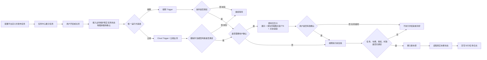

> 这是目标业务链，不是当前实现图。当前端侧任务可能仍由端侧代码和整车版本发布，并非都从配置平台自动下发。图中“接入业务维护真实任务状态”是逻辑责任，不代表当前已经存在一个名叫“任务状态服务”的独立服务。郝晓伟的早期口径是任务中心偏 HMI 展示端，系统预设任务可能通过“其他路径”创建；正式状态 Owner 和同步方式仍待确认。

## 1.4 本次范围

本次评审包含：

- 公共任务对象、启停状态和唯一运行权；
- 端侧任务完整链路；
- 云端/端云混合任务完整链路；
- 即时交互卡四类调用方式及本项目选型；
- 可见即可说、Planner 语音、点击、关闭、超时和生命周期；
- 端侧执行前复核、车控、真实状态回读；
- 配置平台当前能力、目标能力和发布治理；
- 天气、儿童锁、后视镜、充电口盖四条任务；
- 异常、埋点、验收和专项待办。

本次不包含：

- 不宣称四条任务均已开发完成；
- 不在产品 PRD 中虚构正式接口、错误码或服务名称；
- 不把动态任务技术方案中的 TaskService 自动套用到系统预设任务；
- 不把“无卡、无 TTS”自动等价为“已获准静默车控”；
- 不把所有弱网任务统一降级为可见即可说；
- 不替字节和赛力斯提前划定尚未确认的 Case 边界。

## 1.5 本次评审输出

| 输出 | 结束标准 |
|---|---|
| 总体框架 | 每一跳都有责任方、输入、判断、输出和失败处理 |
| 任务状态方案 | 确认真实状态 Owner、同步方向、启动快照、变更事件和异常策略 |
| 端侧卡合同 | 确认拉卡、展示 ACK、可见即可说、点击、关闭、超时和回调方 |
| 云端卡合同 | 确认充电采用哪类 VUI 卡片合同，语音和点击分别回哪里 |
| 执行闭环 | 确认复核入口、车控请求、状态回读和最终成功标准 |
| 四任务矩阵 | 每条任务的端云归属、交互、安全门槛、缺口和 Owner |
| 平台能力表 | 明确“已经支持、需改造、需新增、长期建设”四种状态 |

---

# 2. Contacts｜参与人与决策职责

姓名来自现有会议联系人，只表示本次需要对齐的方向，不自动等于最终研发 DRI。

| 角色/联系人 | 负责回答 | 本次必须带走的结论 |
|---|---|---|
| 王泽民｜系统预设任务/Trigger 产品 | 业务场景、任务规则、端云选择、交互策略、异常与验收 | PRD、决策表、四任务口径、会后跟进 |
| 郝晓伟｜任务中心/任务系统 | 任务中心与业务的边界；用户启停后真实状态如何维护和供 Trigger 消费 | 真实状态 Owner、操作事件、ACK、快照/变更路径 |
| 徐洋｜VUI/即时交互卡 | 四类卡片调用链；卡片准入、生命周期、点击、语音、TTS、上下文 | 天气端侧卡合同、充电云端卡合同、能力缺口 |
| 韩杰｜Trigger/配置框架相关 | 当前条件、事件、动作、频控、端侧能力可配置到什么程度 | 当前能力矩阵、端侧缺口、平台化边界 |
| 汪帅等端侧研发 | 天气 Trigger、卡片、可见即可说和端侧执行当前进展 | 已实现证据、接口缺口、联调方案 |
| Planner/Director Owner | 在线二轮语义、动态选项工具、上下文消费 | 语音路由、点击同步、上下文创建/销毁 |
| Advisor/主动推荐 Owner | Cloud Trigger 候选事件怎样进入推荐；如何选择交互等级 | 充电上游编排和去重规则 |
| DT/VQA Owner | 充电设备判断使用什么视觉数据；结果、时效、异常 | 请求/结果合同与验收集 |
| VLM/OMS/端状态 Owner | 天气、路况、儿童、宠物和车辆信号是否真实可用 | 信号 ID、枚举、周期、时间戳、质量和 UNKNOWN |
| 赛力斯产品 | 原始 Case 规则、验收、防打扰和双方边界 | 唯一业务条件、赛力斯自闭环任务清单 |
| 赛力斯车控/状态 Owner | 动作能力、安全门禁、错误、幂等和真实状态 | 执行与回读合同 |
| 测试/项目管理 | 联调、弱网、实车、安全和发布门槛 | 测试计划、证据格式、Owner/版本/时间 |

## 2.1 决策 RACI

下表是【产品方案】的参会和决策组织方式，最终 A（拍板方）及个人 DRI 必须在专项会上确认，不能视为现有组织授权。

| 决策 | 负责提出 R | 最终拍板 A | 需会签 C | 需同步 I |
|---|---|---|---|---|
| 四任务业务规则 | 王泽民 | 待确认：赛力斯产品 + 字节产品负责人 | VLM/状态/车控/测试 | 全体研发 |
| 任务状态路径 | 任务中心/接入业务技术 Owner | 待确认：架构 Owner | Trigger、端云运行时 | 产品、测试 |
| 端云运行权 | Trigger/架构 Owner | 待确认：架构 Owner | 任务中心、云端、端侧 | 产品、测试 |
| 即时交互卡合同 | VUI Owner | 待确认：VUI/架构 Owner | Trigger、Planner、业务方 | 产品、测试 |
| 充电云端编排 | Advisor/Planner/DT Owner | 待确认：云端架构 Owner | Trigger、VUI、端侧执行 | 产品、测试 |
| 车控和状态回读 | 赛力斯车控/端侧执行 Owner | 待确认：整车安全 Owner | Trigger、业务方 | 产品、测试 |

---

# 3. Background｜背景、原文和争议

## 3.1 为什么这次必须评“系统预设任务整体框架”

9 月 1 日 01:35:10—02:14:49 的讨论从四个任务展开，但在 02:07:37 后转向了公共框架。韩杰明确指出当前还没有形成标准化配置平台，只能配置部分能力，端侧仍依赖开发；卡片、TTS、二次确认等原子能力也没有全部加入。02:11:29，徐洋提出下一次应开专门会议，评审整体框架支持哪些链路、链路如何运行、还差哪些能力。

所以本次不是：

- 只看天气 Trigger 是否能判断；
- 只看即时交互卡视觉稿；
- 只看配置平台有哪些字段；
- 再把四个 Case 从头过一遍。

本次真正要做的是：从用户开任务开始，一直追到车辆真实动作完成，把每一跳的责任、数据、判断、失败和当前能力说清楚。

## 3.2 9 月 1 日讨论时间轴：大家到底在争什么

| 时间 | 讨论问题 | 为什么会争 | 当场能确认 | 仍然不能写死 |
|---|---|---|---|---|
| 01:35:18 | 为什么分端侧和云端 | 有的任务要弱网、低时延和本地状态；有的任务需要模型、DT/VQA、上下文 | 形成端云分类原则 | 四任务逐项部署和接口未全部确认 |
| 01:36:10–01:40:13 | 天气卡的可见即可说找谁做 | 大家混淆了“天气业务接入”与“卡片公共组件能力” | 天气需要本地确认；可使用可见即可说；需补确认/拒绝词条 | 谁提供统一注册通道、谁写业务接入、是否已完成 |
| 01:41:01–01:47:18 | 固定词条还是离线模型 | 当前任务要快速落地，长期又希望离线语义泛化 | 天气先走第④类端侧自闭环卡，不等离线小模型 | 是否建设离线模型、是否所有弱网卡统一降级 |
| 01:47:50–01:52:18 | 在线/离线怎样切换 | 端云结果可能超时、重复、上下文不同步 | 有端云仲裁和约 3 秒超时方向；多数人倾向交互一致 | 上下文补同步和去重是否已实现；是否提示离线能力下降 |
| 01:52:29–01:54:49 | 天气、路况信号从哪里来 | PRD 把 VLM、雨量/雨刮和“天气传感器”混在一起 | 路况主要考虑端侧 VLM；应核实车身信号 | 正式字段、接入、时效、防抖、准确率 |
| 01:54:53–01:56:48 | 儿童/宠物能否可靠触发 | 宠物能力低频，且只评过猫狗；儿童锁是安全动作 | 宠物约 5 分钟一次，仅猫狗有评测；“无卡、无 TTS”是在后续 02:04:21 补充确认 | 部署、执行安全、其他宠物、左右门范围 |
| 01:56:58–02:01:30 | 频控与连续拒绝 | “15 分钟一次”只管系统频率，不等于理解用户负反馈 | 在线频控可配；端侧当前依赖代码；连续拒绝策略当前没有统一方案 | 自动关任务、静默期还是只限次数 |
| 02:01:30–02:03:03 | 充电口盖云端链 | 需要把硬条件、推荐、DT/VQA、卡片、授权、执行串起来 | 会上按 Cloud Trigger→Advisor→DT/VQA→卡片→确认→开盖进行宣讲 | 结合其他资料后，硬 Trigger 物理位置仍待确认；每一跳接口、视觉数据、结果有效期、卡片类型、回调路径均未定 |
| 02:03:03–02:06:38 | 语音禁用后怎么办 | 禁语音不应让天气安全提醒完全消失 | 02:04:21 补充确认儿童锁和后视镜无卡、无 TTS；天气接受“保留卡片、不播 TTS、点击确认”的方向 | 充电等其他任务是否同样降级 |
| 02:06:38–02:07:37 | 后视镜三个场景 | 规则来源多、条件没有统一 | 有雨天、洗车后、高湿温差三个候选场景 | 条件、计时、退出、归属 |
| 02:07:37–02:11:29 | 有没有完整配置平台 | “有触发配置”被误解成“全链路都可配置” | 当前只能配一部分；端侧、原子能力和交互仍有缺口；需框架专项 | 能力清单、接口、Owner、排期 |
| 02:11:48–02:13:52 | 框架能跑是否等于规则合理 | 后视镜 P 挡和车速条件存在明显体验矛盾 | 王泽民带回赛力斯确认；框架和 Case 体验都要审 | 后视镜最终规则 |
| 02:14:19–02:14:49 | 字节和赛力斯边界 | 相同任务两边都做会重复提醒或车控 | 赛力斯先盘自闭环清单 | 截止该时间点没有最终划分原则和任务归属 |

## 3.3 三段最关键的“原文 → 人话 → 你要做什么”

### 3.3.1 徐洋说“下次评整体框架”

- **原文证据**：02:11:29，徐洋提出需要专门会议，看整体框架支持哪些链路、链路如何运行、还差哪些能力。
- **人话**：下一次会议不是继续问“天气阈值多少”，而是要证明系统从任务启停到真实执行能完整走通，并把缺口分给 Owner。
- **你要做什么**：准备公共框架、端侧链、云端链、平台能力矩阵、四任务映射和 P0 拍板表。本 PRD 就是该交付物。

### 3.3.2 晓伟说任务中心是 HMI 展示端，预设任务走“其他路径”

- **原文证据**：7 月 3 日会议中，郝晓伟把任务中心描述为 HMI 展示/收口界面；对于预置的云端或端侧条件任务，提到可在 Trigger 配置后通过“其他路径”创建，而不是都由 Director 创建。
- **人话**：任务中心页面能显示、让用户点击，并不代表它已经负责保存系统预设任务的全部真实状态，更不代表已经有“任务中心直接推 enabled 给 Trigger”的接口。
- **你要做什么**：不能自己画死 Push 或 Pull。你要向晓伟和任务系统研发确认：谁是状态真源、点击后谁落库、谁返回 ACK、Trigger 启动时怎么拿全量状态、变化时怎么拿增量事件、断线漏事件怎么办。

### 3.3.3 徐洋文档说即时交互卡有四类链路

- **文档证据**：《VUI 主交互需求》区分 Planner 卡、Static Advisor 卡、系统通知/三方调用卡、端侧自闭环服务通知卡；端侧自闭环不经过 Planner，语音靠可见即可说；云端泛化语音可通过 Planner 动态选择能力。
- **人话**：不是“有一个卡片接口，端云都一样”。卡片外观可以相同，但点击和语音回给谁、谁持有上下文、谁决定执行完全不同。
- **你要做什么**：天气按第④类端侧卡对接；充电口盖必须让徐洋、Advisor、Planner 明确后半段到底采用 Static Advisor 合同，还是系统通知/三方调用合同，特别是点击直接回业务还是模拟 Query 回云端。

## 3.4 当前存在的五个断层

1. **任务状态断层**：有 UI 开关，没有经过确认的状态真源、ACK、快照和变更事件合同。
2. **端云运行权断层**：没有在需求层明确同一任务、同一车辆、同一时刻只能由一侧产生主动动作。
3. **交互断层**：Trigger 命中后，卡片展示 ACK、点击/语音、关闭/超时、生命周期与回调没有统一产品合同。
4. **执行断层**：用户确认与真实车控之间缺少统一的执行前复核、幂等、状态回读和结果更新。
5. **平台化断层**：云端只能配部分能力，端侧仍需要开发；卡片、TTS、二次确认、端云同步没有完整纳入配置平台。

## 3.5 8 月 18 日会议为什么说明这件事确实由你牵头

8 月 18 日“赛力斯自闭环主动服务梳理对齐”会议把你的职责分成了两层：

- **第一层是 Trigger 产品职责**：模型主动服务和系统预设任务都可能使用 Trigger，你需要维护触发能力和需求准入。
- **第二层是系统预设任务端到端职责**：针对天气、儿童锁、后视镜、充电口盖等系统预设任务，你不仅要写触发条件，还要把交互、执行和结果闭环拉齐。

徐洋在 00:09:33 左右的人话含义是：你一方面管 Trigger 给不同业务使用，另一方面要闭环系统预设任务本身的触发器、端到端链路和执行。会议还要求维护一张系统预设任务全量表，标出需求是否准入、是否可做、是否已进入研发；没有正式评审接收和排期的零散需求，不能默认算已经承接。

这不意味着所有实现都由你做。你的角色是把各模块拉进同一条可评审链路：

```text
你负责：需求准入 + 端到端方案 + 决策问题 + 验收标准 + 协调收口
各 Owner 负责：状态、Trigger、卡片、Planner/DT、端侧车控等具体方案和实现
```

## 3.6 系统预设任务、模型主动服务和消息盒子不是一回事

| 概念 | 本质 | 与你当前 PRD 的关系 |
|---|---|---|
| 系统预设任务 | 系统预先提供、用户可管理、规则/模型满足后执行的长期任务 | 本 PRD 的主对象；你负责端到端闭环 |
| 模型主动服务 | 专家任务集/Advisor 等产生的主动建议 | 可能使用 Trigger，但业务策略不全部由你负责 |
| 赛力斯自闭环主动服务 | 赛力斯内部判断并完成的主动逻辑 | 需要和字节任务清单去重，避免重复开发/提醒 |
| 消息盒子 | 一种承载和展示容器 | 不能用“是否进消息盒子”定义主动服务边界 |
| 即时交互卡 | 车机上的即时互动容器 | 两边都可能调用，但不是业务归属判断标准 |

8 月 18 日会议多次强调，梳理全量范围的目的不是收敛消息盒子，而是避免字节和赛力斯同时对用户弹两个东西或重复执行。因此本 PRD 将“双方唯一业务 Owner 和唯一触发方”作为发布门槛。

---

# 4. Objective｜目标、非目标与成功标准

## 4.1 产品目标

把四个零散的系统预设任务，收敛成一套“可定义、可启停、可判断、可交互、可执行、可回读、可追踪”的公共框架；同时保留端侧和云端两种运行方式，避免为了统一而牺牲弱网可靠性、模型能力或车控安全。

## 4.2 本次必须关闭的五个总决策

| 决策编号 | 必须回答的问题 | 为什么是 P0 | 通过标准 |
|---|---|---|---|
| D1 任务状态 | 用户开关的真实状态由谁维护，Trigger 如何获得 | Trigger 读不到真实状态，就可能关闭后仍触发，或开启后不工作 | 明确状态真源、操作 ACK、启动快照、变化通知/查询、UNKNOWN 和重连策略 |
| D2 端云运行权 | 同一任务由端侧还是云端产生动作，能否切换 | 双侧同时触发会重复出卡、重复车控 | 每个任务有唯一运行位置、版本和切换策略；任一时刻最多一侧可 emit |
| D3 卡片合同 | 谁拉卡、卡片返回什么、语音和点击回哪里 | 没有同一次事件关联，会串卡、串授权或无法收口 | 端侧和云端分别有明确时序、生命周期和失败处理 |
| D4 执行闭环 | 用户确认后谁复核、谁车控、如何判断成功 | “点了确认”或“RPC 成功”都不等于车辆完成 | 明确最新状态复核、幂等、车控、真实状态回读和 UI 更新 |
| D5 四任务落位 | 四任务的规则、端云归属、交互、安全和双方边界 | Case 不唯一，框架无法验收 | 每条任务只有一份生效规则，冲突归零，Owner 和版本明确 |

## 4.3 可量化成功标准

- 四条任务全部能映射到同一套任务字段和生命周期，不需要靠口头补链路。
- 每条链路的每一跳都能回答：谁、在哪里、收到什么、判断什么、输出什么、失败怎么办。
- 用户关闭任务后不再产生新的运行事件；关闭在途事件的处理有明确规则。
- 需要确认的任务，未收到有效确认时绝不车控。
- 云端结果、卡片授权、任务状态和车辆状态任一过期或不一致时，端侧拒绝执行。
- 最终成功以车辆真实状态达到目标为准，不以按钮点击或 RPC ACK 为准。
- 字节与赛力斯不会针对同一车辆、同一场景同时出卡或同时执行。
- 所有“待确认”均在评审纪要中有 Owner、下一份产物和目标时间。

## 4.4 非目标

- 本次不要求把所有端侧规则立即改成平台动态下发。
- 本次不重新设计 Planner、Director、DT、VQA、VUI 或车控底层架构。
- 本次不承诺离线小模型；天气当前方案先使用可见即可说。
- 本次不把儿童锁和后视镜强行归类以凑齐模板。
- 本次不确定正式字段名；先确定业务语义和状态行为，再由技术专项形成 IDL。

---

# 5. Market Segments｜场景分层

这是内部能力型 PRD，“市场分层”不按人群，而按任务对运行环境的要求划分。

| 场景类型 | 用户期望 | 关键特征 | 推荐运行方式 | 当前样例 |
|---|---|---|---|---|
| 弱网安全提醒 | 断网也能及时提醒和处理 | 本地信号、固定规则、短响应窗口 | 端侧自闭环 | 天气/路况保护 |
| 本地确定性静默动作 | 用户不想每次确认，但要求稳定且安全 | 固定端状态、无语义、无模型 | 优先赛力斯/端侧闭环，具体归属待定 | 后视镜加热；儿童锁需安全专项 |
| 需要视觉/模型复核的主动服务 | 系统先理解环境，再询问是否执行 | DT/VQA、上下文、泛化语义 | 云端判断 + 端侧执行 | 识别充电设备后开盖 |
| 用户管理长期任务 | 能看、能开关、能知道是否生效 | 任务展示、状态、历史、用户操作 | 任务中心 + 接入业务状态闭环 | 四条任务共用 |

---

# 6. Value Propositions｜为什么值得做、为什么要分端云

## 6.1 对用户的价值

- 用户只需开启一次，系统在真正相关的场景出现时再提醒或执行。
- 安全相关的本地任务不因弱网完全失效。
- 需要视觉与语义理解的任务不会被迫写成大量僵硬规则。
- 任务可以关闭、拒绝、超时和恢复，不会持续打扰或使用旧授权。
- 卡片显示的“成功”与真实车辆状态一致，避免假成功。

## 6.2 对产品和研发的价值

- 新增任务时复用任务、Trigger、交互、执行和验收框架，不再每个 Case 单独拼接。
- 端云边界有统一判断原则，避免所有任务都堆到端侧或云端。
- 卡片与业务之间形成统一产品合同，减少“能出卡但接不回结果”的断层。
- 信号、规则、模型、交互、车控问题可以按模块定位，不再把所有 badcase 都归到 Trigger。
- 版本、运行权和事件标识可追踪，降低端云双触发和重复执行风险。

## 6.3 端侧与云端真正区别是什么

**先记住：两种卡片最终都显示在车机。端侧/云端不是 UI 位置的区别，而是业务决策链的区别。**

| 判断维度 | 适合端侧 | 适合云端/端云混合 |
|---|---|---|
| 断网要求 | 无网仍必须判断、提醒或执行 | 断网时可以停止，不允许拿过期结果补执行 |
| 响应窗口 | 车辆状态变化后需立即判断 | 可以接受上行、排队和推理延迟 |
| 规则形态 | AND/OR、阈值、状态变化、小状态机即可表达 | 需要理解自然语言、历史上下文、开放语义或复杂策略 |
| 数据位置 | 车速、挡位、车门、灯、端侧 VLM 等本地数据 | 需要 DT、VQA、Planner、云端历史或多服务信息 |
| 迭代方式 | 随车版本发布，周期长但稳定 | 策略、模型和工具可更快迭代，但受网络影响 |
| 真实车控 | 最接近车辆，可做最终安全门禁 | 不能直接信任旧上下文，必须回端侧复核 |
| 语音理解 | 卡片有限按钮语义，当前用可见即可说 | Planner 结合卡片上下文做泛化理解 |
| 点击结果 | 端侧直接回原业务 | 回云端业务，并按卡型同步 Planner 上下文 |

## 6.4 为什么不能全部放端侧

如果全部放端侧：

- 充电设备识别、开放语义和上下文需要把模型、工具和大量规则固化到车端；
- 新增任务或修正策略往往依赖整车版本，迭代慢；
- 端侧算力和可用上下文有限，复杂判断的准确率可能不足；
- 即时交互卡若要理解用户各种说法，需要重复建设离线语义能力。

## 6.5 为什么不能全部放云端

如果全部放云端：

- 天气等任务在弱网或断网时可能漏触发；
- 车速、挡位和目标状态变化快，上下行与推理延迟可能错过安全窗口；
- 云端旧结果可能与当前真实车况不一致；
- 云端不应绕过端侧最新状态和整车安全门禁直接车控。

## 6.6 端云协作的核心价值

```text
端侧守住：实时、离线、当前真实状态、车控安全和最终回读
云端提供：语义、模型、DT/VQA、跨服务上下文和快速策略迭代
共同遵守：唯一事件、时效、用户授权、幂等和真实状态成功口径
```

## 6.7 端云选择决策树

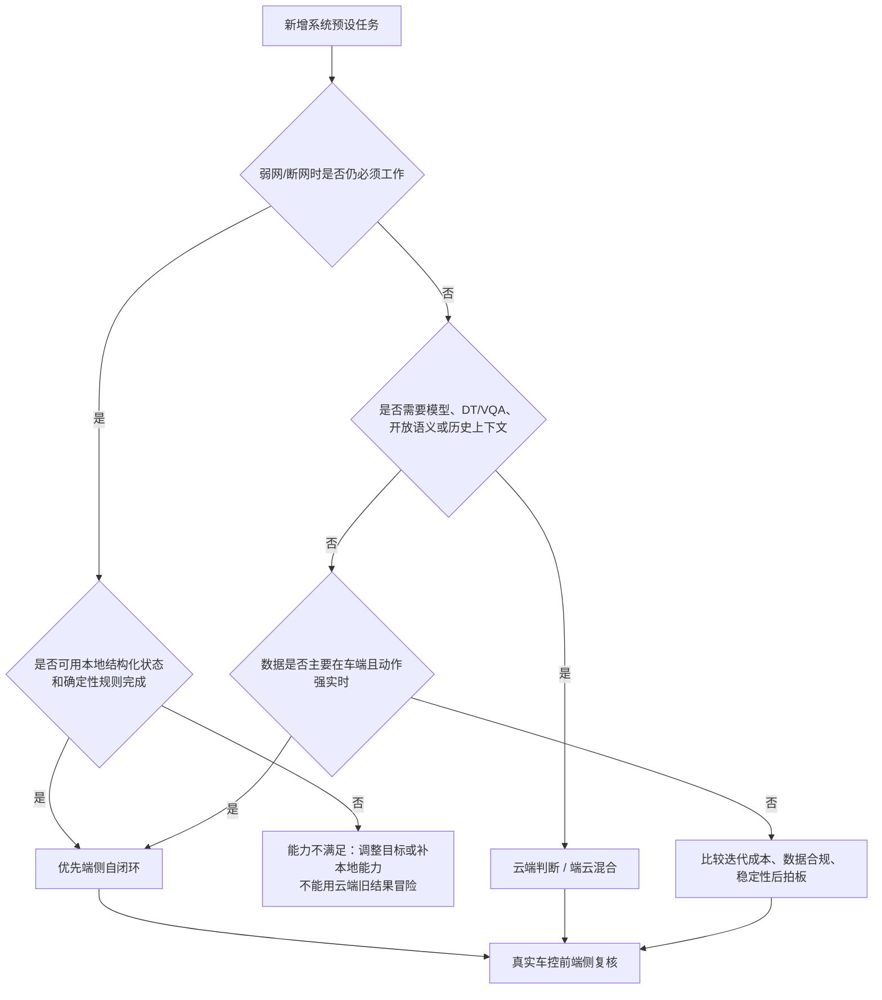

### 端云选择备答话术

> “端云不是按任务名字分，也不是看卡片显示在哪。先看断网是否必须工作、规则是否确定、数据在哪里、是否需要模型和上下文。天气依赖本地状态且要求弱网工作，所以端侧；充电需要 DT/VQA 判断周围充电设备，所以走云端能力，但最后开盖仍回端侧复核。儿童锁和后视镜因为安全和双方归属尚未收口，今天不能提前写成已定。”

---

# 7. Solution｜完整方案

## 7.1 先把六个名词讲成人话

| 名词 | 人话 | 负责 | 不负责 |
|---|---|---|---|
| 系统预设任务 | 系统提前准备好的长期自动化能力，用户可开关 | 定义目标、条件、交互、动作和生命周期 | 不是一次弹窗，也不是一条裸规则 |
| 任务中心 | 用户查看、启停和回看任务的车机入口 | 展示任务、承接操作、显示业务回传的状态 | 不判断天气/SOC，不运行 Trigger，不直接车控 |
| Trigger | 一直等待条件，决定现在是否产生一次候选事件 | 读任务状态和信号，做规则、时序、防重和频控 | 不负责卡片视觉，不负责 Planner 泛化语义 |
| 即时交互卡 | Trigger/云端业务与用户之间的交互窗口 | 展示、TTS 协同、收集点击/语音、管理生命周期 | 不判断业务条件，不把点击直接当车控成功 |
| Planner/Director | 同一个云端决策职能的两个称呼 | 在线理解用户语义、上下文和工具编排 | 不绕过端侧安全门禁直接控制车辆 |
| 端侧执行层 | 用户授权或静默规则通过后的最后安全关 | 读最新车况、幂等、车控、真实状态回读 | 不信任过期的云结果或按钮点击 |

## 7.2 每个模块的责任边界

下表用于描述目标逻辑边界；其中任务中心的职责来自通用 PRD，四条系统预设任务是否已接入该模式仍待确认。

| 模块 | 在哪里 | 收到什么 | 判断什么 | 输出什么 | 失败怎么办 |
|---|---|---|---|---|---|
| 配置平台 | 云端后台 | 产品配置、原子能力、车型和版本 | 字段完整、能力支持、无冲突、可发布 | 任务定义/规则包/展示配置 | 拦截发布并显示原因 |
| 任务中心 | 车机 HMI | 任务展示信息、业务状态、用户操作 | 页面和组件行为，不判断业务条件 | 操作事件；展示真实结果 | 显示处理中、失败或回滚，不假装开启成功 |
| 接入业务/状态承载方 | 待确认 | 用户操作、任务定义、账户/车辆 | 鉴权、幂等、状态是否真正变更 | 真实任务状态和回调 | 保存失败则回滚 UI；UNKNOWN 禁止新触发 |
| 端侧 Trigger | 车端 | 任务状态、本地信号/事件、端侧规则 | 条件、时效、变化沿、防抖、去重、频控 | 唯一运行事件或不触发 | 缺失/过期/UNKNOWN 本轮结束 |
| Cloud Trigger/云端业务 | 云端 | 任务状态、合规上行状态、云端配置 | 硬条件、运行权、去重、是否进入模型/推荐 | 候选事件/Query/编排请求 | 无网或数据过期不创建或结束事件 |
| Advisor | 云端 | 主动推荐候选、Query、上下文 | 是否推荐、交互等级、后续编排 | 推荐/卡片或工具请求 | 拒绝、超时则结束本次事件 |
| Planner/Director | 云端 | 用户 Query、卡片上下文、工具结果 | 用户语义、上下文、下一步工具 | 工具调用或标准选择 | 不确定时不形成车控授权 |
| DT/VQA | 云端+端侧视觉链 | 推理请求、视觉数据、事件上下文 | 是否存在目标场景 | 带时间和事件关联的结果 | UNKNOWN/ERROR/过期不得继续执行 |
| 即时交互卡 | 车机 VUI | 卡片内容、按钮、TTS 策略、路由和有效期 | 能否展示、当前生命周期、输入归一 | 展示/生命周期/用户选择结果 | 失败、关闭、超时均明确回业务 |
| 可见即可说 | 车端 | 当前可见卡片按钮和词条 | 本地语音能否明确映射按钮 | CONFIRM/REJECT 等本地选择 | 卡片消失立即注销；歧义不授权 |
| 端侧执行/赛力斯车控 | 车端 | 动作请求、授权、最新车况 | 权限、时效、幂等、安全门禁 | 车控结果和真实状态 | 失败/超时/未达到目标都不能报成功 |

## 7.3 任务中心开关到 Trigger：已知、未知、目标行为

### 7.3.1 已经有证据的事实

1. 【文档事实】通用任务中心 PRD 将任务中心定义为异步任务的统一展示、操作和回看入口；即时交互仍由 VUI 即时卡承担。**这是通用设计，不代表四条系统预设任务已经完成接入。**
2. 【文档事实】通用设计中，任务中心负责展示、排序、容量、组件和用户操作事件转发；它不执行具体业务逻辑，也不判断执行成功。四条任务是否完全复用这套能力仍待确认。
3. 【文档事实】通用设计采用“接入业务维护真实任务状态、处理用户操作并回传”；用户点击只表达意图，最终状态以业务回传为准。四条任务的接入业务是谁、是否沿用该模式仍待确认。
4. 【会议原话｜非结论】郝晓伟称任务中心可以理解为 HMI 展示端；系统预设条件任务可能在 Trigger 配置并通过“其他路径”创建，而不是都由 Director 创建。
5. 【文档事实】通用任务协议出现过 `task_id`、用户事件等概念，但没有证据证明四条系统预设任务已经通过 `taskId + enabled` 直接推送给 Trigger。

### 7.3.2 当前没有证据、不能自己写成现状的内容

- 四条任务的接入业务究竟是 Trigger、任务服务、Advisor 适配层还是其他模块；
- 开关状态保存在哪里；
- 端侧 Trigger 和 Cloud Trigger 是被动收事件，还是主动查询；
- 冷启动、重启、断线重连如何拿到全量状态；
- 任务模板 ID、任务实例 ID 和 Trigger 规则 ID 如何映射；
- 操作失败如何回滚，乱序/重复如何处理；
- 关闭时已排队卡片、已展示卡片、已确认事件或执行中动作如何处理。

### 7.3.3 本 PRD 要求的产品行为

下面定义“必须达到的行为”，不替研发命名接口：

1. 用户点击开启后，任务中心先显示“处理中”，而不是立即假显示成功。
2. 真实状态承载方保存成功后回传 `ENABLED`；失败则回传失败并让 UI 回滚。
3. Trigger 判断业务条件前，必须拿到当前任务有效状态；状态缺失或 UNKNOWN 时不得新触发。
4. 端侧/云端运行时启动或重连后，必须能恢复当前全量任务状态，不能只依赖一次可能漏掉的变化事件。
5. 任务状态变化需要有版本或等价的时序机制，旧事件不能覆盖新状态。
6. 用户关闭任务后不得创建新的运行事件；在途事件如何取消要按阶段定义。
7. 同一车辆、同一任务、同一版本只能有一个权威运行方可以产生主动动作。
8. 【产品方案】系统必须能够识别“当前运行资格”和“旧侧遗留请求”，并让旧卡确认、旧推理或旧执行请求失效。可用代次、租约、版本或其他机制实现，具体方案由架构专项确定。

### 7.3.4 目标状态链

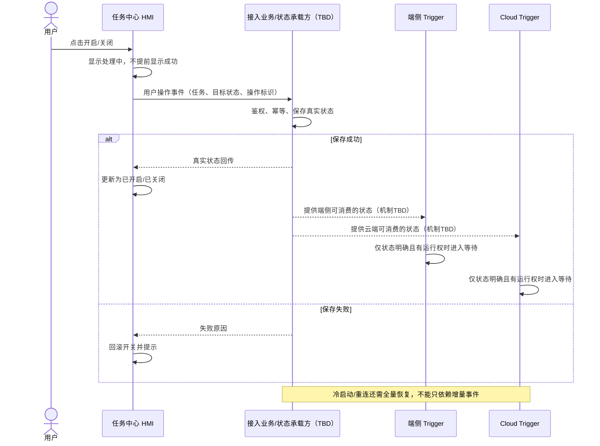

### 7.3.5 关闭任务时，不同阶段怎么处理

| 关闭发生时的阶段 | 产品要求 | 原因 |
|---|---|---|
| 还在 Waiting | 立即停止创建新事件 | 用户意图明确 |
| 已命中但尚未出卡 | 取消候选事件 | 避免关闭后仍弹卡 |
| 卡片排队中 | 撤销排队；失败也不能执行 | 用户还没看到、没授权 |
| 卡片已展示、未确认 | 关闭/失效卡片，注销语音能力 | 防止旧卡授权 |
| 已确认、尚未车控 | 执行前复核读到关闭，终止执行 | 以最新用户意图为准 |
| 车控请求已进入不可取消阶段 | 不盲目反向操作；完成回读并同步真实结果 | 防止二次动作扩大风险 |

### 7.3.6 你找晓伟时直接这样说

> “晓伟，我先确认边界：任务中心是用户展示和操作入口。通用任务中心 PRD 采用接入业务维护真实状态，但四条系统预设任务是否复用、接入业务是谁还没有结论。现在我缺的不是页面设计，而是这四条任务的状态路径。请帮我一起确认：第一，接入业务是谁；第二，点击开启后谁持久化并回 ACK；第三，端侧和云端 Trigger 从哪里获得当前状态，是事件还是查询；第四，车机重启、重连或漏事件如何恢复；第五，关闭时在途卡片和执行如何取消。接口怎么实现由研发定，我的产品底线是状态 UNKNOWN 不触发、关闭后不产生新事件、UI 不提前假显示成功。”

### 7.3.7 本节评审记录

| 问题 | 结论 | Owner | 产物/时间 |
|---|---|---|---|
| 四任务接入业务是谁 | 待确认 | 郝晓伟/架构 Owner |  |
| 状态保存和 ACK | 待确认 | 任务系统 |  |
| Trigger 获取状态方式 | 待确认 | 任务系统 + Trigger |  |
| 冷启动/重连恢复 | 待确认 | 端侧/云端运行时 |  |
| 关闭在途事件策略 | 本 PRD 给出行为基线，技术实现待确认 | 多方 |  |

### 7.3.8 任务中心、任务有效状态、SLS 总开关和 Trigger 的关系

这四个概念必须分开：

| 概念 | 它是什么 | 谁操作/维护 | Trigger 怎么用 |
|---|---|---|---|
| 任务中心 | 一个 HMI 管理模块 | 按通用 PRD，用户在页面看任务、点开关，页面展示业务回传结果；四任务是否已接入待确认 | Trigger 不“读取页面”；需要确认四任务是否能由状态承载方提供真实任务状态 |
| 单任务有效状态 | 某辆车的某一条任务是否开启 | 状态真源/接入业务待确认 | **每次规则判断和执行前都必须先校验** |
| SLS/主动服务总开关 | 对一类主动服务的更高层总门禁 | 来源、适用任务和接口待确认 | 只有任务明确要求时，作为单任务开关之外的第二道门禁 |
| 语音禁用状态 | 用户关闭语音/TTS 能力 | 语音/VUI 相关模块 | 决定是否播 TTS、是否允许语音，不自动等于任务关闭 |
| Trigger | 运行中的条件判断模块 | 端侧或云端 Trigger 研发 | 消费上述有效状态和业务信号，不负责绘制开关页面 |

如果天气 Trigger 过去只写了车辆条件，新接入“天气任务有效状态”以后，业务逻辑的变化是：

```text
过去：天气/路况 + 车速 + 当前车辆状态满足 → 候选触发

现在：天气任务明确开启
   AND 天气/路况 + 车速 + 当前车辆状态满足
   → 候选触发

并且：用户关闭任务后，在途未执行事件要失效；用户确认后、车控前还要再检查一次任务仍开启。
```

所以从产品逻辑看，**相对于“只判断车辆条件”的旧链路，必须显式增加“单任务有效”这一道前置资格和执行前复核**。它是否对应 Trigger 的新增代码，取决于当前实现是否已有通用任务有效状态能力，会议没有证据；“Trigger 通过什么接口拿到状态”也仍未确认，不能把产品行为直接写成已存在的端状态 ID。

对于充电口盖，当前候选规则同时出现“单任务有效”和“SLS/主动服务总开关”，意味着两者应按两个独立门禁讨论；任一关闭都不应发起新的推荐。对于天气、儿童锁和后视镜是否还受统一 SLS 总开关控制，现有资料没有形成统一结论，需要逐任务确认，不能全局类推。

### 这段在会上这样讲

> “任务中心是页面，任务有效状态是页面操作背后的真实业务状态，Trigger 消费的应该是后者。天气过去只有车辆条件的话，这次接入任务有效状态后，就是在所有规则最前面新增一道门禁，并在执行前再检查一次。SLS 总开关又是另一道更高层门禁，只对明确要求的任务使用；语音禁用只影响 TTS/语音，不等于任务关闭。今天请任务系统和 Trigger 研发确认这几种状态分别从哪里来、如何恢复，不能继续把三个开关混成一个。”

### 7.3.9 端侧与云端切换时怎样防止旧请求继续执行

【产品方案】产品安全目标是：任一时刻只有一侧可以产生主动动作；切换前的旧卡、旧推理和旧执行请求不能在切换后继续生效；切换失败时可以安全回滚。下面是便于讨论的候选顺序，不是现有接口，也不是唯一技术解：

```text
先撤销旧侧产生新事件的资格
→ 等待旧侧确认已停止，并取消尚未授权的在途卡片/事件
→ 状态承载方发布新的当前运行资格代次
→ 再允许新侧产生事件
→ 所有晚到的旧卡确认、旧推理结果和旧执行请求都因资格过期被拒绝
```

架构可以用代次、租约、版本或其他等价方案。产品不规定正式字段名，只要求最终方案能够：

- 明确区分切换前和切换后的运行资格；
- 从任务状态一直关联到运行事件、交互和端侧执行；
- 被端侧执行前重新读取和比较；
- 在旧请求被拒绝时返回可排障原因；
- 支持灰度失败后安全回滚，而不让端云两侧同时恢复。

## 7.4 公共任务对象：配置的不是一条规则，而是一项长期能力

### 7.4.1 需要区分三层对象

| 层级 | 示例 | 生命周期 | 为什么要区分 |
|---|---|---|---|
| 任务定义 | “天气/路况保护”这个系统能力 | 随产品版本、车型和配置发布 | 决定这是什么任务、支持什么条件和动作 |
| 用户任务实例 | 某辆车/某账号是否开启该任务 | 用户开启到关闭，可跨上电周期 | 决定任务是否有资格持续运行 |
| 单次运行事件 | 2026-09-03 15:20 的一次雨天命中 | 从条件命中到结束/冷却 | 关联这一次卡片、用户选择、车控和日志，避免串单 |

简单说：

- “天气/路况保护”是任务定义；
- “我的车已开启天气保护”是任务实例；
- “刚刚遇到湿滑路面，问我是否切湿滑模式”是一次运行事件。

即时交互卡返回结果时，不能只说“用户点了确认”，还必须让原业务知道是哪个任务的哪一次询问。正式标识由技术专项定义，产品只要求三层可关联、不可串用。

### 7.4.2 一条任务定义要包含的产品信息

| 信息组 | 必填内容 | 天气示例 |
|---|---|---|
| 基础信息 | 名称、用户描述、适用车型、业务 Owner、默认状态、可否关闭/删除 | 天气/路况保护；任务中心默认开，具体发布策略待赛力斯确认 |
| 运行位置 | 端侧、云端/混合、唯一运行权和版本 | 端侧自闭环 |
| 数据输入 | 数据项、来源、枚举、时间戳、质量、有效期 | VLM 天气/路面；车速、驾驶模式、雾灯 |
| 触发规则 | 触发时机、AND/OR、阈值、变化沿、连续周期 | 雨或湿滑 + 车速阈值 + 目标模式未开启 |
| 时序治理 | 防抖、去重、频控、处理中锁、拒绝后策略 | 防抖次数与冷却时长待确认 |
| 交互策略 | 无交互/仅告知/需确认；卡片、TTS、语音、点击、禁语音降级 | 卡片 + TTS；本地可见即可说；禁语音时天气保留卡片 |
| 动作和复核 | 用户确认后的动作、执行前最新状态、安全门禁 | 切湿滑/雪地模式或开后雾灯；复核任务与车况 |
| 结果收口 | 真实状态、成功/失败/未知、卡片更新、日志 | 真实驾驶模式或雾灯达到目标才算成功 |
| 生命周期 | 关闭、过期、恢复、重启、异常和退出 | 卡片过期注销语音；关闭后不再触发 |

### 7.4.3 单次运行事件状态

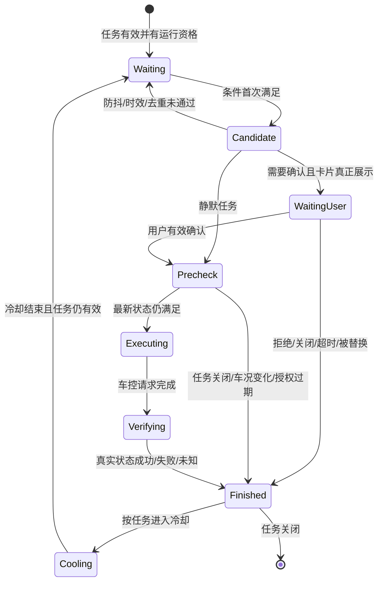

重要行为：

- 卡片排队不等于用户已看到；只有实际展示后才进入等待用户状态。
- 用户关闭卡片、拒绝或超时都不是授权。
- 用户确认后不是立即车控，而是进入执行前复核。
- 车控接口返回成功后不是立即宣布成功，而是进入真实状态验证。

## 7.5 端侧任务完整链路：以天气/路况保护为例

### 7.5.1 为什么天气放端侧

【会议确认】天气/路况保护当前按端侧自闭环方向推进。会议给出的端侧分类依据和本任务映射包括：

- 弱网或无网时仍希望工作；
- 天气/路况 VLM、车速、驾驶模式、灯状态都在本地；
- 规则是确定性的 AND/OR、阈值和状态判断；
- 行驶场景变化快，需要短响应；

【产品方案】为补齐安全闭环，用户确认后的真实车控还必须在端侧读取最新状态，并以车辆状态回读作为最终成功口径；这一点是本 PRD 的发布门槛，不冒充 9 月 1 日已经完成的接口结论。

【待确认】“方向为端侧”不等于端侧离线即时卡、词条注册、全部信号和状态回读已经完成。任务中心 PRD 的无网限制与 7 月 28 日端侧卡目标存在冲突，本次必须通过接口和实车证据确认。

### 7.5.2 端侧链路总图

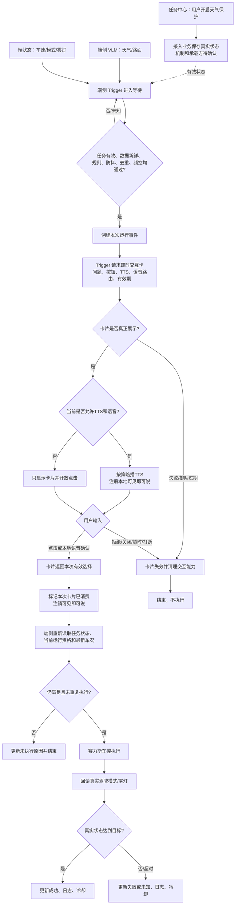

### 7.5.3 端侧逐步数据流

| 步骤 | 谁负责/在哪里 | 收到什么 | 判断什么 | 输出什么 | 失败怎么办 | 证据强度 |
|---:|---|---|---|---|---|---|
| 1 | 用户/任务中心 | 用户点击开启 | 页面是否允许操作 | 一次用户操作意图 | 显示失败或回滚，不假显示成功 | 任务入口【文档事实】；状态接口【待确认】 |
| 2 | 接入业务/状态承载方 TBD | 任务和目标状态 | 鉴权、幂等、是否真正保存 | 真实任务状态并回传页面 | 保存失败返回原因；Trigger 不得按开启运行 | 【待确认】 |
| 3 | 端侧 Trigger | 可读取的任务有效状态 | 是否明确开启、版本是否有效、端侧是否有运行资格 | 进入 Waiting 或 Disabled | UNKNOWN/无运行资格不触发 | 行为【产品方案】；获取机制【待确认】 |
| 4 | VLM/端状态 | 天气、路况、车速、模式、雾灯及时间/质量 | 数据是否属于当前车辆、是否新鲜、是否可用 | 当前条件快照 | 缺失、过期、UNKNOWN 不触发 | 数据方向【会上宣讲方案】；正式信号【待确认】 |
| 5 | 端侧 Trigger | 任务状态 + 条件快照 | AND/OR、阈值、变化沿、防抖 | 候选事件 | 任一条件不满足回 Waiting | Trigger 判断【会议确认】；详细时序【待确认】 |
| 6 | 端侧 Trigger | 候选事件、历史运行状态 | 是否重复、冷却、处理中、被更高优任务抑制 | 唯一一次运行事件 | 丢弃并记录原因 | 【产品方案】 |
| 7 | Trigger → 即时交互卡 | 任务/场景、问题、按钮、TTS、端侧语音路由、有效期、回到哪个业务 | 是否属于端侧自闭环卡 | 拉卡请求 | 需要授权时拉卡失败不得静默车控 | 路由【会议确认】；合同【产品方案】 |
| 8 | 即时交互卡/VUI | 拉卡请求 | 准入、排队、当前是否可见 | 接收/排队/已展示/失败等状态 | 排队期间业务失效应撤销；失败回原业务 | 生命周期【文档事实】；本项目接口【待确认】 |
| 9 | TTS + 可见即可说 | 卡片文案、按钮和语音策略 | 语音是否禁用、卡片是否存活 | 播报；注册确认/拒绝词条 | 天气禁语音方向为只出卡不播 TTS；注册失败保留点击并上报 | 天气方向【会议确认】；接口【待确认】 |
| 10 | 即时交互卡 | 点击，或本地语音映射结果 | 是否是当前卡片、是否过期、是否已消费 | 确认/拒绝/关闭/超时等标准结果 | 旧卡、重复、歧义输入不授权 | 路由【会议确认】；统一结构【产品方案】 |
| 11 | 原天气业务/Trigger | 用户结果和本次事件关联 | 是否有效确认；任务是否仍开启 | 进入复核或结束 | 拒绝、关闭、超时全部不执行 | 【产品方案】 |
| 12 | 端侧执行入口 | 最新任务状态和车辆状态 | 场景仍成立、目标未完成、授权有效、无冲突、未重复 | 允许或拒绝执行 | 变化或过期时终止并返回原因 | 【产品方案】 |
| 13 | 赛力斯车控 | 通过复核的具体动作 | 整车能力和安全门禁 | 请求接收/拒绝/错误 | 超时或拒绝不得显示成功 | 车控在端侧【会上宣讲方案】；正式合同【待确认】 |
| 14 | 状态域 + 原天气业务 | 最新真实模式/灯状态 | 是否达到本次目标 | 成功、失败或未知；更新卡片/日志/冷却 | ACK 成功但状态没变仍判失败/未知 | 状态回读要求【产品方案】 |

### 7.5.4 Trigger 具体做什么

Trigger 负责：

1. 读取“任务是否有效”，但不假设状态一定由任务中心直接推送。
2. 订阅天气/路况和车辆端状态，保留值、时间、来源和质量。
3. 计算规则：AND/OR、阈值、枚举、状态变化和连续周期。
4. 处理防抖、去重、处理中锁、冷却和全局主动服务优先级。
5. 生成“一次运行事件”，把后续卡片、确认、车控和日志关联起来。
6. 组装业务层拉卡信息，并声明这是端侧自闭环交互。
7. 接收点击或可见即可说的标准用户结果。
8. 用户确认后再次读取最新任务和车辆状态。
9. 将业务结果映射为具体动作请求；等待真实状态回读后收口。

Trigger 不负责：

- 绘制卡片 UI；
- 理解开放式云端语义；
- 把 VLM 原始图片当结构化信号；
- 仅凭按钮点击就宣布车控成功；
- 在任务状态 UNKNOWN 或没有唯一运行权时猜测执行。

### 7.5.5 即时交互卡具体做什么

即时交互卡负责：

1. 接收并校验业务提供的卡片内容、按钮、交互路由和有效期。
2. 告诉业务当前是接收、排队、真正展示、失败、隐藏还是过期。
3. 在真正展示后，按策略协同 TTS；天气卡存活期间接入可见即可说。
4. 将“点击确认”和“本地语音确认”归一为同一种业务选择，并保留输入来源。
5. 把拒绝、关闭、超时、打断和被替换也返回给原业务。
6. 接收原业务的最终结果并刷新或关闭卡片。

即时交互卡不负责：

- 判断是否在下雨、车速是否合适、是否应该切换驾驶模式；
- 决定用户确认后一定执行；
- 直接持有一条不带业务复核的裸车控指令；
- 在卡片已消失后继续让旧词条生效。

### 7.5.6 天气任务三条子规则

以下是当前资料中的候选业务基线，正式字段、枚举、防抖和准确率仍需数据 Owner 确认。

| 子场景 | 候选触发条件 | 卡片要问什么 | 用户确认后的目标 | 执行前必须复核 |
|---|---|---|---|---|
| 下雨/湿滑 | 任务有效 AND 车速 > 30 km/h AND（天气=下雨 OR 路面=湿滑）AND 当前非湿滑模式 | 是否切换到适合湿滑路面的驾驶模式 | 切换湿滑模式 | 任务仍开、场景/车速仍成立、目标仍未开启 |
| 下雪/结冰 | 任务有效 AND 车速 > 30 km/h AND（天气=下雪 OR 路面=覆雪/结冰）AND 当前非雪地模式 | 是否切换雪地模式 | 切换雪地模式 | 同上；雪天是否还开雾灯存在资料差异，需定稿 |
| 浓雾 | 任务有效 AND 车速 > 30 km/h AND 天气=浓雾 AND 后雾灯关闭 | 是否开启后雾灯 | 开启后雾灯 | 任务仍开、雾仍有效、后雾灯仍关闭 |

资料中同时出现以下矛盾：

- 旧稿使用 `rainLevel`、`con_weather`、`con_roadCond` 等概念；较新稿使用 `vision.outside.scene` 的天气/路面描述；
- 一处写连续 3 个周期防抖，另一处将防抖划掉；
- “天气传感器”是否存在并不明确，雨量或雨刮信号是否已接入待核实；
- 雪天动作是否同时包含后雾灯，资料口径不完全一致；
- 恢复天气时是否再次询问恢复原模式，需要赛力斯给唯一规则。

发布前必须由 VLM、端状态、赛力斯产品和车控各自给出：正式数据项、枚举、采样周期、有效期、UNKNOWN、组合逻辑、动作及回读状态。

### 7.5.7 天气交互状态表

| 事件 | 卡片行为 | TTS/语音 | 原业务行为 |
|---|---|---|---|
| 拉卡被拒绝 | 不展示 | 不播、不注册 | 结束本次事件，不车控 |
| 排队中 | 尚未给用户看见 | 不应提前开启授权计时 | 条件失效或任务关闭时撤销 |
| 卡片展示 | 展示问题和确认/拒绝 | 正常时播 TTS 并注册可见即可说 | 开始等待本次用户选择 |
| 语音禁用 | 天气保留卡片 | 不播 TTS、不接语音，仅点击 | 点击确认仍需复核 |
| 用户确认 | 显示处理中或等待业务更新 | 注销本次词条 | 立即重新读取最新状态 |
| 用户拒绝 | 关闭或显示已取消 | 注销词条 | 不执行，记录并按策略冷却 |
| 用户关闭/超时 | 卡片结束 | 注销词条 | 视为未授权，不执行 |
| 被用户 Query/更高优交互打断 | 隐藏或结束，规则待 VUI 确认 | 不应保留旧词条 | 若没有有效确认则不执行 |
| 执行成功 | 更新真实目标状态后关闭 | 不重复播报，除非策略明确 | 以回读状态完成 |
| 执行失败/未知 | 显示真实失败或无法确认 | 可按统一失败策略提示 | 不得写成成功；保留日志 |

### 7.5.8 端侧专项要问谁、怎么问

| 找谁 | 直接提问 | 需要对方交付 |
|---|---|---|
| 郝晓伟/任务系统 | 天气开关真实状态由谁保存，端侧 Trigger 从哪里读，重启如何恢复 | 状态链时序图和现有接口说明 |
| 韩杰/Trigger 平台 | 当前天气规则哪些能配置，哪些仍写代码；防抖、去重、频控、一次运行事件是否已有能力 | 当前/目标能力矩阵 |
| 汪帅等端侧研发 | 当前天气链已经做到哪一步；卡片、可见即可说、车控、状态回读哪些已接 | 实现证据和联调计划 |
| 徐洋/VUI | 端侧自闭环卡拉起、排队、展示、关闭、超时如何回调；词条注册通道由谁提供 | 端侧卡业务时序和正式对接说明 |
| VLM/端状态 | 天气/路面正式字段、枚举、周期、时间戳、质量和准确率 | 数据字典与测试样本 |
| 赛力斯产品/车控 | 三条场景的唯一规则、动作、安全门禁和恢复策略 | 生效需求表、动作/状态能力清单 |

### 7.5.9 端侧链路备答话术

> “天气是这次端侧框架的样例。用户开启任务后，Trigger 必须先能拿到明确有效的任务状态，再读取本地 VLM 天气路况和端状态。命中规则、通过防抖去重后，Trigger 产生一次运行事件并请求即时交互卡。卡片只负责展示、TTS 和收集点击或可见即可说的结果，不判断天气，也不直接车控。确认结果必须回到同一次事件；Trigger 再读一次最新任务和车况，通过后才请求赛力斯车控，最后以真实模式或灯状态收口。今天端侧需要拍板的是状态路径、正式信号、防抖频控、卡片生命周期、词条注册、执行入口和回读，不是再讨论卡片长什么样。”

## 7.6 云端/端云混合完整链路：以充电口盖为例

### 7.6.1 为什么充电不是纯端侧，也不是纯云端

充电口盖任务同时包含两类判断：

- **确定性硬条件**：任务是否开启、主动服务总开关、是否切入 P 挡、SOC 是否不高于阈值、口盖是否关闭。这些不需要大模型。
- **环境推理条件**：车辆附近是否真的存在充电桩或充电设备，需要 DT/VQA、视觉数据或模型判断。

因此当前方向是【会上宣讲方案】，同时也是本轮产品输入的端云混合基线：先用 Trigger 过滤硬条件，再进入主动推荐和 DT/VQA；识别到充电设备后才出卡询问；用户确认后回端侧执行。

两个边界必须强调：

1. 硬条件 Trigger 的物理部署位置在现有资料中仍不完全一致，不能擅自写成一定在云端或端侧；本 PRD 只要求硬条件先过滤、全链事件一致。
2. 云端可以判断“建议做什么”，但不能用过期结果直接控制车辆；最终动作必须回端侧用最新车况复核。

### 7.6.2 Query、DT 结果和用户授权不是一回事

| 对象 | 示例 | 谁产生 | 代表什么 | 绝不代表什么 |
|---|---|---|---|---|
| 业务 Query | “帮我看一下有没有充电桩，如果有的话打开充电口” | Trigger/主动推荐业务 | 给云端编排的目标，让系统去观察并准备下一步 | 不代表用户已经同意开盖 |
| DT/VQA 结果 | 识别到充电设备 / 未识别 / 无法判断 / 错误 | DT/VQA | 模型对当前环境的判断 | 不代表车况仍适合执行，也不代表用户授权 |
| 用户授权 | 用户在当前卡片点击或说出明确确认 | 即时卡 + Planner/VUI | 用户同意本次运行事件继续 | 不代表车辆已经执行成功 |
| 真实结果 | 充电口盖真实状态为打开 | 端侧状态域 | 这次动作最终完成 | 不能被 RPC ACK 或卡片成功动画代替 |

### 7.6.3 云端/混合链路总图

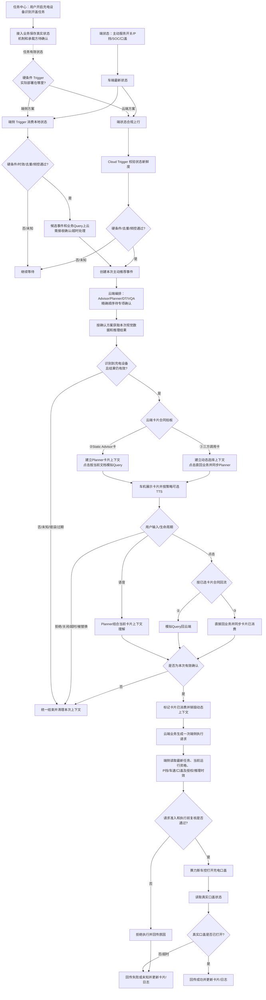

### 7.6.4 云端/混合逐步数据流

| 步骤 | 谁负责/在哪里 | 收到什么 | 判断什么 | 输出什么 | 失败怎么办 | 证据强度 |
|---:|---|---|---|---|---|---|
| 1 | 用户/任务中心 | 用户点击开启 | 页面是否可操作 | 用户操作意图 | 显示处理中或失败，不假显示成功 | 入口【文档事实】；接口【待确认】 |
| 2 | 接入业务/状态承载方 TBD | 任务和目标状态 | 鉴权、幂等、保存 | 真实任务状态 | 保存失败回滚；运行侧不得启用 | 【待确认】 |
| 3A 端侧候选 | 端侧硬条件 Trigger | 本地主动服务开关、P 挡变化、SOC、口盖状态及时间 | 字段完整、新鲜、同一车辆；硬条件和防重通过 | 候选事件与业务 Query 上云 | 上云失败、未收到接收结果或超时则结束/受控重试，不得本地直接开盖 | 部署【待确认】；若采用需新增跨端云候选链 |
| 3B 云端候选 | 端状态上行 → Cloud Trigger | 合规上行的任务/车辆状态和时间 | 上行数据新鲜、同车；硬条件和防重通过 | 云端候选事件 | 缺失/过期/UNKNOWN 不创建候选 | 会上按 Cloud Trigger 宣讲；正式数据/时序【待确认】 |
| 4 | 选定的硬条件 Trigger | 任务有效状态 + 硬条件 | 任务开启、总开关开启、切入 P、SOC≤20%、口盖关闭、未重复 | 一次候选事件 | 任一不满足继续等待；同一 P 挡周期防重 | 条件【会上宣讲方案】；位置【待确认】 |
| 5 | Trigger → 主动推荐 | 候选事件、业务目标 Query、车辆/任务上下文、有效期 | 是否接收本次推荐请求 | 接收结果和一次推荐事件 | 被抑制、超时、重复或接收失败则结束 | 主链【会上宣讲方案】；合同【待确认】 |
| 6–8 | 云端编排（Advisor/Planner/DT/VQA） | 推荐请求、业务 Query、上下文、视觉输入 | 是否推荐、需要何种工具、当前是否存在充电设备 | 带本次事件和时间的推理结果 | 任一环节拒绝、不可用、超时或无法判断均不得直接车控 | 模块方向【会上宣讲方案】；精确顺序【待确认】 |
| 9 | 端侧视觉/数据链 | 最新画面或任务专属观察 | 数据是否来自当前车辆和当前时段 | 可供 DT/VQA 判断的数据或结果 | 不允许用旧帧冒充当前环境 | “最后一帧”【会上宣讲方案】；具体通道【待确认】 |
| 10 | 云端原业务 | DT/VQA 结果 + 本次事件 | 是否识别到、是否新鲜、是否串车/串事件 | 决定出卡或结束 | 非命中、过期、错配全部结束 | 【产品方案】 |
| 11 | 云端业务 → 即时交互卡 | 卡片文案、按钮、TTS、事件、Planner 上下文、有效期 | 采用哪类云端卡片合同 | 拉卡请求 | 建立上下文或展示失败则不开放授权 | 需要卡片【会议确认】；卡型【待确认】 |
| 12 | VUI 即时交互卡 | 云端拉卡请求 | 准入、排队、真正展示、生命周期 | 展示/失败等状态；车机可见卡片 | 排队过期、关闭、被替换均回业务 | 生命周期【文档事实】；对接【待确认】 |
| 13 | 用户语音 → Planner | 用户说法 + 当前卡片上下文 | 是否表达确认、拒绝或无关 Query | 标准选择或继续对话 | 上下文过期/歧义时不授权 | 云端语音由 Planner【文档事实】 |
| 14 | 用户点击 → VUI/云端链 | 当前卡片按钮 | 是否仍有效、是否已消费；采用哪类卡片合同 | ②类按当前文档模拟 Query；③类直回业务并同步 Planner 已消费 | 重复/过期点击拒绝 | 两种合同【文档事实】；充电选型【待确认】 |
| 15 | 云端原业务 | 用户选择 + DT 结果 + 本次事件 | 同一事件、均未过期、未重复、明确确认 | 端侧执行请求 | 拒绝/关闭/超时/错配不执行 | 【产品方案】 |
| 16 | 端侧执行入口 | 任务、动作、授权、推理时效、事件关联 | 请求是否完整、未重复、仍有执行资格 | 接收或拒绝 | 乱序、过期、重复明确拒绝 | 端侧执行【会上宣讲方案】；正式接口【待确认】 |
| 17 | 端侧执行入口 | 最新任务状态、P 挡/车速、SOC、口盖、总开关 | 任务仍开、车辆停稳、口盖仍关、授权/推理有效、无冲突 | 允许车控或拒绝原因 | 任一变化终止，不调用车控 | 【产品方案】 |
| 18 | 赛力斯车控/状态域 | 合法开盖动作 | 整车安全门禁；随后读取口盖真实状态 | 成功/失败/未知 + 真实状态 | RPC 成功但口盖未开仍不是成功 | 车控在端侧【会上宣讲方案】；闭环【产品方案】 |
| 19 | 云端原业务/VUI/Planner | 最终真实结果和本次事件状态 | 卡片是否仍可更新、上下文是否需销毁 | 更新卡片；同步消费；日志/冷却 | UI 更新失败不重复车控；保留排障日志 | 上下文同步【文档事实】；接口【待确认】 |

### 7.6.5 充电口盖候选硬条件

```text
单任务有效
AND 主动服务总开关开启
AND 车辆从其他挡位切入 P 挡
AND SOC <= 20%
AND 充电口盖当前为关闭
AND 本次 P 挡周期尚未处理
```

需要研发和赛力斯确认：

- “切入 P 挡”是状态变化事件，还是只要当前为 P 挡；
- P 挡后多久内可以触发，车辆是否还需停稳/车速为 0；
- SOC 为瞬时值还是需连续满足；
- 总开关和单任务开关分别从哪里读，关闭任一开关如何取消在途事件；
- 口盖状态 UNKNOWN、打开中或故障时如何处理；
- 同一 P 挡周期、同一地点、同一充电设备如何防重；
- 频控和连续拒绝后的防打扰策略。

### 7.6.6 视觉数据与推理结果必须讲清楚

现有资料同时出现“VQA 看最后一帧”和任务专属观察/推理链路。不能把“默认感知”和“任务专属感知”理解为简单的先后兜底。专项需要明确：

1. 谁提出观察请求；
2. 使用默认 Context 中最新结构化结果，还是本任务专属 VQA；
3. 图像/结果如何与当前车辆和本次事件关联；
4. 取帧时间、推理完成时间和结果有效期；
5. 识别目标是充电桩、充电枪、充电车位标识还是任一充电设备；
6. 未识别、无画面、低置信、服务错误和超时如何区分；
7. 结果过期后是否重新观察，最多重试几次；
8. 结果返回端侧、云端原业务还是 Planner，谁最终消费。

【产品方案】结果至少需要表达“识别到、未识别到、无法判断、服务错误、已过期”五类业务语义；正式枚举由 DT/VQA 技术专项定义。

### 7.6.7 云端用户交互的两条输入路径

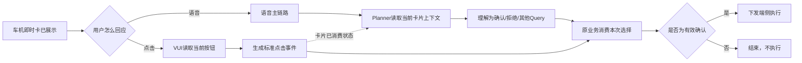

语音需要 Planner，是因为用户可能说“可以”“先别开”“这附近真的有吗”“换一个充电站”等开放表达；点击已经有明确按钮含义，不需要模型再猜，但 Planner 必须知道卡片已经被消费，避免后续上下文仍把它当成待确认。

### 7.6.8 充电卡当前最大的未决项

徐洋 VUI 文档存在两条都可能被引用的云端卡路径：

- **Static Advisor 卡**：上游由 Advisor 产生；语音走 Planner；当前文档写到点击缺少直接执行接口时可能模拟 Query 回云端。
- **系统通知/三方调用卡**：外部业务调用通用卡；语音通过 Planner 动态选项能力理解；点击直接回原业务，并把消费事件同步给 Planner。

9 月 1 日只说云端二轮交互可以参考相关链路，没有拍板充电口盖最终使用哪一种。两者的点击回流不同，因此不能在 PRD 中偷偷选一个。

本次必须请徐洋、Advisor、Planner 和充电业务共同回答：

1. 谁是拉卡请求方；
2. 谁持有本次卡片上下文；
3. 用户点击是直接回充电业务，还是形成模拟 Query；
4. 用户语音怎样关联当前卡片；
5. 关闭、超时、被替换怎样同步 Planner；
6. 卡片被消费后谁销毁动态选择能力；
7. 最终结果由谁更新卡片。

### 7.6.9 找云端相关研发时怎么说

| 找谁 | 直接提问 | 需要对方交付 |
|---|---|---|
| Trigger/主动推荐 | 硬条件实际在哪判断；候选事件和 Query 怎样给 Advisor；如何防重 | 上游时序、输入输出、当前能力 |
| Advisor/Planner | Static Advisor、Planner、DT 的精确顺序是什么；谁持有本次事件 | 云端编排时序和上下文责任 |
| DT/VQA | 用哪路视觉数据；返回哪些语义；结果多久有效；怎样关联本次事件 | 推理输入输出和错误/时效规范 |
| 徐洋/VUI | 充电最终采用哪类卡片合同；语音和点击分别回哪里 | 云端卡时序、生命周期、上下文同步 |
| 端侧执行/赛力斯 | 收到云端授权后复核哪些最新状态；怎样车控和回读 | 执行时序和真实状态验收 |

### 7.6.10 云端链路备答话术

> “充电口盖是这次云端/混合框架的样例。先由硬条件 Trigger 判断任务、总开关、P 挡、SOC 和口盖状态，再把带业务目标的 Query 交给主动推荐和 DT/VQA。DT/VQA 判断附近存在充电设备后，才由云端业务拉起车机即时卡。系统生成的 Query 不是用户授权；用户语音由 Planner 结合当前卡片上下文理解，点击形成明确选择并同步卡片已消费。只有同一次事件的推理结果和用户确认都有效，云端才下发端侧；端侧还要重新检查 P 挡、停稳、口盖、开关和时效，最后以真实口盖状态收口。今天必须拍板硬 Trigger 位置、视觉来源、结果合同、卡片类型、点击/语音回流和端侧执行接口。”

## 7.7 即时交互卡：它到底是什么，怎样和 Trigger 对接

### 7.7.1 一句话定义

即时交互卡是车机 VUI 的通用交互容器：业务告诉它“这次要问什么、有哪些可选动作、语音走哪条路、多久有效、结果回给谁”；卡片负责展示、生命周期和收集用户输入，再把结果返回原业务。

它不是：

- 一个负责判断业务条件的 Trigger；
- 一个负责理解所有语义的独立大模型；
- 一个可以脱离业务直接持有裸车控的执行器；
- 一个只要按钮点下就能宣布任务成功的状态源。

### 7.7.2 徐洋文档里的四类卡片链路

| 类别 | 谁发起 | 语音怎么处理 | 点击怎么处理 | 可见即可说 | 本项目关系 |
|---|---|---|---|---|---|
| ① Planner Query 卡 | 用户 Query 经 Planner/工具结果出卡 | 继续由 Planner 理解 | 点击直接执行，并将事件同步云端上下文 | 不使用 | 普通 Query 链，不是天气基线 |
| ② Static Advisor 卡 | Static Advisor 主动推荐 | Planner 理解 | 当前文档明确采用模拟 Query 回云端 | 不使用 | 充电上游经过 Advisor，但是否完整采用此合同待定 |
| ③ 系统通知/三方调用卡 | 第三方/外部业务请求卡片 | 需要泛化时，用 Planner 动态选择能力 | 点击直接回业务，同时同步 Planner 卡片已消费 | 不使用 | 9 月 1 日提到云端二轮交互可参考；充电是否采用待拍板 |
| ④ 端侧自闭环服务通知卡 | 端侧 Trigger/业务直接出卡 | 本地可见即可说映射当前按钮 | 点击端侧直接回原业务 | 使用，且仅卡片存活期间有效 | 天气当前明确采用 |

### 7.7.3 “卡片有泛化能力”是什么意思

它不是说卡片本身装了一个模型，而是：

1. 云端业务出卡时，把卡片标题、内容、按钮及当前业务上下文提供给 Planner；
2. 卡片存在期间，Planner 临时拥有一个“当前页面可选择项”的动态能力；
3. 用户不必严格说按钮原文，可以说“可以”“不用”“先看看附近还有没有别的”等；
4. Planner 结合当前卡片理解用户意图，并映射为按钮选择、其他 Query 或无法判断；
5. 卡片关闭、超时或被消费后，这个临时能力必须被移除，避免用户后来说“好的”误触发旧卡。

技术方案中曾用 `real_time_card`、动态选择工具、`select_button` 等表达这个思路。它们能证明能力设计存在，但不能证明充电业务已完成接入；本 PRD 只引用其业务含义，不直接把字段写成已上线接口。

### 7.7.4 Trigger/云端业务给卡片什么

这是产品层信息合同。正式字段名由 VUI 技术专项确定。

| 信息 | 为什么卡片必须知道 | 天气示例 | 充电示例 |
|---|---|---|---|
| 任务身份 | 知道是哪项长期任务 | 天气/路况保护 | 识别充电设备后开盖 |
| 本次运行身份 | 把选择回到正确的一次触发 | 本次湿滑事件 | 本次 P 挡低电量事件 |
| 发起来源/交互类型 | 决定端侧可见即可说还是云端 Planner | 端侧自闭环 | 云端 Advisor/三方卡，待选型 |
| 场景说明 | 告诉用户为什么出现 | 检测到雨天或湿滑路面 | 检测到附近存在充电设备 |
| 问题与正文 | 展示要问什么 | 是否切换湿滑模式 | 是否打开充电口盖 |
| 按钮及业务含义 | 明确确认、拒绝或其他操作 | 确认/暂不 | 打开/暂不 |
| 确认/拒绝示例表达 | 让语音接入方知道哪些说法应映射到哪个按钮语义 | 如“好的/可以/不用/暂时不用”；最终词表待业务确认 | 不要求穷举固定词，由 Planner 结合卡片上下文理解 |
| TTS 策略 | 决定是否播、播什么、禁语音怎么降级 | 正常播；禁语音时天气只留卡 | 待确认禁语音策略 |
| 语音路由 | 决定输入给可见即可说还是 Planner | 本地 | 在线 Planner |
| 点击回流 | 让点击回到真正拥有业务状态的模块 | 原天气业务/Trigger | 原充电业务，具体合同待定 |
| 有效期 | 过期后不允许旧授权 | 天气/车况变化快 | DT 结果和用户授权都需时效 |
| 优先级 | 与用户 Query、其他主动服务仲裁 | 低于正在进行的用户 Query | 同左，具体策略待统一 |
| 当前业务状态 | 支持显示等待、处理中或结果 | 等待确认 | 等待确认/正在开盖 |

这里有一个不能在评审时讲错的边界：**当前资料只能证明“天气方向使用可见即可说”，不能证明现有所有即时交互卡会自动注册可见即可说。** 天气业务至少要给出按钮语义，以及确认、拒绝和常见表达的业务样例；最终由天气业务研发逐卡注册，还是由 VUI 提供统一注册/注销通道，必须在卡片专项中确认。未确认前，PRD 不得写成“卡片一展示就天然支持语音”。

### 7.7.5 卡片要返回给业务什么

卡片不能只返回“按钮被点击”。至少需要返回三类业务结果：

| 返回类别 | 具体语义 | 业务拿到后做什么 |
|---|---|---|
| 展示结果 | 已接收、排队、真正展示、展示失败及原因 | 只有真正展示后才认为用户有机会看到；失败则停止需要授权的动作 |
| 用户结果 | 确认、拒绝、关闭、超时、打断、其他 Query；关联本次运行事件 | 原业务决定复核、结束或继续对话 |
| 生命周期结果 | 隐藏、恢复、过期、被替换、被消费 | 销毁本地词条或 Planner 动态上下文，避免旧授权 |

还需保留输入方式：点击、本地语音、Planner 语音。这样才能排查是卡片问题、语音问题还是业务回调问题。

### 7.7.6 业务执行后还要给卡片什么

如果本次任务出过卡，原业务在执行阶段需要继续更新：

- 已收到确认，正在检查；
- 条件发生变化，未执行；
- 正在执行；
- 执行成功，并附真实目标状态；
- 执行失败或无法确认，并附可展示原因；
- 卡片是否立即关闭或短暂停留。

卡片展示层不能把“用户点了确认”直接改成“已打开/已切换”。最终状态只能来自原业务的真实执行回读。

### 7.7.7 卡片生命周期

《VUI 主交互需求》描述了默认 TTS 后约 10 秒等生命周期规则，并在用户交互、视频或加载中暂停计时；页面跳转、对话退出、语音通道占用等可能让卡片消失。具体时长是否直接用于本项目仍需 VUI 确认，但产品必须覆盖以下状态：

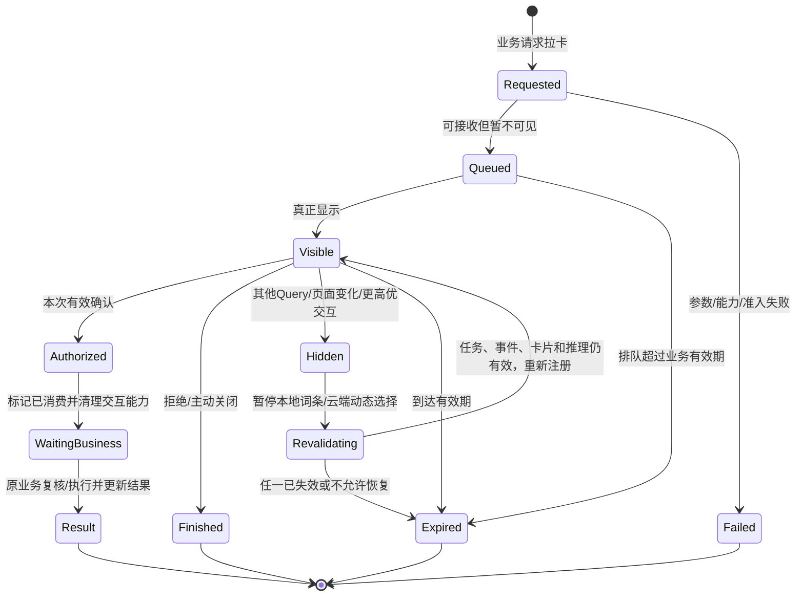

“其他 Query”不默认等于卡片已经被消费；它可能只是打断或转场。卡片进入 Hidden 时应暂停本地词条或云端动态选择能力，恢复前重新校验任务、运行事件、卡片本身和推理结果是否仍有效，之后才能重新开放交互。

### 7.7.8 卡片与 Trigger 的边界验收

| 用例 | 正确结果 |
|---|---|
| Trigger 条件未满足 | 不请求卡片；卡片不自行订阅天气或 SOC |
| 卡片排队但尚未展示 | 不播 TTS、不开始用户授权、不提前注册旧词条 |
| 卡片展示失败 | 需要授权的任务停止，不能静默车控 |
| 用户点击确认 | 卡片返回本次选择；原业务复核，不由卡片直接车控 |
| 用户说“好的”但卡片已过期 | 本地词条/云端上下文已销毁，不执行旧事件 |
| 用户确认后车况变化 | 原业务复核失败，卡片显示未执行或条件变化 |
| RPC 返回成功但真实状态未变 | 卡片不得显示“已完成” |

### 7.7.9 找徐洋时直接这样说

> “徐洋，我这次不让卡片判断天气或充电业务，我只需要把业务与卡片的合同定清。天气按端侧第④类：Trigger 拉卡、可见即可说、点击端侧回业务；请确认拉卡准入、排队/展示 ACK、词条注册注销、关闭超时和结果更新。充电是云端链，请你和 Advisor/Planner 一起拍板使用 Static Advisor 卡还是三方调用卡，特别是点击回原业务还是模拟 Query、语音如何绑定当前卡片、卡片消费后怎样清理 Planner 上下文。正式字段你们技术方案定义，我先把业务行为和验收写清。”

## 7.8 系统预设任务配置平台框架

### 7.8.1 先讲清“当前现状”

9 月 1 日会议已经明确：当前还不是一个“产品填完所有内容，端云自动运行”的完整系统预设任务平台。

| 能力 | 当前能确认的现状 | 不能对研发说的话 |
|---|---|---|
| 云端条件/频控 | 可以配置一部分 | “云端所有任务只要填表就能上线” |
| 端侧条件任务 | 当前仍依赖端侧研发和随车版本；长期希望平台化下发 | “端侧已经和云端共用同一套动态配置” |
| 原子能力 | 需要分批接入，支持范围不完整 | “所有端状态、事件和动作都已在平台” |
| 卡片/TTS/二次确认 | 有单点能力和设计文档，但没有证据证明已完整沉淀为系统预设任务配置节点 | “勾选卡片/TTS 就能自动闭环” |
| 端云同步 | 长期有统一配置和同步方向 | “任务状态、规则和运行权已经全量双向同步” |
| 执行与回读 | 车控和状态单点能力存在，统一任务执行合同未确认 | “车控成功会自动更新卡片和任务中心” |

### 7.8.2 目标不是造一个“万能大平台”

第一阶段平台只需要把公共部分标准化，并明确哪些部分仍要专项开发：

```text
平台统一管理：任务元数据、适用范围、运行位置、已有原子能力引用、规则、交互策略、版本、灰度、关闭和日志

专项能力继续开发：新端状态、新 VLM/OMS 能力、新 DT/VQA 工具、新卡片组件、新车控能力、安全门禁
```

也就是说，“可配置”不等于“平台凭空生成不存在的能力”。平台只能组合已经接入并通过验收的原子能力。

### 7.8.3 从产品写需求到车辆运行的配置链

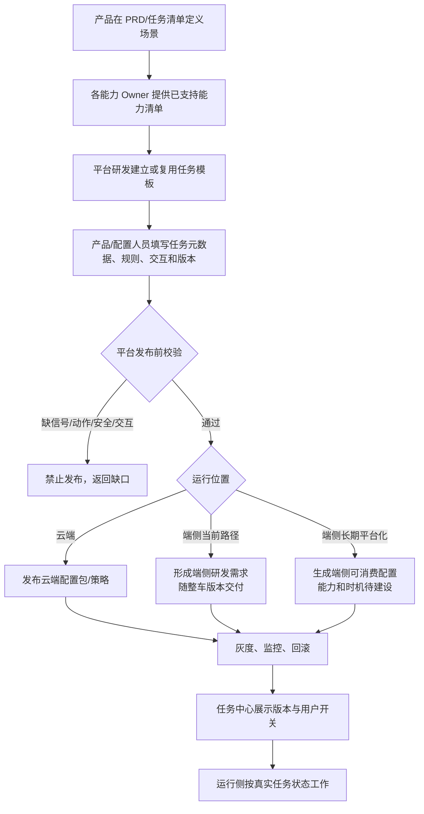

### 7.8.4 配置平台需要有哪些模块

| 模块 | 谁负责 | 去哪里做 | 输入 | 平台判断 | 输出 | 当前状态 |
|---|---|---|---|---|---|---|
| 任务目录 | 平台产品/研发 | Trigger/任务配置后台，正式页面由 Owner 确认 | 名称、描述、Owner、车型、默认状态 | ID 唯一、车型/版本合法 | 可发布任务定义 | 部分存在，需统一 |
| 原子能力目录 | 信号/VLM/车控/工具 Owner + 平台 | 能力注册与数据字典 | 状态、事件、动作、工具及契约 | 能力是否接入、是否有时效/错误语义 | 可被规则引用的能力 | 需分批补齐 |
| 端云运行配置 | 架构/Trigger Owner | 任务模板 | 运行位置、唯一运行版本、切换策略 | 是否可能双侧同时生效 | 唯一运行方案 | 需新增/明确 |
| 条件编辑 | Trigger 平台 | 规则配置页 | AND/OR、阈值、枚举、变化事件 | 类型、取值、组合是否合法 | 可执行规则 | 云端部分支持；端侧不完整 |
| 时序策略 | Trigger 平台 | 规则/策略页 | 防抖、去重、频控、处理中锁、冷却 | 是否缺少最低防打扰规则 | 时序配置 | 在线部分支持；端侧多为代码 |
| 推理编排 | Advisor/Planner/DT 平台 | 云端工具/编排配置 | Query、工具、结果门禁、时效 | 工具是否可用、错误是否处理 | 云端编排方案 | 单点能力有，任务合同待补 |
| 交互策略 | VUI + 平台 | 卡片/TTS 配置或引用 | 卡型、内容、按钮、TTS、语音路由、有效期 | 需要确认是否有回调和失败策略 | 可调用交互方案 | 尚未完整平台化 |
| 执行策略 | 端侧/赛力斯 + 平台 | 动作目录/任务模板 | 动作、参数、复核项、回读状态 | 车型能力、安全和结果是否完整 | 可执行动作引用 | 统一合同待补 |
| 发布治理 | 平台研发/项目 | 发布页 | 版本、灰度、车型、依赖、回滚 | 依赖是否通过验收 | 发布记录 | 需补齐端云一致性 |
| 日志与监控 | 平台/业务/测试 | 监控后台 | 任务、事件、卡片、推理、车控数据 | 是否可串起完整链路 | 指标、告警、排障 | 当前分散 |

“去哪里做”这里刻意没有虚构具体后台 URL。专项评审后应由韩杰/平台 Owner 在结论表补上真实页面、接口或代码仓位置。

### 7.8.5 一条任务在平台要填哪些内容

| 配置区域 | 产品要写的内容 | 研发/平台要保证的能力 |
|---|---|---|
| 基础信息 | 用户名称、描述、默认状态、可关闭/删除、适用车型、业务 Owner | 唯一 ID、版本和车型校验 |
| 运行策略 | 端侧/云端/混合及原因；唯一运行原则 | 防止端云双生效；切换和回滚 |
| 输入数据 | 业务名、来源、枚举、有效期、UNKNOWN 行为 | 数据接入、类型校验、时间戳/质量 |
| 触发规则 | 触发事件、条件组合、阈值、连续周期 | 规则表达与运行能力 |
| 时序 | 防抖、去重、频控、冷却、拒绝后策略 | 状态保存和幂等 |
| 模型/工具 | 何时调用、业务 Query、什么结果才继续、结果有效期 | Advisor/Planner/DT 调用和错误返回 |
| 交互 | 是否出卡/TTS、问题、按钮、语音/点击路由、有效期、禁语音降级 | 卡片准入、生命周期、回调和上下文 |
| 动作 | 用户授权或静默条件后的业务动作 | 合法参数和能力映射 |
| 执行前复核 | 必须重新检查的任务、车况、授权、推理、冲突条件 | 端侧复核和拒绝原因 |
| 状态回读 | 哪个真实状态达到什么值才算成功 | 状态订阅、超时和最终结果 |
| 结束与恢复 | 拒绝、关闭、超时、恢复天气、重启、中断 | 生命周期和恢复 |
| 验收 | 正例、反例、弱网、过期、重复和失败 | 日志证据和实车测试 |

### 7.8.6 发布前校验

以下任一不满足，平台或评审流程应禁止发布：

- 没有唯一任务标识、业务 Owner、车型或版本；
- 运行位置未定，或端侧和云端可能同时触发；
- 引用了尚未接入/未验收的信号、模型或车控能力；
- 关键数据没有时间戳、有效期或 UNKNOWN 处理；
- 需要确认但没有卡片失败、拒绝、关闭和超时规则；
- 语音路由未定，或卡片消失后仍可能接受旧语音；
- 没有执行前最新状态复核；
- 没有真实状态回读，只有 RPC ACK；
- 没有防抖、去重、频控或处理中锁；
- 业务规则存在冲突，例如后视镜同时写 P 挡和非 P 挡；
- 字节和赛力斯对同一场景都有主动动作且无仲裁。

### 7.8.7 你给平台研发怎么讲

> “我不是要求本期做一个什么都能配的万能平台。第一阶段请先把已有能力组合成完整任务：任务元数据、真实开关、唯一运行位置、规则、时序、交互引用、动作引用、版本和日志。不存在的 VLM、DT、卡片或车控能力仍走专项开发，但平台要能标出依赖和阻止误发布。请你们给我一份当前能力矩阵：哪些已经可配置、哪些只在云端、哪些端侧仍写代码、哪些有接口但系统预设任务没接。我再据此决定本期配置范围，不会把长期目标写成本期承诺。”

### 7.8.8 配置平台评审记录

| 能力项 | 已支持证据 | 本期改造 | 长期建设 | Owner/时间 |
|---|---|---|---|---|
| 任务元数据/展示 | 待补 |  |  |  |
| 任务状态/恢复 | 待补 |  |  |  |
| 云端规则 | 部分支持，需能力清单 |  |  |  |
| 端侧规则 | 当前依赖开发 |  |  |  |
| 防抖/去重/频控 | 在线部分支持 |  |  |  |
| 即时卡/TTS | 单点能力有，任务接入待补 |  |  |  |
| 可见即可说 | 能力存在，天气接入待证实 |  |  |  |
| Planner/DT/VQA | 单点能力有，充电合同待补 |  |  |  |
| 执行前复核 | 待补 |  |  |  |
| 车控/状态回读 | 单点能力有，统一合同待补 |  |  |  |
| 灰度/回滚/日志 | 待补 |  |  |  |

## 7.9 四条系统预设任务逐条落位

### 7.9.1 先看总表

| 任务 | 最新可用口径 | 端云归属 | 交互 | 当前能否直接进入开发 | 主要阻塞 |
|---|---|---|---|---|---|
| 天气/路况保护 | 端侧 Trigger 判断本地天气/路况和车辆状态；确认后执行 | **端侧方向已确认** | 卡片 + TTS；本地可见即可说/点击；天气禁语音时保留卡片 | 王泽民会上称端侧在推进，实际进度需汪帅等研发提供证据；完整联调仍需补合同 | 状态路径、正式信号、防抖、离线卡、回调、复核/回读 |
| 后排儿童/宠物识别后开启儿童锁 | 最新会议口径无卡、无 TTS；儿童与宠物数据来源不同 | **待确认，不能写死** | 当前口径静默 | **不能直接进入量产自动车控** | 旧稿完全冲突、宠物低频、安全授权、门范围、端云和双方归属 |
| 后视镜自动加热 | 三个候选的确定性规则场景；无卡、无 TTS | **待确认，优先评估赛力斯/端侧闭环** | 静默 | 规则定稿后才能开发 | P/非P冲突、雨刮信号、温差窗口、计时/退出、双方归属 |
| 识别充电设备后打开充电口盖 | 硬条件→主动推荐 Query→DT/VQA→识别到→卡片确认→端侧开盖 | **当前产品基线为端云混合；尚待跨团队技术确认，硬 Trigger 位置待定** | 卡片 + TTS + 在线语义/点击 | 可做技术方案，但不能按未定接口开工 | 视觉来源、结果时效、Planner/Advisor顺序、卡型和点击回流 |

### 7.9.2 任务一：天气/路况保护

#### 用户问题

在雨、雪、雾或危险路面中，用户可能忘记开启合适的驾驶模式或灯光。系统在行驶过程中及时提醒，并在用户确认后完成调整。

#### 当前结论

- 【会议确认】走端侧自闭环；不经过 Planner。
- 【会议确认】需要卡片、固定 TTS 和二次确认；本地语音先走可见即可说。
- 【会议确认】语音禁用时，天气保留卡片、不播 TTS、只支持点击。
- 【会上宣讲方案】天气/路况来自端侧 VLM；车速、模式、灯来自端状态。
- 【待确认】离线卡是否真实可用、正式数据、防抖、恢复、车控和状态回读。

#### 业务规则卡

| 项目 | 产品定义 |
|---|---|
| 用户入口 | 任务中心“天气/路况保护”开关 |
| 默认状态 | 当前任务全集写默认开启；最终量产默认值需赛力斯确认 |
| 运行位置 | 端侧自闭环 |
| 触发数据 | VLM 天气/路面；车速、驾驶模式、后雾灯；均需时间与质量 |
| 场景 | 雨/湿滑、雪/结冰、浓雾三分支 |
| 交互 | 卡片 + TTS + 确认/拒绝；语音走可见即可说 |
| 动作 | 湿滑模式、雪地模式、后雾灯，按分支执行 |
| 成功 | 真实车辆状态达到分支目标 |
| 结束 | 拒绝/关闭/超时/复核失败/执行完成；进入冷却 |
| 恢复 | 天气恢复后是否询问恢复原状态，待赛力斯确认 |

#### 一次完整正例

```text
任务明确为开启
→ VLM 当前满足“下雨或路面湿滑”，并通过专项最终确认的防抖规则
→ 车速 > 30 km/h，当前不是湿滑模式
→ 防抖、去重、频控通过
→ Trigger 创建本次湿滑事件
→ 卡片真正展示并播报
→ 用户在有效期内点击“确认”
→ 端侧再读任务、天气、车速、模式
→ 仍满足，调用切湿滑模式
→ 回读真实模式为湿滑
→ 卡片显示完成，事件进入冷却
```

#### 必须覆盖的反例

- 任务关闭，即使雨天和车速满足也不出卡。
- VLM 值过期或 UNKNOWN，不触发。
- 卡片排队时天气恢复或任务关闭，撤销卡片。
- 用户拒绝、关闭或超时，不车控。
- 卡片消失后说“好的”，不执行旧事件。
- 用户确认后车速/场景变化，复核失败。
- 用户手动提前切好目标模式，不重复车控。
- RPC 成功但模式没变，显示失败/未知，不能显示成功。

#### 本任务评审要拍板

1. 任务状态真实来源和端侧恢复机制；
2. 三分支唯一信号、枚举、时效和组合；
3. 防抖次数、频控、处理中锁、拒绝后策略；
4. 端侧即时卡离线展示是否量产可用；
5. 可见即可说注册/注销接口和 Owner；
6. 复核、车控、状态回读及恢复天气流程。

### 7.9.3 任务二：后排儿童/宠物识别后开启儿童锁

#### 用户问题

车辆进入行车状态时，如果后排有儿童或特定宠物且儿童锁未开启，系统希望降低误开车门风险。

#### 资料为什么冲突严重

| 维度 | 旧 SLS 稿 | 9 月 1 日/当前任务全集口径 | 必须怎么处理 |
|---|---|---|---|
| 触发时机 | 切入 D 挡 | 非 P/行车状态 | 赛力斯给唯一事件和状态条件 |
| 识别对象 | 占位组中儿童/老人+儿童 | 儿童 + 猫/狗 | 明确儿童来源和宠物支持范围 |
| 数据来源 | `con_occGroup` 等旧字段 | 儿童拟 OMS/SLS，宠物拟字节 VLM | 数据 Owner 给正式字段和时效 |
| 交互 | 卡片 + TTS + 用户正反馈 | 不出卡、不播 TTS | 只能保留一版；安全会签 |
| 执行 | 用户确认后开启儿童锁功能（锁止约定后门） | 无卡、无 TTS 的自动开启儿童锁方向 | 确认是否允许无授权车控，以及锁止范围 |

#### 当前只能写到的候选规则

```text
任务有效
AND 车辆进入非 P/行车状态（精确定义待定）
AND 后排识别到儿童，或识别到已评测范围内的猫/狗
AND 目标儿童锁当前未开启
→ 进入执行前安全复核
→ 是否静默开启儿童锁，须经业务/安全/车控拍板
```

#### 数据能力边界

- 儿童识别可能来自赛力斯 OMS/SLS，正式字段和周期待确认。
- 宠物识别拟由字节 VLM 提供；会议明确现有评测只覆盖猫、狗。
- 宠物能力约 5 分钟一次，不能默认五分钟前的结果仍适合触发安全动作。
- 其他宠物没有评测证据，不应在用户文案中泛化承诺为“所有宠物”。

#### 为什么本任务不能因为“无卡无 TTS”就直接开发

无卡、无 TTS 只说明没有二次交互，并不自动提供用户授权。静默车控至少要确认：

1. 系统任务默认开启是否符合安全与用户知情要求；
2. 开左侧、右侧还是双侧儿童锁；
3. 当前车门、车速、座位占用、儿童/宠物结果时效等安全门禁；
4. 用户刚手动关闭儿童锁后，系统是否马上重新打开；
5. 识别误报、漏报和低频时怎样处理；
6. 失败是否需要可见反馈或任务历史；
7. 谁对动作策略签字：赛力斯产品、整车安全还是字节业务。

#### 候选流程

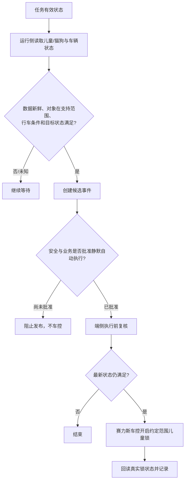

#### 本任务备答话术

> “儿童锁最新会议口径是无卡、无 TTS，但旧 SLS 稿仍是切 D、出卡、用户确认，两版在触发、对象和授权上完全冲突。宠物能力又只有猫狗评测、约五分钟一次，而开儿童锁是安全动作。因此今天不能直接承诺静默车控。需要赛力斯产品、安全、车控和数据 Owner 先给出唯一规则、支持对象、门范围、数据时效、手动关闭保护和端云归属；签字前该任务只做框架验证，不进入量产发布。”

#### 本任务评审要拍板

- 最终规则基线采用哪一版；
- 儿童与猫狗的正式数据和最大可接受时效；
- 静默自动车控是否合法、是否需要首次授权；
- 锁的范围、最新状态复核、手动关闭抑制和失败反馈；
- 由赛力斯自闭环、字节端侧还是云端承担；
- 安全签字 Owner 和验收数据。

### 7.9.4 任务三：后视镜自动加热

#### 用户问题

雨水、洗车残留或高湿温差影响后视野时，系统自动开启后视镜加热，减少驾驶员手动操作。

#### 当前三个候选场景

| 场景 | 当前候选条件 | 动作 | 主要未决项 |
|---|---|---|---|
| 雨天行驶 | 下雨 + 车速 < 70 km/h + 非 P；原稿曾含雨刮连续约 30 秒 | 开启后视镜加热 | 雨刮信号是否可用；持续/退出规则 |
| 洗车后 | 传送带洗车模式退出事件 | 开启一次 | 持续时间、重复事件、重启恢复 |
| 高湿温差 | 湿度 > 60% + 行驶状态 + 一定窗口温差 > 5℃ | 开启一次 | 温度来源、窗口、采样、退出 |

#### 资料冲突

- 正式分析稿的雨天场景为**非 P**；9 月 1 日宣讲出现“P 挡 + 车速 < 70”，被当场指出逻辑不合理。
- 雨刮连续条件因缺少可用端状态曾拟删除，不能继续在不同版本中忽有忽无。
- “开启 15 分钟”主要出现在后续表格/纪要，最初分析并没有完整定义，需确认是否为最终策略。
- 8 月 27 日材料一度写云端判断；9 月 1 日重新讨论是否应由赛力斯自闭环，归属没有最终拍板。

#### 端云建议与事实边界

从业务特征看，这三个场景是确定性端状态规则，不需要 Planner、DT/VQA 或开放语义，数据和车控也主要在车端，因此**产品建议优先评估赛力斯/端侧自闭环**。如果因为现有平台能力由字节承接，也可用“云端规则判断 + 端侧执行”验证框架，但这不是当前已确认结论。

#### 候选静默链路

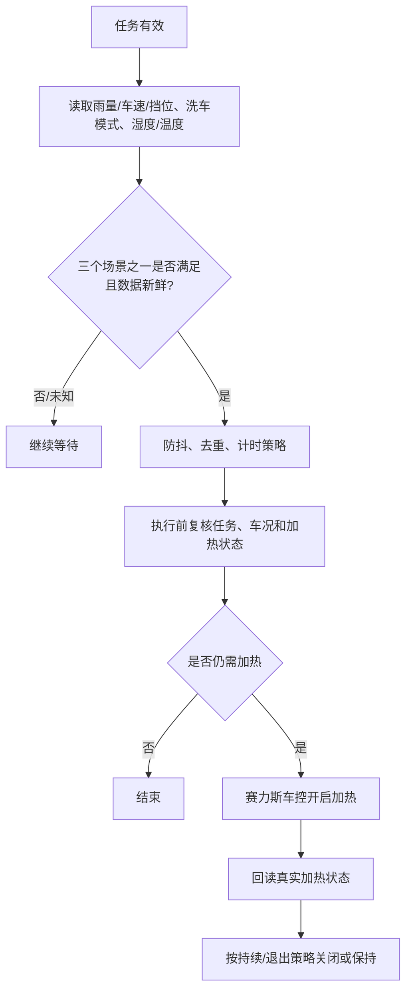

#### 本任务备答话术

> “后视镜最新口径无卡、无 TTS，但它的问题不在交互，而在规则和归属还没有唯一版本。分析稿是非 P 行驶，会上却出现 P 挡加车速条件；雨刮、15 分钟和温差窗口也没有统一。这个任务本身是确定性端状态规则，没有模型价值，我建议先让赛力斯确认唯一场景、持续和退出策略，再决定赛力斯端闭环还是字节承接。在此之前不能对研发说云端方案已经确定。”

#### 本任务评审要拍板

- P/非 P 和车速的唯一规则；
- 雨量/雨刮、湿度、温度、洗车模式的正式信号；
- 连续条件、温差窗口、15 分钟、退出和人工覆盖；
- 无卡无 TTS 下是否需要任务历史/失败反馈；
- 字节与赛力斯唯一责任方；
- 动作和状态回读。

### 7.9.5 任务四：识别充电设备后打开充电口盖

#### 用户问题

车辆低电量并停入充电场景后，系统识别周围是否存在充电设备，主动询问用户；用户确认后帮助打开充电口盖。

#### 当前基线

```text
Trigger 检测前置条件满足
→ 向主动推荐发送带业务目标的 Query
→ 主动推荐/云端编排调用 DT
→ DT/VQA 使用端侧视觉数据并返回本次推理结果
→ 识别到充电设备
→ 即时交互卡 + TTS 询问用户
→ 用户有效确认
→ 端侧执行前复核
→ 赛力斯车控开盖
→ 回读真实口盖状态
```

#### 业务规则卡

| 项目 | 当前定义 |
|---|---|
| 用户入口 | 任务中心“识别充电设备后打开充电口盖”开关 |
| 运行位置 | 当前产品基线为端云混合；跨团队技术结论和硬 Trigger 物理位置待确认 |
| 硬条件 | 任务有效、主动服务总开关、切入 P、SOC≤20%、口盖关闭、未重复 |
| 业务 Query | “帮我看一下有没有充电桩，如果有的话打开充电口”或等价目标；正式模板待确认 |
| 模型判断 | DT/VQA 判断当前附近是否存在定义范围内的充电设备 |
| 出卡门禁 | 推理识别到且结果仍有效后才询问 |
| 交互 | 卡片 + TTS；语音由 Planner，点击路径待卡型拍板 |
| 执行 | 用户有效确认后下发端侧；端侧重新检查再开盖 |
| 成功 | 真实充电口盖状态为打开 |

#### 必须覆盖的反例

- 只有 Query 生成、但用户尚未确认：不得开盖。
- DT 未识别、无法判断、错误或超时：不得进入执行。
- DT 结果来自旧画面、其他车辆或旧事件：不得出执行请求。
- 卡片展示失败、关闭、超时或用户拒绝：不得执行。
- 用户确认后离开 P 挡、车辆移动、口盖已被手动打开或任务关闭：端侧拒绝执行。
- 同一 P 挡周期重复触发：最多形成一次有效动作。
- 云端断网后恢复：不能用旧推理和旧授权补开盖。
- RPC 成功但真实口盖仍关闭：显示失败/未知，不重复盲目开盖。

#### 本任务备答话术

> “充电是端云混合样例。硬条件先筛掉明显不该做的场景，再用 Query 让主动推荐和 DT/VQA 判断周围有没有充电设备。这个 Query 是系统给云端的工作目标，不是用户授权。识别到以后才出卡，用户语音由 Planner 理解，点击如何回业务取决于最终卡型。确认后还要回端侧读最新 P 挡、车辆停稳、口盖、任务和时效，最后看真实口盖是否打开。今天要定的是硬 Trigger 位置、视觉数据、结果合同、卡片点击/语音回流、授权有效期和端侧执行。”

#### 本任务评审要拍板

- 硬 Trigger 在端侧还是 Cloud Trigger，谁持有本次运行事件；
- Trigger→主动推荐的业务信息和 Query 模板；
- Static Advisor、Planner、DT/VQA 精确时序；
- 视觉数据来源、结果语义、事件关联、有效期和重试；
- 使用 Static Advisor 卡还是系统通知/三方卡；
- 点击、语音、关闭、超时分别回给谁；
- 端侧复核、车控幂等和口盖状态回读。

### 7.9.6 四任务与字节/赛力斯边界

截至 9 月 1 日 02:14:49，会议只有“赛力斯先盘自己会做哪些”的行动，没有形成最终职责边界。因此下面是评审方法，不是已确认分工。

| 判断问题 | 更偏赛力斯/端侧 | 更偏字节云端能力 | 仍需共同完成 |
|---|---|---|---|
| 数据和动作 | 车身状态、整车传感、OMS、车控、安全门禁 | Planner、Advisor、DT/VQA、字节 VLM/Agent 能力 | 数据契约、时效和错误语义 |
| 规则特征 | 强实时、固定规则、断网必须工作 | 需要语义、模型、历史、多工具编排 | 端云唯一运行权和去重 |
| 用户交互 | 本地有限按钮语义/可见即可说 | 在线泛化语义、动态卡片上下文 | 卡片展示、点击、TTS、最终结果 |
| 责任底线 | 真实车控和车辆状态 | 云端判断与推荐 | 用户授权、端侧复核、联调验收 |

防止重复的要求：

- 每条任务必须有唯一业务 Owner；
- 每个车辆/任务版本必须有唯一触发方；
- 赛力斯已经自闭环的同类任务，字节侧不得重复拉卡或执行；
- 迁移或切换期间必须有灰度、运行权版本和回滚；
- 双方日志要能用同一任务和运行事件关联排查。

## 7.10 五份产品行为合同

这些合同先定义“业务上必须表达什么”。研发可以合并接口或改名，但不能丢失语义。

### 7.10.1 合同一：任务启停与真实状态

| 方向 | 必须表达 | 接收方行为 |
|---|---|---|
| 任务中心 → 接入业务 | 哪项任务、用户想开启还是关闭、哪次操作、哪个车辆/账号 | 鉴权、幂等、保存，不直接把意图当真实状态 |
| 接入业务 → 任务中心 | 处理中、成功后的真实状态、失败和原因、当前版本 | UI 按真实结果展示或回滚 |
| 状态承载方 → 运行侧 | 哪项任务当前有效、更新时间/顺序、适用范围、当前运行方及资格代次/等价防旧语义 | 状态明确且持有当前资格才等待触发 |
| 运行侧 → 状态承载方 | 启动、重连或怀疑漏事件时请求当前完整状态 | 返回可恢复的一致状态；UNKNOWN 不得默认为开启 |

### 7.10.2 合同二：条件/模型判断

| 输入 | 必须说明 | 输出 | 异常原则 |
|---|---|---|---|
| 结构化状态/事件 | 来源、值、时间、质量、车辆、是否变化事件 | 满足、不满足、无法判断 | 缺失/过期/无法判断不触发 |
| DT/VQA 请求 | 本次任务、业务目标、当前事件、所需观察、时效 | 识别到、未识别、无法判断、错误及结果时间 | 过期、串车、串事件不得继续 |

### 7.10.3 合同三：业务与即时交互卡

| 业务给卡片 | 卡片给业务 |
|---|---|
| 任务和本次运行身份 | 是否接收、排队、真正展示或失败 |
| 端侧/云端来源与交互类型 | 用户确认、拒绝、关闭、超时、打断、其他输入 |
| 场景、问题、按钮和业务含义 | 输入来自点击、本地语音还是 Planner |
| TTS、语音路由、点击回流 | 卡片隐藏、恢复、过期、被替换、被消费 |
| 有效期、优先级、回到哪个业务 | 原运行事件关联和时间 |

### 7.10.4 合同四：云端业务与端侧执行

云端下发端侧的不是“直接执行的绝对命令”，而是一份需要端侧重新准入的业务请求。至少要表达：

- 哪项任务、哪次运行、要做什么动作；
- 用户是否授权、授权来自哪里、授权何时过期；
- 模型结果及其时间/有效期；
- 产生本次事件时的运行资格代次或等价防旧信息；
- 云端认为满足的硬条件快照；
- 重复请求如何识别；
- 端侧应该回传接收、拒绝、执行和真实状态结果。

端侧必须重新读取当前运行资格并拒绝旧代请求，再回答：是否接收、复核通过/拒绝及原因、车控调用结果、真实状态结果。

### 7.10.5 合同五：最终结果

| 状态 | 含义 | 是否可向用户显示成功 |
|---|---|---|
| 已收到用户确认 | 只有授权 | 否 |
| 已接收执行请求 | 端侧开始处理 | 否 |
| 执行前复核通过 | 当前允许调用车控 | 否 |
| 车控 RPC ACK | 控制接口接收或返回 | 否 |
| 真实状态达到目标 | 车辆实际完成 | **是** |
| 真实状态未达到 | 动作失败或未知 | 否，必须真实反馈 |

## 7.11 全局异常与降级

| 异常 | 端侧任务 | 云端/混合任务 | 产品底线 |
|---|---|---|---|
| 任务状态 UNKNOWN | 不创建新事件 | 不创建新事件 | 不猜测为开启 |
| 关键状态缺失/过期 | 本轮结束 | 本轮结束或重新取数 | UNKNOWN 不等于满足 |
| 网络不可用 | 仅已确认的端侧离线能力继续；天气离线卡需实车证明 | 停止依赖云端的新流程，不用旧结果补执行 | 不伪装云端成功 |
| 端云切换 | 先撤销旧侧资格并清理在途，再允许新侧运行 | 同左；晚到旧请求按资格过期拒绝 | 不双出卡、不双执行；实现方案待专项 |
| 重复触发 | 去重或合并 | 去重或合并 | 一次场景最多一项有效动作 |
| 用户 Query 占用交互 | 按统一优先级排队/取消 | 同左 | 用户当前请求优先；具体仲裁待 Owner |
| 卡片排队过期 | 撤销，不执行 | 撤销云端上下文，不执行 | 没真正展示就没有授权 |
| 卡片展示失败 | 需要确认的任务停止 | 需要确认的任务停止 | 不降级为静默车控 |
| 语音禁用 | 天气：保留卡片、无 TTS、只点击；其他逐任务确认 | 充电策略待确认 | 不擅自推广为全局规则 |
| 用户拒绝/关闭/超时 | 不执行，按策略冷却 | 不执行并同步上下文消费 | 都不是授权 |
| 卡片过期后回应 | 不匹配旧词条 | 不使用旧 Planner 上下文 | 旧事件不能复活 |
| 用户确认后车况变化 | 复核失败 | 端侧拒绝云请求 | 最新车况优先 |
| DT/VQA 无法判断/错误 | 不适用 | 结束或按受控策略重试 | 不把错误当“未发现”或“已发现” |
| 执行请求重复 | 幂等拒绝或返回原结果 | 同左 | 不重复车控 |
| RPC 超时 | 先查真实状态 | 同左 | 不盲目重试危险动作 |
| ACK 成功但状态未变 | 失败/未知 | 同步真实结果 | 不显示成功 |
| 用户关闭任务且动作已不可取消 | 完成回读，不自动做反向动作 | 同左 | 真实状态透明，后续策略专项定义 |

## 7.12 优先级、防抖、去重和防打扰

### 7.12.1 四个概念不能混

| 概念 | 解决什么问题 | 示例 |
|---|---|---|
| 防抖 | 数据短暂波动导致误触发 | VLM 连续若干周期判断湿滑才候选 |
| 去重 | 同一场景反复产生同一事件 | 同一 P 挡周期只处理一次充电建议 |
| 频控/冷却 | 系统提醒太频繁 | 某任务 15 分钟内最多提醒一次 |
| 负反馈防打扰 | 用户连续拒绝后仍被反复提醒 | 连续拒绝后进入静默期或引导关闭任务 |

9 月 1 日会议明确：在线频控可配置一部分，端侧当前多依赖代码；连续拒绝后的统一策略尚未形成。不能拿“每 15 分钟一次”代替理解用户明确拒绝。

### 7.12.2 本期最低要求

- 每条任务必须定义防抖或说明为什么不需要；
- 同一场景必须有去重范围；
- 卡片或动作处理中不能再次触发同任务；
- 至少定义基础冷却；
- 连续拒绝策略如本期不做，必须和赛力斯明确验收边界；
- 用户手动反向操作后，不应被系统马上改回，具体抑制窗口按任务确认。

## 7.13 日志、指标与排障

### 7.13.1 一次事件最少要能串起什么

```text
任务定义
→ 用户任务状态
→ 条件快照和规则结果
→ 本次运行事件
→ 推理请求/结果（如有）
→ 卡片请求、展示和生命周期
→ 用户选择
→ 执行前复核
→ 车控请求
→ 真实状态回读
→ 最终结果与冷却
```

### 7.13.2 关键指标

| 指标 | 说明 | 用于发现 |
|---|---|---|
| 任务开启成功率/恢复一致率 | UI 和运行侧状态是否一致 | 任务中心/状态链问题 |
| 候选→有效触发率 | 多少候选被时效、防抖、去重拦截 | 规则质量 |
| 卡片请求→真正展示率 | 不能把排队当展示 | VUI 准入/优先级问题 |
| 展示→确认/拒绝/关闭/超时分布 | 用户是否愿意接受 | 交互和打扰问题 |
| 可见即可说识别率 | 天气本地语音能否正确映射 | 本地语音接入问题 |
| 云端语义成功率 | Planner 能否结合卡片理解 | 动态卡上下文问题 |
| 推理识别/未知/错误/过期分布 | DT/VQA 可用性 | 模型与视觉链问题 |
| 确认→复核拒绝率 | 云端/交互结果到执行时已失效多少 | 时延、条件设计问题 |
| 车控 ACK→真实成功率 | 接口成功和实车成功差距 | 车控/状态回读问题 |
| 重复卡/重复动作率 | 端云或多事件是否去重 | 运行权/幂等问题 |

### 7.13.3 badcase 怎么归因

| 现象 | 优先归因方向 |
|---|---|
| 条件根本不合理、阈值矛盾 | 规则设计缺陷 |
| 本地无信号、周期太慢、弱网卡拉不起 | 端侧能力/资源限制 |
| DT/VQA 结果波动、Planner理解错误 | 模型输出不稳定或上下文问题 |
| 条件命中时有效，执行时已变化 | 端云/软硬件时序冲突 |
| 用户关了任务仍出卡 | 任务状态同步或在途取消缺陷 |
| 卡片确认后业务找不到事件 | 卡片回调/运行事件关联缺陷 |
| 显示成功但车辆没变化 | 状态回读或成功口径缺陷 |

## 7.14 验收用例

### 7.14.1 公共任务状态

| 编号 | 前提/操作 | 预期结果 | 主要验收方 |
|---|---|---|---|
| COM-01 | 用户开启任务，接入业务保存成功 | 任务中心显示已开启；正确运行侧可恢复该状态 | 任务中心/任务系统/Trigger |
| COM-02 | 用户开启任务，但保存失败 | 开关回滚并提示；端侧和云端均不开始触发 | 任务中心/任务系统 |
| COM-03 | Trigger 启动时没有拿到任务状态 | 状态保持 UNKNOWN，不创建候选 | Trigger |
| COM-04 | 运行中漏掉一次状态变化后重连 | 通过完整状态恢复到最新值 | 任务系统/运行时 |
| COM-05 | 用户关闭任务时卡片排队 | 撤销排队；不展示、不执行 | 任务中心/Trigger/VUI |
| COM-06 | 用户关闭任务时卡片已展示未确认 | 卡片失效、语音能力清理，旧选择无效 | VUI/Trigger |
| COM-07 | 用户确认后、车控前关闭任务 | 执行前复核失败，不车控 | Trigger/执行层 |
| COM-08 | 端云两侧配置均误生效 | 仲裁只允许一侧产生事件，并告警 | 架构/Trigger/测试 |
| COM-09 | 任务已从端侧切到云端，旧端侧卡随后返回确认或旧执行请求晚到 | 执行前识别为旧运行资格并拒绝；新侧不受影响 | 架构/端侧执行/测试 |

### 7.14.2 端侧天气

| 编号 | 前提/操作 | 预期结果 | 主要验收方 |
|---|---|---|---|
| EDGE-01 | 任务关闭，其余条件满足 | 不出卡、不 TTS、不车控 | Trigger |
| EDGE-02 | 任务开启，雨/湿滑、车速和模式满足 | 防抖/去重后只产生一次卡片 | Trigger/VUI |
| EDGE-03 | 天气值过期或 UNKNOWN | 不产生候选 | VLM/Trigger |
| EDGE-04 | 卡片只排队未展示 | 不播 TTS、不注册语音、不算用户已看到 | VUI |
| EDGE-05 | 正常展示后用户点击确认 | 回到同一次事件；复核通过才切模式 | VUI/Trigger/车控 |
| EDGE-06 | 展示后用户用可见即可说确认 | 归一为确认并保留语音来源；复核后执行 | 可见即可说/Trigger |
| EDGE-07 | 卡片关闭/过期后说“好的” | 旧词条已注销，不执行 | VUI/可见即可说 |
| EDGE-08 | 语音禁用且天气条件满足 | 保留卡片，不播 TTS，仅点击可确认 | VUI/语音 |
| EDGE-09 | 用户拒绝或关闭 | 不执行并记录；按本次专项确认后的冷却/负反馈策略处理 | Trigger |
| EDGE-10 | 用户确认后车速/天气变化 | 复核拒绝并真实反馈，不调用车控 | 执行层 |
| EDGE-11 | 用户确认前已手动切目标模式 | 复核发现无需执行；不重复车控 | 执行层 |
| EDGE-12 | RPC ACK 成功但真实模式未变化 | 结果为失败/未知，卡片不得显示完成 | 车控/状态/VUI |
| EDGE-13 | 断网情况下命中天气 | 按最终确认的离线卡能力执行；若能力不支持则必须暴露缺口，不能伪造通过 | VUI/端侧实车测试 |

### 7.14.3 云端/混合充电

| 编号 | 前提/操作 | 预期结果 | 主要验收方 |
|---|---|---|---|
| CLOUD-01 | 单任务关闭或总开关关闭 | 不创建推荐事件 | Trigger/主动推荐 |
| CLOUD-02 | 当前为 P 但不是本次切入事件 | 按最终事件定义处理，不因轮询重复推荐 | Trigger |
| CLOUD-03 | SOC、P 挡或口盖状态缺失/过期 | 不创建候选 | 状态/Trigger |
| CLOUD-04 | 硬条件通过 | 产生一次关联明确的推荐 Query，不代表授权 | Trigger/Advisor |
| CLOUD-05 | DT/VQA 未识别到充电设备 | 不出执行卡、不车控 | DT/原业务 |
| CLOUD-06 | DT/VQA 无法判断、错误或超时 | 分别记录，不把任何一种当识别到 | DT/原业务 |
| CLOUD-07 | 推理结果过期后才准备出卡 | 终止或按受控策略重新观察，不使用旧结果 | 原业务 |
| CLOUD-08 | 卡片展示后用户说同义确认 | Planner 结合当前卡片上下文形成标准选择 | Planner/VUI |
| CLOUD-09 | 用户点击确认 | 选择回原业务，同时按最终卡型同步 Planner 已消费 | VUI/Planner/原业务 |
| CLOUD-10 | 用户关闭、拒绝或超时 | 销毁卡片上下文，不下发端侧 | VUI/原业务 |
| CLOUD-11 | 用户确认后离开 P 挡或车辆移动 | 端侧复核拒绝开盖 | 端侧执行 |
| CLOUD-12 | 用户确认后口盖已手动打开 | 不重复控制；按真实状态结束 | 端侧执行/状态 |
| CLOUD-13 | 网络中断后恢复并收到旧请求 | 端侧按时效拒绝，不补执行 | 云端/端侧 |
| CLOUD-14 | 同一 P 挡周期收到重复执行请求 | 最多执行一次，其他返回重复/原结果 | 端侧执行 |
| CLOUD-15 | RPC 超时但口盖真实已打开 | 以真实状态成功收口，不盲目重复开盖 | 车控/状态 |
| CLOUD-16 | RPC ACK 成功但口盖仍关闭 | 显示失败/未知，不显示成功 | 车控/状态/VUI |

### 7.14.4 静默任务

| 编号 | 前提/操作 | 预期结果 | 主要验收方 |
|---|---|---|---|
| SIL-01 | 儿童锁安全方案未签字 | 阻止量产自动车控 | 产品/安全/车控 |
| SIL-02 | 宠物结果超过最终允许时效 | 不触发儿童锁 | VLM/Trigger |
| SIL-03 | 识别对象不在猫狗评测范围 | 不按“宠物命中”执行 | VLM/产品 |
| SIL-04 | 用户刚手动关闭儿童锁 | 在抑制策略未结束前不重新开启 | 业务/车控 |
| SIL-05 | 后视镜规则仍同时存在 P/非 P 冲突 | 禁止配置发布 | 平台/赛力斯产品 |
| SIL-06 | 后视镜目标已开启 | 不重复控制 | Trigger/车控 |
| SIL-07 | 静默动作 RPC 成功但状态未达到 | 记录失败/未知，不在任务历史显示成功 | 车控/状态/任务中心 |

---

# 8. Release｜评审、实施和发布

## 8.1 本次评审建议分两层

### 第一层：框架专项

只拍公共链路：

1. 任务状态真源和同步；
2. 端云唯一运行权；
3. 端侧卡/云端卡业务合同；
4. 用户授权、端侧复核、车控和回读；
5. 配置平台当前/目标能力；
6. 字节与赛力斯边界方法。

### 第二层：能力/任务专项

- 天气信号、VLM 准确率、防抖和离线卡；
- 儿童锁安全、识别能力和唯一规则；
- 后视镜三场景、持续/退出和归属；
- 充电的 Advisor/Planner/DT/VQA、卡型和执行；
- 正式 IDL、错误码、实现排期和测试环境。

框架专项不需要现场设计所有字段，但必须给出后续专项的 Owner 和产物。

## 8.2 25 分钟逐段评审稿

### 第 1 段｜开场：我们今天评什么（2 分钟）

> “今天不是继续逐条过四个 Case，也不是只评 Trigger。系统预设任务从用户在任务中心开启开始，要经过真实任务状态、端侧或云端判断、必要的即时卡交互、用户授权、端侧执行和真实状态回读。9 月 1 日大家讨论到最后，徐洋明确提出要单独评整体框架支持哪些链路、如何运行、还缺哪些能力。所以我今天按公共框架、端侧天气、云端充电、两条静默任务、平台缺口和拍板项来讲。”

讲完问：

> “大家先确认今天评审对象是系统预设任务整体框架，不是 Trigger 单模块，是否有异议？”

### 第 2 段｜先讲当前现状（2 分钟）

> “当前不是完整的端云一体配置平台。会议里韩杰明确说云端只能配置一部分，端侧仍依赖研发开发；原子能力需要分批加入；卡片、TTS、二次确认还没有完整平台化。因此今天图里的完整链路是目标业务框架，已有事实、产品方案和待确认我都做了标记，不能把目标图理解成已经上线。”

讲完问：

> “请韩杰后面按平台能力表补充：已支持、需改造、需新增、长期建设，不用现在口头说‘大概可以’。”

### 第 3 段｜任务中心到 Trigger（3 分钟）

> “第一处断点是开关状态。晓伟之前明确任务中心可以理解为 HMI 展示端，预置条件任务通过其他路径创建；任务中心通用 PRD 也说明它转发用户操作，真实状态由接入业务维护。目前没有证据证明四条任务已经由任务中心直接按 taskId 和 enabled 推给 Trigger。所以我没有在图里写死接口，而是写成任务中心操作进入接入业务/状态承载方，再让端侧和云端 Trigger 获得有效状态。”

现场逐项问：

1. 四条任务的接入业务是谁？
2. 谁保存真实状态，开启失败怎样回滚？
3. Trigger 是收事件还是查询，或两者结合？
4. 启动、重连、漏事件怎样恢复？
5. 任务模板、用户实例和 Trigger 规则如何映射？
6. 关闭任务时在途卡片/执行怎样取消？

### 第 4 段｜端云怎么分（2 分钟）

> “端云不是按名字，也不是按卡片显示位置分。无网必须工作、强实时、依赖本地确定状态和固定规则的优先端侧；需要 Planner、DT/VQA、开放语义、多源上下文和快速策略迭代的走云端配合。但不管判断在哪，真实车控前都由端侧读最新状态复核，最终成功看真实车辆状态。”

讲完强调：

> “今天把天气作为已明确方向的端侧样例，把充电作为会上已宣讲、但仍需技术确认的端云混合样例；儿童锁和后视镜不提前定。”

再补一句运行权要求：

> “如果任务需要从端侧切到云端，必须先撤销旧侧资格，再开放新侧；旧卡确认和旧执行请求晚到时要被拒绝，不能只靠双方约定不同时运行。”

### 第 5 段｜端侧天气链（4 分钟）

> “天气链从有效任务状态开始。Trigger 读取本地 VLM 天气/路面和车速、模式、雾灯，处理时效、防抖、去重和频控。命中后产生一次运行事件，再把场景、问题、按钮、TTS、本地语音路由、有效期和回到哪个业务交给即时交互卡。卡片真正展示且当前允许语音时，才播 TTS 并注册可见即可说；语音禁用时只保留卡片和点击。卡片只返回本次用户选择，不直接车控。用户确认后，端侧重新检查任务、天气、车速和目标状态，通过才调用赛力斯车控；最终以真实模式或灯状态收口。”

现场逐项问：

- 任务状态从哪里读；
- 正式 VLM/端状态及有效期；
- 防抖和频控；
- 用户连续拒绝后的防打扰策略，不能只用基础频控替代；
- 离线卡、展示 ACK、词条注册/注销；
- 卡片结果回哪个业务；
- 执行和状态回读。

### 第 6 段｜即时交互卡边界（3 分钟）

> “即时交互卡是一套车机容器，不是条件判断器。端侧天气按第④类自闭环卡，语音走可见即可说；云端充电的语音由 Planner 结合卡片上下文理解。业务给卡片的是任务、本次事件、内容、按钮、TTS、语音/点击路由、有效期和回调；卡片至少返回展示结果、用户结果和生命周期结果。用户确认后，原业务才决定是否执行。”

现场问徐洋：

> “天气第④类和充电云端卡分别使用什么现有接口？哪些已有、哪些需新增？尤其展示失败、关闭、超时、点击、语音和上下文销毁分别回给谁？”

同时确认全局仲裁：

> “用户 Query、端侧天气卡和云端充电卡同时到达时，谁排队、谁取消、谁通知原业务？”

### 第 7 段｜云端充电链（4 分钟）

> “充电先由硬条件 Trigger 判断任务、总开关、切入 P、SOC 和口盖状态，再带 Query 进入主动推荐和 DT/VQA。Query 是让系统判断有没有充电设备，不是用户授权。DT/VQA 识别到且结果仍有效后才出卡。语音由 Planner 结合卡片上下文理解；点击则必须按最终选定的卡型，走‘直接回原业务’或‘模拟 Query 回云端’，同时同步卡片已消费状态。两种输入都必须关联同一次事件。用户确认后下发端侧，端侧再检查任务、P 挡、停稳、口盖、推理和授权时效，最后开盖并回读真实状态。”

现场逐项问：

- 硬 Trigger 具体在哪；
- Advisor、Planner、DT/VQA 的精确时序；
- 使用什么视觉数据、什么结果、多久有效；
- 最终采用 Static Advisor 卡还是三方调用卡；
- 点击直接回业务还是模拟 Query；
- 用户禁用语音时充电任务是保留点击卡、完全不推，还是其他降级；
- 端侧执行请求与复核。

### 第 8 段｜儿童锁与后视镜（2 分钟）

> “儿童锁和后视镜最新口径都是无卡、无 TTS，但不能因此直接进入静默自动车控。儿童锁旧稿仍是出卡确认，而且宠物只评过猫狗、约五分钟一次；需要业务、安全和车控先拍板。后视镜同时存在 P 与非 P 冲突，雨刮、15 分钟、温差窗口和双方归属也未定。两条任务今天只确认缺口和 Owner，规则不唯一前不发布。”

### 第 9 段｜平台能力（2 分钟）

> “配置平台第一阶段不要求凭空产生所有能力，而是把已有能力组合成完整任务：元数据、状态、唯一运行位置、规则、时序、交互引用、动作引用、版本和日志。新 VLM、DT、卡片或车控仍走专项，但平台必须显示依赖、校验能力并阻止错误配置发布。”

### 第 10 段｜收口（1 分钟）

> “请大家按决策表逐项给：本次结论、现有证据、Owner、下一份产物和时间。没有拍板的继续标待确认，不进入发布口径；今天也不现场用一个临时字段名代替完整业务合同。”

## 8.3 本场拍板与专项立项表

25 分钟只能完成框架讲解并为五个总决策收口；下面的技术细项本场最低拿到 Owner、下一份产物和日期，不能假设现场能设计完 16 个方案。如果希望逐项技术拍板，应另预留 30–45 分钟专项。

### 8.3.1 本场必须拍板的五个总决策

| 编号 | 总决策 | 本场通过标准 | 结论 |
|---:|---|---|---|
| D1 | 任务状态方向 | 同意由一个明确的状态真源供运行侧消费；指定任务系统专项 Owner |  |
| D2 | 端云运行原则 | 同意每个任务任一时刻只有一侧能产生主动动作，旧请求必须失效 |  |
| D3 | 卡片边界 | 同意卡片只展示/收集输入；天气与充电分别进入端侧卡、云端卡专项 |  |
| D4 | 执行成功口径 | 同意用户确认后端侧复核，最终成功以真实车辆状态为准 |  |
| D5 | 四任务状态 | 天气继续端侧方向；充电按混合产品基线做技术确认；儿童锁/后视镜在冲突关闭前不发布 |  |

### 8.3.2 本场只需完成专项立项的细项

| 编号 | 专项问题 | 本场最低输出 | 建议参与方 | Owner/产物/日期 |
|---:|---|---|---|---|
| P0-01 | 四任务接入业务和状态真源 | 指定专项 Owner；输出启停、ACK、Trigger 获取和恢复时序 | 郝晓伟/任务系统/Trigger |  |
| P0-02 | 端云唯一运行权 | 指定架构 Owner；输出双生效拦截、切换、防旧和回滚方案 | 架构/端侧/云端 |  |
| P0-03 | 天气正式数据 | 指定数据 Owner；输出字段、枚举、周期、有效期、UNKNOWN 和准确率 | VLM/端状态/赛力斯 |  |
| P0-04 | 天气本地卡 | 指定 VUI Owner；输出离线、拉卡/展示/失败/关闭/超时、可见即可说时序 | 徐洋/VUI/端侧研发 |  |
| P0-05 | 天气执行闭环 | 指定执行 Owner；输出复核、车控、状态回读和恢复方案 | 端侧/赛力斯 |  |
| P0-06 | 儿童锁唯一需求 | 指定业务/安全 Owner；输出对象、时机、交互、锁止范围、安全和归属 | 赛力斯产品/安全/VLM/车控 |  |
| P0-07 | 后视镜唯一需求 | 指定赛力斯产品 Owner；输出 P/非P、三场景、计时/退出和归属 | 赛力斯产品/端状态/车控 |  |
| P0-08 | 充电云端编排 | 指定云端 Owner；输出 Trigger、Advisor、Planner、DT/VQA 精确时序 | 云端各 Owner |  |
| P0-09 | 充电视觉与结果 | 指定 DT/VQA Owner；输出数据源、目标、结果、关联和有效期 | DT/VQA/端侧视觉 |  |
| P0-10 | 充电云端卡 | 指定 VUI/Planner Owner；输出卡型、语音/点击、语音禁用、关闭/消费和上下文 | 徐洋/Advisor/Planner |  |
| P0-11 | 端侧执行公共合同 | 指定执行 Owner；输出复核、幂等、错误和真实状态 | 端侧执行/赛力斯 |  |
| P0-12 | 平台能力矩阵 | 指定平台 Owner；输出已有/改造/新增/长期、真实入口和版本 | 韩杰/平台 Owner |  |
| P0-13 | 交互并发仲裁 | 指定 VUI/架构 Owner；输出用户 Query、端侧卡、云端卡并发排队/取消 | VUI/端云架构 |  |
| P0-14 | 在线/离线仲裁 | 指定端云架构 Owner；核实约 3 秒超时方向、离线转在线上下文同步、去重和实现状态 | VUI/端云架构/Planner |  |
| P0-15 | 连续拒绝防打扰 | 指定产品/策略 Owner；核对赛力斯验收，选择静默期/限次/引导关闭等方向 | 王泽民/赛力斯产品/Trigger |  |
| P0-16 | 字节/赛力斯任务边界 | 指定双方产品 Owner；输出双方清单、唯一业务 Owner 和重复拦截 | 双方产品/项目 |  |

## 8.4 面对常见追问怎么回答

| 对方追问 | 建议回答 |
|---|---|
| “这不就是 Trigger 需求吗？” | “Trigger 是条件判断核心，但完整任务还包含用户启停、卡片、授权、车控和回读。本次评的是跨模块业务合同，Trigger 专项只是其中一部分。” |
| “任务中心不是有开关吗，为什么还要评？” | “有开关只证明用户能操作，不证明状态真源、失败回滚、Trigger 获取和重启恢复已经打通。关闭后仍触发属于量产风险。” |
| “卡片不是通用组件吗，直接调就行了。” | “外观通用不代表业务路由相同。端侧天气的语音/点击回端侧；云端充电的语音进 Planner，点击还要拍板合同。还必须处理展示失败、关闭和过期。” |
| “用户点确认了为什么还要复核？” | “从出卡到点击可能经过几秒，挡位、车速、任务和目标状态都会变化。确认是授权，不是对当前安全状态的永久证明。” |
| “RPC 返回成功不就完成了吗？” | “RPC 只证明请求被接收或接口返回，车辆可能没有达到目标。用户看到的完成必须来自真实状态。” |
| “为什么不都放云端？” | “天气等任务要求弱网和低时延，且依赖本地状态；云端延迟或旧结果可能错过安全窗口。复杂模型能力才适合云端。” |
| “为什么不都放端侧？” | “DT/VQA、开放语义和多源上下文放端侧成本高、迭代慢且能力受限。充电这类任务需要云端判断，但执行仍回端侧。” |
| “你把接口字段定一下就行。” | “我先把业务语义和状态行为定清；字段名、协议和服务拆分由技术专项确认。否则产品字段容易被误当成现有实现。” |
| “儿童锁不是无卡吗，直接做吧。” | “无卡不等于安全授权；当前旧稿和新口径冲突，宠物能力又低频。先有业务、安全、车控共同结论，才进入量产。” |

## 8.5 实施建议

### 阶段 0：先关 P0

- 形成任务状态链、端云运行权、即时卡、端侧执行四份技术时序；
- 四条任务只保留唯一有效规则；
- 字节/赛力斯清单去重；
- 平台能力按证据分级。

### 阶段 1：跑通两条基线

- 端侧基线：天气/路况保护，完成卡片、可见即可说、复核和回读；
- 云端/混合基线：充电口盖，完成硬条件、DT/VQA、云端卡、端侧执行和回读；
- 两条基线都完成正例、反例、弱网、过期和重复验收。

### 阶段 2：静默任务安全评审

- 儿童锁完成识别和安全专项；
- 后视镜完成场景、计时、退出和归属；
- 只有规则唯一且动作获得会签后，才进入开发/发布。

### 阶段 3：平台化扩展

- 把两条基线中稳定的公共能力沉淀到配置平台；
- 再评估端侧配置下发、更多卡型、更多工具和负反馈策略；
- 不用首个版本承担所有长期愿景。

## 8.6 会后你具体做什么

1. 把 P0 表中的口头答案整理成“确认/方案/待确认/资料冲突”四类。
2. 要求每位 Owner 回传自己的时序或接口说明，不用你替他补。
3. 更新四任务总表，只保留唯一有效规则；旧版本显式废弃或标冲突。
4. 将技术字段放到对应专项，主 PRD 继续保留产品语义。
5. 和测试把第 7.14 节转成仿真、台架和实车用例。
6. 发布前逐项检查：任务关闭、旧卡、旧授权、旧模型结果、重复请求和假成功。

## 8.7 发布准入

一条任务只有同时满足以下条件，才能从“框架/需求评审”进入发布验收：

- 业务规则唯一且有产品 Owner；
- 数据真实存在并有枚举、时间和质量；
- 端云运行位置和唯一触发权明确；
- 需要确认的卡片合同完整；
- 静默车控通过安全会签；
- 执行前复核和真实状态回读完整；
- 弱网、过期、重复、关闭和失败用例通过；
- 字节与赛力斯不存在重复主动动作；
- 有版本、灰度、回滚、日志和告警。

## 8.8 资料来源与证据索引

### 飞书原始资料

1. [9 月 1 日系统预设任务评审记录](https://bytedance.larkoffice.com/docx/Zp90dGMheow4XmxwVXAcu2KGnTb)：重点复核 01:35:10—02:14:49 的端云分类、天气卡、信号、四任务、平台缺口和框架专项结论。
2. [《VUI 主交互需求》](https://bytedance.larkoffice.com/wiki/FBsrwA734iaFzZkrZExcHHBtn3d)：即时交互卡四类路径、卡片生命周期、TTS、可见即可说、Planner 动态选择和三方调用。
3. [《动态加载型工具-技术方案》](https://bytedance.larkoffice.com/wiki/T8jDwzwO9iiNF0kbFEVc1uyrnIf)：通用卡片在线语义泛化、当前卡片信息和动态选择能力的设计依据。
4. [《sls主动服务（规则部分）需求文档》](https://bytedance.larkoffice.com/docx/Vm00dKhlYoSKNWxzJ51cH5WUniE)：天气信号/动作、旧儿童锁链、充电候选条件和链路；与最新口径冲突处已降级标注。
5. [《系统预设任务全集》](https://bytedance.larkoffice.com/wiki/SorvwQ413iamTRkzSxvcVPWtnYc?psg_id=6448603523554308546&refer_index=1&refer_type=citation&sheet=g4s4FB)：四任务最新表格口径、任务中心开关、交互和双方待办。
6. [赛力斯《天气/路况保护》](https://sai-seres.feishu.cn/wiki/VXEdwlChniB4lMkqQT9cPxPqnFh)：任务开关、天气场景、卡片确认、动作与恢复需求。
7. [赛力斯《任务中心 PRD》](https://pq3b44yw2t9.feishu.cn/wiki/XvfUwvUCiiOByIkE8eBcVWx3nke)：任务中心职责、接入业务真状态、组件事件转发和端侧闭环任务入口。

### 本地逐字稿与核验材料

1. [9 月 1 日完整时间轴](/Users/bytedance/Desktop/3.23/产品/1-原始素材/资料数据PRD原件/触发器包含条件/Meeting-Summary-2026-09-01-系统预设任务评审-完整时间轴-v02.md)：逐段核对 01:35:10—02:14:49。
2. [9 月 1 日争议与待办](/Users/bytedance/Desktop/3.23/产品/1-原始素材/资料数据PRD原件/触发器包含条件/Meeting-Summary-2026-09-01-系统预设任务评审争议与待办.md)：结论、未决项和责任人索引。
3. [7 月 28 日 AIVA 即时交互卡原始会议稿](/Users/bytedance/Desktop/3.23/产品/1-原始素材/会议纪要/AIVA交互卡静态advisor链路交互消息盒子评审.md)：Static Advisor、端侧自闭环、卡片来源标识、点击/语音与 Planner 上下文。
4. [8 月 31 日默认感知流与任务专属感知流](/Users/bytedance/Desktop/3.23/产品/1-原始素材/资料数据PRD原件/触发器包含条件/Meeting-Summary-2026-08-31-默认感知流与任务专属感知流产品逻辑修订.md)：两类感知流不是先后兜底。
5. [8 月 31 日触发器推理技术评审](/Users/bytedance/Desktop/3.23/产品/1-原始素材/资料数据PRD原件/触发器包含条件/Meeting-Summary-2026-08-31-触发器支持推理触发服务端技术方案评审.md)：动态任务的模型结果和 Trigger→TaskService 边界；本文没有把它冒充为系统预设任务现有状态链。
6. [7 月 3 日晓伟 Advisor/任务中心会议](/Users/bytedance/Desktop/3.23/产品/1-原始素材/会议纪要/7.3晓伟advisor会议.md)：任务中心 HMI 定位、预置条件任务通过其他路径创建及 goal list 展示方向。
7. [8 月 18 日赛力斯自闭环主动服务梳理会议](/Users/bytedance/.codex/attachments/a298f8bc-0119-4043-8cf4-6c66a49736f6/pasted-text.txt)：系统预设任务与模型主动服务边界、王泽民两层职责、任务全量表和字节/赛力斯去重要求。

### 证据使用原则

- 当前表格和最新会议优先于旧 SLS 草稿；冲突不静默合并。
- 会议中的“王泽民宣讲方案”不自动升级为研发已确认或已实现。
- 通用任务管理技术方案不自动证明四条系统预设任务已经接入 TaskService。
- VUI 能力设计不自动证明天气/充电已经完成业务接入。
- 截止 9 月 1 日 02:14:49，字节与赛力斯边界仍未最终确认。

---

# 附录 A｜一页式评审检查表

拿每条任务从上往下问一遍；只要有一项回答不了，就记录为缺口，不在现场自己补答案。

| 检查项 | 必须回答 |
|---|---|
| 用户入口 | 用户在哪里看到、开启、关闭？默认状态是什么？ |
| 状态真源 | 谁保存？失败怎样回滚？运行侧怎样恢复？ |
| 运行位置 | 端侧、云端还是混合？为什么？谁有唯一触发权？ |
| 输入 | 哪些信号/事件/模型结果？来源、枚举、时间和质量是什么？ |
| 规则 | 什么时机、什么条件组合、什么变化沿？UNKNOWN 怎么办？ |
| 时序 | 防抖、去重、频控、处理中锁、负反馈怎么做？ |
| 交互 | 是否出卡/TTS？语音/点击回谁？关闭/超时怎么办？ |
| 执行 | 谁复核？复核什么？谁车控？如何幂等？ |
| 成功 | 哪个真实状态达到什么值？多久超时？ |
| 异常 | 弱网、过期、重复、任务关闭和人工操作怎样处理？ |
| 责任 | 字节还是赛力斯？业务、数据、交互、执行 Owner 分别是谁？ |
| 验收 | 正例、反例、台架、实车和日志证据是什么？ |

# 附录 B｜技术专项可参考的语义对象

以下仅用于帮助技术团队形成正式方案，不属于本次已存在接口：

- 任务状态快照/变化：表达任务是否有效、顺序和恢复。
- 推理请求/结果：表达本次观察、结果、时效和异常。
- 卡片请求：表达任务、运行事件、内容、按钮、路由和有效期。
- 卡片准入/生命周期：表达排队、展示、失败、隐藏、过期和消费。
- 用户选择结果：表达确认、拒绝、关闭、超时及输入来源。
- 端侧执行请求：表达动作、授权、推理时效和事件关联。
- 执行前复核结果：表达允许或拒绝及原因。
- 动作/状态回读：表达 RPC 和真实车辆状态的区别。
- Planner 上下文同步：表达卡片已被点击、关闭、超时或消费。

# 附录 C｜评审结论记录模板

| 议题 | 会前口径 | 会议结论 | 证据/链接 | Owner | 产物 | 时间 | 是否阻塞发布 |
|---|---|---|---|---|---|---|---|
| 任务状态链 | 待确认 |  |  |  |  |  | 是 |
| 天气信号与本地卡 | 方向已定，接口待确认 |  |  |  |  |  | 是 |
| 儿童锁规则与安全 | 资料冲突 |  |  |  |  |  | 是 |
| 后视镜规则与归属 | 资料冲突 |  |  |  |  |  | 是 |
| 充电推理与卡片 | 主链已讲，接口待确认 |  |  |  |  |  | 是 |
| 端侧执行与回读 | 产品底线明确，接口待确认 |  |  |  |  |  | 是 |
| 平台能力 | 仅部分支持 |  |  |  |  |  | 是 |
| 字节/赛力斯边界 | 未定 |  |  |  |  |  | 是 |
