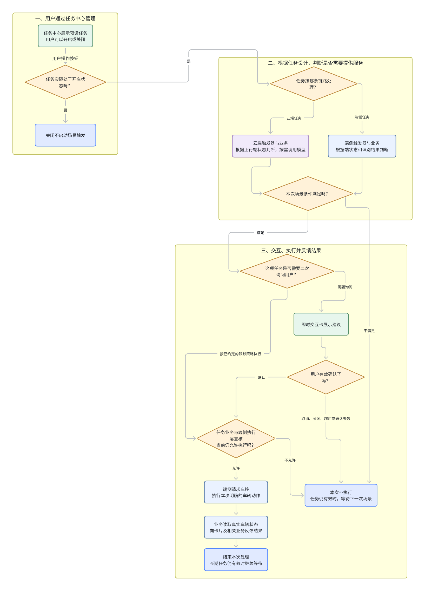
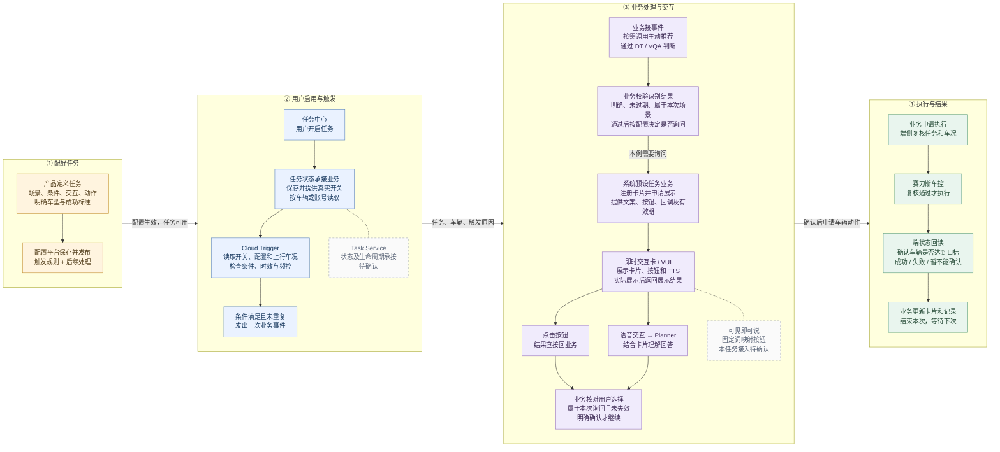
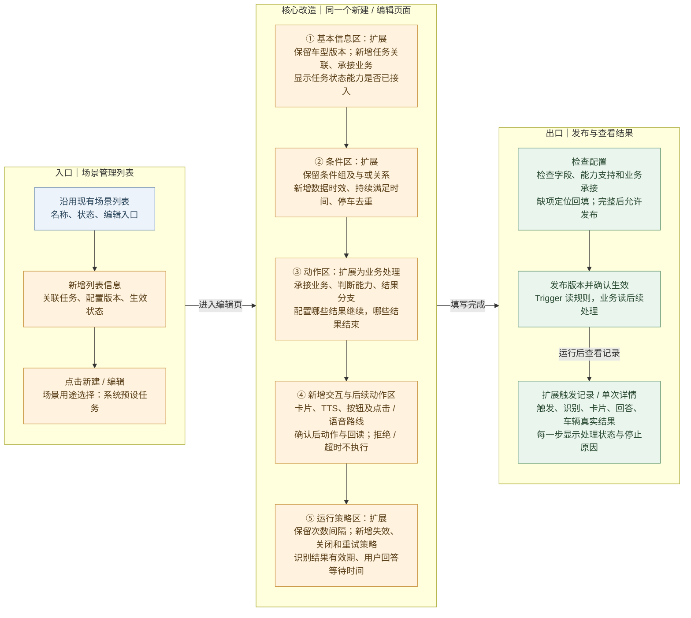
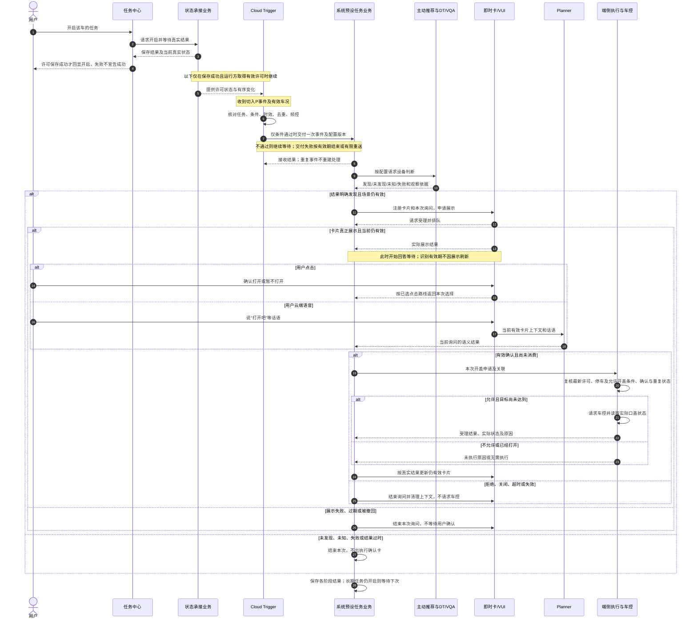
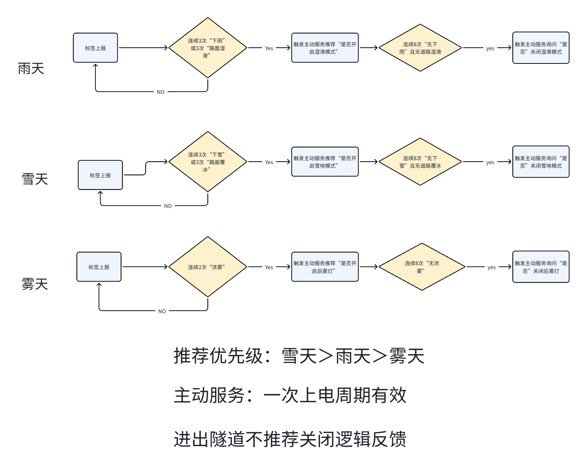
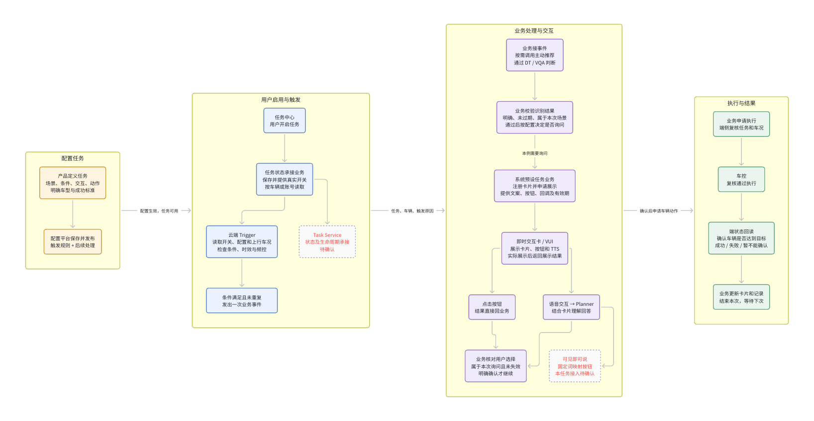
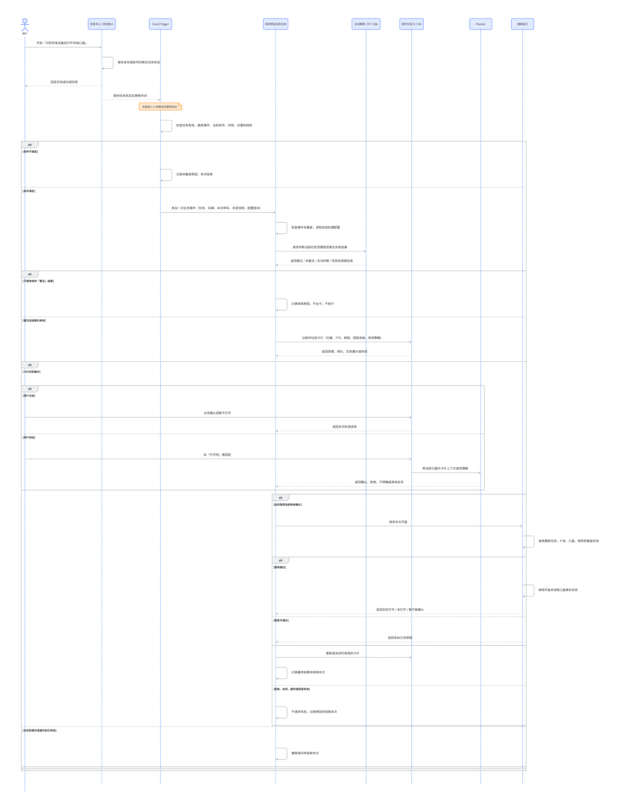
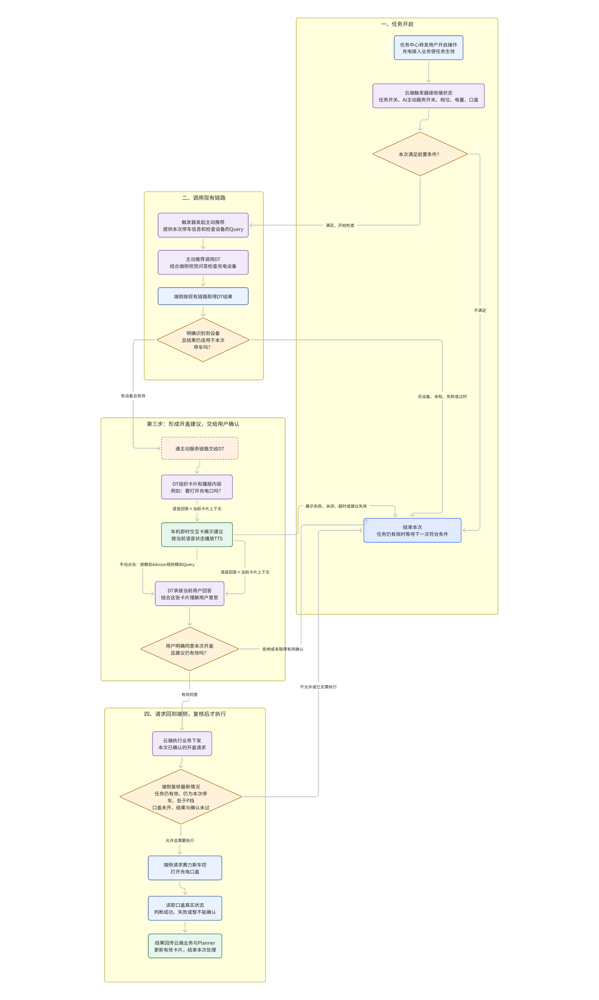
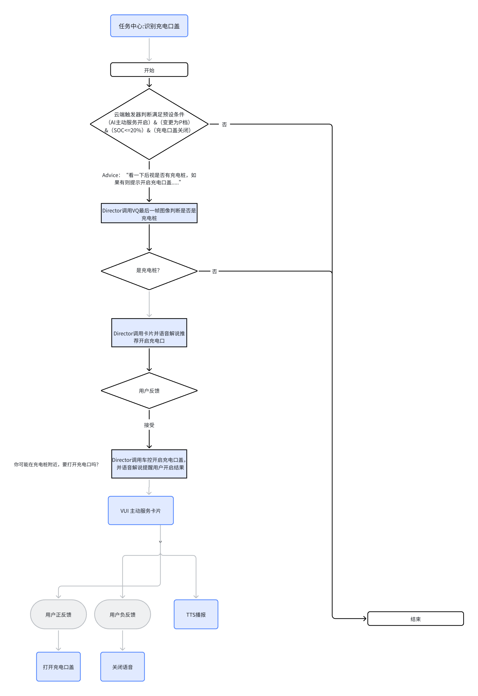

# PRD｜系统预设任务配置平台与端云交互框架

> 版本：评审完善 V2.0 · 产品负责人：王泽民 · 修订日期：2026-09-14  
> 基于本次上传的同名 PRD 整理，覆盖天气路况保护、儿童／宠物锁、充电口盖和后视镜加热。保留原稿，不修改飞书。  
> “需求”表示本版要求，不代表已上线；“原稿参数”表示从原稿继承，不代表研发已验收；“待确认”表示尚不能作为正式运行依据。示例只说明逻辑。

## 1. 需求摘要、背景与目标

### 1.1 本次要交付的产品

系统预设任务是产品预先定义、用户自主开启的长期服务。用户不必每次提出指令；系统在符合条件时提醒或处理，完成一次后继续等待下次。用户关闭任务后，系统停止新触发；关闭任务不等于撤销已经发生的车辆动作。

本需求交付两部分：一是四项任务从开启、条件判断、交互到真实车辆结果的完整业务规则；二是在现有云端触发器场景管理平台中，把这条链路扩展为可填写、可校验、可发布、可追溯的任务配置。端侧当前按任务开发，端云统一配置下发是后续目标，不在本期承诺已经具备。

王泽民负责整块系统预设任务产品，包括充电口盖。“任务业务”是承接运行流程的研发职责，不是要求再寻找另一名充电业务产品；它可以与 Trigger 由同一团队实现，但不能省略后续处理责任。

### 1.2 先解决用户问题，再决定是否主动处理

本产品不是增加四个自动按钮，而是替用户承担一部分“留意场景、想起功能、找到入口”的工作。仅当系统提供的帮助大于识别错误、额外询问和失去控制感的代价时，主动服务才成立。车辆动作执行成功，是交付底线，不是用户价值已经成立的证明。

| 任务 | 要验证的真实问题 | 用户仍能采用的原有办法 | 主动服务新增的帮助 | 不应做出的价值承诺 |
|---|---|---|---|---|
| 天气／路况保护 | 用户是否会在环境变化后忘记或不知道使用对应模式、灯光 | 用户自行操作车辆功能；具体入口由车型确认 | 在适用时机提供一项明确建议，用户决定是否处理 | 检测到下雨不等于已判断驾驶危险；不能以模式切换率证明事故风险降低 |
| 儿童／宠物锁 | 后排有目标乘员时，用户是否会遗漏目标侧儿童锁 | 用户检查并手动设置；既有自动锁策略需核对 | 在已批准的场景内补充检查和处理 | 识别出儿童不等于所有门都该锁，也不保证不会发生误开门 |
| 充电口盖 | 用户已经准备充电时，寻找或操作开盖入口是否是实际负担 | 用户直接开盖或发出明确语音指令 | 在可能需要充电时提前准备建议，确认后代为开盖 | 低电量、P挡、看见设备都不单独等于充电意图；不能承诺设备空闲、兼容或可用 |
| 后视镜加热 | 雨水、洗车残留或起雾后，用户是否需要反复手动开启加热 | 用户手动加热；车型既有自动除雾／加热策略需核对 | 在有效场景减少手动操作，并正确结束，不与用户抢控制 | 加热状态ON不等于镜面已清晰，也不能用加热次数证明视野改善 |

原稿明确了这四项需求、规则和能力线索，足以开展方案评审；但未提供用户发生频次、现有入口操作成本、误触发样本和已有车辆自动功能覆盖率。因此，上表的用户收益是本期需要验证的假设，不是已经验证的市场结论。王泽民联合刘多核对目标车型原有操作和自动功能；若已有能力完整解决同一问题，优先复用其入口、状态与控制策略，不再增加竞争性的自动逻辑。

### 1.3 本期采用什么方案，为什么不选另外两种

**建议采用“有限主动、明确交互、能力复用”的方案。** 固定规则先筛掉明显不适用的场景；只有判断还不充分时才调用模型；需要本次确认的动作等用户明确同意；车辆端最终检查能否执行。每项任务独立定义是否询问，不将“用户开启长期任务”解释为同意所有未知动作。

| 方案 | 好处 | 代价／不足 | 本版取舍 |
|---|---|---|---|
| 只保留手动／用户Query | 意图明确，不增加主动打扰 | 不能替用户发现或记住场景，用户仍需主动操作 | 始终保留，作为失效后的原有入口与价值比较基线，不因本项目下线 |
| 四项任务分别写一条专用链路 | 单场景可按自身条件交付，初期改动相对集中 | 同类的开关、出卡、失效、结果处理容易重复，后续改动涉及多处 | 场景规则和未通用能力仍允许定制；不把所有业务判断塞进Trigger |
| 复用固定处理阶段，再接场景能力 | 条件、识别结果、询问、执行和结束有共同表达；可追溯 | 首次需接通配置消费和结果回传，前期投入不能假定为零 | 本版推荐。只扩充现有页面与已证实需要的阶段，不建设任意拖拽编排平台 |

平台投入的论证不是“四项任务所以一定省人”：天气已按端侧开发，不能把它计为云端平台已经复用的案例。先用充电验证云端完整阶段，再用同一任务的受控文案、范围和策略变更验证参数修改是否真正无需重写业务链路。四项任务中的公共规则用于确定能力边界；第二项真实云端任务尚未明确前，不承诺跨任务节省比例。具体复用验证见4.13、7.5。

### 1.4 端侧与云端的选择服务于业务，不是产品卖点

| 判断问题 | 产品选择原则 | 本项目怎样落实 |
|---|---|---|
| 当前数据和确定规则已经足够吗 | 足够就不引入模型理解；需模型补充才进入进一步判断 | 天气沿已选端侧链路；云端规则任务也允许跳过DT和Planner |
| 对网络、响应和数据位置有什么要求 | 选择已具备输入与执行承接的运行侧；不可用时结束或降级，不临时换一条未验收链路 | 充电按现有云端协作方向接入；弱网时不拿旧观察开盖，保留用户原有操作 |
| 为什么充电不能Trigger命中就开盖 | 启动条件只能找到候选，设备观察补充场景，用户确认才表达本次选择 | “规则筛选→必要识别→用户确认”分别配置，不在Query中预置同意 |
| 所有车控能否放云端直接完成 | 最新车辆状态和车型限制必须由端侧执行能力校验 | 无论建议来自哪里，执行与真实回读均受车辆能力约束 |

儿童锁与后视镜的部署仍按实际数据、既有车辆功能、能力支持及策略会签确定；不能因为静默就认定端侧，也不能因为使用识别就认定云端。

### 1.5 本期要证明什么，什么情况下不应继续放量

本期同时交付四项任务规格与公共框架，但不把“规格完成、能力接入、业务有效、允许发布”合成一个里程碑。

| 评审／验证层次 | 本期必须拿出的结果 | 不满足时的处理 |
|---|---|---|
| 产品方案成立 | 每项任务有明确用户问题、推荐处理方式、适用和不适用场景；关键分歧有推荐意见和代价 | 回到对应任务策略，不用补接口字段掩盖产品分歧 |
| 平台改造成立 | 充电完整流程可从五组配置表达，每项字段有消费方；普通Trigger场景不受影响 | 缺消费方的能力标待接入；不能用演示表单视为实现 |
| 体验收益成立 | 对照原有操作，确认减少的负担没有被多余询问、误推荐或手动纠正抵消 | 调整触发范围、交互或自动策略；若原功能已足够则复用，不因开发完成强推 |
| 发布条件成立 | 参数、授权、执行限制和回读经确认，关键反例整车验证；可按任务／车型停用新触发 | 不扩大未验证范围；已发车辆请求继续核实，不宣称回滚已撤销动作 |

涉及未授权车辆动作、失效确认仍被消费或结果错误报成功的实车问题，应暂停受影响分支继续放量，先排查并复验。误推荐和过度打扰则用7.5的样本与用户反馈判断是否收窄策略。暂停阈值、观察窗口和批准人须在受控试用前明确，不在本文虚构指标目标。

## 2. 范围、模块与责任

### 2.1 四项任务范围

| 任务 | 本稿保留的处理方向 | 交互与动作 | 仍需拍板的关键事项 |
|---|---|---|---|
| 天气／路况保护 | 端侧自闭环 | 雨、雪、雾分别询问；确认后切对应模式或开启后雾灯 | 雾天防抖、优先级含义、退出询问及模式恢复目标 |
| 后排儿童／宠物识别后开启儿童锁 | 原稿同时存在多种进入／交互方案；不擅自确定部署 | 静默开启或先询问，必须择定；本任务不自动解锁 | 非 P 还是切 D；成员枚举、宠物、左右锁、交互及部署 |
| 识别充电设备后打开充电口盖 | 云端进一步判断，端侧执行 | 本版评审方案：识别到设备后询问，有效确认后开盖 | 总开关、P 挡事件、SOC、视觉范围、确认时机及各时效 |
| 后视镜自动加热 | 保留原稿三个子场景；不据“静默”推定部署 | 静默开启；各场景退出分别定义 | 云端或端侧归属、雨天退出、高湿温差窗口、加热结束权 |

本期云端平台采用固定阶段：触发 → 可选进一步判断 → 可选交互 → 已批准的动作 → 结果。不是任意拖拽、任意循环的通用工作流平台。不新增未经确认的云端业务案例，不替车控制定安全参数。

### 2.2 谁负责交付、找谁确认

下列姓名为用户此前提供的沟通线索，不等于最终开发认领。真实人员确认应回填到这张表；模拟审核 Agent 不代表这些同学已经审过稿。

| 模块 | 应交付的内容 | 对接入口 | 认领边界 |
|---|---|---|---|
| 系统预设任务产品 | 四项场景、配置、交互、动作、异常、验收与取舍 | 王泽民 | 整体产品责任已由用户明确 |
| 任务中心 | 任务展示、启停操作、处理中／成功／失败回显 | 郝晓伟 | 状态保存不自动归任务中心前端 |
| 任务状态承接业务／Task Service 候选 | 真实开关持久化、按车／账号读取、变化通知、恢复 | 郝晓伟联合任务业务研发 | 是否复用 Task Service 及最终研发待定 |
| 配置平台与能力目录 | 五组表单、兼容性检查、发布版本、记录 | 韩杰 | 平台研发与发布承接待认领 |
| 端／云 Trigger | 读有效状态和场景数据、规则判断、防抖去重、发事件 | 刘杨、尹振刚；端侧相关协调汪帅 | 分端云认领，不根据姓名推断同一实现 |
| 系统预设任务业务实现 | 接事件、读后续配置、进一步判断、注册卡片、消费回答、请求执行、保存结果 | 王泽民提需求；汪帅／项目侧协调 | 端侧、云端及车机业务接入分别认领；不另设虚构产品 |
| 主动推荐／DT | 接检查目标、组织能力调用、返回本次判断 | 张弛 | 链路与实际研发确认；不默认等于 Planner |
| VQA／视觉 | 提供约定范围的观察结果、时间和未知原因 | 丁彬 | 输入画面、目标定义、范围、研发待确认 |
| 即时交互卡／VUI | 通用卡型、准入展示、TTS、按钮及生命周期 | 徐洋；赵衍、姜锋协调 | 业务注册和卡片框架不是同一责任 |
| 本地可见即可说接入 | 将当前按钮表达注册到本地能力，命中后走原按钮处理 | 汪帅协调；截图提及曹增辉，需本人认领 | 仅为端侧接入线索，不外推为云端 Owner |
| Planner／Director | 本任务卡片展示后，按云端语音路线理解回答 | POC 姓名由王泽民补充 | 两者是同一决策职能的名称，不画成串行两层；不拉卡 |
| 端侧执行、车控与状态回读 | 复核最新车况、请求动作、读取真实状态及原因 | 王培鹤；刘多确认赛力斯需求 | 开盖、锁、模式、灯、加热分别确认能力和研发 |
| 联调／测试 | 配置、模块交接、整车正反例、恢复和重复测试 | 项目测试负责人待认领 | 各模块供证据，不能只验一张成功卡 |

### 2.3 产品必须分开的五个对象

| 对象 | 回答什么问题 | 例子 | 谁维护 |
|---|---|---|---|
| 任务定义／配置版本 | 这项服务按什么规则运行 | 充电任务：P 挡事件、阈值、识别、询问、开盖 | 配置平台／端侧发版定义 |
| 某车或账号的任务实际状态 | 用户是否允许长期提供此服务 | A 车开启，B 车关闭 | 状态承接业务；任务中心回显 |
| 一次场景处理 | 此刻这次停车处理到了哪里 | 等识别、等回答、执行中、已结束 | 任务业务；Trigger提供触发关联 |
| 当前卡片 | 这次询问是否展示、还能不能操作 | 已排队、已显示、已失效 | VUI报告展示事实，业务决定询问有效性 |
| 车辆真实状态 | 设备最后实际是什么状态 | 口盖打开、锁开启、模式已切换 | 端状态能力提供，业务据此给结果 |

因此：“配置发布”“用户开启”“条件命中”“卡片显示”“用户同意”“车辆成功”是六个不同的事实，不能用一个状态值代替。

## 3. 业务框架与原稿图解

### 3.1 图一：系统预设任务总体业务

保留原稿总图。读图顺序是用户许可 → 选择已设计的端／云链路 → 判断条件 → 按任务交互 → 执行复核 → 真实结果。图上的“任务业务”可以与 Trigger 在同一应用中开发，但角色职责仍要区分。

| 图中节点 | 本节点具体处理与进入条件 | 应交付的结果／不通过时怎么办 |
|---|---|---|
| 任务中心展示、用户操作 | 用户对当前任务点开启／关闭；中心转发到状态业务 | 保存成功才回显真实状态；失败或未知不得假开启 |
| 任务实际开启吗 | Trigger取得该车／账号的有效状态，不读平台全局布尔值 | 开启才继续；关闭或未知不发新事件 |
| 按哪条链路处理 | 按产品会签的任务部署及能力范围选端侧或云端 | 端侧读本地，云端读已上行数据；不以网络状态随意切换 |
| 场景条件满足吗 | Trigger校验事件、当前条件、数据时效、防抖、重复和频控 | 通过后发本次事件给业务；否则等待，不调用卡片或车控 |
| 需要询问吗 | 任务业务按配置选择静默、仅告知或询问；必要时先完成进一步判断 | 询问走卡片；已批准静默走复核；仅告知结束且无执行授权 |
| 即时卡展示建议 | 业务先注册，VUI受理并排队，实际展示后才开始等用户 | 分开返回展示、选择、生命周期；展示失败不执行 |
| 用户有效确认吗 | 业务核对当前询问、选择含义、有效期和是否已消费 | 确认继续；拒绝／关闭／超时／未知结束本次 |
| 当前仍允许执行吗 | 业务及端侧复核最新许可、场景、目标状态、有效确认或静默策略 | 不允许则返回未执行；允许才请求车辆动作 |
| 端侧请求车控 | 调用本次明确动作，不把“确认”按钮直接绑定任意裸车控 | 保存受理与失败事实；请求结果不是车辆真实结果 |
| 读取真实状态 | 检查目标是否实际达到，区分失败证据与读不到 | 已达目标、明确失败或暂不能确认；交给业务更新 |
| 结束本次、等待下次 | 业务保存原因，结束卡片及语音关联，执行防重复／冷却 | 长期任务仍开启才继续等待；不会把一次拒绝改成长期关闭 |

原总图省略了“配置准备”及“仅告知”分支：前者在第 4 章补齐，后者只展示和记录，不因为没有确认按钮就自动执行。静默模式只用于明确批准的任务。

### 3.2 图二：云端全模块接力

以下沿用你已认可的四列布局。它是询问型充电案例的主线，不代表所有云端任务都调用模型。每列由上至下读，列间表示业务交接。

| 区域／节点 | 主要工作、所需输入 | 下一方得到什么 | 完成标准 |
|---|---|---|---|
| 产品定义、平台发布 | 定义任务范围、规则、判断、交互、动作、结束条件；校验能力 | Trigger的条件规则及业务的后续处理定义 | 发布范围内各消费模块可用同一有效版本 |
| 任务中心、状态承接 | 接用户意图，保存真实状态并提供读取／变化 | 某车／账号真实许可及变化顺序 | 界面、Trigger与执行许可一致可核验 |
| Task Service旁注 | 可能复用的状态／任务服务 | 承接范围需技术确认 | 不把候选服务写成已接通的必经链路 |
| Cloud Trigger | 校验进入事件、许可、数据、频控；产出一次业务事件 | 任务、车辆、本次停车、条件依据、定义版本、时间 | 接收方能接住并按同一次处理去重 |
| 任务业务、主动推荐／DT／VQA | 业务发起进一步判断；能力返回结果；业务验证场景及时效 | 明确可用的观察结论，而不是用户授权 | 明确看见才进入本例询问；其他分支可解释结束 |
| 业务注册、即时卡／VUI | 业务提供模板、文案、按钮、TTS、路由、有效性；VUI展示 | 展示事实、用户选择和生命周期 | 实际显示后才开始等回答；业务能结束询问 |
| 点击／云端语音／可见即可说 | 点击按本次按钮回业务；泛化语音带卡片上下文给Planner；本地词映射是另行接入能力 | 同一次询问的可核验选择 | 一次回答只由一个选定路线处理，不重复执行 |
| 执行与结果 | 业务申请；端侧复核；车控动作；端状态回读 | 车辆真实结果给业务，再更新卡片与记录 | 可信回读达到本次动作目标，才算执行链路完成；用户收益按7.5另验 |

Task Service与可见即可说的虚线是待确认接入，不是自动降级。云端语音输入包括把声音转为文字；TTS是把文案读出来。两者分别配置。Planner不注册或拉起卡片，也不能把设备识别结论当成用户已同意。

### 3.3 端侧自闭环怎样接即时交互卡

端侧链路：用户真实开启 → 端侧Trigger判断 → 本任务业务收到事件 → 业务注册本地卡片和按钮表达 → VUI展示 → 点击或本地语音命中原按钮 → 业务验证本次选择 → 端侧复核并请求车控 → 实际状态回读 → 更新本次卡片。

| 交接 | 端侧业务提供什么 | 对方返回什么 | 谁继续处理 |
|---|---|---|---|
| Trigger → 任务业务 | 雨／雪／雾子场景、车况、识别依据、本次事件 | 是否接收、重复或过时原因 | 同一产品下的端侧业务研发 |
| 业务 → 卡片 | 当前建议、标题正文、确认取消意义、TTS、点击承接、有效范围 | 已受理／排队／真正展示／失败 | 业务保持本次询问状态 |
| 业务注册方 → 可见即可说 | 当前有效按钮及支持表达，例如“确认”“取消” | 命中的当前按钮 | 注册方走原按钮点击处理，不能另发车控 |
| 卡片 → 业务 | 本次卡片、按钮选择、输入来源、选择时间 | 业务接受或拒绝该选择 | 有效确认后才复核；其他结果结束 |
| 执行及端状态 → 业务 | 车控受理／失败、实际模式或灯状态及观察时间 | 业务给最终结果 | 更新卡片；读不到就显示暂不能确认 |

“可见即可说”在这里表示把已注册的按钮表达映射到当前按钮，不等于任意语义理解。“为什么要开”“等一会儿再开”不能按确认执行。词条在询问可操作时有效，卡片过期、取消、被替换或本次已处理后撤销。基础能力存在不代表本业务已经注册和验收，需卡片开发完成接入。

### 3.4 每张原图如何保留和校正

| 原图 | 本版放置与用途 | 必须注意的原稿差异 |
|---|---|---|
| 图 1 总体业务 | 第 3.1 节原图保留，逐节点解释 | 补仅告知分支、真实开关承接和等待机制 |
| 图 2 云端全模块 | 第 3.2 节沿用四列布局及模块；Mermaid可复制 | Task Service和本地语音均为接入待确认 |
| 图 3 长时序图 | 原稿放在平台标题下，实为运行时序；本版第 5 章承接 | 配置页怎么改另画第 4 章，避免拿运行时序冒充页面方案 |
| 图 4 云端充电分区图 | 核心阶段保留为第 5 章时序及第 6.3 节步骤 | 原图DT组织卡／承接回答、默认模拟Query，与已确认边界不一致；业务注册，语音按Planner路线 |
| 图 5 天气变更逻辑 | 第 6.1 节原图保留并逐分支解释 | 雾天2次与总表3次冲突；隧道、周期和优先级需展开 |
| 图 6 充电旧流程 | 附录保留原图对照；本版第 6.3 节为评审执行顺序 | 去掉Director直接拉卡以及前后重复确认／开盖；识别范围与确认位置明确待会签 |

原图 4、6 是原稿资料，不与校正后的运行需求并行生效。六张原图均保留在附录，原始文件不覆盖。

## 4. 平台页面改造

本章扩展现有场景列表、编辑、记录与详情，不重建一套后台。原稿记录的现有入口是基础信息、条件组、下游动作及次数／间隔；本轮没有重新核验线上版本。新增需求针对“许可、识别结果、用户回答和真实结果不能只靠条件＋动作两列完整表达”的缺口，不据此认定所有底层能力缺失。

接入核对按四类记录：**可直接复用、已有框架但本场景待注册、确需新增共用能力、场景专属开发。** 例如已有即时卡框架不等于天气按钮已经注册；增加卡片表单也不等于业务已会读取并拉卡。韩杰与任务业务、各能力方在4.11能力清单中补当前支持证据，避免同一能力重复建设。

### 4.1 图三：现有平台改哪些页面、增加哪些内容

**从左向右读：从哪里进入 → 在哪里填写 → 怎样发布和查看结果。** 中间五个框都放在同一个“新建 / 编辑场景”页面，从上往下排列；不是新增五套平台。

图中蓝灰色表示沿用入口，橙色表示本次页面改造，绿色表示发布和结果查看。平台当前基础来自此前本地核验材料；橙色内容是本次产品要求，不能据此认定已上线。

| 页面内位置 | 产品实际需要改什么 | 充电任务在这里填什么 | 运行时由谁使用 |
|---|---|---|---|
| ① 基本信息下方 | 新增“系统预设任务”用途、任务关联、承接业务；状态能力显示接入情况 | 关联“识别充电设备后打开充电口盖”；承接方为系统预设任务业务 | Trigger 和任务业务 |
| ② 原动态／静态条件区 | 沿用条件组；补充数据来源与时效、是否已上云、持续满足和场景去重 | 进入 P 挡、SOC 阈值、口盖关闭、本次停车未处理；实际阈值待确认 | Cloud Trigger |
| ③ 原执行动作区 | 先选择承接业务，再配置是否进一步判断、调用能力与结果分支 | 发起设备识别；看见且结果有效才继续；未看见、未知或失败则结束 | 系统预设任务业务及主动推荐／DT／VQA |
| ④ 动作区之后新增区块 | 独立配置交互方式；询问时展示卡片、TTS、按钮、回答处理；有车辆动作时补充复核与回读 | “是否打开充电口盖”；确认后申请开盖；取消／超时不执行；真实打开才成功 | 业务读取并注册即时卡；VUI、Planner、端侧执行分别承接 |
| ⑤ 原次数／间隔策略区 | 保留频控；补充结果及回答有效期、任务关闭处理、失败重试和结束规则 | 本次停车防重复、过期结果作废、任务关闭时撤销待处理询问 | Trigger 使用频控；业务使用等待与退出规则；端侧检查执行有效性 |

**编辑页需要的三个联动：** 选择“不进一步判断”就隐藏模型配置；选择“仅告知”或“询问用户”均展开卡片与播报，只有询问才要求按钮含义、回答路线和回答分支；选择车辆动作就要求执行前复核与真实状态标准。进一步判断、用户交互、车辆动作可以连续配置，不能被做成互斥选项。

**能力选择放在哪里：** 在条件、判断、交互和动作字段旁提供能力选择入口，打开同一套“能力抽屉”。抽屉展示用途、输入输出、车型版本和接入状态。未接入能力可以记录为接入需求，但不能作为已可执行能力发布；研发需要完成能力接入，产品才能在表单中组合使用。

**页面底部放什么：** 保存草稿、检查配置、发布三个按钮。检查失败时定位到具体字段；发布后分别等待 Trigger 与任务业务取得对应版本。新版本生效不等于某辆车已经开启任务。

**记录页增加什么：** 列表展示关联任务与最后处理阶段，进入单次详情查看“Trigger 发事件 → 识别结果 → 卡片展示 → 用户回答 → 执行与真实回读”。每一步展示结果和停止原因。发布动作本身不会产生车辆运行记录，只有实际发生业务处理后才有记录。

### 4.2 产品在编辑页的操作顺序

**字段开放规则：** 下表及4.4—4.12的“填写／配置”，不意味着每项都要手工输入。常规可编辑项是适用范围、文案、已批准范围内的阈值与频控参数；点击路线、等待、去重等优先选择已批准策略并显示实际值；业务入口、事件关联、有效确认检查、车辆安全复核和可信回读由已接入能力带入。普通编辑页不提供关闭这些保护的开关。新策略或扩大动作范围须重新会签，不允许通过自由文本或高级预览绕过。

从“场景管理”点击新建，或打开现有场景的编辑页。页面仍使用一张表单，依次展示图三中的五组配置；本期新增内容均为下述产品要求。

1. **先确定配置对象。** 选择“系统预设任务”，关联任务定义，填写适用范围和承接业务。任务定义是“识别充电设备后打开充电口盖”这条规则；某辆车的用户是否开启它，是另一份实际状态。
2. **定义什么时候开始。** 在条件区分别填写启动检查的变化事件和检查时的当前条件，再设置组合关系、数据时效与去重依据。
3. **定义命中后如何处理。** 指定接收事件的业务；需要识别时，选择能力并填写每类结果的去向。
4. **定义如何交互及执行。** 选择无需交互、仅告知或询问；询问后配置确认与退出分支；涉及车控时补齐复核条件和真实状态标准。
5. **定义何时结束，再检查发布。** 填写等待、失效、频控和重试策略，检查缺项，发布后查看运行方是否取得新版本。

充电任务依次选择“进一步识别设备 → 看见设备才继续 → 询问用户 → 确认后申请开盖”。这三个处理阶段可以串联。页面底部随填写更新业务摘要，描述条件、判断、交互、动作及退出规则，供产品核对是否符合预期。

改变处理方式后，不再适用的字段收起并退出本次校验与运行。例如从询问改为仅告知，旧的确认按钮和开盖动作不能继续生效；关闭进一步判断后，原识别请求与结果分支也不进入当前运行定义。已填内容保留在草稿并标注未启用，切回时提示重新确认；发布摘要仅包含当前生效路径。

### 4.3 页面一：场景管理列表

保留现有列表及新建、编辑、记录入口。在原列表扩展“场景用途、关联任务、配置版本、校验状态、生效状态”，新增用途与任务筛选。用途为普通 Trigger 的场景，继续使用原配置逻辑。

| 用户操作 | 页面响应与规则 |
|---|---|
| 点击新建 | 打开空白表单；选择系统预设任务后展开任务关联和后续处理配置 |
| 点击编辑 | 载入已保存内容，同时展示正在生效的版本；修改不会立即影响运行任务 |
| 查看生效状态 | 区分草稿、检查未通过、发布处理中、已生效及发布失败；发布状态不能写成用户“已开启” |
| 查看关联任务实际状态 | 新增只读查看入口；先指定车辆及任务要求的账号范围，再查询真实开关、更新时间和来源。查不到时显示原因，不显示为关闭或开启 |
| 点击记录 | 带入当前场景，查看第 4.10 节的触发及后续业务记录 |

配置页不提供代用户开启任务的操作。同一项任务在不同车辆上可以有不同实际状态，列表不能显示一个覆盖全部车辆的“任务已开启”。

### 4.4 页面二第一组：任务关联与适用范围

改造位置为现有基本信息和发布范围区域，在名称、优先级、渠道、指定车辆、车型、软件版本等字段基础上补充以下内容。

| 配置项 | 产品怎样填写 | 页面联动与运行用途 |
|---|---|---|
| 场景用途、关联任务 | 选系统预设任务，再从已接入任务中选一项 | 必填；关联任务定义，不填写某辆车的开启状态。Trigger 用它查询对应任务实例 |
| 状态能力接入情况 | 只读查看提供模块、支持的车辆／账号范围、接入状态 | 运行时由状态承载方提供实际状态；未知、读取失败或失效时不允许 Trigger 按开启处理 |
| 适用范围 | 沿用渠道、指定车辆、车型和软件版本 | 选定后过滤可用能力；调整范围时重新检查已选信号、卡片和动作是否兼容 |
| 承接业务 | 选择系统预设任务业务及其已接入事件处理入口 | Trigger 把命中事件交给它；无可用入口可存草稿，不能发布 |
| 对接与认领信息 | 展示产品对接人和研发认领状态 | 王泽民是整体产品 Owner；业务研发未认领时明确展示待认领，不能用产品姓名代替研发负责人 |
| 运行位置 | 本期显示云端 | 用于过滤云端可读状态及可调用能力，不提供网络变化时自动切换端侧的选项 |

选定任务后，平台自动增加“当前车辆／账号的任务实际状态为开启”这一运行前提。它在规则摘要中可见，但不由产品重复加入每个条件组。第一组另展示“主动服务许可策略”：是否要求总开关与单项开关同时开启，引用该任务已会签策略，不由普通条件组的OR绕过；关系未定显示待确认，不发布该任务正式许可规则。本例草稿展示两个开关均开启的假设。切换关联任务后，需要重新确认业务承接及后续配置；仍兼容的填写内容保留，不兼容项定位提示。

### 4.5 第二组：触发规则

继续使用原动态条件、静态条件和新增条件组。产品先配置“哪次变化启动检查”，再配置“检查时还要满足什么”；两者在页面分区并列出完整规则。

| 填写位置 | 操作与示例 | 校验及运行要求 |
|---|---|---|
| 动态条件 | 选择条件类型 → 信号 → 字段 → 运算符 → 值。例如档位“变更为 P” | 表示从其他档位进入 P 的事件；不等于一直处于 P。启动时已在 P 是否补判另行确认 |
| 静态条件 | 逐行添加 SOC 与阈值比较、口盖为关闭等当前条件 | 枚举用选项，数值显示单位；上下限和比较符由能力限制。SOC 的演示阈值 20% 待业务会签 |
| 条件组 | 选择组内、组间“全部满足／任一满足”，增加或删除条件 | 摘要用括号显示作用范围，例如“进入 P 挡，并且（SOC 达标且口盖关闭）”；空组不能发布 |
| 信号说明 | 点击能力查看来源、上云情况、车型版本、数据时间及未知状态 | 未上云或超出范围不能用于正式运行；缺失、过期、未知均不计作满足 |
| 数据有效期 | 信号行展开有效性设置；若能力提供已确认默认值则引用，允许覆盖时填写已会签阈值 | 展示数值、单位、起算依据和阈值来源；未知、未确认或留空不代表永久有效。超出能力允许范围不能发布 |
| 稳定判断 | 按能力支持填写连续满足时长或次数 | 中断后如何重新累计由能力说明明确；未支持的计算方式不可凭空配置 |
| 本次场景去重 | 选择已接入的停车／上电等场景边界 | 显示开始、结束和重置依据，供 Trigger 识别是否为同一次处理；不能仅填写“每次停车一次”而没有停车关联能力 |

修改某个静态条件，不会自动使它成为启动事件。例如停车后 SOC 才达到阈值，是否再次唤起检查，需要明确列入启动范围；原稿未确认的补判规则继续列为待确认。当前任务开关作为所有条件组共同的前提，不能被“任一满足”绕过。

### 4.6 第三组：命中后业务处理

在原执行动作区域增加业务层配置，保留原动作能力及必要的高级预览。产品填写的是“把哪件事交给业务、还需判断什么”，由业务读取配置并调用已接入能力。

| 操作顺序 | 填写内容与页面响应 |
|---|---|
| 1. 选择处理目标 | 承接业务沿用第一组，选择它支持的目标，如“检查附近充电设备”。Trigger 输出本次任务、车辆、停车关联、触发原因、当时状态及有效时间 |
| 2. 选择是否进一步判断 | 选否时直接进入第四组；选是时展开能力、问题、上下文和结果分支。后续是否询问仍独立选择 |
| 3. 选择判断能力 | 引用已接入的主动推荐／DT／VQA 组合，填写检查目标和需要的场景信息。页面显示输入来源、观察许可前提与校验承接，以及返回给系统预设任务业务的结果；许可不能手填为已授予 |
| 4. 配置结果去向 | 逐项指定看见、未看见、无法判断、调用失败。充电示例仅看见设备且仍有效时进入下一阶段，其余结束本次；超时按失败策略结束 |
| 5. 配置结果有效性 | 设置已会签的有效期，绑定本次停车；离开当前场景或结果过期时作废。具体时长未确认时可保存草稿 |

场景问题、推荐原因和建议内容由结构化表单形成下游输入，高级预览展示转换结果。映射关系须由接入研发实现。把字段填完不会自动生成 DT 或 VQA 能力；选择“调用成功”也不能替代“看见设备”的业务判断。

### 4.7 第四组：用户交互与后续动作

在现有动作区之后增加独立区域，先选交互方式，再展开对应字段。系统预设任务业务读取本组配置，负责注册、拉起、接收选择和更新卡片；VUI 负责车机展示及交互能力。

| 交互方式 | 展开什么 | 后续规则 |
|---|---|---|
| 无需交互 | 已会签的自动处理策略、目标动作与执行条件 | 必须明确允许无需逐次确认；空白交互配置不能被解释成自动车控 |
| 仅告知 | 卡片模板、正文和 TTS 策略 | 告知处理完成后结束本次；没有确认授权，不进入车辆动作 |
| 询问用户 | 卡片、TTS、按钮、回答路线、等待时间和回答分支 | 当前有效确认才能进入后续动作；拒绝、关闭、超时结束本次 |

选择询问后，按以下顺序填写：

1. **卡片和播报。** 选已接入模板，填标题、正文及内容来源；固定内容与业务生成内容分别选择。开启 TTS 后要求播报文案或来源。TTS 配合卡片真正展示开始，语音禁用时的处理按已会签方案执行。
2. **按钮和语义。** 填“确认打开／暂不打开”等文字，分别绑定“同意本次开盖／放弃本次”。取消本次询问不会关闭长期任务。点击结果返回第一组的系统预设任务业务。
3. **语音路线。** 选择不使用语音或按已接入能力由 Planner 理解。卡片真正展示后才启用当前询问上下文；结束、替换或失效后清理。可见即可说为另行注册的本地按钮能力，云端降级未确认时不作为默认路线。
4. **回答分支。** 逐项展示确认、拒绝、关闭、超时、无法理解。无法理解时不授权执行；是否允许再次询问及次数须有已确认策略。
5. **确认后的动作。** 选开盖能力、必要参数及执行前复核项，再选口盖状态回读能力，将目标值设为打开。分别填写成功、失败、暂不能确认时的卡片处理。

询问与车控按顺序执行，不能同时发起。展示受理、排队、实际展示和结束等生命周期由卡片接入能力提供；产品引用标准行为，无需填写底层回调。只有取到当前卡片的有效确认，业务才能发起执行前复核。

**切换选项后的处理：** 将“需要识别”切换为“不需要”时，识别请求和结果分支退出当前运行定义；将“询问”切换为“仅告知”时，确认按钮、回答授权和确认后的车控动作退出当前运行定义。原填写内容可保留在草稿中供切回时恢复，但应标记为未启用；切回后需重新确认能力、参数和适用范围。发布前只校验并输出当前启用的分支，不能把隐藏字段继续下发执行。

### 4.8 第五组：运行与结束策略

扩展原次数、间隔区域，由产品明确何时等待、放弃和再次处理。

| 配置 | 填写与执行规则 |
|---|---|
| 总次数、上电周期次数、自然日次数、最小间隔 | 沿用现有字段；旁边标明计数对象与重置口径，由 Trigger 使用，不能默认改成真实车控成功次数 |
| 同次场景去重 | 引用第二组场景边界；重复事件和重复确认不重复执行。拒绝后是否允许本次停车再次提醒另行会签 |
| 回答后抑制 | 选择已会签的本次停车／持续场景范围和解除依据，分别定义确认、拒绝、关闭、超时后怎样处理。业务保存与检查；未支持范围不可选。拒绝／超时后本次场景不立即重问为建议，D11确定正式策略；它不等于同事件去重 |
| 识别、卡片等待、授权有效期 | 分别设置并显示起算点。等待回答从真正展示开始；排队不会刷新识别结果有效期；确认后也不能无限等待执行 |
| 任务关闭／场景失效 | Trigger 停止新事件；业务撤销待展示或待回答的卡片并清理旧关联。已发出的车控不能假定可撤销，仍需查询真实结果 |
| 失败重试 | 选择已支持、已会签的重试策略及适用阶段；未配置时不自动重试车控。传输重送仍需避免重复执行 |
| 本次结束 | 保存结束原因、清理卡片及语音关联；任务仍开启时按频控等待下一次。结束本次不自动修改长期任务开关 |

等待和结束策略由任务业务消费，频控由 Trigger 消费；端侧在实际执行前再次核对任务、车况和授权是否有效。平台需展示策略的承接模块，缺少实现方不能作为已支持配置发布。

### 4.9 保存、校验与发布

页面底部提供保存草稿、检查配置和发布。保存草稿保留不完整内容；检查配置逐条列出问题，点击后滚动到对应字段。

| 检查类型 | 典型问题 | 处理方式 |
|---|---|---|
| 填写不完整 | 没关联任务、漏填回答分支 | 定位补填；保留其他内容 |
| 能力不可用 | 信号未上云、卡片未接入、车型不支持 | 展示依赖及接入状态；调整范围、换能力或等待接入 |
| 组合不成立 | 仅告知后配置开盖、询问缺少确认承接 | 提示冲突位置及原因，修正后重新检查 |
| 必要业务参数待定 | 采用演示阈值、缺少有效期或真实成功标准 | 明确待确认项；完成会签后再发布该场景 |

发布提交完整配置版本，运行侧分别取得 Trigger 规则和业务后续处理定义。只有相关运行方都确认可用，才显示对应范围已生效；未完成时显示处理中或失败，保留原有效版本。保存成功、发布成功和用户开启任务是三件不同的事。

沿用既有发布流程控制验证范围与逐步放量。回退恢复上一有效配置并留操作记录，不撤销已经发生的车辆动作；在途处理如何使用旧版本按第 8 章版本策略确认，不能由页面临时混用新旧字段。

### 4.10 页面三、四：触发记录与单次详情

扩展现有触发记录，增加关联任务、配置版本、承接业务、本次停车关联、最后处理阶段及最终结果。“Trigger 事件发送成功”和“车辆真实成功”分开显示；可按关联任务和车辆定位。

点击记录后，按顺序展开条件检查、事件交接、设备判断、业务注册卡片、真正展示、用户回答、端侧复核、车控请求、真实回读、本次结束。每一步显示收到什么、处理模块、开始／结果时间、结果和停止原因；未发生的步骤标记未进入。

例如 VQA 返回无法判断，详情停在设备判断，后续显示未进入；卡片排队时任务关闭，显示关闭原因及撤销结果；车控请求成功但未取到口盖状态，显示结果暂不能确认。尚未接通下游回传时显示“未取得业务结果”。本次研发交付必须包含关联与结果回传，增加列名本身不能形成完整记录。

### 4.11 原子能力范围与研发接入

能力选择入口放在信号、进一步判断、卡片、TTS、动作和回读字段旁，打开同一套能力抽屉。产品按当前用途选择能力，再填写它允许开放的参数；无需新增一套复杂后台。

| 能力范围 | 产品在页面选什么 | 研发接入最低要求 |
|---|---|---|
| 任务状态 | 关联任务的状态能力 | 按车辆／账号提供真实状态、变化和失败原因 |
| 事件与当前状态 | 档位变化、当前 SOC、口盖状态等 | 区分事件和状态用途；提供单位、值域、时间及云端范围 |
| 进一步判断 | 主动推荐／DT／VQA 能力组合 | 接收问题与场景，返回四类结果及本次观察关联；提供本能力所需既有功能／数据使用许可前提和当前可调用情况。平台展示来源，不能让配置者勾选代替授权；D09确认校验承接 |
| 用户交互 | 卡型、TTS、按钮结果、语音路线 | 业务可注册；返回展示与选择事实；支持结束后清理 |
| 车辆动作与回读 | 打开口盖及读取真实口盖状态 | 提供车型限制、端侧复核、执行反馈和可信状态 |
| 过程记录 | 本次运行结果回传能力 | 各阶段关联同一次业务处理并返回结果及停止原因 |

抽屉展示名称、用途、提供模块、可填写参数、输入输出、适用范围与接入状态。选择前按云端及车型版本过滤；不支持的能力说明原因。待接入项可被记录为缺口，不能被当作可执行能力发布。原子能力接通、页面能表达组合、运行模块会执行三项同时满足，配置才具备业务意义。

### 4.12 本期字段怎么开放、缺失时如何提示

以下是新增页面的统一操作要求，不增加第五个独立后台。

| 位置 | 必填与填写方式 | 页面结果及消费方 | 能力未具备时 |
|---|---|---|---|
| 任务关联 | 系统任务必填；选定义而非实际开关 | 自动附加实例许可门禁；Trigger消费 | 可存草稿，指出状态提供缺口 |
| 事件／信号 | 选择已接入能力；枚举用选项，数值带单位 | 生成带括号的规则句；Trigger消费 | 不允许自由填写SourceID冒充接入 |
| 判断结果 | 需要识别时四类结果逐项必填 | 看见才进入本例交互；业务消费 | 不完整结果分支阻止该路径发布 |
| 卡片／TTS／语音 | 询问才必填按钮含义、回业务和回答策略；播报开启才必填内容 | 实时卡片和TTS预览；业务注册，VUI展示 | 分开标记卡可用、播报可用、本地语音可用、Planner接入，不整体打勾 |
| 动作／回读 | 有车辆动作时必填目标、复核、回读和结果分支 | 业务申请，端侧执行，状态回传 | 没有可信成功标准不可发布该动作 |
| 等待／退出 | 显示起算点、结束原因及策略来源 | Trigger频控、业务管理等待、端侧复核 | 未填不等于无限有效；具体数值待会签 |

点击路线与语音路线分开选择。点击目标方案为直接回原业务，能力未接通则明确待接入。主方案的Planner语音入口只处理已展示卡片的有效回答；若专项选定点击模拟Query兼容，该按钮输入也可按已注册路径交给Planner，须标明来自点击并关联当前有效询问，同次点击不得再走直回业务路线。两种路线均不由Planner注册或拉卡，也不因平台选了Planner就自动具备接入。

退出设置还应拆成两个填写项：**结束本次处理**（停止继续、清卡和记录）与**退出时车辆动作**（例如已批准的定时关闭加热）。后者必须独立选择动作和关闭资格；儿童锁、口盖原稿规定不自动关闭，不能默认反向恢复。当前先建设云端固定阶段，天气雨雪雾、加热多原因等端侧规格不因为在文档中列出就可从云端平台直接发布。

### 4.13 平台究竟减少什么开发，哪些仍需开发

| 变更／建设内容 | 产品怎样操作 | 研发仍需做什么 | 验收结论 |
|---|---|---|---|
| 已接入充电模板改文案、TTS；按钮语义不变 | 在第四组改内容，预览、校验、发布 | 首次实现模板读取与注册；之后常规内容变更不应重写卡片或回调 | 新配置呈现在卡上，原选择与执行链路不变 |
| 充电调整已批准阈值、车型范围和频控 | 在第一、二、五组修改开放参数 | 能力覆盖核验与必要会签仍保留；已支持范围内不重接DT、卡片、车控 | 新规则按边界样本生效，旧版本可回退 |
| 新增设备识别结果、卡型、语音路线或车辆动作 | 先申请接入，完成后才能选择 | 接新输入输出、错误和适配；业务消费与正反例验证 | 不能靠增加选项名视为实现 |
| 天气文案、儿童锁目标侧、加热退出规则变化 | 在各任务规格中确认变化；不直接从云端页面发布端侧任务 | 天气当前随端侧机制交付；侧别扩大、加热多原因合并可能需专属开发 | 共享规格和模块不等于四项任务已共享云端发布 |

本期可配置能力是**任务业务已经能调用并消费结果的接入单元**，不要求对应一个底层接口。设备检查可以封装已接通的主动推荐／DT／VQA路径；产品不能任意拼底层调用顺序。能力完成至少要有输入来源、明确结果与错误、当前事件关联、适用范围以及调用方正反例验证。

交付拆成两份工作包：平台实现五组表达、校验、版本和记录入口；系统预设任务业务实现按配置处理识别、交互、动作和结果。若一个阶段暂时只能支持固定接入方案，页面就仅开放该方案，不能表现成自由编排。业务实现可复用现有应用，不强制新增服务。

优先级建议按能力而非删任务划分：四任务完整规格、许可／授权／复核／回读和停止防重不可缺；云端固定配置、兼容校验、可控发布和结果关联为平台必需。摘要、卡片预览、缺项定位和可读详情仍在本期需求，排期可分批，但发布前必须能核对实际生效规则、文案和执行分支。能力资料、发布和日志优先复用现有入口，不为此另建治理或监控平台。端云统一下发与任意编排不纳入本期实现。

分批项须在D03列明完成批次、临时核验方式并会签：首批可用只读配置预览核对摘要和文案，沿已有记录入口查询关联各阶段结果；错误字段和原因必须可见，跳转定位交互可分批优化。任何一批真实运行前，许可、启用分支、版本一致性、可控发布回退和真实结果关联均不能缺。分批不取消4.2、4.9、4.10、4.12的本期最终验收项；未会签分批方案时仍按本章完整要求交付。

## 5. 运行交接、状态流转与失效机制

### 5.1 图四：一次云端任务的时序

图中“业务请求设备判断”还需满足既有观察输入与使用许可前提：任务业务依据能力接入方提供的可调用事实校验，不可用即在调用前结束。任务开启与随后开盖确认不能替代该前提；平台不新建独立授权系统。此为6.3“先观察后询问”方案的进入条件，接入和校验方在D09会签。

从上到下看时间，从左到右看模块。任务中心只发用户意图，状态承接业务保存；Trigger只发事件，任务业务接后续。设备判断在本例中先于询问；这个确认时机是本次评审方案，尚需与需求方会签。

本图的点击直回业务是目标方案；若现链路只有模拟 Query，需要专项选定兼容路线并改注册配置，不能一张卡同时直回业务又模拟 Query。图中 VUI→Planner 是逻辑交接，具体由哪个端云接入组件转发在接口评审落实，不要求 VUI 前端自建云端请求服务。

### 5.2 每次交接的业务信息与返回

以下是产品语义，不是正式接口字段。同一次处理须始终能够关联任务、车辆及场景；底层服务数量和字段命名由技术方案确定。

| 交接 | 输入给下一方什么 | 下一方必须判断什么 | 返回什么／失败如何处理 |
|---|---|---|---|
| 任务中心→状态业务 | 任务、当前车／账号范围、开启或关闭意图 | 是否适配、允许操作、是否重复请求 | 实际状态及操作结果；失败保留最后确认状态，不假成功 |
| 状态业务→Trigger／业务／执行 | 对应实例许可、来源、更新顺序、可用性 | 是否最新、是否属于同一对象 | 接收或同步异常；读不到不当开启；后发生关闭不得被旧开启覆盖 |
| 平台→运行模块 | 任务定义、适用范围、同一版本规则及后续处理 | 能力是否接入、版本能否共同运行 | 对应范围的可用／失败结果；不是只回数据库保存成功 |
| Trigger→任务业务 | 哪项任务、哪辆车、哪次场景、条件依据、状态时间、版本、事件关联 | 有效性、是否重复、能否承接该任务 | 接收／拒绝及原因；重送只找回已有处理，不再建卡 |
| 业务→主动推荐／DT／VQA | 检查目标、当前场景、允许输入、请求关联 | 既有观察许可及输入前提可满足、当前能力可调用 | 四类识别结果、观察时间和关联；许可／输入不可满足则调用前结束，受理不算判断完成 |
| 业务→即时卡 | 模板、标题正文、按钮意义、TTS、点击路线、语音路线、有效策略、询问关联 | 是否可展示、是否有有效承接、当前业务是否仍允许 | 受理／排队／真正展示／失败；用户选择；关闭等生命周期 |
| 卡片／语音链路→业务 | 当前询问、选择意义、发生时间、点击或语音来源 | 是否明确、当前有效、未消费、无失效事件 | 接受当前选择或拒绝旧结果；拒绝不是长期关闭 |
| 业务→端侧执行 | 明确目标动作、范围、当前事件、确认或静默依据、有效性 | 最新许可和车况、请求及依据是否有效、是否已执行 | 未执行、无需执行、调用受理或失败；不使用旧云端车况替代复核 |
| 执行／端状态→业务 | 动作受理、实际目标状态、观察时间、错误或缺失原因 | 真实目标是否达到、观察是否可信 | 真实达成／明确失败／暂不能确认／无需执行；卡片更新另记 |

### 5.3 开关怎样从任务中心流到 Trigger

1. 用户点开启，任务中心显示“处理中”，发送操作意图。配置平台不参与修改这个实际开关。
2. 状态承接业务核对当前对象与权限并保存，返回真实状态。建议“已开启”表示许可保存成功，不保证此刻正在正常监测；运行同步异常需单独可查。最终用户文案由任务中心确认。
3. 端／云运行模块启动时先取得可用的状态快照，即一份当前完整状态；之后接收变化更新。推送还是定时读取由研发设计，但必须保证后来的关闭不会被迟到的开启覆盖。
4. Trigger取得适用配置、真实许可和有效数据后才监听／判断。状态未同步时不凭前端按钮触发；记录“许可未取得”，不是“条件不满足”。
5. 关闭保存成功后，状态业务通知Trigger停止新事件，也通知业务使待判断、待展示和待回答的处理失效。端侧执行仍需核对最新许可，避免关闭通知与用户确认交错导致误执行。
6. 重新开启或重启不恢复旧卡片、旧确认和旧识别结果。充电任务已经处于P挡时是否补判独立会签；恢复状态不能伪造新的切入P事件。

**完成要求：** 测试能看到同一实例的操作结果、运行模块接收结果及关闭后的实际行为。若关闭同步存在延迟，必须确认执行侧如何取得有效许可及最大允许过期范围；未确认前不能声称断网时仍可安全执行云端旧请求。

### 5.4 一次处理怎样向前流转

下列是产品状态，不要求研发照搬为数据库枚举。任务业务维护本次过程；VUI提供展示事实，端状态提供车辆事实。等待条件属于长期监听，事件被业务接收后才开始单次后续过程。

| 当前阶段 | 什么事实导致变化 | 由谁判断 | 下一个阶段／结束结果 | 用户看见什么 |
|---|---|---|---|---|
| 等待条件 | 有效启动事件到达，全部规则通过 | Trigger | 发出业务事件；未通过仍等待 | 不反复弹出“检查中” |
| 事件待承接 | 承接业务确认接收、明确拒绝或等待超时 | Trigger及业务接入链路 | 接收→继续；拒绝→结束；超时仅在事件有效范围内有限重送，过期结束 | 通常无卡，不补发过时建议 |
| 进一步判断中 | 收到对应识别结果 | 任务业务校验时间与场景 | 明确通过→待交互；否则本次结束 | 充电例未明确发现不出开盖卡 |
| 待展示／排队 | VUI真正展示且业务场景仍有效 | VUI报事实，业务核验 | 等待回答；失效则撤回 | 排队期间用户没有看见卡 |
| 等待回答 | 当前用户选择到达 | 业务校验当前询问 | 有效确认→待复核；拒绝／关闭／超时→结束 | 展示本次建议和按钮；不明确不执行 |
| 已确认／待复核 | 端侧取得执行请求及最新状态 | 端侧执行 | 允许→执行中；不允许→未执行；目标已有→无需执行 | 避免重复点击，可提示正在处理 |
| 执行中／待回读 | 车控反馈或实际状态变化 | 执行与状态能力 | 达到目标→成功；明确失败→失败；无可信结论→暂不能确认 | 不能先显示成功再等待实际动作 |
| 本次已结束 | 结束事实保存，卡片与语音关联清理 | 任务业务 | 根据防打扰等待后续新事件 | 结果卡或按策略关闭；长期任务开关不变 |

仅告知型任务从展示进入结束，没有授权和车控；静默任务从已会签执行策略进入复核，没有用户回答状态。两个例外必须显式配置，不靠缺字段推断。

### 5.5 计时、重复和恢复的产品机制

| 机制 | 解决什么问题 | 本版要求 |
|---|---|---|
| 数据时效 | 收到的档位或图片可能已过时 | 以观察时间与适用场景判断，不以“刚收到消息”自动刷新；阈值按能力会签 |
| 连续判断／防抖 | 一两次误识别不能立即推荐 | 连续有效观测才计数；未知不得当作天气恢复；中断重置策略须感知方确认 |
| 场景去重 | 同次停车／洗车退出被多次处理 | 明确起止边界和重置；同事件重送不重建识别、卡片、动作 |
| 事件交付 | 业务不可用或接收回执丢失 | Trigger及业务接入链路记录交付；重送沿用同一次事件，已接收则返回已有处理；时限、次数和实际承接人由接口专项确认，不能无限等待或补发过期事件 |
| 防打扰／频控 | 不同事件仍可能连续打扰 | 次数、周期、间隔分别定义计数点；明确拒绝、未展示、超时不可混为同种负反馈 |
| 排队与回答计时 | 用户未看见却被记超时 | 排队从受理算；回答从真正展示算；均有上限；排队不延长识别有效期 |
| 授权有效 | “确认”不能永久有效 | 只用于当前询问和动作；确认后等待执行仍有有效期；离开场景即失效 |
| 并发选择 | 点击与语音同时确认 | 本次选择只消费一次；迟到重复回调不再执行；判定由业务统一收口 |
| 相反选择竞争 | 确认与拒绝／关闭先后或并发到达 | 已拒绝结束的询问不被晚到确认复活；确认后、车控发出前的有效撤销建议可拦截，需D10会签；车控发出后不能承诺机械撤销 |
| 超时与重试 | 请求超时但动作可能已发生 | 先查已发请求真实结果；不盲目重发车控；识别重试须有次数、时效和场景前提 |
| 乱序返回 | 旧识别结果或旧卡回答晚到 | 按对象关联、当前阶段与更新顺序拒绝旧结果，不能复活已结束处理 |
| 版本变化 | 新条件与旧动作混用 | 一次处理需可追溯所用版本；在途保留旧版还是撤销待执行项需发布专项选择，不能混用 |

结束后到达的旧识别或用户选择不能重新推动执行。对于已经发出的车辆请求，可信且关联明确的迟到回读可在会签补查窗口内补记历史结果，但不能重建询问、恢复可操作卡或再次执行。窗口外的历史补记范围由D12确认。

### 5.6 用户关闭或条件消失时，具体停止什么

| 发生时点 | 应停止的后续动作 | 仍需完成的工作 |
|---|---|---|
| Trigger尚未命中 | 停止新事件 | 保存关闭事实及同步状态 |
| 等识别 | 结果不得再进入交互；调用可取消则取消 | 无法取消的晚到结果仅记录，不能恢复 |
| 卡片排队／待回答 | 撤销可操作卡、清理本地词或云端上下文 | 记录撤销结果；卡片撤销失败也不再接受旧确认 |
| 已确认、车控尚未发出 | 端侧复核拦截本次申请 | 返回未执行原因，不伪装执行失败 |
| 车控已经发出 | 停止新处理；不承诺撤回机械动作 | 查实车结果，保留真实事实；不擅自解锁、关盖或恢复模式 |
| 功能已经开启，例如加热 | 不再新触发不等于立即关闭功能 | 是否继续已启动定时关闭按该任务退出策略会签 |

### 5.7 用户最终看见与听到的内容

文案为评审示例，最终词句由场景产品与VUI会签。卡片模板能否显示处理中及不同结果，应作为接入能力验收。

| 时点 | 用户界面／语音示例 | 业务记录 |
|---|---|---|
| 开启保存成功 | 任务中心“已开启”；不提前弹服务卡 | 当前车／账号的许可 |
| 充电卡展示 | “检测到充电设备，是否打开充电口盖？”；确认打开／暂不打开 | 实际展示时间；TTS成功或失败分记 |
| 用户确认 | 按钮防重复，显示“正在处理”或模板支持的等待态 | 本次选择已被消费 |
| 用户拒绝／关闭 | 结束当前询问，不播成功 | 本次未执行，长期许可不变 |
| 复核发现已切出P挡 | “当前车辆状态不满足，未执行开盖” | 复核拦截，未发车控 |
| 口盖实际打开 | “充电口盖已打开” | 目标状态与观察时间；是否由本次发起分别记录 |
| 明确执行失败 | “未能打开充电口盖，请手动检查” | 已请求但失败，原因可查 |
| 无法取得可信状态 | “暂时无法确认口盖状态，请检查车辆” | 结果暂不能确认，不能显示绿色成功 |
| 车辆成功但更新卡失败 | 不再发开盖；按允许策略重试更新 | 车辆成功与卡片更新失败分别保存 |

### 5.8 用户开启前需要理解什么

复用任务中心的任务说明、详情和开关，不要求先新增设置页面。王泽民提供下列业务内容，郝晓伟确认展示位置；若当前页面放不下，应在开启前可到达的详情中说明，不能只写进后台日志。

| 任务 | 开启说明的内容方向（随最终策略定稿） | 用户控制与限制 |
|---|---|---|
| 天气 | 在支持的雨雪雾场景提供对应功能建议；用户确认后处理 | 不代表自动驾驶安全保障；用户可取消当前建议，仍可自行操作车辆功能 |
| 儿童／宠物锁 | 明确识别对象、目标侧及“先询问”或“自动开启”之一 | 不保证识别所有目标；开启服务不等于锁已开启；不自动解锁 |
| 充电 | 在本期规则覆盖的停车场景检查设备，发现后询问开盖 | 若保留低电量限制须明确范围；未触发不代表无法充电；原开盖入口仍可用 |
| 后视镜 | 在已支持场景自动开启加热，按相应退出策略处理 | 不承诺已除雾；用户可查看和操作原车辆功能；任务关闭后的计时和加热处理须按D07写清 |

首次开启不能将询问型与静默型描述成同一个“智能保护”。共享车辆中，开启影响当前账号还是整车，必须作为用户可理解的范围选择由D01会签，不能由研发保存位置反推。确认前不默认继承其他账号授权。静默失败是否告知由任务策略另定，不统一追加TTS；任务开关始终不得显示为车辆目标功能已经生效。

**配置变更后的许可范围（本版建议，D01/D03及相关任务会签）：** 从询问改为静默、扩大识别对象或控制侧别，属于用户承诺变化，不能凭旧开关已开启就执行新增行为。平台标明影响范围；状态业务与任务中心按会签方案重新取得对应确认，未完成时维持兼容的旧授权范围，或暂停新增行为。若无法维持旧版，明确告知受影响服务暂停，不能静默升级。纯文案变化且含义／动作范围不变，不重复索取确认。此机制需接入认领，不能假定已有版本号就实现了授权迁移。

### 5.9 多项任务同时命中时，不等于可以连续打断用户

本版建议：单项任务防重复由Trigger和业务负责，车机展示时机沿用VUI统一准入，不另造抢占器。业务提供建议类别和有效范围，VUI按已接入策略返回展示、等待或不可展示；等待到场景失效则撤销，不补播旧建议。已有对话、播报和卡片怎样让位，由徐洋与相关业务确认，不自行将天气排序当作整车安全优先级。

拒绝或超时后，建议本次持续场景不立即重新询问，也不换文案绕过；新的场景还需符合频控。拒绝不等于用户永久不需要，超时也不等于拒绝。天气退出建议必须有独立退出依据，不能因为开启成功就必然再弹关闭卡。用户已通过原有入口处理目标时，业务应取消多余建议；没有可读的“处理中”信息时至少在展示前复查真实目标状态，不编造跨业务占用信号已接入。

上述策略分别落到第四组展示／回答策略、第五组抑制／失效策略，交互走查必须包含“正在对话、两任务并发、刚拒绝后持续命中、用户先自行处理”。缺少统一准入能力时不得由业务强行弹出，明确接入缺口及受影响范围。

任务业务结束询问时保存当前场景与回答后的抑制事实；后续候选到达时先检查，仍被抑制则记“本次不展示”，不再建卡。Trigger的事件去重与业务的回答后抑制分别记录，不要求Trigger先读取卡片回答。解除按已会签场景结束或其他明确依据执行，不能因来了不同事件编号就绕过，也不能无限期压制后续独立场景。

## 6. 四项任务规格与连续案例

### 6.1 天气／路况保护：端侧询问与退出

**用户目标：** 在雨、雪、浓雾等影响驾驶的场景，及时得到对应建议；只执行用户明确同意的那项动作。不是任意恶劣天气都同时切雪地模式和开后雾灯。

**产品选择及成立条件：** 保留逐次询问。收益是帮助用户想起并选择对应功能，代价是占用一次注意和回应；不能以“已经提醒”代表已经保护。天气标签只说明观察，连续次数只减少抖动，均不能证明该车型此刻应切模式或开灯。需刘多与车辆能力方确认“观察条件→建议动作”的适用范围，VUI确认驾驶中展示方式；不适用、已达目标或用户刚明确拒绝时不服务。

进入与退出分别验：以标注场景核对标签正确、建议适用、是否已手动处理，再在允许的受控场景验证车辆动作。退出比进入多一步检查用户有没有后来主动选定该功能；恢复目标未定义时不生成“关闭模式”的含糊操作。推荐保留退出策略单独发布资格，而不是为了闭合图形随意补一个恢复动作（D05）。

#### 6.1.1 图五及规则拆解

| 子场景 | 进入判断（仍须任务有效、车速＞30且数据可信） | 图中连续次数 | 当前状态检查与建议 | 退出判断与输出 |
|---|---|---|---|---|
| 雨天／湿滑 | 天气为下雨，或路面为湿滑 | 雨或湿滑连续3次，原稿参数 | 当前非湿滑模式→询问切湿滑；已在目标模式则不重复建议 | 天气非雨且路面非湿滑，连续8次→具备提出退出建议的候选资格 |
| 雪天／覆雪结冰 | 天气为下雪，或路面为覆雪结冰 | 雪或对应路面连续3次，原稿参数 | 当前非雪地模式→询问切雪地 | 天气非雪且路面非覆雪结冰，连续8次→退出候选 |
| 浓雾 | 天气为浓雾 | 图和子表2次、总表3次冲突；待确认 | 后雾灯关闭→询问开启后雾灯 | 天气非浓雾，连续8次→退出候选 |

**图从左到右怎样走：** 标签上报只提供观察；连续判断达到进入门槛后，Trigger还要检查车速、当前模式或灯以及频控，才发建议事件。业务出卡并收到有效同意后，才请求目标动作。右侧“关闭询问”是环境恢复后的另一次询问，不能复用开启时的确认，也不是识别恢复就自动关闭。

原图右侧省略的条件要补齐：当前目标功能是否仍开启、是否属于本任务可提出退出的情形、用户是否已手动接管、是否处于隧道抑制阶段。湿滑／雪地“关闭”应切换到哪个模式尚未定义，不能直接写成通用关闭指令。后雾灯关闭也需有效确认与车控复核。

图上另有三项原稿策略，不擅自改成确定实现：① 雪＞雨＞雾，需确定是排序、延后还是丢弃低优先级；②“一次上电周期有效”不能直接解释为一次上电只提醒一次；③ 进出隧道不推荐关闭，需要可靠隧道信号与抑制起止。详见第8章决策表。

#### 6.1.2 输入、能力和输出

| 用途 | 原稿能力线索 | 本任务消费内容 | 需要交付什么 |
|---|---|---|---|
| 天气／路面识别 | `vision.outside.scene`；原稿参考 `vlm_outside` | 天气情况描述、路面情况描述、观察时刻、有效性 | 感知与端状态提供明确枚举、采样周期和未知；原稿“覆冰／覆雪结冰”需统一 |
| 车速／驾驶模式 | `tri_speed / vehicle_control_0004`；`con_vehDrive / vehicle_control_0003` | 车速、当前驾驶模式 | 状态时间与可读范围；确认目标模式车型支持 |
| 后雾灯 | `con_rearFogLight / signal_light_0004` | 当前开关状态 | 状态与对应控制能力分开接入 |
| 出卡／播报／反馈 | `act_popup / act_TTS`、`tri_popup` 为原稿引用 | 本次子场景、文案、按钮意义、TTS、展示与选择事实 | 任务业务注册；VUI提供生命周期；本地词条单独注册验收 |
| 车辆动作 | `act_driveMode / act_rearFogLight` 为原稿引用 | 雨→湿滑；雪→雪地；雾→灯开 | 端侧复核后调用，实际模式／灯状态回读 |

以上名称用于对齐原稿能力库，不补造正式接口；原稿打勾表示记录过可用线索，不替代车型上的联调结果。

#### 6.1.3 连续例子：雨天推荐切湿滑模式

下面数值仅作为一次输入样本：任务已开启，车速46 km/h，当前普通模式；收到三次连续有效路面湿滑结果，天气／路面状态均未过时。

| 步骤 | 谁做什么、为什么此时做 | 给下一步什么／状态变化 | 用户效果 |
|---|---|---|---|
| 1 | 用户在任务中心开启；状态业务保存并同步到端侧 | 该车天气任务许可可读→开始等待 | 开关已开启，不立即出卡 |
| 2 | 感知上报路面湿滑；Trigger累计连续有效结果 | 第1、2次尚未命中；第3次达到稳定候选 | 无卡，不因一帧抖动提醒 |
| 3 | Trigger检查46＞30、模式不是湿滑、未重复且频控允许 | 发雨天事件，带依据、当前车况和本次关联 | 仍不表示已切模式 |
| 4 | 天气任务业务收到事件，只选择“切湿滑” | 准备文案“检测到路面湿滑，要切换到湿滑模式吗？” | 不加入雪地或后雾灯动作 |
| 5 | 业务注册卡片、TTS、确认／取消、有效范围、本地按钮表达 | VUI受理并实际显示→等待回答 | 卡片显示；TTS按策略播报 |
| 6 | 用户说已注册表达“确认”，本地能力命中当前确认按钮 | 走同一按钮处理回业务；本次选择待核验 | 不经Planner；未注册表达不能猜成确认 |
| 7 | 业务检查当前询问有效，再读取最新车况 | 仍符合且目标未达→请求切湿滑；已失效→结束 | 不用出卡时的旧车速盲目执行 |
| 8 | 车控受理，端状态回读变为湿滑模式 | 本次目标达成→业务更新结果并结束询问 | 显示模式已切换；任务继续等待 |
| 9 | 后续环境恢复：天气与路面连续8次均不支持雨天 | 仅形成退出候选，再检查隧道、手动接管与退出资格 | 未会签退出规则前不得直接关闭模式 |
| 10 | 若退出规则已会签且允许，业务创建新的退出询问 | 用户新确认→切换到已批准恢复目标→回读 | 取消退出则保持当前模式，不反向执行 |

**相反例子：** 第三次返回未知时，不能把未知计为湿滑，也不能把未知当作“路面恢复”；确认前用户已手动切湿滑，复核记“目标已满足，无需执行”；雨和雪同时满足按会签优先级选择，不捆绑多动作。

#### 6.1.4 联调模拟与实车验收分开

原稿使用空调风量≥3档模拟天气标签、空调温度＞26℃模拟路面，关联 `vehicle_control_0013` 及 `tri_cabinAC_fan / tri_cabinAC_temp`，联调期摘除车速＞30。仅限隔离测试配置，页面与记录必须显示“模拟信号”；不作为实车感知能力验收。正式发布前恢复真实VLM字段、车速条件及车型能力，检查配置中没有残留模拟字段。

### 6.2 后排儿童／宠物识别后开启儿童锁

**用户目标：** 行车过程中后排存在目标儿童或宠物，且目标侧儿童锁未开启时，按已选策略防止误开门。该任务不自动解锁；“没有儿童了”不是本任务解除儿童锁的授权。

**本次产品建议，须D06会签：** 以询问方案先进行体验和识别错误走查，不直接将当前不完整的乘员枚举接成静默自动锁。询问让用户纠正对象或侧别判断，但也增加注意成本且未回应时不会处理；不能因此宣称询问比静默更安全。若需求方要求无人回应也要自动处理，必须明确预授权范围、对象及侧别可信度、原车策略和接管方式，再批准静默方案，而不是去掉确认步骤了事。

启动范围建议采用A类“非P时，目标成员或相关状态出现有效变化可再检查”，配合稳定判断和同场景防重；它能覆盖切D后才识别到目标的情况，但增加判断与打扰控制成本。B类“只在切D检查”实现范围窄，会漏掉晚识别的目标；若能力仅支持B，应明确覆盖限制并由需求方接受，不能仍承诺行车中持续发现。这里选择业务覆盖方向，不规定研发轮询方式。

必须比较成人与儿童同乘、仅儿童、宠物、目标晚出现、侧别未知与用户已手动设置等样本。目标不明确时不扩大到双侧；误锁目标侧与漏处理分别记录。该任务补充检查，不替代车辆既有保护，也不把用户未回答统计为保护成功。

原稿有两组独立待选项，不能把它们写成运行时任意选择：启动方案A为非P状态下持续判断，方案B为切入D时检查；交互方案为静默开启或先卡片询问。部署端侧或云端也需明确。原稿开头的“通过语音提醒”与末表“静默或询问”并存，本版不替需求方拍板。

| 配置部分 | 原稿已有内容／可引用能力 | 本次必须补清楚 |
|---|---|---|
| 启动事件 | `tri_gear`；切入D，或非P持续判断 | A/B择一；儿童在切D后才出现时，B是否补判 |
| 儿童识别 | `con_occGroup`；仅儿童／老人和儿童 | 是否覆盖成人与儿童同乘；是否确认后排位置，不能用“车内有人”代替 |
| 宠物识别 | 原稿VLM猫／狗；正式字段待确认 | 是否本期接入、座位范围、未知和时效 |
| 锁与门 | 左右儿童锁、后排车门状态 | 控制左、右或双侧；门状态约束及动作限制由车辆能力给出 |
| 用户交互 | 卡片＋TTS＋正负反馈，或静默 | 必须明确选定；静默需批准，不以缺卡片字段代替 |
| 结果／退出 | 原稿写动作完成返回等待、不自动解锁 | 读取每个目标侧真实锁状态；部分达成不得报全部成功；用户反向操作的抑制策略待定 |

#### 6.2.1 推荐A类补查＋询问的完整演示（待D06会签）

本例车辆已处于D挡，切D时尚无可信目标结果；随后得到已批准识别范围内的后排儿童结果，本例经明确给定的目标为双侧且锁均关闭。双侧仅用于展示分侧回读，不代表未知侧别时允许扩大范围；识别、侧别、稳定要求及车辆限制均须先会签。

| 步骤 | 处理与依据 | 输出及用户感受 |
|---|---|---|
| 1 | 状态业务让该车任务许可生效；端侧或云端按选定部署开始监听 | 不把开启任务当作立即锁门 |
| 2 | 切D时目标未知不触发；随后收到由未明确到有效目标的变化，在非P前提下重读成员、范围、目标锁和必要门状态 | 未知不等于无目标；晚到的有效结果按A方案启动新检查 |
| 3 | Trigger检查稳定要求、目标成员、锁未开及防重复；业务还检查同场景回答后抑制 | 通过才产生并承接建议；持续同目标上报不反复出卡，不直接锁门 |
| 4 | 业务依据选定交互方案注册询问及TTS | “检测到后排有儿童，是否开启后排儿童锁？”；按钮与真实侧别一致 |
| 5 | 卡片实际展示后接受当前点击；语音按选定端／云能力接入 | 取消／关闭／超时结束本次，不改变长期许可 |
| 6 | 用户明确确认；业务和执行层复核成员仍存在、档位允许、目标门锁状态允许 | 通过才调用具体侧别儿童锁；已开侧不重复申请 |
| 7 | 读取左右真实锁状态 | 双侧都达成才报双侧成功；左开右未开报告未完全达成，不自动解左锁 |
| 8 | 结束本次，防重复后等待后续事件 | 不自动解锁；用户后续手动关闭遵循已会签防打扰策略 |

若选静默方案，跳过第4、5步，并将第6步的“用户明确确认”替换为“已会签的静默策略允许本次动作”；其他数据有效性、动作范围、端侧复核和真实回读不能省略。若只采用B方案切D检查，本例晚识别不会触发，需求方须明确接受这一覆盖限制。上述决策未定时可评审，但该任务不能作为已具备唯一运行规格进入正式发布。

### 6.3 识别充电设备后打开充电口盖

**用户目标：** 车辆准备充电时，系统在条件合适时判断是否看见约定设备；需要询问时尊重本次选择，减少手动开盖。识别到设备不证明空闲、兼容或可用，更不等于用户已同意。

**本次产品选择：** 推荐“先完成必要观察，再询问本次开盖”，保留用户原有开盖方式。不推荐把P挡、低SOC和FOUND直接当开盖授权。与“先问是否检查，再识别”相比，本方案少一次无设备时的询问，但会对一部分最终不需要服务的候选发生视觉／云端调用；因此前置规则需控制无关候选，观察调用本身也必须满足既有数据与功能许可。若无明确观察许可，不能用后来的开盖确认追认此前调用（D09）。

20%首先决定覆盖哪些用户，不只是技术阈值。建议将“低电量停车”作为当前候选方案接受对照验证，暂不扩展成所有停车都检查；它会漏掉电量较高但准备充电的场景，任务说明必须同步表达这一限制。以“真正准备充电”“低电量停车等人”“设备出现在画面但与本次使用无关”“高于门槛却要充电”四类样本比较覆盖与无关推荐，再由王泽民、刘多决定是否保留该筛选。不为了补覆盖擅自加入导航目的地、位置围栏或意图模型。

FOUND必须符合已会签的观察范围及目标定义；若能力只能确认不明来源画面里有设备，不能把它包装成“此刻值得向本车建议”。识别期间用户已自行开盖，业务在展示前复查后结束；用户已发明确开盖指令，优先沿既有指令链路处理，不由本任务另问一次。现有处理中信息是否可共享需接入确认，不能仅靠产品文案假定互斥已经实现。

#### 6.3.1 原稿规则与本版选择

| 项目 | 原稿内容 | 本版处理 |
|---|---|---|
| 许可 | 任务有效、AI主动服务总开关 | 任务许可必查；总开关与单项任务的关系待会签，本例假设都开启 |
| 启动 | 档位变为P，来源档位D-08待定 | 本例D→P；正式允许哪些来源档位及初始化补判待定 |
| 当前条件 | SOC≤20%、口盖关闭 | 保留20%为原稿待会签参数；示例SOC19%；不把SOC变化单独当新停车 |
| 进一步判断 | 主动推荐→DT→端侧上行取推理结果；图6写VQ最后一帧 | 保留此接入链路线索；图像来源、新鲜度、DT结果拉取与业务承接须专项确认；不锁死最后一帧 |
| 交互 | DT前或后授权D-09；旧图Director直接出卡 | 主案例选识别后询问，待会签；业务注册卡片，Planner不拉卡 |
| 点击 | 直回与静态Advisor模拟Query并存 | 目标为直回业务；只在明确选定兼容路线时模拟Query，不双路处理 |
| 执行 | 复核P挡、任务有效、车辆停稳／允许开盖、口盖关闭、本次结果有效 | 加上当前请求与授权关联、防重复；停稳和允许开盖由车辆能力判定，不能只凭P挡推定，信号及限制由D12确认 |
| 退出 | 无设备／未知／失败／过期／拒绝等不执行 | 本次终止不自动关闭长期任务；本任务不自动关闭口盖 |

#### 6.3.2 产品在平台把它怎样配出来

以下为演示草稿。SOC 当前值为 19%，阈值暂用 20% 说明比较关系；阈值、总开关关系、设备定义及各项时长以会签为准。下列按钮和字段是本期改造后的操作要求。

| 操作顺序 | 在哪里操作、填写什么 | 页面应呈现什么 |
|---|---|---|
| 1. 新建 | 场景列表点击“新建”，用途选“系统预设任务” | 展开五组配置；普通 Trigger 原有字段继续保留 |
| 2. 关联任务 | 选择“识别充电设备后打开充电口盖”；选择测试车辆、车型和版本；承接业务选系统预设任务业务 | 显示任务状态能力是否接入；不出现由配置者代填的“本车已开启” |
| 3. 填触发规则 | 动态事件选“档位变更为 P”；静态条件填“SOC ≤ 20%”“口盖关闭”，全部满足；第一组展示本草稿“AI总开关同时开启”的待会签许可策略 | 摘要显示进入P检查电量和口盖，并满足已选许可策略；任务实际开启始终为前提，总开关关系未定保留缺口 |
| 4. 填数据与去重 | 引用已支持的数据时效要求；场景去重选本次停车，确认停车开始与重置依据 | 数据未接入或时效、停车边界待确认时提示缺项，不假定信号默认可靠 |
| 5. 配识别 | 进一步判断选“需要”，选择已接入主动推荐／DT／VQA 路径；填写检查目标 | 展开结果分支；看见设备且有效→下一阶段，未看见／无法判断／失败→结束 |
| 6. 配卡片与语音 | 交互选“询问”；标题“充电提醒”；正文及 TTS 见下方；按钮“确认打开／暂不打开” | 显示点击回业务入口；按接入能力选择 Planner 语音；固定文案预览与按钮含义对应 |
| 7. 配动作与结果 | 确认后动作选申请开盖；绑定任务与车况复核；目标真实状态选口盖打开 | 拒绝、关闭、超时均结束；显示成功、失败、暂不能确认三个结果处理 |
| 8. 配等待与结束 | 填已会签的识别、排队、回答和授权有效策略，以及频控、关闭和失败处理 | 参数未确认可保存草稿；未填或未确认不能被自动解释为无限等待 |
| 9. 检查并发布 | 保存草稿并检查；未会签项保留缺口。演示参数仅在隔离模拟环境验证页面和分支，不连真实车控 | 用于测试车辆前，完成该范围的参数、授权和车控限制会签，再发布受控版本；运行方确认后生效；发布失败保留旧版 |

本例的检查目标：“请判断本次约定观察范围内是否看见充电设备，并返回判断结果。”平台将检查目标与本次场景信息按已接入规则交给主动推荐／DT。不得在检查目标中提前写入“用户已经同意”。

卡片正文与 TTS 示例：“检测到充电设备，是否打开充电口盖？”确认按钮代表同意本次开盖，取消按钮代表结束本次询问。用户仍可在后续停车场景再次获得服务，具体间隔按频控策略执行。观察范围确认前不增加“附近、车外、可用”等能力承诺。

配置完成后的业务摘要应完整显示：

> 该车任务开启且满足已选许可策略（本例假设AI总开关也开启）后，在车辆进入P挡时检查电量、口盖、数据有效性与本次停车去重。通过后发事件，由系统预设任务业务组织设备判断。只有看见设备且结果有效时询问用户；取得本次有效确认并通过端侧复核后申请开盖，最终按口盖真实状态更新卡片和记录。

摘要用于检查配置是否符合意图，不证明实际信号、识别、语音或车控已经接通。具体接入结果须以第 4.11 节能力状态和联调结果为准。

#### 6.3.3 一条从后台到车机的连续案例

以下用事件顺序而非假定接口时延说明过程。人物始终是同一车主、同一辆车、本次停车；任务定义可以被多辆车复用，实际许可和本次选择不互通。

| 步骤 | 负责模块与具体输入 | 为什么进入下一步／怎么判断 | 输出、状态及用户体验 |
|---|---|---|---|
| 1. 开启 | 用户在任务中心点该任务；状态业务接收到该车／账号开启意图 | 任务适配且保存成功；运行方随后取得真实许可 | UI显示许可已开启；未同步运行可诊断，不立即开盖 |
| 2. 车辆更新 | 端状态提供D→P、SOC19%、口盖关闭及时间；本例总开关开启 | 这是一次进入P事件，不是一直P的重复报送 | Trigger开始检查本次停车 |
| 3. 条件判断 | Trigger读取任务状态与已生效规则 | 19≤20为真、口盖关闭、所需开关有效、数据不过时、未重复且频控允许 | 通过产生一次事件；失败记录具体条件，不请求识别 |
| 4. 业务接收 | 系统预设任务业务取得任务、车辆、停车、触发依据、时间与配置版本 | 事件归属明确、非重复、仍适用 | 建立本次后续处理；Trigger送达成功到此不等于任务成功 |
| 5. 发起判断 | 业务按配置交主动推荐／DT：“请判断本次约定观察范围内是否看见充电设备，并返回结果” | 先核对能力方提供的既有观察许可、输入和当前可调用情况；请求仍属于本次停车；任务开关不替代观察许可 | 前提满足才等待识别，否则调用前结束；Query不写用户已授权开盖 |
| 6. 观察返回 | 视觉／DT链路返回发现设备及观察信息 | 业务确认同次停车、未过期、任务仍开；不能仅看调用成功 | 明确发现→待询问；未发现／未知／错误→记录原因并结束 |
| 7. 注册卡片 | 业务提供“充电提醒”、正文、TTS、确认打开／暂不打开、路线、当前关联、有效范围 | 卡片模板与回调已接入 | VUI受理／排队，不是已展示；等待展示不计用户回答超时 |
| 8. 实际展示 | VUI实际显示卡片并返回事实；业务仍检查识别和场景有效 | 未过期、仍同次停车、未关闭任务 | 开始回答等待；启用已选语音上下文，TTS按独立策略播放 |
| 9. 回应 | 用户点击确认；另一条验收用语音“打开吧” | 点击直回，或语音由Planner结合当前卡理解；业务只接受当前有效明确选择 | 同次选择只消费一次→待执行；拒绝或无回应则结束 |
| 10. 执行申请 | 业务向端侧交当前开盖目标、任务停车关联及有效确认 | 端侧读取最新许可、P挡、口盖、允许条件；确认与识别仍有效 | 通过才调用；切出P拦截；口盖被提前打开记无需执行 |
| 11. 真实回读 | 车控受理后状态变为口盖打开 | 观察可信且目标达成；不只看调用ACK | 记录本次请求与真实目标，显示“充电口盖已打开” |
| 12. 完成本次 | 业务保存各阶段结果、更新有效卡片、撤销当前语音上下文 | 本次完成，不再消费重复确认 | 长期许可仍开，按去重和频控等下次；不开启自动关盖 |

**最终呈现：** 车主经历“任务开启→合适场景出现一次询问→确认→开盖结果”。配置者在后台看到同一次停车的完整时间线：条件通过、事件被接收、识别发现、卡片显示、有效确认、复核通过、车控受理、口盖已开、结果卡更新。两种视角对同一次事实一致，但车主不需要看内部DT或事件编号。

#### 6.3.4 每个结果和回答怎么分支

| 输入 | 业务含义 | 下一步 |
|---|---|---|
| FOUND／发现 | 本次有效观察明确发现目标 | 仅获得进入后续询问资格，不代表设备可用或用户授权 |
| NOT_FOUND／未发现 | 本次有效观察未发现目标 | 结束，不出开盖确认卡 |
| UNKNOWN／无法判断 | 信息不足，不等于没有 | 结束并记信息不足；不默认通过 |
| ERROR／失败或等待超时 | 识别链路没有有效结论 | 结束；是否有限重试须配置，不刷新停车关联 |
| 用户“好，打开吧” | 可能同意当前建议 | Planner关联当前有效卡后由业务验证；不能消费旧卡 |
| “为什么要开？” | 解释诉求，不是授权 | 可按已接入能力解释；不自动延长有效期，不执行 |
| “导航去另一家充电站” | 新诉求，不是同意当前开盖 | 交已有对话业务处理；当前卡保留或退出策略需会签，不能同时开盖 |
| 点击取消／明确关闭／展示后超时 | 本次未授权，原因不同 | 结束本次；拒绝与超时统计分开 |
| 卡片消失后“好的” | 缺少有效当前询问 | 不使用已结束开盖建议；需要新的明确意图 |

### 6.4 后视镜自动加热：三种进入，不混用退出

**用户目标：** 原稿针对雨水、洗车残留水滴、高湿温差导致的镜面视野问题，采用静默加热。该任务不需要每次出确认卡，但需明确加热由谁启动、何时结束、用户手动操作后谁拥有控制权。部署归属尚未在原稿形成唯一结论，端侧计时能力不能证明整项任务都在端侧运行。

**产品选择及成立条件：** 沿原稿静默方向，目标是减少反复开启加热的操作，不额外增加每次询问。前提是用户知晓自动范围、车型允许、既有加热策略不会与本任务冲突。建议优先复用车辆已有的加热周期和多原因控制；若没有可复用能力，由任务业务明确承担，不能让几个独立计时器各自关同一功能。

雨天建议不因单次条件抖动立即反向关闭，应以车辆认可的退出／周期策略结束；洗车沿原稿15分钟验证，建议从真实ON起算，最终服从已确认的最长限制及用户接管；高湿温差先补齐计算窗口与业务依据，不能借其他分支可运行就放行。以上是D07的推荐方向，不新增已批准时长，也不削除三个子场景需求。

雨、湿度、温差不是“镜面已经起雾”的事实。运行验收检查真实ON/OFF，价值验证还要在受控场景观察水滴／雾气改善及用户是否需要手动纠正。没有镜面识别能力时采用人工观察，不新增自动判断镜面已清晰的承诺。用户手动关闭后建议抑制同一原因立即重开；抑制结束依据需会签，不能与现有车辆安全或热保护策略冲突。

#### 6.4.1 三个子场景如何定义

| 子场景 | 启动检查与当前条件 | 动作和预期效果 | 退出／未决细节 |
|---|---|---|---|
| 雨天中低速 | 任务有效，下雨、车速＜70 km/h、非P、加热关闭；雨／速度／档位哪些变化可启动需确认 | 静默申请开启，回读ON后记加热已开 | 原稿“条件不满足退出”与D-07待定冲突；雨停、车速≥70或切P后立即关闭还是完成周期需会签 |
| 传送带洗车退出 | 收到尚未消费的洗车退出事件、任务有效、加热关闭 | 静默开启；原稿有15分钟定时关闭 | 计时建议从实际ON起算，需会签；重启恢复、任务关闭、其他加热原因同时存在时怎样处理 |
| 高湿温差 | 任务有效、湿度＞60%、约定窗口内温差＞5℃、加热关闭 | 静默开启，回读ON | 时间窗、参考温度、温差方向和采样未定，不能只拿两个任意温度相减；退出和最长时长待定 |

70、60%、5℃和15分钟均来自原稿，本版不新增数值。原稿SourceID除可参考车速 `vehicle_control_0004` 外多为待提供；雨量、洗车退出、湿度、温度序列、加热状态与动作须逐项接入。云端部署时还须证实数据已上行，端侧部署时须确认本地可读和计时恢复。

#### 6.4.2 连续例子与关闭资格

| 示例／步骤 | 业务具体处理 | 输出与用户效果 |
|---|---|---|
| 雨天例① | 任务已开、有效雨量显示下雨、车速50、非P、加热OFF；当前启动事件按会签规则到达 | Trigger产生雨天候选→业务按静默策略复核 |
| 雨天例② | 最新条件仍成立，车控允许 | 请求加热；真实ON后记录雨天原因，不弹确认卡，不播询问TTS |
| 雨天例③ | 后来车速到70或雨停 | 不再产生同条件开启事件；是否关闭已开启功能按退出会签，不把“停止触发”当“发关闭动作” |
| 洗车例① | 任务已开，收到同车新的洗车退出，当前OFF | 只处理一次；业务复核后申请开启，回读ON |
| 洗车例② | 真实开启后按会签起点计15分钟 | 记录起点和截止依据；同次事件重送不重置计时 |
| 洗车例③ | 计时到达 | 先检查关闭资格：是否本任务管理的加热、用户是否接管、是否还有其他有效原因；会签允许才关闭并回读OFF |
| 高湿例① | 收到湿度和温度序列 | 在已确定计算窗口内求差；窗口未会签时只能展示待接入，不允许任意比较后开启 |
| 高湿例② | 湿度和温差都达标，最新条件与能力允许 | 静默开启并回读；恢复与最长运行时间按独立策略处理 |

**必须覆盖的交叉情形：** 洗车计时到期但雨天仍需加热；用户自己提前开了加热；任务开启后用户手动关掉；重启后定时未恢复。建议由该功能的业务／车辆既有策略统一合并多个原因，停止一个原因不直接关闭仍由其他原因需要的功能。此合并与手动优先策略须车控和需求方会签，不能作为已实现事实。

最终用户效果是镜面加热按已批准策略启动或结束，不是屏幕多弹一张卡。后台需能解释本次是哪种原因开启、真实ON时间、是否提出关闭、关闭被谁抑制及最终状态。

## 7. 联调、验收与交付效果

### 7.1 本期最终需要交付哪些东西

| 交付方 | 交付物 | 验收时应能展示什么 |
|---|---|---|
| 王泽民与需求方 | 四项任务会签规则、参数及取舍 | 任一子场景只有一套已选运行规则；待定分支不可误发 |
| 配置平台 | 场景列表、五组编辑、能力说明、校验发布、详情 | 按第4章操作完成充电任务配置；指到字段就能解释哪模块使用 |
| 状态业务、任务中心 | 操作接收、真实状态保存、同步恢复、前端回显 | A车开B车关，各自有效；失败、关闭、重启无状态倒退 |
| Trigger | 数据接入、规则、防抖／去重／频控、事件与未触发原因 | 展示一次条件判断过程及其交付给业务的事件 |
| 任务业务 | 固定阶段处理、卡片接入、选择消费、执行申请、结束记录 | 不依赖人工接力，事件从识别到车辆结果完整完成 |
| DT／视觉 | 约定输入、四类结果、场景与时间关联 | 发现、未发现、未知、失败均能稳定进入对应分支 |
| 即时卡／语音 | 注册接入、实际展示、选择、撤回、上下文清理 | 展示不等于授权；本地固定词与云端泛化按已选路线分别验证 |
| 端侧执行／车控 | 复核、请求、真实回读、重复与异常处理 | 确认后车况变化拦截；调用受理而状态未达不报成功 |
| 测试与项目侧 | 测试数据、整车记录、问题清单、修复验证 | 可复现正反例；未接入能力不被模拟结果代替 |

### 7.2 不同层次的“成功”怎样验

| 层次 | 成功证据 | 不应推导的结论 |
|---|---|---|
| 配置保存／生效 | 保存版本、校验结果、对应范围运行接收情况 | 不等于用户开启，也不等于车辆支持所有动作 |
| 许可操作 | 实际状态保存及同步可查 | 不等于当前符合场景条件 |
| Trigger交接 | 事件交付及承接结果可关联 | 不等于识别、出卡或车控完成 |
| 识别完成 | 明确且有效的观察结论 | 未发现也是有效判断；发现不是用户同意 |
| 交互完成 | 实际展示及有效选择 | 拒绝也是有效选择；不能把它计为车辆成功 |
| 车控受理 | 请求被接收／受理 | 不等于设备实际到位 |
| 车辆动作目标达成 | 可信模式／灯／锁／口盖／加热状态达到目标 | 提前已达应记无需执行；不冒称本任务导致；用户收益按7.5另验 |
| 卡片更新 | VUI更新成功 | 更新失败不反向推导车辆失败，也不重发车控 |

### 7.3 验收用例：操作、预期与证据

每条用例应保存测试车／账号、任务版本、本次场景关联和相关模块记录。表中“应”是本版需求；涉及待定参数的用例，先会签参数再执行，不以本地Demo代替系统验收。

| 编号 | 前置／操作 | 预期中间变化 | 最终结果与证据 |
|---|---|---|---|
| P01 | 普通Trigger场景编辑并保存 | 不强制填写系统任务关联 | 原普通场景不被改造成新流程；配置差异 |
| P02 | 系统任务漏业务或任务关联，点检查 | 定位具体缺项，其他填写保留 | 可存草稿，不可发布该路径；校验记录 |
| P03 | 已配置动作后扩大车型范围 | 重新检查能力，显示不兼容范围 | 不静默删除条件或继续发布；能力范围结果 |
| P04 | 规则用OR且某组成立，但任务关闭 | 许可仍作为所有组共同前提 | 不产生事件；规则摘要与Trigger判断 |
| P05 | 先配识别、再配询问和动作 | 三阶段均保留且明确串联 | 不在识别前出执行卡、不在确认前车控；运行快照 |
| P06 | 从询问切仅告知后保存 | 隐藏的确认、开盖不进入运行版本 | 告知后结束；配置输出及运行记录 |
| P07 | 只保存新文案草稿或发布失败 | 已生效版本不变 | 不影响在用配置；版本与运行证据 |
| P08 | 实际开关查询未选车／账号 | 要求指定作用范围 | 不显示全局已开；查不到显示未知 |
| P09 | 只有Trigger接收新版本，业务未接收 | 不能显示完整新版本已生效 | 不混用新条件旧动作；发布阶段记录 |
| S01 | 用户开启但保存失败 | 前端显示失败，保留实际状态 | 不凭按钮值启动；状态业务与Trigger记录 |
| S02 | 先开后关，迟到旧开启 | 使用已确认更新顺序，不倒退 | 无新触发；状态更新及执行许可证据 |
| S03 | 卡片排队中关闭任务 | 业务撤回，旧场景失效 | 后来排到也不执行；VUI与业务记录 |
| S04 | 车控已发出后关闭任务 | 停新触发，继续核实已发请求 | 不假报机械动作撤回；真实状态可查 |
| S05 | 重启时仍为P挡 | 恢复许可和已处理关联，不伪造切P | 是否补查按会签策略；恢复日志 |
| T01 | 同次停车重复送3条事件 | 关联同一次处理 | 不重复识别／卡片／执行；事件与消费记录 |
| T02 | 条件缺失、过期或未知 | 不当满足，不把UNKNOWN当明确否定观察 | 不误触发或误退出；数据时间及原因 |
| T03 | 连续雨标签2次、未知、再1次 | 按会签连续规则中断／重置 | 不累计成无间断3次；逐次输入与判定 |
| V01 | 分别返回发现、未发现、未知、失败 | 四类分支独立 | 只有有效发现进入本例询问；结果与转移记录 |
| V02 | 旧停车识别结果在新停车返回 | 本次关联不匹配，拒绝继续 | 不复用旧结果开盖；观察与停车关联 |
| I01 | 卡片受理但排队，识别先过期 | 不开始用户回答超时，撤销过时卡 | 无车控；排队和有效期记录 |
| I02 | 当前点击确认与语音确认同时到达 | 业务只消费一次选择 | 至多一次对应车控请求；输入与消费记录 |
| I03 | 拒绝／关闭／实际展示后超时 | 分别记终止原因，不计成同一负反馈 | 不执行，长期任务仍开启 |
| I04 | 卡片结束后用户说“好的” | 无有效旧询问，不能沿用旧授权 | 无旧动作；上下文清理与业务校验 |
| I05 | 云端语音问“为什么”或提导航 | 未取得本次开盖确认 | 不开盖；语义结果及业务分支 |
| I06 | TTS失败，点击可用；或语音输入禁用 | 按会签降级独立处理各能力 | 不默认同意；音频／展示／选择分别可查 |
| I07 | 拒绝已结束后迟到确认；确认后关闭分别发生在车控发送前后 | 前者不复活；后者按会签撤销边界处理 | 不越过失效许可；发出后仍查真实状态，不承诺撤销 |
| T04 | 业务已收事件但接收回执丢失，Trigger重送 | 业务返回已有本次处理；持续不可用则超期结束 | 不重复识别／出卡；恢复后不补过时事件 |
| E01 | 确认后切出P挡 | 端侧复核拦截 | 未发开盖请求；最新车况证据 |
| E02 | 用户在复核前已手动开口盖 | 目标已经满足 | 记无需执行，不计本任务开盖成功 |
| E03 | 请求超时但实际口盖已开 | 查询真实状态，不盲目重试 | 目标达成和调用超时分别记，因果不确定不得冒记 |
| E04 | 请求受理、状态无法读取 | 等待策略结束后仍无可信结论 | 暂不能确认，不报成功；请求及回读记录 |
| E05 | 口盖已打开，但结果卡更新失败 | 保留真实成功，单独记更新失败 | 不重开盖；车辆与交互两层结果 |
| E06 | 结果未知后，在补查窗口内收到可信关联回读OPEN | 仅补记真实历史结果 | 不重发车控、不恢复旧卡可操作态 |
| E07 | P挡但车辆能力判定未停稳或不允许开盖 | 复核拦截并返回车辆限制原因 | 未发动作；不能仅凭P挡通过 |
| W01 | 雨天确认 | 只申请湿滑模式 | 不切雪地、不捆绑雾灯；动作参数与实车模式 |
| W02 | 环境退出但处于隧道抑制区间 | 按已接入抑制策略处理 | 不误建议关闭；隧道信号和抑制证据，未接入不算通过 |
| W03 | 退出湿滑模式但恢复目标未定 | 配置／任务规格提示缺失 | 不发布此退出动作，不随意切普通模式 |
| C01 | 儿童锁A/B或静默／确认未选 | 规格检查显示冲突 | 不作为唯一正式任务配置发布 |
| C02 | 目标双侧，实际左ON右OFF | 分侧回读 | 不报双侧成功；不自动解已开侧；分侧结果 |
| C03 | 原稿识别枚举不覆盖当前乘员组合 | 不用不相关枚举强行通过 | 记录不支持／不明确，补能力范围 |
| C04 | 本例采用已会签A策略；切D时未知，之后非P状态下出现有效目标 | 有效变化启动补查；满足稳定与车辆限制才建议 | 不把未知当无目标，不漏掉已支持晚识别；B方案则明确不覆盖 |
| I08 | 同一持续场景已拒绝，后续收到不同编号候选 | 业务按会签的回答后抑制拦截，不只比事件编号 | 不重新拉卡；解除依据到达后才恢复资格，记录两类判断 |
| S06 | 原许可为询问，配置升级为静默或扩大控制侧别 | 检查受影响实例的新范围确认 | 未确认不启用新增行为；维持兼容旧范围或按会签暂停并告知 |
| V03 | 任务已开但所需既有观察许可不可满足 | 业务在DT/VQA调用前结束 | 不发起本次观察调用，不以之后开盖确认追认；留不可调用原因 |
| M01 | 同一洗车退出被重放 | 不重新消费、不重置计时 | 一次开启；事件和计时依据 |
| M02 | 洗车计时到期但雨天原因仍有效 | 按会签多原因与控制归属判断 | 不由单个计时器盲目关闭；关闭资格记录 |
| M03 | 加热后用户手动关闭 | 识别反向操作，使用会签抑制策略 | 不在下一次上报无条件重开 |
| M04 | 高湿温差窗口未定义 | 能力／配置标缺口 | 不用任意两帧判温差并执行 |

### 7.4 观测口径与评审后要呈现的效果

| 观测项 | 统计口径提案 | 数据承接 |
|---|---|---|
| 事件送达率／重复率 | 按唯一场景处理关联统计已发出与成功承接，重送消息单列 | Trigger与任务业务 |
| 识别明确结果率 | 明确发现＋明确未发现，占已结束识别请求；未知／错误／超时分别列 | DT／视觉与业务 |
| 实际展示率 | 真正展示的唯一询问占申请展示询问；排队失效单列 | VUI与业务 |
| 有效选择分布 | 确认、拒绝、关闭、超时、未理解分别统计；未展示不进回答分母 | VUI／Planner与业务 |
| 执行拦截及目标达成 | 复核拦截、无需执行、已申请、实际达成、失败、未知分开 | 执行与状态回读 |
| 阶段耗时 | 事件承接、识别、排队、回答、执行回读分段计算P50/P95 | 各模块供时间，业务／数据汇总 |

目标数值、数据Owner和统计窗口在埋点评审补齐，不使用虚构基线。本次产品评审应展示配置摘要、卡片及状态设计、预期运行时间线和验收用例；完成接入并进入交付验收时，再展示真实卡片、实际运行记录，以及正向和关键反向整车验证证据。本文的图和示例只定义交付，不能证明已经实现。

### 7.5 业务价值与平台复用怎样验证

第7.3的功能验收继续执行；本节另验证服务是否值得提供。两者不能相互替代。下面是计划和口径，不代表已经完成研究或具有真实基线。

| 假设／证据编号 | 样本与方法 | 记录什么、怎样解释 | 产出与负责协调 |
|---|---|---|---|
| B01 四项任务确有新增收益 | 同一目标车型走查原有操作、语音入口及已有自动策略，再对照拟议体验 | 哪一步被减少，哪一步新增；记录实际入口与重叠功能，不预填省时数字 | 四项现行／新流程对照卡；王泽民、刘多，VUI及车辆能力方提供事实 |
| B02 充电候选与真实需要相关 | 包含6.3四类正反样本，也包含未触发样本；用已知场景标注或参与者反馈判断当时是否准备充电 | 相关建议／已展示建议；目标范围内应服务但未服务的原因。拒绝不能直接当无需求，确认不能直接当满意 | 规则覆盖和误推荐归因表；王泽民联合识别、主动推荐和测试 |
| B03 天气建议确实适用 | 标注雨雪雾、恢复、隧道及已手动处理场景；由车型需求方按已确认适用规则判断 | 分开检查标签准确、推荐适用、出卡时机、退出建议适用；不外推事故减少 | 开启／退出误推荐与漏推荐清单；王泽民、刘多、感知和VUI |
| B04 儿童锁覆盖目标且授权可理解 | 对照成人同乘、目标晚出现、宠物及侧别未知；分别走查A/B和静默／询问 | 漏处理场景、错误目标、未回答、用户能否说明开启后会发生什么；不是只数锁ON | D06选择依据及开启文案；王泽民、刘多、识别、车辆能力 |
| B05 加热对实际体验有帮助 | 分雨天、洗车、高湿受控观察；比较未启用本任务与启用，保留车型原有保护 | 人工记录镜面效果、手动补操作／反向操作及原因；ON只记动作达成 | 各分支有效性与退出策略记录；王泽民、刘多、车辆能力和测试 |
| B06 多任务不制造额外负担 | 用户对话中、两任务候选、拒绝后、等待时已手动处理等走查 | 总体提示负担、打断情况、重复回应、关闭任务及原因；同时看曝光和未曝光场景 | 展示／抑制策略修正；王泽民与徐洋，数据Owner会签认领 |
| R01 规则变更可复用 | 隔离模拟中改同一充电任务已开放阈值／范围，用边界样本验证；实车参数另行批准 | Trigger随新版本判断，不重写无关DT、卡片和车控接入；记录需要改代码的具体原因 | 配置版本、代码差异说明、运行样本；平台与业务研发、测试 |
| R02 文案变更可复用 | 修改充电卡片和TTS文字，保持按钮含义和动作范围 | 新内容生效，原卡型／回调／结果链路不变；不另造专用卡 | 前后配置、卡片及链路记录；平台、业务、VUI |
| R03 不兼容能力不能假配置 | 在模板选择未支持车型、信号或新动作 | 标明缺口且阻止该路径发布；已支持路径仍正常 | 校验和回归结果；平台与测试 |

验证依次进行：先用原有入口与离线／隔离回放检查场景和规则，再在参数、观察许可及车辆动作限制批准后开展受控体验。候选观察优先用已有回放，不要求为验证价值先上线持续采集。真实视觉数据获取与使用按项目已有流程确认，不以本PRD自动授权。

首轮记录必须有样本来源、目标车型、配置版本、服务范围、分母及人工标注依据；数据负责人在埋点评审认领。王泽民据此与需求方决定保留、收窄、修改或扩大。技术成功但用户常需纠正、不相关建议多或原入口更省事，应先修策略；安全／授权类问题按1.5暂停受影响分支。数值目标和样本窗口应在试用前约定，不能看完数据再改判据，也不能把小范围样本当成整体效果已获证明。

平台投入同步记录首次接入的工作类别、一次内容／规则变更的人工步骤、跨团队往返和代码修改原因。R01/R02验证同一已接入案例的规则与内容复用；R03验证能力边界和发布保护，不能作为节省开发的证据。必须由读取真实配置的运行模块完成，隔离模拟仅替换环境输入和车辆动作，不得另写演示分支冒充配置消费。上述验证不能证明跨云端任务复用已实现。后续真实云端任务明确后，再验证共用阶段与新增专属工作，决定是否继续扩充平台。

## 8. 决策、实施范围与评审检查

### 8.1 需要拍板的事项

本次不是请负责人一次性批准所有待定参数。先确认以下产品方向，再按下表D项收敛到唯一规格；建议被否决时，必须同步修改配置、案例和验收，不能只改会议纪要。

| 本次决策 | 本版推荐及理由 | 放弃什么／成立条件 | 决策依据落在哪里 |
|---|---|---|---|
| 平台做多大 | 固定五组配置与已有能力复用，不做通用编排 | 首次业务和能力接入仍需研发；不承诺端侧统一云端发布 | 1.3、4.13、R01—R03；韩杰与运行方核对投入，负责人确认范围 |
| 充电何时问 | 必要观察明确后询问，避免无设备时先问一次 | 会有未转化的云端调用；须确认观察许可、候选相关性和低SOC覆盖取舍 | 6.3、B01/B02、D08/D09；王泽民提出，刘多与能力方共同会签 |
| 儿童锁怎么覆盖、怎样授权 | 优先走查A类变化补查＋询问；先验证对象／侧别与用户理解 | 比切D一次检查复杂；询问未回答不处理。若要求静默须另明确预授权与纠正路径 | 6.2、B04、D06；不是静默方案已被取消 |
| 自动加热怎样退出 | 复用原车周期与原因管理；车辆允许范围内本任务尊重用户接管并抑制自身立即重启，不覆盖安全／热保护或其他有效原因 | 可能需要专属适配；不以单个条件消失或计时到达无条件关闭 | 6.4、B05、D07；车辆能力方确认允许边界 |
| 服务如何克制 | 沿VUI准入，同一持续场景拒绝／超时后不立即再问 | 减少曝光也可能漏掉后来改变主意的用户；明确新场景与抑制终止依据 | 5.9、B06、D10/D11；王泽民、徐洋与相关业务会签 |

上述为产品推荐，不是已确认发布配置。阈值、侧别、授权范围、车型限制等仍按以下决定确认；遇到证据不足，应明确需要哪组样本，而不是让研发自行猜选项。

| 编号 | 待确认决定 | 找谁共同确认 | 未确认影响什么 | 最晚确认节点 |
|---|---|---|---|---|
| D01 | 开关按车辆还是账号；保存成功与监测生效口径；Task Service是否承接；配置扩大授权范围时的确认与未确认处理 | 王泽民、郝晓伟、状态／Trigger研发 | 所有任务许可、跨账号隔离、同步关闭及范围升级 | 状态接口与任务中心交互评审前 |
| D02 | 平台、端云业务、卡片、执行、测试的真实研发认领 | 王泽民、汪帅／项目侧及模块对接人 | 工作拆分有人承接，不是新增产品Owner | 开发拆分及排期前 |
| D03 | 本期可配置能力；端侧是否仅规格管理；发布消费、在途版本与授权范围变化；首批交付、分批UI项及临时核验方式 | 韩杰、Trigger、任务业务及能力团队，授权变化联郝晓伟 | 平台范围、版本一致性与分批验收，不取消完整交付 | 平台方案／能力目录会签前 |
| D04 | 雾2或3次、采样及未知重置；雨雪路面枚举统一 | 王泽民、感知／VLM、Trigger | 天气进入判断一致性 | 天气规则及测试数据冻结前 |
| D05 | 雪雨雾优先级作用、上电有效含义、隧道抑制、退出资格和模式恢复目标 | 王泽民、刘多、感知、VUI、车辆能力 | 天气并发与退出分支；未定不得随意关闭模式 | 相应策略开发和正式发布前 |
| D06 | 儿童锁启动A/B、交互、部署、目标侧、成员枚举、门锁限制 | 王泽民、刘多、识别、车控、VUI | 儿童锁没有唯一可执行需求 | 儿童锁任务开发会签前 |
| D07 | 后视镜部署、温差窗口、雨天退出、15分钟起点、手动／多原因／任务关闭／重启处理 | 王泽民、刘多、车辆能力和实际任务业务研发 | 加热开启／关闭及控制归属 | 各加热分支实现和正式发布前 |
| D08 | 切入P允许来源、初始化补判、SOC阈值、AI总开关关系 | 王泽民、刘多、Trigger、主动服务对接 | 充电触发范围 | 充电规则冻结前 |
| D09 | 充电先识别后确认是否批准；观察范围、设备定义、图像来源、既有观察获取／使用许可依据和校验承接人；端侧取DT结果交接 | 王泽民、张弛、丁彬、刘多、端侧接入 | 识别输入、可调用前提、调用顺序、授权语义 | 充电能力与交互专项前 |
| D10 | 点击直回业务能力、本地注册、Planner POC、上下文清理及点击同步；相反选择竞争与车控前撤销边界 | 王泽民、徐洋、卡片研发、Planner对接人 | 端云交互路线是否具备实际接入及撤销范围 | 卡片／语音联调前 |
| D11 | 数据、事件交付、识别、排队、回答、授权、回读时效；交付承接、拒绝频控和有限重试 | 王泽民、业务、Trigger、VUI、执行 | 迟到与防打扰不能测，不能无限等 | 正反向用例冻结和正式参数发布前 |
| D12 | 模式、灯、锁、口盖、加热的动作限制及可信回读；结果未知补查窗口 | 王培鹤、刘多、相关执行和状态研发 | 实车安全边界、实际成功口径 | 车控接入及整车验收前 |
| D13 | 语音／TTS禁用和弱网降级，卡片其他诉求处理 | 王泽民、徐洋、Planner及业务 | 是否保留点击、是否解释／撤卡 | 本期交互范围会签前 |

带着决策项可以进行产品方案评审。阻塞范围按具体分支划定：例如温差窗口未定阻塞高湿加热，不自动阻塞全部云端平台；点击路线未接通阻塞使用该路线的充电交互，不能临时换成自动开盖。涉及用户授权、车辆动作或关键数据的未决项，不允许以演示默认值上线。

### 8.2 实施与发布顺序

1. **方案会签：** 按第2章认领模块，确认四项场景的唯一策略及平台范围，形成有消费方的能力清单。
2. **能力接入：** 先接真实任务状态、数据与业务事件，再接识别、卡片／语音和车辆回读；能力各自单测不等于任务闭环。
3. **配置与运行：** 完成五组表单、结构化配置和固定阶段处理，验证充电从填写到运行的一一对应。端侧任务按本期发版边界实现。
4. **联调验收：** 先用隔离模拟验证关联与异常，再用实际信号和车辆验证；天气模拟配置不得进入正式环境。
5. **受控发布：** 明确车型／版本／车辆范围、有效配置和回退点；检查关闭、重复、过期和真实结果后再逐步扩大范围。

本期不承诺任意编排、端云自动切换、未经会签的语音降级，也不承诺替代原有车控安全策略。新增任务只有在能力已接入、配置可表达、业务会消费、验收已通过时，才能按配置复用。

### 8.3 本稿的审核和证据边界

本稿依据上传HTML全文及6张图，结合用户此前明确的模块边界完成；旧云端V07仅作为页面细化写法参考，不能证明现平台已实现。本轮未访问或修改飞书和真实后台。当前缺少的真实用户样本、车型现有功能对照和研发接入核验，仍需依照B01—B06及D项补证据。

V2按产品负责人、场景体验、平台投入与复用三个视角独立审核，再复核修改稿。审核重点从“链路完整”扩展到“问题是否成立、替代方案、推荐理由、价值验证和投入边界”。记录单独交付，不作为产品需求的一部分；审核Agent不代表真实同学已批准。本文可提交产品方案讨论，但不能据此声称已通过负责人、开发准入或车辆发布评审。

## 附录A. 原稿图与修订对应

六张图片按原文件内容保留。图4、6包含过时职责，不作为本版实施口径；展开用于追溯，正式流程以第3、5、6章为准。

原稿图 1｜系统预设任务总体业务

原稿图 2｜云端全模块框架

原稿图 3｜原稿云端运行时序（原位置在平台标题下）

原稿图 4｜旧云端充电分区图（职责已校正，不作实施依据）

原稿图 5｜天气进入与退出图

原稿图 6｜旧充电口盖流程（职责及重复执行已校正，不作实施依据）

## 附录B. 原始资料

- [用户上传原稿](</Users/bytedance/Downloads/yx-files/PRD｜系统预设任务配置平台与端云交互框架.html>)：本轮主要依据，原文件保持不变。
- [原稿文字提取](系统预设任务评审完善-v01-资料/原稿正文.txt)：保留原稿参数与图位标记，便于对照。
- [此前云端细化稿V07](PRD-系统预设任务云端配置与执行框架-v07.md)：仅用于复用已讨论的页面展开方式。
- [逐图与研发评审问答V01](系统预设任务-评审问答与Review记录-v01.md)：保留已有模块问题与图解，业务决策以本版为准。
- [产品负责人视角复审与修改记录V02](系统预设任务-产品负责人视角复审与修改记录-v02.md)：本轮独立质疑、修订去向、剩余证据与复核结果。
