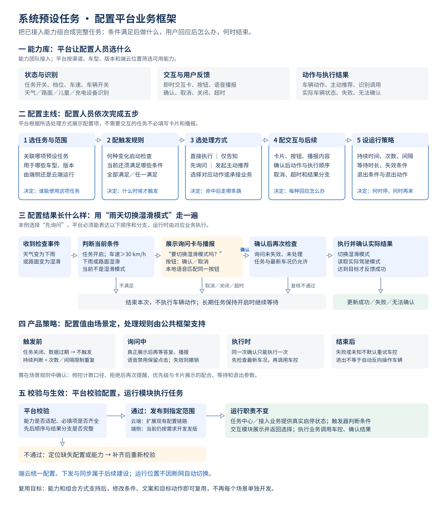

# 配置平台业务框架：评审图解

[飞书原 PRD](https://bytedance.larkoffice.com/wiki/R1OLwyfpTijHw7kQtnbcoZB4nff#YyoZdEVfDospsExhCL9c6wM7nxg)

[可修改的 SVG 源文件](配置平台框架图-v02.svg)

## 按图说明需求

先讲第二部分的五个蓝框，再讲第三部分的雨天例子，最后结合第一、四、五部分确认能力与策略。

1. **选任务与范围**：配置人员先关联任务，选择适用车型、版本和运行位置。平台据此筛选能力，不让不适配的能力参与发布。
2. **配触发规则**：分别定义“什么变化启动检查”和“检查时还要满足什么”。条件组支持全部满足、任一满足及其组合，不能把变化事件和当前状态混为同一个判断。
3. **选处理方式**：任务不一定都要询问。平台支持选择直接执行、仅告知、先询问或发起主动推荐，并要求补齐相应的后续处理。
4. **配交互与后续**：需要询问时，定义卡片、按钮、播报和各类答复后的处理。确认后的车辆动作必须等待有效答复，不能与询问同时执行。
5. **设运行策略**：配置稳定判断、次数、间隔、等待和退出规则。具体值按场景确认，公共框架负责执行规则，不让每项任务各做一套。

## 不同处理方式对应的配置联动

| 配置人员选择 | 平台要求配置 | 不应自动附加的行为 |
| --- | --- | --- |
| 直接执行 | 允许静默执行的任务策略、目标动作、执行条件、实际结果判定 | 不因为存在车控能力，就默认允许静默执行 |
| 仅告知 | 提醒内容、展示或播报方式、结束规则 | 不附加车辆动作 |
| 先询问 | 卡片与按钮、确认后动作、取消与超时处理、等待时长；需要播报时配置播报内容 | 不在用户确认前执行；不把取消当关闭长期任务 |
| 发起主动推荐 | 建议信息、后续承接业务、识别或业务结果的处理去向 | 不把发起推荐当作执行完成；不把未知识别当肯定结果 |

## 雨天案例怎么讲

“我们拿雨天切换湿滑模式来验证平台配置是否完整。配置人员关联天气任务，填写触发事件和车辆条件，选择先询问，再定义卡片、按钮和确认后的切换动作。图中第三部分就是这些配置在运行时产生的效果。”

“天气或路面变化后，触发器检查任务有效、车速、天气路况和当前驾驶模式。满足才发起询问。用户确认后，原业务再次检查任务、车况及这次询问是否还有效，才调用车控。用户取消、关闭、超时或条件已失效，则结束本次，不操作车辆。执行后的驾驶模式真的达到目标，才反馈成功。”

“这张图不是让配置平台自己识别天气、显示车机卡片或控制车辆。平台负责让这些输入、交互、动作和结果能够组合，并对缺失配置进行校验；对应能力模块负责实际执行。”

## 本图仍需沿用原 PRD 确认的边界

- 天气示例中，车速后来达标或任务重新开启时是否重新检查，按场景规则确认。
- 次数按触发、展示还是执行计数，拒绝后是否降频，场景优先级怎样影响卡片展示，均需确认，不填假定值。
- 端侧目前按需求开发发版；端云统一配置、下发和同步属于后续建设。
- 本图是第 3 章的配置能力建设方案，不表示所有选项当前均已上线。

## 文件版本

飞书中的本次配置平台图已替换为 v02 高清排版图。原 v01 Mermaid 源码和讲解保留在 `PRD-系统预设任务-配置平台框架图与讲解-v01.md`，原总流程、端侧及云端流程图未调整。
