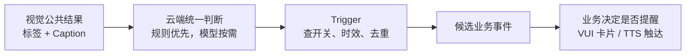

# 主动服务视觉结果消费｜老板内审上会稿

> 用途：直接投屏和讲解，不作为完整技术 PRD。
>
> 评审目标：把量产路线、职责边界和补数责任拍清楚。
>
> 前置会议：2026 年 9 月 10 日《聊主动服务视觉相关问题》。

---

## 一、先用一句话讲清“这件事是什么”

> 这次要评的不是“视觉能不能识别美景”，而是：**系统预置的视觉主动服务长期运行时，云端怎样低成本、低延迟地消费 Always-on 视觉结果，并把有效结果交给后续业务提醒用户。**

用户场景可以只举一个：

> 用户开启“看到沿途美景时提醒我”。车辆持续观察窗外。当视觉看到日落、海边或其他景物后，系统要及时判断值不值得提醒，并最终触达用户。卡片或 TTS 只是内审示例，具体触达方式仍需确认。

---

## 二、9 月 10 日会议到底讨论了什么

### 1. 为什么开这个会

前置会按“静态任务长期运行”的假设，对比了静态主动服务和动态 Advisor：

| 动态 Advisor | 静态主动服务 |
|---|---|
| 用户发起一次 Query，完成后结束 | 用户开启任务后，可能整段行程持续运行 |
| 短时消费视觉结果 | 持续消费，多任务可能同时运行 |
| 主要看单次效果 | 还要考虑全量成本、并发和提醒时效 |

会上担心：如果十几个静态视觉任务都持续读取 Caption，并分别调用模型，同一份视觉结果可能被重复理解，量产资源和时延不可控。

### 2. 会上讨论了哪两条路

| 会议思路 | 怎么做 | 好处 | 问题 |
|---|---|---|---|
| 开放 Caption + 云端模型理解 | 视觉保留开放描述，云端模型判断是否满足任务 | 能覆盖古典建筑等未提前枚举的场景 | 多任务长期调用模型，成本、并发和时延未知 |
| 有限内容 + 云端规则解析 | 预先约定海、沙漠、森林、日落等内容，仍放在整包 JSON 中上传；云端用规则取出 | 可以避免持续使用模型解析，资源更容易约束 | 场景范围被固定；云端由谁解析仍未确认 |

### 3. 会议形成了什么结论

会议只形成了三点结论：

1. 前置会按静态任务长期运行的假设讨论，认为它与动态 Advisor 的资源模型不同，需要单独评估长期运行和多任务并发。
2. “开放 Caption + 模型”和“有限内容 + 规则”在讨论层面都能走。
3. 两条路的能力、成本、并发和时延有取舍，需要带上内审由老板选择。

### 4. 会议没有定什么

- 没有选择量产路线。
- 会中投屏展示过舱外 JSON，但纪要没有留存可核验样例，也没有确认正式字段和 Topic。
- 没有确认 AI Service/端状态只透传还是也解析。
- 没有确认公共解析模块和唯一负责人。
- 没有正式的首期标签范围。
- 没有真实成本、并发和端到端时延数据。
- 没有确认 Trigger 之后由谁决定提醒、谁负责卡片/TTS 触达。

注意：会上提到舱外最快约 3 秒、舱内约 5 秒一轮。这只是视觉侧口头周期，不等于用户能在 3 秒或 5 秒内收到提醒。

---

## 三、这次内审建议评什么

老板现场不需要评完整接口，重点评三件事：

1. **路线**：量产到底走开放模型、纯有限集，还是组合方案。
2. **边界**：视觉、端状态/AI Service、公共解析、Trigger、Advisor/DT、VUI 分别负责什么。
3. **上线条件**：哪些真实数据补齐以后才能开发、灰度和放量。

---

## 四、建议带上内审的方案

### 产品建议：有限标签快路 + 受控 Caption 慢路

这是本次内审的产品建议，**不是 9 月 10 日会议已经决定的方案**。

做法只有四点：

1. 视觉每轮只产生一份公共结果，多个静态任务共享。
2. 结果中保留“有限标签”和“开放 Caption”；是否能双输出需要视觉侧确认。
3. 首期明确场景优先走标签和规则；只有长尾场景或规则无法确认时，才允许按条件调用一次共享模型。
4. Trigger 只产生候选事件；后续业务决定是否提醒，VUI 负责卡片/TTS 真正触达。

如果首期来不及建设模型慢路，在真实协议、解析模块和效果验证通过后，可以考虑先灰度标签快路；同时保留 Caption 字段和扩展位置，并明确长尾场景首期不支持。

---

## 五、上会只展示这一张流程图



讲这张图时，只解释五句话：

1. 视觉只生产一份结果，不为每个任务重复感知。
2. 云端只在一个公共位置解析，具体模块今天要认领。
3. 固定场景走规则，模型不是默认每轮调用。
4. Trigger 命中只代表产生候选事件，不代表用户已经收到服务。
5. 后续业务判断和 VUI 触达必须分别有负责人。

---

## 六、必须把风险说清楚

| 风险 | 为什么会发生 | 要怎么约束 |
|---|---|---|
| 成本和并发失控 | 多任务高频重复理解同一份 Caption | 一份结果共享；模型设置准入、限频和资源上限 |
| 提醒过时 | 视觉之后还有上传、解析、业务判断和触达 | 记录每段时间戳；为美景等场景设置有效期，过期不提醒 |
| 开放能力丢失 | 只保留固定标签，无法覆盖古典建筑等长尾内容 | 保留 Caption；慢路是否首期上线单独拍板 |
| 责任悬空或重复判断 | 会议没有确认谁从整包取数据，后面还可能多次调用模型 | 指定唯一公共解析模块；每段写清输入、输出和实名负责人 |
| 没有证据就承诺量产 | 当前时延、成本和周期大多是口头估计 | 开发前核验真实 JSON；放量前补效果、成本、并发和端到端时延 |

---

## 七、会上需要确认哪些东西

### A. 请老板现场拍板

| 必须拍板 | 建议结论 |
|---|---|
| 量产路线 | 原则选择“有限标签快路 + 受控 Caption 慢路” |
| 首期范围 | 先做少量强时效、可清晰定义的标签；Caption 保留 |
| 放量原则 | 真实协议、效果、成本、并发和时延没有补齐前，不直接全量 |

### B. 请各方现场认领

> 下列姓名只是根据前置会议整理的沟通入口，不代表已经确认的最终负责人。

| 找谁确认 | 现场要问什么 | 必须留下什么 |
|---|---|---|
| 丁彬/视觉相关方 | 真实整包是什么样；能否同时保留标签和 Caption；3/5 秒分别是什么周期 | JSON 样例、字段、车型版本、刷新周期、效果代价、负责人、时间 |
| 李鑫相关方 | AI Service/端状态现在只透传还是也解析；天气/路况能力能否复用 | 现状链路、解析位置、可复用接口、负责人、时间 |
| 赵益红/陈杰业务相关方 | 首期到底需要哪些场景；什么算正例、反例；多久以后提醒就没有价值 | 首期范围、正反例、时效、文案、暂不支持范围 |
| 云端架构/Trigger 相关方 | 公共解析放哪里；如何一份结果给多任务复用；模型何时调用 | 模块边界、调用条件、并发/费用上限、失败降级、负责人 |
| Advisor/DT/VUI 相关方 | 候选事件之后谁决定提醒；是否还调模型；谁负责卡片/TTS 结果 | 每段输入输出、是否必经、失败行为、唯一负责人 |
| 测试/项目相关方 | 用什么数据证明可以灰度和放量 | 效果、P95 时延、成本、并发门槛和 Go/No-Go 决策人 |

如果现场没有答案，不要记录“后续对齐”，要记录：**问题、实名认领人、精确回收时间、书面结论地址**。

---

## 八、你在会上怎么讲

### 1. 开场：40 秒

> 今天评审的不是视觉能不能识别，而是静态视觉主动服务怎么长期消费视觉结果。9 月 10 日前置会按静态任务长期运行的假设讨论，认为它与一次 Query 的动态 Advisor 资源模型不同，需要单独评估。会上讨论了两条路：开放 Caption 交给云端模型理解，或者约定有限内容后由云端规则解析。两条路在概念上都能走，但量产路线、解析负责人、成本和时延都没有定，所以今天请大家拍板。

### 2. 解释为什么要决策：50 秒

> 如果每个静态任务每收到一份 Caption 都调用一次模型，资源会同时被车辆数、任务数和视觉频率放大；单车能跑通，不代表全量能承受。但如果只留下少量固定标签，又会损失古典建筑等长尾识别能力。同时，美景是瞬时场景，链路太长以后再提醒就没有价值。因此这不是字段怎么拆的问题，而是能力、成本和体验的量产取舍。

### 3. 讲方案：1 分钟

> 我的产品建议是“有限标签快路 + 受控 Caption 慢路”。视觉每轮只生成一份公共结果，多个任务共享。首期明确场景优先走标签和规则；标签覆盖不了、又符合已约定准入条件时，才调用一次共享模型。Trigger 只检查任务开关、时效和去重，产生候选事件；后续业务决定是否提醒，VUI 负责真实触达。这个组合方案是今天的评审建议，不是前置会已有结论。

### 4. 讲风险：50 秒

> 当前主要有五个风险：模型可能被多任务重复调用；完整链路可能让提醒过时；固定标签可能损失开放能力；公共解析和后续触达责任还悬空；真实协议、成本、并发和端到端时延证据都没有补齐。我的建议不是说这些风险已经解决，而是用公共复用、规则优先、模型受控和分段验收来约束它们。

### 5. 请求确认：1 分钟

> 今天希望先拍三件事：第一，是否原则选择快慢分层；第二，首期是否先做少量明确标签并保留 Caption；第三，数据没补齐前是否不直接全量。然后请视觉、AI Service、云端、Trigger、Advisor/DT、VUI 和测试各自认领表里的问题。每个未决项都留下实名负责人和回收时间，不再只写“后续对齐”。

### 6. 收口：20 秒

> 如果大家同意，我会按今天的原则补详细设计；如果不同意组合方案，请明确选择开放模型或纯有限集，并写清愿意接受的成本、时延或能力损失。今天的完成标准不是“技术上能走”，而是路线、边界、补数责任和下一次检查时间都有人认领。

---

## 九、会议结束前照着念的结论模板

```text
评审结论：通过 / 条件通过 / 补充后重审

1. 量产路线：________________
2. 首期场景与能力边界：________________
3. 视觉输出：标签 / Caption / 双输出
4. 公共解析模块及负责人：________________
5. 模型调用条件与资源上限：________________
6. Trigger 后续承接方及各段负责人：________________
7. 待补数据、认领人、回收时间：________________
8. 下一次检查时间：________________
```

---

## 十、材料使用顺序

- 主会上只展示：第二、四、五、六、七部分。
- 你按第八部分讲，控制在约 5 分钟。
- 有人追问“会议原话是什么”时，再打开详细会议底稿。
- 有人追问接口字段、指标或负责人时，明确回答“前置会未确认，本次要求认领”，不要把产品建议讲成既定事实。
