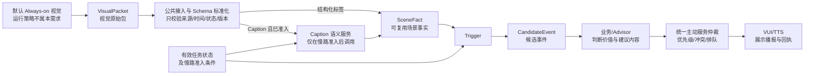

# 主动服务视觉结果消费｜老板内审完整讨论稿

> 版本：v04  
> 前置会议：2026 年 9 月 10 日《聊主动服务视觉相关问题》  
> 本文用途：先还原会议，再定义本次需求，最后组织内审讨论和会后任务。  
> 信息标记：`会议事实`、`产品建议`、`待确认`三类内容必须分开。

---

## 0. 老板先看这一页

### 0.1 这件事到底是什么

这件事不是“视觉模型能不能看见日落”，也不是“给美景多加几个标签”。

这件事是：

> 系统预置或用户开启的视觉主动服务可能长期运行。视觉持续产生结果以后，云端要用什么方式读取、理解和复用这份结果，才能既控制模型成本与并发，又在场景过期前产生一个可交给后续业务的候选事件。

用“沿途美景提醒”举例：

> 车辆持续观察窗外，发现日落或其他值得关注的景物。系统需要知道任务是否开启、视觉结果是否新鲜、当前内容是否满足场景、是否已经提醒过，然后把有效事件交给后续业务决定是否提醒用户。

### 0.2 9 月 10 日会议真正得到了什么

会议只把两条概念路线聊清楚：

1. 开放 Caption（画面自然语言描述）上传云端，由模型持续理解。
2. 视觉只输出事先约定的有限内容，仍放在 Always-on（持续视觉）整包 JSON 中，云端用规则取出。

会议没有选择路线，也没有确认真实数据协议、解析模块、量产成本、完整时延和最终负责人。

### 0.3 本次内审必须产出什么

本次内审的完成标志不是“大家都觉得能做”，而是留下以下书面结果：

1. 选择什么目标路线，以及能接受什么代价。
2. 是否坚持“一份视觉结果、多任务复用”的架构原则。
3. 视觉结果、公共解析、Trigger、后续业务和用户触达分别由谁负责。
4. 哪些事项当场拍原则，哪些事项指定负责人补数据。
5. 进入详细设计、影子验证和用户灰度分别需要满足什么条件。

### 0.4 本次不能凭空拍成事实的内容

没有证据时，内审不能直接写：

- 已经具备稳定的标签 + Caption 双输出。
- AI Service 已经能复用天气/路况解析能力。
- 舱外全车型都是 3 秒上报。
- 完整链路 10 秒以内。
- 模型成本和并发可以接受。
- 日落、海、沙漠、森林已经是正式 P0 场景。
- 任何被点名的人已经是最终 DRI（唯一负责人）。

这些事项可以在会上指定补数任务，但不能在缺少证据时拍成已具备能力。

---

## 1. 先分清“长期任务”和“单次事件”

这件事里有四层任务，还夹着一个“单次服务事件”。如果不分开，研发可能在第一次提醒后错误关闭长期任务，数据侧也可能把一次展示率当成任务完成率。

| 层级 | 任务是什么 | 从什么时候开始 | 什么才算完成 | 当前状态 |
|---|---|---|---|---|
| 1. 长期用户/业务任务 | 例如“看到沿途值得关注的景色时提醒我” | 系统预置任务生效，或用户开启任务 | 用户关闭、任务到期或能力失效；一次提醒不会自动结束长期任务 | 会议只举了美景例子，没有形成正式用户故事、生命周期和触达方式 |
| 2. 单次服务事件 | 某一次日落或景物从出现到处理结束 | 某一轮结果形成场景事实或候选 | 展示、抑制、过期或失败后结束，但不自动关闭长期任务 | 这是产品为避免状态混淆提出的拆分，待内审确认 |
| 3. 系统运行任务 | 长期任务有效期间，持续消费视觉结果并判断每个事件 | 静态消费链路收到可用视觉结果 | 每轮得到“候选事件”或“不触发”；任务关闭后停止本需求的任务订阅、Trigger 和模型慢路 | 会议按长期运行的假设讨论；默认 Always-on 是否继续运行不由本需求控制 |
| 4. 本次产品建设任务 | 建立可供多个静态任务复用的视觉结果消费机制 | 视觉结果到达公共接入位置 | 结果形成可复用场景事实，并能按任务产生候选事件 | 尚未形成正式方案和模块 DRI |
| 5. 本次内审任务 | 对目标路线、逻辑边界、验证门槛和补数责任做决策 | 本次老板内审开始 | 决策项有结论；待确认项有唯一负责人、回收时间和书面交付物 | 正是本次会议要完成的任务 |

生命周期必须单独记录：

> 长期任务从开启持续到关闭、到期或能力失效；一次视觉命中只创建一个服务事件。单次事件结束，不等于长期任务结束。

### 1.1 本次产品建设任务的边界

本次重点建设和确认：

- 视觉结果以什么形式进入云端消费链路。
- 谁从整包中读取并标准化业务可用内容。
- 固定场景什么时候走规则，开放场景什么时候允许用模型。
- 多个长期任务怎样复用同一份视觉结果，避免重复解析。
- Trigger 在哪里结束，候选事件之后由谁接住。
- 如何证明成本、并发、时延和用户体验可接受。

本次不展开评审：

- 视觉模型训练和算法网络结构。
- 所有美景场景的最终标签数量。
- 卡片的具体视觉样式和 TTS 文案细节。
- 整个主动服务平台的全部能力。

本稿的失败默认行为只适用于美景等非安全推荐场景。若以后扩展到安全相关视觉任务，必须另行评审安全降级，不能直接沿用“无法确认则不触发”。

但是，候选事件之后的承接方和真实触达状态必须认领，否则本次链路仍然不闭环。

---

## 2. 9 月 10 日会议讨论了什么

### 2.1 会议的原始问题

王泽民与刘杨前置讨论后，带来了两个风险判断：

1. 动态 Advisor 由一次 Query 发起，处理完成后可以结束；静态预置任务可能长期运行，需要持续判断。
2. 如果存在多个视觉任务，并且每个任务都持续解析 Caption，模型消耗和并发会随量产规模放大。

注意：“十几个视觉任务”在会上用于说明风险量级，不代表已证明单车会同时开启十几个任务。

### 2.2 会议讨论的完整因果链

```text
静态任务可能长期运行
        ↓
需要持续消费视觉结果
        ↓
如果持续用模型理解开放 Caption
        ↓
担心成本、并发和时延随量产规模放大
        ↓
提出“有限内容 + 规则解析”
        ↓
发现有限内容仍在整包 JSON 中，需要有人取出
        ↓
追问 AI Service、端状态、天气路况和 DT 分别怎么处理
        ↓
发现解析位置、现有能力和负责人不清楚
        ↓
同时发现有限内容会损失古典建筑等开放能力
        ↓
问题最终变成“成本、资源、时延与能力覆盖的取舍”
        ↓
两条概念路线提交老板内审
```

### 2.3 按会议顺序还原讨论内容

| 顺序 | 当时讨论的问题 | 为什么会追问 | 会上的回答 | 最终状态 |
|---:|---|---|---|---|
| 1 | 静态任务为什么不能直接按动态 Advisor 的方式处理 | 动态 Advisor 是一次 Query；静态任务可能长期运行 | 长期轮询、推理和多任务并发会带来资源问题 | 问题得到对齐，实际规模未提供 |
| 2 | Caption 为什么带来成本 | 开放文本不能直接用规则判断 | 如果上传开放 Caption，云端可能需要持续调用模型解析 | 问题得到对齐，调用位置和次数未确认 |
| 3 | 能不能改成标签 | 希望减少模型调用 | 丁彬提出有限集，只输出双方预先约定的海、沙漠、森林等内容 | 形成第二条概念思路 |
| 4 | AI Service 能否解析 | 有限内容上云后仍需要有人取出 | 丁彬先说李鑫相关模块只透传、不解析 | 后面出现不同说法，未形成结论 |
| 5 | 天气、路况以前是谁解析 | 王泽民希望复用已有方式 | 丁彬又说天气、路况可能在端侧由李鑫侧做过专用解析 | 与“只透传”矛盾；最后决定询问李鑫 |
| 6 | DT 为什么不用先拆标签 | 想比较不同消费方的使用方式 | 丁彬说整包先进入 Context，DT 作为模型直接使用 | 只形成 DT 路线的口头说明 |
| 7 | 有限集是不是直接发一个标签 | 王泽民认为拿到标签即可直接使用 | 丁彬投屏说明 Always-on 仍上传整包 JSON；有限内容放在包内，使用方再取出 | 澄清了数据形态，正式 Schema 未留存 |
| 8 | 有限集到底包含哪些内容 | 规则路线必须先确定范围 | 丁彬提出双方约定 5 个或 10 个；赵益红说自己只按个人认知画了几个 | 没有正式场景表 |
| 9 | 有限集会损失什么 | 固定枚举可能封死开放能力 | 丁彬以古典建筑为例，说明未预定义内容将无法被充分使用 | 能力损失得到明确讨论 |
| 10 | 完整链路需要多久 | 王泽民用高速沿途景物举例，担心多段处理后可能耗时一分多钟 | 丁彬口头估计最多约 10 秒；王泽民提到纯语音主链路约 5–6 秒 | 10 秒和一分多钟是估计；会议没有形成端到端指标 |
| 11 | 最终怎么选 | 小会无法独立决定量产成本与体验取舍 | 参会人认为两条思路在概念上都能走，带上内审由老板决策 | 这是会议最终收口 |

### 2.4 会议中的两条路线

#### 路线一：开放 Caption + 云端模型理解

```text
视觉输出开放 Caption
  → 整包上传
  → 云端模型理解内容
  → 判断是否满足静态任务
```

价值：保留古典建筑等未提前枚举的长尾视觉能力。

会上担心：静态任务长期运行时，模型成本、并发和完整时延可能不可控。

#### 路线二：有限内容 + 云端规则解析

```text
双方预先约定有限内容
  → 内容放进 Always-on 整包 JSON
  → 云端从整包中取出
  → 用规则判断，不用模型理解自由文本
```

价值：可以降低持续使用云端模型解析的需求。

会上担心：固定范围会限制开放能力，而且谁负责从整包中取出字段仍未确认。

### 2.5 会上出现的三个关键矛盾

#### 矛盾一：李鑫相关模块只透传，还是也解析

- 前面说：李鑫不做解析，只做透传。
- 后面说：天气、路况可能在端侧由李鑫侧专门解析。
- 最后说：具体怎么解析并不知道，需要会后询问李鑫。

因此，不能把李鑫写成已经确认的解析负责人，也不能把天气/路况写成可以直接复用的现成能力。

#### 矛盾二：有限内容是不是独立标签接口

- 王泽民最初理解：视觉直接给一个标签，业务直接拿。
- 丁彬说明：Always-on 仍是整包 JSON，约定内容放在包内，使用方仍要取出。

因此，会议没有形成“独立标签接口已经存在”的结论。

#### 矛盾三：完整链路到底快不快

- 丁彬口头说明：舱外最快约 3 秒一轮、舱内约 5 秒一轮；完整链路估计最多约 10 秒。
- 王泽民认为：现有纯语音 Query 主链路已经约 5–6 秒，再叠加上传和多段判断可能更长，甚至估计一分多钟。

因此，3 秒、5 秒、10 秒和一分多钟都不能作为正式用户时延指标。

### 2.6 会议已经形成与没有形成的结论

| 已形成的会议口径 | 没有形成的结论 |
|---|---|
| 静态任务按长期运行假设讨论，资源模型不同于一次 Query | 真实任务生命周期和单车同时开启数量 |
| 开放 Caption 路线和有限内容路线概念上都能走 | 最终量产路线 |
| Always-on 以整包 JSON 形式上传；会上投屏展示过舱外包 | 可核验的正式 JSON、字段、Topic 和版本 |
| DT 可把整包放进 Context 使用 | 静态主动服务是否能或应该复用 DT |
| 有限内容可以通过规则取出 | 规则解析模块和唯一负责人 |
| 有限内容会损失开放视觉能力 | 可以接受多大能力损失 |
| 需要带上老板内审 | 成本、并发、时延、P0 场景、DRI 和完成时间 |

“链路聊通了”只代表两条概念处理方式被说清，不代表接口已打通、能力已上线或可以量产。

---

## 3. 这次需求到底要建设什么

> 以下是产品侧根据前置会议问题提出的建设范围，需要本次内审确认，不是 9 月 10 日已经批准的项目范围。

### 3.1 产品问题

> 面对长期运行、可能有多个任务同时消费视觉结果的情况，怎样把一份视觉结果转成可复用、可判断、不过期的候选事件，同时避免每个任务对同一份结果重复调用模型？

### 3.2 本次建设任务拆解

| 建设任务 | 要解决的问题 | 应交付什么 |
|---|---|---|
| T0 任务与事件生命周期 | 长期任务和单次提醒事件何时开始、结束 | 任务状态、事件状态、关闭/到期/失败行为 |
| T1 视觉输入确认 | 云端实际收到 Caption、有限内容还是两者 | 真实 JSON、字段说明、来源、观察时间、周期、车型和版本 |
| T2 公共接入与 Schema 标准化 | 谁校验整包协议、来源、时间、状态和版本 | 逻辑责任、输入输出、异常行为；物理模块有证据后再定 |
| T3 可复用场景事实 | 结构化标签和受控 Caption 语义怎样统一成业务可消费事实 | `SceneFact`（场景事实）定义、生成方式、复用方式和 DRI |
| T4 Trigger 任务判断 | 如何把场景事实与具体任务结合 | 任务许可、业务条件、局部去重规则和 `CandidateEvent` 定义 |
| T5 候选事件交接 | Trigger 做到哪里、交给谁 | 发布协议、逐段交接状态、接收方和 DRI |
| T6 用户闭环确认 | 谁判断建议价值、谁仲裁冲突、谁真正触达 | 业务判断、统一仲裁、VUI/TTS 各段输入输出及异常处理 |
| T7 量产验证 | 证明方案不是单车可跑、全量失控 | 效果、边际成本、容量、两类时延和灰度门槛 |

### 3.3 需求完成标准

只有同时满足以下条件，本次建设任务才算闭环：

1. 长期任务状态与单次服务事件状态可以分别记录。
2. 视觉真实输入和数据语义已书面确认。
3. 一份视觉包只完成一次公共 Schema 标准化，并形成多任务可复用的场景事实。
4. 结构化标签和 Caption 语义服务不与 Trigger 重复判断同一语义。
5. Trigger 输出有明确的候选事件交接协议和下游状态。
6. 业务判断、统一主动服务仲裁和真实触达分别有责任人，状态可回读。
7. 真实车辆规模下的边际成本、并发和端到端时延通过验证。

---

## 4. 本次内审究竟要讨论出什么

### 4.1 现场可以拍板的内容

| 决策项 | 现场要讨论的问题 | 建议结论 | 会议记录应该写成 |
|---|---|---|---|
| D1 目标路线 | 开放模型、纯有限内容，还是组合路线 | 原则选择“有限标签快路 + 受控 Caption 慢路” | “条件同意目标路线；量产成立仍以接口、容量、效果和时延验证为前置条件。” |
| D2 复用原则 | 同一视觉包能否由各任务各自解析 | 公共 Schema 标准化一次，场景事实多任务复用 | “不允许默认按任务重复解析同一视觉包。” |
| D3 数据原则 | 首期是否只保留标签，是否保留开放能力 | 结构化标签支撑主路，Caption 保留扩展能力 | “双输出为目标要求，是否可承载由视觉侧补证据确认。” |
| D4 责任原则 | 公共接入、场景事实、Trigger、业务判断、统一仲裁和触达由谁负责 | 先拍每层逻辑边界和唯一负责人；只有现状接口证据齐全时才拍物理模块 | “证据不足时指定架构 DRI、方案交付物和重审时间，不强行指定模块名。” |
| D5 首期范围原则 | 什么场景可以进入 P0 | 价值明确、正反例可定义、效果可验证、场景有效期可定义和埋点，并能在有效期内闭环 | “本次先批入围标准；材料不齐时不拍最终标签表。” |
| D6 上线原则 | 能否直接面向用户 | 先影子验证，再按场景小流量灰度 | “架构原则通过不等于允许用户灰度。” |

### 4.2 只能指派补数、不能当场拍成事实的内容

| 待确认内容 | 为什么不能直接拍 | 会上要指定的任务 |
|---|---|---|
| 舱外 3 秒、舱内 5 秒的适用范围 | 只有口头说明，没有车型、版本、开关和到达记录 | 指定视觉/数据链路负责人提交书面证据 |
| AI Service/端状态是否解析 | 会中说法前后冲突 | 李鑫或正式模块负责人提交现状架构和接口 |
| 单车真实同时运行的任务数 | “十几个”只是风险举例 | 业务/数据方提供场景总数、开通率和同时运行分布 |
| 三条方案的模型成本与容量 | 没有车辆规模、Token、单价和压测 | 资源/模型服务负责人提交三方案测算 |
| 端到端 SLA | 10 秒与一分多钟都是口头估计 | 各段负责人补全链路 Trace 和 P50/P95/P99 |
| 最终 P0 标签 | 赵益红内容只是个人草案，陈杰团队尚未输入 | 业务、视觉和测试共同提交正反例及效果 |
| 标签 + Caption 双输出能力 | 会议没有端侧资源和效果验证 | 视觉侧提交可行性、包大小、周期和效果代价 |
| 下游是否需要多段模型 | 会议只描述了可能的多段处理，没有说明每层独有价值 | 各下游模块说明输入、输出、是否必经和耗时 |

### 4.3 本次内审结束时必须读回的五句话

1. 我们选择的目标路线是：________。
2. 公共读取/标准化：已确认模块为________；若本次不能确认，则架构方案 DRI 为________，书面回收时间为________。
3. Trigger 输出交给哪个业务模块：________。
4. 允许进入详细设计或影子验证的前置条件是：________。
5. 所有未确认事项的负责人和回收时间是：________。

如果这五句话无法读回，本次内审没有完成。

---

## 5. 产品建议方案

> 以下均为产品建议，不是 9 月 10 日会议已定结论。

### 5.1 三种选择

| 方案 | 怎么运行 | 能获得什么 | 主要风险 | 建议定位 |
|---|---|---|---|---|
| 开放模型路线 | 静态任务持续使用模型理解视觉描述 | 开放能力最大 | 调用量、并发和时延随量产规模放大；是否多任务重复调用未确认 | 不作为无约束的默认量产路线 |
| 纯有限标签路线 | 静态主路径只消费预先约定的场景字段 | 资源和行为更容易约束 | 开放视觉能力被固定场景限制 | 可作为首期快路，但不建议永久删除 Caption |
| 快慢分层路线 | 固定场景走标签规则；只有已批准条件成立时才使用共享 Caption 语义模型 | 平衡量产资源和长尾能力 | 需要建设公共复用、慢路准入、限频和降级 | **产品推荐的目标路线** |

“纯有限标签”限制的是静态主路径消费的场景字段，不代表会议已经决定从整个 Always-on 包中删除其他内容或 Caption。整包最终保留什么、是否能同时输出标签和 Caption，仍待视觉侧验证。

### 5.2 为什么推荐快慢分层路线

不直接选择开放模型路线：

- 当前没有真实车辆数、任务数、调用率和成本数据。
- 不能默认每个长期任务都可以持续调用模型。
- 美景强时效，多段模型判断可能导致提醒过期。

不把纯有限标签路线当作永久终态：

- 会上已经明确讨论有限集会限制端侧模型能力。
- 古典建筑等未提前枚举内容会被丢失。
- 后续新增场景会持续依赖标签扩展和版本维护。

推荐快慢分层路线：

- 高频、定义清楚的 P0 场景用规则保障时效和资源。
- Caption 保留开放能力，但模型不是默认每轮调用。
- 一份视觉结果和一次语义判断可以供多个任务复用。

### 5.3 分阶段建议

阶段 1：先验证标签快路。

- 确认真实数据协议和解析模块。
- 只选少量正反例清楚的场景进行影子运行。
- 不触达用户，只记录识别、候选事件、过期和资源数据。

阶段 2：验证受控慢路。

- 只允许已会签的长尾目标或候选条件进入。
- 同一场景共享判断结果。
- 对美景等非安全推荐场景，模型超时、超限或无法确认时，本轮不触发；安全相关场景必须另行评审 fail-safe（安全降级）行为。
- 置信度灰区只有在影子数据证明 Caption 语义慢路相对“等待下一帧”或“直接放弃”有稳定增益时才允许上线；否则关闭该准入方式。

阶段 3：小流量用户灰度。

- 只开放已达成效果、成本和时延门槛的场景。
- 每个场景单独设置有效期、去重和熔断。

---

## 6. 一张简单但完整的产品流程图



这张图只需要讲八句话：

1. 默认 Always-on 是否继续感知和上报，由视觉自身策略决定，不由任务开关控制。
2. 没有有效任务时，本需求新增的任务订阅、Trigger 和模型慢路不运行；公共状态是否继续接入视觉包由平台现状决定，需另行确认。
3. `VisualPacket` 是视觉原始包；公共接入层只校验协议、来源、时间、状态和版本，不判断具体任务。
4. 结构化标签可直接形成 `SceneFact`（场景事实）；Caption 只有满足慢路准入时才进入语义服务，再形成可复用事实。
5. 同一场景事实供多个任务复用；公共层与 Trigger 不重复判断同一语义。
6. Trigger 结合任务许可、业务条件和局部去重，发布 `CandidateEvent`（候选事件）。
7. 业务/Advisor 决定是否有价值和建议什么；统一主动服务仲裁负责跨业务优先级、通话/导航冲突、排队或抑制。
8. VUI/TTS 只执行已批准的展示或播报并回传真实结果；一次事件结束不等于长期任务结束。

### 6.1 每一步具体做什么

> 下表是建议职责划分，最终模块和实名 DRI 需要在内审现场确认。

| 步骤 | 建议逻辑责任 | 输入 | 只做什么 | 输出 | 失败或异常怎么做 |
|---|---|---|---|---|---|
| 1. 默认视觉 | 视觉侧 | 摄像头画面、视觉自身运行策略 | 产生视觉原始结果；不判断具体用户任务 | `VisualPacket`：原始包、观察时间和数据状态 | 摄像头不可用或无结果时明确标状态；任务关闭不等于关闭 Always-on |
| 2. 公共接入与 Schema 标准化 | AI Service、端状态或待确认公共能力 | `VisualPacket` | 校验协议、来源、时间、状态和版本；不判断业务任务 | 标准化包或不可用原因 | 协议不兼容、缺字段或过期时停止后续消费并记录原因 |
| 3. 场景事实生成 | 结构化标签提供方；受控 Caption 语义服务 | 标准化包、慢路准入 | 标签直接映射；或在准入后理解 Caption | 多任务可复用的 `SceneFact` | 对非安全推荐场景，无准入、超时或无法确认时不产生事实 |
| 4. 有效任务状态 | 任务状态相关方 | 任务许可、用户设置、车型能力 | 只判断任务是否允许运行，并提供慢路准入所需条件 | 有效/关闭/未知等任务状态 | 关闭、未知或不支持时，本需求的任务订阅、Trigger 和慢路停止；不控制默认 Always-on |
| 5. Trigger | Trigger 相关方 | `SceneFact`、任务状态、业务条件、局部去重 | 判断这个事实是否对这个任务形成候选 | 已按协议发布并记录交接状态的 `CandidateEvent`，或抑制原因 | 任务关闭、事实过期、条件不满足或重复时不发事件 |
| 6. 业务判断 | 原主动服务/Advisor 等实际承接方 | `CandidateEvent`、当前业务上下文 | 判断是否值得建议、建议什么、有效期多久 | 待仲裁的建议 | 价值不足或事件过期时抑制，并回传原因 |
| 7. 统一主动服务仲裁 | 现有统一仲裁模块；若不存在则登记能力缺口 | 建议、优先级、通话/导航等全局上下文 | 处理跨业务冲突、排队、延后、抑制和过期撤销 | 已批准触达任务或抑制原因 | 超过有效期则不再下发；无模块时不得默认让 VUI 承担 |
| 8. 真实触达 | VUI/TTS | 已批准的触达任务 | 执行展示、播报、关闭和失败回传 | 真实触达状态 | 排队后过期或执行失败需回传，不能记作事件成功 |

`CandidateEvent` 发布成功、下游收到、业务完成判断、仲裁通过和真实展示必须分别记录状态，不能合并成一个“接收成功”。

---

## 7. 风险要怎么讲

| 风险 | 为什么会发生 | 最坏结果 | 内审要给的约束 |
|---|---|---|---|
| 模型成本和并发失控 | 活跃车辆、视觉频率、长期任务数和调用次数共同放大 | 全量费用或服务容量不可承受 | 公共复用；慢路准入、单车限频、全局容量和熔断 |
| 提醒已经过期 | 视觉之后还有上传、解析、任务判断、业务判断和展示 | 用户驶离景物后才收到提醒 | 每段埋点；每个场景定义有效期；展示前再次校验 |
| 开放能力损失 | 纯有限标签只能覆盖已定义内容 | 古典建筑等长尾场景即使看见也无法使用 | 保留 Caption；慢路分阶段验证 |
| 同一结果被重复判断 | 各任务或各下游模块都再次解析 | 成本增加、时延变长，甚至结论冲突 | 一份公共事实；每层只保留有独立价值的判断 |
| 数据含义不清 | 没有正式字段、状态和时间语义 | “没有数据”“没有识别到”“结果过期”被混在一起 | 开发前确认真实 Schema 和异常状态 |
| 重复打扰用户 | 同一景色可能连续出现在多个 3/5 秒结果里 | 连续弹卡或播报 | 按场景实例去重和冷却，不按单包当作新事件 |
| 责任悬空 | 会议只点名联系人，没有正式 DRI | 视觉、状态和业务互相等待 | 每段唯一实名 DRI、输入输出和完成时间 |
| 口头信息当量产结论 | 3/5 秒缺少统一口径与覆盖范围；10 秒和一分多钟是口头估计 | 评审通过后才发现接口或体验不成立 | 只允许进入详细设计/影子验证，数据达标后另做 Go/No-Go |

资源账必须分三种口径，不能用一条公式混在一起：

- 每个任务独立调模型：峰值模型 QPS 约为 `Vpeak_task × T × k ÷ Δ`。
- 每车每包共享调一次：峰值模型 QPS 约为 `Vpeak_task × k ÷ Δ`。
- 只有比例 `r` 的包进入共享慢路：峰值模型 QPS 约为 `Vpeak_task × r × k ÷ Δ`。

其中，`Vpeak_task` 是峰值时至少有一个有效视觉任务的车辆数，`T` 是单车同时运行任务数，`k` 是每份进入该路线的视觉包触发的模型调用次数，`Δ` 是结果间隔秒数，`r` 是进入共享慢路的包比例。

日调用量和模型费用按以下口径计算：

- 逐任务模型：`N_day_per_task = F × e × h × 3600 × T × k ÷ Δ`。
- 每车每包共享模型：`N_day_shared = F × e × h × 3600 × k ÷ Δ`。
- 低比例共享慢路：`N_day_slow = N_day_shared × r`。
- 日模型费用：`Cost_day = N_day × (Tin × Pin + Tout × Pout) ÷ 10^6`。

`F` 是具备该能力的车辆总量，`e` 是当天至少有一个有效任务且车辆活跃的比例，`h` 是平均任务活跃小时数；`Tin/Tout` 是单次输入/输出 Token，`Pin/Pout` 是每百万 Token 单价。若公共接入层会处理没有有效任务车辆的 Always-on 包，还需要用全量接入车辆重新计算状态处理和带宽成本，不能沿用 `Vpeak_task`。

另外单独核算：双输出带来的端侧增量算力、包大小和上行带宽，以及公共状态存储与分发成本。

当前这些数据均未齐，所以本次只能拍计算口径、资源红线和补数负责人，不能拍成本已经可接受。测算只计算本需求新增的边际成本，不能把已经存在的 Always-on 感知成本重复计入。

---

## 8. 现场逐项怎么讨论

### D1：量产主路线

- 已知：会议两条路线都只在概念上能走。
- 要讨论：更重视开放能力，还是更重视可控成本与时效。
- 产品建议：选择快慢分层路线，标签为主、Caption 保留、模型受控。
- 现场提问：

> “请确认我们是否把‘有限标签快路 + 受控 Caption 慢路’作为目标架构。如果不同意，请明确选择开放模型或纯有限标签，并写清愿意承担的成本、时延或能力损失。”

- 预期产出：路线、理由、适用范围、进入验证的前置条件。

### D2：一份结果是否必须多任务复用

- 已知：会议担心多个任务持续推理，但没有确认当前是否重复调用。
- 要讨论：公共 Schema 标准化与场景事实复用是否作为架构原则。
- 产品建议：同一车辆同一轮视觉包只做一次公共 Schema 标准化，形成可复用场景事实。
- 现场提问：

> “请先确认同一视觉包不得被各任务重复解析。公共能力的物理落点如有现状证据则现场确认；如无证据，请指定架构 DRI、书面方案和重审时间。”

- 预期产出：逻辑边界和正式 DRI；证据齐全时再确定物理模块。

### D3：视觉到底要输出什么

- 已知：会议只说明整包 JSON；正式字段未留存。
- 要讨论：有限内容和 Caption 是否同时保留；状态和时间是否必须提供。
- 产品建议：目标上保留结构化标签、Caption、观察时间和数据状态。
- 现场提问：

> “请视觉侧确认这是不是可承载的目标输出；如果不能，请说明资源或效果代价，并给替代方案。”

- 预期产出：目标数据原则；真实可行性由指定负责人补证据。

### D4：有限场景和开放场景怎样分工

- 已知：纯有限集限制能力；全量模型又有资源风险。
- 要讨论：哪些场景进入高频主路径，慢路在什么条件下允许调用。
- 产品建议：P0 固定场景走规则；长尾只在批准条件下调共享模型。
- 现场提问：

> “请确认慢路不是默认兜底。对美景等非安全推荐场景，没有准入、超限、超时或无法确认时，是否统一按本轮不触发处理？安全场景是否同意另行评审安全降级？”

- 预期产出：准入原则、限频原则、失败默认行为。

### D5：Trigger 到哪里结束

- 已知：9 月 10 日会议没有完整讨论用户触达闭环。
- 要讨论：Trigger 是否只输出候选事件，后续谁接住。
- 产品建议：Trigger 负责任务许可、场景事实有效、业务条件和局部去重；后续业务决定建议价值，统一主动服务仲裁负责冲突和排队，VUI/TTS 负责真实触达。
- 现场提问：

> “请 Trigger、后续业务、统一仲裁和 VUI/TTS 分别确认自己的输入、输出、成功状态和失败状态。场景事实、候选事件、建议生成、仲裁结论和真实展示必须分别记录。”

- 预期产出：逐段模块边界和实名 DRI。

### D6：本次评审通过后能做什么

- 已知：当前没有完整接口、成本、时延和效果证据。
- 要讨论：架构原则通过是否只允许进入设计和影子验证。
- 产品建议：先影子，不直接用户灰度。
- 现场提问：

> “请确认本次即使通过，也只代表允许详细设计和影子验证；用户灰度需要另一份效果、容量和时延报告做 Go/No-Go。”

- 预期产出：阶段边界、放量门槛负责人和复查时间。

---

## 9. 需要谁来回答什么

> 人名只根据前置会议整理为沟通入口，不代表正式 DRI。

| 人员/角色入口 | 为什么需要参加 | 必须回答 | 必须留下的交付物 |
|---|---|---|---|
| 王泽民/需求与主动服务问题提出方 | 说明静态任务的资源、并发和时延问题 | 实际业务任务如何运行；预计任务规模；现有消费方式 | 业务规模假设和当前链路说明 |
| 丁彬/视觉相关方 | 会议中解释视觉整包、有限内容和周期 | 真实 JSON、双输出可行性、3/5 秒含义、车型版本和效果代价 | 样例、字段、周期、支持范围和正式视觉 DRI |
| 李鑫或 AI Service/端状态正式负责人 | 会议中相关模块边界说法冲突 | 只透传还是也解析；天气/路况在哪里处理；能否复用 | 现状架构、接口、目标边界和正式 DRI |
| 赵益红/陈杰业务相关方 | 提供场景和下游业务诉求 | 首期场景价值、正反例、有效期、后续还需哪些判断 | 会签后的场景表和下游处理说明 |
| 张航、嘉锋或实际资源决策方 | 会议建议参与成本和资源讨论 | 三方案成本、峰值并发、容量和预算边界 | 正式测算、资源红线和决策人 |
| Trigger 正式负责人 | 候选事件前的任务判断需要明确边界 | 输入、任务条件、局部去重、事件发布和交接状态 | `CandidateEvent` 协议、逐段状态和 DRI |
| Advisor/DT/下游业务正式负责人 | 会议提到后面可能还有多段判断 | 每层为什么存在、是否必经、是否还调模型、谁决定建议价值 | 每段输入输出、耗时和 DRI |
| 统一主动服务仲裁负责人 | 跨业务优先级、通话/导航冲突不能默认交给 VUI | 当前是否已有统一仲裁；如何排队、抑制、延后和过期撤销 | 仲裁协议、状态和 DRI；若不存在则形成能力缺口任务 |
| VUI/TTS 正式负责人 | 用户只有真实触达才完成一次事件闭环 | 如何执行已批准内容；展示、播报、关闭和失败如何回传 | 触达协议、真实状态和 DRI |
| 测试/数据/项目负责人 | 决定什么时候可以灰度 | 影子样本、指标、门槛和 Go/No-Go 流程 | 验证计划、看板和复查时间 |

---

## 10. 内审后的正式任务清单

> 下表中的联系人只作为建议认领入口；“正式 DRI”和“精确截止时间”必须在内审现场写成真实姓名和日期，不能把“现场填写”原样带到会后。

| 优先级 | 任务 | 建议认领入口；正式 DRI 现场填写 | 前置输入 | 书面交付物 | 验收人 | 未完成阻塞阶段 | 精确截止时间 |
|---|---|---|---|---|---|---|---|
| P0 | 定义长期任务与单次事件生命周期 | 产品、任务状态、下游业务 | 现有任务状态与事件状态 | 状态定义、开始/结束/关闭/到期/失败行为 | 产品与各运行模块 | 阻塞详细设计 | 现场写日期与时间 |
| P0 | 核验视觉真实输出 | 丁彬/视觉正式 DRI | 真实车辆或回放包 | JSON、字段、车型、版本、周期、状态和双输出评估 | 公共接入、Trigger、测试 | 阻塞接口设计 | 现场写日期与时间 |
| P0 | 核验 AI Service/端状态现状 | 李鑫或正式模块 DRI | 现状架构、天气路况资料 | 透传/标准化/解析边界、已有接口和复用结论 | 架构与消费方 | 阻塞物理模块决策 | 现场写日期与时间 |
| P0 | 确认首期场景 | 赵益红/陈杰侧、视觉、测试 | 场景需求、样本和效果 | 用户价值、正反例、时效、效果及暂不支持范围 | 业务、视觉、测试三方 | 阻塞影子场景配置 | 现场写日期与时间 |
| P0 | 确认公共接入与场景事实架构 | 云端架构、端状态、语义服务、Trigger | 真实 Schema 和现状接口 | 逻辑边界、候选物理方案、`SceneFact`、复用及异常行为 | 架构决策人与各消费方 | 阻塞详细设计/开发排期 | 现场写日期与时间 |
| P0 | 确认候选事件后的完整承接 | Trigger、业务/Advisor、DT、统一仲裁、VUI/TTS | 候选事件草案和现有下游链路 | 逐段输入输出、事件状态、唯一 DRI 和失败行为 | 项目产品与架构 | 阻塞用户闭环设计 | 现场写日期与时间 |
| P0 | 完成边际成本和容量测算 | 资源、模型服务、数据方 | 车辆规模、任务数、周期、慢路率、Token 和单价 | 三种路线 QPS、单车增量成本、容量和熔断建议 | 资源决策人 | 阻塞慢路灰度 | 现场写日期与时间 |
| P0 | 在线链路时延 | 各链路正式 DRI | 全链路统一 Trace ID 和时间戳 | `delivered_at - frame_captured_at` 及分段 P50/P95/P99 | 产品、测试、性能负责人 | 阻塞用户灰度 | 现场写日期与时间 |
| P0 | 真实场景时延 | 视觉、测试、业务 | 有 `scene_visible_at` 标注的路测集 | `delivered_at - scene_visible_at`，包含等待采样，按场景报告 P50/P95 | 产品、业务、测试 | 阻塞强时效场景灰度 | 现场写日期与时间 |
| P1 | 制定影子验证计划 | 产品、测试、数据、项目 | 上述 P0 交付物 | 车型、场景、样本、指标、看板和回滚方案 | Go/No-Go 决策人 | 阻塞用户灰度 | 现场写日期与时间 |

---

## 11. 建议会议议程

| 时间 | 讨论内容 | 这一段必须得到什么 |
|---:|---|---|
| 0–3 分钟 | 分清四层任务和本次范围 | 统一“这次到底评什么” |
| 3–7 分钟 | 还原 9 月 10 日讨论因果 | 接受：会议只聊通两条概念路线，未形成量产方案 |
| 7–11 分钟 | 比较开放模型、纯有限标签、快慢分层三条路线 | 拍目标路线和可接受代价 |
| 11–14 分钟 | 讲一张完整流程图 | 拍公共复用原则、Trigger 和下游边界 |
| 14–20 分钟 | 按 D1–D6 逐项讨论 | 每项留下结论或补数任务 |
| 20–27 分钟 | 各角色回答和认领 | 留实名 DRI、交付物和时间 |
| 27–30 分钟 | 宣读会议结论 | 确认通过范围、阻塞项和复查时间 |

---

## 12. 会后决议模板

```text
评审结论：通过 / 条件通过 / 补充后重审

一、本次评审范围
本次评审：________________________________
本次不包含：______________________________

二、目标路线
选择：开放模型 / 纯有限标签 / 快慢分层
选择理由：________________________________
愿意接受的代价：__________________________

三、架构和责任原则
公共接入与 Schema 逻辑 DRI：_______________
物理模块：____________；未定时架构 DRI/重审时间：____________
SceneFact 生成 DRI：_______________________
Trigger 输出及接收方：____________________
后续业务/Advisor DRI：____________________
统一主动服务仲裁 DRI/能力缺口：____________
VUI/TTS 真实触达 DRI：____________________

四、首期范围
场景入围原则：____________________________
最终场景表负责人和时间：__________________

五、待补证据
1. 事项：________ 负责人：________ 时间：________
2. 事项：________ 负责人：________ 时间：________
3. 事项：________ 负责人：________ 时间：________

六、阶段权限
允许进入：详细设计 / 影子验证 / 用户灰度
明确不允许：______________________________

七、下次复查时间与 Go/No-Go 决策人
时间：________  决策人：________
```

---

## 13. 信息边界

- 第 2 节来自 9 月 10 日原始逐字稿。
- 第 3–12 节是基于会议问题形成的产品拆解、内审议题和建议方案。
- 快慢分层、公共复用、Trigger 候选事件边界、影子验证、限频和过期处理都属于产品建议，不是 9 月 10 日会议已定结论。
- 任何人员的正式责任、现网能力、字段、性能和成本，以本次内审后的书面结论和证据为准。
