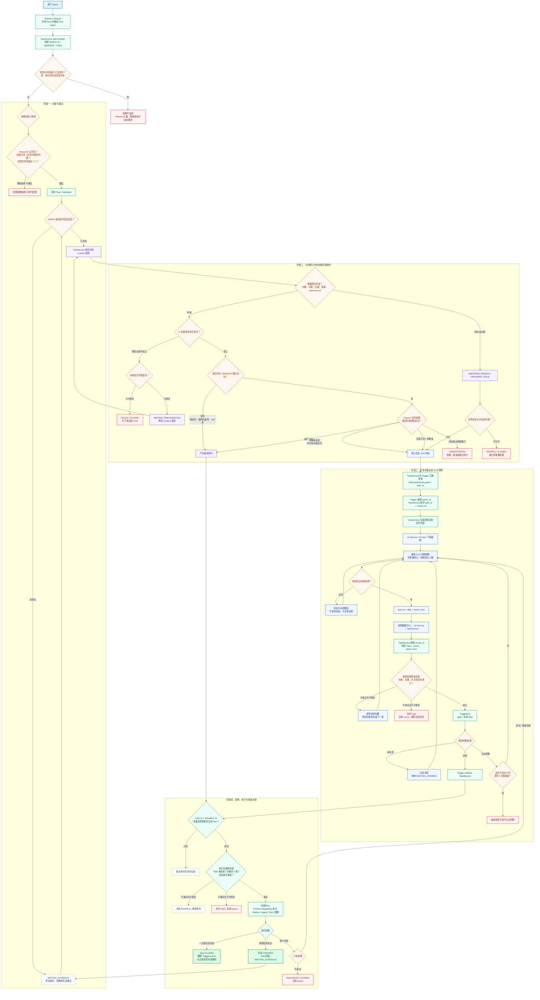

# 云端触发器：已有状态优先、动态观察兜底

```mermaid
flowchart TD
    U["用户 Query"] --> P["Planner / Director<br/>识别 Task 并路由 Task Agent"]
    P --> SB["TaskService Spec Builder<br/>拆解 WHEN / IF / OBSERVE / THEN"]
    SB --> TW{"是否为时间窗口汇总任务？<br/>如：每分钟总结宝宝状态"}
    TW -- "是" --> UNS["本期不支持<br/>Planner 拦截、降级或拆分后续需求"]
    TW -- "否" --> CREATE{"创建前能力校验"}

    subgraph S1["阶段一：创建与激活"]
        direction TB
        CREATE --> C1{"AlwaysOn 已开启？<br/>位置可见？目标可视觉判断？<br/>动态任务未超过 3 个？"}
        C1 -- "硬性条件不满足" --> REJECT["拒绝创建或提示用户处理"]
        C1 -- "通过" --> SAVE["保存 Task / TaskSpec"]
        SAVE --> WHEN{"WHEN 激活条件是否到达？"}
        WHEN -- "未到达" --> WAIT_S["WAITING_SCHEDULE<br/>等待延时、周期或外部激活"]
        WAIT_S --> WHEN
        WHEN -- "已到达" --> QUERY["TaskService 查询当前 Context 快照"]
    end

    subgraph S2["阶段二：先判断已有状态和前置条件"]
        direction TB
        QUERY --> VALID{"数据是否有效？<br/>车辆、对象、位置、来源、observed_at"}
        VALID -- "缺失或过期" --> UNKNOWN["UNKNOWN_MISSING / UNKNOWN_STALE"]
        VALID -- "有效" --> PRE{"IF 前置条件是否成立？"}

        PRE -- "硬性前提不成立" --> REC{"未来是否可能恢复？"}
        REC -- "不可恢复" --> CLOSE_F["FAILED / CLOSED<br/>不下发动态 VLM"]
        REC -- "可恢复" --> WAIT_P["WAITING_PRECONDITION<br/>等待 Context 更新"]
        WAIT_P --> QUERY

        PRE -- "成立" --> NEED_O{"是否存在 OBSERVE 感知目标？"}
        NEED_O -- "没有<br/>纯定时、结构化条件、GUI 等" --> DIRECT["产生候选命中"]
        NEED_O -- "有" --> CMATCH{"Context 当前结果<br/>能否判断感知目标？"}

        CMATCH -- "明确达成" --> DIRECT
        CMATCH -- "明确未达成<br/>但状态可能变化" --> FALLBACK["进入动态 VLM 兜底"]
        CMATCH -- "信息不足 / 未覆盖" --> FALLBACK
        CMATCH -- "目标超出视觉能力" --> UNSUPPORTED["UNSUPPORTED<br/>拒绝、结束或提示用户"]
        UNKNOWN --> NEED_F{"任务是否允许动态兜底？"}
        NEED_F -- "不允许" --> SKIP["SKIPPED / CLOSED<br/>按任务策略处理"]
        NEED_F -- "允许" --> FALLBACK
    end

    subgraph S3["阶段三：任务专属动态 VLM 观察"]
        direction TB
        FALLBACK --> REG["TaskService 向 Trigger 注册场景<br/>InferenceParams.goal + task_id"]
        REG --> SID["Trigger 返回 scene_id<br/>TaskService 保存 task_id ↔ scene_id"]
        SID --> LIST["TaskService 生成完整动态任务列表"]
        LIST --> AIS_D["AI Service / Frontier 下发端侧"]
        AIS_D --> VLM["端侧 VLM 周期观察<br/>可能被抢占、缺轮或无上报"]
        VLM --> HAS{"本轮是否有新结果？"}
        HAS -- "没有" --> NO_DATA["本轮为未观察到<br/>不是未达成，不复用旧轮"]
        NO_DATA --> VLM
        HAS -- "有" --> REPORT["task_id + data + report_time"]
        REPORT --> AIS_U["端侧数据中心 → AI Service → TaskService"]
        AIS_U --> MAP["TaskService 映射 scene_id<br/>校验 Task、scene、report_time"]
        MAP --> RECHECK_S{"重新检查静态前提<br/>对象、位置、开关是否仍成立？"}
        RECHECK_S -- "不成立但可恢复" --> WAIT_DP["暂停本轮判断<br/>等待前提恢复或下一轮"]
        WAIT_DP --> VLM
        RECHECK_S -- "不成立且不可恢复" --> CANCEL_D["关闭 Task<br/>注销 scene、移除动态任务"]
        RECHECK_S -- "成立" --> TR["TriggerRun<br/>goal + 本轮 data"]
        TR --> MODEL{"模型判断结果"}
        MODEL -- "未达成" --> UNMATCH["记录本轮<br/>继续 WAITING_DYNAMIC"]
        UNMATCH --> VLM
        MODEL -- "无法判断" --> CANT{"达到产品定义的<br/>超时 / 次数阈值？"}
        CANT -- "否" --> VLM
        CANT -- "是" --> END_U["结束或提示用户无法判断"]
        MODEL -- "达成" --> CALLBACK["Trigger callback TaskService"]
    end

    subgraph S4["阶段四：幂等、执行与场景失效"]
        direction TB
        DIRECT --> IDEM{"task_id + activation_id<br/>本激活周期是否已有 Run？"}
        CALLBACK --> IDEM
        IDEM -- "已有" --> DUP["重复命中丢弃并记录"]
        IDEM -- "没有" --> PRE_EXEC{"执行前最终复检<br/>Task 未取消？对象仍一致？安全条件满足？"}
        PRE_EXEC -- "不满足但可恢复" --> SKIPPED["本轮 SKIPPED / 继续等待"]
        PRE_EXEC -- "不满足且不可恢复" --> CLOSE_E["关闭 Task / 注销 scene"]
        PRE_EXEC -- "满足" --> RUN["创建 Run<br/>Runtime Dispatcher 执行 Planner / Agent / Tool / 提醒"]
        RUN --> RESULT{"执行结果"}
        RESULT -- "一次性任务成功" --> SUCCESS["Task CLOSED<br/>删除 Trigger scene<br/>从动态任务列表移除"]
        RESULT -- "周期任务成功" --> NEXT["本轮 FINISHED<br/>Task 回到 WAITING_SCHEDULE"]
        NEXT --> WAIT_S
        RESULT -- "执行失败" --> RETRY{"产品策略"}
        RETRY -- "重试 / 保留场景" --> VLM
        RETRY -- "不重试" --> CLOSE_R["Task FAILED / CLOSED<br/>注销 scene"]
    end

    classDef user fill:#e0f2fe,stroke:#0284c7,color:#0c4a6e,stroke-width:2px;
    classDef task fill:#ecfdf5,stroke:#059669,color:#064e3b,stroke-width:1.5px;
    classDef decision fill:#fff7ed,stroke:#ea580c,color:#7c2d12,stroke-width:1.5px;
    classDef context fill:#f5f3ff,stroke:#7c3aed,color:#4c1d95,stroke-width:1.5px;
    classDef dynamic fill:#eff6ff,stroke:#2563eb,color:#1e3a8a,stroke-width:1.5px;
    classDef success fill:#dcfce7,stroke:#16a34a,color:#14532d,stroke-width:2px;
    classDef error fill:#fef2f2,stroke:#dc2626,color:#7f1d1d,stroke-width:1.5px;
    classDef wait fill:#f8fafc,stroke:#64748b,color:#334155,stroke-dasharray:5 3;

    class U user;
    class P,SB,SAVE,REG,SID,LIST,MAP,TR,CALLBACK,IDEM,PRE_EXEC,RUN,RESULT task;
    class TW,CREATE,C1,WHEN,VALID,PRE,REC,NEED_O,CMATCH,NEED_F,HAS,RECHECK_S,MODEL,CANT,RETRY decision;
    class QUERY,UNKNOWN,DIRECT,WAIT_P context;
    class FALLBACK,AIS_D,VLM,REPORT,AIS_U,NO_DATA,WAIT_DP,UNMATCH dynamic;
    class SUCCESS,NEXT success;
    class UNS,REJECT,CLOSE_F,UNSUPPORTED,SKIP,CANCEL_D,END_U,CLOSE_E,CLOSE_R error;
    class WAIT_S,SKIPPED,DUP wait;
```

## 一句话阅读顺序

`WHEN 激活 → Context/IF 先判断 → 已有状态足够则直接命中 → 不足才进入动态 VLM → 动态命中后幂等与执行前复检 → 执行成功后由 TaskService 关闭场景。`
